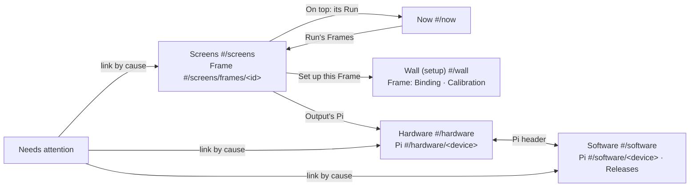

# Console: cut by feature domain, not by box

**Layer:** system · **module (this page)** · feature: domains, sections, pages, rows, reads.
**Asked of the owner:** agree the domain table and the sidebar it gives; answer Q1–Q3.

## Today
One page per Pi stacks every domain; the Wall holds a Frame's setup and live state; Now repeats
per-Frame health and Why; one Frame health label mixes "needs calibration" with "Player app silent".

## Requirements (binding)
| # | Rule | Source |
|---|---|---|
| R1 | "organized by the conceptual layers/domains and each includes all of the relevant hardware" | owner 2026-10-08 |
| R2 | "software and apps go together. Hardware and connection go together. Screens is related to show runs. And there probably needs to be other screens for show creation." | owner 2026-10-09 |
| R3 | Picking one Pi is a focus filter; "There are inevitably some per-pi specific detail pages as you drill down" | owner 2026-10-09 |
| R4 | New, not-enrolled and not-driving-a-Frame Pis live with connection (Hardware), not on their own page | owner 2026-10-09 |
| R5 | Every domain aspect has one UI home; equipment state stays apart from authored content; V2 only, no old page kept beside the new | owner memory |
| R6 | Frames are persistent locations; Players and Panels are replaceable equipment | AGENTS.md |

**Steer (not a requirement), owner 2026-10-09:** "Consider the feature domains. Frames are a
calibration concern in one flow AND a runtime surface in another perspective".

### New terms
| Term | Meaning |
|---|---|
| **Screens** | The live face of every Frame: what its Panel, driven by one Output of one Pi, is presenting now, and why. A Frame is the location, a Panel the display hardware there, an Output the Pi's HDMI port |
| **Hardware** | Fleet page: each Pi's health and its link to Central (the owner's "hardware and connection") |
| **Software** | Fleet page: what each Pi boots and runs, and the releases behind it |
| **Setup state** | A Frame's bring-up facts: To finish (placed, bound, calibrated) and its Panel at last enrollment |
| **Live health** | A Frame's runtime judgement: Player app liveness, Output interruption, readiness, what Display Host reports |
| **Pi header** | A small header shared by a Pi's two pages: name, serial (claimed), standing, links to its other pages. Not a page |

## The domain table

Each domain is a bounded context; a Frame or Pi in several shows only each domain's own facts (a projection, not a second home). The sidebar is this table.

| Domain | The one question | Projects | Facts it owns | Actions it owns |
|---|---|---|---|---|
| **Wall setup** | Is every Frame placed, bound to an Output and calibrated? | Frame, Output (bind candidate), Panel | placement, Binding, calibration, Frame profile, setup state, free Outputs | Edit layout, Bind, Unbind, Identify Panel, Calibrate, Diagnostics (reserved) |
| **Screens** | What is each Frame presenting now, and why? | Frame (live), its Output | live health, the Run on top, Why, Why nothing new, what Display Host reports | none |
| **Now** | Which Runs are active, and is media flowing? | Run | Runs and Activations, media pipeline | Show now, finish and cancel a Run |
| **Show creating** | What will the show be? | Scene, Program, Source, Frame (target) | Scenes, Programs, Sources | create, edit, delete |
| **Hardware** | Is every Pi powered, healthy and linked? | Pi | host samples and facts, Node API link, Host Management sessions, standing, reboot history | Reboot, Retire |
| **Software** | Is every Pi running the selected release, and did the last change take? | Pi, Release | boot offer and steps, base, kernel, Player app enrollment and last report, app process and operations, qualification, boot selection, effect gate | Stage app, Qualified fallback, Select, Update the wall |
| **Needs attention** | What lost something it had? | links only | none | none |

**Sidebar:** Show: running (Screens, Now) · Show: creating (Scenes, Schedule, Sources) · Wall · Fleet (Hardware, Software) · Needs attention.
**Landing:** with no Frame, the Wall's first step (Guidance, **Add first frame**), replacing DDD
§48's rule; once a Frame exists, Q1 decides.

> **Q1 · Which page opens first.** Live state moves off the Wall, so Screens is now the morning
> check. **Recommended: open on Screens** (once a Frame exists); the Wall becomes the page you
> visit to add, bind or calibrate. Cost: today's "always the Wall" landing and its morning check
> (J2) change. **Alternative: open on the Wall** (setup only). Cost: the first page shows nothing live.

> **Q3 · Other pages for creating a show.** You said "there probably needs to be other screens for
> show creation". This change keeps Scenes, Schedule and Sources as they are.
> **Recommended: defer to its own design pass** once you name what is missing when you create a
> show today. Cost: creation gaps wait. **Alternative: name them now** and this design takes them
> in. Cost: this change grows past the Fleet and Frame work.

## Design rules (design choices)

| Rule | Check |
|---|---|
| **H1. A fact is judged, explained and acted on only in its owning domain.** Anywhere else it appears only as a read-only link naming it, never re-judged or explained | Each judging model (live health, setup state, host classifier) is imported by one domain's pages; others import only its link |
| **H2. Focus lives only in the address,** on the lists that project a Pi (Screens, Hardware, Software, Needs attention), carried among them, ended by leaving them | No focus state outside the route |
| **H3. Display split** (ux doc R4): Screens and Now only read what a Panel presents; every write that changes a Panel is Wall setup | The R4 import test covers Screens |

## Screens and Now: Frame-keyed against Run-keyed

**Screens** `#/screens`: the plan drawn read-only (layout is a Wall fact shown as a link), each
tile with its live health and On top; a table beneath, **one row per Frame with an Output**.

| Columns (representative) | Actions | Read |
|---|---|---|
| Frame · On top (link to its Run on Now) · Output (Pi · HDMI-1; link to Hardware) · Presented (Display Host's latest: presented to the compositor, withdrawn, invalidated, unknown) · Live health and readiness | none (H3) | snapshot + fleet presentation read (new) |

Frames still setting up show as one line, "3 Frames still setting up", linking to the Wall's To
finish. **Frame page** `#/screens/frames/<id>`: On top, Why, Why nothing new, readiness, live
health, the Output's Display Host detail, "Panel pixels: unknown", a host chip (→ Hardware) and
"Set up this Frame" (→ Wall). `#/screens?pi=` narrows to that Pi's Frames.
**Now** `#/now` keeps Runs, Show now and the media pipeline; each Run lists its Frames as links to
Screens. Now no longer shows Frame badges, readiness or per-Frame Why.

**Frame health splits by context** (DDD §54 already cuts To finish this way):

| | Live health (Screens) | Setup state (Wall) |
|---|---|---|
| Judges | Player app liveness, Output interruption, readiness, Display Host's report | not placed, not bound, needs calibration, Panel at last enrollment |
| Shown on | Screens tiles and rows, Frame page, Needs attention | Wall tiles, To finish, Binding facet |
| Links to | the cause's owner (Software for an app, Hardware for a host) | the facet that finishes it |

Display Host's current report (new read) replaces the stale "No Panel listed at enrollment" alarm.

## Wall setup

Today's Wall minus live state: the plan with setup state per tile, **To finish**, Edit layout, and
the Frame's **Binding** (Panel at last enrollment; candidates = every free Output, with its Panel
and Identify Panel; Diagnostics reserved) and **Calibration**. Free Outputs' one home is Binding's
candidate list; a Pi with only free Outputs is listed on Hardware as Not driving a Frame (R4).

> **Q2 · Binding from the Pi side.** Today you can bind a free Output from the Player page as
> well as from the Frame's Binding, and unbind all of a Pi's Outputs there. **Recommended: bind
> and unbind only from the Frame** (Hardware links there). Cost: binding a new Pi takes one more
> click; retiring a Pi bound to two Frames takes two unbinds. **Alternative: also from the Pi's
> Hardware page,** through the same writes (DDD rule 1 allows both sides). Cost: two places to look.

## Fleet: two projections of one Pi

| | **Hardware** `#/hardware` | **Software** `#/software` |
|---|---|---|
| Rows | One Pi; driving a Frame (worst first), **Not driving a Frame** (Unbound, seen at boot; R4), Retired | One Pi that has booted; those not offered the selected release first |
| Columns | Player · Standing · Link (Node API link, Host Management last reported) · Temperature, throttling · CPU, `/run` storage · Network | Player · Base (reported vs Central's offer) · Kernel, boot step · Player app (enrolled, last reported) · Latest app change · App Manager preparation |
| Per-Pi page | Reboot; Health; Link and sessions; reboot history; Retire (a Bound Pi lists its Frames, each linking to Binding) | Enrollment; Boot (session's boot, offer, deprecated-path line, steps); app process; operations; Stage app; Qualified fallback |
| Fleet-wide | none | **Releases** `#/software/releases`: selection, deployments, catalog, effect gate, Update the wall |

## Placement of today's sections

| Today | New home |
|---|---|
| Wall: live tiles, Frame › Status, Inspector readiness notice | Screens and its Frame page |
| Wall: plan, To finish, Edit layout, Binding, Calibration | Wall setup (tiles show setup state) |
| Now: Frame badges and readiness (`FrameHealthBadges.jsx`); per-Frame Why, Why nothing new (`RunsRegion.jsx` `WhyFrame`) | Screens; its Frame page |
| Now: Runs, Show now, media pipeline | Now |
| Players table: host columns, Standing, Not driving a Frame · Software column, App Manager refusal · Frame chips | Hardware · Software · Screens |
| Player page: name, serial, identifiers, standing · Reboot, Node API link, Health, L0, Retire · Enrollment, L1, L2, Boot, App | Pi header · Hardware Pi page · Software Pi page |
| Layers L1.5 (Display Host), Outputs: Binding fact, interruption, readiness | Screens |
| Outputs: Panel at enrollment, Bind, Identify; Unbind all; Diagnostics | Wall Binding |
| Releases, Update the wall | `#/software/releases…` |
| `PlayerPage.jsx`, `PlayersPage.jsx`, `#/players`, `#/releases`, `…/status`, aliases | Deleted |

## Reads

Every fact is served once. The **fleet host read** already serves the offer's base, the boot
steps and App Manager's preparation (`node_observations.py:245-271`); the shell mounts it for the
strip. Under DDD R9 this page's approval is the backend gate for the three changes below.

| Page | Served by | Change |
|---|---|---|
| Hardware | snapshot, `/netboot`, fleet host read | **widen the fleet host read:** per Pi, whether Central's hub holds its link, and since when |
| Software | snapshot, fleet host read | **widen the fleet host read:** per Pi, the app it runs and its latest app operation's state |
| Screens, Frame page | snapshot | **new fleet presentation read:** per Output on its Pi's current boot, Display Host's newest report |
| Per-Pi pages, Releases, Wall, Now, creating | existing reads | none |

**Alternative:** one read per domain. Cost: the shell then mounts two reads to keep its incidents.

## Docs to rewrite

| Doc | Sections |
|---|---|
| `docs/operator-console-ddd.md` | §3, §4 and its Q1 = A, §5 rule 1 (becomes H1), §6, §9, §15, §19 (Panel alarm), §25, §25a, §34, §48 (tree, landing), §50–§57, §61; one new Part holding the domain table |
| `docs/operator-console-ux-design.md` | §2 diagram and rule R1, Part E and G notes, §3 glossary, §4a Frame health, §5 J1 J3 J4, §8a (Wall-first becomes setup-first) |
| `docs/runbook.md` | console routes; Wall and To finish; Frame health labels; Players and Player page; host health; Stage app; bind and Identify; Node API link |

## Costs

- A Frame has two pages (setup, live) and a Pi has two (Hardware, Software); under H1 each shows
  the other only as a link, so "why is Frame X dark" can take Screens → Hardware → Software.
- The landing, the Wall's daily face and Now's Frame regions move; the plan is drawn twice; every
  fleet route, the Status route and their tests move, with no aliases.
- Frame health splits in two; the stale no-Panel alarm becomes a setup fact (live: Display Host).
- Three backend read changes; binding a new Pi may take one more click (Q2).

## What happens next

**E1 · Fleet by domain** (existing reads plus the widened fleet host read; needs no Q1).
Until E2 the old Player page keeps only its Outputs and Display Host sections.

- U1 tracer: Hardware list, Pi page, Pi header, focus · U2 widen the fleet host read (link; app
  and latest operation) · U3 Software list, Pi page, Releases and Update the wall under it ·
  U4 Pi links by cause (Needs attention, host chip, Binding candidates); Fleet docs.

**E2 · Frame live face** (needs Q1, Q2). Tracer: Screens and its Frame page on the snapshot alone.

- U1 tracer: Screens table and Frame page (Status, Why, Why nothing new moved) · U2 new fleet
  presentation read · U3 split Frame health; Wall setup-only; Now Run-keyed · U4 landing, sidebar
  groups, Frame links by cause; delete the old pages and routes; docs.

## Parked for the code architects

- Inspector splits (Wall setup, Screens Frame page); `Plan.jsx` drawn by both; `facetFor` → link by
  cause; `frameHealth` (`health.js:183-232`) → two models; `classifyHost` items carry a group.
- Update the wall's per-Pi polling (`UpdateWallPage.jsx:143`, `:168`) → the fleet host read;
  unused V1 routes `/v1/operator/fleet*` (`central/fleet/routes.py:108`) remain.

_History: rev 1–4, 2026-10-09 (two reviews, the feature-domain steer)._
