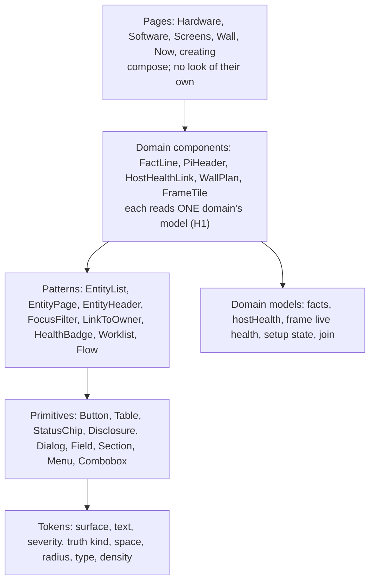
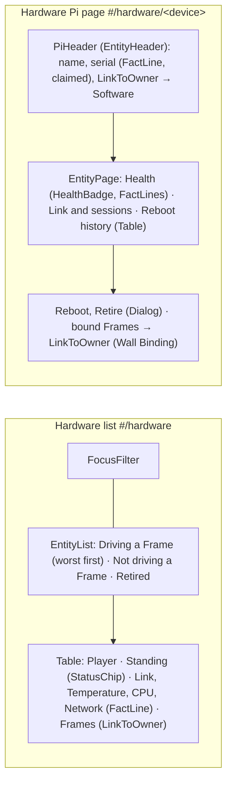

# Console design system: a design language and a catalog, pages as compositions

**Layer:** **system (this page)** · module: each catalog member's contract · feature: props, CSS.
**Asked of the owner:** agree the five layers, the catalog and the migration; answer Q1 (the kit) and Q2 (the look).

## Today
A 2,620-line stylesheet whose classes are named for pages (`player__`, `roster__`, `facet__`: a third of ~580 uses), and
unlayered element rules (`index.css:121` `:where(button)`) that style every button. Severity is typed four times in two
vocabularies (`health.js`, `mediaHealth.js`, `showState.js` vs `hostHealth.js`). Bundle: 158 KB JS + 7 KB CSS gzip.

## Requirements (binding)
| # | Rule | Source |
|---|---|---|
| R1 | "focusing on a design language and building a catalog of react primitives rather than hard coding specific pages" | owner 2026-10-09 |
| R2 | "As new capabilities are added to the hardware and to Central, we will need to constantly re-evaluate how pieces are laid out" | owner 2026-10-09 |
| R3 | The approved Console by Domain IA (`design.md`, H1–H3; answers Q1 Screens, Q2 defer, Q3 bind from the Frame) | owner 2026-10-09 |
| R4 | No backwards compatibility, no dual paths; the PR is the gate | `~/.claude/CLAUDE.md` |
| R5 | No CI leg over about 4 min | owner memory |
| R6 | The bundle stays legal under Central's CSP (`script-src 'self'`; `style-src 'self' 'unsafe-inline'`) | `vite.config.js` |

**Steer (not a requirement):** "find a strong design library (tailwind? Bootstrap?)".

| New term | Meaning |
|---|---|
| **Design token** | A named value (a colour's meaning, a space step, a radius); the only place a raw value lives |
| **Primitive** | A component that knows no Photo Wall concept: Button, Table, Dialog |
| **Pattern** | A layout of primitives for a recurring job (a grouped list, a detail page), fed plain data and links |
| **Domain component** | A piece that renders one domain's model through patterns: a fact, a Pi's header, the wall plan |
| **Catalog** | Every primitive, pattern and domain component, shown in each of its states (a **story**), browsable and tested |

## The proposed shape: five layers, imports point down only (prior art: Feature-Sliced Design)

The design language is a small vocabulary; patterns take only these, and domain components translate their model into it:
```ts
type Severity =            // the ONE severity scale (replaces the four typedefs)
  | "ok"
  | "todo"                 // work to finish, not a fault
  | "notice"
  | "alarm"                // lost something it had
  | "unknown";             // not read, not served

interface Verdict {        // what a domain component hands HealthBadge
  severity: Severity;
  label: string;           // the model's words; patterns never re-judge (H1)
  receipt: string | null;  // "last reported 3 s ago", already worded
}

interface OwnerLink {      // LinkToOwner: a fact outside its home is only this
  text: string;            // "pi-07 · throttled now"
  href: string;            // already formatted; patterns never import routes.js
  severity: Severity;
}
```
`TruthKind` is the six kinds of `facts.js`, each a tone token; the wording stays in `facts.js`.
**Types (current choice):** the catalog layers are TypeScript, as shadcn emits, checked by `tsc --noEmit` in the static
tier; a page becomes TypeScript when its group moves. Alternative: JSDoc + `checkJs`. Cost: weaker checks, no renames.

## Design rules (design choices), at their real strength
| Rule | Enforced by | Strength |
|---|---|---|
| **S1. Imports point down.** Primitives and patterns import no console model (`facts`, `health`, `hostHealth`, `join`, `players`, `routes`); a domain component imports one domain's | the esbuild import-graph test (`test_console_routes_r4.py`) gains the layer table | test |
| **S2. Only primitives and patterns style.** Pages and domain components write no `className` or `style` (WallPlan's geometry is SVG attributes) | a lint over JSX attributes (ESLint; the repo has none today) | lint |
| **S3. Colour means something, or it doesn't exist.** Only semantic tokens | the theme clears the default palette (a `bg-red-500` is then *silently dropped*, not an error) **plus** a class lint: unknown classes and arbitrary values (`bg-[#f00]`, `text-[red]`) fail, e.g. `eslint-plugin-better-tailwindcss` `no-unknown-classes`, `no-restricted-classes` | lint |

## The kit, designed twice
Both shapes are the same owned code: Tailwind 4.3 + shadcn/ui components copied into the repo, TanStack Table 9.2 for rows.

| | **shadcn on Base UI 1.9 (recommended)** | shadcn on React Aria Components 1.22 |
|---|---|---|
| Dense tables | native `<table>` + TanStack: sort, group, worst first; sticky by CSS | its own Table (sort, resize, keyboard grid, virtualized; no grouping), or TanStack as left |
| Accessibility | WAI-ARIA patterns for dialog, menu, combobox, tabs | best tested (Adobe, across screen readers), press and touch handling |
| shadcn coverage | the default base since Jul 2026: every registry component and block | a first-class base since 17 Jul 2026; newer, fewer blocks |
| Bundle | smaller per widget | heavier per widget |
| React, tokens, CSP | React 18 or 19; `@theme` tokens; static CSS | same |

**Recommended: Base UI.** Our few widgets follow the same WAI-ARIA patterns in both, tables come from TanStack either way, and React
Aria leads in widgets we don't have. Cost: its stronger tested accessibility; shadcn keeps both bases, so a component can switch later.

| Other kits | Tables | Accessibility | Who owns the code | Bundle | Health, React | From the hand CSS |
|---|---|---|---|---|---|---|
| Mantine 9.7 | markup only; mantine-react-table's stable peers Mantine ^6 | good | vendor | ~30 KB+ CSS | active; React 19.2+ | medium; its look |
| MUI 9.5 | DataGrid; row grouping is paid (Premium) | good | vendor | largest (Emotion runtime) | active | high: Material look |
| React-Bootstrap 2.10 | styled markup | fair: no combobox | vendor CSS | ~25 KB CSS | patch-only; Bootstrap 6 "not soon" | medium; Sass |

> **Q1 · Which kit the console's look is built on.** **Recommended: Tailwind + shadcn/ui** (our own components on an
> accessible base). Cost: more of our own code to keep; React 19 first. **Alternative: Mantine**, the most built in
> (tables, forms, dates, a ready dark theme). Cost: its look and upgrade schedule are the vendor's; React 19.2 first.
> **Alternative: Bootstrap**, which you named and many know. Cost: weakest for dense tables and keyboard widgets.

## The catalog: members and where they come from
| Layer | Members (examples) | From today's code (evidence only) |
|---|---|---|
| Tokens | surface, text, severity ×5, truth kind ×6, accent and focus, space, radius, type (Console Sans), row density | `index.css` `:root` + light block; `test_console_look.py` contrast pairs |
| Primitives | Button, Table, StatusChip, Disclosure, Dialog, Field + ProblemSummary, Section (error boundary), Menu, Combobox | `ConfirmAction.jsx`'s in-flight rules; `Field.jsx`; `<details>` in 7 files; `card__chip`; `SectionBoundary.jsx`; `TagCombobox.jsx` |
| Patterns | EntityList (groups, worst first, empty state), EntityPage, EntityHeader, FocusFilter, LinkToOwner, HealthBadge, Worklist, Guidance, Flow | `PlayersPage.jsx` grouping; `PlayerPage.jsx`; `AttentionList.jsx`, `WallUnfinished.jsx`; `Guidance.jsx`; `flow/Stepper.jsx` |
| Domain components | FactLine, PiHeader, HostHealthLink, WallPlan, FrameTile, ConfirmRetire / ConfirmUnbind | `FactLine.jsx` (→ `facts.js` → `health.js`); `HostChip.jsx` (`hostHealth`, `players`, `routes`); `Plan.jsx` (`frameHealth`, `plannedFor`, `projection`); `ConfirmAction.jsx`'s request builders |

> **Q2 · The console's look.** Today's look (dark first, Console Sans, rounded cards) is re-expressed from the photo
> library's theme. **Recommended: keep it**; tokens carry it over and the work changes structure, not appearance; later a
> new look is mostly a token change. Cost: no visual refresh now. **Alternative: a new visual direction** (e.g. denser,
> like Linear or Grafana). Cost: a look-and-feel pass with your reference examples before the tracer.

**Pages as compositions** (Hardware, from `design.md` § Fleet):


## Browsing and testing the catalog, designed twice
Storybook 10.6 is the browser in both shapes (Vite 5 is enough for it); stories are states, behaviour stays in journey tests.

| | **pytest walks Storybook's static build (recommended)** | Vitest browser mode runs the stories |
|---|---|---|
| Runner | the existing `tests/browser` tier: one runner, Playwright pinned once (`pyproject.toml`, 1.62.0), its CI skip and evidence rules | a second runner; Playwright pinned in npm too |
| Per story, both schemes | renders; axe-core injected passes; screenshot diffed (Pillow, already a dependency) | renders; axe addon; `toMatchScreenshot` built in |
| Upgrades forced | none | Vitest 4/5 need Vite ≥ 6.4 (today ^5.4, plugin-react 4.3 ≤ 6); Vite 8 needs Node ≥ 20.19 |
| Ours to write | a story walker and a pixel diff (small) | config only |

**Recommended: pytest walks the build,** in its own `console-catalog` leg in the pinned container. The leg time is
**unmeasured**; the tracer measures it and shards by layer before 4 min (R5). **Recommended as shown:** the catalog is
browsed on the project's GitHub Pages (the repo is public), built from `main`; a PR shows its screenshot diffs in CI.

## Migration: by layer for the look, by page group for composition
| Stage | What changes | True after it |
|---|---|---|
| DS0 | the token file becomes the only token source; `index.css` moves into a cascade layer beneath Tailwind's utilities; the catalog loads the app's one stylesheet entry | a member looks the same in the catalog and in the app |
| DS2 | primitives replace the global element rules (button, input, link, table, details, dialog) everywhere, in one sweep | no element is styled two ways |
| DS3+ | each page group moves whole to domain components and patterns; its old CSS is deleted in the same bead | no page in two styles, no flag, no alias (R4) |

**End condition:** `index.css` and its layer are gone, Tailwind's reset is on, and the S2/S3 lints run with no exception list. New pages (E1, E2) are built from the catalog; the old Players pages are deleted by E1 and E2, so nothing moves twice.

## Costs
- React 18 → 19.3 first (shadcn assumes refs as props). Not forced, but blocking any later Vite/Vitest move: `node:20` (EOL April 2026) builds the console, local Node is v16.
- We own ~20–30 copied component files and merge upstream fixes by hand; ESLint and `tsc` join the static tier.
- Every page's markup is rewritten (token values carry over); old and new styling, JS and TypeScript, coexist until the end condition.
- Screenshot baselines are regenerated when the reset lands; browser tests that use class names move to roles.
- Our own story walker and pixel diff instead of Vitest's built-ins.

**Deferred:** whole-page screenshots; a density toggle. **Not planned:** publishing the catalog as an npm package.

## What happens next
**Tracer (DS0 + DS1, landing as E1 U1):** the token file, the legacy layer, Storybook, the `console-catalog` leg, the
lints, and the members the Hardware pages need, then the Hardware list and Pi page composed only from them. **Proves:** S1–S3
hold; the leg's time (measured); contrast in both schemes; the role and text tests port. **Non-goals:** other pages, the reset.

**DS · Console design system**
  - DS0 Foundation: React 19.3; Tailwind 4.3; token file; shadcn on Base UI; Storybook; catalog leg; S1–S3 checks; `tsc`
  - DS1 (E1 U1) the Hardware members (diagram above), with stories; the Hardware list and Pi page
  - DS2 Primitives sweep: global element rules replaced everywhere and deleted
  - DS3 (E1 U3) Software list, Pi page and Releases; DS4 (E2) Screens, Frame page, WallPlan
  - DS5 Sweep, a bead per group (Wall setup · Now · Show creating · Needs attention, sign-in, shell); the last turns on the reset and meets the end condition; docs

## Reconcile with existing code
| Today | Becomes | Cost |
|---|---|---|
| `ConfirmAction.jsx` | the Dialog primitive (in-flight rules) + per-domain confirm components (request builders) | the module splits |
| `HostChip.jsx`, `Plan.jsx` | HostHealthLink, WallPlan (domain components) | `Plan.jsx`'s 588 lines split by S2 |
| `test_console_routes_r4.py`, `test_console_look.py` | the graph gains the layer table; contrast reads the token file | `SHARED_WITH_SHOW` names files that move |

## For the code architects (parked)
- Base UI dialog vs native `<dialog>`: keep the Escape-in-flight guarantee (`closedby`). The Severity merge (`notice`, `todo`) per model; the cascade-layer order and the reset; story data from fixtures only.

_Sources (2026-10-09; versions from `npm view`): [Tailwind 4.2 notes](https://infoq.com/news/2026/04/tailwind-css-4-2-webpack) · [shadcn on Base UI](https://blog.openreplay.com/shadcn-ui-radix-base-ui-switch/) · [React Aria](https://react-aria.adobe.com/releases/) · [Mantine 9](https://github.com/orgs/mantinedev/discussions/8678) · [MUI v9](https://mui.com/blog/introducing-mui-v9/) · [TanStack Table v9](https://tanstack.com/blog/announcing-tanstack-table-v9) · [Vitest 4](https://voidzero.dev/posts/announcing-vitest-4) · [better-tailwindcss](https://github.com/schoero/eslint-plugin-better-tailwindcss)._ _History: rev 1, rev 2 after one review, 2026-10-09._
