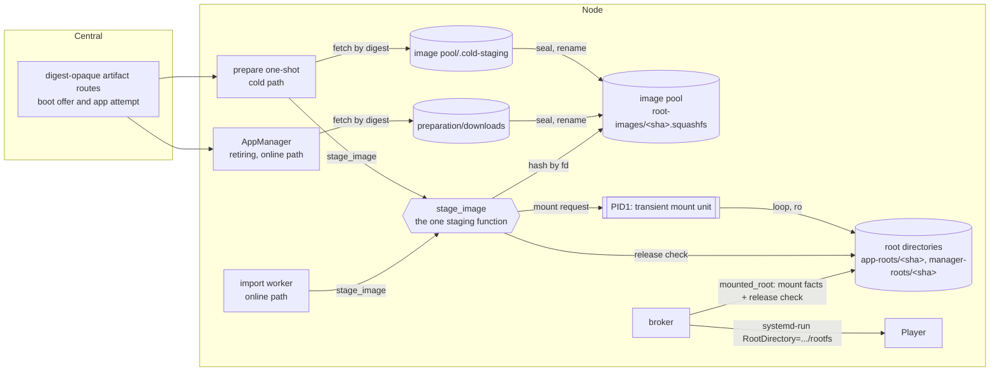

# Run brief: E2c, release roots as read-only images mounted in place

**Design of record:** decision 0017 (`docs/decisions/0017-node-redesign-r3.md`); design-r3 §2.4 and §5.2 (`/Volumes/Dock/tmp/node-redesign/design-r3.md`); epic row E2c and contradictions C1–C3, C7 (`/Volumes/Dock/tmp/node-redesign/e2e3-epics.md` §2, §4); wave-1 re-cuts W1 and W3 (`.claude/runs/wave1-node-api.md` §0, §7).
**Base:** `origin/main` at e5c7772 (PR 49 merged; E2a, E2b, E3a–E3e landed). Pipeline 37859581708 on e5c7772: every job green, all six node-pid1 legs included.
**Branch:** `claude/e2c-image-mount`, checkout `/Volumes/Dock/Home/Code/photo-wall/.claude/worktrees/pr-49-next-steps-b71722`. One milestone (E2c), four beads, landed in order.
**Rules:** `~/.claude/skills/implementation-workflow/SKILL.md` (binding). Owner rules: UX over security; a finding is a defect only in normal operation or when the Node cannot recover by itself; integration tests of functional requirements; make the failure class impossible; retiring code (`appliance/node/`) gains no new code; 4 GB Pi 5 supported; no CI leg over about 4 minutes; never compare clocks across systems.
**Not in scope:** E4 (the next tracer); eviction of superseded images (E5 Content); EROFS; Central's cache file names; the Pi bench run (owed evidence, below).
**Owner question Q1 (§2.10): resolved 2026-10-09, "Fix it" = Recommendation R** (an owner-approved exception to "retiring code gains no new code"; it leaves with AppManager in E5).

---

## 1. The problem in plain words

Every Node boot downloads each release root as a 1.2 GB tar archive into RAM and unpacks it into RAM beside the archive. The Pi's preparation slice peaked at 2509 MiB for this, and the unpacked roots then sit in RAM for the whole boot (about 1.44 GiB). That forced the tar-era numbers in `appliance/kernel/capacity.py`: a 2560 MiB store on 4 GB and a 4 GiB preparation slice, too big for the line table to leave any content line (W3).

E2b already builds each root as a reproducible squashfs image (app 288 MiB, manager 62 MiB). E2c makes the image the shipped form and stages it **in place**: the Node fetches the image by digest, checks that digest, and PID1 mounts it read-only where the unpacked root sits today. The image's digest is the release's digest, so a matching digest proves every byte; the Node then reads only the image's small manifest to check that Central paired the image with the right reference and that the release suits this Node's measured ABI. There is no unpack, no second copy and no per-file re-hash on the Node, so the bytes held per root drop by about 4×, and the preparation cap falls from 4 GiB to the image lines plus a process line, with a check that a content line is left.

---

## 2. The frame

### 2.1 One picture



**Three rules.**
1. **One copy.** The bytes that are hashed are the bytes that are mounted: the fetched file is sealed (root-owned, read-only) and renamed into the image pool, never copied, then hashed there by descriptor and mounted from there. An incoming file whose digest the pool already holds is unlinked on every path.
2. **One staging function.** `stage_image` is the only code that writes the image pool or requests a mount. Cold and online paths call it with the same arguments, the Node's **measured** ABI included.
3. **Staged is recomputed, never recorded.** A root is staged when PID1's mount at `<root directory>/<sha>` is a read-only squashfs (the per-mount options say `ro` and its loop device is read-only) backed by `<image pool>/<sha>.squashfs`, **and** the release check passes against the measured ABI. Every use (staging fast path, cold residency, launch) recomputes it. No mark file exists; a directory's existence never counts.

### 2.2 Glossary

| Term | Definition | Counter-example (not this) |
|---|---|---|
| Image | One release root as a squashfs file; its sha256 is the release's `environment_sha256` | The sealed tar (a build intermediate after E2c, never shipped) |
| Image pool | `/run/photo-wall-node-storage/root-images/`, root-owned 0755; images `<sha>.squashfs` root:root 0444, one link | `preparation/downloads/` (AppManager's mailbox, uid 10003); a root directory |
| Root directory | `app-roots/` or `manager-roots/` under the store: the directories holding one mount point per staged root (code: `_ROOT_DIRECTORIES`, renamed from `_ROOT_POOLS`) | The image pool |
| Seal | On the incoming file, by descriptor: `fstat` checks, `fchown(0, 0)` when not already root, `fchmod(0o444)`; done **before** the file gets a pool name | A `chmod` after the rename (leaves a pool file with the wrong mode if killed in between) |
| Adopt | `os.rename` of a sealed file into the image pool | A copy, `shutil.move`, or `mv` (they fall back to copying across mounts) |
| Mount unit | A transient `.mount` unit PID1 starts for one `<root directory>/<sha>` (`systemd-mount --collect`), loop-backed, `ro,nodev,nosuid` | A mount made inside the stager's own namespace (invisible to the host, C1) |
| Read-only mount | mountinfo field 6 (the per-mount options) contains `ro` **and** the loop device's `ro` in sysfs is `1` | `findmnt` OPTIONS containing `ro` (squashfs's superblock is always `ro`, so it says `ro` even for a writable mount, §4 DR-4) |
| Release check | `verify_release`: what the image digest cannot prove. The manifest's `reference` equals the ref minus digest and size; the ref's three ABI fields equal the **measured** ABI; the two provenance files hash to the ref's values; the entry point and `usr/bin/python3` resolve, through the manifest's own inventory, to executable files. Reads only `environment.json` and two small files | `verify_root` (release check plus a walk that re-hashes every file; build side and retiring manager launch only) |
| Staged root | Rule 3 above | `app-roots/<sha>` existing as a directory (an empty mount point survives an unmount) |
| Image lines | The memory lines of the images held in the preparation slice's memcg (C2): current app, rollback app, manager | The content line |
| Store residue | Everything else on the store tmpfs: AppManager's session and `prepared.json`, debris, directories (each at least one 16 KiB page on the Pi) | An image |

### 2.3 Components and boundaries

| Component | Package (layer) | Owns | Depends on |
|---|---|---|---|
| `ImageMounter` protocol, `SystemdImageMounter` | `appliance/kernel/image_mount.py` (new; stdlib only) | Asking PID1 for a read-only loop mount; reading a mount's state (mountinfo, the loop's sysfs `ro` and `backing_file`) | `/usr/bin/systemd-mount`, `/proc/self/mountinfo`, `/sys/dev/block/<maj:min>/` |
| `verify_release`, `stage_image`, `mounted_root` | `appliance/apps/environment.py` (existing; the one edge Boot may use) | The release check; seal, adopt, hash, mount; the staged predicate | `ImageMounter` (abstraction) |
| Cold staging | `appliance/boot/node_bootstrap.py` `prepare_roots` | Which roots a boot offer needs; the download window; the measured ABI (marker files) | `DownloadPreparer` (retiring, download only), `stage_image`, `mounted_root` |
| Online staging | `appliance/apps/root_import.py` in the import worker unit | Staging a stage command's target and fallback against the measured ABI the broker hands it | `stage_image` |
| Launch check | `appliance/apps/process_linux.py` `SystemdAppProcessDriver.verify` | Refusing a launch over a root that is not staged for this Node's measured ABI | `mounted_root` |
| Line table, admission | `appliance/kernel/capacity.py` | Image lines, store residue, preparation cap, store size, content-line check | — |
| Asset producer | `scripts/build_node_components.py`, `scripts/build_node_pid1_fixture.py`, `scripts/node_release_artifacts.py` | Shipping `.squashfs`; refs carry the image digest and size; build-time determinism and line checks | `scripts/build_environment_image.py` (E2b) |

Layering is unchanged: `kernel` is the bottom layer, so `boot` and `apps` both reach the mounter without a new edge; Boot still reaches `apps` only through `apps.environment` (pyproject "Boot is an island").

**Propagation consumers.** Three sandboxed services must see mounts PID1 makes: the prepare one-shot (reads its own mount back), the import worker (same), and the **broker**, whose namespace exists before any online target is mounted. All three rely on systemd's slave propagation from a shared host `/run` (on the Pi `/` is shared; in the node-pid1 container the harness's `mount --make-rshared /run`, `tests/test_node_pid1.py:181`). The cold mounts exist before the broker starts (`photo-wall-node-prepare.service` is `Before=photo-wall-app-broker.service`).

### 2.4 State machine: one root on one boot

```mermaid
stateDiagram-v2
  [*] --> Absent
  Absent --> Refused: ref ABI differs from measured (environment_abi_mismatch, no I/O)
  Absent --> Fetching: download admitted
  Fetching --> Absent: digest or transfer failure (.partial removed)
  Fetching --> Fetched: size and sha256 match (preparer._write)
  Fetched --> Sealed: fstat by fd, fchown 0:0, fchmod 0444
  Sealed --> Pooled: os.rename into the image pool
  Sealed --> Refused: EXDEV (root_image_adopt_cross_device)
  Pooled --> Absent: fstat or re-hash refusal (pool file unlinked)
  Pooled --> Mounted: re-hash by fd passes, PID1 mount active and read back read-only
  Pooled --> Refused: mount refused, not visible, not read-only, or conflict
  Mounted --> Staged: release check passes
  Mounted --> Unpaired: release check fails (image and mount stay)
  Unpaired --> Staged: a corrected ref for the same digest
  Staged --> Staged: stage_image again (fast path: recompute the predicate; unlink any duplicate incoming)
  Staged --> [*]: shutdown (PID1 unmounts; the store is RAM)
  Refused --> [*]
```



`Staged` and `Unpaired` are not stored: each use recomputes them from the mount and the manifest. **Crash safety by construction:** a file reaches a pool name only after it is sealed, so a killed stager never leaves a pool file with the wrong owner or mode; a pool file that fails the `fstat` or re-hash step is unlinked, so a refusal there always clears on the next attempt; a mount is requested only after the re-hash passed, and the release check runs at every use, so a kill between the mount and the release check leaves nothing a launch would accept. A kill between seal and rename leaves a root-owned 0444 file under its download name, which the next `stage_image` adopts. The launch check accepts only `Staged`.

### 2.5 Data flows

```mermaid
sequenceDiagram
  participant Prep as prepare one-shot (cold)
  participant C as Central
  participant Pool as image pool
  participant P1 as PID1
  Prep->>Prep: measured ABI from the marker files; ref ABI must equal it
  Prep->>Prep: admit_cold(Σ missing image sizes)
  Prep->>C: GET boot-offers/<offer>/artifacts/app
  C-->>Prep: image bytes (digest-opaque route, unchanged)
  Prep->>Pool: write .cold-staging/app/<sha>.partial, check size+sha256, rename to <sha>
  Prep->>Pool: stage_image: seal by fd, rename to <sha>.squashfs, re-hash by fd
  Prep->>P1: systemd-mount --collect -t squashfs -o ro,nodev,nosuid,loop
  P1-->>Prep: app-roots/<sha> mounted (propagates into the sandbox)
  Prep->>Prep: read back: field 6 ro, loop ro=1, backing file = pool image
  Prep->>Prep: verify_release (manifest reference, measured ABI, entry point)
```

Online: AppManager downloads into `preparation/downloads/<sha>` (unchanged protocol, digest-checked); the broker writes the import request with the stage command **and its measured ABI** and starts the import worker; the worker calls `stage_image(preparation/downloads/<sha>, app-roots, ref, ..., measured ABI)`, which seals and adopts by rename across the one store bind, then follows the same steps. The broker launches only after the worker's result file says `roots_verified`, and its launch check is `mounted_root` with the same measured ABI (C3: no tree walk at launch).

### 2.6 Interface contracts (surfaces; frozen per bead in §5)

| Surface | Contract | Refusals (ValueError message) |
|---|---|---|
| `ImageMounter.mounted(where)` | The mount at `where`, or None; `image` is the loop's backing file; `read_only` per the glossary | — |
| `ImageMounter.mount(image, where)` | Idempotent: the same image already mounted read-only returns it; otherwise asks PID1, then reads the mount back in the caller's namespace | `image_mount_conflict`, `image_mount_failed`, `image_mount_not_visible` |
| `verify_release(directory, ref, *, base_abi, graphics_abi, plugin_abi, owner_uid=0)` | Returns `directory/rootfs`; reads only the three metadata files | `verify_root`'s existing messages for the same checks (`environment_root_ownership`, `environment_metadata_ownership_or_bound`, `environment_manifest_invalid`, `environment_reference_mismatch`, `environment_abi_mismatch`, `environment_root_invalid`, `environment_member_ownership`, `environment_provenance_mismatch`, `environment_entrypoint_missing`) |
| `stage_image(image, roots, ref, *, images, mounter, base_abi, graphics_abi, plugin_abi)` | Returns `roots/<sha>` in state Staged | `environment_abi_mismatch`, `root_image_missing`, `root_image_adopt_cross_device`, `root_image_ownership`, `root_image_digest_mismatch`, every `image_mount_*`, every `verify_release` refusal |
| `mounted_root(roots, ref, *, images, mounter, base_abi, graphics_abi, plugin_abi)` | Returns `roots/<sha>` only in state Staged; reads no image bytes beyond the release check | `root_image_not_staged` (mount facts), every `verify_release` refusal |
| Admission | Bytes are counted once (images only); store = image lines + store residue | `StorageShort(required, room)` (unchanged type and fault) |

### 2.7 Failure table

| What breaks | How it shows | Recovery | Guarantee strength |
|---|---|---|---|
| Corrupt or wrong bytes from Central or a proxy | `preparation_digest_mismatch` at download; `root_image_digest_mismatch` at adoption (pool file unlinked) | Next attempt re-fetches | Construction (hash of the bytes that are mounted) |
| A release built for another base, graphics or plugin ABI | `environment_abi_mismatch` before any download or mount, and again at every launch | Central offers a suitable release | Construction (the predicate takes the measured ABI; DR-1) |
| Central pairs an image with the wrong ref fields | Release check refusal (`environment_reference_mismatch`); image and mount stay; every launch refuses the same way | A corrected ref for the same digest stages without a download | Construction (recomputed at every use) |
| A mis-built image (tree differs from its manifest) | Caught at build only: node-components' image test runs `verify_root` over the mounted shipped image | Release fix | CI test (the Node trusts the release digest; DR-2) |
| A copy instead of a rename (two copies in RAM) | `root_image_adopt_cross_device` | Configuration fix (one bind) | Construction (os.rename only) + unit test |
| PID1 refuses the mount (no loop device, no squashfs) | Boot stage `prepare` fails with `image_mount_failed`; Health shows the fault | Reboot; class root cause is the kernel, which already loop-mounts the base squashfs in the initramfs (`appliance/netboot_init.py`) | Boot-time failure |
| Mount not propagated into a stager or the broker | `image_mount_not_visible` (stager); `root_image_not_staged` (broker) | Configuration fix | Boot-time failure |
| A writable loop or a mount without per-mount `ro` at `<root directory>/<sha>` (libmount reuses an existing loop for the same file) | `image_mount_conflict` at staging, `root_image_not_staged` at launch; never unmounted by the stager | Operator | Construction (sysfs `ro` checked, DR-4) |
| Something else mounted at `<root directory>/<sha>` | `image_mount_conflict`; never unmounts it | Operator | Boot-time failure |
| Stager killed mid-way | Next run resumes from the state on disk (§2.4) | Automatic | Construction (seal before publish; refused pool files unlinked; staged recomputed at use; DR-3) |
| Launch over an unstaged root | `root_image_not_staged` or the release check's refusal before `systemd-run` | Broker's existing failure path | Construction |
| A unit's mount point missing in a read-only image (`TemporaryFileSystem=`, `BindReadOnlyPaths=` targets, `/run/credentials`) | The unit fails with status 226/NAMESPACE; the B1 legs run the real Player and manager units over images | Release fix | CI test (A13, A16) |
| Image too big for its line | Components build fails (`node_components_image_over_line`) | Release fix | Build-time |
| Two builds of one archive differ | Components build fails (`node_components_image_not_reproducible`) | Build fix | Build-time (DR-5) |
| Line table leaves no content line | Import of `capacity` fails (`memory_line_no_content`) everywhere, including the base build | Table fix | Import-time |
| Preparation slice too tight | `oom_kill:preparation` fact; online stage fails, cold stage fails the boot stage | Next release raises the line | Running check (Pi facts) |
| Player's file working set does not fit the app line | Refaults and decompression under the Player's CPU; `memory.events` `high`/`max` on `photowallapp.slice`; not an OOM (clean page cache) | Next release raises the app line from the reading | Evidence only (B3 AC5, Pi owed; DR-9) |
| Online switch back to a resident image (rollback A→B→A, retry of a failed target) | Q1 = R: staged with no download. Q1 = status quo: `StorageShort` with both numbers (inherited from the tar era) | Q1 = R: none needed. Status quo: reboot | Q1 = R: construction; status quo: visible refusal |
| A third distinct app image in one boot (A→B→C) | `StorageShort` with both numbers | Reboot (the owner's rollout is reboot-driven) | Visible refusal; eviction is E5 |

### 2.8 Design it twice

| | **A. PID1 mount units over a root-only image pool (chosen)** | **B. `RootImage=` on each transient unit** |
|---|---|---|
| Shape | The stager asks PID1 for a host mount at today's root path; launchers keep `RootDirectory=` | The Player and manager units name the image; systemd loop-mounts it privately per unit |
| What changes | Staging only; launch paths, `process_root_matches`, `RootDirectory` comparisons in the broker and `recovery_linux` are unchanged | Every launch, the process identity check (root inode differs per unit), recovery's `RootDirectory` match (retiring code), staging (the release check needs the manifest: a mount, or `unsquashfs -cat` shipped in the base), **and the image layout**: E2b's image has `environment.json`, `dependency-lock.json`, `sources.json` and `rootfs/` at its top, so `RootImage=` would make the manifest directory the unit's `/`; B needs a new format with the tree at the top and the manifest beside it |
| Costs | Host mounts to manage (idempotency, conflict, propagation into three sandboxes); the import worker's sandbox widens (one store bind, two capabilities) | E2b's format re-cut and re-proved; retiring code edited; a loop device and a fresh page cache per launch |
| Prior art | snapd: one `.mount` unit per snap revision, backed by a digest-named file, digest checked before mounting | systemd portable services, `RootImage=` |

B at its strongest (an image laid out for `RootImage=`, plus the same digest-only check A now uses) is still a format change to a landed epic and an edit to every launcher. **Chosen: A.** It changes the fewest boundaries (staging alone) and keeps every launcher and identity check as is. **Given up:** a private per-unit mount (B's isolation), and a sandbox for the import worker as narrow as today's. EROFS stays a later drop-in (design-r3 §15).

### 2.9 Assumptions (each proved by a gate or a probe)

| # | Assumption | Evidence so far | Proved by |
|---|---|---|---|
| A11a | A privileged arm64 node-pid1 container can loop-mount squashfs through PID1 | Local probe (Docker 29.8.1 aarch64, systemd 257): `systemd-mount` started `run-store-app\x2droots-abc.mount`, `/dev/loop0 squashfs`, autoclear 1, stop detached the loop | B1 on CI's arm64 runner |
| A11b | The same on the Pi | The initramfs already loop-mounts the base squashfs | Pi bench (owed, §8) |
| A13 | The production `app_unit_properties` start a process over a read-only squashfs root | Local probe: a Debian root with the app's predeclared mount points; unit active in `photowallapp.slice`; `/proc/<pid>/root` identity equals the mount's `rootfs` | B1 (real Player, every leg) |
| A14 | A sandboxed stager (`CapabilityBoundingSet=`, `ProtectSystem=strict`, `PrivateDevices`) can request the mount and read through it | Local probe: works with the harness's existing `mount --make-rshared /run`; without shared propagation a running sandbox does not see the mount | B1; on the Pi systemd marks `/` shared outside containers |
| A15 | Process memory in the preparation slice fits 192 MiB: AppManager's configured tmpfs (96) plus AppManager and the import worker's anon (E 96) | Estimate; tmpfs budgets from `appliance/node/manager_launcher.py:66` | B3: no `oom_kill`, `memory.stat` `anon`/`shmem` broken out per leg; Pi facts |
| A16 | The manager unit's mount points (`/run`, `/tmp`, `/etc/resolv.conf`, credentials under `/run`) exist in the manager image | Not probed (A13 covered the app unit on a synthetic root) | B1 (real manager, every leg; a miss is 226/NAMESPACE) |
| A17 | The broker, started after the cold mounts, sees an online target's mount made later | systemd's slave propagation (A14's mechanism); not probed for the broker | B2 AC1 (the success leg launches the online target) |
| A18 | `/sys/dev/block/<maj:min>/loop/backing_file` read inside a `ProtectSystem=strict` sandbox names the host path of the pool image | A14's probe read it back from a sandbox | B1 (stager), B2 (broker, import worker) |
| A19 | squashfs's compressed-block caching (kernel 6.4+) adds at most a reclaimable second copy of read blocks, charged to the reader | Not probed; on 16 KiB-page Pi kernels it may be off | Pi `memory_peak:preparation` and `:app` (owed) |

### 2.10 Owner question (resolved)

**Resolved 2026-10-09: the owner answered "Fix it", Recommendation R.** One read-only bind of the image pool into AppManager's sandbox (`manager_launcher.py`) and the `or pooled(reference)` skip beside the `old_environment` skip (`manager_desired.py`), with `pooled` a pure function in `apps/environment.py`. An owner-approved exception to "retiring code gains no new code"; it leaves with AppManager in E5. B2 implements it; the "status quo" columns below are history.

**Q1. May retiring AppManager skip downloading a target whose image the pool already holds?** AppManager downloads every target that is not the command's `old_environment` (`appliance/node/manager_desired.py:67-75`) and cannot see the pool. So an online switch back to an image the Node already holds (rollback A→B→A, or retrying a failed target, both in one boot) admits a fresh 288 MiB download beside three resident images: 638 MiB used of a 768 MiB store, `StorageShort`. The tar era refused the same way (`admit_preparation` 2 × size + OVERHEAD), so this is inherited, not new.

| | Recommendation **R**: residency skip | Alternative: status quo |
|---|---|---|
| Change | One read-only bind of the image pool into AppManager's sandbox (`manager_launcher.py`, one property); one condition in `manager_desired.py` (`or pooled(reference)`, beside the existing `old_environment` skip); `pooled` is a pure function in `apps/environment.py` (non-retiring) | None |
| Gives | Rollback and retry in one boot work with no download; one copy holds for them | — |
| Costs | Breaks "retiring code gains no new code" by one line and one property, which leave with AppManager (E5 downloads into the pool directly) | Rollback or retry within a boot is refused with both numbers until reboot |

---

## 3. Risks resolved

**(a) Loop mounts in node-pid1.** Locally proved for the container half (A11a, A13, A14 above; probe transcripts in this session's scratchpad, summarised here). CI's arm64 runner remains the gate (B1). Pre-approved fallback if the runner has too few `/dev/loopN` nodes: the harness creates `/dev/loop0..255` with `mknod` before `exec systemd` (test fixture only; a privileged container's `/dev` is a snapshot, and the host's own loops can push the free index past 15; each leg needs at least three; a Pi creates loop devices on demand).

**(b) The content line against the owner's warm-release decision.** Numbers from `appliance/kernel/capacity.py` `LINES` after E2c (MiB):

| Line | Cap | Basis |
|---|---:|---|
| kernel 200, cma 64, base-image 320, overlay 128 | 712 | unchanged |
| hostcore 96, base 480 | 576 | unchanged (E2a) |
| bus | 256 | `contracts.node_link.NODE_BUS_MEMORY_MAX` (was 64 in design-r3) |
| app (Player) | 992 | cap unchanged; basis restated: M 229 anon (tar era) + the Player's file working set, now charged here (unmeasured; DR-9) |
| preparation = app-image 320 + app-image-rollback 320 + manager-image 96 + store-residue 32 + preparation-process 192 | 960 | was 4096 (interim) |
| **Fixed** | **3496** | |
| **Content line, measured 4 GB board (MemTotal 4045)** | **549 (0.54 GiB)** | design-r3 said 0.85 |
| **Content line, class floor (3584)** | **88** | checked at import: must be > 0 |

The owner's decision (keep newest 3 + current + previous warm) is about **Central's cache**: which releases Central pre-downloads and keeps on its disk. On the Node, design-r3 §5.2 holds the current image and the previous one (rollback room) and nothing else; the image lines above hold exactly those two plus the manager. So the decision costs the Node nothing and the content line does not need to hold any release. The 0.54 GiB is below design-r3's 0.85 because the bus line grew to 256, the manager line is 96, the store has a residue line, and the process line counts AppManager's own tmpfs budgets (errata CUT-3, CUT-4, DR-6, DR-7). It rises to about 0.75 GiB when AppManager leaves (the manager image line and AppManager's 96 MiB of tmpfs and its anon go; the process line falls to about 64). Nothing consumes the content line until E5. **No owner question.**

**(c) Retiring `appliance/node/preparer.py`.** Routed around: its unpack step (`stage_archive` call, `retain_root`) is **deleted**, and the download is named by digest alone. No code is added there. `manager_desired.py` loses one keyword and its prune glob matches digest names (and, only if Q1 = R, gains one condition). `manager_launcher.py` keeps its `verify_root` at manager launch (works over the mount, slower: it walks about 261 MiB decompressed through the supervisor's 96 MiB memcg; leaves with AppManager).

---

## 4. Where the plan meets the real tree (errata E-E2C-CUT-1..11 at the cut, E-E2C-DR-1..12 at the design review)

| # | The plan said | Real tree or probe | Consequence |
|---|---|---|---|
| CUT-1 (revised by DR-2) | E2c success leg: preparation `memory.peak` under about 0.6 GiB | `memory.peak` counts reclaimable page cache; the success leg also stages an online target (≥ 0.64 GiB of images held) | Assert no `oom_kill` under the new cap and one copy by inode identity; the evidence breaks out `anon`, `shmem`, `file`. With no tree walk on the Node, the preparation slice reads only manifests, so no cache drop is needed (the `file_sha256` fadvise is gone) |
| CUT-2 (revised by DR-7) | Preparation process line 64 (E) | AppManager runs in `photowallpreparation.slice` (`manager_launcher.py:61`) with `TemporaryFileSystem=/run size=32M /tmp size=64M` (`:66`), alongside the import worker | 192: floor 96 (AppManager's tmpfs) + E 96 anon |
| CUT-3 | Manager roots 2 × 62 → 128 | Releases ship one manager root (C7); one line of 64 leaves 2 MiB | One manager line of 96 (size + 32, rounded; app 288 → 320 by the same rule) |
| CUT-4 (revised by DR-6, DR-7) | Content line 0.85 GiB | Bus 256 (E3c), CUT-3, store residue 32, process 192 | 0.54 GiB on 4045 MiB; 88 MiB at the class floor; no conflict with the warm-release decision (Central-side) |
| CUT-5 | "Fetch into the store, mount that file" | Separate `ReadWritePaths=` binds make `rename` fail with EXDEV, and `mv` silently copies across them (probe) | Adoption is `os.rename` only, refusing EXDEV; the import worker gets one bind over the whole store |
| CUT-6 | — | A sandboxed stager sees PID1's new mount only with shared propagation (probe) | `mount()` reads the mount back and refuses `image_mount_not_visible`; the broker is a named consumer too (§2.3) |
| CUT-7 | — | A second `systemd-mount` for a mounted path fails ("already loaded", probe) | `mount()` reads the state first (idempotent) |
| CUT-8 | — | PID1 creates the mount points | The prepare unit writes only the image pool (`ReadWritePaths` loses `app-roots`, `manager-roots`) |
| CUT-9 | — | An empty mount point survives an unmount (probe) | Staged is mount-based: `node_bootstrap.py:111` and `root_import.py:43` existence checks become `mounted_root` / `stage_image` |
| CUT-10 (superseded by DR-2) | C3: verify once at staging, check the source at launch | A kill between mount and check leaves a mounted, unchecked root | No mark file: the release check is cheap and runs at every use, so the window admits nothing |
| CUT-11 | "Minimally adapt" `preparer.py` | Its `stage_archive` call is the cold path's unpack and the online path's redundant pre-check | Deleted; the import-linter ignore `appliance.node.preparer -> appliance.apps.environment` (`pyproject.toml:188`) becomes unmatched and is removed |
| DR-1 | Launch check `mounted_root` without ABI; `root_import` passes the ref's own ABI (`root_import.py:42`) | Today the broker's `verify_root(..., **self.abi)` (`process_linux.py:89-94`) is the only base-side check of the ref's ABI against the measured one (`broker_runner.py:208-217`) | The staged predicate takes the measured ABI; the broker hands it to the import worker in the request |
| DR-2 | Per-file `verify_root` over the mount at staging (C3) | The image digest is the release digest (`build_environment_image.py:85-87`) and the build is `-all-root -no-xattrs`; the per-file walk re-proves what the digest proves, and alone caused CUT-1's fadvise and CUT-10's mark | `verify_release` on the Node (staging and every launch); the tree walk stays build-side (node-components' image test) and in the retiring manager launch |
| DR-3 | Adopt = rename, then chown, then chmod | A kill between them leaves a pool file every later attempt refuses (`root_image_ownership`) until reboot | Seal by descriptor before the rename; every `fstat`/re-hash refusal unlinks the pool file |
| DR-4 | B1 AC3: `findmnt` OPTIONS contain `ro` | Two probes: a squashfs mounted without `ro` shows `ro` in `findmnt` (superblock), per-mount `rw`, `/sys/block/loop0/ro` 0 | `read_only` = mountinfo field 6 has `ro` and the loop's sysfs `ro` is 1; AC3 asserts both |
| DR-5 | "The image test keeps one determinism rebuild" | It rebuilds from `app.tar` (`test_environment_image.py:33,83-87`), which B1 stops shipping; a cache-hit run has no tar | `build_node_components` builds each image twice and compares digests (build-time); the image test keeps the mount and full `verify_root` only |
| DR-6 | `STORE_BYTES = IMAGE_ROOM_BYTES` | The store also holds AppManager's session and `prepared.json` (`manager_desired.py:30-32,84`); a release at its line caps is refused online | `store-residue` line 32; store 768 |
| DR-7 | Process line 128 | AppManager's configured tmpfs alone is 96 | Process line 192 |
| DR-8 | — | `photo-wall-host-core.service:40` makes the root directories inaccessible; the image pool holds the same bytes | The pool is added to HostCore's `InaccessiblePaths` |
| DR-9 | App line "992 unchanged (M 229)" | With squashfs, the Player's library pages are charged to `photowallapp.slice` on first fault (no Node-side reader before it) | Basis restated; app slice evidence in B3 AC5; failure row; Pi reading owed |
| DR-10 | `node_service_probe` "moves" to `scripts/sealed_archive` | It runs in-container from the installed base closure (`node_service_probe.py:94-106`), copies `<role>.tar` (`:84,88`), and no workflow runs it (claimed only by `release_plan.py:302`) | Deleted in B1 with its two fixtures (`tests/node_worker_pid1_probe.py`, `tests/node_manager_pid1_probe.py`) and the `release_plan` claim |
| DR-11 | "Each leg under about 4 minutes" | Job times on e5c7772: refused 143 s, join 227, outage 256, success 282, failure 277, reboot 313; four legs already over 4 min | The AC binds growth over the baseline; the pre-existing breach is reported to the owner (residual) |
| DR-12 | Only a third app image is refused | Rollback A→B→A and retry of a failed target are refused too (inherited) | Q1 (§2.10) |

---

## 5. Beads

Order: B1 → B2 → B3, then B4 (docs) in parallel with B3 once B2 has landed. B3 needs B2: with tar targets the online path would unpack 1.2 GB under the new 960 MiB cap. B1 may start before Q1 is answered; B2 needs the answer.

**Breadth note (§3.4).** B1 is the tracer and spans more than two packages by the skill's exception. B2 changes logic in `appliance/apps` + `scripts`, plus (only if Q1 = R) one line and one property in `appliance/node`; B3 in `appliance/kernel` + `scripts`; unit files and tests ride with their bead. B1 and B2 cannot be cut further without a mixed-format dispatch (§3.2); B1 already carries the only transitional state (cold path on images, online targets still tar), which never ships because E2 merges only after B4.

### B1 (tracer): the release roots as images, fetched by digest and mounted read-only through PID1 on the cold path

**What it proves:** the riskiest seam end to end under real systemd: Central's unchanged digest-opaque route serves an image; the Node's prepare one-shot fetches it by digest, seals and adopts it, PID1 mounts it read-only from a sandboxed stager, the release check passes over the mount against the measured ABI, and the real Player and manager run over images with their unchanged unit properties. **Non-goals:** the online path (targets stay tar), the launch check (C3: the broker keeps its full `verify_root` until B2, which works over a mount and over a tar-staged directory), capacity numbers, eviction, the Pi.

**Packages:** `appliance/kernel` (new module, one constant), `appliance/apps` (`environment.py`, one path in `root_import.py`), `appliance/boot`, `appliance/node` (deletions only), `appliance/systemd` (prepare and HostCore units), `scripts`, `tests`, `pyproject.toml` (one ignore line removed).

**Frozen page.**

| File | Signature or change |
|---|---|
| `appliance/kernel/image_mount.py` (new) | `IMAGE_MOUNT_OPTIONS: Final[tuple[str, ...]] = ("ro", "nodev", "nosuid", "loop")` · `@dataclass(frozen=True, slots=True) class MountedImage: where: Path; image: Path; fstype: str; read_only: bool` · `class ImageMounter(Protocol): def mounted(self, where: Path) -> MountedImage \| None; def mount(self, image: Path, where: Path) -> MountedImage` · `class SystemdImageMounter` implementing it: `__init__(self, *, mountinfo: Path = Path("/proc/self/mountinfo"), sys_dev_block: Path = Path("/sys/dev/block"))`. `mounted` parses the line whose field 5 is `where`: `fstype` after the `-` separator; the device from field 3 (`maj:min`); `image` = `<sys_dev_block>/<maj:min>/loop/backing_file` (None-equivalent if absent: not a loop, so not an image); `read_only` = field 6 (per-mount options) contains `ro` **and** `<sys_dev_block>/<maj:min>/ro` reads `1`. `mount` runs `/usr/bin/systemd-mount --no-ask-password --collect --type=squashfs --options=<IMAGE_MOUNT_OPTIONS joined> <image> <where>` (env `PATH=/usr/bin LANG=C`, timeout 60 s) only when `mounted(where)` is None; an existing mount of the same image, squashfs, read-only, is returned; any other existing mount (other image, other type, or not read-only) is `image_mount_conflict` and is never unmounted; a non-zero exit is `image_mount_failed`; a mount not read back as this image, squashfs, read-only is `image_mount_not_visible`. No unmount operation (shutdown unmounts; nothing in E2c unmounts a root). Stdlib only |
| `appliance/kernel/capacity.py` | add `ROOT_IMAGES: Final = STORE / "root-images"` (nothing else in B1) |
| `appliance/apps/environment.py` | `IMAGE_SUFFIX: Final = ".squashfs"` (moved here; `scripts/build_environment_image.py` imports it) · `file_sha256` unchanged · `verify_release(directory: Path, environment: AppEnvironmentRefV2, *, base_abi: str, graphics_abi: str, plugin_abi: str, owner_uid: int = 0) -> Path`: `verify_root`'s checks that read no tree: the directory and the three metadata files (ownership, bound), manifest schema and format, `reference` equality, the ref's ABI against the given (measured) ABI, `rootfs` a directory owned by `owner_uid`, the provenance hashes, and the entry point and `usr/bin/python3` resolved through the **manifest's** `files` (links, modes). Same messages as today. · `verify_root` = `verify_release` + the tree walk (directory modes, `inventory` equal to the manifest's files and capacity, member ownership); behaviour and messages unchanged for its callers · `stage_image(image: Path, roots: Path, environment: AppEnvironmentRefV2, *, images: Path, mounter: ImageMounter, base_abi: str, graphics_abi: str, plugin_abi: str) -> Path` · `mounted_root(roots: Path, environment: AppEnvironmentRefV2, *, images: Path, mounter: ImageMounter, base_abi: str, graphics_abi: str, plugin_abi: str) -> Path`. **`mounted_root`:** `mounter.mounted(roots/<sha>)` is squashfs, read-only, with `image == images/<sha>.squashfs`; that file (lstat) is regular, uid 0, mode 0o444, one link, `size_bytes` long; else `root_image_not_staged`. Then `verify_release(roots/<sha>, ..., measured ABI)` (its refusal unchanged). Returns `roots/<sha>`. **`stage_image`:** (0) the ref's three ABI fields equal the measured ones, else `environment_abi_mismatch` (no I/O); (1) fast path: `mounted_root` succeeds → unlink `image` if it exists and is not the pool file, return; (2) if `images/<sha>.squashfs` is absent: `image` must exist (else `root_image_missing`); open it `O_RDONLY\|O_NOFOLLOW`, fstat regular, one link, `size_bytes`, else `root_image_ownership`; `fchown(fd, 0, 0)` when not already 0:0; `fchmod(fd, 0o444)`; close; `os.rename(image, images/<sha>.squashfs)` (EXDEV → `root_image_adopt_cross_device`; never a copy). If the pool file exists, unlink `image` if it exists; (3) open the pool file `O_RDONLY\|O_NOFOLLOW`, fstat regular, uid 0, mode 0o444, one link, `size_bytes`, else unlink it and `root_image_ownership`; sha256 of that fd equals `environment_sha256`, else unlink it and `root_image_digest_mismatch`; (4) `mounter.mount(images/<sha>.squashfs, roots/<sha>)`; (5) `verify_release(roots/<sha>, ..., measured ABI)`; its refusal propagates and the image and mount stay; (6) return `roots/<sha>`. `stage_archive` stays (online tar targets until B2) |
| `appliance/boot/storage_mount.py` | the child list gains `("root-images", 0o755, 0)` |
| `appliance/boot/node_bootstrap.py` | `_ROOT_POOLS` → `_ROOT_DIRECTORIES`. `prepare_roots(*, root: Path = Path("/"), mounter: ImageMounter \| None = None) -> None` (None → `SystemdImageMounter()`). Cold staging lives in `<store>/root-images/.cold-staging/<kind>/`; `_clear_cold_staging` clears that one directory. Resident = `mounted_root(..., **abi)` succeeds (the measured `abi` of `materialize_handoff`). Each missing root: `DownloadPreparer(directory, url=..., retry_until=window_ends, **abi).prepare(env)`, then `stage_image(directory / env.environment_sha256, <store>/<root directory>, env, images=<store>/root-images, mounter=..., **abi)`. The Frame-bridge check is unchanged |
| `appliance/node/preparer.py` (retiring; deletions only) | `prepare()` no longer calls `stage_archive`; the download is `<directory>/<sha>` (no suffix); `retain_root` removed; `_clear_debris` drops the `verified/.stage-*` branch; the `appliance.apps.environment` import goes |
| `appliance/node/manager_desired.py` (retiring) | drop `retain_root=False`; the prune loop matches 64-hex digest names instead of `*.tar` |
| `appliance/apps/root_import.py` | the archive path is `preparation/downloads/<sha>` (no suffix); otherwise unchanged in B1 |
| `appliance/systemd/photo-wall-node-prepare.service` | `ReadWritePaths=`: `/run/photo-wall-node-storage/root-images` replaces the `app-roots` and `manager-roots` entries |
| `appliance/systemd/photo-wall-host-core.service` | `InaccessiblePaths=` gains `-/run/photo-wall-node-storage/root-images` |
| `pyproject.toml` | remove the ignore line `appliance.node.preparer -> appliance.apps.environment` |
| `scripts/build_node_components.py` | per role, after `build_environment` (its tar written to a private temporary directory, never the output), `image_from_archive(...)` **twice** into two temporary outputs; unequal digests raise `ValueError("node_components_image_not_reproducible")`; ship one as `<role>.squashfs`; `refs[role]` = the ref with `environment_sha256`, `size_bytes` from the image; no `.tar` in the output |
| `scripts/node_release_artifacts.py` | inputs `manager-primary.squashfs`, `<role>.squashfs` |
| `scripts/build_node_base_deb.py` | the identity digest list gains the image format (`IMAGE_SUFFIX` and `SQUASHFS_OPTIONS` from `scripts/build_environment_image.py`), so `base_abi` binds the format |
| `scripts/node_service_probe.py`, `tests/node_worker_pid1_probe.py`, `tests/node_manager_pid1_probe.py`, `scripts/release_plan.py:302` | deleted, and the claim line removed (unrun container probes on the tar format; the node-pid1 legs cover them) |
| `tests/node_pid1_central_fixture.py` (`:175-176`), `tests/test_node_pid1.py` | the fixture Central serves the `.squashfs` files; `success` asserts the mounts (AC3); `stop_and_verify_roots` (`:452-488`) checks the two cold roots with `mounted_root` and re-hashes their pool images (no tree walk over squashfs); the online target root keeps `verify_root` (still a tar-staged directory until B2) |
| `tests/node/apps/test_environment_image.py` | `ARCHIVES` and the rebuild fixture go; it mounts each shipped `<role>.squashfs` and runs the full `verify_root` over it (the per-file proof's one home), and keeps the format and size test against the image alone |
| `.tar`-name tests | `tests/test_node_release_artifacts.py:37`, `tests/node/boot/test_node_boot_linux.py:146`, `tests/test_node_preparer_download.py:244,251` follow the digest-named download and `.squashfs` components |
| new `tests/node/apps/test_root_image.py` | the G-unit cases of AC4–AC9 with a fake `ImageMounter` and a temporary pool |

**Acceptance criteria.**

| # | Criterion | Gate | Mutation probe (must turn the gate red) |
|---|---|---|---|
| 1 | `components.json` `app_environment` and `manager_primary` name the sha256 and size of the shipped `.squashfs`; no `.tar` is shipped; two builds of each image give one digest; `node_release_artifacts.verify` passes | CI `node-components` | Ship the tar's ref with the image file: the fixture Central's digest check refuses, every leg red. Make the second build differ (append a byte): the build fails `node_components_image_not_reproducible` |
| 2 | All six node-pid1 legs green (`success`, `failure`, `outage`, `reboot`, `refused`, `join`); each leg's **job** time at most 15 s over its e5c7772 baseline (refused 143, join 227, outage 256, success 282, failure 277, reboot 313 s), the scenario step's time reported beside it | CI `node-pid1.yml` (local recipe optional) | — |
| 3 | `success`: at `app-roots/<app sha>` and `manager-roots/<manager sha>`, the mountinfo line has FSTYPE `squashfs` and field 6 containing `ro`; its loop's `/sys/dev/block/<maj:min>/ro` is `1` and `loop/backing_file` is `/run/photo-wall-node-storage/root-images/<sha>.squashfs`; the Player runs with `RootDirectory=<app root>/rootfs` | CI `node-pid1` success | Drop `"ro"` from `IMAGE_MOUNT_OPTIONS`: field 6 says `rw`, loop `ro` 0, red |
| 4 | A fetched file of the right size with one byte flipped: `root_image_digest_mismatch`, the pool file is gone, `mount` never called | G-unit | Skip the re-hash |
| 5 | One copy: the pool image has the fetched file's inode; a fetched file on another filesystem gives `root_image_adopt_cross_device` and the pool stays empty | G-unit | Replace `os.rename` by `shutil.move` |
| 6 | Pairing: a mounted image whose manifest `reference` differs from the ref: `environment_reference_mismatch`; image and mount stay; `mounted_root` refuses the same way. A corrected ref for the same digest then stages with no adopt and no hash | G-unit | Skip `verify_release` in `stage_image` |
| 7 | ABI: a ref whose `base_abi` differs from the measured one is refused `environment_abi_mismatch` before any adopt or mount; `mounted_root` refuses a mounted, paired root when the measured ABI given differs | G-unit | Drop the ABI comparison |
| 8 | Crash safety: a pool file left at 0600 or owned by 10003 (a simulated pre-seal crash) is unlinked with `root_image_ownership`, and the next call with a fresh incoming file stages; a fake recording the order shows `fchown`/`fchmod` before `rename` | G-unit (Linux for `fchown`; skipped on macOS by the existing marker) | Move the `fchmod` after the rename |
| 9 | A second `stage_image` on a staged root makes no mount request and reads no image bytes, and unlinks a duplicate incoming file | G-unit (call counts) | Skip the unlink on the fast path |
| 10 | Changing `SQUASHFS_OPTIONS` changes the base identity (`base_abi`) | G-unit (`tests/test_node_base_deb*` or a new case) | Remove the format line from the identity |
| 11 | `SystemdImageMounter` parses real-format mountinfo and sysfs fixtures: absent; same image read-only; other image (conflict); per-mount `rw` with superblock `ro` (not read-only → conflict); per-mount `ro` with loop `ro` 0 (not read-only → conflict) | G-unit | Read `read_only` from the superblock options |
| 12 | HostCore's unit lists the image pool in `InaccessiblePaths=` | G-unit (unit file test) | Remove the entry |
| 13 | Static gates green; `uv.lock` unchanged | G-static | — |

### B2: the online path stages images; the Node loses its tar path; launches check the mount (C3)

**Packages:** `appliance/apps`, `scripts` (+ tests); `appliance/node` only if Q1 = R.

**Frozen page.**

| File | Signature or change |
|---|---|
| `appliance/apps/import_worker.py` | `RootImportWorker.__init__(self, store, *, base_abi: str, graphics_abi: str, plugin_abi: str)`; the request is `{"command", "base_abi", "graphics_abi", "plugin_abi"}` (the broker's measured ABI). Properties: `CapabilityBoundingSet=CAP_DAC_OVERRIDE CAP_CHOWN`; `ReadWritePaths=/run/photo-wall-node-storage /run/photo-wall-root-import` (one bind over the store, so adoption is a rename); the `ReadOnlyPaths=` line removed; everything else unchanged |
| `appliance/apps/root_import.py` | the request's keys are exactly those four; each ABI value a contract token. For `target` and `fallback` (skipping None): `stage_image(STORE / "preparation/downloads" / sha, STORE / "app-roots", reference, images=ROOT_IMAGES, mounter=SystemdImageMounter(), **measured_abi)`; never `getattr(reference, ...)` for the ABI. No admission here (the bytes were admitted at download; adoption consumes none). The `OVERHEAD`, `device_class`, `memory_values`, `EMERGENCY_HEADROOM` imports go. Result file unchanged |
| `appliance/apps/process_linux.py` | `SystemdAppProcessDriver.__init__(self, roots, store, *, base_abi, graphics_abi, plugin_abi, proc=Path("/proc"), cgroups=Path("/sys/fs/cgroup"), images: Path = ROOT_IMAGES, mounter: ImageMounter \| None = None)`; `verify(environment)` keeps the package-kind check and calls `mounted_root(..., **self.abi)` instead of `verify_root` |
| `appliance/apps/broker_runner.py` | passes the cold configuration's measured ABI to `RootImportWorker` |
| `appliance/apps/environment.py` | `stage_archive`, `_MeasuredStream` and the `tarfile`, `tempfile`, `shutil` imports they alone use are removed. Q1 = R: `pooled(environment: AppEnvironmentRefV2, images: Path) -> bool` (the pool file exists; a hint for the downloader, never a staging predicate) |
| `scripts/sealed_archive.py` (new, build side) | `stage_archive` moved verbatim, same signature; importers: `scripts/build_environment_image.py`, tests (`tests/node/test_node_linux_adapters.py` follows the move) |
| `scripts/build_node_pid1_fixture.py` | targets as images: `targets/{success,failure}.squashfs` and `-reference.json` carrying the image digest and size; no `.tar` kept (`:121`); docstring updated |
| `tests/test_node_pid1.py` | targets `.squashfs` (`:744,779`); `success` asserts the target root is a squashfs mount after the switch; `stop_and_verify_roots` checks all three roots with `mounted_root` and re-hashes their pool images |
| Q1 = R only: `appliance/node/manager_launcher.py` (retiring) | one property: `BindReadOnlyPaths=/run/photo-wall-node-storage/root-images:/run/photo-wall-root-images` |
| Q1 = R only: `appliance/node/manager_desired.py` (retiring) | the skip becomes `reference == command.old_environment or pooled(reference, Path("/run/photo-wall-root-images"))` |

**Acceptance criteria.**

| # | Criterion | Gate | Mutation probe |
|---|---|---|---|
| 1 | All six node-pid1 legs green within AC B1-2's bound; `success` shows the target root mounted from `root-images/<target>.squashfs`, launched by the broker (a propagation consumer, A17), and `preparation/downloads/` empty after the stage; `failure` falls back to the old root, still mounted | CI `node-pid1` | Restore `ReadOnlyPaths=.../preparation` with a separate bind: the online stage refuses `root_image_adopt_cross_device`, `success` red |
| 2 | The launch check accepts a staged root without walking its tree (`inventory` never called) and refuses: a root not mounted (a plain directory that `verify_root` would pass), a writable loop, and a staged root when the driver's measured ABI differs from the ref's | G-unit | Make `verify` call `verify_root`; drop the ABI argument from `mounted_root` |
| 3 | Online adoption leaves the image root:root 0444 in the pool | G-unit on CI (Linux) | Skip the `fchown` |
| 4 | No Node module parses tar: a source test finds no `tarfile` import under `appliance/apps` and `appliance/boot` | G-unit | Re-add the import |
| 5 | The import worker stages against the request's ABI: a request whose ABI differs from the command's refs is refused `environment_abi_mismatch`; a request without the ABI keys is refused | G-unit | Read the ABI from the reference |
| 6 | Q1 = R: a stage command whose target's image is pooled downloads nothing (AppManager G-unit with a fake pool), and `stage_image` with no incoming file and a pooled, mounted image returns it. Q1 = status quo: B3 AC3 asserts the refusal with both numbers | G-unit | Q1 = R: drop the `pooled` condition |
| 7 | Static gates green; `uv.lock` unchanged | G-static | — |

### B3: the line table, admission and store follow the images; the content-line check

**Packages:** `appliance/kernel`, `scripts` (+ `appliance/systemd/photowallpreparation.slice`, tests).

**Frozen page.**

| File | Signature or change |
|---|---|
| `appliance/kernel/capacity.py` | New lines, each `parent="preparation"`, no cgroup: `MemoryLine("app-image", 320 * MIB, "M 288 (E2b image) + 32, rounded")`, `MemoryLine("app-image-rollback", 320 * MIB, "the previous app image (design-r3 §5.2 rollback room)")`, `MemoryLine("manager-image", 96 * MIB, "M 62 + 32, rounded; releases ship one manager root (C7)")`, `MemoryLine("store-residue", 32 * MIB, "E: AppManager's session and prepared.json, debris, directories; 16 KiB pages")`, `MemoryLine("preparation-process", 192 * MIB, "AppManager's TemporaryFileSystem /run 32 + /tmp 64 (floor) + E 96 anon: AppManager and the import worker at once, or the prepare one-shot", floor_bytes=96 * MIB)`. `MemoryLine("preparation", <sum of its members>, "C2: images and the store are charged to their writer; image lines, store residue and the process line", cgroup="photowallpreparation.slice")`: the cap is computed from the members, never a literal. The `app` line's basis becomes `"M 229 anon (tar era) + the Player's file working set from its image (unmeasured, DR-9); texture budget 512"`, cap and `peak_bytes` unchanged. `IMAGE_ROOM_BYTES: Final` = app-image + app-image-rollback + manager-image (736 MiB); `STORE_BYTES: Final = IMAGE_ROOM_BYTES + line("store-residue").cap_bytes` (768 MiB); both `CLASSES` entries take `store_bytes=STORE_BYTES`. Removed: `OVERHEAD`, `PREPARATION_SLICE_BYTES`, `PREPARATION_PROCESS_BYTES` (callers use `line(...)`). `FIXED_BYTES: Final` = sum of caps of lines with no parent; `content_line(total_bytes: int) -> int` = `total_bytes - FIXED_BYTES`; `check_content_line(lines, classes) -> None` raising `ValueError("memory_line_no_content")` when the smallest class's `min_total_bytes` leaves no content line; called at import. `cold_peak(references) -> int` = sum of distinct image sizes. `admit_cold` and `admit_preparation` keep their signatures: incremental = sum of missing sizes (cold) or `size_bytes` (preparation); the store refusal is "all sizes > `STORE_BYTES`"; `preparation_room` unchanged |
| `appliance/systemd/photowallpreparation.slice` | `MemoryMax=960M` |
| `scripts/build_node_components.py` | `check_image_lines(sizes: Mapping[str, int]) -> None`: app ≤ `line("app-image").cap_bytes`, each manager role ≤ `line("manager-image").cap_bytes`, else `ValueError("node_components_image_over_line")`; called after the images are built |
| tests | `tests/node/apps/test_memory_lines.py`, `tests/node/test_node_memory_class.py`, `tests/node/host/test_node_host_numbers.py`, `tests/node/test_node_linux_adapters.py`, `tests/test_node_preparer_download.py` follow the new numbers |

**Acceptance criteria.**

| # | Criterion | Gate | Mutation probe |
|---|---|---|---|
| 1 | `check_content_line` on a table whose app line is raised until no content is left raises `memory_line_no_content` | G-unit | Remove the guard |
| 2 | `content_line(4045 * MIB) == 549 * MIB`, `content_line(3584 * MIB) == 88 * MIB`; `line("preparation").cap_bytes == 960 * MIB` equals the slice file; the store mount size is 768 MiB | G-unit (`test_every_node_unit_cap_is_its_line`) | Leave the slice at `4G` |
| 3 | On 4 GB, today's sizes: cold app 288 + manager 62 admitted; an online target of 288 beside them admitted; a third app image refused with `StorageShort(required, room)` carrying both numbers (Q1 = status quo: also a 288 re-download of a resident image). At the line caps: app 320 + manager 96 resident plus a 16 KiB store file, an online target of 320 is admitted | G-unit | Restore the tar-era `2 × size + OVERHEAD` term; set `STORE_BYTES = IMAGE_ROOM_BYTES` (the line-cap case is refused) |
| 4 | `check_image_lines({"app": 321 * MIB})` raises | G-unit | Drop the call or the comparison |
| 5 | All six node-pid1 legs green with no `oom_kill` in `photowallpreparation.slice` (`assert_memory_lines`); the legs' evidence records, for the preparation slice, `memory.peak` and `memory.stat` `anon`, `shmem`, `file`, and for `photowallapp.slice` in `success`, `memory.peak`, `memory.stat` `anon`, `file` and `memory.events` `high`/`max` | CI `node-pid1` | Set the slice to `400M` for one run: the `success` online stage is OOM-killed and the leg is red (proves the assertion sees an OOM) |
| 6 | Static gates green; `uv.lock` unchanged | G-static | — |

### B4 (docs): the architecture as built

**Files:** `docs/player-architecture.md` (roots as images: image pool, root directories, mount units, the release check, the staged predicate, the state machine of §2.4, the three propagation consumers), `docs/runbook.md` (node storage: reading mountinfo field 6 and the loop's sysfs `ro`, `memory_peak:preparation`, `oom_kill:preparation`, the app slice's `memory.events`; what `image_mount_*` and `root_image_*` faults mean), `docs/decisions/0017-node-redesign-r3.md` (an "E2c as built" amendment: the line table of §3(b), CUT-1..11 and DR-1..12 in one paragraph each, and the amendment to C3: the Node checks the image digest and the release pairing; per-file verification is build-side), `docs/validation.md` (bench evidence owed: A11b, A19, the Pi's `memory_peak:preparation`, `memory_peak:app` and steady `memory_available`), `AGENTS.md` (kernel row: image mounts; apps row: staging). **Acceptance:** `scripts/check_docs.py` green; a cold reader can say where an image lives, who mounts it, when a root counts as staged, and what each memory line holds. Never fails or reverts a code bead.

---

## 6. Budget gates

- **Per bead:** wall-clock 90 minutes, at most 8 agents; **B1 120 minutes** (a cold `node-components` rebuild, about 9 min cold before the second image build per role, then the node-pid1 legs, about 5 min, per CI round; two rounds expected). Exceeding either: stop after the bead, report.
- **Feature:** 6 hours wall-clock, 5 M tokens; warning at 80 %, stop after the current bead at 100 %. Expected critical path: B1 120 + B2 75 + B3 60 (B4 parallel) + milestone verify and review about 45.
- **Fix cycles:** at most two per gate; then a pushed `wip/e2c-b<n>` branch and stop. Two consecutive stops on different beads = re-cut before any further implementation.
- **Milestone (after B3 and B4):** CI watcher; verifier (one mutation probe per AC, conformance to each page); review lenses in parallel: **security** (the import worker's widened sandbox, the image pool's ownership, mounts requested by root services, the ABI binding), **correctness** (the state machine, idempotency, crash windows), **regression** (all node-pid1 legs, release packaging, Central serving), **systemd and memory domain** (mount units, propagation, memcg charging, the line numbers, the app slice's file working set). One fix agent applies surviving findings.

---

## 7. Environment preflight (run 2026-10-08 on e5c7772, this checkout)

| Check | Result |
|---|---|
| Runtime | Python 3.12.11 in this worktree's `.venv` (created with `UV_CACHE_DIR=/Volumes/Dock/tmp/uv-cache uv sync --frozen`; `uv.lock` unchanged). Node: shell default v16.20.2; use `source ~/.nvm/nvm.sh && nvm use 20` (v20.20.2 installed) |
| G-static | `ruff check .` all passed; `lint-imports` 21 kept, 0 broken; `check_docs.py` 127 documents, 0 errors (each under 2 s) |
| G-unit | `PHOTO_WALL_TEST_REQUIRE_DATABASE=1 .venv/bin/python -m pytest -q -m "not db and not browser" -n 4 --dist worksteal` with `TMPDIR` and `--basetemp` under `/Volumes/Dock/tmp/e2c-pytest`: **69 failed, 4001 passed, 111 skipped, 114 s.** 67 are `tests/test_console_*`: no `central/console/node_modules` in this worktree (with Node 22 they still fail on the missing modules; run `cd central/console && npm ci` once, then re-baseline). 2 are macOS environment: `test_uplink_tls.py::test_certificate_refusals_are_named[dns-name]` (CONNECT instead of TLS for `localhost`) and `test_uplink_device_harness.py::test_the_harness_passes_on_the_staged_closure`. None touch E2c's files; CI is authoritative |
| CI baseline | Pipeline 37859581708 on e5c7772: success, every job. node-pid1 job times: refused 143 s, join 227, outage 256, success 282, failure 277, reboot 313 (scenario steps: join 152, outage 180, success 190, failure 194, reboot 240; refused under 20); each leg also spends about 27 s loading the fixture image. `node-components` build 6 min 12 s (cache warm); image test 126 s; whole Pipeline about 18 minutes. **Four legs already exceed the owner's ~4 min rule on main** (DR-11; residual, outside E2c) |
| Docker | 29.8.1, aarch64, cgroup v2, privileged containers work; node-pid1 images present locally (`photo-wall-node-pid1:*`) |
| node-pid1 locally | **Can run.** The mount and launch seam was probed in the local privileged node-pid1 image (A11a, A13, A14). Full legs use E3c's recipe (`.claude/runs/wave3-e3c.md` §Environment: `/Volumes/Dock/tmp/pw-node/build_components_macos.py`, then `scripts.build_node_pid1_fixture`, then `scripts/test_local.py -m node_pid1 -k <leg>`; one leg about 54 s once the fixture exists). Not run at this tip; CI `node-pid1.yml` is the gate |
| Manifest cost | The app image's `environment.json` is 3.5 MB (22 413 files): parsed by `loads_object` in 84 ms with a 16 MiB Python peak on the dev Mac. The broker's launch check today parses it **and** walks the tree, so the release check costs it strictly less |
| Hooks | none (`core.hooksPath` unset, no hook files) |
| Disk | `/Volumes/Dock` 437 GiB free; put pytest `--basetemp`, `TMPDIR`, `UV_CACHE_DIR` and fixture output there |
| Models | `claude-opus-5-5` for the code architect pass, implementers, verifier and reviewers (skill §6.7); never the `sonnet` alias |
| Quota | not measured by this agent; the orchestrator checks before launch |

---

## 8. Costs, what is not covered, what is deferred

- **The Node no longer re-hashes every file.** It trusts the release digest for the tree and checks only the pairing (manifest reference, measured ABI, provenance, entry point). A mis-built image whose tree differs from its manifest is caught only by node-components' image test (full `verify_root` over the mounted shipped image), never on the Node. This amends C3 (DR-2). In exchange: no crash window, no mark file, no cache drop, and staging is a hash of the image plus a mount (faster than the tar path).
- **A release-check refusal keeps its image resident** (288 MiB on the store until reboot). It is a Central or release fault, not normal operation, and a corrected ref for the same digest stages without a download.
- **The broker parses the manifest at every launch** (about 16 MiB transient, tens of milliseconds; Pi numbers unmeasured). Today's full walk costs more.
- **No eviction.** Superseded images stay until reboot; a third distinct app image in one boot is refused with both numbers. Rollback or retry of a resident image depends on Q1. The owner's rollout is reboot-driven, so the normal path never meets the third image. Eviction is E5 Content's (design-r3 §5.2).
- **The import worker's sandbox widens:** one read-write bind over the whole store and `CAP_DAC_OVERRIDE CAP_CHOWN` (today: two narrow binds and `CAP_DAC_READ_SEARCH`). Needed for a rename across AppManager's directory; ends when Content downloads into the pool directly (E5).
- **A writer that kept a writable descriptor** on its download before adoption could change a mounted image's bytes. AppManager closes its file before its rename (`preparer._write`), so normal operation cannot; ends with E5.
- **AppManager's own launch** still runs `verify_root` over the manager mount (about 261 MiB decompressed through the supervisor's 96 MiB memcg: reclaim churn, slower, not an OOM); retiring code is not edited.
- **The Player's library pages move into the app slice** (DR-9); the app line's 992 is not re-derived until a reading exists (B3 AC5 in CI, the Pi owed).
- **Central's cache** keeps naming sealed environments `environment-<sha>.tar` (`central/assets/layout.py:35`) although the bytes are squashfs; no behaviour depends on it. A `residual:` bead outside E2c's packages.
- **The content line is 0.54 GiB**, not 0.85 (§3(b)); 88 MiB at the class floor; unused until E5.
- **The Pi's `memory_peak:preparation`** counts reclaimable cache; the decisive Pi facts are no `oom_kill:preparation` and steady `memory_available` up by about 1.1 GiB.
- **Owed bench evidence (not automated):** A11b (a loop mount through PID1 on the Pi), A19, the Pi's `memory_peak:preparation`, `memory_peak:app` and `memory_available` after the first E2c release boots.
- **node-pid1 legs over 4 minutes on main** (DR-11): not E2c's to fix; a `residual:` bead for the owner. E2c's legs may not grow by more than 15 s each.
- **B1's transitional state** (cold path on images, online targets on tar) is green but not shippable; E2 merges only after B4.

---

## 9. Ledger

| Bead | Status | Sha | Note |
|---|---|---|---|
| brief | revised after design review | — | this file; errata E-E2C-CUT-1..11 and E-E2C-DR-1..12 in `.claude/errata.md` |
| B1 tracer: images on the cold path, mounted through PID1 | landed (CI pending) | b3e7a5f | G-static and G-unit green locally (only the brief's baseline failures: 67 `test_console_*`, 2 macOS uplink); AC2/AC3 (node-pid1) and AC1 (node-components) are CI's; `MIN_SITES` 10 → 7 after the DR-10 deletions |
| B2 online path on images; no tar on the Node; launch check | open | — | needs B1 and Q1 |
| B3 line table, admission, store, content-line check | open | — | needs B2 |
| B4 docs | open | — | after B2, parallel with B3 |

**Start here (cold reader):** read §1, §2.1, §3(b), then the bead you are given. The design-r3 and epic files are background; this brief wins where they differ (§4).

---

## 10. History

- 2026-10-08, cut: frame, four beads, errata CUT-1..11.
- 2026-10-08, design review (4 lenses, 15 findings, 11 suspicions): all 15 findings upheld and the design changed (DR-1..12): the measured ABI is bound into the staged predicate; per-file verification leaves the Node, which removes the `.verified` mark, the fadvise and the crash window (finding "costs milliseconds" refined by measurement: 84 ms and 16 MiB on the dev Mac for the 3.5 MB manifest, still below the broker's current full walk); seal before publish; `read_only` from mountinfo field 6 and the loop's sysfs `ro`; determinism moved into the build; `node_service_probe` and its fixtures deleted; HostCore isolation kept; store residue 32 and process line 192 (content line 0.54 GiB); app slice evidence; the time AC binds growth over a measured baseline because four legs already exceed 4 minutes on main; the rollback refusal became owner question Q1 (the fix needs one line in retiring code). Suspicions adopted: broker as a named propagation consumer (A17), manager mount points (A16), `backing_file` read from sandboxes (A18), loop reuse (covered by the sysfs check), mknod range 0..255, B1 budget 120 min, design B restated at its strongest (its image-layout disqualifier). Suspicions made moot: `.verified` semantics and unmount EBUSY (no mark, no unmount). Not probed: squashfs compressed-block caching (A19, Pi owed).
- 2026-10-09, Q1 answered by the owner: "Fix it" (Recommendation R). B2 implements the residency skip as an owner-approved exception to the retiring-code rule; B3 AC3's status-quo clause (a re-download of a resident image refused) no longer applies.
