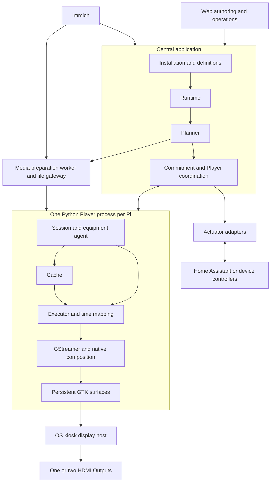

# Architecture

> **Status: proposed architecture.** The [requirements](requirements.md) define product behavior. This document specifies the implementation direction; unresolved choices are tracked in [design decisions](design-decisions.md), with delivery work in the [implementation plan](implementation-plan.md).

## System boundaries

Photo Wall owns installation configuration, Scene execution, compatible media assignments, calibration and display history. Immich remains the media library. Build the domain core because persistent Frame locations, live sources, nested Runs, per-target overlays and rolling assignments need one coherent model. Reuse media and infrastructure components around that core. Dependencies must support free, self-hosted deployment.

Start with one modular central application, one media preparation worker and one Python Player process per Raspberry Pi. Keep one active scheduling authority and a shared central database. Players render locally from selected media and timed instructions. Authoring and operations use a web UI.



These are responsibility boundaries, not a service per box. The [execution contract](execution-contract.md) defines preparation, commitment, intended-time execution and feedback to both Runtime and Planner.

## Central modules

| Module | Ownership and interface | Failure responsibility |
|---|---|---|
| Installation registry | Desired topology, bindings, typed target groups and calibration revisions; accepts separate equipment observations. | Retire stale equipment authority while preserving Frame identity. |
| Definitions and activation ingress | Versioned Scenes, sources and Programs; normalize schedules, manual requests and Sensor events into Activation requests. | Reject invalid definitions and deduplicate activation according to the request policy. |
| Runtime | Active Run tree, logical progression, lifecycle and per-target intent. | Apply execution outcomes to completion/cancellation; preserve current-state semantics during projection. |
| Catalog and Planner | Refresh live source metadata, enforce compatibility, select assignments and exact variants, project preparation needs. | Distinguish source failures from empty results; revise unsecured work or choose authored fallback. |
| Commitment and Player coordination | Sessions, plan revisions, readiness, execution authorization and observation routing. | Reject stale work and apply defined missing-participant/reconciliation policies. |
| Media worker and gateway | Acquire selected files, inspect/reuse derivatives, prepare missing variants and deliver exact bytes. | Isolate conversion from scheduling; report acquisition and capacity failures. |
| Peripheral adapters | Normalize Sensor events and execute resolved Actuator intent or equipment commands. | Report failures without independently resolving Scene priority or target ownership. |

Use PostgreSQL for central configuration and authoritative execution records. Keep durable state ownership explicit even when modules share tables. Operator workflows need migrations, configuration, persistent storage and a reproducible central launch package.

## Player and rendering

The Player is one process with one display-resource owner. Its session module handles plans and configuration; the equipment agent observes Outputs and applies bindings; the cache secures files; the executor prepares and schedules local operations; the Renderer owns decoding, composition, effects and calibration. Diagnostics collect outcomes from every module. Weston, clock discipline and process supervision remain OS services.

Embed GStreamer through Python/PyGObject rather than launching a media-player executable. Python orchestrates; native elements and GPU operations handle sustained media processing. This keeps preparation, local capacity and visible output under coordinated control without routing decoded frames through Python arrays. Nested Runs need not map to nested pipelines or processes.

The Renderer uses this conceptual order:

```text
decode → layout/crop → Scene composition → visual effects
       → aperture/geometric calibration → environmental/photometric correction
       → output presentation
```

GTK owns persistent windows and hosts the Renderer's result. Composition and calibration have one owner; geometry is not irreversibly baked into source media. Frame placement/aperture survives equipment replacement, while output mappings and Panel-specific correction may require revalidation. Prefer renderer-level orientation so each Output can be configured independently.

Start calibration with translation, scale, rotation, crop and four-corner projective mapping; add mesh warping only if physical evidence requires it. Design preview/commit/revert separately from ordinary playback and configuration adoption. A known SDR working space and disabled audio are recommended initial simplifications; expanded color and audio behavior require explicit scope decisions.

Keep GTK operations on its main GLib thread, following [PyGObject threading guidance](https://pygobject.gnome.org/guide/threading.html). Downloads, disk validation and conversion must not block it. Qualify the GLib/networking integration, decode-to-GPU path and embedding sink on a pinned build. Two Outputs, overlays and crossfades share the Pi's decoder, graphics and memory budget; advertise a measured whole-Player capacity profile alongside individual Frame profiles.

## Media preparation and cache

Hide [Immich API](https://api.immich.app/) contracts behind a central adapter with a declared tested version range. Periodically refresh active queries into a bounded metadata working set. Source refresh, planning lookahead and cache retention are separate settings. New matching assets affect future uncommitted assignments; query edits follow authored-revision policy.

Check source orientation and quality before preference ranking, then verify the chosen presentation variant. Upscaling cannot make an ineligible original qualify. Reuse qualifying Immich derivatives; permit wall-specific conversion only under the chosen derivative policy. Cache selected originals/variants centrally, with stable content identities and integrity metadata.

Push upstream-neutral manifests and intent through the control channel; let Players pull authorized files from the central show system's gateway over HTTPS, preserving the [central media boundary](requirements.md#central-media-boundary). The gateway resolves upstream identities and supplies bytes itself. Downloads occur ahead of activation, including explicit standby preparation when configured.

Use a bounded Player cache, with a SQLite index, that distinguishes:

- Current playback and pinned files backing scheduled-and-secured assignments, including any interval before formal commitment, and outstanding coordinated sequences.
- Near-future assignments within the rolling preparation window.
- Retained content for reuse and configured outage fallback.
- Explicit standby content for triggerable experiences.
- Disposable derivatives and intermediate files.

Never evict a file while required by current playback or a locked assignment. Release pins when the assignment is completed, cancelled, or otherwise explicitly released; a month-long Run does not pin its entire history. Validate complete bytes before reporting file readiness. Report cache pressure when required work cannot fit. File acquisition and imminent decoder preparation are distinct resource budgets.

## Credentials and operational state

Use automatically established Player-specific identity and credentials with access only to its configuration, authorized media and reporting endpoints. Logical identity must not depend on IP address, MAC address or display observations. Apply least privilege to the [central media integration](requirements.md#central-media-boundary). Authenticate administrators separately, encrypt network channels, and scope MQTT credentials so a Player cannot issue arbitrary home-control commands.

Maintain desired configuration revisions separately from observed/applied state. A report must not overwrite operator intent. Enrollment, claim/retirement, credential rotation and replacement recovery need an explicit trust workflow. Bindings authorize Outputs to serve persistent Frames; a replaced Player must not regain control using an old instruction.

Keep maintenance, blanking, Panel power, Player shutdown, reboot and updates distinct from authored Scene state. Respect power dependencies and graceful shutdown where required. [Home Assistant's WebSocket API](https://developers.home-assistant.io/docs/api/websocket/) and MQTT are integration options for selected controls and observations; they are not the source of truth. Scene definitions address logical Actuators rather than vendor commands.

## Appliance operation

Implement [automatic Player provisioning](requirements.md#player-provisioning) with one common Raspberry Pi OS image delivered over PXE. Package discovery and enrollment support in the image and prepare their deployment configuration centrally. Use the [Raspberry Pi network-boot documentation](https://www.raspberrypi.com/documentation/computers/remote-access.html#network-boot-your-raspberry-pi) to define the supported network-boot-capable hardware precondition. Choose local installation versus diskless runtime according to the required outage behavior; define persistent identity/cache layout and a reproducible reimage path.

Boot establishes networking, discovers the Control Plane, automatically registers and reports equipment so the Player appears before Frame binding. Establish time and reconcile configuration/plans before preparing authorized content and presenting it. Keep a last-known-good state. Integrity-verify update artifacts and design staged rollout, health gates and rollback before unattended fleet operation.

Ordinary Scene/media changes preserve windows and valid content or configured fallback, without exposing OS UI or resetting HDMI mode. Recoverable playback failures should preserve the visible composition. A native crash can terminate the whole Player; configure the surviving kiosk host to show black while supervision restarts it. Last-picture retention across that crash would require another mechanism. Test compositor, GPU, power and panel startup behavior separately.

Health must describe presentation, not just a live process: current bindings/revisions, Runs and visible media, readiness, cache pressure, clock uncertainty, scheduled/observed timing, dropped/late frames, decode failures, thermals and recent faults. Keep diagnostics remotely accessible and use physical [validation](validation.md) for output continuity and synchronization claims.

## Component choices

| Responsibility | Starting point | Qualification focus |
|---|---|---|
| Central API and persistence | [FastAPI/Pydantic](https://fastapi.tiangolo.com/features/), [PostgreSQL](https://www.postgresql.org/docs/current/tutorial-transactions.html); recurrence library. | Schema/versioning, durable execution and restart behavior. |
| Media | [FFmpeg/ffprobe](https://ffmpeg.org/ffprobe.html), [libvips](https://www.libvips.org/). | Exact variant profiles, source fidelity and conversion lead time. |
| Player | [PyGObject](https://pygobject.gnome.org/), [GStreamer](https://gstreamer.freedesktop.org/documentation/), GTK 4; evaluate [gtk4paintablesink](https://gstreamer.freedesktop.org/documentation/gtk4/index.html). | Independent Outputs, transforms, fades, seeks and capacity. |
| Local persistence | [SQLite](https://www.sqlite.org/whentouse.html). | Integrity, pinning, storage pressure and recovery. |
| OS services | [Weston kiosk shell](https://wayland.pages.freedesktop.org/weston/toc/kiosk-shell.html), [chrony](https://chrony-project.org/), [systemd service reference](https://github.com/systemd/systemd/blob/main/man/systemd.service.xml). | Output routing, clock mapping, watchdogs and boot/crash continuity. |
| Image build | [rpi-image-gen](https://github.com/raspberrypi/rpi-image-gen). | Pinned artifact, provisioning, enrollment and rollback. |

Qualify the exact combination before fixing production media or timing guarantees. Change profiles, composition paths or equipment allocation if measurements require it while preserving the domain and execution contracts.
