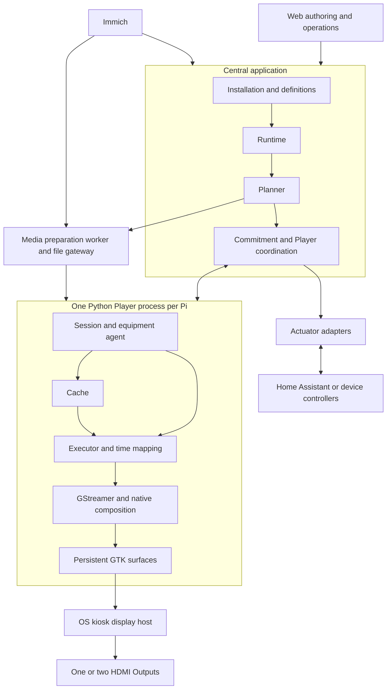

# Architecture

> **Status: proposed architecture.** The [requirements](requirements.md) define product behavior. [Decision 0006](decisions/0006-central-authority-and-stateless-players.md) fixes central durability and the stateless Player boundary; unresolved choices are tracked in [design decisions](design-decisions.md), with delivery work in the [implementation plan](implementation-plan.md).

## System boundaries

Photo Wall owns installation configuration, Scene execution, compatible media assignments, calibration and display history. Immich remains the media library. Build the domain core because persistent Frame locations, live sources, nested Runs, per-target overlays and rolling assignments need one coherent model. Reuse media and infrastructure components around that core. Dependencies must support free, self-hosted deployment.

Start with one modular central application, a Procrastinate media worker, and one Python Player process per Raspberry Pi. PostgreSQL and the task queue exist only in central components. Players render centrally selected media from current timed instructions and retain no authoritative state. Authoring and operations use a web UI.


```mermaid
flowchart TD
    UI[Web authoring and operations] --> CENTRAL
    IMMICH[Immich] --> CENTRAL
    subgraph CENTRAL[Central application]
        REG[Installation and definitions]
        RUN[Runtime]
        PLAN[Planner]
        SESSION[Commitment and Player coordination]
        REG --> RUN
        RUN --> PLAN
        PLAN --> SESSION
    end
    PLAN --> WORKER[Media preparation worker and file gateway]
    IMMICH --> WORKER
    SESSION <--> PLAYER
    WORKER --> PLAYER
    subgraph PLAYER[One Python Player process per Pi]
        NET[Session and equipment agent]
        CACHE[Cache]
        EXEC[Executor and time mapping]
        RENDER[GStreamer and native composition]
        GTK[Persistent GTK surfaces]
        NET --> CACHE
        NET --> EXEC
        CACHE --> EXEC
        EXEC --> RENDER
        RENDER --> GTK
    end
    GTK --> WESTON[OS kiosk display host]
    WESTON --> HDMI[One or two HDMI Outputs]
    SESSION --> ACT[Actuator adapters]
    ACT <--> DEVICE[Home Assistant or device controllers]
```

These are responsibility boundaries, not a service per box. The [execution contract](execution-contract.md) defines preparation, commitment, intended-time execution and feedback to both Runtime and Planner.

## Central modules

| Module | Ownership and interface | Failure responsibility |
|---|---|---|
| Installation registry | Desired topology, bindings, typed target groups and calibration revisions; accepts separate equipment observations. | Retire stale equipment authority while preserving Frame identity. |
| Definitions and activation ingress | Versioned Scenes, sources and Programs; normalize schedules, manual requests and Sensor events into Activation requests. | Reject invalid definitions and deduplicate activation according to the request policy. |
| Runtime | Active Run tree, logical progression, lifecycle and per-target intent. | Apply execution outcomes to completion/cancellation; preserve current-state semantics during projection. |
| Catalog and Planner | Refresh live source metadata, enforce compatibility, select assignments and exact variants, project preparation needs. | Distinguish source failures from empty results; revise unsecured work or choose authored fallback. |
| Commitment and Player coordination | Sessions, plan revisions, readiness, execution authorization and observation routing. | Reject stale work and apply defined missing-participant/reconciliation policies. |
| Media worker and gateway | Atomically enqueue through Procrastinate, acquire selected files, prepare/publish authoritative variants and deliver authorized exact bytes. | Preserve publication recovery and stale-attempt fences; report acquisition and capacity failures. |
| Provisioning and releases | Recognize equipment observations, issue boot tickets, store accepted/candidate releases and consume trials. | Bind health to the current boot/session and select the centrally accepted release after a failed trial. |
| Peripheral adapters | Normalize Sensor events and execute resolved Actuator intent or equipment commands. | Report failures without independently resolving Scene priority or target ownership. |

Use PostgreSQL for all durable Photo Wall state: installation intent, Runtime/Planner/coordination records, media lifecycle, queue jobs, equipment recognition, and release/trial policy. Modules expose named operations and transaction-bound repository ports; they do not call another domain's private methods or SQL. Typed Pydantic transports cross process/domain boundaries. Psycopg pools own central connections, and atomic operations such as media request plus task defer share the caller's transaction.

### Installation inventory and enrollment observation

The Installation registry owns the complete [typed inventory](../central/installation_models.py) returned by `/v1/operator/inventory`: Players, nested Output observations, and Frames with their profiles, bindings, calibration, and revisions. Its repository selects public fields explicitly, and the HTTP response validates that complete contract. Consumers validate all three collections before projecting the smaller view they need; valid Player rows do not excuse malformed Output or Frame data.

Enrollment observers need only Player ID, Equipment observation ID, authority epoch, and retirement state. Health is eventually consistent feedback and may still be empty when enrollment is visible. It neither supplies identity nor determines whether a new session exists. Output discovery, release-health acceptance, and observed presentation retain their own checks.

The enrollment observation contract permits only `pending` with no session or `ready` with a session. Transport success does not imply readiness. The [appliance harness](module-appliance-e2e.md#enrollment-observation-boundary) owns the expected Equipment, boot, and session-epoch checks for its isolated fixture without adding enrollment policy to the Player.

### Operator console

**Status: built** (pass 2, passes C and D), verified by the tests named below; owner approval of the design's questions 1–6 is pending, and the build uses their defaults. The design and the reasons for each choice are owned by the [flow design](operator-console-ux-pass2-flow.md); how to use it is in the [runbook](runbook.md#operator-console-sections-links-and-drafts). This section is the module map.

The console is a React single-page app in `central/console/`, bundled by Vite and served by Central at `/`. It calls only `/v1/operator/*`, with the session cookie of [pass A](operator-console-ux-pass2-session.md).

**Two planes** ([console design §4a](operator-console-ux-design.md#4a-the-two-plane-state-model)). *Plane A* is one snapshot: inventory, runtime and media read together and swapped whole by the one poller in `useSnapshot.js` (every 5 s while the tab is visible, after each write, and on Refresh). The newest read wins, a read overlapped by a write is dropped, and polls are single-flight; the snapshot status carries `aria-busy` while a read is in flight, so the end of a read is observable. *Plane B* is what the operator is doing: flow drafts, calibration trials and the Wall's memory. A refresh never merges into it.

**The shell** (`Shell.jsx`). `routes.js` parses and formats the hash routes and has no React; `useRoute.js` is the only writer of `location.hash`. Sections come from three route tables:
- `showRoutes.jsx` (Now showing, Scenes, Schedule, Photo sources): always mounted. The pages that are not current carry the HTML `hidden` attribute, so a draft never unmounts and their status regions leave the accessibility tree. Each page tells its subtree whether it is hidden (`pageVisibility.js`), and `ConfirmAction` puts a hidden page's modal dialog away.
- `wallRoutes.jsx` (Wall, Equipment): mounted only while current. The Wall state that must outlive the page lives in `wallState.js`, which imports no component.
- `neutralRoutes.jsx` (Needs attention): mounted only while current.

The shell is keyed on the provider's `sessionEpoch`, which Log out bumps, so Log out remounts it and discards every draft. A 401 while signed in keeps the snapshot and leaves the shell mounted, `hidden` and `inert`, under the sign-in `<dialog>` (`SignInScreen.jsx`), with the poll paused ([flow design §6](operator-console-ux-pass2-flow.md#6-navigation-routes-and-modules) (a)–(e)).

**R4: Display controls only from the Wall.** Because Wall pages mount only while current, no hidden page holds Commissioning DOM. The guarantee is a CI test, not a runtime check. `tests/test_console_routes_r4.py` takes the module graph from the bundler (esbuild's metafile), cross-checks it module by module against its own import scan (a disagreement is an error, so JSX text that fools the scan cannot hide an import), and fails if `showRoutes.jsx`, `neutralRoutes.jsx`, or `main.jsx` stopping at `wallRoutes.jsx` reaches the Wall-only closure (everything the Wall table reaches but the shell's own modules and a declared, checked list shared with the Show side), or if a Show or neutral module names the calibration route. The scan fails closed: an import it cannot read or resolve is an error; without Node or esbuild the test fails where the checks must run. `tests/browser/test_console_shell_browser.py` visits every sample path of the Show and neutral tables (`routeSamples.json`) and finds no Commissioning landmark.

**The flow kit** (`central/console/src/flow/`). Every step flow is built from it:
- `useFlowDraft`: one draft per flow, keyed `new` or `edit/<id>`, with `baseRevision` for stale detection and `reseed` for Reload. Opening another key while the draft is dirty is refused.
- `useFlowInstance`: the route's instance, step normalisation, Continue scoped to its step, `checkAll` for the final write, Back, the in-app start with its discard confirmation, and `finish`, which replaces the flow's history entry only if the location still names it.
- Hand-offs (`handOff.js`, `useHandOff.js`): the shell holds one pending hand-off; the Scene flow begins one to the Source flow, which settles it once, with its result or with nothing.
- Views: `Stepper`, `StepForm`, `Advanced`, `CheckAnswers`, `SummaryCard`, `InstanceNotice` (with `DraftBar` and `HandOffNotice`), plus `useFlowFocus`. The pure modules (`draftState.js`, `steps.js`, `instance.js`, `handOff.js`) are run under Node by `tests/test_console_flow.py`.

Each flow container keeps its own seed, draft effects, write and step views, beside a pure model: `SceneFlow.jsx` (`sceneFlowModel.js`), `SourceFlow.jsx` (`sourceFlowModel.js`), `ProgramsRegion.jsx` (`scheduleFlowModel.js`) and `ShowNowFlow.jsx` (`showNowModel.js`, with `coveringPriority` in `showState.js`). The shell's context also carries `recentSceneId`, which prefills Schedule and Show now, and `markDraft`, which puts "Draft" in the sidebar.

**The look.** The tokens in `index.css` take their values from the photo library's published theme, in both colour schemes. Only values are reused, never code, markup or assets. Some are darkened for WCAG AA, and `tests/test_console_look.py` checks every contrast pair. The text face, "Console Sans", is a Latin-1 subset of the Google Sans variable font, renamed as its trademark notice requires for a modified version and shipped with its SIL OFL 1.1 licence (`central/console/src/fonts/README.md`). Everything is bundled and same-origin, so the CSP is unchanged. Vite's `assetsInlineLimit: 0` keeps assets out of the `data:` URLs the CSP refuses. Central registers `font/woff2` because Python 3.12's built-in MIME table lacks it (`central/app.py`). `tests/browser/test_console_look_browser.py` checks the served type and that the face loads.

## Player and rendering

The Player is one process with one display-resource owner. Its session module holds only current plans/configuration and a fresh authority epoch; the equipment agent reports Outputs; the disposable cache secures exact bytes; the executor is the sole local authority owner; and the Renderer owns decoding, composition, effects and calibration. A Player has no database, durable identity, execution journal, update slots, or authoritative cache metadata. Diagnostics collect current observations. Weston, clock discipline and process supervision remain OS services.

Embed GStreamer through Python/PyGObject rather than launching a media-player executable. Python orchestrates; native elements and GPU operations handle sustained media processing. The initial [native implementation decision](decisions/0005-native-platform-and-registration-fallback.md) permits bounded appsink buffer uploads into GLArea composition, with no Python pixel-processing loops; its copy cost must be qualified before claiming a device capacity. Nested Runs need not map to nested pipelines or processes.

The Renderer uses this conceptual order:

```text
decode → layout/crop → Scene composition → visual effects
       → aperture/geometric calibration → environmental/photometric correction
       → output presentation
```

GTK owns persistent windows and hosts the Renderer's result. Composition and calibration have one owner; geometry is not irreversibly baked into source media. Frame placement/aperture survives equipment replacement, while output mappings and Panel-specific correction may require revalidation. Prefer renderer-level orientation so each Output can be configured independently.

Start calibration with translation, scale, rotation, crop and four-corner projective mapping; add mesh warping only if physical evidence requires it. Design preview/commit/revert separately from ordinary playback and configuration adoption. A known SDR working space and disabled audio are recommended initial simplifications; expanded color and audio behavior require explicit scope decisions.

Keep GTK operations on its main GLib thread, following [PyGObject threading guidance](https://pygobject.gnome.org/guide/threading.html). Downloads, disk validation and conversion must not block it. Qualify the GLib/networking integration, decode-to-GPU path and embedding sink on a pinned build. Two Outputs, overlays and crossfades share the Pi's decoder, graphics and memory budget; advertise a measured whole-Player capacity profile alongside individual Frame profiles.

## Media preparation and cache

Hide [Immich API](https://api.immich.app/) contracts behind a central adapter with a declared tested version range. Periodically refresh active queries into a bounded metadata working set. Source refresh, planning lookahead and cache retention are separate settings. New matching assets affect future uncommitted assignments; query edits follow authored-revision policy.

An explicit source-refresh request persists a requested revision and atomically defers central work. The media repository records the completed revision only when a matching refresh lease publishes its outcome. This gives callers an observable completion boundary while periodic refresh continues normal runtime convergence; see [source refresh requests](module-media-worker.md#source-refresh-requests).

Check source orientation and quality before preference ranking, then verify the chosen presentation variant. Upscaling cannot make an ineligible original qualify. Reuse qualifying Immich derivatives; permit wall-specific conversion only under the chosen derivative policy. Cache selected originals/variants centrally, with stable content identities and integrity metadata.

Central's on-disk served assets — photo media (a cache of Immich), the Player `.deb` and the OS squashfs (caches of GitHub Releases) — are **one disposable cache** the worker owns and Kubernetes places: a single `PHOTO_WALL_CACHE_ROOT` (baked default) whose `media/`, `apps/`, and `os-images/` subdirs are derived as internal constants, mounted RW on the worker (the single writer) and RO on central. The filesystem is a cache and the database is intent, so every read tolerates a miss — a lost or evicted file regenerates from its source of truth on the next request. Release sourcing and base serving are always-on; each domain bounds itself with a GC and a filesystem orphan sweep, and `os-images` self-heals a dangling `cached` row and keeps a reserved floor so nothing starves netboot. See the [Central cache subsystem](module-central-cache.md) and [decision 0013](decisions/0013-unified-cache-root.md).

Push upstream-neutral manifests and intent through the control channel; let Players pull authorized files from the central show system's gateway over HTTPS, preserving the [central media boundary](requirements.md#central-media-boundary). The gateway resolves upstream identities and supplies bytes itself. Downloads occur ahead of activation, including explicit standby preparation when configured.

Use bounded temporary files with an in-memory cache index and process-local pins. An optional cache directory may survive restart, but every candidate is untrusted until its content-addressed name, exact size, and SHA-256 are revalidated. Never evict a file pinned by current process authority. Release pins when current work no longer needs them; a month-long Run does not pin its history. Cache deletion or corruption invalidates local readiness and triggers reacquisition of the same centrally secured assignment. It never causes reenrollment or a new selection. File acquisition and imminent decoder preparation remain distinct resource budgets.

## Credentials and operational state

Generate a fresh process key and credentials at startup, scoped to current configuration, authorized media, and reporting endpoints. Trusted provisioning observations such as Pi serial or MAC can help central recognize equipment; they are operational matching information, not cryptographic identity. PostgreSQL maps recognized equipment to persistent records and operator-owned Frame bindings. Apply least privilege to the [central media integration](requirements.md#central-media-boundary). Authenticate administrators separately, encrypt network channels, and scope MQTT credentials so a Player cannot issue arbitrary home-control commands.

Maintain desired configuration revisions separately from observed/applied state. A report must not overwrite operator intent. Enrollment, claim/retirement, credential rotation and replacement recovery need an explicit trust workflow. Bindings authorize Outputs to serve persistent Frames; a replaced Player must not regain control using an old instruction.

Keep maintenance, blanking, Panel power, Player shutdown, reboot and updates distinct from authored Scene state. Respect power dependencies and graceful shutdown where required. [Home Assistant's WebSocket API](https://developers.home-assistant.io/docs/api/websocket/) and MQTT are integration options for selected controls and observations; they are not the source of truth. Scene definitions address logical Actuators rather than vendor commands.

## Appliance operation

Implement [automatic Player provisioning](requirements.md#player-provisioning) with one common Ubuntu 24.04.4 Raspberry Pi arm64 image delivered over PXE, following the [accepted platform decision](decisions/0005-native-platform-and-registration-fallback.md). Use the [Raspberry Pi network-boot documentation](https://www.raspberrypi.com/documentation/computers/remote-access.html#network-boot-your-raspberry-pi) to define the supported hardware precondition. The bootstrap obtains a central release ticket, verifies and copies the selected rootfs into RAM, and needs no writable persistent volume.

Boot establishes trusted time and networking, asks central to recognize the equipment observation and select a release, then enrolls a fresh Player session and restores current central bindings/configuration. Unknown equipment remains visible and unbound. Cold boot requires provisioning, release, enrollment, control, and media connectivity. Central consumes candidate trials before ticket issue and promotes only current boot/session health; failed trials reboot and receive the centrally accepted image on the next PXE boot.

Every boot stage reaches the configured Central the same way ([decision 0014](decisions/0014-reaching-central-from-every-boot-stage.md)). The netboot initramfs is the first user. It reads Central's root from `photowall.central=`. It then locates Central with one credential-free `GET /v1/locate`, following up to ten redirects across hosts. Each hop is checked before anything is sent to it: a redirect from https to http, a changed path, a loop or an eleventh hop is refused ([`tests/test_uplink_redirects.py`](../tests/test_uplink_redirects.py), [`tests/test_uplink_locate.py`](../tests/test_uplink_locate.py)). Central answers `/v1/locate` with its identity, `{"service":"photo-wall-central","api":1}`, marked `Cache-Control: no-store`. The route is declared beside `/healthz` and needs no database, so it answers even while Central reports itself unhealthy ([`tests/test_central_locate.py`](../tests/test_central_locate.py)). The identity is a misconfiguration check, not authentication. Every https hop is verified against the one CA bundle the build copied from the base, with the host name checked on each hop ([`tests/test_uplink_tls.py`](../tests/test_uplink_tls.py)). The origin of the URL where locate ends is the only place direct requests go, and a direct request refuses any redirect ([`tests/test_uplink_fetch.py`](../tests/test_uplink_fetch.py)). Every failure is exactly one named cause (R9; [`tests/test_uplink_causes.py`](../tests/test_uplink_causes.py)). This logic lives in the top-level `uplink` package. `uplink` uses only the standard library and the stdlib-only `contracts` modules, because it runs inside the initramfs. That rule is enforced by the computed closure test ([`tests/test_netboot_closure.py`](../tests/test_netboot_closure.py)); the import-linter contract only warns early. Provisioning and the Player adopt `uplink` in later projects. Until then they keep their own HTTP clients.

Provisioning and the Player resolve the same command line, locate the same way, and go direct to the located origin: the Player's `httpx` and `websockets` clients are built from one Trust, with no redirects. One Debian declaration ([`scripts/debian_packages.py`](../scripts/debian_packages.py)) builds the base with every Debian package both need, and each `.deb` ships its computed closure privately under `/usr/lib/<package>/`. Provisioning installs the Player with dpkg alone.

Ordinary Scene/media changes preserve windows and valid content or configured fallback, without exposing OS UI or resetting HDMI mode. Recoverable playback failures should preserve the visible composition. A native crash can terminate the whole Player; configure the surviving kiosk host to show black while supervision restarts it. Last-picture retention across that crash would require another mechanism. Test compositor, GPU, power and panel startup behavior separately.

Health must describe presentation, not just a live process: current bindings/revisions, Runs and visible media, readiness, cache pressure, clock uncertainty, scheduled/observed timing, dropped/late frames, decode failures, thermals and recent faults. Keep diagnostics remotely accessible and use physical [validation](validation.md) for output continuity and synchronization claims.

## Component choices

| Responsibility | Starting point | Qualification focus |
|---|---|---|
| Central API and persistence | [FastAPI/Pydantic](https://fastapi.tiangolo.com/features/), [PostgreSQL](https://www.postgresql.org/docs/current/tutorial-transactions.html), Psycopg pooling, [Procrastinate](https://procrastinate.readthedocs.io/). | Domain ownership, atomic task defer, durable execution and restart behavior. |
| Media | [FFmpeg/ffprobe](https://ffmpeg.org/ffprobe.html), [libvips](https://www.libvips.org/). | Exact variant profiles, source fidelity and conversion lead time. |
| Player | [PyGObject](https://pygobject.gnome.org/), [GStreamer](https://gstreamer.freedesktop.org/documentation/), GTK 3. | Independent Outputs, transforms, fades, seeks and capacity; GL facilities remain an interface-bound experiment. |
| Disposable cache | Content-addressed temporary files plus in-memory metadata. | Complete verification, bounded pressure, deletion/corruption recovery, optional byte reuse. |
| OS services | [Weston kiosk shell](https://wayland.pages.freedesktop.org/weston/toc/kiosk-shell.html), [chrony](https://chrony-project.org/), [systemd service reference](https://github.com/systemd/systemd/blob/main/man/systemd.service.xml). | Output routing, clock mapping, watchdogs and boot/crash continuity. |
| Image build | [rpi-image-gen](https://github.com/raspberrypi/rpi-image-gen). | Pinned artifact, provisioning, enrollment and rollback. |

Qualify the exact combination before fixing production media or timing guarantees. Change profiles, composition paths or equipment allocation if measurements require it while preserving the domain and execution contracts.
