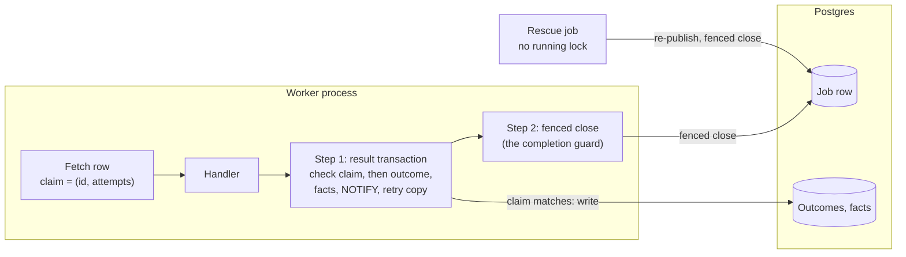
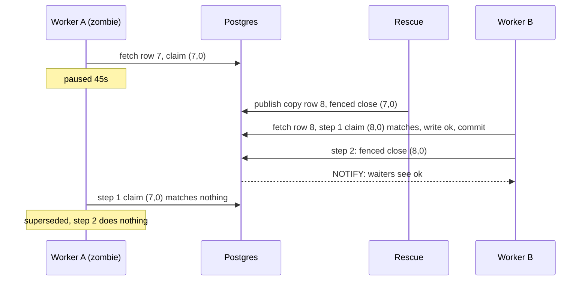
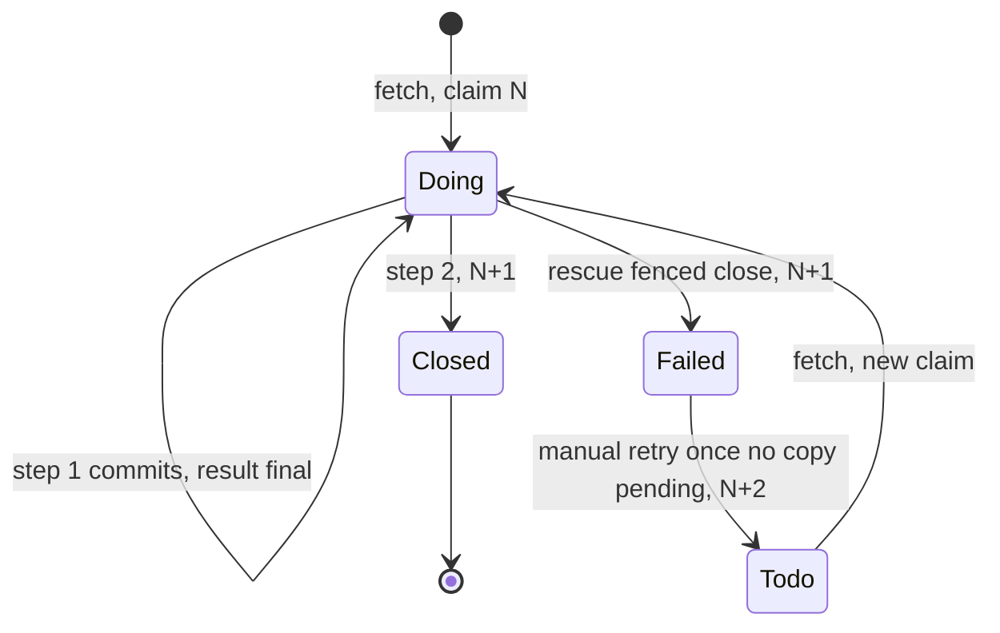

# Central: a late worker must not overwrite a rescued job's result

**Date:** 2026-09-24 · **Status:** decided by the owner (gate 2026-09-24). It amends the approved
[Central system architecture](central-system-architecture.md) and replaces every working note on
issue #26. **Asked of the reader:** nothing; the rulings are in [§9](#9-decisions-owner-gate-2026-09-24).

## 1. The problem in plain words

A worker silent for 30s is treated as dead, and its job is handed to another worker. It can be
silent and still alive: garbage collection, a stalled host, or a graceful shutdown (procrastinate
stops the heartbeat *before* it waits for running jobs, upstream #1585). When it wakes, today it
can still write. What must be true:

- A job that was taken over keeps the takeover's result. The late worker writes nothing.
- The same holds after an operator retries the job by hand.
- A slow but alive worker keeps running.
- No worker, paused or killed, can stop the fleet from rescuing stalled jobs.

**Builds on** architecture §7, §10.1–§10.3: one worker kind, retry by re-publishing, no leases.

| Fact (procrastinate 3.9.0; proven on real PostgreSQL, errata 2026-09-23) | Where | Consequence |
| --- | --- | --- |
| Every worker, at start, deletes worker records silent for 30s; the media loop uses the same default | procrastinate `worker.py:447-452`; `runtime.py:53`; `media/worker.py:348-353` | A paused worker loses its record |
| A deleted record sets its jobs' `worker_id` to NULL; rescue treats NULL as stalled | `schema.sql:77`; `queries.sql:53` | A pruned worker's live jobs are rescued |
| Outcome and facts commit with no ownership check | `execution.py:131-177` | A late `terminal` overwrites the copy's `ok` |
| procrastinate closes a row by id only, and always calls that close when a task ends | `schema.sql:264-292`; `worker.py:352-380`; `runtime.py:87-104` | A superseded worker's close can shut another delivery of the same row |
| Closing adds 1 to `attempts`; a manual retry adds 1 and reopens the same row (refused while a copy is pending); fetching changes nothing | `schema.sql:210-292`, `:364-400`, `:100` | `(row id, attempts at fetch)` names one delivery |
| Rescue re-publishes at the same `_attempt`; it holds a fleet-wide running lock; its close has no time limit | `queue_ops.py:88-95`; `job_queue.py:97-98`, `:118` | Our attempt counter cannot fence; one killed rescue can stop all rescue |
| Publishing on a caller's connection needs a sync-connector app | procrastinate `manager.py:114-116`, `connector.py:120-128`; `publisher.py:54` | The runtime's async app (`runtime.py:137`) cannot |

## 2. The answer in one picture

**The three rules**

1. **Only the current claim writes a result, and only the current claim closes the row.** Step 1
   checks the claim while it writes. Step 2 and rescue close with the same check. procrastinate's
   close by id never runs.
2. **Silent for 30 seconds: take its jobs. Silent for an hour: forget the worker.** A slow worker's
   jobs re-run elsewhere, and rule 1 makes that safe.
3. **Only "cannot tell" stops a worker.** An unsure error re-runs the step. If it stays unsure, the
   row stays open, the worker stops, and rescue takes over.

## 3. Glossary

- **Delivery**: one run of one job row by one worker.
- **Claim**: (job row id, `attempts` when fetched). Any close or manual retry changes it. A fencing token.
- **Fenced close**: closes the row only if its claim still matches `doing`. Closes 0 or 1 rows.
- **Zombie**: a worker declared dead that wakes up and tries to finish.
- **Superseded**: a delivery whose claim no longer matches. It writes and closes nothing.
- **Rescue**: the upkeep job that re-publishes a silent worker's jobs, then fence-closes their rows.

## 4. How ownership works

**Step 1** is one transaction. It locks the row `FOR NO KEY UPDATE` on id, `attempts` and `doing`,
then writes every result path: `ok` with its facts, the facts-conflict terminal, `terminal`,
`transient` with its retry copy and attempt carry, and the early-copy re-publish. If nothing
matches, it writes nothing. **Step 2** is the completion guard (`runtime.py`), which replaces
procrastinate's close with one fenced close in its own transaction (SQL in `job_queue.py`).

| The delivery | Step 2 (guard) does |
| --- | --- |
| step 1 committed | fenced close with the status its result implies |
| superseded in step 1 | nothing |
| never reached step 1 (undecodable row, missing handler, error reading the retry window, abort or cancel) | fenced close with procrastinate's status |
| still unsure in step 1 after retries | nothing: the row stays open and the runtime stops |

**Unsure** means a lost connection (class 08, which includes a session killed for idling),
`lock_timeout` (55P03), serialization (40001) or deadlock (40P01). The whole step re-runs after
0.5, 1 and 2s. Any other error in step 1 writes `terminal outcome_write_failed` in a fresh checked
transaction. *Cost:* a bug turns jobs terminal instead of restarting the fleet on one poison job.
**Every step 2 error counts as unsure:** the result is already safe, and a row left open under a
live worker would block its key for ever.

**The invariant:** no outcome or fact is written, and no row closed, without a matching claim.

## 5. Walkthroughs

A keeps its worker record, because nobody prunes for an hour. If an operator had retried row 7 and B
picked it up, A's step 2 would still close nothing, where a close by id would shut B's delivery.

| Situation | What a user sees |
| --- | --- |
| A worker pauses 45s mid-download | The request may 503 at 30s; the copy fills the cache |
| The database goes down | Idle loops stop as `worker_exited`; running handlers are waited on, then their step retries and stops |

## 6. The hard part: the gap between the steps, and blocking rescue

**The gap.** After step 1 commits, the row stays `doing` and keeps the job's running lock until
step 2. If the worker pauses or dies here:

1. The result is final. A copy cannot run until the row closes, so step 1 can never overwrite a
   copy's result.
2. After 30s, rescue re-publishes and fence-closes the row. The copy finds its verified file,
   downloads nothing, and writes a second `ok`. The original's late step 2 closes nothing.
3. Stated plainly: a recorded `terminal` or spent retry runs once more if it dies in the gap (as today).

**Nobody blocks rescue.** Rescue takes a queueing lock only, with no running lock. That is
procrastinate's documented stalled-jobs pattern, and it is a named exception in §10.1. Step 1 and
every fenced close use `SET LOCAL` to cap `idle_in_transaction_session_timeout` at 10s and
`lock_timeout` at 5s. Residual, stated plainly: a row whose zombie holds its lock is rescued up to
one tick (~1 minute) plus 10s late.

## 7. The next consumer, and the shape not chosen

Next consumer: media jobs, where long drains are normal. Step 1 carries `MediaReady` facts, and
renders are byte-deterministic per recipe id, so a copy in the gap returns early.

- **Rejected, B: close inside the result transaction.** This is pg-boss `complete(name, id, data,
  { db })` or River `JobCompleteTx`, and it has no gap. The owner chose to keep procrastinate's row
  writes out of our result transaction. Fences by `worker_id`, status or `_attempt` fail (§12).

## 8. Storage, lifecycle, migration

- **No procrastinate schema change.** The claim comes from the fetched row. It is carried into
  `JobExecutor.execute` and keyed in the guard by claim, never by row id.
- **Step 1** puts every write path on one connection. The retry copy goes through a publish-only
  sync app, and the attempt carry gets a sync form. **Step 2** is the one fenced-close statement,
  shared with rescue. `RecordedFailure` (`runtime.py:60-65`) goes.
- **`app_release_poll`** gains a run-stamp column (one migration), seeded if absent.
- **Liveness, one module** imported by `runtime.py`, `queue_ops.py` and `media/worker.py`: 10s
  heartbeat, `RESCUE_AFTER` 30s, `PRUNE_AFTER` 1h (placeholder; import fails unless it is larger).

## 9. Decisions (owner gate 2026-09-24)

| # | Ruling | Cost |
| --- | --- | --- |
| 1 | **Two steps:** a claim-checked result transaction, then a separate fenced close | A gap where the result is final and the row is open; a death there re-runs the job once (§6) |
| 2 | **`SyncReleases` stamp:** its first transaction stamps `app_release_poll`; each later one `SELECT … FOR UPDATE`s it; a different stamp means superseded | One migration; other handlers stay last-writer-wins (none proven harmful) |
| 3 | **No heartbeat override:** the fetch foreign-key error maps to `worker_pruned` via `_RUNTIME_EXITS` | A worker pruned after an hour's pause runs blind until its next fetch |
| 4 | **Accept** re-runs when a graceful shutdown exceeds 30s | Duplicate CPU and origin traffic per long drain |

**Assumptions:** only rescue and a manual retry move a running row; procrastinate stays at 3.9.0;
no fenced transaction idles for 10s; both asset kinds are byte-deterministic per key.

## 10. Deliberately out of scope

**Deferred:** fencing the disk rename, legacy media writes, handlers other than `SyncReleases`.
**Non-goals:** a recovery-time promise; leases; stopping duplicate *work*.

**Separate one-bead fix (defect 3):** an outage takes ~279s to stop a worker (`runtime.py:137`,
`:87-115`), and the reason is lost when any loop raised (`:157-177`). It bounds that pool at 5s,
skips the re-read after a connection error, and raises the first stop reason on every exit.

## 11. What can go wrong

Strength: **construction** > **transaction** (Postgres enforces it) > **decision** (one code
path) > **test** > **convention** > **documented**.

| Failure | Behaviour | Strength |
| --- | --- | --- |
| Zombie finishes after rescue or after a manual retry | superseded; the current delivery untouched (T1, T2, T2b) | transaction |
| Live delivery whose record was pruned | commits (T1b) | transaction |
| Worker pauses or dies between step 1 and step 2 | rescue re-publishes and closes; the copy finds its file and writes a second `ok`; a late step 2 closes nothing (T5) | transaction |
| Dies in the gap after recording `terminal` or a spent retry | the job runs once more | documented |
| Late step 1 after a copy's result | impossible: a copy runs only after the row closes, and step 1 then matches nothing | transaction |
| Step 2 fails | unsure: retried, then the runtime stops; rescue re-publishes as above | decision |
| Paused inside step 1 | session killed at 10s; step 1 re-runs; rescue ≤1 tick late (T3) | transaction |
| Rescue killed mid-run | the next tick still rescues (T4) | decision |
| Zombie `SyncReleases` | superseded by the stamp (T6) | transaction |
| Media loop's pruner; zombie rename | safe while it imports `PRUNE_AFTER`; renamed bytes verified against facts re-read just before | convention; documented |

## 12. How the design got here

- **Reviews:** fences by `worker_id` (loses a pruned live delivery), status (admits a retried row)
  and `_attempt` (rescue reuses it) fail; close by id; rescue's running lock.
- **Owner gate 2026-09-24:** 1 two-step, 2 SyncReleases stamp, 3 drop, 4 accept.
- **Survived:** the claim `(id, attempts)`; prune after rescue. **Specs found wrong:**
  `defer(connection=)` needs a sync-connector app; an etag alone cannot fence.

## 13. What happens after the gate

1. **`fence-result` (tracer):** the claim, step 1 and the sync publish app. Tests T1, T1b, T2.
   R1: 19 tests in `tests/test_infra_execution.py` need real procrastinate rows.
2. **`fence-close`:** the fenced close and the guard as step 2, and `RecordedFailure` goes. Tests
   T2b, T5. R2: `tests/test_infra_runtime_boot.py:442-460`, `:466-509`, `:21`/`:320`.
3. **`rescue-liveness`:** liveness numbers, media pruner, lock-free fenced rescue, `SET LOCAL`
   limits. T3, T4. R3 `test_infra_runtime_boot.py:111`; R4/R5 count fresh heartbeats only:
   `scripts/two_pod_run.py:269`, `:326-330`, `:556`; `tests/test_worker_processes.py:41-43`.
4. **`sync-releases-stamp`:** the migration and the stamp. Test T6.
5. **`fence-docs`:** the architecture doc's header, §0, §5, §6(d), §10.1, §10.2 and §10.3.
6. **Separate, `runtime-stop-reasons`:** defect 3 (§10) plus the `worker_pruned` mapping.

**Tracer bullet** (PostgreSQL tests on the real 3.9.0 schema; CI is the database gate)

- **T1:** row 7 rescued; copy row 8 commits `ok`; A returns `TerminalFailure`; outcome stays `ok`.
  *Probe:* drop step 1's claim check → red.
- **T1b:** A's record deleted, row not rescued; both steps commit. *Probe:* check `worker_id` → red.
- **T2:** rescue row 7; finish row 8; `retry_job_v2(7)`; B fetches it (attempts 2); A superseded.
  Attempts alone decide here. *Probe:* status-only check → red.
- **T2b:** T2 through the real `Worker` and guard; B's row stays `doing`. *Probe:* close by id → red.
- **T3:** A pauses 15s in step 1; rescue's first run returns in ≤6s; the row ends closed and `ok`;
  A keeps running. *Probes:* remove the idle limit, or the lock limit → red.
- **T4:** kill the worker running `RescueStalledJobs`; the next tick rescues. *Probe:* running lock → red.
- **T5:** A commits step 1, then pauses. (a) Rescue closes; the copy writes a second `ok`, no
  download. (b) Operator retries row 7 in place, B fetches it; A's step 2 closes nothing.
  *Probe:* step 2 by id → red.
- **T6:** two `SyncReleases` runs overlap; the older is superseded. *Probe:* skip the compare → red.
