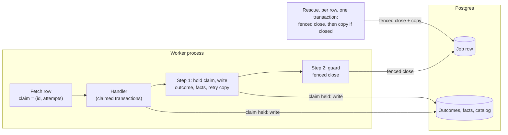
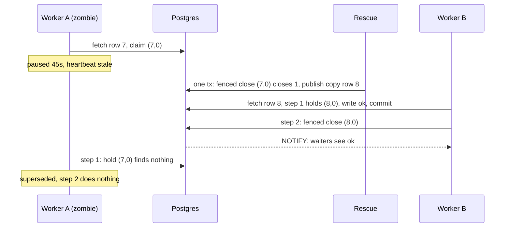
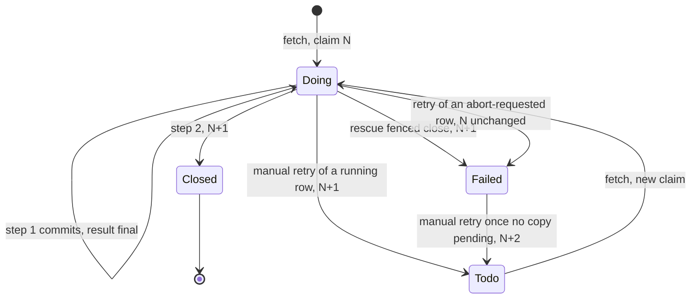

# Central: a late worker must not overwrite a rescued job's result

**Date:** 2026-09-24 · **Status:** owner rulings of 2026-09-24 applied, including amended
decision 3. It amends the approved [Central system architecture](central-system-architecture.md) and
replaces every working note on issue #26. **Asked of the reader:** confirm one mechanism change
to ruling 2 ([§9](#9-decisions)).

## 1. The problem in plain words

A worker silent for 30s is treated as dead, and its job is handed to another worker. A worker can
be silent and still alive: garbage collection, a stalled host, or a graceful shutdown
(procrastinate stops the heartbeat *before* it waits for running jobs, upstream #1585). When it
wakes up, today it can still write. What must be true:

- A job that was taken over keeps the takeover's result. The late worker writes nothing.
- The same holds after an operator retries the job by hand.
- A slow but alive worker keeps running, and a database blip does not make good work terminal.
- No worker, paused or killed, can stop the fleet from rescuing stalled jobs.

| Fact (procrastinate 3.9.0; PostgreSQL 16 probes) | Where | Consequence |
| --- | --- | --- |
| Every worker, at start, deletes worker records silent for 30s; the media loop uses the same default | procrastinate `worker.py:447-452`; `runtime.py:53`; `media/worker.py:348-353` | A paused worker loses its record |
| A deleted record sets its jobs' `worker_id` to NULL; rescue treats NULL as stalled | `schema.sql:77`; `queries.sql:53` | A pruned worker's live jobs are rescued |
| Outcome and facts commit with no ownership check | `execution.py:131-177` | A late `terminal` overwrites the copy's `ok` |
| procrastinate closes by id only, and always calls that close when a task ends | `schema.sql:264-292`; `worker.py:352-386`; `runtime.py:87-104` | A superseded worker can shut another delivery of the same row |
| Close and manual retry each add 1 to `attempts`; fetching changes nothing; at most one `doing` row per running lock | `schema.sql:210-292`, `:364-400`, `:102` | `(row id, attempts at fetch)` names one delivery, and it is the only owner of its lock key |
| Rescue re-publishes before it closes, at the same `_attempt`, under a fleet-wide running lock | `queue_ops.py:88-95`, `:115-132`; `job_queue.py:97-98`, `:118` | Extra copies; one killed rescue stops all rescue |
| An idle-session kill raises 25P03, which is **not** an `OperationalError`, and leaves the connection broken; a pool timeout **is** an `OperationalError` | probe below; psycopg 3.2.9 | "Unsure" must be classified by exception type and by broken connection, not by SQLSTATE class |
| procrastinate's async connector takes one connection per statement | `psycopg_connector.py:221-224` | A claim check and its close cannot share a transaction through it |

## 2. The answer in one picture

**The three rules**

1. **Nothing is written and no row is closed without holding the current claim.** Step 1,
   claimed handler transactions, step 2 and rescue all lock the job row on its claim first.
   procrastinate's close by id never runs.
2. **Silent for 30 seconds: take its jobs. Silent for an hour: forget the worker.** Rescue closes
   a row and publishes its copy in one transaction, and it never holds a running lock.
3. **Only "cannot tell" stops a worker, and only after retrying.** A lost connection or timeout
   re-runs the step for up to 30s. A definite error records the job `terminal`.

## 3. Glossary

- **Delivery**: one run of a job row by a worker. **Zombie**: a worker declared dead that wakes.
- **Claim**: (job row id, `attempts` at fetch). Any close or manual retry changes it (a fencing token).
- **Hold the claim**: lock the job row where id, attempts and `doing` match; no row = superseded.
- **Fenced close**: hold the claim, then call procrastinate's own close in the same transaction.
- **Superseded**: a delivery whose claim no longer holds; it writes and closes nothing. **Unsure**: §4.

## 4. How ownership works

**Holding the claim** is `SELECT … FOR NO KEY UPDATE` on id, `attempts` and `doing`; claimed
handler transactions use `FOR SHARE`. Only claim-holding transactions add `SET LOCAL
idle_in_transaction_session_timeout` 10s; `lock_timeout` 5s and `statement_timeout` 10s already
come from `db.py:50-51`. All of it runs on our own sync connection from `Database`, in
`central/infra/job_queue.py`, reached by the executor through a port (`DeliveryFence`), so
`execution.py` stays free of procrastinate.

**The fenced close** holds the claim, then calls `procrastinate_finish_job_v1` in the same
transaction, keeping procrastinate's status check, `attempts`+1, abort-flag reset and delete
branch. Its two users are step 2 and rescue.

| Delivery result | Step 2 closes with |
| --- | --- |
| `ok`, or an early copy re-published | `succeeded` |
| `terminal` (including `outcome_write_failed`) or `transient` | `failed` |
| never reached step 1 (undecodable row, missing handler, error reading the retry window, abort) | procrastinate's status (`failed` or `aborted`) |
| superseded | nothing |
| still unsure after retrying | nothing; the row stays open and the runtime stops `completion_not_recorded` (already in `_RUNTIME_EXITS`, `media/worker.py:56`) |

**The guard** (`runtime.py`) replaces procrastinate's `finish_job` with step 2, keyed by claim,
and makes `retry_job` (a reopen by id we never use) raise. Step 1 is shielded from cancellation
and awaited before re-raising, as procrastinate does at `worker.py:382-386`.

**Unsure**, classified by exception type: any `psycopg.OperationalError` (class 08, 57P01, 55P03,
40001, 40P01, no SQLSTATE, `PoolTimeout`) except 57014; 25P03 and 25P04; any error that leaves the
connection broken. Unsure re-runs the **whole** step with backoff for up to 30s; step 1 is
replay-safe (`now` and `retry_not_before` computed once, the claim re-checked each run). Any other
step-1 error (integrity, data, programming) writes `terminal outcome_write_failed` in a fresh
claim-held transaction; if that write is unsure, it is unsure. **57014 (statement timeout) is
definite**, or one deterministically slow write would stop every worker that takes the job.
*Cost:* a once-slow write turns its job terminal until the next request. Step 2 treats every
error as unsure: the result is already safe.

**The invariant:** a result, a claimed handler write or a close happens only in a transaction
holding the delivery's claim. *Strength:* decision (the executor calls the fence). The
alternative is making `JobOutcomes.record` and `record_produced` take the claim.

## 5. Walkthroughs

A keeps its worker record, because nobody prunes for an hour. Had an operator retried row 7 for
B, A's step 2 would still close nothing, where a close by id would shut B's delivery.

| Situation | What a user sees |
| --- | --- |
| A worker pauses 45s mid-download | The request may get a 503 at 30s; the copy fills the cache |
| The database is down for more than 30s | Idle loops stop as `worker_exited`; running deliveries stop with `completion_not_recorded` |

## 6. The hard part: the gap, and never blocking rescue

**The gap.** After step 1 commits, the row stays `doing`, holding its running lock, until step 2.
If the worker pauses or dies there:

1. The result is final. A copy waits behind the running lock until the row closes, after which
   step 1 cannot hold the old claim, so a late step 1 never overwrites a copy.
2. Rescue closes and copies. The copy finds its verified file (`AssetProduction.produce` returns
   early), downloads nothing, and writes a second `ok`.
3. By ruling 3a, a job whose recorded result was `terminal` may run once more this way.

**Rescue**, per stalled row, in one transaction: a fenced close on the claim from
`get_stalled_jobs`, then the copy on the same connection only if one row closed. There is never
a moment with no copy, and never a copy without a close. Rescue takes a queueing lock only
(procrastinate's documented stalled-jobs pattern). That needs a `Delivery` declaration, while
`job_keys` stays the key source (`kernel/jobs.py:196-221`); §10.1 forbids it today and is amended.
A paused holder is killed by the idle limit, and rescue skips its row after the 5s lock limit.
Residual, stated plainly: that row is rescued up to one tick (~1 minute) plus 10s late.

## 7. The next consumer, and the shape not chosen

**Claimed transactions, the shared primitive for handler writes.** `ClaimedTransactions`
implements `Transactions`: `begin()` holds the running delivery's claim `FOR SHARE`, read from a
context variable the runtime sets around `handle()` (`asyncio.to_thread` copies it,
`content_catalog/catalog.py:96-102`), and raises `Superseded` (kernel) if it does not hold. It
yields a `PgTransaction`, so `pg_connection` still works (`central/infra/transactions.py:60-64`).
`SyncReleases` is the first consumer. `SyncMediaSource` and `PrepareMedia` must adopt it when media
lands, because they replace two paths fenced today: the refresh generation
(`media_repository.py:157-161`, `:178-181`) and the publish lease (`media_store.py:365-369`,
`:398-405`).

- **Rejected, B: close inside the result transaction** (pg-boss `complete(…, { db })`, River
  `JobCompleteTx`; no gap). The owner kept procrastinate's row writes out of our result transaction.
- **Rejected, a stamp row per lock key:** at most one row per lock is `doing` (`schema.sql:102`), so
  the claim already names the only owner.

## 8. Storage, lifecycle, migration

- **No schema change, no migration; rollback is a code revert.** The claim comes from
  `context.job.attempts` (procrastinate `jobs.py:97`). `RecordedFailure` goes.
- **Step 1 carries every result path:** `ok` with facts, the facts-conflict terminal, `terminal`,
  `transient` with retry copy and attempt carry, and the early-copy re-publish. Copies go through
  the one publish-only sync app in `job_queue.py`, which `publisher.py:54` also uses.
- **Liveness numbers stay in `runtime.py`:** `RESCUE_AFTER` 30s, `PRUNE_AFTER` 1h (placeholder);
  `JobRuntime` refuses prune ≤ rescue. The media loop passes `PRUNE_AFTER`; rescue's 30s comes in
  from `content_wiring.py:113`.

## 9. Decisions

| # | Ruling (owner, 2026-09-24) | Cost |
| --- | --- | --- |
| 1 | **Two steps:** a claim-held result transaction, then a separate fenced close | A gap where the result is final and the row is open (§6) |
| 2 | **Fence `SyncReleases` writes only.** The mechanism is now claimed transactions, not an `app_release_poll` stamp: **please confirm** | No migration; other handlers stay last-writer-wins until media adopts the primitive |
| 3 | **No heartbeat override.** The foreign-key error on fetch maps to `worker_pruned` | A worker pruned after an hour-long pause runs blind until its next fetch |
| 3a | **Amended:** a death in the gap may re-run a job whose result was `terminal`, once | One extra origin attempt; architecture §7 and §9 decision 3 get the exception |
| 4 | **Accept** re-runs when a graceful shutdown exceeds 30s | Duplicate CPU and origin traffic per long drain |

**Assumptions:** only rescue and a manual retry move a running row; procrastinate stays at 3.9.0,
with a schema-pinned test; no claim-holding transaction idles for 10s between statements.

## 10. Deliberately out of scope

**Deferred:** fencing the disk rename; handlers other than `SyncReleases`. **Non-goals:** a
recovery-time promise; leases; stopping duplicate *work*. Outage stop time and reasons: bead 0.

## 11. What can go wrong

Strength: **construction** > **transaction** (Postgres enforces it) > **decision** (one code
path) > **test** (§13) > **convention** > **documented**.

| Failure | Behaviour | Strength |
| --- | --- | --- |
| Zombie finishes after rescue or a manual retry; a late step 1 after a copy's result | superseded: it cannot hold the old claim; the current delivery is untouched (T1, T1t, T2) | decision |
| Live delivery whose record was pruned | commits (T1b) | decision |
| Pause or death in the gap | rescue closes and copies; the copy writes a second `ok` with no download; a late step 2 closes nothing (T5) | decision |
| Death in the gap after `terminal` | runs once more (ruling 3a) | documented |
| Database restart or blip in step 1 or step 2 | unsure: the step re-runs for up to 30s, then the runtime stops (T7, T9) | decision |
| Poison write error (integrity, data) | `terminal outcome_write_failed`; the runtime keeps running (T8) | decision |
| Paused inside a claim-holding transaction | killed at 10s; rescue skips its row after 5s and gets it next tick (T3) | transaction |
| Rescue killed mid-run, or working from a stale snapshot | the next tick rescues; a stale rescue closes and copies nothing (T4, T4b) | decision |
| Zombie `SyncReleases` | `Superseded` on its next transaction (T6, T6b) | decision |
| Prune too early | refused at build; the media loop is tested at 1h (T11) | construction; test |
| Outage, or a worker pruned while alive | stops with its first named reason (T10) | test |
| Zombie renames a file | allowed; its bytes are verified against the recorded facts first | documented |

## 12. How the design got here

- **Owner gate 2026-09-24:** 1 two-step, 2 SyncReleases stamp, 3 drop, 4 accept; later, 3 amended.
- **Round 3:** unsure by exception type; one-transaction rescue; procrastinate's own close; the
  stamp becomes the claim. **Survived every attack:** the claim `(id, attempts)`; prune after rescue.

## 13. What happens after the gate

Each bead is green alone and carries every test it breaks.

0. **`runtime-stop-reasons`:** procrastinate's pool bounded at 5s; no status re-read after a
   connection error; first stop reason on every exit; fetch foreign-key error → `worker_pruned`.
   T10. Updates `test_infra_runtime_boot.py:140-156`, `test_media_worker.py:600`, `media/worker.py:447-450`.
1. **`fence-tracer`:** claim from `context.job.attempts`; `DeliveryFence`; step 1 for `ok` only;
   step 2 and its status table; `retry_job` refused; cancel shield; unsure classes; the idle
   limit and a 5s lock limit on `QueueAdmin` (libpq `options`), shipping with the lock;
   `RecordedFailure` removed. T1, T1b, T2, T3, T7, T9. Updates
   `test_netboot_fresh_install_e2e.py:162-172`; `test_infra_runtime_boot.py:235-302`,
   `:307-356`, `:466-534`; `test_infra_job_queue.py:172-189`; `test_infra_queue_ops.py:100`;
   the 6 boot tests `test_infra_execution.py:251-290` (constructor only).
2. **`fence-all-results`:** every other result path in step 1; the one sync publish app;
   `outcome_write_failed`. T1t, T5, T8. Updates the 13 PostgreSQL executor tests
   `test_infra_execution.py:108-226` (a `DeliveryFence` fake under the fence's conformance suite).
3. **`liveness-pruners`:** `RESCUE_AFTER`, `PRUNE_AFTER`, the build check, the media loop,
   fresh-heartbeat counts. T11. Updates `test_infra_runtime_boot.py:111`,
   `scripts/two_pod_run.py:269`, `:326-330`, `:556`, `test_worker_processes.py:41-43`.
4. **`rescue-lock-free`:** the `Delivery` declaration; rescue per row in one transaction. T4, T4b.
   Updates `test_infra_queue_ops.py:47-89`, `:115-118`, `:136-151`, `:224-259`,
   `test_infra_job_queue.py:155-166`.
5. **`sync-releases-claimed`:** `ClaimedTransactions`, `Superseded`, wired to `SyncReleases`. T6, T6b.
6. **`fence-docs`:** architecture header, §0, §3:104 and §10.4 `WorkerBeat` (records linger an
   hour; readers filter by freshness), §4:116-117 (rescue has no running lock), §5, §6(d), §7 and
   §9 decision 3 (ruling 3a), §10.1–§10.3.

**Tracer bullet and probes** (PostgreSQL, real 3.9.0 schema; each probe must turn its test red)

- **T1 / T1t:** row 7 rescued; copy row 8 commits `ok`; A's late `ok` (T1) or `terminal` (T1t) is
  superseded, with no new outcome and no NOTIFY. *Probes:* no claim in step 1; terminal path unfenced.
- **T1b:** A's record deleted, row not rescued; both steps commit. *Probe:* check `worker_id`.
- **T2:** real `Worker`: rescue row 7, finish row 8, `retry_job_v2(7)`, B fetches it (attempts 2);
  A is superseded and B's row stays `doing`. *Probes:* status-only claim; guard closes by id.
- **T3:** A's heartbeat backdated; A pauses 15s holding step 1. Rescue's first run returns ≤6s; a
  close at t=11s succeeds; A's re-run is superseded; A keeps running. *Probes:* no idle limit
  (the t=11s close fails); no lock limit (the first run exceeds 6s).
- **T4 / T4b:** a killed rescue's next tick still rescues; a stale snapshot (7,0) while B holds
  (7,2) closes and copies nothing. *Probes:* running lock restored; close by id; copy before close.
- **T5:** A commits step 1 and pauses. (a) Rescue closes; the copy writes a second `ok`, no
  download. (b) Operator retry in place, B fetches; A's step 2 closes nothing. *Probe:* step 2 by id.
- **T6 / T6b:** a zombie `SyncReleases` is superseded mid-run, and when it first writes after the
  copy finished. *Probe:* plain `Transactions`.
- **T7:** `pg_terminate_backend` during step 1; it re-runs and ends `ok`. *Probe:* class-08-only.
- **T8:** an integrity failure → `outcome_write_failed`; runtime runs. *Probe:* integrity as unsure.
- **T9:** step 2 fails for 5s, then closes; fails for 35s, and the runtime stops with the row open.
  *Probe:* stop on the first failure.
- **T10:** a failing loop plus a lost completion raises the first reason; the fetch foreign-key
  error gives `worker_pruned`. *Probe:* raise the task-group error.
- **T11:** prune ≤ rescue is refused at build; a record silent 31s survives another worker's
  start, the media loop's included. *Probe:* media loop on its default.

**Probe (PG16, psycopg 3.2.9):** a claim holder with a 2s idle limit made a fenced close fail 55P03
at 1s; after the kill the close took 1 row; the holder then got 25P03 (not an `OperationalError`,
connection broken). A plain transaction idle 2.5s beside it survived.
