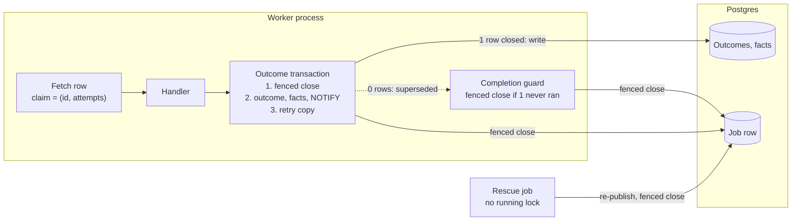
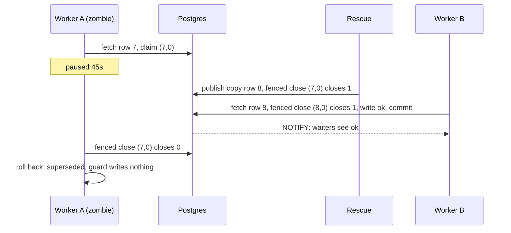
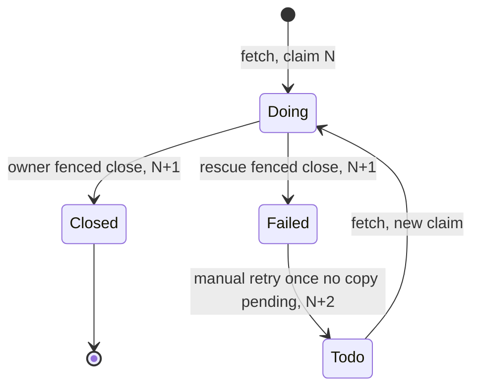

# Central: a late worker must not overwrite a rescued job's result

**Date:** 2026-09-23 · **Status:** design-gate artifact. It amends the approved [Central system architecture](central-system-architecture.md) and replaces every working note on issue #26. **You are asked:** approve the three rules and answer the four decisions in [§9](#9-decisions-that-are-yours).

---

## 1. The problem in plain words

A worker silent for 30s is treated as dead, and its job is handed to another worker. A worker can be silent and still alive: garbage collection, a stalled host, or a graceful shutdown (procrastinate stops the heartbeat *before* it waits for running jobs, upstream #1585). Today, when that worker wakes up, it can still write. What must be true:

- A job that was taken over keeps the takeover's result. The late worker writes nothing.
- The same holds after an operator retries the job by hand.
- A slow but alive worker keeps running.
- No worker, paused or killed, can stop the fleet from rescuing stalled jobs.

**Owner decisions this builds on:** one queue and one kind of worker; retry by re-publishing; rescue re-publishes, then closes (architecture §2, §10.1, §10.3); no leases and no leader (§7); the runtime alone writes outcomes and facts, with NOTIFY (§10.2); no recovery-time promise (§6(d)).

**Verified facts** (procrastinate 3.9.0; proven on real PostgreSQL, errata 2026-09-23)

| Fact | Where | Consequence |
| --- | --- | --- |
| Every worker, at start, deletes worker records silent for 30s; the media loop uses the same default | procrastinate `worker.py:447-452`; `runtime.py:53`; `media/worker.py:348-353` | A paused worker loses its record |
| Deleting a record sets its jobs' `worker_id` to NULL; rescue treats NULL as stalled | `schema.sql:77`; `queries.sql:53` | A pruned worker's live jobs are rescued |
| Outcome and facts commit with no ownership check | `execution.py:131-177` | A late `terminal` overwrites the copy's `ok` |
| procrastinate closes a row **by id only** | `schema.sql:264-292`; `runtime.py:87-104` | A superseded worker's close can shut another delivery of the same row |
| Closing adds 1 to `attempts`; a manual retry adds 1 and reopens the **same** row; fetching changes nothing | `schema.sql:264-292`, `:364-400`, `:210-262` | `(row id, attempts at fetch)` names one delivery |
| A manual retry is refused while a copy is pending | `schema.sql:100` (one `todo` per queueing lock) | Rescue's copy must finish before the old row can be retried |
| Rescue re-publishes at the same `_attempt` | `queue_ops.py:88-90` | Our attempt counter cannot tell deliveries apart |
| Rescue holds a fleet-wide running lock; its close has no time limit | `job_queue.py:97-98`, `:118`; `queue_ops.py:95` | One killed or paused rescue can stop all rescue, possibly for ever |
| Publishing on a caller's connection needs a sync-connector app | procrastinate `manager.py:114-116`, `connector.py:120-128`; `publisher.py:54` | The runtime's async app (`runtime.py:137`) cannot |

---

## 2. The answer in one picture

**The three rules**

1. **A job row is only ever closed by a fenced close,** which matches its id, attempts and status `doing`. The outcome transaction starts with one. If it closes nothing, the delivery is superseded and writes nothing. Rescue and the completion guard use the same close.
2. **Silent 30 seconds: take its jobs. Silent an hour: forget the worker.** A slow worker has its jobs re-run elsewhere, and rule 1 makes that safe.
3. **Only "cannot tell" stops a worker.** A lost connection, a timeout or a deadlock re-runs the whole fenced transaction. If it still cannot tell, the row stays open and the worker stops, so rescue takes over. Any other database error records the job `terminal`.

---

## 3. Glossary

- **Delivery**: one run of one job row by one worker.
- **Claim**: (job row id, `attempts` when fetched). Any close or manual retry changes it. A fencing token.
- **Fenced close**: closes a row only if its claim still matches. It closes 0 or 1 rows and waits at most 5s.
- **Zombie**: a worker declared dead that wakes up and tries to finish.
- **Superseded**: a delivery whose fenced close found nothing. It writes nothing.
- **Rescue**: the upkeep job that re-publishes a silent worker's jobs, then fence-closes their rows.
- **Prune**: deleting a silent worker's record, done by every worker at start.

---

## 4. How ownership works

The fenced close is our own statement in `central/infra/job_queue.py`. It has the effects of procrastinate's close (status, abort flag, attempts + 1), but its condition is the claim.

| User | When | 0 rows closed means |
| --- | --- | --- |
| Outcome transaction (first statement; it takes the row lock) | the delivery reached its result | superseded: roll back, write nothing |
| Completion guard (replaces procrastinate's close by id; keyed by claim) | the fence was never reached: undecodable row, missing handler, database error reading the retry window, abort or cancel. After a commit or a supersede it writes **nothing** | already closed elsewhere |
| Rescue | the row's worker has been silent for 30s | the owner or another rescue closed it first |

**Errors in a fenced transaction.** "Unsure" means only these: a lost connection (class 08, including a session killed for idling), `lock_timeout` (55P03), a serialization failure (40001), or a deadlock (40P01). An unsure error re-runs the **whole** transaction after 0.5, 1 and 2s. If it is still unsure, the row stays open and the runtime stops with `completion_not_recorded`. Any other error writes `terminal outcome_write_failed` in a fresh fenced transaction, and the runtime stops only if that fails too. *Cost:* a bug in the outcome write turns jobs terminal, rather than restarting the fleet on one poison job every tick. The next request retries it (owner decision 3).

| Who is finishing | Row shows | Result |
| --- | --- | --- |
| Live delivery, even with its worker record pruned | same attempts, `doing` | commits |
| Zombie after rescue | `failed`, attempts +1 | superseded |
| Zombie after rescue, copy finished, manual retry picked up by B | `doing`, attempts +2 | superseded; B untouched |
| Zombie that finishes before rescue closes | same attempts, `doing` | commits; rescue finds nothing |

**The invariant:** a job's outcome and facts are written only in the transaction whose first statement closed that job's row under a matching claim.

---

## 5. Walkthroughs

1. A keeps its worker record, because nobody prunes for an hour. It keeps working after it wakes.
2. Suppose row 8 finished and an operator then retried row 7, and B picked it up. A's guard still writes nothing. A close by id would have shut B's delivery.

| Situation | What a user sees |
| --- | --- |
| A worker pauses 45s mid-download | The request may get a 503 at 30s. The copy fills the cache, and the next boot is served |
| A worker pauses inside its outcome transaction | Nothing. Its session is killed, and it re-runs the transaction: it commits or it is superseded. It keeps running |
| A worker is killed mid-rescue | The next minute's rescue still runs, and it also rescues the dead rescue's row |
| The database goes down | Idle loops stop as `worker_exited`. Running handlers are waited on without limit; their fence retries, then stops (`completion_not_recorded`) |

---

## 6. The hard part: nobody may block rescue

1. **Rescue held a fleet-wide running lock.** A rescue killed mid-run left its row `doing`. Every later tick was skipped behind it, so nothing could ever free it. **Fix:** rescue takes a queueing lock only, which is procrastinate's documented pattern for its stalled-jobs task. Two overlapping rescues are harmless: the second's re-publish merges, and its fenced close finds nothing. The kernel gains one declaration, a named exception to §10.1's "every job has a running lock".
2. **A paused lock holder** between its fenced close and its commit. **Fix, bounded both sides:** fenced-close transactions, and only those, `SET LOCAL idle_in_transaction_session_timeout` (10s) and `lock_timeout` (5s). Postgres ends the idle holder's session. Rescue gives up on that one row, rescues the others, and the next tick retries.

**Residual.** Stated plainly: a row whose zombie holds the lock is rescued up to one tick (~1 minute) plus 10s late. **Cost:** two `SET LOCAL`s per fenced transaction, and one reconnect for a killed session.

---

## 7. The next consumer, and the shape not chosen

Media jobs move onto this runtime when the legacy loop retires. Pauses and long shutdowns are normal there. The fence carries `MediaReady` facts the same way, and renders are byte-deterministic per recipe id, so a zombie's rename stays harmless.

- **B (recommended): the fenced close is the outcome transaction's first statement.** Result and close commit together, as in pg-boss `complete(name, id, data, { db })` and River `JobCompleteTx`. *Cost:* procrastinate has no such API, so we write its row ourselves, pinned by a 3.9.0 schema test; the coupling spans `job_queue.py` (SQL) and `runtime.py` (the guard).
- **A:** the fenced close runs after the outcome commits. *Cost:* two commits per delivery, and a benign "written but still open" window.
- **Rejected:** fencing by `worker_id` loses a pruned live delivery; by status, it admits a retried row; by our `_attempt`, it fails because rescue reuses it.

---

## 8. Storage, lifecycle, migration

- **No procrastinate schema change.** The claim is read from the fetched row and carried through the task body into `JobExecutor.execute` (an interface change inside `central.infra`).
- **Write paths in the one outcome transaction:** `ok` with its facts; the facts-conflict terminal (detected before any write, or inside a savepoint; today a separate transaction, `execution.py:133-137`); `terminal`; `transient` with its retry copy and attempt carry; the early-copy re-publish. The retry copy goes through a publish-only sync app on the transaction's connection, and the attempt carry gets a sync form.
- **Liveness numbers, one module:** heartbeat 10s, `RESCUE_AFTER` 30s, `PRUNE_AFTER` 1h (placeholder). Imported by `runtime.py`, `queue_ops.py` and `media/worker.py`. The import fails if prune is not after rescue.
- **Rollback:** revert the code. Fenced-closed rows look like rows procrastinate closed.

---

## 9. Decisions that are yours

| # | Question | Recommendation | Cost of the recommendation | Alternative |
| --- | --- | --- | --- | --- |
| 1 | Where does the fenced close run? | **B**: first statement of the outcome transaction | We write procrastinate's row with no upstream API; schema-pinned test; coupling in `job_queue.py` and `runtime.py` | **A**: fenced close after the outcome commits. Two commits and a benign window |
| 2 | Handler writes are outside the claim. Of the 6 job types, only `SyncReleases` is proven harmful (its sticky divergent flag, `content_catalog/sync.py:77-78`, `:127-128`). What do we do? | **Stamp and compare on the singleton poll row**: the run's first transaction stamps `app_release_poll` (seeded if absent), and every later transaction `SELECT … FOR UPDATE`s it. A different stamp means superseded | One column migration; covers `SyncReleases` only; other handlers stay last-writer-wins | **General fencing**: a delivery-scoped `Transactions` set through a context variable (no signature change) that fence-checks at `begin()`. It must still yield a `PgTransaction`, or `pg_connection` raises `TypeError` (`central/infra/transactions.py:60-64`) |
| 3 | Add a heartbeat that notices its own record is gone? | **Drop it**: pruning a live worker now needs an hour's pause | That worker runs blind until its next fetch fails on the foreign key (it can be named `worker_pruned` via `_RUNTIME_EXITS`); rule 1 still protects results | Keep it: one more procrastinate override and query to pin |
| 4 | A graceful shutdown over 30s gets its jobs re-run elsewhere. Accept? | **Accept**: rule 1 makes the duplicate harmless | Duplicate CPU and origin traffic per long drain (common for media) | procrastinate's public `shutdown_graceful_timeout`: timed-out jobs end `aborted`, are never rescued, and wait for the next request |

**Assumptions made on your behalf** (say so if any is wrong)

1. Only rescue and an operator's manual retry move a running row.
2. procrastinate stays at 3.9.0. An upgrade re-runs the schema test first.
3. No fenced transaction idles over 10s between statements.
4. Both asset kinds produce the same bytes for the same key.
5. Rescue up to one tick late behind a paused holder is acceptable.

---

## 10. Deliberately out of scope

**Deferred:** fencing the disk rename; the legacy media loop's writes (retired with it); general handler fencing (decision 2's alternative).

**Non-goals:** a recovery-time promise; leases or a leader; stopping duplicate *work* (only duplicate *writes* are stopped).

**Separate one-bead fix (independent of fencing):** a real outage takes ~279s to stop a worker. procrastinate's pool waits 30s per attempt (`runtime.py:137`), and the guard retries 4 times with a status re-read after each (`:87-115`). The named reason is also lost when any loop raised (`:157-177`). The fix bounds that pool at `db.py`'s 5s, skips the re-read after a connection error, records the first stop reason and raises it on every exit path, and names it in `_RUNTIME_EXITS`.

---

## 11. What can go wrong

Strength, strongest first: **construction** > **transaction** (Postgres enforces it) > **decision** (one code path) > **test** (named below) > **convention** > **documented**.

| Failure | Behaviour | Strength |
| --- | --- | --- |
| Zombie finishes after rescue, or after a manual retry | superseded; the current delivery is untouched (T1, T2, T2b) | transaction |
| Live delivery whose record was pruned | commits (T1b) | transaction |
| Paused inside a fenced transaction | killed after 10s; it re-runs and commits or is superseded; rescue ≤1 tick late (T3) | transaction |
| Rescue killed mid-run | the next tick still rescues (T4) | decision |
| Worker silent 30s to 1h; media loop's pruner | jobs re-run elsewhere, worker keeps running; the media loop is safe only while it imports `PRUNE_AFTER` | boot check; convention |
| Deterministic outcome-write error | `terminal outcome_write_failed` | decision |
| Zombie `SyncReleases` | superseded by the stamp (decision 2) | transaction |
| Zombie renames a file | allowed; verified against facts re-read just before the rename | documented |

---

## 12. How the design got here

- **Reviews 1–2:** `worker_id`, status and `_attempt` all fail as fences; every write must be in the fence; a paused holder blocks rescue; prune goes well after rescue.
- **Round 2:** procrastinate's close by id can shut another delivery, so there is one fenced close with three users; rescue loses its running lock; "unsure" is bounded; handler fencing narrows to `SyncReleases`.
- **Survived every attack:** the claim `(id, attempts)`; one transaction per result; prune after rescue.
- **Specs found wrong:** `defer(connection=)` works only on a sync-connector app. The poll row's etag alone cannot fence, because two runs that loaded the same etag both pass until one stores a new one, so each run stamps the row.

---

## 13. What happens after the gate

1. **Slice 1 (tracer):** the claim, the fenced close, the outcome transaction on top of it, the guard, and the publish-only sync app. Tests T1, T1b, T2, T2b. *Regressions:* R1, the 19 tests in `tests/test_infra_execution.py` need real procrastinate rows (no stub). R2, `tests/test_infra_runtime_boot.py`: the lost-completion fake `:442-460`, `ClosedMidRunHandler` `:466-509`, and `RecordedFailure` `:21`/`:320` (gone under B).
2. **Slice 2:** liveness numbers, the media loop's pruner, rescue with no running lock and a fenced close, and the `SET LOCAL` limits. Tests T3 and T4. *Regressions:* R3, `test_infra_runtime_boot.py:111` asserts a prune timeout of 30. Worker-record counts must count only heartbeats newer than `RESCUE_AFTER`: R4, `scripts/two_pod_run.py:269` and `:326-330`/`:556`; R5, `tests/test_worker_processes.py:41-43`.
3. **Slice 3 (decision 2):** the `SyncReleases` stamp and its migration.
4. **Docs bead:** exact sentences for the architecture doc's header, §0, §5, §6(d), §10.1 (retry; rescue's lock exception), §10.2 (three facts) and §10.3 (outcomes, rescue, runtime).

**Packages:** `central/infra` (`job_queue`, `execution`, `runtime`, `queue_ops`), `central/kernel/jobs.py`, `central/content_catalog/sync.py` + `central/infra/catalog_records.py` (decision 2), `media/worker.py`, `scripts/two_pod_run.py`. Estimate: 4 beads, plus the separate outage fix.

**Tracer bullet** (PostgreSQL tests on the real procrastinate 3.9.0 schema; CI is the database gate)

- **T1, the probe.** Row 7 is rescued, and copy row 8 commits `ok`. A then returns `TerminalFailure`. The outcome stays `ok`, no retry row exists, and A reports superseded. *Probe:* fence by id only. A's `terminal` lands, so red.
- **T1b, pruned but alive.** A's record is deleted, and the row is not rescued. A's `ok` commits. *Probe:* fence by `worker_id`, so red.
- **T2, manual retry.** Row 7 is rescued, row 8 is fetched and finished, then `retry_job_v2(7)`; B fetches row 7 (attempts 2). A is superseded and B commits. This is the only test where attempts alone decide. *Probe:* status-only fence, so A overwrites B, so red.
- **T2b, T2 through the real procrastinate `Worker` and guard.** After A's delivery returns, B's row 7 is still `doing`, and B commits. *Probe:* the guard delegates to procrastinate's close by id, so B's row is closed, so red.
- **T3, paused in the fence.** A holds its fenced close uncommitted for 15s. Rescue's first run returns in ≤6s. After A's session is killed, exactly one of these holds: A's re-run commits and rescue finds nothing, or rescue closes and A is superseded. A keeps running. *Probes:* no idle limit, so rescue never closes while A sleeps, so red. No lock limit, so the first run exceeds 6s, so red.
- **T4, rescue killed mid-run.** Kill the worker running `RescueStalledJobs`. The next tick rescues both the dead rescue's row and another stalled row. *Probe:* restore rescue's running lock, so the tick is never fetched, so red.
