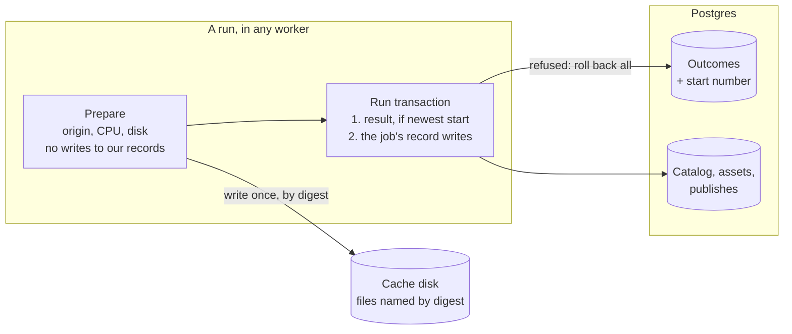
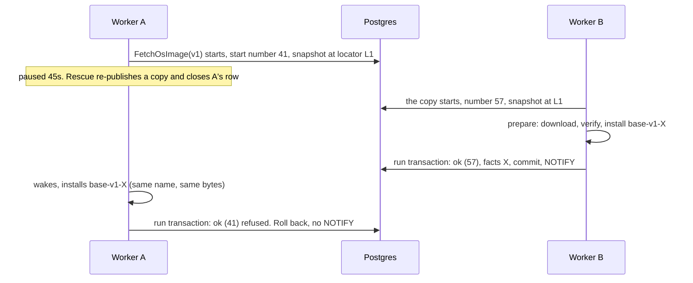
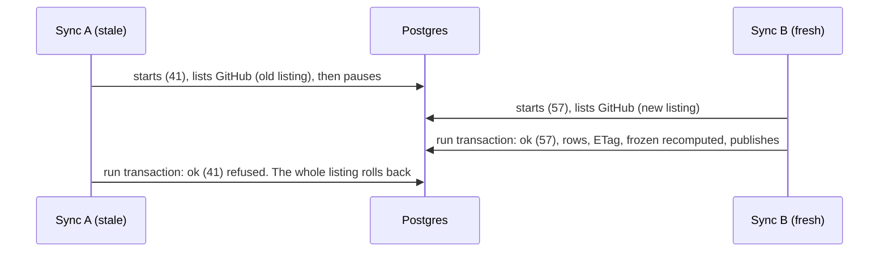
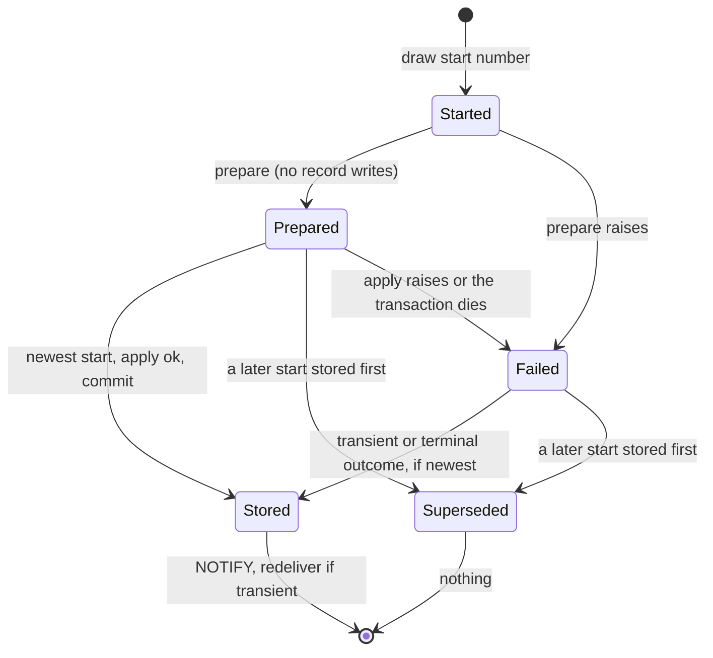
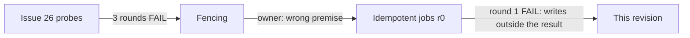

# Central: jobs run at least once, and every job is idempotent

**Date:** 2026-09-24 · **Status:** proposed amendment to the approved
[Central system architecture](central-system-architecture.md), revised after review round 1. It
replaces the rejected fencing design and every working note on issue #26.
**Asked of the reader:** approve the design. It has no product questions ([§9](#9-decisions)).

## 1. The problem in plain words

A worker that is silent for 30s is declared dead, and its job runs again elsewhere. The worker may
still be alive, for example after a pause or during a graceful drain longer than 30s, and it can
finish later. The owner ruled that this is normal. What must be true:

- Running a job twice, or running a stale copy late, leaves the database correct and never lets a
  Pi receive wrong bytes.
- A late run never replaces the result of a run that started after it.
- No worker, whether paused or killed, can stop rescue for the whole fleet.
- The release catalog converges to what GitHub says, whatever order the syncs finish in.

| Owner decision this builds on | Source |
| --- | --- |
| At-least-once delivery: jobs may run more than once, and every job must be idempotent (Celery `acks_late`, Sidekiq, Oban) | ruling of 2026-09-24; the fencing design is rejected |
| A job whose result was `terminal` may run once more if its worker dies after recording (ruling 3a) | ruling of 2026-09-24 |
| Media is identified by original + recipe, and its digest is a write-once integrity check | architecture §9, decision 1 |

| Fact (procrastinate 3.9.0; probes on PostgreSQL 16) | Where | Consequence |
| --- | --- | --- |
| The outcome upsert has no condition, and rescue re-publishes at the SAME attempt | `central/infra/outcomes.py:77-83`; `central/infra/queue_ops.py:88-90` | A zombie's late `terminal` replaces the copy's `ok`, and attempt numbers cannot order them |
| Handlers write our records in their own transactions, before any outcome | `central/content_catalog/sync.py:62-68`, `:144-147` | A stale sync that lands last reverts the catalog and publishes fetches from it |
| Files are named by tag, and a re-cut changes the bytes under that name | `central/assets/layout.py:22-41`; `sync.py:103-115` | A late rename can put an old build under a new digest, and the reader checks only the size |
| Rescue runs under a running lock | `central/infra/job_queue.py:95-98`; `schema.sql:102` | P2: a stalled rescue blocks every later tick |
| Retrying a running row in place fails while a copy of it is pending | `schema.sql:100`, `:386-394` | P1: `retry_job` raises a unique violation, so rescue keeps re-publishing |
| The heartbeat stops before the drain. Prune at 30s sets `worker_id` to NULL, and NULL counts as stalled | `worker.py:447-452`, `:552-570`; `queries.sql:53` | A drain longer than 30s re-runs its jobs, and a pruned worker exits at its next fetch |
| A killed session learns of the kill only at its next statement (probe: 25P03) | this revision's probe | A database lock cannot fence a later disk write |

## 2. The answer in one picture

**The three rules**
1. **A run's result and its writes to our records commit together, and only if no run that started
   later has stored a result.** This is one transaction per run. A refused run writes nothing and
   schedules nothing.
2. **Files are named by their digest.** A file is served only when the asset record names that
   digest. Any run may write a file at any time, and no run can put wrong bytes under a served name.
3. **Derived state is recomputed from facts, never remembered from events.** "Frozen" is recomputed
   on every sync. Produced facts are recorded only while the files they were built from are still
   current.

## 3. Glossary

- **Run:** one execution of a job by a worker.
- **Zombie:** a run whose worker was declared dead, but which is still going.
- **Start number:** a value from a database sequence (`CACHE 1`), drawn when a run starts. A later
  start always draws a larger number.
- **Run transaction:** the one transaction that holds a run's conditional result and its record
  writes.
- **Prepare / apply:** the two steps of a handler. Prepare does outside work, and apply writes our
  records inside the run transaction.
- **Content-keyed file:** a cache file whose name contains the sha256 of its bytes.
- **Frozen (divergent) tag:** a tag whose `.deb` changed upstream after Central produced it. The tag
  keeps the produced `.deb`.

## 4. How the invariant holds

**The model.** A run draws its start number, then prepares with no writes to our records, then opens
the run transaction:
1. It upserts its outcome row (`ON CONFLICT … DO UPDATE … WHERE stored.start_number <=
   new.start_number`). The row lock serialises the runs of one key.
2. If no row comes back, the run was superseded. It rolls back and returns without a NOTIFY or a
   redelivery.
3. Otherwise it runs apply, commits, and then redelivers if the result was `transient`.

The transaction sets `idle_in_transaction_session_timeout` to 2s (a placeholder), so a paused run
frees its locks. If apply fails, a fresh run transaction records one of these instead:
- `transient reference_changed` when a snapshot file changed;
- `terminal facts_conflict` when a build differs from the facts already recorded;
- `transient commit_failed` for any other failure, including lock timeouts and an idle kill.

**The audit.** For each job type: is running it twice, or a stale copy late, harmless?

| Job type | Harmless today? | Evidence | Under this design |
| --- | --- | --- | --- |
| `FetchPackage` | Yes for bytes and facts. No for the outcome | The key is the sha256, and the bytes are verified against it (`central/assets/production.py:74-77`) | Apply records the facts. The name is already the digest |
| `FetchOsImage` | **No** | Named by tag. A re-cut forgets the facts, and the re-check runs outside the write (`production.py:78-81`) | Named by digest. Apply records the facts under the asset row lock, only if the snapshot still holds |
| `SyncReleases` | **No** | Commits per release, then the ETag, then the tail. A frozen tag stays frozen (`sync.py:127-128`) | Prepare lists. Apply writes the rows, ETag and publishes. "Frozen" is recomputed |
| `Prefetch` | Yes, apart from the outcome | Publishes with dedupe and never retries a terminal (`central/assets/handlers.py:97-113`) | Apply publishes |
| `PurgeFinishedJobs` | Yes, apart from the outcome | Deletes by age, with cutoffs taken at run time (`queue_ops.py:146-155`) | Apply purges outcomes. Prepare purges queue rows |
| `RescueStalledJobs` | Running twice: yes. A stalled rescue: **no** | A re-publish merges, and a close refuses a closed row (`queue_ops.py:115-132`). It holds a running lock | Prepare only, under a queueing lock only |

**The snapshot predicate** has one home: `AssetRecords.record_produced`. It is given the asset
snapshot that prepare built from. It locks the asset row and refuses only if an owner **in the
snapshot** now has a different locator, which is the semantics of today's `_recut_since`. An added
or retired reference never refuses, so re-tagging a shared `.deb` still works. It then applies the
write-once rule. The start number is drawn before prepare reads the snapshot, and nothing reads the
snapshot twice.

**Queue maintenance is the one exemption.** Rescue and the queue half of purge write only
procrastinate's rows, through procrastinate's own functions. Those functions are convergent because
of their own status checks: a close refuses a closed row, and a defer merges by queueing lock. They
cannot join our transaction (`central/infra/queue_ops.py:92-96`).

**Why rule 1 matters to a user.** A Pi reads the asset record, not the outcome, but the outcome
decides what a request is told:
- a stale `transient` makes requests fail fast for up to an hour (PB2);
- a stale `terminal` stops `Prefetch` from refilling the asset after a wipe (PB3);
- a waiter is told a job failed when it succeeded.

**What a zombie can still do:** repeat the download or the listing, write an orphan file under its
own digest, and publish its real result if it finishes before any newer run. **What it cannot do:**
replace a newer result, change the catalog after a newer sync, record facts for a replaced file, put
wrong bytes under a served name, or stop rescue.

**The invariant, in one sentence:** the stored result, the records and the served bytes all come from
the newest run that stored a result, never from whichever run wrote last. *Strength:* transaction for
the records, and construction for the bytes.

## 5. Walkthroughs

1. If A had built from a pre-re-cut locator, its file would carry a different digest. It would be an
   orphan that is never served.
2. If A had finished before B stored anything, A's real result would stand until B's replaced it.

3. If A instead lands before B, B's transaction then replaces every row and clears a "frozen" that A
   set. The catalog ends at the newest listing either way.

| Situation | What a Pi or an operator sees |
| --- | --- |
| A worker pauses for more than 30s mid-download | The request may get a 503 at 30s, then success. The zombie changes nothing |
| A graceful drain takes longer than 30s | The job runs twice, at the cost of one extra download |
| A sync pauses inside its run transaction | Fetches and serve touches wait up to 2s, then proceed. The paused sync records `commit_failed` |
| An OS image is re-cut | The new build gets a new file name. The old file stays on disk until the orphan sweep (bead 11) |

## 6. The hard part: the run transaction, and what the runtime keeps

**The attack that grew this section.** Round 1 showed that a result ordered on its own is not enough.
The sync wrote the catalog before its result, so a refused stale sync had already reverted the rows
(proven by a probe). The fix makes the result and the writes one transaction. It generalises to
every job whose effects are writes to our records. Queue maintenance is the only exemption (§4).

**Proportionality.** What the runtime deletes, and what it keeps:

| Mechanism | Verdict | Why | Cost |
| --- | --- | --- | --- |
| Rescue's running lock | **Delete** | procrastinate's documented rescue takes a queueing lock only (P2) | Overlapping rescues make one extra, harmless copy |
| "Once frozen, always frozen" | **Delete** | Recomputed from the stored and upstream digests | A tag unfreezes if upstream serves the produced `.deb` again |
| Handler-owned transactions and one commit per release | **Delete** | Replaced by prepare and apply inside the run transaction | A sync holds its row locks for its whole apply (the idle limit bounds a pause) |
| `_recut_since` and the unverifiable-file discard | **Delete** | The predicate moves into `record_produced`. A digest name makes a discard unnecessary, whereas today a zombie's discard can delete a newer good file | Stale builds become orphans on disk |
| Rescue and retry by re-publishing | Keep | An in-place retry raises when a copy is pending (P1), and a new row keeps a zombie's close off the live copy | Two statements. The next tick finishes a half-done rescue |
| Completion guard | Keep | Without it, a failed close leaves `doing` under a *live* worker, which rescue never sees (`queries.sql:39-53`) | Up to 3.5s of retries, then the worker exits |
| Early-copy deferral; prune at 30s | Keep | These are backoff, not fencing. A pruned worker's jobs are already stalled, and it restarts clean | Its exit shows as a foreign-key error |

Stated plainly: the fencing design's claims, fenced closes, "unsure" error classes and one-hour
prune are not built. Its idle limit returns, but only on run transactions.

## 7. The next consumer, and the shapes not chosen

| | Releases and OS images (now) | Media (next) |
| --- | --- | --- |
| Catalog sync | `SyncReleases` apply | `SyncMediaSource` apply: the same primitive |
| Produced file | `base-<tag>-<sha256>.squashfs` | a variant named by its digest |
| Two-field key | not needed | the kernel still refuses it (`central/kernel/jobs.py:189-192`), so media defines it first |

**Media chooses content-keyed names, not a reproducibility assumption.**
- Names give the guarantee by construction: no run can replace served bytes.
- Reproducibility would be a convention that a codec or thread change can silently break, and the
  media module itself disclaims a reproducible build (`docs/module-media-preparation.md:33`).
- *Cost:* after a cache wipe, a transcode must reproduce the recorded digest, or the key goes
  terminal `not_reproducible` (decision 1). That is media's own design question, and it does not
  arise now. The legacy generation fence and attempt lease retire with legacy media.

**Shapes not chosen:**
- **Fence every run** (the replaced design): three failed reviews, and a database lock still cannot
  fence the disk (§1, last fact).
- **Order by procrastinate job id:** it is monotone only by convention, because a manual retry reuses
  the id.
- **Celery's sticky success:** it is kept per task id. Our row is per key, and a key legitimately
  re-runs after a re-cut or a wipe.
- **Adopted as prior art:** River's `JobCompleteTx` (the job's writes and its completion in one
  transaction), Oban's `attempted_at` (generalised here into a per-key start order), and optimistic
  concurrency on writes as in Kubernetes `resourceVersion`.

## 8. Storage, lifecycle, migration

- **Migration 028:** sequence `job_start_seq CACHE 1`, and `job_outcomes.start_number BIGINT NOT
  NULL DEFAULT 0`, so existing rows lose to any new run. Rollback is a code revert, and old code
  ignores the column. *Cost:* during a rolling deploy, old workers still upsert unconditionally.
- **`OutcomeWriter`** gains `start(tx) -> int`, and `record(..., start_number)` returns `OutcomeRow |
  None`. `JobOutcomes` stays the implementation, so `central/infra/runtime.py:129` and
  `central/content_wiring.py:71` are unchanged. `execute` returns the stored status, `None` for an
  early copy, or `"superseded"`. `JobRuntime._body` ends the row `succeeded` for both of the last
  two.
- **Handler:** `prepare(job) -> P` (async) and `apply(tx, job, P) -> R` (sync, on a thread). For the
  migration, `handle` stays accepted until the last handler moves.
- **`AssetRecords.record_produced(tx, key, facts, *, built_from)`:** locks the row, applies the §4
  predicate, then the write-once rule. `forget_produced` is unchanged.
- **Layout:** the OS-image file is `base-<tag>-<sha256>.squashfs`, and `.deb` names are unchanged
  because their identity is already the digest. Prepare adopts a legacy `base-<tag>.squashfs` whose
  bytes measure to the recorded facts, so no Pi waits on a re-download after the upgrade.
- **`Delivery`** gains "may run concurrently" (no running lock), which only rescue sets and the kernel
  refuses on asset jobs. `JobKeys.lock` is documented as the job's key: the running lock where one is
  declared, and always the outcome key.

## 9. Decisions

| # | Question | Recommendation | Cost of the recommendation | Alternative |
| --- | --- | --- | --- | --- |
| 1 | Adopt at-least-once with the three rules | Approve | Duplicate work after pauses; orphan files until the sweep; the costs in §11 | The fencing design, rejected on 2026-09-24 |

**Assumptions made on your behalf** (say so if any is wrong):
1. Ruling 3a applies to every job type.
2. A waiter may see a zombie's real result if it lands before the copy's. Today's code allows this too.
3. procrastinate stays at 3.9.0. P1 and P2 become schema-pinned tests.
4. An OS image's extraction is deterministic for one locator. If not, a second run records
   `facts_conflict` instead of serving other bytes.

## 10. Deliberately out of scope

**Deferred:** the orphan-file sweep (bead 11); an idle limit on Central's own transactions; naming
the stop reason (bead 10); removing legacy-name adoption after one release (bead 12).
**Non-goals:** exactly-once; stopping duplicate work; a promise about recovery time.

## 11. What can go wrong

Strength: **construction** > **transaction** (Postgres enforces it) > **decision** (one code path) >
**test** > **documented**.

| # | Failure | Behaviour | Strength |
| --- | --- | --- | --- |
| 1 | Defect 1: a late outcome overwrites (`ok` → `terminal`) | Refused, and its writes roll back (T1) | transaction |
| 2 | Defect 2: a pruned worker's heartbeat updates nothing, its fetch fails a foreign key, and its jobs count as stalled | Harmless. Its jobs were stalled at 30s anyway. It exits and restarts (T7) | test |
| 3 | Defect 3: an outage takes ~279s to stop a worker, and the reason is lost | Harmless for correctness, because a worker with no database writes nothing. Bead 10 names the reason | documented |
| 4 | Defect 4: a stalled rescue blocks all rescue | Fixed: no running lock (T3) | decision + test |
| 5 | Defect 5: rescue's close-by-id shuts a live row after a manual retry | One extra concurrent run, ordered by rule 1 | documented |
| 6 | Defect 6: a zombie sync freezes a tag for good | Refused if newer, otherwise recomputed by the next sync (T4, T4b) | transaction |
| 7 | A stale run renames a file late | It lands under its own digest and is never served unless recorded (T2) | construction |
| 8 | A run pauses inside its run transaction | Killed after 2s. Waiters proceed, and the run records `commit_failed` (T5) | transaction |
| 9 | An older run's valid `ok` meets a newer stored `transient` | Refused. Its file becomes an orphan and is downloaded again | documented |
| 10 | A zombie's accepted `transient` carries its attempt onto a pending copy | At most one backoff step is skipped | documented |

## 12. How the design got here

- **r0:** at-least-once. Outcomes were ordered by start, and rescue had no lock.
- **r1:** the run transaction (A), the idle limit (B), digest file names (C, E), one predicate and one
  snapshot (D), and real tests (F).
- **Survived every attack:** the conditional upsert (probed in both orders), re-publish rescue, the
  completion guard, and lock-free rescue.
- **Spec found wrong:** architecture §6(c) says a publish "merges into a pending or running copy". In
  fact, with a copy running, a new pending row is inserted and runs afterwards (errata 2026-09-23).

## 13. What happens after the gate

Each bead is green alone and carries every test it breaks. `tests/` is omitted below.
1. **`outcome-start-order`** (tracer; `central/infra` + 028): start number, conditional upsert,
   superseded, `commit_failed`, and the idle limit. T1, T1a, T1b, T5. Updates
   `test_infra_execution.py:108-246`, `test_infra_job_queue.py:295-347`,
   `test_infra_outcome_feed.py:30`, `test_infra_queue_ops.py:277`,
   `test_publisher_conformance.py:150` and `test_infra_runtime_boot.py` (`_body`).
2. **`rescue-lock-free`** (`central/kernel/jobs.py` + `central/infra/job_queue.py`): the `Delivery`
   option and the `JobKeys.lock` doc. T3, plus P1 as a test. Updates
   `test_infra_job_queue.py:155-166` and `test_kernel_jobs.py:286-293`.
3. **`two-pod-pause`** (tests only): T7 in `test_two_pods.py`.
4. **`prepare-apply`** (`central/kernel/handling.py` + `central/infra/execution.py`): the two-step
   handler, added alongside `handle`. Unit tests of both shapes and the boot check.
5. **`sync-in-run`** (`central/content_catalog` + `central/infra/catalog_records.py`): prepare and
   apply, and "frozen" recomputed. T4, T4b. Updates `test_content_catalog_sync.py:214`, `:300-316`,
   `test_infra_catalog_records.py:100`, `:230-235` and `content_db.py:61`.
6. **`content-keyed-os-images`** (`central/assets`): layout, store, reader, and legacy adoption. T6.
   Updates the layout and store tests and `test_assets_production.py`.
7. **`facts-in-run`** (`central/assets` + `central/kernel/ports.py` + `central/infra/asset_records.py`):
   production as prepare and apply, the guarded `record_produced`, and `_recut_since` deleted. T2.
   Updates `test_assets_production.py:183`, `:252`, `test_assets_handlers.py:97`, `:277`,
   `test_assets_reader.py:81`, `test_infra_asset_records.py:102-121`, `content_db.py:144-164`,
   `test_content_routes_http.py:136`, `test_netboot_e2e_wire.py:160`,
   `test_publisher_conformance.py:149` and `test_content_catalog_sync.py:150`, `:261-285`.
8. **`handle-retired`** (the kernel, `central/assets` Prefetch and `central/infra` purge/rescue): the
   last handlers move, `handle` is removed, and the boot check becomes total.
9. **`idempotent-jobs-docs`** (the architecture):
   - the header "What it gives up", §0 row 3, §1 lines 79-80, §4, §5 line 144, §6(b)(c)(d), §7 line
     207, §9 decision 3 and §10.1–§10.4;
   - the open errata corrections for §3, §5, §6(b)(c) and §10.2 (errata 899-927, the #25 entry and
     the 2026-09-24 entries);
   - the runbook row for `PHOTO_WALL_RELEASE_API_BASE`, and a link to this document.
10. **`residual: runtime-stop-reason`:** procrastinate's pool wait is bounded to 5s and the first
    stop reason is raised. The acceptance test: with the database stopped, the worker exits within
    30s and prints `completion_not_recorded` or `worker_exited`.
11. **`residual: orphan-sweep`:** removes files that no record names, after a grace period (this is
    `MaintainCache`'s orphan rule).
12. **`residual: drop-legacy-adoption`:** one release after bead 6.

**Tracer T1** (PostgreSQL, two `JobRuntime`s through `pg_runtime`, `test_infra_runtime_boot.py:421-429`)
- *Setup and path:* a waiter publishes `FetchPackage`. Run A starts and blocks. The row is rescued.
  Run B starts, stores `ok` with its facts, and commits. Then A returns `terminal`.
- *Expected:* B's `ok` is stored, there is exactly one NOTIFY, the waiter gets `Ready`, and there is
  no redelivery row from A.
- *Variants:* T1a, where A returns `transient` after B's `ok`, which is refused with no redelivery.
  T1b, where B stores `transient` and then A returns `ok` with facts, which is refused and leaves the
  facts empty.
- *Probes that must turn a test red:* no `WHERE` on the upsert; the number drawn at write time; a
  NOTIFY when refused; a redelivery when refused; the facts committed when refused.

**The other tests and their probes:**
- **T2:** hold A's run transaction open after the predicate's read, re-cut on a second connection,
  and assert the re-cut blocks until A commits. Then a late A build lands under its own digest and is
  never served. *Probe:* no row lock in `record_produced`.
- **T3:** a rescue row is `doing` under a dead worker, and the next tick rescues it. *Probe:* restore
  the lock.
- **T4:** a stale listing lands first and a fresh one second, and the tag ends unfrozen with its rows
  from the fresh listing. *Probe:* restore "once frozen, always frozen".
- **T4b:** a fresh listing lands, then a stale one, and nothing changes. *Probe:* drop the
  conditional from the sync's run transaction.
- **T5:** a run pauses inside its run transaction for 3s. A fetch that locks the same asset row
  proceeds after 2s, and the paused run records `commit_failed`. *Probe:* no idle limit.
- **T6:** a legacy file is adopted without a download, and a corrupt legacy file is not adopted.
- **T7:** two pods, one worker SIGSTOPped for more than 30s, and a new worker spawned so that it
  prunes. Rescue is published on demand, and the copy ends `ok`. The worker is then SIGCONTed with
  the origin answering 404. Expected: the outcome stays `ok` and the resumed worker exits.
  *Probe:* the unconditional upsert.
