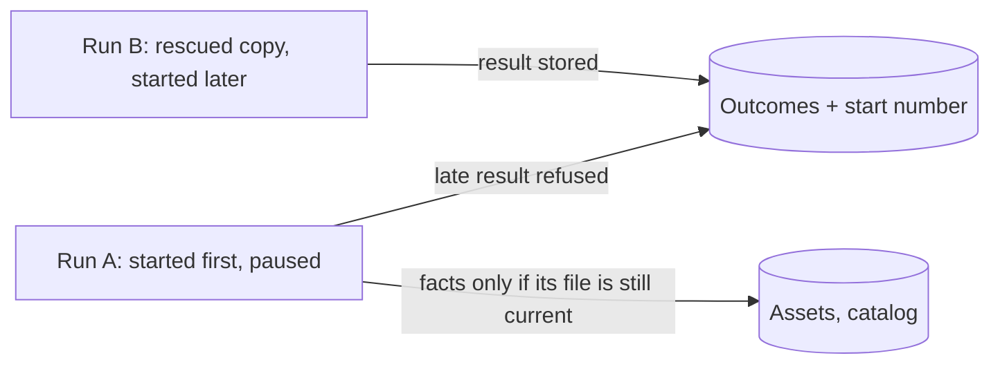
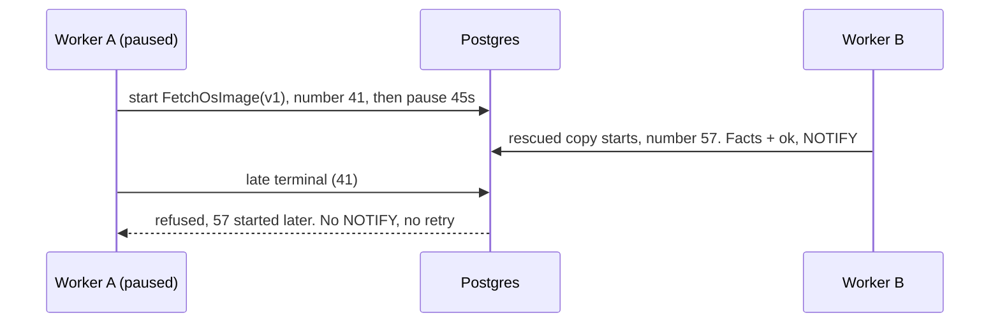

# Central: jobs run at least once, and every job is idempotent

**Date:** 2026-09-24 · **Status:** proposed amendment to the approved [Central system architecture](central-system-architecture.md).
It replaces the rejected fencing design and all notes on issue #26. **Asked:** approve it; no product questions ([§9](#9-decisions)).

## 1. The problem in plain words
A worker silent for 30s is declared dead, and its job runs again elsewhere. The worker may still be alive (a pause, or a
drain over 30s) and finish later. The owner ruled this normal: **at-least-once** delivery, as in Celery `acks_late`, Sidekiq
and Oban. So every job must be idempotent: running it twice, or a stale copy late, leaves disk and database correct.

| Fact (procrastinate 3.9.0; probes P1 and P2 on PostgreSQL 16) | Where | Consequence |
| --- | --- | --- |
| The outcome upsert has no condition. Rescue re-publishes at the same attempt | `infra/outcomes.py:77-83`; `infra/queue_ops.py:88-90` | A zombie's late `terminal` replaces the copy's `ok`, and the attempt number cannot order them |
| Rescue runs under a running lock | `infra/job_queue.py:95-98`; `schema.sql:102` | P2: a stalled rescue blocks every later tick |
| An in-place retry of a running row fails while a copy is pending | `schema.sql:100`, `:386-394` | P1: `retry_job` raises a unique violation, so re-publishing stays |
| The heartbeat stops before the drain. Prune at 30s nulls `worker_id`, and rescue counts NULL as stalled | `worker.py:447-452`, `:552-570`; `queries.sql:53` | A drain over 30s re-runs its jobs. A pruned worker exits at its next fetch |

## 2. The answer in one picture

1. **Any job may run twice, or late.** Every job type is written so that a repeat run is harmless.
2. **A result is ordered by when its run started.** It is stored only if no later-started run stored one. A refusal writes and schedules nothing.
3. **State is recomputed from facts.** "Frozen" is recomputed each sync. Facts need a current source. A listing lands whole or not at all.

## 3. Glossary
- **Run:** one execution of a job. **Zombie:** a run whose worker was declared dead, still going. **Start number:** drawn from a sequence
  at start, so later runs draw larger ones. **Convergent write:** same end state for any count or order of runs.
  **Frozen (divergent) tag:** keeps its produced `.deb` after upstream changed it.

## 4. How idempotency holds: every job type audited
| Job type | Twice or late harmless? | Evidence | Fix beyond rule 2 |
| --- | --- | --- | --- |
| `FetchPackage` | Yes | The key is the sha256. The bytes are verified, and the facts are write-once (`production.py:74-77`; `asset_records.py:107-124`) | None |
| `FetchOsImage` | **No** | The key is the tag. A re-cut forgets its facts (`sync.py:103-115`), and the re-check runs outside the write (`production.py:78-81`) | Facts recorded under the asset row lock, only if the run's snapshot of release files holds |
| `SyncReleases` | **No** | It commits per release, then the ETag (`sync.py:62-68`). A frozen tag never unfreezes (`:127-128`) | One transaction per sync. "Frozen" recomputed |
| `Prefetch` | Yes | It publishes the desired set with dedupe and never retries a terminal (`assets/handlers.py:97-113`) | None |
| `RescueStalledJobs` | Twice: yes. Stalled: **no** | A re-publish merges, and a close refuses a closed row (`queue_ops.py:115-132`). It holds a running lock | Queueing lock only |
| `PurgeFinishedJobs` | Yes | Deletes by age, with the cutoff taken at run time (`queue_ops.py:146-155`) | None |

All six share a last-writer-wins outcome row, which rule 2 fixes. **Invariant** (transaction strength): results, facts and the
catalog depend on the newest run's inputs, never on the last writer. A zombie can redo work, never overwrite newer work.

## 5. Walkthrough: a paused worker wakes

One conditional upsert decides, so no commit order lets 41 win. A Pi sees a 503 at worst, then success.

## 6. The hard part: what the runtime keeps and deletes
| Mechanism | Verdict | Why | Cost |
| --- | --- | --- | --- |
| Rescue's running lock | **Delete** | procrastinate's documented rescue uses a queueing lock only (P2) | Overlapping rescues make one extra, harmless copy |
| "Once frozen, always frozen" | **Delete** | Recomputed from the stored and upstream digests | A tag unfreezes if upstream serves the produced `.deb` again |
| One commit per release | **Delete** | Otherwise a newer ETag can vouch for stale rows | Row locks are held for the whole listing (milliseconds) |
| Rescue and retry by re-publishing | Keep | An in-place retry raises when a copy is pending (P1). A new row keeps a zombie's close off the live copy | Two statements. The next tick finishes a half-done rescue |
| Completion guard (`runtime.py:79-115`) | Keep | Without it, a failed close leaves `doing` under a *live* worker, which rescue never sees. The key blocks for ever | Retries for up to 3.5s, then the worker exits |
| Early-copy deferral; prune at 30s | Keep | Backoff, not fencing. A pruned worker's jobs are already stalled, and it restarts clean | A foreign-key error in the log, not a named reason |

Stated plainly: the runtime was proportionate. The fencing design's claims, "unsure" classes, idle limits and one-hour prune are not built.

## 7. The next consumer, and the shapes not chosen
Media jobs must pass this audit first: rule 2 comes free, facts are keyed by content, the catalog is recomputed. **Rejected:**
fencing every run (three failed reviews; the disk stays unfenced). Result and close in one transaction (pg-boss, River): the close is procrastinate's.

## 8. Storage, lifecycle, migration
- **Migration 028:** `job_delivery_seq`, plus `job_outcomes.started BIGINT NOT NULL DEFAULT 0`. Rollback is a code revert.
- **Outcome write:** `ON CONFLICT … DO UPDATE … WHERE stored.started <= new.started`. No row returned = refused: facts roll back, no NOTIFY, no redelivery.
- **Executor:** its opening read (`execution.py:109`) draws the number and snapshots the asset. A new locking asset read
  before `record_produced` refuses with the transient `reference_changed` if a snapshot file changed.
- **`Delivery`:** "may run concurrently" (no running lock), for rescue only, refused on asset jobs. **`mark_divergent`** is set both ways.

## 9. Decisions
| # | Question | Recommendation | Cost | Alternative |
| --- | --- | --- | --- | --- |
| 1 | Adopt at-least-once with the three rules | Approve | Duplicate work after pauses. The residual in §11 | Fencing (rejected 2026-09-24) |

**Assumptions** (say so if one is wrong): 1. Ruling 3a generalises: a `terminal` job may run once more if its worker dies after
recording. 2. A waiter may see a zombie's real result before the copy's, as today. 3. procrastinate stays at 3.9.0, and P1 and P2 become tests.

## 10. Deliberately out of scope
**Deferred:** content-keyed OS-image file names; an idle-in-transaction limit; the stop reason (bead 6). **Non-goals:** exactly-once; no duplicate work; recovery-time promises.

## 11. What can go wrong (strength: transaction > decision > test > documented)
| # | Failure | Behaviour under this design | Strength |
| --- | --- | --- | --- |
| 1 | A late outcome overwrites (`ok` → `terminal`) | Refused: a later-started run has stored its result (T1) | transaction |
| 2 | A pruned worker: its heartbeat updates nothing, its fetch fails the foreign key, and its jobs count as stalled | Harmless. Its jobs were stalled at 30s anyway and re-run idempotently. It exits and restarts | documented |
| 3 | An outage takes ~279s to stop a worker, and the reason is lost | Harmless: a worker without a database writes nothing, and rescue re-runs its jobs. Bead 6 names the reason | documented |
| 4 | A stalled rescue blocks all rescue | Fixed: rescue has no running lock (T3) | decision + test |
| 5 | Rescue's close-by-id shuts a live row after a manual retry | Harmless: one extra concurrent run, ordered by rule 2 | documented |
| 6 | A zombie sync freezes a tag for good | Fixed: recomputed, and the next sync replaces a stale listing whole (T4) | test |
| — | An OS-image zombie pauses between re-check and rename, across a re-cut and a newer production | The database stays right. The disk may keep the old build: re-produced on the next read if the size differs, otherwise served under the new digest until a re-cut or wipe | documented |

## 12. How the design got here
Issue #26 probes → fencing (three FAILs; owner: wrong premise) → this. Survived: the six defects, the re-cut residual. Spec wrong: §6(c).

## 13. What happens after the gate (each bead green alone, carrying every test it breaks; prefixes omitted)
1. **`outcome-start-order`** (tracer; `infra` + 028): T1. `test_infra_execution.py:108-246`, `test_infra_job_queue.py:295-347`, `test_infra_outcome_feed.py:30`, `test_infra_queue_ops.py:277`, `test_publisher_conformance.py:150`.
2. **`produced-facts-guard`** (`kernel/ports.py` + `infra`): T2. `_recut_since` stays as a cheap early check.
3. **`rescue-lock-free`** (`kernel/jobs.py` + `infra/job_queue.py`): T3. `test_infra_job_queue.py:155-166`, `test_kernel_jobs.py:286-293`.
4. **`sync-converges`** (`content_catalog` + `infra/catalog_records.py`): T4. `test_content_catalog_sync.py:214`, `:308`; `test_infra_catalog_records.py:100`, `:230-235`; `content_db.py:61`.
5. **`idempotent-jobs-docs`:** architecture §0 row 3, §4, §6(c), §6(d), §9 decision 3, §10.1–§10.4; `queue_ops.py`, `runtime.py` docstrings.
6. **`residual: runtime-stop-reason`:** bound procrastinate's pool wait to 5s, and raise the first stop reason.

**Tracer T1** (PostgreSQL, `JobExecutor` + `OutcomeFeed`): a waiter publishes `FetchPackage`. Run A starts and blocks, run B
commits `ok`, then A returns `terminal`. Expect: B's `ok` stored, one NOTIFY, the waiter `Ready`, no redelivery from A. *Probes that must
turn it red:* no `WHERE` on the upsert; the number drawn at write time; a NOTIFY on refusal. **T2:** a re-cut lands between build and
record, and the facts stay empty (probe: no locking read). **T3:** the next tick rescues a rescue row `doing` under a dead worker (probe:
the lock restored). **T4:** a stale listing after a fresh one; the next sync unfreezes the tag (probes: stickiness; per-release commits).
