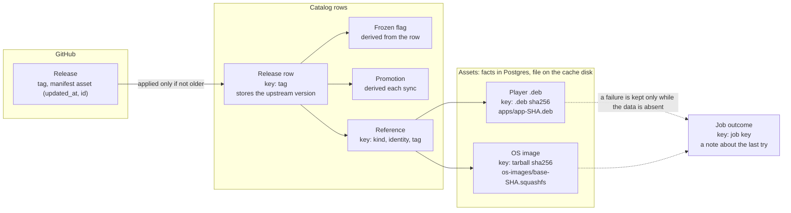
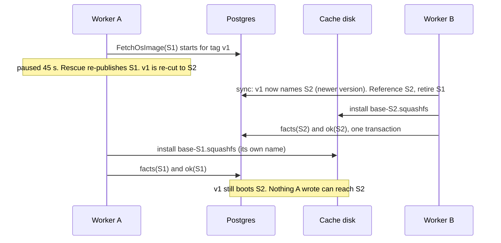
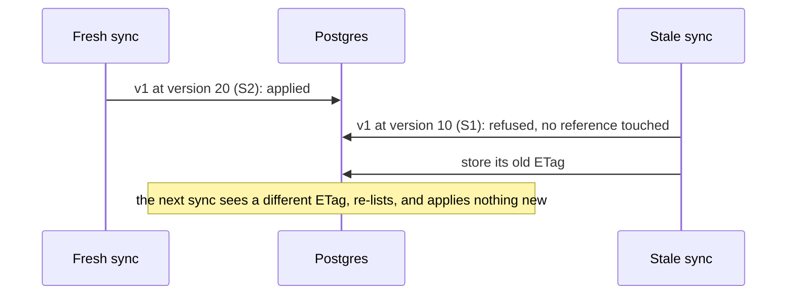
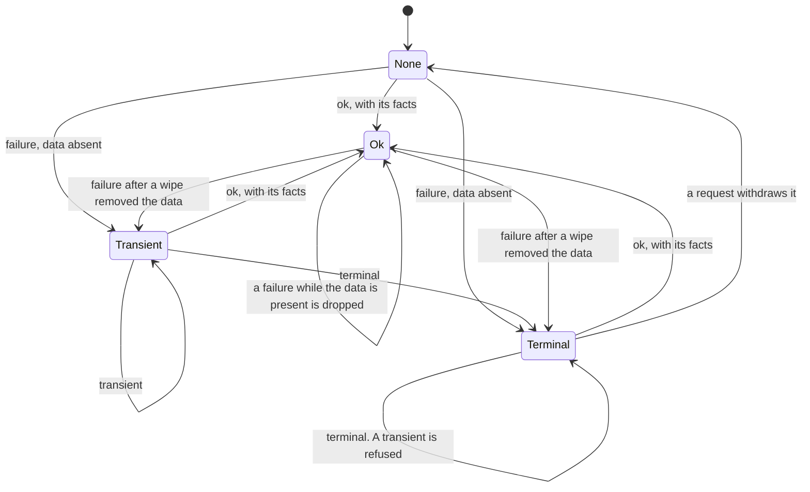

# Central: jobs may run in any order, because every piece of data converges

**Date:** 2026-09-24 · **Status:** proposed amendment to the approved
[Central system architecture](central-system-architecture.md). It replaces every earlier version of
this document (the start-order design) and every note on issue #26.
**Asked of the reader:** approve the three rules and one upgrade cost ([§9](#9-decisions)).

## 1. The problem in plain words

A worker that is silent for 30s is declared dead, and its job runs again elsewhere. The first run
may still be alive and finish later. Jobs therefore run twice, late, and out of order. That is
normal. What must be true:
- Whatever order runs finish in, the files, the catalog and the promotion end up correct.
- A Pi is never served bytes that differ from the facts recorded for them.
- A late failure never hides data that is already there.
- No worker, paused or killed, can stop rescue for the whole fleet.

| Owner decision this builds on | Source |
| --- | --- |
| Job order is not data order. Each data type gets an identity and an idempotent write rule | ruling 2026-09-24 |
| No start-number sequence, fencing, ownership check or "newest run wins" | ruling 2026-09-24 |
| Decision 3: a terminal failure is retried by the next request, never by a tick. 3a: a terminal may run once more if its worker dies after recording it | architecture §9; ruling 2026-09-24 |
| The cache is ephemeral: it may be wiped at any time, and correctness must survive | owner, 2026-09 |
| An automatic promotion never moves an operator's (#23) | ruling 2026-09-23 |

| Fact about today's code | Where | Consequence |
| --- | --- | --- |
| A `.deb` is already named by its sha256, and its facts are write-once | `central/assets/layout.py:22-25`; `central/infra/asset_records.py:107-124` | Two runs write the same bytes to the same name |
| An OS image is named by its **tag**. A re-cut clears its facts | `central/kernel/job_types.py:19-21`; `central/content_catalog/sync.py:103-115` | A late run can write an old build under the new facts (old R2) |
| A file with no facts and no expected digest is discarded and fetched again | `central/assets/production.py:56-67` | A stale sync that clears facts discards a good OS image |
| Each release is committed on its own, with no upstream version | `central/content_catalog/sync.py:62-68`; `central/infra/catalog_records.py:114-141` | A stale listing that lands last reverts the catalog |
| Once frozen, a tag stays frozen | `central/content_catalog/sync.py:127-128` | A stale listing can freeze a tag for good |
| The outcome upsert has no condition | `central/infra/outcomes.py:73-88` | A late `terminal` replaces an `ok` |
| A publish without `retry_terminal` skips a key whose outcome is `terminal` | `central/infra/publisher.py:79-80` | That stale `terminal` stops `Prefetch` refilling after a wipe |
| GitHub gives every asset a required `id` and `updated_at`; a release's own `updated_at` is optional; the listing ETag covers a page, not a release | GitHub REST 2022-11-28, releases and assets; `central/origins/github.py:320-328` | A release's version is its `manifest.json` asset's `(updated_at, id)` |
| Rescue runs under the one-runner lock like every job; a pending row cannot start while a running row holds it | `central/infra/job_queue.py:95-98`; procrastinate `schema.sql:102` | A stalled rescue blocks every later rescue |
| Retrying a row in place fails while a copy is pending | procrastinate `schema.sql:100` (probe P1) | Rescue re-publishes, then closes the stalled row (`central/infra/queue_ops.py:88-96`) |

## 2. The answer in one picture

**The three rules**
1. **Name bytes by what they are made from.** Every file's key is the digest of its upstream
   bytes. Its facts are written once and never cleared. A re-cut is a new key, so a late run can
   only write the same bytes under the same name.
2. **Apply an upstream observation only if it is not older.** A release row stores GitHub's
   version with it, and an older observation is refused whole. Whatever is derived from rows
   (the frozen flag, references, the automatic promotion) is recomputed, never carried over.
3. **Readiness is the data. An outcome is a note.** Ready means facts recorded and the file on
   disk. A failure is recorded only while the data is absent. A terminal failure stands until a
   request withdraws it.

## 3. Glossary

- **Run:** one execution of a job. **Zombie:** a run declared dead that is still going.
- **Content key:** an asset's identity, the sha256 of the upstream file it is made from.
- **Facts:** the produced file's size and sha256, recorded once per content key.
- **Observation:** what one sync saw for one release. **Upstream version:** its manifest asset's
  `(updated_at, id)`.
- **Derived value:** a column computed from other rows on every write, never read back as input.
- **Withdraw:** a request's publish deletes the key's standing `terminal` outcome before it
  enqueues a new run.

## 4. How each data type converges

| Data | Identity and where it lives | Write rule | Why any order of runs converges |
| --- | --- | --- | --- |
| Player `.deb` | `.deb` sha256. `apps/app-<sha256>.deb`; `assets` row | Verified bytes are renamed onto the name. Facts are written once: equal is a no-op, different is refused | Every run writes the same bytes to the same name, and the same facts |
| OS image (changed) | Base tarball sha256, from the manifest. `os-images/base-<tarball sha256>.squashfs` | As the `.deb`. A re-cut is a new key. Facts are never cleared | The squashfs is fixed by the tarball: extraction reads two exact members and checks the squashfs against the tarball's own `SHA256SUMS` (`central/assets/os_image.py:59-92`) |
| Reference | `(kind, identity, tag)` in `asset_references` | Written only with an applied observation. Retiring a reference never deletes the asset's facts | Follows the release rows |
| Release row (changed) | Tag, in `app_releases` | Applied only if its upstream version is not older than the stored one, with its references, in one transaction under the row lock | The row holds the newest observation, whatever order they land in. Equal versions re-apply as a no-op |
| Listing ETag | Singleton, `app_release_poll` | Last writer wins. Stored only after the rows it vouches for | A stale ETag costs one full listing. The guarded rows make that listing a no-op |
| Frozen flag (changed) | Tag, `app_releases.mirror_state` | Computed inside the guarded write: the stored `.deb` was produced and upstream's differs | Derived from the observation it belongs to. Upstream returning to the produced `.deb` unfreezes it |
| Automatic promotion (changed) | Singleton, `app_release_policy` | Take the policy row lock, then read the rows, then write. An operator's promotion is never moved (#23) | The last writer read every row committed before it |
| Job outcome (changed) | Job key, in `job_outcomes` | See §6 | An `ok` arrives with its data, so it wins over any failure in any order |

**What a zombie can still do:** repeat a download; write the same bytes to the same name; record a
failure for data that is truly absent. It cannot write another key's file, clear facts, revert a
row, freeze a tag, or hide present data.

**The invariant:** every stored value is either a pure function of its key, the newest upstream
observation, or recomputed from current rows. Enforced by construction (content keys) and by
transactions (guarded writes).

## 5. Walkthroughs

| Situation | What a Pi or an operator sees |
| --- | --- |
| A worker pauses past 30s mid-download | At worst one 503, then success. The zombie changes nothing |
| A release is re-cut while a worker stalls | Pis boot the new build as soon as it is fetched. Never the old one under the new facts |
| A stale sync lands last | Nothing changes |
| A cache wipe | Files are fetched again. Facts stay, so a re-fetch is checked against them |

## 6. The hard part: the job outcome

The outcome serves two things only: a waiter (`JobHandle` resolves to `Ready`, `Failed` or
`Pending`, unchanged) and backoff (PB2 transient windows; PB3 terminal skips a tick's publish).
It is never readiness: the reader and `Prefetch` already decide from facts plus file
(`central/assets/reader.py:166-185`, `central/assets/handlers.py:103-113`).

1. **`ok` is written with its data**, facts and outcome in one transaction, always.
2. **A failure is written only while the data is absent.** The failure's transaction locks the
   asset row, then checks for facts and the file. A present result makes the failure a no-op: no
   NOTIFY, no redelivery, and the row ends `succeeded`. The result write takes the same lock
   first, so the two cannot cross (probed on PostgreSQL 16 in both orders).
3. **A terminal stands against a transient.** A transient never replaces a terminal, and refused
   means no redelivery. A request's publish (`retry_terminal`) withdraws the terminal first.
4. **A waiter checks the data before the outcome.** After any wait, the reader tries to open the
   asset; it reports a failure only if nothing opens.

**Decision 3 still holds.** Ticks (`Prefetch`, the periodic sync) never set `retry_terminal`, so a
terminal key stays skipped. Requests (a miss, a substitute serve, pin, promote, refresh) withdraw
it and run again. A zombie's late transient can no longer turn a terminal into something ticks
retry. 3a stays: a terminal whose worker dies before closing its row runs once more. A sync
publishes with `retry_terminal` only for a changed reference: a new key, which has no outcome
yet, or the same bytes at a new URL, which is new input, not a retry.

**Runtime: what stays and what goes**

| Mechanism | Verdict | Why | Cost |
| --- | --- | --- | --- |
| Rescue's one-runner lock | **Delete** | A stalled rescue blocked all rescue. procrastinate's documented rescue takes only the one-pending lock | Two overlapping rescues: the copy merges; the second close fails and logs `rescue_incomplete` |
| Rescue re-publishes, then closes the row | Keep | Retrying in place fails while a copy is pending (P1) | Two statements. A crash between them leaves the row for the next tick |
| Completion guard | Keep | A failed close under a live worker would hold the key's lock forever, and rescue never sees a live worker | Up to 3.5s of retries, then the worker exits |
| One-runner lock on every other job | Keep, as a saving only | It stops a second 1 GB download. Correctness no longer depends on it | none |
| Early-copy deferral | Keep | Backoff, not ordering | none |
| Clearing facts on a re-cut, the re-check before rename, the sticky freeze | **Delete** | Rules 1 and 2 replace them | Old files stay on disk until the cache sweep |
| Retire deleting the asset row | **Delete** | Facts of a content key are true forever | Unreferenced rows stay until the cache sweep |

## 7. The next consumer: media (stated here, built there)

| Media data | Identity and rule |
| --- | --- |
| Original | Immich's `checksum` (content already, `media/immich.py:281`). Rule 1 |
| Media catalog (`SyncMediaSource`) | `(source, Immich asset id)`, guarded by Immich's per-asset `updatedAt` (not read today). Rule 2 |
| Variant | Key `original + recipe`. Rendering is not reproducible (`docs/module-media-preparation.md:33`), so the bytes live under their own sha256, and the variant row points at it. The pointer is set if unset, or if its file is gone (compare-and-set). The first installed file wins; later runs adopt it. This is an OCI tag pointing at a digest |

No new machinery: the same three rules, one handler each. **Finding for media:** architecture
decision 1 calls a variant's digest write-once. That cannot survive a wipe while rendering is not
reproducible. The pointer rule above is the fix.

**Shapes not chosen.** *Newest-started run wins* (a start sequence): rejected by the owner. It
orders jobs, not data, cannot guard the disk, and refused true results. *Fencing:* three failed
reviews. *No guards, heal at the next sync* (pure level-triggered): the cheapest shape, but a
stale sync reverts the catalog for up to 15 minutes, and Pis can downgrade and upgrade again.
**Prior art:** git, OCI and Nix content addressing; Kubernetes `resourceVersion`; OCI tag to
digest; idempotent jobs in Oban and Sidekiq.

## 8. Storage, lifecycle, migration

- **Migration 028 (bead 1):** re-key `os-image` assets from tag to `base_tarball_sha256`. One
  row per distinct sha, one reference per tag. **No facts are carried** (§9). Delete
  `job_outcomes` rows named `os_image.fetch`. Pending job rows of the old shape fail to decode
  once and are purged. *Rollback:* revert the code and clear `app_release_poll.etag`, so the old
  sync re-references by tag. That costs one download per desired OS image.
- **Migration 029 (bead 3):** `app_releases.upstream_changed_at DOUBLE PRECISION` and
  `upstream_asset_id BIGINT`, both NULL or both set. Clear the ETag, so the first sync stamps
  every row. A NULL stored version loses to any observation. *Rollback:* a code revert, since old
  code never names the columns.
- **Cleanup:** legacy `base-<tag>.squashfs` files and unreferenced asset rows are removed by
  `MaintainCache` (programme item 2), or by hand before then.

## 9. Decisions

| # | Question | Recommendation | Cost of the recommendation | Alternative |
| --- | --- | --- | --- | --- |
| 1 | After the upgrade, each OS image Pis want is downloaded once more. A Pi that reboots in those minutes fails its base fetch, reboots, and boots once the image lands | Accept; upgrade when no Pi is expected to reboot | One ~1 GB download per desired OS image, and at most a few extra reboot cycles | Carry the old files and facts across by tag. Cost: any tag re-cut while a worker stalled before the upgrade (old R2) keeps a wrong build, now permanently under a content key |

**Assumptions made on your behalf** (say so if any is wrong):
1. A re-uploaded GitHub asset is a new asset with a later `updated_at`, and a larger `id` on a tie.
2. Deleting a manifest upstream without a replacement leaves the last facts (no withdrawal in MVP).
3. Central and workers upgrade together (Compose replaces both).
4. procrastinate stays 3.9.0; P1 and the lock indexes are pinned by tests.

## 10. Deliberately out of scope

**Deferred:** the cache sweep (`MaintainCache`); a bound on a paused transaction's locks (R6); the
worker's stop reason (defect 3); media's rules (§7).
**Non-goals:** exactly-once runs; stopping duplicate work; any ordering of jobs.

## 11. What can go wrong

Strength: **construction** (unrepresentable) > **transaction** (Postgres enforces it) >
**decision** (one code path) > **test** > **documented**.

| Proven defect (#26) or old residual | After this design | Strength |
| --- | --- | --- |
| 1. A late outcome overwrites `ok` with `terminal` | Dropped: the data is present (rule 3) | transaction |
| 2. A pruned worker's heartbeat updates nothing; its fetch fails a foreign key | Harmless. Its jobs were rescued, its late writes obey the rules, and it exits and restarts (T7) | test |
| 3. An outage takes ~279s to stop a worker, and the reason is lost | Harmless to data: a worker with no database writes nothing. The lost reason is observability, deferred | documented |
| 4. A stalled rescue blocks all rescue | Rescue has no one-runner lock | decision + test |
| 5. Rescue's close-by-id shuts a live row | One extra concurrent run, which the rules make converge | construction + transaction |
| 6a. A zombie sync freezes a tag | Refused as older. The flag is derived, not carried | transaction |
| 6b. A zombie sync reverts the catalog | Refused as older | transaction |
| 6c. A zombie sync discards a good OS image | Facts are never cleared; a re-cut is a new key | construction |
| R1. A stale sync lands last | Gone (6b) | transaction |
| R2. Old OS bytes after a re-cut | Gone: a late run writes only its own key | construction |
| R3. A refused `ok` forces a re-download | Gone: an `ok` is never refused | construction |
| R4. Rolling deploy with old workers | Old-shape rows fail to decode once. Old workers write unguarded until they stop; the next sync repairs the rows, and any tag-keyed row they add is never desired | documented |
| R5. A late transient carries the backoff one step early | Unchanged, pacing only. A transient refused by a terminal no longer redelivers | documented |
| R6. A paused process inside a transaction holds a row lock | Unchanged: writers of that row fail at the 5s lock timeout and retry next tick | documented |

**New residuals, stated plainly.**
- **N1.** Stated plainly: if a wipe removes a file just after a copy produced it, and a zombie's
  failure then lands, that failure is recorded. Ticks skip the key until a Pi or operator asks.
- **N2.** Stated plainly: a release's prerelease flag has no upstream version of its own. With
  prereleases enabled, a stale sync can revert the flag until the next sync (15 minutes).
- **N3.** Stated plainly: a result write that fails (a database error) leaves no outcome. Waiters
  time out and `Prefetch` retries within 5 minutes. An OS image installed without facts is
  downloaded again.
- **N4.** Stated plainly: two zombie syncs racing the very first automatic promotion can leave
  an older tag until the next sync. Only the first promotion has no row to lock.

## 12. How the design got here

- **Fencing:** a run checked it still owned its row. Rejected: a lock cannot fence the disk.
- **Start order:** the newest-started run's result won. Rejected by the owner.
- **This revision:** each data type has an identity and a write rule, and the outcome defers to
  the data.
- **Survived every attack:** rescue by re-publishing, the completion guard, write-once facts.
- **Spec found wrong:** architecture §6(c) says a publish "merges into a running copy". It inserts
  a pending row that runs afterwards (harmless now).

## 13. What happens after the gate

Each bead is green alone, carries every test it breaks, and has a frozen page in
`.claude/idempotent/`.

| # | Bead | Makes true | Runs |
| --- | --- | --- | --- |
| 1 | `os-image-content-key` (tracer) | Rule 1 for OS images; retire keeps facts; migration 028 | first, alone |
| 2 | `outcome-follows-data` | Rule 3 | after 1; parallel with 3 and 4 |
| 3 | `catalog-follows-upstream` | Rule 2; migration 029 | after 1; parallel with 2 and 4 |
| 4 | `rescue-lock-free` | Rescue takes no one-runner lock | after 1; parallel with 2 and 3 |
| 5 | `two-pod-pause` | T7: a real SIGSTOP and SIGCONT keeps the copy's `ok` | after 2 and 3 |
| 6 | `idempotent-jobs-docs` | Architecture, runbook and cache docs match the code | last |

Packages touched: `central/kernel`, `central/assets`, `central/content_catalog`, `central/infra`,
`central/origins`, `central/migrations`, `central/content_routes.py`, `central/content_wiring.py`.
Specs amended: [the architecture](central-system-architecture.md) §0, §4, §5, §6, §9, §10;
[the runbook](runbook.md); [the cache module](module-central-cache.md).

**Tracer T1-T6** (bead 1, PostgreSQL, fake origin): tag v1 at tarball S1 is produced. v1 is
re-cut to S2 and synced; a `FetchOsImage(S1)` run held mid-download finishes after S2 is produced.
The boot route serves S2's bytes with S2's digest; `base-S1` and its facts are intact. A
stale-then-fresh listing never downloads S2 twice; two tags sharing a tarball give one candidate;
a substitute serve records the substitute's tag. Migration 028 re-keys without facts.
*Mutation probes:* skip retiring the old key on a re-cut; let retire delete the asset row; drop
the one-candidate-per-tarball rule; record the first candidate's tag instead of the served one;
carry facts in 028. Each must turn a named test red.
