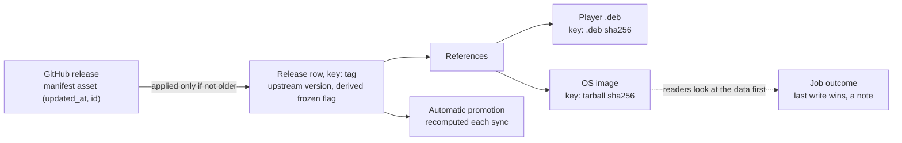
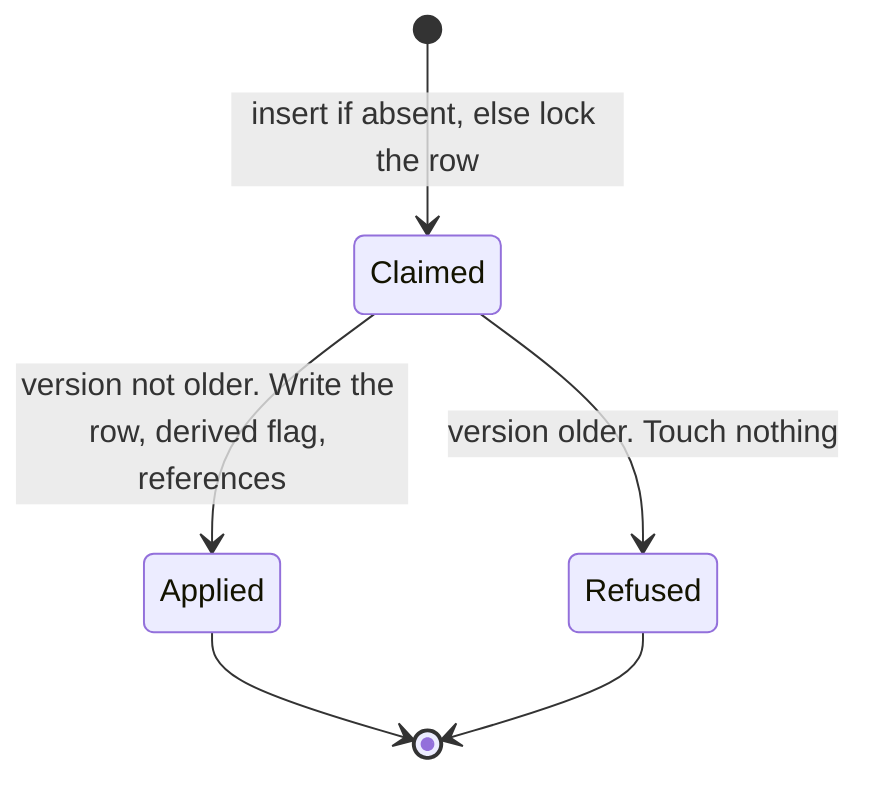
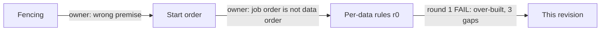

# Central: jobs may run in any order, because every piece of data converges

**Date:** 2026-09-24 · **Status:** implemented (beads 1 to 5,
[§13](#13-what-happens-after-the-gate)). An approved amendment to the
[Central system architecture](central-system-architecture.md). It replaces every earlier version
of this document and every note on issue #26. The one Pi-visible cost, the upgrade re-download, is
decided ([§9](#9-decisions)); the runbook carries its
[procedure](runbook.md#upgrading-to-content-keyed-os-images-migration-028).

## 1. The problem in plain words

A worker that is silent for 30s is declared dead, and its job runs again elsewhere. The first run
may still be alive and finish later. Jobs therefore run twice, late, and out of order. That is
normal. What must be true:
- Whatever order runs finish in, the files, the catalog and the promotion end up correct.
- A Pi is never served bytes that differ from the facts recorded for them.
- A late failure never hides data that is there: readiness comes from the data.
- No worker, paused or killed, can stop rescue for the whole fleet.

| Owner decision this builds on | Source |
| --- | --- |
| Job order is not data order. Each data type gets an identity and an idempotent write rule | ruling 2026-09-24 |
| No start-number sequence, fencing, ownership check or "newest run wins" | ruling 2026-09-24 |
| Decision 3: a terminal failure is retried by the next request, never by a tick. 3a: it may run once more if its worker dies after recording it | architecture §9 |
| The cache may be wiped at any time, and correctness must survive | owner, 2026-09 |
| Upgrade by re-downloading OS images once, with a runbook preflight | ruling 2026-09-24 (§9) |

| Fact about the code before this design | Where (pre-#26) | Consequence |
| --- | --- | --- |
| A `.deb` is named by its sha256; facts are write-once | `central/assets/layout.py:22-25`; `central/infra/asset_records.py:107-124` | Two runs write the same bytes to the same name |
| An OS image is named by its **tag**, and a re-cut clears its facts | `central/kernel/job_types.py:19-21`; `central/content_catalog/sync.py:103-115` | A late run can put an old build under new facts (old R2) |
| A file with no facts and no expected digest is discarded and fetched again | `central/assets/production.py:56-67` | A stale sync that clears facts discards a good OS image |
| Each release is committed alone, with no upstream version; once frozen, a tag stays frozen | `central/content_catalog/sync.py:62-68`, `:127-128` | A stale listing reverts the catalog or freezes a tag for good |
| The reader and `Prefetch` decide from facts plus file, never from the outcome | `central/assets/reader.py:166-185`; `central/assets/handlers.py:103-113` | A late failure over present data changes nothing a Pi sees |
| An OS-image fetch downloads only from its newest reference | `central/assets/handlers.py:42` | Once keys are shared, one deleted release strands the others |
| Rescue runs under the same one-runner lock as every job | `central/infra/job_queue.py:95-98` | A stalled rescue blocks every later rescue |

## 2. The answer in one picture



**The three rules**
1. **Name bytes by what they are made from.** An asset's key is the sha256 of its upstream file.
   Its facts are written once and never cleared, and any reference to that key may supply the
   bytes. A re-cut is a new key, so a late run can only write the same bytes under the same name.
2. **Apply an upstream observation only if it is not older.** A release row stores GitHub's
   version, and an older observation is refused whole. Whatever derives from rows is recomputed,
   never carried. A full re-list at least hourly repairs anything an equal version let through.
3. **Readiness is the data. An outcome is a note.** Ready means facts recorded and the file on
   disk. The outcome row is last-write-wins; `ok` arrives with its data, and readers check the
   data before they read the outcome.

## 3. Glossary

- **Run:** one execution of a job. **Zombie:** a run declared dead that is still going.
- **Content key:** an asset's identity, the sha256 of the upstream file it is made from.
- **Facts:** the produced file's size and sha256, recorded once per content key.
- **Observation:** what one sync saw for one release. **Upstream version:** its manifest asset's
  `(updated_at, id)`, taken only from a manifest that was read, valid (a JSON object, schema 1, a
  well-formed `player_deb`) and complete (that `.deb` attached to the release). An unread,
  invalid or `asset_missing` manifest never has one.
- **Derived value:** a column computed from other rows on every write, never read back as input.

## 4. How each data type converges

| Data | Identity and place | Write rule | Why any order converges |
| --- | --- | --- | --- |
| Player `.deb` | `.deb` sha256; `apps/app-<sha>.deb` | Checked bytes renamed onto the name; facts once (equal is a no-op) | Every run writes the same bytes and facts |
| OS image (changed) | Base tarball sha256; `os-images/base-<sha>.squashfs` | As the `.deb`; every reference is tried, newest first | Extraction reads two exact members and checks the squashfs against the tarball's own `SHA256SUMS` (`central/assets/os_image.py:59-92`), so the bytes are fixed by the key |
| Release row, its references, the ETag (changed) | Tag, `app_releases` | Insert if absent, else lock the row; apply only if the version is not older; references change only with an applied row. The ETag is stored after the rows, and trusted for one hour | The row holds the newest observation. A stale ETag costs one full listing |
| Frozen flag (changed) | `app_releases.mirror_state` | Computed from the locked previous row inside the guarded write | Derived from its own observation; upstream returning to the produced `.deb` unfreezes it |
| Automatic promotion (changed) | `app_release_policy` | One advisory lock per sync tail, then read the rows, then write. An operator's promotion is never moved (#23) | The last writer read every row committed before it |
| Job outcome | Job key, `job_outcomes` | Last write wins; `ok` is written with its facts | Readiness never depends on it |

**What a zombie can still do:** repeat a download; write the same bytes to the same name; leave a
stale failure note. It cannot write another key's file, clear facts, revert a row, freeze a tag,
or keep a Pi from being served data that is present.

**Decision 3 still holds.** Ticks never set `retry_terminal`, so a terminal key is skipped until a
request (a miss, a substitute serve, pin, promote, refresh) retries it, or until
`PurgeFinishedJobs` drops the note after 30 days (`central/infra/queue_ops.py:148-152`). A re-cut
is a new key with no note. A sync's `retry_terminal` publish fires only when a key gains or
changes a reference: new input, not a retry.

**Legacy tags.** A tag that `release_version` refuses (e.g. `v1.2.3foo`, which the table's prefix
CHECK admits) is never a netboot candidate or substitute and never desired. The one rule is
`_os_image_job(row)`, through which `_resolve_base`, `desired_in` and `pin` build every OS-image
job; `pin` also refuses such a tag up front (`invalid_tag`). The tag-keyed job used to refuse it;
the sha-keyed job cannot.

**The invariant:** every stored value is a pure function of its key, the newest upstream
observation, or recomputed from current rows. It is enforced by construction (content keys) and
by transactions (guarded writes).

## 5. Walkthrough: a re-cut while a worker is paused

```mermaid
sequenceDiagram
  participant A as Worker A
  participant DB as Postgres
  participant D as Cache disk
  participant B as Worker B
  A->>DB: FetchOsImage(S1) starts for tag v1
  Note over A: paused 45 s. Rescue re-publishes S1. v1 is re-cut to S2
  B->>DB: sync: v1 at a newer version names S2; reference S2, retire S1
  B->>D: install base-S2.squashfs
  B->>DB: facts(S2) and ok(S2), one transaction
  A->>D: install base-S1.squashfs (its own name)
  A->>DB: facts(S1), then any note
  Note over DB,D: v1 boots S2. Nothing A wrote can reach S2
```

1. A stale sync landing after B's is refused as older, and touches no reference.
2. If A fails instead, its note replaces B's `ok`. Pis are still served S2: the reader opens
   facts plus file before it consults any outcome.

## 6. The hard part: applying one release observation



1. **Lock before reading.** `INSERT ... ON CONFLICT DO NOTHING`, then `SELECT ... FOR UPDATE`; the
   previous row and the frozen flag come from the locked row. A concurrent first insert waits, then
   sees the winner, so no reference is orphaned (probed on PostgreSQL 16, both orders). The frozen
   flag asks whether the old `.deb` was produced through `AssetRecords.lock_produced`, a
   `FOR SHARE` read of its asset row that serializes with `record_produced`: a recording either
   committed first and freezes the tag, or waits and lands after the re-cut was taken. Lock order
   in a release transaction: the release row, then the old `.deb`'s asset row, then the rows
   `reference` inserts.
2. **The guard:** apply when the stored version is NULL, or the new one is set and not older.
   Equal versions re-apply: a prerelease flag can change without a new manifest asset.
3. **The version** is set only for a manifest that was read, valid and complete (glossary). So a
   manifest that 404s mid-re-draft, a broken upload, or a release caught mid-upload never takes a
   working `.deb` from the Pis: unversioned, it is refused over a stored version, and the last good
   observation stays. Once the `.deb` is attached, the next sync versions the same manifest and
   applies it. *Residual:* a first observation of a new tag has no row to protect, so it is
   inserted whatever its manifest says, and the next valid observation repairs it. The version is
   `(updated_at, id)`: `updated_at` is a documented timestamp, while growing ids are not
   documented; the id only breaks a same-second tie.
4. **Hourly repair.** A stale equal-version observation can land after a fresh one whose ETag is
   stored last, and then every sync gets 304. So the ETag is stored with its time
   (`etag_stored_at`) and sent only while younger than `ETAG_MAX_AGE`, one hour (a placeholder);
   an ETag with no stored time is never sent, and an operator refresh clears it.

**Runtime.** Rescue re-publishing then closing, the completion guard and early-copy deferral all
stay: none of them orders jobs. The one-runner lock is `_lock(job)` in the queue mapping: the
job's `lock` key when its type is an asset fetch, else None. A periodic registration passes it
the field-less tick, and a publish passes the published job (`central/infra/job_queue.py`).
**Deleted:** the one-runner lock on every job type that is not an asset fetch, so rescue can never
block itself; clearing facts on a re-cut; the re-check before rename; the sticky freeze; retire
deleting the asset row. *Cost:* an operator refresh during a
running sync lists GitHub twice. The two syncs converge by rule 2.

## 7. The next consumer: media

The same rules, no new machinery: originals keyed by Immich's `checksum` (rule 1), the media
catalog guarded by Immich's per-asset `updatedAt` (rule 2), a variant pointing at its own digest.

## 8. Storage, lifecycle, migration

| Migration | Shape | Rollback |
| --- | --- | --- |
| 028 | Re-key `os-image` assets from tag to `base_tarball_sha256`, one reference per tag, **no facts**. Delete `os_image.fetch` notes. Cancel pending and fail running `photo_wall.os_image.fetch` rows (`to_regclass` guard, as 022). Add `asset_references_locator_names_the_key`: `locator_sha256 = identity`, never NULL, for both kinds. Safe to run twice | In order: end the `os_image.fetch` deliveries; drop the CHECK; revert the code; clear the ETag (one download per desired OS image). Roll forward: end them again, then delete 028's `schema_migrations` row. The exact SQL is in 028's header and the [runbook](runbook.md#upgrading-to-content-keyed-os-images-migration-028) |
| 029 | `app_releases.upstream_changed_at`, `upstream_asset_id` (both NULL or both set); `app_release_poll.etag_stored_at`; clear the ETag so the first sync stamps every row | Code revert |

*Costs:* old `base-<tag>.squashfs` files double OS-image disk until deleted (the runbook's upgrade
procedure deletes them). Each re-cut then leaves about 1 GiB and an unreferenced asset row until
`MaintainCache` exists. This reverses the programme plan's "orphan sweep before content keys", and
no slice removed unreferenced rows: C3 now must.

## 9. Decisions

| # | Question | Decided | Cost, stated plainly | Alternative (not chosen) |
| --- | --- | --- | --- | --- |
| 1 | How OS images cross the upgrade | Re-download each desired image once, after a runbook preflight: the origin is reachable, and every desired tag's tarball URL answers | A Pi that reboots before its image lands fails its fetch and reboots again. If GitHub is unreachable or a wanted tarball was deleted upstream, Pis loop on 503 and reboot until a download succeeds. A device pinned to a deleted release stays stuck | Carry the old files and facts by tag, which keeps any wrong build (old R2) permanently |

There are no open questions. **Assumptions made on your behalf** (say so if any is wrong):
1. A re-uploaded GitHub asset is a new asset with a later `updated_at`.
2. After the upgrade, deleting a manifest upstream leaves the last facts, since withdrawal is not
   in the MVP. This does **not** hold across the upgrade: 028 carries no facts.
3. Central and workers upgrade together (Compose replaces both). procrastinate stays at 3.9.0.

## 10. Deliberately out of scope

**Deferred:** `MaintainCache`, including unreferenced rows; a bound on a paused transaction's
locks; the worker's stop reason; media's rules. **Non-goals:** exactly-once runs; stopping
duplicate work; any ordering of jobs.

## 11. What can go wrong

Strength: **construction** > **transaction** (Postgres enforces it) > **decision** (one code
path) > **test** > **documented**.

| Defect (#26) or residual | After this design | Strength |
| --- | --- | --- |
| 1. A late outcome overwrites `ok` with `terminal` | Harmless while the data is present: readers check it first. After a wipe it is N1 | decision + test |
| 2. A pruned worker's fetch fails a foreign key | Harmless: its jobs were rescued, its writes obey the rules, and it restarts | documented |
| 3. An outage takes ~279s to stop a worker, and the reason is lost | Harmless to data: a worker with no database writes nothing | documented |
| 4. A stalled rescue blocks all rescue | Rescue takes no one-runner lock | decision + test |
| 5. Rescue's close-by-id shuts a live row | One extra concurrent run, which the rules make converge | construction + transaction |
| 6. A zombie sync freezes a tag, reverts the catalog, or discards a good OS image | Refused as older; the flag is derived; facts are never cleared | transaction + construction |
| R2. Old OS bytes after a re-cut | Gone: a late run writes only its own key | construction |
| R4. Rolling deploy with old workers | Old-shape rows are cancelled by 028. Old workers write unguarded until they stop; the next sync repairs | documented |
| R5. A late transient paces the backoff | Unchanged; pacing only | documented |
| R6. A paused process holds a row or lock inside a transaction | An asset row, a release row or the promotion lock stays held until the process resumes or its connection closes. Writers fail at the 5s lock timeout and retry next tick; syncs fail meanwhile | documented |

**Residuals, stated plainly.**
- **N1.** Stated plainly: a stale `terminal` over data that a wipe then removed makes ticks skip
  the key. The same happens if a zombie's terminal lands after a request's retry. The next request
  retries it, and the 30-day purge clears it.
- **N2.** Stated plainly: an equal-version stale observation (the prerelease flag) can stand for
  up to 75 minutes: the one-hour ETag trust plus one 15-minute sync.
- **N3.** Stated plainly: a result write that fails leaves no note. Waiters time out, `Prefetch`
  retries within 5 minutes, and an OS image installed without facts is downloaded again.

## 12. How the design got here



- **Not chosen:** fencing (a lock cannot fence the disk); newest-started run wins (orders jobs, not
  data). Round 1 cut two outcome rules: "a failure only while the data is absent" (redundant with
  data-first readers) and "a terminal stands against a transient" (run ordering in disguise).
- **Round 1 fixes:** lock-then-read for release rows; every reference tried; a version needs a read
  manifest body; hourly repair of equal versions.
- **Implemented** (beads 1 to 5). Where the code went past the frozen pages: an invalid or
  `asset_missing` manifest is unversioned (owner); the frozen flag reads under `lock_produced`;
  `_lock` takes the job, not its type; `_os_image_job` keeps legacy tags out; 028 gained its
  rollback order and the reference CHECK; the substitute publish runs in the open's transaction.
- **Survived every attack:** content keys, the version guard, the derived flag, lock-then-read
  promotion, rescue by re-publishing, data-first readers. **Prior art:** git, OCI and Nix content
  addressing; Kubernetes `resourceVersion`; HTTP cache max-age.

## 13. What happens after the gate

| # | Bead | Makes true | Runs |
| --- | --- | --- | --- |
| 1 | `os-image-content-key` (tracer) | Rule 1; every reference tried; migration 028 | first, alone |
| 2 | `reader-data-first` | Rule 3; the missing defect-1 test | after 1; parallel with 3 and 4 |
| 3 | `catalog-follows-upstream` | Rule 2; migration 029 | after 1; parallel with 2 and 4 |
| 4 | `rescue-lock-free` | One-runner lock only on asset fetches | after 1; parallel with 2 and 3 |
| 5 | `idempotent-jobs-docs` | Architecture, runbook, README and cache docs match | last |

Frozen pages: `.claude/idempotent/`. Specs amended:
[the architecture](central-system-architecture.md), [the runbook](runbook.md),
[the cache module](module-central-cache.md), `README.md`.

**Tracer** (bead 1, PostgreSQL, fake origin): v1 at tarball S1 is produced, then re-cut to S2; an
S1 run held mid-download finishes after S2 is produced. The boot route serves S2 with S2's digest;
S1's file and facts are intact. *Mutation probes, each red on a named test:* skip retiring the old
key; retire deletes the row; fetch only from the newest reference; drop one-candidate-per-tarball;
record the wrong served tag; carry facts in 028.
