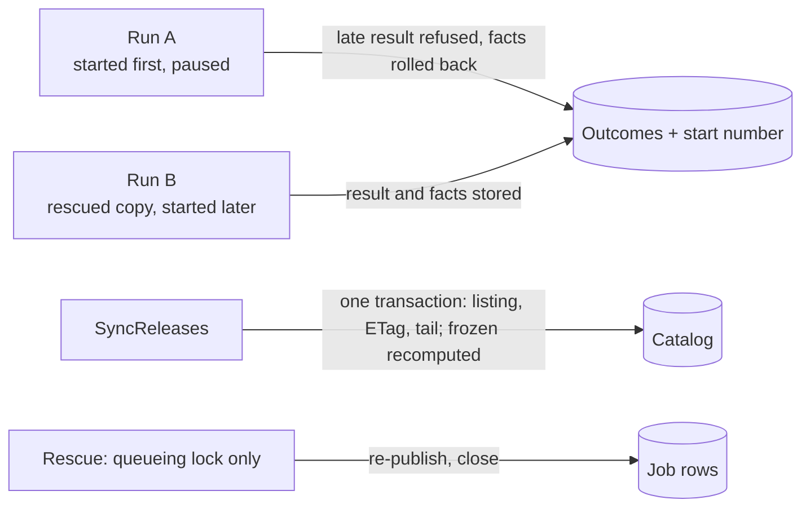
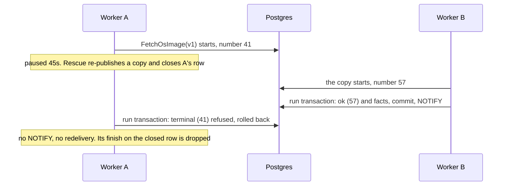
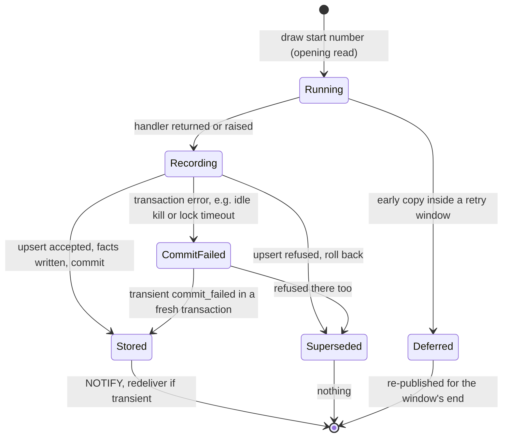

# Central: jobs run at least once, and every job is idempotent

**Date:** 2026-09-24 · **Status:** proposed amendment to the approved
[Central system architecture](central-system-architecture.md), revised after review round 1 and the
owner's scope ruling. It replaces the rejected fencing design and every note on issue #26.
**Scope:** the owner chose a lean build now, four beads plus docs. The rest ships with the media
programme (§7). **Asked of the reader:** approve. There are no product questions ([§9](#9-decisions)).
**One residual heals slowly:** R2 can boot a tag's previous build until its next re-cut
([§11](#11-what-can-go-wrong)).

## 1. The problem in plain words

A worker that is silent for 30s is declared dead, and its job runs again elsewhere. The worker may
still be alive, after a pause or during a graceful drain longer than 30s, and it can finish later.
The owner ruled that this is normal. What must be true:
- A late run never replaces the result of a run that started after it.
- No worker, paused or killed, can stop rescue for the whole fleet.
- The release catalog converges to what GitHub says, whatever order the syncs finish in.
- Any case where running twice still does harm is named, with its time to heal (§11).

| Owner decision this builds on | Source |
| --- | --- |
| At-least-once delivery. Every job must be idempotent (Celery `acks_late`, Sidekiq, Oban) | ruling 2026-09-24; fencing rejected |
| A job recorded `terminal` may run once more if its worker dies after recording (3a) | ruling 2026-09-24 |
| Build the lean scope now. The general handler split and content-keyed names ship with media | ruling 2026-09-24 |

| Fact (procrastinate 3.9.0; probes on PostgreSQL 16) | Where | Consequence |
| --- | --- | --- |
| The outcome upsert has no condition. Rescue re-publishes at the SAME attempt | `central/infra/outcomes.py:77-83`; `central/infra/queue_ops.py:88-90` | A zombie's late `terminal` replaces the copy's `ok`, and attempt numbers cannot order the two runs |
| Rescue runs under a running lock | `central/infra/job_queue.py:95-98`; `schema.sql:102` | P2: a stalled rescue blocks every later tick |
| Retrying a running row in place fails while a copy is pending | `schema.sql:100`, `:386-394` | P1: `retry_job` raises, so rescue keeps re-publishing |
| The sync commits each release, then the ETag, then the tail. Once frozen, a tag stays frozen | `central/content_catalog/sync.py:62-68`, `:127-128` | A stale sync freezes a tag for good. A crash before the tail loses the re-cut fetches for good |
| The heartbeat stops before the drain. Prune at 30s sets `worker_id` NULL, and NULL counts as stalled | `worker.py:447-452`, `:552-570`; `queries.sql:53` | A drain longer than 30s re-runs its jobs. A pruned worker exits at its next fetch |

## 2. The answer in one picture

**The three rules**
1. **A result is stored only if no run that started later has stored one.** A refused result
   rolls back its produced facts, sends no NOTIFY, and schedules nothing.
2. **Nothing may stop rescue.** Rescue takes a queueing lock only, never a running lock.
3. **A sync lands whole and recomputes what it derives.** The listing, the ETag and the tail commit
   together, and "frozen" is recomputed from facts on every sync.

## 3. Glossary

- **Run:** one execution of a job by a worker. **Zombie:** a run declared dead but still going.
- **Start number:** drawn from `job_start_seq` (`CACHE 1`) when a run starts; later is larger.
- **Run transaction:** a run's conditional result, plus an asset job's produced facts.
- **Superseded:** a run whose result was refused because a later-started run stored first.
- **Idle limit:** the worker's 2s `idle_in_transaction_session_timeout` (a placeholder).
- **Frozen (divergent) tag:** keeps its produced `.deb` after upstream changed it.

## 4. How the invariant holds

**The audit.** For each job type: is running it twice, or a stale copy late, harmless?

| Job type | Harmless today? | After the lean build | Left for media (§7) |
| --- | --- | --- | --- |
| `FetchPackage` | Bytes and facts yes; outcome no (`central/assets/production.py:74-77`) | Rule 1 | none |
| `FetchOsImage` | **No**: named by tag; a re-cut forgets the facts; the re-check runs outside the write (`production.py:78-81`) | Rule 1: a superseded run's facts roll back | R2: a zombie that commits *first* after a re-cut, or renames late |
| `SyncReleases` | **No**: commits per release, then the ETag, then the tail; sticky freeze | Rule 3; rule 1 for its outcome | R1: a stale listing that lands *last* |
| `Prefetch` | Yes, apart from the outcome (`central/assets/handlers.py:97-113`) | Rule 1 | none |
| `PurgeFinishedJobs` | Yes, apart from the outcome (`queue_ops.py:146-155`) | Rule 1 | none |
| `RescueStalledJobs` | Twice yes; stalled **no** (running lock) | Rule 2 | none |

**Why rule 1 matters to a user.** The outcome decides what a request is told. Without rule 1, a
stale `transient` makes requests fail fast for up to an hour (PB2), and a stale `terminal` stops
`Prefetch` refilling the asset after a wipe (PB3).

**The invariant:** the stored result is the newest-started run's (transaction strength: one
conditional upsert decides). A zombie can still repeat work. It cannot replace a newer result,
record facts behind one, freeze a tag for good, or stop rescue.

## 5. Walkthroughs

1. If A had finished before B stored anything, A's real result would stand until B's replaced it.
2. A sync is one transaction: the later commit's listing wins whole, and "frozen" is recomputed (T4).

| Situation | What a Pi or an operator sees |
| --- | --- |
| A worker pauses for more than 30s mid-download | A 503 at worst, then success. The zombie changes nothing |
| A graceful drain takes longer than 30s | The job runs twice: one extra download |
| A worker pauses inside a transaction | Other writers wait up to 2s. The paused run records `commit_failed` |

## 6. The hard part: one run's lifecycle, and what the runtime keeps

| Mechanism | Verdict | Why | Cost |
| --- | --- | --- | --- |
| Rescue's running lock | **Delete** | procrastinate's documented rescue takes a queueing lock only (P2) | Overlapping rescues make one extra, harmless copy |
| Sticky freeze; per-release commits; separate tail | **Delete** | Rule 3 | A sync holds its row locks for its whole transaction. The idle limit bounds a pause |
| Rescue and retry by re-publishing | Keep | An in-place retry raises when a copy is pending (P1). A new row keeps a zombie's close off the live copy | Two statements. The next tick finishes a half-done rescue |
| Completion guard | Keep | Without it, a failed close leaves `doing` under a *live* worker, which rescue never sees (`queries.sql:39-53`) | Up to 3.5s of retries, then the worker exits |
| Early-copy deferral; prune at 30s | Keep | These are backoff, not fencing. A pruned worker's jobs are already stalled | Its exit shows as a foreign-key error |

**The tail joins the sync's transaction.** Today, a crash between the ETag commit and the tail
loses the re-cut's `retry_terminal` fetch for good: the next sync sees "unchanged" (`sync.py:62-68`,
`:140-148`). *Cost:* the promotion and device rows are held for milliseconds, or up to 2s if paused.

## 7. The next consumer: the media programme (deferred design, kept)

Media needs both halves of the full design. `SyncMediaSource` needs the ordered record writes, and a
variant needs a file that no late run can replace. These ship together, then:

| Deferred piece | What it does | Closes |
| --- | --- | --- |
| Handler split: `prepare(job) -> P` and `apply(tx, job, P) -> R` | Outside work in prepare. Our record writes in apply, inside the run transaction | R1 |
| The general rule: every record write commits in the run transaction | Generalises rule 1 to every job except queue maintenance | R1 |
| Content-keyed names: `base-<tag>-<sha256>.squashfs`, and variants by digest; legacy-name adoption | Makes wrong bytes under a served name impossible by construction | R2 (the rename) |
| Facts in the run: `record_produced(tx, key, facts, *, built_from)` with the `_recut_since` predicate | Refuses facts built from a replaced file | R2 (the facts) |
| `handle` retired | Every handler is prepare/apply, and the boot check becomes total | none |
| Orphan sweep | `MaintainCache` (programme item 2) removes files no record names | disk growth from content keys |
| `residual: runtime-stop-reason` | Pool wait bounded to 5s, and the first stop reason raised | defect 3's lost reason |

Media chooses content-keyed names over a reproducibility assumption: names guarantee it by
construction, and the media spec disclaims a reproducible build (`docs/module-media-preparation.md:33`).

**Shapes not chosen:** fencing every run (three failed reviews, and a lock cannot fence the disk);
ordering by job id (monotone only by convention, because a manual retry reuses the id); Celery's
sticky success (per task id, while our row is per key and a key legitimately re-runs).
**Prior art adopted:** Oban's `attempted_at` as a per-key start order; River's `JobCompleteTx` (the
media target); optimistic concurrency as in Kubernetes `resourceVersion`.

## 8. Storage, lifecycle, migration

- **Migration 028:** sequence `job_start_seq CACHE 1`, plus
  `job_outcomes.start_number BIGINT NOT NULL DEFAULT 0`, so existing rows lose to any new run.
  Rollback is a code revert: old code ignores the column. During the rollout, see R4.
- **No other schema change.** `mirror_state` already holds `divergent`, and recomputing it writes
  that column both ways.

## 9. Decisions

| # | Question | Recommendation | Cost of the recommendation | Alternative |
| --- | --- | --- | --- | --- |
| 1 | Build the lean scope under the three rules | Approve | The residuals R1–R6 in §11 until media lands | Build the full design now (about 12 beads) |

**Assumptions made on your behalf** (say so if any is wrong): 1. Ruling 3a applies to every job
type. 2. A waiter may see a zombie's real result if it lands before the copy's, as it can today.
3. procrastinate stays at 3.9.0 (P1 and P2 are schema-pinned tests). 4. OS-image extraction from
one locator is deterministic.

## 10. Deliberately out of scope

**Deferred to media:** every row of §7, and an idle limit on Central's own transactions.
**Non-goals:** exactly-once; stopping duplicate work; a promise about recovery time.

## 11. What can go wrong

Strength: **transaction** (Postgres enforces it) > **decision** (one code path) > **test** >
**documented**.

| # | Failure | Behaviour after the lean build | Strength |
| --- | --- | --- | --- |
| 1 | Defect 1: a late outcome overwrites (`ok` → `terminal`) | Refused, and its facts roll back (T1, T1a, T1b, T7) | transaction |
| 2 | Defect 2: a pruned worker's heartbeat updates nothing and its fetch fails a foreign key | Harmless. Its jobs were stalled at 30s anyway. It exits at its next fetch (T7) | test |
| 3 | Defect 3: an outage takes ~279s to stop a worker, and the reason is lost | Harmless for correctness: a worker with no database writes nothing. The reason is named with media | documented |
| 4 | Defect 4: a stalled rescue blocks all rescue | Fixed: queueing lock only (T3) | decision + test |
| 5 | Defect 5: rescue's close-by-id shuts a live row after a manual retry | One extra concurrent run, ordered by rule 1 | documented |
| 6 | Defect 6: a zombie sync freezes a tag for good | Fixed: recomputed on the next sync (T4) | test |
| 7 | A run pauses inside a transaction | Killed after 2s. Other writers proceed, and it records `commit_failed` (T5) | transaction |

**Residuals the lean scope leaves open, stated plainly.** All but R2 heal on their own within one
sync (15 minutes) or sooner. **R2 does not heal on its own:**

> **R2 heals only at the tag's next re-cut, not within a sync.** When an OS-image re-cut and a
> stalled worker coincide, Pis can keep booting that tag's previous build until the tag is next
> re-cut upstream. No sync, request or cache wipe repairs the recorded facts. This is the price of
> building the lean scope now. The media programme's facts-in-run closes it (§7).

- **R1. A stale sync lands last** (it paused for more than 30s between its listing and its commit).
  The catalog reverts. A cleared OS image's fetch can discard the good file (`production.py:66-67`),
  giving a 503 or an older build. *Heals:* at the next sync (≤15 min), plus one download.
- **R2. Stale or wrong OS bytes after a re-cut and a stalled worker.** An OS-image fetch pauses
  between its re-check (`production.py:78-81`) and its commit or rename, across a re-cut.
  - If it commits before the copy, the old build's facts are recorded and match its file.
    **Pis boot the previous build. It heals only at that tag's next re-cut.**
  - If it renames after the copy committed, the old bytes sit under the new facts. A different size
    heals at the next fetch. **The same size is served under the new digest until a cache wipe or
    the next re-cut.**
  - *Closed by:* content-keyed names and facts in the run (§7).
- **R3. A refused `ok` causes a re-download:** about 1 GB for an OS image (a `.deb` is adopted by
  its sha). *Heals:* at once, in the redelivered copy.
- **R4. Rolling deploy.** Until the last old worker stops, old workers still write unconditionally
  and sync per release, so defects 1 and 6 remain possible. *Heals:* when the rollout completes.
- **R5. The attempt carry.** A zombie's accepted `transient` ends that key's backoff one step early.
  *Heals:* at the next publish.
- **R6. A paused Central transaction** can hold a row lock past 2s, as today. *Heals:* when it wakes.

## 12. How the design got here

- **r0:** outcomes ordered by start, and rescue without a running lock.
- **r1:** added the run transaction, the idle limit, content-keyed names and real tests.
- **Lean:** built now: the ordering, the idle limit, lock-free rescue and a whole-sync commit. The
  rest is kept for media, and its residuals (R1, R2) are named.
- **Survived every attack:** the conditional upsert (probed in both orders), rescue by
  re-publishing, and the completion guard.
- **Spec found wrong:** architecture §6(c) says a publish "merges into a running copy". In fact it
  inserts a pending row that runs afterwards.

## 13. What happens after the gate

Each bead is green alone and carries every test it breaks. Its frozen page lives in its bead file.

| # | Bead | What it makes true | Runs |
| --- | --- | --- | --- |
| 1 | `outcome-start-order` (tracer) | Rule 1: a late result is refused, and its facts roll back. Worker transactions get the 2s idle limit | worktree 1, first |
| 2 | `rescue-lock-free` | Rule 2: rescue takes a queueing lock only | worktree 1, after 1 (they share a test file) |
| 3 | `sync-converges` | Rule 3: one transaction per sync, and "frozen" recomputed | worktree 2, in parallel from the start |
| 4 | `two-pod-pause` | T7: a real SIGSTOP/SIGCONT keeps the copy's `ok` | after 1, parallel with 2 |
| 5 | `idempotent-jobs-docs` | The architecture, the errata and the runbook match the code | last |

Bead 3's files are disjoint from the others, though it shares `central/infra` with bead 1. Its
pause-safety arrives with bead 1's idle limit.

**Tracer T1** (two `JobRuntime`s on PostgreSQL): A blocks and is rescued, and B stores `ok`; A then
returns `terminal`. B's `ok` stands, with one NOTIFY and no redelivery. *Probes:* no `WHERE`; the
number drawn at write time; a NOTIFY, a redelivery, or facts kept on refusal.
