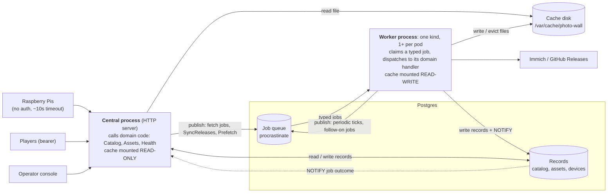
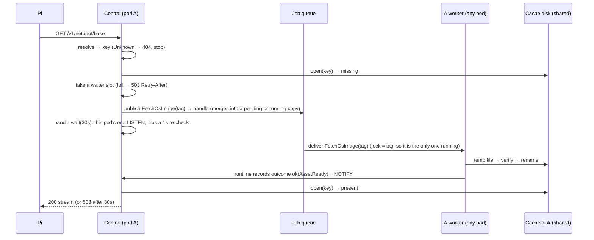

# Photo Wall Central: how content is served (system architecture)

**Status:** Approved by the owner: the shape, the module contracts (§10) and the five decisions (§9).
**Scope:** how Central serves photos, videos, the OS image and the Player `.deb`. Playback
coordination, enrollment and the console UI are out of scope; they are neighbours only.
**What it gives up:** a waiting request keeps a connection open for up to 30s. Two or more
pods only work if they share one disk, and the code cannot check that (§6). Central writes
one field of the asset record (last served). A worker that dies mid-job holds that job
until its missed heartbeats are noticed. A DB outage makes every pod NotReady, so cached files
stop being served too. A terminal fetch is retried by every request that needs it, without a rate limit.

This document uses two separate axes and never mixes them:
- **Runtime** is *what runs*: the Central process, the worker process, Postgres, and the
  cache disk.
- **Domains and jobs** are *what work exists*. There is **one kind of worker**. It
  receives many **job types** and hands each job to the domain that owns it.

---

## 0. What we are solving, and whose solution we are copying

| Problem | Established pattern | Prior art | What our stack already provides |
| --- | --- | --- | --- |
| Serve from a cache that can be wiped, backed by slow origins | **Read-through cache** | nginx `proxy_cache`, Varnish, Squid | Postgres (catalog), one disk path |
| Many clients ask for the same missing item at once | **Request coalescing / single-flight** with a wait timeout | nginx `proxy_cache_lock` + `_timeout`, Varnish waiting list, Go `singleflight` | anyio events and timeouts |
| Limit how many waiters one pod holds | **Bulkhead + load shedding** | resilience4j bulkheads, HTTP 503 + `Retry-After` | anyio `CapacityLimiter` |
| Background work across a fleet | **Competing consumers + messages dispatched by type** (command messages to command handlers) | *Enterprise Integration Patterns* (Competing Consumers, Command Message, Message Dispatcher); Celery, Sidekiq, Oban: one worker binary with a registry of job types | **procrastinate 3.9.0**: a job row carries `task_name`, and the worker looks that name up in its task registry and calls the handler |
| One producer per item; no duplicate pending work | **Unique jobs + transactional enqueue** | Oban unique jobs, Sidekiq-unique | `queueing_lock` (one pending), `lock` (one running), `defer(connection=…)` (enqueue in the caller's transaction) |
| A worker dies holding a job | **Heartbeat + re-delivery** | SQS visibility timeout, Oban Lifeline | worker heartbeats, `get_stalled_jobs()`; the job is re-published, then the stalled row is closed as failed (not `retry_job()`, see §10.3) |
| Scheduled work must run once for the fleet | **Deduplicated periodic scheduling** (no leader) | Oban cron | `@periodic` (unique key in `procrastinate_periodic_defers`) |
| A crash must not leave a half-written file visible | **Temp file + atomic rename** | Maildir | `mkstemp` + `os.replace` |
| A waiter needs to hear "it's ready" | **Notify with a polling fallback** | procrastinate's own `listen_notify` | Postgres `LISTEN/NOTIFY` |
| Fetch content before anyone asks | **Desired vs actual reconciliation** | Kubernetes controllers | a periodic job plus on-change jobs |
| Stay under a byte budget; remove files nothing refers to | **LRU eviction under a size cap + mark-and-sweep with a grace period** | nginx cache manager (`max_size`), `git gc` prune grace | none. Built per kind today. |
| Pod health vs system health | **Probes check only the process and its DB connection; the system is watched through SLI alerts** | Kubernetes probe guidance, Google SRE | FastAPI routes, OTEL |
| Keep origin quirks out of the domains | **Gateway / anti-corruption layer** | DDD | `github_releases.py`, `media/immich.py` |

Only one thing is ours alone: **release policy**, meaning which version a given Pi gets.
It is domain logic, so no library provides it.

---

## 1. The picture



**Three rules**

1. **The disk decides whether we have a file. The database decides what the file is and
   whether it should exist.** There is no "cached" flag, so no row can say "cached" while
   the file is gone.
2. **Every request takes the same path, whatever the content kind.** Resolve the request.
   Look in the cache. On a miss, publish the asset's fetch job and await its handle for up to 30s. Then serve, or
   return 503. Unknown content returns 404 at once.
3. **All background work is a job on one queue, handled by one kind of worker.** The
   lock and dedupe keys are derived from the job's fields (its subject, such as the asset key). That gives at most
   one pending and one running copy of any piece of work across the fleet, without a
   leader or a lease table.

---

## 2. Runtime: what actually runs

| Unit | How many | Hosts | Must NEVER |
| --- | --- | --- | --- |
| **Central process** (HTTP server: FastAPI/uvicorn, async) | 1 per pod | HTTP routes. Calls into domain code (resolve, read-through read, health). Waiter caps per pod (32 OS/`.deb`, 8 media). One `LISTEN` connection. *(It also runs the existing playback-coordination tick, which is out of scope.)* | Write the cache disk. Call an origin. Run a job handler. Hold a thread while it waits. |
| **Worker process** (procrastinate worker) | 1+ per pod, **all identical** | Claims jobs from every queue and dispatches each by type to its domain handler. Queues exist only to give each class of work its own concurrency (so transcoding cannot starve OS production). They never define kinds of worker. Every process runs one procrastinate loop per queue (§10.3). | Serve HTTP. Block its event loop (CPU and disk work go to threads). Do any work that did not arrive as a job. |
| **Postgres** | 1, shared | Records (catalog, assets, devices), the job queue tables, NOTIFY | Store file bytes. |
| **Cache disk** | 1 path. Per pod is fine with one pod; 2+ pods **must** share one. | Files named by asset key, in one subdirectory per kind | Be trusted to hold anything. |

---

## 3. Domains: what work exists

Each domain is code that both processes import. The HTTP server calls it for requests, and
the worker calls it for jobs.

| Domain | Owns | HTTP actions (Central) | Job handlers (worker) | Must NEVER |
| --- | --- | --- | --- | --- |
| **Catalog & release policy** | Releases, media sources and recipes, devices, pins, promotion | Resolve a request to **candidate asset keys** (pinned: exactly one; unpinned: newest first, may substitute; otherwise *Unknown* → 404). Per-device `.deb` manifest. Operator: pin/unpin, promote, refresh, media source settings. | `SyncReleases`, `SyncMediaSources`, `SyncMediaSource` | Look at the disk or download bytes. |
| **Assets & cache** | Asset records, disk layout, the read path, production, the byte budget | Serve bytes for a key through the **read-through** path: open, else publish the asset's fetch job and await its handle ≤30s, serve or 503. Record `last_served_at` (throttled). | `FetchOsImage`, `FetchPackage`, `PrepareMedia`, `Prefetch`, `MaintainCache` | Decide which version a device gets. Keep any "is cached" state. |
| **Health & signals** | Probes, fleet health, metrics | `/livez`; `/readyz` = the process is up and can reach the DB. Fleet health view for the console. | none: fleet health is **computed when read** from job outcomes and worker heartbeats | Put cache contents, origins or convergence into a probe. |
| **Queue operations** (infrastructure in `central.infra`, not a domain) | Queue hygiene | none | `RescueStalledJobs`, `PurgeFinishedJobs` | Touch domain records. |

Origin gateways (Immich, GitHub) are **adapters**, not domains. Only job handlers call
them. They download with byte caps and timeouts and classify each failure as *transient*
or *terminal*. Playback coordination is a neighbour: when a plan changes, it publishes
`Prefetch`.

---

## 4. Job catalog

Every job is a procrastinate job of a declared job type (§10.1). Its `lock` (one running copy,
fleet-wide) is derived from the type's *subject* fields. Its `queueing_lock` (one pending copy)
is derived from all its fields. Periodic jobs carry no fields, are deferred by the workers'
built-in scheduler, and are deduplicated per tick. A retry or a rescue re-publishes the job
instead of retrying the row in place (§10.1). Each job type declares its result type, and every
finished run leaves a **job outcome** that waiters read (§10.2).

| Job type | Published by | Subject (lock) | Handler (domain) | Writes | Periodic |
| --- | --- | --- | --- | --- | --- |
| `FetchOsImage(tag)` | HTTP miss; `Prefetch` | `tag` | Assets & cache | Downloads the release's base image, extracts it off the event loop, verifies it, renames it into place. Result `AssetReady`. | no |
| `FetchPackage(sha256)` | HTTP miss; `Prefetch` | `sha256` | Assets & cache | Downloads the Player `.deb` from any tag that references it (newest first), verifies it, renames it into place. Tags that share a build share one file. Result `AssetReady`. | no |
| `PrepareMedia(original, recipe)` | HTTP miss; `Prefetch` | `original`, `recipe` (the recipe id includes the renderer build) | Assets & cache | Fetches the original from Immich, renders it to the recipe, renames it into place. Result `MediaReady` (digest, size, type, dimensions, duration), kept on the Asset record. | no |
| `SyncReleases` | Tick; operator refresh (HTTP) | (none) | Catalog | Release + Asset rows (add, withdraw), then publishes `Prefetch` | yes |
| `SyncMediaSources` | Tick | (none) | Catalog | Nothing except one `SyncMediaSource(source)` per enabled source (cron fan-out) | yes |
| `SyncMediaSource(source)` | `SyncMediaSources`; operator source change | `source` | Catalog | Media catalog + `media-variant` Asset rows, then publishes `Prefetch` | no |
| `Prefetch` | Tick; after sync, pin, promote, plan change | (none) | Assets & cache | Nothing except the fetch job of each desired asset missing from disk | yes + on change |
| `MaintainCache` | Tick | (none) | Assets & cache | Removes files: least recently used *non-desired* files while over budget (never a desired file; if desired files alone exceed the budget, it stays over budget and raises a fleet-health warning), then orphans and stale temp files older than the grace period. | yes |
| `RescueStalledJobs` | Tick | (none) | Queue ops (infra) | Re-publishes jobs whose worker's heartbeat stopped, then closes their rows | yes |
| `PurgeFinishedJobs` | Tick | (none) | Queue ops (infra) | Deletes old finished job rows (procrastinate's `delete_old_jobs`) | yes |

---

## 5. The one data model

| Record | Key | Holds | Written by |
| --- | --- | --- | --- |
| **Catalog entries** (per domain) | Release `tag`; media original (`asset_id`); device `device_id` | What exists upstream and who should get what (pin, promote, last served tag) | `Sync*` handlers; HTTP operator actions; HTTP netboot (device row) |
| **Asset** (one table, every kind) | `(kind, identity)`: `(os-image, tag)`, `(player-deb, sha256)`, `(media-variant, original+recipe)` | What *should* exist and what it *is*: **references** (one per owning tag or media source: its origin locator and expected size/digest); **produced facts** (the job's result: digest, size, and for media type/dimensions/duration), which are write-once; `last_served_at`. The row goes when its last reference is retired. **The file path is computed from the key.** | `Sync*` adds and retires references. The job runtime writes produced facts. HTTP writes only `last_served_at`. |
| **Job outcome** (one table, every job type) | `(job type, subject)` | The latest attempt's *status* only: `ok`, or `transient` + `retry_not_before`, or `terminal` + reason; a global sequence number. Never facts, and never "is cached". | The job runtime only, with NOTIFY in the same transaction |
| **Job** | procrastinate job row | **All** pending, running and retrying state. It is stored nowhere else. | procrastinate |
| **Desired set** | a query | Pinned tags; current OS and `.deb` for unpinned devices; media that active plans reference | nobody (computed) |

---

## 6. Flows

**(a) A release is published and downloaded before anyone asks.** A tick publishes
`SyncReleases`, and a worker receives it. The handler polls GitHub (ETag), inserts the
Release and its Asset rows with the expected digests, and publishes `Prefetch`. A worker
receives `Prefetch`, finds both assets missing from disk, and publishes `FetchOsImage` and `FetchPackage`
(duplicates collapse). A worker receives each: it downloads to a unique temp file, verifies it
and renames it into place, and the runtime records an `ok` outcome + NOTIFY. Unpinned Pis get the
new version on their next boot.

**(b) A Pi boots and the file is present.** Central resolves the serial to candidate keys,
opens the first one present, checks its size against the Asset record, and streams it.
Central then records the served tag and a throttled `last_served_at`. No job is published.

**(c) A Pi boots and the file is missing: produce and wait**


If the Pi gives up after about 10s, the job still finishes and fills the cache. A pinned
Pi never gets a different version. An unpinned Pi waits only if *no* candidate is present.

**(d) A worker dies mid-download.** Its heartbeat stops, and its `FetchOsImage(tag)` stays
"doing", holding the key's lock. A worker later receives the periodic `RescueStalledJobs`,
re-publishes `FetchOsImage(tag)` (merging into any pending copy, which cannot start while the
stalled row holds the lock), then closes that row as failed, which releases the lock. Another worker receives `FetchOsImage(tag)` and starts again with a new temp
file. The abandoned temp file is removed by a later `MaintainCache` once the grace period
has passed. Waiters return 503 after 30s, and clients retry. We make no promise about
recovery time.

**(e) The cache is wiped.** Every read follows flow (c). `/readyz` stays green (it checks only
the process and the DB), because being healthy is not the same as having things cached. The next `Prefetch` publishes fetch jobs
for the whole desired set, and duplicates collapse. No records need repair, because no
record ever claimed a file was present.

---

## 7. Deliberately not built

- **Only one kind of worker.** No separate services or processes per job type. One worker
  binary and one task registry, the same as Celery, Sidekiq and Oban.
- **No leader election and no lease tables.** Queue claims, per-key locks and
  deduplicated ticks are enough.
- **No per-kind download-state columns.** Pending and running state lives in the queue.
  The latest finished outcome lives in one job-outcome table.
- **No check in code that 2+ pods share a disk.** Kubernetes owns placement. *Cost:* a
  misconfigured deployment keeps re-producing files. A metric ("produced but absent at
  serve") shows it; nothing blocks it.
- **No nginx or Varnish in front.** A generic proxy cannot do per-device version resolution,
  player authorization or transcoding. We copy its patterns, not the product.
- **No Range/resume, speed guarantee or recovery-time promise, and no hand-uploaded `.deb`.**
- **No rate limit on retrying a terminal fetch** (owner decision 3). *Cost:* a broken 1 GB release
  can be re-downloaded on every Pi boot. Concurrent requests still merge into one attempt.
- **No serving through a DB outage** (owner decision 5). *Cost:* `/readyz` fails on every pod at
  once, so even cached files go unserved until the DB returns.

**Two shapes considered.** *Chosen:* the HTTP process + one kind of worker + a job queue
+ a shared disk. *Rejected:* each Central pod produces in-process into its own disk. It needs
no shared disk and no queue, but every pod downloads and transcodes everything, heavy CPU
work runs inside the serving process, and N pods multiply the load on the origins N times.

---

## 8. Today vs target

- **Two job systems and four state stores → one queue and one Asset table.** Media runs a
  hand-built lease queue beside procrastinate (`media_repository.py:450-470`). State is
  spread across `base_cache`, `app_releases.mirror_state`, `app_packages`, and
  `media_jobs`/`media_blobs`.
- **Jobs are not single-purpose.** The release poll also runs failed-boot sweeps,
  self-heal, OS GC and the orphan sweep (`app_release_service.py:190-217`). The target
  splits these into `SyncReleases`, `Prefetch` and `MaintainCache`.
- **Each kind handles a miss differently, and none waits.** OS: enqueue + 503. `.deb`
  bytes: 503 with no enqueue (`app.py:432-458`). Media: marks the blob `corrupt`, with no
  way back (`media_store.py:846-853`). The serve handlers are plain `def` and run on anyio's
  40-thread pool, which the waiter caps (32 + 8) would fill. Waits must be async.
- **Workers are not yet safe as competing consumers.** OS extraction blocks the event loop
  and so the heartbeat (`netboot_base.py:1030`). Stalled jobs are never rescued. The mirror and
  base-fetch jobs have a dedupe key but no `lock` (`app_release_tasks.py:70-95`), and the `.deb` temp
  name is fixed per tag (`app_release_service.py:330-334`), so two workers can collide. The
  release enqueue has no savepoint (`app_release_queue.py:83-136`; `media_queue.py:51`
  does it correctly).
- **There is no `/readyz`; `/healthz` depends on the DB and the playback scheduler**
  (`app.py:341-377`). The target adds `/livez` and `/readyz` (process + DB) and leaves `/healthz` to
  its existing pollers.
- **The hand-upload route still exists, and there is no `.deb` budget or orphan sweep.**
  An unknown netboot serial gets 503 before any release exists; the target returns 404.
- **Media is served by output hash (`/v1/media/{sha256}`).** The target uses
  `/v1/media/{original}/{recipe}`. This is a **coordinated player + Central change**: the plan's
  media reference and the player's download and cache paths move in the same release.

---

## 9. Tracer bullet and decisions

**Tracer bullet:** the OS image only, through flow (c). An Asset table (`os-image` rows
only). The async read-through path with single-flight and 32 slots. `FetchOsImage` with
its derived lock. Extraction off the event loop. `JobHandle` waiting on the outcome NOTIFY.
`RescueStalledJobs`. `/readyz` = process + DB. **It proves** one read path, one kind of
worker, and queue-only coordination across two pods on a shared disk. **Out of scope for
the bullet:** `.deb`, media, `MaintainCache`, the fleet signal.

**Decisions (all decided by the owner)**
1. **Media identity: decided** (the recommendation; the owner had no preference). Players request
   media by original + recipe (the recipe id includes the renderer build). The digest is a
   write-once integrity check (§10.2). The player URL changes (§8).
2. **Over budget: decided.** `MaintainCache` evicts least recently used first and never a desired
   file. If desired files alone exceed the budget, the cache goes over budget and raises a
   fleet-health warning instead of fighting `Prefetch`.
3. **Terminal fetch failure: decided.** The job is not retried. The *next request* for the asset
   starts a new attempt, with no rate limit. `Prefetch` and ticks do not retry it (§10.2, cost
   in §7).
4. **Empty catalog at netboot: decided.** 404.
5. **`/readyz`: decided.** It includes the DB and still never checks cache contents, origins or
   convergence (cost in §7).

---

## 10. Module contracts

Shapes only, built on **procrastinate 3.9.0** and **pydantic 2**, copying Oban (the job type
declares its queue and uniqueness; the caller builds a value and inserts it). **Today** four
hand-written enqueues each restate a lock (`central/media_queue.py:36-61`,
`central/app_release_queue.py:83-136`), task names are strings (`allow_unknown=True`,
procrastinate `app.py:209`), three enqueues lack a savepoint, and a partial lock caused 0010 P2.

### 10.1 Job types

**One job type per real piece of work.** No job has a `kind` field.

| Job type | Result | Subject | Queue |
| --- | --- | --- | --- |
| `FetchOsImage(tag: ReleaseTag)` | `AssetReady` | `tag` | FETCH |
| `FetchPackage(sha256: Sha256)` | `AssetReady` | `sha256` | FETCH |
| `PrepareMedia(original: MediaOriginalId, recipe: RecipeId)` | `MediaReady` | both | TRANSCODE |
| `SyncReleases`, `SyncMediaSources` / `SyncMediaSource(source)` | `None` | none / `source` | FETCH |
| `Prefetch`, `MaintainCache`, `RescueStalledJobs`, `PurgeFinishedJobs` | `None` | none | UPKEEP |

**Identity rules.** A `.deb` is keyed by content hash. Each tag that ships it adds a
*reference* with its own locator, because GitHub URLs are per tag
(`central/github_releases.py:254-292`). One file has one producer, and withdrawing a tag drops
only its reference; keying by tag would let two tags race for one file. Media is keyed by original
(`asset_id`, `media/models.py:147`) + `RecipeId`, which is today's `recipe_id`. That hashes the
renderer `BuildIdentity` (`media/prepare.py:387-391`), so a worker upgrade makes *new* assets
rather than re-rendering old ones differently. Fetch + render is one job (*cost:* per-recipe
re-fetch).

```python
# central/kernel/jobs.py: pydantic + stdlib only
class QueueName(StrEnum): FETCH = "photo-wall-fetch"; TRANSCODE = "photo-wall-transcode"; UPKEEP = "photo-wall-upkeep"
@dataclass(frozen=True, slots=True)
class Delivery:
    queue: QueueName
    retry: tuple[timedelta, ...] = ()        # backoff delays; () = no retry
    priority: int = 0
    every: timedelta | None = None           # periodic; field-less jobs only
class Job(BaseModel, Generic[R]):            # frozen, extra="forbid"; R = the handler's result type
    @classmethod
    def __pydantic_init_subclass__(cls, *, name: str | None = None, delivery: Delivery | None = None,
                                   asset: AssetKind | None = None, **kw: Any) -> None: ...
class FetchOsImage(Job[AssetReady], name="os_image.fetch", asset=AssetKind.OS_IMAGE,
                   delivery=Delivery(queue=QueueName.FETCH, retry=(timedelta(seconds=5), timedelta(minutes=1)))):
    tag: ReleaseTag
AssetJob = FetchOsImage | FetchPackage | PrepareMedia   # also the typed reference to an asset
```

**Keys are derived by kernel functions, never written or overridden.** The *subject* is every
field, in declaration order; no declaration can narrow it. `job_keys(job)` gives `lock` and
`queueing_lock` = task name + those values, escaped so each key maps back to one job.
`asset_key(job)` is `(asset, the job's one field)`, so an asset's lock and its disk key name the
same thing.

**Class definition raises `TypeError`** for a missing `name`/`delivery`, a bare `Job`, a
caller-chosen key (`subject=`, `lock=`), an unkeyable field type, a duplicate `name`/`asset`,
`every` on a job with fields, `R` other than `None` without `asset=`, an asset job with more than
one field (`asset_key` names the file by it; `PrepareMedia` first needs a two-field identity),
subclassing a job type, or redefining a `Job` member (probed on pydantic 2.11.4). With no type
checker in CI, this is the strongest check available.

**Mapping** (`central/infra/job_queue.py`, the only importer of procrastinate): task
`"photo_wall." + name`; kwargs `model_dump(mode="json")` plus the reserved `timestamp`/`_attempt`;
both locks from `job_keys`; `app.periodic(cron=<every, seconds-last>)`; `retry=None`. A new
field needs a default or a new task name.

**Retry by re-publishing.** procrastinate keeps only one `todo` row per `queueing_lock`
(`procrastinate/sql/schema.sql:100`). Its in-place retry moves the running row back to `todo`,
which breaks that rule whenever a copy was published during the run; CI must test the
worker-side effect. So on `TransientFailure` **or any unclassified exception** (logged as a
bug, so ENOSPC and EIO heal), the runtime records `transient` with a capped
`retry_not_before = now + max(retry[n], retry_after)`, then re-publishes with that delay. Inside
the window `publish` inserts nothing (§10.2), and a copy that starts early re-publishes itself
for the window's end. Only an explicit `TerminalFailure` is terminal.

### 10.2 Publishing, and awaiting the result

**Prior art.** Celery `AsyncResult`, Dramatiq Results and RQ `Job.result` key by message id and read
a result backend (a timed-out waiter cancels nothing). Temporal keys by business id and returns
the running workflow on a re-start. Oban has none (Pro Relay: PubSub), and a `Future` is
single-process. **We take Temporal's keying:** ENQUEUED, merged and already-running look the same.

```python
@dataclass(frozen=True) class Ready(Generic[R]):  result: R
@dataclass(frozen=True) class Failed:  terminal: bool; reason: str; retry_after: timedelta | None
@dataclass(frozen=True) class Pending: ...
class JobHandle(Protocol[R]):     # a cheap value: (job type, lock key, since_seq); one per waiter
    async def wait(self, *, timeout: timedelta) -> Ready[R] | Failed | Pending: ...
class Publisher(Protocol):
    def publish(self, job: Job[R], *, within: Transaction, retry_terminal: bool = False) -> JobHandle[R]: ...
    async def publish_now(self, job: Job[R], *, retry_terminal: bool = False) -> JobHandle[R]: ...
```
- **Three facts, three owners.** The **disk** says whether a file is present. The **Asset
  record** says what it is: the runtime writes the handler's `R` there (`record_produced`,
  write-once). A re-production must match that digest before the rename, else
  `TerminalFailure("not_reproducible")`. So a plan never holds an unservable digest, and no
  later failure erases facts. The one exception is an OS image rebuilt under its tag (a release
  re-cut; its old bytes are gone upstream): `SyncReleases` forgets its facts (`forget_produced`),
  and a production built from the replaced locator is discarded as `reference_changed`.
  **`job_outcomes`** holds only the latest attempt's *status* per
  `(job type, subject)`. The runtime writes the facts, the status and `NOTIFY job_outcome, <lock
  key>` in one transaction, and `Ready.result` is read from the Asset record. Status is stored
  because a late waiter misses a NOTIFY. `PurgeFinishedJobs` drops rows unwritten for 30 days
  (*cost:* an old terminal outcome then retries).
- **`since`.** `publish` reads the global sequence number, *then* defers: two statements,
  because `procrastinate_defer_jobs_v1` cannot return it. `wait` resolves on any newer outcome. An
  `ok` from before a wipe never counts; a run ending between the statements does, because it
  produced the asset.
- **`publish` inserts nothing** inside a retry window (its handle is already
  `Failed(transient, retry_after)`) or after a terminal outcome (already `Failed(terminal)`),
  unless `retry_terminal` is set. The request path (`AssetReader`) always sets it, as do a sync
  that changed facts and an operator (decision 3). `Prefetch` and ticks never set it.
- **Signal.** Each process has one `OutcomeFeed` (infra) with one LISTEN connection. Waiters
  for the same key share one entry, and a 1s re-check reads the rows for keys that have waiters.
  `publish_now` and `OutcomeFeed` use a small **async** psycopg pool beside the 10-connection
  sync pool (`central/db.py:15`), because `SyncPsycopgConnector` refuses async calls. A timeout
  returns `Pending`, and a cancelled waiter only unregisters. **Neither cancels the job.**
- **Transactions.** `publish(within=tx)` runs in a SAVEPOINT (`media_queue.py:51`), so a merge
  never aborts the caller's write. A `Transaction` is a sync block on a worker thread and `wait`
  is async, so a handle is awaited only after the block has committed or rolled back. After a
  rollback, `wait` returns `Failed(terminal, "not_published")`.

**"A player asks for photo X".** Only `AssetReader.read` decides whether to publish. Starlette 0.46.2
never cancels an endpoint on disconnect, so `until_disconnect` watches `http.disconnect`
(`media_gateway.py:42-49` pattern) and cancels `read`. A Pi gone at about 10s frees its slot and
waiter at once, and the 30s deadline stays as ruled.
```python
@app.get("/v1/media/{original}/{recipe}")
async def media(request: Request, original: MediaOriginalId, recipe: RecipeId) -> Response:
    resolution = await catalog.resolve(MediaVariantRequest(original=original, recipe=recipe))
    if isinstance(resolution, Unknown): return Response(status_code=404)
    served = await until_disconnect(request, reader.read(resolution))  # Opened | Unavailable
    return stream(served) if isinstance(served, Opened) else unavailable(served)  # 503 + Retry-After

async def read(self, c: Candidates) -> Opened | Unavailable:   # AssetReader
    if opened := self.store.open_first(c.jobs): return opened  # on disk: publish nothing
    async with self.slots.claim():                             # bulkhead: full → Unavailable("busy")
        handle = await self.publisher.publish_now(c.jobs[0], retry_terminal=True)  # decision 3
        match await handle.wait(timeout=timedelta(seconds=30)):
            case Ready(): return self.store.open(c.jobs[0]) or Unavailable("absent_after_ready", 1)
            case Failed(reason=r, retry_after=s): return Unavailable(r, s)
            case Pending(): return Unavailable("timeout", 5)
```

### 10.3 Handling and the worker

```python
class Handler(Protocol[J, R]):
    async def handle(self, job: J) -> R: ...
class TransientFailure(Exception):
    def __init__(self, reason: str, *, retry_after: timedelta | None = None) -> None: ...
class TerminalFailure(Exception):
    def __init__(self, reason: str) -> None: ...
class JobRuntime:  # central.infra, concrete
    def __init__(self, dsn: str, handlers: Sequence[Handler[Any, Any]], concurrency: Mapping[QueueName, int]) -> None: ...
    async def run(self) -> None: ...
```
- **Dispatch.** Job and result types come from the `handle` annotations. At boot `JobRuntime`
  requires exactly one matching handler per catalog type. Dependencies come through constructors.
- **Outcomes.** A returned `R` becomes `ok`, and `R` is written onto the Asset. `TransientFailure`
  and unclassified exceptions mean retry (§10.1); only `TerminalFailure` is terminal. Handlers
  write no outcome. A verified file on disk returns its recorded facts without fetching, so a
  crash between the rename and the outcome write is harmless. CPU and disk work runs on threads.
- **One worker kind, one loop per queue.** A `Worker`'s concurrency spans its queues
  (`worker.py:34-51`). So each identical process runs one `Worker` per queue on one `App`
  (`install_signal_handlers=False`, SIGTERM handled once). The per-loop periodic deferrers
  (`worker.py:611`) insert each tick once (`schema.sql:87`).
- **Rescue re-publishes first, then closes** the stalled row. The pending index covers only `todo`,
  and the fetch skips a `todo` row whose lock a `doing` row holds (`procrastinate_fetch_job_v2`).

### 10.4 Domain seams

Kernel types (`central/kernel/assets.py`): `AssetKind`, `AssetKey`, `AssetReady(size, sha256)`,
`MediaReady(AssetReady + media_type, width, height, duration)` (what a player manifest needs),
`OriginLocator(url, sha256 | None, size | None)` (verifies the *download*),
`AssetReference(owner, locator, expected_size | None, expected_digest | None)` (facts of the *produced file*;
for an OS image the origin digest is the tarball's, not the squashfs's, so `expected_digest` is `None`),
`Asset(key, references, produced: AssetReady | None, last_served_at)`,
`Resolution = Candidates(jobs: non-empty tuple[AssetJob, ...], pinned) | Unknown(reason)`,
`WorkerBeat`, `FailingOutcome`.

**Protocols**, only where the implementers differ or tests need a fake:

| Protocol | Methods |
| --- | --- |
| `Publisher`, `JobHandle`, `Transactions` (opaque `Transaction`), `Handler` | §10.2, §10.3 |
| `ContentCatalog` | `async resolve(request) -> Resolution`; `desired_assets() -> frozenset[AssetJob]` |
| `PlanMediaReferences` (playback implements it) | `referenced() -> frozenset[PrepareMedia]` |
| `AssetRecords` (Catalog declares through it) | `get(tx, key)`; `reference(tx, key, AssetReference)`; `retire(tx, key, owner)` (the row goes with its last reference); `record_produced(tx, key, facts)` (write-once); `forget_produced(tx, key)` (a release re-cut only); `touch_served(tx, key, at)` |
| `ReleaseOrigin` / `MediaOrigin` | `async list_releases(etag)` / `async list_source(spec)`; `async download(loc, into, *, max_bytes)` |

**Concrete classes:**
- `AssetReader` (above), and `CacheStore` (tests run it on `tmp_path`).
- **`AssetProduction.produce(job, write: Callable[[Path], Awaitable[None]]) -> AssetReady`**,
  shared by the three fetch handlers (each *is* its kind's producer). A verified file present
  returns early; otherwise temp → `write` → verify against the reference or produced digest →
  `os.replace`.
- `ReleaseOperations`, `PodProbe` (process + DB), `FleetHealth.snapshot(beats, failing)` (inputs from infra).
- In infra: `OutcomeFeed`, `QueueAdmin`, `JobRuntime`, and the queue-ops handlers.

`OriginUnavailable(TransientFailure)` covers network errors, 5xx and 429 + `retry_after`.
`OriginRejected(TerminalFailure)` covers 404, oversize and schema errors. A `.deb` handler tries
each reference's locator, newest first, and is terminal only when every one rejects.

### 10.5 Dependency rules, wiring, tests, and what stays out

```
central.app | central.worker            composition roots
central.infra                           procrastinate + psycopg: runtime, publisher, OutcomeFeed, repos, queue ops
central.content_catalog | central.assets | central.health    domains (`|` = independent)
central.origins                         GitHub / Immich gateways
central.kernel                          jobs, results, handles, Publisher/Handler/Transactions, failures, Asset types
```
Enforced by import-linter `layers`, plus `forbidden`: kernel, origins and domains never import
`procrastinate`, `psycopg`, `psycopg_pool` or `fastapi`. Each contract lands with its package.
`create_app` (`central/app.py:143`) binds no handlers. Worker boot (`media/worker.py:362`) builds
every handler and runs `JobRuntime`, and its inline boot work (`:390-393`) becomes ticks.

**Tests.** A `RecordingPublisher` fake and the procrastinate adapter share one conformance suite
(Postgres in CI): ENQUEUED/merged/running, `since`, rollback, cancellation, one test per rejection.
A port implemented in SQL is tested against Postgres, never against an in-memory copy of its
queries.

**Stays out:** event bus, outbox, chaining DSL, caller-supplied keys, job history, our own scheduler.
