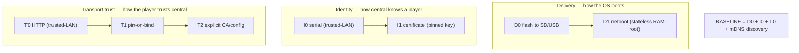
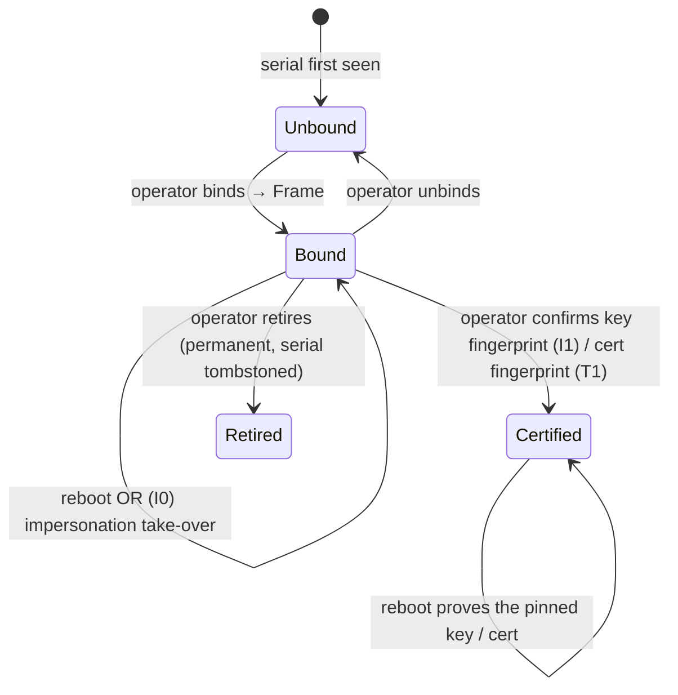

# 0008 — Progressive provisioning: serial baseline, certificate enhancement

Status: **accepted — owner approved 2026-09-10.** Owner: implementation orchestrator. Resolves the open parts of D10 (fleet provisioning and trust). It **repositions [decision 0002](0002-registry-and-enrollment.md)** — 0002's per-device key model becomes the opt-in *certificate* tier, not the baseline, and is not superseded. Revised several times at the gate, including a baseline review that added the **transport-trust ladder** and corrected the enhancement tiers (see [history](#how-the-design-got-here)).

This document replaces every prior note, thread, and sketch on the subject.

**The goal, in the owner's words:** *plug in the Pi and central discovers it by serial.* The lowest common denominator is **a standard image flashed onto a Pi that boots on a LAN** — no PXE, no TFTP, no HTTP boot server assumed. Cleverer deployments **progressively enhance** that baseline along three independent ladders: delivery, identity, and transport trust.

**Accepted model and binding clarifications:**

- **The published image is completely generic and hosted on GitHub Releases; all customization happens outside the image build** (decision 4). The only project-wide key in the image is `release.pub.pem`, identical for every deployment and therefore *not* customization. Every deployment-specific value (origins, CA, identity) lives outside the image.
- **An operator binds a *new* Frame; a previously-bound Frame that simply rebooted resumes its binding automatically** by serial re-association, with no operator action (decision 5) — see the [per-tier coherence note](#decision-5-across-tiers).
- **Transport trust is itself progressive** (decision 6): plain HTTP on a trusted LAN is the baseline; pin-on-bind and explicit CA/config are opt-in enhancements. The image stays generic at every rung.

---

## The problem in plain words

- **Baseline must assume almost nothing.** Flash the standard image, boot the Pi on a network with central, and it appears in central — discovered by its **serial number**. No boot server, no per-device setup, no certificate.
- **One generic image.** Nothing deployment-specific is baked in.
- **Enhancements are opt-in and independent.** More infra buys netboot; a persistent key buys cryptographic identity; a pinned or configured cert buys transport authentication. None is required; picking one does not force another.
- **Central always knows a player by serial and shows it.** Enhancements upgrade the guarantee; they never gate the baseline.

### Owner decisions this design builds on

| Decision | What it fixed | How this design relates |
|---|---|---|
| [0002 — registry & enrollment](0002-registry-and-enrollment.md) | Persistent per-device Ed25519 key; nonce + proof-of-possession; token rotation; retirement. | **Repositioned, not reversed.** The **certificate tier (I1)**, opt-in. The baseline is serial identity (I0); 0002's machinery is how a deployment hardens past it. |
| [0007 — reusable OS base](0007-reusable-os-base.md) | Reusable OS base carrying no deployment config, fleet credential, or release key. | **Extended.** The base becomes the generic flashable image; netboot reuses the same base. |
| D10 register line | "A common image must not embed a permanent shared fleet credential." | **Satisfied at every tier.** Serial embeds nothing; the certificate is generated on the device, never shared. |

### Verified facts about today's code

| Fact | Where | Consequence |
|---|---|---|
| The appliance is **netboot-only**; the player generates a **fresh in-memory** key and enrolls by serial `device_id`; central keys the record by `device_id`. | [player/identity.py:49](../../player/identity.py), [central/registry.py:105](../../central/registry.py) | The as-built is I0 identity on D1 delivery. Flash, the certificate tier, and discovery are new. |
| Enroll verifies the signature against the key **in the request** and **unconditionally overwrites** the stored key; there is no pin or compare. | [central/registry.py:96](../../central/registry.py), [:118](../../central/registry.py) | I1 pin/compare/downgrade-reject is **net-new central logic**, not "reuse 0002 wholesale." |
| `central_origin` is **required config**; the HTTPS client trusts `ca_file` (a per-deployment value), or the system store when it is absent. | [player/service.py:69](../../player/service.py), [:744](../../player/service.py) | Discovery and the transport-trust ladder are greenfield; a LAN `.local` central has no public cert, hence T1/T2. |
| No mDNS/zeroconf and no flash-to-SD path exist. | (repo grep) | The flash baseline, discovery, and pinning are net-new; the netboot path already exists. |
| Netboot binds config into the signed release via `configuration_sha256`. | [contracts/release.py:34](../../contracts/release.py), [bootstrap.py:125](../../appliance/bootstrap.py) | A **netboot-tier** decoupling, not a baseline concern. |

---

## The answer: three independent ladders



A deployment picks a rung on each ladder, independently. The **baseline** is the lowest rung of all three: flash the image (D0), serial identity (I0), plain HTTP on the trusted LAN (T0), find central by mDNS. Everything else is opt-in.

**The three rules that make it hold:**

1. **The serial is the universal identifier.** Central can always recognize and display a player by its serial, at every tier, with nothing configured on the device.
2. **Identity and trust upgrade in place.** A serial-only player (I0) can register a certificate (I1) an operator pins; a plain-HTTP player (T0) can pin or be handed central's cert (T1/T2). Each upgrade closes a specific baseline weakness.
3. **Nothing deployment-specific is in the image.** Discovery is mDNS; any explicit origin/CA lives on the boot medium or netboot tree, added outside the image build. The published image is generic on every rung.

---

## Glossary

- **Player / Frame** — a disposable Pi that renders / the persistent location it serves.
- **Serial (`device_id`)** — the Pi's hardware serial. The universal identifier; matching metadata, *not* a secret.
- **Ephemeral session key** — a keypair generated in RAM each boot; consumes the enrollment nonce; gone at reboot.
- **Session token** — the short-lived bearer token central issues at enroll; authenticates that boot's calls.
- **Certificate (I1)** — a **persistent** per-device keypair the player generates once and central **pins after an operator confirms its fingerprint**. Cryptographic, revocable.
- **mDNS discovery** — the baseline way a flashed player finds central (`_photowall._tcp`), so nothing is baked. **Explicit config always wins over mDNS** (see precedence).
- **D0 / D1 / I0 / I1 / T0 / T1 / T2** — the rungs: flash / netboot; serial / certificate; HTTP / pin-on-bind / explicit CA.
- **Bind / unbind** — operator actions associating (or releasing) a serial's record and a Frame.

---

## The three ladders

### Delivery (D)

| Rung | What | Cost |
|---|---|---|
| **D0 flash** (baseline) | Flash the generic `.img` to SD/USB; boot. Persistent storage present. | An SD per Pi; updates by re-flash or a later central-push mechanism. |
| **D1 netboot** | PXE/TFTP + an HTTPS rootfs host; stateless RAM-root; signed centrally-served OS. | Boot-server infra; the [config decoupling](#the-netboot-tier-d1-and-its-config-decoupling) migration. |

### Identity (I)

| Rung | Enroll must prove | Impostor with only the serial |
|---|---|---|
| **I0 serial** (baseline) | serial + a fresh key + nonce proof | **can enroll as that player** — accepted trusted-LAN cost (Edge 1) |
| **I1 certificate** | possession of the **pinned** key | **refused** — no private key |

I1 pinning is **net-new central logic** (today enroll overwrites the stored key — [registry.py:118](../../central/registry.py)): under I1 policy, enroll must **compare** to the pinned key and **reject** a mismatch (a downgrade guard), and the **pin is acquired only when an operator confirms the key fingerprint**, never trust-on-first-enroll (see [TOFU](#i1-pin-acquisition-must-be-operator-confirmed)). What *is* reused from 0002: the nonce, proof-of-possession, token rotation, and retirement.

### Transport trust (T) — new, from the baseline review

A flashed player learns `central_origin` from mDNS, but must still decide whether to *trust* that origin's transport. A LAN `.local`/private-IP central cannot hold a public certificate, so:

| Rung | How | Image generic? | Cost / residual |
|---|---|---|---|
| **T0 HTTP** (baseline) | Plain HTTP on the trusted LAN; the discovered origin is trusted blind. | ✅ | **Accepts Edge 3** (rogue mDNS serves content) as a trusted-LAN cost, parallel to I0's Edge 1. |
| **T1 pin-on-bind** | Central presents a self-signed cert; the player pins it on first contact; the **operator confirms the fingerprint at the bind step**. | ✅ nothing baked | Bind gains a fingerprint confirm; the pre-confirm instant is TOFU, closed by the human check. Closes Edge 3. |
| **T2 explicit CA/config** | Operator writes `central_origin` + CA (or "use public PKI") onto the SD **boot partition** at flash time (Pi-Imager style), or the netboot tree. | ✅ customization on the card, outside the build | Not zero-config; also the **private-CA and public-PKI** answer. |

**Precedence (closes the silent-hijack gap):** an explicit origin (T2) **always wins**; mDNS is consulted **only when no explicit origin is present**. So a hijacking mDNS responder cannot override a configured central.

**Clock/TLS note:** a freshly-flashed Pi has no RTC. T1 pins the cert regardless of `notBefore`, so it is unaffected; only T2-with-public-PKI needs a time source (an NTP server is then part of that deployment's boot-partition config), or a bounded first-boot skew.

---

## How identity and trust work together

Central records `(serial → equipment)` at every tier. At enroll the player consumes a nonce ([registry.py:79](../../central/registry.py)) and central issues a hashed **session token** that authenticates the boot ([registry.py:143](../../central/registry.py)). Frame authority is the operator **bind**, checked by generation on every call.

**Invariant:** *central authenticates a session by nonce-proof + bearer token and authorizes it by operator bind. The serial names the record on every rung; I1 additionally requires the pinned key at enroll; T1/T2 additionally authenticate central's transport. Each added requirement closes one named baseline weakness and nothing more.*

---

## Walkthroughs

### Baseline — flash and go (the whole goal)

```mermaid
sequenceDiagram
  participant P as Player (Pi, SD image)
  participant M as mDNS (LAN)
  participant C as Central
  participant O as Operator (UI)
  P->>P: boot generic image; read serial; generate ephemeral key
  P->>M: browse _photowall._tcp (only because no explicit origin is set)
  M-->>P: central_origin
  P->>C: enroll {serial, public_key, nonce_proof} over HTTP (T0)
  C-->>O: pending player: serial S1 (auto-discovered)
  O->>C: bind S1 → Frame F, calibrate
  C-->>P: assignments for Frame F
```

1. The image is the OS on the card — no boot server, no rootfs fetch, plain HTTP to a trusted-LAN central.
2. mDNS supplies `central_origin` **only because none was configured**; a boot-partition origin (T2) would win.
3. The player enrolls by serial and appears in central's pending queue with no pre-registration — "central discovers it by serial."

### Enhancement — pin transport (T1) and register a certificate (I1)

The operator, at the same **bind** step, confirms central's cert fingerprint (T1) and/or confirms the player's persistent-key fingerprint (I1). The player stores its key (SD on D0). From then on central authenticates the transport and refuses a serial-only impostor of that player. Both pins are **operator-confirmed**, never first-contact-automatic.

### Reboot / replacement

Reboot re-enrolls. Under I0 it re-associates by **serial** (decision 5). Under I1 the player presents its **persisted key** and re-associates; a wiped or swapped key on the same serial does **not** silently resume — it is treated as an impostor and needs operator re-confirmation. A replaced Pi is a **new serial** → new unbound equipment the operator binds to the same Frame.

---

## The hard part: the baseline's honest weaknesses

The baseline (I0 + T0) trades guarantees for zero setup. It has **three** named weaknesses; each has a specific enhancement that closes it.



**Edge 1 — I0 impersonation is take-over, not eavesdropping.** A LAN device that reads a serial enrolls, invalidates the real player's session ([registry.py:118](../../central/registry.py), [:279](../../central/registry.py)), takes its media, and can deny service. **Closed by I1.**

**Edge 2 — I0 reboot and duplicate-serial are indistinguishable.** A reboot *is* a same-serial re-enroll, so I0 makes **no** reject-duplicate guarantee; duplicates thrash (best-effort telemetry only). **Closed by I1** (the key, not the serial, decides the match).

**Edge 3 — rogue mDNS serves content to the player (from the baseline review).** A rogue `_photowall._tcp` responder becomes the player's central; under T0 (HTTP) the player has no way to authenticate it and **renders attacker-chosen content on every screen** — the worst outcome for a photo wall. **Closed by T1/T2** (pinned or configured cert), and *bounded* even at T0 by the operator-bind checkpoint (a rogue central still cannot bind a Frame). **Stated plainly:** on the pure baseline (T0), display capture by a LAN attacker is possible; a deployment that cannot trust its LAN must use T1 or T2. The enroll/nonce flow itself leaks no credential to the rogue (the ephemeral key dies at reboot; the token is the rogue's own).

<a id="i1-pin-acquisition-must-be-operator-confirmed"></a>
**I1 pin acquisition must be operator-confirmed.** Pinning on first enroll would happen over the I0 channel, which is serial-spoofable — an attacker who enrolls a victim's serial first would pin *their* key. So the pin is gated on an operator confirming the key fingerprint at bind, not TOFU-on-first-enroll. Only then does I1 actually *close* Edge 1.

**Retirement is permanent (both tiers).** `device_id` is the immutable serial; a retired serial is refused re-enrollment ([registry.py:115](../../central/registry.py)). **unbind** (new work) is the reversible lever; **retire** is irreversible. Note under I1 this means rotating a compromised key on a *kept* serial is an operator action (unbind/re-confirm), not automatic — retiring the key tombstones the serial. **Stated plainly:** never retire a Pi you will reuse — unbind it.

<a id="decision-5-across-tiers"></a>
**Decision 5 across tiers.** "Auto-resume by serial" is the **I0** behaviour. Under **I1**, the record is still named by the serial ([registry.py:105](../../central/registry.py)), but resume additionally requires the **pinned key**: a rebooted player with its key resumes automatically; a key that no longer matches does not. The two never silently disagree because I1 makes the key a *gate on top of* the serial, not a replacement for it.

---

## The netboot tier (D1) and its config decoupling

D1 already exists (RAM-root, PXE tree, HTTPS rootfs verified against the project key). One improvement belongs here so netboot deployments also avoid per-deployment re-signs: **remove the `configuration_sha256` binding** that ties boot-tree config files to the signed release. The tree files (`release_origin`, `central_origin`, `ca.pem`) stay operator-editable on the trusted LAN; `release.pub.pem` stays the project rootfs key delivered via the trusted TFTP path.

This re-freezes `Release` to five fields (`revision, boot_abi, rootfs_sha256, rootfs_size, schema`); `require_compatible` gates on `boot_abi`. Blast radius (D1 only): [contracts/release.py:34](../../contracts/release.py), [:61](../../contracts/release.py); the initramfs verifier [appliance/updates.py:71](../../appliance/updates.py), [:103](../../appliance/updates.py) and call site [bootstrap.py:421](../../appliance/bootstrap.py); [central/releases.py:38](../../central/releases.py), [:68](../../central/releases.py) and [central/app.py:109](../../central/app.py); [appliance/build.py](../../appliance/build.py); the manifest scripts. **Stored-blob migration:** existing six-field manifests in `appliance_releases` become undecodable, so a five-field release must be registered and `set_default` before netboot players boot ([releases.py:96](../../central/releases.py), [:172](../../central/releases.py)). Irrelevant to the flash baseline.

**D1 + I1 is not diskless.** The certificate tier needs a persistent key, but D1's premise is stateless RAM-root with no state partition ([module-appliance-builder.md](../module-appliance-builder.md)). So D1+I1 **requires adding a small persistent key slot** (a tiny state partition on the boot medium, or a hardware element) — a deliberate exception to D1's stateless premise, stated rather than hidden. D0+I1 has this for free on the SD card, but **the SD key is only as strong as physical control of the card** (trivially cloned with physical access); a secure element (deferred) is the answer where physical extraction is in scope.

---

## Storage, lifecycle, migration

- **Equipment record** is keyed by serial ([registry.py:105](../../central/registry.py)). I0 stores the session key hash + nonce + token TTL. **I1** additionally pins an operator-confirmed persistent public key.
- **Revoke:** **unbind** (reversible) or **retire** (permanent). I1 revocation is stronger: retiring the pinned key blocks re-enrollment even from the real hardware.
- **Migration:** no device data to migrate. Baseline is additive (flash image + mDNS + discovery mode + T0). The D1 manifest re-freeze is the only breaking change and is scoped to netboot.
- **Rollback:** the baseline cannot regress anything (it is new). I1/T1/T2 layer on later without touching the lower rungs.

---

## Decisions that are yours

**All six accepted 2026-09-10.** Decisions 1–5 approved at the recommendation; decision 6 (transport trust) resolved as a progressive ladder per the owner's "follow the progressive enhancement model."

| # | Question | Accepted | Cost accepted | Alternative rejected |
|---|---|---|---|---|
| 1 | Provisioning model | **Three-ladder progressive** | More surface: flash + netboot + discovery + pinning | Netboot-only — excludes the flash baseline |
| 2 | Baseline identity | **Serial (I0)**, certificate (I1) opt-in | I0 LAN-spoofable (Edge 1); LAN accepted as trusted | Require I1 everywhere — breaks "assumes only a LAN" |
| 3 | Baseline discovery | **mDNS**, explicit origin wins | multicast needed; ambiguity with multiple centrals | Require explicit `central_origin` always |
| 4 | Netboot config | **Decouple** (five-field `Release`); **image fully generic, GitHub-Releases-hosted, all customization outside the build** | The stored-blob migration | Keep `configuration_sha256` — per-deployment re-signs |
| 5 | Bind UX | **Pending queue + new `unbind`**; new Frame bound by operator, rebooted Frame auto-resumes ([per tier](#decision-5-across-tiers)) | `unbind` is new code | Auto-bind new serials (no human checkpoint) |
| 6 | Transport trust | **Progressive ladder T0→T1→T2** (HTTP baseline; pin-on-bind; explicit CA/config), image generic throughout | Pure baseline (T0) accepts Edge 3; T1/T2 add operator/flash steps | Mandate public-PKI (friction, non-generic) or bake a CA (violates decision 4) |

**Assumptions — say so if any is wrong:**

1. The baseline target is a trusted LAN; untrusted-network deployments use I1 + T1/T2 (and typically explicit config).
2. The flash image is the Ubuntu base + Player package + discovery, a normal bootable `.img` — simpler than the netboot RAM-root pipeline.
3. "Central discovers by serial" is player→central enrollment after discovery, surfaced as a pending queue — not central scanning.
4. I1 reuses 0002's nonce/proof/token/retirement, but the **pin/compare/downgrade-reject and operator fingerprint confirmation are net-new**.

---

## Deliberately out of scope

**Deferred (later, same design):** remote/multi-site fleets (select I1 + T2 + explicit config); A/B netboot updates; secure-element-backed I1; a central-push OS-update path for D0.

**Non-goals:** hardware attestation or secure boot; per-deployer custom rootfs signing as a default; instant cross-partition revocation; preventing duplicate serials under I0 (exhibited, not prevented).

---

## What can go wrong

Ladder: **construction** > **transaction** > **decision** > **test** > **convention** > **documented**.

| Failure | Behaviour | Guarantee strength |
|---|---|---|
| I0: LAN insider reads a serial | Takes over + denies that player until unbound | **documented** (fix = I1) |
| I1: impostor with only the serial | Refused at enroll (no pinned key) | **decision** — proof-of-possession + downgrade-reject |
| I0: duplicate serials | Session thrash, last-enroll-wins | **documented** (Edge 2); I1 removes it |
| **T0: rogue mDNS serves content (Edge 3)** | Attacker paints every screen; cannot bind a Frame | **documented** (baseline cost; fix = T1/T2) |
| Rogue mDNS vs a configured origin | Configured origin wins; mDNS ignored | **decision** — explicit-config precedence |
| I1: attacker pins first over I0 (TOFU) | Prevented — pin requires operator fingerprint confirm | **decision** — operator-gated pin |
| D1: rogue rootfs from `release_origin` | Rejected vs the project key | **decision** — Ed25519 signature ([bootstrap.py:421](../../appliance/bootstrap.py)) |
| Operator retires a reusable Pi | That serial can never re-enroll | **documented** — use unbind |
| D1: stored six-field manifest after re-freeze | Rejected; register a five-field release first | **decision** — documented deployment step |
| D0+I1 SD card physically cloned | Player identity clonable | **documented** — physical-control cost; secure element deferred |

---

## How the design got here

```mermaid
graph LR
  a["0002: persistent key,<br/>identity never IP/MAC"] -->|"as-built: netboot + serial"| b["today's appliance"]
  b -->|"owner: verify identity between calls"| c["serial identity"]
  c -->|"reviews r1/r2"| d["PXE-tree config"]
  d -->|"owner: don't assume PXE/TFTP/HTTP"| e["two-ladder progressive"]
  e -->|"baseline review r3: transport gap + tier fixes"| f["this design: three ladders (D/I/T)"]
```



- **Reviews r1/r2 (2026-09-10):** confirmed the serial core is sound and already built; fixed the manifest re-freeze blast radius, the reboot/duplicate contradiction, and the session-takeover/retire/nonce/token claims.
- **Owner (progressive enhancement):** the LCD is a flashed generic image on a LAN, discovered by serial via mDNS; 0002's key model becomes the opt-in I1 tier.
- **Baseline review r3 (2026-09-10):** surfaced the **transport-trust gap** (a LAN central has no public cert; HTTP allows Edge-3 content capture) and enhancement-tier errors. Resolved by the owner as a **third progressive ladder (T0→T1→T2)**, keeping the image generic; and by correcting the doc: I1 pin/downgrade-reject is net-new (not reuse), the pin is operator-confirmed (no TOFU), decision-5 is stated per tier, D1+I1 is explicitly not diskless, and D0+I1's physical-extraction cost is stated.
- **What survived every attack:** the trusted-LAN boundary for the baseline, the operator-bind authority model, 0002's enroll machinery (now I1), and that serial identity is already built.

---

## What happens after the gate

1. **Amend the record:** done — [0002](0002-registry-and-enrollment.md) and D10 ([design-decisions.md](../design-decisions.md)) note serial as baseline and 0002's key model as the opt-in I1 tier.
2. **Baseline (new):** build the **flash image** (Ubuntu base + Player package + boot-time service); add **mDNS discovery** and a discovery mode so `central_origin` may be absent ([player/service.py:69](../../player/service.py)), with **explicit-origin precedence**; central advertises `_photowall._tcp`; **T0 HTTP** transport; the pending queue + serial bind + new **unbind** ([registry.py](../../central/registry.py)).
3. **Transport tier (T1/T2):** self-signed cert + operator fingerprint confirm at bind (T1); boot-partition `central_origin`+CA config (T2).
4. **Certificate tier (I1):** persist the key (SD on D0; a state slot on D1); **net-new** pin/compare/downgrade-reject with operator confirmation, over 0002's nonce/proof/rotation.
5. **Netboot tier (D1):** re-freeze `Release` to five fields and decouple config ([contracts/release.py](../../contracts/release.py), [appliance/updates.py](../../appliance/updates.py), [central/releases.py](../../central/releases.py)); register a five-field release and `set_default`.
6. **GHA:** publish the generic flash `.img` (and the netboot tree/rootfs) as a GitHub Release.
7. **Docs:** update [runbook](../runbook.md), [module-pxe-service.md](../module-pxe-service.md), and the README to lead with flash-and-go, then netboot/certificate/transport as enhancements.

**Specs/packages touched:** `player` (discovery, optional-origin config + precedence, persistent key, cert pinning), `central` (pending queue, unbind, I1 pin/downgrade-reject, D1 migration), `appliance` (flash image, D1 decoupling), `contracts` (release), decisions 0002/0008, `docs/design-decisions.md` (D10).

**Tracer bullet:** flash the generic image to a Pi; central runs on the LAN advertising mDNS over HTTP (T0). The Pi boots, discovers central, enrolls unbound by serial `S1`, appears in the pending queue; the operator binds `S1→Frame F` and it renders F; reboot re-associates by serial with no operator action. I1/T1 tracer: the operator confirms the player-key and central-cert fingerprints at bind; a serial-only re-enroll for `S1` and a rogue-cert central are both refused.

**Mutation probes that must turn a test red:**

- Break serial→equipment matching → the flash-baseline enroll/reboot test must fail.
- Remove mDNS with no `central_origin` set → the player must fail to enroll; setting explicit config must recover it.
- Answer mDNS *and* set an explicit origin → the explicit origin must win (precedence test).
- Under I1, let a serial-only enroll succeed for a pinned player, or let a first-enroll pin without operator confirmation → the impostor-refusal / operator-gate tests must fail.
- Let an unbound serial fetch media → the media-denial test must fail.
- D1: feed a six-field manifest → it must be rejected, not coerced.
