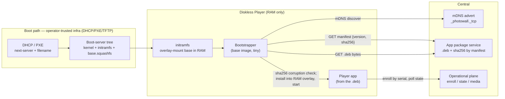
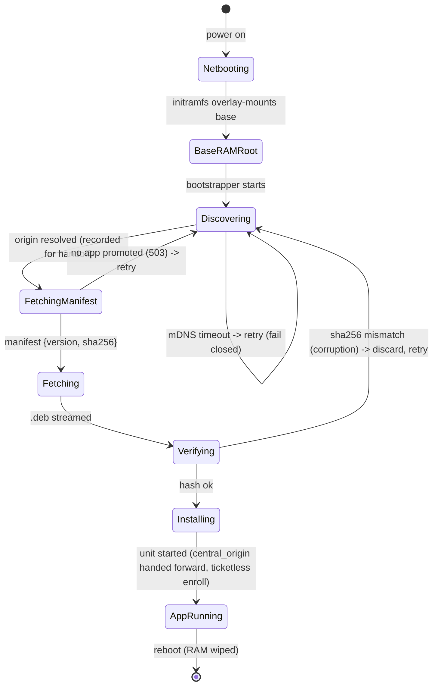

# 0009 — Minimal base OS and the Player app as a downloadable package

Date: 2026-09-11. Status: **accepted — owner approved 2026-09-12; UX-over-security
ruling recorded.** This directory (`docs/decisions/`) holds accepted architecture
decisions; this file is the ONE gate document for the re-architecture and
replaces every prior note, brief, and sketch on it.

> **Owner ruling (2026-09-12).** This is a home LAN. There is no threat model.
> Optimize for UX and simplicity over security. A player failing to connect is
> visibly obvious to the operator — that is the monitoring. Accordingly **gate #1
> (app authenticity) is the simplest option: central serves the app `.deb` plus a
> plain sha256 that is a corruption check only, fetched over the mDNS-discovered
> central. No boot-tree hash, no signing, no extra operator steps.** The owner
> explicitly accepts "zero authenticity versus a hypothetical rogue" because there
> is no rogue on a home LAN. All six gates are decided as recommended (gate #1 to
> the simplest option, not the boot-tree-hash recommendation of r1). The migration
> correctness (ticketless diskless enroll, guard move, blast radius, origin
> handoff) is unaffected by this ruling and stands in full.

This decision **supersedes the RAM-root signed-squashfs mechanism** of
[0008](0008-generic-image-and-serial-identity.md) for the **netboot / appliance
(diskless D1) path**. It keeps everything 0008 decided about *identity* (serial),
*enrollment* (pending queue, bind/unbind), and *discovery* (mDNS with
explicit-origin precedence). It changes only *how the OS and the application
reach a diskless Player*.

**What was decided:** the shape below — a bare base OS that carries no
application, plus the Player shipped as a downloadable `.deb` central serves — is
approved, and the six choices in
[Decisions that are yours](#decisions-that-are-yours) are all ruled as
recommended, with **gate #1 (app authenticity) resolved to the simplest option
per the owner ruling above**: central serves the `.deb` plus a plain sha256 that
is a corruption check only, fetched over the mDNS-discovered central. There is no
boot-tree hash and no signing anywhere in the system. The owner accepts that this
buys **zero authenticity against a hypothetical rogue on the LAN**, because on a
home LAN there is no rogue and a player failing to connect is visibly obvious to
the operator.

---

## The problem in plain words

- **The base OS should almost never change.** It should boot on the diskless
  fleet, take its Linux and network settings from PXE/DHCP, and do one job: find
  central and get the application. No application code and no per-deployment
  configuration is baked into it.
- **The application should change often, on its own.** Publishing a new Player
  must not rebuild or re-flash the base OS. Central holds the current app and
  every Player downloads it at boot.
- **The fleet has no local storage.** Each Player netboots into RAM and forgets
  everything at power-off. Whatever it runs is fetched fresh every boot.
- **Two published GitHub assets, not one image:** (a) a generic base OS bundle
  that rarely revs, and (b) the Player application as a `.deb`.
- **No baked origin.** The running base finds central over the LAN by mDNS, the
  same way 0008's flashed baseline already does.
- **No signing anywhere.** Raspberry Pi 5 netboot requires no signature by
  default (facts table), so the bespoke release-signing key and its whole ledger
  retire. The app `.deb` is likewise unsigned: central serves it with a plain
  sha256 that a Player checks **only to catch corruption in transit**, not to
  prove authorship. On a home LAN, by the owner's explicit ruling, there is no
  authorship threat to defend against, so no key exists anywhere in the system.

### Owner decisions this design builds on

| Decision | What it fixed | How this design relates |
|---|---|---|
| [0008 — serial identity + mDNS](0008-generic-image-and-serial-identity.md) | Serial is the universal identifier; mDNS discovery with explicit-origin precedence; pending queue + bind/unbind; the trusted-LAN (T0) baseline. | **Kept whole.** Enrollment, identity, discovery, and the operator plane are unchanged. Only 0008's **D1 netboot tier** (RAM-root signed squashfs) is replaced. |
| [0007 — reusable OS base](0007-reusable-os-base.md) | An OS base carrying no deployment config or release key. | **Taken to its conclusion.** The base now also carries no *application*. |

### Verified facts about today's code

| Fact | Where | Consequence |
|---|---|---|
| Netboot RAM-roots a **signed** squashfs: the initramfs asks central for a `BootTicket`, verifies an Ed25519-signed `Release` manifest, streams the squashfs, checks its sha256, and overlay-mounts it in RAM. | [appliance/bootstrap.py:207](../../appliance/bootstrap.py), [:402](../../appliance/bootstrap.py), [:366](../../appliance/bootstrap.py); `appliance/updates.py:71` | The OS-delivery mechanism this decision replaces. The overlay-in-RAM machinery ([:366](../../appliance/bootstrap.py)) is reusable; the ticket/signature layer is not. |
| The whole squashfs (base OS **plus** the Player venv) is one signed artifact selected per device. | `central/releases.py:183` `select_boot`; `appliance/build.py:721` (retired) `configure_root` bakes the venv into the root. | Base and app rev together today. Splitting them is the core change. |
| The Player is built as a **hashed wheelhouse** (one app wheel + exactly five runtime wheels) with a `--require-hashes` `requirements.txt`, installed offline into a venv. | [scripts/build_player.py:349](../../scripts/build_player.py); ROOTS = pydantic/httpx/websockets/cryptography/zeroconf [:39](../../scripts/build_player.py); pip install `appliance/build.py:752` (retired) | The `.deb` payload can reuse this builder verbatim; only the packaging wrapper is new. |
| mDNS discovery already exists and is wired into the **running app**, consulted only when no explicit origin is set. | [player/mdns_discovery.py:46](../../player/mdns_discovery.py); `resolve_origin` [player/service.py:405](../../player/service.py); wiring [player/service.py:1013](../../player/service.py) | The base's bootstrapper can reuse this exact class; but discovery must now also run **before the app exists**. |
| Only the **flashed / persistent** path enrolls ticketless: `service.py:489` sends `ticket_id=None` **only when** `boot_context.persistence == "persistent"`. The **netboot / diskless** path writes `persistence="volatile"` ([appliance/bootstrap.py:428](../../appliance/bootstrap.py)) and so sends a **real** `ticket_id`. | [player/service.py:489](../../player/service.py); [appliance/bootstrap.py:428](../../appliance/bootstrap.py) | The diskless path does **not** enroll ticketless today. "The app enrolls unchanged" is **false** for 0009's diskless fleet — a real ticket goes to central, which now has no authority to honor it. Fixed in migration. |
| A real `ticket_id` at enroll drives `bind_session_in` → `_device` → **404 `device_not_found`** once the release authority (and its `appliance_devices` rows) retire. | [central/registry.py:138](../../central/registry.py) → `central/releases.py:167` | Every diskless enroll would 404 → **fleet-wide enroll failure** if the diskless base is not made to send `ticket_id=None`. |
| `release_accepted` is set `True` **only** for persistent boots ([service.py:511](../../player/service.py)); a volatile boot starts it `False`, and `_control_loop` then POSTs boot-health every loop ([service.py:826-827](../../player/service.py)). | [player/service.py:511](../../player/service.py), [:826](../../player/service.py) | With boot-health **retired**, a diskless Player would POST a dead route on every loop. The diskless base must also yield `release_accepted=True`. |
| `enroll()` hard-requires a configured release authority and returns 503 if it is absent — even before the ticket branch. | [central/registry.py:92](../../central/registry.py) | Load-bearing coupling: retiring the release authority **breaks all enrollment** unless this guard is moved. **Necessary but not sufficient** — the diskless client-side ticket/health fix above is also required. |
| Central serves an unauthenticated, sha256-addressed, length-bounded artifact today (the rootfs), and an authenticated sha256-addressed one (media). | rootfs [central/app.py:400](../../central/app.py); media [central/app.py:451](../../central/app.py) | The `.deb` endpoint is a direct copy of an existing, reviewed pattern — not new surface. |
| RPi 5 network boot requires **no signature** by default; secure boot (signed `boot.img`, OTP-fused key) is opt-in and irreversible. The repo already treats TFTP as trusted-LAN-only. | [docs/module-pxe-service.md:37](../module-pxe-service.md); see Sources | Justifies dropping the **OS-boot** signature with no boot-path regression. App authenticity is a separate question, ruled by the owner as out of scope on a home LAN — the `.deb` is served unsigned with a corruption-only sha256. |

---

## The answer in one picture



**The three rules that make it hold:**

1. **The base OS carries no application and no origin.** Every OS byte comes
   from the boot server (PXE/TFTP path DHCP already points at); the base's only
   job is to find central and fetch the app. Nothing deployment-specific and
   no application code is baked into the published base bundle.
2. **Central serves the app bytes; the base finds central by mDNS.** The `.deb`
   bytes, its sha256, and all operational config (Frame binding, assignments,
   calibration) come from central after discovery — never from the image. The
   app revs by publishing a new `.deb`; the base bundle almost never rebuilds.
3. **Integrity is a corruption check; trust is the home LAN.** Central serves the
   app's sha256 in a plain manifest; the bootstrapper streams the `.deb` from the
   same discovered central and accepts it only if the bytes hash to that value.
   This catches a truncated or corrupted download — nothing more. It is **not**
   an authenticity proof: the hash and the bytes ride the same discovered channel,
   so a rogue could serve a self-consistent pair. By the owner's explicit ruling
   there is no rogue on a home LAN to defend against, so no signing key and no
   out-of-band hash exist. A single operator act (upload + promote in central)
   ships a new app. Trusting the home LAN is the stated cost.

---

## Glossary

- **Base OS bundle** — the generic, published boot artifact: kernel + initramfs
  + a minimal base root (squashfs). Rarely revs. Carries Python and mDNS but no
  Player app.
- **Bootstrapper** — a tiny program in the base image that runs before the app:
  discovers central (mDNS), fetches the app `.deb`, verifies its hash, installs
  it into the RAM overlay, and starts it. Distinct from the full Player app.
- **App package (`.deb`)** — the Player application, published by central and
  fetched each boot. Self-contained (vendored Python deps); depends only on
  native libraries the base already provides.
- **App manifest** (central) — central's small, plain (unsigned) document
  naming the app version, `.deb` sha256, and size that central *holds and
  serves*. The sha256 is a **corruption check only**: the bootstrapper reads it
  from the discovered central and rejects a `.deb` whose bytes do not match. It
  is not an authenticity anchor — the hash and the bytes share the discovered
  channel — and by the owner's home-LAN ruling none is required.
- **RAM overlay** — the diskless root: a read-only base squashfs (lower) plus a
  tmpfs (upper) in RAM. The `.deb` installs into the tmpfs upper; nothing
  survives reboot. Reused verbatim from today's netboot mount.
- **Serial / enroll / bind** — unchanged from 0008: the Pi's hardware serial is
  the identity; the app enrolls by serial into a pending queue; an operator
  binds it to a Frame.
- **Release authority** — today's Ed25519 signed-OS ledger (boot tickets,
  trials, auto-rollback). This decision **retires** it for the netboot path.

---

## How trust and integrity work

The model is deliberately flat, matching 0008's trusted-LAN (T0) baseline, and
by the owner's 2026-09-12 ruling it stays flat: a home LAN with no threat model.

| Who is asking | What they get | Why |
|---|---|---|
| initramfs → boot server (TFTP/HTTP) | The base OS bytes, no signature check | Operator-trusted bootstrap transport ([module-pxe-service.md:37](../module-pxe-service.md)); DHCP already designates this server |
| bootstrapper → central (mDNS + HTTP) | The app manifest (version + sha256), then the `.deb` bytes, accepted only if they hash to the manifest value | Corruption check on the download; the hash and bytes share the discovered channel, so this is integrity, not authenticity |
| app → central (enroll by serial) | A session token, then state/media | Unchanged from 0008; nonce + proof-of-possession of a fresh key |
| operator → central (bind) | The human checkpoint that grants a Frame | Unchanged from 0008 |

**Security posture — home LAN, no threat model (owner ruling).** There is no
authenticity check on the app `.deb`. The sha256 catches a corrupted download,
not a lie: a rogue on the LAN could advertise mDNS and serve arbitrary app code
(the discovery tiebreak is deterministic —
[player/mdns_discovery.py:52-54](../../player/mdns_discovery.py) — so a rogue with
a low-sorting name would win repeatably, and its code runs before enroll and
before the operator sees the device). **The owner has explicitly accepted this**:
on a home LAN there is no such rogue, and a player that fails to render is
immediately visible to the operator, which is the monitoring. Signing and an
out-of-band (boot-tree) hash were considered and deliberately not chosen — see
gate #1's alternatives. This is the one place the design trades security for
UX/simplicity, and it does so on purpose.

**Invariant:** *the base runs a `.deb` only if its bytes match the sha256 the
manifest declares; a mismatch stops the boot before the app runs.* This is a
corruption guard, not an authenticity guard — integrity of the bytes against the
manifest, on a trusted home LAN.

---

## Walkthroughs

### Boot: bare base to a rendering Player

```mermaid
sequenceDiagram
  participant D as DHCP/PXE + boot server
  participant I as initramfs (base)
  participant B as Bootstrapper (base)
  participant M as mDNS (LAN)
  participant C as Central
  participant A as Player app
  participant O as Operator
  D->>I: TFTP kernel + initramfs + base.squashfs
  I->>I: overlay-mount base (ro squashfs + tmpfs) in RAM, pivot
  B->>M: browse _photowall._tcp (no origin baked)
  M-->>B: central_origin (deterministic lowest-name winner)
  B->>C: GET /v1/app/manifest {version, sha256, size}
  B->>C: GET /v1/app/package/<sha256>.deb
  B->>B: verify bytes against the manifest sha256 while streaming (corruption check); install into tmpfs overlay
  B->>A: start photo-wall-player.service (app code now executes)
  A->>C: enroll {serial, fresh key, nonce} — ticketless
  C-->>O: pending player: serial S1
  O->>C: bind S1 -> Frame F, calibrate
  C-->>A: state for Frame F  (renders)
  Note over I,A: reboot re-fetches the .deb fresh and re-enrolls by serial
```

1. The OS arrives over the PXE/TFTP path; no signature, no central contact for
   the OS. The base squashfs is overlay-mounted in RAM exactly as
   [appliance/bootstrap.py:366](../../appliance/bootstrap.py) already does.
2. The bootstrapper discovers central by mDNS (no baked origin), reusing
   [player/mdns_discovery.py:46](../../player/mdns_discovery.py). The discovery
   winner is deterministic (lowest-sorting name,
   [mdns_discovery.py:100](../../player/mdns_discovery.py)); on a home LAN the
   only advertiser is the operator's central.
3. The bootstrapper reads the manifest, then streams the `.deb` from the same
   central and checks the bytes against the manifest sha256 before install — a
   corruption guard. A truncated or garbled download is rejected and retried.
4. **Only after the `.deb` executes** does the app enroll by serial with
   `ticket_id=None` ([player/service.py:489](../../player/service.py)); it lands
   in the pending queue and the operator binds it. (See the migration section for
   the diskless ticketless-enroll fix this step depends on.)

### Publish and promote a new app

```mermaid
sequenceDiagram
  participant CI as CI (GitHub)
  participant G as GitHub Release
  participant Op as Operator
  participant C as Central
  CI->>CI: build wheelhouse (build_player.py) -> assemble .deb
  CI->>G: publish photo-wall-player_<version>.deb
  Op->>C: upload .deb (stored by sha256)
  Op->>C: promote <version> as current
  Note over C: next boot of any Player fetches the new .deb; running Players unaffected until reboot
```

A promote is a **single operator act**: upload + promote in central. The manifest
central serves then names the new sha256, and every Player picks it up on its next
reboot. No boot-tree file, no signing step, no extra host to touch.

| Situation | What the operator sees |
|---|---|
| No app promoted yet | Bootstrapper cannot fetch a manifest / matching `.deb`; Player stays pre-app, retrying discovery |
| Promoted app fails to render on a Pi | That Pi reboots and re-fetches the same app (no auto-rollback — retired); the dark screen is the visible signal; operator promotes a prior `.deb` to recover the fleet |
| Rogue mDNS central | Out of scope by owner ruling (home LAN, no threat model); the manifest sha256 is a corruption check, not an authenticity check, so a rogue serving a self-consistent `.deb` is not stopped — accepted |

---

## The hard part: discovery must happen twice, and before the app exists

Discovery today lives inside the running app ([player/service.py:1013](../../player/service.py)).
The base must now discover central **before** the app is installed, to fetch it.
The structural question is what runs that early discovery and how much it shares
with the app.



**The seam.** The bootstrapper is a new, tiny module in the base image
(proposed `appliance/provision.py`) that imports **only** three shipped things:

- `contracts.equipment.equipment_device_id` — the serial→`device_id`
  derivation, so the bootstrapper and the app agree on identity
  ([appliance/bootstrap.py:301](../../appliance/bootstrap.py) already uses it).
- `player.mdns_discovery.MdnsCentralDiscovery` — the exact discovery class the
  app uses ([player/mdns_discovery.py:46](../../player/mdns_discovery.py)).
- The bounded, no-redirect, deadline-guarded HTTP fetch discipline already
  written for the initramfs ([appliance/bootstrap.py:133](../../appliance/bootstrap.py)
  `Fetcher`, [:227](../../appliance/bootstrap.py) `copy_verified`), reused for
  the manifest + `.deb`.

It does **not** import `player.service` (which pulls in GTK/GStreamer). This is
the clean split: the base carries a minimal Python + `zeroconf` for the
bootstrapper; the app carries everything else in its `.deb`.

**The origin must be handed forward, not re-discovered.** The bootstrapper
discovers central by mDNS to fetch the `.deb`. The app then starts and runs its
*own* `resolve_origin` ([player/service.py:415-421](../../player/service.py)),
which — because `MdnsCentralDiscovery` remembers nothing across calls
([mdns_discovery.py:63-64](../../player/mdns_discovery.py)) — performs a **fresh**
mDNS browse. Two independent discoveries can resolve **different** responders:
the app could enroll against a central other than the one that served its code.
**Fix:** the bootstrapper writes its resolved origin as an explicit
`central_origin` for the app (on the RAM overlay the app reads at start).
`resolve_origin`'s precedence then makes that explicit origin **win over
re-discovery** ([service.py:415](../../player/service.py): discovery is consulted
*only when* `central_origin is None`) — so the app enrolls against the same
central that served its `.deb`, with no new discovery machinery. This is the
recommended handoff; the alternative (two independent discoveries) must be
explicitly defended if chosen, and is not recommended.

**Why the bootstrapper does not enroll:** if the bootstrapper *also* enrolled, it
would duplicate the identity/enroll machinery into the base and cause a **double
enrollment** (bootstrapper session, then app session), bumping `authority_epoch`
and churning the session for no operational gain — the fetch integrity is the
manifest sha256, not a token, so enrollment buys the fetch nothing. **Fix:** the
bootstrapper does **not** enroll; it discovers and fetches only. The app enrolls
exactly **once** — but note that its enroll path is **not** unchanged: the
diskless base must be re-keyed to enroll ticketless (see migration edit B).
**Residual, stated plainly:** app-*version selection* is fleet-global, not
per-device (every Player fetches whatever central currently promotes) — a
per-device rollout would need the bootstrapper to enroll first (gate #2/#3).

**Cost:** the base image must now ship `zeroconf` and a Python runtime for the
bootstrapper even though the app also ships them. One small duplication of a
dependency, in exchange for one discovery implementation shared by both.

---

## The next consumer: over-the-LAN app updates without re-flashing

The shape must also serve the thing that motivated it: **shipping a Player fix
without touching the OS.**

| Today (0008 D1) | This design |
|---|---|
| A Player fix = rebuild the squashfs = re-sign = register a new `Release` = `set_default` = every Pi re-trials the whole OS | A Player fix = build a `.deb` = upload + promote in central = every Pi fetches it next reboot; the OS bundle is untouched |
| OS and app share a version and a blast radius | OS and app version independently; an app bug cannot force an OS rebuild |

**Why this shape and not the two alternatives** (design-it-twice at the system
layer):

- **Alternative A — keep one signed squashfs, split nothing.** Cheapest to
  *not* build (it exists). But it fails the owner's core requirement: the base
  cannot stay stable while the app revs, and every app change re-runs the signed
  OS trial. Rejected because it does not solve the stated problem.
- **Alternative B — base fetches the app from central *and* the base squashfs
  from central over mDNS.** Symmetric and origin-free. But mDNS runs only in
  userspace, and the base squashfs must be mounted *before* userspace exists —
  a chicken-and-egg. It would force mDNS into the initramfs (new, fragile) or a
  baked origin (violates rule 1). Rejected.
- **Chosen — OS over the PXE/boot-server path, app over mDNS+HTTP from
  central.** The OS transport is the infra DHCP already designates; the app
  transport is origin-free mDNS. Each byte comes from the layer that can
  actually provide it before it is needed. **Gives up:** a signed OS and
  per-device OS trials (retired); the base squashfs is a larger TFTP/HTTP load
  than a bespoke initramfs.

---

## Storage, lifecycle, migration

### The `.deb` (record and build)

- **Payload (recommended):** a prebuilt venv at the fixed path
  `/opt/photo-wall/venv` plus the systemd units and `weston.ini` — install is an
  unpack, needing no pip or build tools in the base at boot. Built by running the
  **existing** wheelhouse builder ([scripts/build_player.py:349](../../scripts/build_player.py))
  and then assembling the venv the way `appliance/build.py:752` (retired)
  does today, wrapped as a `.deb`.
- **Version:** the existing wheel version `base_version+g<commit>`
  ([scripts/build_player.py:382](../../scripts/build_player.py)) becomes the
  package version — one identifier for source, wheel, and `.deb`.
- **Dependencies:** Python runtime deps stay **vendored in the venv** (preserving
  the hashed-wheelhouse integrity model); the `.deb` `Depends:` only on the
  native libraries the base provides (GTK, GStreamer, Mesa). Documented in
  [module-player-package.md](../module-player-package.md).

### Central storage

- App `.deb` bytes stored by sha256 under a new `PHOTO_WALL_APP_ROOT` (mirroring
  `PHOTO_WALL_RELEASE_ROOT`, [central/app.py:181](../../central/app.py)).
- One small `app_package_policy` row naming the current version + sha256 + size
  (mirroring the singleton `appliance_release_policy`,
  `central/releases.py:116`). Promote = update the row.

### Endpoints (new, both mirror reviewed patterns)

| Route | Auth | Returns | Errors |
|---|---|---|---|
| `GET /v1/app/manifest` | none (trusted LAN) | `{version, sha256, size}` of the current app; 503 if none promoted. The sha256 is the **corruption check** the bootstrapper verifies the `.deb` bytes against; it is not an authenticity anchor and, per the owner ruling, none is required | 503 `app_unconfigured` |
| `GET /v1/app/package/{sha256}.deb` | none | the `.deb` bytes, `Content-Length` set, immutable cache, sha256-addressed | 404 unknown sha256; 503 bytes missing |
| `POST /v1/operator/app` (admin) | admin token | upload a `.deb`, stored by sha256 | 422 malformed |
| `PUT /v1/operator/app/current` (admin) | admin token | promote a version | 404 unknown |

The `GET` package route is a line-for-line analogue of the existing rootfs route
([central/app.py:400](../../central/app.py)) with the same `O_NOFOLLOW`, `fstat`,
size-match, and streaming discipline.

### Provisioning / enrollment state machines (two separate domains)

- **Provisioning lifecycle** (new, base-owned): the `stateDiagram` above —
  netboot → RAM-root → discover → fetch → verify → install → run. Purely
  in-RAM; no central record; idempotent by re-fetch each boot.
- **Enrollment lifecycle** (central-side state machine unchanged from 0008):
  serial first-seen → pending → bound → (unbind | retire). Owned by central
  ([central/registry.py:91](../../central/registry.py) enroll,
  [:188](../../central/registry.py) bind, [:220](../../central/registry.py)
  unbind). The *lifecycle states* are untouched; what **does** change is how the
  diskless client *triggers* enroll — it must now send a ticketless enroll (the
  guard move **plus** the client ticket/health re-key, migration edits A+B).

### Migration — what retires, what stays, the one required edit

**Retire (netboot path):**

- Signed-OS delivery: `BootTicket`/`BootRequest` and the signed `Release`
  manifest ([contracts/release.py:21](../../contracts/release.py),
  [:98](../../contracts/release.py)); `verify_release`
  (`appliance/updates.py:71`); the ticket/trial
  logic in [appliance/bootstrap.py:207](../../appliance/bootstrap.py).
- Release authority: `select_boot`, `_ticket`, `stage`, `health`, and the
  `appliance_boot_attempts` / `appliance_release_trials` / `appliance_devices`
  tables (`central/releases.py:183`, `:286`).
- Central routes: `POST /v1/bootstrap/boot`, `GET /appliance/rootfs-*.squashfs`,
  `POST /v1/player/boot-health` ([central/app.py:393](../../central/app.py),
  [:400](../../central/app.py), [:478](../../central/app.py)); the signing-key
  config `_configured_release_authority` / `_initialize_release_authority`
  ([central/app.py:110](../../central/app.py), [:129](../../central/app.py)).
- Boot-time OS trial: the `accept-trial` / `trial-recovery` units and the
  `TrialWatchdog` (`appliance/updates.py:151`).
- The `p2-signing-key`, `PHOTO_WALL_RELEASE_PUBLIC_KEY`/`_BOOT_ABI` /
  `_INITIAL_RELEASE_*` config, `release.pub.pem` in the image, and the
  signed-rootfs publish in [.github/workflows/release.yml](../../.github/workflows/release.yml).
- `Release.require_compatible` / `boot_abi` gating — ABI match is now by
  construction (kernel/initramfs/base squashfs published as one bundle).

**Stays (untouched):** enroll-by-serial + ephemeral key
([player/identity.py](../../player/identity.py)), the pending queue and
`is_bound` ([central/registry.py:323](../../central/registry.py)), bind / unbind
/ retire, calibration, `/v1/player/state`, `/v1/player/time`, media, readiness,
observations, the websocket session, mDNS advertise
([central/app.py:210](../../central/app.py)) and discover
([player/mdns_discovery.py](../../player/mdns_discovery.py)), and the wheelhouse
builder ([scripts/build_player.py](../../scripts/build_player.py)).

**The required edits — the diskless path must actually enroll ticketless.**
This is **two** coupled fixes, not one. The earlier draft named only the first
and wrongly asserted the diskless app "enrolls unchanged"; it does not.

*Edit A (central, necessary but NOT sufficient) — move the enroll↔release-authority guard.*
`enroll()` returns 503 when no release authority is configured
([central/registry.py:92](../../central/registry.py)). After the authority
retires, that guard breaks **all** enrollment. Move the requirement inside the
`ticket_id is not None` branch ([:138](../../central/registry.py), itself
retiring) so a central with no signing key enrolls Players. **This alone does
not fix the diskless fleet** — see edit B.

*Edit B (client + boot context, load-bearing) — the diskless base must send a ticketless enroll.*
Today the diskless/netboot boot context is `persistence="volatile"` with a real
`ticket_id` ([appliance/bootstrap.py:428](../../appliance/bootstrap.py)), and the
app keys two behaviours on that flag:
- `service.py:489` sends the real `ticket_id` → after edit A that hits the
  retired `ticket_id is not None` branch → `bind_session_in` → `_device` →
  **404 `device_not_found`** (`releases.py:167`):
  fleet-wide enroll failure.
- `service.py:511` leaves `release_accepted=False` → `_control_loop`
  ([service.py:826-827](../../player/service.py)) POSTs the **retired**
  `/v1/player/boot-health` route every loop.

So the 0009 diskless base must yield a boot context that produces
`ticket_id=None` **and** `release_accepted=True`. **Recommended structural fix:**
re-key both gates on **"no boot ticket present"** rather than overloading the
`persistence` string. The 0009 bootstrapper issues no boot ticket, so the boot
context simply carries **no ticket**, and both `enroll()`'s `ticket_id` and the
health-report gate follow from that single fact. This also resolves the semantic
drift the review flagged: a RAM-only diskless Player must **not** have to lie
that it is `persistent` to enroll — it is genuinely volatile *and* ticketless,
two orthogonal properties the code currently conflates. (The narrow alternative
— make the diskless boot context set `persistence="persistent"` — makes a RAM
Player misreport its own storage model and is not recommended.)

**Blast radius of the migration now includes the client + boot-context
production, not central alone:** [player/service.py:489](../../player/service.py)
(ticket gate), [:511](../../player/service.py) (`release_accepted` gate),
[:826](../../player/service.py) (`_report_boot_health` call), the 0009
bootstrapper's boot-context production (replacing
[appliance/bootstrap.py:428](../../appliance/bootstrap.py)'s
`persistence="volatile"` + `ticket_id` report), and central
[registry.py:92](../../central/registry.py) (edit A). All of edit A + B must land
together; either alone leaves the diskless fleet unable to enroll.

**Rollback.** Because the base is stateless and re-fetches each boot, rollback of
an app is "promote the previous `.deb` in central; reboot the fleet." Rollback of
the whole decision is "re-stage the old signed boot tree and restore the
release-authority config" — possible only until the retired code is deleted,
which per gate #5 is deleted in this workstream (so decision-level rollback needs
git, not config).

---

## Decisions — all ruled (owner, 2026-09-12)

All six were presented as open choices; the owner ruled each as the
recommendation, with gate #1 taken to the **simplest** option per the
UX-over-security ruling. The table below records the decision as made.

Ladder for costs: a design fails safe if the failure is caught at
**construction > transaction > decision > test > convention > documented**.

| # | Question | Decision | Cost accepted |
|---|---|---|---|
| 1 | **App integrity / authenticity** | **Central serves the `.deb` plus a plain sha256 (corruption check only), fetched over the mDNS-discovered central. No boot-tree hash, no signing** | **Zero authenticity vs a hypothetical rogue** — accepted, because a home LAN has no rogue and a dark player is visibly obvious. Simplest to operate: one promote act, no key, no extra host |
| 2 | Registration ↔ app-fetch ordering | **Discover → fetch → app enrolls by serial** (bootstrapper never enrolls) | App-version selection is fleet-global, not per-device |
| 3 | App-version selection / rollout | **One global "current app" pointer the operator promotes** | No staged/per-device rollout and **no auto-rollback** (retires with the release authority); recovery is a manual re-promote of the prior `.deb` |
| 4 | Base OS transport into RAM | **Base squashfs staged in the boot-server tree, loaded by initramfs; no central, no signature** | A larger TFTP/HTTP load than a bespoke initramfs; operator stages the GitHub bundle |
| 5 | The orphaned release-authority / boot-ticket code | **Delete it in this workstream** (and land **both** enroll fixes — central guard move + the diskless ticketless/health gates) | Big diff; loses the signed-OS + per-device auto-rollback safety net; rollback of the decision needs git, not config |
| 6 | `.deb` payload shape | **Prebuilt venv baked to `/opt/photo-wall/venv`, install = unpack** | Fixed install path; larger `.deb`; venv not relocatable |

**Gate #1 — options not chosen (recorded for the trail):** a *boot-tree app hash*
(the app's expected sha256 dropped into the operator-trusted PXE/TFTP tree, out of
the discovered channel) would give full rogue-resistance with no key but adds a
second operator edit per promote and a second host to keep in sync; *Ed25519
signing on the `.deb`* would give cryptographic authenticity even off a trusted
LAN but resurrects the exact signing key + ledger this decision retires. Both were
**deliberately not chosen** — the owner ruled there is no threat model on a home
LAN, so the extra machinery buys nothing worth its UX cost. Do not resurrect them.

**Assumptions made on your behalf — say so if any is wrong:**

1. The fleet is **diskless netboot only**. The SD-flash D0 path
   (`create_disk_flash`, `appliance/build.py:328`, retired) is
   out of scope here and is left unchanged; if you also want D0 to fetch the
   `.deb`, that is a separate slice.
2. The **whole home LAN is trusted** (owner ruling, 2026-09-12). There is no
   threat model: the mDNS channel that carries both the app bytes and their
   sha256 is trusted, so the sha256 is a corruption check and not an authenticity
   proof. The boot-server (PXE/TFTP) path remains operator-trusted (0008's T0
   infra) for the OS bytes.
3. The `.deb` is **self-contained** apart from native libraries the base
   provides; the base image is the source of GTK/GStreamer/Mesa/Python.
4. Central's operational plane is otherwise **unchanged**; the only central-side
   behavioural change to existing routes is moving the enroll release-authority
   guard.

---

## Deliberately out of scope

**Deferred (later, same design):** optional `.deb` signing or pin-on-bind for
untrusted LANs; per-device / staged app rollout with health-trial auto-rollback;
delivering the `.deb` to the SD-flash (D0) tier; secure-boot (OTP) hardening of
the boot chain.

**Non-goals:** a signed OS as the default; NFS-root or any persistent local
storage; reviving the boot-ticket ledger; central *pushing* updates to running
Players (updates are pull-at-boot).

---

## What can go wrong

Ordered worst-first. These are **reliability and UX** risks — the security
column is a single honest line, because the owner ruled there is no threat model
on a home LAN. The operational risks below are the ones that actually bite and
are ranked accordingly.

| Failure | Behaviour | Guarantee strength |
|---|---|---|
| **Promoted `.deb` crashes on boot, fleet-wide** | Every Player loops boot → fetch-same-`.deb` → crash → reboot, all at once; **and boot-health is retired, so central has NO down-signal** — the fleet goes dark with no telemetry. Recovery is manual: operator promotes a prior `.deb`. The dark screen is the intended (and only) monitoring, per the owner ruling | **documented** — no auto-rollback (retired, gate #3) **and no crash-detection signal**; ranked worst because it is self-inflicted by a normal promote and is invisible to central |
| Release authority retired but **either** enroll fix omitted | Edit A omitted → all enroll 503s; edit B omitted → diskless enroll 404s fleet-wide **and** every loop POSTs the retired boot-health route | **construction** — both edits ([registry.py:92](../../central/registry.py) **and** the client ticket/health gates [service.py:489](../../player/service.py),[:511](../../player/service.py),[:826](../../player/service.py)) must land, enforced by a diskless-enroll test |
| **mDNS multicast is unavailable / filtered** (VLAN, AP client-isolation, IGMP-snooping switch) | No central discovered; every Player blocks pre-app on bounded retry; the whole fleet stays dark until multicast works. A hard operational dependency of the origin-free design | **documented** — [player/mdns_discovery.py:75](../../player/mdns_discovery.py) returns None on timeout; fail-closed, but the network must carry multicast |
| **Per-boot bandwidth** — every Player re-fetches the full `.deb` on every boot | A fleet power-cycle (power blip, morning turn-on) is N × `.deb` + N × base-squashfs concurrent pulls off central and the boot server; large `.deb` (prebuilt venv, gate #6) makes this worse | **documented** — pull-at-boot with no local cache (diskless); a slow cold-start is expected, sized by the operator's LAN |
| App `.deb` corrupted in transit | sha256 mismatch against the manifest; bootstrapper discards and retries; app never starts | **decision** — hash checked while streaming before install |
| No app promoted on central | Player cannot fetch a manifest / matching `.deb`; stays pre-app and retries; no fabrication | **decision** — fail closed, no default app |
| Boot server serves a bad base OS | Base fails to mount/boot (fail-closed) | **documented** — operator-trusted transport ([module-pxe-service.md:37](../module-pxe-service.md)) |
| Reboot mid-provision | RAM wiped; next boot re-fetches fresh; central shows a re-enroll by serial | **construction** — nothing persists, idempotent by re-fetch |
| Two Players, same serial | Same as 0008 I0 (last-enroll-wins) | **documented** — unchanged; 0008 Edge 2 |
| Rogue device on the LAN serves a hostile `.deb` | Home LAN, no threat model per the owner ruling. The manifest sha256 is a corruption check, not an authenticity check, so a rogue could run app code on Players. **Accepted** — no rogue exists on a home LAN | **accepted** — explicit owner decision (UX over security); signing / boot-tree hash deliberately not chosen |

---

## How the design got here

```mermaid
graph LR
  a["0008 D1: signed squashfs<br/>base+app in one RAM root"] -->|"owner: base rarely revs,<br/>app is a downloadable .deb"| b["split OS from app"]
  b -->|"where does early discovery live?"| c["tiny bootstrapper,<br/>no enroll"]
  c -->|"does RPi5 netboot need an OS signature?"| d["no -> drop the OS-boot signature"]
  d -->|"owner: home LAN, no threat model,<br/>UX over security"| f["plain central sha256<br/>(corruption check only)"]
  f -->|"this decision"| e["minimal base + app package"]
```



- **Owner (this workstream):** two published assets — a stable generic base and
  the Player as a `.deb`; base finds central by mDNS; drop signing unless the
  boot path needs it.
- **Investigation:** RPi 5 netboot requires no signature by default (Sources);
  the repo already treats TFTP as trusted-LAN-only — so signing retires with no
  boot regression.
- **Shape review (in producing this doc):** rejected a bootstrapper that enrolls
  (double-enroll churn, identity duplication); rejected fetching the base
  squashfs over mDNS (chicken-and-egg); found the load-bearing
  enroll↔release-authority coupling ([central/registry.py:92](../../central/registry.py)).
- **What survived:** 0008's serial identity, mDNS discovery, and the
  pending/bind/unbind operator plane; the RAM-overlay mount; the hashed
  wheelhouse builder. Only OS/app *delivery* changed.
- **Where the spec was found wrong:** 0008's "enroll works ticketless at D0"
  is true, but `enroll()` still hard-requires a release authority — an
  undocumented coupling this decision must break.
- **Adversarial review r1 (this round):** *security strawman + unsafe migration
  + false containment → fixed.* (1) Gate #1 was a two-way strawman (plain-sha256
  ⇒ ACE vs revive-signing); added the real cheaper primary — the app hash over
  the trusted boot tree, no key. (2) Separated the OS-boot-signature drop (the
  RPi5 fact) from the distinct app-authenticity decision. (3) Struck the false
  "rogue central still cannot bind a Frame" containment claim: in 0009 the `.deb`
  **executes before** enroll and before the operator sees the device. (4) The
  rogue mDNS win is **deterministic** ([mdns_discovery.py:52-54](../../player/mdns_discovery.py)),
  not incidental. (5) "Diskless enrolls unchanged" was **false** — the volatile
  path sends a real ticket ([service.py:489](../../player/service.py) +
  [bootstrap.py:428](../../appliance/bootstrap.py)) → 404 fleet-wide, and POSTs a
  retired boot-health route; specified the ticketless/health fix and widened the
  blast radius; the [registry.py:92](../../central/registry.py) guard move is
  necessary-but-not-sufficient. (6) Specified the bootstrapper→app origin handoff
  ([service.py:415-421](../../player/service.py) re-discovers). (7) Ranked the
  fleet-brick-with-no-down-signal failure above corruption.
- **r2: owner ruling — UX over security; gate #1 = plain central sha256;
  signing/boot-tree-hash dropped.** The owner ruled the home LAN has no threat
  model and optimized for simplicity: gate #1 resolves to central serving the
  `.deb` plus a corruption-only sha256 over the discovered channel. The
  boot-tree-hash apparatus (r1's recommendation) and Ed25519 signing are both
  dropped, kept only as a "not chosen" note. The migration-correctness content
  (ticketless diskless enroll, guard move, blast radius, origin handoff) is
  unaffected and stands. All six gates accepted as recommended.

---

## What happens after the gate

1. **Amend the record:** note in [0008](0008-generic-image-and-serial-identity.md)
   §D1 and [D10](../design-decisions.md) that the netboot tier is superseded by
   this decision; keep 0008's identity/discovery sections authoritative.
2. **Central:** add `GET /v1/app/manifest`, `GET /v1/app/package/{sha256}.deb`,
   `POST /v1/operator/app`, `PUT /v1/operator/app/current`; add
   `app_package_policy` + `PHOTO_WALL_APP_ROOT`; **land both enroll fixes** —
   move the release-authority guard ([registry.py:92](../../central/registry.py))
   **and** the diskless client-side ticketless/health gates; delete the
   release-authority routes/tables per gate #5.
3. **Base image + client:** add `appliance/provision.py` (the bootstrapper)
   reusing `equipment_device_id` + `MdnsCentralDiscovery` + the bounded fetch;
   have it read the central **app manifest**, verify the `.deb` against its
   sha256 (corruption check), and write the resolved `central_origin` forward for
   the app; **re-key
   [service.py:489](../../player/service.py)/[:511](../../player/service.py)/[:826](../../player/service.py)
   off "no boot ticket present" instead of `persistence`** so the diskless base
   enrolls ticketless with `release_accepted=True`; replace the
   `persistence="volatile"`+ticket boot-context production
   ([bootstrap.py:428](../../appliance/bootstrap.py)); strip the Player venv,
   `release.pub.pem`, the trial units, and the ticket/signature paths from the
   netboot root; ship Python + `zeroconf` for the bootstrapper.
4. **Packaging:** wrap `build_player.py`'s wheelhouse into the `.deb` (gate #6);
   publish base bundle + `.deb` as GitHub Release assets; document the operator
   promote flow — a single upload + promote act in central.
5. **Docs:** rewrite [module-appliance-builder.md](../module-appliance-builder.md),
   [module-appliance-release.md](../module-appliance-release.md),
   [module-player-package.md](../module-player-package.md),
   [module-pxe-service.md](../module-pxe-service.md), and the
   [runbook](../runbook.md) to lead with "netboot the base, promote a `.deb`."

**Packages/specs touched:** `appliance` (bootstrapper, base build, boot-context
production, retire ticket/trial), `player` (the ticketless/health re-key at
[service.py:489](../../player/service.py)/[:511](../../player/service.py)/[:826](../../player/service.py)
and the origin handoff), `central` (app package service, enroll-guard move,
retire release authority), `contracts` (retire `release.py` boot-ticket types),
`scripts` (`.deb` assembly, release publish), decisions 0008/0009,
`docs/design-decisions.md` (D10).

**Tracer bullet.** Stand up central on a LAN advertising mDNS, with one app
`.deb` uploaded and promoted (its sha256 in the app manifest). Netboot a bare
**diskless** base (kernel + initramfs + base squashfs) with **no** Player and
**no** origin baked in. The base RAM-roots, the bootstrapper mDNS-discovers
central, GETs the app manifest, downloads `app-<sha>.deb`, verifies the bytes
against the manifest sha256 (corruption check), installs it into the RAM overlay,
writes the resolved `central_origin` forward, and starts the app. The app enrolls
by serial `S1` **ticketless** (`ticket_id=None`, `release_accepted=True`) against
the same central that served its `.deb`, appears in the pending queue; the
operator binds `S1 → Frame F`; it renders. Reboot re-fetches fresh and re-enrolls
by serial — no operator action.

- **Happy path — central-served `.deb` runs after sha256 match:** the bytes hash
  to the manifest value, install, and the unit starts; the app enrolls and
  renders. *Record:* provision log `app_installed <sha>`; unit active.
- **Refusal — corrupt `.deb`** (flip one byte): the sha256 mismatch is caught;
  the app never starts. *Record:* a provision log line `app_integrity`; no unit
  started; retry.
- **Refusal — no app promoted:** the bootstrapper gets a 503 manifest / no
  matching `.deb`; the Player stays pre-app and retries; it does not run stale or
  default code.
- **Refusal — no central on the LAN:** discovery returns None and the
  bootstrapper retries; it never fabricates an origin.

**Mutation probes that must turn a test red:**

- **Central-served `.deb` runs after sha256 match (happy path):** with bytes that
  match the manifest, the bootstrapper must install and start the unit; a build
  that fails to start the app on a valid match must fail the test.
- Make the bootstrapper install a `.deb` whose bytes do not match the manifest
  sha256 → the integrity (corruption) test must fail.
- Have nothing promoted but let the bootstrapper start *any* app → the
  fail-closed test must fail.
- **Boot a diskless base and assert the enroll carries `ticket_id=None` and
  `release_accepted=True`**; a variant that sends a real ticket must produce a
  central 404 `device_not_found` — the diskless-enroll test must fail if the
  ticketless/health re-key regresses ([service.py:489](../../player/service.py),
  [:511](../../player/service.py), [:826](../../player/service.py)).
- Leave the release-authority guard in place after retiring the authority → the
  "enroll succeeds with no signing key" test must fail
  ([central/registry.py:92](../../central/registry.py)).
- Boot a diskless base and assert `_report_boot_health` is **never** called
  (route retired) → a build that leaves `release_accepted=False` for the diskless
  path must fail.
- Promote a new `.deb` and boot → the next fetch must pull the manifest's new
  sha256; a test pinning the old version must fail.

---

## Phase 4 boot-chain + retirement plan

Phases 1–3 have landed on this branch: the app-package service
([central/app_packages.py](../../central/app_packages.py), routes
[central/app.py:458-500](../../central/app.py), migration
[014_app_package.sql](../../central/migrations/014_app_package.sql)), the
bootstrapper ([appliance/provision.py](../../appliance/provision.py)), the two
enroll fixes (Edit A guard-move [central/registry.py:139-144](../../central/registry.py);
Edit B ticket-keyed gates [player/service.py:493,513](../../player/service.py),
`hardware_boot_context` [:227-261](../../player/service.py) returns
`ticket_id=None`), and the `.deb` builders
([scripts/build_player_deb.py](../../scripts/build_player_deb.py),
[scripts/build_bootstrapper_deb.py](../../scripts/build_bootstrapper_deb.py)),
plus the rpi-image-gen base squashfs
([appliance/rpi_image_gen/](../../appliance/rpi_image_gen/),
[.github/workflows/base-image.yml](../../.github/workflows/base-image.yml)).

**Consequence for retirement:** the diskless base now enrolls ticketless *by
construction* — it writes no ticketed boot context, so the app falls to
`hardware_boot_context` (`ticket_id=None`, `release_accepted=True`). The
enroll↔authority coupling is already severed at
[registry.py:139-141](../../central/registry.py); retiring `ReleaseAuthority`
therefore cannot break enrollment. The guard move is *sufficient*.

**What rpi-image-gen does and does not emit.** It emits ONLY
`photo-wall-base.squashfs` (the rootfs). The device layer is deliberately
metadata-only ([device/photo-wall-device-none.yaml](../../appliance/rpi_image_gen/device/photo-wall-device-none.yaml))
so no kernel, initramfs, or boot firmware is produced. Kernel + slim initramfs
+ TFTP staging are net-new Phase-4 work, reusing the RAM-overlay mount
([appliance/bootstrap.py:366-399](../../appliance/bootstrap.py) `mount_root`)
with the ticket/signature/trial layer removed.

The boot chain, e2e migration, retirement list/order/risks, and slice
breakdown are held in the workstream plan (this section is the durable index).

## Sources

- [Raspberry Pi network boot (Pi 5) — documentation](https://www.raspberrypi.com/documentation/computers/raspberry-pi.html#network-booting)
- [Raspberry Pi Secure Boot provisioner (opt-in, OTP-fused, irreversible)](https://www.raspberrypi.com/documentation/security/secure-boot-provisioner.html)
- [raspberrypi/usbboot — secure boot is provisioned, not default](https://github.com/raspberrypi/usbboot/blob/master/secure-boot-recovery5/README.md)
