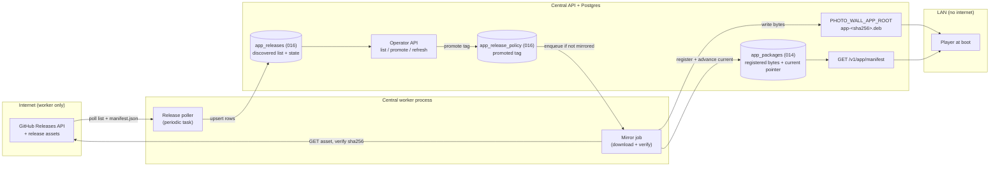
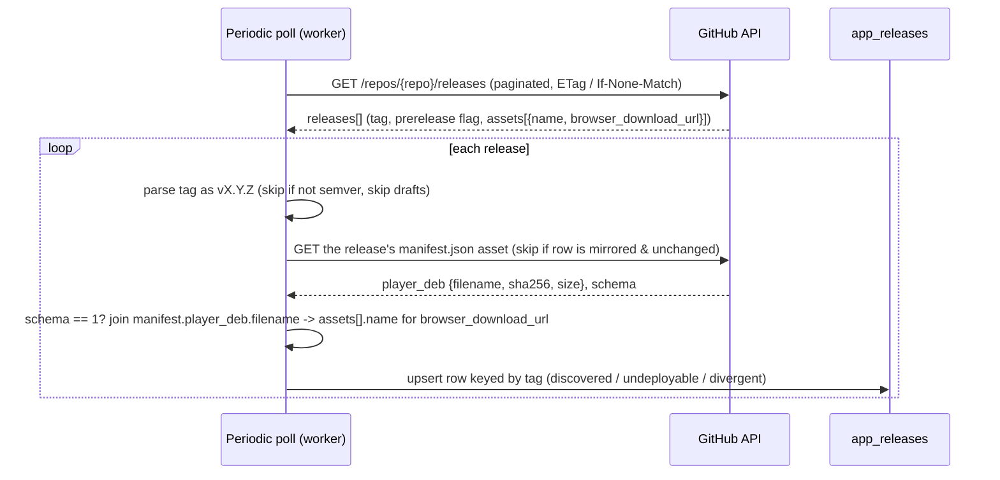
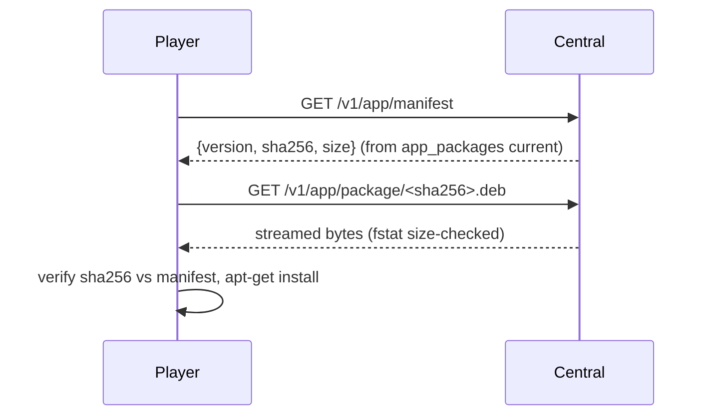
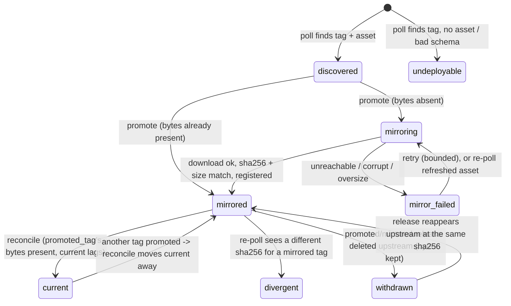
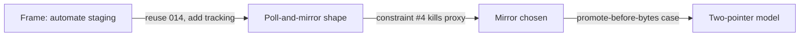

# 0010 — Sourcing the Player app from GitHub Releases

**Date:** 2026-09-12
**Status:** **Accepted 2026-09-12** (owner gate). All six gate decisions took the
recommended defaults; the two behavior-shaping ones were ruled explicitly:
**tracking = pin an exact version, manual promote (no auto-advance channel)**,
and **download = lazy, on promote**. This directory (`docs/decisions/`) holds
accepted architecture decisions; this file is the single gate artifact for the
feature and supersedes any brief, frame, or review note produced while drafting
it. Delivery is by vertical slices (store -> release-source client -> poll+
reconcile+mirror tasks -> operator API -> docs).

**What you are being asked:** approve the shape below and rule on six open
questions. Central would stop depending on an operator hand-staging `.deb`
bytes and instead watch the project's GitHub Releases, surface every semver
release as a candidate, and — only when *you* promote one — download that
release's Player `.deb` into central so connected Players keep fetching it from
the LAN. The decisions are in [Decisions that are yours](#decisions-that-are-yours).

---

## The problem in plain words

- The project already publishes each tagged release to GitHub with the Player
  `.deb` attached as an asset. Today an operator copies those bytes to central
  by hand and runs two `curl` commands. That step should disappear.
- Central should **watch the release list on its own**. A new `vX.Y.Z` release
  becomes a deployable candidate without anyone registering it.
- **Choosing which version runs is still a person's decision.** Discovery is
  automatic; promotion is a deliberate operator action.
- **Central must hold the actual bytes it serves.** Players may have no
  internet; central is the LAN authority. Central cannot simply forward Players
  to GitHub at fetch time.
- Nothing here is signed. A sha256 is a **corruption check only** (proves a
  download was not truncated or mangled), never proof of who published it. This
  is a settled home-LAN ruling, not reopened here.

### Prior owner decisions this builds on

| Decision | Where | What it fixes for us |
| --- | --- | --- |
| Home LAN, no threat model; sha256 is corruption-only, no signing anywhere | `docs/decisions/0009-*`, `central/app_packages.py:1-12` | We never verify authorship of a release asset; sha256 only guards transit corruption |
| Central serves the Player `.deb` **by reference**: bytes are staged under `PHOTO_WALL_APP_ROOT`, a pointer is registered, one pointer is promoted "current" | `central/app_packages.py:31-101` | GitHub sourcing reuses this registry unchanged; it only automates the staging |
| One global "current app" pointer the operator promotes | `central/app_packages.py:74-82`, migration `014_app_package.sql` | Promotion semantics already exist; we add release tracking around them |
| Players fetch `current` at boot, verify sha256 against the manifest, then `apt-get install` | `appliance/provision.py:187-215,341-365` | The Player path is untouched; central just becomes the thing that holds the bytes |

### Verified facts about today's code

| Fact | Where | Consequence for this design |
| --- | --- | --- |
| The serving route reads `PHOTO_WALL_APP_ROOT/app-<sha256>.deb`, `fstat`s it, and refuses if size ≠ the registered size | `central/app.py:354-390` | A mirror step must write bytes to exactly `app-<sha256>.deb` and register the true size, or serving 503s |
| `register()` is metadata-only, immutable per sha256, bounded by `MAX_APP_PACKAGE_BYTES` = 1 GiB | `central/app_packages.py:22,37-63` | Reuse it as the producer sink; do not add a second registry |
| `promote()` 404s unless the sha256 is already in `app_packages` | `central/app_packages.py:74-82` | Construction-time guarantee: `current` can only ever point at bytes central has already registered |
| `current` is a singleton row in `app_package_policy`; `GET /v1/app/manifest` returns it verbatim | `central/app.py:348-352`, `014_app_package.sql` | The manifest route stays exactly as-is; we advance the pointer it reads |
| The worker declares periodic jobs with `@app.periodic(cron=...)`, retries with a `BaseRetryStrategy` subclass, injects collaborators via `additional_context` | `media/task_queue.py:16-83` | The poller and the mirror job fit this pattern one-for-one |
| The worker process runs `run_worker_async(queues=[MEDIA_QUEUE], ...)` with only `{"media_worker": ...}` in context, reading `PHOTO_WALL_DATABASE_URL`, `PHOTO_WALL_MEDIA_ROOT`, `PHOTO_WALL_CONNECTIONS_FILE` | `media/worker.py:323-346` | The **worker consume-side** wiring: a new queue added to that `queues=` list, a new collaborator injected, `PHOTO_WALL_APP_ROOT` read here. This is one of **two** infra change sites (the other is the API producer-side, below) |
| The API builds `ProcrastinateMediaQueue(db.dsn)` at `create_app` time and injects it into `MediaRepository` as its enqueue port | `central/app.py:127-130` | The **API producer-side** wiring: promote lives in the web process, so `create_app` must construct the release service and hold an enqueue port to defer `mirror_release`, exactly as it already does for media |
| `promote()` takes only a sha256 and holds no tag knowledge; `Database.transaction()` sets only `lock_timeout`/`statement_timeout`, so Postgres runs at default **READ COMMITTED** | `central/app_packages.py:74-82`, `central/db.py:46-52` | A bare `promoted_tag == tag` compare in the registering txn is **not** enough to serialize two writers; both writers must `SELECT ... FOR UPDATE` the policy singleton first (see the reconciler section) |
| `manifest.json`'s `player_deb` record carries `{filename, sha256, size, version}` but **no download URL**; the URL is the releases API `assets[].browser_download_url` | `scripts/package_release_artifacts.py:101-177` | `asset_url` is obtained by joining `manifest.player_deb.filename` → `assets[].name`, not read from the manifest |
| The release tag is validated `^v[0-9]+\.[0-9]+\.[0-9]+([.-][0-9A-Za-z.-]+)*$` before publish | `.github/workflows/release.yml` (resolve job) | The **tag** is a real semver-ish identifier and the natural ordering key |
| The `.deb`'s own version is `{pyproject version}+g{revision}` — a static base (`0.1.0`) plus the commit sha | `scripts/build_player_deb.py` `package_version` | The `.deb` version does **not** advance per release, so it is useless for ordering; central must key on the tag, not the `.deb` version |
| Each release carries a `manifest.json` (schema 1) with `player_deb.{filename,sha256,size,version}` | `scripts/package_release_artifacts.py` `package()` | Central can learn a release's player-asset sha256 and size *without downloading the `.deb`* |
| `MAX_ROOTFS_BYTES` (1 GiB) belongs to the retired signed-rootfs boot path, not the `.deb` | `contracts/release.py:1-11` | Do **not** reuse it; the `.deb` bound is `MAX_APP_PACKAGE_BYTES` (`central/app_packages.py:22`), which `register()` already enforces |
| Migrations apply in sorted filename order, are checksum-pinned once applied, and have **no** down/rollback machinery; highest is `015` | `central/db.py:60-78`, `central/migrations/` | A new table is `016_*.sql`, additive only; rollback is a manual `DROP` |

---

## The answer in one picture



**The three rules that make this hold:**

1. **The worker discovers and downloads; central serves.** Only the worker
   touches the internet. Central's Player-facing serving path (`manifest` +
   `.deb` stream) reads local Postgres and local disk and never depends on
   GitHub being reachable.
2. **`current` only ever names bytes central already holds.** Advancing the
   current pointer goes through `AppPackages.promote`, which 404s unless the
   sha256 is registered, and a sha256 is registered only *after* its bytes are
   on disk and verified. A Player therefore never fetches a version whose bytes
   are missing.
3. **Discovery is automatic; promotion is deliberate.** The poller writes rows
   and never moves the current pointer. The pointer moves only from an operator
   promote action.

---

## Glossary

- **Release** — a GitHub Release tagged `vX.Y.Z`, carrying the Player `.deb`
  and a `manifest.json`.
- **Discover** — the poller recording a release as a candidate row (metadata
  only; no bytes fetched).
- **Mirror** — downloading a release's `.deb` to `PHOTO_WALL_APP_ROOT`,
  verifying its sha256, and registering it in `app_packages`.
- **Promote** — the operator choosing a tag as the deployment target; the one
  deliberate action.
- **Current pointer** — the single `app_package_policy.current_sha256` row that
  `GET /v1/app/manifest` returns; what Players install.
- **Promoted tag** — the operator's *chosen* release (`app_release_policy`),
  which may briefly precede the current pointer while a mirror is in flight.
- **Deployable** — a discovered release that carries a recognizable Player
  asset, so it can be promoted.
- **Reconcile** — the step that advances the current pointer to the promoted
  tag's bytes once they are registered; the convergence backstop that heals a
  crash or an abandoned-promote race.

---

## How control and safety work

The model has two pointers on purpose, because a promote can be requested
before central holds the bytes:

- **Promoted tag** (`app_release_policy.promoted_tag`) — what the operator
  asked for. Set the instant they promote.
- **Current pointer** (`app_package_policy.current_sha256`) — what central will
  actually serve. Advances to the promoted release's sha256 *only after* that
  release is mirrored and registered, in the same transaction.

If the promoted release is already mirrored, the two move together and promote
is synchronous. If not, promote returns "pending", a mirror job runs, and the
current pointer catches up when the bytes land. Until then the previously
current version keeps serving.

**Serializing the two writers.** Both the operator promote AND the mirror's
current-advance are writers of the promoted-tag / current-pointer pair, and
Postgres runs at READ COMMITTED (`central/db.py:46-52`), so a plain
`promoted_tag == tag` compare admits two races: (a) **ABA** — a late mirror for
an abandoned promote advances `current` off a stale read after a newer,
already-mirrored promote has committed; and (b) a **crash between the two
writes** on the already-mirrored branch (set `promoted_tag`, then
`AppPackages.promote(sha)`) strands the pointers apart. Both are closed the same
way: every writer of this pair takes `SELECT ... FOR UPDATE` on the
`app_release_policy` singleton row **before** it reads or compares
`promoted_tag`. The row lock forces the operator promote and the mirror's
advance to serialize; neither observes a stale `promoted_tag`.

**The reconciler — convergence, not just serialization.** Row locking stops the
races that are live in a single instant, but a crash can still leave `current`
lagging `promoted_tag` after the fact. So convergence is made self-healing:
a **reconcile step** runs whenever the bytes for `promoted_tag` are registered
and `current_sha256` does not already name that release's sha256 — it takes the
same `FOR UPDATE` lock and advances `current` to it. It runs at the tail of every
poll (and may also run as its own periodic task), so "current lags
promoted_tag" is a transient that heals on the next tick, never a permanent
divergence. The mirror job's synchronous advance is the fast path; the
reconciler is the backstop that makes a crash or an abandoned-promote race
converge.

| Who is asking | Result | Why |
| --- | --- | --- |
| Poller finds a new semver tag with a player asset | Row `discovered`, deployable | Discovery is automatic and side-effect-free |
| Poller finds a tag it cannot parse as semver | Skipped, no row | The tag is the identity key; an unparseable one has no place in the ordering |
| Poller finds a release with no player asset | Row `undeployable` | Visible in the list but not promotable |
| Operator promotes a mirrored tag | Current pointer advances now (200) | Bytes already present; `promote` is a pointer flip |
| Operator promotes a not-yet-mirrored tag | Promoted tag set (under `FOR UPDATE`), mirror enqueued (202 pending) | Bytes must arrive before `current` can name them; the reconciler advances `current` once they do |
| Two operators promote concurrently (or a stale mirror races a newer promote) | Serialized on the `app_release_policy` `FOR UPDATE` lock; last committed promote wins the tag, and only the tag it named ever becomes `current` | Row lock removes the stale-read window; the reconciler converges any lag |
| Operator promotes an `undeployable` tag | Refused (409) | No asset to serve |
| Player asks `GET /v1/app/manifest` | The current registered `{version, sha256, size}`, or 503 if none promoted yet | Serving reads only local state |

**What a compromised GitHub account or MITM gets:** on this LAN, with no
signing, a bad actor who controls the release feed can make central mirror and
serve arbitrary `.deb` bytes to Players — this is accepted and out of scope per
the 0009 ruling. The sha256 check only ensures the bytes central serves are the
*same* bytes it downloaded, uncorrupted; it is not a trust boundary.

**Two invariants, kept separate on purpose:**

1. **Safety — `current` never names absent bytes.** The current pointer names a
   sha256 registered in `app_packages`, whose bytes are present under
   `PHOTO_WALL_APP_ROOT` and match the registered size — enforced at construction
   by `promote()`'s 404 (`central/app_packages.py:74-82`) and the serving route's
   `fstat` size check (`central/app.py:371`). This holds unconditionally, even
   mid-crash, and is the invariant Players depend on.
2. **Liveness — `current` converges to `promoted_tag`.** Once the bytes for the
   operator's chosen tag are registered, `current` eventually names them. This is
   a *distinct, weaker* guarantee (eventual, not instantaneous) delivered by the
   `FOR UPDATE` serialization plus the reconciler — not by `promote()`'s 404.
   Conflating the two is the mistake the reconciler exists to prevent: safety
   never lets `current` point at absent bytes, but nothing except the reconciler
   guarantees the operator's intent is ultimately reflected.

---

## Walkthroughs

### Discover a new release (automatic, no bytes moved)



1. The poll is a Procrastinate periodic task in the existing worker, coalesced
   by a queueing lock so overlapping runs collapse to one.
2. For each release it parses the tag strictly as semver; unparseable tags and
   drafts are skipped; GitHub `prerelease` releases are skipped unless the
   prerelease policy is on.
3. It reads `manifest.json` (small, bounded) to learn the player asset's
   filename, sha256, and size **without downloading the `.deb`**. The download
   URL is **not** in the manifest (`scripts/package_release_artifacts.py:101-177`
   emits no URL); the poller obtains `asset_url` by joining
   `manifest.player_deb.filename` to the release's `assets[].name` and taking
   that asset's `browser_download_url`. A release with **no player asset** (no
   manifest, or a manifest naming a `.deb` not attached to the release) is
   recorded `undeployable`; a *mirrored* tag whose asset later fails to join is
   marked `divergent`, never overwritten.
4. **Runtime schema guard:** if `manifest["schema"] != 1` the row is marked
   `undeployable` (schema-mismatch code) rather than crashing the poll — the
   design is pinned to schema 1 and refuses, gracefully, anything else.
5. Upsert is idempotent and keyed by tag. A tag already `mirrored` is never
   rewritten (see immutability, below). A re-poll refreshes `asset_sha256` /
   `asset_url` for **any not-yet-`mirrored` row** — `discovered`, `mirroring`,
   AND `mirror_failed` — so a release **re-cut before its bytes were mirrored
   heals** and a stuck promote can complete against the corrected asset. Only
   `mirrored` (and `divergent`) rows are frozen.
6. **Rate-limit hygiene:** the paginated list call counts against the ~60/hr
   unauthenticated limit, but asset/CDN downloads generally do not. The poller
   uses conditional requests (`ETag` / `If-None-Match` on the list, and skips
   re-fetching `manifest.json` for a row whose release is unchanged since last
   poll) so a steady state of already-known releases costs close to one request
   per cadence, not one per row.

### Promote and mirror (the deliberate action)

```mermaid
sequenceDiagram
  participant Op as Operator
  participant API as Central API
  participant DB as Postgres
  participant W as Mirror job (worker)
  participant GH as GitHub
  Op->>API: POST /v1/operator/app/releases/{tag}/promote
  API->>DB: BEGIN; SELECT ... FOR UPDATE app_release_policy singleton
  API->>DB: set promoted_tag = tag
  alt already mirrored
    API->>DB: AppPackages.promote(sha256) (current advances, same lock held)
    API-->>Op: 200 promoted
  else not mirrored
    API->>DB: enqueue mirror job (queueing_lock = tag)
    API-->>Op: 202 pending
    W->>GH: GET asset_url (bounded, streamed, no redirect off-host)
    GH-->>W: .deb bytes
    W->>W: hash while writing to app-<sha>.deb.tmp; verify sha256 + size
    W->>DB: register(version=tag, sha256, size); mark row(s) mirrored
    W->>DB: reconcile: FOR UPDATE; if promoted_tag's bytes registered & current lags -> promote(sha256)
  end
```

1. Promote first takes `SELECT ... FOR UPDATE` on the `app_release_policy`
   singleton, then records the operator's intent (`promoted_tag`) — so the write
   survives a mirror failure or restart and serializes against any concurrent
   promote or reconcile.
2. The mirror job streams the asset to a temp file, hashing as it writes, and
   aborts if the running total exceeds `MAX_APP_PACKAGE_BYTES` or the final
   sha256/size disagree with the manifest. Only on success does it atomically
   rename to `app-<sha256>.deb` and register. The streaming abort is the **only**
   bound on the downloaded bytes — `register()` validates the size *argument*,
   not the bytes on disk (`central/app_packages.py:44-52`), and the serving route
   checks size *equality*, not the 1 GiB cap (`central/app.py:371`).
3. **The mirror queueing lock is keyed on `tag`, not sha256.** Two tags built
   from the same commit share a `.deb` sha256 (the `.deb` version is
   `{pyproject}+g{revision}`), so a sha-keyed lock would drop the second tag's
   mirror as `AlreadyEnqueued` and strand it in `mirroring`. Keying on `tag`
   keeps each promoted tag's mirror distinct; the mirror's final txn also
   registers/marks-mirrored every not-yet-mirrored row that shares the
   just-registered sha256, so sibling tags heal in one download.
4. The current pointer is advanced by the **reconcile step**, not a bare
   conditional write: under the same `FOR UPDATE` lock it advances `current`
   only if the bytes for the *current* `promoted_tag` are registered and
   `current` does not already name them. A late-finishing mirror for an abandoned
   promote registers its bytes but, seeing `promoted_tag` now names a different
   release, does not hijack `current`. A crash between register and advance is
   healed by the same reconcile at poll-tail.

### A Player boots (unchanged)



| Situation | What the Player sees |
| --- | --- |
| No version promoted yet | `manifest` 503 `app_unconfigured`; Player retries later (existing behaviour) |
| Current promoted and mirrored | Normal fetch and install |
| Promote pending (mirror in flight) | Manifest still returns the *previous* current; Player is unaffected until the mirror lands |
| Central's uplink is down | Serving is unaffected — bytes are local |

---

## The hard part — the two-pointer promote under a lazy mirror

Because a version's bytes may not be present when the operator promotes it, the
"chosen" state and the "servable" state are distinct, and a background job sits
between them. That is where the subtle failures live.



- **Attack: a stale mirror hijacks `current`.** Operator promotes v2 (pending),
  then promotes v3 before v2 finishes. **Fix:** both writers take
  `SELECT ... FOR UPDATE` on the policy singleton before comparing
  `promoted_tag`, so v2's late mirror serializes behind v3's promote, sees
  `promoted_tag == v3`, and does not advance `current`. READ COMMITTED's stale
  read is closed by the lock, not a bare compare.
- **Attack: crash between the two promote writes.** On the already-mirrored
  branch, a crash after `set promoted_tag` but before `AppPackages.promote(sha)`
  would strand `current` behind `promoted_tag`. **Fix:** the reconcile step
  (poll-tail and/or periodic) re-takes the lock and advances `current` to the
  registered bytes of `promoted_tag`, so the lag heals on the next tick rather
  than permanently.
- **Attack: `current` names absent bytes.** **Fix:** `AppPackages.promote`
  already 404s on an unregistered sha256, and registration follows a verified
  on-disk write. The pointer can never lead the bytes — this safety invariant is
  independent of the reconciler.
- **Attack: the tag's asset changes after discovery** (release re-cut).
  **Fix:** a re-poll that finds a different sha256 for a tag already `mirrored`
  does **not** overwrite it — it marks the row `divergent` and logs; the served
  bytes are unchanged. A **not-yet-mirrored** row (`discovered`, `mirroring`, or
  `mirror_failed`), by contrast, has its `asset_sha256` / `asset_url` refreshed
  on re-poll, so a re-cut of a tag that was promoted before its bytes landed
  heals instead of wedging forever against the stale asset.
- **Attack: the promoted release is deleted upstream.** **Fix:** the poller
  **never prunes** a row that is referenced by `promoted_tag` or holds mirrored
  bytes — the `app_release_policy.promoted_tag` FK is `NOT NULL` and a delete
  would otherwise block or strand the pointer. Such a row is marked `withdrawn`;
  already-mirrored bytes keep serving unchanged, and the row reverts to
  `mirrored` if the release reappears at the same sha256.

**Residual, stated plainly:** if the operator promotes a never-mirrored version
while central's uplink is down, that promote stays `pending` indefinitely and
the requested version never deploys until connectivity returns. The previously
current version keeps serving, so Players are never broken — but the operator's
*intent* is silently unfulfilled until they look at the list. There is no
timeout that surfaces this beyond the row's `pending`/`mirror_failed` state. Once
connectivity returns and the mirror registers the bytes, the reconciler completes
the promote automatically — no re-promote is needed.

**Cost:** the two-pointer model is more machinery than a single pointer. We
accept it because the lazy-mirror choice (below) makes "promote before bytes
exist" a first-class case, and collapsing the two pointers would either force
eager mirroring or risk `current` pointing at absent bytes.

---

## The next consumer — mirror vs. proxy (design-it-twice)

The load-bearing shape decision is **where the bytes live when a Player
fetches**. Two genuinely different designs:

| | **Poll-and-mirror (chosen)** | **Proxy-on-demand (rejected)** |
| --- | --- | --- |
| Player fetch | Streams from central's local disk | Central fetches from GitHub per request and streams through |
| Offline Players | Work — bytes are local | Break if central's uplink is down at fetch time |
| Storage | Holds the current (and any mirrored) `.deb` under `APP_ROOT` | Holds nothing |
| Serving code | Reuses `central/app.py:354-390` unchanged | New proxying route, new failure modes on the hot path |
| Constraint #4 (central holds the bytes) | Satisfied | **Violated** |

Proxy-on-demand is simpler to store but is disqualified by the owner
constraint that central must hold the bytes because Players may have no
internet. It is recorded only to show the fork was considered. Poll-and-mirror
also *reuses the entire existing serving and registry surface* — the feature
becomes "an automated stager", not a new serving path.

Within poll-and-mirror, *when* to download (eager on discovery vs. lazy on
promote) is a live gate question below, not a shape difference.

---

## Storage, lifecycle, migration

### Record shape — migration `016_app_release.sql` (additive)

`app_releases` — the discovered list, keyed by tag:

| Column | Type / constraint | Meaning |
| --- | --- | --- |
| `tag` | `TEXT PRIMARY KEY CHECK(tag ~ '^v[0-9]+\.[0-9]+\.[0-9]+')` | The semver tag, identity key |
| `major`, `minor`, `patch` | `BIGINT NOT NULL` | Parsed ordering components |
| `prerelease` | `TEXT NOT NULL DEFAULT ''` | Semver prerelease segment (`''` = full release) |
| `is_prerelease` | `BOOLEAN NOT NULL` | GitHub's prerelease flag |
| `asset_sha256` | `TEXT CHECK(asset_sha256 ~ '^[0-9a-f]{64}$')` NULL | From `manifest.json`; NULL when no player asset |
| `asset_size` | `BIGINT CHECK(asset_size > 0)` NULL | Expected `.deb` size |
| `asset_url` | `TEXT` NULL | Player `.deb` `browser_download_url`, obtained by joining `manifest.player_deb.filename` → `assets[].name` (not carried in the manifest); NULL when no matching asset |
| `mirror_state` | `TEXT NOT NULL DEFAULT 'discovered' CHECK(mirror_state IN ('discovered','undeployable','mirroring','mirrored','mirror_failed','divergent','withdrawn'))` | Lifecycle; `withdrawn` = release deleted upstream but bytes retained |
| `mirror_error` | `TEXT` NULL | Last failure code (bounded, sanitized) |
| `mirrored_sha256` | `TEXT REFERENCES app_packages(sha256)` NULL | Set once registered; links to the served bytes |
| `discovered_at`, `updated_at` | `DOUBLE PRECISION NOT NULL` | Timestamps (matches `app_packages.registered_at` type) |

`app_release_policy` — the operator's chosen tag (singleton, mirrors the shape
of `app_package_policy`):

| Column | Type / constraint |
| --- | --- |
| `singleton` | `BOOLEAN PRIMARY KEY DEFAULT TRUE CHECK(singleton)` |
| `promoted_tag` | `TEXT NOT NULL REFERENCES app_releases(tag)` |

**Relationship to `014`:** `app_packages` and `app_package_policy` are
untouched. `app_releases.mirrored_sha256` is the only FK edge into `014`. The
current pointer stays in `app_package_policy`; the manifest route stays as-is.
A manually staged package (via `POST /v1/operator/app`) has an `app_packages`
row but **no** `app_releases` row — that is fine, it simply won't appear in the
release list.

**Semver ordering (for "latest"):** `ORDER BY major DESC, minor DESC, patch
DESC, (prerelease = '') DESC, prerelease DESC`. Full releases sort above
prereleases of the same `X.Y.Z`. *Documented limitation:* prerelease segments
are compared lexically, not by semver's numeric-identifier rule, so
`v1.0.0-rc.2` vs `v1.0.0-rc.10` may misorder. This only affects display order
and any future "latest" channel, never which tag the operator explicitly
promotes.

**Rollback:** `DROP TABLE app_release_policy; DROP TABLE app_releases;` — since
`db.py` has no down-migration machinery, rollback is a manual statement plus
deleting `016_*.sql` before the next boot. `014` and served bytes are
unaffected.

### Operator API (all admin-gated, mirroring existing `/v1/operator/app*`)

| Route | Requires | Returns |
| --- | --- | --- |
| `GET /v1/operator/app/releases` | admin | `[{tag, version, mirror_state, deployable, current, size, error}]`, semver-ordered; `current` = this row's `mirrored_sha256` equals `app_package_policy.current_sha256` |
| `POST /v1/operator/app/releases/{tag}/promote` | admin | `200 {status: promoted}` if mirrored; `202 {status: pending}` if mirror enqueued; `409` if `undeployable`/unknown |
| `POST /v1/operator/app/releases/refresh` | admin | `202 {status: polling}`; enqueues an immediate poll (coalesced) |
| `GET /v1/app/manifest` | (unchanged, unauth) | The current registered `{version, sha256, size}` — reads `app_packages` exactly as today |
| `PUT /v1/operator/app/current` | admin | (unchanged) direct sha256 promote — retained as the manual/escape-hatch path |
| `POST /v1/operator/app` | admin | (unchanged) manual stage-by-reference registration |

### Wiring — TWO infrastructure change sites

There are two, not one, because the producer (promote) lives in the web process
and the consumer (poll / mirror) lives in the worker.

**1. API producer-side — `central/app.py` at `create_app` time.** Mirroring how
the API already builds `ProcrastinateMediaQueue(db.dsn)` and injects it into
`MediaRepository` (`central/app.py:127-130`), `create_app` must:
- construct the `AppReleaseService` collaborator — it sets `promoted_tag` (under
  `FOR UPDATE`), reads the release list, and on the already-mirrored branch calls
  `AppPackages.promote(sha256)` synchronously under the same lock;
- hold an enqueue port (the same `ProcrastinateMediaQueue`-style deferral) so the
  promote route can defer a `mirror_release` job onto the new queue when the
  chosen tag is not yet mirrored.

**2. Worker consume-side — `media/worker.py:_entry` (`media/worker.py:342-346`).**
Must: read `PHOTO_WALL_APP_ROOT`; construct the worker-side `AppReleaseService`
collaborator; add the queue to
`run_worker_async(queues=[MEDIA_QUEUE, APP_RELEASE_QUEUE], ...)`; and inject it
via `additional_context={"media_worker": ..., "app_release_service": ...}`.
Task definitions (`poll_releases` periodic + `mirror_release` + the `reconcile`
step run at poll-tail and/or as its own periodic task) live in a new module
beside `media/task_queue.py`, using the same `@app.periodic` / retry patterns.

---

## Decisions that are yours

| # | Question | Recommendation | Cost of the recommendation | Alternative |
| --- | --- | --- | --- | --- |
| 1 | Tracking semantics | Auto-discover the list; operator promotes an **exact** version. Offer **no** auto-advance channel | Every upgrade is a manual promote; no "always run latest" convenience | An optional "follow latest stable" channel that auto-advances `current` — contradicts the deliberate-deploy requirement; only add if you explicitly want it |
| 2 | When central downloads the bytes | **Lazy — on promote.** Discovery stays metadata-only | A promote of a never-mirrored version needs GitHub reachable then; it returns "pending" and waits (the residual above) | **Eager — mirror every discovered release.** Always offline-ready, always instantly promotable; costs bandwidth and up to 1 GiB × N releases of disk |
| 3 | Poll cadence + mechanism | Procrastinate periodic task in the **existing** worker, every **900 s (placeholder)**, plus an on-demand `refresh` endpoint | Up to ~15 min before a new release appears (mitigated by manual refresh) | Shorter interval (more API calls, closer to the rate limit) or GitHub webhooks (needs inbound internet — rejected on a LAN) |
| 4 | GitHub source config | Repo via `PHOTO_WALL_GITHUB_REPO` (default `mcurcio/photo-wall`); **unauthenticated** by default; optional `PHOTO_WALL_GITHUB_TOKEN`; prereleases **excluded** by default; drafts always excluded; the list uses `ETag`/`If-None-Match` and skips re-fetching `manifest.json` for unchanged releases | Unauth is ~60 req/hr/IP (only the list call counts; asset/CDN downloads generally do not); conditional requests keep a steady state near one request per cadence | Require a token (raises the limit to ~5000/hr) at the cost of an operator having to mint and store one |
| 5 | Semver + asset identification | Strict `vX.Y.Z[-pre]` tag as the ordering/identity key; identify the player asset via the release's **`manifest.json`** (`player_deb` record); non-semver tags skipped, releases without the asset marked `undeployable` | Couples central to `manifest.json` continuing to be published by `release.yml` (schema 1) | Match the asset **filename** `photo-wall-player_*.deb` directly — no manifest dependency, but the sha256/size are unknown until the `.deb` is fully downloaded |
| 6 | Relationship to manual staging | **Coexist.** GitHub sourcing is an additional automated producer into the same `app_packages` registry + current pointer; `POST /v1/operator/app` stays as the offline/manual escape hatch | Two producers exist; a manually staged sha256 won't appear in the release list (it has no `app_releases` row) | **Replace** the manual path — smaller API surface, but loses hand-recovery when GitHub is unreachable and you have the bytes on a USB stick |

### Assumptions made on your behalf — say so if any is wrong

1. `manifest.json` (schema 1) keeps carrying `player_deb.{filename,sha256,size}`
   on every release; central reads it rather than re-deriving the asset.
2. Operators think in **tags** (`v1.2.3`), so `app_packages.version` will store
   the **tag**, not the `.deb`'s internal `0.1.0+g<sha>` string.
3. The existing worker process is the right home for the poller and mirror job
   (it already makes outbound network calls for media sources).
4. `MAX_APP_PACKAGE_BYTES` (1 GiB) is an acceptable ceiling for a Player `.deb`.
5. `900 s`, the prerelease-excluded default, and "no token" are placeholders you
   can tune; nothing structural depends on the exact values.

---

## Deliberately out of scope

**Deferred (later, same design):**
- A "follow latest stable" auto-advance channel (the model already stores the
  ordering to support it).
- An operator UI for the release list (backend list endpoint ships; the
  `operator.js` surface is a later bead).

**Non-goals (not planned):**
- Signing or authenticity verification of any release asset (settled: home LAN).
- Auto-rollback when a promoted version misbehaves on Players.
- Multiple source repos or per-frame version pinning.
- Delta / partial `.deb` updates; central always mirrors the whole file.

---

## What can go wrong

Guarantee strength, strongest first: **construction** (cannot be represented) >
**transaction** (DB atomicity/constraint) > **decision** (a runtime check in
code) > **test** > **convention** > **documented**.

| Failure | Behaviour | Guarantee strength |
| --- | --- | --- |
| GitHub unreachable during poll | Poll job fails and retries; existing rows and the current pointer are untouched; serving continues from local bytes | decision (worker isolated from serving) + transaction (no partial write) |
| Rate-limited (403/429) | Poll aborts cleanly, backs off to the next cadence, honours `Retry-After`; no rows written | decision |
| Release with no player asset, or `manifest["schema"] != 1` | Row `undeployable`; promote refused; poll does not crash | transaction (CHECK on state) + decision (promote 409, schema guard) |
| Non-semver / draft tag | Skipped at parse; no row created | decision (parser); elevated to **test** via mutation probe 1 |
| Asset download corrupt or interrupted | Streamed hash ≠ manifest sha256 or size ⇒ temp file discarded, row `mirror_failed`, retried; `current` unchanged | decision (verify) + serving route also `fstat` size-checks (construction) |
| Download exceeds the bound | Streaming aborts when the running total passes `MAX_APP_PACKAGE_BYTES`. This is the **only** bound on the downloaded bytes: `register()` checks the size *argument*, not the on-disk bytes (`central/app_packages.py:44-52`), and the serving route checks size *equality*, not the cap (`central/app.py:371`) | decision (streaming abort) — no transaction backstop; asserted by mutation probe 4 |
| Concurrent promotes / stale mirror races a newer promote | Every writer of the promoted-tag / current pointer pair takes `SELECT ... FOR UPDATE` on the `app_release_policy` singleton before comparing `promoted_tag`, so the two serialize; the reconciler then converges `current` | transaction (row lock serializes writers) + decision (reconciler converges) |
| Crash between the two promote writes (`set promoted_tag`, then `promote(sha)`) | `current` transiently lags `promoted_tag`; the reconcile step (poll-tail / periodic) re-takes the lock and advances `current` to the registered bytes | transaction (FOR UPDATE) + decision (reconciler as the convergence guarantee) |
| Promote a not-yet-mirrored version | Allowed; returns pending, enqueues mirror (`queueing_lock = tag`); `current` advances via the reconciler once bytes register, never before | construction (`promote` 404s on unregistered sha256, safety) + transaction/decision (FOR UPDATE + reconciler, liveness) |
| Two tags from the same commit (same `.deb` sha256) promoted | Mirror `queueing_lock` is keyed on **tag**, so the second is not dropped as `AlreadyEnqueued`; the mirror's final txn registers/marks every not-yet-mirrored row sharing the sha256 | construction (tag-keyed lock) + transaction (sibling reconcile in mirror txn) |
| GitHub asset changed under a tag | A `mirrored` tag is never overwritten (row → `divergent`, logged); a not-yet-`mirrored` row's asset is refreshed on re-poll so a re-cut heals; a mismatching download is caught by the corruption check | transaction (no overwrite of mirrored) + decision (refresh + verify) + documented |
| Promoted / mirrored release deleted upstream | Row kept, marked `withdrawn`; never pruned while referenced by `promoted_tag` or holding mirrored bytes (the `NOT NULL` FK would otherwise block/strand); already-mirrored bytes keep serving | transaction (FK + no-prune rule) + decision (withdrawn sub-state) |
| Central offline at promote of an un-mirrored version | Promote stays `pending`; prior current keeps serving; intent unfulfilled until connectivity returns, then the reconciler completes it | documented (the stated residual) |

---

## How the design got here



- **r1** — Framed the feature as *automating the existing stage-by-reference
  path* rather than a new serving mechanism, after confirming `014`'s registry
  and serving route can be reused verbatim.
- **r2** — Chose poll-and-mirror over proxy-on-demand; the owner's "central
  holds the bytes / Players may be offline" constraint is dispositive.
- **r3** — Introduced the promoted-tag vs. current-pointer split once the
  lazy-mirror recommendation made "promote before bytes exist" a first-class
  state.
- **r4** (adversarial review) — the bare `promoted_tag == tag` guard was proven
  insufficient under READ COMMITTED (ABA + crash-between-writes); added
  `FOR UPDATE` serialization and a reconcile step, splitting safety from liveness.
  Corrected: `asset_url` comes from the releases API, not the manifest; the
  mirror lock is keyed on tag, not sha256; `register()` is not an oversize
  backstop; re-poll refreshes any not-yet-mirrored row; upstream-delete →
  `withdrawn`; and the wiring is two sites (API producer + worker consumer), not
  one.

**What survived every attack:** the current pointer can never lead the bytes
(rule 2), because `promote()`'s existing 404 makes it impossible by
construction.

**Where the specs/code were found wrong:** the `.deb`'s own version
(`{pyproject version}+g{revision}`, `scripts/build_player_deb.py`) does not
advance per release — the static `0.1.0` base makes it useless as an ordering
key. This design keys on the **tag** instead and flags the `.deb` version
scheme as a candidate cleanup (making pyproject track the tag) — a note, not a
blocker.

---

## What happens after the gate

1. **Migration `016`** — `app_releases` + `app_release_policy` (shapes above).
2. **Release service** — the parse/order/upsert logic and the promote/reconcile
   transaction, alongside `central/app_packages.py`.
3. **Worker tasks** — `poll_releases` (periodic) + `mirror_release` + the
   `reconcile` step (poll-tail and/or periodic), plus the consume-side
   `media/worker.py:_entry` wiring (new queue, `PHOTO_WALL_APP_ROOT`,
   collaborator).
4. **Operator routes + producer wiring** — list / promote / refresh in
   `central/app.py`, plus the `create_app` producer-side wiring (construct the
   release service, hold the enqueue port) mirroring `central/app.py:127-130`.
5. **Docs** — `docs/runbook.md` operator flow (promote-a-version replaces the
   two-`curl` dance); `release.yml` notes updated; a config-env reference.

**Packages touched:** `central/` (new service module, routes, migration),
`media/` (worker wiring + task module), docs. `contracts/` and `player/` are
untouched; `appliance/provision.py` is untouched.

### Tracer bullet — thinnest end-to-end slice

**Proves:** poll → discover → deployable → operator promote → mirror → a Player
fetches that exact `.deb` from central. **Non-goals of the tracer:** the list
UI, prerelease policy, eager mirroring, multi-page release lists.

**Setup:** worker running with `PHOTO_WALL_APP_ROOT` set and
`PHOTO_WALL_GITHUB_REPO` pointing at a repo (or a stubbed API) with one release
`v0.0.1` carrying `manifest.json` + `photo-wall-player_*.deb`; nothing promoted.

**Path:**
1. Periodic poll discovers `v0.0.1` → `app_releases` row `discovered` with the
   manifest's sha256/size.
2. `GET /v1/operator/app/releases` shows `v0.0.1` deployable, not current.
3. `POST /v1/operator/app/releases/v0.0.1/promote` → 202 pending, mirror
   enqueued.
4. Mirror downloads to `app-<sha>.deb`, verifies sha256+size, registers, and —
   `promoted_tag` still `v0.0.1` — advances `current`.
5. `GET /v1/app/manifest` returns `{version: v0.0.1, sha256, size}`;
   `GET /v1/app/package/<sha>.deb` streams the mirrored bytes.

**Refusals, each with its record:** promote of an `undeployable` release → 409
(no row-state change); poll of a non-semver tag → no row.

**Mutation probes that must turn a test red:**
1. Make the tag parser accept a non-semver tag → the "non-semver tag is never
   discovered/deployable" test fails.
2. Disable the sha256/size comparison in the mirror job → the "corrupt download
   never becomes current, prior current still served" test fails.
3. Make promote advance the current pointer *before* the mirror registers the
   bytes → the "Player never 404s on the current `.deb`" test fails (manifest
   would name a sha256 whose bytes are absent).
4. Remove the streaming abort (or raise its ceiling above `MAX_APP_PACKAGE_BYTES`)
   → the "an over-cap asset is refused, not mirrored" test fails. This is the
   only bound on downloaded bytes; `register()` and the serving route do not
   backstop it.
