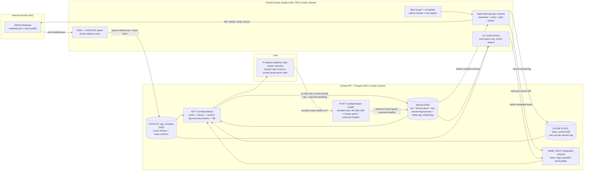
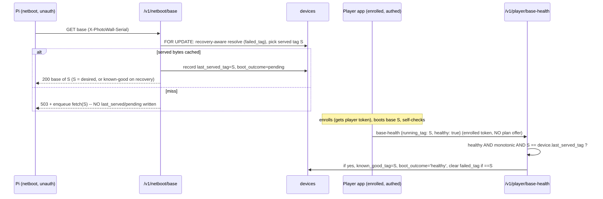
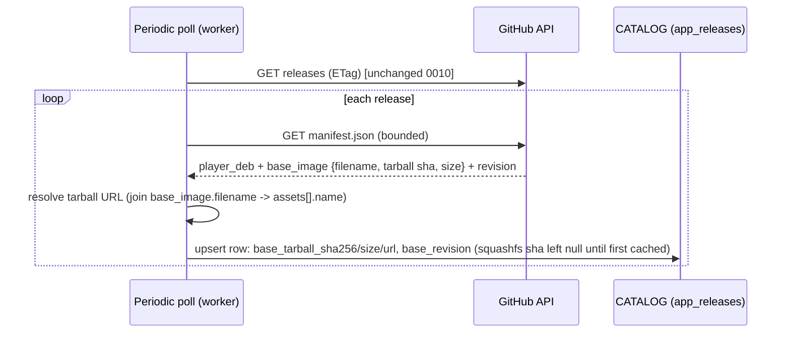
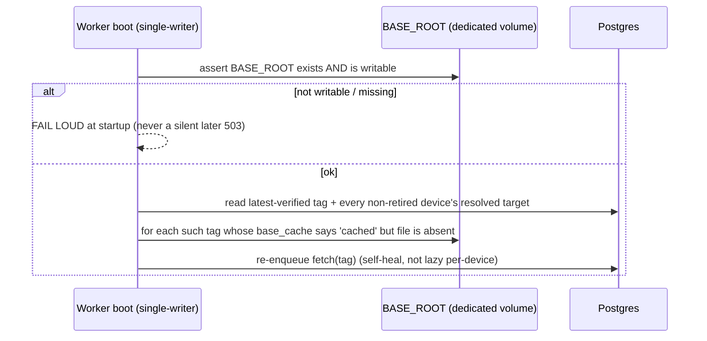
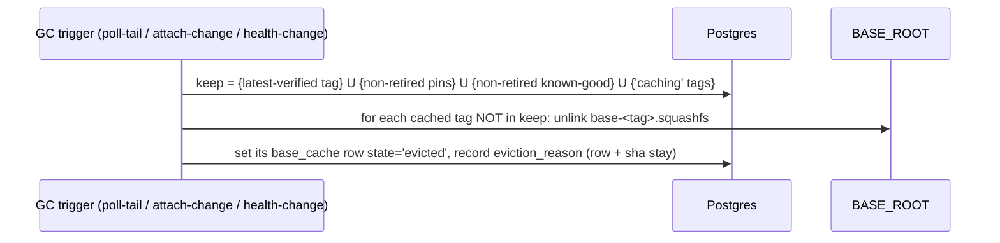
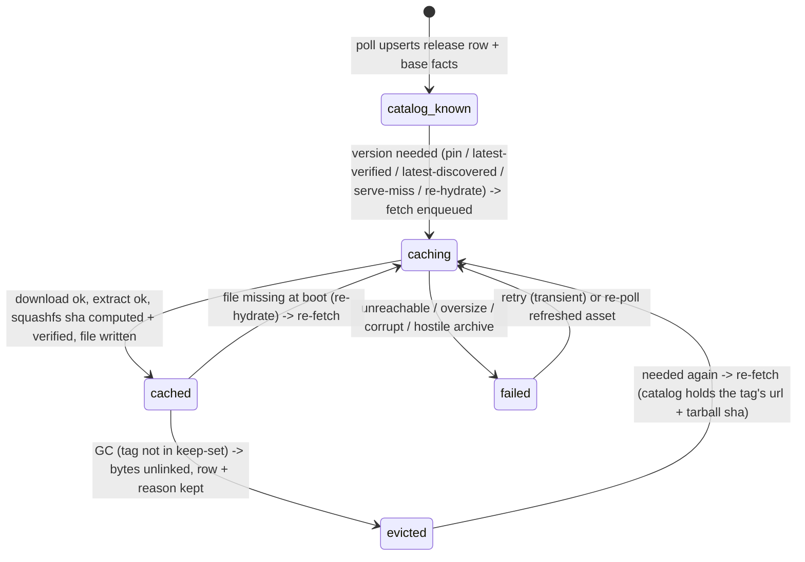

# 0012 — Auto-mirroring netboot base images: a catalog, a need-driven cache, per-device serving

**Date:** 2026-09-20
**Status:** **PROPOSED — owner gate (r8; re-review split the overloaded served-tag
field, moved the boot record to the 200 path, and pinned the netboot seam's concurrency).**
This directory (`docs/decisions/`) holds accepted architecture decisions; this file is
the single gate artifact for the feature and supersedes any brief, frame, or review note
produced while drafting it.

**The model, settled across r0–r6:**
- **r2 reframe:** there is **no single current base**. Central serves **multiple
  base images concurrently** — the fleet is heterogeneous. The r0/r1 singleton +
  symlink-flip is gone.
- **Base OS and Player `.deb` are INDEPENDENTLY VERSIONED.** The base image has its
  own build identity (`base_revision`, a git sha), neither the tag nor the `.deb`
  version; a release tag carries a base tarball as one of its assets.
- **r6 owner decisions (now DECIDED; they replace the r3/r5 promotion machinery):**
  1. **There is NO fleet default and NO promotion step.** `default_tag`,
     `promoted_tag`-as-a-base-selector, the operator "promote the default" action,
     and the r5 canary health-gate are **removed**. Selection is **per-device**.
  2. **Selection precedence, per device:** (1) the device's **pin**, else (2)
     **latest-verified**, else (3) — empty state only — **latest-discovered**.
  3. **latest-verified is a live QUERY, not stored state:** the highest **semver**
     tag that at least one **non-retired** device has reported **healthy**. This is
     why the old default-clobber race is gone — nothing writes a shared "current".
  4. **The cache is keyed by RELEASE identity, not by content sha.** Each version
     owns its own cache row and file; two releases with identical bytes produce two
     files. The squashfs sha256 is **integrity/`Digest` only**, never a shared key.
  5. **Storage:** Central **requires a second persistent directory dedicated to base
     images**, separate from the media volume, asserted writable at boot, and
     **proactively re-hydrated** on boot.
  6. **Rollback (r7 server-side; r8 split the boot record):** the appliance is
     **diskless** (RAM-overlay; it persists nothing across a reboot and cannot choose a
     tag), so rollback lives on Central. Central records, per device, the **tag whose
     bytes it actually served this boot** (`last_served_tag`, written **only on a 200**),
     that boot's **outcome** (`pending`/`healthy`/`failed`), and — separately — the
     **precedence target that failed to reach healthy** (`failed_tag`, the sticky marker).
     A target served (200) but never reported **base-healthy** is detected `failed`; on
     the **next netboot** Central serves that device its **known-good** instead — and,
     so it cannot oscillate, **sticks** (via `failed_tag`) to known-good until a newer
     target appears or an operator acts. Because `last_served_tag` on a recovery boot is
     the known-good tag, the recovery boot's base, its `.deb`, and its base-health all
     agree on that one tag. A **new** device with no known-good that cannot boot its
     served image boot-loops until an operator **pins** it — accepted.
  7. **Health signal is decoupled from frame-binding (r7).** An enrolled device reports
     **base health** on a distinct authenticated endpoint that does **not** require a
     live plan offer, so an enrolled-but-**unbound**, base-booted device can move the
     frontier. The existing frame-coordination readiness path is unchanged.

**What the design does NOT promise:** it does **not** guarantee "never 503". It
guarantees **"a 503 is transient, bounded, and self-heals"** — a base miss enqueues
a fetch, the Pi reboots and retries, and a boot re-hydrate self-heals a cache whose
bytes were lost. The one exception, stated up front: a fresh cluster's very first
image is **unverified by construction** (latest-discovered), so a bad first image
bricks initial bring-up until the operator pins a known-good — an inherent cost.

**What you are being asked:** approve the shape and confirm the DECIDED gate rows.
Today a photo-wall Pi cannot netboot at all: `GET /v1/netboot/base` returns **503**
because nothing populates the directory it serves and no dedicated persistent
directory is configured. This design makes Central's worker **discover** every
release into a catalog, **cache** each needed base squashfs on demand as a
per-version immutable file on a dedicated persistent volume, and **serve** each
device the whole-release artifacts (base + `.deb`) of the version it resolves to —
by per-device precedence, with zero manual staging.

### Prior owner decisions this builds on

| Decision | Where | What it settles for us |
|---|---|---|
| Home LAN, no threat model; sha256 is corruption-only, no signing | `docs/decisions/0009-*`, `docs/decisions/0010-*` | We never verify authorship of a release asset; sha256 guards transit corruption and serves as the `Digest`, never authenticity |
| Base OS and Player `.deb` are **two assets of one release** | `docs/decisions/0009-*`, `scripts/package_release_artifacts.py:167-177` | The version a device runs determines both its `.deb` and its base image; base selection piggybacks on the resolved tag (whole-release) |
| Central holds the bytes it serves; the worker touches the internet; discovery automatic | `docs/decisions/0010-*` | The base is a second producer into the same worker/serve split |
| GitHub-sourcing config is opt-in on `PHOTO_WALL_APP_ROOT`; the worker mirrors the `.deb` there and Central serves it | `central/app_release_service.py:107`, `central/app.py` `app_package` route | The base reuses the **already-proven** dual-mount pattern (worker RW, Central RO) — but on its **own** dedicated volume, not the `.deb` one |

### Verified facts about today's code (each checked for this reframe)

| Fact | Where | Consequence |
|---|---|---|
| **A `players` row exists only after cryptographic enrollment.** It requires NOT NULL `public_key`/`token_hash`; enroll INSERTs it keyed `player_id = "p-"+sha256(device_id)[:32]` | `central/migrations/001_registry.sql`, `central/registry.py:113-134` | A bare Pi at netboot has no key/token, so it **cannot** be a `players` row. "Device" is a **new pre-enrollment `devices` table** keyed by `device_id`; enrollment later joins it via the shared `players.device_id` |
| **No device→release attachment exists.** `players` has `id, public_key, token_hash, authority_epoch, device_id, ...` — no release/version column | `central/migrations/001_registry.sql`, `010_stateless_enrollment.sql` | The pin is **new**; it lives on the new `devices` row |
| `GET /v1/app/manifest` takes **no** input and returns the global `current()`; the bootstrapper's manifest fetch sends **no serial** (`chunks` supports `headers=` but the manifest caller passes none) | `central/app.py:415-419`, `appliance/provision.py:138-215` `fetch_manifest`/`AppFetcher.chunks` | Per-device `.deb` needs the serial on the manifest fetch — a real **`appliance/` change**. The running OS already reads the serial (`appliance/bootstrap.py:read_pi_serial`) |
| **`POST /v1/player/readiness` is REJECTED without a live plan offer.** `coordinator.readiness` selects the device's `plan_offers` row and `raise CoordinationError("unknown_offer")` when there is none; a plan offer exists only for a **frame-bound** device | `central/coordination.py:594,604-610`; offer built from `config.bindings` (`:394,443-455`) | An enrolled, base-booted, **unbound** device emits **no accepted readiness** — so known-good must **not** ride the readiness path, or the frontier can never climb on boot-health (frame binding is orthogonal, `bindings:001_registry.sql:36`) |
| **An enrolled device holds a player token** (`{player_id, token, authority_epoch}` from enroll); the `player` dependency authenticates it via `registry.authenticate` and requires **no** plan offer | `central/registry.py:102-152`, `central/app.py:304-307` | The **base-health** signal (r7) can authenticate with this **enrolled-device credential** on its own endpoint — reachable by any enrolled device, bound or not |
| **`coordinator.readiness` returns `True` for any newer, structurally-valid report — including one carrying `failures` or `capacity_ok=False`.** The `accepted` boolean the route returns is NOT a health verdict | `central/coordination.py:594-706` (returns `True` at :706; the only `False` is the monotonicity guard at :615) | Reinforces that readiness cannot be the known-good source — even for a bound device `accepted` is not health. Known-good rides the separate **base-health** endpoint, which carries its own explicit `healthy` flag (r7) |
| The readiness handler already gates on **sequence monotonicity** (`if old and report.sequence <= old["sequence"]: return False`) | `central/coordination.py:611-616` | The known-good write reuses this so a device's known-good only ever **advances** — reordered readiness twins (POST + websocket) never regress it |
| `Readiness` carries **no running-version/tag field**, and the coordinator path is plan-offer-gated | `contracts/models.py:229-239`, `central/app.py:523-527` | The running tag is **not** bolted onto `Readiness`; it rides a **new `BaseHealth` contract** on the base-health endpoint (r7), which no unbound device is blocked from — `Readiness` stays purely frame-coordination |
| **The appliance is diskless (RAM-overlay); the initrd writes no boot-context file and persists nothing across a reboot**; the netboot request carries only `X-PhotoWall-Serial`; the base response is bytes + `Digest`, no tag | `appliance/netboot_init.py:373-375,422`, base serve `central/app.py:451-490` | The appliance **cannot** persist a known-good, choose a tag, or roll itself back. Rollback and the last-served-tag must be **server-side, keyed on the serial** — the appliance sends no new field |
| The netboot e2e is **false-green**: `_stage_base` pre-writes `photo-wall-base.squashfs`+`SHA256SUMS` and passes `base_root=` to `create_app`, so discover→download→cache is never run; conftest never sets the base dir | `tests/test_netboot_e2e_wire.py:114-120,181`, `tests/test_netboot_base_http.py` `_stage_base` | The tests manufacture exactly the precondition the live cluster lacks — a genuine fresh-install e2e is a required bead |
| **The media worker is single-writer via an exclusive `flock`.** `MediaStore.worker_lock()` opens `<root>/.worker.lock` and takes `LOCK_EX|LOCK_NB`; `media/worker.py` wraps the entire run in `with worker.store.worker_lock()` | `central/media_store.py:176-199`, `media/worker.py:387` | The base fetch runs inside this same single-writer worker. The design **depends on single-writer**, so `O_EXCL`/mkstemp→rename need only defend against a crash-restart, not two concurrent writers on one host |
| `parse_semver` is strict SemVer 2.0.0 and **rejects** non-semver / build-metadata tags; `AppReleases.list()` returns rows **semver-DESC** | `central/app_releases.py:46-92,158-166` | latest-verified / latest-discovered can be a single `ORDER BY major DESC,minor DESC,patch DESC` query, and non-parseable tags are simply excluded |
| `boot_autopull` currently polls, sets `promoted_tag`, and reconciles the global `.deb` pointer at worker boot (0010) | `central/app_release_boot.py:59-135` | Its existing 0010 `.deb`/`promoted_tag` behavior is **PRESERVED unchanged**; this feature only **adds** a base role — the empty-state bootstrap fetch of latest-discovered plus the boot re-hydrate |
| `bindings` is player→**frame** adoption (`frame_id → player_id, output_id`) | `central/migrations/001_registry.sql:36`, `central/installation_repository.py:26-38` | Frame binding is orthogonal to release attachment; GC's device terms must **not** mean frame-bound |
| Serial → `device-<64hex>` via one shared derivation; `players.device_id` is unique | `contracts/equipment.py:21` `equipment_device_id`, `010_stateless_enrollment.sql` | The serve seam maps `X-PhotoWall-Serial` → `device_id` → the `devices` row |
| The Pi initrd **fails closed and reboots** on any base-fetch fault (503, missing/mismatched `Digest`) | `appliance/netboot_init.py:215,377`, `fetch_verified` | A cache-miss safely returns 503; the Pi retries on its next boot cycle. Retry granularity is a whole reboot (~seconds), so proactive caching + boot re-hydrate are strongly preferred |
| The manifest declares `base_image = {filename, sha256, size}` where `sha256` is the **tarball** digest, and a top-level `revision` | `scripts/package_release_artifacts.py:166-177` | The inner **squashfs** digest (the served `Digest`) is **not** in the manifest — it is inside the tarball's `SHA256SUMS`, learned only after download+extract |
| The manifest's `revision` is a **40-char git sha** (validated), embedded in the tarball name; there is **no base semver** | `scripts/package_release_artifacts.py:124-128,156,169-174` | `base_revision` is informational metadata (which OS build), recorded per release for the operator to match the TFTP boot tree; it is **not** a cache key and never needs ordering |
| The `.deb` download primitive streams bounded, hashes, verifies against a manifest sha256, fails closed with a fixed-name `O_EXCL` temp, follows the CDN redirect | `central/github_releases.py:314-353` `download` | The base tarball download reuses this; the base fetch uses a **uniquely-named `mkstemp` temp in the target dir** (not a fixed name) so a crash-restart never collides, and tar extraction is the only new surface |
| `open_regular` applies `O_NOFOLLOW` to the final component and requires a regular file | `central/artifact_io.py:39-51` | A per-version `base-<tag>.squashfs` is served through it unchanged; **no symlink, no SHA256SUMS re-read, no torn pair** |
| `select_base_for_serial` returns one base for every serial; its TODO says "when a per-serial binding model exists, look the serial up here" | `central/netboot_base.py:57-72` | This feature **is** that per-serial model; the seam becomes a per-device lookup |
| `Database.transaction()` runs at Postgres default **READ COMMITTED** (no explicit isolation) | `central/db.py:47-52` | GC's keep-set read is not atomic with its unlinks — the eviction guarantee is decision + eventual, not "cannot happen" |
| Migrations are additive, sorted, checksum-pinned, no down-machinery; highest is `017` | `central/db.py`, `central/migrations/` | New migration is `018_*.sql`, additive only |

---

## The problem in plain words

- **Different Pis run different releases at the same time.** Central must serve
  several base images concurrently — the one each Pi's resolved version needs — not
  a single "current" image.
- **Remember everything; download only what is needed.** Central records *every*
  release it sees on GitHub (cheap metadata, kept forever), but only pulls the heavy
  squashfs bytes for versions something actually needs.
- **A Pi asks for its base by identity.** It sends its serial; Central resolves the
  version that Pi should run (pin, else latest-verified, else — on an empty cluster
  — latest-discovered) and serves that version's base image.
- **A 503 is transient, not a dead end.** A base that is not yet cached returns 503;
  the Pi reboots and retries; a background fetch lands the bytes; a boot re-hydrate
  refills a cache whose files went missing. The design does **not** promise "never
  503" — it promises a 503 is **bounded and self-heals**.
- **Clean up bytes that nothing needs.** A cached base is deleted once no
  non-retired device pins it, has it as known-good, or would resolve to it as
  latest-verified, and no fetch is in flight. The catalog record stays; only the
  bytes go.
- **Nothing is signed** (home LAN, 0009/0010): a sha256 is a corruption and
  `Digest` check, never proof of authorship.

---

## The answer in one picture



**The three rules that make this hold:**

1. **The catalog is immortal; the cache is per-version and disposable.** The catalog
   records every discovered release forever, including its base facts. The cache
   holds only the squashfs bytes something needs, as **per-version immutable files**
   named by the release tag (`base-<tag>.squashfs`). There is **no shared content-sha
   key, no "current" pointer, no symlink** — two versions with identical bytes get
   two files. The squashfs sha256 is stored per version for integrity and as the
   served `Digest`, never as a cache identity.
2. **Every device has a canonical row; it is served the whole-release artifacts of
   one resolved version.** The netboot request auto-creates the device's row (serial
   → `device_id`). Selection is a **per-device precedence query**: the device's
   **pin**, else **latest-verified** (the highest semver tag any non-retired device
   has reported healthy — a live query, never stored), else — **empty state only** —
   **latest-discovered**. From that one tag come **both** the base image and the
   `.deb`; they never diverge. The `Digest` served is that version's squashfs sha, so
   bytes and digest agree by construction.
3. **Health is a distinct base-health check-in an unbound device can make; the frontier
   follows it, and Central rolls back on its absence.** A device's **known-good tag**
   is set only when it posts **`POST /v1/player/base-health`** — an authenticated
   endpoint (enrolled-device token, **no plan offer required**, so a base-booted
   unbound device reaches it) reporting the tag it is running and that it is healthy —
   and only if that tag matches what Central **last served** the device. It is never
   set at serve time, and the frame-coordination readiness path plays no part.
   latest-verified is the max semver over non-retired devices' known-good tags, so
   promotion is **emergent**: pin a canary to a new version; when it posts base-healthy,
   latest-verified climbs and unpinned devices follow — no promote action. When the
   device Central **served** a target never posts it healthy, Central marks that boot
   `failed` and on the next netboot serves the device its **known-good** instead
   (server-side rollback), **sticking** there until a newer tag appears or an operator
   acts. A cached file is kept iff its tag is latest-verified, **or** any non-retired
   device's pin, **or** any non-retired device's known-good, **or** a fetch in flight;
   otherwise its bytes are evicted (rows stay, with a recorded reason). Eviction is
   safe: files are immutable and an open fd survives an unlink.

---

## Glossary

- **Catalog** — one row per discovered release (`app_releases`, extended): tag,
  prerelease flag, base tarball facts, `base_revision`, and — once learned — the
  squashfs sha. Never garbage-collected.
- **Cache** — the squashfs bytes on disk, named by version (`base-<tag>.squashfs`),
  plus a `base_cache` row **per version tag** recording
  `caching`/`cached`/`evicted`/`failed`, the squashfs sha (integrity/`Digest`), and
  an eviction reason. Rows are never deleted; only bytes are need-driven.
- **base_revision** — the base image's own build identity (manifest top-level
  `revision`, a git sha). Informational metadata the operator matches to the TFTP
  boot tree; **not** a cache key, **not** orderable, **not** a dedup key.
- **squashfs sha256** — the sha of the extracted squashfs bytes; the served
  `Digest` and the download-integrity cross-check. **Integrity only** — never a
  cache identity and never shared across versions.
- **Device** — a Pi as a physical unit, identity `device_id` (`device-<64hex>`,
  derived from the serial). Its `devices` row is auto-created on first netboot
  contact, before any enrollment; it is the canonical home for the pin and the
  known-good tag. `players` (post-enrollment) joins it by `device_id`.
- **Pin** — `devices.attached_tag`: an operator-set version this device must run,
  overriding latest-verified. Also how a canary is designated.
- **Known-good tag** — `devices.known_good_tag`: the tag a device last ran **while
  confirmed base-healthy** (its own per-device evidence). What server-side rollback
  returns to, and the per-device input to the latest-verified frontier. Advances only
  via a base-health check-in, never at serve time.
- **Base-health** — the authenticated `POST /v1/player/base-health` check-in an enrolled
  device makes (enrolled-device token, **no plan offer required**) reporting the tag it
  is running and that it is healthy. The **sole** writer of known-good, and the signal
  a base-booted **unbound** device can emit. Distinct from frame-coordination readiness.
- **Last-served tag / boot outcome** — `devices.last_served_tag` + `boot_outcome`
  (`pending`/`healthy`/`failed`) + `last_served_at`: the tag whose bytes Central actually
  served this boot (**written only on a 200**, never on a self-healing 503) and how that
  boot ended. On a recovery boot this is the **known-good** tag — so the `.deb` and the
  base-health report both agree with it. Not a history ledger — a single current-boot
  record that lets Central validate a health report, detect a failed boot, and hand the
  same tag to the device's `.deb` fetch.
- **Failed tag** — `devices.failed_tag`: the *precedence target* that was served (200)
  but never reported base-healthy — the **sticky rollback marker**. Selection's recovery
  arm keys off this (not off `last_served_tag`): an unpinned device whose current desired
  target equals `failed_tag` is served known-good instead. Cleared when the desired target
  becomes a different tag (newer latest-verified or an operator pin), or when that tag is
  later confirmed base-healthy.
- **Recovery (sticky)** — when a device never reports its served target healthy, Central
  sets `failed_tag` to that target and serves the device its known-good on the next
  netboot, **sticking** to known-good (not re-serving the failing tag) until the desired
  target changes or an operator acts. Prevents a boot→fail→reboot→fail oscillation.
- **latest-verified** — the **live query** `max(semver(tag))` over non-retired
  devices' `known_good_tag`. The unpinned target. Self-heals downward when the last
  device on a version retires.
- **latest-discovered** — the highest semver deployable release in the catalog. The
  **empty-state bootstrap** target only — the one unverified image the design ever
  serves.
- **Canary** — a device an operator pins to a candidate version. When it reports
  healthy, latest-verified climbs. There is no separate flag and no promote action.
- **Base fetch** — the per-version background job: download the tarball, verify,
  safe-extract, compute the squashfs sha, write the per-version file via
  `mkstemp`→atomic-rename, record the cache row.
- **Boot re-hydrate** — a worker-boot step that re-enqueues a fetch for
  latest-verified and every non-retired device's resolved target whenever the cache
  row says `cached` but the file is absent.
- **GC** — need-driven eviction of cache bytes whose tag is not in the keep-set
  (latest-verified ∪ pins ∪ known-good ∪ in-flight, non-retired only).

---

## How selection and safety work

**Two seams, split on purpose:** the **netboot** seam (unauthenticated) creates the
device row and resolves+serves, records the **tag it actually serves on a 200** (outcome
`pending`) and — on the read side — maintains the **sticky `failed_tag` marker**, but
records **no health**; the **base-health** seam (authenticated, no plan offer) records
the known-good tag. This split is why a device served a bad image is never associated
with it as healthy, and why the latest-verified frontier can only be moved by a genuinely
healthy check-in. `last_served_tag` always names the tag whose bytes were served this
boot (so it validates the health report and carries one tag to the `.deb`); `failed_tag`
separately names the *precedence target* that failed, so recovery can stick without
lying about what was served.

**Per-device resolution — recovery-aware, split served/failed tags** (the base serve
seam `select_base_for_serial` runs this read-modify-write under `SELECT ... FOR UPDATE`
on the `devices` row; the additive per-device `.deb` reads `last_served_tag` back; 0010's
global manifest route is untouched):

1. `X-PhotoWall-Serial` → `sanitize_serial` → `equipment_device_id` → `device_id`.
   (Invalid/absent serial → no device row; serve the unpinned target best-effort.)
2. **UPSERT the `devices` row** (`device_id`, `serial`, `first_seen`/`last_seen`) — one
   idempotent write, no health fields. Read `attached_tag`, `known_good_tag`,
   `failed_tag`, `last_served_tag`, `boot_outcome`.
3. **Compute the desired target** by precedence: `attached_tag` (**pin**) if set, else
   latest-verified (`max semver` over non-retired `known_good_tag`), else — only when
   latest-verified is empty — latest-discovered.
4. **Failed-boot detection (unpinned only).** A re-netboot is itself the failure signal —
   a diskless device that reached healthy runs from RAM and does not re-netboot. So if
   `last_served_tag == desired` **and** `boot_outcome == 'pending'` (we actually served
   `desired` bytes last boot, it never reported healthy, now back asking), set
   `failed_tag = desired` and `boot_outcome = 'failed'`. Note this fires only on a tag
   whose bytes were served (200) — a self-healing cache-miss 503 wrote no `pending`
   record, so it cannot be mistaken for a failed boot.
5. **Release / recovery / pin (unpinned unless noted).**
   - **Pin overrides:** a pinned device is served its pin; clear any `failed_tag` (the
     operator's explicit choice supersedes the stick).
   - **Release:** else if `failed_tag` is set **and** `desired != failed_tag` (a newer
     latest-verified, or the stick's target otherwise changed), **clear `failed_tag`** and
     take one fresh attempt on `desired`.
   - **Recovery:** else if `failed_tag == desired` **and** `known_good_tag` is set, the
     **served tag = `known_good_tag`** (`failed_tag` is left intact — the stick holds).
   - Otherwise the **served tag = `desired`**.
6. **Serve, and record only on a 200.** If the served tag's `base_cache` row is not
   `cached`, **ensure a fetch is enqueued and return 503** — writing **no**
   `last_served_tag`/`boot_outcome` (a never-served tag leaves no `pending` record). If
   cached, set `last_served_tag = served`, `boot_outcome = 'pending'` (a guarded
   transition — a `healthy` is only reset by a genuine fresh 200 serve, never clobbered to
   `failed` without one), `last_served_at = now`; open `BASE_ROOT/base-<served>.squashfs`
   (`O_NOFOLLOW`, regular file, size-bounded), stream it, `Digest =` the row's squashfs
   sha. On a recovery serve `last_served_tag` becomes the **known-good** tag, so the
   `.deb` and the base-health report for that boot both agree with it.

| Who is asking | Result | Why |
|---|---|---|
| Unknown serial, empty cluster (no device ever healthy) | Device row created; **latest-discovered** base + `.deb` (unverified) | The involuntary first canary; the only unverified serve |
| Unknown / enrolled unpinned device, frontier exists | **latest-verified** base + `.deb` | Highest version some non-retired device runs healthy |
| Pinned device (canary or rolled-back) | Its **pin's** base + `.deb` | Pin overrides; its artifacts are fetched proactively |
| Pinned/latest-verified device, that version not yet cached | 503; a fetch is (idempotently) enqueued | Fail closed; the Pi retries on reboot |
| Malformed / oversize serial | `sanitize_serial` rejects → no row → unpinned target best-effort | Unauthenticated input bounded at the seam |
| Unpinned device re-netboots without reporting its **200-served** target healthy | `failed_tag = desired` set; if it has a `known_good_tag`, **known-good is served** (recovery), `last_served_tag` becomes known-good | A re-netboot after actually booting the bytes means the boot did not reach healthy (diskless); Central rolls it back |
| Unpinned device already sticky (`failed_tag == current desired`), frontier unchanged | **known-good served again**; `failed_tag` unchanged; detector does not re-fire (`last_served_tag`=known-good ≠ desired) | Sticky via `failed_tag` — the failing tag is not re-served, so no boot→fail loop |
| Sticky device once a **newer** tag becomes desired (newer latest-verified or an operator pin) | `failed_tag` **cleared**; the new/pinned tag is served, `boot_outcome` `pending` on the 200 | Release: `desired != failed_tag` ⇒ one fresh attempt on the new target |
| Cache-miss 503 (never-served tag), device reboots and retries | **No** `last_served_tag`/`pending` was written, so the retry is **not** mistaken for a failed boot | The self-heal path leaves no boot record; only a 200 records `pending` |
| **Enrolled device posts base-health (healthy, tag T)** | Healthy + monotonic + `T == last_served_tag` ⇒ `known_good_tag` advances to `T`, `boot_outcome='healthy'`, and `failed_tag` cleared if it equalled T | No plan offer needed; a recovery boot (last_served=known-good) can confirm itself healthy |
| Enrolled device posts base-health with `healthy=false`, or T ≠ `last_served_tag` | **known-good NOT written** | Only a genuinely healthy report for the tag actually served this boot counts |
| Frame-bound player posts ordinary readiness | Frame coordination as today; **no** known-good effect | Readiness is plan-offer-gated coordination; base-health carries the frontier |
| Poll finds a release with a valid `base_image` | Catalog + base facts upserted; no bytes moved | Discovery never changes what any device runs |
| GC runs, a tag is not in the keep-set | Its bytes evicted; the `base_cache` row (`evicted` + reason) and catalog stay | Cache is need-driven; the catalog is the memory |

**The per-device registry — two seams, and why the split matters.**



- **Why not record at serve time:** a device served an unbootable image would count
  as healthy on it, poisoning known-good and inflating latest-verified for the whole
  fleet. Recording only on a validated healthy check-in means the frontier can only
  climb on real, per-device evidence.
- **Why a separate base-health endpoint, not readiness:** `coordinator.readiness`
  rejects any device without a live plan offer (`coordination.py:604-610`), and a
  plan offer exists only for a **frame-bound** device. An enrolled, base-booted,
  **unbound** device — the common case for a canary or a fresh fleet — could never post
  accepted readiness, so the frontier could never climb on boot-health. Base-health uses
  the enrolled-device token and needs no plan offer, so it is uniform across bound and
  unbound devices; readiness stays purely frame coordination and gains no known-good role.
- **Served tag vs failed tag vs known-good:** the netboot seam records — **on a 200
  only** — the tag whose bytes it served (`last_served_tag`, `pending`); base-health
  validates a report against **that** recorded tag (not a live recompute, so a frontier
  move between serve and report cannot silently drop genuine evidence) and, on a healthy
  match, advances known-good. The *precedence target that failed* is remembered
  separately in `failed_tag`, so recovery can serve known-good (and record it truthfully
  as `last_served_tag`) while still sticking away from the failing tag. Because the two
  roles are separate fields, a recovery boot's base, `.deb`, and base-health all agree on
  the known-good tag, and the failure detector never false-fires on a recovery boot.

**Security — unauthenticated device-row creation.** `/v1/netboot/base` is unauth
(trusted-LAN, 0009). The netboot write is a **single idempotent UPSERT** keyed by a
`device_id` hash of a `_SAFE_SERIAL`-bounded serial — no unbounded per-request work,
no health logic. An on-LAN serial-sprayer can create only **empty** rows (device_id +
timestamps); it can **not** write a known-good tag, because that is written **only**
from the authenticated health seam (a valid player token). Unbounded empty-row growth
is **accepted** under the 0009 home-LAN ruling, with an optional operator-visible row
cap as deferred hardening. An invalid/absent serial creates **no** row.

**What a compromised GitHub feed gets:** on this LAN, no signing, a bad actor
controlling the feed can make Central cache and serve arbitrary base bytes —
accepted, out of scope (0009/0010). The squashfs sha only guarantees the served bytes
match their advertised `Digest` and were not corrupted in transit.

**Invariants, kept separate:**

1. **Safety — the served `Digest` always matches the served bytes.** The per-version
   file is written once, immutably, and its `base_cache` row records the sha of those
   exact bytes; the `Digest` is that recorded sha. There is no in-place mutation and
   no shared file, so a torn (Digest, bytes) pair is **unrepresentable**. Guarantee:
   **construction** (write-once-per-key + temp→atomic-rename immutability).
2. **Liveness — a needed version's bytes eventually cache.** A miss enqueues a fetch;
   the Pi retries on reboot; a boot re-hydrate refills lost files. Weaker, eventual;
   delivered by the fetch job + reboot-retry + boot re-hydrate.
3. **Frontier integrity — latest-verified can only be moved by real health.** It is
   `max semver` over non-retired devices' known-good; known-good is written only on a
   validated base-health check-in. A compromised player cannot inflate it because its
   reported tag is accepted only when it equals **the tag Central recorded as
   last-served to that device** (`devices.last_served_tag`) — a bogus high-semver tag it
   was never served is ignored. Validating against the recorded last-served tag (not a
   live re-resolve) also means a frontier move between serve and report never
   silently drops a genuine report. Guarantee: **decision** (the health flag + last-served
   tag validation at the base-health seam) + **transaction** (the monotonicity guard).

---

## Walkthroughs

### Discover releases into the catalog (metadata only, never GC'd)



The poll is the existing 0010 periodic task; this adds reading
`manifest.base_image` and `revision` onto the release row. The catalog carries the
**tarball** sha at discovery; the **squashfs** sha is filled the first time that
version is cached. Discovery moves no bytes and changes no device's target.

### Attach, fetch, and serve a base

```mermaid
sequenceDiagram
  participant Op as Operator
  participant DB as Postgres
  participant W as Base fetch job (single-writer worker)
  participant GH as GitHub
  participant Pi as Pi netboot
  participant C as Central serve
  Op->>DB: pin device D to tag T (a canary), or leave unpinned
  DB->>W: enqueue fetch(T) if T not cached (proactive)
  W->>GH: GET T's base tarball (bounded, streamed)
  GH-->>W: tarball bytes
  W->>W: verify sha256 == base_image.sha256 (download corruption check)
  W->>W: safe-extract ONLY the two prefixed members (allowlist, isfile, size-bounded)
  W->>W: compute squashfs sha; verify == its SHA256SUMS line (private parser)
  W->>W: write base-<T>.squashfs via mkstemp temp -> atomic rename (same filesystem)
  W->>DB: base_cache[T].squashfs_sha256 + state=cached
  Pi->>C: GET /v1/netboot/base (serial header)
  C->>DB: serial -> device -> resolve tag (pin / latest-verified / latest-discovered) -> base_cache state
  alt cached
    C-->>Pi: 200 base-<T>.squashfs, Digest: sha-256=<recorded sha>
  else miss
    C->>DB: ensure fetch(T) enqueued (coalesced by tag lock)
    C-->>Pi: 503 (Pi reboots, retries)
  end
```

1. **Proactive caching:** a pin change enqueues `fetch(tag)` so bytes are ready
   before the Pi boots.
2. **Lazy backstop:** a serve miss also enqueues `fetch(tag)`, coalesced by the
   per-tag queue lock, so the path self-heals even if the proactive trigger was
   missed.
3. The fetch **stages only content**, keyed on the **version tag**: download → verify
   tarball → allowlist-extract → compute + verify squashfs sha → `mkstemp` temp in
   `BASE_ROOT` → atomic rename to `base-<tag>.squashfs`. Each version owns its own
   row and file.
4. Serving is a per-request DB lookup (indexed by unique `device_id`) plus one file
   open; the `Digest` is the row's recorded sha. No `SHA256SUMS`, no symlink.

### Empty-state bootstrap and emergent promotion

```mermaid
sequenceDiagram
  participant Op as Operator
  participant DB as Postgres
  participant Cy as First / canary device
  participant C as Central
  Note over C,DB: empty state -- no non-retired device has ever been healthy
  Cy->>C: netboot (no pin) -> resolves latest-discovered T (UNVERIFIED); 503+fetch first, then 200 records last_served_tag=T pending
  Cy->>C: enroll, boot base, POST base-health {running_tag:T, healthy} (no plan offer)
  C->>C: healthy + monotonic + T == Cy.last_served_tag
  C->>DB: Cy.known_good_tag = T, outcome=healthy  (latest-verified now = T)
  Note over C,DB: unpinned devices now resolve latest-verified = T
  Op->>DB: to introduce T2, pin a canary device to T2 (an ordinary pin)
  Cy->>C: canary boots T2 (its pin), posts base-health T2 healthy -> known_good = T2
  Note over C,DB: latest-verified climbs to T2; unpinned devices follow -- no promote action
```

1. On a **fresh cluster** there is no verified image, so the first device is served
   **latest-discovered** — an unverified bootstrap. It is the involuntary first
   canary. **Stated plainly:** a bad latest-discovered bricks initial bring-up until
   the operator pins a known-good version. Accepted, inherent cost.
2. Once one non-retired device reports healthy on a tag, that tag is latest-verified
   and unpinned devices follow it.
3. **Promotion is emergent, not an action.** To roll the fleet to a new version, an
   operator pins a device (canary) to it; when that device reports healthy,
   latest-verified climbs and unpinned devices follow on their next boot.

### Server-side rollback and sticky recovery (a device that can't boot its target)

```mermaid
sequenceDiagram
  participant D as Device D (diskless)
  participant C as /v1/netboot/base
  participant DB as devices
  Note over DB: D.known_good_tag = T1 (healthy before); latest-verified = T2
  D->>C: netboot -> desired T2, cached -> 200; record last_served_tag=T2, outcome=pending
  Note over D: boots T2, cannot reach healthy -> fails closed, reboots
  D->>C: netboot -> desired T2, last_served=T2 & pending => set failed_tag=T2, outcome=failed
  C-->>D: serve KNOWN-GOOD T1 (recovery); record last_served_tag=T1, outcome=pending
  Note over D: boots T1 fine; posts base-health T1 -> validates (T1==last_served) -> known_good stays T1
  loop while desired still T2
    D->>C: netboot -> desired T2, failed_tag==T2 => serve T1; detector quiet (last_served=T1 != T2)
  end
  Note over DB: operator pins D->Tx, OR latest-verified climbs to T3>T2
  D->>C: netboot -> desired now Tx/T3 != failed_tag => clear failed_tag; serve it, outcome=pending
```

1. **Detection needs no appliance state and no new request field** — the serial is
   enough. A diskless device that reached healthy runs from RAM and does not re-netboot;
   a device that re-netboots while the tag it was **200-served** (`last_served_tag ==
   desired`) is still `pending` therefore did **not** reach healthy. Central sets
   `failed_tag = desired` and `boot_outcome = 'failed'`. A poll-tail sweep also marks any
   device `pending` past a timeout window (placeholder `PENDING_HEALTH_TIMEOUT`, e.g.
   15 min) `failed` (setting `failed_tag = desired` **only when `failed_tag` is NULL**, so a
   live stick is never overwritten — and never with `last_served_tag`, which on a recovery
   boot is the known-good tag), so a powered-off device does
   not hold the frontier or a cache entry indefinitely. A cache-miss 503 wrote no
   `pending` record, so a fetch-retry reboot is never mistaken for a failed boot.
2. **Recovery is server-side and truthful** — Central serves the device's own
   `known_good_tag` (a tag **this** device previously booted healthy, so its hardware can
   run it) and records it as `last_served_tag`. So the recovery boot's base, its `.deb`
   (which reads `last_served_tag`), and its base-health report (`running_tag ==
   last_served_tag`) all agree on the known-good tag — the recovery boot can confirm
   itself healthy. The appliance keeps its existing fail-closed-and-reboot behaviour.
3. **Sticky, so no oscillation** — the stick lives in `failed_tag`, **not** in
   `last_served_tag`. Recovery serves (and truthfully records) known-good while
   `failed_tag` keeps pointing at T2, so T2 is not re-served and the detector stays quiet
   (`last_served_tag` = T1 ≠ desired T2). The stick is released **only** when the device's
   precedence target becomes a **different** tag — a newer latest-verified (`> T2`) or an
   operator pin — which clears `failed_tag` and takes one fresh `pending` attempt.
   **Stated plainly:** if that newer tag is *also* unbootable on this device's variant, it
   rolls back again — but the device never boot-loops on the *same* failing tag, and each
   distinct tag gets exactly one attempt until an operator or a newer tag intervenes.

### Boot assertion and re-hydrate



### Garbage-collect unneeded bytes



A single uniform **non-retired** filter applies to both the keep-set device terms and
the latest-verified frontier query. Consequence, stated plainly: when the last device
on a version retires, the frontier self-heals **downward** and that version's bytes
become evictable — a decommissioned device can never pin a base image forever.

---

## The hard part — an immortal catalog, a per-version cache, and GC against live reads

The load-bearing structure is the **separation of an immortal catalog from a
disposable, per-version cache**, plus a per-device serve seam whose target is a pure
function of live state. The subtle failures live at their seams.



**Per-version cache keying (owner decision, closes the shared-key race class).** The
cache is keyed by the **release tag**, not by content sha. Each version owns its own
`base_cache` row and its own `base-<tag>.squashfs` file. There is **no shared mutable
`squashfs_sha256` key that discovery and fetch both write** — that shared key was the
old race: discovery wrote it null, fetch filled it, and it was simultaneously the
cache-parent's primary key, forcing FK gymnastics and admitting the double-resolve.
Now the key (the tag) is known at discovery, immutable, and unique per version; the
squashfs sha is a plain integrity attribute on the row, filled at first cache. Torn-
read safety therefore comes from **write-once-per-key + `mkstemp`→atomic-rename
immutability**, not from content-addressing. Temp files are uniquely named by
`mkstemp` **in the target directory** (same filesystem as the final file, so the
rename is atomic).

**Cost, stated honestly:** identical base bytes are now stored **once per active
version** — the dedup the old content-addressed design existed for is **gone**. The
disk footprint is bounded by the active version set (latest-verified ∪ pins ∪
known-good ∪ in-flight), which the dedicated persistent volume absorbs.

**Storage persistence (owner decision — the root of the old outage class).** Central
**requires** a second persistent directory dedicated to base images, `BASE_ROOT`,
separate from the media volume:
- **Boot-time assertion:** the worker asserts `BASE_ROOT` exists and is writable at
  startup and **fails loud** if not — never a silent later 503.
- **Boot re-hydrate:** the worker re-enqueues a fetch for latest-verified and every
  non-retired device's resolved target whenever the cache row says the bytes should
  exist but the file is absent — self-heal on boot, not lazily per device.
- **Single-writer dependency, stated plainly:** the media worker is single-writer via
  the exclusive `flock` on `<root>/.worker.lock` (`central/media_store.py:176-199`,
  wrapped at `media/worker.py:387`); the base fetch runs inside it. The design
  **depends on single-writer** — it does not rely on Postgres-serialized multi-writer
  coordination for the file write. **If `BASE_ROOT` is on NFS**, `flock` and
  `O_EXCL`/atomic-rename reliability across the mount is a **documented precondition**
  (NFS `flock` and rename atomicity are implementation-dependent).

**Base OS versioning is informational.** `base_revision` (a git sha) records which OS
build a release carries, for the operator to match the TFTP boot tree. It is **not** a
cache key, **not** orderable, and **not** a dedup key — selection and GC key off the
resolved **tag**, never off `base_revision` or the `.deb` version.

**The two-sha reality (owner point on integrity).** The manifest gives only the
*tarball* sha at discovery; the *squashfs* sha (the served `Digest`) is inside the
tarball:
- `base_cache.squashfs_sha256` is **null until the version is first cached**; the
  fetch computes it (cross-checked against the bundle's `SHA256SUMS` via a private
  parser) and writes it onto that version's row. A later eviction removes bytes but
  keeps the recorded sha, so a re-fetch knows the expected digest.
- **Consequence, stated plainly:** a version that has *never* been cached serves 503
  on its first request until the background fetch completes (a reboot cycle or two for
  a large squashfs). Proactive fetch on pin and boot re-hydrate keep this off the
  common path. Gate #4 offers a manifest enhancement (declare the squashfs sha) that
  removes even the first-request 503.

**Extraction security (carried forward from r1, unchanged in spirit):**
- Verify the tarball sha256 **before** opening it as a tar.
- **Allowlist**, never `extractall`: read only `photo-wall-base/photo-wall-base.squashfs`
  and `photo-wall-base/SHA256SUMS` (the `arcname="photo-wall-base"` prefix,
  `package_release_artifacts.py:159`); each must be a regular file (rejects
  symlink/hardlink/device/fifo), name free of `..`, not absolute, each bounded by a
  running-total cap (squashfs `MAX_NETBOOT_BASE_BYTES` = 1 GiB, `SHA256SUMS` 4 MiB).
  Path-traversal, hostile member types, and decompression bombs are
  **construction**-level impossible.
- **Duplicate member names:** the allowlist walks members once and takes the **first**
  occurrence of each of the two exact names, ignoring any later duplicate.
- **Private `SHA256SUMS` parser.** The parser that reads the squashfs line is a
  **private** `_read_squashfs_digest` in the fetch module, not a shared
  `netboot_base.py` seam: the serve side reads the `Digest` from the DB, so this
  parser has exactly one consumer — the fetch.

**No base default, no base promotion (owner decision — the class that used to admit
the clobber race is deleted).** This feature adds **no** `default_tag`, **no** base
promotion step, **no** `reconcile_default`, and **no** canary health-gate. The unpinned
**base** target is the **live** `latest-verified` query, so no code writes a shared
"current base" that a stale mirror or a discovery could clobber — the whole
double-writer class is unrepresentable rather than guarded. **0010's global `.deb`
manifest path is untouched by this design:** `GET /v1/app/manifest`, its
`promoted_tag`/`current_sha256` pointer, `reconcile`, and migration 016 are a separate
feature this design neither changes nor depends on. `boot_autopull` **keeps** its
existing 0010 `.deb`/`promoted_tag` behavior unchanged and only **adds** the base role
— the empty-state bootstrap fetch of latest-discovered plus the boot re-hydrate; it
sets no base default. Retiring the now-vestigial global `.deb` pointer, if ever wanted,
is a **future 0010 decision**, out of scope here.

**GC vs in-flight fetch/serve (honest strength).** GC evicts by tag. Under READ
COMMITTED (`central/db.py:47-52`) the keep-set `SELECT` is **not** atomic with the
`unlink`s, so the guarantee is **decision + eventual**, not "cannot happen":
1. GC reads the keep-set (latest-verified ∪ non-retired pins ∪ non-retired known-good
   ∪ `caching` tags) and unlinks only tags outside it, setting `state='evicted'` and a
   reason. Retired devices contribute nothing (they never boot again).
2. An **open fd survives `unlink`** (POSIX): a serve already streaming
   `base-<tag>.squashfs` completes even if GC unlinks mid-stream.
3. **Residual, stated plainly:** a tag evicted and *then* pinned/verified between the
   keep-set read and the unlink is re-fetched on the next need; the interim serves 503
   and the Pi retries. Never a wrong or torn serve.

**Auto-rollback is server-side, because the appliance is diskless (r7 — the flaw that
re-review caught).** The r6 draft put rollback on the appliance ("detect it never
reached healthy and reboot into its known-good"), but the initrd is a RAM-overlay that
**persists nothing across a reboot** (`netboot_init.py:373-375`) and carries only its
serial — it cannot store a known-good, choose a tag, or request one. Rollback therefore
lives on **Central**, keyed on the serial, using the minimal per-device boot record —
split (r8) into two fields so the "what was served" and "what failed" roles never
collide:
- **Detect:** a device whose **200-served** target T (`last_served_tag == desired` and
  `boot_outcome == 'pending'`) **re-netboots** without having posted `T` base-healthy did
  not reach healthy — a diskless device that succeeded would be running from RAM, not
  re-netbooting. Central sets `failed_tag = desired` and `boot_outcome = 'failed'` at the
  next netboot; a poll-tail sweep also fails any device left `pending` past
  `PENDING_HEALTH_TIMEOUT` (setting `failed_tag = desired` **only when `failed_tag` is
  NULL**, never overwriting a live stick and never with `last_served_tag`). A never-served
  cache-miss 503 wrote no `pending`, so the self-heal retry is never mistaken for a
  failed boot.
- **Roll back:** on that next netboot the recovery arm (keyed on `failed_tag == desired`)
  serves the device's own `known_good_tag` and records it as `last_served_tag` — so the
  recovery boot's base, `.deb`, and base-health all agree on the known-good tag, and the
  boot can confirm itself healthy. No appliance logic, no new request field.
- **Stick:** `failed_tag` (not `last_served_tag`) holds the stick, so recovery can record
  the known-good tag truthfully while the failing tag stays fenced off; the stick releases
  only when the device's precedence target becomes a *different* tag (newer
  latest-verified, or an operator pin), which clears `failed_tag`.

**Stated plainly:** this **removes** appliance boot-selection from scope (the appliance
keeps only its existing fail-closed-and-reboot). A **new** device with no prior
known-good that cannot boot its served image boot-loops until the operator pins it —
accepted. Cross-variant is **per-device and accepted:** a device may be served a version
only a *different* device verified; if its own hardware cannot boot it, the
failed/roll-back-to-known-good/stick path applies, and if it has no known-good the
boot-loop-until-pinned path applies.

**Base and `.deb` cannot diverge for one boot (F4).** base and `.deb` are two separate
requests at two instants; for an unpinned device following the live latest-verified
query, a frontier move between them would otherwise yield base T1 + `.deb` T2 (a declared
non-goal). The base serve records `last_served_tag = S` (the tag whose bytes it served
this boot — the desired target, or the known-good tag on a recovery boot); the subsequent
per-device `.deb` manifest fetch (same serial, same boot — the initrd fetches the base
into RAM *before* the booted OS fetches its `.deb`, so ordering holds) resolves the
`.deb` from that recorded `last_served_tag`, **not** a fresh re-resolve. Because
`last_served_tag` always names what was actually served — never the fenced-off
`failed_tag` — both artifacts ride the one tag the device booted, even on a recovery
boot. 0010's global `.deb` manifest path is untouched; only the per-device path reads the
carried tag. Guarantee: **construction** for the per-device path (both artifacts read one
recorded served tag) — no longer merely a documented non-goal.

**Boot-tree/squashfs coupling (residual).** The kernel/initrd/dtb ship in the same
tarball but are operator-staged in TFTP for the *forward* path (0009 gate #4); Central
has no view of them. **The guarantee is "a verified, internally consistent squashfs
for version T," not "the Pi will netboot T."** See gate #6.

**Cost:** two concerns (catalog + per-version cache), a per-request DB lookup on the
serve path, a background fetch/GC/re-hydrate lifecycle, and a dedicated persistent
volume are more machinery than a single served file. We accept it because the fleet is
genuinely heterogeneous — a single current base cannot express per-device rollout,
pins, or emergent verification — and the per-version + live-query shape buys back the
torn-pair and shared-key-clobber classes by construction.

---

## Design-it-twice — per-version live-query vs. the rejected fleet-default

| | **Per-version cache + live latest-verified (chosen)** | **Fleet default_tag, canary-gated promotion (rejected — r3/r5 model)** |
|---|---|---|
| Fleet model | Per-device: pin, else latest-verified, else bootstrap | One promoted default for all unpinned devices |
| Unpinned target | A live query over the device table (no stored state) | A stored `default_tag` advanced by a promotion gate |
| Clobber race | Impossible — nothing writes a shared "current" | Guarded by `FOR UPDATE` + a canary health-gate |
| Promotion | Emergent: pin a canary, it goes healthy, frontier climbs | An explicit operator promote action + gate |
| Cache identity | Per version (tag); dedup given up | Content-sha, deduped across versions |
| Fit to owner intent | Matches "no fleet default, per-device" | **Contradicts it** — the owner removed the default and promotion |

The fleet-default model was removed by the owner: it needs a stored pointer and an
explicit promotion action, and the stored pointer is exactly what admitted the
clobber race the earlier revisions kept guarding. Making the unpinned target a **live
query** deletes that class rather than patching it. The content-sha dedup is the
stated cost of the switch (identical bytes stored once per active version).

**Fork that survives — attachment scope (DECIDED by the owner: whole release).**
Whole-release (`attached_tag` drives base **and** `.deb`) vs. an independent per-device
base binding. The owner ruled **whole release**: a device resolves one tag and both
artifacts follow, so base and `.deb` can never diverge for a device. The invariant is
preserved **structurally on the per-device serve path**: the base serve records the one
resolved tag as `last_served_tag`, and the `.deb` fetch reads **that** recorded tag (F4),
so even a frontier move between the two requests cannot split them. **0010's global `.deb` manifest
path (`GET /v1/app/manifest`, `promoted_tag`/`current_sha256`, `reconcile`, migration
016) is left completely untouched by this design** — it is a separate feature.
Retiring the now-vestigial global `.deb` pointer, if ever wanted, is a **future 0010
decision**, out of scope here.

**Design-it-twice — the base-health signal (r7 forced this fork).** known-good needs a
signal an enrolled-but-**unbound** device can emit, because the readiness path rejects
any device without a live plan offer (`coordination.py:604-610`).

| | **A new `POST /v1/player/base-health` endpoint (chosen)** | **Relax readiness: drop the plan-offer gate + add a running-tag field to `Readiness` (rejected)** |
|---|---|---|
| Reaches an unbound device | Yes — enrolled-device token, no plan offer | Only by removing the offer gate from a coordination path that other logic depends on |
| Blast radius | A new, self-contained route + a small `BaseHealth` contract | Touches `coordinator.readiness`'s offer selection and its failure/lock/commit logic (`coordination.py:604-706`) — risk to frame coordination |
| Health meaning | One purpose: "base T is up and healthy" | Overloads a report whose fields (`secured`/`prepared`/`capacity_ok`) mean frame-assignment health, not base health |
| Bound-device story | Posts base-health too — uniform across the fleet | Bound devices already post readiness, but unbound ones still need a bypass |
| Cost | One more endpoint + contract; the appliance posts it after base boot | Cheaper contract-wise, but couples base-health to the coordination state machine and its plan-offer invariant |

Chosen: the dedicated endpoint. It keeps base-health decoupled from frame binding (the
r7 requirement) with a small, isolated surface, and does **not** perturb the
plan-offer-gated coordination path. **Cost, stated plainly:** one more authenticated
route and a `BaseHealth` contract, and the appliance must post it after base boot (a new
`appliance/` responsibility) — but strictly *less* appliance logic than the r6
appliance-side rollback it replaces.

---

## Storage, lifecycle, migration

### Catalog — base facts on the release row (migration `018`), never GC'd

`app_releases` additive columns (per release tag — the download coordinates and the
base build id; base facts live per version, there is no dedup table):

| Column | Type / constraint | Meaning |
|---|---|---|
| `base_revision` | `TEXT` NULL | The release's base OS build id (manifest `revision`); informational, matched to the TFTP boot tree |
| `base_tarball_sha256` | `TEXT CHECK(~ '^[0-9a-f]{64}$')` NULL | Tarball digest from `manifest.base_image`; verifies this version's download |
| `base_tarball_size` | `BIGINT CHECK(>0)` NULL | Expected tarball size |
| `base_tarball_url` | `TEXT` NULL | This version's base tarball `browser_download_url` (filename join) — the fetch URL |

`base_cache` — **one row per version tag** (created at discovery; the row is **never
deleted** — GC sets `evicted`):

| Column | Type / constraint | Meaning |
|---|---|---|
| `tag` | `TEXT PRIMARY KEY REFERENCES app_releases(tag)` | The cache identity; the file is `base-<tag>.squashfs` when `cached` |
| `squashfs_sha256` | `TEXT CHECK(~ '^[0-9a-f]{64}$')` NULL | **Integrity/`Digest` only**, filled at first cache; never a key or FK |
| `size` | `BIGINT CHECK(>0)` NULL | Extracted squashfs size (set at first cache) |
| `state` | `TEXT NOT NULL CHECK(state IN ('caching','cached','evicted','failed'))` | Presence lifecycle; `evicted` keeps the row after GC unlinks the bytes |
| `error` | `TEXT` NULL | Last failure code (bounded, sanitized) |
| `eviction_reason` | `TEXT` NULL | Why GC last evicted this tag (observability) |
| `updated_at` | `DOUBLE PRECISION NOT NULL` | Timestamp |

There is **no `base_images` table and no `default_tag`/`promoted_tag`-as-base
column** — per-version keying removes the dedup table, and the live latest-verified
query removes the stored default. A version whose recorded `squashfs_sha256` ever
changes on a re-fetch is a divergence signal (logged, not overwritten).

### Device registry — `devices` (migration `018`)

`devices` — the canonical per-device row, auto-created at the netboot seam, home for
the pin and the known-good tag (frame `bindings`/`players` are unrelated and join only
by `device_id`):

| Column | Type / constraint | Meaning |
|---|---|---|
| `device_id` | `TEXT PRIMARY KEY` | `device-<64hex>` from the serial (`equipment_device_id`); same identity `players.device_id` uses |
| `serial` | `TEXT` NULL | The raw serial as seen (bounded by `_SAFE_SERIAL`, ≤128), for operator display |
| `attached_tag` | `TEXT REFERENCES app_releases(tag)` NULL | The **pin**; NULL ⇒ latest-verified (or bootstrap) |
| `known_good_tag` | `TEXT REFERENCES app_releases(tag)` NULL | The tag the device last ran **while base-healthy**; server-side rollback target and frontier input |
| `known_good_at` | `DOUBLE PRECISION` NULL | When it last went base-healthy on that tag |
| `last_served_tag` | `TEXT REFERENCES app_releases(tag)` NULL | The tag whose bytes were **actually served this boot** — written **only on a 200** (on a recovery boot this is the known-good tag). Validates the base-health report and is the tag the per-device `.deb` reads. Never the fenced-off failing tag |
| `boot_outcome` | `TEXT CHECK(boot_outcome IN ('pending','healthy','failed'))` NULL | Outcome of the `last_served_tag` boot: `pending` on a 200 serve, `healthy` on a validated base-health, `failed` on the detection rule / poll-sweep. Guarded: `healthy` is only reset to `pending` by a genuine fresh 200 serve, never clobbered to `failed` without one |
| `failed_tag` | `TEXT REFERENCES app_releases(tag)` NULL | The **precedence target** that was 200-served but never confirmed base-healthy — the **sticky rollback marker** the recovery arm keys off. Cleared when the desired target becomes a different tag (newer latest-verified or an operator pin), or when that tag is later confirmed healthy |
| `last_served_at` | `DOUBLE PRECISION` NULL | When `last_served_tag` was served; the poll-sweep timeout clock |
| `first_seen`, `last_seen` | `DOUBLE PRECISION NOT NULL` | Netboot-seam timestamps |
| `retired_at` | `DOUBLE PRECISION` NULL | Operator-retired devices drop out of BOTH the GC keep-set and the latest-verified query (uniform filter) |

**No served-image *history* ledger — a single current-boot record (decision 1c,
reframed).** The r6 draft removed the full `device_served_images` history and said
"serving is a pure function of live state." That is still true, but the diskless
appliance forces one addition: Central must remember, per device, the tag it actually
served this boot and how that boot ended (`last_served_tag`/`boot_outcome`/
`last_served_at`) plus the sticky failing tag (`failed_tag`) — not a history, a single
row's worth of current-boot state (r8 split the served tag from the failing tag so a
recovery boot can be recorded truthfully). It does **not** lock in a bad image:
`known_good_tag` still advances **only** on a validated base-health check-in;
`last_served_tag`/`failed_tag` are merely what let Central detect a failed boot, undo it
(serve known-good), validate a health report against the tag actually served, and hand
one tag to the `.deb` fetch. Serving remains a deterministic function of the device row +
catalog (now including this current-boot state). GC still persists an `eviction_reason`
for the one cache fact that is not derivable from current state.

### Base-health check-in — the `BaseHealth` contract (`contracts/`)

`POST /v1/player/base-health` (authenticated by the enrolled-device token via the
existing `player` dependency, `central/app.py:304-307`; **no plan offer required**, so an
unbound device reaches it). The websocket session may carry the same as a message-type
beside the readiness twin. Request `BaseHealth`:

| Field | Type / constraint | Meaning |
|---|---|---|
| `authority_epoch` | `int ≥ 1` | Matched to the caller's identity (as readiness does) |
| `sequence` | `int ≥ 1` | Monotonicity guard — known-good only ever advances (reuse the readiness sequence pattern, `coordination.py:611-616`) |
| `running_tag` | release tag string | The tag the device booted; accepted only if `== devices.last_served_tag` |
| `healthy` | `bool` | The base came up healthy; `false` never advances known-good |

Central joins `player_id → players.device_id → devices`. On `healthy AND monotonic AND
running_tag == last_served_tag`: set `known_good_tag = running_tag`, `known_good_at =
now`, `boot_outcome = 'healthy'`, and **clear `failed_tag` if it equals `running_tag`**
(a poll-sweep that fenced a merely-slow boot self-corrects when the tag is finally
confirmed). Validating against `last_served_tag` (the tag whose bytes this boot actually
ran — including the known-good tag on a recovery boot) is why a recovery boot can confirm
itself healthy. `Readiness` is **unchanged** — the running tag is **not** added to it
(r7 moved the tag onto `BaseHealth`).

### latest-verified and latest-discovered — queries, not columns

- **latest-verified** = `SELECT max(...) ... FROM devices WHERE retired_at IS NULL AND
  known_good_tag IS NOT NULL`, ranked by `parse_semver(known_good_tag)`; non-semver
  tags excluded (they never parse). No stored column.
- **latest-discovered** (empty-state bootstrap only) = the highest semver deployable
  release in `app_releases.list()` (semver-DESC, prereleases excluded), reusing
  `select_latest_deployable`.
- The `.deb` for a device on the per-device serve path is its resolved tag's mirrored
  `.deb` sha (whole-release, structural — same tag as its base). **0010's global `.deb`
  manifest path and its `promoted_tag`/`current_sha256`/`reconcile` machinery are
  untouched by this design.**

### Cache dir + config

Bytes live at `PHOTO_WALL_BASE_ROOT/base-<tag>.squashfs`. `PHOTO_WALL_BASE_ROOT` is a
**required, dedicated, persistent** directory, separate from the media volume:
mounted **RW on the worker, RO on Central** (the proven `.deb` dual-mount posture, on
its own volume). A shared `resolve_base_root(env)` in `central/netboot_base.py` is
called by both `create_app` (serve) and the worker (write) so they never drift; the
worker **asserts it exists and is writable at boot and fails loud otherwise**. The
README's environment/requirements section documents the env var, that it must be a
persistent volume, and its access mode (worker RW / Central RO) — this is an
acceptance criterion of the docs bead below.

### Migration ordering and rollback

Create order (no cycle, no deferred FK): `ALTER app_releases ADD base_revision,
base_tarball_*` → `base_cache` (FK → `app_releases(tag)`) → `devices` (FK →
`app_releases(tag)`). `players` is unchanged (the pin lives on `devices`).
**Rollback:** `DROP TABLE devices; DROP TABLE base_cache;` drop the `app_releases`
base columns; delete `018_*.sql`; remove `base-*.squashfs` from `BASE_ROOT`. (`devices`
carries `attached_tag`, `known_good_tag`/`known_good_at`, `last_served_tag`/`boot_outcome`/
`last_served_at`, `failed_tag`, timestamps, `retired_at` — all in the one `018` create.)

### How it hooks the existing machinery

- **Discovery:** `GithubReleaseSource._resolve` also parses `manifest.base_image` +
  `revision`; `AppReleases.upsert_discovered` writes the per-version base columns and
  creates the `base_cache` row (`caching`/absent until first fetched). Discovery moves
  no bytes and no device's target.
- **Netboot serve seam:** `select_base_for_serial(conn, serial)` **upserts the
  `devices` row** and runs its read-modify-write under `SELECT ... FOR UPDATE`: computes
  the desired target by precedence (pin, else latest-verified, else latest-discovered);
  applies **detection** (`last_served_tag == desired` and `boot_outcome == 'pending'` ⇒
  set `failed_tag = desired`, `boot_outcome = 'failed'`), **release** (`failed_tag` set
  and `desired != failed_tag` ⇒ clear `failed_tag`), and **recovery** (`failed_tag ==
  desired` with a known-good ⇒ served = known-good); then, **only if the served tag's
  bytes are cached**, sets `last_served_tag = served`/`boot_outcome = 'pending'`/
  `last_served_at` and returns `(served, 'cached', sha)`. On a miss it returns 503+enqueue
  and writes **no** last-served record. `central/app.py` `netboot_base` opens
  `base-<served>.squashfs` with `Digest = sha`.
- **Per-device `.deb` (additive; carries the served tag; 0010's global path untouched):**
  on the per-device serve path, the `.deb` for a device is resolved from its recorded
  **`last_served_tag`** — the exact tag its base was served this boot — so base and
  `.deb` cannot diverge even if the frontier moves between the two requests (F4). This is
  **additive**: **0010's global `GET /v1/app/manifest` route and its
  `promoted_tag`/`current_sha256`/`reconcile` machinery (migration 016) are not modified
  and not repurposed.** The content-addressed `GET /v1/app/package/{sha}.deb` stays
  sha-keyed.
- **Base-health seam (authenticated, no plan offer — records known-good, moves the
  frontier):** on a `POST /v1/player/base-health` whose `healthy` is true and that is
  **monotonic** (reuse the sequence guard at `coordination.py:611-616`), Central joins
  `player_id → players.device_id → devices` and **validates** `running_tag ==
  devices.last_served_tag` (the tag whose bytes this boot actually ran — including the
  known-good tag on a recovery boot; not a live re-resolve, which would drop a genuine
  report after a frontier move, S1). On accept it sets `known_good_tag`/`known_good_at`,
  `boot_outcome='healthy'`, and clears `failed_tag` if it equals `running_tag`. This
  validation is load-bearing: without it a token-valid buggy/compromised player could
  claim health on an arbitrary high-semver tag and **inflate latest-verified for the whole
  fleet**. The endpoint uses the enrolled-device token (`player` dependency,
  `app.py:304-307`) and requires **no** plan offer, so a base-booted **unbound** device
  reaches it. The frame-coordination `POST /v1/player/readiness` path is unchanged and
  records no known-good.
- **Failed-boot detection + poll sweep:** at the netboot seam (under the same
  `FOR UPDATE`), a device back with `last_served_tag == desired` and `boot_outcome ==
  'pending'` gets `failed_tag = desired`, `boot_outcome = 'failed'` (diskless re-netboot
  without healthy). Because the record is written only on a 200, a self-healing cache-miss
  503 leaves no `pending` and cannot be mis-detected. A poll-tail sweep also fails any
  device `pending` past `PENDING_HEALTH_TIMEOUT` (placeholder), setting `failed_tag =
  last_served_tag`, so a powered-off device neither holds the frontier nor a cache entry.
- **Fetch:** a `fetch_base(tag)` worker task, `queueing_lock = "base:" + tag`, uses
  the version's `base_tarball_url`/`sha`, reuses `GithubReleaseSource.download`;
  allowlist-extract; compute+verify squashfs sha via a **private**
  `_read_squashfs_digest`; `mkstemp` temp in `BASE_ROOT` → atomic rename; write
  `base_cache[tag].squashfs_sha256` + `state=cached`.
- **Boot (`boot_autopull` reworked):** assert `BASE_ROOT` writable (fail loud); on
  empty state, fetch latest-discovered so the first device can boot; re-hydrate — for
  latest-verified and every non-retired device's resolved target whose row says
  `cached` but whose file is absent, re-enqueue `fetch_base(tag)`. No default is set.
- **Proactive trigger:** on a pin change, enqueue `fetch_base` (and the `.deb` mirror)
  for the target tag. **Lazy backstop:** the serve-miss path enqueues the same job.
- **GC (`gc_base_cache()`):** at poll-tail and after pin/health changes, keep
  `{latest-verified tag} ∪ {non-retired pins} ∪ {non-retired known-good} ∪ {'caching'
  tags}`; unlink the rest, set `evicted` + `eviction_reason`. Uniform `retired_at IS
  NULL` on every device term.

---

## Decisions that are yours

**Rows 1, 1c, 2, 8, 9 are owner-DECIDED; 8b, 9b, F4 are r7 mechanisms that close the
re-review flaws and need owner confirmation (they change the *mechanism* of the
DECIDED rollback/health rows, not the DECIDED guarantee); 3–6 are recommendations.**

| # | Question | Decision / recommendation | Cost (accepted / of the recommendation) | Alternative (rejected / not chosen) |
|---|---|---|---|---|
| 1 | Attachment scope | **DECIDED — whole release.** `devices.attached_tag` (nullable) resolves one tag driving **both** base and `.deb`; NULL ⇒ latest-verified. Per-device `.deb` is resolved **on the per-device serve path only** — 0010's global manifest path is untouched | Whole-release touches `appliance/` (serial on the fetch) + an additive per-device `.deb` resolution; a device cannot mix base from tag X with `.deb` from tag Y | An independent per-device base binding — a second binding, no code models it |
| 1c | Per-device registry + health record | **DECIDED, r7-reframed / r8-split — a `devices` table auto-created at the netboot seam; known-good recorded ONLY on a validated base-health check-in; NO served-image *history* ledger, but the netboot seam records the current-boot state — `last_served_tag`/`boot_outcome`/`last_served_at` (written on a 200 only) plus the sticky `failed_tag` — the minimum a diskless appliance needs for rollback, health validation, and one-tag `.deb`** | Unauth netboot writes the empty row + a single current-boot record (accepted, 0009); the health record needs the enrolled device to post base-health | Record at serve time as *health* — **rejected**: an unbootable image would count healthy and poison the frontier. One overloaded served-tag field — **rejected (r8)**: it cannot be both the served tag and the fenced failing tag. Full served-image history — rejected: not needed |
| 2 | Rollout / fleet target | **DECIDED (r6) — no fleet default, no promotion.** Per-device precedence: pin, else **latest-verified** (a live query = max semver any non-retired device ran healthy), else **latest-discovered** (empty state only) | Promotion is emergent (pin a canary; it goes healthy; the frontier climbs); the first image on a fresh cluster is **unverified** | `default_tag` + canary-gated promotion (r5) — **removed**: the stored default is what admitted the clobber race |
| 2b | Cache keying | **DECIDED (r6) — key by version tag, not content sha.** Each version owns its own row/file; squashfs sha is integrity/`Digest` only | Identical bytes stored once **per active version** — the old content-sha dedup is **given up** | Content-addressed shared file — **removed**: the shared mutable sha key was the discovery/fetch race |
| 2c | Storage persistence | **DECIDED (r6) — a dedicated, persistent `BASE_ROOT`, asserted writable at boot, proactively re-hydrated** | A second persistent volume to provision; the media volume is not reused for base bytes | A lazy per-device fetch with no boot assertion — **rejected**: reproduces silent-later-503 |
| 8 | Device recovery on unhealthy | **DECIDED, r7-reframed / r8-split — SERVER-SIDE auto-rollback for a device WITH a prior known-good (the diskless appliance can't do it): Central detects a 200-served target that never posted base-healthy (`last_served_tag == desired` and `pending`), sets `failed_tag = desired`, and serves known-good on the next netboot (recorded truthfully as `last_served_tag`); manual pin for a NEW device with none** | The split per-device boot record (row 1c); a new device that cannot boot its served image boot-loops until pinned (no known-good to fall back to) | r6 appliance-side rollback — **rejected**: the diskless RAM-overlay persists nothing and cannot choose a tag (`netboot_init.py:373-375`). Manual-only re-pin (r5 D8) — superseded |
| 8b | Recovery oscillation (sticky) | **DECIDED (r7) / r8 mechanism — the stick lives in `failed_tag`, not `last_served_tag`: a device with `failed_tag == desired` is served known-good and not re-served the failing tag; released only when `desired` becomes a different tag (newer latest-verified or an operator pin), which clears `failed_tag`** | If the newer target is *also* unbootable on this variant, the device rolls back again — but never loops on the same tag; each distinct tag gets one attempt | Re-serve the live latest-verified every boot — **rejected**: boot→fail→rollback→reboot→fail oscillation. One overloaded field pinned to the failing tag — **rejected (r8)**: it breaks recovery's `.deb`/base-health (see 1c) |
| 9 | Reported-tag trust | **DECIDED, r7-reframed — validate the reported running tag against the recorded `last_served_tag` (the tag whose bytes actually ran, incl. known-good on a recovery boot; not a live re-resolve); the tag rides the new `BaseHealth` contract, NOT `Readiness`** | A `BaseHealth` contract + an appliance report; validating against the recorded served tag closes the TOCTOU where a frontier move drops a genuine report (S1) | Validate against a live re-resolve — rejected (TOCTOU drops real health). Trust the tag unchecked — rejected: the frontier is fleet-wide |
| 9b | Base-health signal | **DECIDED (r7) — a distinct authenticated `POST /v1/player/base-health` endpoint (enrolled token, no plan offer), the sole writer of known-good; readiness unchanged** | One more route + a small contract; the appliance posts it after base boot | Reuse readiness — **rejected**: it is plan-offer-gated (`coordination.py:604-610`), so an unbound device could never move the frontier |
| F4 | base/`.deb` divergence | **Carry the served tag: the per-device `.deb` resolves from `last_served_tag`, which always names what was actually served (incl. known-good on recovery), so both artifacts ride one boot's tag** | Depends on the per-device `.deb` bead + the recorded served tag | Scope "no divergence" to pinned devices only and downgrade to *documented* — not chosen (the carried tag makes it *construction*) |
| 3 | Storage volume + pin surface | **A dedicated base PVC** (worker RW, Central RO), plus an **admin-token-gated** route (bearer, same posture as `/v1/operator/app*`) to set/clear `devices.attached_tag` | A new mount to provision (owner-required, decision 2c) | Reuse the media/app volume — **rejected** by decision 2c (base bytes get their own persistent dir) |
| 4 | When the squashfs sha (`Digest`) is known | **Lazy: learn it at first cache** (works with today's manifest) | A never-cached version serves 503 on its first request until the fetch lands | **Declare `base_image.squashfs_sha256` in the manifest** (build change): no first-request 503 — recommended follow-up |
| 5 | Extraction safety | **Allowlist the two prefixed members, `isfile`-only, size-bounded; never `extractall`** | Two hard-coded member names track the `arcname` in `package_release_artifacts.py:159` | `tarfile` `filter='data'` (3.12+) — weaker than an explicit two-name allowlist |
| 6 | Boot-tree/squashfs coupling | **Record `base_revision`; the guarantee is "verified consistent squashfs for version T", not "the Pi netboots"; the operator matches the TFTP boot tree; auto-rollback covers a device WITH a known-good** | A base revision that changes the kernel needs a coordinated operator TFTP stage; Central cannot verify it, and a new device has no rollback | Refuse to serve a version whose boot tree Central cannot confirm — impossible (no TFTP view); rejected |

### Assumptions made on your behalf — say so if any is wrong

1. The unpinned target is **latest-verified** (a live query), never a stored default;
   the first image on a fresh cluster is **latest-discovered** and unverified.
2. Every real release carries a valid `base_image`; one missing it is
   base-undeployable, not an error. Base OS and `.deb` are independently versioned.
3. `BASE_ROOT` is a dedicated persistent volume, RW on the worker and RO on Central,
   asserted writable at boot. The base fetch runs inside the single-writer worker.
4. The base squashfs stays within `MAX_NETBOOT_BASE_BYTES` (1 GiB).
5. The operator stages the TFTP `boot/` tree per 0009 gate #4; only the squashfs is
   auto-cached. Auto-rollback for a device with a known-good is **server-side** (Central
   serves known-good on the next netboot); the appliance keeps only fail-closed-reboot.
6. GC's device terms and the latest-verified query both range over the `devices`
   registry filtered `retired_at IS NULL`; frame `bindings` are unrelated.
7. The enrolled player can post **base-health** (`running_tag` + `healthy`) on the new
   authenticated endpoint after its base boots; Central validates `running_tag` against
   `last_served_tag`. If the player cannot post base-health, known-good and thus
   latest-verified have no input — say so.
8. "Base-healthy" = a monotonic `BaseHealth` with `healthy=true` for the tag Central
   last served the device. It is a first-class base-up signal, **not** the frame-
   coordination readiness report and **not** the coordinator's `accepted` boolean.
9. If `BASE_ROOT` is on NFS, `flock` and `O_EXCL`/atomic-rename reliability across the
   mount is a precondition — say so if the deployment volume is NFS.

---

## Deliberately out of scope

**Deferred (later, same design):**
- The manifest `squashfs_sha256` enhancement (gate #4 alternative).
- An operator UI for the release/attachment/cache view (backend fields ship).
- Auto-mirroring the TFTP `boot/` tree.
- A rollout *policy* engine (percentage canaries, automatic canary scheduling) on top
  of the pin primitive.
- An operator-visible cap on `devices` row growth from a serial-sprayer (accepted
  under 0009 for now).

**Non-goals (not planned):**
- Signing / authenticity of any release asset (settled: home LAN).
- Mixing a base image from one release with a `.deb` from another (whole-release).
- Central pushing a base to running Pis (pull-at-boot only).
- A fleet-wide **base** default or an explicit base-promote action (removed by decision 2).
- Content-sha dedup across versions (removed by decision 2b).
- Any change to 0010's global `.deb` manifest path — `GET /v1/app/manifest`,
  `promoted_tag`/`current_sha256`, `reconcile`, migration 016 (untouched; retiring the
  now-vestigial global pointer is a separate, future 0010 decision).

**In scope here (not deferred):** per-device `.deb` selection (whole-release, carrying
the served tag); the base-health endpoint + `BaseHealth` contract; **server-side**
auto-rollback with sticky recovery for a device with a prior known-good (decision 8/8b).

---

## What can go wrong

Guarantee strength, strongest first: **construction** > **transaction** >
**decision** > **test** > **convention** > **documented**.

| Failure | Behaviour | Guarantee strength |
|---|---|---|
| `PHOTO_WALL_BASE_ROOT` missing or not writable at boot | Worker **fails loud at startup** — never a silent later 503 | decision (boot-time assertion) |
| Bytes present in the cache row but the file is absent after a restart | Boot re-hydrate re-enqueues a fetch for latest-verified and every non-retired device's target; self-heals before the common path 503s | decision (boot re-hydrate) + documented (a reboot cycle of latency) |
| Served `Digest` disagrees with served bytes | Cannot happen: the per-version file is written once and immutably; `Digest` is the sha of exactly those bytes recorded on its row | construction (write-once-per-key + immutable rename) |
| Two releases with identical base bytes | Two separate files, one per version — dedup deliberately given up | documented (the stated cost of per-version keying) |
| Discovery and fetch race on a shared sha key | Cannot happen: there is no shared `squashfs_sha256` key; the cache key is the tag, known at discovery and immutable; the sha is a plain per-row integrity attribute filled at fetch | construction (per-version key + write-once) |
| A bad discovered release moves what the fleet runs | Cannot: discovery changes no device's target; the unpinned target is latest-verified (a live query over healthy devices), which discovery cannot touch | construction (no stored default to clobber) |
| **Enrolled but unbound device (no plan offer) needs to move the frontier** | Reachable: it posts base-health with its enrolled token — the endpoint requires no plan offer, unlike readiness — so its known-good advances (F1) | decision (base-health endpoint decoupled from frame binding) |
| Compromised/buggy (token-valid) player posts a bogus running tag | Ignored unless it equals the device's recorded `last_served_tag` (the tag whose bytes actually ran); cannot inflate latest-verified. Validating against the recorded served tag (not a live re-resolve) also stops a frontier move from dropping a genuine report (S1) | decision (last-served-tag validation at the base-health seam) |
| Recovery boot (served known-good) tries to confirm itself healthy | Succeeds: `last_served_tag` was recorded as the known-good tag, so `running_tag == last_served_tag` validates and known-good is reconfirmed — recovery is not a dead end | construction (r8 split: `last_served_tag` = what was served, not the fenced `failed_tag`) |
| Player posts base-health with `healthy=false` | Known-good is **not** written; `boot_outcome` stays `pending` (so rollback can still fire) | decision (the base-health `healthy` flag is required to advance) |
| Transient cache-miss 503 (GC-evicted-then-refetch), device reboots to retry | **Not** mis-marked `failed`: no `last_served_tag`/`pending` is written on a 503, so the detector cannot fire on a never-served tag; no unwarranted rollback of a bootable image | construction (r8: the boot record is written only on a 200) |
| Reordered base-health check-ins (POST + websocket) | Known-good only advances: gated on the same sequence monotonicity pattern | transaction (`coordination.py:611-616` pattern reused) |
| Last device on a version retires | latest-verified self-heals **downward**; that version's bytes become evictable | decision (uniform `retired_at IS NULL` on the frontier query and the keep-set) |
| Unpinned device asks before latest-verified's bytes exist | 503; a fetch is enqueued; boot re-hydrate and proactive fetch keep this rare; the Pi retries | decision (fail closed) + documented (reboot-retry latency) |
| Pinned device asks for a version not yet cached | 503; a fetch is enqueued; Pi reboots and retries | decision (fail closed) + documented (reboot-retry) |
| **New device (no known-good) served an image it cannot boot** | Boot-loops until the operator pins it to a known-good version — no known-good to fall back to | documented (accepted inherent cost of the empty-state / cross-variant serve) |
| Device WITH a prior known-good is served a target it never reports healthy | Central sets `failed_tag = desired` (re-netboot after a 200, or poll-sweep timeout) and serves the device's known-good on its next netboot; GC keeps those bytes | decision (server-side detect + rollback) + decision (GC keeps non-retired known-good) |
| Unpinned cross-variant device keeps resolving a latest-verified it can't boot | Cannot loop on the same tag: once `failed_tag` is set, the recovery arm serves known-good and does not re-serve the failing tag until `desired` changes or an operator acts (F3) | decision (sticky recovery keyed on `failed_tag`, distinct from `last_served_tag`) |
| base and `.deb` resolved at two instants for an unpinned device, frontier moves between | Cannot diverge on the per-device path: the `.deb` reads the `last_served_tag` recorded by that boot's base serve (always the tag actually served, incl. known-good on recovery), so both ride one tag (F4) | construction (per-device path reads one recorded served tag) |
| Fresh cluster's first image (latest-discovered) is bad | Initial bring-up bricks until the operator pins a known-good — the one unverified serve | documented (accepted, inherent) |
| GitHub unreachable during a fetch | `base_cache` row `failed`, retried; cached files untouched; no device's target changes | decision (worker isolated from serve) + transaction (no partial write) |
| Tarball corrupt / truncated / oversize | Streamed hash ≠ manifest sha or size cap tripped ⇒ temp discarded, row `failed`; nothing served for that version | decision (verify + streaming abort) |
| Hostile tar member (traversal / symlink / device / duplicate name) | Refused at extraction; only the first occurrence of each allowlisted regular-file member is read; no file written otherwise | construction (allowlist + `isfile` + first-match) |
| Extracted squashfs disagrees with its `SHA256SUMS` line | Fetch fails before write; the file is never created | decision (cross-check via the private parser) |
| Crash mid-fetch (before rename) | The `mkstemp` temp is an orphan in `BASE_ROOT`; no `base-<tag>` file appears; the row stays `caching` until a retry (or boot re-hydrate) supersedes it; a startup sweep unlinks stray temps | construction (rename of a complete file only) + decision (startup temp sweep) |
| GC evicts a tag still needed (evict/attach race) | Under READ COMMITTED the keep-set read is not atomic with the unlinks; a tag needed *after* the read may be unlinked, then re-fetched on next need — transient 503 + reboot-retry, never a wrong/torn serve | **decision + eventual** (honestly not transaction/"cannot happen") |
| GC unlinks a file mid-serve | The open fd streams to completion; the bytes persist until the fd closes; the row is kept `evicted` with a reason | construction (POSIX open-fd semantics) |
| Second concurrent writer to `BASE_ROOT` on one host | Cannot in the supported topology: the worker holds an exclusive `flock` for its whole run; a would-be second writer fails to acquire it | construction (single-writer `flock`) + documented (NFS `flock`/rename atomicity a precondition) |
| Base squashfs > 1 GiB | Fetch aborts on the cap; serve route `open_regular` also bounds it | decision (fetch abort) + construction (serve bound) |
| On-LAN actor sprays serials at `/v1/netboot/base` | Only **empty** device rows are created (one idempotent UPSERT each, `_SAFE_SERIAL`-bounded); no health record, no per-request unbounded work | decision (idempotent bounded upsert) + documented (row growth accepted, 0009; optional cap deferred) |
| Appliance not yet on the per-device `.deb` path | It keeps 0010's existing global `.deb` (unchanged); once the appliance opts in (bead 6) the `.deb` reads the boot's recorded `last_served_tag`, so base + `.deb` ride one tag for **every** per-device-path device (pinned or unpinned), not just pinned | documented (0010 behavior preserved until the per-device `.deb` bead lands) → construction (carried tag) once it does |

---

## How the design got here

```mermaid
graph LR
  a["r0: fleet-wide singleton,<br/>symlink-flipped current"] -->|"r1: torn pair (double resolve) + stale hijack"| b["r1: single dir-fd read,<br/>stage/publish split, reconcile"]
  b -->|"r2: OWNER -- fleet is heterogeneous"| c["Catalog + content-addressed cache,<br/>per-player serve, need-driven GC"]
  c -->|"r2 addendum: OWNER -- base + .deb independently versioned"| e["Base image first-class (base_revision)"]
  e -->|"r3: adversarial FAIL + OWNER whole-release + deliberate promotion"| f["Whole-release attachment,<br/>promoted default, cache-parent FK"]
  f -->|"r4: OWNER device registry; record on HEALTH"| g["devices table, two-seam split, appliance serial"]
  g -->|"r5: OWNER D8/D9 + review P2/P4"| h["manual re-pin recovery;<br/>canary-gated default; validated known-good"]
  h -->|"r6: 3 fresh reviews FAIL + OWNER rewrote the state machine"| i["No fleet default/promotion; per-device latest-verified query;<br/>per-version cache keying; dedicated BASE_ROOT + boot assert + re-hydrate;<br/>auto-rollback for known-good devices"]
  i -->|"r7: re-review FAIL -- 4 frame flaws vs the diskless appliance"| j["base-health endpoint (no plan offer); server-side sticky rollback;<br/>last-served-tag record; last-served validation; carried-tag .deb"]
  j -->|"r8: re-review -- 2 state-machine bugs + 1 concurrency page note"| k["split last_served_tag vs failed_tag;<br/>record on 200 only (no 503 false-fire);<br/>FOR UPDATE + guarded boot_outcome"]
  k -->|"this decision"| d["Auto-mirror base images"]
```



- **r0** — fleet-wide singleton served from a fixed directory; a "current" base.
- **r1 (adversarial, FAIL)** — reproduced a torn (Digest, bytes) pair and a stale
  hijack; fixed within the singleton via a single dir-fd read and a stage/publish
  split under a reconcile.
- **r2 (owner reframe, FAIL of the whole model)** — the fleet is heterogeneous; move
  to a catalog + a need-driven cache + per-device serving + need-driven GC.
- **r2 addendum (owner)** — base OS and `.deb` are independently versioned;
  `base_revision` recorded as the base build id.
- **r3 (adversarial FAIL + owner rulings)** — whole-release attachment; a promoted
  fleet default gated on cached+verified bytes; the content-addressed cache-parent FK.
- **r4 (owner)** — a canonical `devices` registry; record the running image on an
  authenticated healthy readiness, never at serve time; the appliance sends its serial
  for per-device `.deb`.
- **r5 (owner D8/D9 + review)** — manual re-pin recovery; a canary health-gated fleet
  default; validated reported tag; uniform retirement filter.
- **r6 (three fresh reviews FAIL + owner rewrote the state machine — THIS revision).**
  The owner **removed the fleet default and promotion entirely**: the unpinned target
  is now the **live latest-verified query** (max semver any non-retired device ran
  healthy), else — empty state only — latest-discovered. The **cache is keyed per
  version tag**, not by content sha (dedup given up), which deletes the shared-mutable-
  key race by construction. A **dedicated persistent `BASE_ROOT`** is required, with a
  **boot-time writability assertion** and a **boot re-hydrate**, replacing the earlier
  "reuse the app volume" and dissolving the silent-later-503 class. **Auto-rollback**
  is in scope for a device with a prior known-good (pulling appliance/boot-tree
  selection into scope); a new device with none boot-loops until pinned (accepted).
  The known-good write now uses a **real health predicate** over the readiness fields
  (not the `accepted` boolean) and the existing **sequence monotonicity** guard. The
  served-image ledger is removed — serving is a pure function of live state; GC records
  an eviction reason.
- **r7 (re-review FAIL — four frame flaws around the diskless appliance).** All four
  traced to one root: health/known-good/rollback state was server-side and offer-gated,
  but the appliance is diskless and often not frame-bound.
  **F1 (health unreachable):** known-good no longer rides the plan-offer-gated readiness
  path; a distinct authenticated **`POST /v1/player/base-health`** (enrolled token, no
  offer) is its sole writer, so an unbound base-booted device moves the frontier.
  **F2 (rollback unimplementable):** rollback moves from the diskless appliance to
  **Central**, using a minimal per-device current-boot record (`last_served_tag`/
  `boot_outcome`/`last_served_at`); Central detects a served target never reported
  healthy and serves known-good on the next netboot — no appliance persistence, no new
  request field. **F3 (oscillation):** recovery is **sticky** — a `failed` tag is not
  re-served until a newer tag or an operator acts. **F4 (base/`.deb` divergence):** the
  per-device `.deb` reads the boot's recorded `last_served_tag`, so both ride one tag.
  **S1:** the reported-tag validation now references the recorded `last_served_tag`, not
  a live re-resolve (closes a TOCTOU). Decision 1c is reframed: no served-image
  *history*, but one current-boot record; it does not lock in a bad image. The tracer
  was re-sliced to cross the health→frontier→serve→recovery arc first.
- **r8 (re-review — two state-machine bugs + one concurrency page note — THIS
  revision).** **Fix 1:** the r7 `last_served_tag` was overloaded — F3 needed it pinned
  to the *failed desired* tag while F4 and base-health needed it to equal what was
  *actually served*; on a recovery boot those differ. Split into `last_served_tag`
  (always the tag whose bytes ran — the known-good tag on recovery) and `failed_tag` (the
  sticky failing target the recovery arm keys off), so a recovery boot's base, `.deb`, and
  base-health all agree and can confirm healthy. **Fix 2:** the boot record is now written
  **only on a 200**, never on a 503, so a self-healing cache-miss retry is not mis-detected
  as a failed boot and no bootable image is wrongly rolled back. **Fix 3 (page note):** the
  netboot seam's read-modify-write takes `SELECT ... FOR UPDATE` on the `devices` row and
  `boot_outcome` is a guarded state machine (a `healthy` is never clobbered to `failed`
  without an intervening fresh 200); the frontier itself is already race-safe, so this is a
  transient/self-correcting concern, not a frame change.

**What survives every attack:** the served bytes always match their advertised
`Digest` (write-once per-version file, construction); nothing writes a shared "current"
target, so the clobber race is unrepresentable (construction); the frontier can only
climb on a validated, genuinely base-healthy per-device check-in that an unbound device
can actually make (decision); a device that can't boot its target rolls back server-side
and sticks, without oscillating (decision); base and `.deb` ride one recorded served tag
per boot (construction, per-device path); a retired device pins nothing (uniform filter);
and a missing base self-heals via 503+reboot and boot re-hydrate — so a torn serve, a bad
release moving the fleet, a poisoned frontier, an unreachable health signal, a rollback
oscillation, an unbounded cache, and a permanently-dead 503 are all excluded, while the
two accepted costs (an unverified first image; a new device that cannot boot its served
version) are stated up front.

**Where the existing specs/code were found wrong or self-contradictory:**
1. `netboot_base.py` / `netboot_init.py` call the base "fleet-wide immortal"; accurate
   is "one base per version, several active at once."
2. `manifest.base_image.sha256` is the tarball digest, not the served squashfs digest;
   the squashfs sha is learned at first cache and used only for integrity/`Digest`.
3. `PHOTO_WALL_BASE_ROOT` has no default and no dedicated volume today — the direct
   cause of the live 503; this design requires a dedicated persistent volume and
   asserts it at boot.
4. `select_base_for_serial` returned one base for every serial with a TODO for a
   per-serial model; this feature is that model.
5. There is no player→release attachment and the `.deb` is global-current; per-device
   base **and** per-device `.deb` are new surface (whole-release).
6. The base OS has no orderable version — only `revision` (a git sha,
   `package_release_artifacts.py:124-128`); it is informational, not a cache key.
7. A `players` row requires cryptographic enrollment (`registry.py:113-134`); the
   `devices` table is a genuinely new pre-enrollment entity.
8. `GET /v1/app/manifest` is global and the bootstrapper sends no serial
   (`app.py:415-419`, `provision.py:138-215`); per-device `.deb` needs an
   `appliance/` change.
9. **`coordinator.readiness` rejects any device without a live plan offer**
   (`coordination.py:604-610` `raise "unknown_offer"`), and an offer exists only for a
   frame-bound device — so the r6 plan to record known-good on readiness was
   unreachable for the common enrolled-but-unbound device. Known-good now rides a
   dedicated base-health endpoint (no offer). (It also returned `True` even for
   `failures`/`capacity_ok=False` reports, `:706` — so keying off `accepted` was never
   safe either; base-health carries its own `healthy` flag.)
10. **The appliance is diskless (RAM-overlay, persists nothing across reboot,
    `netboot_init.py:373-375`) and sends only its serial** — so the r6 appliance-side
    rollback was unimplementable; rollback and the last-served record are server-side.
11. The media worker is **single-writer** via an exclusive `flock`
    (`media_store.py:176-199`, wrapped at `media/worker.py:387`); the base write
    depends on that, not on multi-writer Postgres coordination — so any "no
    replicas=1 dependency" phrasing was wrong for the file write.

---

## What happens after the gate — beads (tracer first)

The **health→frontier→serve→recovery arc is the riskiest seam** (a diskless device
reaching known-good, the frontier climbing, an unpinned device following it, and a
failed boot rolling back), so the **tracer (bead 1) crosses that whole arc end to end**
— not just discover→fetch→serve. Recovery, GC, re-hydrate, the per-device `.deb`, and
the appliance wiring follow. Each bead is green-alone, ≤2 packages, docs are their own
bead; the base-health endpoint is testable via the test client in bead 1, before the
appliance is wired in bead 6. The design models per-device whole-release as the end
state throughout.

1. **Bead 1 — TRACER: the health→frontier→serve arc, end to end (`central/` +
   `contracts/`).** Migration `018` (`app_releases` base cols; `base_cache` keyed by
   tag; `devices` with pin, `known_good_*`, `last_served_tag`/`boot_outcome`/
   `last_served_at`, **`failed_tag`**, `retired_at`); discovery reads `base_image`+
   `revision` and creates the `base_cache` row; `resolve_base_root` + a **boot-time
   writability assertion** (fail loud); `select_base_for_serial(conn, serial)`
   **upserts the `devices` row** (read-modify-write under `SELECT ... FOR UPDATE`),
   resolves precedence (pin ⇒ **latest-verified** ⇒ **latest-discovered**, both as pure
   `max semver` queries, non-semver excluded) and **records `last_served_tag`/
   `boot_outcome='pending'` on a 200 only** (nothing on a 503); `fetch_base(tag)`
   (`base:tag` lock; download → verify → allowlist-extract → private
   `_read_squashfs_digest` → `mkstemp` → atomic rename → write `squashfs_sha256`);
   per-version serve; the **`BaseHealth` contract** + **`POST /v1/player/base-health`**
   (enrolled token, **no plan offer**, monotonic, `running_tag == last_served_tag`)
   advancing `known_good_*`+`boot_outcome='healthy'`. **Page note (Fix 3, both seams):**
   the netboot seam's write runs under `SELECT ... FOR UPDATE` on the `devices` row, and
   the base-health seam performs its read-modify-write under the **same `FOR UPDATE`** (or
   commits as a single conditional `UPDATE ... WHERE device_id=? AND last_served_tag =
   running_tag`, so a concurrent recovery serve that moved `last_served_tag` invalidates
   the stale health write); `boot_outcome` is a guarded transition — `healthy` is reset
   only by a fresh 200 serve, never clobbered to `failed` without one, and a `healthy`
   write from a snapshot whose `last_served_tag` no longer matches `running_tag` is
   rejected. A mutation probe for the base-health writer (symmetric to the netboot-seam
   probe 18b) confirms the lost-update is closed. **Proves the whole arc:** device row → empty-frontier resolve to
   latest-discovered → 503 self-heals after fetch → serial-keyed 200 with correct
   `Digest` → base-health advances known-good → **latest-verified names that tag** → a
   second unpinned device **follows** it. **No** base `default_tag`, no promotion.
2. **Bead 2 — server-side rollback + sticky recovery (`central/`).** Failed-boot
   detection at the netboot seam (`last_served_tag == desired` **and** `boot_outcome ==
   'pending'` on a re-netboot ⇒ set `failed_tag = desired`, `boot_outcome = 'failed'`) +
   a poll-tail `PENDING_HEALTH_TIMEOUT` sweep (marks a stale-`pending` boot `failed`,
   setting `failed_tag = desired` **only when `failed_tag` is currently NULL** — it never
   overwrites a live `failed_tag`, and never with `last_served_tag`, which on a recovery
   boot is the known-good tag);
   recovery-aware resolution keyed on **`failed_tag`** (unpinned `failed_tag == desired`
   with a `known_good_tag` ⇒ serve known-good, recorded truthfully as `last_served_tag`,
   `failed_tag` left intact); the release condition (`desired != failed_tag`, or a pin ⇒
   clear `failed_tag`); base-health clears `failed_tag` when it equals a now-confirmed
   `running_tag`. **Page note (Fix 3):** shares the `FOR UPDATE` + guarded `boot_outcome`
   state machine with bead 1; the frontier is independently safe (known-good advances only
   under authority-epoch match + `running_tag == last_served_tag` + healthy + monotonicity),
   so any residual boot_outcome race is transient/self-correcting. Proves
   boot→fail→rollback→stick→release with no oscillation, a truthful recovery record, and
   no false-fire on a 503 retry.
3. **Bead 3 — empty-state bootstrap + boot re-hydrate (`central/`).** **Add** to
   `boot_autopull` the empty-state fetch of latest-discovered (no base default set),
   **preserving its 0010 `.deb`/`promoted_tag` behavior unchanged**; at boot re-enqueue
   `fetch_base(tag)` for latest-verified and every non-retired device's target whose row
   says `cached` but whose file is absent; sweep stray `mkstemp` temps.
4. **Bead 4 — GC (`central/`).** `gc_base_cache()` keep-set (`latest-verified` ∪
   non-retired pins ∪ non-retired known-good ∪ `caching`), `evicted` + `eviction_reason`,
   open-fd-safe, decision+eventual. Uniform `retired_at IS NULL` on every device term
   and the frontier query.
5. **Bead 5 — per-device `.deb`, carrying the served tag (additive; `central/`).** On
   the per-device serve path, resolve the `.deb` from the device's recorded
   **`last_served_tag`** (F4 — the same tag that boot's base was served), so base and
   `.deb` cannot diverge; `GET /v1/app/package/{sha}.deb` stays sha-keyed. **0010's
   global `GET /v1/app/manifest`, `promoted_tag`/`current_sha256`/`reconcile` and
   migration 016 are not modified.**
6. **Bead 6 — appliance wiring (`appliance/`).** Wire `read_pi_serial` →
   `fetch_manifest` → `AppFetcher.chunks(headers={"X-PhotoWall-Serial":...})` so the
   appliance fetches its carried tag's `.deb`; and **post base-health** after the base
   boots. No appliance rollback logic (server-side). Until this lands the device keeps
   0010's global `.deb` and emits no base-health; this bead closes base/`.deb`
   divergence and feeds the frontier from real hardware.
7. **Bead 7 — attachment surface (`central/`).** Admin-token-gated route to set/clear
   `devices.attached_tag` (pin a canary / roll a device back to `known_good_tag`, which
   also forces a retry of a stuck device); proactive fetch of the target's artifacts.
8. **Bead 8 — genuine fresh-install e2e (`tests/`; lands WITH the feature).** See below;
   includes the negative "empty `BASE_ROOT` ⇒ transient 503, then self-heals" assertion
   that would have caught the outage.
9. **Bead 9 — observability + docs (docs bead).** Surface base facts, `devices` (pin,
   known-good, `last_served_tag`/`boot_outcome`, `failed_tag`, retired), cache state +
   eviction reason in operator views; **document the `PHOTO_WALL_BASE_ROOT` requirement (env var,
   persistent volume, worker-RW/Central-RO access mode) in the README**; update
   `docs/module-appliance-release.md`, `docs/module-pxe-service.md`, `docs/runbook.md`
   (per-device selection, emergent promotion via canary pin, **server-side** rollback +
   sticky recovery vs manual pin, the base-health endpoint); 0009/0010 errata; append
   the spec corrections to `.claude/errata.md`.

**Packages touched:** `central/` (**serve-route changes** in `app.py` `netboot_base`;
the **new `POST /v1/player/base-health`** route (readiness route unchanged); an
**additive** per-device `.deb` resolution off `last_served_tag` (0010's global
`app_manifest` route left untouched); `netboot_base.py` per-device recovery-aware seam +
device upsert + `resolve_base_root`; the known-good/last-served writes; new
fetch/GC/re-hydrate module; `github_releases.py` base+`revision` parse; `app_releases.py`
catalog + base facts; reworked `app_release_boot.py`; migration `018`), `media/`
(`fetch_base` + `gc_base_cache` tasks; boot assertion + re-hydrate + pending-sweep
wiring), **`appliance/`** (`provision.py` serial on the manifest fetch; post base-health
after boot — **no** rollback logic), **`contracts/`** (the new `BaseHealth` model;
optional shared serial-header constant; **`Readiness` unchanged**), `scripts/` (docstring
corrections; optional manifest `squashfs_sha256` per gate #4), `tests/` (the genuine
fresh-install e2e; de-mock the pre-staged siblings).

### The genuine fresh-install e2e (bead 8)

The existing netboot e2e is **false-green** — it pre-stages the base and passes
`base_root=` (`tests/test_netboot_e2e_wire.py:114-120,181`), manufacturing exactly the
precondition the live cluster lacks. The replacement:

- **Fresh state:** `BASE_ROOT` starts **empty**; **no `_stage_base`** on the happy
  path; bytes arrive **only** via the fetch writing `base-<tag>.squashfs`.
- **Real chain:** fresh serial → device row auto-created (last-served recorded pending)
  → resolve (empty frontier ⇒ latest-discovered) → base discovered from a real release
  manifest's `base_image` → tarball downloaded + sha-verified + safe-extracted → cached
  → `GET /v1/netboot/base` 200 with correct `Digest` → the real client
  (`appliance.netboot_init` + real `AppFetcher`) verifies → the device posts base-health
  (healthy, that tag) → known-good advances → latest-verified becomes that tag → an
  unpinned second device resolves to it.
- **The negative assertion that would have caught the outage:** with `BASE_ROOT` empty
  / fetch not yet run, the route **503s**; after the fetch (or boot re-hydrate) it
  self-heals to 200.
- **Two gates, each stating what it proves:**
  - *Deterministic PR-blocker* — an `httpx.MockTransport` `Server` double serving a
    **real** base tarball (real squashfs + inner `SHA256SUMS`). Proves the full
    discover→download→extract→cache→serve→verify chain deterministically; does **not**
    prove GitHub's live API/asset/CDN shapes.
  - *Authenticated real-GitHub run* — hits the real `mcurcio/photo-wall` Releases API
    via the GHA token (`PHOTO_WALL_RELEASE_TOKEN`). Proves the live API/asset/CDN/
    redirect shapes; not a deterministic PR gate.
- **Residual/cleanup:** de-mock the sibling `_stage_base` tests so the blind spot
  cannot recur.

### Tracer bullet — thinnest end-to-end slice

**Proves the riskiest arc end to end:** the netboot request **creates a device row** and
**records the tag it served** (no health) → releases enter the catalog with base facts →
an **empty-frontier** device resolves **latest-discovered** and, on a cache miss, gets a
**transient 503 that self-heals** after the fetch → a serial-keyed `GET /v1/netboot/base`
serves **200** with `Digest` = the version's squashfs sha → the device posts
**base-health** (enrolled token, **no plan offer**) and, validated against the recorded
last-served tag, its `known_good_tag` advances, so **latest-verified** now names that tag
→ a second unpinned device **follows** latest-verified → a device that never reports its
target healthy is **rolled back to known-good and sticks** → an unreferenced version's
bytes are GC'd with a reason. **Non-goals of the tracer:** the operator UI, the manifest
`squashfs_sha256` enhancement, multi-page lists.

**Setup:** worker with a dedicated `PHOTO_WALL_BASE_ROOT` (empty, writable); a stubbed
source with two releases — `v0.0.1` and `v0.0.2` (distinct base tarballs) — a device
`Cy` (serial `Sc`) and an unpinned device `U` (serial `Su`).

**Path:**
1. Worker boot **asserts `BASE_ROOT` writable** (passes). Poll upserts two
   `app_releases` rows with base facts and two `base_cache` rows (squashfs sha null).
   No frontier yet.
2. `Cy` netboots (no pin, empty frontier) → resolves **latest-discovered** `v0.0.2` →
   `base_cache[v0.0.2]` not cached → **503** + `fetch_base(v0.0.2)` enqueued (the
   transient, self-healing 503). **No** last-served record is written (503, not 200).
3. `fetch_base(v0.0.2)` downloads, verifies, extracts, writes `base-v0.0.2.squashfs` via
   `mkstemp`→rename, sets `base_cache[v0.0.2].squashfs_sha256` + `cached`.
4. `Cy` reboots → 200 `base-v0.0.2` with `Digest`; on the 200 records
   `Cy.last_served_tag=v0.0.2`/`pending`; enrolls (gets a player token); boots the base;
   posts **base-health** `{running_tag: v0.0.2, healthy: true}` (no plan offer). Central
   checks `healthy`, the **monotonicity** guard, and `running_tag == Cy.last_served_tag`
   → sets `Cy.known_good_tag = v0.0.2`, `boot_outcome='healthy'`.
5. **latest-verified** is now `v0.0.2`. `U` netboots: device row upserted; served 200 for
   `latest-verified = v0.0.2`, records `U.last_served_tag=v0.0.2`/`pending`.
6. **Recovery (with the r8 split):** `U` never posts `v0.0.2` healthy and re-netboots →
   `last_served_tag == desired v0.0.2` and `pending` ⇒ set `U.failed_tag=v0.0.2`,
   `boot_outcome='failed'`. `U` has **no** known-good yet, so it keeps getting `v0.0.2`
   (accepted — new device). Now give `U` a prior `known_good_tag=v0.0.1` (from an earlier
   healthy boot): the next netboot (recovery arm, `failed_tag==desired`) serves
   **`v0.0.1`** and records `U.last_served_tag=v0.0.1`/`pending` (truthful); `failed_tag`
   stays `v0.0.2`, so `v0.0.2` is not re-served and the detector stays quiet. `U` posts
   base-health `v0.0.1` healthy → validates (`v0.0.1 == last_served_tag`) → known-good
   reconfirmed. Sticks until a tag `> v0.0.2` appears or an operator pins `U`.
7. The unreferenced tag → `gc_base_cache()` finds it outside the keep-set → unlinks its
   file, sets `evicted` + reason; latest-verified + every non-retired device's
   target/known-good are kept.

**Refusals, each with its record:** **empty `BASE_ROOT`, version not cached → 503 that
self-heals** and **records nothing** (the negative assertion; a later retry is not
mis-marked `failed`); `BASE_ROOT` unwritable at boot → **worker fails loud** (not a later
503); a corrupt tarball → fetch `failed`, no file, still 503 on request; base-health with
`healthy=false` → **known-good not written**; base-health whose `running_tag ≠
last_served_tag` → ignored; a device re-netbooting without healthy after a **200** →
`failed_tag` set, served known-good if any; a tar member that is a symlink or names
`../escape` → refused, nothing written.

**Mutation probes that must turn a test red:**
1. Skip the tarball sha check → a corrupted tarball gets cached and served (the "corrupt
   base never serves" test fails).
2. Replace allowlist extraction with `extractall` → a traversal/symlink member escapes
   (the "hostile archive is refused" test fails).
3. Serve a `Digest` other than the file's recorded sha (or name the file by something
   other than its version) → a (Digest, bytes) mismatch becomes representable (the
   "Digest always equals the served content" test fails).
4. Make GC evict a tag that is latest-verified or a non-retired pin/known-good → a
   needed base disappears (the "GC keeps the keep-set" test fails).
5. Resolve a serial to a different tag than its pin/latest-verified → the wrong base is
   served (the per-device precedence test fails).
6. Make a cache miss **block** on the download instead of 503+enqueue → the "serve never
   blocks on GitHub" test fails.
7. Make GC delete a tag whose `base_cache` row is `caching` → an in-flight fetch's target
   is removed (the "GC skips in-flight" test fails).
8. Key the cache by content sha (share a file across two versions) → two versions with
   identical bytes collide on one file / the shared-key race reappears (the "per-version
   cache keying" test fails).
9. Skip the boot writability assertion → an unwritable `BASE_ROOT` yields a silent later
   503 instead of a loud boot failure (the "fail loud at boot" test fails).
10. Skip the boot re-hydrate → a cache row `cached` with a missing file never re-fetches
    (the "re-hydrate self-heals a lost file" test fails).
11. Advance known-good on base-health with `healthy=false` (ignore the flag) → an
    unhealthy device records as healthy and inflates latest-verified (the "healthy flag
    required" test fails).
12. Validate the reported tag against a **live re-resolve** instead of the recorded
    `last_served_tag` → a frontier move between serve and report drops a genuine health
    report, or a bogus tag advances known-good (the "validate against last-served" test,
    S1, fails).
13. Drop the base-health monotonicity guard → a reordered/older check-in regresses
    known-good (the "known-good only advances" test fails).
14. Gate base-health on a live plan offer (as readiness is) → an enrolled **unbound**
    device can never move the frontier (the "base-health needs no plan offer" test, F1,
    fails).
15. Record known-good at the **netboot** seam instead of on a validated base-health →
    serving an unbootable tag locks it as known-good and poisons the frontier (the
    "known-good only from a validated check-in" test fails).
16. Key recovery/stick off `last_served_tag` instead of the distinct `failed_tag` (i.e.
    record the failing tag as `last_served_tag`) → a recovering device gets base=known-good
    but `.deb`/base-health keyed to the failing tag, so recovery can't confirm healthy and
    base/`.deb` diverge (the "split served/failed tag" test, r8 Fix 1, fails).
17. On a `failed_tag==desired` unpinned device with a known-good, keep serving the failing
    target → the device never rolls back server-side (the "server-side rollback" test,
    F2, fails).
18a. Record `last_served_tag`/`boot_outcome='pending'` on a **503** (before the cache hit)
    → a self-healing cache-miss retry is mis-detected as a failed boot and triggers an
    unwarranted rollback (the "503 records nothing / no false-fire" test, r8 Fix 2, fails).
18b. Drop the `FOR UPDATE` (or the guarded transition) at the netboot seam so a `healthy`
    can be clobbered to `failed` without a fresh 200 serve → a concurrent base-health +
    netboot race corrupts `boot_outcome` (the "guarded boot_outcome" test, r8 Fix 3, fails).
18. Include **retired** devices in the latest-verified query or the GC keep-set → a
    decommissioned device pins a version / holds the frontier up (the "uniform
    non-retired filter" test fails).
19. Serve latest-discovered when the frontier is **non-empty** (skip precedence) → an
    unverified image reaches a device that should follow latest-verified (the
    "latest-discovered is empty-state only" test fails).
20. Resolve the per-device `.deb` from a fresh re-resolve instead of the boot's recorded
    `last_served_tag` → base and `.deb` diverge after a frontier move (the "carried-tag,
    no divergence" test, F4, fails).
