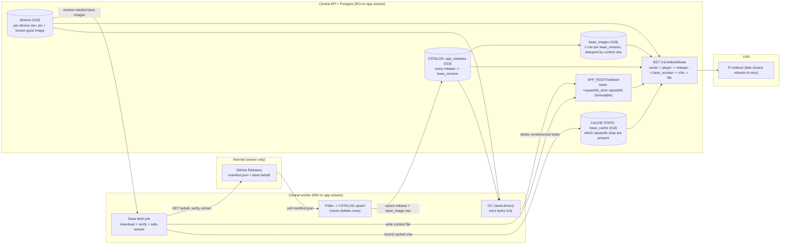
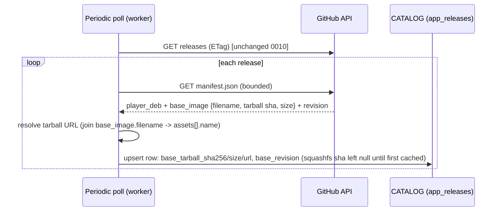
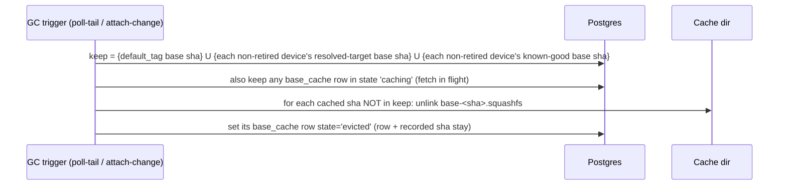
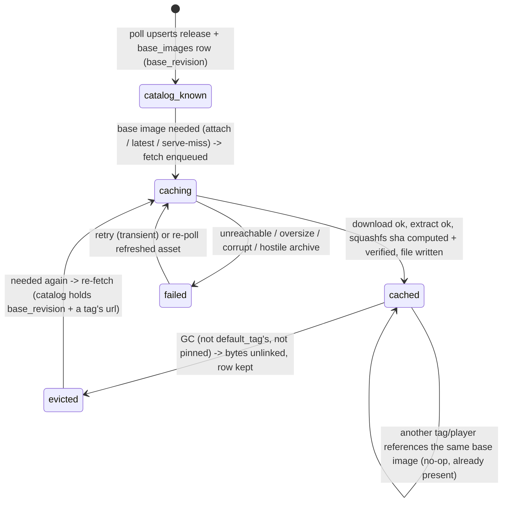

# 0012 — Auto-mirroring netboot base images: a catalog, a need-driven cache, per-player serving

**Date:** 2026-09-20
**Status:** **PROPOSED — owner gate (r3; owner ruled the two policy forks).** This
directory (`docs/decisions/`) holds accepted architecture decisions; this file is
the single gate artifact for the feature and supersedes any brief, frame, or
review note produced while drafting it.

**The model, settled across r0–r3:**
- **r2 reframe:** there is **no single current base**. Central serves **multiple
  base images concurrently** — the fleet is heterogeneous. The r0/r1 singleton +
  symlink-flip is gone.
- **Base OS and Player `.deb` are INDEPENDENTLY VERSIONED.** The base image has its
  own identity (`base_revision`, a build git sha), neither the tag nor the `.deb`
  version; many release tags reference one base image. It is a first-class catalog
  artifact, deduped by the extracted-squashfs content sha.
- **r3 owner decisions (now DECIDED, not open):**
  1. **Rollout = deliberate promotion + last-known-good fallback.** A discovered
     release is cataloged and may be cached, but it becomes the fleet default only
     when an operator **promotes** it, and the default only ever names a release
     whose bytes are already cached+verified.
  2. **Attachment scope = the WHOLE RELEASE.** A device is attached to a *release
     tag*; that tag drives **both** its base image and its Player `.deb`. They move
     together. So `.deb` selection becomes per-player too — the global `.deb`
     pointer becomes the unpinned default and pins override it.
- **r4 owner requirement — a canonical per-device registry.** The DB holds one row
  per device *ever seen*, auto-created on first contact — which is the **netboot
  request**, before the device is ever enrolled. That row is the canonical record
  of what base image + release was **served** to the device and when, and the home
  for per-device data (including the pin) going forward. This is a **new `devices`
  table** distinct from `players` (which exists only after cryptographic
  enrollment); the pin (`attached_tag`) lives here, not on `players`.
- **r4 scope corrections:** per-player `.deb` requires the appliance to send its
  serial on the manifest fetch (it does not today), so **`appliance/` is in scope**;
  and `reconcile_default` must be the **sole** writer of the unpinned `.deb`
  pointer, replacing two legacy write sites.
- **r5 owner decisions:**
  - **D8 — device recovery is MANUAL re-pin.** A device that boots its resolved
    target but never goes healthy stays there until an operator re-pins
    `attached_tag = known_good_tag` (instant, because GC keeps known-good bytes).
    Automated rollback-on-unhealthy is explicitly **deferred**.
  - **D9 — the fleet default is CANARY HEALTH-GATED.** `default_tag` advances to a
    promoted release **only after** its bytes are cached/mirrored **and** at least
    one pinned **canary** device has gone field-healthy on it. A serveable-but-
    unhealthy release can therefore never reach the unpinned fleet.
- **r5 review fixes:** the health-seam known-good write **validates** the
  player-reported tag (P2, now load-bearing for D9's canary gate — a `contracts/`
  change adds the reported tag to `Readiness`); the GC retirement filter is applied
  **uniformly** to the known-good term (P4); and a **genuine fresh-install e2e**
  lands with the feature (the current netboot e2e pre-stages the base and so never
  exercises discover→download→cache).

**What you are being asked:** approve the shape and confirm the DECIDED gate rows.
Today a photo-wall Pi cannot netboot at all: `GET /v1/netboot/base` returns **503**
because nothing populates the directory it serves and its env var is unset in the
cluster. This design makes Central's worker **discover** every release into a
catalog, **cache** each base squashfs on demand as a content-addressed file, and
**serve** each player the whole-release artifacts (base + `.deb`) of the release it
is attached to — defaulting to the promoted release — with zero manual staging,
reusing the app storage volume.

### Prior owner decisions this builds on

| Decision | Where | What it settles for us |
|---|---|---|
| Home LAN, no threat model; sha256 is corruption-only, no signing | `docs/decisions/0009-*`, `docs/decisions/0010-*` | We never verify authorship of a release asset; sha256 guards transit corruption and content-addressing only |
| Base OS and Player `.deb` are **two assets of one release** | `docs/decisions/0009-*`, `scripts/package_release_artifacts.py:167-177` | The release a player runs determines both its `.deb` and its base image; base selection can piggyback on the release the player is attached to |
| Central holds the bytes it serves; the worker touches the internet; discovery automatic, promotion deliberate | `docs/decisions/0010-*` | The base is a second producer into the same worker/serve split |
| GitHub-sourcing config is opt-in on `PHOTO_WALL_APP_ROOT`; the worker mirrors the `.deb` there and Central serves it | `central/app_release_service.py:107`, `central/app.py` `app_package` route | The base reuses the **already-proven** dual-mount volume (worker RW, Central RO) |

### Verified facts about today's code (each checked for this reframe)

| Fact | Where | Consequence |
|---|---|---|
| **A `players` row exists only after cryptographic enrollment.** It requires NOT NULL `public_key`/`token_hash`; enroll INSERTs it keyed `player_id = "p-"+sha256(device_id)[:32]` | `central/migrations/001_registry.sql`, `central/registry.py:113-134` | A bare Pi at netboot has no key/token, so it **cannot** be a `players` row. "Device" is a **new pre-enrollment `devices` table** keyed by `device_id`; enrollment later joins it via the shared `players.device_id` (r4) |
| **No player→release attachment exists.** `players` has `id, public_key, token_hash, authority_epoch, device_id, ...` — no release/version/sha column | `central/migrations/001_registry.sql`, `010_stateless_enrollment.sql` | The attachment is **new**; the pin lives on the new `devices` row (r4) |
| `GET /v1/app/manifest` takes **no** input and returns the global `current()`; the bootstrapper's manifest fetch sends **no serial** (`chunks` supports `headers=` but the manifest caller passes none) | `central/app.py:415-419`, `appliance/provision.py:138-215` `fetch_manifest`/`AppFetcher.chunks` | Per-player `.deb` needs the serial on the manifest fetch — a real **`appliance/` change** (Delta 2). The running OS already reads the serial (`appliance/bootstrap.py:read_pi_serial`) |
| The authenticated **`POST /v1/player/readiness`** (and its websocket twin) is the "player is rendering" signal — it reports secured/prepared assignments, `capacity_ok`, and `failures` | `central/app.py:523-527,576-580`, `contracts/models.py:229` `Readiness` | This is the **health seam** where a device's known-good image is recorded (r4) and where the **canary** signal for D9 comes from — never the unauthenticated netboot path |
| `Readiness` carries **no running-version/tag field**, and the route passes none | `contracts/models.py:229-238`, `central/app.py:523-527` | Recording/validating the running tag needs a **`contracts/` change** to add it — load-bearing for both the known-good record and D9's canary gate (P2) |
| The netboot e2e is **false-green**: `_stage_base` pre-writes `photo-wall-base.squashfs`+`SHA256SUMS` and passes `base_root=` to `create_app`, so discover→download→cache is never run; the family shares this and conftest never sets `PHOTO_WALL_BASE_ROOT` | `tests/test_netboot_e2e_wire.py:114-120,181`, `tests/test_netboot_base_http.py` `_stage_base` | The tests manufacture exactly the precondition the live cluster lacks — a genuine fresh-install e2e is a required bead |
| `current_sha256` is written by `AppPackages.promote`, called by `AppReleases.reconcile` (on `.deb` mirrored, **no base check**) and by `boot_autopull` at worker boot | `central/app_packages.py:89-95`, `central/app_releases.py:201-231`, `central/app_release_boot.py:115-118` | These legacy writers must be **subsumed** by `reconcile_default` or the unpinned `.deb` can advance on `.deb`-alone while the base lags (Delta 1) |
| `bindings` is player→**frame** adoption (`frame_id → player_id, output_id`); "a bindings row is the sole 'bound' signal" | `central/migrations/001_registry.sql:36`, `central/installation_repository.py:26-38` | Frame binding is orthogonal to release attachment; GC's "attached to a player" must **not** mean frame-bound |
| The `.deb` is served via a **single global** `current` pointer, advanced only to a mirrored (cached) sha | `central/migrations/014_app_package.sql:11-13` `app_package_policy.current_sha256`, `central/app_releases.py:201-231` | Whole-release (r3) makes `.deb` selection **per-player**: this global pointer becomes the *unpinned default* (`current_sha256` = the default tag's `.deb`), and pins override. Bringing this in-scope was deferred to 0010; it is now IN scope (bead 4) |
| The promoted tag is a global singleton the operator sets deliberately; `boot_autopull` sets it on a fresh fleet, **excluding prereleases** | `central/migrations/016_release_tracking.sql` `app_release_policy.promoted_tag`, `central/app_release_boot.py:59-70,107` | The **default release** is the promoted tag — never "latest discovered". Prereleases are excluded from any default derivation (match `select_latest_deployable`) |
| `reconcile`/`set_promoted` already gate the `.deb` default on the target being **mirrored** (bytes present) under `FOR UPDATE`, with a two-pointer intent-vs-servable split | `central/app_releases.py:179-231` | The whole-release promotion-gate reuses this `FOR UPDATE`: the default advances only when the promoted tag's `.deb` **and** base are cached+verified **and** a canary is healthy on it (D9) — last-known-good otherwise |
| Serial → `device-<64hex>` via one shared derivation; `players.device_id` is unique | `contracts/equipment.py:21` `equipment_device_id`, `010_stateless_enrollment.sql` | The serve seam maps `X-PhotoWall-Serial` → `device_id` → the player row |
| The Pi initrd **fails closed and reboots** on any base-fetch fault (503, missing/mismatched `Digest`) | `appliance/netboot_init.py:215,377`, `fetch_verified` | A cache-miss can safely return 503; the Pi retries on its next boot cycle. Retry granularity is a whole reboot (~seconds), so proactive caching is strongly preferred |
| The manifest declares `base_image = {filename, sha256, size}` where `sha256` is the **tarball** digest, and a top-level `revision` | `scripts/package_release_artifacts.py:166-177` | The inner **squashfs** digest (the content-address and served `Digest`) is **not** in the manifest — it is inside the tarball's `SHA256SUMS`, learned only after download+extract |
| The manifest's `revision` is a **40-char git sha** (validated), embedded in the tarball name `photo-wall-base-<revision>.tar.gz`; there is **no base semver** and no version field inside `base_image` | `scripts/package_release_artifacts.py:124-128,156,169-174` | `base_revision` is the base OS's own version identity — independent of the tag and the `.deb`, and **not orderable** (a git sha). It never needs ordering: the default is the *promoted* tag's base (r3), not a "latest base" computation |
| The base tarball is a per-release asset (each tag attaches its own copy) but the base bytes are reused when the OS did not change | `package_release_artifacts.py:156-166` (name keyed only on `revision`) | Many tags → one `base_revision` → one squashfs content sha → **one** cache entry; the download URL is per-tag, the content is shared |
| The `.deb` download primitive streams bounded, hashes, verifies against a manifest sha256, fails closed with no partial file, follows the CDN redirect | `central/github_releases.py:314` `download` | The base tarball download reuses this verbatim; only tar extraction is new surface |
| `open_regular` applies `O_NOFOLLOW` to the final component and requires a regular file | `central/artifact_io.py:39-51` | A content-addressed `base-<sha>.squashfs` is served through it unchanged; **no symlink, no SHA256SUMS re-read, no torn-pair** |
| `select_base_for_serial` returns one base for every serial; its TODO says "when a per-serial binding model exists, look the serial up here" | `central/netboot_base.py:57-72` | This feature **is** that per-serial model; the seam becomes a per-player lookup |
| Migrations are additive, sorted, checksum-pinned, no down-machinery; highest is `017` | `central/db.py`, `central/migrations/` | New migration is `018_*.sql`, additive only |

---

## The problem in plain words

- **Different Pis run different releases at the same time.** Central must serve
  several base images concurrently — the one each Pi's release needs — not a
  single "current" image.
- **Remember everything; download only what is needed.** Central should record
  *every* release it sees on GitHub (cheap metadata, kept forever), but only pull
  down the heavy squashfs bytes for releases something actually needs.
- **A Pi asks for its base by identity.** It sends its serial; Central looks up
  which release that Pi runs and serves that release's base image.
- **Clean up bytes that nothing needs.** A cached base image is deleted once it
  is neither the default (kept so new Pis are fast) nor in use by any Pi. The
  catalog record stays; only the bytes go.
- **Nothing is signed** (home LAN, 0009/0010): a sha256 is a corruption and
  content-addressing check, never proof of authorship.

---

## The answer in one picture



**The three rules that make this hold:**

1. **Catalog and cache are two separate concerns, and the base image is
   first-class.** The catalog records every discovered release forever, and every
   distinct **base image** (keyed by its own `base_revision`, deduped by content
   sha) forever — many tags collapse to one base image, no duplication. The cache
   holds only the squashfs bytes something needs, as **content-addressed immutable
   files** (`base-<squashfs_sha>.squashfs`). No "current" pointer, no symlink.
2. **Every device has a canonical row; it is served the WHOLE-RELEASE artifacts of
   one resolved target.** The netboot request auto-creates the device's `devices`
   row (serial → `device_id`). The serve routes map serial → device → **resolved
   target** = `COALESCE(devices.attached_tag, default_tag)`; from that one tag come
   **both** the base image (`tag → base_revision → content sha → file`) **and** the
   `.deb` (`tag → mirrored .deb sha`). Base and `.deb` never diverge. Each `Digest`
   is its content sha, so bytes and digest agree by construction. The image a device
   is *running* is recorded as **known-good** only on an authenticated healthy
   check-in — never at serve time, so a bad image is never locked into the record.
3. **The unpinned default is CANARY-gated; known-good enables manual rollback.**
   `default_tag` advances to the operator's `promoted_tag` **only when** that tag's
   base **and** `.deb` are cached+verified (byte gate) **and** at least one pinned
   canary device has gone known-good on it (health gate, D9). So a release that is
   serveable but does not actually run healthy can never reach the unpinned fleet.
   A cached file is kept iff it is `default_tag`'s base sha, **or** any non-retired
   device's resolved-target base sha, **or** any **non-retired** device's known-good
   base sha (so a mid-rollout device can be manually rolled back, D8), **or** a
   fetch in flight; otherwise its bytes are evicted (rows stay). Eviction is safe:
   files are immutable and an open fd survives an unlink.

---

## Glossary

- **Catalog** — one row per discovered release (`app_releases`, extended): tag,
  prerelease flag, base tarball asset facts, and — once learned — the squashfs
  sha. Never garbage-collected.
- **Cache** — the squashfs bytes on disk, named by content
  (`base-<squashfs_sha>.squashfs`), plus a `base_cache` row per content sha
  recording `caching`/`cached`/`evicted`/`failed`. The `base_cache` row is the
  **content-addressed parent** (its row is never deleted — GC sets `evicted`); the
  bytes are need-driven.
- **Base image** — an independently-versioned OS artifact, identity
  `base_revision` (a build git sha), deduped by its extracted-squashfs content
  sha. A first-class catalog row; **many release tags reference one base image**.
- **base_revision** — the base image's own version (manifest top-level
  `revision`); NOT the tag, NOT the `.deb` version, and not orderable (a git sha).
- **Content address** — the sha256 of the extracted squashfs bytes; the file
  name, the base image's `squashfs_sha256`, and the served `Digest`. The stable
  dedup key across tags that share a base.
- **Tarball sha** — `manifest.base_image.sha256`; verifies the *download*.
  Distinct from the content address (the inner squashfs sha).
- **Device** — a Pi as a physical unit, identity `device_id` (`device-<64hex>`,
  derived from the serial). Its `devices` row is auto-created on first netboot
  contact, before any enrollment; it is the canonical home for the pin and the
  known-good image. `players` (post-enrollment) joins it by `device_id`.
- **Resolved target** — the tag a device is served **next**:
  `COALESCE(devices.attached_tag, default_tag)`. Drives both artifacts served now.
- **Known-good image** — the tag + base sha a device last ran **while confirmed
  healthy** (`devices.known_good_*`). Distinct from the resolved target; it is what
  the device is actually running and what a manual re-pin rolls back to (D8).
- **Canary** — a device an operator pins to a candidate release (`attached_tag =
  promoted_tag`). The first canary to reach known-good on that tag satisfies the
  health gate that lets the fleet default advance (D9).
- **Served-image ledger** — the append-on-change history of a device's known-good
  images (`device_served_images`); the "record of served images" (plural).
- **Resolved tag** — shorthand for a device's resolved target
  (`COALESCE(devices.attached_tag, default_tag)`); co-selects base + `.deb`.
- **Promoted tag** — the operator's chosen fleet release (`app_release_policy.promoted_tag`);
  intent, may briefly precede its bytes being cached.
- **default_tag** — the unpinned fleet default; the last-known-good. Advances to
  `promoted_tag` only when that tag's base **and** `.deb` are cached+verified **and**
  a pinned canary is known-good on it (D9), so it always names a
  fully-servable-and-proven release. Prereleases are excluded.
- **Base fetch** — the background job: download the tarball, verify, safe-extract,
  compute the content address, write the content file, record the cache row.
- **GC** — need-driven eviction of cache bytes not referenced by `default_tag` or
  any non-retired device's resolved-target or known-good, and not in flight.

---

## How selection and safety work

**Two seams, split on purpose (r4):** the **netboot** seam (unauthenticated)
creates the device row and resolves+serves, but records **no image**; the
**health** seam (authenticated) records the known-good image. This split is why a
device served a bad image is never permanently associated with it.

**Per-player resolution — one tag, both artifacts** (base serve seam
`select_base_for_serial`, and the `.deb` manifest route, share it):

1. `X-PhotoWall-Serial` → `sanitize_serial` → `equipment_device_id` → `device_id`.
   (Invalid/absent serial → no device row; serve `default_tag` best-effort.)
2. **UPSERT the `devices` row** (`device_id`, `serial`, `first_seen`/`last_seen`) —
   one idempotent write, no image fields. Read `attached_tag`.
3. **Resolved target** = `COALESCE(attached_tag, default_tag)`. From it: **base** =
   tag → `base_revision` → `base_images.squashfs_sha256`; **`.deb`** = tag →
   `mirrored_sha256` (unpinned uses `app_package_policy.current_sha256` =
   `default_tag`'s `.deb`).
4. If the base image's sha is null or its `base_cache` row is not `cached`: **ensure
   a fetch is enqueued and return 503** — never block on a download; the Pi reboots
   and retries. `.deb` serve is analogous — unpinned resolves to `default_tag`
   (cached by construction); only a *pinned* device can hit an uncached artifact.
5. If cached: open `base_root/base-<sha>.squashfs` (`O_NOFOLLOW`, regular file,
   size-bounded), stream it, `Digest = sha`.

| Who is asking | Result | Why |
|---|---|---|
| Unknown serial (new Pi) | Device row created; `default_tag`'s base + `.deb`, both cached | `default_tag` is only ever a fully-cached release |
| Enrolled, unpinned device | `default_tag`'s artifacts | `attached_tag` NULL ⇒ `default_tag` |
| Pinned device (canary) | Its `attached_tag`'s base + `.deb` | Whole-release pin overrides; the pin's artifacts are fetched proactively |
| Pinned device, that release not yet cached | 503; a fetch is (idempotently) enqueued | Only the pinned canary waits — never the fleet default |
| Malformed / oversize serial | `sanitize_serial` rejects → no row → `default_tag` best-effort | Unauthenticated input bounded at the seam |
| **Authenticated player reports a healthy readiness** | Its device's **known-good** image is set to the tag it runs; ledger appended on change | Only a confirmed-healthy check-in records the running image (never serve time) |
| Poll finds a release with a valid `base_image` | Catalog + `base_images` upserted; no bytes moved; **not** promoted | Discovery never changes what the fleet runs |
| GC runs, a sha is not default / resolved-target / known-good / caching | Its bytes are evicted; the `base_cache` row (`evicted`) and catalog stay | Cache is need-driven; the catalog is the memory |

**The per-device registry — two seams, and why the split matters (r4).**

```mermaid
sequenceDiagram
  participant Pi as Pi (netboot, unauth)
  participant N as /v1/netboot/base
  participant DB as devices
  participant App as Player app (enrolled, authed)
  participant H as /v1/player/readiness
  Pi->>N: GET base (X-PhotoWall-Serial)
  N->>DB: UPSERT device row (first_seen/last_seen) — NO image recorded
  N-->>Pi: 200 base of resolved target (or 503 + fetch)
  Note over App: enrolls, installs .deb, renders
  App->>H: readiness {secured, prepared, capacity_ok, no failures} + running tag
  H->>DB: device known_good = (tag, base sha); append device_served_images on change
```

- **Why not record at serve time:** a device served an unbootable/unhealthy image
  would be permanently associated with it, and GC/selection would perpetuate the
  bad version. Recording only on a confirmed-healthy check-in means the canonical
  image is the last **known-good** image the device actually ran.
- **Resolved target vs known-good:** selection serves the resolved target (pin or
  default) *next*; known-good is what the device is *running now*. During a
  roll-forward the two differ until the player goes healthy on the new target; GC
  keeps both, so a device that never goes healthy can roll back to known-good.

**Security — unauthenticated device-row creation.** `/v1/netboot/base` is unauth
(trusted-LAN, 0009). The netboot write is a **single idempotent UPSERT** keyed by a
`device_id` hash of a `_SAFE_SERIAL`-bounded serial — no unbounded per-request
work, no image logic, no history append. The only thing an on-LAN serial-sprayer
can do is create **empty** rows (device_id + timestamps); it can **not** write any
image record, because known-good and the ledger are written **only** from the
authenticated health seam (a valid player token). Unbounded empty-row growth from a
sprayer is **accepted** under the 0009 home-LAN ruling — the same trust basis as
the unauthenticated serve itself — with an optional operator-visible row cap as
deferred hardening. An invalid/absent serial creates **no** row.

**What a compromised GitHub feed gets:** on this LAN, no signing, a bad actor
controlling the feed can make Central cache and serve arbitrary base bytes —
accepted, out of scope (0009/0010). Content-addressing only guarantees the served
bytes match their advertised `Digest` and were not corrupted in transit.

**Two invariants, kept separate:**

1. **Safety — the served `Digest` always matches the served bytes.** The file is
   named by the sha of its own bytes, and the `Digest` is that same sha from the
   catalog. There is no second file and no in-place mutation, so a torn (Digest,
   bytes) pair is **unrepresentable**. Guarantee: **construction**. (This is what
   dissolves r1's reproduced torn-pair bug.)
2. **Liveness — an attached release's bytes eventually cache.** A miss enqueues a
   fetch; the Pi retries on reboot; the bytes land and subsequent boots hit.
   Weaker, eventual; delivered by the fetch job + the Pi's reboot-retry.
3. **The unpinned default cannot be bricked by a bad *or unhealthy* release (D9).**
   `default_tag` advances to `promoted_tag` only when that tag's base **and** `.deb`
   are cached+verified (byte gate) **and** a pinned canary has gone known-good on it
   (health gate), so it never names a release whose bytes could 503/mismatch or that
   simply fails to run. A corrupt release fails the byte gate; a serveable-but-broken
   release fails the health gate. Guarantee: **decision** at the promotion-gate (two
   runtime checks), backed by the `FOR UPDATE` serialization the `.deb` reconcile
   already uses, and by the P2 canary-tag validation.

---

## Walkthroughs

### Discover releases into the catalog (metadata only, never GC'd)



The poll is the existing 0010 periodic task; this adds reading
`manifest.base_image` and `revision`. The catalog carries the **tarball** sha at
discovery; the **squashfs** content-address is filled in the first time the
release is cached.

### Attach, fetch, and serve a base

```mermaid
sequenceDiagram
  participant Op as Operator / default policy
  participant DB as Postgres
  participant W as Base fetch job (worker)
  participant GH as GitHub
  participant Pi as Pi netboot
  participant C as Central serve
  Op->>DB: pin player P to tag T (or promote T as the fleet default)
  DB->>W: enqueue fetch(base_revision of T) if that base image not cached (proactive)
  W->>GH: GET base tarball via any referencing tag's url (bounded, streamed)
  GH-->>W: tarball bytes
  W->>W: verify sha256 == base_image.sha256 (download corruption check)
  W->>W: safe-extract ONLY the two prefixed members (allowlist, isfile, size-bounded)
  W->>W: compute squashfs sha; verify == its SHA256SUMS line (private parser)
  W->>W: write base-<sha>.squashfs via O_EXCL temp -> rename (content-idempotent)
  W->>DB: set base_images.squashfs_sha256; upsert base_cache(sha, state=cached)
  Pi->>C: GET /v1/netboot/base (serial header)
  C->>DB: serial -> device_id -> device -> COALESCE(attached_tag, default_tag) -> base_revision -> base image sha + cache state
  alt cached
    C-->>Pi: 200 base-<sha>.squashfs, Digest: sha-256=<sha>
  else miss
    C->>DB: ensure fetch(base_revision) enqueued (coalesced)
    C-->>Pi: 503 (Pi reboots, retries)
  end
```

1. **Proactive caching (recommended):** an attachment change (a pin, or a new
   promoted tag) enqueues `fetch(base_revision)` so bytes are ready before the
   Pi boots.
2. **Lazy backstop:** a serve miss also enqueues `fetch(base_revision)`, coalesced
   by the base-image lock, so the path self-heals even if the proactive trigger was
   missed.
3. The fetch **stages only content**, keyed on the **base image** not the tag:
   download → verify tarball → allowlist-extract → compute + verify squashfs sha →
   `O_EXCL` temp → rename to `base-<sha>.squashfs`. Many tags share one
   `base_revision`, one download, one file, one `base_cache` row.
4. Serving is a per-request DB lookup (indexed by unique `device_id`) plus one
   file open; the `Digest` is the catalog sha. No `SHA256SUMS`, no symlink.

### Canary-gated promotion of the fleet default (D9)

```mermaid
sequenceDiagram
  participant Op as Operator
  participant DB as Postgres
  participant Cy as Canary device (pinned to T)
  participant C as Central
  Op->>DB: set promoted_tag = T
  Op->>DB: pin a canary: devices.attached_tag = T (an ordinary pin)
  Note over C,DB: byte gate — T's base cached + .deb mirrored (fetch/mirror as needed)
  Cy->>C: netboot + enroll on T (resolves its pin, not default_tag)
  Cy->>C: POST /v1/player/readiness (healthy) reporting tag T
  C->>DB: validate T (== resolved target); set canary.known_good_tag = T
  C->>DB: reconcile_default: byte gate AND EXISTS canary(attached_tag=T, known_good_tag=T)?
  alt both gates pass
    C->>DB: advance default_tag = T, current_sha256 = T's .deb (FOR UPDATE)
  else no healthy canary yet
    C-->>Op: default_tag held at last-known-good (T not yet trusted)
  end
```

1. Promotion is now two operator acts: `promoted_tag = T` **and** pin at least one
   canary to `T`. The candidate's bytes cache (byte gate); the canary boots `T`
   (via its pin, independent of `default_tag`) and must reach known-good on `T`.
2. `reconcile_default` advances the unpinned default only when the byte gate holds
   **and** a canary is known-good on `T`; otherwise the fleet stays on the
   last-known-good default. A serveable-but-unhealthy `T` never reaches the fleet.
3. **Fresh-fleet bootstrap:** with `default_tag` NULL, unpinned devices have no
   target (503) until the first canary proves a release — so the very first
   bring-up requires pinning a canary. No deadlock: the canary resolves its *pin*,
   not `default_tag`, so it can boot `T` before any default exists.

### Garbage-collect unneeded bytes



---

## The hard part — catalog vs cache, two shas, and GC against live reads

The load-bearing structure is the **separation of an immortal catalog from a
disposable, content-addressed cache**, plus a per-player serve seam. The subtle
failures live at their seams.



**Whole-release selection + deliberate promotion (owner r3).** A player resolves
to one tag (`COALESCE(attached_tag, default_tag)`) and that tag drives both
artifacts. `default_tag` is never the newest discovered release — it is the
operator's `promoted_tag`, and only after that tag's base **and** `.deb` are
cached+verified. So "bad discovered release bricks the default fleet" is not a
patched instance but an excluded class: discovery cannot move `default_tag`, and
the promotion-gate cannot advance it to an uncached release.

**Independent versioning.** The base OS version is `base_revision` (a git sha),
independent of the tag and the `.deb`. The catalog models it as the first-class
`base_images` row; every release tag links to it via `app_releases.base_revision`,
so **N tags → 1 base image** with no duplication, and the content sha dedups the
cache. Selection and GC key off the resolved tag's base image, never off the tag
string or `.deb` version. `base_revision` never needs ordering: the default is the
promoted tag's base, not a computed "latest base".

**The two-sha problem (owner point #4).** The manifest gives only the *tarball*
sha at discovery; the *squashfs* sha (the content-address and `Digest`) is inside
the tarball. So:
- `base_images.squashfs_sha256` is **null until the base image is first cached**;
  the fetch computes the squashfs sha (and cross-checks it against the bundle's
  `SHA256SUMS` via the private parser) and writes it back permanently. A later
  eviction removes bytes but keeps the recorded sha, so a re-fetch knows the
  content name and the expected digest.
- **Consequence, stated plainly:** a base image that has *never* been cached
  serves 503 on its first request until the background fetch completes (a reboot
  cycle or two for a large squashfs). The promoted (default) base never hits this
  in normal operation — promotion caches it before advancing `default_tag`. Gate #4
  offers a manifest enhancement
  (declare the squashfs sha) that removes even the first-request 503; the baseline
  works with today's manifest.

**Extraction security (carried forward from r1, unchanged in spirit):**
- Verify the tarball sha256 **before** opening it as a tar.
- **Allowlist**, never `extractall`: read only `photo-wall-base/photo-wall-base.squashfs`
  and `photo-wall-base/SHA256SUMS` (the `arcname="photo-wall-base"` prefix,
  `package_release_artifacts.py:159`); each must be a regular file (rejects
  symlink/hardlink/device/fifo), name free of `..`, not absolute, each bounded by
  a running-total cap (squashfs `MAX_NETBOOT_BASE_BYTES` = 1 GiB, `SHA256SUMS` 4
  MiB). Path-traversal, hostile member types, and decompression bombs are
  **construction**-level impossible; only two known files are ever read.
- **Duplicate member names (F/D):** the allowlist walks members once and takes the
  **first** occurrence of each of the two exact names, ignoring any later duplicate;
  a well-formed bundle has exactly one of each, and a crafted archive with two
  `photo-wall-base.squashfs` entries cannot smuggle the second past the first.
- **Private `SHA256SUMS` parser (F6).** The parser that reads the squashfs line
  (matching `find .`'s `./photo-wall-base.squashfs`, `.lstrip("./")`) is a
  **private** `_read_squashfs_digest` in the fetch module, not a shared
  `netboot_base.py` seam: with content-addressing the serve side reads the `Digest`
  from the DB (`base_cache.squashfs_sha256`), so this parser has exactly one
  consumer. One consumer cannot disagree with itself.

**Promotion-gate — a bad OR unhealthy release cannot become the default (D9).**
Discovery never touches `promoted_tag`/`default_tag`. `reconcile_default` advances
`default_tag` to `promoted_tag` **only** when (a) the tag's base is `cached` and
`.deb` mirrored (byte gate) **and** (b) a pinned canary is known-good on it (health
gate), under the `FOR UPDATE` the `.deb` reconcile already holds. A
corrupt/oversize/hostile release fails its fetch and never passes the byte gate; a
release that caches fine but **never runs healthy** never passes the health gate.
Either way the previous last-known-good `default_tag` keeps serving. Guarantee:
**decision** (two runtime predicates) + **transaction** (the row lock serializes
the advance) — not construction, but the bad-*and*-unhealthy-default *class* is
excluded because the only path that sets `default_tag` checks bytes **and** a live
canary's health first. The health gate depends on the P2 tag validation (a
compromised player cannot spoof a canary because its reported tag is accepted only
when it matches what Central resolved for that device).

**GC vs in-flight fetch/serve (F5 — honest strength).** GC evicts by content sha.
Under READ COMMITTED (`central/db.py:46-52`) the keep-set `SELECT` is **not** atomic
with the `unlink`s, so the guarantee is **decision + eventual**, not
transaction/"cannot happen":
1. GC reads the keep-set (`default_tag`'s base sha ∪ each non-retired device's
   resolved-target base sha ∪ each **non-retired** device's known-good base sha ∪
   `caching` rows) and unlinks only shas outside it, setting
   `base_cache.state='evicted'`. The known-good term (non-retired only) guarantees a
   mid-rollout device's rollback bytes are never evicted; a **retired** device's
   known-good is dropped, so a decommissioned device cannot pin a base image forever.
2. An **open fd survives `unlink`** (POSIX): a serve already streaming
   `base-<sha>.squashfs` completes even if GC unlinks mid-stream.
3. **Residual, stated plainly:** a sha evicted and *then* attached/promoted between
   the keep-set read and the unlink is re-fetched on the next need; the interim
   serves 503 and the Pi retries. This costs a re-download and a few reboot-retries
   — **never** a wrong or torn serve, because the file is content-addressed and
   immutable, and a just-evicted needed sha simply re-caches.

**Concurrency model (no `replicas=1` dependency).** All workers share one Postgres
and one PVC. **Coalescing, stated honestly:** the queue's `queueing_lock`
(`base:base_revision`) coalesces *queued* jobs, but once a fetch **starts** the lock
frees, so a second miss mid-download can enqueue a duplicate fetch. This is
**at-most-one-*served*, possibly-duplicate-*download***, not "coalesced to one
download": both writers stream to a private `O_EXCL` temp and atomically rename onto
the one content name (the second rename is a harmless no-op / loser cleans up its
temp), and the `base_cache` upsert is idempotent (`ON CONFLICT`). Correctness rests
on shared-Postgres coordination and content-immutability, not on a single replica.

**Boot-tree residual (carried forward).** The kernel/initrd/dtb ship in the same
tarball but are operator-staged in TFTP (0009 gate #4); Central has no view of
them. A base advancing without a matching boot tree can brick a Pi with **no
server-side signal**. The catalog records `base_revision` and the operator matches
the TFTP boot tree to it. **The guarantee is "a verified, internally consistent
squashfs for release R," not "the Pi will netboot."** See gate #6.

**Cost:** two concerns (catalog + cache), a per-request DB lookup on the serve
path, and a background fetch/GC lifecycle are more machinery than a single served
file. We accept it because the fleet is genuinely heterogeneous — a single current
base cannot express staged rollout, pins, or canary — and content-addressing buys
back the torn-pair and stale-hijack classes for free.

---

## Design-it-twice — content-addressed cache vs. the rejected singleton

| | **Catalog + content-addressed cache (chosen)** | **Singleton "current base", symlink-flipped (rejected — r0/r1 model)** |
|---|---|---|
| Fleet model | Heterogeneous: each player runs its release's base | One base for the whole fleet |
| Serve | serial → release → sha → one immutable file | one fixed path behind a flipped symlink |
| Torn (Digest,bytes) | Impossible by construction (one content file) | A real bug (r1 reproduced it across two resolutions) |
| Stale hijack | Impossible (no shared pointer to hijack) | Needed a promoted-tag-checked reconcile under a lock |
| Storage | Several concurrent images; GC by need | One image; GC by publish |
| Fit to owner intent | Matches "multiple active bases" | **Contradicts it** — the owner rejected it |

The singleton model was rejected by the owner because it cannot serve multiple
releases at once. Content-addressing additionally removes the atomic-swap, symlink,
and reconcile machinery r1 forced — the fork is recorded so the trail is honest.

**Second fork — attachment scope (gate #1, DECIDED by the owner: whole release).**
Whole-release (`attached_tag` drives base **and** `.deb`) vs. an independent
per-player base binding (`players.base_revision`, letting a player run one OS
version under another release's `.deb`). The owner ruled **whole release**: a
player is attached to one tag and both artifacts follow, so base and `.deb` can
never diverge for a player. The independent-base fork is rejected — it is a second
binding, and no code models it. Consequence: the global `.deb` pointer becomes the
unpinned default and per-player `.deb` selection comes in-scope (bead 4).

**Third fork — rollout (gate #2, DECIDED by the owner: canary-gated promotion, D9).**
Byte-gate-only promotion vs. **canary health-gated** promotion vs. auto-adopt the
latest discovered release. The owner ruled **canary-gated**: `default_tag` advances
to `promoted_tag` only when it is cached/mirrored **and** a pinned canary has gone
known-good on it — so neither an unverified nor a serveable-but-unhealthy release
can reach the unpinned fleet. Byte-gate-only (r3) was strengthened to this; auto-
adopt was rejected outright.

---

## Storage, lifecycle, migration

### Catalog — two tables, base image first-class (migration `018`), never GC'd

`app_releases` additive columns (per release tag — the download coordinates and
the link to the base image; base version facts are **not** duplicated per tag):

| Column | Type / constraint | Meaning |
|---|---|---|
| `base_revision` | `TEXT REFERENCES base_images(base_revision)` NULL | The release's base OS version identity (manifest `revision`); the N-tags→1-image link |
| `base_tarball_sha256` | `TEXT CHECK(~ '^[0-9a-f]{64}$')` NULL | Tarball digest from `manifest.base_image`; verifies *this tag's* download |
| `base_tarball_size` | `BIGINT CHECK(>0)` NULL | Expected tarball size |
| `base_tarball_url` | `TEXT` NULL | *This tag's* base tarball `browser_download_url` (filename join) — the fetch URL |

`base_cache` — **the content-addressed parent** (created first; its row is
**never deleted** — GC sets `evicted`). One row per squashfs content sha:

| Column | Type / constraint | Meaning |
|---|---|---|
| `squashfs_sha256` | `TEXT PRIMARY KEY CHECK(~ '^[0-9a-f]{64}$')` | Content-address; the file is `base-<sha>.squashfs` when `cached` |
| `size` | `BIGINT CHECK(>0)` NULL | Extracted squashfs size (set at first cache) |
| `state` | `TEXT NOT NULL CHECK(state IN ('caching','cached','evicted','failed'))` | Presence lifecycle; `evicted` keeps the row after GC unlinks the bytes |
| `error` | `TEXT` NULL | Last failure code (bounded, sanitized) |
| `updated_at` | `DOUBLE PRECISION NOT NULL` | Timestamp |

`base_images` — the first-class base OS artifact, one row per `base_revision`,
deduped across all tags that reference it (**F1: it references the cache parent**):

| Column | Type / constraint | Meaning |
|---|---|---|
| `base_revision` | `TEXT PRIMARY KEY` | The base OS version identity (git sha); not orderable, never needs to be |
| `squashfs_sha256` | `TEXT REFERENCES base_cache(squashfs_sha256)` NULL | Content-address + served `Digest`; **null until first cached**, then permanent. Many `base_images` rows may reference **one** `base_cache` row (two revisions, identical squashfs) — the FK direction that a `UNIQUE` on `base_images` would have wrongly forbidden |
| `first_discovered_at`, `updated_at` | `DOUBLE PRECISION NOT NULL` | Timestamps |

`squashfs_sha256` is learned once (first cache) and is stable across every tag
sharing the `base_revision`; a `base_revision` that ever yields a *different*
squashfs sha is a divergence signal (logged, not overwritten). **No `latest_tag`**
(r3: the default is the *promoted* tag, not a computed latest), which also removes
any `app_releases ↔ base_images` circular FK.

### Device registry — `devices` + `device_served_images` (migration `018`)

`devices` — the canonical per-device row, auto-created at the netboot seam, home
for the pin and the known-good image (frame `bindings`/`players` are unrelated and
join only by `device_id`):

| Column | Type / constraint | Meaning |
|---|---|---|
| `device_id` | `TEXT PRIMARY KEY` | `device-<64hex>` from the serial (`equipment_device_id`); same identity `players.device_id` uses |
| `serial` | `TEXT` NULL | The raw serial as seen (bounded by `_SAFE_SERIAL`, ≤128), for operator display |
| `attached_tag` | `TEXT REFERENCES app_releases(tag)` NULL | The **pin** (moved here from `players`); NULL ⇒ `default_tag` |
| `known_good_tag` | `TEXT REFERENCES app_releases(tag)` NULL | The tag the device last ran **while healthy** |
| `known_good_base_sha256` | `TEXT REFERENCES base_cache(squashfs_sha256)` NULL | That tag's base content sha (kept by GC for rollback) |
| `known_good_at` | `DOUBLE PRECISION` NULL | When it last went healthy on that image |
| `first_seen`, `last_seen` | `DOUBLE PRECISION NOT NULL` | Netboot-seam timestamps |
| `retired_at` | `DOUBLE PRECISION` NULL | Operator-retired devices drop out of the GC keep-set |

`device_served_images` — the append-on-change **known-good history** (the "served
images", plural): `(device_id, tag, base_sha256, went_healthy_at)`, one row each
time a device's known-good changes. Written only from the authenticated health
seam, never the netboot path.

### Default — `app_release_policy.default_tag` (migration `018`)

- `ALTER TABLE app_release_policy ADD COLUMN default_tag TEXT REFERENCES
  app_releases(tag)` (nullable) — the **last-known-good unpinned default**,
  advanced by the promotion-gate. `promoted_tag` (existing) stays operator *intent*.
- `app_package_policy.current_sha256` (014) becomes the `.deb` of `default_tag`,
  advanced **only** by `reconcile_default` (Delta 1) — the existing global `.deb`
  pointer *is* the unpinned default; pinned devices override via their tag's
  `mirrored_sha256`.

### Cache dir + config

Bytes live at `PHOTO_WALL_BASE_ROOT/base-<squashfs_sha256>.squashfs`, default
`<APP_ROOT>/netboot/`. A shared `resolve_base_root(env)` in
`central/netboot_base.py` (`PHOTO_WALL_BASE_ROOT`, else `<APP_ROOT>/netboot`, else
None) is called by both `create_app` (serve) and the worker (write) so they never
drift.

### Migration ordering and rollback

Create order (no cycle, no deferred FK needed): `base_cache` → `base_images`
(FK → `base_cache`) → `ALTER app_releases ADD base_revision` (FK → `base_images`)
→ `devices` (FKs → `app_releases`, `base_cache`) → `device_served_images` (FK →
`devices`) → `ALTER app_release_policy ADD default_tag` (FK → `app_releases`).
`players` is unchanged (the pin moved to `devices`). **Rollback:** drop
`default_tag`; `DROP TABLE device_served_images; DROP TABLE devices; DROP TABLE
base_images; DROP TABLE base_cache;` drop the `app_releases` base columns; delete
`018_*.sql`; remove `base-*.squashfs`.

### How it hooks the existing machinery

- **Discovery:** `GithubReleaseSource._resolve` also parses `manifest.base_image`
  + `revision`; `AppReleases.upsert_discovered` writes the per-tag columns AND
  upserts the `base_images` row for the `base_revision` (deduping across tags).
  Discovery **never** changes `promoted_tag`/`default_tag`.
- **Netboot serve seam:** `select_base_for_serial(conn, serial, default_tag)`
  **upserts the `devices` row** (row + timestamps only), resolves the target
  (`COALESCE(devices.attached_tag, default_tag)` → `base_revision` → base image
  sha), and returns `(sha, cache_state)`; `central/app.py` `netboot_base` opens
  `base-<sha>.squashfs` with `Digest = sha`, or 503+enqueue on a miss.
- **`.deb` manifest route (per-player, Delta 2):** the **appliance** sends
  `X-PhotoWall-Serial` on `GET /v1/app/manifest` (wire `read_pi_serial`
  → `fetch_manifest` → `AppFetcher.chunks(headers=...)`, which already supports
  headers). Server `app_manifest(serial)` runs the same serial → device → resolved
  target → that tag's `mirrored_sha256` lookup and returns `{version=tag, sha,
  size}`. The content-addressed `GET /v1/app/package/{sha}.deb` stays **sha-keyed**
  (no serial). An absent serial degrades to `default_tag` (backward compatible).
- **Health seam (authenticated — records known-good + feeds the canary gate):** on
  an accepted, healthy `POST /v1/player/readiness` (`capacity_ok`, prepared⊆secured,
  no `failures`) the player reports the release **tag** it is running (a new
  `Readiness` field, P2 — `contracts/` scope). Central joins `player_id →
  players.device_id → devices` and **validates** the reported tag: it is accepted
  **only if** it equals the device's current resolved target
  (`COALESCE(attached_tag, default_tag)`) **or** its prior `known_good_tag`;
  otherwise it is ignored (logged). On accept it sets
  `known_good_tag`/`known_good_base_sha256`/`known_good_at` and appends
  `device_served_images` **on change**. **Never** written from the netboot path.
  This validation is load-bearing: without it a token-valid but buggy/compromised
  player could poison known-good — resurrecting an evicted sha into the keep-set,
  corrupting a rollback target, or **spoofing the D9 canary gate**.
  *Residual, stated plainly:* a device still running its pre-re-pin image whose
  prior known-good differs will have that one report ignored; it re-reports the
  accepted tag after its next boot. Conservative, never unsafe.
- **Fetch:** a `fetch_base(base_revision)` worker task,
  `queueing_lock = "base:" + base_revision` (keyed on the base image, so N tags
  sharing a base coalesce), picks any referencing tag's `base_tarball_url`/`sha`,
  reuses `GithubReleaseSource.download`; allowlist-extract; compute+verify squashfs
  sha via a **private** `_read_squashfs_digest` (F6: the serve side now reads the
  `Digest` from the DB, so this parser has exactly one consumer — the fetch — and
  is **not** a shared `netboot_base.py` seam); `O_EXCL` temp → rename; write
  `base_images.squashfs_sha256` + `base_cache`.
- **Promotion-gate (`reconcile_default`) — CANARY-gated (D9) and the SOLE
  `current_sha256` writer (Delta 1):** under the existing `FOR UPDATE` on
  `app_release_policy`, advance `default_tag` **and**
  `app_package_policy.current_sha256` to `promoted_tag` **only when all** hold:
  (a) **byte gate** — the tag's base image is `cached` and its `.deb` is mirrored;
  and (b) **health gate** — `EXISTS` a device with `attached_tag = promoted_tag`
  **and** `known_good_tag = promoted_tag` (a pinned canary confirmed field-healthy
  on the candidate). Both read under the same `FOR UPDATE`. Otherwise hold the
  previous verified value. It **replaces** every legacy `current_sha256` writer —
  `AppReleases.reconcile` (advanced on `.deb`-alone) and `boot_autopull`'s call —
  so the unpinned `.deb` can never advance while its base lags or before a canary
  is healthy. Runs at promote, poll-tail, fetch-tail, mirror-tail, the **health
  seam** (a canary going known-good re-triggers it), and worker boot. Prereleases
  excluded.
  - **Canary designation:** ordinary — an operator pins a device to the candidate
    (`attached_tag = promoted_tag`); the first such device to reach known-good on it
    satisfies the gate. No separate "canary" flag.
  - **Guarantee (the point of D9):** a release that is serveable but never runs
    healthy has no canary reach known-good, so `default_tag` **never advances** to
    it — the unpinned fleet stays on the last-known-good default. Liveness cost:
    promotion now **requires a healthy canary**, so a candidate with no canary
    pinned will not auto-promote — the operator must pin one. This strengthens r3's
    "deliberate promotion + last-known-good" into **canary-gated promotion**.
  - **Timing cost:** on a fresh fleet `boot_autopull` now waits for the base fetch
    (and, under D9, a canary) before the unpinned default advances — base and `.deb`
    come up together, gated on real health rather than mere byte presence.
- **Proactive trigger:** on a pin change and on a promote, enqueue `fetch_base`
  (and the `.deb` mirror) for the target tag's artifacts. **Lazy backstop:** the
  serve-miss path enqueues the same job.
- **GC (r4 keep-set):** a `gc_base_cache()` step at poll-tail and after
  attachment/promote/health changes, keeping `{default_tag's base sha} ∪ {each
  non-retired device's resolved-target base sha} ∪ {each non-retired device's
  known-good base sha} ∪ {any 'caching' row}`. The **known-good** term is what lets
  a mid-rollout device roll back (its last-healthy bytes are never evicted). All
  device terms derive from the `devices` registry. F5: eviction is decision +
  eventual (see the failure table).

---

## Decisions that are yours

**Rows 1 and 2 are DECIDED by the owner (recorded, not open); 3–6 are the
recommendations remaining for confirmation.**

| # | Question | Decision / recommendation | Cost (accepted / of the recommendation) | Alternative (rejected / not chosen) |
|---|---|---|---|---|
| 1 | Attachment scope | **DECIDED — whole release.** `devices.attached_tag` (nullable) resolves one tag driving **both** base and `.deb`; NULL ⇒ `default_tag`. The global `.deb` pointer becomes the unpinned default; pins override (bead 4). **Stated cost:** whole-release now touches `appliance/` (serial on the manifest fetch) + the `.deb` serve path, not just base | New per-player `.deb` surface + an `appliance/` change; a device cannot mix base from tag X with `.deb` from tag Y | An independent per-player base binding (`devices.base_revision`) — a second binding, no code models it |
| 1c | Per-device registry + served-image record (r4 owner req) | **DECIDED — a `devices` table auto-created at the netboot seam (row+timestamps only); the running image recorded as known-good ONLY on an authenticated healthy readiness; a `device_served_images` history** | Unauth netboot creates empty rows (accepted, 0009 trusted-LAN); the image record needs the player to report its running tag on an authed check-in | Record at serve time — **rejected**: locks a bad/unbooted image into the canonical record and perpetuates it via GC/selection |
| 2 | Rollout | **DECIDED (r5, D9) — canary-gated promotion.** `default_tag` advances to `promoted_tag` only when its base+`.deb` are cached/mirrored **and** a pinned canary has gone known-good on it; prereleases excluded | Promotion needs an operator-pinned canary that actually boots healthy; a candidate with no healthy canary never becomes the default (incl. fresh-fleet first bring-up) | Byte-gate only (r3) — rejected as too weak: a serveable-but-unhealthy release would reach the fleet. Auto-adopt latest — rejected outright |
| 8 | Device recovery on unhealthy | **DECIDED (r5, D8) — manual re-pin.** Operator re-pins `attached_tag = known_good_tag` (instant; GC keeps known-good bytes). Automated rollback-on-unhealthy is **deferred** | A stuck device needs an operator action to roll back; no automatic detection yet | Auto-rollback-on-unhealthy — deferred to a later bead (the primitives ship here) |
| 9 | Canary-tag trust (P2) | **DECIDED — validate the reported tag.** Central records/counts a player's reported running tag only if it matches the device's resolved target or prior known-good; adds a tag field to `Readiness` (`contracts/`) | A `contracts/` change + an appliance report; without it a token-valid player could poison known-good and spoof the canary gate | Trust the reported tag unchecked — rejected: load-bearing for D9 |
| 3 | Storage volume + pin surface | **Reuse the app volume**: `base_root` defaults to `<APP_ROOT>/netboot/`; add an **admin-token-gated** route (bearer, same posture as `/v1/operator/app*`) to set/clear `devices.attached_tag` and to promote | Depends on the proven dual-mount; several images share the app PVC's capacity | A dedicated base PVC — a new mount to provision, unnecessary given the `.deb` proves the topology |
| 4 | When the squashfs sha (content-address + Digest) is known | **Lazy: learn it at first cache** (works with today's manifest) | A never-cached base image serves 503 on its first request until the background fetch lands | **Declare `base_image.squashfs_sha256` in the manifest** (build change): the base image's content sha is known at discovery, no first-request 503 — recommended as a follow-up enhancement |
| 5 | Extraction safety | **Allowlist the two prefixed members, `isfile`-only, size-bounded; never `extractall`** | Two hard-coded member names track the `arcname` in `package_release_artifacts.py:159` | `tarfile` `filter='data'` (3.12+) — weaker than an explicit two-name allowlist |
| 6 | Boot-tree/squashfs coupling | **Record `base_revision`; the guarantee is "verified consistent squashfs for release R", not "the Pi netboots"; the operator matches the TFTP boot tree** | A base revision that changes the kernel needs a coordinated operator TFTP stage; Central cannot verify it | Refuse to serve a release whose boot tree Central cannot confirm — impossible (Central has no TFTP view); rejected |

### Assumptions made on your behalf — say so if any is wrong

1. The unpinned default and the GC keep-target are the **promoted** tag's base
   (r3 decision), never a "latest discovered" computation; prereleases are excluded.
   `base_revision` (a git sha) therefore never needs ordering.
2. Every real release carries a valid `base_image` (schema 1); one missing it is
   base-undeployable, not an error. The base OS and `.deb` are independently
   versioned, and many tags may share one `base_revision`.
3. The app PVC is mounted RW on the worker and RO on Central (the `.deb` topology);
   multiple worker replicas are safe (shared-Postgres coordination).
4. The base squashfs stays within `MAX_NETBOOT_BASE_BYTES` (1 GiB).
5. The operator stages the TFTP `boot/` tree per 0009 gate #4; only the squashfs
   is auto-cached.
6. GC's device terms range over the `devices` registry (non-retired), not
   `players`/`bindings`; "device" is a pre-enrollment entity that enrollment later
   joins by `device_id`. Frame `bindings` are unrelated.
7. The player can report the release **tag** it is running on its authenticated
   readiness check-in (its installed `.deb` version equals the tag; a new
   `Readiness` field, P2); Central validates it and maps tag → base sha itself. If
   the player cannot report its tag, the known-good write and the D9 canary gate
   have no input — say so.
8. "Fully online and healthy" = an accepted `Readiness` with `capacity_ok`,
   `prepared ⊆ secured`, and no `failures`; the exact predicate is pinned at impl
   against `coordinator.readiness`.
9. **D9 canary:** the operator will pin at least one canary per candidate (incl. the
   first release on a fresh fleet) — a promotion with no canary simply never
   advances the default. If you want a byte-gate-only "fast path" for some releases,
   say so; the default is canary-gated.

---

## Deliberately out of scope

**Deferred (later, same design):**
- The manifest `squashfs_sha256` enhancement (gate #4 alternative).
- An operator UI for the release/attachment/cache view (backend fields ship).
- Auto-mirroring the TFTP `boot/` tree.
- A rollout *policy* engine (e.g. percentage canaries) on top of `attached_tag`;
  this design ships the per-player pin primitive, not an automated scheduler.

**Non-goals (not planned):**
- Signing / authenticity of any release asset (settled: home LAN).
- Mixing a base image from one release with a `.deb` from another (owner ruled
  whole-release; the independent-base binding is rejected).
- Central pushing a base to running Pis (pull-at-boot).

Note: making the `.deb` path per-player is **in scope** here (beads 4–5), not
deferred — it is required by the whole-release decision.

**Deferred (r4/r5):** **automated rollback-on-unhealthy** — DECIDED deferred (D8).
Recovery is **manual re-pin** to `known_good_tag` (instant; GC keeps the bytes); an
automatic policy that detects "never went healthy" and rolls back, and an automatic
canary designation/scheduler, are later beads. This design ships the primitives
(known-good record + GC keeping its bytes + canary gate). Also deferred: an
operator-visible cap on `devices` row growth from a serial-sprayer (accepted under
0009 for now).

---

## What can go wrong

Guarantee strength, strongest first: **construction** > **transaction** >
**decision** > **test** > **convention** > **documented**.

| Failure | Behaviour | Guarantee strength |
|---|---|---|
| `PHOTO_WALL_BASE_ROOT` and `APP_ROOT` both unset | Serve 503; worker caches nothing — no crash | decision (shared resolver; unset is a clean no-op) |
| Served `Digest` disagrees with served bytes | Cannot happen: the file is named by its own content sha and `Digest` is that sha | construction (content-addressing) — the r1 torn-pair class, now unrepresentable |
| **Corrupt/hostile GitHub release could become the fleet default** | Cannot: discovery never moves `default_tag`; `reconcile_default` advances only when the tag is cached/mirrored **and** a canary is known-good on it; a bad release fails the byte gate and is never eligible; last-known-good keeps serving | decision (promotion-gate predicates) + transaction (`FOR UPDATE` advance) — the bad-default *class* is excluded |
| **Serveable-but-unhealthy release reaches the unpinned fleet (D9)** | Cannot: even fully cached, `default_tag` will not advance until a pinned canary reports known-good on the tag; a release that never runs healthy has no canary and the fleet stays on last-known-good | decision (health gate) + decision (P2 canary-tag validation) — the *new* guarantee D9 adds over r3 |
| No canary is ever pinned/healthy on a promoted candidate | `default_tag` never advances; the fleet keeps the prior default indefinitely; the operator's intent is unfulfilled until they pin a healthy canary | documented (the stated liveness cost of D9) |
| Compromised/buggy (token-valid) player reports a bogus running tag | Ignored unless it equals the device's resolved target or prior known-good; cannot poison known-good, resurrect an evicted sha, or spoof the canary gate | decision (P2 validation at the health seam) |
| **Retired device's known-good pins a base image forever** | Cannot: the GC keep-set's known-good term is filtered `retired_at IS NULL` (uniformly), so a decommissioned device's known-good sha is evictable | decision (uniform retirement filter, P4) |
| Unpinned device asks before the default's bytes exist | Cannot in normal operation: `default_tag` is only ever set to a cached+verified release. (A pinned device to an un-cached tag 503+retries — only that canary waits) | decision (default advance gated on cached) |
| Pinned device asks for a release not yet cached | 503; a fetch is enqueued; Pi reboots and retries — the fleet default is unaffected | decision (fail closed) + documented (reboot-retry latency) |
| GitHub unreachable during a fetch | `base_cache` row `failed`, retried; cached shas and served files untouched; `default_tag` unchanged | decision (worker isolated from serve) + transaction (no partial write) |
| Tarball corrupt / truncated / oversize | Streamed hash ≠ manifest sha or size cap tripped ⇒ temp discarded, row `failed`; nothing served for that release; never promotable | decision (verify + streaming abort) |
| Hostile tar member (traversal / symlink / device / duplicate name) | Refused at extraction; only the first occurrence of each allowlisted regular-file member is read; no file written otherwise | construction (allowlist + `isfile` + first-match) |
| Extracted squashfs disagrees with its `SHA256SUMS` line | Fetch fails before write; the content file is never created | decision (cross-check via the private parser) |
| Crash mid-fetch (before rename) | Orphan temp file; no `base-<sha>` file, `base_cache` stays `caching` until a retry supersedes it | construction (rename of a complete file) |
| GC evicts a sha still needed (evict/attach race) | Under READ COMMITTED the keep-set read is not atomic with the unlinks; a sha needed *after* the read may be unlinked, then re-fetched on next need — transient 503 + reboot-retry, never a wrong/torn serve | **decision + eventual** (F5 — honestly not transaction/"cannot happen") |
| GC unlinks a file mid-serve | The open fd streams to completion; the bytes persist until the fd closes; `base_cache` row kept as `evicted` | construction (POSIX open-fd semantics) |
| Two tags share one squashfs sha, fetched concurrently (or a duplicate download mid-flight) | At-most-one-served: identical content written via `O_EXCL` temp + atomic rename (loser is a no-op); one `base_cache` row (`ON CONFLICT`) | construction (content-idempotent) + transaction (`ON CONFLICT`) |
| **Base squashfs advances without a matching TFTP boot tree** | A Pi may fail to RAM-root; **no server-side signal**. `base_revision` recorded for the operator to match | documented — guarantee is "consistent squashfs for R", not "the Pi netboots" (gate #6) |
| Base squashfs > 1 GiB | Fetch aborts on the cap; serve route `open_regular` also bounds it | decision (fetch abort) + construction (serve bound) |
| On-LAN actor sprays serials at `/v1/netboot/base` | Only **empty** device rows are created (one idempotent UPSERT each, `_SAFE_SERIAL`-bounded); no image record, no history, no per-request unbounded work | decision (idempotent bounded upsert) + documented (row growth accepted, 0009 trusted-LAN; optional row cap deferred) |
| A device is served an unbootable/unhealthy image | Its known-good is **not** updated (recorded only on a healthy readiness), so GC/selection never perpetuate the bad image; it stays on its last known-good | construction (no image write on the serve path) + decision (health-gated write) |
| Device re-pinned/rolled forward but its player never goes healthy on the new target | Selection serves the new target; known-good (and its cached bytes, kept by GC) stay at the last healthy image, so a rollback re-pin has bytes to return to | decision (health-gated known-good) + decision (GC keeps known-good) |
| Appliance omits the serial on `GET /v1/app/manifest` | `.deb` resolves to `default_tag` (backward compatible); a *pinned* device would get the default `.deb` — the mismatch whole-release forbids, so bead 5 is required and load-bearing | documented (degrades safely for unpinned; wrong for pinned until bead 5) |
| Legacy `current_sha256` writer survives (Delta 1 regression) | The unpinned `.deb` could advance while its base lags, re-splitting base/`.deb` at fresh-fleet boot | test — a mutation probe asserts `reconcile_default` is the only writer (both legacy sites route through it) |

---

## How the design got here

```mermaid
graph LR
  a["r0: fleet-wide singleton,<br/>symlink-flipped current"] -->|"r1: torn pair (double resolve) + stale hijack"| b["r1: single dir-fd read,<br/>stage/publish split, reconcile"]
  b -->|"r2: OWNER — fleet is heterogeneous,<br/>no single current base"| c["Catalog + content-addressed cache,<br/>per-player serve, need-driven GC"]
  c -->|"r2 addendum: OWNER — base + .deb<br/>independently versioned"| e["Base image first-class (base_revision),<br/>N tags -> 1 image"]
  e -->|"r3: adversarial FAIL (4 blockers) +<br/>OWNER rules whole-release + deliberate promotion"| f["Whole-release attachment,<br/>promoted default, cache-parent FK"]
  f -->|"r4: OWNER — canonical device registry;<br/>record known-good on HEALTH, not serve"| g["devices table, two-seam split,<br/>appliance serial, sole current_sha256 writer"]
  g -->|"r5: OWNER D8/D9 + review P2/P4 + real e2e"| h["manual re-pin recovery;<br/>canary-gated default; validated known-good"]
  h -->|"this decision"| d["Auto-mirror base images"]
```



- **r0** — modelled the base as a fleet-wide singleton served from a fixed
  directory; the mirror published a "current" base.
- **r1 (adversarial, FAIL)** — reproduced a torn (Digest, bytes) pair (the serve
  route resolved `base_root` twice) and a stale-mirror hijack of the current
  pointer; fixed within the singleton model via a single dir-fd read and a
  stage/publish split under a promoted-tag reconcile.
- **r2 (owner reframe, FAIL of the whole model)** — the singleton is wrong: the
  fleet is heterogeneous and Central must serve multiple active bases. Reframed to
  a catalog (immortal metadata) + a content-addressed, need-driven cache +
  per-player serving + need-driven GC. **Content-addressing dissolves r1's two
  defects by construction** (one immutable file named by its own sha; no pointer
  to hijack), so the symlink/atomic-swap/reconcile machinery is removed entirely.
- **r2 addendum (owner) — base OS and `.deb` are independently versioned.** The
  base image is now a first-class catalog artifact keyed by its own
  `base_revision` (a git sha; N tags → 1 image), deduped by the extracted-squashfs
  content sha. Found: the manifest carries no orderable base version, only
  `revision`.
- **r3 (adversarial FAIL — 4 blockers — + owner rulings).** The owner ruled the two
  policy forks: **whole-release attachment** (a player's tag drives base **and**
  `.deb`; the global `.deb` pointer becomes the unpinned default, pins override —
  `.deb`-per-player now in-scope, bead 4) and **deliberate promotion +
  last-known-good** (`default_tag` advances to the promoted tag only when
  cached+verified, so a bad release can never become the default; prereleases
  excluded — "latest discovered" as a target is deleted). Mechanical fixes: **F1**
  inverted the FK so the content-addressed `base_cache` is the parent and
  `base_images.squashfs_sha256` references it (cleanly modelling two revisions that
  share one squashfs, which a `UNIQUE` would have forbidden); **F5** relabelled the
  GC keep-set from "transaction/cannot happen" to **decision + eventual** under
  READ COMMITTED (residual = transient 503 + refetch, never a wrong serve); **F6**
  kept the `SHA256SUMS` parser **private** to the fetch (one consumer now the serve
  reads the `Digest` from the DB); plus honest coalescing
  ("at-most-one-served, possibly-duplicate-download"), first-match duplicate-member
  discipline, deferred-FK-free migration ordering, and admin-token authz on the pin
  route.

- **r4 (owner — canonical device registry).** The DB now holds a `devices` row per
  device ever seen, auto-created at the netboot seam (row + timestamps only, an
  unauthenticated idempotent upsert). The image a device runs is recorded as
  **known-good only on an authenticated healthy readiness** (`central/app.py:523`,
  `contracts/models.py:229`), never at serve time — so a bad/unbooted image is
  never locked into the record. The pin moves to `devices.attached_tag`; GC keeps
  `default ∪ resolved-target ∪ known-good ∪ caching` (known-good enables rollback).
  Two scope corrections landed: the **appliance** must send its serial on
  `GET /v1/app/manifest` for per-player `.deb` (the r3 "appliance untouched" claim
  was wrong — `app.py:415-419`/`provision.py:138-215`), and `reconcile_default` is
  the **sole** `current_sha256` writer, replacing `AppReleases.reconcile` and
  `boot_autopull` (`app_releases.py:201-231`, `app_release_boot.py:115-118`).

- **r5 (owner D8/D9 + review P2/P4 + e2e).** Recovery is **manual re-pin** to
  `known_good_tag` (D8; auto-rollback deferred). The fleet default is **canary
  health-gated** (D9): `reconcile_default` advances only when the candidate is
  cached/mirrored **and** a pinned canary has gone known-good on it — so a
  serveable-but-unhealthy release can never reach the unpinned fleet. The
  health-seam known-good write now **validates** the player-reported tag (P2; adds a
  tag field to `Readiness`, `contracts/` scope) — load-bearing for the canary gate.
  The GC retirement filter is applied **uniformly** to the known-good term (P4). And
  a **genuine fresh-install e2e** lands with the feature, replacing the false-green
  pre-staged tests.

**What survives every attack:** the served bytes always match their advertised
`Digest` (content-addressed, construction); the unpinned fleet default is always a
cached, mirrored, **and canary-healthy** release (byte + health gate); the
canonical per-device image is always a **known-good, validated** one; and a
retired device cannot pin bytes forever — so a torn serve, a bad-or-unhealthy
release reaching the fleet, a bad-image lock-in, a spoofed canary, and an
unbounded cache are all excluded.

**Where the existing specs/code were found wrong or self-contradictory:**
1. `netboot_base.py` / `netboot_init.py` call the base "fleet-wide immortal";
   accurate is "one base per release, several active at once, each content-addressed."
2. `package_release_artifacts.py:11-13` calls the tarball "operator-stageable";
   only the `boot/` tree is operator-staged now — the squashfs is auto-cached.
3. `manifest.base_image.sha256` is the tarball digest, not the served squashfs
   digest; the catalog carries both, the squashfs sha learned at first cache.
4. `PHOTO_WALL_BASE_ROOT` has no default in `create_app` — the direct cause of the
   live 503; this design defaults it under `APP_ROOT`.
5. `select_base_for_serial` returned one base for every serial with a TODO for a
   per-serial model; this feature is that model.
6. There is **no player→release attachment** in the schema and the `.deb` is
   global-current; "different players run different releases" is a new capability
   (gate #1, decided whole-release). Both per-player base **and** per-player `.deb`
   are new surface here.
7. The base OS has **no independent version field or semver** in the manifest —
   only `revision` (a 40-char git sha, `package_release_artifacts.py:124-128`),
   which is not orderable. It never needs ordering: the default is the *promoted*
   tag's base (r3), not a computed "latest base".
8. A `players` row requires cryptographic enrollment (`registry.py:113-134`), so a
   bare netbooting Pi cannot be one — the r4 `devices` table is a genuinely new
   pre-enrollment entity, not a column on `players`.
9. `GET /v1/app/manifest` is global and the bootstrapper sends no serial
   (`app.py:415-419`, `provision.py:138-215`); the r3 "appliance untouched" claim
   was wrong. Per-player `.deb` requires an `appliance/` change (beads 4–5).
10. `current_sha256` has **two** legacy writers (`app_releases.py:201-231`,
    `app_release_boot.py:115-118`) that advance on `.deb`-alone; both must route
    through `reconcile_default` or the base/`.deb` split reopens (Delta 1).

---

## What happens after the gate — beads (tracer first)

The base-per-player path is delivered first; per-player `.deb` is its own bead
(newly in-scope from the whole-release decision). The design models whole-release
as the end state throughout.

1. **Bead 1 — tracer (base per-player + device row, end to end).** Migration `018`
   (`base_cache` parent, `base_images`, `app_releases` base cols, `devices`,
   `device_served_images`, `app_release_policy.default_tag`); discovery reads
   `base_image`+`revision` and upserts `base_images` (dedup N tags → 1
   `base_revision`); `resolve_base_root` + `base_root` default in `create_app`;
   `select_base_for_serial(conn, serial, default_tag)` **upserts the `devices` row**
   and resolves the base; `fetch_base(base_revision)` (`base:base_revision` lock;
   download → verify → allowlist-extract → private `_read_squashfs_digest` →
   `O_EXCL` temp → rename → write `base_images.squashfs_sha256` + `base_cache`);
   content-addressed serve. Proves catalog → device row → resolve → fetch →
   serial-keyed 200.
2. **Bead 2 — `reconcile_default` as the SOLE `current_sha256` writer (byte gate).**
   `default_tag` + `reconcile_default` (advance only when base `cached` AND `.deb`
   mirrored, under `FOR UPDATE`); **replace** the legacy `AppReleases.reconcile` and
   `boot_autopull` write paths (Delta 1); prerelease exclusion; fresh-fleet timing
   cost. (The canary *health* gate is added in bead 7, once the health seam exists.)
3. **Bead 3 — GC.** `gc_base_cache()` keep-set (`default_tag` ∪ non-retired
   resolved-target ∪ **non-retired** known-good ∪ `caching`), `evicted` state,
   open-fd-safe; decision+eventual. Uniform `retired_at IS NULL` (P4).
4. **Bead 4 — `.deb` per-player (server).** `app_manifest(serial)` resolves serial
   → device → resolved target → `mirrored_sha256`; `current_sha256` is
   `default_tag`'s `.deb`; `package` stays sha-keyed. Subsumes the global pointer.
5. **Bead 5 — appliance serial on the manifest fetch (Delta 2; `appliance/`).**
   Wire `read_pi_serial` → `fetch_manifest` → `AppFetcher.chunks(headers={"X-PhotoWall-Serial":...})`;
   possibly a shared header/derivation constant in `contracts/`. Without this the
   `.deb` silently degrades to `default_tag` — the mismatch whole-release forbids.
6. **Bead 6 — `Readiness` running-tag field + report (`contracts/` + `appliance/`,
   P2).** Add the running tag to `Readiness` (`contracts/models.py`) and have the
   player report it; the field is the input the health seam validates.
7. **Bead 7 — health seam: validated known-good + canary gate (P2 + D9).** On an
   accepted healthy `POST /v1/player/readiness`, **validate** the reported tag
   (== resolved target or prior known-good) then write `devices.known_good_*` and
   append `device_served_images` on change (join `player_id → players.device_id →
   devices`); extend `reconcile_default` with the **canary health gate** (`EXISTS`
   device `attached_tag = promoted_tag AND known_good_tag = promoted_tag`) and
   re-trigger it from this seam. Enables D9 and manual re-pin rollback (D8).
8. **Bead 8 — attachment/promote surface.** Admin-token-gated route to set/clear
   `devices.attached_tag` (pin a canary / roll back to `known_good_tag`) and to
   promote; proactive fetch of the target's artifacts.
9. **Bead 9 — genuine fresh-install e2e (lands WITH the feature).** See below;
   includes the negative "empty `base_root` ⇒ 503" assertion that would have caught
   the outage.
10. **Bead 10 — observability + docs.** Surface base facts, `devices` (pin,
    known-good, served history, canary status), `default_tag`, cache state in
    operator views; update `docs/module-appliance-release.md`,
    `docs/module-pxe-service.md`, `docs/runbook.md` (canary-gated promote, manual
    re-pin recovery); 0009/0010 errata; append the spec corrections to
    `.claude/errata.md`.

**Packages touched:** `central/` (**serve-route changes** in `app.py`
`netboot_base`, `app_manifest`, and the readiness handler; `netboot_base.py`
per-player seam + device upsert + `resolve_base_root`; new fetch/GC/`reconcile_default`
module; `github_releases.py` base+`revision` parse; `app_releases.py` catalog +
`base_images` dedup + `default_tag` advance replacing legacy `reconcile`;
`app_packages.py`/`app_package_policy` per-player default; readiness handler →
validated known-good write + canary gate in `reconcile_default`; migration `018`),
`media/` (`fetch_base` + `gc_base_cache` tasks), **`appliance/`** (`provision.py`
serial on the manifest fetch; report the running tag on readiness), **`contracts/`**
(the `Readiness` running-tag field, P2; optional shared serial-header constant),
`scripts/` (docstring corrections; optional manifest `squashfs_sha256` per gate #4),
`tests/` (the genuine fresh-install e2e; de-mock the pre-staged siblings).
**The r3 "appliance/ and contracts/ untouched" claim is withdrawn:** whole-release +
the P2 tag field touch both, and the base *and* `.deb` serve routes become per-player.

### The genuine fresh-install e2e (bead 9)

The existing netboot e2e is **false-green** — it pre-stages the base and passes
`base_root=` (`tests/test_netboot_e2e_wire.py:114-120,181`), manufacturing exactly
the precondition the live cluster lacks, so discover→download→cache is never run.
The replacement:

- **Fresh state:** `base_root` starts **empty**; **no `_stage_base`** on the happy
  path; bytes arrive **only** via the mirror writing a content-addressed
  `base-<sha>.squashfs`.
- **Real chain:** fresh serial → device row auto-created → base discovered from a
  real release manifest's `base_image` → tarball downloaded + sha-verified +
  safe-extracted → cached → `GET /v1/netboot/base` 200 with correct `Digest` →
  the real client (`appliance.netboot_init` + real `AppFetcher`) verifies.
- **The negative assertion that would have caught the outage:** with `base_root`
  empty / mirror disabled (the deployment's actual state), the route **503s**.
- **Two gates, each stating what it proves:**
  - *Deterministic PR-blocker* — an `httpx.MockTransport` `Server` double (reuse the
    one in `tests/test_app_release_boot.py`/`test_github_releases.py`) serving a
    **real** base tarball (real squashfs + inner `SHA256SUMS`). Proves the full
    discover→download→extract→cache→serve→verify chain deterministically; does
    **not** prove GitHub's live API/asset/CDN shapes.
  - *Authenticated real-GitHub run* — hits the real `mcurcio/photo-wall` Releases API
    via the GHA token (`PHOTO_WALL_RELEASE_TOKEN`, ~5000/hr, not a limiter). Proves
    the live API/asset/CDN/redirect shapes; not a deterministic PR gate.
- **Residual/cleanup:** de-mock the sibling `_stage_base` tests
  (`test_netboot_base_http.py`) so the blind spot cannot recur.

### Tracer bullet — thinnest end-to-end slice

**Proves:** the netboot request **creates a device row** (no image recorded) →
releases enter the catalog (N tags → 1 base image) → an operator **promotes + pins a
canary** → the candidate caches AND the canary goes healthy → **only then** does
`default_tag` advance → a serial-keyed `GET /v1/netboot/base` serves **200** with
`Digest` = the squashfs sha → the device's validated known-good is recorded → an
unpromoted, non-known-good base's bytes are GC'd. **Non-goals of the tracer:** the
operator UI, the manifest `squashfs_sha256` enhancement, multi-page lists.

**Setup:** worker with `PHOTO_WALL_APP_ROOT` set (so `base_root` = `APP_ROOT/netboot`);
a stubbed source with three releases — `v0.0.1` and `v0.0.2` sharing one
`base_revision` `rA`, and `v0.0.3` carrying a different `base_revision` `rB`; a
canary device `Cy` (serial `Sc`) and an unpinned device `U` (serial `Su`).

**Path:**
1. Poll upserts three `app_releases` rows but only **two** `base_images` rows (`rA`
   from v0.0.1+v0.0.2 deduped; `rB` from v0.0.3), squashfs sha null. `default_tag`
   unset — discovery moved nothing.
2. Operator sets `promoted_tag = v0.0.1` **and** pins `Cy` (`attached_tag = v0.0.1`);
   `reconcile_default` sees `rA` not yet cached → holds `default_tag`; enqueues
   `fetch_base(rA)`.
3. `fetch_base(rA)` downloads via one referencing tag's url, verifies, extracts,
   writes `base-<shaA>.squashfs`, sets `base_images[rA].squashfs_sha256` + a `cached`
   row. Byte gate now passes, but `default_tag` **still holds** — no canary healthy.
4. `Cy` netboots (resolves its **pin** `v0.0.1`, not `default_tag`) → 200 `base-shaA`;
   enrolls; posts a **healthy** readiness reporting `v0.0.1`. Central **validates**
   (`v0.0.1` == `Cy`'s resolved target) → sets `Cy.known_good_tag = v0.0.1`.
5. The health seam re-triggers `reconcile_default`: byte gate ✓ AND canary
   (`attached_tag = known_good_tag = v0.0.1`) ✓ → advance `default_tag = v0.0.1`,
   `current_sha256 = v0.0.1`'s `.deb`.
6. `U` netboots: device row upserted (no image), resolves `COALESCE(NULL,
   default_tag)=v0.0.1 → rA → shaA` → 200; later reports healthy → its known-good set.
7. `rB` (fetched once, never promoted, no device on it) → `gc_base_cache()` unlinks
   `base-<shaB>.squashfs`, sets its row `evicted`; `shaA` (canary+U known-good and
   default) is **kept**.

**Refusals, each with its record:** **empty `base_root`, nothing promoted → `GET
/v1/netboot/base` 503** (the negative assertion that would have caught the live
outage); promoting `v0.0.3` while `rB` is corrupt → fetch `failed`, `default_tag`
holds (byte gate); promoting a candidate that caches but whose canary never goes
healthy → `default_tag` holds (health gate, D9); a request for an uncached pinned
base → 503 + `fetch_base` enqueued; a tar member that is a symlink or names
`../escape` → refused, nothing written; a player reporting a tag that is neither its
resolved target nor prior known-good → ignored (P2).

**Mutation probes that must turn a test red:**
1. Skip the tarball sha check → a corrupted tarball gets cached and served (the
   "corrupt base never serves" test fails).
2. Replace allowlist extraction with `extractall` → a traversal/symlink member
   escapes (the "hostile archive is refused" test fails).
3. Make the serve route name the file by tag instead of content sha (or serve a
   `Digest` other than the file's content sha) → a (Digest, bytes) mismatch
   becomes representable (the "Digest always equals the served content" test fails).
4. Make GC evict a sha that is the default's or an attached player's → a needed
   base disappears (the "GC keeps default + attached" test fails).
5. Make the serve route resolve the same serial to a *different* release than its
   `attached_tag`/default → the wrong base is served (the per-player selection
   test fails).
6. Make a cache miss **block** on the download instead of 503+enqueue → the
   "serve never blocks on GitHub" test fails (a stubbed slow source hangs the
   request).
7. Make GC delete a sha whose `base_cache` row is `caching` → an in-flight fetch's
   target is removed (the "GC skips in-flight" test fails).
8. Make discovery create a `base_images` row per tag (key it on the tag instead of
   `base_revision`) → two tags sharing a base OS produce two images/two downloads
   (the "N tags dedup to one base image" test fails).
9. Make selection key off the release tag or `.deb` version instead of the base
   image's `base_revision` → a player on a tag whose `.deb` changed but base did
   not re-fetches a "new" base (the "base independent of tag/.deb version" test
   fails).
10. Make `reconcile_default` advance `default_tag` to `promoted_tag` **before** its
    base/`.deb` are cached (drop the cached-check) → an unpinned player resolves to
    a release whose bytes are absent/unverified (the "bad release never becomes the
    default" test fails — this is the deliberate-promotion guarantee).
11. Make discovery auto-advance `default_tag` to the newest release (no operator
    promote) → the fleet moves without a deliberate action (the "discovery never
    changes the default" test fails).
12. Record the served image at the **netboot** seam (instead of on healthy
    readiness) → serving an unbootable tag locks it as the device's canonical image
    (the "known-good only from a healthy check-in" test fails).
13. Leave a legacy `current_sha256` writer (`AppReleases.reconcile` or
    `boot_autopull`) not routed through `reconcile_default` → the unpinned `.deb`
    advances while its base lags (the "sole current_sha256 writer" test fails).
14. Make GC evict a **non-retired** device's known-good sha → a mid-rollout device
    loses its rollback bytes (the "GC keeps known-good" test fails).
15. Drop the `X-PhotoWall-Serial` header on the `.deb` manifest fetch → a pinned
    device silently gets `default_tag`'s `.deb` (the per-player `.deb` test fails).
16. **D9:** make `reconcile_default` advance on the byte gate alone (drop the
    canary EXISTS check) → a cached-but-never-healthy release becomes the unpinned
    default (the "canary health gate" test fails).
17. **P2:** accept a player-reported running tag that is neither the device's
    resolved target nor its prior known-good → a bogus tag poisons known-good / spoofs
    the canary (the "reported-tag validation" test fails).
18. **P4:** retire a device and run GC → its known-good sha must be evicted; a build
    that keeps a **retired** device's known-good (omits the `retired_at IS NULL`
    filter) fails the "retired device drops from the keep-set" test.
