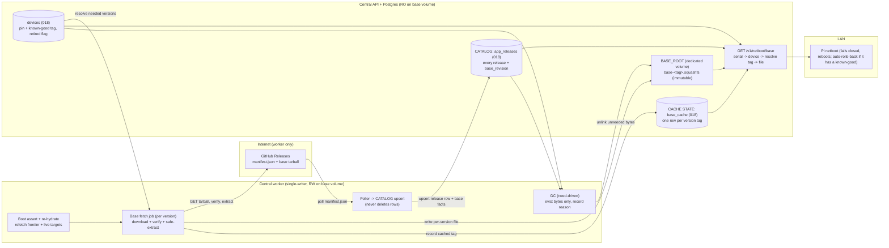
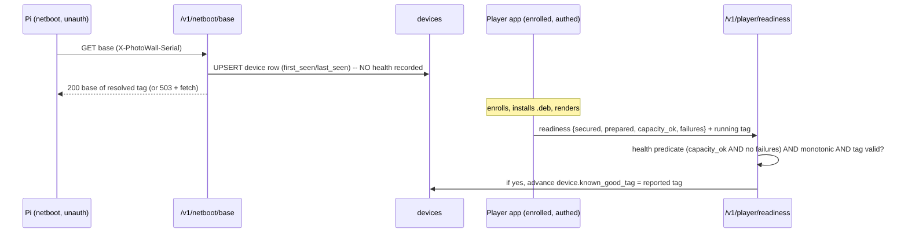
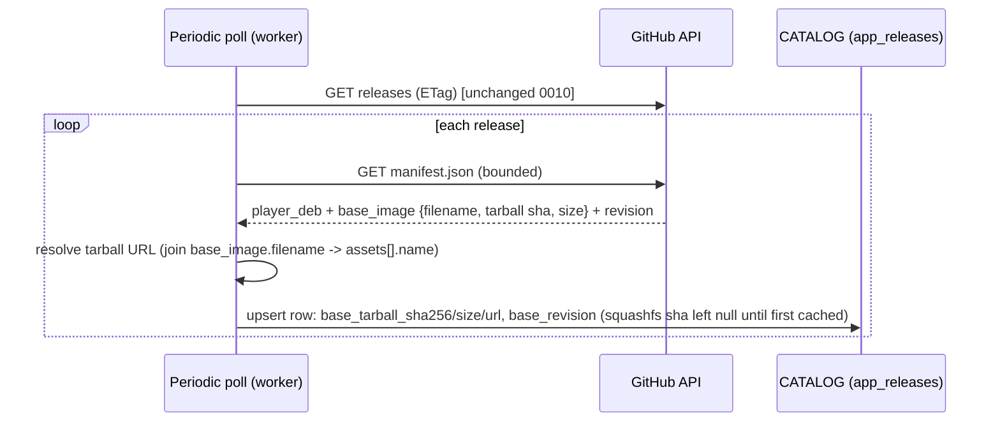
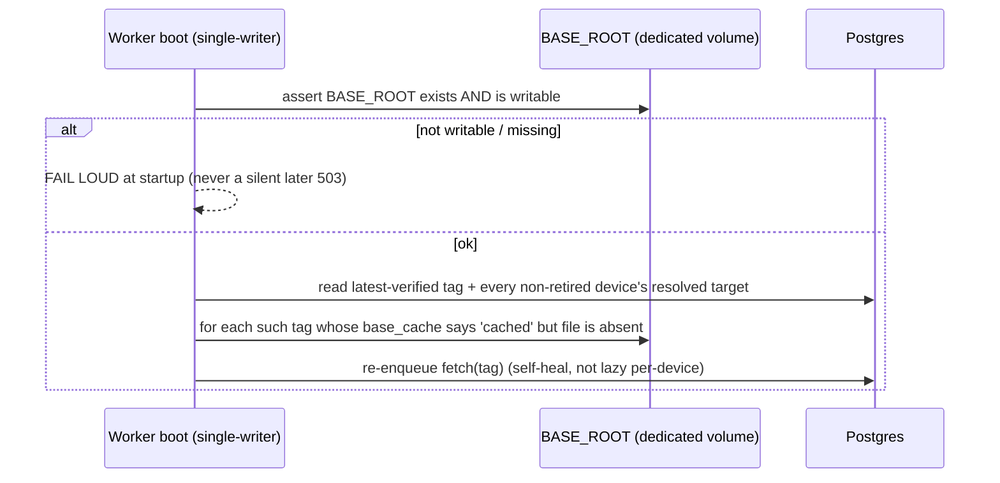
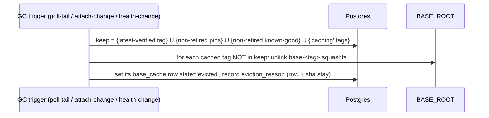
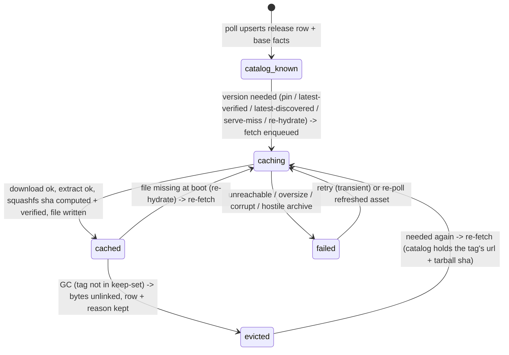

# 0012 — Auto-mirroring netboot base images: a catalog, a need-driven cache, per-device serving

**Date:** 2026-09-20
**Status:** **PROPOSED — owner gate (r6; owner rewrote the selection state machine).** This
directory (`docs/decisions/`) holds accepted architecture decisions; this file is
the single gate artifact for the feature and supersedes any brief, frame, or
review note produced while drafting it.

**The model, settled across r0–r6:**
- **r2 reframe:** there is **no single current base**. Central serves **multiple
  base images concurrently** — the fleet is heterogeneous. The r0/r1 singleton +
  symlink-flip is gone.
- **Base OS and Player `.deb` are INDEPENDENTLY VERSIONED.** The base image has its
  own build identity (`base_revision`, a git sha), neither the tag nor the `.deb`
  version; a release tag carries a base tarball as one of its assets.
- **r6 owner decisions (now DECIDED; they replace the r3/r5 promotion machinery):**
  1. **There is NO fleet default and NO promotion step.** `default_tag`,
     `promoted_tag`-as-a-base-selector, the operator "promote the default" action,
     and the r5 canary health-gate are **removed**. Selection is **per-device**.
  2. **Selection precedence, per device:** (1) the device's **pin**, else (2)
     **latest-verified**, else (3) — empty state only — **latest-discovered**.
  3. **latest-verified is a live QUERY, not stored state:** the highest **semver**
     tag that at least one **non-retired** device has reported **healthy**. This is
     why the old default-clobber race is gone — nothing writes a shared "current".
  4. **The cache is keyed by RELEASE identity, not by content sha.** Each version
     owns its own cache row and file; two releases with identical bytes produce two
     files. The squashfs sha256 is **integrity/`Digest` only**, never a shared key.
  5. **Storage:** Central **requires a second persistent directory dedicated to base
     images**, separate from the media volume, asserted writable at boot, and
     **proactively re-hydrated** on boot.
  6. **Rollback:** a device with a prior healthy known-good **auto-falls-back** to it
     when a freshly-booted image fails to reach healthy (appliance/boot-tree logic in
     scope). A **new** device with no known-good that cannot boot its served image
     boot-loops until an operator **pins** it — accepted.

**What the design does NOT promise:** it does **not** guarantee "never 503". It
guarantees **"a 503 is transient, bounded, and self-heals"** — a base miss enqueues
a fetch, the Pi reboots and retries, and a boot re-hydrate self-heals a cache whose
bytes were lost. The one exception, stated up front: a fresh cluster's very first
image is **unverified by construction** (latest-discovered), so a bad first image
bricks initial bring-up until the operator pins a known-good — an inherent cost.

**What you are being asked:** approve the shape and confirm the DECIDED gate rows.
Today a photo-wall Pi cannot netboot at all: `GET /v1/netboot/base` returns **503**
because nothing populates the directory it serves and no dedicated persistent
directory is configured. This design makes Central's worker **discover** every
release into a catalog, **cache** each needed base squashfs on demand as a
per-version immutable file on a dedicated persistent volume, and **serve** each
device the whole-release artifacts (base + `.deb`) of the version it resolves to —
by per-device precedence, with zero manual staging.

### Prior owner decisions this builds on

| Decision | Where | What it settles for us |
|---|---|---|
| Home LAN, no threat model; sha256 is corruption-only, no signing | `docs/decisions/0009-*`, `docs/decisions/0010-*` | We never verify authorship of a release asset; sha256 guards transit corruption and serves as the `Digest`, never authenticity |
| Base OS and Player `.deb` are **two assets of one release** | `docs/decisions/0009-*`, `scripts/package_release_artifacts.py:167-177` | The version a device runs determines both its `.deb` and its base image; base selection piggybacks on the resolved tag (whole-release) |
| Central holds the bytes it serves; the worker touches the internet; discovery automatic | `docs/decisions/0010-*` | The base is a second producer into the same worker/serve split |
| GitHub-sourcing config is opt-in on `PHOTO_WALL_APP_ROOT`; the worker mirrors the `.deb` there and Central serves it | `central/app_release_service.py:107`, `central/app.py` `app_package` route | The base reuses the **already-proven** dual-mount pattern (worker RW, Central RO) — but on its **own** dedicated volume, not the `.deb` one |

### Verified facts about today's code (each checked for this reframe)

| Fact | Where | Consequence |
|---|---|---|
| **A `players` row exists only after cryptographic enrollment.** It requires NOT NULL `public_key`/`token_hash`; enroll INSERTs it keyed `player_id = "p-"+sha256(device_id)[:32]` | `central/migrations/001_registry.sql`, `central/registry.py:113-134` | A bare Pi at netboot has no key/token, so it **cannot** be a `players` row. "Device" is a **new pre-enrollment `devices` table** keyed by `device_id`; enrollment later joins it via the shared `players.device_id` |
| **No device→release attachment exists.** `players` has `id, public_key, token_hash, authority_epoch, device_id, ...` — no release/version column | `central/migrations/001_registry.sql`, `010_stateless_enrollment.sql` | The pin is **new**; it lives on the new `devices` row |
| `GET /v1/app/manifest` takes **no** input and returns the global `current()`; the bootstrapper's manifest fetch sends **no serial** (`chunks` supports `headers=` but the manifest caller passes none) | `central/app.py:415-419`, `appliance/provision.py:138-215` `fetch_manifest`/`AppFetcher.chunks` | Per-device `.deb` needs the serial on the manifest fetch — a real **`appliance/` change**. The running OS already reads the serial (`appliance/bootstrap.py:read_pi_serial`) |
| The authenticated **`POST /v1/player/readiness`** (and its websocket twin) reports secured/prepared assignments, `capacity_ok`, and `failures` | `central/app.py:523-527,576-580`, `contracts/models.py:229` `Readiness` | This is the **health seam** where a device's known-good tag is recorded — never the unauthenticated netboot path |
| **`coordinator.readiness` returns `True` for any newer, structurally-valid report — including one carrying `failures` or `capacity_ok=False`.** The `accepted` boolean the route returns is NOT a health verdict | `central/coordination.py:594-706` (returns `True` at :706; the only `False` is the monotonicity guard at :615) | The known-good write must compute a **real** health predicate over the readiness fields — never key off `accepted`. `capacity_ok` defaults `False` (`contracts/models.py:236`) and `prepared ⊆ secured` is already enforced by the model validator (`:247`) |
| The readiness handler already gates on **sequence monotonicity** (`if old and report.sequence <= old["sequence"]: return False`) | `central/coordination.py:611-616` | The known-good write reuses this so a device's known-good only ever **advances** — reordered readiness twins (POST + websocket) never regress it |
| `Readiness` carries **no running-version/tag field**, and the route passes none | `contracts/models.py:229-239`, `central/app.py:523-527` | Recording the running tag needs a **`contracts/` change** to add it — load-bearing for known-good and thus for latest-verified |
| The netboot e2e is **false-green**: `_stage_base` pre-writes `photo-wall-base.squashfs`+`SHA256SUMS` and passes `base_root=` to `create_app`, so discover→download→cache is never run; conftest never sets the base dir | `tests/test_netboot_e2e_wire.py:114-120,181`, `tests/test_netboot_base_http.py` `_stage_base` | The tests manufacture exactly the precondition the live cluster lacks — a genuine fresh-install e2e is a required bead |
| **The media worker is single-writer via an exclusive `flock`.** `MediaStore.worker_lock()` opens `<root>/.worker.lock` and takes `LOCK_EX|LOCK_NB`; `media/worker.py` wraps the entire run in `with worker.store.worker_lock()` | `central/media_store.py:176-199`, `media/worker.py:387` | The base fetch runs inside this same single-writer worker. The design **depends on single-writer**, so `O_EXCL`/mkstemp→rename need only defend against a crash-restart, not two concurrent writers on one host |
| `parse_semver` is strict SemVer 2.0.0 and **rejects** non-semver / build-metadata tags; `AppReleases.list()` returns rows **semver-DESC** | `central/app_releases.py:46-92,158-166` | latest-verified / latest-discovered can be a single `ORDER BY major DESC,minor DESC,patch DESC` query, and non-parseable tags are simply excluded |
| `boot_autopull` currently polls, sets `promoted_tag`, and reconciles the global `.deb` pointer at worker boot (0010) | `central/app_release_boot.py:59-135` | Its existing 0010 `.deb`/`promoted_tag` behavior is **PRESERVED unchanged**; this feature only **adds** a base role — the empty-state bootstrap fetch of latest-discovered plus the boot re-hydrate |
| `bindings` is player→**frame** adoption (`frame_id → player_id, output_id`) | `central/migrations/001_registry.sql:36`, `central/installation_repository.py:26-38` | Frame binding is orthogonal to release attachment; GC's device terms must **not** mean frame-bound |
| Serial → `device-<64hex>` via one shared derivation; `players.device_id` is unique | `contracts/equipment.py:21` `equipment_device_id`, `010_stateless_enrollment.sql` | The serve seam maps `X-PhotoWall-Serial` → `device_id` → the `devices` row |
| The Pi initrd **fails closed and reboots** on any base-fetch fault (503, missing/mismatched `Digest`) | `appliance/netboot_init.py:215,377`, `fetch_verified` | A cache-miss safely returns 503; the Pi retries on its next boot cycle. Retry granularity is a whole reboot (~seconds), so proactive caching + boot re-hydrate are strongly preferred |
| The manifest declares `base_image = {filename, sha256, size}` where `sha256` is the **tarball** digest, and a top-level `revision` | `scripts/package_release_artifacts.py:166-177` | The inner **squashfs** digest (the served `Digest`) is **not** in the manifest — it is inside the tarball's `SHA256SUMS`, learned only after download+extract |
| The manifest's `revision` is a **40-char git sha** (validated), embedded in the tarball name; there is **no base semver** | `scripts/package_release_artifacts.py:124-128,156,169-174` | `base_revision` is informational metadata (which OS build), recorded per release for the operator to match the TFTP boot tree; it is **not** a cache key and never needs ordering |
| The `.deb` download primitive streams bounded, hashes, verifies against a manifest sha256, fails closed with a fixed-name `O_EXCL` temp, follows the CDN redirect | `central/github_releases.py:314-353` `download` | The base tarball download reuses this; the base fetch uses a **uniquely-named `mkstemp` temp in the target dir** (not a fixed name) so a crash-restart never collides, and tar extraction is the only new surface |
| `open_regular` applies `O_NOFOLLOW` to the final component and requires a regular file | `central/artifact_io.py:39-51` | A per-version `base-<tag>.squashfs` is served through it unchanged; **no symlink, no SHA256SUMS re-read, no torn pair** |
| `select_base_for_serial` returns one base for every serial; its TODO says "when a per-serial binding model exists, look the serial up here" | `central/netboot_base.py:57-72` | This feature **is** that per-serial model; the seam becomes a per-device lookup |
| `Database.transaction()` runs at Postgres default **READ COMMITTED** (no explicit isolation) | `central/db.py:47-52` | GC's keep-set read is not atomic with its unlinks — the eviction guarantee is decision + eventual, not "cannot happen" |
| Migrations are additive, sorted, checksum-pinned, no down-machinery; highest is `017` | `central/db.py`, `central/migrations/` | New migration is `018_*.sql`, additive only |

---

## The problem in plain words

- **Different Pis run different releases at the same time.** Central must serve
  several base images concurrently — the one each Pi's resolved version needs — not
  a single "current" image.
- **Remember everything; download only what is needed.** Central records *every*
  release it sees on GitHub (cheap metadata, kept forever), but only pulls the heavy
  squashfs bytes for versions something actually needs.
- **A Pi asks for its base by identity.** It sends its serial; Central resolves the
  version that Pi should run (pin, else latest-verified, else — on an empty cluster
  — latest-discovered) and serves that version's base image.
- **A 503 is transient, not a dead end.** A base that is not yet cached returns 503;
  the Pi reboots and retries; a background fetch lands the bytes; a boot re-hydrate
  refills a cache whose files went missing. The design does **not** promise "never
  503" — it promises a 503 is **bounded and self-heals**.
- **Clean up bytes that nothing needs.** A cached base is deleted once no
  non-retired device pins it, has it as known-good, or would resolve to it as
  latest-verified, and no fetch is in flight. The catalog record stays; only the
  bytes go.
- **Nothing is signed** (home LAN, 0009/0010): a sha256 is a corruption and
  `Digest` check, never proof of authorship.

---

## The answer in one picture



**The three rules that make this hold:**

1. **The catalog is immortal; the cache is per-version and disposable.** The catalog
   records every discovered release forever, including its base facts. The cache
   holds only the squashfs bytes something needs, as **per-version immutable files**
   named by the release tag (`base-<tag>.squashfs`). There is **no shared content-sha
   key, no "current" pointer, no symlink** — two versions with identical bytes get
   two files. The squashfs sha256 is stored per version for integrity and as the
   served `Digest`, never as a cache identity.
2. **Every device has a canonical row; it is served the whole-release artifacts of
   one resolved version.** The netboot request auto-creates the device's row (serial
   → `device_id`). Selection is a **per-device precedence query**: the device's
   **pin**, else **latest-verified** (the highest semver tag any non-retired device
   has reported healthy — a live query, never stored), else — **empty state only** —
   **latest-discovered**. From that one tag come **both** the base image and the
   `.deb`; they never diverge. The `Digest` served is that version's squashfs sha, so
   bytes and digest agree by construction.
3. **Health is recorded per device on an authenticated healthy check-in; the frontier
   and the cache follow it.** A device's **known-good tag** is set only when a
   readiness report satisfies a real health predicate (`capacity_ok` **and** no
   `failures`, with `prepared ⊆ secured` already enforced) and is newer than the last
   — never at serve time, never from the `accepted` boolean. latest-verified is
   the max semver over non-retired devices' known-good tags, so promotion is
   **emergent**: pin one device (a canary) to a new version; when it reports healthy,
   latest-verified climbs and unpinned devices follow — no explicit promote action.
   A cached file is kept iff its tag is latest-verified, **or** any non-retired
   device's pin, **or** any non-retired device's known-good, **or** a fetch in flight;
   otherwise its bytes are evicted (rows stay, with a recorded reason). Eviction is
   safe: files are immutable and an open fd survives an unlink.

---

## Glossary

- **Catalog** — one row per discovered release (`app_releases`, extended): tag,
  prerelease flag, base tarball facts, `base_revision`, and — once learned — the
  squashfs sha. Never garbage-collected.
- **Cache** — the squashfs bytes on disk, named by version (`base-<tag>.squashfs`),
  plus a `base_cache` row **per version tag** recording
  `caching`/`cached`/`evicted`/`failed`, the squashfs sha (integrity/`Digest`), and
  an eviction reason. Rows are never deleted; only bytes are need-driven.
- **base_revision** — the base image's own build identity (manifest top-level
  `revision`, a git sha). Informational metadata the operator matches to the TFTP
  boot tree; **not** a cache key, **not** orderable, **not** a dedup key.
- **squashfs sha256** — the sha of the extracted squashfs bytes; the served
  `Digest` and the download-integrity cross-check. **Integrity only** — never a
  cache identity and never shared across versions.
- **Device** — a Pi as a physical unit, identity `device_id` (`device-<64hex>`,
  derived from the serial). Its `devices` row is auto-created on first netboot
  contact, before any enrollment; it is the canonical home for the pin and the
  known-good tag. `players` (post-enrollment) joins it by `device_id`.
- **Pin** — `devices.attached_tag`: an operator-set version this device must run,
  overriding latest-verified. Also how a canary is designated.
- **Known-good tag** — `devices.known_good_tag`: the tag a device last ran **while
  confirmed healthy**. What auto-rollback returns to, and the per-device input to
  the latest-verified frontier.
- **latest-verified** — the **live query** `max(semver(tag))` over non-retired
  devices' `known_good_tag`. The unpinned target. Self-heals downward when the last
  device on a version retires.
- **latest-discovered** — the highest semver deployable release in the catalog. The
  **empty-state bootstrap** target only — the one unverified image the design ever
  serves.
- **Canary** — a device an operator pins to a candidate version. When it reports
  healthy, latest-verified climbs. There is no separate flag and no promote action.
- **Base fetch** — the per-version background job: download the tarball, verify,
  safe-extract, compute the squashfs sha, write the per-version file via
  `mkstemp`→atomic-rename, record the cache row.
- **Boot re-hydrate** — a worker-boot step that re-enqueues a fetch for
  latest-verified and every non-retired device's resolved target whenever the cache
  row says `cached` but the file is absent.
- **GC** — need-driven eviction of cache bytes whose tag is not in the keep-set
  (latest-verified ∪ pins ∪ known-good ∪ in-flight, non-retired only).

---

## How selection and safety work

**Two seams, split on purpose:** the **netboot** seam (unauthenticated) creates the
device row and resolves+serves, but records **no health**; the **health** seam
(authenticated readiness) records the known-good tag. This split is why a device
served a bad image is never associated with it as healthy, and why the
latest-verified frontier can only be moved by a genuinely healthy check-in.

**Per-device resolution — one tag, both artifacts** (the base serve seam
`select_base_for_serial` and the additive per-device `.deb` resolution share it; 0010's
global manifest route is untouched):

1. `X-PhotoWall-Serial` → `sanitize_serial` → `equipment_device_id` → `device_id`.
   (Invalid/absent serial → no device row; serve the unpinned target best-effort.)
2. **UPSERT the `devices` row** (`device_id`, `serial`, `first_seen`/`last_seen`) —
   one idempotent write, no health fields. Read `attached_tag`.
3. **Resolve the target tag** by precedence: `attached_tag` if set, else
   latest-verified (`max semver` over non-retired `known_good_tag`), else — only when
   latest-verified is empty (no non-retired device has ever been healthy) —
   latest-discovered.
4. From the resolved tag: **base** = its `base_cache` state + squashfs sha; **`.deb`**
   = its mirrored `.deb` sha (same tag — whole-release).
5. If the base's `base_cache` row is not `cached`: **ensure a fetch is enqueued and
   return 503** — never block on a download; the Pi reboots and retries.
6. If cached: open `BASE_ROOT/base-<tag>.squashfs` (`O_NOFOLLOW`, regular file,
   size-bounded), stream it, `Digest = ` the row's squashfs sha.

| Who is asking | Result | Why |
|---|---|---|
| Unknown serial, empty cluster (no device ever healthy) | Device row created; **latest-discovered** base + `.deb` (unverified) | The involuntary first canary; the only unverified serve |
| Unknown / enrolled unpinned device, frontier exists | **latest-verified** base + `.deb` | Highest version some non-retired device runs healthy |
| Pinned device (canary or rolled-back) | Its **pin's** base + `.deb` | Pin overrides; its artifacts are fetched proactively |
| Pinned/latest-verified device, that version not yet cached | 503; a fetch is (idempotently) enqueued | Fail closed; the Pi retries on reboot |
| Malformed / oversize serial | `sanitize_serial` rejects → no row → unpinned target best-effort | Unauthenticated input bounded at the seam |
| **Authenticated player reports a healthy readiness** | Health predicate passes + monotonic + reported tag validated ⇒ its `known_good_tag` advances | Only a genuinely-healthy, validated check-in moves known-good (and thus the frontier) |
| Authenticated player reports failures / `capacity_ok=False` | Report accepted by the coordinator, but **known-good NOT written** | `accepted` is not health; the real predicate refuses it |
| Poll finds a release with a valid `base_image` | Catalog + base facts upserted; no bytes moved | Discovery never changes what any device runs |
| GC runs, a tag is not in the keep-set | Its bytes evicted; the `base_cache` row (`evicted` + reason) and catalog stay | Cache is need-driven; the catalog is the memory |

**The per-device registry — two seams, and why the split matters.**



- **Why not record at serve time:** a device served an unbootable image would count
  as healthy on it, poisoning known-good and inflating latest-verified for the whole
  fleet. Recording only on a validated healthy check-in means the frontier can only
  climb on real, per-device evidence.
- **Resolved target vs known-good:** selection serves the resolved target (pin or
  latest-verified) *next*; known-good is what the device last ran healthy. During a
  roll-forward the two differ until the player goes healthy on the new target; GC
  keeps both, so a device that never goes healthy can roll back to known-good.

**Security — unauthenticated device-row creation.** `/v1/netboot/base` is unauth
(trusted-LAN, 0009). The netboot write is a **single idempotent UPSERT** keyed by a
`device_id` hash of a `_SAFE_SERIAL`-bounded serial — no unbounded per-request work,
no health logic. An on-LAN serial-sprayer can create only **empty** rows (device_id +
timestamps); it can **not** write a known-good tag, because that is written **only**
from the authenticated health seam (a valid player token). Unbounded empty-row growth
is **accepted** under the 0009 home-LAN ruling, with an optional operator-visible row
cap as deferred hardening. An invalid/absent serial creates **no** row.

**What a compromised GitHub feed gets:** on this LAN, no signing, a bad actor
controlling the feed can make Central cache and serve arbitrary base bytes —
accepted, out of scope (0009/0010). The squashfs sha only guarantees the served bytes
match their advertised `Digest` and were not corrupted in transit.

**Invariants, kept separate:**

1. **Safety — the served `Digest` always matches the served bytes.** The per-version
   file is written once, immutably, and its `base_cache` row records the sha of those
   exact bytes; the `Digest` is that recorded sha. There is no in-place mutation and
   no shared file, so a torn (Digest, bytes) pair is **unrepresentable**. Guarantee:
   **construction** (write-once-per-key + temp→atomic-rename immutability).
2. **Liveness — a needed version's bytes eventually cache.** A miss enqueues a fetch;
   the Pi retries on reboot; a boot re-hydrate refills lost files. Weaker, eventual;
   delivered by the fetch job + reboot-retry + boot re-hydrate.
3. **Frontier integrity — latest-verified can only be moved by real health.** It is
   `max semver` over non-retired devices' known-good; known-good is written only on a
   validated healthy check-in. A compromised player cannot inflate it because its
   reported tag is accepted only when it matches the device's resolved target or its
   prior known-good. Guarantee: **decision** (the health predicate + tag validation
   at the health seam) + **transaction** (the monotonicity guard).

---

## Walkthroughs

### Discover releases into the catalog (metadata only, never GC'd)



The poll is the existing 0010 periodic task; this adds reading
`manifest.base_image` and `revision` onto the release row. The catalog carries the
**tarball** sha at discovery; the **squashfs** sha is filled the first time that
version is cached. Discovery moves no bytes and changes no device's target.

### Attach, fetch, and serve a base

```mermaid
sequenceDiagram
  participant Op as Operator
  participant DB as Postgres
  participant W as Base fetch job (single-writer worker)
  participant GH as GitHub
  participant Pi as Pi netboot
  participant C as Central serve
  Op->>DB: pin device D to tag T (a canary), or leave unpinned
  DB->>W: enqueue fetch(T) if T not cached (proactive)
  W->>GH: GET T's base tarball (bounded, streamed)
  GH-->>W: tarball bytes
  W->>W: verify sha256 == base_image.sha256 (download corruption check)
  W->>W: safe-extract ONLY the two prefixed members (allowlist, isfile, size-bounded)
  W->>W: compute squashfs sha; verify == its SHA256SUMS line (private parser)
  W->>W: write base-<T>.squashfs via mkstemp temp -> atomic rename (same filesystem)
  W->>DB: base_cache[T].squashfs_sha256 + state=cached
  Pi->>C: GET /v1/netboot/base (serial header)
  C->>DB: serial -> device -> resolve tag (pin / latest-verified / latest-discovered) -> base_cache state
  alt cached
    C-->>Pi: 200 base-<T>.squashfs, Digest: sha-256=<recorded sha>
  else miss
    C->>DB: ensure fetch(T) enqueued (coalesced by tag lock)
    C-->>Pi: 503 (Pi reboots, retries)
  end
```

1. **Proactive caching:** a pin change enqueues `fetch(tag)` so bytes are ready
   before the Pi boots.
2. **Lazy backstop:** a serve miss also enqueues `fetch(tag)`, coalesced by the
   per-tag queue lock, so the path self-heals even if the proactive trigger was
   missed.
3. The fetch **stages only content**, keyed on the **version tag**: download → verify
   tarball → allowlist-extract → compute + verify squashfs sha → `mkstemp` temp in
   `BASE_ROOT` → atomic rename to `base-<tag>.squashfs`. Each version owns its own
   row and file.
4. Serving is a per-request DB lookup (indexed by unique `device_id`) plus one file
   open; the `Digest` is the row's recorded sha. No `SHA256SUMS`, no symlink.

### Empty-state bootstrap and emergent promotion

```mermaid
sequenceDiagram
  participant Op as Operator
  participant DB as Postgres
  participant Cy as First / canary device
  participant C as Central
  Note over C,DB: empty state -- no non-retired device has ever been healthy
  Cy->>C: netboot (no pin) -> resolves latest-discovered (UNVERIFIED bootstrap)
  Cy->>C: enroll, render, POST readiness (healthy) reporting tag T
  C->>C: health predicate + monotonic + tag validated
  C->>DB: Cy.known_good_tag = T  (latest-verified now = T)
  Note over C,DB: unpinned devices now resolve latest-verified = T
  Op->>DB: to introduce T2, pin a canary device to T2 (an ordinary pin)
  Cy->>C: canary boots T2 (its pin), reports healthy -> known_good = T2
  Note over C,DB: latest-verified climbs to T2; unpinned devices follow -- no promote action
```

1. On a **fresh cluster** there is no verified image, so the first device is served
   **latest-discovered** — an unverified bootstrap. It is the involuntary first
   canary. **Stated plainly:** a bad latest-discovered bricks initial bring-up until
   the operator pins a known-good version. Accepted, inherent cost.
2. Once one non-retired device reports healthy on a tag, that tag is latest-verified
   and unpinned devices follow it.
3. **Promotion is emergent, not an action.** To roll the fleet to a new version, an
   operator pins a device (canary) to it; when that device reports healthy,
   latest-verified climbs and unpinned devices follow on their next boot.

### Boot assertion and re-hydrate



### Garbage-collect unneeded bytes



A single uniform **non-retired** filter applies to both the keep-set device terms and
the latest-verified frontier query. Consequence, stated plainly: when the last device
on a version retires, the frontier self-heals **downward** and that version's bytes
become evictable — a decommissioned device can never pin a base image forever.

---

## The hard part — an immortal catalog, a per-version cache, and GC against live reads

The load-bearing structure is the **separation of an immortal catalog from a
disposable, per-version cache**, plus a per-device serve seam whose target is a pure
function of live state. The subtle failures live at their seams.



**Per-version cache keying (owner decision, closes the shared-key race class).** The
cache is keyed by the **release tag**, not by content sha. Each version owns its own
`base_cache` row and its own `base-<tag>.squashfs` file. There is **no shared mutable
`squashfs_sha256` key that discovery and fetch both write** — that shared key was the
old race: discovery wrote it null, fetch filled it, and it was simultaneously the
cache-parent's primary key, forcing FK gymnastics and admitting the double-resolve.
Now the key (the tag) is known at discovery, immutable, and unique per version; the
squashfs sha is a plain integrity attribute on the row, filled at first cache. Torn-
read safety therefore comes from **write-once-per-key + `mkstemp`→atomic-rename
immutability**, not from content-addressing. Temp files are uniquely named by
`mkstemp` **in the target directory** (same filesystem as the final file, so the
rename is atomic).

**Cost, stated honestly:** identical base bytes are now stored **once per active
version** — the dedup the old content-addressed design existed for is **gone**. The
disk footprint is bounded by the active version set (latest-verified ∪ pins ∪
known-good ∪ in-flight), which the dedicated persistent volume absorbs.

**Storage persistence (owner decision — the root of the old outage class).** Central
**requires** a second persistent directory dedicated to base images, `BASE_ROOT`,
separate from the media volume:
- **Boot-time assertion:** the worker asserts `BASE_ROOT` exists and is writable at
  startup and **fails loud** if not — never a silent later 503.
- **Boot re-hydrate:** the worker re-enqueues a fetch for latest-verified and every
  non-retired device's resolved target whenever the cache row says the bytes should
  exist but the file is absent — self-heal on boot, not lazily per device.
- **Single-writer dependency, stated plainly:** the media worker is single-writer via
  the exclusive `flock` on `<root>/.worker.lock` (`central/media_store.py:176-199`,
  wrapped at `media/worker.py:387`); the base fetch runs inside it. The design
  **depends on single-writer** — it does not rely on Postgres-serialized multi-writer
  coordination for the file write. **If `BASE_ROOT` is on NFS**, `flock` and
  `O_EXCL`/atomic-rename reliability across the mount is a **documented precondition**
  (NFS `flock` and rename atomicity are implementation-dependent).

**Base OS versioning is informational.** `base_revision` (a git sha) records which OS
build a release carries, for the operator to match the TFTP boot tree. It is **not** a
cache key, **not** orderable, and **not** a dedup key — selection and GC key off the
resolved **tag**, never off `base_revision` or the `.deb` version.

**The two-sha reality (owner point on integrity).** The manifest gives only the
*tarball* sha at discovery; the *squashfs* sha (the served `Digest`) is inside the
tarball:
- `base_cache.squashfs_sha256` is **null until the version is first cached**; the
  fetch computes it (cross-checked against the bundle's `SHA256SUMS` via a private
  parser) and writes it onto that version's row. A later eviction removes bytes but
  keeps the recorded sha, so a re-fetch knows the expected digest.
- **Consequence, stated plainly:** a version that has *never* been cached serves 503
  on its first request until the background fetch completes (a reboot cycle or two for
  a large squashfs). Proactive fetch on pin and boot re-hydrate keep this off the
  common path. Gate #4 offers a manifest enhancement (declare the squashfs sha) that
  removes even the first-request 503.

**Extraction security (carried forward from r1, unchanged in spirit):**
- Verify the tarball sha256 **before** opening it as a tar.
- **Allowlist**, never `extractall`: read only `photo-wall-base/photo-wall-base.squashfs`
  and `photo-wall-base/SHA256SUMS` (the `arcname="photo-wall-base"` prefix,
  `package_release_artifacts.py:159`); each must be a regular file (rejects
  symlink/hardlink/device/fifo), name free of `..`, not absolute, each bounded by a
  running-total cap (squashfs `MAX_NETBOOT_BASE_BYTES` = 1 GiB, `SHA256SUMS` 4 MiB).
  Path-traversal, hostile member types, and decompression bombs are
  **construction**-level impossible.
- **Duplicate member names:** the allowlist walks members once and takes the **first**
  occurrence of each of the two exact names, ignoring any later duplicate.
- **Private `SHA256SUMS` parser.** The parser that reads the squashfs line is a
  **private** `_read_squashfs_digest` in the fetch module, not a shared
  `netboot_base.py` seam: the serve side reads the `Digest` from the DB, so this
  parser has exactly one consumer — the fetch.

**No base default, no base promotion (owner decision — the class that used to admit
the clobber race is deleted).** This feature adds **no** `default_tag`, **no** base
promotion step, **no** `reconcile_default`, and **no** canary health-gate. The unpinned
**base** target is the **live** `latest-verified` query, so no code writes a shared
"current base" that a stale mirror or a discovery could clobber — the whole
double-writer class is unrepresentable rather than guarded. **0010's global `.deb`
manifest path is untouched by this design:** `GET /v1/app/manifest`, its
`promoted_tag`/`current_sha256` pointer, `reconcile`, and migration 016 are a separate
feature this design neither changes nor depends on. `boot_autopull` **keeps** its
existing 0010 `.deb`/`promoted_tag` behavior unchanged and only **adds** the base role
— the empty-state bootstrap fetch of latest-discovered plus the boot re-hydrate; it
sets no base default. Retiring the now-vestigial global `.deb` pointer, if ever wanted,
is a **future 0010 decision**, out of scope here.

**GC vs in-flight fetch/serve (honest strength).** GC evicts by tag. Under READ
COMMITTED (`central/db.py:47-52`) the keep-set `SELECT` is **not** atomic with the
`unlink`s, so the guarantee is **decision + eventual**, not "cannot happen":
1. GC reads the keep-set (latest-verified ∪ non-retired pins ∪ non-retired known-good
   ∪ `caching` tags) and unlinks only tags outside it, setting `state='evicted'` and a
   reason. Retired devices contribute nothing (they never boot again).
2. An **open fd survives `unlink`** (POSIX): a serve already streaming
   `base-<tag>.squashfs` completes even if GC unlinks mid-stream.
3. **Residual, stated plainly:** a tag evicted and *then* pinned/verified between the
   keep-set read and the unlink is re-fetched on the next need; the interim serves 503
   and the Pi retries. Never a wrong or torn serve.

**Auto-rollback pulls the boot tree into scope (owner decision).** A device that has a
prior healthy known-good **auto-falls-back** to it when a freshly-booted image fails
to reach healthy. This is appliance/boot-tree logic — the appliance must detect
"booted the new target but never reached healthy" and reboot into its recorded
known-good. **Stated plainly:** this brings appliance boot-selection logic into scope
(the old boot-tree residual is no longer purely operator-staged for the rollback
path). A **new** device with no prior known-good that cannot boot its served image
boot-loops with **no server-side signal** until the operator pins it — accepted.
Cross-variant is **per-device and accepted:** a device may be served a version only a
*different* device verified; if its own hardware cannot boot it, the same
rollback/pin path applies.

**Boot-tree/squashfs coupling (residual).** The kernel/initrd/dtb ship in the same
tarball but are operator-staged in TFTP for the *forward* path (0009 gate #4); Central
has no view of them. **The guarantee is "a verified, internally consistent squashfs
for version T," not "the Pi will netboot T."** See gate #6.

**Cost:** two concerns (catalog + per-version cache), a per-request DB lookup on the
serve path, a background fetch/GC/re-hydrate lifecycle, and a dedicated persistent
volume are more machinery than a single served file. We accept it because the fleet is
genuinely heterogeneous — a single current base cannot express per-device rollout,
pins, or emergent verification — and the per-version + live-query shape buys back the
torn-pair and shared-key-clobber classes by construction.

---

## Design-it-twice — per-version live-query vs. the rejected fleet-default

| | **Per-version cache + live latest-verified (chosen)** | **Fleet default_tag, canary-gated promotion (rejected — r3/r5 model)** |
|---|---|---|
| Fleet model | Per-device: pin, else latest-verified, else bootstrap | One promoted default for all unpinned devices |
| Unpinned target | A live query over the device table (no stored state) | A stored `default_tag` advanced by a promotion gate |
| Clobber race | Impossible — nothing writes a shared "current" | Guarded by `FOR UPDATE` + a canary health-gate |
| Promotion | Emergent: pin a canary, it goes healthy, frontier climbs | An explicit operator promote action + gate |
| Cache identity | Per version (tag); dedup given up | Content-sha, deduped across versions |
| Fit to owner intent | Matches "no fleet default, per-device" | **Contradicts it** — the owner removed the default and promotion |

The fleet-default model was removed by the owner: it needs a stored pointer and an
explicit promotion action, and the stored pointer is exactly what admitted the
clobber race the earlier revisions kept guarding. Making the unpinned target a **live
query** deletes that class rather than patching it. The content-sha dedup is the
stated cost of the switch (identical bytes stored once per active version).

**Fork that survives — attachment scope (DECIDED by the owner: whole release).**
Whole-release (`attached_tag` drives base **and** `.deb`) vs. an independent per-device
base binding. The owner ruled **whole release**: a device resolves one tag and both
artifacts follow, so base and `.deb` can never diverge for a device. The invariant is
preserved **structurally on the per-device serve path**: that path resolves the `.deb`
for the device's own resolved tag alongside its base. **0010's global `.deb` manifest
path (`GET /v1/app/manifest`, `promoted_tag`/`current_sha256`, `reconcile`, migration
016) is left completely untouched by this design** — it is a separate feature.
Retiring the now-vestigial global `.deb` pointer, if ever wanted, is a **future 0010
decision**, out of scope here.

---

## Storage, lifecycle, migration

### Catalog — base facts on the release row (migration `018`), never GC'd

`app_releases` additive columns (per release tag — the download coordinates and the
base build id; base facts live per version, there is no dedup table):

| Column | Type / constraint | Meaning |
|---|---|---|
| `base_revision` | `TEXT` NULL | The release's base OS build id (manifest `revision`); informational, matched to the TFTP boot tree |
| `base_tarball_sha256` | `TEXT CHECK(~ '^[0-9a-f]{64}$')` NULL | Tarball digest from `manifest.base_image`; verifies this version's download |
| `base_tarball_size` | `BIGINT CHECK(>0)` NULL | Expected tarball size |
| `base_tarball_url` | `TEXT` NULL | This version's base tarball `browser_download_url` (filename join) — the fetch URL |

`base_cache` — **one row per version tag** (created at discovery; the row is **never
deleted** — GC sets `evicted`):

| Column | Type / constraint | Meaning |
|---|---|---|
| `tag` | `TEXT PRIMARY KEY REFERENCES app_releases(tag)` | The cache identity; the file is `base-<tag>.squashfs` when `cached` |
| `squashfs_sha256` | `TEXT CHECK(~ '^[0-9a-f]{64}$')` NULL | **Integrity/`Digest` only**, filled at first cache; never a key or FK |
| `size` | `BIGINT CHECK(>0)` NULL | Extracted squashfs size (set at first cache) |
| `state` | `TEXT NOT NULL CHECK(state IN ('caching','cached','evicted','failed'))` | Presence lifecycle; `evicted` keeps the row after GC unlinks the bytes |
| `error` | `TEXT` NULL | Last failure code (bounded, sanitized) |
| `eviction_reason` | `TEXT` NULL | Why GC last evicted this tag (observability) |
| `updated_at` | `DOUBLE PRECISION NOT NULL` | Timestamp |

There is **no `base_images` table and no `default_tag`/`promoted_tag`-as-base
column** — per-version keying removes the dedup table, and the live latest-verified
query removes the stored default. A version whose recorded `squashfs_sha256` ever
changes on a re-fetch is a divergence signal (logged, not overwritten).

### Device registry — `devices` (migration `018`)

`devices` — the canonical per-device row, auto-created at the netboot seam, home for
the pin and the known-good tag (frame `bindings`/`players` are unrelated and join only
by `device_id`):

| Column | Type / constraint | Meaning |
|---|---|---|
| `device_id` | `TEXT PRIMARY KEY` | `device-<64hex>` from the serial (`equipment_device_id`); same identity `players.device_id` uses |
| `serial` | `TEXT` NULL | The raw serial as seen (bounded by `_SAFE_SERIAL`, ≤128), for operator display |
| `attached_tag` | `TEXT REFERENCES app_releases(tag)` NULL | The **pin**; NULL ⇒ latest-verified (or bootstrap) |
| `known_good_tag` | `TEXT REFERENCES app_releases(tag)` NULL | The tag the device last ran **while healthy**; auto-rollback target and frontier input |
| `known_good_at` | `DOUBLE PRECISION` NULL | When it last went healthy on that tag |
| `first_seen`, `last_seen` | `DOUBLE PRECISION NOT NULL` | Netboot-seam timestamps |
| `retired_at` | `DOUBLE PRECISION` NULL | Operator-retired devices drop out of BOTH the GC keep-set and the latest-verified query (uniform filter) |

There is **no `device_served_images` ledger.** Serving is a pure function of live
state (the device table + catalog), so a serve decision is deterministic and auditable
by querying that state — no separate served-image history is needed. GC persists an
`eviction_reason` for the one thing that is not a pure function of current state.

### latest-verified and latest-discovered — queries, not columns

- **latest-verified** = `SELECT max(...) ... FROM devices WHERE retired_at IS NULL AND
  known_good_tag IS NOT NULL`, ranked by `parse_semver(known_good_tag)`; non-semver
  tags excluded (they never parse). No stored column.
- **latest-discovered** (empty-state bootstrap only) = the highest semver deployable
  release in `app_releases.list()` (semver-DESC, prereleases excluded), reusing
  `select_latest_deployable`.
- The `.deb` for a device on the per-device serve path is its resolved tag's mirrored
  `.deb` sha (whole-release, structural — same tag as its base). **0010's global `.deb`
  manifest path and its `promoted_tag`/`current_sha256`/`reconcile` machinery are
  untouched by this design.**

### Cache dir + config

Bytes live at `PHOTO_WALL_BASE_ROOT/base-<tag>.squashfs`. `PHOTO_WALL_BASE_ROOT` is a
**required, dedicated, persistent** directory, separate from the media volume:
mounted **RW on the worker, RO on Central** (the proven `.deb` dual-mount posture, on
its own volume). A shared `resolve_base_root(env)` in `central/netboot_base.py` is
called by both `create_app` (serve) and the worker (write) so they never drift; the
worker **asserts it exists and is writable at boot and fails loud otherwise**. The
README's environment/requirements section documents the env var, that it must be a
persistent volume, and its access mode (worker RW / Central RO) — this is an
acceptance criterion of the docs bead below.

### Migration ordering and rollback

Create order (no cycle, no deferred FK): `ALTER app_releases ADD base_revision,
base_tarball_*` → `base_cache` (FK → `app_releases(tag)`) → `devices` (FK →
`app_releases(tag)`). `players` is unchanged (the pin lives on `devices`).
**Rollback:** `DROP TABLE devices; DROP TABLE base_cache;` drop the `app_releases`
base columns; delete `018_*.sql`; remove `base-*.squashfs` from `BASE_ROOT`.

### How it hooks the existing machinery

- **Discovery:** `GithubReleaseSource._resolve` also parses `manifest.base_image` +
  `revision`; `AppReleases.upsert_discovered` writes the per-version base columns and
  creates the `base_cache` row (`caching`/absent until first fetched). Discovery moves
  no bytes and no device's target.
- **Netboot serve seam:** `select_base_for_serial(conn, serial)` **upserts the
  `devices` row** (row + timestamps only), resolves the target by precedence (pin,
  else latest-verified, else latest-discovered), and returns `(tag, cache_state,
  sha)`; `central/app.py` `netboot_base` opens `base-<tag>.squashfs` with `Digest =
  sha`, or 503+enqueue on a miss.
- **Per-device `.deb` (additive; 0010's global path untouched):** on the per-device
  serve path, the `.deb` for a device is resolved from its **own resolved tag** (pin →
  latest-verified) — the same tag its base came from — so base and `.deb` stay on one
  tag structurally. This is **additive**: **0010's global `GET /v1/app/manifest` route
  and its `promoted_tag`/`current_sha256`/`reconcile` default machinery (migration 016)
  are not modified and not repurposed.** The content-addressed
  `GET /v1/app/package/{sha}.deb` stays sha-keyed.
- **Health seam (authenticated — records known-good, moves the frontier):** on a
  `POST /v1/player/readiness` that satisfies a **real** health predicate
  (`capacity_ok` **and** no `failures`; `prepared ⊆ secured` is already enforced by
  the `Readiness` validator, `contracts/models.py:247`) — **not** the `accepted`
  boolean, which the coordinator returns `True` even for failing reports
  (`coordination.py:706`) — and that is **monotonic** (reuse the sequence guard at
  `coordination.py:611-616`), Central joins `player_id → players.device_id → devices`
  and **validates** the reported running tag (a new `Readiness` field): accepted only
  if it equals the device's resolved target or its prior `known_good_tag`, else
  ignored (logged). On accept it advances `known_good_tag`/`known_good_at`. This
  validation is load-bearing: without it a token-valid buggy/compromised player could
  claim health on an arbitrary high-semver tag and **inflate latest-verified for the
  whole fleet**.
- **Fetch:** a `fetch_base(tag)` worker task, `queueing_lock = "base:" + tag`, uses
  the version's `base_tarball_url`/`sha`, reuses `GithubReleaseSource.download`;
  allowlist-extract; compute+verify squashfs sha via a **private**
  `_read_squashfs_digest`; `mkstemp` temp in `BASE_ROOT` → atomic rename; write
  `base_cache[tag].squashfs_sha256` + `state=cached`.
- **Boot (`boot_autopull` reworked):** assert `BASE_ROOT` writable (fail loud); on
  empty state, fetch latest-discovered so the first device can boot; re-hydrate — for
  latest-verified and every non-retired device's resolved target whose row says
  `cached` but whose file is absent, re-enqueue `fetch_base(tag)`. No default is set.
- **Proactive trigger:** on a pin change, enqueue `fetch_base` (and the `.deb` mirror)
  for the target tag. **Lazy backstop:** the serve-miss path enqueues the same job.
- **GC (`gc_base_cache()`):** at poll-tail and after pin/health changes, keep
  `{latest-verified tag} ∪ {non-retired pins} ∪ {non-retired known-good} ∪ {'caching'
  tags}`; unlink the rest, set `evicted` + `eviction_reason`. Uniform `retired_at IS
  NULL` on every device term.

---

## Decisions that are yours

**Rows 1, 1c, 2, 8, 9 are DECIDED by the owner (recorded, not open); 3–6 are
recommendations remaining for confirmation.**

| # | Question | Decision / recommendation | Cost (accepted / of the recommendation) | Alternative (rejected / not chosen) |
|---|---|---|---|---|
| 1 | Attachment scope | **DECIDED — whole release.** `devices.attached_tag` (nullable) resolves one tag driving **both** base and `.deb`; NULL ⇒ latest-verified. Per-device `.deb` is resolved **on the per-device serve path only** — 0010's global manifest path is untouched | Whole-release touches `appliance/` (serial on the fetch) + an additive per-device `.deb` resolution; a device cannot mix base from tag X with `.deb` from tag Y | An independent per-device base binding — a second binding, no code models it |
| 1c | Per-device registry + health record | **DECIDED — a `devices` table auto-created at the netboot seam (row+timestamps only); known-good recorded ONLY on a validated healthy readiness; NO served-image ledger (serving is a pure function of live state)** | Unauth netboot creates empty rows (accepted, 0009); the health record needs the player to report its running tag on an authed check-in | Record at serve time — **rejected**: an unbootable image would count healthy and poison the frontier |
| 2 | Rollout / fleet target | **DECIDED (r6) — no fleet default, no promotion.** Per-device precedence: pin, else **latest-verified** (a live query = max semver any non-retired device ran healthy), else **latest-discovered** (empty state only) | Promotion is emergent (pin a canary; it goes healthy; the frontier climbs); the first image on a fresh cluster is **unverified** | `default_tag` + canary-gated promotion (r5) — **removed**: the stored default is what admitted the clobber race |
| 2b | Cache keying | **DECIDED (r6) — key by version tag, not content sha.** Each version owns its own row/file; squashfs sha is integrity/`Digest` only | Identical bytes stored once **per active version** — the old content-sha dedup is **given up** | Content-addressed shared file — **removed**: the shared mutable sha key was the discovery/fetch race |
| 2c | Storage persistence | **DECIDED (r6) — a dedicated, persistent `BASE_ROOT`, asserted writable at boot, proactively re-hydrated** | A second persistent volume to provision; the media volume is not reused for base bytes | A lazy per-device fetch with no boot assertion — **rejected**: reproduces silent-later-503 |
| 8 | Device recovery on unhealthy | **DECIDED (r6) — auto-rollback for a device WITH a prior known-good; manual pin for a NEW device with none** | Auto-rollback pulls appliance/boot-tree selection logic into scope; a new device that cannot boot its served image boot-loops until pinned (no server-side signal) | Manual-only re-pin (r5 D8) — **superseded**: known-good devices now self-recover |
| 9 | Reported-tag trust | **DECIDED — validate the reported running tag.** Known-good advances only if the reported tag matches the device's resolved target or prior known-good; adds a tag field to `Readiness` (`contracts/`) | A `contracts/` change + an appliance report; without it a token-valid player could inflate latest-verified for the fleet | Trust the reported tag unchecked — rejected: the frontier is fleet-wide |
| 3 | Storage volume + pin surface | **A dedicated base PVC** (worker RW, Central RO), plus an **admin-token-gated** route (bearer, same posture as `/v1/operator/app*`) to set/clear `devices.attached_tag` | A new mount to provision (owner-required, decision 2c) | Reuse the media/app volume — **rejected** by decision 2c (base bytes get their own persistent dir) |
| 4 | When the squashfs sha (`Digest`) is known | **Lazy: learn it at first cache** (works with today's manifest) | A never-cached version serves 503 on its first request until the fetch lands | **Declare `base_image.squashfs_sha256` in the manifest** (build change): no first-request 503 — recommended follow-up |
| 5 | Extraction safety | **Allowlist the two prefixed members, `isfile`-only, size-bounded; never `extractall`** | Two hard-coded member names track the `arcname` in `package_release_artifacts.py:159` | `tarfile` `filter='data'` (3.12+) — weaker than an explicit two-name allowlist |
| 6 | Boot-tree/squashfs coupling | **Record `base_revision`; the guarantee is "verified consistent squashfs for version T", not "the Pi netboots"; the operator matches the TFTP boot tree; auto-rollback covers a device WITH a known-good** | A base revision that changes the kernel needs a coordinated operator TFTP stage; Central cannot verify it, and a new device has no rollback | Refuse to serve a version whose boot tree Central cannot confirm — impossible (no TFTP view); rejected |

### Assumptions made on your behalf — say so if any is wrong

1. The unpinned target is **latest-verified** (a live query), never a stored default;
   the first image on a fresh cluster is **latest-discovered** and unverified.
2. Every real release carries a valid `base_image`; one missing it is
   base-undeployable, not an error. Base OS and `.deb` are independently versioned.
3. `BASE_ROOT` is a dedicated persistent volume, RW on the worker and RO on Central,
   asserted writable at boot. The base fetch runs inside the single-writer worker.
4. The base squashfs stays within `MAX_NETBOOT_BASE_BYTES` (1 GiB).
5. The operator stages the TFTP `boot/` tree per 0009 gate #4; only the squashfs is
   auto-cached. Auto-rollback for a device with a known-good is appliance-side.
6. GC's device terms and the latest-verified query both range over the `devices`
   registry filtered `retired_at IS NULL`; frame `bindings` are unrelated.
7. The player can report the release **tag** it is running on its authenticated
   readiness (a new `Readiness` field); Central validates it. If the player cannot
   report its tag, known-good and thus latest-verified have no input — say so.
8. "Healthy" = a monotonic `Readiness` with `capacity_ok` and no `failures`
   (`prepared ⊆ secured` already enforced); the exact predicate is pinned at impl
   against `coordination.py`. It is **not** the `accepted` boolean.
9. If `BASE_ROOT` is on NFS, `flock` and `O_EXCL`/atomic-rename reliability across the
   mount is a precondition — say so if the deployment volume is NFS.

---

## Deliberately out of scope

**Deferred (later, same design):**
- The manifest `squashfs_sha256` enhancement (gate #4 alternative).
- An operator UI for the release/attachment/cache view (backend fields ship).
- Auto-mirroring the TFTP `boot/` tree.
- A rollout *policy* engine (percentage canaries, automatic canary scheduling) on top
  of the pin primitive.
- An operator-visible cap on `devices` row growth from a serial-sprayer (accepted
  under 0009 for now).

**Non-goals (not planned):**
- Signing / authenticity of any release asset (settled: home LAN).
- Mixing a base image from one release with a `.deb` from another (whole-release).
- Central pushing a base to running Pis (pull-at-boot only).
- A fleet-wide **base** default or an explicit base-promote action (removed by decision 2).
- Content-sha dedup across versions (removed by decision 2b).
- Any change to 0010's global `.deb` manifest path — `GET /v1/app/manifest`,
  `promoted_tag`/`current_sha256`, `reconcile`, migration 016 (untouched; retiring the
  now-vestigial global pointer is a separate, future 0010 decision).

**In scope here (not deferred):** per-device `.deb` selection (whole-release);
appliance-side auto-rollback for a device with a prior known-good (decision 8).

---

## What can go wrong

Guarantee strength, strongest first: **construction** > **transaction** >
**decision** > **test** > **convention** > **documented**.

| Failure | Behaviour | Guarantee strength |
|---|---|---|
| `PHOTO_WALL_BASE_ROOT` missing or not writable at boot | Worker **fails loud at startup** — never a silent later 503 | decision (boot-time assertion) |
| Bytes present in the cache row but the file is absent after a restart | Boot re-hydrate re-enqueues a fetch for latest-verified and every non-retired device's target; self-heals before the common path 503s | decision (boot re-hydrate) + documented (a reboot cycle of latency) |
| Served `Digest` disagrees with served bytes | Cannot happen: the per-version file is written once and immutably; `Digest` is the sha of exactly those bytes recorded on its row | construction (write-once-per-key + immutable rename) |
| Two releases with identical base bytes | Two separate files, one per version — dedup deliberately given up | documented (the stated cost of per-version keying) |
| Discovery and fetch race on a shared sha key | Cannot happen: there is no shared `squashfs_sha256` key; the cache key is the tag, known at discovery and immutable; the sha is a plain per-row integrity attribute filled at fetch | construction (per-version key + write-once) |
| A bad discovered release moves what the fleet runs | Cannot: discovery changes no device's target; the unpinned target is latest-verified (a live query over healthy devices), which discovery cannot touch | construction (no stored default to clobber) |
| Compromised/buggy (token-valid) player reports a bogus running tag | Ignored unless it equals the device's resolved target or prior known-good; cannot inflate latest-verified | decision (reported-tag validation at the health seam) |
| Player reports `capacity_ok=False` or carries `failures` but the coordinator accepts it | Known-good is **not** written: the health predicate refuses it; `accepted` is not consulted | decision (real health predicate over readiness fields, not the `accepted` boolean) |
| Reordered readiness twins (POST + websocket) | Known-good only advances: gated on the existing sequence monotonicity guard | transaction (`coordination.py:611-616`) |
| Last device on a version retires | latest-verified self-heals **downward**; that version's bytes become evictable | decision (uniform `retired_at IS NULL` on the frontier query and the keep-set) |
| Unpinned device asks before latest-verified's bytes exist | 503; a fetch is enqueued; boot re-hydrate and proactive fetch keep this rare; the Pi retries | decision (fail closed) + documented (reboot-retry latency) |
| Pinned device asks for a version not yet cached | 503; a fetch is enqueued; Pi reboots and retries | decision (fail closed) + documented (reboot-retry) |
| **New device (no known-good) served an image it cannot boot** | Boot-loops with **no server-side signal** until the operator pins it to a known-good version | documented (accepted inherent cost of the empty-state / cross-variant serve) |
| Device WITH a prior known-good boots a target that never reaches healthy | Appliance auto-rolls-back to its recorded known-good; GC keeps those bytes | decision (appliance rollback) + decision (GC keeps non-retired known-good) |
| Fresh cluster's first image (latest-discovered) is bad | Initial bring-up bricks until the operator pins a known-good — the one unverified serve | documented (accepted, inherent) |
| GitHub unreachable during a fetch | `base_cache` row `failed`, retried; cached files untouched; no device's target changes | decision (worker isolated from serve) + transaction (no partial write) |
| Tarball corrupt / truncated / oversize | Streamed hash ≠ manifest sha or size cap tripped ⇒ temp discarded, row `failed`; nothing served for that version | decision (verify + streaming abort) |
| Hostile tar member (traversal / symlink / device / duplicate name) | Refused at extraction; only the first occurrence of each allowlisted regular-file member is read; no file written otherwise | construction (allowlist + `isfile` + first-match) |
| Extracted squashfs disagrees with its `SHA256SUMS` line | Fetch fails before write; the file is never created | decision (cross-check via the private parser) |
| Crash mid-fetch (before rename) | The `mkstemp` temp is an orphan in `BASE_ROOT`; no `base-<tag>` file appears; the row stays `caching` until a retry (or boot re-hydrate) supersedes it; a startup sweep unlinks stray temps | construction (rename of a complete file only) + decision (startup temp sweep) |
| GC evicts a tag still needed (evict/attach race) | Under READ COMMITTED the keep-set read is not atomic with the unlinks; a tag needed *after* the read may be unlinked, then re-fetched on next need — transient 503 + reboot-retry, never a wrong/torn serve | **decision + eventual** (honestly not transaction/"cannot happen") |
| GC unlinks a file mid-serve | The open fd streams to completion; the bytes persist until the fd closes; the row is kept `evicted` with a reason | construction (POSIX open-fd semantics) |
| Second concurrent writer to `BASE_ROOT` on one host | Cannot in the supported topology: the worker holds an exclusive `flock` for its whole run; a would-be second writer fails to acquire it | construction (single-writer `flock`) + documented (NFS `flock`/rename atomicity a precondition) |
| Base squashfs > 1 GiB | Fetch aborts on the cap; serve route `open_regular` also bounds it | decision (fetch abort) + construction (serve bound) |
| On-LAN actor sprays serials at `/v1/netboot/base` | Only **empty** device rows are created (one idempotent UPSERT each, `_SAFE_SERIAL`-bounded); no health record, no per-request unbounded work | decision (idempotent bounded upsert) + documented (row growth accepted, 0009; optional cap deferred) |
| Appliance not yet on the per-device `.deb` path | It keeps 0010's existing global `.deb` (unchanged); base + `.deb` are guaranteed on one tag only once the appliance opts into the per-device path — the appliance-serial bead closes that gap for pinned devices | documented (0010 behavior preserved until the per-device `.deb` bead lands) |

---

## How the design got here

```mermaid
graph LR
  a["r0: fleet-wide singleton,<br/>symlink-flipped current"] -->|"r1: torn pair (double resolve) + stale hijack"| b["r1: single dir-fd read,<br/>stage/publish split, reconcile"]
  b -->|"r2: OWNER -- fleet is heterogeneous"| c["Catalog + content-addressed cache,<br/>per-player serve, need-driven GC"]
  c -->|"r2 addendum: OWNER -- base + .deb independently versioned"| e["Base image first-class (base_revision)"]
  e -->|"r3: adversarial FAIL + OWNER whole-release + deliberate promotion"| f["Whole-release attachment,<br/>promoted default, cache-parent FK"]
  f -->|"r4: OWNER device registry; record on HEALTH"| g["devices table, two-seam split, appliance serial"]
  g -->|"r5: OWNER D8/D9 + review P2/P4"| h["manual re-pin recovery;<br/>canary-gated default; validated known-good"]
  h -->|"r6: 3 fresh reviews FAIL + OWNER rewrote the state machine"| i["No fleet default/promotion; per-device latest-verified query;<br/>per-version cache keying; dedicated BASE_ROOT + boot assert + re-hydrate;<br/>auto-rollback for known-good devices"]
  i -->|"this decision"| d["Auto-mirror base images"]
```



- **r0** — fleet-wide singleton served from a fixed directory; a "current" base.
- **r1 (adversarial, FAIL)** — reproduced a torn (Digest, bytes) pair and a stale
  hijack; fixed within the singleton via a single dir-fd read and a stage/publish
  split under a reconcile.
- **r2 (owner reframe, FAIL of the whole model)** — the fleet is heterogeneous; move
  to a catalog + a need-driven cache + per-device serving + need-driven GC.
- **r2 addendum (owner)** — base OS and `.deb` are independently versioned;
  `base_revision` recorded as the base build id.
- **r3 (adversarial FAIL + owner rulings)** — whole-release attachment; a promoted
  fleet default gated on cached+verified bytes; the content-addressed cache-parent FK.
- **r4 (owner)** — a canonical `devices` registry; record the running image on an
  authenticated healthy readiness, never at serve time; the appliance sends its serial
  for per-device `.deb`.
- **r5 (owner D8/D9 + review)** — manual re-pin recovery; a canary health-gated fleet
  default; validated reported tag; uniform retirement filter.
- **r6 (three fresh reviews FAIL + owner rewrote the state machine — THIS revision).**
  The owner **removed the fleet default and promotion entirely**: the unpinned target
  is now the **live latest-verified query** (max semver any non-retired device ran
  healthy), else — empty state only — latest-discovered. The **cache is keyed per
  version tag**, not by content sha (dedup given up), which deletes the shared-mutable-
  key race by construction. A **dedicated persistent `BASE_ROOT`** is required, with a
  **boot-time writability assertion** and a **boot re-hydrate**, replacing the earlier
  "reuse the app volume" and dissolving the silent-later-503 class. **Auto-rollback**
  is in scope for a device with a prior known-good (pulling appliance/boot-tree
  selection into scope); a new device with none boot-loops until pinned (accepted).
  The known-good write now uses a **real health predicate** over the readiness fields
  (not the `accepted` boolean) and the existing **sequence monotonicity** guard. The
  served-image ledger is removed — serving is a pure function of live state; GC records
  an eviction reason.

**What survives every attack:** the served bytes always match their advertised
`Digest` (write-once per-version file, construction); nothing writes a shared "current"
target, so the clobber race is unrepresentable (construction); the frontier can only
climb on a validated, genuinely-healthy per-device check-in (decision); a retired
device pins nothing (uniform filter); and a missing base self-heals via 503+reboot and
boot re-hydrate — so a torn serve, a bad release moving the fleet, a poisoned frontier,
an unbounded cache, and a permanently-dead 503 are all excluded, while the two accepted
costs (an unverified first image; a new device that cannot boot its served version) are
stated up front.

**Where the existing specs/code were found wrong or self-contradictory:**
1. `netboot_base.py` / `netboot_init.py` call the base "fleet-wide immortal"; accurate
   is "one base per version, several active at once."
2. `manifest.base_image.sha256` is the tarball digest, not the served squashfs digest;
   the squashfs sha is learned at first cache and used only for integrity/`Digest`.
3. `PHOTO_WALL_BASE_ROOT` has no default and no dedicated volume today — the direct
   cause of the live 503; this design requires a dedicated persistent volume and
   asserts it at boot.
4. `select_base_for_serial` returned one base for every serial with a TODO for a
   per-serial model; this feature is that model.
5. There is no player→release attachment and the `.deb` is global-current; per-device
   base **and** per-device `.deb` are new surface (whole-release).
6. The base OS has no orderable version — only `revision` (a git sha,
   `package_release_artifacts.py:124-128`); it is informational, not a cache key.
7. A `players` row requires cryptographic enrollment (`registry.py:113-134`); the
   `devices` table is a genuinely new pre-enrollment entity.
8. `GET /v1/app/manifest` is global and the bootstrapper sends no serial
   (`app.py:415-419`, `provision.py:138-215`); per-device `.deb` needs an
   `appliance/` change.
9. **`coordinator.readiness` returns `True` even for reports carrying `failures` or
   `capacity_ok=False`** (`coordination.py:706`; the only `False` is the monotonicity
   guard at `:615`). Keying known-good off the `accepted` boolean would record an
   unhealthy device as healthy — the known-good write must compute a real predicate.
10. The media worker is **single-writer** via an exclusive `flock`
    (`media_store.py:176-199`, wrapped at `media/worker.py:387`); the base write
    depends on that, not on multi-writer Postgres coordination — so any "no
    replicas=1 dependency" phrasing was wrong for the file write.

---

## What happens after the gate — beads (tracer first)

The base-per-device path is delivered first; per-device `.deb` and the appliance serial
are their own beads. The design models per-device whole-release as the end state
throughout.

1. **Bead 1 — tracer (base per-device + device row + dedicated BASE_ROOT, end to end).**
   Migration `018` (`app_releases` base cols, `base_cache` keyed by tag, `devices`);
   discovery reads `base_image`+`revision` onto the release row and creates the
   `base_cache` row; `resolve_base_root` + a **boot-time writability assertion** in the
   worker (fail loud); `select_base_for_serial(conn, serial)` **upserts the `devices`
   row** and resolves the target (pin ⇒ else latest-verified ⇒ else latest-discovered);
   `fetch_base(tag)` (`base:tag` lock; download → verify → allowlist-extract → private
   `_read_squashfs_digest` → `mkstemp` temp → atomic rename → write
   `base_cache[tag].squashfs_sha256`); per-version serve. Proves catalog → device row →
   resolve → fetch → serial-keyed 200 with the correct `Digest`.
2. **Bead 2 — latest-verified / latest-discovered as pure queries.** The precedence
   resolver: pin, else `max semver` over non-retired healthy known-good, else
   latest-discovered when the frontier is empty; non-semver tags excluded. **No base
   `default_tag`, no base promotion, no `reconcile_default`.** **Add** to `boot_autopull`
   the empty-state bootstrap fetch of latest-discovered (no base default set) while
   **preserving its existing 0010 `.deb`/`promoted_tag` behavior unchanged**.
3. **Bead 3 — boot re-hydrate.** At worker boot, re-enqueue `fetch_base(tag)` for
   latest-verified and every non-retired device's resolved target whose row says
   `cached` but whose file is absent; sweep stray `mkstemp` temps.
4. **Bead 4 — GC.** `gc_base_cache()` keep-set (`latest-verified` ∪ non-retired pins ∪
   non-retired known-good ∪ `caching`), `evicted` state + `eviction_reason`, open-fd-
   safe; decision+eventual. Uniform `retired_at IS NULL` on every device term and on
   the frontier query.
5. **Bead 5 — per-device `.deb` (additive; 0010 untouched).** On the per-device serve
   path, resolve the `.deb` from the device's resolved tag (same tag as its base);
   `GET /v1/app/package/{sha}.deb` stays sha-keyed. **0010's global `GET /v1/app/manifest`,
   `promoted_tag`/`current_sha256`/`reconcile` and migration 016 are not modified.**
6. **Bead 6 — appliance opts into the per-device `.deb` (`appliance/`).** Wire
   `read_pi_serial` → `fetch_manifest` → `AppFetcher.chunks(headers={"X-PhotoWall-Serial":...})`
   so the appliance fetches its resolved tag's `.deb`. Until it does, the device keeps
   0010's global `.deb` (unchanged); this bead closes base/`.deb` divergence for pinned
   devices.
7. **Bead 7 — `Readiness` running-tag field + report (`contracts/` + `appliance/`).**
   Add the running tag to `Readiness` (`contracts/models.py`) and have the player
   report it; the field is the input the health seam validates.
8. **Bead 8 — health seam: validated known-good on a real health predicate.** On a
   `POST /v1/player/readiness` (and its websocket twin), compute the health predicate
   (`capacity_ok` AND no `failures`) — **not** the `accepted` boolean — gate it on the
   existing sequence monotonicity, **validate** the reported tag (== resolved target or
   prior known-good), then advance `devices.known_good_*` (join `player_id →
   players.device_id → devices`); re-trigger GC. This is what moves latest-verified.
9. **Bead 9 — appliance auto-rollback (`appliance/`).** A device with a recorded
   known-good that boots a new target but never reaches healthy reboots into its
   known-good; a new device with none boot-loops until pinned (documented). Pulls
   boot-selection logic into the appliance.
10. **Bead 10 — attachment surface.** Admin-token-gated route to set/clear
    `devices.attached_tag` (pin a canary / roll a device back to `known_good_tag`);
    proactive fetch of the target's artifacts.
11. **Bead 11 — genuine fresh-install e2e (lands WITH the feature).** See below;
    includes the negative "empty `BASE_ROOT` ⇒ transient 503, then self-heals"
    assertion that would have caught the outage.
12. **Bead 12 — observability + docs.** Surface base facts, `devices` (pin, known-good,
    retired), cache state + eviction reason in operator views; **document the
    `PHOTO_WALL_BASE_ROOT` requirement (env var, persistent volume, worker-RW/Central-RO
    access mode) in the README's environment/requirements section**; update
    `docs/module-appliance-release.md`, `docs/module-pxe-service.md`, `docs/runbook.md`
    (per-device selection, emergent promotion via canary pin, auto-rollback vs manual
    pin); 0009/0010 errata; append the spec corrections to `.claude/errata.md`.

**Packages touched:** `central/` (**serve-route changes** in `app.py` `netboot_base`,
the readiness handler, and an **additive** per-device `.deb` resolution (0010's global
`app_manifest` route left untouched); `netboot_base.py` per-device seam + device
upsert + `resolve_base_root`; new fetch/GC/re-hydrate module; `github_releases.py`
base+`revision` parse; `app_releases.py` catalog + base facts; reworked
`app_release_boot.py`; migration `018`), `media/` (`fetch_base` + `gc_base_cache`
tasks; boot assertion + re-hydrate wiring), **`appliance/`** (`provision.py` serial on
the manifest fetch; report the running tag; auto-rollback boot-selection),
**`contracts/`** (the `Readiness` running-tag field; optional shared serial-header
constant), `scripts/` (docstring corrections; optional manifest `squashfs_sha256` per
gate #4), `tests/` (the genuine fresh-install e2e; de-mock the pre-staged siblings).

### The genuine fresh-install e2e (bead 11)

The existing netboot e2e is **false-green** — it pre-stages the base and passes
`base_root=` (`tests/test_netboot_e2e_wire.py:114-120,181`), manufacturing exactly the
precondition the live cluster lacks. The replacement:

- **Fresh state:** `BASE_ROOT` starts **empty**; **no `_stage_base`** on the happy
  path; bytes arrive **only** via the fetch writing `base-<tag>.squashfs`.
- **Real chain:** fresh serial → device row auto-created → resolve (empty frontier ⇒
  latest-discovered) → base discovered from a real release manifest's `base_image` →
  tarball downloaded + sha-verified + safe-extracted → cached → `GET /v1/netboot/base`
  200 with correct `Digest` → the real client (`appliance.netboot_init` + real
  `AppFetcher`) verifies → the device reports healthy → latest-verified becomes that
  tag → an unpinned second device resolves to it.
- **The negative assertion that would have caught the outage:** with `BASE_ROOT` empty
  / fetch not yet run, the route **503s**; after the fetch (or boot re-hydrate) it
  self-heals to 200.
- **Two gates, each stating what it proves:**
  - *Deterministic PR-blocker* — an `httpx.MockTransport` `Server` double serving a
    **real** base tarball (real squashfs + inner `SHA256SUMS`). Proves the full
    discover→download→extract→cache→serve→verify chain deterministically; does **not**
    prove GitHub's live API/asset/CDN shapes.
  - *Authenticated real-GitHub run* — hits the real `mcurcio/photo-wall` Releases API
    via the GHA token (`PHOTO_WALL_RELEASE_TOKEN`). Proves the live API/asset/CDN/
    redirect shapes; not a deterministic PR gate.
- **Residual/cleanup:** de-mock the sibling `_stage_base` tests so the blind spot
  cannot recur.

### Tracer bullet — thinnest end-to-end slice

**Proves:** the netboot request **creates a device row** (no health recorded) →
releases enter the catalog with base facts → an **empty-frontier** device resolves
**latest-discovered** and, on a cache miss, gets a **transient 503 that self-heals**
after the fetch → a serial-keyed `GET /v1/netboot/base` serves **200** with `Digest` =
the version's squashfs sha → the device reports **validated healthy** and its
`known_good_tag` advances, so **latest-verified** now names that tag → a second unpinned
device follows latest-verified → an unreferenced version's bytes are GC'd with a reason.
**Non-goals of the tracer:** the operator UI, the manifest `squashfs_sha256`
enhancement, multi-page lists.

**Setup:** worker with a dedicated `PHOTO_WALL_BASE_ROOT` (empty, writable); a stubbed
source with two releases — `v0.0.1` and `v0.0.2` (distinct base tarballs) — a device
`Cy` (serial `Sc`) and an unpinned device `U` (serial `Su`).

**Path:**
1. Worker boot **asserts `BASE_ROOT` writable** (passes). Poll upserts two
   `app_releases` rows with base facts and two `base_cache` rows (squashfs sha null).
   No frontier yet.
2. `Cy` netboots (no pin, empty frontier) → resolves **latest-discovered** `v0.0.2` →
   `base_cache[v0.0.2]` not cached → **503** + `fetch_base(v0.0.2)` enqueued (the
   transient, self-healing 503).
3. `fetch_base(v0.0.2)` downloads, verifies, extracts, writes `base-v0.0.2.squashfs` via
   `mkstemp`→rename, sets `base_cache[v0.0.2].squashfs_sha256` + `cached`.
4. `Cy` reboots → 200 `base-v0.0.2` with `Digest`; enrolls; posts a **healthy** readiness
   (`capacity_ok`, no failures) reporting `v0.0.2`. Central checks the **health
   predicate** (not `accepted`), the **monotonicity** guard, and **validates** the tag
   (== `Cy`'s resolved target) → sets `Cy.known_good_tag = v0.0.2`.
5. **latest-verified** is now `v0.0.2`. `U` netboots: device row upserted (no health),
   resolves `latest-verified = v0.0.2` → 200.
6. `v0.0.1` (never pinned, no device healthy on it) → `gc_base_cache()` finds it outside
   the keep-set → unlinks `base-v0.0.1.squashfs`, sets `evicted` + reason; `v0.0.2`
   (latest-verified + both devices' target) is kept.

**Refusals, each with its record:** **empty `BASE_ROOT`, version not cached → 503 that
self-heals** (the negative assertion); `BASE_ROOT` unwritable at boot → **worker fails
loud** (not a later 503); a corrupt `v0.0.1` tarball → fetch `failed`, no file, still
503 on request; a player reporting `capacity_ok=False`/`failures` → **known-good not
written** (health predicate); a player reporting a tag that is neither its resolved
target nor prior known-good → ignored; a tar member that is a symlink or names
`../escape` → refused, nothing written.

**Mutation probes that must turn a test red:**
1. Skip the tarball sha check → a corrupted tarball gets cached and served (the "corrupt
   base never serves" test fails).
2. Replace allowlist extraction with `extractall` → a traversal/symlink member escapes
   (the "hostile archive is refused" test fails).
3. Serve a `Digest` other than the file's recorded sha (or name the file by something
   other than its version) → a (Digest, bytes) mismatch becomes representable (the
   "Digest always equals the served content" test fails).
4. Make GC evict a tag that is latest-verified or a non-retired pin/known-good → a
   needed base disappears (the "GC keeps the keep-set" test fails).
5. Resolve a serial to a different tag than its pin/latest-verified → the wrong base is
   served (the per-device precedence test fails).
6. Make a cache miss **block** on the download instead of 503+enqueue → the "serve never
   blocks on GitHub" test fails.
7. Make GC delete a tag whose `base_cache` row is `caching` → an in-flight fetch's target
   is removed (the "GC skips in-flight" test fails).
8. Key the cache by content sha (share a file across two versions) → two versions with
   identical bytes collide on one file / the shared-key race reappears (the "per-version
   cache keying" test fails).
9. Skip the boot writability assertion → an unwritable `BASE_ROOT` yields a silent later
   503 instead of a loud boot failure (the "fail loud at boot" test fails).
10. Skip the boot re-hydrate → a cache row `cached` with a missing file never re-fetches
    (the "re-hydrate self-heals a lost file" test fails).
11. Write known-good from the `accepted` boolean instead of the real health predicate →
    a `capacity_ok=False`/`failures` report records the device as healthy and inflates
    latest-verified (the "health predicate, not accepted" test fails).
12. Drop the reported-tag validation → a bogus reported tag advances known-good and
    inflates latest-verified for the fleet (the "reported-tag validation" test fails).
13. Drop the known-good monotonicity guard → a reordered/older readiness twin regresses
    known-good (the "known-good only advances" test fails).
14. Record health at the **netboot** seam instead of on a healthy readiness → serving an
    unbootable tag locks it as known-good and poisons the frontier (the "known-good only
    from a validated healthy check-in" test fails).
15. Include **retired** devices in the latest-verified query or the GC keep-set → a
    decommissioned device pins a version / holds the frontier up forever (the "uniform
    non-retired filter" test fails).
16. Serve latest-discovered when the frontier is **non-empty** (skip precedence) → an
    unverified image reaches a device that should follow latest-verified (the
    "latest-discovered is empty-state only" test fails).
17. Drop the `X-PhotoWall-Serial` header on the `.deb` manifest fetch → a pinned device
    silently gets latest-verified's `.deb` (the per-device `.deb` test fails).
18. Skip appliance auto-rollback for a device with a known-good → a device that fails to
    reach healthy on a new target stays bricked instead of returning to known-good (the
    "known-good device self-recovers" test fails).
