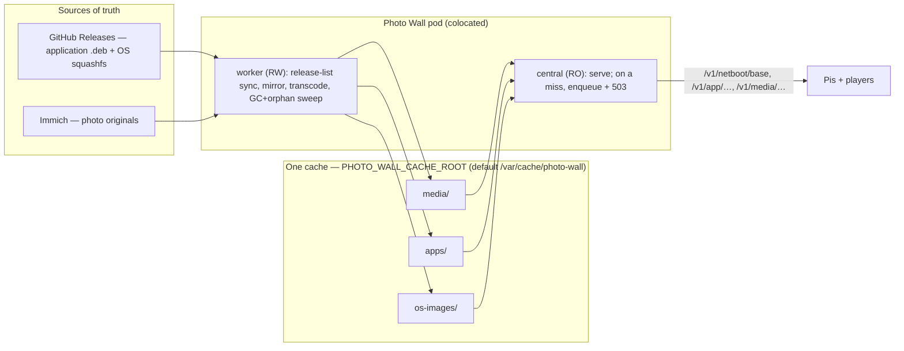

# 0013 — Central's served assets are one cache

**Date:** 2026-09-21
**Status:** Proposed. `docs/decisions/` is the owner-authority record; this is the
design and the ruling it asks for, and it supersedes the chat thread that produced
it. It has survived a four-lens correctness/security review and **two** rounds of
requirements-compliance attack against the 16 owner requirements; v10 corrects the
round-2 findings — a would-be deletion of the GitHub mirror's own recorder, an
incomplete miss-tolerance, a missed activation gate, an inverted withdraw sweep, and
an under-booked telemetry subsystem — see [How the design got here](#how-the-design-got-here).
Nothing else ships beside it.

**What you are being asked:** approve treating Central's on-disk assets as **one
cache** the app owns and Kubernetes places, where **every file is disposable** and
every read regenerates on a miss. This unbreaks netboot (broken now) as Slice 1,
and makes the `.deb` and media stores cache-correct as two follow-on slices. One
precondition needs a live-DB check I cannot run from here (hand-staged `.deb`s,
[decision 5](#decisions-that-are-yours)).

---

## The problem in plain words

- Every Pi netboots by fetching its OS from Central at `GET /v1/netboot/base`.
  Central serves it only with a configured, present, writable base directory.
  Production wired none — every Pi 503-loops. **This is happening now.**
- Central serves three cached asset kinds: photo **media** (cache of **Immich**),
  the Player **application** `.deb`, and the **OS** squashfs (both caches of
  **GitHub Releases**). None is a master copy.
- These live at three independent paths with no shared parent and no image default;
  "capacity isolation" is three PVCs that, on this backend, are three directories
  on one unquota'd export — isolation that does not exist.
- The system does not consistently treat them as caches: base serving regenerates
  on a miss, but **`.deb` and media serving assume the file is present and error**;
  the `.deb` store has **no GC**; and no domain removes filesystem orphans.

What must be true when done (the owner's requirements, verbatim intent): the app
assumes **one** cache directory and derives its layout; **Kubernetes owns
placement**; **any file may vanish at any time and every operation still works** by
regenerating on demand; **every domain is quota-aware with GC and orphan removal**;
all `.deb`s come from **GitHub** with a **periodic release-list sync**; cache
operations have **logging + OTEL**; and release assets are **named precisely and
grouped semantically**.

### The owner's prior decisions this builds on

| Decision | Where | What it fixed |
| --- | --- | --- |
| OS and app version **independently** | 0009 | An app bug cannot force an OS rebuild |
| `.deb` and OS squashfs **mirrored from GitHub Releases** | 0010, 0009 | Central is a cache in front of GitHub |
| OS squashfs served **unsigned**, corruption-checked | 0009 | Home-LAN, no threat model |
| Central runs **read-only rootfs** | workload | Cache writes must go to a mount |
| **GitHub is the sole source of truth for `.deb`s**; hand-staging retired | this design (owner) | Every `.deb` is re-fetchable → a true cache |

### Verified facts about today's code (review + investigation; v0.5.0 / iac `origin/main`)

| Fact | Where | Consequence |
| --- | --- | --- |
| Pi always fetched base from Central; client byte-identical v0.4.0↔v0.5.0 | `appliance/netboot_init.py` | The v0.5.0 bump was orthogonal to the outage |
| Base route 503s unless `PHOTO_WALL_BASE_ROOT` set; workload never set it; iac on v0.4.0 | `central/app.py:185,484`; `iac …:324` | Base wiring is net-new; migrations 018/019 first apply here |
| Worker asserts base dir writable; does not create it | `central/netboot_base.py:183‑195` | Absent → `base_root_missing`; wrong owner → `base_root_unwritable` |
| App reads **three** raw env roots; `PHOTO_WALL_CACHE_ROOT` has **zero** consumers | `media/worker.py:363`; `central/app.py:176‑185`; grep | "App assumes one cache dir" is unmet today |
| Base serve **miss-tolerant**; `.deb` bytes + media serve **assume-present** | `app.py:490‑497` vs `:439‑467`, `media_store.py:807‑838` | `.deb`/media are not caches yet |
| Media serve marks a missing blob **`corrupt`**; `corrupt` has **no requeue path** | `media_store.py:846‑853,341`; `media_repository.py:402‑419` | A miss is misrecorded as integrity failure |
| `.deb` store has **no GC/quota**; base GC + media GC walk **DB rows only** (no orphan sweep) except media `recover` which **does** scan the dir | `app_packages.py` (none); `netboot_base.py:842`; `media_store.py:700‑718` | orphans survive for `.deb` and os-images |
| Release **withdraw** is dead code (`mark_withdrawn` uncalled); no DB-vs-GitHub diff; base doesn't withdraw either | `app_releases.py:355` (0 callers); `app_release_service.py` poll | The "sync" is add-only; withdrawal is net-new for both domains |
| Hand-staging is a live, supported path (`POST /v1/operator/app` → `AppPackages.register` "by reference") | `app.py:700‑718`; `app_packages.py:37` | Retiring it needs itemized deletion + a proof it's unused |
| Boot payload (kernel/initramfs/DTB/config) is TFTP-staged; the squashfs is HTTP-served and **allowlist-extracted from the bundled `.tar.gz`** | `docs/module-pxe-service.md:9,21`; `netboot_base.py:675‑719` | Splitting the release lets the mirror fetch the squashfs directly |
| Cluster NFS = `nfs-subdir-external-provisioner`; sizes unenforced; PVC = subdir of one export; a PVC is **not** populated from the image | `iac …storage.py:6‑8` | No PVC isolation; a PVC mount arrives bare + root-owned |

---

## The answer in one picture



**The three rules that make this hold:**

1. **The filesystem is a cache; the database is intent; every read tolerates a
   miss.** An absent file is normal — the read enqueues a fetch/reprocess and 503s;
   the operation resolves on retry. Correctness never depends on "filesystem
   matches database." (This holds per-domain only once that domain's read path is
   miss-tolerant — see the sequencing rule.)
2. **The app owns the layout; Kubernetes owns the placement.** The app reads **one**
   optional env, `PHOTO_WALL_CACHE_ROOT` (default `/var/cache/photo-wall`), and
   derives `media/`, `apps/`, `os-images/` as **internal constants**. It never reads
   a per-domain path. Relocating one domain onto another medium is a Kubernetes
   `subPath` mount at the fixed in-container path — the app never sees it.
3. **Every domain bounds itself and removes its own orphans.** Each domain has a
   byte budget, a DB-authoritative GC, **and** a filesystem-enumerating orphan
   sweep (unlink files with no DB row). `os-images` has a reserved floor so nothing
   starves netboot. Because reads regenerate on a miss (rule 1), the GC may evict
   anything — eviction is safe by construction. Every eviction, GC pass, orphan
   removal, and miss-driven refetch emits a log line and OTEL metric.

---

## Glossary

- **Cache root** — `/var/cache/photo-wall`; the single env `PHOTO_WALL_CACHE_ROOT`,
  optional, this being its baked default.
- **Domain subdirectory** — `media/`, `apps/`, `os-images/`; derived internally
  from the cache root, never a separate env.
- **Boot payload** — kernel + initramfs + DTBs + `config.txt`/`cmdline.txt`, TFTP-
  staged; a release asset, **not** a Central cache domain. Distinct from the Pi's
  on-device bootloader (`bootcode.bin`/EEPROM).
- **OS** — the squashfs root filesystem, HTTP-served by Central; the `os-images`
  domain.
- **Application** — the Player `.deb`; the `apps` domain.
- **Miss-tolerant read** — on an absent file, enqueue a fetch/reprocess and 503;
  resolve on retry.
- **Release-list sync** — a periodic scan of GitHub Releases that **adds** new
  releases and **withdraws** upstream-deleted ones (net-new for both `.deb` and
  OS).
- **Orphan** — a file on disk with no owning DB row; must be swept.

---

## How the cache stays correct while files vanish (requirements 6, 7)

Rule 1 is load-bearing. Its status per read path, and the work to close it:

| Read path | Today | Work |
| --- | --- | --- |
| OS serve `/v1/netboot/base` | **partially** miss-tolerant — the `cached` flag is a DB row, never a filesystem stat, so a **dangling row (row says `cached`, file gone externally)** 503s forever with no re-enqueue | **Slice 1, end-state (not a crash-race):** on an open-failure of a `cached` row, **re-enqueue the tag and demote the row** at the serve seam, so the next read regenerates. (Also set `base_cache.state` before unlink in GC's txn.) |
| `.deb` per-device manifest | tolerant (metadata) | none |
| **`.deb` bytes** `/v1/app/package/{sha}.deb` | **assumes-present** | on absence: reverse-lookup `app_releases.mirrored_sha256 = sha` → tag → `enqueue_mirror_in(tag)` → 503 |
| **Media serve** `/v1/media/{digest}` | **assumes-present**: post-eviction the row is **deleted** → `blob is None → 404`; a `ready`-row/vanished-file marks the blob **`corrupt`** | requeue on **`blob is None`** (the common post-eviction miss) via the real `evicted→queued` transition (`media_repository.py:419`); AND split `FileNotFoundError` (→ requeue, not corrupt) from a short/mismatched read (→ corrupt); give the serve path a queue handle |

**The sequencing rule (the delivery constraint):** for each domain, **miss-tolerance
lands before eviction**. Enabling a GC on a domain whose read still assumes-present
re-creates the outage. Order forced: make the read regenerate-on-miss → then enable
that domain's GC.

**Honest scope of rule 1 (corrected in round 2):** requirement 6 demands that
*external* disappearance (node eviction, admin delete, backend loss) also self-heal,
not only the app's own GC. That means the **serve seam**, not just the GC, must
regenerate — for os-images this is the dangling-row fix above, in **Slice 1**
(previously mislabeled an interim crash-race). Per domain, an external loss
self-heals only once that domain's serve seam is miss-tolerant: os-images in
Slice 1, `.deb` in Slice 2, media in Slice 3. Between slices, an out-of-band loss
in an unlanded domain still errors — the one disclosed interim cost.

**Invariant, one sentence:** once a domain's slice lands, any file in it may be
evicted or lost at any time and the next read fetches/reprocesses from the source
of truth — slower, never wrong.

---

## How ownership and writability work (requirements 3, 5)

Two start paths; the cache must be writable in both. The distinction is **Docker
volume vs Kubernetes PVC** (Docker populates both named and anonymous volumes from
the image — a probe confirmed; a PVC is not populated).

| Who starts | Dir exists how | Writable how | Result |
| --- | --- | --- | --- |
| Compose, baked `wall`, **no mount** | baked `install -d` | baked ownership (build args) | writable, no boot step |
| Compose, baked `wall`, **Docker volume** | Docker populates from image | baked child ownership | writable, no boot step |
| Kubernetes, **root-start → gosu**, **PVC** | bare + root-owned; not populated | entrypoint `install -d -o PUID -g PGID -m 0700` each subdir, then drops | writable after boot step |

- `PHOTO_WALL_CACHE_ROOT` is **optional**: `ENV` bakes the default and `VOLUME
  ${PHOTO_WALL_CACHE_ROOT}` declares it; **`install -d` precedes `VOLUME`** (writes
  to a declared volume path are discarded); `VOLUME` in the leaf stages only.
- The entrypoint uses `install -d` (atomic owner+mode; non-recursive — the worker
  is the single writer and creates its own files) and a **numeric** zero-uid guard
  (`[ "$PUID" -eq 0 ] && exit 78`) so `00`/`000`/`010` cannot run it as root/wrong
  uid. Build-time `ARG PHOTO_WALL_PUID/PGID` (GID pinned via `groupadd --gid`) with
  runtime `ENV` defaults tied to them.
- Central mounts the cache RO and creates nothing → central serves correctly only
  when colocated with a materializing worker (the single-pod topology guarantees
  it).

---

## Storage, lifecycle, sources of truth (requirements 1, 2, 8, 9, 10, 11, 14)

```
PHOTO_WALL_CACHE_ROOT (default /var/cache/photo-wall)   0700 PUID:PGID   VOLUME
├── media/      variants from Immich     SoT Immich   GC media_store.collect   orphan sweep: recover (exists)
├── apps/       player-app_<sha>.deb     SoT GitHub   GC NEW (slice 2)         orphan sweep NEW
└── os-images/  raspberry-pi-os squashfs SoT GitHub   GC gc_base_cache         orphan sweep NEW
```

- **One env, internal layout (req 1, 4):** the app reads only `PHOTO_WALL_CACHE_ROOT`
  and derives the three subdirs as constants. The per-domain `PHOTO_WALL_{MEDIA,APP,
  BASE}_ROOT` env inputs are **removed** from the deploy contract. The change set is
  **four** readers, not three: `media/worker.py`, `central/app.py`,
  `netboot_base.resolve_base_root`, **and `central/app_release_service.py:108`
  (`AppReleaseService.from_env`)** — the last is the activation gate for release
  sourcing *and* the base-squashfs mirror, so missing it means the worker never
  mirrors the OS (the tracer fails). iac sets only the cache root (or nothing —
  defaulted) and mounts one volume.
- **Opt-in → always-on flip (stated, req 15 spirit):** today release sourcing +
  base serving are opt-in, gated on `APP_ROOT`/`BASE_ROOT` presence (`app.py:189,
  204,715`). With one always-present cache root they become **unconditional** —
  consistent with base-on-by-default. The now-dead `503 release_sourcing_unconfigured`
  branch and the `app_root is None` operator gates are removed/repurposed, not left
  dangling.
- **Quota + GC + orphan sweep, every domain (req 9):** each GC is a **filesystem
  enumeration** — list the domain's files, unlink any whose key has no owning DB row
  (media already does this in `recover`; `.deb` and os-images gain it) — not a
  DB-row walk that ignores orphans. **Sweep invariant (frozen):** "owning row"
  includes in-flight states (`caching`/`mirroring`), and the sweep runs under the
  same single-writer exclusion media uses (`recover`'s writer lock + staging split),
  so it never unlinks a file mid-fetch. `os-images` and `apps` get explicit byte
  **caps** as well as the `os-images` floor — but the cap is **best-effort below the
  keep-set**: `gc_base_cache` never evicts a pinned/known-good tag, so a keep-set
  larger than the cap surfaces an **alarm**, it does not silently overflow.
- **`.deb` GC protect set:** every `app-<sha>.deb` whose sha is
  `app_package_policy.current_sha256`, any non-null `app_releases.mirrored_sha256`
  (per-device via `devices.{attached,known_good,last_served}_tag`), or an in-flight
  mirror (`app_releases.mirror_state='mirroring'`); protect by **sha**, not tag.
- **Release-list sync — add AND withdraw, both domains (req 11/12):** the existing
  poll **adds** (enumerates GitHub, upserts). **Withdrawal is net-new** (the earlier
  "existing machinery" claim was false; `mark_withdrawn` has no real callers). The
  poll-tail sweep diffs **every non-withdrawn DB row that carries an upstream
  identity** (a `mirrored` release deleted upstream is the *primary* withdraw
  target — do **not** exclude it) against the discovered set, **excludes the
  `promoted_tag`/`current_sha256` release**, and calls `mark_withdrawn` on the
  remainder — for **both** `.deb` and OS. It runs **only off a verified-complete
  GitHub enumeration** (never a truncated page set or a 304), or it would
  mass-withdraw live releases. Withdrawal retains `mirrored_sha256`, so a
  withdrawn-but-pinned release's bytes are not stranded (corollary: withdrawal frees
  no bytes — the GC does).
- **GitHub is the sole `.deb` source; hand-staging removed (req 10):** delete only
  the two operator **routes + handlers** `POST /v1/operator/app` (`register_app`)
  and `PUT /v1/operator/app/current` (`promote_app`) (`central/app.py:700‑718`).
  **Keep the methods** `AppPackages.register`/`.promote` — the GitHub mirror and
  `reconcile` call them (`app_release_service.py:352`, `app_releases.py:304`); the
  "by-reference"-ness lives in the operator route (caller-supplied sha/size), not
  the method. A probe asserts `POST /v1/operator/app` → 410 after Slice 1.
- **Release-asset split + naming (req 12, 13, 14) — build/parser scope named:** the
  release ships the **boot payload** (`raspberry-pi-boot_<ver>.tar.gz`, TFTP-staged,
  **not** cached by Central) and the **OS** (`raspberry-pi-os_<ver>.squashfs`,
  HTTP-served, the `os-images` domain) as **two separate assets**; the mirror
  fetches the squashfs **directly** rather than allowlist-extracting it from a
  bundled tarball. The **application** is `player-app_<ver>.deb` (portable, no
  hardware prefix). This touches, concretely: `scripts/package_release_artifacts.py`
  (the actual manifest emitter — not matched by `build_*`), `scripts/build_netboot_bundle.sh`
  (bundle layout), a **`manifest.json` schema bump** + a **`github_releases.py`
  parser rewrite** (today it hard-refuses `schema != 1` and matches assets by
  filename-join, not a role field), `fetch_base` (delete `_extract_squashfs` /
  `TARBALL_SQUASHFS_MEMBER`, download the squashfs directly), and the
  `app_releases.base_tarball_{url,sha256,size}` columns repurposed to the squashfs
  (their sha is documented as the *tarball's*). `manifest.json` declares each asset's
  `role`: `served-http` (OS, application), `served-tftp` (boot payload),
  `provenance` (bootstrapper `.deb`, `SHA256SUMS`, `manifest.json`); the sync matches
  on role. The bootstrapper stays baked into the OS squashfs, never a cache domain.
- **Observability (req 10) — net-new subsystem, costed:** there is **no OTEL/metrics
  seam in `central/` today** (only `logging`). Structured **log fields** on every
  eviction, GC pass, orphan removal, and miss-driven fetch/reprocess ship in the
  slice that adds each op. The **OTEL metrics** (counters:
  hits/misses/evictions/orphans-removed/refetches per domain; gauges: bytes per
  domain vs budget) are their **own bead** — SDK + meter/exporter + a collector
  endpoint in iac — sequenced after Slice 1, not folded into a serving bead. If the
  OTEL bead is deferred, the log fields still satisfy the observability floor in the
  interim (stated cost).
- **No migration, no stopgap (req 15):** two PVCs (media/app) replaced by one
  `cache` PVC; Postgres PVC untouched. Nothing hand-staged remains (pending the
  decision-5 check).

---

## Delivery — three slices, netboot first

Base serve is already miss-tolerant, so netboot lands without the rest. Each later
slice obeys the sequencing rule.

1. **Slice 1 — unbreak netboot (correct, no stopgap).** Image: single
   `PHOTO_WALL_CACHE_ROOT` (optional, baked default) with internal subdir derivation
   across the **four** readers `media/worker.py`, `central/app.py`,
   `resolve_base_root`, **`app_release_service.from_env`**; make release-sourcing +
   base serving **unconditional** (remove the dead `app_root is None` gates/503);
   remove hand-staging **routes** (keep the methods; 410 probe); os-images serve-seam
   **dangling-row self-heal** (re-enqueue+demote); os-images orphan sweep + floor
   **and cap** + alarm; `ARG PUID/PGID` (GID pinned); `install -d`; `VOLUME` (leaf
   stages); rewritten entrypoint (numeric guard); structured cache-op log fields.
   `compose.yaml` remount at the cache root. base-serving on by default. **Test/script
   surface to update in-slice:** `tests/test_app_release_tasks.py` (rewrite to the
   always-on activation model), `tests/test_entrypoint.py`, the netboot tracer/e2e
   tests, `scripts/demo_wall.py`, and iac `tests/workloads/test_photo_wall.py`. iac:
   one `cache` PVC, one env (or default), tag bump. **Pis netboot.**
2. **Slice 2 — `.deb` becomes a true cache + release restructure.** `.deb` bytes
   route miss-tolerant; the **withdraw** half of the release-list sync (both
   domains); split the release into `raspberry-pi-boot` + `raspberry-pi-os` +
   `player-app` with the `manifest.json` role contract (a build/CI change:
   `scripts/build_*`, `.github/workflows/base-image.yml`), and the mirror fetching
   the squashfs directly; **then** the `.deb` GC + orphan sweep + budget. Order
   enforced. Observability on all of it.
3. **Slice 3 — media serve cache-correct.** Serve-time regeneration: distinguish
   miss (`FileNotFoundError` → requeue) from corrupt; add the `queued` transition;
   wire the serve path to the media job queue. Cost: a cold-photo fetch can block on
   an Immich re-download + re-transcode — acceptable under the posture.

---

## Decisions that are yours

| # | Question | Recommendation | Cost | Alternative |
| --- | --- | --- | --- | --- |
| 1 | Three slices, netboot (Slice 1) first? | **Yes** | Netboot ships before `.deb`/media are cache-correct; Slice 1's `apps` cap (pre-GC) means a full `apps/` blocks new `.deb` mirroring, not netboot (the floor protects os-images) | One big change — slower, larger review |
| 2 | Budgets: caps + floor (placeholders) | media cap 50Gi / apps cap 8Gi / **os-images floor 4Gi + cap 12Gi**, one 75Gi `cache` PVC | Nominal on this backend; real once app-enforced | Global LRU, no floor — a burst can stall netboot |
| 3 | Single `PHOTO_WALL_CACHE_ROOT` (optional, defaulted), retire the three per-domain env roots | **Yes** — required by owner reqs 1/3/4 | An app-code change (worker/central/`resolve_base_root`), not just Dockerfile | Keep three roots — but then k8s owns layout and the requirement is unmet |
| 4 | Withdrawal sync is **net-new for both `.deb` and OS** | **Build it** (poll-tail DB-vs-GitHub diff → `mark_withdrawn`) | Slice 2 grows; base gets withdrawal it never had | Add-only sync — but req 11 ("keep the list in sync") is then unmet |
| 5 | **Retire hand-staging** — needs proof no promoted sha is hand-staged (no GitHub release) | **Verify via a live-DB query first**, then delete the routes | I **cannot run this from the sandbox** (CI/DB boundary); it's a precondition you or CI must clear | Keep hand-staging as a declared non-cache subset (rejected — a sticky file in the cache root violates reqs 6/8) |
| 6 | Base-serving on by default | **Yes** — resolved | Cache-less deploy shows `base_root_missing` | Keep opt-in |

### Assumptions — say so if any is wrong

1. No data to migrate (existing media/app PVCs hold only regenerable cache).
2. `/var/cache` is the right FHS home.
3. Domain names `media`/`apps`/`os-images` are the accepted internal contract.
4. uid/gid 10001 default; overrides are a build-arg convenience.
5. Central mounts the cache read-only.
6. Compose stays supported, updated in lockstep.

---

## Deliberately out of scope

**Deferred (same design):** the `subPath` override peeling a domain onto another
medium; a global cross-domain LRU.
**Non-goals:** signing assets (0009); per-volume storage quotas (bounding is the
app's GC); Pi client / initramfs changes; a stopgap or data migration.

---

## What can go wrong

Strength ladder: **construction** > **transaction** > **decision** > **test** >
**convention** > **documented**.

| Failure | Behaviour | Strength |
| --- | --- | --- |
| Cache root env unset | Baked `ENV` default; app derives subdirs internally | construction |
| PVC subdir missing/root-owned | `install -d -o -g -m 0700` before drop | construction + decision |
| Non-canonical zero uid | Numeric guard rejects it | decision |
| App learns a per-domain placement | Impossible — app reads only `CACHE_ROOT`, subdirs are constants | construction |
| Evicted/lost file requested (post-slice) | Read enqueues fetch/reprocess + 503; resolves on retry | decision |
| Media miss mis-recorded as corrupt | Slice 3 splits `FileNotFoundError` from integrity failure | decision |
| Orphan file (no DB row) | Filesystem sweep unlinks it, per domain | decision |
| `apps/` unbounded | Cap + `.deb` GC (slice 2); floor protects `os-images` meanwhile | decision |
| Upstream-deleted release lingers | Withdraw sweep marks it withdrawn (both domains) | decision |
| Hand-staged sticky `.deb` | Removed (decision 5 precondition) | construction, once verified |
| Cache op invisible | Log line + OTEL metric on every eviction/GC/orphan/refetch | decision |

---

## How the design got here


- **v1→v8:** tag bump orthogonal; one app-owned cache root; false Docker claim
  corrected to PVC semantics; `install -d`/numeric guard; strict cache posture
  (files disposable, correctness from miss-tolerance); three slices.
- **v8→v9, what the requirements attack changed (7 reqs were unmet):**
  - Req 1/4 — the app still read **three** env roots; `CACHE_ROOT` was decorative →
    single env, internal subdir constants, retire per-domain roots (app-code change).
  - Req 6/8 — a hand-staged `.deb` is sticky and un-refetchable → hand-staging
    **removed** and its emptiness made a **verified precondition**, not an
    assumption.
  - Req 7 — media serve **marks-corrupt** on absence → split miss from corrupt, add
    the missing requeue transition.
  - Req 9 — GCs walked **DB rows only** → filesystem **orphan sweeps** per domain;
    os-images gains a byte **cap**.
  - Req 11 — the **withdraw** path is dead code and base doesn't withdraw either →
    designed as **net-new for both domains**; false "existing machinery" claim
    corrected.
  - Req 10 (obs) — added logging + OTEL across eviction/GC/orphan/refetch.
  - Req 13/14 — precise, hardware-aware names (`raspberry-pi-boot`/`-os`,
    `player-app`) and the **boot-payload / squashfs split** into two assets, mirror
    fetching the squashfs directly.

- **v9→v10, what round 2 changed (fixes in the fixes):** keep `AppPackages.register`/
  `.promote` (the GitHub mirror's own recorders) and delete only the operator routes;
  add the fourth env reader `from_env` and state the **opt-in→always-on** flip;
  req 6 needs the **serve seam** to self-heal a dangling `cached`-row/absent-file in
  Slice 1 (not an interim crash-race); req 7 media requeue must fire on `blob is
  None`, not only `FileNotFoundError`; the withdraw sweep target is the `mirrored`-
  but-upstream-deleted rows (the earlier "non-frozen" wording excluded them),
  excluding promoted/current and gated on a complete fetch; OTEL is a **net-new
  costed bead** (no seam exists), with log fields as the interim floor; the release
  split names `package_release_artifacts.py`, the manifest schema bump + parser
  rewrite, and the `base_tarball_*` column repurposing.

**What survived every attack:** app owns layout, k8s owns placement (now by
construction); boot step mandatory under Kubernetes; collapsing roots widens blast
radius by nothing; no path traversal; `VOLUME` doesn't break the RO rootfs; GID pin
closes a real gap; the cache posture makes eviction safe by construction.

---

## What happens after the gate

Per `implementation-workflow`: cut Slice 1 as vertically-green beads (image →
entrypoint → compose → workload), tracer first, one full verify per bead; Slices 2
and 3 follow, each honoring the sequencing rule.

**Specs touched:** this decision; `docs/module-cache.md`; `docs/architecture.md`;
`docs/module-pxe-service.md`, `docs/module-appliance-release.md`, `docs/runbook.md`.

**Tracer bullet — one Pi netboots green (Slice 1):**

- **Setup:** deploy the new image + one empty `cache` PVC, no cache env set (default
  applies). Worker boots.
- **Path:** entrypoint `install -d os-images` → worker asserts writable → mirror the
  current OS squashfs → a Pi requests `/v1/netboot/base` with its serial → 200 +
  `Digest` → Pi overlay-mounts → the wall.
- **Refusals, each recorded (log + OTEL):** dir absent → `base_root_missing`,
  `ok=false` at `/v1/operator/netboot`; wrong owner → `base_root_unwritable`; bytes
  not mirrored → 503, no last-served record.
- **Mutation probes that must turn a test red:**
  1. Remove `install -d os-images` → boot on empty PVC fails `base_root_missing`.
  2. `install -d` owner `PUID+1` → assertion fails `base_root_unwritable`.
  3. Set a per-domain root env → it is **ignored** (app reads only `CACHE_ROOT`);
     asserts the retirement.
  4. Boot with **no** per-domain env at all → the periodic poll + OS mirror run
     (asserts release-sourcing is now *live/unconditional*, not merely that stale
     env is ignored).
  5. Drop an orphan `os-images/base-XXXX.squashfs` with no DB row → the orphan sweep
     unlinks it.
  6. Delete a `cached` squashfs file out-of-band (row still `cached`) → next serve
     re-enqueues + demotes and 503s transiently, then self-heals (the req-6
     dangling-row fix), rather than 503ing forever.
  7. `POST /v1/operator/app` → 410; but a GitHub-mirrored `.deb` still lands
     (asserts `AppPackages.register` was **kept**).
