# 0015 — Player base layer and the health overlay

**Date:** 2026-10-04 · **Layer:** system design (layers, supervision, health model, technology choices) · **Status:** Owner-reviewed at this layer; the gate closed on 2026-10-04 after five review rounds. Nothing here is built yet. Every design choice below stays revisable: the requirements are the owner's hard rules, the choices are the current answers to them.

Briefing reviewed by the owner (private to the owner): <https://claude.ai/artifact/V39dLhUzAwhyMhafaDAx2v>

## Problem

On 2026-10-04, after display handoff, a Player's readiness stopped and the console showed `player-silent`. The process stayed alive, kept re-tagging its last frame, and so kept its display lease and the Output; host CPU and SoC temperature climbed; nothing on the node or in Central acted. The [Player architecture](../player-architecture.md#observed-gaps) records why: the app has no restart or watchdog (G1, G2), its control loop can starve while it still paints (G3, G4, G8), no rule acts on host facts or `player-silent` (G5, G6), nothing measures app progress (G9), and the base diagnostic page is withdrawn at handoff. The wall looked healthy and was not.

## Requirements (hard rules)

| ID | Requirement | Source |
|---|---|---|
| R1 | The health overlay is on early in OS boot and shows any and every time the node is unhealthy, saying what is wrong. | Owner 2026-10-04 |
| R2 | It covers at least: app package download or prepare fails; the node cannot reach Central; the app is unresponsive. | Owner 2026-10-04 |
| R3 | The overlay is among the lowest OS layers, tied into management, oversight and watchdogs. | Owner 2026-10-04 |
| R4 | App **packages** unload and are replaced online without affecting the base Central channel or the overlay. The app framework (loader, sandbox, supervisor) ships with the base. | Owner, rounds 1–2 |
| R5 | Plug-and-play PXE; Players are Immich-unaware and get media only from Central. | [requirements](../requirements.md#player-provisioning) |
| R6 | A 4 GB Pi 5 is supported. | Owner 2026-10-03 |
| R7 | Never compare clocks across systems; trust Player identity. | Owner |
| R8 | V2 node path only. App restarts never give up: growing delays like base units, `app_failed` raised when the budget is spent, restarts continuing at the maximum delay. **After handoff** no automatic reboot for any fault, including a wedged display pipeline: kernel-console text plus a report, and a person power-cycles. Two reboots stay: the hardware watchdog for a hung kernel or PID1, and stage 1 restarting itself on a failed phase before handoff ([0014](0014-reaching-central-from-every-boot-stage.md)). | Owner, rounds 2, 4, 5 |
| R9 | Distinguish acquired, ready, capacity, commitment and observed output; a heartbeat is never proof of pixels. | [AGENTS.md](../../AGENTS.md) |
| R10 | Every fault shows the health overlay: full-screen, semi-transparent, content visible underneath. Intentional states are never faults. Mute comes from Central only, is time-limited and ends on reboot; an app can never mute. Changes "preserve output through an outage" to "keep output, but overlaid". | Owner 2026-10-04 |

Working definitions the owner adopted: **unhealthy** is the node's own judgement that a named fault held past its window; Central may add a fault, never clear a locally seen one. **App unresponsive** is no progress through the real work path within N s; presented frames are not progress. **Cannot reach Central** is no successful exchange past a window on the node's monotonic clock: short while no live grant exists, longer once one does.

Desired-versus-observed state is a design steer, not a requirement (owner 2026-10-04).

## Shape (current choice)

```mermaid
flowchart TB
    subgraph L0[L0 Base OS: netbooted, read-only]
        PID1[systemd PID1: earned watchdogs restart, never reboot]
        KC[kernel console: text while the compositor is down]
    end
    subgraph L1[L1 Base services]
        SO[Screen owner: Weston + shell<br/>guard, tint, dim in place, fixed deadlines]
        OR[Overlay renderer: slate, card]
        HV[Health controller: THE verdict]
        HC[HostCore: host facts]
    end
    subgraph L2[L2 App framework, base-owned]
        BR[Broker: lifecycle, kill, restart]
        AM[App Manager: background prepare]
    end
    subgraph L3[L3 App package: buggy guest]
        APP[Player app]
    end
    PID1 --> SO & HV & HC & BR & AM
    SO --> OR
    BR -- compositor fd + challenge fd --> APP
    APP -- challenge answers --> HV
    SO & HC & BR -- facts --> HV
    HV == one verdict ==> SO
    HV == verdict, conditions, ring ==> C[(Central)]
    C -- intentional state, dark windows, mute, rollback --> HV & BR
```

## Current design choices (revisable)

| Concern | Current choice | Prior art |
|---|---|---|
| Layers | L0 base OS; L1 base services (screen owner, overlay renderer, health controller, HostCore); L2 app framework (broker, App Manager), base-owned; L3 the app package, a buggy guest with its own Player enrollment and no base credential | balenaOS, Fuchsia capability routing |
| Screen owner | Weston and the Photo Wall shell stay the owner; no DRM-lease inversion (owner answer) | Weston kiosk-shell |
| Verdict | One sequenced verdict per node, computed only by the health controller, per Output: underlay (live, held, slate, intentional) and overlay (off, on with fault ids and card strings, muted). The screen owner renders it; the same verdict goes to Central | Kubernetes kubelet status |
| Fault catalogue | One stdlib-only data module in `contracts/`: code, display-affecting flag, household line, raise/clear class. The verdict carries the card strings, so the C overlay never reads it; Central serves it to the console, folding in today's console code lists | systemd journal message catalog |
| Fault | The node cannot show that this Output presents current authorized content. A failed background prepare of a new version is not a fault (Q2) | — |
| Conditions vs events | Conditions (instance id, code, age) are sent the moment they are pending; events (restart, kill, prepare attempt, rollback) never raise the overlay. Both go in a bounded transition ring Central acknowledges by sequence | Kubernetes Conditions and Events |
| Raise/clear | Per-class windows and hold-downs from the catalogue; the Central window is short with no live grant, longer with one (up to the ~5 min authority lease); Central may add a witness fault from base-reported evidence | Prometheus pending/firing |
| Health overlay | Full-screen solid-colour tint at partial alpha plus a small opaque two-line card: a household line, then code, Player id and Output id; no asset, Scene or host names. No corner badge (owner declined) | Android ANR dialog over a dimmed app |
| Built-in fallback | When the verdict or renderer is late the shell draws a colour tint and a short code itself, never opaque over adopted live content | BIOS POST codes |
| Shell deadlines | Fixed mechanical constants in the base (verdict staleness, renderer deadline on `overlay_presented`, stuck repaint); the verdict never sets them | Hardware watchdog timeouts |
| Progress challenge | A controller-issued nonce on the app's own challenge fd, answered from its control queue and timed by the controller; never on the compositor connection | Android ANR input-dispatch timeout |
| Held view | A revoked app's own view, dimmed in place (no snapshot), bounded by the broker killing it after K s unresponsive and by process death; never reported as content shown | Windows "Not Responding" ghost |
| Holding slate | When nothing valid exists the underlay is the base's own page with the device id, never black; black is only authored or intentional darkness | — |
| Compositor hang | `Type=notify` with `WatchdogSec`; the pet is withheld only while a repaint is pending past T | Chromium GPU watchdog |
| Restart backoff | `Restart=always`, `RestartSteps=`, `RestartMaxDelaySec=` (systemd 257), `StartLimitIntervalSec=0`, reset after a stable period; the broker applies the same shape to the app and raises `app_failed` at the budget; never a reboot | Kubernetes CrashLoopBackOff |
| No reboot after handoff | Meets R8: `OnFailure=` writes fault text to the kernel console while the display server is down; the two retained reboots stay in L0 | ChromeOS frecon |
| Controller restart | The shell keeps grants and the last verdict; a new controller takes a higher epoch and adopts live grants, older epochs are refused; the broker re-passes its dup of the challenge fd | Lease epochs (Chubby), kubelet re-adoption |
| Local re-admit | After a small glitch, re-admit locally when grant epoch, app process and desired revision are unchanged and the authority lease is unexpired; otherwise Central re-grants | — |
| Memory pressure | The background prepare is the first victim: abort, delete staged files, report an event; the app is no longer killed first | Android lmkd |
| Failed trial app | Central rolls the desired app back to the accepted release; the broker switches online. A switch or rollback is intentional only until first admission or a prepare or launch failure | Mender, A/B accepted/candidate |
| Dark windows | Central pre-sends upcoming dark periods as offsets and durations, timed on the node clock, so an offline night stays dark | — |
| Mute | Held only in the controller's memory; covers only the codes present when set; ends on expiry, reboot or controller restart; faults still reach Central | — |

## Design rules (design choices)

1. **One judge, one vocabulary, one fail-closed guard.** Only the health controller computes the verdict, from the one catalogue. The screen owner holds no policy: only grants, the last verdict and fixed deadlines. It stops counting a lapsed app, dims it, and shows its own tint and code when the verdict goes stale.
2. **Every proof is earned on the path it guards.** A pet, lease renewal or challenge answer counts only when the supervised work is not stuck. A dispatch loop being alive is never progress.
3. **Authority flows down as capabilities, one per process.** Each base process holds one Central session. The app gets a compositor fd, a challenge fd and its own enrollment; it cannot mute, declare an intentional state or clear a fault.

## Costs

| Cost | What it means |
|---|---|
| The wall is slower than the console | Raise windows show unflagged content while a fault is pending (up to the long Central window); hold-downs keep a recovered wall tinted; console-only conditions never reach the wall. |
| Correct content gets tinted | R10 by design; a full-screen alpha blend runs every frame over video on the Pi 5, and a tinted photo annoys a household. |
| No reboot after handoff | A wedged GPU or display pipeline that restarts cannot fix stays dark or frozen until a person power-cycles; tension with U1 and U2. |
| The challenge needs app cooperation | Guarantee strength is a test (idle-starved stub) plus a guest-contract convention; wrong pixels with a live control path go undetected; a still-rendering app can change pixels beneath the dim for up to K s. |
| More C state in the shell | Grants, last verdict, epoch fence, dimming, built-in tint, pending-work watchdog; a bug there blanks or exposes Outputs. |
| One catalogue couples releases | A new code is a `contracts/` change deployed Central-first; a long offline period drops the oldest ring entries (counted). |
| An app that never recovers restarts forever | At the maximum delay, with `app_failed` on the wall until a rollback or a person acts. |
| Scope beyond the node | Central (witness codes, ring acks, rollback, dark windows, catalogue) and the console (catalogue fold-in). |

## Deferred

| Item | Cost of deferring |
|---|---|
| Per-boot base key | Base sessions stay bearer-by-identifiers: anyone who knows serial, offer id and boot id can supersede one. Acceptable for a buggy, not hostile, app. |
| Crash-buffer (pstore) reboot evidence | The reason a boot ended is lost; only a hung kernel or PID1 or a failed stage-1 phase reboots. |
| Log shipping and on-fault capture (log tail, stack) | The console says what and for how long; "why" needs a person at the box. |
| Console mute controls | Mute exists on the wire only. |
| Physical pixel evidence (camera, HDMI) | "Presented" stays the strongest proof of pixels. |

**Not planned:** containing a hostile app; replacing Weston; online replacement of the app framework; judging what pixels mean; automatic reboot after handoff; snapshotting a held frame.

**Assumption:** the authority lease is about 5 minutes; the long Central window is set against it at the module layer.

## Documents to amend when this lands

Not edited yet: each amendment lands with the implementation that makes it true.

| Document | Today | Amend to |
|---|---|---|
| [requirements](../requirements.md#central-authority-and-stateless-players) line 29 | A running Player preserves authorized output through an outage | R10: output is kept but overlaid once the Central window passes |
| [requirements](../requirements.md#failure-visibility-and-recovery) U1, line 37 | An error page on failure | The holding slate is that page; kernel-console text while the compositor is down |
| [execution contract](../execution-contract.md#failure-behavior) line 148 | Preserve visible output while the lease permits | Same as R10 |
| [execution contract](../execution-contract.md#netboot-stage-1-boot-data-the-clock-record-and-liveness) line 134 | Provisioning unit reboots after 10 exits | Stale V1 claim (G11): no node unit reboots on a start limit |
| [4 GB memory design](../node-4gb-memory-design.md) R8, line 74; line 144 | No app restart; start limits; app is the OOM victim | R8 as above; backoff that never gives up; prepare is the first victim |
| [display host backend](../display-host-backend.md) lines 79–81 | Controller restart invalidates grants | Epoch-fenced adoption by the new controller |
| [Player service module](../module-player-service.md) line 13 | Player liveness via `player.service` `WatchdogSec=300` | Stale V1 claim (G10): replaced by the progress challenge |

## Next gates

1. **Module layer:** the fault catalogue (codes, household lines, classes, display-affecting flag) and console fold-in; the guest contract (compositor fd, challenge fd); the verdict function; the condition/event wire and ring; the controller epoch protocol and challenge-fd re-pass; the unit and app supervision table; rollback and dark-window messages; all values (windows, K, T, budgets).
2. **Delivery**, starting with the tracer bullet: an idle-starved stub app in a `node_pid1` scenario keeps committing re-tagged buffers while its control queue never runs. The challenge goes unanswered; the controller raises `app_unresponsive` (pending, then raised, in the acked ring); the shell dims the app in place; the renderer draws the tint and card and meets its deadline on `overlay_presented`; after K s the broker kills and restarts the app (slate beneath the tint), and the fault clears after fresh answers and its hold-down. This proves rules 1 and 2 on the incident's failure class.

## History

2026-10-04: two shapes drafted (compositor-owned, base agent) and three adversarial reviews synthesized into one; owner answers rounds 1–2; gate answers Q1–Q5 (per-class windows, no overlay for a background prepare failure, Central witness, backoff that never gives up, held view dimmed and bounded); round 4, five specialist reviews and the owner's answers (full-screen tint with a card, no reboot, short Central window on first boot); round 5, re-review fixes and the owner's trims (base key and crash evidence deferred, R8 narrowed to after handoff, built-in page simplified). Gate closed.
