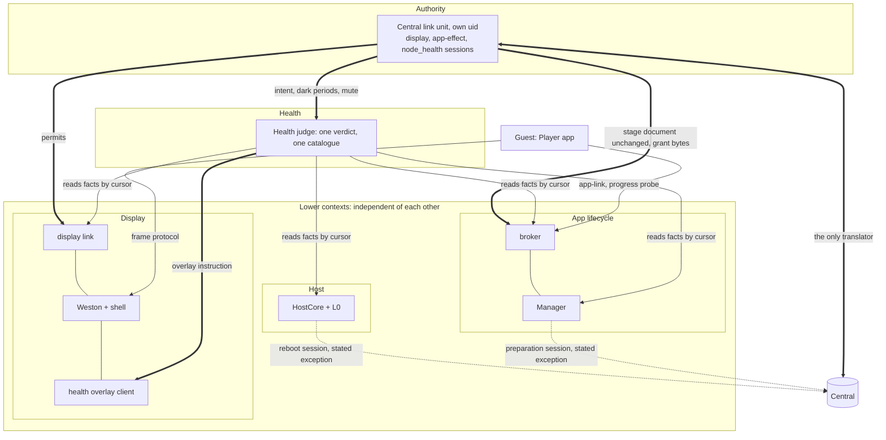

# 0015 — Player base layer and the health overlay

**Date:** 2026-10-04 · **Layer:** system design (bounded contexts, dependency direction, supervision, health model, technology choices) · **Status:** Owner-accepted at this layer on 2026-10-04 after eight revisions (r8): "It looks reasonable, and if it has the right domain breakdown then future iteration will be simpler." Nothing here is built yet. The requirements are the owner's hard rules; every design choice below stays revisable.

Briefing reviewed by the owner (private to the owner): <https://claude.ai/artifact/V39dLhUzAwhyMhafaDAx2v>

## Problem

On 2026-10-04, after display handoff, a Player's readiness stopped and the console showed `player-silent`. The process stayed alive, kept re-tagging its last frame, and so kept its display lease and the Output; host CPU and SoC temperature climbed; nothing on the node or in Central acted. The [Player architecture](../player-architecture.md#observed-gaps) records why: no app restart or watchdog (G1, G2), a control loop that starves while it still paints (G3, G4, G8), no rule acting on host facts or `player-silent` (G5, G6), nothing measuring app progress (G9), and a base diagnostic page withdrawn at handoff. Two processes also mix Central I/O with local actuation: the display controller's Central worker sits beside the only shell connection, and the broker makes blocking Central calls between app-link proofs (N8).

## Requirements (hard rules)

| ID | Requirement | Source |
|---|---|---|
| R1 | The health overlay is on early in OS boot and shows any and every time the node is unhealthy, saying what is wrong. | Owner 2026-10-04 |
| R2 | It covers at least: app package download or prepare fails; the node cannot reach Central; the app is unresponsive. | Owner 2026-10-04 |
| R3 | The overlay is among the lowest OS layers, tied into management, oversight and watchdogs. | Owner 2026-10-04 |
| R4 | App **packages** unload and are replaced online without affecting the base Central channel or the overlay. The app framework (loader, sandbox, supervisor) ships with the base. | Owner, rounds 1–2 |
| R5 | Plug-and-play PXE; Players are Immich-unaware and get media only from Central. | [requirements](../requirements.md#player-provisioning) |
| R6 | A 4 GB Pi 5 is supported. | Owner 2026-10-03 |
| R7 | Never compare clocks across systems; trust Player identity. | Owner |
| R8 | V2 node path only. App restarts never give up: growing delays like base units, `app_failed` raised when the budget is spent, restarts continuing at the maximum delay. No automatic reboot for any fault the overlay can show, including a wedged display pipeline: kernel-console text plus a report, and a person power-cycles. **Three reboots stay:** (a) the hardware watchdog for a hung kernel or PID1; (b) the kernel hung-task panic (120 s in D state); (c) stage 1 restarting itself on a failed phase before handoff ([0014](0014-reaching-central-from-every-boot-stage.md)). (a) and (b) can fire after handoff; the reason a boot ended is not kept. | Owner, rounds 2, 4, 5, r6 review |
| R9 | Distinguish acquired, ready, capacity, commitment and observed output; a heartbeat is never proof of pixels. | [AGENTS.md](../../AGENTS.md) |
| R10 | Every fault shows the health overlay: full-screen, semi-transparent, content visible underneath. Intentional states are never faults. Mute comes from Central only, is time-limited and ends on reboot; an app can never mute. Changes "preserve output through an outage" to "keep output, but overlaid". | Owner 2026-10-04 |
| R11 | Client-first: prefer Wayland/Weston **clients** (Python) and **stock** compositor and systemd features. New C in the shell plugin only where no client-side path exists, kept minimal, every C change covered by its own CI test. | Owner 2026-10-04 (after module-layer reviews) |

Working definitions the owner adopted: **unhealthy** is the node's own judgement that a named fault held past its window; Central may add a fault, never clear a locally seen one. **App unresponsive** is no progress through the real work path within N s; presented frames are not progress. **Cannot reach Central** is no successful exchange past a window on the node's monotonic clock. Desired-versus-observed state is a design steer, not a requirement.

## Shape (current choice): five bounded contexts

An arrow means "depends on". Facts flow up on each publisher's bounded **feed read by cursor** (as today's display event feed), so a publisher never knows its readers. The Central link carries exactly three feeds to Central: the display link's (`display_host`), the broker's (`app_effect`, including signed app-link records) and the judge's (new producer `node_health`).

| Context | Owns | Hosted by | Never |
|---|---|---|---|
| Display | Pixels on each Output: grants, presentation lease, slate, health layer, fallback tint, permits as applied, overlay instructions | Weston + shell (C); display link (Python, the only shell connection); health overlay client (Python, shell-spawned) | Central; fault codes or the catalogue |
| App lifecycle | The app process and packages: launch, restart budget, progress probe and its constants T, k, K, kill, switch, rollback, prepare, local app-link acceptance | Broker (root, local-only loop); Manager | Pixels; verdicts; Central, except the Manager's preparation read |
| Host | The machine: host facts, boot stages, base unit states, operator reboot | L0 + HostCore | Pixels; verdicts; the app |
| Health | Judgement: faults, conditions, events, catalogue, windows, intent, dark periods, mute, the verdict | Health judge unit (new) | Central I/O; a shell connection; launching or killing |
| Authority | Central's word on the node, both ways (an anti-corruption layer): sessions, permits, stage documents, intent, feed delivery and ack cursors | Central link unit (new, own uid), built from today's display Central worker and the broker's Central calls | Drives the shell; launches an app; judges; rewrites a stage document |

**Dependency rules.** (1) Lower contexts know nothing above them and nothing of each other. (2) Health reads facts and writes Display's overlay instruction, with card lines already rendered from the catalogue. (3) Authority alone knows Central. Two stated exceptions: HostCore's reboot session (a separate credential by the fleet model), and the Manager's read-only preparation session, which reads Central's stage command to choose what to **prepare**, never what runs.

| How each rule is held | Mechanism | Strength |
|---|---|---|
| Dependency direction among node Python contexts | New import-linter `layers` contract `authority > health > (display \| app_lifecycle \| host)`; the guest keeps its `forbidden` contract | Lint (CI) |
| Display never reads the catalogue | `forbidden` contract on the catalogue module | Lint (CI) |
| No HTTP or session code outside Authority | `forbidden` contract, HostCore's and the Manager's modules the two named exemptions | Lint (CI) |
| `K > k·T + raise window + D` (the card always shows before the kill) | The judge reads T, k, K from App lifecycle, D from Display, the window from the catalogue and refuses to construct otherwise; CI test with a too-small-K mutation | Construction + test |
| Display link, broker and judge cannot reach Central | `RestrictAddressFamilies=AF_UNIX` on their units | Boot |
| Only Authority hands out permits and stage documents | Central link under its own uid; display link and broker check the kernel peer uid | Boot |
| The shell holds no health policy | Its private protocol has no message carrying a verdict or code; shell CI test | Protocol shape + test |
| Feeds are not bypassed | Read by cursor | Convention |
| The guest answers probes from its control queue | Real-Player starvation leg, mutation-probed | Test + guest-contract convention |

## Central link and permits

| Path | Current choice |
|---|---|
| Admission | The Central link checks what belongs to Central (producer, request, lifetime) and hands the display link a **permit**: which app run (process, app epoch, config revision) may hold which Output (connector, mode, compositor incarnation) in which stage, until when. The display link checks what belongs to the screen and drives the shell. |
| Lifetime | A permit expires on the node clock (Central's duration added to the node's own sampled time; no clocks compared). Expiry bounds re-admission only: a live admission is never ended by expiry, so output survives a Central outage (overlaid per R10). |
| Per app run | A permit is bound to one app run; a restarted app always waits for a fresh permit (Q9). |
| Local re-admit | Permits live in `/run`. After a shell revoke (5 s lease lapse, or the reconnect after a display-link restart) the display link re-admits the same app run under an unexpired permit, with no Central round trip. |
| Stage | Central's stage document passes through the Central link byte for byte; the root broker re-verifies its binding to its own boot, offer and producer, so the unprivileged link carries but cannot widen it. |
| App link | The broker answers the Player's identity proof "accepted" on local kernel evidence and never waits on Central; the signed record rides its feed; a Central refusal becomes a console-only condition. The result changes from "recorded" to "accepted": a versioned guest contract. |
| Restart isolation | Central link and judge restarts touch no Output and no app; a display-link restart blanks to the slate for its restart plus a re-handoff. |

## Health overlay mechanics (R11)

| Concern | Current choice | Prior art |
|---|---|---|
| Drawing | One Python overlay client (`pywayland` + `pycairo`) replaces `diagnostic-client.c`, spawned at the same path. It draws the holding slate (device id) and, per overlay instruction, a full-screen translucent tint plus a small opaque two-line card: a household line, then code, Player id and Output id. No asset, Scene or host names; no corner badge | Weston helper clients; Android ANR dialog |
| New protected layer | A **health layer** role per Output above the slate, untouched by handoff and `invalidate()`: one request on the private manager and one new interface | No stock Weston 14 protocol stacks one client above another |
| Fallback tint | The shell's own per-Output tint whenever no overlay client is bound after handoff, even when healthy; dropped when one binds | BIOS POST codes, ChromeOS frecon |
| Stale instructions | No fresh instruction within V: the client shows Display's own fixed "health status unavailable" card (no catalogue code) | — |
| C budget | About 80–100 lines new C in `shell.c` (health layer ~45, fallback tint ~30, raised `oom_score_adj` for the client ~5) plus ~12 lines protocol XML; the C diagnostic client (215 lines) is removed. A new headless-Weston CI job asserts tint above the app, no foreign bind, fallback tint on client death, trial events unchanged; mutation-probed | — |
| Held app | No dim operation: the tint over the still-mapped app is the dim; bounded by the 5 s lease and the broker's kill | Windows ghost window |
| Compositor hang | Stock `systemd-notify.so` loop pet; a **repaint pulse** (one small commit per instruction serial, `wp_presentation` `presented`) sends `WATCHDOG=trigger` if nothing is presented within D | Chromium GPU watchdog |
| Compositor-down text | `ExecStopPost=+` writes the fault to tty1; the unit sets `TTYReset=no`, `TTYVTDisallocate=no` | ChromeOS frecon |
| Memory | Client buffers capped at 128 MB; an OOM in Weston's cgroup takes the client, never Weston | Android lmkd |

## Faults, conditions, events: one catalogue

| Term | Meaning |
|---|---|
| Fault | The node cannot show that this Output presents current authorized content (a design choice). A display-affecting catalogue condition, raised after its per-class window, cleared after its hold-down. Every fault shows the overlay. |
| Condition | A named state holding now (instance id, code, age on the node clock), sent to Central the moment it is pending. Non-faults (new-version prepare failed, host hot, refused app link) stay console-only. |
| Event | Something that happened once (restart, kill, prepare attempt, rollback, local re-admit), on its owner's feed; never raises the overlay. The judge's bounded transition ring holds every raise and clear, acked by sequence on the existing `NodeEventV2`/`NodeSnapshotV2` wire. |
| Fault catalogue | One stdlib-only data module in `contracts/`: code, display-affecting flag, household line, raise/clear class and window. On the node only the judge reads it; Central serves it to the console, folding in today's console code lists, `base_status` faults, boot-stage tokens and host thresholds. |
| Verdict | The judge's one sequenced object per node: per Output, the underlay (live, held, slate, intentional) and overlay (off, on, muted). Projected as overlay instructions and as conditions plus the ring. Central's observed output requires presented AND underlay live. |
| Central window | Short (~30 s) while the display link holds no unexpired permit; longer, up to the permit lifetime (~5 min), while it does. `central_link_silent` uses the same window. |
| Intentional | Unbound, no Scene, dark Scene, operator reboot, pre-sent dark periods (timed on the node clock), and an authorized switch or rollback until first admission or a prepare or launch failure. Never a fault. |
| Mute | From Central through Authority; persisted with the judge's state in `/run`; covers only codes present when set; ends on expiry or reboot; faults still reach Central. |

**Progress probe.** The broker issues a nonce on a probe channel over the app's kernel-peer-checked app-link connection; the app answers from the **same queue and priority as its control dispatch** (today the GLib default-idle queue), never a helper thread. The broker times it against its own T, k, K; the judge receives "answered" or "unanswered for d" and raises `app_unresponsive`; the broker kills after K s. Prior art: Android ANR. Renamed from "challenge", which already means identity proof.

**Restart and backoff.** Base units: `Restart=always`, `RestartSteps=`, `RestartMaxDelaySec=` (systemd 257 in trixie), `StartLimitIntervalSec=0`, reset after a stable period; every pet is earned by the unit's own loop turn (the judge's by a completed verdict cycle), never by Central. The broker applies the same shape to the app and raises `app_failed` when the budget is spent; never a reboot. Judge state (ages, intent, mute, sequence, ring) persists in `/run`; a restarted judge withholds "overlay off" until every fact lease is fresh. Memory pressure takes the background prepare first. Central rolls a failed trial back to the accepted release.

## Design rules (design choices)

1. **One concern per context; dependencies point down; Central enters only through Authority.** Separation of concerns is this design's answer to the owner's question about the display link, not a requirement. The compositor holds no health policy.
2. **Every proof is earned on the path it guards, never on another system's availability.** A dispatch loop's liveness is never progress; Central's reachability never feeds a pet or gates a local answer.
3. **Authority arrives as local state with explicit lifetimes, kept where it is used.** Permits and mute expire on the node clock; a permit is bound to one app run; each is persisted in `/run` by the unit that applies it. The app gets only a socket-only compositor group, its app-link connection and its own enrollment.

## Costs

| Cost | What it means |
|---|---|
| The wall is slower than the console | Raise windows show unflagged content while a fault is pending (up to ~5 min for Central with a permit); hold-downs keep a recovered wall tinted; the tint covers correct live content (R10) and costs a blend every frame. |
| No reboot after handoff | A wedged GPU stays dark or frozen with tty1 text until a person acts; tension with U1. An app that never recovers restarts forever with `app_failed` on the wall. |
| The probe needs app cooperation | Test plus guest-contract convention; wrong pixels with a live control path go undetected; a still-rendering app changes pixels beneath the tint for up to K s. |
| Eight base processes | Against six today; about 55–85 MiB more (estimate, needs a Pi measurement); an overlay-client restart shows the fallback tint on a healthy wall. |
| Scope grows | Central link extraction, a non-blocking broker loop, a versioned guest contract, a new producer; Central and console gain witness codes, ring acks, rollback, dark periods, the catalogue. About 3–4 node beads more than r6. |
| One Central link, three sessions | A bug there stops display, app-effect and health reporting together (the wall holds while permits do). While it is down and Central up, a restarted app waits on the slate and intent reaching the app does not reach the judge. One catalogue couples releases; a long offline period drops the oldest ring entries (counted). |
| Residual blanks | An app that stops presenting goes to the slate after 5 s; every app restart waits for a fresh permit; a false repaint-pulse trigger restarts Weston (10–30 s of slate). |
| Local acceptance runs ahead of Central | A withdrawn but undelivered permit can re-admit for up to its lifetime; the Player no longer learns an app-link refusal synchronously; stage documents are authenticated by uid and peer check, not a signature. |

## Deferred, not planned, assumptions

| Deferred | Cost of deferring |
|---|---|
| Per-boot base key | Base sessions stay bearer-by-identifiers (N7); stage documents unsigned on the node. Acceptable for a buggy, not hostile, app. |
| Crash-buffer (pstore) reboot evidence | The reason a boot ended is lost (N1), including after the watchdog or hung-task panic. |
| Log shipping and on-fault capture | The console says what and for how long; "why" needs a person at the box. |
| Console mute controls | Mute exists on the wire only. |
| Physical pixel evidence | "Presented" stays the strongest proof of pixels. |

**Not planned:** containing a hostile app; replacing Weston or moving to a layer-shell compositor; online replacement of the app framework; judging what pixels mean; automatic reboot after handoff on any health judgement; snapshotting a held frame; a verdict inside the shell; Central I/O in any process that drives the screen or the app.

**Assumptions:** the permit lifetime is about 5 minutes (today's authority lease); trixie's `weston` ships `systemd-notify.so` with socket activation and `python3-pywayland` 0.4.18; the Player re-binds and presents after a shell revoke without restarting (confirmed at the module gate); memory figures are estimates until a Pi measurement.

## Documents to amend when this lands

Not edited yet: each amendment lands with the implementation that makes it true.

| Document | Today | Amend to |
|---|---|---|
| [requirements](../requirements.md#central-authority-and-stateless-players) line 29 | A running Player preserves authorized output through an outage | R10: output is kept but overlaid once the Central window passes |
| [requirements](../requirements.md#failure-visibility-and-recovery) U1, line 37 | An error page on failure | The holding slate is that page; tty1 text while the compositor is down |
| [execution contract](../execution-contract.md#failure-behavior) line 148 | Preserve visible output while the lease permits | Same as R10 |
| [execution contract](../execution-contract.md#netboot-stage-1-boot-data-the-clock-record-and-liveness) line 134 | Provisioning unit reboots after 10 exits | Stale V1 claim (G11): no node unit reboots on a start limit |
| [4 GB memory design](../node-4gb-memory-design.md) R8, line 74; line 144 | No app restart; start limits; app is the OOM victim | R8 as above; backoff that never gives up; prepare is the first victim |
| [display host backend](../display-host-backend.md) | The controller validates Central decisions and drives the shell; C diagnostic client; server-side overlay presentation | Split: the Central exchange moves to the Central link, the display link applies permits; health layer role, Python overlay client, fallback tint, client-side repaint pulse |
| [Player node domain model](../player-node-domain-model.md) | HostCore, App Lifecycle, DisplayHost, Player Runtime layers; broker fetches the desired stage on its own session | The five contexts and context map; Health and Authority added; HostCore keeps its reboot session apart from the broker, which becomes local-only and re-verifies the passed-through stage document |
| [Player service module](../module-player-service.md) line 13 | Player liveness via `player.service` `WatchdogSec=300` | Stale V1 claim (G10): replaced by the progress probe guest contract |

## Next gates

1. **Module layer:** context contracts first (permit, stage-document pass-through and grant bytes, intent and mute, overlay instruction, feeds and cursors, `node_health` producer); the `layers` and `forbidden` contracts and package layout; the catalogue and console fold-in; the Central link (uid, moved sessions, cadence, acks, refused-link condition); display link permit store and re-admit rules; overlay client and the health-layer protocol with its CI job; the broker's local loop, probe channel and local app-link acceptance; the unit table; rollback and dark-period messages; all values (windows, T, k, K, V, D, budgets, permit lifetime).
2. **Delivery**, starting with the tracer bullet: one `node_pid1` leg with the **real Player** and the real Central link, display link, judge, overlay client and broker. It proves first admission through Authority (permit only, app link accepted locally, display link, broker and judge unable to open a network socket); a healthy Player answering probes; a Central-link kill leaving the screen untouched; and the G7 class: a test-only seam starves the Player's control queue while it keeps rendering, the judge raises `app_unresponsive` (pending, then raised, in the acked ring), the overlay client draws the tint and card above the still-live app and the pulse reports that serial presented, the broker kills after K s, the slate shows under the tint, the restarted Player waits for a fresh permit and the fault clears after its hold-down. Mutation probe: a Player answering through `asyncio.to_thread` turns it red. The idle-starved stub remains the unit-level guest-contract test.

## History

2026-10-04, owner answers: Q1 per-class raise/clear windows; Q2 a failed background prepare of a new version shows no overlay; Q3 a Central witness may add a fault from base-reported evidence; Q4 a display-server crash loop shows tty1 text with backoff that never gives up, no reboot; Q5 a held view dimmed and bounded, never reported as content; round 4 full-screen tint with a card, short Central window on first boot, no reboot after handoff; round 5 base key and crash evidence deferred, built-in page simplified, app restarts never give up; r6 client-first (R11) after module-layer reviews; Q6 slate after the 5 s lease for an app that stops presenting; Q7 a display-link restart revokes every Output; r6 review: hung-task panic kept as a third reboot, and the owner's question whether the display link should check Central decisions, answered in r7 by the five contexts; Q8 the Central link takes all three sessions and the broker becomes local-only; Q9 a restarted app waits for a fresh permit, a recommended default the owner has not explicitly confirmed. r8 accepted.
