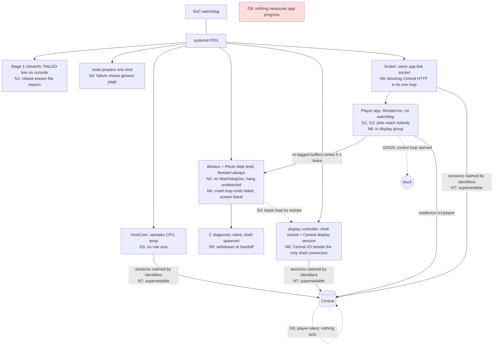
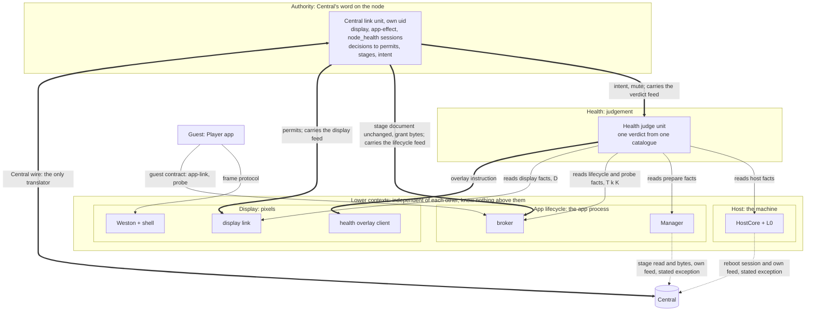
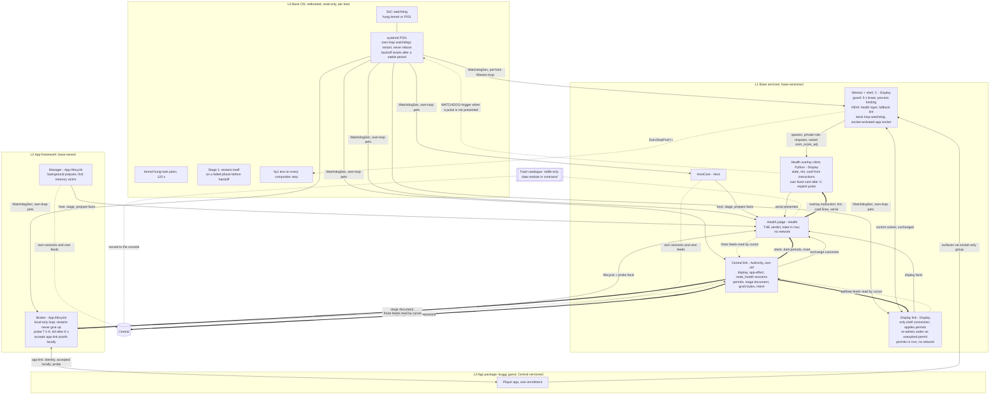
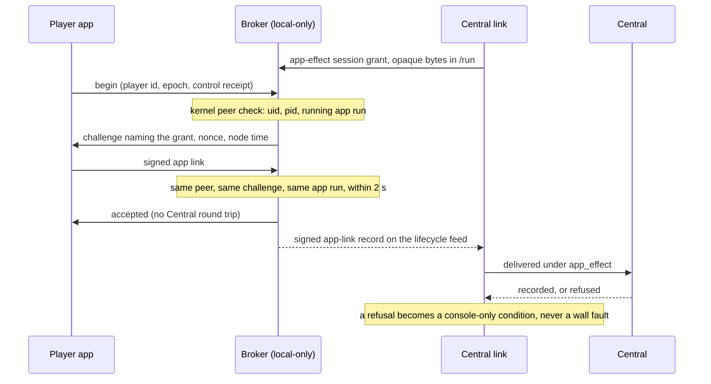
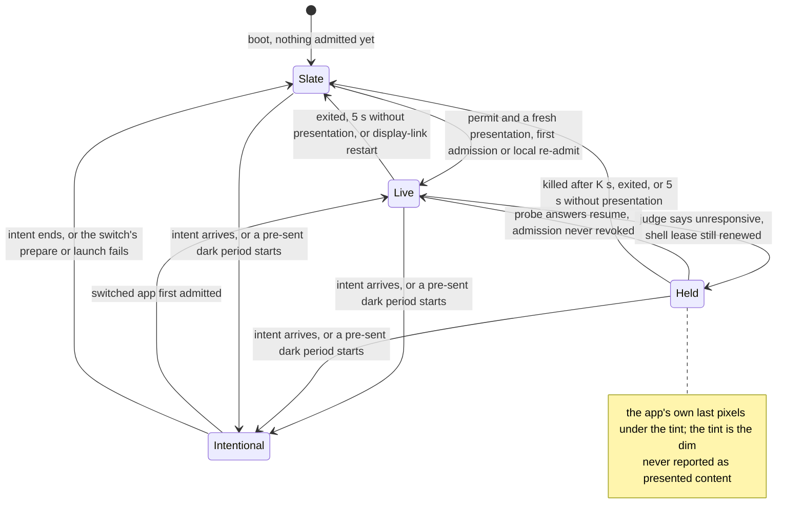

# Player node: base layer, app layer and one health verdict (recommended shape)

**Superseded** wherever Central is assumed in charge: see [0016](../../decisions/0016-central-and-node-relationship.md) and the node redesign ([0017](../../decisions/0017-node-redesign-r3.md)). Paths inside are historical: the Node modules moved to `appliance/{kernel,host,boot,apps}/` in E1.

**Layer: system design.** Domain concepts, bounded contexts and their dependency direction, supervision and trust topology, health model, technology choices. Module contracts, thresholds and plans are parked (section 10). Synthesises shape A (screen owner holds leases) and shape B (one verdict, earned pets, ANR-style probe) against seven review rounds, reworked client-first under R11 (r6), re-layered by bounded context (r7) and corrected against the r7 re-review (r8).

**Status: r8 — final at the system layer; no open questions.** The node is cut into five bounded contexts with one dependency direction (section 3.1). Central's word enters only through an **Authority** context, hosted by a **Central link** unit under its own uid, which turns Central's decisions into local **permits**, desired stages and intent with lifetimes on the node clock. The owner's Q8 answer is applied: the Central link holds the display, app-effect and `node_health` sessions, and the broker is local-only. r8 applies the re-review fixes (section 6, rows 30–38): the broker accepts an app-link proof locally and the Central link delivers it afterwards (B1); App lifecycle owns the probe constants and an import-linter `layers` contract fixes the dependency direction (B2); the Central link passes Central's stage document through unchanged so the root broker re-verifies its binding (B3); the Central window keys on an unexpired permit (N1); a permit is bound to one app run (N2). Owner answers of rounds 1–7 stand.

## 1. Today

G-codes are from `docs/player-architecture.md` (Observed gaps). N-codes are new: N1 diskless reboot leaves no reason; N2 prepare failure reason not on screen; N3 no node unit has `WatchdogSec`; N4 Weston start limit leaves a failed unit and nothing on screen; N5 base page withdrawn at handoff; N6 app holds `SupplementaryGroups=10005`; N7 a base session can be re-enrolled by anyone knowing serial, offer id and boot id; **N8 two processes mix Central I/O with local actuation**: the display controller validates Central's display decisions and drives the shell in one process, with its Central worker beside the only shell connection (`service.py:107-195`, `:197-285`; `runner.py:161-179`), and the broker's single loop makes blocking Central calls between app-link proofs (`broker_runner.py:91-125`, 0.5 s per request at `:81`; one connection at a time in `app_link.py:80-95`, with a Central POST inside the proof at `:141`). G7 (incident 2026-10-04) is G3+G4+G5+G6 together. N1 and N7 stay open in this design (deferred, section 7).

What today's shell already provides (the base this design reuses): a protected layer above the app layer (`shell.c:937-940`); a private surface role only the shell-spawned client can take (`shell.c:392`, `:428`, spawn `:834-855`); a compositor curtain primitive (`:189-202`); server-side presentation events for that client (`:479-491`); a fixed 5 s presentation lease and revoke on process death (`:32`, `:869-870`); kernel pid/uid/start-time binding of app surfaces (`:204-208`). What it does not: the private surface is unmapped at handoff (`:730`) and refused afterwards (`:361`); one control connection, and a reconnect invalidates every Output and bumps its generation (`:765`, `:771-777`).

## 2. Requirements

| # | Requirement | Source |
|---|---|---|
| R1 | Health overlay is on early in boot and shows any and every time the node is unhealthy, saying what is wrong | owner 2026-10-04 |
| R2 | Covers at least: package download/prepare fails; cannot reach Central; app unresponsive | owner |
| R3 | Overlay is among the lowest OS layers, tied into management, oversight and watchdogs | owner |
| R4 | App PACKAGES unload/replace online without affecting the base Central channel or the overlay; the app framework ships with the base | owner rounds 1–2 |
| R5 | Plug-and-play PXE; Players Immich-unaware, media only from Central | requirements.md |
| R6 | 4 GB Pi 5 supported | owner |
| R7 | Never compare clocks across systems; trust Player identity | owner |
| R8 | V2 node path only. App restarts never give up: growing delays like base units; `app_failed` is raised when the restart budget is spent and restarts continue at the maximum delay. No automatic reboot for any fault the health overlay can show, including a wedged display pipeline: kernel-console text plus a report, and a person power-cycles. **Three automatic reboots stay:** (a) the hardware watchdog for a hung kernel or PID1; (b) the kernel's hung-task panic, a task stuck in D state for 120 s (`hung_task_panic=1 panic=10`, `scripts/build_netboot_bundle.sh:297`, `appliance/bootstrap.py:384`); (c) stage 1 restarting itself when a boot phase fails before handoff (`0014-reaching-central-from-every-boot-stage.md:136`, P1). (a) and (b) can fire after handoff. The reason a boot ended is not preserved (crash buffer deferred, N1). Amends node-4gb-memory-design.md:74 R8, which said no app restart | owner rounds 2, 4, 5 and r6 review answers |
| R9 | Distinguish acquired, ready, capacity, commitment, observed output; a heartbeat is never proof of pixels | AGENTS.md |
| R10 | Every fault shows the health overlay (full-screen, semi-transparent, content visible underneath). Intentional states are never faults. Mute from Central only, time-limited, ends on reboot. Changes requirements.md:29 and execution-contract.md:148 (output is kept but overlaid) | owner 2026-10-04 |
| R11 | Prefer Wayland/Weston **clients** (Python) and **stock** compositor and systemd features. New C in the Weston shell plugin (`appliance/display_host/native/shell.c`) only where no client-side path exists, kept minimal, and every C change covered by its own CI test | owner 2026-10-04 |

Working definitions (owner-adopted): **unhealthy** = the node's own judgement that a named fault held past its threshold; Central may add a fault, never clear a locally seen one. **App unresponsive** = no progress through the real work path within N s (presented frames are not progress). **Cannot reach Central** = no successful exchange past a threshold on the node's monotonic clock; the threshold is short while the display link holds no unexpired permit and longer while it holds one (signals table). **Fault** (working definition, a design choice) = the node cannot show that this Output presents current authorized content. Every other observation is a console-only **condition** or an **event** (section 5), never drawn on the wall. So R2's "prepare fails" is a fault only when it leaves nothing valid to show (Q2).

## 3. Proposed shape

Two shapes were drawn for the display side (design-it-twice, r6). **Shell-relayed (r5):** the judge sends each verdict into the shell, which dims, holds grants and the last verdict across judge restarts, enforces deadlines and draws a built-in code; an estimated 300+ lines of new C. **Client-first (r6, kept):** the judge never talks to the compositor; a Python client draws the health overlay on a protected surface the shell keeps on top, and stock systemd/Weston features do the watchdog work. r7 adds a second design-it-twice at the context layer: **where Authority lives** (section 3.1, table "Where Authority lives").

### 3.1 Domain layers (bounded contexts)

**The failure class.** In r6 three faults had one shape: a local actuator's liveness or latency depended on Central. The display link's watchdog pet was earned by a completed Central exchange (a Central outage would restart the process that holds every Output); the broker's probe timing sat behind blocking Central HTTP (N8); and a crash in the display link's Central I/O revoked every Output (Q7). Patching each one leaves the shape. The structural fix: **cut the node into bounded contexts, let dependencies point one way, and let exactly one context know Central.**

An arrow means "depends on": the tail knows the head's published language. Data flows both ways (facts up, permits and instructions down), but every contract belongs to the lower context, and consumers read facts from the publisher's bounded **feed with a cursor**, as today's display event feed already works (`runner.py:106-118`), so a publisher never knows who reads it. The Central link carries exactly three feeds to Central: the display link's (producer `display_host`), the broker's (`app_effect`, including signed app-link records) and the judge's (`node_health`). HostCore and the Manager deliver their own on their own sessions; the overlay client's only feed (instruction serial presented) goes to the judge, never to Central.

| Context | Owns (one concern) | Language | Takes | Gives | Never | Hosted by |
|---|---|---|---|---|---|---|
| **Display** | Pixels on each Output | Output, surface, grant, admission, presentation lease, slate, health layer, fallback tint, permit (as applied), overlay instruction, repaint pulse and its deadline D, the fixed "health status unavailable" card | permits (Authority); overlay instructions (Health); app surfaces (guest, frame protocol) | display facts on a feed: outputs, admissions, presentations, invalidations with reason, local re-admits, whether an unexpired permit is held, instruction serial presented | Central; fault codes or the catalogue; app processes | Weston + shell (C); display link (Python unit); health overlay client (Python, shell-spawned) |
| **App lifecycle** | The app process and its packages | app epoch, launch, restart budget, progress probe and its constants T, k, K, kill, desired stage, switch, rollback, prepare, local app-link acceptance | Central's stage document, passed through unchanged, and the session grant as opaque bytes (Authority); probe answers and app-link proofs (guest) | lifecycle facts, probe facts, events, signed app-link records on a feed | pixels; verdicts; Central, except the Manager's stage read and acquisition | broker unit; Manager supervisor + AppManager |
| **Host** | The machine | host fact, boot stage, base unit state, operator reboot | nothing node-internal | host facts, stage records, unit states on a feed | pixels; verdicts; the app | L0 + HostCore |
| **Health** | Judgement | fault, condition, event, catalogue, verdict, raise/clear window, intent, dark period, mute | facts and published constants (T, k, K, D) from the three lower contexts; intent and mute (Authority) | one sequenced verdict, projected as overlay instructions (Display's language) and as conditions and a transition ring (its feed) | Central I/O; a shell connection; launching or killing | health judge unit |
| **Authority** | Central's word on the node (an anti-corruption layer, both ways) | session, Central decision, permit, lifetime on the node clock, desired stage, intent, witness, ack cursor | Central decisions; the display, lifecycle and verdict feeds | permits to Display; Central's stage document unchanged and the app-effect session grant (opaque bytes in `/run`) to App lifecycle; intent and mute to Health; three feeds to Central, acked by sequence; exchange outcomes and Central refusals as facts | drives the shell; launches an app; judges health; rewrites a stage document | **Central link unit (new, own uid)** |
| Guest | Playback | Scene, Run, readiness (its own) | compositor socket; app-link | surfaces; probe answers; signed app-link proofs | base credentials | Player app |

**Dependency rules.**
1. **Lower contexts know nothing above them, and nothing of each other.** Display, App lifecycle and Host publish facts and constants and accept inputs only in their own language (permits, a stage document).
2. **Health reads facts and writes Display's overlay instruction.** It renders card lines from the catalogue itself, so Display never learns a fault code. It knows no Central and drives no actuator.
3. **Authority alone knows Central.** It translates Central's decisions into the lower contexts' language and carries the display, lifecycle and verdict feeds out. Two stated exceptions: **HostCore's reboot session** (a separate credential by the fleet model, player-node-domain-model.md:7, :50), which also delivers HostCore's own feed; and **the Manager's preparation session**, which does read a Central decision: on its read-only `preparation_read_only` scope it reads Central's stage command (`GET /v2/node/app-desired`), checks it is bound to its own producer and offer, fetches the artifact bytes and reports preparation observations (`manager_desired.py:40-59`). It decides which version to prepare, never which runs: it moves no pixel and no process, and the broker acts only on the stage document the Central link passes through.

**How each rule is held** (strongest first; the order is the user's guarantee ranking):

| Property | Mechanism | Strength |
|---|---|---|
| Dependency direction among the node's Python contexts | New import-linter `layers` contract: `authority > health > (display \| app_lifecycle \| host)`, the three lower contexts independent of each other; the guest (`player`) keeps its existing `forbidden` contract | Lint-time (CI) |
| Display never reads the catalogue | `forbidden` contract: the Display package may not import the catalogue module in `contracts/` | Lint-time (CI) |
| No HTTP or session code outside Authority | `forbidden` contract on the node session and HTTP modules for every context except Authority, with HostCore's and the Manager's modules as the two named exemptions | Lint-time (CI) |
| `K > k·T + raise window + D` | The judge reads T, k, K from App lifecycle and D from Display, the raise window from the catalogue, and refuses to construct otherwise; a CI test builds the judge from the shipped constants, and a mutation with K too small must fail it | Construction-time + test |
| Display link, broker and judge cannot reach Central | `RestrictAddressFamilies=AF_UNIX` on their units (HostCore already uses the option, `photo-wall-host-core.service:38`); the overlay client inherits Weston's `AF_UNIX AF_NETLINK` | Boot-time |
| Only Authority hands out permits and stage documents | The Central link runs under its own uid (not `pw-display`); the display link and broker accept its socket only after a kernel peer-credential check on that uid | Boot-time |
| The shell holds no health policy | Its private protocol has no message carrying a verdict or a code; the shell CI test (section 5a) | Construction (protocol shape) + test |
| A publisher never knows its readers; feeds are not bypassed | Feeds read by cursor | Convention (the layers contract stops upward imports, not a second socket) |
| The guest answers probes from its control queue | Real-Player starvation leg in the tracer, mutation-probed | Test + guest-contract convention |

**Where Authority lives** (design-it-twice; least new processes was the tie-breaker):

| Host | Fit | Verdict |
|---|---|---|
| **New Central link unit**, made from today's display Central worker (`service.py:197-285`) and the broker's Central calls (`broker_runner.py:95-124`, `online_runner.py:26-50`, `app_link.py:141`) | Its one concern is Central; restarts touch no Output and no app; display link and broker become network-free | **Current choice** (Q8 answered: all three sessions; +1 unit against r6) |
| Display link (today's worker thread) | Exactly the mix the owner questioned; a Central-I/O crash revokes every Output | Rejected |
| Broker | Gives App lifecycle a second concern; its loop is already the one that blocks | Rejected |
| Health judge | Health and Authority in one process; a judge restart drops sessions | Rejected |
| HostCore | Puts display and app authority beside the reboot credential, which the fleet model keeps separate | Rejected |
| Split in place: display and health sessions in a Central link; the broker keeps its app-effect session on its own worker thread | Smaller move; the broker stays a network process and rule 3 gains a third exception | Alternative, not chosen at Q8 |

**What r7 amends in the Player node domain model (`docs/player-node-domain-model.md`)** (its L-numbers name ownership, not the packaging tiers L0–L3 used below):

| Domain model today | r7 context | Amendment |
|---|---|---|
| L0 HostCore (`:19`, `:50`) | Host | Unchanged; keeps its reboot session; publishes facts to Health |
| L1 App Lifecycle: AppManager + AppEffectBroker (`:20`, `:51-52`, `:174`) | App lifecycle | The broker no longer "fetches the latest desired stage through its own `app_effect` session": the Central link fetches it and passes **Central's stage document through unchanged** over a kernel-peer-checked socket, and the broker still "binds it to its own producer, offer and boot" itself (`:174`), so the root process never trusts a translation by an unprivileged one. "An L1 socket call is not authority by itself" still binds the AppManager; the Central link's socket is the base's carrier path, not a new authority. The broker answers an app-link proof locally ("accepted") and publishes the signed record; Central's verdict on it arrives later as a console condition. Adds restarts, progress probe and kill (R8) |
| L1.5 DisplayHost (`:21`, `:53`) | Display | Its Central exchange leaves for Authority; it applies permits. "Base error page, overlay lease" becomes holding slate plus health layer. The `display_host` producer is unchanged on the wire, carried by the Central link |
| L2 Player Runtime (`:22`, `:54`) | Guest | Adds the probe guest contract (answer on the control queue); the app-link result changes from "recorded" to "accepted" (a versioned guest contract, section 3.2) |
| (none) | Health | New context and unit; new producer owner `node_health` on the existing event wire |
| (none) | Authority | New context and unit under its own uid; owns the display, app-effect and `node_health` sessions |

### 3.2 Components and flows

**Single verdict path.** Facts flow into the health judge; it computes one sequenced verdict and projects it two ways: an **overlay instruction** per Output to the health overlay client (tint on or off, two card lines already rendered from the catalogue, serial), and conditions plus the transition ring on its feed, which the Central link delivers under the `node_health` producer and Central acknowledges by sequence. The judge writes to no compositor and does no Central I/O, so restarting it touches no admission. Events never pass through the verdict: each owner publishes its own on its feed, and the Central link carries each under that owner's producer (facts are owner-bound, `node_protocol.py:159-162`). The shell's health duties are its existing guard (fixed 5 s presentation lease, revoke on process death or output change), the health layer above everything, and a fallback tint whenever no health overlay client is bound after handoff; it never reads a verdict or a fault code. On the node only the judge reads the catalogue; Central serves it to the console; Display never reads it.

**Admission path.** Central's display decision reaches the Central link, which checks what belongs to Central (producer, request, lifetime, `service.py:139-145` today) and hands the display link a **permit** bound to one app run (process and app epoch). The display link checks what belongs to the screen (Output identity, connection, a fresh matching presentation, `service.py:150-188` today) and drives the shell. Its permit set lives in `/run` and survives its restart. When the shell revokes an Output (a 5 s lease lapse, or the reconnect after a display-link restart), the display link **re-admits locally** as soon as the same app instance presents again under a permit that has not expired, with no Central round trip. A permit's lifetime bounds re-admission only: a live admission is never ended by expiry, so output is still preserved through a Central outage (R10 overlays it). A restarted app is a new app run, so it always waits for a fresh permit (current choice: "wait"); while the Central link is down, even with Central up, it stays on the slate until the link returns.

**Stage path.** The Central link fetches Central's stage document on the app-effect session and passes it to the broker byte for byte. The broker, which runs as root and performs the switch, re-verifies the document's binding to its own boot, offer and producer as it does today (player-node-domain-model.md:174), so the unprivileged Central link carries the document but cannot widen it. The document is not signed: its authenticity on the node rests on the Central link's uid and the broker's peer check (boot-time), as it rests on TLS and the session today.

**App-link path.** The broker answers the Player's identity proof locally and never waits on Central:

The challenge still names the app-effect session (`app_link.py:121`): the Central link writes that session's grant to `/run` as opaque bytes and the broker copies it into the challenge without interpreting it, as it already retains a grant for offline proofs (`app_link.py:96-117`). This changes the guest contract, so it is versioned: today the Player waits up to 2 s for a result (`player/node_app_link.py:35`) and counts only "recorded" (`:52-54`, consumed at `player/service.py:1231-1239`); r8's result is "accepted", and the Player no longer learns a Central refusal synchronously.

**What one Output shows.** Two independent things per Output: the **underlay** (what is beneath) and the **health overlay** (on, off or muted). The overlay is on exactly when a fault holds, no intentional state or pre-sent dark period is active and no mute covers every present code; it never changes the underlay.

**Slate vs black.** When nothing valid exists the underlay is the base **holding slate** (Photo Wall's own page with the device id, satisfying U1, requirements.md:37), never black. Black appears only as authored or intentional darkness (a dark Scene, Good night, a pre-sent dark period). With the overlay on: over **Live** content keeps playing beneath the tint (e.g. Central unreachable past its window); over **Held** the app's own pixels show beneath the tint, which is the dim; over **Slate** the slate shows beneath. An app that stops presenting loses its admission to the shell's 5 s lease and the slate replaces its frozen frame (Q6); if the same app run presents again while its permit is unexpired, the display link re-admits it locally; a restarted app waits for a fresh permit. Over **Intentional** the overlay never shows; faults still reach Central. Intent holds until Central replaces it (dark periods carry their own durations); an authorized switch or rollback is intentional only until the new app is first admitted or its prepare or launch fails, after which a failed switch follows the normal fault rules. Mute lifts the tint and card for the codes it covers and leaves the underlay as it is, so a muted Output with nothing valid shows the slate, not black.

## 4. Design rules (design choices)

1. **One concern per context; dependencies point down; Central enters only through Authority.** Display, App lifecycle and Host know nothing above them or of each other; Health reads their facts and writes Display's overlay instruction; Authority alone speaks Central's language and hands the node permits, stage documents and intent. The compositor holds no health policy. The two exceptions (HostCore's reboot session, the Manager's preparation session) are named. Held at lint time by an import-linter `layers` contract, at boot by `RestrictAddressFamilies=AF_UNIX` and a uid per Central-facing unit, and by convention only for feeds (table in section 3.1).
2. **Every proof is earned on the path it guards, never on another system's availability.** Weston's pet comes from its own event loop, and a repaint pulse must actually be presented; the display link's pet is its own loop turn; the judge's is a completed verdict cycle; the Central link's is its own loop turn with every call time-bounded; the app's proof is an answer from its control queue at control-dispatch priority; the broker accepts an app-link proof on local evidence alone. A dispatch loop's liveness is never progress, and Central's reachability never feeds a pet or gates a local answer.
3. **Authority arrives as local state with explicit lifetimes, kept where it is used.** Permits and mute expire on the node clock (Central's duration added to the node's own sampled time, so no clocks are compared); a permit is bound to one app run; intent holds until replaced; each is persisted in `/run` by the unit that applies it, so a Central-link, display-link or judge restart loses none of it. The app gets only the compositor socket (a socket-only group), its app-link connection and its own enrollment.

## 5. Core tables

**Domain concepts** (14)

| Concept | Definition | Not to be confused with |
|---|---|---|
| Fault | Working definition (design choice): the node cannot show that this Output presents current authorized content. A catalogue condition marked display-affecting, raised after its per-class window, cleared after its hold-down. Every fault shows the health overlay (R10). Examples: app unresponsive or failed, presentation lapsed, cannot reach Central, Central witness, a base unit silent (`<owner>_silent`), nothing valid to show | A raw signal lapse (an input); a console-only condition |
| Condition | A named state from the catalogue that holds now: instance id, code, age (a duration on the node clock). Faults are conditions; the rest (new-version prepare failed, host hot) are console-only. Sent to Central the moment they are pending, so the console sees them before the wall's window ends | An event |
| Event | Something that happened once: a restart, a kill, a prepare attempt, a rollback, a local re-admit. Each owner publishes its own on its feed; the judge's transition ring holds every condition raise and clear; Central acknowledges by sequence. Reuses `NodeEventV2` and `NodeSnapshotV2` (`contracts/node_protocol.py`) with one new producer owner, `node_health` | A condition (events never raise the overlay) |
| Fault catalogue | One stdlib-only data module in `contracts/`: code, display-affecting or not, household line, raise/clear class and window. The probe constants T, k and K are App lifecycle's and D is Display's, not the catalogue's; the judge refuses to construct unless K > k·T + `app_unresponsive` raise window + D. Read on the node by the judge only; Central serves it to the console, folding in today's lists (`health.js`, `hostHealth.js`, `base_status` FAULTS, boot-stage fault tokens, `HostObservationV2.fault_code`, host thresholds). Central-only codes (`player_silent`, `verdict_overdue`) are in the same list | Free text per component; anything Display reads; Display's own fixed "health status unavailable" card |
| Intentional state | A Central-desired state with no app content: unbound, no Scene, dark Scene, operator reboot, and an authorized switch (including a rollback), intentional only until the new app is first admitted or its prepare or launch fails. Includes **pre-sent dark periods** (offsets and durations from receipt, timed on the node clock). Arrives on the existing display decision / app-desired reads; Authority hands it to Health as intent | A fault; anything the app says about itself |
| Verdict | Health's one sequenced object per node: per Output, the underlay (live / held / slate / intentional) and the overlay (off / on with fault codes and instance ids / muted); ordered by sequence, never by timestamp | Central's own view (witness); the overlay instruction |
| Overlay instruction | Display's language for one Output: tint on or off, two card lines already rendered by Health from the catalogue, and the verdict serial. The verdict's only form inside Display | The verdict; the calibration-trial `overlay` events of the frame protocol (`shell.c:246-252`, `:488`) |
| Health overlay | Full-screen translucent **tint** plus a small opaque **text card**, for every fault, drawn by the health overlay client on the **health layer** (its protected surface). Card: a household line ("Photos paused — the player stopped responding") and a small line with code, Player id and Output id; no asset, Scene or host names | An authored overlay Run (requirements.md:203); a corner badge (owner declined, r4); the trial-calibration overlay; the shell's fallback tint |
| Holding slate | The base's own page with the device id, drawn by the health overlay client on today's protected slate surface: the underlay whenever nothing valid exists | Black, which is only authored or intentional darkness |
| Held | The verdict says the app is unresponsive while the shell still holds its admission (it keeps presenting). Its own pixels stay, under the tint. Ends when probe answers resume (back to live, nothing to re-admit), or at kill, exit or the shell's 5 s lease (slate) | Revoked by the shell (lease lapse or process death) |
| Mute | Central-issued through Authority; persisted with the judge's state in `/run` as a lifetime on the node clock; covers only the codes present when set (a new code shows the overlay again); ends on expiry or reboot; faults still reach Central | Clearing a fault |
| Progress probe | Broker-issued nonce on the app's probe channel over its app-link connection. The app answers from the **same queue and priority as its control dispatch** (today's Player: the GLib default-idle queue behind `GLibDispatcher`, `player/service.py:330-355`), never from a helper thread; round trip timed by the broker against its own constants T, k, K (Android ANR); the judge receives "answered" or "unanswered for d". Renamed from "challenge" because `NodeAppLinkChallengeV2` means identity proof | A free-running counter, a re-tag, anything on the compositor connection |
| Permit | Authority's local form of one Central display decision: which app run (process, app epoch, config revision) may hold which Output (connector, mode, compositor incarnation) in which stage (candidate, admitted, revision, trial), until when on the node clock. Held by the display link in `/run`. Bound to one app run: a restarted app always waits for a fresh one. Its expiry bounds local re-admission, never a live admission; a change of process, epoch, mode or compositor voids it | A Central session or bearer; the shell's grant token for one admission |
| Lease | A proof that expires: presentation (shell, fixed 5 s), progress, fact, instruction, permit. Absence is a fault input | A heartbeat proving pixels |

**Components**

| Component | Context · tier | Owns | Supervised by (pet) | Central session | Never does |
|---|---|---|---|---|---|
| Firmware, kernel, stage 1 | Host · L0 | boot; hardware watchdog (hung kernel or PID1); hung-task panic (120 s D state); stage 1 restart before handoff; phase text | SoC watchdog | boot offer only | runs app code; reboots on a health judgement |
| PID1 | Host · L0 | unit supervision; watchdogs restart a unit, never reboot; exponential backoff that never gives up, reset after a stable period; tty1 text on every compositor stop; oomd with preparation as first victim | SoC watchdog | none | policy |
| Screen owner (Weston + shell, C) | Display · L1 | scanout, layers, admission guard (grants, fixed 5 s lease, process binding, revoke); slate surface; **health layer above everything (new)**; **fallback tint whenever no health overlay client is bound after handoff (new)**; spawning and respawning the overlay client with raised `oom_score_adj` (new); the app socket by stock socket activation | PID1 `WatchdogSec`, pet from Weston's loop by stock `systemd-notify.so`; `WATCHDOG=trigger` from the repaint pulse | none | reads a verdict or fault code; computes thresholds; talks to Central |
| Health overlay client (Python) | Display · L1 | slate and health overlay per Output from overlay instructions; its own fixed "health status unavailable" card (Display's string, not a catalogue code) when no fresh instruction arrives within V; repaint pulse; self-watchdog (exits if its loop stalls; the shell respawns it); buffers capped at 128 MB | the shell (respawn); its own loop timer | none | reads the catalogue; decides anything |
| Display link (today's display controller, slimmed) | Display · L1 | the only shell connection; the permit set in `/run`; admission and local re-admission under a permit; display fact feed | PID1 `WatchdogSec`, pet earned by its own loop turn (pending shell events drained, permit set reconciled), never by Central or by a shell answer | none (network-restricted) | Central I/O; judges health; draws |
| Health judge (Python unit) | Health · L1 | THE verdict; catalogue windows (Central window keyed on an unexpired permit); the K rule at construction; intent, dark periods, mute; conditions and transition ring feed; fact leases; all state in `/run` | PID1 `WatchdogSec`, pet earned by a completed verdict cycle | none (network-restricted) | connects to the compositor; launches or kills apps |
| Central link (new unit, own uid) | Authority · L1 | display, app-effect and `node_health` sessions; Central decisions into permits (display link); Central's stage document passed through unchanged and the app-effect grant as opaque bytes in `/run` (broker); intent and mute (judge); exchange outcomes and refusals (e.g. an app link Central refused) as facts; reads the display, lifecycle and verdict feeds by cursor and delivers them | PID1 `WatchdogSec`, pet earned by its own loop turn, every Central call time-bounded; Central outcomes never feed it | display, app-effect, `node_health` | drives the shell; launches apps; judges; rewrites a stage document; holds the reboot or preparation session; carries HostCore's or the Manager's feed |
| HostCore | Host · L1 | host facts, stage records, base unit states for the judge; operator reboot | PID1 `WatchdogSec` | host (reboot), stated exception | draws; decides the verdict; reboots on its own |
| Broker (root) | App lifecycle · L2 | sole launcher; restarts with growing delays that never give up (`app_failed` when the budget is spent; reset after a stable period); progress probe on app-link with its constants T, k, K; kill after K s unanswered; app-link proofs accepted locally, signed records on its feed; re-verifies and executes Central's stage document (switch, rollback); one local-only, non-blocking loop | PID1 `WatchdogSec`, own loop turn | none (moved to the Central link, Q8) | Central I/O; trusts a stage document it has not bound to its own boot, offer and producer; reboots; mutes |
| Manager supervisor + AppManager | App lifecycle · L2 | reads Central's stage command on its read-only scope and prepares that version in the background; under memory pressure aborts, deletes staged files, reports an event | PID1; supervisor budget | preparation (`preparation_read_only`: stage read, bytes, own feed), stated exception | stops, starts or hides the app; selects which version runs |
| Player app | Guest · L3 | playback, authored darkness, answering probes on its control queue | broker | own Player enrollment; compositor socket via a socket-only group; app-link | holds a base credential; joins the display group |
| Central (outside the node) | — | witness codes, ring acks, rollback of a failed trial to the accepted release, intent, pre-sent dark periods, mute, serving the catalogue; observed output = presented AND verdict underlay live | — | — | clears a locally seen fault |

**Health signals**

| Signal | Source | Proves | Never proves | Becomes | Raise / clear (per class, placeholder) |
|---|---|---|---|---|---|
| Presentation lease | shell, existing fixed 5 s | app render path commits on this Output | control work runs; right content | revoke + slate; local re-admit if the same app run presents again under an unexpired permit; fault "nothing valid to show" when nothing was ever admitted (reason from a condition, e.g. prepare failed) | lapse / fresh presentation under a permit |
| Progress probe | broker, on the app-link probe channel; answered from the control queue | app control path runs within T | right pixels; app reaches Central | fault `app_unresponsive`; broker kills after K s | k misses of T (App lifecycle's constants), then the catalogue's raise window; the judge refuses to start unless K > k·T + raise window + D / m answers |
| Central exchange | Central link outcomes, judged by the judge | base reaches Central, node clock | app reaches Central | fault, but the console sees it pending at once | **no unexpired permit: short** (~30 s); **an unexpired permit exists: longer debounce**, up to the permit lifetime (~5 min, A2) / success held H_c |
| Central witness | Central, from base-reported evidence | Central's outside view disagrees | anything local; never clears a local fault | fault; `player_silent` and `verdict_overdue` (no fresh verdict reached Central) stay console-only | Central raises / withdraws |
| Host and prepare facts | HostCore, Manager | headroom, stage, prepare outcome | cause of an app stall | console-only condition or event (may be a fault's reason) | per class |
| Lifecycle facts | broker | app process state, budget left, authorized switch | progress | fault `app_failed` when the budget is spent; each restart or kill is an event | budget spent / admitted, then a stable period resets it |
| Fact leases | judge, one per publisher (display link, broker, Manager, HostCore, Central link, overlay client) | each publisher's loop turns | its facts are right | fault `<owner>_silent`; a restarted judge withholds every "overlay off" until all are fresh | k missed periods; except `central_link_silent`, which uses the Central-exchange window above (a dead link must not tint the wall sooner than a Central outage would) |
| Instruction lease | overlay client, fixed V | the judge publishes | verdict correctness | Display's own fixed "health status unavailable" card, drawn by the overlay client (no catalogue code; Central's `verdict_overdue` is the coded view) | fixed V, longer than a judge restart (persisted state is republished at once) |
| Compositor loop | stock `systemd-notify.so` | Weston's event loop turns | repaints complete | PID1 restarts Weston; event | `WatchdogSec` |
| Repaint pulse (was "presentation probe" and "overlay presented") | overlay client: one commit at a time on the health layer, carrying the current instruction serial; `wp_presentation` `presented` | a repaint on that Output completes, and the card for that serial was composited | panel pixels (R9); the text is right | serial presented, an event in the judge's ring; nothing presented within D: `WATCHDOG=trigger`, PID1 restarts Weston | fixed D; judged only on connected, enabled, mapped Outputs, after draining pending events; `discarded` never counts; skipped when the client's own loop ran late |

**Technology choices**

| Concern | Current choice | Prior art | Alternative (cost) |
|---|---|---|---|
| Screen ownership | Weston + Photo Wall shell stays owner (owner answer) | Weston kiosk-shell, Android SystemUI | DRM-lease or plane inversion (owner declined); stock kiosk-shell (no admission guard, no protected layer); a wlroots compositor with `wlr-layer-shell` (Weston 14 has none; owner declined replacing Weston) |
| Domain layering | Five contexts, dependencies pointing down, feeds read by cursor; Central known only to Authority; an import-linter `layers` contract `authority > health > (display \| app_lifecycle \| host)` (lint-time), boot-time network restriction and one uid per Central-facing unit | DDD context map with an anti-corruption layer (Evans); hexagonal ports; kubelet keeps running pods through an API-server outage | per-process Central sessions (today, r6): local actuation waits on Central (N8) |
| Authority host | New Central link unit built from extracted code, under its own uid (section 3.1; Q8 answered) | balena supervisor's API binder beside its container runtime; privilege separation with one uid per daemon (Postfix, OpenSSH) | in the broker, judge, HostCore or display link (rejected, section 3.1); split in place (not chosen at Q8); running it as `pw-display` (it could then speak the shell's control socket) |
| App-link acceptance | The broker accepts on local kernel evidence and answers "accepted"; the signed record rides its feed; the Central link delivers it; a Central refusal is a console condition | transactional outbox; kubelet's status manager posting pod status asynchronously | synchronous Central round trip inside the proof (today, `app_link.py:141`: a network wait in the broker loop, N8) |
| Overlay drawing | One Python client (`pywayland` 0.4.18 + `pycairo`, both in trixie) replaces `diagnostic-client.c`, spawned at the same fixed path; Python bindings for the private protocol generated by pywayland's scanner at image build, none at runtime; card lines arrive rendered in the instruction | Weston's helper clients (desktop-shell, keyboard) on a private socket | the client reads the catalogue (r6: Display then knows Health's vocabulary); keep the C client (more C, against R11) |
| Overlay form | The client's own translucent pixels: tint as a single-pixel buffer scaled by `wp_viewporter`, plus a small opaque card buffer; full-screen ARGB only as a fallback under the memory cap | Android ANR dialog over a dimmed app | shell curtain + client card (C owns tint state); corner badge (owner declined) |
| Fallbacks | No fresh instruction within V: the overlay client draws Display's own fixed "health status unavailable" card (not a catalogue code). No overlay client bound after handoff: the shell's **fallback tint**, its own per-Output handle, shown even when healthy, dropped when a client binds, destroyed on output loss | BIOS POST codes, ChromeOS frecon | tint only while "a fault shows" (r6: the shell cannot know that without reading a verdict); a shell-drawn code (glyphs in C) |
| Overlay memory | The client caps its buffers at 128 MB and refuses a larger set at construction; the shell raises the child's `oom_score_adj` at spawn, so an OOM inside Weston's 256 MB cgroup takes the client, never Weston (`OOMPolicy=continue` already set) | Android lmkd adj scores | own cgroup for the client (needs cgroup delegation to Weston) |
| Held frame | No dim operation: the tint over the app's still-mapped view is the dim; bounded by the shell's 5 s lease and the broker's kill | Windows ghost window, Android ANR dim | dim-in-place or keep-after-lease in C (about 25 lines, owner declined at Q6) |
| Compositor hang | Stock `systemd-notify.so`: READY at module init, pet from a timer in Weston's loop (weston `systemd-notify.c:86-95`, `:141-164`); plus the repaint pulse sending `WATCHDOG=trigger` (`NotifyAccess=all`; it runs in Weston's cgroup) | Chromium GPU watchdog (armed only while work is in flight) | C pending-work pet (r5); stock `pageflip-timeout` (legacy KMS path only, `kms.c:911`) |
| Judge restart | State in `/run` (`RuntimeDirectoryPreserve=yes`, as the broker and HostCore already do): first-seen ages, intent, dark periods, raise windows, mute, verdict sequence, ring; republished at once; no "overlay off" until every fact lease is fresh | BGP graceful restart (stale routes held until End-of-RIB) | forget on restart (r6: a restart flashed the overlay off and dropped mute) |
| Display-link restart | Permits in `/run`; after the shell's reconnect invalidation the display link re-applies every unexpired permit as each app instance presents again | DHCP INIT-REBOOT (reuse an unexpired lease) | shell adoption with an epoch fence (about 60 lines of C; owner declined at Q7) |
| Unit and app restart | `Restart=always`, `RestartSteps=` + `RestartMaxDelaySec=` (systemd ≥254; trixie ships 257), `StartLimitIntervalSec=0`, backoff reset after a stable period; the broker applies the same shape to the app and raises `app_failed` at the budget; never a reboot | Kubernetes CrashLoopBackOff | stay failed after 10 tries; `StartLimitAction=reboot` (owner declined) |
| Compositor-down text | `ExecStopPost=+` (root, outside the unit's empty capability set) clears tty1 and writes the fault line with `$SERVICE_RESULT`; the Weston unit sets `TTYReset=no` and `TTYVTDisallocate=no`, because systemd resets the TTY "before and after execution" (systemd.exec(5)) and would erase the text | ChromeOS frecon, Plymouth text | drop it (a crash loop shows a blank tty1; contradicts the Q4 answer); `OnFailure=` (never fires while restarts continue) |
| App progress | Probe owned by the broker on a channel the app opens over its kernel-peer-checked app-link socket; answered on the control queue; broker times it with its own T, k, K; judge gets a fact and checks the K rule at construction | Android ANR (input dispatch timeout) | judge-timed fd (r5: fd hand-on and epoch); Wayland-carried (answered by the render path, `frame-client.c:124-127`) |
| App capability | A socket unit creates the app's Wayland socket with `SocketGroup=` (a group that owns nothing else) and `SocketMode=0660`, passed to Weston by its stock socket activation (weston `systemd-notify.c:45-84`); Weston's own `wayland-0` stays in its 0700 runtime directory; display group dropped | Fuchsia capability routing | `ExecStartPost=+` chgrp after READY (r6: a window before the change, kept by convention); pre-connected `WAYLAND_SOCKET` (breaks the shell's pid binding) |
| Raise/clear | Per-class windows from the catalogue, Central window (and `central_link_silent`) keyed on an unexpired permit, hold-down, flap damping; console sees pending at once | Prometheus `pending`/`firing`, BGP flap damping | one global window |
| Conditions and events | Conditions with instance ids and age; per-owner feeds and the judge's bounded transition ring, acked by sequence on the existing event wire; "since" = Central receipt time minus reported age | Kubernetes Conditions vs Events, list-watch with a resource version, TCP cumulative ack | a status blob (loses short faults; invites clock comparison) |
| Memory pressure | Background prepare is the first victim: abort, delete staged files (RAM tmpfs, node-4gb-memory-design.md:84-85), event | Android lmkd | app as victim |
| Failed trial app | Central rolls the desired app back to the accepted release; the Central link passes the new stage document through; the broker re-verifies it and switches online as an authorized switch | Mender/balena rollback, A/B accepted/candidate (execution-contract.md:98) | stay `app_failed` until a person acts |

### 5a. Display-side guarantees under R11

| Guarantee | Already in today's shell.c | Client or stock path | New C | Recommendation |
|---|---|---|---|---|
| Health overlay tint + card always on top | Protected layer above apps (`:937-940`); role only for the shell-spawned client (`:392`, `:428`); but unmapped at handoff (`:730`) and refused after release (`:361`) | Python overlay client draws tint and card from overlay instructions | A **health layer** role per Output in a layer above the slate, mapped whenever it has a buffer, ignored by handoff and `invalidate()`; one new request on the private manager (`get_health_layer`, `pw_diagnostic_manager_v1` v3) and one new interface (`pw_health_layer_v1`), named apart from the trial `overlay` events (`:246-252`, `:488`). About 45 lines + 12 lines XML | **New C, unavoidable**: no stock Weston 14 protocol stacks one client above another |
| Holding slate with device id | Today's protected page, shown whenever nothing is admitted (`:259-281`, `:811-813`), opaque curtain until it maps (`:371`) | Same surface; the client draws the device id it reads from base identity | none | Client |
| Fail-visible when the overlay client is absent | The curtain primitive (`:189-202`), but `o->curtain` is destroyed and recreated by `invalidate()` and the slate path (`:280`, `:371`, `:378`) | — | A fallback tint on its **own** per-Output handle at partial alpha, raised whenever an Output is released and no health layer is bound, dropped when one binds, destroyed in `output_destroyed` (`:780-787`) and at shell teardown. About 30 lines | New C (without it a dead client hides every fault) |
| Overlay OOM never takes Weston | `OOMPolicy=continue`, `MemoryMax=256M` on the unit; spawn at `:834-855` | Client buffer cap of 128 MB | Raise the child's `oom_score_adj` after fork in the spawn path. About 5 lines | New C, tiny |
| Frozen app dimmed and bounded | App stays mapped while it presents (`:511`); revoked at 5 s without presentation or on process death (`:869-870`, `:266`) | The tint over the still-mapped app is the dim; kill after K ends it through the existing revoke | none | Client |
| Stop counting an unresponsive app's frames | After a revoke nothing is counted (`:492` needs a live identity) | Presentations stay raw facts; the verdict's underlay "held" travels with them; Central's observed output requires underlay live (R9) | none | Client (judge + Central projection) |
| Fixed deadlines, stale fallback | Fixed constants: 5 s lease (`:32`), revision TTL (`:697`), 2 s client respawn (`:832-836`) | Overlay client holds the last instruction and shows its own fixed "health status unavailable" card after V; self-watchdog exits a stalled loop and the shell respawns it | none | Client |
| Admissions through a restart | One control connection; reconnect invalidates every Output and bumps its generation (`:765`, `:771-777`) | Judge and Central link never connect to the shell; the display link re-applies unexpired permits from `/run` after its own restart (permits name connector, mode and compositor incarnation, not the generation) | none | Client; a display-link restart still blanks to the slate for restart + re-handoff (Q7) |
| Weston hang detection | none (`photo-wall-display.service`, no `WatchdogSec`) | Stock `systemd-notify.so` loop pet; render stall: repaint pulse, else `WATCHDOG=trigger` | none | Stock + client |
| Overlay presented proof | Server-side `diagnostic_presented` / trial `overlay_presented` (`:411-417`, `:479-491`), kept for the slate, handoff and trials | Merged into the repaint pulse: client-side `wp_presentation` for its own commit, per instruction serial | none | Client |
| App compositor access without display group | App gets group 10005 + a bind of `wayland-0` (`process_linux.py:65`, `:72`); shell binds surfaces to kernel pid/uid/start (`:204-208`) | Socket unit with `SocketGroup=`, stock Weston socket activation; kernel binding unchanged | none | Stock |
| Progress probe channel | n/a; app-link socket is the broker's, kernel peer-checked (`app_link.py:1`) | Broker holds the probe channel open on a local-only loop, times it, kills after K, reports a fact | none | Python in the broker |

**Remaining C (all in `shell.c`, about 80–100 lines + about 12 lines protocol XML):** (1) the health layer role: new request and interface, a layer above the slate, map on buffer and unmap on a null buffer, untouched by handoff and `invalidate()`, about 45 lines; (2) the fallback tint on its own handle whenever a released Output has no bound health layer, with cleanup on output loss and teardown, about 30 lines; (3) raising the overlay child's `oom_score_adj` at spawn, about 5 lines; plus error paths. Removed: `diagnostic-client.c` (215 lines) becomes Python, a net reduction of about 115–135 lines of C. **Its CI test:** a Linux CI job runs headless Weston with `photo-wall-shell.so` and `--debug` (which lets the stock `weston_capture_v1` read output pixels), a stub app admitted through handoff, and the Python overlay client. It asserts that the tint pixels sit above the app after handoff; that a non-private client cannot bind the health layer; that killing the overlay client after handoff leaves the fallback tint even with no fault; and that the trial `overlay` events are unchanged. Mutation probes: moving the health layer below the app layer, and skipping the fallback tint, must each turn it red. Today no CI job runs the shell outside node-pid1 legs, so this job is new.

## 6. Cross-review interactions resolved

| # | Interaction | Resolution | Evidence |
|---|---|---|---|
| 1 | Black vs slate | Nothing valid = holding slate with device id; black only for authored/intentional darkness | U1, requirements.md:37 |
| 2 | Held frame | The tint over the app's own view is the dim; bounded by kill after K s, process death and the shell's 5 s lease. Q5 holds for an app that keeps presenting; one that stops goes to the slate after 5 s (Q6) and is re-admitted locally if it presents again | `shell.c:511`, `:869-870` |
| 3 | Judge restart | The judge holds no shell connection and no Central session; its restart invalidates nothing and loses no state (row 21) | `shell.c:771-777` |
| 4 | Small glitch | Probe answers resuming leave the admission untouched; a shell revoke is followed by a local re-admit under an unexpired permit, not a Central round trip (r5 H4's lease check returns as the permit's lifetime) | shell revokes on lease lapse, process death, output change, withdraw |
| 5 | Probe path | Broker-owned channel on app-link, timed by the broker; judge gets a fact | `frame-client.c:124-127`; `app_link.py:1` |
| 6 | Compositor pet, renderer, fallback | Stock loop pet + repaint pulse with `WATCHDOG=trigger`; overlay presentation merged into the pulse; late instruction drawn as Display's own fixed card (row 37); no bound client leaves the fallback tint | weston `systemd-notify.c:86-95`; `kms.c:911` |
| 7 | Vocabulary | One catalogue, read on the node by the judge only (row 31); Display receives rendered lines, never codes; Central serves it to the console; one judge per signal | `health.js:35`, `hostHealth.js:193` |
| 8 | Memory pressure | Victim = background prepare | node-4gb-memory-design.md:84-85, :144 |
| 9 | Failed trial | Central rollback to accepted release; the Central link passes the stage document through and the broker re-verifies it; online switch | execution-contract.md:98 |
| 10 | Offline night | Pre-sent dark periods, timed by duration on the node clock, persisted by the judge | without them a dark Scene plus Central loss would tint a dark room |
| 11 | Text | Household line + small code/ids line | owner's default kept on line 2 |
| 12 | Mute | Persisted with the judge's state; covers only codes present when set; ends on expiry or reboot | R1, R10 |
| 13 | Backoff | Reset after a stable period, base units and app; app restarts never give up | CrashLoopBackOff reset |
| 14 | Switch bound | A switch or rollback is intentional only until first admission or a prepare/launch failure (H1) | otherwise a broken switch hides as intentional |
| 15 | Central window | Short vs long keyed on "an unexpired permit exists", a display fact the judge reads (H5, re-keyed by row 33) | a node holding no authority has no content to protect |
| 16 | Deadlines | New deadlines (V, D, probe T, k, K) are fixed constants in base Python or one catalogue entry; the shell keeps only its existing constants; nothing arrives in a verdict (H7) | `shell.c:32` |
| 17 | Compositor-down text | `ExecStopPost=+` with the unit's TTY resets disabled (row 28) | r5 combined `OnFailure=` with never-give-up restarts |
| 18 | Event log, desired state | Feeds ride `NodeEventV2`/`NodeSnapshotV2`; intent, dark periods and mute ride the existing display decision / app-desired reads; app lifecycle facts keep one vocabulary | module review |
| 19 | Display-link pet (B1) | Earned by its own loop turn; it has no Central I/O to wait on | `service.py:197-285` leaves the process |
| 20 | Local re-admit (B2) | The display link re-applies an unexpired permit it holds in `/run`; covers the Q6 lease lapse and the Q7 restart; restated Q7 cost in section 9 | `shell.c:771-777`, `:869-870` |
| 21 | Judge state (B3) | Persisted in `/run`; a restarted judge republishes at once and emits no "overlay off" until every fact lease is fresh | BGP graceful restart |
| 22 | Probe queue (B4) | Answered from the control dispatch queue at its priority (GLib default-idle in today's Player), never a helper thread; tracer adds a real-Player starvation leg, mutation-probed with a `to_thread` answer | `player/service.py:330-355`; G8 |
| 23 | Broker loop (B5) | Moving the broker's Central calls to the Central link removes every network wait from its loop; the loop is still rewritten from one-connection-at-a-time to a non-blocking local loop that holds probe channels open (cost 5) | `broker_runner.py:91-125`; `app_link.py:80-95`, `:141` |
| 24 | "App unresponsive" rule | Construction refuses K ≤ k·T + raise window + D, so the card always shows before the kill; owners moved by row 31 | module review |
| 25 | Fallback tint | Shown whenever no overlay client is bound after handoff; own handle, not `o->curtain`; cleanup on output loss; C re-estimated at 80–100 lines | `shell.c:280`, `:371`, `:378`, `:780-787` |
| 26 | Overlay memory, OOM | 128 MB buffer cap; raised `oom_score_adj` on the child | `photo-wall-display.service` `MemoryMax=256M`, `OOMPolicy=continue` |
| 27 | Pulse false triggers | Judged only on connected, enabled, mapped Outputs after draining events; `discarded` never counts; skipped when the client ran late; the cost of a false Weston restart is cost 7 | review r6 |
| 28 | Console text | `+` prefix (the unit runs as `pw-display` with no capabilities); `TTYReset=no`, `TTYVTDisallocate=no`, since both act after execution and would erase the text | `photo-wall-display.service` `TTYReset=yes`, `TTYVTDisallocate=yes`, `CapabilityBoundingSet=` |
| 29 | Names | "repaint pulse" replaces "presentation probe" and absorbs "overlay presented"; `verdict_stale` splits into Display's local "health status unavailable" card (row 37) and `verdict_overdue` (Central witness, console-only); ours is the "health overlay" on the "health layer", apart from the trial-calibration overlay | `shell.c:246-252`, `:488` |
| 30 | App-link proof without Central (B1) | The broker answers "accepted" after its local kernel and peer check; the signed link rides its feed; the Central link delivers it under `app_effect`; a Central refusal becomes a console condition. The challenge names the app-effect session through grant bytes the Central link writes to `/run`. Versioned guest contract; cost 8 | `app_link.py:141` (Central POST inside the proof), `:96-117`, `:121`; `player/node_app_link.py:35`, `:52-54` |
| 31 | Probe constants and layering (B2) | App lifecycle owns T, k, K; Display owns D; the catalogue owns the raise window; the judge checks K > k·T + raise window + D at construction and refuses to start, with a CI test. New import-linter `layers` contract; each rule's strength stated (section 3.1) | `pyproject.toml` `[tool.importlinter]` has `layers` only for Central today |
| 32 | Central link identity, stage path (B3) | Own uid, not `pw-display`; Central's stage document passed through unchanged; the root broker re-verifies boot, offer and producer binding itself | player-node-domain-model.md:52, :174; `photo-wall-display-controller.service:14` |
| 33 | Central windows (N1) | `central_link_silent` uses the Central-exchange window, not the base-unit window; the long window keys on an unexpired permit, not on a live admission now (a 5 s lease lapse no longer shortens it) | review r7 |
| 34 | Permit per app run (N2) | A permit is bound to one app run; a restarted app waits for a fresh permit (owner default: "wait"); with the Central link down and Central up it shows the slate until the link returns; intent that reaches the app but not the judge is cost 6 | review r7 |
| 35 | Which feeds Authority carries (N3) | Exactly three: display link, broker, judge. HostCore and the Manager deliver their own; the overlay client's feed goes only to the judge | section 3.1 |
| 36 | Manager exception (N4) | Stated precisely: it reads Central's stage command on `preparation_read_only`, binds it to its producer and offer, fetches bytes and reports observations; it decides what to prepare, never what runs | `manager_desired.py:40-59` |
| 37 | Local stale card (N5) | "Health status unavailable" is Display's own fixed string, so Display still knows no fault code | rule 2 |
| 38 | Memory of the eighth base process (N6) | Estimated and marked for a Pi measurement (cost 4) | node-4gb-memory-design.md:78-92 |

## 7. Costs, deferred, not planned, assumptions

Costs:
1. **The wall is deliberately slower than the console, and sometimes wrong-looking.** Raise windows show unflagged content while a fault is pending (with an unexpired permit, a Central outage up to the long debounce, ~5 min); hold-downs keep a recovered wall tinted; the tint covers correct live content by design (R10), costs an alpha blend every frame on the Pi 5 and loses direct scanout while it shows; the repaint pulse costs one small composite every P s.
2. **No reboot after handoff (beyond the hardware watchdog and the hung-task panic) means a wall can stay dark or frozen until a person acts.** A wedged GPU that restarts cannot fix leaves tty1 text and a report; U1 (requirements.md:37) is in tension. An app that never recovers restarts forever at the maximum delay, with `app_failed` on the wall until Central rolls back or a person acts. The reason a boot ended is not kept.
3. **The probe needs app cooperation.** Guarantee strength: test (the real Player, healthy and starved) plus guest-contract convention; answering from the wrong thread or queue defeats it; wrong pixels with a live control path go undetected; a buggy app still rendering can change pixels beneath the tint for up to K s.
4. **Eight base processes, more Python, more memory.** After handoff the base runs eight long-lived processes (Weston, overlay client, display link, judge, Central link, HostCore, broker, Manager; the Manager's supervisor and child counted once), against six today. The Central link, the eighth, is estimated at 20–30 MiB RSS (CPython with `http.client`, `ssl` and the node contracts, 16 KiB pages); with the judge (15–25 MiB) and the Python overlay client in place of the C client (+20–30 MiB before buffers, capped at 128 MB), the base grows by about 55–85 MiB, less a few MiB the display link and broker shed with their HTTP code. Against the 4 GB class's estimated 0.6–0.8 GiB cold-phase spare (node-4gb-memory-design.md:91) that is roughly a tenth. **Estimate only: needs a Pi measurement** (the T3 `memory_peak` report). Each unit adds IPC hops and Python dependencies (`pywayland`, `cffi`, `pycairo`, a few MB of image); an overlay-client restart (about 2 s respawn plus Python start-up) shows the fallback tint even on a healthy wall.
5. **Scope moves up, not down.** Against r6 the node gains the Central link extraction (all three sessions, Q8), a rewrite of the broker loop (today one connection at a time with blocking calls; it must hold probe channels open on a non-blocking local loop), the app-link and stage paths moved behind the Central link, a **versioned guest contract** (the Player's app-link client waits up to 2 s for "recorded" today, `player/node_app_link.py:35`, `:52-54`; it must accept "accepted"), and a new producer owner. Central and the console gain witness codes, ring acks, rollback, dark periods, the catalogue, a refused-app-link condition and observed output gated on the verdict. Estimate: about 3–4 node beads more than r6 (accepted with Q8).
6. **Coupling in one place, and what a dead Central link costs.** One Central link process carries three sessions and three feeds: a bug there stops display, app-effect and health reporting together (the wall is untouched while permits hold, the console goes stale). While it is down and Central is up: a restarted app waits on the slate for a fresh permit until the link returns (the "wait" answer), and intent that reaches the app through its own enrollment (unbind, a dark Scene) does not reach the judge, so the wall can show a fault, or the slate, over a state Central meant to be intentional until the link returns. One catalogue couples releases (a new code is a `contracts/` change deployed Central-first); the ring is bounded, so a long offline period drops the oldest transitions (counted, not silent).
7. **Residual blanks.** An app that stops presenting shows the slate after 5 s rather than its frozen frame (Q6). A display-link restart still blanks every Output to the slate for the restart plus a re-handoff (Q7). Every app restart, including the broker's kill after K, keeps the slate until a fresh permit arrives from Central (permit per app run). A false repaint-pulse trigger restarts Weston: every Output goes to the slate, the app loses its Wayland connection (the broker restarts it), every permit is void (new compositor incarnation), and Central must re-admit, about 10–30 s.
8. **Local acceptance runs ahead of Central.** A local re-admit trusts a permit until it expires: if Central withdrew content but could not deliver the withdrawal, the node may re-admit it for up to the permit lifetime (~5 min, A2). The broker answers an app-link proof "accepted" on local evidence, so the Player no longer learns a Central refusal synchronously; a refusal surfaces only as a console condition. A stage document is authenticated on the node by the Central link's uid and the broker's peer check (boot-time), not by a signature (signing waits on the deferred per-boot key). Overlay presentation is self-reported by base code: it proves composition, not panel pixels (R9).

Deferred (each with its cost of deferral):
- **Per-boot base key.** Base sessions stay bearer-by-identifiers (N7), and stage documents stay unsigned on the node (cost 8). Acceptable for a buggy, not malicious, app, which is handed no base credential.
- **Crash-buffer (pstore) reboot evidence.** The reason a boot ended is not preserved (N1), including after the hardware watchdog or the hung-task panic.
- **Log shipping and on-fault evidence capture** (log tail, stack), together.
- **Mute UX.** Mute exists on the wire; the console control waits.
- **Physical-pixel evidence** (camera, HDMI). "Presented" stays the strongest proof of pixels.

Not planned: containing a hostile app; replacing Weston or moving to a layer-shell compositor; online replacement of the app framework; judging what pixels mean; automatic reboot after handoff on any health judgement; snapshotting a held frame; a health verdict inside the shell; Central I/O in any process that drives the screen or the app.

Assumptions:
- A1 — answered in round 5; now part of R8.
- A2 — The permit lifetime is about 5 minutes (today's authority lease); the long Central debounce is set relative to it at the module gate.
- A3 — Debian trixie's `weston` package ships `systemd-notify.so` built with socket activation, and `python3-pywayland` 0.4.18; both pinned by the base image's snapshot lock.
- A4 — The Player re-binds and presents again after a shell revoke without restarting (the path a Central re-grant already needs). Local re-admit depends on it; confirmed at the module gate.
- A5 — The memory figures in cost 4 are estimates from CPython's footprint on 16 KiB pages, not measurements; a Pi measurement replaces them before the module gate's unit table sets `MemoryMax=` for the Central link and the judge.

## 8. What happens next

Next gate: **module layer** — the context contracts first (permit, stage-document pass-through and grant bytes, intent and mute, overlay instruction, feeds with cursors, `node_health` producer); the import-linter `layers` and `forbidden` contracts; fault catalogue and console fold-in; the Central link (its uid, sessions moved from the display controller and broker, cadence, ack cursors, app-link delivery and the refused-link condition); the display link (permit store, admission and re-admit rules); the overlay client (surfaces, instruction socket, repaint pulse, self-watchdog, buffer cap); the health layer request in the private protocol and its CI job; the broker's local loop, probe channel and constants, and local app-link acceptance (the versioned guest contract); unit table (`Type=notify`, `WatchdogSec`, `NotifyAccess=all`, `RestrictAddressFamilies=`, `RuntimeDirectoryPreserve=`, the app socket unit, `ExecStopPost=+`, TTY settings, backoff values, app budget); rollback and dark-period messages.

**Tracer bullet:** one `node_pid1` leg with the real Player, the real Central link, display link, judge, overlay client and broker. (1) **First admission through Authority:** Central's handoff decision reaches the display link only as a permit from the Central link; the Player's app-link proof is answered "accepted" by the broker with no Central round trip and reaches Central through the Central link; the leg asserts the display link, broker and judge units cannot open a network socket and the Central link runs under its own uid. (2) **Healthy:** the Player answers probes from its control queue; no `app_unresponsive` (no fail-open declaration gate: every app is probed). (3) **Authority restart is invisible:** killing the Central link leaves the admission and the screen untouched; it returns and resumes its sessions. (4) **Starved real Player (the G7 class):** a test-only seam floods the Player's GLib loop above default-idle priority, so rendering continues and the shell keeps renewing its lease while the control queue never runs. The probe goes unanswered; the judge raises `app_unresponsive` (Central sees it pending, then raised, in the acked ring); the overlay client draws the tint and card "Photos paused — the player stopped responding" on the health layer **above the still-live app**, and the repaint pulse reports that serial presented. After K s the broker kills the Player; the shell revokes on process death and the slate shows under the tint; the restarted Player, a new app run, waits on the slate for a fresh permit through the Central link, is admitted, answers, and the fault clears after its hold-down. (5) **Mutation probe:** a Player build that answers probes through `asyncio.to_thread` must turn step 4 red. This uses the real Player where round 2 asked for an idle-starved stub; the stub stays as the unit-level guest-contract test. Proves rule 1 on the admission and app-link paths, rule 2 on the G7 class, rule 3 on the permit per app run, and R11's health layer. CI-only companions in the same slice: the `layers` contract and the K-rule construction test. Non-goals: host facts, overlay over live content for other faults, mute, witness, dark periods, rollback, backoff reset, `app_failed`, judge or display-link restarts and local re-admit, compositor watchdog, fallback tint, tty1 text.

## 9. Questions for the owner

Answered at earlier gates (current answers, applied above):
- **Q1 — raise/clear windows:** per fault class; values tuned at the module layer.
- **Q2 — failed prepare of a NEW version:** no overlay; a console-only condition and an event.
- **Q3 — Central witness:** yes, judged from base-reported evidence, never app self-reports.
- **Q4 — display server crash loop:** tty1 text, no reboot; exponential backoff that never gives up (r7: `ExecStopPost=+` with the unit's TTY resets disabled).
- **Q5 — Revoke beneath the overlay:** dimmed and bounded; never reported as content shown (narrowed by Q6).
- **Q6 — Frozen frame of an app that stops presenting:** accept the slate after the shell's 5 s lease. r7 adds: if the app presents again while its permit is unexpired, the display link re-admits it locally.
- **Q7 — Display-link restart:** accept that it revokes every Output, as today. **Restated cost (r7):** the display link re-applies its unexpired permits from `/run`, so the blank lasts its restart plus a re-handoff (a few seconds of slate), not a Central round trip; a Central round trip is needed only for a permit that expired meanwhile. Central-link and judge restarts leave the wall untouched.

Answered in rounds 4–7: Central window short on first boot and longer once operating; always full-screen tint + card; no reboot after handoff; evidence capture deferred; app restarts never give up; base key and crash buffer deferred; built-in page simplified; re-review fixes H1, H3–H8; hung-task panic kept as a third reboot (R8); display link focuses on display, Central authority reaches it as permits (design rule 1, section 3.1).
- **Q8 — How much Central I/O the Central link takes (answered r7):** the display, app-effect and `node_health` sessions; the broker is local-only. About 3–4 node beads more than r6, accepted. The only exceptions are HostCore's reboot session and the Manager's preparation session. Alternative not chosen: the broker keeps its app-effect session on its own worker thread.
- **Q9 — A restarted app's permit (owner default, r8):** wait. A permit is bound to one app run; a restarted app always waits for a fresh permit from Central, so with the Central link down and Central up it shows the slate until the link returns (cost 6). Alternative not chosen: carry an unexpired permit across a restart of the same app and config revision (no wait, but a new process would hold an Output Central never saw).

Open at this gate: none.

## 10. Parked (module layer and below)

- Package layout behind the `layers` contract (which existing `appliance.node` and `appliance.display_host` modules fall in which context) and the two named exemptions in the session `forbidden` contract.
- Values: windows, hold-downs, flap damping, app budget and maximum delay, K, probe T, k and cadence, V (instruction staleness), D and P (repaint pulse deadline and period), stable period, tint levels, mute bounds, ring and feed sizes, permit lifetime.
- Contracts: permit fields and matching rule across a generation bump; stage-document hand-over socket and peer rule; the grant-bytes file the Central link writes to `/run` and its write discipline; the versioned app-link result ("accepted") and what an older Player that expects "recorded" sees; the refused-app-link condition; feed cursors and gap flags; `node_health` producer and fact types; overlay instruction size bounds.
- Overlay client: binding generation for the private protocol, presentation-time, viewporter and single-pixel-buffer; single-pixel tint + card subsurface vs full-screen ARGB; reaching the judge's socket from Weston's sandbox; self-watchdog mechanism; a pulse that maps and unmaps a tiny buffer so direct scanout is not lost when no fault shows.
- Judge: unit user, ingress sockets, `/run` layout and write discipline.
- Central link: the name of its own uid and the display link's and broker's ingress peer checks (today root-only, `runner.py:206`, `:212`); `MemoryMax=` after the Pi memory measurement (A5); cadence (today's 250 ms / 1 s / 3 s, `service.py:121-125`); session stores moved from `/run/photo-wall-display` and `/run/photo-wall-app-broker`.
- Probe channel on app-link: message, cadence; how the guest contract pins "control priority" for GTK/GLib apps (G8); the Player's test-only starvation seam; behaviour across a broker restart.
- App socket unit: group, path, and whether Weston keeps `--socket=wayland-0` for base clients.
- `NotifyAccess=all` on the Weston unit; `WATCHDOG=trigger` on systemd 257; tty1 text visibility on the Pi with `TTYReset=no` (read `/dev/vcs1` on the bench).
- `RestrictAddressFamilies=` sets per unit (the broker's process driver and D-Bus use `AF_UNIX` only — confirm).
- Memory pressure: oomd limits, `OOMScoreAdjust` reorder, `MemoryMin` for the screen owner.
- Restart backoff values per unit; systemd 257 counter reset; rewrite the `photo-wall-display.service:8-11` start-limit comment.
- Rollback message from Central; trial accounting.
- Player fixes independent of this shape: G3 awaits without timeout; retire no-op pets (G2).
- Doc amendments when recorded: requirements.md:29, :37 U1, :236; execution-contract.md:148, :134 (G11); node-4gb-memory-design.md:74, :144; player-node-domain-model.md (contexts and the table in section 3.1); display-host-backend.md (health layer role, Python overlay client, Central exchange leaving DisplayHost, client-side overlay presentation); module-player-service.md:13 (G10, probe guest contract).

History: 2026-10-04: two shapes (compositor-owned, base agent) drafted; 3 adversarial reviews; hybrid synthesized; owner answers rounds 1–2 applied. r2: gate answers applied (fault tiers, translucent overlay, restart backoff). r3: fault tiers removed; Q5 answered. r4: 5 specialist reviews; owner answers applied. r5: re-review fixes H1–H8; owner trims; R8 narrowed to after handoff. r6: system layer reopened after module reviews; R11 (client-first); display-side guarantees audited (5a); judge separated from the shell connection; overlay moved to a Python client on a new protected surface; probe moved to the broker; stock Weston/systemd watchdogs; module-review findings carried. r7: owner's separation-of-concerns question answered structurally: five bounded contexts with one dependency direction and a context map; Authority in a new Central link unit issuing permits; display link and broker made network-free; separation of concerns made design rule 1 (not a requirement: the owner asked a question, not a rule); R8 lists three reboots; r6 review fixes B1–B5 and the display-side findings applied (local re-admit, persisted judge state, probe on the control queue, one K rule, fallback tint on its own handle, socket-unit app access, OOM and memory caps, pulse guards, console-text fix, renames); C re-estimated at 80–100 lines. r8: r7 re-review fixes: the broker accepts app-link proofs locally and the Central link delivers them (B1); App lifecycle owns T, k, K, the judge checks the K rule at construction, and an import-linter `layers` contract with each rule's strength stated (B2); the Central link under its own uid passes Central's stage document through unchanged for the broker to re-verify (B3); Central windows keyed on an unexpired permit (N1); permit per app run, Q9 "wait" (N2); carried feeds named (N3); Manager exception stated precisely (N4); local stale card is Display's own string (N5); memory of the eighth base process estimated (N6); Q8 answered.
