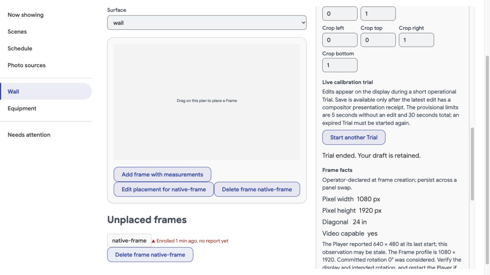
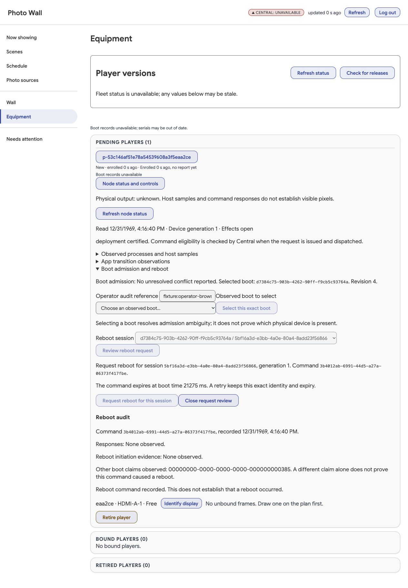

# DisplayHost native build and virtual compositor evidence — 2026-09-30

Status: native implementation and focused virtual checks passed; production
DisplayService, same-process revision adoption and live CalibrationTrial integration
are in progress. This does not qualify physical scanout, HDMI, Pi capacity, visible
continuity, GPIO timing, or the actual GTK Player rendering path.

## Artifact boundary

The first successful arm64 native package is
`/tmp/photo-wall-native-build/photo-wall-node-display_arm64.deb`, SHA-256
`b344d50ec31e4e87fef88961c2abcbca844c7003f9ef3efbc9fcac14aa83fcf6`.
**That package predates the configure/lifetime fixes exercised by the final smoke.**
It must not be released as the smoke-qualified source. A final source rebuild and
new hash remain required after native revision support stabilizes.

Build source was the uncommitted working tree. The authenticated builder was
`python@sha256:f77ac9e44ae96ef2c90b8053ea08c31f8be030f824196b0ae4db6d462c84e51f`,
using the declared Debian snapshot `20260904T000000Z`. Installed builder packages
were normalized against that snapshot with authenticated APT priority 1001 and
explicit downgrades before dependency installation. Successful build session
65245 exited 0. Native dependencies included Weston 14.0.2, Wayland 1.23.1,
wayland-protocols 1.44, Cairo 1.18.4 and GCC 14.2. All three native targets compiled:
shell module, private diagnostic client, and app-owned frame client library.
Build image: `sha256:ec4568a16e71f03095ec66395ad81c767bf5beec965b80d945f814b5f3d00ba9`.
Package inventory and source manifest were emitted beside the package.

Initial build failures were real and repaired: missing CA certificates in a Debian
builder, snapshot/newer preinstalled Perl version conflict, nonexistent separate
libweston-desktop-14 pkg-config dependency (Weston 14 merges that API), upstream
header pedantic warnings, and a refresh signedness mismatch. No insecure APT or
TLS bypass was used.

## Actual virtual compositor checks

The reusable fixture is [native_display_smoke.py](../../tests/native_display_smoke.py)
with [native_display_probe.c](../../tests/native_display_probe.c). The final run
(session 74611, exit 0) rebuilt current mounted native sources in the compiled
image above, then started real Weston on Linux 6.12.54-linuxkit/aarch64:

```text
weston --backend=headless-backend.so --renderer=pixman \
  --shell=/usr/lib/photo-wall-display/photo-wall-shell.so \
  --width=640 --height=480 --idle-time=0 --socket=wayland-0 --no-config
```

Eight assertions passed:

1. App absent: the private diagnostic buffer receives actual compositor presentation.
2. An unprivileged public Wayland client cannot acquire the private diagnostic role.
3. An unprivileged process cannot connect to the controller socket.
4. Exact candidate process/grant metadata correlates with actual compositor feedback.
5. A stale handoff buffer is refused.
6. Handoff acknowledgment is separate, followed by the admitted server grant event.
7. App exit restores private diagnostic presentation.
8. Diagnostic-client crash causes recovery and a new presented diagnostic buffer.

Earlier real runs exposed missing initial xdg size configuration and a shell-layer
shutdown warning. Both were fixed before the eight-check run. The fixture runs
one 640×480 virtual Output, uses software rendering and synthetic SHM buffers, and
supplies a protected control fixture's InvocationID. It does not exercise systemd
process verification, Registry authority, real media or the GTK bridge. Its runtime
directory is 0711 to admit a different test UID; production uses a private runtime
and an explicit public Wayland socket bind. The Weston runtime-directory warning
in this fixture is expected. No physical display claim follows from these checks.

Exact native source hashes for the eight-check run:

| Source | SHA-256 |
| --- | --- |
| `shell.c` | `fffba62e5facd7a4f9cd49b20deefd97bb2e64a4bc619bd9d043abe2a7879403` |
| `diagnostic-client.c` | `c26f7a983bb3d3a83b1ca4497f512144a0b2adc3d7dfa2c39b05c27acf4e373a` |
| `frame-client.c` | `13559a025f04fbbd73b44316f946179a71f063c0f8c3d422759fab7b8fa7bc1f` |
| `photo-wall-frame-v1.xml` | `8a6dce4b97a6eb68e7aa6eca5cdc2cda3e33b16bd3a345f06853881b7d8edf59` |
| `meson.build` | `891106a95179081ed7223cca4746830517546d153416355eda8615ce3050c73b` |

## Implementation checkpoint

No build or smoke process remains live at this checkpoint. The shell, protocol,
private diagnostic client, Python controller, app-private client and GTK opt-in
render hook exist. The controller's local protected ingress alone is not a
production Central driver. Remaining work includes the durable Central display
exchange and explicit Runtime admission decision, base network worker/session
integration, same-process revision handoff retaining the old admitted surface,
CalibrationTrial delivery/render metadata/protected overlay/Save CAS, final native
package rebuild, and targeted regressions. Broader required project checks belong
to final integration; this evidence does not imply they have run.

The [backend design](../display-host-backend.md) records authority boundaries and
primary technical references. Product policy remains in the
[node domain model](../player-node-domain-model.md#display-and-calibration).

## Revision and production driver checkpoint

Subsequent native smoke session 34894 exited 0 with **ten** assertions, adding
same-process revision promotion without diagnostic takeover and pending-revision
expiry that preserves the active surface. The earlier eight assertions passed
again. This run rebuilt the current mounted sources; the earlier package remains
outdated. Full output is local `/tmp/pw-revision-smoke.log`.

The expanded run exposed overly strict presentation correlation: a genuine
presented buffer can precede a newer queued commit. Correlation now requires the
current exact grant, Output generation, actual compositor `presented` message and
an increasing presented-buffer serial, rather than equality with the newest queued
commit. A late old-grant message cannot renew a promoted revision. Redundant xdg
configuration during commits was also removed. These are runtime findings, not
physical display qualifications.

The production driver now exists in `appliance/display_host/service.py` and is
started by the controller with the base credential's Central/serial/offer fields.
A bounded network worker owns session persistence and exchanges; native policy
stays on the controller thread. Central's new `NodeDisplay` service persists
immutable decisions and requires the explicit Runtime admission port. A genuine
later handoff completion refers to that decision and its original deadline before
Runtime may clear the exact Output-loss condition. Same-producer credential
renewal may transport an already-observed completion; it does not reinterpret an
unapplied old-session decision. These paths still need their focused integration
checks and real driver-to-Central-to-native exercise.

Independent review hardened the local controller with per-packet Unix credentials
and a second kernel process sample. The shared session helper now accepts the
actual compositor incarnation. Focused source lint passed after import fixes.
The first `scripts/test_local.py` attempt failed before running tests because this
worktree has no `.env`; isolated database invocation is being coordinated rather
than copying or printing credentials. No process remains live after session 34894.

Remaining: targeted DisplayService/Runtime/session regressions, real composed
network/native qualification, live CalibrationTrial (including operator UI),
protected calibration overlay/Save CAS, final native package rebuild and hash,
and broad project integration checks. The existing Registry preview field is not
treated as the new Trial implementation.

## Stabilized native, Trial and operator evidence

The later implementation completes the production DisplayService exchange and
CalibrationTrial path described as remaining above. These checkpoints supersede
those earlier source-status statements; earlier package hashes still identify
only their own builds.

The current native build uses Weston 14.0.2 and the authenticated Debian snapshot
`20260904T000000Z`. The final compiled image is
`sha256:ebab715ed7a02ad7d14a5a4ab8fa0b6bfe439fa66b6ab0302a3b829bde19686b`.
Its arm64 package is locally retained under
`/tmp/photo-wall-native-qualified-build/` with the source/build manifest and
resolved package lock. Package SHA-256 is
`f9f29dc053a28672f17eb022f5d0f4825acf490aefafc27a120ebc60a772975a`.
The app-private client SHA-256 is
`897cbd04d206d5222c4ab7812494538f62d6a505b45d2f32a0f237428425626d`.
The compiled closure marker is
`weston14-5b30bddcf8c4905abd06afc22005c61c94e28127045d6b3858e2657979f643db`,
plugin ABI `frame-v2`. This marker incorporates actual native binaries,
architecture, pinned runtime packages and copied source identity.

The expanded native fixture passed **16 assertions** (session 30002, local log
`/tmp/pw-native-smoke16.log`). In addition to the prior ten, it verifies wrong-hash
and wrong-commit overlay refusal, genuine private-overlay presentation, terminal
Trial generation refusal, exact recent-receipt handoff after a newer frame, and
old-revision receipt rejection after promotion. The shell retains at most 128
actual presentation receipts for five seconds, clearing them on invalidation or
revision promotion. It accepts only the named original receipt, never substitutes
a newer frame, and still requires the live exact grant and process.

The actual GTK path exposed two integration defects that synthetic clients did
not: GTK sets its Output app ID after its initial map, requiring one bounded
configure on authorized target/dimension resolution; continuous redraw can move
the newest frame during the Central round trip, requiring the exact bounded
receipt history above. Actual Wayland traces showed tag, feedback request,
attached buffer and commit on the same GDK wl_surface. The corrected actual GTK
chain passed in 16.44 seconds. The frozen packaged Player from Linux dependency
image `sha256:81102e1a5ad933ac7ff00bc4b297a6a44183cd41446a42970b53cb9ab0deefd8`
then passed Trial expiry during a delivery partition, a genuine baseline-tagged
presentation, explicit new Trial and first-calibration Save (session 9236,
21.47 seconds). Its `player/native.py` SHA-256 at that checkpoint was
`e08bb80c712878f106e5b8ca939e27be53269fd07570392451c5687606306f22`.
The subsequent normal-media witness helper change is Python-only and requires a
fresh final Player package; it is not retroactively covered by that frozen artifact.

The composed test uses the real production controller/network worker, mounted
Central HTTP routes, isolated PostgreSQL schemas, Registry/Runtime owners and
actual Weston presentation callbacks. Its PID1 process-admission port and operator
authentication are explicit fixture substitutes. The renderer runs with software
Mesa in a disposable headless container using canonical Player dependencies;
it does not qualify a sealed systemd launch, physical DRM/HDMI scanout, Pi timing,
or the final device resource profile.

The operator console was built with bundled Node 24 and exercised in the browser
against the same real API/GTK/compositor fixture with an advancing clock. Begin
and gain edit showed Save disabled while pending; Save became possible only after
the latest exact receipt, committed gain 0.4 appeared in readback, and the UI
reported "Trial saved". A further Trial after revision adoption ended explicitly.
A prior run verified expiry retained the draft and required explicit restart.
It also exposed a real driver cadence defect: new Trials inherited the prior
three-second idle sampling deadline and could expire before the first receipt
upload. New Trial/sequence delivery now advances the next sample to 100 ms;
active polling remains bounded at 250 ms and returns to idle after termination.
Browser session 81509 exited successfully in 69.51 seconds. The fixture deliberately
does not publish the general Central health/Player heartbeat APIs, so its health
labels are unavailable rather than fabricated.



Registry selects native Trial capability from durable node boot/producer state,
independent of session availability, and rejects legacy calibration writes for
that binding. Uncalibrated disabled Outputs render an empty operational fallback
without a Plan or readiness assertion. An explicit Trial may draw a procedural
commissioning grid through the same canonical calibration shader; neutral geometry
is not persisted until Save. Trial transforms remain separate from authored
composition and are carried in actual draw acknowledgments/observations. Only a
matching real compositor tag can satisfy Trial Save; base-owned primitives remain
legible at zero app gain. Local expiry/end tombstones prevent delayed revival.

The final focused database/Executor slice passed **53 tests** (session 98173,
7.45 seconds). Freshness uses the shared enrolled boot-clock estimate, preserving
original sample and receipt age across transport retries; delayed request/receipt
pairs cannot refresh themselves by arriving later. The provisional future-clock
tolerance is 1000 ms. The console production build and scoped Ruff checks passed.
An earlier host-Node Vite attempt failed at crypto initialization; the supported
bundled Node build succeeded. Full project checks remain the orchestrator's final
integration step.

Remaining implementation audit items are recorded separately from physical
qualification: explicit convergence of a live rebind currently relies on old
frame cessation/lease expiry and needs the scoped withdrawal decision followup;
whole-node observed-status/reboot/boot-ambiguity operator controls are a separate
UI leaf. Final normal-media witness consumption must be exercised from its newly
packaged Player. No hardware operation or deployment occurred in these checks.


## Frame identity, explicit withdrawal, and node operator completion

This checkpoint supersedes the frame-v2 package described above. Frame-v3 adds
explicit Frame identity to canonical Surface, native grants, revision comparison,
Trial baselines, and actual media witness hashes. Two Frames with identical
binding/configuration counters are now distinct authorities. Historical facts
without Frame identity remain observational and cannot resolve current output loss.

The real headless Weston suite passed **18 checks**, including all prior Trial and
presentation cases, actual `role_removed` acknowledgment after exact withdrawal,
and refusal of an old Frame withdrawal after a replacement with equal counters.
The first added fixture incorrectly waited for a role-removal event after the
command response even though the native event had already arrived. The fixture
now retains that event; production already queues events arriving before responses.
The final production-driver check exercises this order end to end.

The current-source GTK / mounted HTTP / PostgreSQL fixture passed in **20.44
seconds** (session 9898). It exercises the actual GDK render commit, candidate and
handoff, first-calibration Trial receipt, delivery partition and local baseline
redraw/presentation, restart and Save, then Registry unbind, explicit Central
withdrawal, native role removal before response, production event queue, and
durable completion. Its clock now advances with real compositor elapsed time;
a restart after partition waits for a fresh original presentation upload. PID1
invocation authority and gate admission are fixture inputs; this is not hardware
or serving-image certification. The equal-counter/rebound historical-completion
slice passed eight database tests, including session renewal after role removal.

The final frame-v3 build used the declared digest-pinned Python builder and
20260904T000000Z snapshot. Output is `/tmp/photo-wall-native-frame3-build`:

- Built image: `sha256:90c772d80b3d8a6c0b733e3fdd4464e14e83bc331dc757d828c0b4b8e57cef8c`.
- Copied source closure: `e6f4310155ecc26b3a9805c8a97133b9576c420487e601caef90915cf8ab681b`.
- Native Debian package: `00731c94838f064a147605fac011739f995d3771f00d7ea783373131fc613ebe`.
- App-private client: `a76f6ae10ffecc7c61242161a22106539056c2337fbf8c5c12ed551ab29120e6`.
- Graphics ABI: `weston14-3734f476404779775c755b829a6583bcfeb9142a52f3c30a6b15b97709e3f31f`; plugin ABI `frame-v3`.

The exact artifacts and provenance were handed to the Linux packaging owner for
a new frozen Player/base closure. That final frozen Player execution remains a
separate check from current-source execution. Broad integration checks and
physical DRM/HDMI/dual-Output timing remain outside these native fixture claims.

The Equipment page now includes node status, host samples, app transition
observations, exact-boot ambiguity resolution, and explicit reboot review. It
reads owner projections; unavailable facts remain unavailable. Command recording,
command responses, reboot initiation events, later boot claims, and physical
completion are separate. Unknown response retries retain the original command
UUID, session, generation, and expiry. Boot selection carries the captured device
generation and admission revision, and requires a new explicit choice after CAS
refusal.

The actual production console and Central APIs passed an isolated browser
walkthrough (session 27714, **89.06 seconds**). A fixture competing operator changed
the boot revision after selection: the UI showed refusal and required reselection.
A fixture gateway then discarded a successful reboot response: the UI showed
unknown, retained the exact request, and retried it. The final database contained
one command, with no command consumer and no physical reboot. The screenshot
shows recorded command and unknown initiation/output distinctly. General Fleet
and health endpoints are intentionally absent from this fixture. Cosmetic layout
spacing was adjusted after this capture; action logic is unchanged.




Final owned focused regression passed **55 tests in 7.91 seconds** (session 47779),
including the followup capability audit: a known V2 device remains native-Trial
capable after session revocation, superseded boot admission, and device-generation
change. None of those absences may enable legacy calibration writes. Explicit
capability downgrade is outside this implementation; uncertainty fails closed.
The final owned Ruff check and production console build passed. One mistyped test
filename produced no test collection before the corrected focused invocation;
no skipped or failed invocation is counted as a successful qualification.


## Frozen Player media and revision-before-upload withdrawal

The frozen frame-v3 Player completed the composed check in **22.46 seconds**
(session 5882). Its application imports came from the packaged tree at
`/private/tmp/photo-wall-node-frame3-review/player/usr/lib/photo-wall-player`,
not the mutable repository. The fixture image was
`sha256:7bc8b063f6bb22cd05036f469c8760243e1635c15cc721b6c9a6c967c517b7d1`,
derived from the frozen Player dependency image
`sha256:461acad6ed3291a485ed7289d3136e5126ec70bd7f85de6c2a372e09a378bf4e`
with the native package's declared `libjansson4=2.14-2+b3` dependency added from
the same pinned snapshot. This is a disposable composed fixture, not the new
Linux base image containing the subsequent IPC, XDG, capability, and seat repairs.
Native package, private client, and graphics ABI identities are the frame-v3
values above; no native or Player source changed for this repair.

Captured import SHA-256 values were:

- `player/native.py`: `77b0fad0d9616d969a17a82d433554cc87c003baf9b80e66462bbd2b4fcaf585`.
- `player/wayland_frames.py`: `9672635f0678def00f05adb1923bd391fd377e8773a7ffde81a385ef44cfd86d`.
- `contracts/node_frame.py`: `4adef18cbea91c754a3e8f33d92dec55c309574c9917671c5c0ddb4e20a9d4c9`.

The actual GTK/GDK commit path exercised candidate presentation, explicit Runtime
handoff, first-calibration edit/presentation, delivery partition with local expiry
and baseline presentation, restart, Save, and committed revision promotion. A
synthetic PNG (`d0b526d7752c8dc9d9f6f7100519820be68416da0e858f011388b299d39edd59`)
then passed the real Executor acquisition, GStreamer preparation, readiness,
fixture Commit, GTK draw, and compositor presentation path. Its actual native
receipt matched the expected media assignment/variant/calibration witness
`16cf1806d4c0273d32e26d8034d191e63a8fc9b298ef01b2612fa8734434c573`.
The subsequent immediate Registry unbind produced exact native role removal,
including the occurrence arriving before command response, and durable Central
withdrawal completion. PID1 invocation checks and Plan/Commit authority remain
explicit fixture inputs; this is not NodeAcceptance certification or physical
DRM, HDMI, dual-Output, or visible-timing qualification.

An earlier run (11751) established that same packaged media witness but failed
after unbind: native revision promotion had not yet reached the next Central
observation, so Central permanently refused the previously unknown role. The
repair recognizes an exact immutable revision/handoff authorization plus a fresh
matching original native receipt as prior-role identity **for withdrawal only**.
It does not grant presentation, Runtime recovery, or a replacement role; the
current Registry/Runtime withdrawal decision remains required. Recognition is
bounded to 128 recent decisions for the same producer and Output. Renewal can
carry historical same-producer evidence without reissuing or extending its old
command. Seven database regressions passed in **6.94 seconds** (98628), including
wrong Frame/config/process, missing or pre-issuance receipt, and session renewal.
Scoped Ruff passed with `--no-cache`; a prior cache-writing invocation was refused
by the filesystem sandbox and is not counted as a source failure.

Earlier probe failures were retained as diagnostic history: the Player-only
fixture lacked a declared base dependency; one synthetic clock started at zero
rather than native monotonic time; another assertion required exactly one handoff
although Save legitimately added another. None was counted as a successful run.
Final logs are `/tmp/pw-frame3-frozen-gtk.log` and
`/tmp/pw-frame3-frozen-render-evidence.log`. The exact invocation used
`tests/test_node_display_native.py` with `PHOTO_WALL_GTK_PROBE=1`,
`PHOTO_WALL_MEDIA_PROBE=1`, the frozen Player tree, frame-v3 artifact directory,
and the composed fixture image above through the isolated PostgreSQL harness.
