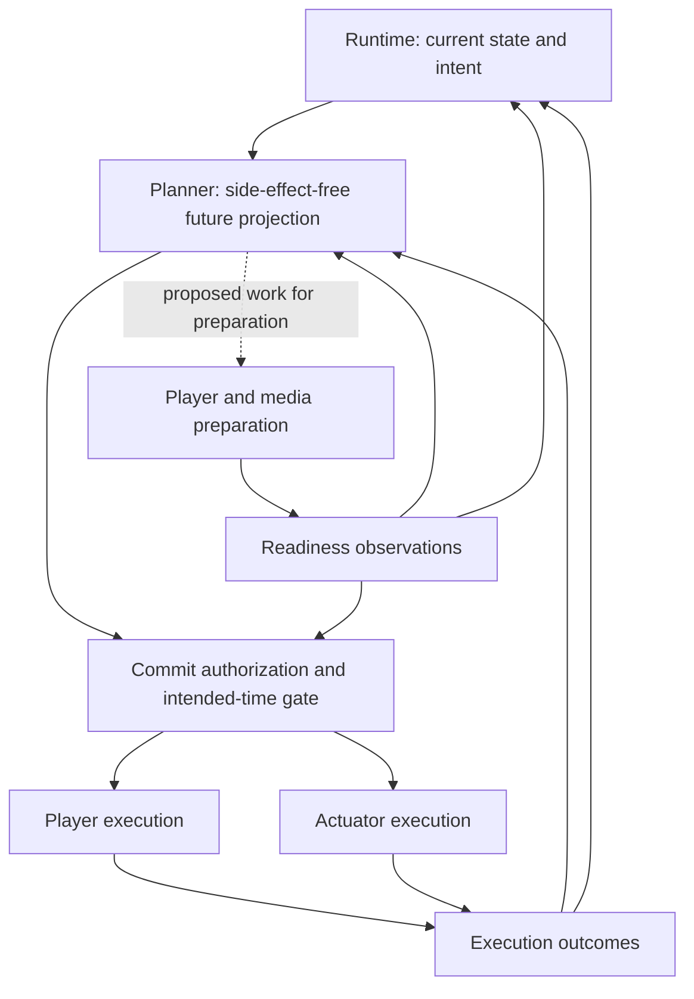

# Execution contract

> **Status: proposed semantic contract.** This defines module obligations, not wire-format fields. Exact policies and state transitions are recorded in [design decisions](design-decisions.md). The [requirements](requirements.md) define Scene behavior; [architecture](architecture.md) assigns deployment and module ownership.

## Intent, preparation and execution

Runtime owns current Run lifecycle and per-target intent. Planner projects future assignments without applying future events to current Runtime state or physical devices. Executors perform only authorized work at its intended time. Preparation may happen earlier.

The gate is a responsibility, not another service. Local executors enforce timing after receiving authorization; a future-dated command is not permission to act immediately. Projecting January at 23:58 may acquire files but must not finish December, start January children in current state or emit future lighting cues.

## Concrete plan agreement

A plan resolves enough information for local execution without repeating central source selection or resolving global Scene priority, while preserving the [central media boundary](requirements.md#central-media-boundary):

| Contract information | Required meaning |
|---|---|
| Identity and authority | Activation and Run identity, execution epoch, plan identity/revision and validity; correlate outcomes and reject obsolete authority. |
| Participants | Typed Frame/Actuator targets, responsible executors, concrete Output bindings and binding generations. |
| Configuration | Resolved authored revisions and relevant calibration/equipment revisions. |
| Media | Upstream-neutral exact variant/content identities, central show system retrieval references, intended assignments and required underlying state for reveal. |
| Timing | Intended execution times, media positions, preparation deadlines and validity limits. |
| Presentation | Local layers/effects and resolved Actuator state/cues. |
| Readiness policy | Required/optional participants, capacity needs and late/missing-participant behavior. |
| Failure intent | Per-target fallback, mandatory outcomes and consequences for Run completion. |
| Feedback | Acknowledgments, readiness changes and observed execution/failure with enough context to reconcile state. |

Resolve typed targets centrally. A display plan need contain only its Player's relevant outputs, but lamps remain managed participants in the central plan. A parent's full target union must remain distinct from its current contribution: a later child's Frame is not implicitly darkened early. Omission of an Actuator expresses no command to it.

Authored edits default to the next Run; live query results remain changeable data. Define when referenced Scenes, sources and group membership resolve. A later child launch is a new Run; freezing every descendant revision at parent admission is an open policy, not an assumed rule.

## Readiness and commitment

Distinguish these conditions rather than collapsing them into one cached/ready flag:

1. **File secured:** exact complete bytes are acquired and validated locally.
2. **Playback prepared:** imminent media is prerolled or seek-prepared for its intended position.
3. **Execution resources available:** whole-Player capacity, renderer, equipment mapping, clock health and required external capabilities support the work.
4. **Execution authorized:** relevant revisions, participant policy and commitment permit execution at the intended time.

Readiness can change. Specify its invalidation, acknowledgment and deadline rules. Two cached videos plus an overlay do not prove sufficient decoder capacity. A database transaction does not establish distributed readiness.

Once an assignment is scheduled and secured by responsible Players, its content is fixed for that execution. Planning may revise other future work. Define the exact transition connecting secured assignments to committed execution, including supersession and recovery; content lock does not guarantee successful presentation.

Before acquisition, missing upstream media permits a compatible dynamic replacement or an authored alternative/fallback. After commitment, a failure follows the declared execution policy rather than silently rerolling content. Possible missing-participant policies include waiting, skipping, fallback, exclusion before commitment or controlled late join; choose supported policies and their lifecycle consequences explicitly. Optional animation must not block a mandatory outcome such as bedtime darkness.

## Time and current-state reveal

Maintain separate concepts for:

- **Logical Run time:** current lifecycle, assignment and intended media/effect position, including hidden output.
- **Scheduled execution time:** when resolved changes should become physical across participants.
- **Local monotonic time:** the local scheduling basis, which continues while media playback is paused.
- **Pipeline time:** GStreamer running time can pause independently; media position and pipeline running time also differ. Map these to the logical Run and scheduled execution times explicitly. See the [GStreamer clock model](https://gstreamer.freedesktop.org/documentation/application-development/advanced/clocks.html).

A covered clip paused at 12 seconds and revealed 20 seconds later may require position 32 seconds or a new assignment. Prepare that current state before reveal. Underlying lighting similarly resumes at its current intended value. Do not replay hidden changes or superseded cues.

Use synchronized system clocks and a defined mapping into local monotonic/media time. The Player obtains an authenticated sample from `/v1/player/time`, independent of control-state delivery and bound to its current Player/session epoch. Record RTT, midpoint offset, application delay, transport/application drift, mapping age, detected step, uncertainty, and rejection counters. A rejected probe withholds clock-dependent readiness. Measure visible start skew and drift across actual panels; clock agreement or a successful synchronized start alone proves neither. Tight synchronization remains a qualification decision; do not promise frame accuracy from software timestamps.

## Control-channel semantics

Start with a typed application protocol over a persistent Player-originated WebSocket connection and separate HTTPS file retrieval from the central show system. MQTT remains an external integration boundary. Transport selection does not replace these obligations:

- Support trusted provisioning observation, fresh process-key enrollment and initial equipment reporting according to [automatic Player provisioning](requirements.md#player-provisioning); represent unknown equipment as unbound before issuing Frame execution authority.
- Authenticate the Player and negotiate protocol version/capabilities.
- Exchange desired revisions and observed/applied state; reject stale configuration.
- Correlate requests, acknowledgments and outcomes; make mutating/time-sensitive exchanges idempotent.
- Support proposed plans/manifests, preparation results, commitment, cancellation and execution observations.
- Detect disconnects with keepalive; define flow control and reconnect/current-state exchange.
- Carry enough identity, epoch/revision and validity context to reject duplicates and obsolete work.

An acknowledgment must state what it establishes: receipt, accepted configuration, secured file, prepared playback or observed presentation are different facts. Readiness and failures reach both Planner and Runtime; assignment revision and lifecycle completion have different owners.

## Central persistence and reconciliation

| Durable owner | State to specify | Recovery invariant |
|---|---|---|
| Installation/registry | Equipment records and observations, desired configuration, current/retired bindings, calibration, and generations. | Returning equipment regains centrally assigned Frames through fresh enrollment; unknown equipment remains unbound; observations never overwrite operator intent. |
| Runtime/activation ingress | Active Run identities/epochs, lifecycle, logical-time basis, adopted revisions and activation identity. | Restart neither duplicates scheduled activation nor restores an obsolete background beneath an independent overlay. |
| Planner/commitment | Locked assignments, exact variants, relevant revisions and execution status. | Secured content is not rerolled; uncommitted projections may be rebuilt safely. |
| Media and queue | Source/preparation/publication lifecycle, authoritative blobs/references, Procrastinate jobs and retry attempts. | Task defer is atomic with the domain request; publication recovery and attempt tokens reject stale work. |
| Provisioning/releases | Immutable releases, accepted/candidate policy, boot attempts, consumed trials, and current boot/session health. | Duplicate requests are idempotent; stale health cannot promote; a consumed failed trial falls back centrally on the next boot. |

Define transaction boundaries and crash recovery around admission, preparation, commitment and execution reporting. Specify whether an uncertain outcome can be retried, reconciled from observation or marked failed. Persisting a command is not evidence that it appeared on a panel or reached an Actuator.

The Player row is intentionally absent from the durable-owner table. Player keys, tokens, epochs, plans, commitments, pins, and cache metadata are process-local. A surviving file is only a candidate until rehashed against the current central manifest. On every process start or reconnect, central issues/reconciles fresh session authority and sends the current configuration, plan, revocations, and commitments needed to converge. A log of missed commands or local journal is neither required nor trusted.

## Failure behavior

During a running-process outage, preserve already authorized visible output while its bounded lease permits it. Losing the server alone need not immediately blank a valid composition. New work, lease extension, and recovery after process restart or cold boot require central connectivity. Do not promise playback across cold reboot from cached files or old instructions.

Keep an empty eligible pool distinct from permission, API, transport, conversion and playback failures. Use the centrally selected last valid still for an empty eligible pool by default, or configured fallback when none exists. Process-local pins protect bytes needed by current authorized work. Cache deletion or corruption invalidates readiness and reacquires the same locked assignment; it does not reroll centrally secured content.

Typed execution outcomes return to both Runtime and Planner through the coordination application boundary. Runtime owns lifecycle consequences; Planner owns replanning/cooldown without silently changing secured selection. Natural completion waits for own work and children to finish or be cancelled; downward cancellation remains distinct. Program expiry stops new cycles and requests completion of current activity without draining prefetch. Actuator adapters apply only currently authorized contributions and report outcomes through the same ownership model.

Validate the contract with deterministic traces plus physical output evidence: projection over a calendar boundary, current-state reveal, partial readiness loss, upstream deletion, stale revisions, replacement, duplicate requests and restarts around commitment. The [implementation plan](implementation-plan.md) orders the work; [validation](validation.md) defines the evidence for completion.
