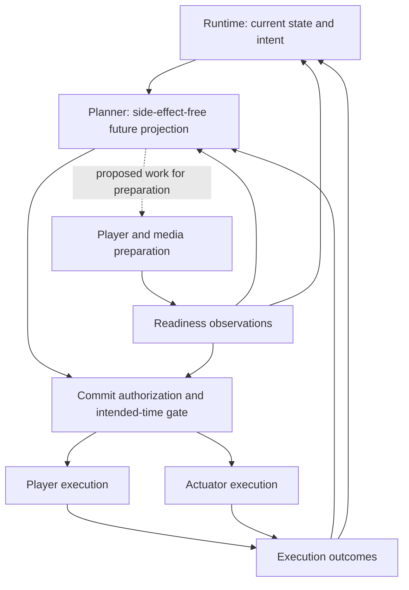

# Execution contract

> **Status: proposed semantic contract.** This defines module obligations, not wire-format fields. Exact policies and state transitions are recorded in [design decisions](design-decisions.md). The [requirements](requirements.md) define Scene behavior; [architecture](architecture.md) assigns deployment and module ownership.

## Intent, preparation and execution

Runtime owns current Run lifecycle and per-target intent. Planner projects future assignments without applying future events to current Runtime state or physical devices. Executors perform only authorized work at its intended time. Preparation may happen earlier.

```mermaid
flowchart TD
    RUN[Runtime: current state and intent] --> PLAN[Planner: side-effect-free future projection]
    PLAN -. proposed work for preparation .-> PREP[Player and media preparation]
    PLAN --> GATE[Commit authorization and intended-time gate]
    PREP --> READY[Readiness observations]
    READY --> GATE
    GATE --> PLAYER[Player execution]
    GATE --> ACT[Actuator execution]
    PLAYER --> OBS[Execution outcomes]
    ACT --> OBS
    READY --> PLAN
    READY --> RUN
    OBS --> PLAN
    OBS --> RUN
```

The gate is a responsibility, not another service. Local executors enforce timing after receiving authorization; a future-dated command is not permission to act immediately. Projecting January at 23:58 may acquire files but must not finish December, start January children in current state or emit future lighting cues.

A cue is a forecast until it starts: an edit that changes its members or their Outputs, or drops it from the timeline, supersedes it (`superseded`) with a new cohort, withdrawing any commit already granted in its preparation window; the new cohort keeps the late-join preparation grace past its start, so a Player that fetches it late can still commit it. A started cue is immutable; if one would grow, that cue alone is skipped (`cue_membership_changed`) and every other Frame keeps its offers.

## Concrete plan agreement

A plan resolves enough information for local execution without repeating central source selection or resolving global Scene priority, while preserving the [central media boundary](requirements.md#central-media-boundary):

| Contract information | Required meaning |
|---|---|
| Identity and authority | Activation and Run identity, execution epoch, plan identity/revision and validity; correlate outcomes and reject obsolete authority. |
| Participants | Typed Frame/Actuator targets, responsible executors, concrete Output bindings and binding generations. |
| Configuration | Resolved authored revisions and relevant calibration/equipment revisions. |
| Media | Upstream-neutral exact variant/content identities, central show system retrieval references, intended assignments and required underlying state for reveal. |
| Timing | Intended execution times, media positions, preparation deadlines and validity limits. |
| Presentation | Local layers/effects and resolved Actuator state/cues. |
| Readiness policy | Required/optional participants, capacity needs and late/missing-participant behavior. |
| Failure intent | Per-target fallback, mandatory outcomes and consequences for Run completion. |
| Feedback | Acknowledgments, readiness changes and observed execution/failure with enough context to reconcile state. |

Resolve typed targets centrally. A display plan need contain only its Player's relevant outputs, but lamps remain managed participants in the central plan. A parent's full target union must remain distinct from its current contribution: a later child's Frame is not implicitly darkened early. Omission of an Actuator expresses no command to it.

Authored edits default to the next Run; live query results remain changeable data. Define when referenced Scenes, sources and group membership resolve. A later child launch is a new Run; freezing every descendant revision at parent admission is an open policy, not an assumed rule.

## Readiness and commitment

Distinguish these conditions rather than collapsing them into one cached/ready flag:

1. **File secured:** exact complete bytes are acquired and validated locally.
2. **Playback prepared:** imminent media is prerolled or seek-prepared for its intended position.
3. **Execution resources available:** whole-Player capacity, renderer, equipment mapping, clock health and required external capabilities support the work.
4. **Execution authorized:** relevant revisions, participant policy and commitment permit execution at the intended time.

Readiness can change. Specify its invalidation, acknowledgment and deadline rules. Two cached videos plus an overlay do not prove sufficient decoder capacity. A database transaction does not establish distributed readiness.

Once an assignment is scheduled and secured by responsible Players, its content is fixed for that execution. Planning may revise other future work. Define the exact transition connecting secured assignments to committed execution, including supersession and recovery; content lock does not guarantee successful presentation.

Before acquisition, missing upstream media permits a compatible dynamic replacement or an authored alternative/fallback. After commitment, a failure follows the declared execution policy rather than silently rerolling content. Possible missing-participant policies include waiting, skipping, fallback, exclusion before commitment or controlled late join; choose supported policies and their lifecycle consequences explicitly. Optional animation must not block a mandatory outcome such as bedtime darkness.

## Time and current-state reveal

Maintain separate concepts for:

- **Logical Run time:** current lifecycle, assignment and intended media/effect position, including hidden output.
- **Scheduled execution time:** when resolved changes should become physical across participants.
- **Local monotonic time:** the local scheduling basis, which continues while media playback is paused.
- **Pipeline time:** GStreamer running time can pause independently; media position and pipeline running time also differ. Map these to the logical Run and scheduled execution times explicitly. See the [GStreamer clock model](https://gstreamer.freedesktop.org/documentation/application-development/advanced/clocks.html).

A covered clip paused at 12 seconds and revealed 20 seconds later may require position 32 seconds or a new assignment. Prepare that current state before reveal. Underlying lighting similarly resumes at its current intended value. Do not replay hidden changes or superseded cues.

Use synchronized system clocks and a defined mapping into local monotonic/media time. The Player obtains an authenticated sample from `/v1/player/time`, independent of control-state delivery and bound to its current Player/session epoch. Record RTT, midpoint offset, application delay, transport/application drift, mapping age, detected step, uncertainty, and rejection counters. A rejected probe withholds clock-dependent readiness. Measure visible start skew and drift across actual panels; clock agreement or a successful synchronized start alone proves neither. Tight synchronization remains a qualification decision; do not promise frame accuracy from software timestamps.

## What a Frame keeps

Central plans what each Frame keeps after a layer, and the plan says it: the Player makes no content decision of its own (owner, 2026-10-10: "Can we add some metadata to indicate if the content should be held/frozen vs fade?"). Each layer carries one after-state, `Layer.after_end` ([contracts/models.py](../contracts/models.py) `AfterEnd`), for when nothing plays on its Frame, the Player's fallback during an outage included:

| After-state | What the Frame keeps | Written by the console for |
|---|---|---|
| `keep_this_photo` | This opaque still, at full strength | **Keep the last photo up**: every photo of the Scene |
| `keep_nothing` | Nothing: black | **How it ends**, Black or Fades out: the ending |
| `leave_as_is` (default) | Whatever an earlier layer set | Everything else |

- **When it takes effect.** `keep_nothing` at the layer's first draw; `keep_this_photo` at the first draw after its fade-in is over (so the photo is kept at full strength). A layer withdrawn, cancelled or invalidated before then changes nothing; one that took effect stays in effect when a later plan drops it. A kept photo of a Scene beneath an ending is kept again at its next draw once the ending is over. After a Black ending, an outage stays black (owner, 2026-10-10: "Stay black").
- **A kept photo's last cycle.** Runtime plans no fade-out for a kept photo in its Run's final cycle when nothing else plays on that Frame at the cycle's end: the Scene has no ending there, and no other Run contributes to the Frame then, a see-through one included (the Player draws a kept photo only as its fallback, never beneath a playing layer), in Runtime's own projection of that moment, bounded by the caller's event budget (`central/runtime.py` `_may_hold_to_the_end`, `_followed_at`). So the photo never dips to black and snaps back to itself, while a Program right after it, or a Scene beneath it, is still faded to. A cycle is final when the Scene does not loop, or when the Run's stop (Program end, duration, scheduled finish, Finish) falls in it. The first three are known from the start; a Finish, or a follower that appears later, revises the current cycle's fade-out. Central may revise only an offered layer's arbitration, fade-out and after-state (`central/planner.py` `REVISABLE`). The Player adopts it at its next commit; an outage between the Finish and that commit shows the old fade-out once.
- **Players released before it.** A Player reads `after_end` only if it offered the `layer_after_end` capability at hello ([contracts/player_control.py](../contracts/player_control.py)). Central sends any other the yes/no `retain_on_expiry` it parses (`keep_this_photo` is yes), so it behaves as its release did; a Player whose Central did not select the capability reads that flag back the same way. Every released Player forbids unknown fields (`contracts/models.py` `Model`), so this projection is required ([Player control-protocol compatibility](player-protocol-compatibility-design.md); `tests/test_player_control_protocol.py`).
- **Stored data.** Migration `071_layer_after_end.sql` moved stored Scenes, Runs, offers and locks from the flag (yes is `keep_this_photo`, no is `leave_as_is`) and gave each stored Scene's ending `keep_nothing`. The previous Central build cannot read the migrated runtime state; the [runbook](runbook.md#upgrading-to-content-keyed-os-images-migration-028) has the reverse SQL ("Rolling Central back past the after-state").

## Control-channel semantics

Start with a typed application protocol over a persistent Player-originated WebSocket connection and separate HTTPS file retrieval from the central show system. MQTT remains an external integration boundary. Transport selection does not replace these obligations:

- Support trusted provisioning observation, fresh process-key enrollment and initial equipment reporting according to [automatic Player provisioning](requirements.md#player-provisioning); represent unknown equipment as unbound before issuing Frame execution authority.
- Authenticate the Player and negotiate protocol version/capabilities.
- Exchange desired revisions and observed/applied state; reject stale configuration.
- Correlate requests, acknowledgments and outcomes; make mutating/time-sensitive exchanges idempotent.
- Support proposed plans/manifests, preparation results, commitment, cancellation and execution observations.
- Detect disconnects with keepalive; define flow control and reconnect/current-state exchange.
- Carry enough identity, epoch/revision and validity context to reject duplicates and obsolete work.

Command responses and occurrence events are distinct: receipt/admission does not establish that an effect occurred, and an observed transition may occur without a command. Events identify their producer, boot/epoch, observation context and known causation; duplicates, reordering and gaps must reconcile without repeating effects or manufacturing history. Current-state exchange complements bounded event delivery. Pure reads need no synthetic effect event. The [node command/event inventory](player-node-domain-model.md#commands-responses-events-and-current-state) assigns producers and evidence limits across the proposed layers. An acknowledgment must state what it establishes: receipt, accepted configuration, secured file, prepared playback or observed presentation are different facts. Readiness and failures reach both Planner and Runtime; assignment revision and lifecycle completion have different owners.

## Central persistence and reconciliation

| Durable owner | State to specify | Recovery invariant |
|---|---|---|
| Installation/registry | Equipment records and observations, desired configuration, current/retired bindings, calibration, and generations. | Returning equipment regains centrally assigned Frames through fresh enrollment; unknown equipment remains unbound; observations never overwrite operator intent. |
| Runtime/activation ingress | Active Run identities/epochs, lifecycle, logical-time basis, adopted revisions and activation identity. | Restart neither duplicates scheduled activation nor restores an obsolete background beneath an independent overlay. |
| Planner/commitment | Locked assignments, exact variants, relevant revisions and execution status. | Secured content is not rerolled; uncommitted projections may be rebuilt safely. |
| Media and queue | Source/preparation/publication lifecycle, authoritative blobs/references, Procrastinate jobs and retry attempts. | Task defer is atomic with the domain request; publication recovery and attempt tokens reject stale work. |
| Provisioning/releases | Immutable releases, accepted/candidate policy, boot attempts, consumed trials, and current boot/session health. | Duplicate requests are idempotent; stale health cannot promote; a consumed failed trial falls back centrally on the next boot. |

Define transaction boundaries and crash recovery around admission, preparation, commitment and execution reporting. Specify whether an uncertain outcome can be retried, reconciled from observation or marked failed. Persisting a command is not evidence that it appeared on a panel or reached an Actuator.

The Player row is intentionally absent from the durable-owner table. Player keys, tokens, epochs, plans, commitments, pins, and cache metadata are process-local. A surviving file is only a candidate until rehashed against the current central manifest. On every process start or reconnect, central issues/reconciles fresh session authority and sends the current configuration, plan, revocations, and commitments needed to converge. A log of missed commands or local journal is neither required nor trusted.

## Netboot stage 1: boot data, the clock record and liveness

These are the contracts stage 1 of the netboot keeps, from [decision 0014](decisions/0014-reaching-central-from-every-boot-stage.md). They are proven by tests and CI only. The hardware milestones that would qualify them on a Pi (M0: the loop stays alive for 24 hours; M1: a real boot through the gateway's 301) have not run yet.

**Boot data.** The shipped `initrd.img` is three archives. First comes a small uncompressed `newc` archive holding `usr/lib/photo-wall/clock-floor`, the built revision's commit time, rebuilt on every build and never cached (`scripts/build_netboot_bundle.sh`; [`tests/test_build_netboot_bundle.py`](../tests/test_build_netboot_bundle.py)). It is followed by the cached `mkinitramfs` output: that tool's own early uncompressed archive, then the compressed initrd. Stage 1 and the CA bundle are in the cached part, put there by the initramfs-tools hook of the `photo-wall-netboot-init` package ([Debian packaging module](module-debian-packaging.md), [0019](decisions/0019-debian-packaging-with-debhelper.md) P4); the hook holds two things:

- stage 1's import roots, copied into the initrd interpreter's stdlib directory from the package directories its path file (`appliance/netboot_initramfs/path`) lists: `common`, `netboot-init`, `node-boot` and `uplink`. The list is checked at build time, never trusted: `scripts/import_check.py` refuses a build in which stage 1 imports outside them, and stage 1 must stay stdlib-only on the device ([`tests/debs/test_netboot_init.py`](../tests/debs/test_netboot_init.py); the whole of each listed directory rides along, so unused modules such as `nodeapi` are in the initrd but never imported);
- `etc/ssl/certs/ca-certificates.crt`, copied byte for byte from the scratch root, which installs the same Debian snapshot as the base (R5).

The bundle build refuses a floor later than its own clock plus five minutes. It warns, but does not fail, when the Debian snapshot pin is more than 90 days old. The verifier (`scripts/verify_netboot_initrd.py`) reads the archives as the kernel unpacks them and fails an initrd whose boot data lacks the CA bundle, the floor or a stage 1 module, or whose cached archive holds the floor's file, which would win ([`tests/test_verify_netboot_initrd.py`](../tests/test_verify_netboot_initrd.py)). Because the floor does not pass through the initrd cache, no cache key has to list it. The rest is as fresh as the snapshot pin and the TFTP staging.

**Kernel modules travel with the kernel.** The base squashfs carries no kernel and no modules. It comes from Central and can be a different release from the kernel the Pi booted. The cached initrd therefore carries the running kernel's modules, and stage 1 copies its whole module tree (`/usr/lib/modules/<uname -r>` with depmod's indexes) onto the new root in phase 7. The copy is bounded, and stage 1 pets the watchdog after every file (`hand_over_modules`). The base's udev then loads drivers by alias at coldplug. A kernel staged with another build's initrd has no tree for its release, and phase 7 fails with `code=boot_modules`. The initramfs hook adds the Player's display drivers, `vc4` (KMS and HDMI) and `v3d` (GL), to initramfs-tools' `MODULES=most` set with `manual_add_modules`, which also pulls in their dependencies and softdeps. Input (`evdev`, `hid`, `usbhid`), the watchdog and the Ethernet MAC are built into the kernel.

**The display is turned on in the device tree.** In the bare `bcm2712-rpi-5-b.dtb` the display pipeline and the GPU are disabled, so without an overlay no driver finds a device. The bundle's `config.txt` loads `dtoverlay=vc4-kms-v3d-pi5`, named directly: the generic `vc4-kms-v3d` reaches the Pi 5 variant only through `overlay_map.dtb`, which the bundle does not ship, and it does not apply to this DTB. The overlay also turns off the firmware's legacy framebuffer (`brcm,bcm2708-fb`). So vc4 loads in stage 1, through initramfs-tools' own udev, and its framebuffer carries stage 1's console; the drivers stay loaded across the switch.

The initrd verifier requires `vc4`, `v3d` and `modules.dep` in the cached archive. [`scripts/verify_boot_display.py`](../scripts/verify_boot_display.py) requires the overlay line and the staged `.dtbo`, and applies them to the staged DTB with `fdtoverlay`. The tool is the pinned scratch root's (`device-tree-compiler`, an initrd-build package), because Ubuntu 24.04's 1.7.0 fails on this overlay where trixie's 1.7.2 applies it. After the overlay, vc4's gpu node, the HVS, both pixel valves, both HDMI encoders and v3d must be `okay`. [`scripts/initrd_mount_probe.py`](../scripts/initrd_mount_probe.py) runs the hand-over from the built initrd and requires the initrd's own `modprobe` to resolve both drivers against the new root. Nothing now checks that the base's own libkmod finds each driver by its device's alias (the V1 start probe that did was deleted, errata E-0019-V1B-2). These checks prove the drivers resolve and can be read in the initrd. They do not prove the drivers load, because the CI runner boots its own kernel.

**Clock record.** Before the first request, stage 1 raises the clock to the floor. It then takes at most one SNTP step, from the first valid answer: first the DHCP option-42 servers the kernel's own `ip=dhcp` publishes, then `debian.pool.ntp.org`, all within one 10 s budget. The step may move the clock back, but never below the floor. A failure to get time never blocks TLS; a certificate date failure is named `time` ([`uplink/clock.py`](../uplink/clock.py), [`uplink/sntp.py`](../uplink/sntp.py); [`tests/test_uplink_clock.py`](../tests/test_uplink_clock.py), [`tests/test_uplink_sntp.py`](../tests/test_uplink_sntp.py)). What happened is written to `/run/photo-wall-clock.json` (schema 1), which switch_root carries into the base for later stages. The state is `synced` (stepped or already right), `ahead` (the answer would take the clock below the floor), or `unsynced` (no valid answer). The file is replaced atomically with mode 0644, and a reader treats anything unparsable as "not known to be synced" ([`contracts/clock_record.py`](../contracts/clock_record.py); [`tests/test_contracts_clock_record.py`](../tests/test_contracts_clock_record.py)).

**One failure line.** Every stage-1 failure prints one `photo-wall[netboot] FAILED phase=<n> cause=<cause> reason=<reason> host=<host> detail=<detail>` line. Stage 1's own content checks print `code=<code>` instead. A `time` or `tls`/`untrusted` failure also shows the clock state, the sources tried and which CA list the initrd carries ([`tests/test_netboot_init.py`](../tests/test_netboot_init.py)).

**Liveness.** A failed or hung boot must always come back. Each segment of the boot cycle has one owner that resets the Pi if it stops ([`tests/test_netboot_liveness.py`](../tests/test_netboot_liveness.py), [`tests/test_boot_script.py`](../tests/test_boot_script.py)):

| Segment | Who resets the Pi | Its failure exit |
|---|---|---|
| Bootloader (DHCP, TFTP) | EEPROM `BOOT_WATCHDOG_TIMEOUT=120` | `BOOT_ORDER=0xf21`: a failed network boot starts again |
| Kernel start until built-in drivers are probed | nobody (a stated residual) | `panic=10`, for panics only |
| initramfs `/init` until stage 1 starts | the hung-task detector (`hung_task_panic=1`), for tasks stuck 120 s | the boot script's own `panic()` |
| Stage 1 | the hardware watchdog, armed first at 124 s and petted by every phase line, every base block and the FAILED line | `photowall_restart`: a sysrq emergency restart, with the watchdog as backstop; the script holds no `reboot` |
| Stage 2 | systemd, from the `/run/systemd/system.conf.d/90-photo-wall-watchdog.conf` drop-in stage 1 writes last (`RuntimeWatchdogSec=30s`, `RebootWatchdogSec=300s`); the watchdog stays armed through reboots (`watchdog.stop_on_reboot=0`) | a systemd reboot; the provisioning unit reboots after 10 exits in 10 minutes |

The EEPROM settings are a provisioning requirement, not a per-Pi step. The build puts them in `pieeprom.upd` and `pieeprom.sig` in the TFTP bundle, and the bootloader updates itself from there ([`tests/test_eeprom_update.py`](../tests/test_eeprom_update.py)). The kernel must build in the watchdog, sysrq, the hung-task detector and its own DHCP; the build checks this on every run ([`tests/test_kernel_config_check.py`](../tests/test_kernel_config_check.py)).

**Stage 2.** These are the contracts the Node and the Player keep after stage 1, as tested facts. The V1 provisioner (`appliance/provision.py`, `dpkg --install` of a downloaded Player `.deb`, `photo-wall-provision.service`) is deleted ([0019](decisions/0019-debian-packaging-with-debhelper.md)); stage 1's handoff and the node boot stages replace it:

- the root comes from the command line, else the saved root, else mDNS ([`tests/test_uplink_finder.py`](../tests/test_uplink_finder.py));
- every Central request goes to the located origin and follows no redirect, and a refused redirect relocates on the next cycle;
- the node bootstrap stage (`appliance/boot/node_bootstrap.py`) writes the boot's public configuration, `/etc/photo-wall/public.json` (mode 0644, with `central_origin`, the cache directory and its bound), which the Node binds over the app root's empty placeholder;
- a `time` failure in stage 1 reboots the Pi; other failures are retried with backoff, each logged as one `cause=` line;
- stage 2's `/etc/resolv.conf` is stage 1's copy (0644, at most 4096 bytes) and the base carries none; only stage 1 writes the clock record.

## Failure behavior

During a running-process outage, preserve already authorized visible output while its bounded lease permits it. Losing the server alone need not immediately blank a valid composition. New work, lease extension, and recovery after process restart or cold boot require central connectivity. Do not promise playback across cold reboot from cached files or old instructions.

Keep an empty eligible pool distinct from permission, API, transport, conversion and playback failures. Use the centrally selected last valid still for an empty eligible pool by default, or configured fallback when none exists. Process-local pins protect bytes needed by current authorized work. Cache deletion or corruption invalidates readiness and reacquires the same locked assignment; it does not reroll centrally secured content.

Typed execution outcomes return to both Runtime and Planner through the coordination application boundary. Runtime owns lifecycle consequences; Planner owns replanning/cooldown without silently changing secured selection. Natural completion waits for own work and children to finish or be cancelled; downward cancellation remains distinct. Program expiry stops new cycles and requests completion of current activity without draining prefetch. Actuator adapters apply only currently authorized contributions and report outcomes through the same ownership model.

Validate the contract with deterministic traces plus physical output evidence: projection over a calendar boundary, current-state reveal, partial readiness loss, upstream deletion, stale revisions, replacement, duplicate requests and restarts around commitment. The [implementation plan](implementation-plan.md) orders the work; [validation](validation.md) defines the evidence for completion.

## Open gap: Program recurrence

The [requirements](requirements.md#experience-model) give a Program "recurrence"; that requirement stands and is **not built** (owner decision, 2026-10-02). Central stores one window per Program (`central/runtime.py` `Program`: one `starts_at`, one `ends_at`, a priority), and its activation identity is that single window. The operator console's "Create separate windows" helper does not add recurrence: it writes N independent Programs, one `PUT` each, and says so ("N individual Programs, each stored on its own and removed one by one"). A recurrence record is a backend feature still to be designed; until then nothing in Runtime or the Planner treats those Programs as one schedule. The console side of the gap is recorded in [console design §44](operator-console-ddd.md#44-costs-deferrals-and-findings).
