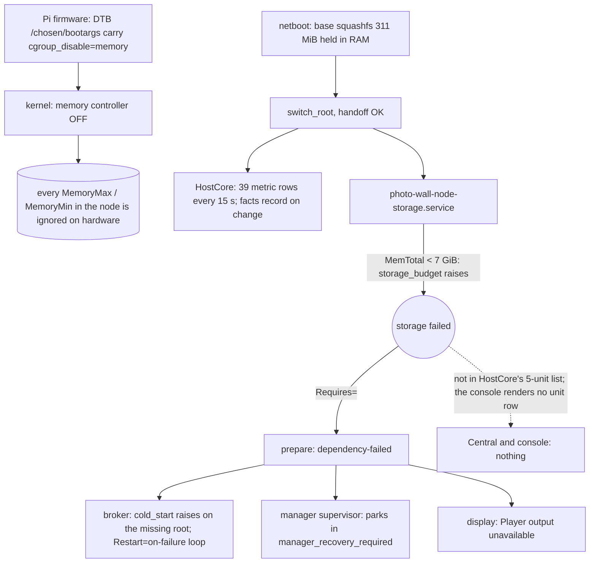
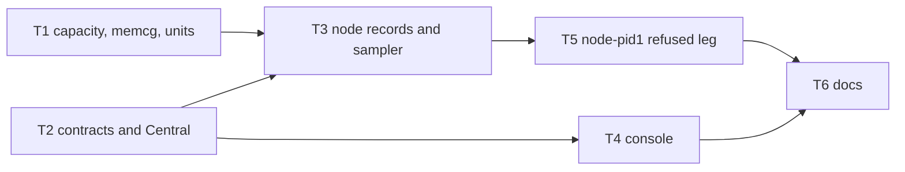

# 4 GB Raspberry Pi 5 as a legal V2 Player: memory, boot-failure reporting, image-format roots

Status: approved design; the tracer (T1-T6) is implemented. Where this document and the code
disagree, the code has a bug unless an entry in the [errata log](../.claude/errata.md) (`E-T*`,
`E-FX*`) records a ruling; the rulings made during delivery are folded in below and listed in
the history.

Code was read at `origin/main` a904b43 (= release v0.15.0).

This document covers three parts:
- **The tracer (T1-T6).** Delivered as one PR with its own gate.
- **Crash visibility (A5).** Its own PR, after the tracer.
- **Shape C (image-format roots).** Recorded for a later gate, with its blockers and the online-update discussion.

Related: [requirements, supported Player hardware](requirements.md), [Player node domain
model](player-node-domain-model.md), [console DDD §62](operator-console-ddd.md), [runbook](runbook.md).

Path note: `appliance/boot/node_bootstrap.py` is the node's post-switch_root bootstrap. `appliance/bootstrap.py` is the initramfs stage-1 library. Every reference below names the full path.

## 1. Today



Evidence for the diagram:
- `appliance/kernel/capacity.py:20-23` refuses below 7 GiB.
- `appliance/boot/storage_mount.py:10-11` calls it first.
- A probe of the v0.15.0 module: a 3.95 GiB total raises.
- The broker crash comes from the uncaught `cold_start` at `appliance/apps/broker_runner.py:89`.
- The supervisor parks at `appliance/node/manager.py:95-96`.
- HostCore watches five named units at `appliance/host/host_linux.py:184-207`.
- The console catalog at `central/console/src/hostHealth.js:77-110` has no unit item.

### Step 0 finding: the memory controller was off on every Pi (fixed in T1)

| Evidence | Source |
|---|---|
| The shipped DTB's `/chosen/bootargs` = `reboot=w coherent_pool=1M 8250.nr_uarts=1 pci=pcie_bus_safe cgroup_disable=memory numa_policy=interleave nvme.max_host_mem_size_mb=32` | `bcm2712-rpi-5-b.dtb` from `photo-wall-node-boot-a904b43….tar.gz` (v0.15.0), parsed with an FDT walker |
| The Pi firmware builds the kernel command line from those DT bootargs, then appends `cmdline.txt` | raspberrypi/linux#6980 (`/proc/cmdline` on Pi 5s shows the DT prefix); raspberrypi/linux commit ab520ab14d64, "Add cgroup_enable option … difficult if the setting comes from Device Tree" |
| v0.15.0 `cmdline.txt`: `console=tty1 ip=dhcp boot=photowall-netboot panic=10 watchdog.stop_on_reboot=0 hung_task_panic=1 photowall.central=@@PHOTOWALL_CENTRAL@@ photowall.node=v2`, with **no `cgroup_enable=memory`** | release boot tarball; appended at `scripts/node_release_artifacts.py:60` |
| Kernel 6.18.50+rpt-rpi-2712 carries the `cgroup_enable=` parameter (its string is in the image). `bcm2712_defconfig` has `CONFIG_MEMCG=y`. The static keys default to enabled, so only the DT disables memcg | `strings` on the decompressed `kernel_2712.img`; rpi-6.18.y `kernel/cgroup/cgroup.c:7101-7132`; `arch/arm64/configs/bcm2712_defconfig`. The image has no embedded config (`IKCONFIG=m`) |
| Fix: append `cgroup_enable=memory`. It parses after `cgroup_disable=memory` and wins. `cgroup_memory=1` is not needed | rpi-6.18.y `cgroup_enable()`; pelwell in #6980 |

Confidence: high, from artifacts and upstream evidence; not yet observed on the box. T3's `memcg_present` row confirms it through Central on the first boot.

Consequences:
- **No memory cap has ever been enforced on a physical Pi.** That covers the HostCore 96M, base 768M, app 2G and preparation 4G caps, and the `MemoryMin` protections.
- **node-pid1 CI runs on a host kernel with memcg on**, so CI has qualified enforcement the hardware never had.
- Enabling memcg turns every cap on for the first time, on 8 GB boxes too. That is a stated cost, and gate question Q2.

## 2. Requirements

| # | Requirement | Source |
|---|---|---|
| R1 | A 4 GB Raspberry Pi 5 is a legal Player, and the V2 node works on it | owner 2026-10-03 |
| R2 | Diskless: the base, roots and caches live in RAM and are rebuilt every boot | decision 0005:60 |
| R3 | Boot and app failures reach Central and the console | owner 2026-10-03 |
| R4 | A storage refusal carries its two numbers | player-node-domain-model.md:121 |
| R5 | V2 only; a release format changes atomically | owner |
| R6 | **Supported minimum: a Raspberry Pi 5 with 4 GB or more** (confirmed). Stated once in `docs/requirements.md` (T6). A smaller board is refused with its numbers, and reported | owner, confirmed 2026-10-03 |
| R7 | When the Player app dies, the display shows when it died and why (exit, OOM kill, refusal), and Central gets the same report | owner 2026-10-03 |
| R8 | No automatic app restart and no automatic reboot after an app crash. The app stays stopped, and recovery is operator-driven | owner 2026-10-03 ("don't auto reboot") |
| R9 | Online (no-reboot) app updates are wanted on 4 GB | owner 2026-10-03 (Shape C; see §7) |

## 3. Measurements (unchanged from revision 1; summary)

The Pi 5 runs 16 KiB pages.

| Item | MiB | Kind |
|---|---|---|
| Base squashfs, held all boot | 310.9 | M |
| manager tar → tmpfs root | 197.5 → 260.8 | M |
| app tar → tmpfs root | 928.9 → 1180.2 | M |
| Tar-era cold peak / retained | 2369.9 / 1441.0 | M |
| manager / app squashfs (zstd, 128 KiB blocks) | 62.1 / 288.3 | M |
| 4 GB MemTotal | ≈ 4045 | E; T3 reports `memory_total` |
| CMA and dma-buf (decoder, scanout) | ≈ 64 CMA, by the believed overlay default | E; **never charged to any memcg**; T3 reports `cma_total` |

**4 GB verdict on the tar format: undetermined** until the T-boot reports `memory_peak:*`.
- The estimates give about 0.6-0.8 GiB spare in the cold phase.
- They give about 1.6 GiB left for the app.

## 4. The tracer (T1-T6): one PR, its own gate

### 4.1 Reporting channel: design-it-twice

| | **F: categorical state in the host-facts record (G13); numbers stay metrics** (chosen) | **M: everything as metrics** (revision 1) |
|---|---|---|
| Shape | `HostFactsV2` gains one optional `boot` field: stages, faults, required/room, failed units. Metrics carry only numbers: measurements, OOM counts, `metrics_dropped` | Fault tokens and unit names are encoded into metric names (`boot_fault_<stage>:<token>`, `failed_unit:<name>`) |
| Fit | Facts are short text, reported on change; that is the right cadence and shape for stage state. Required and room travel in the same document as the refusal, so they cannot disagree | A categorical value hides in a name. Uses 60 of 64 rows. Names need collision-proof stripping |
| Central cost | No route, table or migration: `node_host_facts.payload` is a blob, and G12 serves it through `stored_fact_values` (`central/fleet/node_observations.py:236-257`). One tolerant reader for `boot` | None |
| Skew cost | Ingest is strict (`contracts/node_host_facts.py:112`). An older Central refuses the new document, and the node drops it until a value changes (`appliance/host/host_runner.py` §64 machine). **Central must be deployed first**, which is the normal flow | None |
| Row budget | 39 − 15 retired + 11 new = 35 of 64 | 60 of 64 |

**Chosen: F.** It costs a contract field and Central-first deploy ordering. In return it removes name encoding and leaves 29 rows of headroom.

The 15 per-unit rows (5 units × known/active/failed) are retired:
- They have no consumer in central, console or scripts.
- One test references `manager_summary_known`, which stays.
- `boot.failed_units` supersedes them for every `photo-wall-*` unit.

### 4.2 Design rules (design choices)

1. **A device's memory class is computed at construction, and a refusal always carries numbers.**
   - `device_class(MemTotal)` picks a frozen class.
   - A board below the smallest class gets `StorageShort(required, room, fault)`.
   - There is no floor constant, and no refusal type without numbers.
2. **Each base stage owns one record, and HostCore is the only reporter.**
   - The `handoff`, `storage` and `prepare` stages each write their own file: `running` at entry, `done`, `refused` or `failed` at exit, best-effort.
   - HostCore folds the stage records, PID1's failed units and the cgroup counters into the facts record and the metrics.
3. **Each cap has one source.**
   - `capacity.py` holds the store and preparation numbers.
   - A test binds each slice file to its constant.
   - Per-unit duplicates are deleted.

### 4.3 Frozen pages

**T1: memory class, memcg on, unit hygiene** (risk: high)

| Surface | Contract | Errors |
|---|---|---|
| `capacity.DeviceClass(name: str, min_total_bytes: int, store_bytes: int)` | frozen; `0 < store_bytes < min_total_bytes` | `ValueError("device_class_invalid")` at import |
| `capacity.CLASSES` | `(DeviceClass("pi5-4gb", 3584 MiB, 2560 MiB), DeviceClass("pi5-8gb", 7168 MiB, 3840 MiB))`, ascending. Interim values, replaced at C | — |
| `capacity.PREPARATION_PROCESS_BYTES = 256 MiB`; `PREPARATION_SLICE_BYTES = max(store_bytes) + PREPARATION_PROCESS_BYTES` (= 4096 MiB) | A test asserts `photowallpreparation.slice` `MemoryMax=` equals it. The duplicate `MemoryMax=4G` lines at `appliance/node/manager_launcher.py:64` and `appliance/apps/import_worker.py:63` are deleted (they inherit the slice) | — |
| `capacity.memory_total(path=/proc/meminfo) -> int` | — | `ValueError("meminfo_invalid")` |
| `capacity.memory_controller_present(path=/sys/fs/cgroup/cgroup.controllers) -> bool` | — | `OSError` → False |
| `capacity.device_class(total: int) -> DeviceClass` | The largest class with `min_total_bytes ≤ total` | `StorageShort(CLASSES[0].min_total_bytes, total, "node_memory_class")` |
| `capacity.StorageShort(required: int, room: int, fault: str = "node_storage_capacity")` | Still a `ValueError`; message = fault | — |
| `admit_cold`, `preparation_room`, `admit_preparation`, `appliance/apps/root_import.py` check | Signatures unchanged. `storage_budget(total, available)` is replaced by `device_class(total).store_bytes`. `admit_cold` raises `StorageShort(retained_peak, store_bytes)` or `StorageShort(incremental, min(free, available − EMERGENCY))`. **Admission still reads MemAvailable** (the tar era). Removed: `MIN_MEMORY`, `RESERVE`, `MAX_STORE`, `storage_budget` | `StorageShort` |
| `storage_mount.mount_storage() -> None` | Order: read memcg (an absent controller is logged and **reported only**, never refused: ruling E-FX2-1), then class, then mount `size=store_bytes`, then require `0 < f_blocks × f_frsize ≤ store_bytes` | `StorageShort`; `ValueError("node_storage_mount_budget")` |
| `scripts/node_release_artifacts.py:60` | Appends `photowall.node=v2 cgroup_enable=memory`. The checks at `:73` and `:141` require each token exactly once | `ValueError("node_bundle_flag_missing")` |
| Units | `photo-wall-node-prepare.service`: + `Requires=photo-wall-node-handoff.service`. `photo-wall-app-broker.service` and `photo-wall-manager-supervisor.service`: + `Requires=photo-wall-node-prepare.service`. Broker, manager-supervisor, display and display-controller: `StartLimitIntervalSec=10min`, `StartLimitBurst=10`, **no** `StartLimitAction` (R8; prior art `photo-wall-provision.service:15-17`). `OOMScoreAdjust`: app unit `+500` (`app_unit_properties`), App Manager unit `+300`, HostCore `-900`, the four base services `-500` | — |

**T2: contracts and Central** (risk: high)

| Surface | Contract | Errors |
|---|---|---|
| `contracts/node_host_facts.BOOT_STAGES = ("handoff", "storage", "prepare")`, `BOOT_STATES = ("running", "done", "refused", "failed")` | — | — |
| `BootStageV2(stage: str, state: str, fault: str \| None, required_bytes: int \| None, room_bytes: int \| None)` | `fault` is `token(·, 64)`, required iff `refused`/`failed`; both byte counts are required iff `refused`, otherwise None | `ValueError("invalid_boot_stage")` |
| `BootReportV2(stages: tuple[BootStageV2, ...], failed_units: tuple[str, ...] \| None, failed_units_more: int \| None)` | `stages` are unique, in `BOOT_STAGES` order, at most 3. `failed_units` are full unit names, each `token(·, 96)`, sorted, at most 4. Names are never stripped, so they cannot collide. A name that fails `token` is counted in `failed_units_more`. Both are None together when the units were never read on this boot: "not read", never "nothing failed" (ruling E-T3-2) | `ValueError("invalid_boot_report")` |
| `HostFactsV2.boot: BootReportV2 \| None` | None = not read. Included in `values()`, so a change re-sends. A test proves the worst case (3 failed stages with 64-character faults, 4 units of 96 characters, maximum counters, maximal other facts) encodes within `MAX_HOST_FACTS_BYTES` (2048) | `ValueError("invalid_host_facts")` |
| `stored_fact_values(raw) -> dict` | Gains `boot`: the parsed document as a plain dict, or None if absent or invalid (tolerant, like every fact) | never raises |
| `fact_values_document(facts: HostFactsV2) -> dict` (new) | The JSON-ready values, `boot` included. Central's "unchanged" check at `central/fleet/node_observations.py:142` today compares `stored_fact_values(prior).values()` with `facts.values()`; with a nested `boot`, a dict would be compared against a dataclass and every post would look changed. Both sides switch to `stored_fact_values(prior) == fact_values_document(facts)` | never raises |
| `contracts/node_observation.MetricFamily(key: str, max_rows: int)` | `key` is an exact name, or a prefix ending in `:`. Known/active pairs are not modelled; an absent row is "not reported" | — |
| `METRIC_FAMILIES` | Today's 24 kept names, plus `memcg_present` 1, `cma_total` 1, `cma_free` 1, `memory_peak:` 5 (`hostcore`, `base`, `preparation`, `app`, and `display`: Weston's own service, `photowallbase.slice/photo-wall-display.service`), `oom_kill:` 3 (`base`, `preparation`, `app`), `metrics_dropped` 1: 36 rows. The invariant `sum(max_rows) ≤ MAX_HOST_METRICS` (64, the same constant `HostObservationV2` enforces) is checked at import | `ValueError` at import |
| `valid_metrics(rows: Iterable[tuple]) -> tuple[HostMetricV2, ...]` | In order, drop: a row that fails `HostMetricV2(*row)`; an undeclared name; a repeat `(name, source)` (**first wins**, so `contracts/node_observation.py:47-50` can no longer refuse the observation); a row past its family's `max_rows`. Then append `("metrics_dropped", n, "count", "host_core")` | never raises |

Central (`central/fleet/node_observations.py`): G12 serves `facts.boot` through `stored_fact_values` (`:256`), and the unchanged check at `:142` uses `fact_values_document`. There is no migration, no route and no table.

**T3: node stage records, HostCore sampler** (risk: high)

| Surface | Contract | Errors |
|---|---|---|
| `appliance/kernel/boot_stage.DIRECTORY = /run/photo-wall-boot-stage` | Created `0755 root` by a tmpfiles.d line in node-base.deb. It is **not** under `/run/photo-wall-node` (0700), so the display controller (A5) can read it. Added to `ReadWritePaths=` of the handoff and prepare units | — |
| `fault_token(error: BaseException) -> str` | `StorageShort` gives `.fault`. A `ValueError` whose message passes `token(·, 64)` gives the message. An `OSError` with an errno gives `"os:" + errno.errorcode[errno]`. An `OSError` with errno None (for example `http.client.RemoteDisconnected`) gives `"os:" + type(error).__name__[:60]`. Anything else gives `"unexpected:" + type name[:52]` | never raises |
| `write_stage(stage: BootStageV2, *, directory=DIRECTORY) -> None` | Atomic `<stage>.json`, 0644 | `OSError` |
| `run_stage(stage: str, action: Callable[[], None]) -> None` | Writes `running`, runs `action`, then writes `done`, `refused` (`StorageShort`) or `failed`, and re-raises. **Every write is best-effort:** a write `OSError` is logged once and never changes the stage's outcome | re-raises `action`'s error only |
| `read_boot_report(*, directory=DIRECTORY, units: Callable[[], tuple[tuple[str, ...], int] \| None]) -> BootReportV2 \| None` | Missing stage files are omitted, and an invalid file is omitted. A record is read only as a regular file (`O_NOFOLLOW \| O_NONBLOCK`, `fstat`), at most `MAX_STAGE_BYTES + 1` bytes; a symlink, FIFO or oversized file is not readable. `units()` returns the failed photo-wall units and the overflow count, or None (not read); a failing `units()` is not read. None only if both are unreadable | never raises |
| `appliance/boot/node_bootstrap.main()` | Each mode runs inside `run_stage(mode, …)`. `materialize_handoff` writes `host.json` **directly after the boot-id check** (`appliance/boot/node_bootstrap.py:33-34`), before the base-marker and ABI checks, so marker and ABI failures are reported. Failures before the boot-id check are **not** reported: there is no current offer to report under, so they show as host silence (claim withdrawn) | unchanged codes |
| `LinuxHostSampler.failed_units() -> tuple[tuple[str, ...], int]` | One call: `systemctl list-units --state=failed --plain --no-legend 'photo-wall-*'` (timeout 0.25 s, output ≤ 4096 bytes). `HostRunner` keeps the last successful reading for the process and reuses it when a read fails; None until one succeeds (ruling E-T3-2) | `ValueError("failed_units_unreadable")` |
| `LinuxHostSampler.memory_rows() -> tuple` | `memcg_present` (from `cgroup.controllers`); `cma_total`/`cma_free` (from meminfo); `memory_peak:<cgroup>` (`memory.peak` of each slice and of the display service, only when memcg is present); `oom_kill:<slice>` (`memory.events`) | Rows are omitted on read errors |
| `LinuxHostSampler.supervision()` | The 15 unit rows are deleted; the manager summary rows stay | — |
| `HostRunner.tick` / `_send_facts` | Observation rows go through `valid_metrics`. The facts document includes `boot = read_boot_report(...)`. A 404 or 422 answer turns facts off for `FACTS_ROUTE_RETRY_SECONDS`, then resends (a node released before its Central is retried, not dropped for the boot) | — |

**T4: console** (risk: medium). The family-to-item map lives in `hostHealth.js`.

| Item (`HOST_CATALOG` key) | Reads | Wording | Column (`PlayersPage.jsx:15-23`) | Band / incident |
|---|---|---|---|---|
| `boot_preparation` | `facts.boot.stages`. It picks **the first stage in `BOOT_STAGES` order that stopped**: its state is `refused` or `failed`, or its own unit is in `failed_units` while its record is `running` or absent (ruling E-FX1-1), because the cause precedes its effects. Else the first `running`. Else, when `prepare` is `done`, done. Else "not started" | "Boot preparation refused at storage: needs 3.5 GB of memory, the box has 1.9 GB" (`node_memory_class`) · "… refused at prepare: needs 2.1 GB, room 1.8 GB" · "Boot preparation failed at prepare (os:ENOSPC)" · "Boot preparation running: prepare" · "Boot preparation done" | Software | Refused/failed: alarm. Incident key `player:<device>:boot_preparation`, for bound boxes in the Reporting state only. A spare is unbanded (G2) |
| `base_units` | `facts.boot.failed_units` **minus the unit of each stopped stage** (ruling E-FX1-1: a stage also stops when its own unit failed while its record is `running` or absent), so one cause raises one incident. Null `failed_units` (not read) reads Unknown, no band | "Base unit failed on this boot: photo-wall-app-broker.service" (" · "-joined, then "and N more"); "Unknown: failed units not read" | Software | Alarm. Key `player:<device>:base_units` |
| `out_of_memory` | `oom_kill:*` rows, read by prefix, every row (no cap hides a kill) | "Out-of-memory kills on this boot: app 2 · base 1" | Storage | Notice, no incident |
| `memory_limits` | `memcg_present` | "memory controller absent: memory limits not enforced"; "memory controller on: memory limits enforced" | Storage | Absent: notice (a warning), no incident |
| Not shown (`NOT_SHOWN`) | `uptime`, `load_1m`, `memory_total`, `memory_available`, `cma_*`, `memory_peak:*`, the `manager_*` rows, the `local_recovery_*` rows, `metrics_dropped` | — | — | — |

The binding test is Python. It extracts the `HOST_CATALOG` keys, the item-to-family map and `NOT_SHOWN` from `hostHealth.js`, and asserts every `METRIC_FAMILIES` key is mapped or listed. Guarantee: test. The measurement rows are not shown, but they reach Central and are readable in G12. That is enough for the measuring boot.

**T5: node-pid1 `refused` leg** (risk: medium)
- Scenario `refused`: a drop-in on `photo-wall-node-storage.service` with `BindReadOnlyPaths=/var/lib/node-fixture-meminfo:/proc/meminfo` and `MemTotal: 2097152 kB` (prior art: `tests/node_pid1_central_inner.py:64-66`).
- It is valid only for this leg: `BindReadOnlyPaths` implies a private mount namespace, so a tmpfs mounted inside it would not reach the host.
- It asserts:
  - the storage unit is `failed`;
  - prepare never ran;
  - the broker never started;
  - the fixture Central received a facts document whose `boot.stages` shows `storage refused node_memory_class 3758096384 2147483648`;
  - the observation carries `memcg_present` and `memory_peak:*`.
- Files: `tests/test_node_pid1.py`, `tests/node_pid1_*`, `.github/workflows/node-pid1.yml` (one leg).

**T6: docs** (risk: low)
- R6 in `docs/requirements.md`.
- DDD §62 rows for the three items.
- Runbook rows.
- `docs/player-node-domain-model.md` storage text.
- The 8 GiB lines in `docs/player-fleet-implementation-map.md:67,239` and `docs/module-appliance-platform.md:31`.
- The memcg note, and the deploy note: releases from this one on carry `cgroup_enable=memory`; boot trees staged earlier do not.

### 4.4 Dependency order



`contracts` imports nothing new. `appliance.kernel.boot_stage` imports `contracts.node_host_facts` and `appliance.kernel.capacity` only.

### 4.5 Tracer proof (all observed through Central)

On the 4 GB Pi 75628d0c:
- **(1)** the app reaches output;
- **(2)** G12 shows `facts.boot` moving from `prepare running` to `done`;
- **(3)** `memcg_present = 1`, `memory_total`, `cma_total`, and `memory_peak:*` per slice after a 30-minute Show. These replace the estimates.

In CI, the T5 leg proves the refusal path end to end. Explicit non-goals: the crash overlay (A5), the image format, the envelope gate.

## 5. A5: crash time and reason on screen and at Central (its own PR, after the tracer)

The owner's words are "the debug overlay enables and shows the crash timestamp and reason". Interpretation: the display host's diagnostic screen, which already appears when the app's surface is lost (`appliance/display_host/native/shell.c:259-280` invalidate → `diagnostic_configure`), gains a time-and-reason line. The Central-driven debug overlay (console DDD §53, R27) stays reserved. Under R8 there is no restart, so the screen stays until an operator acts.

```mermaid
sequenceDiagram
  participant App as app unit (systemd-run)
  participant Post as ExecStopPost=+photo-wall-app-exit
  participant Br as broker
  participant St as /run/photo-wall-app-status/status.json
  participant DC as display controller
  participant Sh as shell.c
  participant Dg as diagnostic-client.c
  participant HC as HostCore
  App->>Post: $SERVICE_RESULT, $EXIT_CODE, $EXIT_STATUS
  Post->>St: exit.json (invocation id, result, code, status, boottime, local wall time)
  Br->>Br: reconcile sees absence, matches the invocation, adds the oom_kill delta of photowallapp.slice
  Br->>St: status.json {state: stopped, reason, at_wall, at_boottime, starts}
  DC->>St: read on tick
  DC->>Sh: op diagnostic {reason: app_stopped, detail: "Stopped 14:02:31 · out of memory"}
  Sh->>Dg: output(reason) + detail(text)   [pw_diagnostic_manager_v1 v3]
  HC->>St: read; facts.boot gains app {state, reason}
```

Frozen surfaces (A5):
- **Exit recorder.** `ExecStopPost=+/usr/lib/photo-wall-app-exit`, added in `app_unit_properties`. The `+` prefix runs the recorder without User or file-system namespacing (systemd 257 `systemd.service(5)`). **Its escape from `RootDirectory`/`RootImage` is verified in node-pid1 first.** If it fails, the fallback is the broker reading `oom_kill` and logging an unknown exit.
- **Status documents.** `base_status.app_status_document(*, kernel_boot_id, sampled_boottime_ms, state: "running" | "stopped" | "start_refused", reason: str | None, at_wall_ms: int | None, starts: int) -> dict` and `read_app_status(path, *, kernel_boot_id) -> dict`. Reason tokens: `exited:<n>`, `signal:<NAME>`, `oom_kill`, `timeout`, `start_refused:<fault>`.
- **Display path.**
  - Shell `diagnostic` op: optional `reason` from a closed set (`app_stopped`, `boot_refused`, `boot_failed`), plus `detail`, printable and at most 96 characters.
  - `pw_diagnostic_manager_v1` goes to version 3 with event `detail(name, text)`.
  - `reason_text` gains "Player stopped" and "Boot preparation refused/failed".
- **Boot refusals on screen.** The display controller also reads `/run/photo-wall-boot-stage`, so a refused boot shows "Boot preparation refused: needs 3.5 GB, has 1.9 GB" on the screen.
- **Clock use.** Wall time is the box's own clock and is for display only. It is never compared with Central's.

A5 costs:
- Changing `shell.c` and the protocol changes the `graphics_abi` digest (`scripts/build_node_display_deb.py:56-62`), which forces a new app environment. That is atomic per release (R5).
- Two native files and one protocol bump; risk tier high.

Placement: **A5 is recommended to follow the tracer, not join it** (gate question Q1).
- The tracer proves memory and reporting.
- A5 crosses the native display host and the ABI.
- Under the tracer the screen already says "Player output unavailable" when the app is absent.

## 6. Failure modes (tracer)

| Failure | Degrades to | Reported as | Guarantee |
|---|---|---|---|
| Board below the 4 GB class | No store | `boot.storage refused node_memory_class` + numbers | construction + T5 leg |
| Memory controller absent (a boot tree staged before this release, or the token lost in staging) | The store mounts; no memory cap is enforced | `memcg_present` 0; console "memory controller absent: memory limits not enforced" (warning) | reported only (ruling E-FX2-1) |
| Download, digest, ABI or ENOSPC in prepare | No app | `boot.prepare failed <token>` | run-time |
| Prepare killed before its exit write | No app | the record stays `running`; `failed_units` names the unit | derived from PID1 |
| Broker or display crash loop | Unit `failed` after 10 starts in 10 min | `base_units` | unit start limit |
| A child of the display unit (the diagnostic client) exceeds its memcg | That child is killed; Weston keeps running (`OOMPolicy=continue`) | `oom_kill:base`; `memory_peak:display` | unit file + test |
| Failed units unreadable (slow or missing `systemctl`) | The last successful reading is reused; before any, `failed_units` is null | "Unknown: failed units not read"; a `running` record stays running | contract (null is representable) |
| App exceeds the app slice (2G) | Memcg OOM kill inside the app slice | `oom_kill:app` (counts kills by **any** OOM killer for that cgroup, global included) | kernel memcg |
| Uncharged CMA or dma-buf exhausts the system | Global OOM; the app is the first victim (`OOMScoreAdjust`) | `oom_kill:app` increments | kernel |
| A base service exceeds the base slice (768M), now enforced | That service is killed and restarts | `oom_kill:base`, `base_units` if the start limit trips | kernel memcg |
| An invalid or duplicate metric row | The row is dropped, and the others are sent | `metrics_dropped` | construction (`valid_metrics`) |
| Older Central (skew) | Facts refused (422); the node retries after `FACTS_ROUTE_RETRY_SECONDS` | Facts absent until Central is deployed (kernel and base lines too) | — (deploy order) |
| Record write fails | The stage outcome is unchanged | `failed_units` still names the unit | best-effort |

## 7. Shape C (recorded for its later gate; not resolved here)

**Blockers for the C gate:**
1. Per-class slice caps are set at runtime by the storage stage (`systemctl set-property --runtime`), because slice files are static.
2. The class table is calibrated from a C1 image-format boot, not a tar boot.
3. The overlay tmpfs size equals its line L4. Today it is `size=512M` (`appliance/bootstrap.py:317`).
4. Re-cut C into green slices by kind, with `base_abi` as the atomicity guarantee, not one PR.
5. The envelope gate runs on PRs (node-components workflow), not post-merge.
6. The gate uses page-padded expanded bytes.
7. The online-update shape (below).
8. `RootImage=` under the node-pid1 container (loop devices, udev) is proven before anything depends on it.
9. Every bind destination exists inside the image (`app_unit_properties` and the manager launcher binds), checked at build.

**Online updates on 4 GB (R9): owner discussion item.**

Where revision 1's ~640 MiB came from. It is an **image-era number, not a tar-era one**:

| Term | MiB |
|---|---|
| Device class Σ | 3976 |
| minus the fixed lines L1-L7 + L10: 200 + 64 + 352 + 128 + 192 + 96 + 768 + 256 | − 2056 |
| minus preparation (store 1024 + process 256) | − 1280 |
| **= app line** | **640** |

The 1024 MiB store holds the old app image 288, the manager 62, the downloaded new image 288 and **the base's import copy** 288, which is 926 MiB. The import copy exists because the base re-hashes the App Manager's download into a root-owned file (today's tar-era boundary, `appliance/apps/root_import.py`). A staged image has no extra page-cache cost: it *is* tmpfs pages, charged to the preparation slice. The running image's decompressed page cache is clean, reclaimable and inside the app line.

What the Player needs (estimates; node config: cache 64 MiB per `appliance/boot/node_bootstrap.py:65`, `texture_budget` 512 MiB and `decoder_limit` 4 per `player/service.py:126-127`):

| Part | MiB |
|---|---|
| Process (Python, GTK, GStreamer) | ≈ 300 |
| Textures | up to 512 (v3d GEM shmem, believed memcg-charged) |
| `/tmp` and `/run` tmpfs | up to 192 |
| Software H.264 at 1080p | ≈ 60 per decoder |
| HEVC hardware buffers | CMA, not charged |
| **Full settings at 1080p** | **≈ 1.1-1.3 GiB** |

| Option | Store | App line | Visible downtime | Risk |
|---|---|---|---|---|
| **O1: online, today's import shape (download + base copy)** | 926 → 960 | **704** (832 if the preparation process line measures ≤ 128) | none | The Player must drop to `texture_budget` ≈ 256 and `decoder_limit` 2; rich Shows can OOM |
| **O2: online, single copy.** The base fetches the image itself into a root-owned staging file, or App Manager's file is mounted with dm-verity `RootHash=` | 638 → 672 | **992** (1120 at a 128 process line) | none | Changes the App Manager/base preparation boundary (who fetches bytes), or adds a verity dependency; about +2 beads |
| **O3: stop-then-stage, no reboot.** Stop the app, drop the old image, download and verify the new one, start | 350 → 384 (= cold) | **1152** (1280) | Download + verify + start, estimated 10-30 s, behind "Player updating" on screen | Breaks "prepare before any disruption" (player-node-domain-model.md:117). A failed download after the stop leaves the screen dark until a retry (keeping a fallback image costs 288 MiB and returns to O2's numbers) |
| Lever for any option | — | +100-300 | — | Slimming the app environment (locales, docs, unused GStreamer plugins) and measuring the base-slice line below its 768 cap. Unmeasured |

There is no default. **O2 is the only option that meets R9 with no downtime and an app line near the Player's full-settings need.** Its cost is the boundary change.

## 8. Costs, non-goals, deferrals (tracer)

Costs:
- **Interim risk.** The tracer keeps the tar format and **MemAvailable admission**. A 4 GB fit is not proven before the T-boot. The app keeps its 2G cap, and only `OOMScoreAdjust` protects HostCore from a global OOM.
- **Caps go live.** Enabling memcg enforces every memory cap on every Pi for the first time, 8 GB boxes included. The base slice (768M) and HostCore (96M) have never run under enforcement on hardware.
- **Store changes.**
  - 8 GB class: the store drops from 3.86 to 3.75 GiB. Online tar staging there keeps 285 MiB of slack.
  - 16 GB boards and CI runners fall into the 8 GB class: their store drops from 4.0 to 3.75 GiB.
  - 4 GB class: the store is 2.5 GiB, so **"Stage app" and "Try" are always refused (with numbers) on 4 GB until C**, and updates go through "Update the wall" (reboot).
- **Skew.** Central must deploy before nodes run this release, or the facts record (kernel, link, base lines) is refused until the node's retry period (one hour) passes after Central is deployed.
- **Memory caps on old boot trees.** The command line comes from the separately staged boot tree, not from Central's offer. A Player still booting a tree staged before this release runs with every cap unenforced; the console warns, and restaging `boot/` fixes it.
- **Gaps.** Handoff failures before the boot-id check stay as host silence. Transient-unit failures of App Manager and the import worker are reported only through their owners (the supervisor summary, online effect faults), not `failed_units`, because `--collect` discards them.

Not covered: uncharged device memory beyond what `cma_total` shows (dma-buf heaps); v3d GEM memcg charging (believed charged, unproven).

Deferred: A5 (crash screen and app status); the envelope gate; Shape C; deriving the Player's budgets from its line.

## 8a. Tracer gate questions and answers

- **Q1: when does the crash screen (A5) ship?**
  - (a) Right after the tracer, as its own PR. Recommended. Cost: during the tracer the screen says only "Player output unavailable".
  - (b) Inside the tracer. Cost: +2 high-risk beads, and a graphics ABI change inside the tracer.
- **Q2: how do memory caps switch on?**
  - (a) Fleet-wide via the release cmdline, with today's caps enforced and storage refusing when memcg is absent. Cost: first-ever enforcement on 8 GB boxes.
  - (b) The test Pi first, via the iac `cmdline_extra` (`iac/stacks/home/prod/photos/players.yaml`), with storage only *reporting* an absent memcg. Cost: two postures for one release, and the fleet's caps stay fictional.
  - **Answer:** the release cmdline carries the token fleet-wide, as in (a), but storage only *reports* an absent controller, as in (b) (ruling E-FX2-1). The boot tree is staged separately from Central's offer and Select is fleet-wide ([runbook](runbook.md)), so a refusal would darken a Player whose tree predates the token. Cost: such a Player runs without enforced caps until its tree is restaged, visible as a console warning.

## 9. Bead plan

| PR / gate | Beads |
|---|---|
| **Tracer** | T1, T2, T3, T4, T5, T6: 6 beads |
| A5 | 2 beads: the exit recorder and app status (node, facts `boot.app`); the shell, protocol, client and display-controller path |
| C (later gate) | Re-cut by kind after the T-boot numbers: about 5-7 beads, plus 2 if O2 |

## 10. Contradictions found (cumulative)

1. The comment at `appliance/kernel/capacity.py:27` says tar bytes bound tmpfs pages. At 16 KiB pages that is false (+251 MiB).
2. Caps are duplicated: the 4G preparation cap appears 3× in code and once in a slice file, and the 2G app cap appears 2×.
3. `preparation_room`'s comment says the reserve is applied once, but every call recomputes `storage_budget`.
4. Docs assume an "8 GiB appliance", against R6.
5. The memory caps are qualified in CI (memcg on) but **unenforced on hardware** (memcg off by the DTB). No document mentions `cgroup_disable=memory`.
6. 34 of HostCore's 39 rows have no console home. This revision retires 15, and the rest go on the explicit not-shown list.
7. The supervisor does not crash-loop: it parks. The broker does crash-loop (revision 1 had both wrong).

History:
- 2026-10-03: first draft (snapshot admission).
- 2026-10-03: revision 1 (construction envelope, Shape C).
- 2026-10-03: revision 2.
  - Memcg found off on hardware.
  - Reporting moved to the facts record.
  - Tracer pages frozen.
  - Owner answers folded in (R6, R7, R8, R9).
  - C recorded with its blockers and the online-update options.
- 2026-10-03: delivery rulings folded in. E-FX1-1 (a stage also stops on its failed unit; only stopped stages' units are subtracted); E-FX2-1 (an absent memory controller is reported, never refused); E-T3-2 (failed units not read are null, and the runner reuses its last reading); `memory_peak:display`, `OOMPolicy=continue` on the display unit, bounded stage-record reads, and a 422 facts answer retried like a 404.
