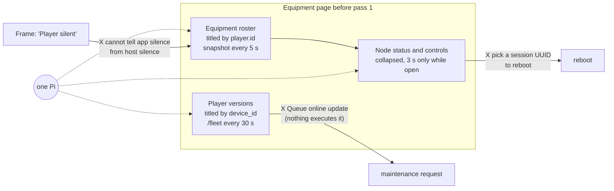
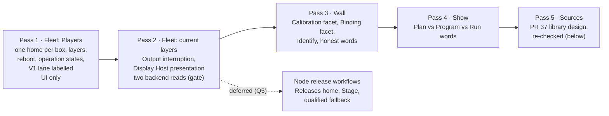
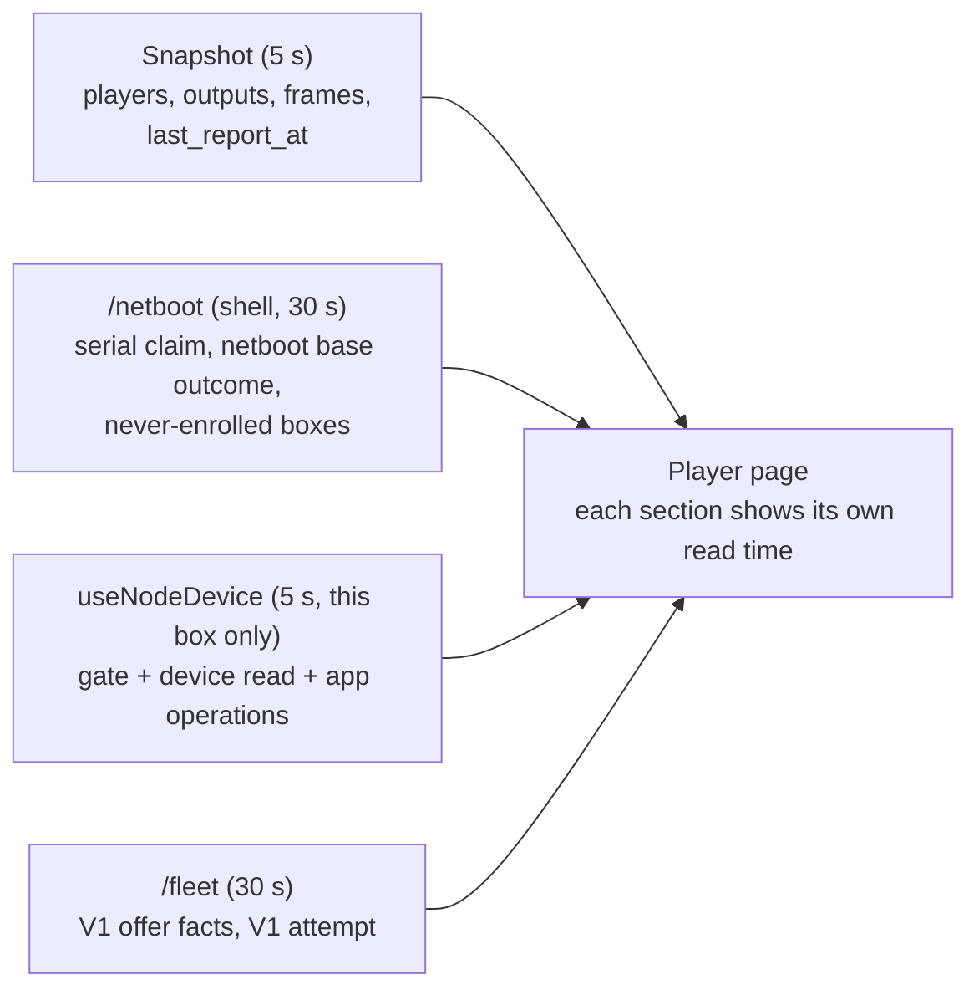
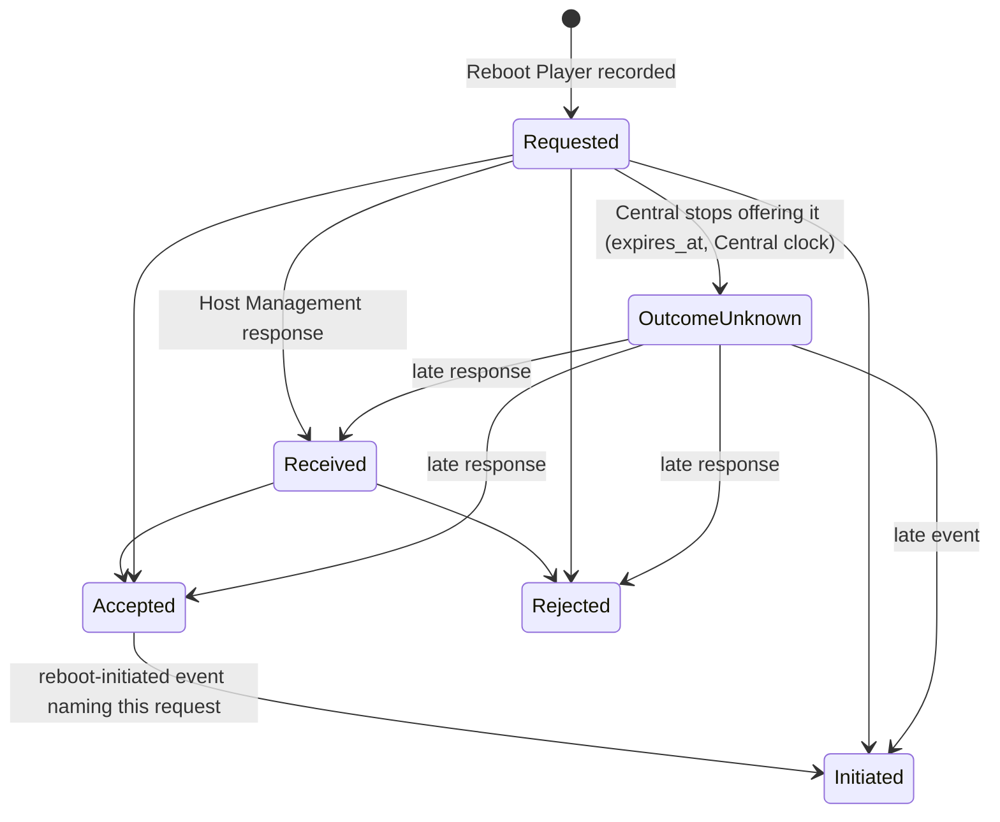
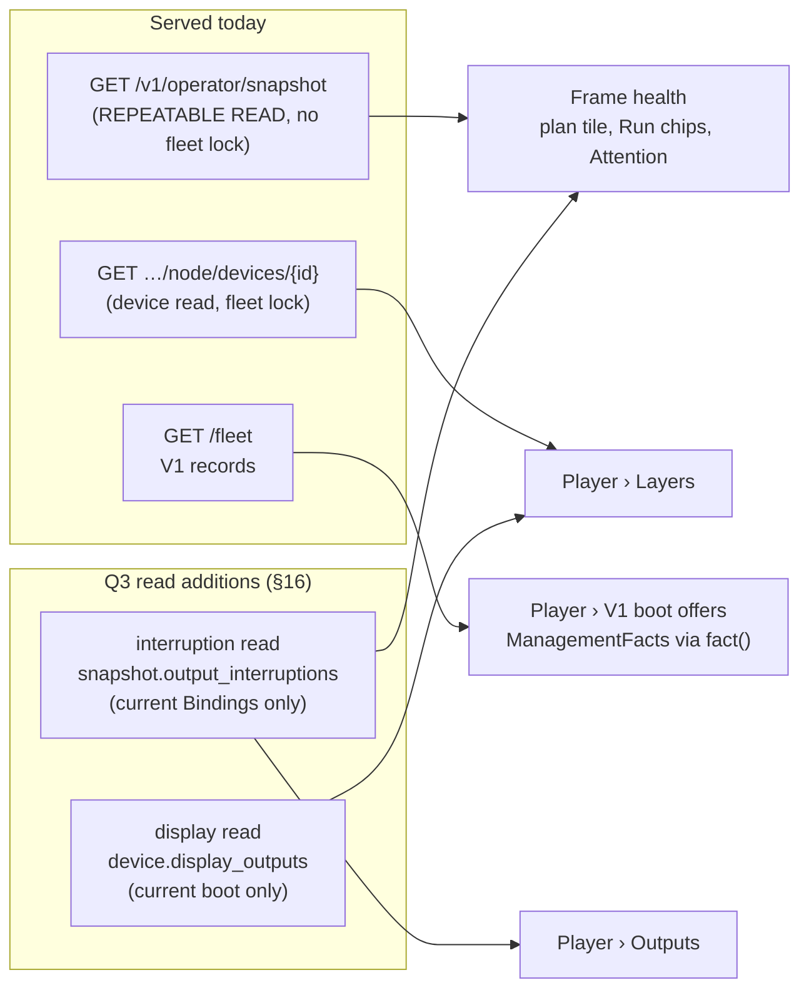
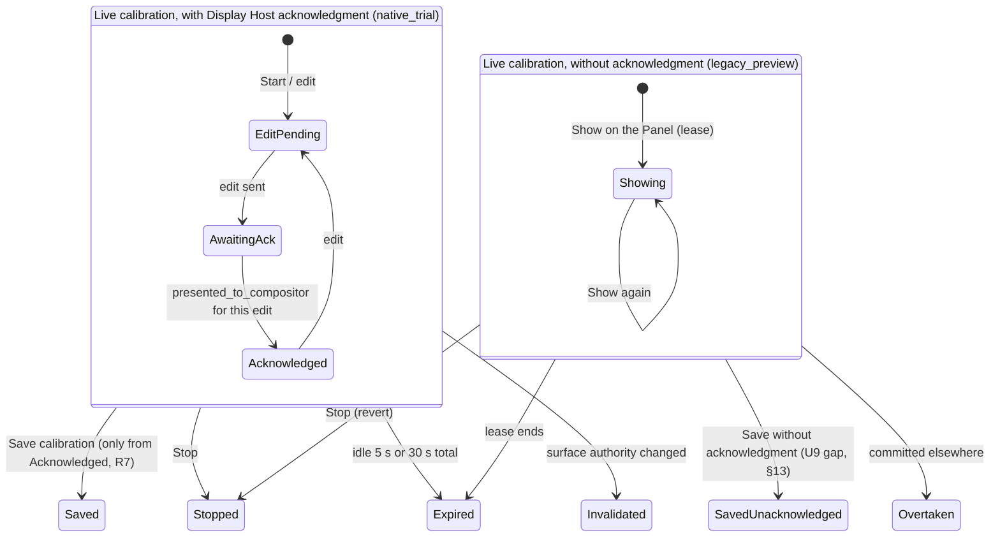

# Operator console: one home per aggregate (domain-driven console)

**Status:** pass 1 approved 2026-10-01 under the owner's autonomous-gate instruction (Q1 = A, one home per box; Q2 = keep the V1 boot-offer controls, labelled), built and reviewed 2026-10-02 (beads B1–B4); its implementation errata are folded in below, and its residual review findings became bead R0 (§23). Passes 2 and 3 are designed at feature level in Parts C and D, revised once after adversarial review, and cut into one batch (§23). The owner answered the pass-2/3 gate on 2026-10-02: Q3 = A (both read-only backend reads), Q4 = yes (the reboot fence), and Q5 = design the node release workflows next, as their own design run, which will replace §17 (left as written until then). Batch 2 (R0, C1, C2, D1, E1) is built to those answers, its implementation errata are folded in below, and it awaits its one full verify and review. Passes 4–5 are planned, not designed.
**Layers:** Part A is the **module layer**: the domain-to-console map, the design rules and the roadmap of passes. The owner steers this part. Parts B, C and D design **passes 1, 2 and 3 at the feature layer** for delivery: screens, read models, signatures, wordings and beads.
**Branch:** every pass lands on one running PR from `claude/console-ddd`.
**Owner is asked:** Q1 and Q2 (answered 2026-10-01). Q3 (which of two read-only backend reads to add, §16), Q4 (a backend fence for one outstanding reboot, §16) and Q5 (the node release workflows, §17), answered 2026-10-02: Q3 = A, Q4 = yes, Q5 = design next. Everything else is a current design choice that the owner can revise. Batch 2 is built to the answers, so no declined branch and no dormant code ships.
**Builds on:** [requirements](requirements.md), [Player node domain model](player-node-domain-model.md), [fleet implementation map](player-fleet-implementation-map.md), [console UX design](operator-console-ux-design.md) and its pass-2 history, and the open [library design](operator-console-ux-pass2-library.md) (PR 37), which becomes pass 5 here.

# Part A: the map and the roadmap (module layer)

## 1. Before pass 1, in one picture

Before pass 1, one physical Player box was drawn three times on the Equipment page (since replaced by the Players pages; its old address now opens `#/players`). Each drawing used a different identity and a different read cadence. The node layers the requirements say to tell apart sat behind a collapsed disclosure.



| Failure | Where it shows | Requirement it breaks |
|---|---|---|
| One box, three cards, no shared identity or read time | `wallRoutes.jsx` renders `PlayerVersions`, `EquipmentRoster` and `NodeDevicePanel` | One Player is one replaceable appliance ([installation model](requirements.md#installation-model)) |
| A silent Player app with a live host reads the same as a dead node | `health.js` classifier; host samples only inside the collapsed panel | U4, U6 ([failure visibility](requirements.md#failure-visibility-and-recovery)) |
| Two meanings of "desired app". The only update button creates a request nothing will ever execute | `PlayerVersions.jsx` "Queue online update"; `NodeDevicePanel.jsx` "latest stage is the desired app" | Declarative desired state; no command without an executor |
| Reboot asks for a session UUID and a typed audit token, three disclosures deep | `NodeDevicePanel.jsx` | Reboot targets the current HostCore session ([domain model](player-node-domain-model.md#host-report-and-reboot)) |
| The reboot audit links a later boot to a command by timestamp | `NodeDevicePanel.jsx` "Subsequent boot claims observed" | Never infer causation from proximity in time ([domain model](player-node-domain-model.md#commands-responses-events-and-current-state)) |
| Central intent is worded as device truth: "Shows frame X" for a Binding; "Edit N presented on the display" for a compositor receipt | `health.js` `outputStates`; `LiveCalibrationTrial.jsx` | AGENTS.md "distinguish … commitment and observed output"; U9 |

## 2. Requirements (binding; not design choices)

| # | Rule | Source |
|---|---|---|
| R1 | Frames are persistent locations. Players and Panels are replaceable equipment. | AGENTS.md; [installation model](requirements.md#installation-model) |
| R2 | Never present Central intent as device truth. Keep acquired files, readiness, capacity, commitment and observed output distinct. | AGENTS.md non-negotiables; programme brief |
| R3 | Player app liveness is `player_feedback.received_at` for the current `authority_epoch`. `players.last_seen` changes only at enrollment. | Owner; `central/coordination.py` |
| R4 | Central distinguishes a silent Player app from an unobserved Host Management agent, bound or not. It shows a named cause with its source and last evidence time, and never infers a cause. When Central cannot say when it last heard from a layer, it says so. | U4, U6 |
| R5 | A command, its response and its events are distinct facts. Receipt is not effect. Causation is never inferred from timing. A lost response stays unknown, with no blind new command. | [Domain model](player-node-domain-model.md#commands-responses-events-and-current-state) |
| R6 | An operator reboot is dispatched immediately, even during a Run. Only that Player's Outputs are interrupted. The Run continues, and no other Frame or Actuator gets a new or implied command. | [Domain model](player-node-domain-model.md#promise-failure-envelope-and-selected-choices); [operations](requirements.md#operations-and-scope) |
| R7 | Calibration Save needs Display Host's `presented_to_compositor` acknowledgment. The console never calls that visible pixels. | U9 |
| R8 | Declarative desired and observed state, not commands with deadlines. | Owner |
| R9 | Align the UI only. A backend change is allowed only when a domain concept cannot otherwise be shown honestly, and then only as an owner gate. | Programme brief |
| R10 | Never compare clocks across systems. Ages are Central's read time minus Central's receipt time. | Owner |
| R11 | Qualification scenarios are CI tests. The fleet/node UI needs a CI-gated browser suite. | Owner |
| R12 | Serial and boot are LAN claims (`lan_serial`), never verified physical identity. | [Domain model](player-node-domain-model.md#host-report-and-reboot) |

## 3. Glossary (the console's words)

| Console word | Domain meaning | Not to be confused with |
|---|---|---|
| **Player** | One replaceable box. The console keys it by its fleet **device** identity (`device-` + sha256 of `pi:<normalized serial>`, `contracts/equipment.py`) because a box exists from its first netboot. Its Registry enrollment (`player_id`, `authority_epoch`) is a fact on the Player, not its name. | The Player app process (one enrollment epoch) |
| **Player app** | Player Runtime (L2): enrolls per process start; reports readiness. | The box |
| **Host Management** | HostCore (L0): host samples and the reboot path. | Player app liveness |
| **App Manager / App Effect Broker** | App Lifecycle (L1): prepares and switches app environments. | V1 maintenance requests |
| **Display Host** | L1.5: owns final scanout. Reports `presented_to_compositor`, `withdrawn` or `invalidated` per Output. | Panel pixels, which no layer observes |
| **Output** | A connector on a Player (HDMI). | Panel |
| **Panel** | The display hardware at a Frame. Requirements say Panel; the console stops saying "Display" for it. | Display Host |
| **Binding** | The Output-to-Frame assignment Central has set. The Frame is its root: every bind carries the Frame's generation. Worded "Bound to Frame X", never "shows". | Presentation |
| **Standing** | Not enrolled, Unbound, Bound or Retired (replaces "Pending", "New" and "In service"). | Liveness |
| **Boot path** | Chosen **per boot**, not stored per Player. Three names: **node offer** (`/v2/node/boot-offers`, kernel cmdline `photowall.node=v2`), **V1 offer** (`/v1/netboot/offers`, V1 fleet policy) and **netboot base without an offer** (`/v1/netboot/base`, content-catalog pin and frontier). Each boot record is labelled with the path that produced it. | A Player attribute: there is none |
| **Last reported** | The latest receipt time of a layer that reports periodically (heartbeat). | **First received**: when Central first received one particular fact, which says nothing about the layer since |

## 4. The proposed shape

Each navigation group is one bounded context. Each aggregate gets one home page. Every other mention of it is a link to that home.


**Design-it-twice.**

| | **A. One home per box (recommended)** | **B. One section per bounded context** |
|---|---|---|
| How | Fleet › Players is keyed by device. The Player page combines the Registry Player and the fleet Device, grouped by node layer, and shows each section's own read time. Writes stay with their aggregate: Retire goes to Registry, Reboot goes to Fleet, Bind goes to the Frame. | Wall › Equipment keeps the Registry view (Players, Outputs, Bindings). A new Fleet › Nodes page holds the Devices (boots, layers, reboot, app operations). The two pages cross-link by device id. |
| Gives | One place answers "what is this box doing, layer by layer". A box that netboots but never enrolls is visible (U4). | Each page has one read source and one cadence. It mirrors the code's contexts exactly. About 40 % less change. |
| Costs | The Player page carries up to four reads with four labelled read times. Node reads happen only on an open Player page, so the list cannot show node state. | Today's split becomes official: the same box appears in two lists. "Why is Frame X dark?" takes two pages. A never-enrolled box appears only under Nodes. |
| Both | Two of five layers (App Effect Broker, Display Host) show "last reported: unknown" in pass 1. Display Host gets a read in pass 2 (Q3, §16); the App Effect Broker has no heartbeat, so no read can give it one. Neither shape can fix that from the UI. | |

> **Q1 (shape).** Recommended: **A**. Alternative: **B**, at the costs above.

## 5. Design rules (design choices, not requirements)

| Rule | What it makes impossible | Guarantee |
|---|---|---|
| **1. One home per aggregate.** The home is the only page that shows an aggregate's full state. Elsewhere it appears as a link (chip), never as a summary card. A **relationship** between two aggregates may be started from either side, but both sides call the one write its root owns. Binding is the one such relationship in pass 1: the Frame home and the Player page's Outputs both call `bind` (`equipmentApi.js:93`, Frame generation as the fence), as `BindingFacet.jsx` and `PlayerPage.jsx` do (the retired `EquipmentRoster.jsx` did the same). | Two cards for one box with disagreeing read times; two bind writes with different fences | One write function per relationship (construction); route review; the R4 import-graph test covers fleet routes |
| **2. Every fact carries its truth kind.** Fleet views render facts only through one `fact()` value. A fact that lacks its label (source and receipt for `reported`, a source for `claimed`, a basis for `derived`) **becomes** `unknown`, naming what is missing. A `claimed` fact carries its receipt only when Central serves one, and then says which receipt it is, as `reported` does. It never renders unlabelled and never throws. One pass-1 exception: the V1 section's `ManagementFacts` (V1 loader session, V1 app attempt, authenticated OS attempt claim) keeps its plain "V1 record" lines; bead C2 (§23) routes it through `fact()` and ends the exception. | Unlabelled device truth; ages taken from node clocks; a payload change blanking the console | Construction-time (the value cannot be built unlabelled), in pure model functions under Node tests; each Player page section sits behind its own error boundary |
| **3. Commands are domain verbs on the aggregate's home.** The console binds Central's fences (session, generation, gate generation, command id) from the read it shows, freezes the whole request when the dialog opens, and asks only when a choice really exists. Outcomes use the existing equipment vocabulary: done, already, changed, refused, unknown. | Operators choosing transport plumbing; a retry that changes the request; a new outcome dialect per module | Construction (one request builder per verb, body frozen at open); browser tests |

**Truth kinds** (rule 2), each with its one wording pattern:

| Kind | Meaning | Wording pattern | Example |
|---|---|---|---|
| `set` | Central record written by an operator or policy | "Set …" or a plain noun | "Bound to Frame lobby-left" |
| `reported`, latest | A node layer reports periodically; this is its latest receipt | "<Layer> last reported <age> ago" | "Host Management last reported 4 s ago" |
| `reported`, first | One fact a layer sent once, on change | "<Layer> reported <fact> · first received <age> ago" | "App Effect Broker reported the app running · first received 3 d ago" |
| `claimed` | A LAN claim Central accepted but cannot verify | "… (claimed at boot by <source>, unverified)", then, when Central serves a receipt, " · first received <age> ago" (a claim sent once) or " · last claimed <age> ago" (a claim repeated on every check-in) | "Serial 10000000a1b2c3 (claimed at boot by the box, unverified)" |
| `derived` | Central's own conclusion from named records | "<Conclusion> (Central's inference: <basis>)" | "Interrupted (Central's inference: a later boot was admitted)" |
| `unknown` | Not observable, not served, or not read | "Unknown: <why>" | "Panel pixels: Unknown: no layer observes them" |

A `reported` fact must say which receipt it carries; without that, it becomes `unknown`. A `set` fact may carry the time Central recorded it (" · recorded <age> ago"). The `claimed` pattern says "at boot" even for the T0 app claims from a V1 serial check-in (source "its serial check-in"); the wording is fixed, so that claim reads as boot-time although it is not. A fifth kind, `planned` (Central's projection of intent, for now-showing), arrives with pass 4, its first user.

## 6. Domain-to-console map (every aggregate, one home)

| Aggregate (context) | Console home | Noun on screen | Truth kind and label | Pass |
|---|---|---|---|---|
| Device + Registry Player (Fleet + Registry) | `#/players/<device>` | Player | identity `claimed`; standing `set`; Player app `reported`, latest | 1 |
| BootOffer (Fleet, node and V1) | Player › Boot | Node boot offer; V1 boot offer | `set` ("not proof the Player booted"), labelled by boot path | 1 |
| Netboot base outcome (content catalog) | Player › Boot | Netboot base without an offer | `set` (pin, frontier, last served) | 1 |
| BootAdmission / current session (Fleet) | Player › Boot | Current node session's boot | `claimed`; "No current node session" when none is current | 1 |
| NodeSession / Producer (Fleet) | Player › Layers (session detail under "Identifiers") | Host Management, App Manager, App Effect Broker, Display Host | session state is a detail | 1 |
| HostObservation (Fleet) | Player › Layers › Host Management | Host samples | `reported`, latest | 1 |
| ManagerPreparation (Fleet) | Player › Layers › App Manager | Preparation | `reported`, latest; "preparation is not activation" | 1 |
| NodeEvidence: AppProcessFact (Fleet) | Player › Layers › App Effect Broker | App process | `reported`, first; layer's last report `unknown` (not served) | 1 |
| NodeEvidence: SurfaceFact (Fleet) | Player › Layers › Display Host | Output presentation | pass 1 `unknown` (the evidence projection holds the first reported state, §13). Pass 2 reads Display Host's newest **display exchange** per Output for the current boot instead, which that defect does not touch: `reported`, latest (§15, display read) | 1 unknown; 2 (Q3) |
| RebootCommand (Fleet) | Player › Reboot | Reboot request + history | request `set`; responses and initiation `reported`; outcome `unknown` until reported; completion `unknown` | 1 |
| AppOperation (Fleet) | Player › App | App operation | request `set`; response and effects `reported`; interrupted `derived` | 1 read; Stage deferred (Q5, §17) |
| NodeRelease / Deployment / BootPolicy (Fleet) | a node Releases home, when designed | Node release; Deployment; Boot selection | release and deployment `set`; selection `set` with its revision | deferred (Q5, §17) |
| Qualification / EnvironmentAcceptance (Fleet) | Player › App › Qualified fallback, when designed | Qualification; Qualified fallback | Central's answers `set`; stored acceptances `set` | deferred (Q5, §17) |
| EffectGate (Fleet) | Reason beside a disabled Reboot | Remote changes: open / closed | `set` | 1 |
| V1 lane: app policy, override, base baseline, maintenance, V1 attempt (Fleet V1) | Players list header › V1 boot offers (fleet policy, until a node Releases home is served); Player › V1 boot offers (per Player) | V1 app target; V1 boot baseline; V1 app attempt | `set`; T0 observations `claimed` | 1 (Q2) |
| AppLink (Fleet) | Player › Identifiers | Linked app process | `reported`, first | 1 |
| OutputLoss (Runtime) | Frame health (so plan tile, Run card chips, Attention) and Player › Outputs | Output interrupted | `derived` (Central's record from a linked Output-loss fact); only losses fencing the current Binding are served (§16) | 2 (§15, Q3) |
| Output (Registry) | Player › Outputs | Output | Panel facts at last app start `reported`, first (labelled stale) | 1 |
| Frame + Binding + Calibration (Registry) | `#/wall/frames/<id>/<facet>`: Calibration (with the Frame profile), Binding, Now-showing | Frame; Binding; Calibration; Frame profile | `set` | 3 (§19) |
| CalibrationTrial and legacy preview (Registry + Display Host) | Frame › Calibration | Live calibration (one noun for both paths) | candidate `set`; Display Host acknowledgment `reported`; the legacy path has no acknowledgment, says so, and its commit is "Save without acknowledgment" | 1 wording; 3 (§20) |
| Scene, Program, Activation, Run (Runtime) | `#/scenes`, `#/schedule`, `#/now` | Scene, Program, Show now, Run | `set`; "now" is `planned` | 4 |
| Coordination: readiness, secured assignment (Runtime) | Frame › Plan; Attention | Readiness report | `reported` | 4 |
| Source (Media) | `#/sources` | Source | spec `set`; refresh `reported` (via worker) | 5 |
| Surface, Installation, Actuator, Sensor, Target group, Panel entity | none: no stored entity exists | — | — | not planned (§13) |

## 7. Gaps, ranked

| # | Gap | Severity | Pass |
|---|---|---|---|
| 1 | One box drawn three times with three identities and cadences | high | 1 |
| 2 | Host Management silence and Player app silence not told apart (U4/U6) | high | 1 for Host Management, App Manager and Player app (labelled last-reported ages); Display Host last-heard comes from its display exchanges in pass 2 (Q3); the App Effect Broker sends only on change and has no heartbeat, so it stays Unknown with that reason (§16); a host-silence alarm needs a served threshold (feature proposal) |
| 3 | Dead "Queue online update"; two meanings of "desired app" | high | 1 |
| 4 | Output interruption inside a continuing Run cannot be shown (no read route) | high, owner gate | 2 |
| 5 | Reboot presented as session plumbing | medium | 1 |
| 6 | Reboot audit correlates a boot to a command by timestamp | medium | 1 |
| 7 | Reboot and app-operation lifecycles flattened to raw strings; the app operation's broker response not shown | medium | 1 |
| 8 | Display Host per-Output presentation: the served `projection` keeps the **first** reported state, not the current one (§13) | medium | 1 shows Unknown; 2 reads Display Host's display exchanges instead (Q3); the evidence defect stays with its owner |
| 9 | "Edit N presented on the display" for a compositor receipt | medium-high | 1 |
| 10 | "Shows frame X" for a Binding | medium | 1 |
| 11 | V1 loader-session rows (T1/T2) unlabelled next to V2 `lan_serial` sessions | medium | 1 |
| 12 | Standing words "Pending", "New", "In service" are not domain terms | low-medium | 1 |
| 13 | V2 releases, deployments, boot policy and qualification have no UI | medium | deferred (Q5, §17) |
| 14 | "Commissioning" mixes Calibration and Binding state; legacy preview and live Trial use different nouns, and the legacy commit is not worded as unacknowledged | medium | 3 |
| 15 | Display, Panel and Output drift (remaining strings) | medium | 1 (fleet strings), 3 (rest) |
| 16 | Startup display observation raises an alarm worded as if current | medium | 3 (wording; it stays an alarm) |
| 17 | "Unbind all" is a non-atomic sequence | low-medium | 3 (wording only) |
| 18 | Identify only on unbound Players; T1/T2 capability tiers in copy | low | 3 (any unbound Output of any active Player; bound Outputs are a feature proposal) |
| 19 | "Recovered" banner inferred in the browser from epoch diffs | low | 3 (the enrolled fact on the Player page) |
| 20 | "Unplaced" is a UI state encoded as position (0,0) | low-medium | feature proposal (Registry nullable placement) |
| 21 | Plan chip says "Scheduled:" for any Run intent; "Now showing" names a plan | medium | 4 |
| 22 | Program times in the browser's zone with no stated zone | medium | 4 (label the zone); an Installation timezone is a feature proposal |
| 23 | Source named four ways | low | 5 |
| 24 | "All N frames heard from" reads as whole-node health | low | 1; R0 (the all-clear still counts Frames with no report yet) |
| 25 | An open reboot dialog can send a new command id while a different request is Requested; two pages whose reads predate each other's send can each send one | high | R0 (the console's own class: one send rule evaluated inside the send); Q4 (the cross-page race needs a backend fence) |

## 8. Roadmap of passes



| Pass | Scope | Backend | Size | Status |
|---|---|---|---|---|
| 1 | §9–§12 | none | 4 beads, about +2,200 / −1,250 lines | Built and reviewed 2026-10-02; residual findings are bead R0 |
| 2 | Part C (§14–§18): Output interruption on Frame health and Player › Outputs; Display Host's current presentation and last report; the broker's true reason; `ManagementFacts` through `fact()` | Two read-only additions to existing admin reads (Q3), and optionally one reboot fence (Q4, in R0). Built to the answers | Batch 2 (§23) | Designed (feature layer), revised after review; awaiting the pass-2/3 gate |
| 3 | Part D (§19–§22): Commissioning renamed Calibration, its equipment block moved to Binding; one live-calibration noun with two honest verbs; Identify on any unbound Output; no tier language; the enrolled fact on the Player page; the startup Panel alarm worded as possibly stale | none | Batch 2 (§23) | Designed (feature layer), revised after review; awaiting the pass-2/3 gate |
| — | Node release workflows (§17): a Releases home, Publish, boot selection, Stage app, qualified fallback | the boot-policy, boot-offer and acceptance reads (first draft) | about +2,500 at pass 1's rate | Deferred (Q5) |
| 4 | `planned` truth kind for now-showing. Plan chip shows Run or Program origin. Program times state their zone. Program noun versus the recurrence requirement (doc fix). | none | about 2 beads | Planned |
| 5 | PR 37 library design folded in (below) | as PR 37 already designs | as PR 37 | Planned |

**The pass-2 backend reads** are designed in §16 and asked as Q3: what each adds, its smallest read-only shape on an existing admin read, and what the console shows without it.

**Feature proposals, outside this programme** (they add workflows or records, not alignment): Replace equipment as one Frame-side flow; an Installation timezone record; a Central health page; a host-silence alarm (needs a served threshold); a fleet-summary read route; Identify on bound Outputs (it overlays a showing Frame); a Registry nullable placement (gap 20); Display Host's current connector state in Frame health; a broker heartbeat.

**PR 37 re-checked against the domain model** (pass 5). Its backend shape (lookup jobs answered as data) is its own approved scope. This programme changes only how it is presented.

| PR 37 element | Fits the domain? | Change when folded in |
|---|---|---|
| "A Source is one library query" | Yes: Source = named, revisioned query | Make "Source" the one noun, all strings at once: nav "Sources", Scene step "Which Source?", not "Photo sources" or "selection". |
| Preview "as of 12:03", Updating, failure is never empty | Yes (R6 there = R2 here) | Render through `fact()`: the preview is `reported` (the library, via the worker), with Central's receipt time. |
| Dates in the browser's zone (its Q5 deferred) | Acceptable while labelled | Keep its "browser's time zone" label. An Installation timezone is a separate feature proposal. |
| Tags, connection and preview inside the Source step | Yes: the library is an origin, not an aggregate | No "Library" nav section. Everything lives on the Source home. |
| Line citations to PR #34's branch | Stale once that branch merged | Re-cite to `main` before its build. |

# Part B: pass 1 (feature layer, for delivery)

## 9. Screens and read models

**Before → after (navigation).** Navigation groups are unlabelled lists in `Shell.jsx`; pass 1 adds no group headings and renames nothing outside the fleet.

| Before | After pass 1 |
|---|---|
| Now, Scenes, Schedule, Photo sources | unchanged |
| Wall, **Equipment** | Wall |
| — | **Players** (new fleet route table, mounted only while current, like Wall) |
| Attention | Attention |

**Routes.** The new routes are `#/players` and `#/players/<device-id>`. `#/equipment` parses to `#/players`, so old bookmarks keep working; `formatRoute` never emits it. `routeSamples.json` gains these routes, and the R4 import-graph test covers the fleet table. The Wall links to the Player page through `players.js` `playerPageHref`, so `players.js` is declared a module shared with Show in that test; it builds addresses and holds no controls.

**Players list.** Built from the snapshot and the shell's existing `/netboot` read only (`playersByDevice`, keyed by `device_id`). It shows name, standing and bound Frames, including a "Not enrolled" box seen only at boot. It does **no** node reads. The V1 fleet policy block (V1 app target, V1 boot baseline) sits at the top, labelled "V1 boot offers". It stays there until a node Releases home is served (Q5, §17).

**Player page composition (where each section's data comes from).**



| Section | Shows | Truth kind |
|---|---|---|
| Header | Name "Player …a1b2c3" (serial handle; device id when there is no serial), standing, the Frames its Outputs are bound to (links) | standing `set`; serial `claimed` |
| Layers | Host Management (L0): last reported, from `host_observation.received_at`. App Manager (L1): last reported, from `manager_preparation.received_at`. App Effect Broker (L1): the app-process fact, first received; last reported "Unknown: Central does not serve when this layer last reported". Display Host (L1.5): "Unknown: Central does not hold Display Host's current presentation". Player app (L2): last reported readiness on the current epoch. "Panel pixels: unknown" closes the list. Each row names its source and has an expandable detail. | `reported` latest / first; `unknown` |
| Outputs | Each Output: Binding (link to the Frame), "Bind to a frame…" when unbound (the shared `bind` write, rule 1), Identify, Panel facts at the last app start (labelled stale) | `set`, `reported` |
| Boot | Current node session's boot (claimed), or "No current node session". Then one record per boot path seen: node boot offer (issued or refused, with reason), V1 boot offer, netboot base without an offer. Each record is labelled with its path. | `claimed`, `set` |
| Reboot | "Reboot Player", with its reason when disabled; reboot history with one named state per request (§10) | §10 |
| App | Node app operations with named states (read-only until pass 2) | §10 |
| V1 boot offers | Per-Player V1 app target (set/clear), latest V1 offer, T0 installed/running claims, fallback, `ManagementFacts` (loader session and V1 app attempt, which is also why the effect gate may stay closed), a queued maintenance request with Cancel. V1 loader rows read "V1 record". | `set`, `claimed` |
| Danger zone | Retire (Unbound only), Unbind all (Bound only); existing dialogs | `set` |

**Failure modes (pass 1).**

| What breaks | What the operator sees | Guarantee |
|---|---|---|
| A served field is null or missing (e.g. `host_observation` absent) | That fact reads "Unknown: <field> not served" | Construction-time in `fact()`; Node tests |
| A section's render throws (payload drift) | "This section could not be shown" in that section; the rest of the page and the console stay up | Per-section error boundary; browser test with a malformed read |
| Node management off on this Central (`node_control_disabled`) | L0–L1.5 rows, Reboot and App read "Unknown: node management is off on this Central"; the rest of the page works | Browser test |
| A device read fails | Its rows keep their last values, marked "as of <read time>, refresh failed" | Browser test |
| Player Retired | Node rows are not read. A plain statement, "Not read: Player retired", stands in their place; it is not a `fact()` (the `unknown` pattern would read "Unknown: …"). Checked from snapshot standing first, because a retired box and a box with no node record both return 403 `node_device_unavailable`. | Model test |
| No node record (403 on a non-retired box) | "Unknown: no current node record for this box" | Model test |
| A layer has no current session (a dead host: its session lapsed and was not renewed) | The layer's newest earlier session that holds its evidence still speaks ("Host Management last reported 2 h ago"), with "Session: No current Host Management session; the evidence above is from its last session". Unknown only when no session of that layer has a sample. | Model test |
| Player app row of a retired Player | "Unknown: Central does not read reports from a retired Player" (Central's read excludes retired Players, so a missing report time says nothing about the box) | Model test |

## 10. Lifecycles shown

**Reboot request.** Each state is computed only from Central's records and Central's read time. No state is terminal while a later response or initiation event can still arrive (responses are stored without an expiry check, `node_ingest.py:106-135`).



Each §10 wording below is the request's or operation's **state label**, shown verbatim. Beside it, an "Evidence:" line is a rule-2 `fact()` carrying the receipt, for example 'Host Management reported a "rejected" response · first received 2 s ago'. The labels do not themselves follow rule 2's `reported` pattern.

| State | Wording |
|---|---|
| Requested | "Requested · delivery unknown · Central offers it to Host Management until <time>"; while the read shows the effect gate closed or the targeted session no longer current, "Requested · Central is not offering it now (effect gate closed \| session no longer current)", still not terminal. The request's own gate generation is not served, so a gate that closed and reopened is not detected. |
| Outcome unknown | "Outcome unknown: no response from Host Management; Central stopped offering it at <time>" |
| Received / Accepted / Rejected | "Received by Host Management" / "Accepted by Host Management, not yet started" / "Rejected by Host Management". A reboot response carries a served `reason` token (`contracts/node_protocol.py:218,226`; HostCore fills `command_identity_conflict` or `reboot_scope_or_expiry`), so the Evidence fact names it: 'Host Management reported a "rejected" response (reboot scope or expiry) · first received 2 s ago' (R0). |
| Initiated | "Host Management reported the reboot started · completion unknown" |
| (separately) Current boot | Shown in Boot. It is never linked to a request: "A later boot does not show what caused it." |

**Retry and new requests.** The dialog freezes the whole request body when it opens: session, device and rollout generations, audit reference, reason, window and command id. So a 409 `node_reboot_identity_conflict` cannot arise from the console. Inside the window, a retry of the same body lands "Already recorded". After the window, the same retry gets 410 `node_reboot_expired`, which the console shows as **Outcome unknown**, never as "refused". A retry is offered only on the page that sent the request: the device read does not serve the request's device and rollout generations or its window, all of which are in Central's request hash (`node_commands.py:59-64`), so the retry re-sends the frozen body that page holds. Any other page (another tab, a reload) disables Reboot with the outstanding reason (below) until the window ends. After its window, a **new** request is allowed, and its dialog states the previous request's outcome is unknown and whether Host Management's current session is the **same boot** that request targeted or a later one (an identity comparison of kernel boot ids, not a clock comparison). That makes the second request a deliberate operator decision, not a blind resend.

**One send rule, evaluated inside the send (R0).** A reboot command is **outstanding** while it is unexpired on Central's clock and has no `rejected` response, on the session it targets. §16 defines this once, and Central serves it per command (Q4 = yes); the console never re-derives it. Outstanding is the send predicate, not a state label. Requested, Accepted and Initiated requests are all outstanding until they expire.

A new command id may be sent only when no command on the target Host Management session is outstanding. A request this page holds counts as outstanding until a read lists it (then Central's served `outstanding` decides), or until Central's read time passes its frozen `retryUntil`. A command to an earlier session never blocks.

One function, `sendReboot(deviceId, request, node)`, evaluates `rebootOffer` on `node.latest()`, the hook's newest read **at the moment of sending**. If the rule refuses, it returns that reason without a POST. The caller does not choose which read counts as newest. That choice is where the pass-1 defect lived: the dialog judged its frozen request with the read it was handed (`PlayerCommands.jsx:248`). The Send button's disabled state uses the same rule, through one exported `rebootRefusal(request, nodeDevice)` (`rebootOffer` with the request as `held`), on the read on screen.

| Dialog (derived, not passed in) | `sendReboot` posts when the newest read shows | Otherwise the dialog says |
|---|---|---|
| **New request**: this page does not hold its command id | no command on the target session outstanding (counting the held one), and Central's read time before this request's frozen `retryUntil` | "Another reboot request for this Player is outstanding; close this dialog and review it" (§16's one wording, `REBOOT_OUTSTANDING`) or "This request is out of date; close and reopen" |
| **Retry**: this page holds its command id (`heldReboot`) | no **other** command on the session outstanding, and this request still counts as outstanding: once a read lists it, by Central's served `outstanding`; unlisted, while Central's read time is before its `retryUntil` | the same two reasons |

A first send that ends unknown turns the same dialog into a retry, because "retry" is derived from the held request; there is no second code path. Consequence of judging a listed request by Central: a retry after the window is refused in the console once a read past the window has arrived, so the 410 "Outcome unknown" answer is reached only when the retry is sent before that read.

**Guarantee strength: test-level, not construction.** `sendReboot` is the only console function that POSTs to `/reboots`, and a source-scan test enforces that. A browser test counts zero POSTs when a later read lists another outstanding request, and a mutation probe that removes the call-time check fails it. Because a click on a disabled button runs nothing, that test calls the dialog's React `onClick` through the button's `__reactProps$` key (React 18 internals). A future module could still POST directly; the scan is what catches it.

**What the console could not close, now closed at Central (Q4 = yes).** Without a fence, two cases stayed open:

- Two pages whose newest reads both predate the other's POST commit can each send a new command id, within one read interval (5 s) plus request time.
- A POST whose commit lands after a read, and whose answer is lost, is invisible to that read. Its held block ends at the frozen `retryUntil`, while Central's `expires_at` counts from the later commit (`node_commands.py:105`).

Before R0, Central recorded any new command id without checking for an outstanding one. R0's fence (§16) refuses a new command id with 409 `node_reboot_outstanding` while another command on the same session is outstanding, under the locks `request_reboot` already holds, so both cases are refused at the authority. The console reads that 409 as **changed**.

**App operation** (node projection; read-only in pass 1). `appOperationState` reads both `state` and `command_response`, because the backend keeps `state` at `staged` whatever the broker answered (`node_lifecycle.py:307-318`).

| Served state + response | Wording | Truth kind |
|---|---|---|
| staged, no response | "Staged; no response from App Effect Broker" | `set` |
| staged, received | "Received by App Effect Broker" | `reported` (response receipt) |
| staged, accepted | "Accepted by App Effect Broker; preparing" | `reported` (response receipt) |
| staged, rejected | "Rejected by App Effect Broker" (the reason is not served) | `reported` (response receipt) |
| switching | "App Effect Broker reported switching (<latest phase>)" | `reported` (`latest_effect.received_at`) |
| target_running | "App Effect Broker reported the staged app running" | `reported` |
| fallback_running | "App Effect Broker reported the fallback app running" | `reported` |
| effect_unknown | "App Effect Broker reported the outcome as unknown" | `reported` |
| superseded | "Replaced by a later stage" | `set`; plus a second Evidence fact for what the broker had reported before (served `command_response` or `latest_effect`), so a rejection is not hidden (R0) |
| interrupted_by_reboot | "Interrupted (Central's inference: a later boot of this Player was admitted)" | `derived`; plus the same second Evidence fact (R0) |

## 11. Interface sketch (new modules; signatures only)

```text
facts.js                                                               (B1)
  fact({kind, value, source?, receipt?: "latest"|"first", receivedAt?, readAt?, basis?, why?, field?}) -> Fact
                                       // field names the served field a missing receipt comes from
                                       // frozen; never throws: a missing label yields kind "unknown" naming it
  factText(fact) -> string             // the one wording per kind (§5)
FactLine.jsx       <FactLine label fact />          // the only renderer of facts in fleet views
SectionBoundary.jsx <SectionBoundary title> … </>   // per-section error boundary

players.js                                                             (B1)
  playersByDevice(snapshot, bootFacts) -> PlayerRow[]                  // union keyed by device_id
  PlayerRow = {deviceId, player|null, standing: "not-enrolled"|"unbound"|"bound"|"retired", name, frames}

nodeRead.js                                                            (B1; R0 adds latest)
  useNodeDevice(deviceId, {cadenceMs, skip}) -> {enabled: true|false|null, gate, read, operations, readAt, error, refresh, latest}
                                       // one box; Player page only; pauses in a hidden tab; skipped when retired
                                       // R0: latest() returns the newest read from a ref, at call time
  processFacts(session) -> AppProcessFact[]                            // decodes session.projection
  layerEvidence({nodeDevice, snapshot, playerId}) -> LayerRow[]        // five rows, each a Fact
  currentSessionBoot(nodeDevice) -> {kernelBootId, fact} | {none: fact}

fleetCommands.js                                                       (B2; R0 changes marked)
  rebootTarget(nodeDevice, gate) -> {available: true, sessionId, deviceGeneration, rolloutGeneration, kernelBootId}
                                  | {available: false, reason}         // binds the one current host_core session
  heldReboot(request, result) -> FrozenRebootRequest | null          // kept after done, already or a retryable unknown
  rebootOffer(target, commands, readAt, held) -> {offer: "new"} | {offer: "retry", reason} | {offer: "blocked", reason}
                                       // R0: every command on the target session, judged by outstanding (§10, §16);
                                       // served by Central (Q4 = yes); the held request counts until a read lists it
  rebootRequest(target, commands, snapshot, readAt, {playerId, commandId, reason, held}) -> FrozenRebootRequest | {refused}
                                       // whole body frozen at open; refuses when rebootOffer is not "new"
  sendReboot(deviceId, request, node) -> Promise<RebootResult>                                     (R0)
                                       // the ONE send path: evaluates rebootOffer on node.latest() inside the call,
                                       // refuses without a POST otherwise; only POSTer of /reboots (source-scan test)
                                       // R0 deletes rebootStale and rebootBlocked; a 409 node_reboot_outstanding reads changed
  rebootRefusal(request, nodeDevice) -> reason | null                                               (R0)
                                       // rebootOffer with the request as held; the dialog's disabled state and sendReboot
  rebootCommandState(command, readAt, {nodeDevice}) -> {state, fact}  // §10; Central clock only; R0: the fact names a served reason
  appOperationState(operation, readAt) -> {state, fact, prior: Fact|null}  // §10; R0: superseded/interrupted keep the broker's answer in prior
  rebootResult(result) -> outcome      // done | already | changed | refused | unknown (retry the same body);
                                       // R0: 409 node_reboot_outstanding -> changed
```

**Current choices** (revisable; this section is recommended as shown):

| Choice | Current | Alternative and its cost |
|---|---|---|
| Reboot fences | The console binds the one current `host_core` session. A unique index allows at most one unrevoked session per device, generation and owner (`053_node_control.sql:46`), so the console never asks the operator to choose. | Keep the picker: plumbing the operator cannot judge |
| Audit reference | Filled automatically as `console/<date>`, plus an optional "Reason" token, both frozen at open | Required typed field: friction with no extra trust, since the console has one shared operator account |
| Dispatch window | 30 s, shown in the dialog | Expose 1–60 s: one more number the operator cannot judge |
| Reboot dialog home | The fleet module owns the reboot dialog and re-submits the frozen body; the shared `ConfirmAction` module (used by Show) is not extended | Add `retry` to `ConfirmAction`: widens a module shared with Show for one user |
| Node reads | Only on an open Player page, every 5 s for that box, paused in a hidden tab. Each read cycle takes the global fleet advisory lock twice (§13). | List fan-out: node state on the list at a lock cost per box; no requirement asks for it |
| Host silence | Last-reported ages only. No "host silent" alarm, because no threshold is served. | Invent a client threshold: an unowned number (R9) |
| Player name | Serial handle; full device and Player ids under "Identifiers" | Device id as the heading: unreadable, and it is today's problem |
| Projection decoding | Only App Effect Broker process facts are decoded from `session.projection`, pinned by a checked-in fixture that one Python test asserts the contracts still encode identically. Surface facts are not shown as current (§13). | No decoding: the broker's process state stays hidden |

> **Q2 (V1 boot-offer controls).** The V1 controls (fleet V1 app target, per-Player V1 app target, V1 boot baseline) still change what future V1 boot offers carry. Recommended: **keep them, labelled "V1 boot offers"**. Alternative **(b): hide them now.** A Pi still booting through V1 offers loses its console controls. Either way, "Queue online update" is removed, because nothing executes maintenance requests (`MaintenanceRequestStore.dispatch_in` has no callers); existing queued requests stay visible with Cancel.

## 12. Beads (each lands green alone; built back to back, one verify and review per pass)

Delivery follows the owner's standing preference: the four beads are built back to back, each green on its own package tests so the batch can stop at any bead, then one full verify and one review pass over the whole of pass 1. **Status:** all four built and reviewed 2026-10-02. The review's residual findings (one major: an open reboot dialog could send a new command id while a different request was Requested) are fixed by bead R0, the first bead of batch 2 (§23).

| Bead | Contents | Acceptance (observable) | Lines |
|---|---|---|---|
| **B1 · Tracer, Players list and Player page** | Tracer first (below). `facts.js`, `FactLine.jsx`, `SectionBoundary.jsx`, `players.js`, `nodeRead.js`; standing words in `health.js`; fleet route table, `PlayersPage.jsx`, `PlayerPage.jsx` (header, layers, Outputs with Bind and Identify, boot, danger zone); delete `EquipmentRoster.jsx`; mount the existing `NodeDevicePanel` unchanged on the Player page and `PlayerVersions` unchanged on the list (it lists every device and carries the fleet V1 policy) until B2 and B3 replace them; Node-run model tests; CI-gated browser suite on `operator_harness` with node routes mounted; rewrite of the roster-based browser tests (`test_operator_binding_browser.py` about 21 `connect(…, "equipment")` sites and the "Equipment" region, `test_console_shell_review_browser.py` `#/equipment` hash, `test_console_routes_r4.py` section list) | `#/players` shows one row per box, including a "Not enrolled" box seen only at boot, with no node read. The Player page shows five layer rows: Host Management, App Manager and Player app with last-reported ages; App Effect Broker with its process fact first-received and last-reported Unknown; Display Host Unknown. A silent app with a reporting host shows both ages. A missing field renders Unknown naming it; a malformed read blanks one section only. Node management off: L0–L1.5 read Unknown and the page works. `#/equipment` lands on `#/players`. Bind (from the Output), Identify, Retire and Unbind all pass from the page. No console string says "Refresh Equipment" or names the Equipment page. | +1,450 / −700 |
| **B2 · Reboot and operation states** | `fleetCommands.js`; Reboot section and history; app-operation list; delete `NodeDevicePanel.jsx` and `nodeDevice.css` | The dialog names the Player's bound Frames and their live Runs and says: "The Run stays active. Central sends no command to other Frames or Actuators." A recorded reboot shows "Requested · delivery unknown". A retry inside the window sends the identical body and lands "Already recorded". A retry after the window (410) shows Outcome unknown. A late response after the window moves the state on. While a request is Requested, no new command id can be sent. A closed gate disables Reboot with its reason. Rejected shows its named state. A rejected app operation reads "Rejected by App Effect Broker", not "Staged". No "subsequent boot" line exists. | +400 / −170 |
| **B3 · V1 lane and honest Wall wording** | V1 fleet policy block on the Players list; per-Player V1 section reusing `ManagementFacts`; "Queue online update" removed; delete `PlayerVersions.jsx`. Wall: `outputStates` "Bound to Frame X"; the Binding facet's Player-silent line links to the Player page (no node read on the Wall); the Commissioning equipment block links to the Player and uses Output/Panel words; the Trial says "presented to the compositor by Display Host"; the attention all-clear reads "All N Frames' Player apps reporting" | No control creates a maintenance request. A queued request is shown and can be cancelled. V1 loader rows read "V1 record". Setting the V1 fleet target from the Players list works in a browser test. No console string says "Shows frame", "presented on the display" or "Display equipment". Existing Wall browser tests are updated to the new strings. | +250 / −380 |
| **B4 · Docs** | [Console UX design](operator-console-ux-design.md) glossary and §3 (Panel, standing, Players); this document's status; AGENTS.md code-map row for fleet routes | `check_docs.py` passes. No doc still names `#/equipment` as a page. | +100 |

**Tracer bullet** (the first commit of B1). `#/players/<device-id>` shows the Registry standing and Host Management's last-reported age for one box, reached from the `#/players` list. It proves the device-keyed join, `useNodeDevice`, the `fact()` labelling (including the missing-field path) and the new route table. **Non-goals:** reboot, app operations, V1 controls, Wall links.

## 13. Costs, deferrals and findings for other owners

**Costs.**
- About +2,200 / −1,250 lines, about 800 of them tests, including a rewrite of the roster-based browser tests. The new CI browser suite adds roughly a minute to the browser job.
- Every open Player page takes the global fleet advisory lock (`pg_advisory_xact_lock`, `locks.py:11-13`) plus device and lifecycle row locks twice per 5 s cycle (the device read and the app-operation read both call `lock_device_generation_in`, `node_sessions.py:92-97`). These serialize against netboot offers, enrollment and retire. Today's open node panel already does this every 3 s, so pass 1 lowers the rate, but two operators watching ten Player pages is twenty lock acquisitions per 5 s. A non-locking device read stays deferred; pass 2's display read adds one indexed query to this lock hold (§16).
- The list shows no node state. "Which Players have an unanswered reboot?" needs a page per Player until a summary read exists.
- App Effect Broker and Display Host show "last reported: unknown" in pass 1. That is honest, but it leaves U6 incomplete for two of five layers: pass 2 closes it for Display Host (Q3); the broker has no heartbeat (§16).
- The console decodes a node message encoding nested inside `projection` (broker facts only). A fixture pins it, but a wire change now also breaks the console.
- The Player page shows up to four read times. That is honest but denser than one.
- Rule 1 now has two entry points for Binding. One shared write keeps the fence identical, but the two bind UIs must keep the same "an attempt spends the choice" policy by review.
- Outcome dialects in other modules (fleet `writeMessage`, node "recorded/refused/unknown") converge only where pass 1 touches them.

**Deferred:** Output interruption and Display Host's current presentation (pass 2, Part C); the Calibration facet and Identify on any unbound Output (pass 3, Part D); the node release workflows: Releases home, V2 stage, boot selection and qualification (Q5, §17); `planned` and plan wording (pass 4); library (pass 5). The errata item that superseded and interrupted operations hide the broker's earlier answer is applied by R0 (§10).

**Not planned:** Surface, Installation, Actuator, Sensor, Target group and Panel as console entities. None is stored, and inventing them would be backend design.

**Findings for other owners** (not this programme's to fix):

| Finding | Owner document |
|---|---|
| Display Host posts every snapshot with `covered_through_sequence=0` (`appliance/display_host/service.py:264-270`). Central skips a fact whose sequence is not newer (`central/fleet/node_evidence.py:114`), and a surface's fact key excludes its state, so a later `withdrawn` or `invalidated` is dropped as historical. A probe showed `presented_to_compositor` surviving a withdrawal. The served projection therefore holds the first reported presentation, and Runtime reconciliation is blind to withdrawals. Display Host's per-Output **display exchanges** (`node_display_exchanges`, one per Output per sample) are a separate channel the defect does not touch; pass 2 reads presentation from them (§16), so the console no longer waits on this fix. | [Display host](display-host-backend.md); [implementation map](player-fleet-implementation-map.md) |
| The app operation's `state` stays `staged` after the broker rejects (`node_lifecycle.py:307-318`), and the online broker raises locally on a changed old process without responding (`appliance/node/online_broker.py:66-79`), so a refused stage can look like "no response". | [Implementation map](player-fleet-implementation-map.md) |
| Migrations 050–052 were deleted (commit 02ec7e5), against the forward-only rule. Docs still cite their behaviour. | AGENTS.md; [implementation map](player-fleet-implementation-map.md) |
| `node_lifecycle` still refuses on `active_equipment_drains`, which nothing writes (dead fence) | [Implementation map](player-fleet-implementation-map.md) |
| The implementation map still calls maintenance requests "an honest operator workflow", but `dispatched` is never written | [Implementation map](player-fleet-implementation-map.md) |
| The domain model calls itself a proposal and says the `lan_serial` sessions and the reboot route are not staged. Both exist. | [Domain model](player-node-domain-model.md) |
| Requirements give Program a recurrence; the code has one window per Program | [Requirements](requirements.md#experience-model) (pass 4 flags it) |
| `legacy_preview` calibration commits with no presentation acknowledgment, but U9 says "Save requires the latest candidate's matching presentation acknowledgment" (`requirements.md:41`). The legacy path serves every Frame whose Player has no `node_v2` offer and no `display_host` producer (`registry.py:711-727`). Pass 3 words the commit "Save without acknowledgment" (§20) and leaves behaviour unchanged. The requirements owner either scopes U9 to `native_trial` or retires the legacy commit. | [Requirements](requirements.md) |
| The implementation map says "No production verifier or command route is installed" (D16/D17 seams). `central/node_app.py:25-30` composes `kubernetes_verifier.configured_verifier` when `PHOTO_WALL_NODE_VERIFIER_CONFIG` is set, so the line is stale for that composition. | [Implementation map](player-fleet-implementation-map.md) |
| Audit claims checked while designing: the reboot response's `message.message.decision` is **correct** (the payload is a `{schema, message}` envelope), so it is not a defect. | — |

# Part C: pass 2, Fleet: the Player's current layers (feature layer)

## 14. What pass 2 shows, and what it reads

Pass 2 is alignment only. It shows two things Central already records but does not serve, and it ends rule 2's one exception:

1. **Output interruption** inside a continuing Run (R6, gap 4).
2. **Display Host's current per-Output presentation**, and when Display Host last reported (U6, gaps 2 and 8).
3. **`ManagementFacts`** rendered through `fact()`.

Items 1 and 2 each need one read-only backend addition (Q3, §16). The batch is built **to the Q3 answer**: a declined read keeps its pass-1 Unknown and leaves no dormant code (§23).

The first draft of this part also designed the **node release workflows**: a Releases home, Publish, boot selection, Stage app and qualified fallback. Review found three problems. They add operator workflows on a lane the default image does not run. Four of them repeat failure classes this programme removes elsewhere. And they needed three of the five reads. They are deferred (Q5, §17), together with the constraints any later design of them must meet.



## 15. Screens

**Frame health: Output interrupted** (interruption read). `frameHealth` gains one state, **Output interrupted**. It is an alarm, placed after "Player silent" and before the Panel alarm. It shows wherever Frame health already shows: plan tile, Run card Frame chips and Attention. There is one classifier and no second card.

Its wording is "Output interrupted (Central's inference: <report> · recorded <age> ago) · the Run continues". The truth kind is `derived`, with Central's linked Output-loss record as the basis. `<report>` is what the cause layer actually reported, because a fact kind's owner is fixed (`contracts/node_protocol.py` `owners`) and Central records a loss from only two (`node_runtime_reconciliation.py`): `app_effect_broker` reads "App Effect Broker reported the app process exited" (Central applies one exit to every Output linked to that process), `display_host` reads "Display Host reported the app surface invalidated or withdrawn", and any other served layer reads "<Layer> sent the evidence Central linked to this Output", never a report it did not make (`LOSS_REPORTS` in `health.js`, layer names from the one `LAYER_NAMES` table in `facts.js`, `player_runtime` reading Player app). The `derived` pattern ends at its closing parenthesis, so " · the Run continues" is a suffix (`RUN_CONTINUES`) outside it, added only when a live Run targets the Frame (`liveRunsFor`); a loss is recorded for any bound Frame linked to the app process, Run or not, and with no live Run the fact stands alone. The state's cause is `output` and its facet is Binding. Its short form, on the plan tile and the Run chip, is "Output interrupted · the Run continues" (or "Output interrupted" with no live Run); the full wording with the age is the tile's accessible name, Attention's row and the Inspector header.

The read serves only losses that fence the Frame's **current** Binding (§16). The console therefore keys rows by Frame id and never works out which Binding a row belongs to: a loss from an earlier Binding cannot be painted on the Frame now bound there. With no row, nothing is shown. The console never claims "not interrupted", because Central records only the losses it could link, and Display Host withdrawals are dropped by the defect in §13.

**Player › Outputs.** A bound Output's row shows the same fact, from the same read, through the same function (`interruptionFor`), as "Interruption: <fact>", with " · the Run continues" under the same live-Run rule. (Q3 = A, so the declined-read branch, a constant Unknown line, is not built.)

**Player › Layers: Display Host** (display read). "Display Host last reported <age> ago" uses the newest exchange receipt across this boot's Display Host producers (`reported`, latest). Each Output then gets three facts, each `reported`, latest, from that Output's newest exchange. They render through the one `reported` wording ("Display Host last reported <age> ago · <phrase>"), so the null-surface line names its source twice and each Output's receipt age repeats on its three lines:

| Fact | Wording | Why worded so |
|---|---|---|
| Connector | "Panel connector: connected" / "Panel connector: not connected" | The exchange carries `connected` (`contracts/node_display.py:93-104`) |
| Admitted surface | "Admitted surface: the app's surface for Frame <id> (binding generation g)" / "Display Host reported no app surface admitted" | The exchange has `admitted: Surface \| None` and no diagnostic field. Display Host only *requests* its diagnostic page, and that acknowledgment arrives separately (`appliance/display_host/domain.py:34-35`). So the console never names the diagnostic page. |
| Compositor receipt | "Compositor receipt for that surface, sampled <n> s before this report" / "No compositor receipt for that surface in this report" | The age compares one producer's own boot clock with itself (R10). The console shows the age and judges nothing. Central serves no staleness threshold for presentation: its 5 s rule (`node_acceptance.py:179`) belongs to qualification. This follows the host-silence stance in §11. |

"Panel pixels: Unknown: no layer observes them" still closes the list. The row reads Unknown, naming why, when node management is off, the read is missing, `display_outputs` is not served ("Unknown: display_outputs not served", an older Central) or it is empty ("Display Host has reported no Output on this boot"). Its details list each admitted surface's configuration revision. "No display string says visible" binds this row; the pass-1 Host Management and broker details keep two negations ("Host samples do not show visible pixels", "A running process is not visible output").

**Player › Layers: App Effect Broker.** The last-reported line changes to the true reason, served or not: "Unknown: App Effect Broker sends evidence only on change, and Central stores no receipt of its polls". This is a UI-only change.

**`ManagementFacts`** (V1 section) renders through `fact()`. The authenticated OS attempt claim is `claimed` (source "its serial check-in", latest receipt: fleet `read_at` minus the report's `received_at`) only in its `reported` state; its other states (`none`, `invalid_stored_report`, `context_mismatch`) are Central's own record and are `set`. The V1 loader session and V1 app attempt are `set`. Labels: "V1 loader OS session", "V1 app attempt", "V1 authenticated OS attempt claim"; a Central that serves no management block reads Unknown. The loader session's `expires_at` stays a local clock time, for display only. Rule 2's pass-1 exception ends.

**Failure modes (pass 2).**

| What breaks | What the operator sees | Guarantee |
|---|---|---|
| An unresolved loss belongs to an earlier Binding or authority epoch | Nothing. The read does not serve it (§16), so the current Frame can never carry another Binding's interruption | Construction at the read (SQL join to current Bindings); DB test |
| Display Host restarted within one kernel boot (new producer) | The new producer's newest exchange wins. Exchanges from an earlier boot are never shown as current | Read scoped to the current boot admission; DB test |
| Node management is off on this Central | The interruption read is served by the snapshot (rows exist only where the node lane ran). The display read rides the device read, so the layers show pass 1's "node management is off" | Browser test (pass 1) |
| A stored exchange no longer decodes on this Central (the display contract changed across an upgrade while the node kept its boot) | That Output alone reads "Unknown: Central could not decode Display Host's last exchange for this Output". The device read, the other layers and Reboot are unaffected | Per-Output containment in Central's display read (served `undecodable: true`); DB test |
| A served display field has the wrong shape | "This section could not be shown" in Layers only | Per-section boundary (pass 1) |
| A loss Central could not link (including Display Host withdrawals, §13) | Nothing. Absence is never worded as health | Wording rule; model test |

## 16. Backend reads: the pass-2 gate (Q3 and Q4)

Each read is read-only. It is an additive field on an existing admin read, behind the existing `admin` dependency and `invoke` error mapping (`central/fleet/node_routes.py`), and lands as the first commit of the bead that shows it (§23).

| Read | Concept the console cannot show today | Evidence it is missing | Smallest addition | Console without it | Lines (code / tests) |
|---|---|---|---|---|---|
| **Interruption** | Output interruption inside a continuing Run | `node_output_losses` is read only by Runtime reconciliation (`coordination.py:885-899`, `924-926`) | Additive `output_interruptions[]` on `GET /v1/operator/snapshot`, inside its existing REPEATABLE READ snapshot (`operator_snapshot.py:65`), so it agrees with the Bindings beside it. Serves only unresolved rows that match the Player's current `authority_epoch` and a current Binding: the same Frame, Output and binding generation that Runtime reconciles against (`coordination.py:879-882`). The cause layer comes from a join of `cause_producer_id` to `node_producers.owner`; the table has no layer column (`053_node_control.sql:140-155`). Shape: `{frame_id, player_id, output_id, binding_generation, cause_layer, interrupted_at}`. | Player › Outputs Unknown; no Frame-health state | +35 / +60 |
| **Display** | Display Host's current per-Output presentation and its last report | The evidence projection keeps the first state (§13). The exchanges (`055_node_display.sql:2-14`) are not served | Additive `display_outputs[]` on `GET …/node/devices/{id}`. For the device's current boot admission, it takes the newest `node_display_exchanges` row per Output across that admission's `display_host` producers, ordered by `sampled_boottime_ms`: one kernel boot's clock, compared only within that boot. Shape: `{output_id, received_at, connected, surface: {frame_id, binding_generation, config_revision} \| null, receipt: {matches_surface, age_ms} \| null}`, where `age_ms` is the exchange's sample minus the receipt's sample (one producer), and `matches_surface` is true when the exchange has an admitted surface and the receipt's whole Surface (Output key, process, app epoch, binding generation, configuration revision, Frame) equals it, the comparison qualification uses (`node_acceptance.py`). Capped at 64 rows like the device read's other lists. | Display Host row Unknown (pass 1) | +35 / +50 |

**Why the interruption read filters.** Losses are keyed by `(player_id, authority_epoch, output_id, frame_id, binding_generation)` (`060_node_output_frame_identity.sql:34-35`). "A historical unresolved loss is still a fence" (060:1-2), but only on its own exact key: Runtime matches the full tuple (`coordination.py:924-926`). An unresolved row from an earlier epoch or binding generation therefore fences no current Frame. Serving it would invite the console to attach it to whatever Frame is bound there now. Central filters it, so the console holds no second copy of the "which Binding" predicate.

**Lock cost.** The interruption read takes no fleet lock. The display read rides the device read, which holds the global fleet advisory lock (`node_observations.py:52-54`). Its query (`DISPLAY_OUTPUTS_SQL`) walks the existing index `node_display_output_latest` (055:14): a recursive skip-scan finds each current Display Host producer's distinct Outputs, then one newest-first probe per producer and Output. Its cost is one boot's Display Host producers times their Outputs (at most 64 per producer) in index probes, independent of how many exchanges the boot has accumulated, which matters because exchanges are immutable, never pruned, and arrive about every 3 s per Output. That adds one index-bounded query to the lock hold per open Player page per 5 s. The DB test seeds 20,000 exchanges and asserts the plan reads fewer than 50 exchange rows; it bounds rows, not time.

**Not proposed.** A last-reported time for the App Effect Broker: it sends evidence only on change (`appliance/node/broker_runner.py` `emit_process_evidence`), and Central stores no poll receipt. That needs a heartbeat write (feature proposal). A non-locking device read also stays deferred.

> **Q3 (backend reads).** Recommended: **A, both reads** (about +70 code and +110 test lines). **B: the interruption read only.** Display Host stays Unknown, so U6 stays incomplete for that layer. **C: none.** Interruption and Display Host stay Unknown, R6's "only this Player's Outputs interrupted" stays invisible, and batch 2 has no backend change.
>
> **Answered 2026-10-02: A, both reads.** Built in C1 (`Coordinator.output_interruptions_in`, served as `output_interruptions[]` on the snapshot; model `OutputInterruption`, `cause_layer` a literal of the producer owners) and C2 (`display_outputs_in` in `central/fleet/node_display.py`, served as `display_outputs[]` on the device read, inside its existing transaction and lock). No migration, no new route, no new lock.

**The reboot fence (Q4).** "Outstanding" is defined once, in Central. A reboot command is **outstanding** while it is unexpired on Central's clock and has no `rejected` response, scoped to the session it targets.

- **Received, accepted and initiated commands stay outstanding until they expire.** A second command id to the same session would mean two reboot requests for one box, because Host Management dedupes by command id (`appliance/node/host.py:108-116`).
- **A command to an earlier session never blocks a new one.** Host Management accepts commands only for its current session (`host.py:100-104`).

The fence goes in `NodeCommands.request_reboot`: it refuses a **new** command id with 409 `node_reboot_outstanding` while another command on the same session is outstanding. It runs under the locks `request_reboot` already holds (gate, global fleet lock and session row, `node_commands.py:66-72`), so the check cannot race. A retry of the same command id is unaffected.

The device read serves `outstanding: bool` per command, from the same predicate evaluated at read time, so the console never re-derives it. `outstanding` and each command's responses come from one statement, so one snapshot: response ingest takes no fleet lock, and a rejection committed mid-read cannot be served beside an `outstanding` that predates it. `outstanding` is the **send** predicate. It is not one of §10's state labels, which stay as they are: a Requested label is outstanding, but so are Accepted and Initiated. The console reads a 409 `node_reboot_outstanding` as **changed**: "Another reboot request for this Player is outstanding; close this dialog and review it".

> **Q4 (reboot fence).** Recommended: **yes**, as the first commit of R0 (+25 code, +60 test lines). R0's console then reads the served `outstanding`, and the cross-page race becomes impossible at the authority. Alternative: **no**. R0 derives the same predicate in the console from its newest read, two pages whose reads predate each other's send can each send a new command id within one read interval, and a commit whose answer is lost after a read stays invisible to that read (§10).
>
> **Answered 2026-10-02: yes.** Built as R0's first commit: one `OUTSTANDING_REBOOT_SQL` in `central/fleet/node_commands.py`, used by the fence in `request_reboot` (after the same-id check, so a retry of the same id is unaffected) and by the device read's per-command `outstanding`, evaluated at the read's own `now`.

## 17. Deferred: node release workflows (Q5)

The first draft designed a Releases home (release catalog, Publish, boot selection), Stage app and qualified fallback. Review established four things, each confirmed in code:

- **Node control is opt-in.** The workflows run only on a Central composed with node control. The default image runs `central.app:create_app` (`Dockerfile:155`), which "keeps node transport disabled" (`docs/runbook.md:929-931`, `central/node_app.py:1-5`). Every route calls `require_enabled` (`node_release_catalog.py:27,45`; `node_boot.py:167`; `node_acceptance.py:73,95`). Stage also needs the effect gate open (`node_lifecycle.py:115`), and the gate opens only through a configured deployment verifier (`node_app.py:25-30`).
- **They are feature work.** They add operator workflows, which §8 classes as feature work, not alignment.
- **They need reads.** Three of the five first-draft reads (boot policy, boot-offer fields, stored acceptances) existed only to serve them.
- **They repeat known failure classes.** Four repeat classes this programme removes elsewhere (below).

**Constraints any later design must meet** (review findings, kept so the design starts from them):

| Workflow | Constraint | Evidence |
|---|---|---|
| Every fleet write | One send rule per verb, evaluated inside the send on the newest read (§10's primitive). Central fences no outstanding app operation: a new operation id silently supersedes the rest, and the broker raises locally on a changed old process without responding | `node_lifecycle.py:109-168`, `311-312`; `appliance/node/online_broker.py:66-79` |
| Stage app | Offer Stage only where Central would admit it. That needs a current app link, and a qualified fallback for the current cohort and base that differs from the target. Stored acceptances are scoped to the cohort at acceptance time | `node_lifecycle.py:131-133`, `170-182` |
| Stage lifecycle | Superseded from every state. Interrupted from Staged with any response | `node_lifecycle.py:311-315` |
| Qualification | Each sample takes the Coordination, Runtime and global fleet locks and runs about 15 queries. Terminal refusals (generation changed, unknown, process changed) must stop sampling with their reason. The environment to qualify is the linked app process's, not the broker's process fact. A reopened page can find its qualification only through a served read | `node_acceptance.py:99-118`; `transaction_locks.py:7-10` |
| Boot selection | Select is a fleet-wide desired-state change: every new node-path boot gets it, and a deployment with no app makes every new boot's offer say `unconfigured` for the app. Its dialog must name the scope and the affected Players and Frames, and must warn when there is no app. The reboot dialog then says which deployment the next boot is offered | `node_boot.py:52`, `212-219` |
| Boot-policy read | REPEATABLE READ READ ONLY, ordered by `published_at`, always including the selected deployment, with `require_enabled` | `db.py:47-52`; `operator_snapshot.py:65` |
| Home of boot policy | The V1 fleet policy stays on the Players list until a node Releases home is served on the deployment | §12 B3 acceptance |

> **Q5 (node release workflows).** Recommended: **defer** them to a later pass, designed when a deployment runs node control and an operator will use it, starting from the constraints above. Alternative: **design them next**, as their own feature-layer pass and gate before batch 3. That costs one more design round, and about +2,500 lines at pass 1's overrun rate (the first draft's +1,400 estimate). Assumption: this design did not check whether the owner's deployment (in mcurcio/iac) runs `central.node_app`. If it does, and node releases are in use, choose the alternative.

## 18. Interface sketch (pass 2; signatures only)

```text
health.js (extended)                                                     (C1)
  interruptionFor(snapshot, frameId) -> {fact: Fact, suffix: string|null, label: string} | null  // snapshot.outputInterruptions (the camelCased
                                                              // output_interruptions) keyed by frame_id; label adds RUN_CONTINUES;
                                                              // rows are current-Binding only (§16), never re-matched
  frameHealth(...)                                            // gains "output-interrupted" (alarm)
PlayerPage.jsx (Outputs)   bound Output row renders interruptionFor(snapshot, output.frameId) via FactLine's suffix

nodeRead.js (extended)                                                   (C2)
  displayOutputs(nodeDevice, readAt) -> Array<{outputId, facts: Fact[]}>   // display read; three facts per Output
  layerEvidence(...)                                          // Display Host row from display_outputs; broker reason
V1Offers.jsx               ManagementFacts renders through fact()                (C2)
```

Q3 = A, so both functions are built and no declined-read branch exists.

**Current choices** (revisable; recommended as shown):

| Choice | Current | Alternative and its cost |
|---|---|---|
| Who decides which Binding a loss belongs to | Central, in the read: only current-Binding rows are served | Serve every unresolved row and match in the console: a second copy of Runtime's predicate, and the wrong-Frame alarm the review found |
| Where the display read lives | On the device read (Player page only) | On the snapshot, so Frame health could use Display Host's current connector state: it widens every 5 s snapshot for every operator. It is a feature proposal (Display Host connector state in Frame health) |
| Compositor receipt age | Shown as an age, not judged | A client staleness threshold: an unowned number (R9) |

# Part D: pass 3, Wall: the Frame's facets (feature layer)

## 19. Screens

Pass 3 needs no backend. It renames the Frame's "Commissioning" facet to **Calibration** and moves the equipment block that mixed in another aggregate's state to **Binding**. It also fixes the Wall words that still blur Output, Panel and Display Host.

**The Frame's facets.** The route is `#/wall/frames/<id>/<facet>`. `routes.js` `FACETS` becomes `calibration | binding | nowshowing`. The old `commissioning` parses to `calibration`, so old bookmarks keep working, and `formatRoute` never emits it (as with `#/equipment` in pass 1). The default facet stays where it is today (the first entry).

| Facet | Contents (from where today) | Writes |
|---|---|---|
| **Calibration** (was Commissioning) | Committed calibration; the draft editor ("Adjust calibration"); **Live calibration** (§20); the Frame profile section (operator-declared; persists across a Panel swap) and its profile/report mismatch note | Show on the Panel, Save (per path, §20), Stop; Edit Frame profile (unbound only, existing) |
| **Binding** | Bound Player (link to its page) and Output; Player app liveness (pass 1); Output interrupted (from Frame health, when served, §15); "Panel at the Player app's last enrollment (may be stale)", moved here from Commissioning with the "Bound Output" block (`Commissioning.jsx:622-662`); for an unbound Frame, the Output picker, each candidate with **Identify Panel** | Bind, Unbind (existing); Identify |
| Now-showing | unchanged until pass 4 | — |

**Removed:** the two capability-gated placeholders ("Panel color correction", "Display power and parameters"), together with `capability.js` and `GatedArea.jsx`. No served capability exists for either; a control arrives with its served read, as a feature proposal. This also removes every T1/T2 tier word from console source and from the [console UX design](operator-console-ux-design.md).

**The Panel at enrollment, one wording.** `connected=false` is Central's own record: enrollment first marks every Output `connected=false`, then writes the Outputs the Player app listed (`registry.py:185-190`). Everywhere, fleet and Wall, it reads **"No Panel listed as connected at the Player app's last enrollment (may be stale)"** (`set`). `connected=true` reads "Panel connected at the Player app's last enrollment (may be stale)" (`reported`, first). One function, `panelAtEnrollment`, which R0 introduces, renders both. The `connected=false` wording lives once, as `NO_PANEL_AT_ENROLLMENT` in `health.js` (which `players.js` imports, so no second module cycle forms); its short form, on a plan tile and an Output's state, is "No Panel listed at the last enrollment". A connected record keeps its resolution line under the Binding facet: "Output resolution at that enrollment: W × H".

**Frame health words.** "needs-commissioning" becomes **needs-calibration**, with cause `calibration` and facet `calibration`. The startup Panel alarm **stays an alarm** with the wording above, as state `no-panel-at-enrollment`, cause `panel`, facet `binding` (where the Panel record now lives); its label is the bare wording, without "· recorded <age> ago". Gap 16 was a wording fault, not a severity fault. Demoting the alarm would leave a bound Frame whose Panel is unplugged with no alarm anywhere, because Display Host's current connector state is only on the Player page (§18). The CTA after a bind, "Commission the display", becomes "Calibrate this Frame".

**Identify on any unbound Output.** Central identifies any connected, unbound Output of an active Player whose Player app offered the capability (`registry.py:441-452`). Today the console offers Identify only on a Player whose standing is Unbound, so a Bound Player's free second Output cannot be identified. Pass 3 uses one function, `identifyOffer`, on both homes: Player page › Outputs and the Binding facet's picker.

| Output | Control | Reason shown |
|---|---|---|
| connected at last enrollment, unbound, Player active | **Identify Panel** | — |
| not listed as connected at the last enrollment | disabled | "Connect a Panel and restart the Player app" |
| bound to a Frame | disabled | "Central identifies only unbound Outputs" |
| Player retired | absent | — |
| Central answers `identify_unsupported` | outcome | "Central has not negotiated Identify with this Player app's current enrollment" (a 409, mapped by error code; Central raises it when no current-epoch control session is negotiated at schema 2 with `identify_output`, which also covers an open or legacy session, so the wording names Central's record, not the app's offer; the capability is not served, so `identifyOffer` cannot disable on it) |

Identifying a bound Output would overlay a showing Frame's content for 15 s. It is on the feature-proposal list, not a question here.

**Enrollment on the Player page.** "Player app enrolled <age> ago (authority epoch N)" is `set`: `last_seen` is Central's enrollment record (R3). It is §19's wording verbatim rather than the `set` pattern's "<value> · recorded <age> ago": the value carries Central's age (`read_at - last_seen`) and reads Unknown when either time is missing. It goes in the Player page header, labelled "Enrollment",, its home (rule 1). The Wall's "Recovered" banner, a browser diff of epochs (`recovery.js`), is deleted. The Binding facet already links to the Player page.

**Unplaced: unchanged.** `isUnplaced` is called only inside `projection.js`, so there is no caller to migrate, and a console-side value would only relabel the Registry's (0, 0) sentinel. The honest fix is a nullable placement in the Registry (a migration). Gap 20 moves to the feature-proposal list.

## 20. One live-calibration noun, two honest verbs

Central offers two paths, chosen per Frame by its served `calibration-capability` `mode`. `native_trial` is a Display Host CalibrationTrial, with a compositor acknowledgment. `legacy_preview` is a 30 s Registry preview lease, with no acknowledgment; it is the mode for any Frame whose Player has no `node_v2` offer and no `display_host` producer (`registry.py:711-727`). Today the two read as two features ("Live calibration trial"; "Preview and commit").

Pass 3 names both **Live calibration**. The verb differs where the domain differs. U9 says "Save requires the latest candidate's matching presentation acknowledgment" (`requirements.md:41`). The native path's **Save calibration** is enabled only from Acknowledged (R7). The legacy path can never have an acknowledgment, so its commit is worded **Save without acknowledgment** and is never called Save calibration. That legacy commit already contradicts U9 today. Pass 3 changes its wording, not its behaviour, and records the gap for the requirements owner (§13).



The strings change in place in `LiveCalibrationTrial.jsx` and the renamed Calibration facet. No new module joins the two paths' state machines.

| Today | Pass 3 |
|---|---|
| "Live calibration trial" · "Begin Trial" · "Start another Trial" · "End Trial" | "Live calibration" · "Start live calibration" · "Start again" · "Stop live calibration" |
| "Preview and commit" · "Preview" · "Re-preview" · "Commit" · "Revert" | "Live calibration" · "Show on the Panel" · "Show again" · "Save without acknowledgment" · "Stop live calibration" |
| "Edit N presented to the compositor by Display Host." | "Edit N presented to the compositor by Display Host · not proof of what the Panel shows" (`reported`) |
| "Previewing on the panel — lease expires in Ns." | "Central sent the draft to the Player app; live calibration ends in N s. No layer acknowledges what is presented on this path." (`set`) |
| "Trial expired. Your draft is retained." | "Live calibration expired; your draft is kept" |
| "Committed elsewhere / your preview was superseded — re-review." | "Someone saved a calibration for this Frame meanwhile; review it, then start again" |

**Other pass-3 wordings.**

| Today | Pass 3 |
|---|---|
| Inspector tab "Commissioning" | tab "Calibration" |
| "Display at last Player start" · "Display: Detected / Not detected" | "Panel at the Player app's last enrollment (may be stale)" · the two `panelAtEnrollment` wordings (§19) |
| "No Display bound — bind a Player output first." | "No Output bound. Bind one on the Binding facet." |
| "Edit display profile" · "persistent display profile" | "Edit Frame profile" · "Frame profile" |
| "Identify display" (Wall and fleet strings) | "Identify Panel" |
| "Unbind all outputs of player X?" | "Unbind each Output of Player X?" with "Central unbinds them one at a time. One that changed since you opened this is skipped; if an outcome is unknown, the rest are not attempted." (gap 17; worded to `unbindSequence`'s behaviour). The Player page's danger button keeps "Unbind all outputs". |
| "Recovered" banner (browser diff of epochs) | Player page header: "Player app enrolled <age> ago (authority epoch N)" (gap 19) |
| "Requires the display-control capability — not yet available." | removed |

## 21. Interface sketch (pass 3; signatures only)

```text
routes.js            FACETS = ["calibration", "binding", "nowshowing"]; alias commissioning -> calibration
CalibrationFacet.jsx (renamed from Commissioning.jsx) committed, draft editor, live calibration, Frame profile;
                     equipment block removed
BindingFacet.jsx     (extended) bound Output and Panel at enrollment (moved); Identify on picker candidates
LiveCalibrationTrial.jsx  strings only (§20)
players.js (shared with the Wall in the R4 test)
  panelAtEnrollment(observation, readAt, enrolledAt) -> Fact  // R0; one wording for connected true/false; enrolledAt
                                                              // (the Player's last_seen) is the reported fact's receipt
  identifyOffer(snapshot, playerId, outputId) -> {offer: true} | {offer: false, reason} | {absent: true}
  enrolledFact(player, readAt) -> Fact                        // set: last_seen is Central's enrollment record
health.js            frameHealth(...): needs-calibration; Panel alarm uses panelAtEnrollment wording
Deleted              capability.js, GatedArea.jsx, recovery.js and the Wall banner
```

**Current choices** (revisable; recommended as shown):

| Choice | Current | Alternative and its cost |
|---|---|---|
| Facet split | Rename to Calibration and move the equipment block to Binding; the profile stays a section of Calibration | Separate Calibration and Profile facets: a new facet and more retargeting across the 12 browser-test files that name Commissioning (117 mentions), for a split no requirement asks for |
| Default facet | Unchanged | Binding first: matches setup order, but churns every Wall test's landing tab |
| Legacy commit verb | "Save without acknowledgment" (behaviour unchanged; U9 gap recorded) | Disable it on `legacy_preview` (U9 as written): legacy Players lose calibration. Or give it "Save calibration": hides the U9 gap |
| Startup Panel report | Alarm, worded as an enrollment record (may be stale) | A to-do: the only Wall signal for an unplugged Panel is lost |
| "Recovered" banner | Replaced by the durable enrolled fact on the Player page | Keep a banner worded from Registry facts: a transient notice that a reload loses |
| Gated placeholders | Deleted with `capability.js` | Keep the seam, renamed without tiers: two permanently disabled areas |

## 22. Costs and deferrals (passes 2 and 3)

**Costs.**
- **Size.** Estimated at about +1,500 / −850 lines across batch 2 (§23): about +650 code, +700 tests, +150 docs. Pass 1 overran its estimate: +4,622 / −1,266 actual against +2,200 / −1,250 (`git diff --shortstat origin/main..HEAD`), about 1.8× for code and 2× for tests. At that rate, plan on **about +2,700 / −850**. The browser suite gains well under a minute.
- **Wire coupling.** Central decodes Display Host's stored exchanges for the display read, and the console reads the decoded fields. An exchange Central can no longer decode is served per Output as `undecodable` and shown as Unknown; a served field of the wrong shape is contained by the Layers section's boundary.
- **Lock cost.** The display read adds one indexed query to every device read's fleet-lock hold (§16).
- **Interruption absence.** Losses Central could not link stay invisible. Absence of an interruption is never shown as health.
- **Display Host on the Wall.** Display Host's current connector state appears only on the Player page. Frame health still uses the enrollment-time Panel record, worded as possibly stale.
- **Legacy calibration.** The legacy commit still saves without acknowledgment, against U9. It is now worded so, and owned in §13.
- **Node release workflows.** These, and gap 13, stay without UI (Q5).

**Deferred:** node release workflows (Q5, §17); `planned` and Plan wording (pass 4); library (pass 5); a non-locking device read.

**Feature proposals added by this part:** Identify on bound Outputs; a Registry nullable placement (gap 20); Display Host connector state in Frame health; a broker heartbeat (a write).

# Batch 2: R0 plus passes 2 and 3

## 23. Beads (built back to back; one full verify and one review for the batch)

There are five beads, built back to back, each green on its own package tests so the batch can stop after any bead. One full verify and one review then cover the whole batch (owner preference). **Status:** all five built 2026-10-02 to Q3 = A and Q4 = yes, awaiting that verify and review.

- **R0 comes first** because it fixes a shipped defect.
- **Build to the answers.** Each backend read is the first commit of the bead that shows it, and the batch is built to the Q3 and Q4 answers. A declined read or fence is simply not built, and nothing dormant ships.
- **Docs come last.**

| Bead | Contents | Acceptance (observable) | Lines (code / tests) |
|---|---|---|---|
| **R0 · Reboot send rule and pass-1 residuals** | If Q4 = yes, first commit: the `node_reboot_outstanding` fence and the served per-command `outstanding`, one predicate in `node_commands` used by both (§16). Then, in `fleetCommands.js`: `rebootOffer` judges every command on the target session by `outstanding` (served if Q4 = yes, else derived from the read), and `sendReboot(deviceId, request, node)` evaluates `rebootOffer` on `node.latest()` inside the send. `rebootStale` and `rebootBlocked` are deleted. `useNodeDevice` exposes `latest()`. A 409 `node_reboot_outstanding` reads changed. A source-scan test checks that only `fleetCommands.js` POSTs to `/reboots`. `PlayerCommands.jsx` derives retry from the held request and enables Send from the same `rebootOffer`. Minors: the reboot Evidence fact names the served `reason`; superseded and interrupted operations keep the broker's earlier answer as a second Evidence fact; the attention all-clear reads "No Frame needs attention", plus "· K awaiting a first report" when K > 0; `panelAtEnrollment` gives one wording for the Panel at enrollment (§19). | **Stale dialog.** The dialog is frozen at read 1000, and the next read, at 1005, lists a different outstanding request until 1034. Send is disabled, and a direct `sendReboot` call refuses: the browser test counts **zero** reboot POSTs. Mutation probe: removing the call-time check from `sendReboot` makes that test fail. **Other blockers.** An older outstanding entry that is not the newest blocks Reboot. An Accepted, not-initiated request still blocks. A command to an earlier session does not block. **Retry.** A held retry re-sends identical bytes and lands "Already recorded". **Wording.** A rejected reboot reads 'a "rejected" response (reboot scope or expiry)'. A superseded operation that was rejected still shows the rejection. **Fence (Q4 = yes).** DB tests: a second new id while the first is outstanding gets 409; the same id gets already; after a rejection or expiry, a new id is accepted; the served `outstanding` agrees with the fence on each case. | +115 / −80 · +180 / −30 (fence included) |
| **C1 · Output interruption** (tracer first) | First commit: the interruption read (§16). Then `health.js` `interruptionFor` and the Output-interrupted state; the Player › Outputs line. If Q3 = C: only the constant Unknown line on bound Outputs | **DB.** Only unresolved rows matching the current epoch and a current Binding are served. A row for an earlier binding generation of the same Output, and one from an earlier epoch, are not. `cause_layer` comes from the producer's owner. **Browser and model.** A served row gives its Frame "Output interrupted … · the Run continues" on the plan tile, Run chip, Attention and the Player's Output row. A Frame newly bound to that Output shows nothing. No row shows nothing | +100 · +150 |
| **C2 · Display Host and V1 facts** | First commit: the display read (§16). Then `nodeRead.js` `displayOutputs` and the Display Host row. The broker's true reason. `ManagementFacts` through `fact()`. If Q3 = B or C: the broker reason and `ManagementFacts` only | **DB.** The newest exchange per Output is taken across the current admission's Display Host producers, so after a Display Host restart within one boot the new producer wins. An earlier boot's exchanges are not served. The receipt age uses one producer's clock. **Model.** A null surface reads "Display Host reported no app surface admitted". No display string says "diagnostic page", "visible" or "showing". No plain "V1 record" line remains | +165 / −30 · +170 / −20 |
| **D1 · Wall facets and words** | `routes.js` facets and alias; `Commissioning.jsx` → `CalibrationFacet.jsx` with the equipment block moved to `BindingFacet.jsx`; §20 strings in place; `identifyOffer` on both homes; `enrolledFact` on the Player page header; Frame-health words; delete `capability.js`, `GatedArea.jsx`, `recovery.js` and the banner; Wall browser tests retargeted | **Facets and alias.** Tabs read Calibration, Binding, Now-showing, and `#/wall/frames/x/commissioning` opens Calibration. The Binding facet shows the bound Output and the Panel at enrollment. **Calibration.** On the native path, Save calibration stays disabled until Display Host acknowledges the latest edit. The legacy path offers only "Save without acknowledgment". **Identify.** A Bound Player's free second Output can be identified from its Player page and from an unbound Frame's picker, and a bound Output shows "Central identifies only unbound Outputs". **Banner and alarm.** The Player page header shows the enrolled fact, and no Wall banner remains. An unplugged-at-enrollment Panel on a bound Frame is still an alarm, worded "may be stale". **Words.** No console string says Commissioning, Commission, Trial, Preview (as a noun), T1, T2 or "display" for the Panel | +250 / −420 · +200 / −200 |
| **E1 · Docs** | [Console UX design](operator-console-ux-design.md) (facets, Panel words, no tiers); this document's status and history; [fleet implementation map](player-fleet-implementation-map.md) links to the new reads and corrects its verifier line (§13); the AGENTS.md code-map row if anything moved | `check_docs.py` passes. No doc names the Commissioning facet or the T1/T2 tiers as current | +150 / −60 (docs) |

**Tracer bullet** (the first commit of C1). The interruption read is served on the snapshot, and the plan tile of the Frame whose **current** Binding has an unresolved loss shows "Output interrupted". An unresolved loss for an earlier binding generation of the same Output shows nothing. The tracer proves the backend read on the snapshot, current-Binding filtering at the authority, the classifier and every Frame-health surface. **Non-goals:** the Player page line, Display Host, the Wall facets. If Q3 = C, the batch has no backend change, and the tracer becomes D1's first commit: `#/wall/frames/x/commissioning` opens the renamed Calibration facet, and the Binding facet shows the moved equipment block.


# History

2026-10-01: first draft from the domain analysis and console audit, with the load-bearing audit claims re-checked against code. 2026-10-01: revised after adversarial review (domain-fidelity and simplicity lenses): Display Host presentation and broker/Display Host last-heard became Unknown after a probe showed the projection keeps the first reported state; `reported` split into latest and first receipt; `planned` deferred to pass 4 and `derived` added; Rule 1 names Binding as a two-sided relationship with one write; reboot gained Outcome unknown, the 410 path, late responses and a frozen request body; app operations read the broker response; "boot lane" replaced by three per-boot paths; `fact()` degrades instead of throwing, with per-section error boundaries; the Players list does no node reads and the lock cost is stated; beads re-cut to four with the tracer first and `ManagementFacts` kept; the Releases page, nav relabels and the backend-read question moved to pass 2; Replace equipment, the timezone record and the Central health page moved out as feature proposals; owner questions cut to two. 2026-10-02: pass 1 built (B1–B4). Implementation findings folded in: a `claimed` fact needs its source, and its receipt only when served; "Not read: Player retired" is a plain statement, not a fact; §10 wordings are state labels with an evidence fact beside them, and a staged operation with a received response has its own row; a Requested reboot is retried only from the page that holds its frozen body; §11 signatures match the code; `players.js` is shared with the Wall in the R4 test; a `claimed` receipt says whether it is the first or the latest; the sending page's own reboot request blocks a new command id until a read settles it; the runbook, README and the pass-2 documents now describe the Players pages in place of the Equipment roster. 2026-10-02 (fix cycle 2): a layer with no current session shows its last session's receipt instead of Unknown; a retired Player's app row no longer claims it has no report; a frozen reboot request is refused once a read reaches its window unlisted; a Requested label says when Central is not offering it now; `ManagementFacts` is recorded as rule 2's one pass-1 exception. 2026-10-02 (passes 2 and 3): Parts C and D designed at the feature layer and cut with R0 into batch 2. Pass-1 errata folded in: §10 states one send rule judged on the newest read and the cross-page race the console cannot close; superseded and interrupted operations keep the broker's earlier answer; a reboot rejection names its served reason. Grounding against the backend found that Display Host's display exchanges carry current per-Output presentation untouched by the evidence defect, and that the App Effect Broker has no heartbeat, so its last report stays Unknown for a stated reason. 2026-10-02 (passes 2 and 3, revised after adversarial review, domain-fidelity/security and simplicity lenses): the node release workflows (Releases home, Publish, boot selection, Stage, qualification) and their three reads are deferred as Q5, because node control is opt-in on the default image and they add workflows, and the review's constraints on them are kept in §17; the interruption read serves only losses that fence the current Binding, so a rebound Frame cannot inherit another Binding's alarm; the display read words a null surface as no admitted surface and serves the receipt's age on one producer clock; the legacy commit reads "Save without acknowledgment", and its U9 gap goes to the requirements owner; R0 drops the branded permit for one `sendReboot` that judges the newest read at call time, its guarantee restated as test-level; "outstanding" is defined once in Central and served per command, and the Q4 fence moves into R0. The review asked that accepted and initiated commands stop counting; they still count, because Host Management dedupes only by command id (`host.py:108-116`); batch 2 is built to the gate answers, with no `useAdminRead`, `servedField` or dormant branches; the V1 fleet policy stays on the Players list; pass 3 becomes one facet rename plus the equipment block moved to Binding, and drops `placement()`, `liveCalibration.js` and the Profile facet; `panelAtEnrollment` gives the Panel record one wording in R0 and D1; the enrolled fact moves to the Player page header; the startup Panel alarm stays an alarm, because it is the only Wall signal for an unplugged Panel; Identify on bound Outputs becomes a feature proposal, not a question; estimates are restated at pass 1's overrun rate. 2026-10-02 (owner gate): Q3 = A (both reads), Q4 = yes (the fence, as R0's first commit), Q5 = design the node release workflows next, in their own design run that replaces §17. 2026-10-02 (batch 2 built: R0, C1, C2, D1, E1): implementation findings folded in. §10 states that a listed held request is judged by Central's served `outstanding` (its retry row had contradicted its paragraph), names `rebootRefusal`, and records that the cross-page race is now refused by Central; `panelAtEnrollment` takes the enrollment time as its receipt; the interruption fact ends at its basis and "· the Run continues" is a suffix, `interruptionFor` returns its label too, and the Run chip carries the suffix; a `player_runtime` cause reads "Player app"; `matches_surface` is defined as whole-Surface equality; the V1 attempt claim is `claimed` only when reported; the Panel alarm's state, cause and facet are named; the Unbind each Output wording follows `unbindSequence`; `identify_unsupported` is an outcome only, because the capability is not served. The console UX design, runbook, README, architecture page, pass-2 documents and fleet implementation map now name the Calibration facet and the new reads, and no longer present the Commissioning facet or the T0/T1/T2 tiers as current. 2026-10-02 (batch 2, review fix cycle 2): an exchange Central can no longer decode fails only its own Output (served `undecodable`, shown Unknown), not the device read and Reboot, so §15 and §22 state Central's per-Output containment; §18 `interruptionFor` returns its conditional `suffix` too; `cause_layer` is typed by the node contract's `Owner`, and the console names every layer from `LAYER_NAMES`.
