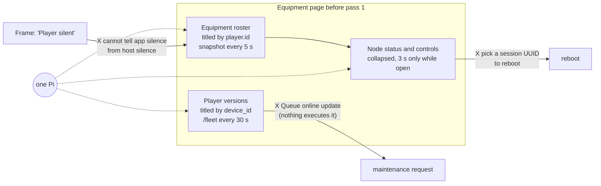
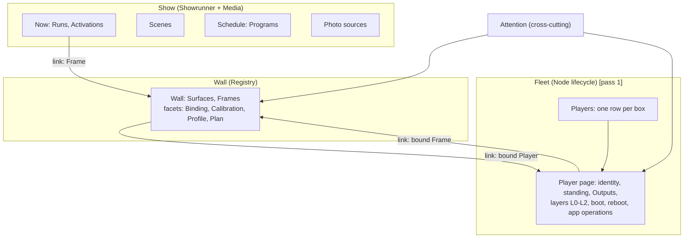
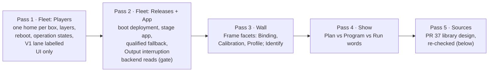
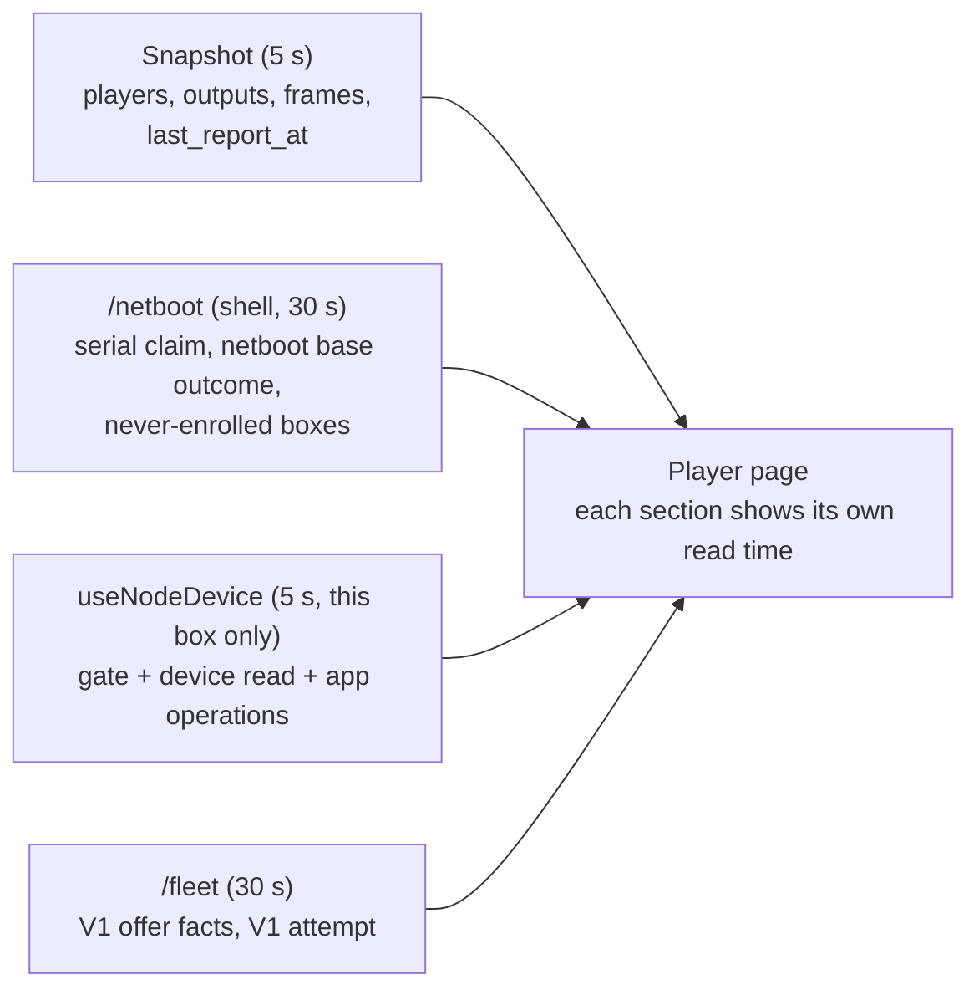
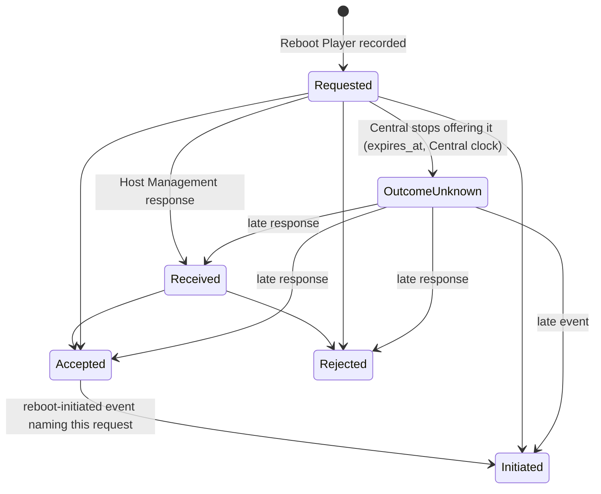

# Operator console: one home per aggregate (domain-driven console)

**Status:** pass 1 approved 2026-10-01 under the owner's autonomous-gate instruction (Q1 = A, one home per box; Q2 = keep the V1 boot-offer controls, labelled) and built 2026-10-02 (beads B1–B4), awaiting its one full verify and review. Implementation findings are folded in below (see History). Passes 2–5 are planned, not designed at feature level.
**Layers:** Part A is the **module layer**: the domain-to-console map, the design rules and the roadmap of passes. The owner steers this part. Part B designs **pass 1 at the feature layer** for delivery: screens, read models, signatures and beads.
**Branch:** every pass lands on one running PR from `claude/console-ddd`.
**Owner is asked:** Q1 (shape, §4) and Q2 (keep or hide the V1 boot-offer controls, §11). Everything else is a current design choice that the owner can revise. The backend reads that later passes need are listed in §8 so they are not a surprise, but they are asked at the pass-2 gate, not now.
**Builds on:** [requirements](requirements.md), [Player node domain model](player-node-domain-model.md), [fleet implementation map](player-fleet-implementation-map.md), [console UX design](operator-console-ux-design.md) and its pass-2 history, and the open [library design](operator-console-ux-pass2-library.md) (PR 37), which becomes pass 5 here.

# Part A: the map and the roadmap (module layer)

## 1. Before pass 1, in one picture

Before pass 1, one physical Player box was drawn three times on the Equipment page (since replaced by the Players pages; its old address now opens `#/players`). Each drawing used a different identity and a different read cadence. The node layers the requirements say to tell apart sat behind a collapsed disclosure.



| Failure | Where it shows | Requirement it breaks |
|---|---|---|
| One box, three cards, no shared identity or read time | `wallRoutes.jsx` renders `PlayerVersions`, `EquipmentRoster` and `NodeDevicePanel` | One Player is one replaceable appliance ([installation model](requirements.md#installation-model)) |
| A silent Player app with a live host reads the same as a dead node | `health.js` classifier; host samples only inside the collapsed panel | U4, U6 ([failure visibility](requirements.md#failure-visibility-and-recovery)) |
| Two meanings of "desired app". The only update button creates a request nothing will ever execute | `PlayerVersions.jsx` "Queue online update"; `NodeDevicePanel.jsx` "latest stage is the desired app" | Declarative desired state; no command without an executor |
| Reboot asks for a session UUID and a typed audit token, three disclosures deep | `NodeDevicePanel.jsx` | Reboot targets the current HostCore session ([domain model](player-node-domain-model.md#host-report-and-reboot)) |
| The reboot audit links a later boot to a command by timestamp | `NodeDevicePanel.jsx` "Subsequent boot claims observed" | Never infer causation from proximity in time ([domain model](player-node-domain-model.md#commands-responses-events-and-current-state)) |
| Central intent is worded as device truth: "Shows frame X" for a Binding; "Edit N presented on the display" for a compositor receipt | `health.js` `outputStates`; `LiveCalibrationTrial.jsx` | AGENTS.md "distinguish … commitment and observed output"; U9 |

## 2. Requirements (binding; not design choices)

| # | Rule | Source |
|---|---|---|
| R1 | Frames are persistent locations. Players and Panels are replaceable equipment. | AGENTS.md; [installation model](requirements.md#installation-model) |
| R2 | Never present Central intent as device truth. Keep acquired files, readiness, capacity, commitment and observed output distinct. | AGENTS.md non-negotiables; programme brief |
| R3 | Player app liveness is `player_feedback.received_at` for the current `authority_epoch`. `players.last_seen` changes only at enrollment. | Owner; `central/coordination.py` |
| R4 | Central distinguishes a silent Player app from an unobserved Host Management agent, bound or not. It shows a named cause with its source and last evidence time, and never infers a cause. When Central cannot say when it last heard from a layer, it says so. | U4, U6 |
| R5 | A command, its response and its events are distinct facts. Receipt is not effect. Causation is never inferred from timing. A lost response stays unknown, with no blind new command. | [Domain model](player-node-domain-model.md#commands-responses-events-and-current-state) |
| R6 | An operator reboot is dispatched immediately, even during a Run. Only that Player's Outputs are interrupted. The Run continues, and no other Frame or Actuator gets a new or implied command. | [Domain model](player-node-domain-model.md#promise-failure-envelope-and-selected-choices); [operations](requirements.md#operations-and-scope) |
| R7 | Calibration Save needs Display Host's `presented_to_compositor` acknowledgment. The console never calls that visible pixels. | U9 |
| R8 | Declarative desired and observed state, not commands with deadlines. | Owner |
| R9 | Align the UI only. A backend change is allowed only when a domain concept cannot otherwise be shown honestly, and then only as an owner gate. | Programme brief |
| R10 | Never compare clocks across systems. Ages are Central's read time minus Central's receipt time. | Owner |
| R11 | Qualification scenarios are CI tests. The fleet/node UI needs a CI-gated browser suite. | Owner |
| R12 | Serial and boot are LAN claims (`lan_serial`), never verified physical identity. | [Domain model](player-node-domain-model.md#host-report-and-reboot) |

## 3. Glossary (the console's words)

| Console word | Domain meaning | Not to be confused with |
|---|---|---|
| **Player** | One replaceable box. The console keys it by its fleet **device** identity (`device-` + sha256 of `pi:<normalized serial>`, `contracts/equipment.py`) because a box exists from its first netboot. Its Registry enrollment (`player_id`, `authority_epoch`) is a fact on the Player, not its name. | The Player app process (one enrollment epoch) |
| **Player app** | Player Runtime (L2): enrolls per process start; reports readiness. | The box |
| **Host Management** | HostCore (L0): host samples and the reboot path. | Player app liveness |
| **App Manager / App Effect Broker** | App Lifecycle (L1): prepares and switches app environments. | V1 maintenance requests |
| **Display Host** | L1.5: owns final scanout. Reports `presented_to_compositor`, `withdrawn` or `invalidated` per Output. | Panel pixels, which no layer observes |
| **Output** | A connector on a Player (HDMI). | Panel |
| **Panel** | The display hardware at a Frame. Requirements say Panel; the console stops saying "Display" for it. | Display Host |
| **Binding** | The Output-to-Frame assignment Central has set. The Frame is its root: every bind carries the Frame's generation. Worded "Bound to Frame X", never "shows". | Presentation |
| **Standing** | Not enrolled, Unbound, Bound or Retired (replaces "Pending", "New" and "In service"). | Liveness |
| **Boot path** | Chosen **per boot**, not stored per Player. Three names: **node offer** (`/v2/node/boot-offers`, kernel cmdline `photowall.node=v2`), **V1 offer** (`/v1/netboot/offers`, V1 fleet policy) and **netboot base without an offer** (`/v1/netboot/base`, content-catalog pin and frontier). Each boot record is labelled with the path that produced it. | A Player attribute: there is none |
| **Last reported** | The latest receipt time of a layer that reports periodically (heartbeat). | **First received**: when Central first received one particular fact, which says nothing about the layer since |

## 4. The proposed shape

Each navigation group is one bounded context. Each aggregate gets one home page. Every other mention of it is a link to that home.



**Design-it-twice.**

| | **A. One home per box (recommended)** | **B. One section per bounded context** |
|---|---|---|
| How | Fleet › Players is keyed by device. The Player page combines the Registry Player and the fleet Device, grouped by node layer, and shows each section's own read time. Writes stay with their aggregate: Retire goes to Registry, Reboot goes to Fleet, Bind goes to the Frame. | Wall › Equipment keeps the Registry view (Players, Outputs, Bindings). A new Fleet › Nodes page holds the Devices (boots, layers, reboot, app operations). The two pages cross-link by device id. |
| Gives | One place answers "what is this box doing, layer by layer". A box that netboots but never enrolls is visible (U4). | Each page has one read source and one cadence. It mirrors the code's contexts exactly. About 40 % less change. |
| Costs | The Player page carries up to four reads with four labelled read times. Node reads happen only on an open Player page, so the list cannot show node state. | Today's split becomes official: the same box appears in two lists. "Why is Frame X dark?" takes two pages. A never-enrolled box appears only under Nodes. |
| Both | Two of five layers (App Effect Broker, Display Host) show "last reported: unknown" until a backend read exists (§8). Neither shape can fix that from the UI. | |

> **Q1 (shape).** Recommended: **A**. Alternative: **B**, at the costs above.

## 5. Design rules (design choices, not requirements)

| Rule | What it makes impossible | Guarantee |
|---|---|---|
| **1. One home per aggregate.** The home is the only page that shows an aggregate's full state. Elsewhere it appears as a link (chip), never as a summary card. A **relationship** between two aggregates may be started from either side, but both sides call the one write its root owns. Binding is the one such relationship in pass 1: the Frame home and the Player page's Outputs both call `bind` (`equipmentApi.js:93`, Frame generation as the fence), as `BindingFacet.jsx` and `PlayerPage.jsx` do (the retired `EquipmentRoster.jsx` did the same). | Two cards for one box with disagreeing read times; two bind writes with different fences | One write function per relationship (construction); route review; the R4 import-graph test covers fleet routes |
| **2. Every fact carries its truth kind.** Fleet views render facts only through one `fact()` value. A fact that lacks its label (source and receipt for `reported`, a source for `claimed`, a basis for `derived`) **becomes** `unknown`, naming what is missing. A `claimed` fact carries its receipt only when Central serves one, and then says which receipt it is, as `reported` does. It never renders unlabelled and never throws. One pass-1 exception: the V1 section's `ManagementFacts` (V1 loader session, V1 app attempt, authenticated OS attempt claim) keeps its plain "V1 record" lines; routing it through `fact()` is scheduled for pass 2. | Unlabelled device truth; ages taken from node clocks; a payload change blanking the console | Construction-time (the value cannot be built unlabelled), in pure model functions under Node tests; each Player page section sits behind its own error boundary |
| **3. Commands are domain verbs on the aggregate's home.** The console binds Central's fences (session, generation, gate generation, command id) from the read it shows, freezes the whole request when the dialog opens, and asks only when a choice really exists. Outcomes use the existing equipment vocabulary: done, already, changed, refused, unknown. | Operators choosing transport plumbing; a retry that changes the request; a new outcome dialect per module | Construction (one request builder per verb, body frozen at open); browser tests |

**Truth kinds** (rule 2), each with its one wording pattern:

| Kind | Meaning | Wording pattern | Example |
|---|---|---|---|
| `set` | Central record written by an operator or policy | "Set …" or a plain noun | "Bound to Frame lobby-left" |
| `reported`, latest | A node layer reports periodically; this is its latest receipt | "<Layer> last reported <age> ago" | "Host Management last reported 4 s ago" |
| `reported`, first | One fact a layer sent once, on change | "<Layer> reported <fact> · first received <age> ago" | "App Effect Broker reported the app running · first received 3 d ago" |
| `claimed` | A LAN claim Central accepted but cannot verify | "… (claimed at boot by <source>, unverified)", then, when Central serves a receipt, " · first received <age> ago" (a claim sent once) or " · last claimed <age> ago" (a claim repeated on every check-in) | "Serial 10000000a1b2c3 (claimed at boot by the box, unverified)" |
| `derived` | Central's own conclusion from named records | "<Conclusion> (Central's inference: <basis>)" | "Interrupted (Central's inference: a later boot was admitted)" |
| `unknown` | Not observable, not served, or not read | "Unknown: <why>" | "Panel pixels: Unknown: no layer observes them" |

A `reported` fact must say which receipt it carries; without that, it becomes `unknown`. A `set` fact may carry the time Central recorded it (" · recorded <age> ago"). The `claimed` pattern says "at boot" even for the T0 app claims from a V1 serial check-in (source "its serial check-in"); the wording is fixed, so that claim reads as boot-time although it is not. A fifth kind, `planned` (Central's projection of intent, for now-showing), arrives with pass 4, its first user.

## 6. Domain-to-console map (every aggregate, one home)

| Aggregate (context) | Console home | Noun on screen | Truth kind and label | Pass |
|---|---|---|---|---|
| Device + Registry Player (Fleet + Registry) | `#/players/<device>` | Player | identity `claimed`; standing `set`; Player app `reported`, latest | 1 |
| BootOffer (Fleet, node and V1) | Player › Boot | Node boot offer; V1 boot offer | `set` ("not proof the Player booted"), labelled by boot path | 1 |
| Netboot base outcome (content catalog) | Player › Boot | Netboot base without an offer | `set` (pin, frontier, last served) | 1 |
| BootAdmission / current session (Fleet) | Player › Boot | Current node session's boot | `claimed`; "No current node session" when none is current | 1 |
| NodeSession / Producer (Fleet) | Player › Layers (session detail under "Identifiers") | Host Management, App Manager, App Effect Broker, Display Host | session state is a detail | 1 |
| HostObservation (Fleet) | Player › Layers › Host Management | Host samples | `reported`, latest | 1 |
| ManagerPreparation (Fleet) | Player › Layers › App Manager | Preparation | `reported`, latest; "preparation is not activation" | 1 |
| NodeEvidence: AppProcessFact (Fleet) | Player › Layers › App Effect Broker | App process | `reported`, first; layer's last report `unknown` (not served) | 1 |
| NodeEvidence: SurfaceFact (Fleet) | Player › Layers › Display Host | Output presentation | `unknown` ("Central does not hold Display Host's current presentation"); the served projection holds the first reported state (§13) | 1 unknown; 2 gate |
| RebootCommand (Fleet) | Player › Reboot | Reboot request + history | request `set`; responses and initiation `reported`; outcome `unknown` until reported; completion `unknown` | 1 |
| AppOperation (Fleet) | Player › App | App operation | request `set`; response and effects `reported`; interrupted `derived` | 1 read, 2 write |
| Deployment / BootPolicy / NodeRelease (Fleet) | `#/releases` | Node release; Boot deployment | `set` | 2 (pass-2 gate) |
| Qualification / EnvironmentAcceptance (Fleet) | Player › App › Fallback | Qualified fallback | `set` from `reported` samples | 2 |
| EffectGate (Fleet) | Reason beside a disabled Reboot | Remote changes: open / closed | `set` | 1 |
| V1 lane: app policy, override, base baseline, maintenance, V1 attempt (Fleet V1) | Players list header (fleet policy); Player › V1 boot offers (per Player) | V1 app target; V1 boot baseline; V1 app attempt | `set`; T0 observations `claimed` | 1 (Q2) |
| AppLink (Fleet) | Player › Identifiers | Linked app process | `reported`, first | 1 |
| OutputLoss (Runtime) | Player › Outputs; Run card participant | Output interrupted | needs a read route (pass-2 gate) | 2 |
| Output (Registry) | Player › Outputs | Output | Panel facts at last app start `reported`, first (labelled stale) | 1 |
| Frame + Binding + Calibration (Registry) | `#/wall/frames/<id>/…` | Frame; Binding; Calibration; Profile | `set` | 3 |
| CalibrationTrial (Registry + Display Host) | Frame › Calibration | Live calibration | candidate `set`; acknowledgment `reported` | 1 wording; 3 facet |
| Scene, Program, Activation, Run (Runtime) | `#/scenes`, `#/schedule`, `#/now` | Scene, Program, Show now, Run | `set`; "now" is `planned` | 4 |
| Coordination: readiness, secured assignment (Runtime) | Frame › Plan; Attention | Readiness report | `reported` | 4 |
| Source (Media) | `#/sources` | Source | spec `set`; refresh `reported` (via worker) | 5 |
| Surface, Installation, Actuator, Sensor, Target group, Panel entity | none: no stored entity exists | — | — | not planned (§13) |

## 7. Gaps, ranked

| # | Gap | Severity | Pass |
|---|---|---|---|
| 1 | One box drawn three times with three identities and cadences | high | 1 |
| 2 | Host Management silence and Player app silence not told apart (U4/U6) | high | 1 for Host Management, App Manager and Player app (labelled last-reported ages); App Effect Broker and Display Host last-heard is not served (pass-2 gate); a host-silence alarm needs a served threshold (feature proposal) |
| 3 | Dead "Queue online update"; two meanings of "desired app" | high | 1 |
| 4 | Output interruption inside a continuing Run cannot be shown (no read route) | high, owner gate | 2 |
| 5 | Reboot presented as session plumbing | medium | 1 |
| 6 | Reboot audit correlates a boot to a command by timestamp | medium | 1 |
| 7 | Reboot and app-operation lifecycles flattened to raw strings; the app operation's broker response not shown | medium | 1 |
| 8 | Display Host per-Output presentation: the served `projection` keeps the **first** reported state, not the current one (§13) | medium | 1 shows Unknown; backend defect to its owner; pass-2 gate |
| 9 | "Edit N presented on the display" for a compositor receipt | medium-high | 1 |
| 10 | "Shows frame X" for a Binding | medium | 1 |
| 11 | V1 loader-session rows (T1/T2) unlabelled next to V2 `lan_serial` sessions | medium | 1 |
| 12 | Standing words "Pending", "New", "In service" are not domain terms | low-medium | 1 |
| 13 | V2 releases, deployments, boot policy and qualification have no UI | medium | 2 (pass-2 gate) |
| 14 | "Commissioning" mixes Calibration, Profile and Binding; legacy preview and live Trial use different nouns | medium | 3 |
| 15 | Display, Panel and Output drift (remaining strings) | medium | 1 (fleet strings), 3 (rest) |
| 16 | Startup display observation raises an alarm as if current | medium | 3 |
| 17 | "Unbind all" is a non-atomic sequence | low-medium | 3 (wording only) |
| 18 | Identify only on unbound Players; T1/T2 capability tiers in copy | low | 3 |
| 19 | "Recovered" banner inferred in the browser from epoch diffs | low | 3 |
| 20 | "Unplaced" is a UI state encoded as position (0,0) | low-medium | 3 |
| 21 | Plan chip says "Scheduled:" for any Run intent; "Now showing" names a plan | medium | 4 |
| 22 | Program times in the browser's zone with no stated zone | medium | 4 (label the zone); an Installation timezone is a feature proposal |
| 23 | Source named four ways | low | 5 |
| 24 | "All N frames heard from" reads as whole-node health | low | 1 |

## 8. Roadmap of passes



| Pass | Scope | Backend | Rough size |
|---|---|---|---|
| 1 | §9–§12 | none | 4 beads, about +2,200 / −1,250 lines |
| 2 | `#/releases`: release → deployment → boot selection, once deployments are readable. Player › App: Stage app (unbound Players only, until D16 is answered), qualified fallback. Output interruption on the Player page and on Run cards. Last-reported times for App Effect Broker and Display Host. | One owner gate at pass 2 (below) | about 5 beads |
| 3 | Frame facets renamed to Binding, Calibration and Profile, so "Commissioning" goes. One live-calibration noun. Identify on any Output through the served capability. Remove T1/T2 tiers. Durable "re-enrolled" wording from Registry facts. Unplaced as an explicit state. | none | about 3 beads |
| 4 | `planned` truth kind for now-showing. Plan chip shows Run or Program origin. Program times state their zone. Program noun versus the recurrence requirement (doc fix). | none | about 2 beads |
| 5 | PR 37 library design folded in (below) | as PR 37 already designs | as PR 37 |

**Known now, asked at the pass-2 gate** (not a pass-1 question). Each is a concept the UI cannot show honestly from what is served today: (i) Output interruption (`node_output_losses` is read only inside Runtime reconciliation); (ii) the current boot policy and published deployments (no GET exists; `/v1/operator/node/releases` returns the catalog only); (iii) a per-producer last-receipt time for App Effect Broker and Display Host, and Display Host's current per-Output presentation (which first needs the snapshot-sequence defect in §13 fixed by its owner); (iv) optionally, a node device read that does not take the global fleet lock (§11 cost).

**Feature proposals, outside this programme** (they add workflows or records, not alignment): Replace equipment as one Frame-side flow; an Installation timezone record; a Central health page; a host-silence alarm (needs a served threshold); a fleet-summary read route.

**PR 37 re-checked against the domain model** (pass 5). Its backend shape (lookup jobs answered as data) is its own approved scope. This programme changes only how it is presented.

| PR 37 element | Fits the domain? | Change when folded in |
|---|---|---|
| "A Source is one library query" | Yes: Source = named, revisioned query | Make "Source" the one noun, all strings at once: nav "Sources", Scene step "Which Source?", not "Photo sources" or "selection". |
| Preview "as of 12:03", Updating, failure is never empty | Yes (R6 there = R2 here) | Render through `fact()`: the preview is `reported` (the library, via the worker), with Central's receipt time. |
| Dates in the browser's zone (its Q5 deferred) | Acceptable while labelled | Keep its "browser's time zone" label. An Installation timezone is a separate feature proposal. |
| Tags, connection and preview inside the Source step | Yes: the library is an origin, not an aggregate | No "Library" nav section. Everything lives on the Source home. |
| Line citations to PR #34's branch | Stale once that branch merged | Re-cite to `main` before its build. |

# Part B: pass 1 (feature layer, for delivery)

## 9. Screens and read models

**Before → after (navigation).** Navigation groups are unlabelled lists in `Shell.jsx`; pass 1 adds no group headings and renames nothing outside the fleet.

| Before | After pass 1 |
|---|---|
| Now, Scenes, Schedule, Photo sources | unchanged |
| Wall, **Equipment** | Wall |
| — | **Players** (new fleet route table, mounted only while current, like Wall) |
| Attention | Attention |

**Routes.** The new routes are `#/players` and `#/players/<device-id>`. `#/equipment` parses to `#/players`, so old bookmarks keep working; `formatRoute` never emits it. `routeSamples.json` gains these routes, and the R4 import-graph test covers the fleet table. The Wall links to the Player page through `players.js` `playerPageHref`, so `players.js` is declared a module shared with Show in that test; it builds addresses and holds no controls.

**Players list.** Built from the snapshot and the shell's existing `/netboot` read only (`playersByDevice`, keyed by `device_id`). It shows name, standing and bound Frames, including a "Not enrolled" box seen only at boot. It does **no** node reads. The V1 fleet policy block (V1 app target, V1 boot baseline) sits at the top, labelled "V1 boot offers".

**Player page composition (where each section's data comes from).**



| Section | Shows | Truth kind |
|---|---|---|
| Header | Name "Player …a1b2c3" (serial handle; device id when there is no serial), standing, the Frames its Outputs are bound to (links) | standing `set`; serial `claimed` |
| Layers | Host Management (L0): last reported, from `host_observation.received_at`. App Manager (L1): last reported, from `manager_preparation.received_at`. App Effect Broker (L1): the app-process fact, first received; last reported "Unknown: Central does not serve when this layer last reported". Display Host (L1.5): "Unknown: Central does not hold Display Host's current presentation". Player app (L2): last reported readiness on the current epoch. "Panel pixels: unknown" closes the list. Each row names its source and has an expandable detail. | `reported` latest / first; `unknown` |
| Outputs | Each Output: Binding (link to the Frame), "Bind to a frame…" when unbound (the shared `bind` write, rule 1), Identify, Panel facts at the last app start (labelled stale) | `set`, `reported` |
| Boot | Current node session's boot (claimed), or "No current node session". Then one record per boot path seen: node boot offer (issued or refused, with reason), V1 boot offer, netboot base without an offer. Each record is labelled with its path. | `claimed`, `set` |
| Reboot | "Reboot Player", with its reason when disabled; reboot history with one named state per request (§10) | §10 |
| App | Node app operations with named states (read-only until pass 2) | §10 |
| V1 boot offers | Per-Player V1 app target (set/clear), latest V1 offer, T0 installed/running claims, fallback, `ManagementFacts` (loader session and V1 app attempt, which is also why the effect gate may stay closed), a queued maintenance request with Cancel. V1 loader rows read "V1 record". | `set`, `claimed` |
| Danger zone | Retire (Unbound only), Unbind all (Bound only); existing dialogs | `set` |

**Failure modes (pass 1).**

| What breaks | What the operator sees | Guarantee |
|---|---|---|
| A served field is null or missing (e.g. `host_observation` absent) | That fact reads "Unknown: <field> not served" | Construction-time in `fact()`; Node tests |
| A section's render throws (payload drift) | "This section could not be shown" in that section; the rest of the page and the console stay up | Per-section error boundary; browser test with a malformed read |
| Node management off on this Central (`node_control_disabled`) | L0–L1.5 rows, Reboot and App read "Unknown: node management is off on this Central"; the rest of the page works | Browser test |
| A device read fails | Its rows keep their last values, marked "as of <read time>, refresh failed" | Browser test |
| Player Retired | Node rows are not read. A plain statement, "Not read: Player retired", stands in their place; it is not a `fact()` (the `unknown` pattern would read "Unknown: …"). Checked from snapshot standing first, because a retired box and a box with no node record both return 403 `node_device_unavailable`. | Model test |
| No node record (403 on a non-retired box) | "Unknown: no current node record for this box" | Model test |
| A layer has no current session (a dead host: its session lapsed and was not renewed) | The layer's newest earlier session that holds its evidence still speaks ("Host Management last reported 2 h ago"), with "Session: No current Host Management session; the evidence above is from its last session". Unknown only when no session of that layer has a sample. | Model test |
| Player app row of a retired Player | "Unknown: Central does not read reports from a retired Player" (Central's read excludes retired Players, so a missing report time says nothing about the box) | Model test |

## 10. Lifecycles shown

**Reboot request.** Each state is computed only from Central's records and Central's read time. No state is terminal while a later response or initiation event can still arrive (responses are stored without an expiry check, `node_ingest.py:106-135`).



Each §10 wording below is the request's or operation's **state label**, shown verbatim. Beside it, an "Evidence:" line is a rule-2 `fact()` carrying the receipt, for example 'Host Management reported a "rejected" response · first received 2 s ago'. The labels do not themselves follow rule 2's `reported` pattern.

| State | Wording |
|---|---|
| Requested | "Requested · delivery unknown · Central offers it to Host Management until <time>"; while the read shows the effect gate closed or the targeted session no longer current, "Requested · Central is not offering it now (effect gate closed \| session no longer current)", still not terminal. The request's own gate generation is not served, so a gate that closed and reopened is not detected. |
| Outcome unknown | "Outcome unknown: no response from Host Management; Central stopped offering it at <time>" |
| Received / Accepted / Rejected | "Received by Host Management" / "Accepted by Host Management, not yet started" / "Rejected by Host Management" |
| Initiated | "Host Management reported the reboot started · completion unknown" |
| (separately) Current boot | Shown in Boot. It is never linked to a request: "A later boot does not show what caused it." |

**Retry and new requests.** The dialog freezes the whole request body when it opens: session, device and rollout generations, audit reference, reason, window and command id. So a 409 `node_reboot_identity_conflict` cannot arise from the console. Inside the window, a retry of the same body lands "Already recorded". After the window, the same retry gets 410 `node_reboot_expired`, which the console shows as **Outcome unknown**, never as "refused". While the latest request is Requested, "Reboot Player" offers only that retry, and only on the page that sent it: the device read does not serve the request's device and rollout generations or its window, all of which are in Central's request hash (`node_commands.py:59-64`), so the retry re-sends the frozen body that page holds. That page counts its own request as Requested until a read lists it settled, or, while no read lists it, until its frozen window ends; a different Requested request blocks it too. The frozen window counts from the read the dialog opened on, so once a read reaches it and does not list the request as the latest, the dialog refuses to send: "This request is out of date; close and reopen" (reopening rebuilds the fences and the bound Frames and Runs). Any other page (another tab, a reload) disables Reboot with the Requested reason until the window ends; no page ever sends a new command id while Requested. After its window, a **new** request is allowed, and its dialog states the previous request's outcome is unknown and whether Host Management's current session is the **same boot** that request targeted or a later one (an identity comparison of kernel boot ids, not a clock comparison). That makes the second request a deliberate operator decision, not a blind resend.

**App operation** (node projection; read-only in pass 1). `appOperationState` reads both `state` and `command_response`, because the backend keeps `state` at `staged` whatever the broker answered (`node_lifecycle.py:307-318`).

| Served state + response | Wording | Truth kind |
|---|---|---|
| staged, no response | "Staged; no response from App Effect Broker" | `set` |
| staged, received | "Received by App Effect Broker" | `reported` (response receipt) |
| staged, accepted | "Accepted by App Effect Broker; preparing" | `reported` (response receipt) |
| staged, rejected | "Rejected by App Effect Broker" (the reason is not served) | `reported` (response receipt) |
| switching | "App Effect Broker reported switching (<latest phase>)" | `reported` (`latest_effect.received_at`) |
| target_running | "App Effect Broker reported the staged app running" | `reported` |
| fallback_running | "App Effect Broker reported the fallback app running" | `reported` |
| effect_unknown | "App Effect Broker reported the outcome as unknown" | `reported` |
| superseded | "Replaced by a later stage" | `set` |
| interrupted_by_reboot | "Interrupted (Central's inference: a later boot of this Player was admitted)" | `derived` |

## 11. Interface sketch (new modules; signatures only)

```text
facts.js                                                               (B1)
  fact({kind, value, source?, receipt?: "latest"|"first", receivedAt?, readAt?, basis?, why?, field?}) -> Fact
                                       // field names the served field a missing receipt comes from
                                       // frozen; never throws: a missing label yields kind "unknown" naming it
  factText(fact) -> string             // the one wording per kind (§5)
FactLine.jsx       <FactLine label fact />          // the only renderer of facts in fleet views
SectionBoundary.jsx <SectionBoundary title> … </>   // per-section error boundary

players.js                                                             (B1)
  playersByDevice(snapshot, bootFacts) -> PlayerRow[]                  // union keyed by device_id
  PlayerRow = {deviceId, player|null, standing: "not-enrolled"|"unbound"|"bound"|"retired", name, frames}

nodeRead.js                                                            (B1)
  useNodeDevice(deviceId, {cadenceMs, skip}) -> {enabled: true|false|null, gate, read, operations, readAt, error, refresh}
                                       // one box; Player page only; pauses in a hidden tab; skipped when retired
  processFacts(session) -> AppProcessFact[]                            // decodes session.projection
  layerEvidence({nodeDevice, snapshot, playerId}) -> LayerRow[]        // five rows, each a Fact
  currentSessionBoot(nodeDevice) -> {kernelBootId, fact} | {none: fact}

fleetCommands.js                                                       (B2)
  rebootTarget(nodeDevice, gate) -> {available: true, sessionId, deviceGeneration, rolloutGeneration, kernelBootId}
                                  | {available: false, reason}         // binds the one current host_core session
  heldReboot(request, result) -> FrozenRebootRequest | null          // kept after done, already or a retryable unknown
  rebootOffer(target, latestRequest, readAt, held) -> {offer: "new"} | {offer: "retry", reason} | {offer: "blocked", reason}
                                       // the held request counts as Requested until a read settles it or its frozen window ends
  rebootBlocked(target, latestRequest, readAt, {held}) -> reason | null   // the disabled-button reason
  rebootRequest(target, latestRequest, snapshot, readAt, {playerId, commandId, reason, held}) -> FrozenRebootRequest | {refused}
                                       // whole body frozen at open; refuses a new command id while latest (or held) is Requested
  rebootStale(request, latestRequest, readAt) -> reason | null        // refuses to send once a read reaches retryUntil unlisted
  rebootCommandState(command, readAt, {nodeDevice}) -> {state, fact}   // §10; Central clock only; nodeDevice words "not offering it now"
  appOperationState(operation, readAt) -> {state, fact}                // §10; reads command_response; readAt dates receipts
  rebootResult(result) -> outcome      // done | already | changed | refused | unknown (retry the same body)
```

**Current choices** (revisable; this section is recommended as shown):

| Choice | Current | Alternative and its cost |
|---|---|---|
| Reboot fences | The console binds the one current `host_core` session. A unique index allows at most one unrevoked session per device, generation and owner (`053_node_control.sql:46`), so the console never asks the operator to choose. | Keep the picker: plumbing the operator cannot judge |
| Audit reference | Filled automatically as `console/<date>`, plus an optional "Reason" token, both frozen at open | Required typed field: friction with no extra trust, since the console has one shared operator account |
| Dispatch window | 30 s, shown in the dialog | Expose 1–60 s: one more number the operator cannot judge |
| Reboot dialog home | The fleet module owns the reboot dialog and re-submits the frozen body; the shared `ConfirmAction` module (used by Show) is not extended | Add `retry` to `ConfirmAction`: widens a module shared with Show for one user |
| Node reads | Only on an open Player page, every 5 s for that box, paused in a hidden tab. Each read cycle takes the global fleet advisory lock twice (§13). | List fan-out: node state on the list at a lock cost per box; no requirement asks for it |
| Host silence | Last-reported ages only. No "host silent" alarm, because no threshold is served. | Invent a client threshold: an unowned number (R9) |
| Player name | Serial handle; full device and Player ids under "Identifiers" | Device id as the heading: unreadable, and it is today's problem |
| Projection decoding | Only App Effect Broker process facts are decoded from `session.projection`, pinned by a checked-in fixture that one Python test asserts the contracts still encode identically. Surface facts are not shown as current (§13). | No decoding: the broker's process state stays hidden |

> **Q2 (V1 boot-offer controls).** The V1 controls (fleet V1 app target, per-Player V1 app target, V1 boot baseline) still change what future V1 boot offers carry. Recommended: **keep them, labelled "V1 boot offers"**. Alternative **(b): hide them now.** A Pi still booting through V1 offers loses its console controls. Either way, "Queue online update" is removed, because nothing executes maintenance requests (`MaintenanceRequestStore.dispatch_in` has no callers); existing queued requests stay visible with Cancel.

## 12. Beads (each lands green alone; built back to back, one verify and review per pass)

Delivery follows the owner's standing preference: the four beads are built back to back, each green on its own package tests so the batch can stop at any bead, then one full verify and one review pass over the whole of pass 1.

| Bead | Contents | Acceptance (observable) | Lines |
|---|---|---|---|
| **B1 · Tracer, Players list and Player page** | Tracer first (below). `facts.js`, `FactLine.jsx`, `SectionBoundary.jsx`, `players.js`, `nodeRead.js`; standing words in `health.js`; fleet route table, `PlayersPage.jsx`, `PlayerPage.jsx` (header, layers, Outputs with Bind and Identify, boot, danger zone); delete `EquipmentRoster.jsx`; mount the existing `NodeDevicePanel` unchanged on the Player page and `PlayerVersions` unchanged on the list (it lists every device and carries the fleet V1 policy) until B2 and B3 replace them; Node-run model tests; CI-gated browser suite on `operator_harness` with node routes mounted; rewrite of the roster-based browser tests (`test_operator_binding_browser.py` about 21 `connect(…, "equipment")` sites and the "Equipment" region, `test_console_shell_review_browser.py` `#/equipment` hash, `test_console_routes_r4.py` section list) | `#/players` shows one row per box, including a "Not enrolled" box seen only at boot, with no node read. The Player page shows five layer rows: Host Management, App Manager and Player app with last-reported ages; App Effect Broker with its process fact first-received and last-reported Unknown; Display Host Unknown. A silent app with a reporting host shows both ages. A missing field renders Unknown naming it; a malformed read blanks one section only. Node management off: L0–L1.5 read Unknown and the page works. `#/equipment` lands on `#/players`. Bind (from the Output), Identify, Retire and Unbind all pass from the page. No console string says "Refresh Equipment" or names the Equipment page. | +1,450 / −700 |
| **B2 · Reboot and operation states** | `fleetCommands.js`; Reboot section and history; app-operation list; delete `NodeDevicePanel.jsx` and `nodeDevice.css` | The dialog names the Player's bound Frames and their live Runs and says: "The Run stays active. Central sends no command to other Frames or Actuators." A recorded reboot shows "Requested · delivery unknown". A retry inside the window sends the identical body and lands "Already recorded". A retry after the window (410) shows Outcome unknown. A late response after the window moves the state on. While a request is Requested, no new command id can be sent. A closed gate disables Reboot with its reason. Rejected shows its named state. A rejected app operation reads "Rejected by App Effect Broker", not "Staged". No "subsequent boot" line exists. | +400 / −170 |
| **B3 · V1 lane and honest Wall wording** | V1 fleet policy block on the Players list; per-Player V1 section reusing `ManagementFacts`; "Queue online update" removed; delete `PlayerVersions.jsx`. Wall: `outputStates` "Bound to Frame X"; the Binding facet's Player-silent line links to the Player page (no node read on the Wall); the Commissioning equipment block links to the Player and uses Output/Panel words; the Trial says "presented to the compositor by Display Host"; the attention all-clear reads "All N Frames' Player apps reporting" | No control creates a maintenance request. A queued request is shown and can be cancelled. V1 loader rows read "V1 record". Setting the V1 fleet target from the Players list works in a browser test. No console string says "Shows frame", "presented on the display" or "Display equipment". Existing Wall browser tests are updated to the new strings. | +250 / −380 |
| **B4 · Docs** | [Console UX design](operator-console-ux-design.md) glossary and §3 (Panel, standing, Players); this document's status; AGENTS.md code-map row for fleet routes | `check_docs.py` passes. No doc still names `#/equipment` as a page. | +100 |

**Tracer bullet** (the first commit of B1). `#/players/<device-id>` shows the Registry standing and Host Management's last-reported age for one box, reached from the `#/players` list. It proves the device-keyed join, `useNodeDevice`, the `fact()` labelling (including the missing-field path) and the new route table. **Non-goals:** reboot, app operations, V1 controls, Wall links.

## 13. Costs, deferrals and findings for other owners

**Costs.**
- About +2,200 / −1,250 lines, about 800 of them tests, including a rewrite of the roster-based browser tests. The new CI browser suite adds roughly a minute to the browser job.
- Every open Player page takes the global fleet advisory lock (`pg_advisory_xact_lock`, `locks.py:11-13`) plus device and lifecycle row locks twice per 5 s cycle (the device read and the app-operation read both call `lock_device_generation_in`, `node_sessions.py:92-97`). These serialize against netboot offers, enrollment and retire. Today's open node panel already does this every 3 s, so pass 1 lowers the rate, but two operators watching ten Player pages is twenty lock acquisitions per 5 s. A non-locking read is listed for the pass-2 gate.
- The list shows no node state. "Which Players have an unanswered reboot?" needs a page per Player until a summary read exists.
- App Effect Broker and Display Host show "last reported: unknown" in pass 1. That is honest, but it leaves U6 incomplete for two of five layers until the pass-2 gate.
- The console decodes a node message encoding nested inside `projection` (broker facts only). A fixture pins it, but a wire change now also breaks the console.
- The Player page shows up to four read times. That is honest but denser than one.
- Rule 1 now has two entry points for Binding. One shared write keeps the fence identical, but the two bind UIs must keep the same "an attempt spends the choice" policy by review.
- Outcome dialects in other modules (fleet `writeMessage`, node "recorded/refused/unknown") converge only where pass 1 touches them.

**Deferred:** `#/releases`, V2 stage, boot selection and qualification UI, Output interruption and broker/Display Host last-reported times (pass 2, behind its gate); Frame facet split and Identify everywhere (pass 3); `planned` and plan wording (pass 4); library (pass 5).

**Not planned:** Surface, Installation, Actuator, Sensor, Target group and Panel as console entities. None is stored, and inventing them would be backend design.

**Findings for other owners** (not this programme's to fix):

| Finding | Owner document |
|---|---|
| Display Host posts every snapshot with `covered_through_sequence=0` (`appliance/display_host/service.py:264-270`). Central skips a fact whose sequence is not newer (`central/fleet/node_evidence.py:114`), and a surface's fact key excludes its state, so a later `withdrawn` or `invalidated` is dropped as historical. A probe showed `presented_to_compositor` surviving a withdrawal. The served projection therefore holds the first reported presentation, and Runtime reconciliation is blind to withdrawals. | [Display host](display-host-backend.md); [implementation map](player-fleet-implementation-map.md) |
| The app operation's `state` stays `staged` after the broker rejects (`node_lifecycle.py:307-318`), and the online broker raises locally on a changed old process without responding (`appliance/node/online_broker.py:66-79`), so a refused stage can look like "no response". | [Implementation map](player-fleet-implementation-map.md) |
| Migrations 050–052 were deleted (commit 02ec7e5), against the forward-only rule. Docs still cite their behaviour. | AGENTS.md; [implementation map](player-fleet-implementation-map.md) |
| `node_lifecycle` still refuses on `active_equipment_drains`, which nothing writes (dead fence) | [Implementation map](player-fleet-implementation-map.md) |
| The implementation map still calls maintenance requests "an honest operator workflow", but `dispatched` is never written | [Implementation map](player-fleet-implementation-map.md) |
| The domain model calls itself a proposal and says the `lan_serial` sessions and the reboot route are not staged. Both exist. | [Domain model](player-node-domain-model.md) |
| Requirements give Program a recurrence; the code has one window per Program | [Requirements](requirements.md#experience-model) (pass 4 flags it) |
| Audit claims checked while designing: the reboot response's `message.message.decision` is **correct** (the payload is a `{schema, message}` envelope), so it is not a defect. | — |

**History.** 2026-10-01: first draft from the domain analysis and console audit, with the load-bearing audit claims re-checked against code. 2026-10-01: revised after adversarial review (domain-fidelity and simplicity lenses): Display Host presentation and broker/Display Host last-heard became Unknown after a probe showed the projection keeps the first reported state; `reported` split into latest and first receipt; `planned` deferred to pass 4 and `derived` added; Rule 1 names Binding as a two-sided relationship with one write; reboot gained Outcome unknown, the 410 path, late responses and a frozen request body; app operations read the broker response; "boot lane" replaced by three per-boot paths; `fact()` degrades instead of throwing, with per-section error boundaries; the Players list does no node reads and the lock cost is stated; beads re-cut to four with the tracer first and `ManagementFacts` kept; the Releases page, nav relabels and the backend-read question moved to pass 2; Replace equipment, the timezone record and the Central health page moved out as feature proposals; owner questions cut to two. 2026-10-02: pass 1 built (B1–B4). Implementation findings folded in: a `claimed` fact needs its source, and its receipt only when served; "Not read: Player retired" is a plain statement, not a fact; §10 wordings are state labels with an evidence fact beside them, and a staged operation with a received response has its own row; a Requested reboot is retried only from the page that holds its frozen body; §11 signatures match the code; `players.js` is shared with the Wall in the R4 test; a `claimed` receipt says whether it is the first or the latest; the sending page's own reboot request blocks a new command id until a read settles it; the runbook, README and the pass-2 documents now describe the Players pages in place of the Equipment roster. 2026-10-02 (fix cycle 2): a layer with no current session shows its last session's receipt instead of Unknown; a retired Player's app row no longer claims it has no report; a frozen reboot request is refused once a read reaches its window unlisted; a Requested label says when Central is not offering it now; `ManagementFacts` is recorded as rule 2's one pass-1 exception.
