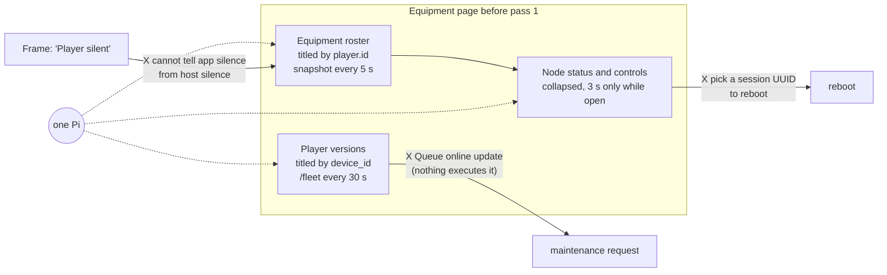
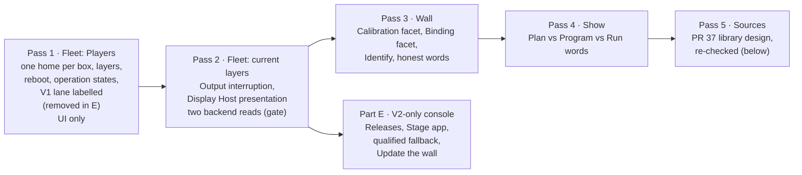
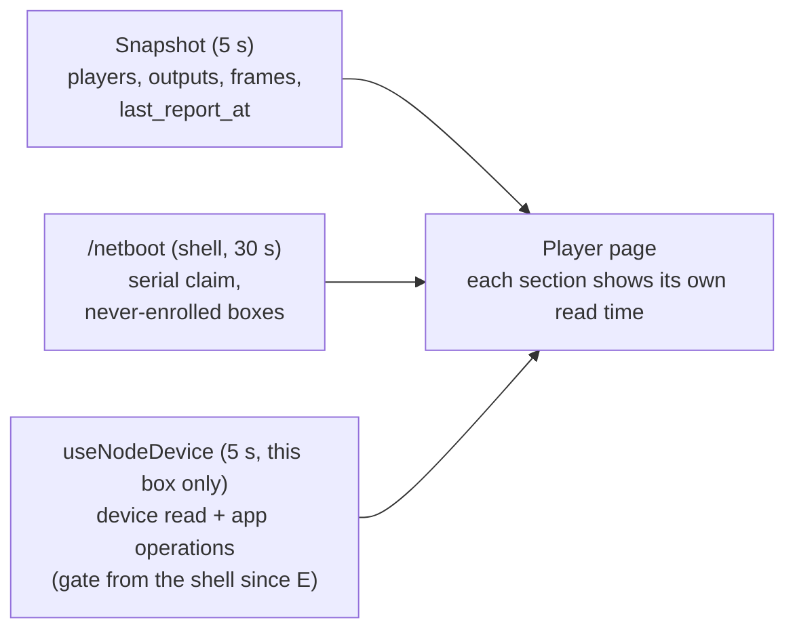
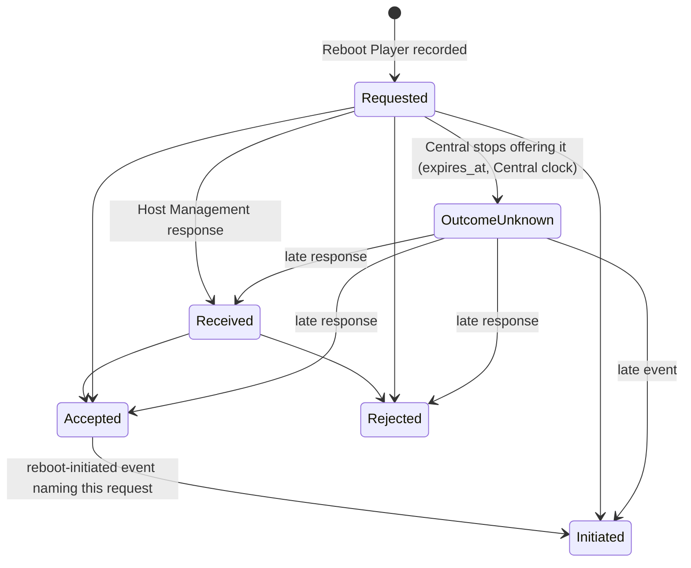
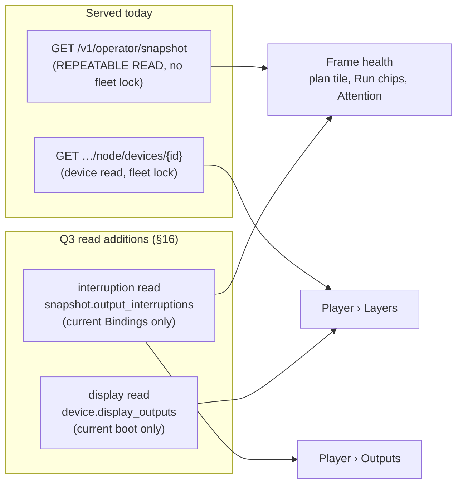
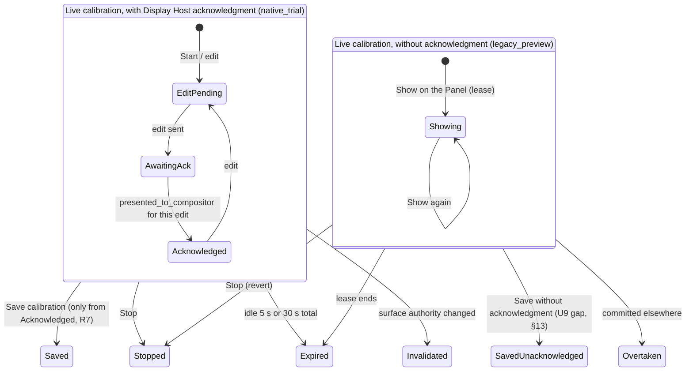
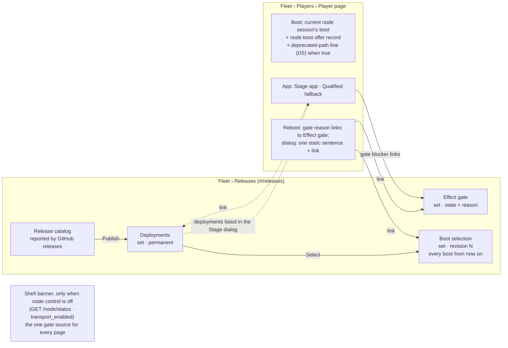
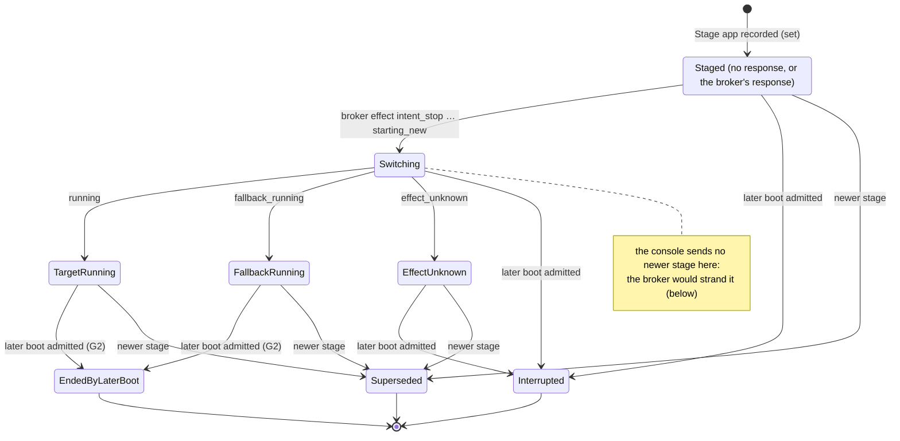

# Operator console: one home per aggregate (domain-driven console)

**Status:** pass 1 approved 2026-10-01 under the owner's autonomous-gate instruction (Q1 = A, one home per box; Q2 = keep the V1 boot-offer controls, labelled), built and reviewed 2026-10-02 (beads B1–B4); its implementation errata are folded in below, and its residual review findings became bead R0 (§23). Passes 2 and 3 are designed at feature level in Parts C and D, revised once after adversarial review, and cut into one batch (§23). The owner answered the pass-2/3 gate on 2026-10-02: Q3 = A (both read-only backend reads), Q4 = yes (the reboot fence), and Q5 = design the node release workflows next. Batch 2 (R0, C1, C2, D1, E1) is built to those answers and its implementation errata are folded in below. **Part E** (§24–§32) designs the node release workflows and, on the owner's steer of 2026-10-02, a **V2-only console**: node control is the one configuration posture and the console shows no V1-lane surface. It replaces §17 and supersedes Q2's answer. The owner then answered D16/Q1 = yes (a Stage on a Frame-bound Player follows the operator-reboot rule) and chose the guided **Update the wall** journey. Part E is built as batch 3 (§32), its implementation errata folded in; batches 2 and 3 await their full verify and review. Passes 4–5 are planned, not designed.
**Layers:** Part A is the **module layer**: the domain-to-console map, the design rules and the roadmap of passes. The owner steers this part. Parts B, C and D design **passes 1, 2 and 3 at the feature layer** for delivery: screens, read models, signatures, wordings and beads. Part E designs the V2-only console and the node release workflows at the same layer.
**Branch:** every pass lands on one running PR from `claude/console-ddd`.
**Owner is asked:** Q1 and Q2 (answered 2026-10-01; Q2 superseded 2026-10-02 by the V2-only steer, §24). Q3 (which of two read-only backend reads to add, §16), Q4 (a backend fence for one outstanding reboot, §16) and Q5 (the node release workflows, §17), answered 2026-10-02: Q3 = A, Q4 = yes, Q5 = design next. D16/Q1 (bound Stage, §29 G6) answered yes and Q7 (who samples qualification) answered "the page", 2026-10-02. **Open:** G7 (§31), a read-only boot-claim field the Update the wall journey would use; built without it. Everything else is a current design choice that the owner can revise. Each batch is built to the answers, so no declined branch and no dormant code ships.
**Builds on:** [requirements](requirements.md), [Player node domain model](player-node-domain-model.md), [fleet implementation map](player-fleet-implementation-map.md), [console UX design](operator-console-ux-design.md) and its pass-2 history, and the open [library design](operator-console-ux-pass2-library.md) (PR 37), which becomes pass 5 here.

# Part A: the map and the roadmap (module layer)

## 1. Before pass 1, in one picture

Before pass 1, one physical Player box was drawn three times on the Equipment page (since replaced by the Players pages; its old address now opens `#/players`). Each drawing used a different identity and a different read cadence. The node layers the requirements say to tell apart sat behind a collapsed disclosure.



| Failure | Where it shows | Requirement it breaks |
|---|---|---|
| One box, three cards, no shared identity or read time | `wallRoutes.jsx` renders `PlayerVersions`, `EquipmentRoster` and `NodeDevicePanel` | One Player is one replaceable appliance ([installation model](requirements.md#installation-model)) |
| A silent Player app with a live host reads the same as a dead node | `health.js` classifier; host samples only inside the collapsed panel | U4, U6 ([failure visibility](requirements.md#failure-visibility-and-recovery)) |
| Two meanings of "desired app". The only update button creates a request nothing will ever execute | `PlayerVersions.jsx` "Queue online update"; `NodeDevicePanel.jsx` "latest stage is the desired app" | Declarative desired state; no command without an executor |
| Reboot asks for a session UUID and a typed audit token, three disclosures deep | `NodeDevicePanel.jsx` | Reboot targets the current HostCore session ([domain model](player-node-domain-model.md#host-report-and-reboot)) |
| The reboot audit links a later boot to a command by timestamp | `NodeDevicePanel.jsx` "Subsequent boot claims observed" | Never infer causation from proximity in time ([domain model](player-node-domain-model.md#commands-responses-events-and-current-state)) |
| Central intent is worded as device truth: "Shows frame X" for a Binding; "Edit N presented on the display" for a compositor receipt | `health.js` `outputStates`; `LiveCalibrationTrial.jsx` | AGENTS.md "distinguish … commitment and observed output"; U9 |

## 2. Requirements (binding; not design choices)

| # | Rule | Source |
|---|---|---|
| R1 | Frames are persistent locations. Players and Panels are replaceable equipment. | AGENTS.md; [installation model](requirements.md#installation-model) |
| R2 | Never present Central intent as device truth. Keep acquired files, readiness, capacity, commitment and observed output distinct. | AGENTS.md non-negotiables; programme brief |
| R3 | Player app liveness is `player_feedback.received_at` for the current `authority_epoch`. `players.last_seen` changes only at enrollment. | Owner; `central/coordination.py` |
| R4 | Central distinguishes a silent Player app from an unobserved Host Management agent, bound or not. It shows a named cause with its source and last evidence time, and never infers a cause. When Central cannot say when it last heard from a layer, it says so. | U4, U6 |
| R5 | A command, its response and its events are distinct facts. Receipt is not effect. Causation is never inferred from timing. A lost response stays unknown, with no blind new command. | [Domain model](player-node-domain-model.md#commands-responses-events-and-current-state) |
| R6 | An operator reboot is dispatched immediately, even during a Run. Only that Player's Outputs are interrupted. The Run continues, and no other Frame or Actuator gets a new or implied command. | [Domain model](player-node-domain-model.md#promise-failure-envelope-and-selected-choices); [operations](requirements.md#operations-and-scope) |
| R7 | Calibration Save needs Display Host's `presented_to_compositor` acknowledgment. The console never calls that visible pixels. | U9 |
| R8 | Declarative desired and observed state, not commands with deadlines. | Owner |
| R9 | Align the UI only. A backend change is allowed only when a domain concept cannot otherwise be shown honestly, and then only as an owner gate. | Programme brief |
| R10 | Never compare clocks across systems. Ages are Central's read time minus Central's receipt time. | Owner |
| R11 | Qualification scenarios are CI tests. The fleet/node UI needs a CI-gated browser suite. | Owner |
| R12 | Serial and boot are LAN claims (`lan_serial`), never verified physical identity. | [Domain model](player-node-domain-model.md#host-report-and-reboot) |

## 3. Glossary (the console's words)

| Console word | Domain meaning | Not to be confused with |
|---|---|---|
| **Player** | One replaceable box. The console keys it by its fleet **device** identity (`device-` + sha256 of `pi:<normalized serial>`, `contracts/equipment.py`) because a box exists from its first netboot. Its Registry enrollment (`player_id`, `authority_epoch`) is a fact on the Player, not its name. | The Player app process (one enrollment epoch) |
| **Player app** | Player Runtime (L2): enrolls per process start; reports readiness. | The box |
| **Host Management** | HostCore (L0): host samples and the reboot path. | Player app liveness |
| **App Manager / App Effect Broker** | App Lifecycle (L1): prepares and switches app environments. | Maintenance requests (a V1-lane record nothing executes; not shown, §31) |
| **Display Host** | L1.5: owns final scanout. Reports `presented_to_compositor`, `withdrawn` or `invalidated` per Output. | Panel pixels, which no layer observes |
| **Output** | A connector on a Player (HDMI). | Panel |
| **Panel** | The display hardware at a Frame. Requirements say Panel; the console stops saying "Display" for it. | Display Host |
| **Binding** | The Output-to-Frame assignment Central has set. The Frame is its root: every bind carries the Frame's generation. Worded "Bound to Frame X", never "shows". | Presentation |
| **Standing** | Not enrolled, Unbound, Bound or Retired (replaces "Pending", "New" and "In service"). | Liveness |
| **Boot path** | One supported path: the **node offer** (`/v2/node/boot-offers`), taken when the Pi's kernel command line carries `photowall.node=v2`. Each Pi's command line decides at every boot; it is not stored per Player. A box whose newest boot record on Central is a deprecated boot offer or a base image served without an offer is **misconfigured**, shown as one line on its Player page (§25, G5), never as a mode. | A Player attribute: there is none |
| **Boot selection** | The fleet-wide boot policy: the one deployment Central offers every node-path boot from now on, with its revision (§25). | A per-Player choice: there is none (R17) |
| **Update the wall** | The guided journey (§25a): Publish, optionally try on one Frame, then Keep (Select and reboot Players one at a time) or Back out. It adds no Central state or verb. | A stored rollout or canary: Central records neither |
| **Last reported** | The latest receipt time of a layer that reports periodically (heartbeat). | **First received**: when Central first received one particular fact, which says nothing about the layer since |

## 4. The proposed shape

Each navigation group is one bounded context. Each aggregate gets one home page. Every other mention of it is a link to that home.


**Design-it-twice.**

| | **A. One home per box (recommended)** | **B. One section per bounded context** |
|---|---|---|
| How | Fleet › Players is keyed by device. The Player page combines the Registry Player and the fleet Device, grouped by node layer, and shows each section's own read time. Writes stay with their aggregate: Retire goes to Registry, Reboot goes to Fleet, Bind goes to the Frame. | Wall › Equipment keeps the Registry view (Players, Outputs, Bindings). A new Fleet › Nodes page holds the Devices (boots, layers, reboot, app operations). The two pages cross-link by device id. |
| Gives | One place answers "what is this box doing, layer by layer". A box that netboots but never enrolls is visible (U4). | Each page has one read source and one cadence. It mirrors the code's contexts exactly. About 40 % less change. |
| Costs | The Player page carries up to four reads with four labelled read times. Node reads happen only on an open Player page, so the list cannot show node state. | Today's split becomes official: the same box appears in two lists. "Why is Frame X dark?" takes two pages. A never-enrolled box appears only under Nodes. |
| Both | Two of five layers (App Effect Broker, Display Host) show "last reported: unknown" in pass 1. Display Host gets a read in pass 2 (Q3, §16); the App Effect Broker has no heartbeat, so no read can give it one. Neither shape can fix that from the UI. | |

> **Q1 (shape).** Recommended: **A**. Alternative: **B**, at the costs above.

## 5. Design rules (design choices, not requirements)

| Rule | What it makes impossible | Guarantee |
|---|---|---|
| **1. One home per aggregate.** The home is the only page that shows an aggregate's full state. Elsewhere it appears as a link (chip), never as a summary card. A **relationship** between two aggregates may be started from either side, but both sides call the one write its root owns. Binding is the one such relationship in pass 1: the Frame home and the Player page's Outputs both call `bind` (`equipmentApi.js:93`, Frame generation as the fence), as `BindingFacet.jsx` and `PlayerPage.jsx` do (the retired `EquipmentRoster.jsx` did the same). | Two cards for one box with disagreeing read times; two bind writes with different fences | One write function per relationship (construction); route review; the R4 import-graph test covers fleet routes |
| **2. Every fact carries its truth kind.** Fleet views render facts only through one `fact()` value. A fact that lacks its label (source and receipt for `reported`, a source for `claimed`, a basis for `derived`) **becomes** `unknown`, naming what is missing. A `claimed` fact carries its receipt only when Central serves one, and then says which receipt it is, as `reported` does. It never renders unlabelled and never throws. | Unlabelled device truth; ages taken from node clocks; a payload change blanking the console | Construction-time (the value cannot be built unlabelled), in pure model functions under Node tests; each Player page section sits behind its own error boundary |
| **3. Commands are domain verbs on the aggregate's home.** The console binds Central's fences (session, generation, gate generation, command id) from the read it shows, freezes the whole request when the dialog opens, and asks only when a choice really exists. Outcomes use the existing equipment vocabulary: done, already, changed, refused, unknown. | Operators choosing transport plumbing; a retry that changes the request; a new outcome dialect per module | Construction (one request builder per verb, body frozen at open); browser tests |

**Truth kinds** (rule 2), each with its one wording pattern:

| Kind | Meaning | Wording pattern | Example |
|---|---|---|---|
| `set` | Central record written by an operator or policy | "Set …" or a plain noun | "Bound to Frame lobby-left" |
| `reported`, latest | A node layer reports periodically; this is its latest receipt | "<Layer> last reported <age> ago" | "Host Management last reported 4 s ago" |
| `reported`, first | One fact a layer sent once, on change | "<Layer> reported <fact> · first received <age> ago" | "App Effect Broker reported the app running · first received 3 d ago" |
| `claimed` | A LAN claim Central accepted but cannot verify | "… (claimed at boot by <source>, unverified)", then, when Central serves a receipt, " · first received <age> ago" (a claim sent once) or " · last claimed <age> ago" (a claim repeated on every check-in) | "Serial 10000000a1b2c3 (claimed at boot by the box, unverified)" |
| `derived` | Central's own conclusion from named records | "<Conclusion> (Central's inference: <basis>)" | "Interrupted (Central's inference: a later boot was admitted)" |
| `unknown` | Not observable, not served, or not read | "Unknown: <why>" | "Panel pixels: Unknown: no layer observes them" |

A `reported` fact must say which receipt it carries; without that, it becomes `unknown`. A `set` fact may carry the time Central recorded it (" · recorded <age> ago"). A fifth kind, `planned` (Central's projection of intent, for now-showing), arrives with pass 4, its first user.

## 6. Domain-to-console map (every aggregate, one home)

| Aggregate (context) | Console home | Noun on screen | Truth kind and label | Pass |
|---|---|---|---|---|
| Device + Registry Player (Fleet + Registry) | `#/players/<device>` | Player | identity `claimed`; standing `set`; Player app `reported`, latest | 1 |
| BootOffer (Fleet, node) | Player › Boot | Node boot offer; and, when Central's newest boot record for the box is not a node boot, the deprecated-path line (G5) | `set` ("not proof the Player booted") | 1; deprecated-path line E (§25) |
| BootAdmission / current session (Fleet) | Player › Boot | Current node session's boot | `claimed`; "No current node session" when none is current | 1 |
| NodeSession / Producer (Fleet) | Player › Layers (session detail under "Identifiers") | Host Management, App Manager, App Effect Broker, Display Host | session state is a detail | 1 |
| HostObservation (Fleet) | Player › Layers › Host Management | Host samples | `reported`, latest | 1 |
| ManagerPreparation (Fleet) | Player › Layers › App Manager | Preparation | `reported`, latest; "preparation is not activation" | 1 |
| NodeEvidence: AppProcessFact (Fleet) | Player › Layers › App Effect Broker | App process | `reported`, first; layer's last report `unknown` (not served) | 1 |
| NodeEvidence: SurfaceFact (Fleet) | Player › Layers › Display Host | Output presentation | pass 1 `unknown` (the evidence projection holds the first reported state, §13). Pass 2 reads Display Host's newest **display exchange** per Output for the current boot instead, which that defect does not touch: `reported`, latest (§15, display read) | 1 unknown; 2 (Q3) |
| RebootCommand (Fleet) | Player › Reboot | Reboot request + history | request `set`; responses and initiation `reported`; outcome `unknown` until reported; completion `unknown` | 1 |
| AppOperation (Fleet) | Player › App | App operation | request `set`; response and effects `reported`; interrupted `derived` | 1 read; Stage app E (§25) |
| NodeRelease / Deployment / BootPolicy (Fleet) | Fleet › Releases (`#/releases`); the Update the wall journey (`#/releases/update/…`) is a client of it | Release; Deployment; Boot selection | release `reported` (GitHub releases, via the media worker); deployment `set`; selection `set` with its revision | E (§25, §25a) |
| Qualification / EnvironmentAcceptance (Fleet) | Player › App › Qualified fallback | Qualification; Qualified fallback | Central's sample answers `derived`; stored acceptances `set`; linked app `reported`, first | E (§25, §27) |
| EffectGate (Fleet) | Fleet › Releases › Effect gate (state and reason); cited beside a disabled Reboot or Stage, with a link | Effect gate: open / closed, Central's reason | `set` | 1; home E (§25) |
| AppLink (Fleet) | Player › Identifiers | Linked app process | `reported`, first | 1 |
| OutputLoss (Runtime) | Frame health (so plan tile, Run card chips, Attention) and Player › Outputs | Output interrupted | `derived` (Central's record from a linked Output-loss fact); only losses fencing the current Binding are served (§16) | 2 (§15, Q3) |
| Output (Registry) | Player › Outputs | Output | Panel facts at last app start `reported`, first (labelled stale) | 1 |
| Frame + Binding + Calibration (Registry) | `#/wall/frames/<id>/<facet>`: Calibration (with the Frame profile), Binding, Now-showing | Frame; Binding; Calibration; Frame profile | `set` | 3 (§19) |
| CalibrationTrial and legacy preview (Registry + Display Host) | Frame › Calibration | Live calibration (one noun for both paths) | candidate `set`; Display Host acknowledgment `reported`; the legacy path has no acknowledgment, says so, and its commit is "Save without acknowledgment" | 1 wording; 3 (§20) |
| Scene, Program, Activation, Run (Runtime) | `#/scenes`, `#/schedule`, `#/now` | Scene, Program, Show now, Run | `set`; "now" is `planned` | 4 |
| Coordination: readiness, secured assignment (Runtime) | Frame › Plan; Attention | Readiness report | `reported` | 4 |
| Source (Media) | `#/sources` | Source | spec `set`; refresh `reported` (via worker) | 5 |
| Surface, Installation, Actuator, Sensor, Target group, Panel entity | none: no stored entity exists | — | — | not planned (§13) |

## 7. Gaps, ranked

| # | Gap | Severity | Pass |
|---|---|---|---|
| 1 | One box drawn three times with three identities and cadences | high | 1 |
| 2 | Host Management silence and Player app silence not told apart (U4/U6) | high | 1 for Host Management, App Manager and Player app (labelled last-reported ages); Display Host last-heard comes from its display exchanges in pass 2 (Q3); the App Effect Broker sends only on change and has no heartbeat, so it stays Unknown with that reason (§16); a host-silence alarm needs a served threshold (feature proposal) |
| 3 | Dead "Queue online update"; two meanings of "desired app" | high | 1 |
| 4 | Output interruption inside a continuing Run cannot be shown (no read route) | high, owner gate | 2 |
| 5 | Reboot presented as session plumbing | medium | 1 |
| 6 | Reboot audit correlates a boot to a command by timestamp | medium | 1 |
| 7 | Reboot and app-operation lifecycles flattened to raw strings; the app operation's broker response not shown | medium | 1 |
| 8 | Display Host per-Output presentation: the served `projection` keeps the **first** reported state, not the current one (§13) | medium | 1 shows Unknown; 2 reads Display Host's display exchanges instead (Q3); the evidence defect stays with its owner |
| 9 | "Edit N presented on the display" for a compositor receipt | medium-high | 1 |
| 10 | "Shows frame X" for a Binding | medium | 1 |
| 11 | V1 loader-session rows (T1/T2) unlabelled next to V2 `lan_serial` sessions | medium | 1 (labelled); E removes every V1 record from the console (§24) |
| 12 | Standing words "Pending", "New", "In service" are not domain terms | low-medium | 1 |
| 13 | V2 releases, deployments, boot policy and qualification have no UI | medium | E (§24–§32), built in batch 3 |
| 14 | "Commissioning" mixes Calibration and Binding state; legacy preview and live Trial use different nouns, and the legacy commit is not worded as unacknowledged | medium | 3 |
| 15 | Display, Panel and Output drift (remaining strings) | medium | 1 (fleet strings), 3 (rest) |
| 16 | Startup display observation raises an alarm worded as if current | medium | 3 (wording; it stays an alarm) |
| 17 | "Unbind all" is a non-atomic sequence | low-medium | 3 (wording only) |
| 18 | Identify only on unbound Players; T1/T2 capability tiers in copy | low | 3 (any unbound Output of any active Player; bound Outputs are a feature proposal) |
| 19 | "Recovered" banner inferred in the browser from epoch diffs | low | 3 (the enrolled fact on the Player page) |
| 20 | "Unplaced" is a UI state encoded as position (0,0) | low-medium | feature proposal (Registry nullable placement) |
| 21 | Plan chip says "Scheduled:" for any Run intent; "Now showing" names a plan | medium | 4 |
| 22 | Program times in the browser's zone with no stated zone | medium | 4 (label the zone); an Installation timezone is a feature proposal |
| 23 | Source named four ways | low | 5 |
| 24 | "All N frames heard from" reads as whole-node health | low | 1; R0 (the all-clear still counts Frames with no report yet) |
| 25 | An open reboot dialog can send a new command id while a different request is Requested; two pages whose reads predate each other's send can each send one | high | R0 (the console's own class: one send rule evaluated inside the send); Q4 (the cross-page race needs a backend fence) |

## 8. Roadmap of passes



| Pass | Scope | Backend | Size | Status |
|---|---|---|---|---|
| 1 | §9–§12 | none | 4 beads, about +2,200 / −1,250 lines | Built and reviewed 2026-10-02; residual findings are bead R0 |
| 2 | Part C (§14–§18): Output interruption on Frame health and Player › Outputs; Display Host's current presentation and last report; the broker's true reason; `ManagementFacts` through `fact()` (deleted by E's NV1) | Two read-only additions to existing admin reads (Q3), and optionally one reboot fence (Q4, in R0). Built to the answers | Batch 2 (§23) | Designed (feature layer), revised after review; awaiting the pass-2/3 gate |
| 3 | Part D (§19–§22): Commissioning renamed Calibration, its equipment block moved to Binding; one live-calibration noun with two honest verbs; Identify on any unbound Output; no tier language; the enrolled fact on the Player page; the startup Panel alarm worded as possibly stale | none | Batch 2 (§23) | Designed (feature layer), revised after review; awaiting the pass-2/3 gate |
| E | Part E (§24–§32): V2-only console (one banner when node control is off, the deprecated-path line, no V1 surface); Fleet › Releases with Publish, boot selection and the effect gate; Stage app (bound or unbound, D16 = yes); qualification sampled by the page; the Update the wall journey | G1, G2, G4, G5 read additions and G6 (one refusal removed); G7 open | Batch 3 (§32), about +6,650 added at pass 1's overrun | Built 2026-10-02; awaiting its verify and review |
| 4 | `planned` truth kind for now-showing. Plan chip shows Run or Program origin. Program times state their zone. Program noun versus the recurrence requirement (doc fix). | none | about 2 beads | Planned |
| 5 | PR 37 library design folded in (below) | as PR 37 already designs | as PR 37 | Planned |

**The pass-2 backend reads** are designed in §16 and asked as Q3: what each adds, its smallest read-only shape on an existing admin read, and what the console shows without it.

**Feature proposals, outside this programme** (they add workflows or records, not alignment): Replace equipment as one Frame-side flow; an Installation timezone record; a Central health page; a host-silence alarm (needs a served threshold); a fleet-summary read route; Identify on bound Outputs (it overlays a showing Frame); a Registry nullable placement (gap 20); Display Host's current connector state in Frame health; a broker heartbeat.

**PR 37 re-checked against the domain model** (pass 5). Its backend shape (lookup jobs answered as data) is its own approved scope. This programme changes only how it is presented.

| PR 37 element | Fits the domain? | Change when folded in |
|---|---|---|
| "A Source is one library query" | Yes: Source = named, revisioned query | Make "Source" the one noun, all strings at once: nav "Sources", Scene step "Which Source?", not "Photo sources" or "selection". |
| Preview "as of 12:03", Updating, failure is never empty | Yes (R6 there = R2 here) | Render through `fact()`: the preview is `reported` (the library, via the worker), with Central's receipt time. |
| Dates in the browser's zone (its Q5 deferred) | Acceptable while labelled | Keep its "browser's time zone" label. An Installation timezone is a separate feature proposal. |
| Tags, connection and preview inside the Source step | Yes: the library is an origin, not an aggregate | No "Library" nav section. Everything lives on the Source home. |
| Line citations to PR #34's branch | Stale once that branch merged | Re-cite to `main` before its build. |

# Part B: pass 1 (feature layer, for delivery)

## 9. Screens and read models

**Before → after (navigation).** Navigation groups are unlabelled lists in `Shell.jsx`; pass 1 adds no group headings and renames nothing outside the fleet.

| Before | After pass 1 |
|---|---|
| Now, Scenes, Schedule, Photo sources | unchanged |
| Wall, **Equipment** | Wall |
| — | **Players** (new fleet route table, mounted only while current, like Wall) |
| Attention | Attention |

**Routes.** The new routes are `#/players` and `#/players/<device-id>`. `#/equipment` parses to `#/players`, so old bookmarks keep working; `formatRoute` never emits it. `routeSamples.json` gains these routes, and the R4 import-graph test covers the fleet table. The Wall links to the Player page through `players.js` `playerPageHref`, so `players.js` is declared a module shared with Show in that test; it builds addresses and holds no controls.

**Players list.** Built from the snapshot and the shell's existing `/netboot` read only (`playersByDevice`, keyed by `device_id`). It shows name, standing and bound Frames, including a "Not enrolled" box seen only at boot. It does **no** node reads. Pass 1 put the V1 fleet policy block (V1 app target, V1 boot baseline) at the top; Part E deletes it (§25), so the list has no fleet policy block. The boot selection's home is Fleet › Releases.

**Player page composition (where each section's data comes from).**



| Section | Shows | Truth kind |
|---|---|---|
| Header | Name "Player …a1b2c3" (serial handle; device id when there is no serial), standing, the Frames its Outputs are bound to (links) | standing `set`; serial `claimed` |
| Layers | Host Management (L0): last reported, from `host_observation.received_at`. App Manager (L1): last reported, from `manager_preparation.received_at`. App Effect Broker (L1): the app-process fact, first received; last reported "Unknown: Central does not serve when this layer last reported". Display Host (L1.5): "Unknown: Central does not hold Display Host's current presentation". Player app (L2): last reported readiness on the current epoch. "Panel pixels: unknown" closes the list. Each row names its source and has an expandable detail. | `reported` latest / first; `unknown` |
| Outputs | Each Output: Binding (link to the Frame), "Bind to a frame…" when unbound (the shared `bind` write, rule 1), Identify, Panel facts at the last app start (labelled stale) | `set`, `reported` |
| Boot | Current node session's boot (claimed), or "No current node session". Then the latest node boot offer (issued or refused, with reason). Since Part E there is no V1 or netboot-base record; a deprecated-path boot is one warning line (§25). | `claimed`, `set` |
| Reboot | "Reboot Player", with its reason when disabled; reboot history with one named state per request (§10) | §10 |
| App | Node app operations with named states (read-only until pass 2) | §10 |
| Danger zone | Retire (Unbound only), Unbind all (Bound only); existing dialogs | `set` |

**Failure modes (pass 1).**

| What breaks | What the operator sees | Guarantee |
|---|---|---|
| A served field is null or missing (e.g. `host_observation` absent) | That fact reads "Unknown: <field> not served" | Construction-time in `fact()`; Node tests |
| A section's render throws (payload drift) | "This section could not be shown" in that section; the rest of the page and the console stay up | Per-section error boundary; browser test with a malformed read |
| Central runs without node control | Since Part E: one shell banner, and in place of the node sections one line, "Node records are not shown: node management is off (see the banner)." The Registry header, Outputs, Bind, Identify, Retire and Unbind still work (§25). Pass 1's per-row Unknowns are deleted | Browser test (zero node reads) |
| A device read fails | Its rows keep their last values, marked "as of <read time>, refresh failed" | Browser test |
| Player Retired | Node rows are not read. A plain statement, "Not read: Player retired", stands in their place; it is not a `fact()` (the `unknown` pattern would read "Unknown: …"). Checked from snapshot standing first, because a retired box and a box with no node record both return 403 `node_device_unavailable`. | Model test |
| No node record (403 on a non-retired box) | "Unknown: no current node record for this box" | Model test |
| A layer has no current session (a dead host: its session lapsed and was not renewed) | The layer's newest earlier session that holds its evidence still speaks ("Host Management last reported 2 h ago"), with "Session: No current Host Management session; the evidence above is from its last session". Unknown only when no session of that layer has a sample. | Model test |
| Player app row of a retired Player | "Unknown: Central does not read reports from a retired Player" (Central's read excludes retired Players, so a missing report time says nothing about the box) | Model test |

## 10. Lifecycles shown

**Reboot request.** Each state is computed only from Central's records and Central's read time. No state is terminal while a later response or initiation event can still arrive (responses are stored without an expiry check, `node_ingest.py:106-135`).



Each §10 wording below is the request's or operation's **state label**, shown verbatim. Beside it, an "Evidence:" line is a rule-2 `fact()` carrying the receipt, for example 'Host Management reported a "rejected" response · first received 2 s ago'. The labels do not themselves follow rule 2's `reported` pattern.

| State | Wording |
|---|---|
| Requested | "Requested · delivery unknown · Central offers it to Host Management until <time>"; while the read shows the effect gate closed or the targeted session no longer current, "Requested · Central is not offering it now (effect gate closed \| session no longer current)", still not terminal. The request's own gate generation is not served, so a gate that closed and reopened is not detected. |
| Outcome unknown | "Outcome unknown: no response from Host Management; Central stopped offering it at <time>" |
| Received / Accepted / Rejected | "Received by Host Management" / "Accepted by Host Management, not yet started" / "Rejected by Host Management". A reboot response carries a served `reason` token (`contracts/node_protocol.py:218,226`; HostCore fills `command_identity_conflict` or `reboot_scope_or_expiry`), so the Evidence fact names it: 'Host Management reported a "rejected" response (reboot scope or expiry) · first received 2 s ago' (R0). |
| Initiated | "Host Management reported the reboot started · completion unknown" |
| (separately) Current boot | Shown in Boot. It is never linked to a request: "A later boot does not show what caused it." |

**Retry and new requests.** The dialog freezes the whole request body when it opens: session, device and rollout generations, audit reference, reason, window and command id. So a 409 `node_reboot_identity_conflict` cannot arise from the console. Inside the window, a retry of the same body lands "Already recorded". After the window, the same retry gets 410 `node_reboot_expired`, which the console shows as **Outcome unknown**, never as "refused". A retry is offered only on the page that sent the request: the device read does not serve the request's device and rollout generations or its window, all of which are in Central's request hash (`node_commands.py:59-64`), so the retry re-sends the frozen body that page holds. Any other page (another tab, a reload) disables Reboot with the outstanding reason (below) until the window ends. After its window, a **new** request is allowed, and its dialog states the previous request's outcome is unknown and whether Host Management's current session is the **same boot** that request targeted or a later one (an identity comparison of kernel boot ids, not a clock comparison). That makes the second request a deliberate operator decision, not a blind resend.

**One send rule, evaluated inside the send (R0).** A reboot command is **outstanding** while it is unexpired on Central's clock and has no `rejected` response, on the session it targets. §16 defines this once, and Central serves it per command (Q4 = yes); the console never re-derives it. Outstanding is the send predicate, not a state label. Requested, Accepted and Initiated requests are all outstanding until they expire.

A new command id may be sent only when no command on the target Host Management session is outstanding. A request this page holds counts as outstanding until a read lists it (then Central's served `outstanding` decides), or until Central's read time passes its frozen `retryUntil`. A command to an earlier session never blocks.

One function, `sendReboot(deviceId, request, node)`, evaluates `rebootOffer` on `node.latest()`, the hook's newest read **at the moment of sending**. If the rule refuses, it returns that reason without a POST. The caller does not choose which read counts as newest. That choice is where the pass-1 defect lived: the dialog judged its frozen request with the read it was handed (`PlayerCommands.jsx:248`). The Send button's disabled state uses the same rule, through one exported `rebootRefusal(request, nodeDevice)` (`rebootOffer` with the request as `held`), on the read on screen.

| Dialog (derived, not passed in) | `sendReboot` posts when the newest read shows | Otherwise the dialog says |
|---|---|---|
| **New request**: this page does not hold its command id | no command on the target session outstanding (counting the held one), and Central's read time before this request's frozen `retryUntil` | "Another reboot request for this Player is outstanding; close this dialog and review it" (§16's one wording, `REBOOT_OUTSTANDING`) or "This request is out of date; close and reopen" |
| **Retry**: this page holds its command id (`heldReboot`) | no **other** command on the session outstanding, and this request still counts as outstanding: once a read lists it, by Central's served `outstanding`; unlisted, while Central's read time is before its `retryUntil` | the same two reasons |

A first send that ends unknown turns the same dialog into a retry, because "retry" is derived from the held request; there is no second code path. Consequence of judging a listed request by Central: a retry after the window is refused in the console once a read past the window has arrived, so the 410 "Outcome unknown" answer is reached only when the retry is sent before that read.

**Guarantee strength: test-level, not construction.** `sendReboot` is the only console function that POSTs to `/reboots`, and a source-scan test enforces that. A browser test counts zero POSTs when a later read lists another outstanding request, and a mutation probe that removes the call-time check fails it. Because a click on a disabled button runs nothing, that test calls the dialog's React `onClick` through the button's `__reactProps$` key (React 18 internals). A future module could still POST directly; the scan is what catches it.

**What the console could not close, now closed at Central (Q4 = yes).** Without a fence, two cases stayed open:

- Two pages whose newest reads both predate the other's POST commit can each send a new command id, within one read interval (5 s) plus request time.
- A POST whose commit lands after a read, and whose answer is lost, is invisible to that read. Its held block ends at the frozen `retryUntil`, while Central's `expires_at` counts from the later commit (`node_commands.py:105`).

Before R0, Central recorded any new command id without checking for an outstanding one. R0's fence (§16) refuses a new command id with 409 `node_reboot_outstanding` while another command on the same session is outstanding, under the locks `request_reboot` already holds, so both cases are refused at the authority. The console reads that 409 as **changed**.

**App operation** (node projection; read-only in pass 1). `appOperationState` reads both `state` and `command_response`, because the backend keeps `state` at `staged` whatever the broker answered (`node_lifecycle.py:307-318`).

| Served state + response | Wording | Truth kind |
|---|---|---|
| staged, no response | "Staged; no response from App Effect Broker" | `set` |
| staged, received | "Received by App Effect Broker" | `reported` (response receipt) |
| staged, accepted | "Accepted by App Effect Broker; preparing" | `reported` (response receipt) |
| staged, rejected | "Rejected by App Effect Broker" (the reason is not served) | `reported` (response receipt) |
| switching | "App Effect Broker reported switching (<latest phase>)" | `reported` (`latest_effect.received_at`) |
| target_running | "App Effect Broker reported the staged app running" | `reported` |
| fallback_running | "App Effect Broker reported the fallback app running" | `reported` |
| effect_unknown | "App Effect Broker reported the outcome as unknown" | `reported` |
| superseded | "Replaced by a later stage" | `set`; plus a second Evidence fact for what the broker had reported before (served `command_response` or `latest_effect`), so a rejection is not hidden (R0) |
| interrupted_by_reboot | "Interrupted (Central's inference: a later boot of this Player was admitted)" | `derived`; plus the same second Evidence fact (R0) |

## 11. Interface sketch (new modules; signatures only)

```text
facts.js                                                               (B1)
  fact({kind, value, source?, receipt?: "latest"|"first", receivedAt?, readAt?, basis?, why?, field?}) -> Fact
                                       // field names the served field a missing receipt comes from
                                       // frozen; never throws: a missing label yields kind "unknown" naming it
  factText(fact) -> string             // the one wording per kind (§5)
FactLine.jsx       <FactLine label fact />          // the only renderer of facts in fleet views
SectionBoundary.jsx <SectionBoundary title> … </>   // per-section error boundary

players.js                                                             (B1)
  playersByDevice(snapshot, bootFacts) -> PlayerRow[]                  // union keyed by device_id
  PlayerRow = {deviceId, player|null, standing: "not-enrolled"|"unbound"|"bound"|"retired", name, frames}

nodeRead.js                                                            (B1; R0 adds latest)
  useNodeDevice(deviceId, {cadenceMs, skip}) -> {enabled: true|false|null, gate, read, operations, readAt, error, refresh, latest}
                                       // Part E (NV1): `enabled` and `gate` are removed; the shell's useNodeControl is the gate source
                                       // one box; Player page only; pauses in a hidden tab; skipped when retired
                                       // R0: latest() returns the newest read from a ref, at call time
  processFacts(session) -> AppProcessFact[]                            // decodes session.projection
  layerEvidence({nodeDevice, snapshot, playerId}) -> LayerRow[]        // five rows, each a Fact
  currentSessionBoot(nodeDevice) -> {kernelBootId, fact} | {none: fact}

fleetCommands.js                                                       (B2; R0 changes marked)
  rebootTarget(nodeDevice, gate) -> {available: true, sessionId, deviceGeneration, rolloutGeneration, kernelBootId}
                                  | {available: false, reason}         // binds the one current host_core session
  heldReboot(request, result) -> FrozenRebootRequest | null          // kept after done, already or a retryable unknown
  rebootOffer(target, commands, readAt, held) -> {offer: "new"} | {offer: "retry", reason} | {offer: "blocked", reason}
                                       // R0: every command on the target session, judged by outstanding (§10, §16);
                                       // served by Central (Q4 = yes); the held request counts until a read lists it
  rebootRequest(target, commands, snapshot, readAt, {playerId, commandId, reason, held}) -> FrozenRebootRequest | {refused}
                                       // whole body frozen at open; refuses when rebootOffer is not "new"
  sendReboot(deviceId, request, node) -> Promise<RebootResult>                                     (R0)
                                       // the ONE send path: evaluates rebootOffer on node.latest() inside the call,
                                       // refuses without a POST otherwise; only POSTer of /reboots (source-scan test)
                                       // R0 deletes rebootStale and rebootBlocked; a 409 node_reboot_outstanding reads changed
  rebootRefusal(request, nodeDevice) -> reason | null                                               (R0)
                                       // rebootOffer with the request as held; the dialog's disabled state and sendReboot
  rebootCommandState(command, readAt, {nodeDevice}) -> {state, fact}  // §10; Central clock only; R0: the fact names a served reason
  appOperationState(operation, readAt) -> {state, fact, prior: Fact|null}  // §10; R0: superseded/interrupted keep the broker's answer in prior
  rebootResult(result) -> outcome      // done | already | changed | refused | unknown (retry the same body);
                                       // R0: 409 node_reboot_outstanding -> changed
```

**Current choices** (revisable; this section is recommended as shown):

| Choice | Current | Alternative and its cost |
|---|---|---|
| Reboot fences | The console binds the one current `host_core` session. A unique index allows at most one unrevoked session per device, generation and owner (`053_node_control.sql:46`), so the console never asks the operator to choose. | Keep the picker: plumbing the operator cannot judge |
| Audit reference | Filled automatically as `console/<date>`, plus an optional "Reason" token, both frozen at open | Required typed field: friction with no extra trust, since the console has one shared operator account |
| Dispatch window | 30 s, shown in the dialog | Expose 1–60 s: one more number the operator cannot judge |
| Reboot dialog home | The fleet module owns the reboot dialog and re-submits the frozen body; the shared `ConfirmAction` module (used by Show) is not extended | Add `retry` to `ConfirmAction`: widens a module shared with Show for one user |
| Node reads | Only on an open Player page, every 5 s for that box, paused in a hidden tab. Each read cycle takes the global fleet advisory lock twice (§13). | List fan-out: node state on the list at a lock cost per box; no requirement asks for it |
| Host silence | Last-reported ages only. No "host silent" alarm, because no threshold is served. | Invent a client threshold: an unowned number (R9) |
| Player name | Serial handle; full device and Player ids under "Identifiers" | Device id as the heading: unreadable, and it is today's problem |
| Projection decoding | Only App Effect Broker process facts are decoded from `session.projection`, pinned by a checked-in fixture that one Python test asserts the contracts still encode identically. Surface facts are not shown as current (§13). | No decoding: the broker's process state stays hidden |

> **Q2 (V1 boot-offer controls).** The V1 controls (fleet V1 app target, per-Player V1 app target, V1 boot baseline) still change what future V1 boot offers carry. Recommended: **keep them, labelled "V1 boot offers"**. Alternative **(b): hide them now.** A Pi still booting through V1 offers loses its console controls. Either way, "Queue online update" is removed, because nothing executes maintenance requests (`MaintenanceRequestStore.dispatch_in` has no callers); existing queued requests stay visible with Cancel.
>
> **Answered 2026-10-01: keep, labelled. Superseded 2026-10-02** by the owner's V2-only steer: the console shows no V1 surface, and a Pi still booting by the deprecated path is shown as a misconfiguration (§24, R20). The V1 backend is inventoried for a follow-up (§31).

## 12. Beads (each lands green alone; built back to back, one verify and review per pass)

Delivery follows the owner's standing preference: the four beads are built back to back, each green on its own package tests so the batch can stop at any bead, then one full verify and one review pass over the whole of pass 1. **Status:** all four built and reviewed 2026-10-02. The review's residual findings (one major: an open reboot dialog could send a new command id while a different request was Requested) are fixed by bead R0, the first bead of batch 2 (§23). B3's V1 section and fleet policy block were later deleted by Part E's NV1 (§32).

| Bead | Contents | Acceptance (observable) | Lines |
|---|---|---|---|
| **B1 · Tracer, Players list and Player page** | Tracer first (below). `facts.js`, `FactLine.jsx`, `SectionBoundary.jsx`, `players.js`, `nodeRead.js`; standing words in `health.js`; fleet route table, `PlayersPage.jsx`, `PlayerPage.jsx` (header, layers, Outputs with Bind and Identify, boot, danger zone); delete `EquipmentRoster.jsx`; mount the existing `NodeDevicePanel` unchanged on the Player page and `PlayerVersions` unchanged on the list (it lists every device and carries the fleet V1 policy) until B2 and B3 replace them; Node-run model tests; CI-gated browser suite on `operator_harness` with node routes mounted; rewrite of the roster-based browser tests (`test_operator_binding_browser.py` about 21 `connect(…, "equipment")` sites and the "Equipment" region, `test_console_shell_review_browser.py` `#/equipment` hash, `test_console_routes_r4.py` section list) | `#/players` shows one row per box, including a "Not enrolled" box seen only at boot, with no node read. The Player page shows five layer rows: Host Management, App Manager and Player app with last-reported ages; App Effect Broker with its process fact first-received and last-reported Unknown; Display Host Unknown. A silent app with a reporting host shows both ages. A missing field renders Unknown naming it; a malformed read blanks one section only. Node management off: L0–L1.5 read Unknown and the page works. `#/equipment` lands on `#/players`. Bind (from the Output), Identify, Retire and Unbind all pass from the page. No console string says "Refresh Equipment" or names the Equipment page. | +1,450 / −700 |
| **B2 · Reboot and operation states** | `fleetCommands.js`; Reboot section and history; app-operation list; delete `NodeDevicePanel.jsx` and `nodeDevice.css` | The dialog names the Player's bound Frames and their live Runs and says: "The Run stays active. Central sends no command to other Frames or Actuators." A recorded reboot shows "Requested · delivery unknown". A retry inside the window sends the identical body and lands "Already recorded". A retry after the window (410) shows Outcome unknown. A late response after the window moves the state on. While a request is Requested, no new command id can be sent. A closed gate disables Reboot with its reason. Rejected shows its named state. A rejected app operation reads "Rejected by App Effect Broker", not "Staged". No "subsequent boot" line exists. | +400 / −170 |
| **B3 · V1 lane and honest Wall wording** | V1 fleet policy block on the Players list; per-Player V1 section reusing `ManagementFacts`; "Queue online update" removed; delete `PlayerVersions.jsx`. Wall: `outputStates` "Bound to Frame X"; the Binding facet's Player-silent line links to the Player page (no node read on the Wall); the Commissioning equipment block links to the Player and uses Output/Panel words; the Trial says "presented to the compositor by Display Host"; the attention all-clear reads "All N Frames' Player apps reporting" | No control creates a maintenance request. A queued request is shown and can be cancelled. V1 loader rows read "V1 record". Setting the V1 fleet target from the Players list works in a browser test. No console string says "Shows frame", "presented on the display" or "Display equipment". Existing Wall browser tests are updated to the new strings. | +250 / −380 |
| **B4 · Docs** | [Console UX design](operator-console-ux-design.md) glossary and §3 (Panel, standing, Players); this document's status; AGENTS.md code-map row for fleet routes | `check_docs.py` passes. No doc still names `#/equipment` as a page. | +100 |

**Tracer bullet** (the first commit of B1). `#/players/<device-id>` shows the Registry standing and Host Management's last-reported age for one box, reached from the `#/players` list. It proves the device-keyed join, `useNodeDevice`, the `fact()` labelling (including the missing-field path) and the new route table. **Non-goals:** reboot, app operations, V1 controls, Wall links.

## 13. Costs, deferrals and findings for other owners

**Costs.**
- About +2,200 / −1,250 lines, about 800 of them tests, including a rewrite of the roster-based browser tests. The new CI browser suite adds roughly a minute to the browser job.
- Every open Player page takes the global fleet advisory lock (`pg_advisory_xact_lock`, `locks.py:11-13`) plus device and lifecycle row locks twice per 5 s cycle (the device read and the app-operation read both call `lock_device_generation_in`, `node_sessions.py:92-97`). These serialize against netboot offers, enrollment and retire. Today's open node panel already does this every 3 s, so pass 1 lowers the rate, but two operators watching ten Player pages is twenty lock acquisitions per 5 s. A non-locking device read stays deferred; pass 2's display read adds one indexed query to this lock hold (§16).
- The list shows no node state. "Which Players have an unanswered reboot?" needs a page per Player until a summary read exists.
- App Effect Broker and Display Host show "last reported: unknown" in pass 1. That is honest, but it leaves U6 incomplete for two of five layers: pass 2 closes it for Display Host (Q3); the broker has no heartbeat (§16).
- The console decodes a node message encoding nested inside `projection` (broker facts only). A fixture pins it, but a wire change now also breaks the console.
- The Player page shows up to four read times. That is honest but denser than one.
- Rule 1 now has two entry points for Binding. One shared write keeps the fence identical, but the two bind UIs must keep the same "an attempt spends the choice" policy by review.
- Outcome dialects in other modules (fleet `writeMessage`, node "recorded/refused/unknown") converge only where pass 1 touches them.

**Deferred:** Output interruption and Display Host's current presentation (pass 2, Part C); the Calibration facet and Identify on any unbound Output (pass 3, Part D); the node release workflows: Releases home, V2 stage, boot selection and qualification (designed and built as Part E, §24–§32); `planned` and plan wording (pass 4); library (pass 5). The errata item that superseded and interrupted operations hide the broker's earlier answer is applied by R0 (§10).

**Not planned:** Surface, Installation, Actuator, Sensor, Target group and Panel as console entities. None is stored, and inventing them would be backend design.

**Findings for other owners** (not this programme's to fix):

| Finding | Owner document |
|---|---|
| Display Host posts every snapshot with `covered_through_sequence=0` (`appliance/display_host/service.py:264-270`). Central skips a fact whose sequence is not newer (`central/fleet/node_evidence.py:114`), and a surface's fact key excludes its state, so a later `withdrawn` or `invalidated` is dropped as historical. A probe showed `presented_to_compositor` surviving a withdrawal. The served projection therefore holds the first reported presentation, and Runtime reconciliation is blind to withdrawals. Display Host's per-Output **display exchanges** (`node_display_exchanges`, one per Output per sample) are a separate channel the defect does not touch; pass 2 reads presentation from them (§16), so the console no longer waits on this fix. | [Display host](display-host-backend.md); [implementation map](player-fleet-implementation-map.md) |
| The app operation's `state` stays `staged` after the broker rejects (`node_lifecycle.py:307-318`), and the online broker raises locally on a changed old process without responding (`appliance/node/online_broker.py:66-79`), so a refused stage can look like "no response". | [Implementation map](player-fleet-implementation-map.md) |
| Migrations 050–052 were deleted (commit 02ec7e5), against the forward-only rule. Docs still cite their behaviour. | AGENTS.md; [implementation map](player-fleet-implementation-map.md) |
| `node_lifecycle` still refuses on `active_equipment_drains`, which nothing writes (dead fence) | [Implementation map](player-fleet-implementation-map.md) |
| The implementation map still calls maintenance requests "an honest operator workflow", but `dispatched` is never written | [Implementation map](player-fleet-implementation-map.md) |
| The domain model calls itself a proposal and says the `lan_serial` sessions and the reboot route are not staged. Both exist. | [Domain model](player-node-domain-model.md) |
| Requirements give Program a recurrence; the code has one window per Program | [Requirements](requirements.md#experience-model) (pass 4 flags it) |
| `legacy_preview` calibration commits with no presentation acknowledgment, but U9 says "Save requires the latest candidate's matching presentation acknowledgment" (`requirements.md:41`). The legacy path serves every Frame whose Player has no `node_v2` offer and no `display_host` producer (`registry.py:711-727`). Pass 3 words the commit "Save without acknowledgment" (§20) and leaves behaviour unchanged. The requirements owner either scopes U9 to `native_trial` or retires the legacy commit. | [Requirements](requirements.md) |
| The implementation map says "No production verifier or command route is installed" (D16/D17 seams). `central/node_app.py:25-30` composes `kubernetes_verifier.configured_verifier` when `PHOTO_WALL_NODE_VERIFIER_CONFIG` is set, so the line is stale for that composition. | [Implementation map](player-fleet-implementation-map.md) |
| Audit claims checked while designing: the reboot response's `message.message.decision` is **correct** (the payload is a `{schema, message}` envelope), so it is not a defect. | — |

# Part C: pass 2, Fleet: the Player's current layers (feature layer)

## 14. What pass 2 shows, and what it reads

Pass 2 is alignment only. It shows two things Central already records but does not serve, and it ends rule 2's one exception:

1. **Output interruption** inside a continuing Run (R6, gap 4).
2. **Display Host's current per-Output presentation**, and when Display Host last reported (U6, gaps 2 and 8).
3. **`ManagementFacts`** rendered through `fact()` (later deleted with every V1 surface by Part E's NV1).

Items 1 and 2 each need one read-only backend addition (Q3, §16). The batch is built **to the Q3 answer**: a declined read keeps its pass-1 Unknown and leaves no dormant code (§23).

The first draft of this part also designed the **node release workflows**: a Releases home, Publish, boot selection, Stage app and qualified fallback. Review found three problems. They add operator workflows on a lane the default image does not run. Four of them repeat failure classes this programme removes elsewhere. And they needed three of the five reads. They were deferred (Q5, §17), together with the constraints any later design of them must meet; Part E (§24–§32) is that design.



## 15. Screens

**Frame health: Output interrupted** (interruption read). `frameHealth` gains one state, **Output interrupted**. It is an alarm, placed after "Player silent" and before the Panel alarm. It shows wherever Frame health already shows: plan tile, Run card Frame chips and Attention. There is one classifier and no second card.

Its wording is "Output interrupted (Central's inference: <report> · recorded <age> ago) · the Run continues". The truth kind is `derived`, with Central's linked Output-loss record as the basis. `<report>` is what the cause layer actually reported, because a fact kind's owner is fixed (`contracts/node_protocol.py` `owners`) and Central records a loss from only two (`node_runtime_reconciliation.py`): `app_effect_broker` reads "App Effect Broker reported the app process exited" (Central applies one exit to every Output linked to that process), `display_host` reads "Display Host reported the app surface invalidated or withdrawn", and any other served layer reads "<Layer> sent the evidence Central linked to this Output", never a report it did not make (`LOSS_REPORTS` in `health.js`, layer names from the one `LAYER_NAMES` table in `facts.js`, `player_runtime` reading Player app). The `derived` pattern ends at its closing parenthesis, so " · the Run continues" is a suffix (`RUN_CONTINUES`) outside it, added only when a live Run targets the Frame (`liveRunsFor`); a loss is recorded for any bound Frame linked to the app process, Run or not, and with no live Run the fact stands alone. The state's cause is `output` and its facet is Binding. Its short form, on the plan tile and the Run chip, is "Output interrupted · the Run continues" (or "Output interrupted" with no live Run); the full wording with the age is the tile's accessible name, Attention's row and the Inspector header.

The read serves only losses that fence the Frame's **current** Binding (§16). The console therefore keys rows by Frame id and never works out which Binding a row belongs to: a loss from an earlier Binding cannot be painted on the Frame now bound there. With no row, nothing is shown. The console never claims "not interrupted", because Central records only the losses it could link, and Display Host withdrawals are dropped by the defect in §13.

**Player › Outputs.** A bound Output's row shows the same fact, from the same read, through the same function (`interruptionFor`), as "Interruption: <fact>", with " · the Run continues" under the same live-Run rule. (Q3 = A, so the declined-read branch, a constant Unknown line, is not built.)

**Player › Layers: Display Host** (display read). "Display Host last reported <age> ago" uses the newest exchange receipt across this boot's Display Host producers (`reported`, latest). Each Output then gets three facts, each `reported`, latest, from that Output's newest exchange. They render through the one `reported` wording ("Display Host last reported <age> ago · <phrase>"), so the null-surface line names its source twice and each Output's receipt age repeats on its three lines:

| Fact | Wording | Why worded so |
|---|---|---|
| Connector | "Panel connector: connected" / "Panel connector: not connected" | The exchange carries `connected` (`contracts/node_display.py:93-104`) |
| Admitted surface | "Admitted surface: the app's surface for Frame <id> (binding generation g)" / "Display Host reported no app surface admitted" | The exchange has `admitted: Surface \| None` and no diagnostic field. Display Host only *requests* its diagnostic page, and that acknowledgment arrives separately (`appliance/display_host/domain.py:34-35`). So the console never names the diagnostic page. |
| Compositor receipt | "Compositor receipt for that surface, sampled <n> s before this report" / "No compositor receipt for that surface in this report" | The age compares one producer's own boot clock with itself (R10). The console shows the age and judges nothing. Central serves no staleness threshold for presentation: its 5 s rule (`node_acceptance.py:179`) belongs to qualification. This follows the host-silence stance in §11. |

"Panel pixels: Unknown: no layer observes them" still closes the list. The row reads Unknown, naming why, when node management is off, the read is missing, `display_outputs` is not served ("Unknown: display_outputs not served", an older Central) or it is empty ("Display Host has reported no Output on this boot"). Its details list each admitted surface's configuration revision. "No display string says visible" binds this row; the pass-1 Host Management and broker details keep two negations ("Host samples do not show visible pixels", "A running process is not visible output").

**Player › Layers: App Effect Broker.** The last-reported line changes to the true reason, served or not: "Unknown: App Effect Broker sends evidence only on change, and Central stores no receipt of its polls". This is a UI-only change.

**`ManagementFacts`** (V1 section) renders through `fact()`. The authenticated OS attempt claim is `claimed` (source "its serial check-in", latest receipt: fleet `read_at` minus the report's `received_at`) only in its `reported` state; its other states (`none`, `invalid_stored_report`, `context_mismatch`) are Central's own record and are `set`. The V1 loader session and V1 app attempt are `set`. Labels: "V1 loader OS session", "V1 app attempt", "V1 authenticated OS attempt claim"; a Central that serves no management block reads Unknown. The loader session's `expires_at` stays a local clock time, for display only. Rule 2's pass-1 exception ends. *Deleted by Part E (NV1): the V1 section and `ManagementFacts` are gone, so no V1 record remains in the console.*

**Failure modes (pass 2).**

| What breaks | What the operator sees | Guarantee |
|---|---|---|
| An unresolved loss belongs to an earlier Binding or authority epoch | Nothing. The read does not serve it (§16), so the current Frame can never carry another Binding's interruption | Construction at the read (SQL join to current Bindings); DB test |
| Display Host restarted within one kernel boot (new producer) | The new producer's newest exchange wins. Exchanges from an earlier boot are never shown as current | Read scoped to the current boot admission; DB test |
| Central runs without node control | The interruption read is served by the snapshot (rows exist only where the node lane ran). The display read rides the device read, which is not sent: the Player page shows Part E's one "not shown" line under the shell banner (§25) | Browser test (Part E) |
| A stored exchange no longer decodes on this Central (the display contract changed across an upgrade while the node kept its boot) | That Output alone reads "Unknown: Central could not decode Display Host's last exchange for this Output". The device read, the other layers and Reboot are unaffected | Per-Output containment in Central's display read (served `undecodable: true`); DB test |
| A served display field has the wrong shape | "This section could not be shown" in Layers only | Per-section boundary (pass 1) |
| A loss Central could not link (including Display Host withdrawals, §13) | Nothing. Absence is never worded as health | Wording rule; model test |

## 16. Backend reads: the pass-2 gate (Q3 and Q4)

Each read is read-only. It is an additive field on an existing admin read, behind the existing `admin` dependency and `invoke` error mapping (`central/fleet/node_routes.py`), and lands as the first commit of the bead that shows it (§23).

| Read | Concept the console cannot show today | Evidence it is missing | Smallest addition | Console without it | Lines (code / tests) |
|---|---|---|---|---|---|
| **Interruption** | Output interruption inside a continuing Run | `node_output_losses` is read only by Runtime reconciliation (`coordination.py:885-899`, `924-926`) | Additive `output_interruptions[]` on `GET /v1/operator/snapshot`, inside its existing REPEATABLE READ snapshot (`operator_snapshot.py:65`), so it agrees with the Bindings beside it. Serves only unresolved rows that match the Player's current `authority_epoch` and a current Binding: the same Frame, Output and binding generation that Runtime reconciles against (`coordination.py:879-882`). The cause layer comes from a join of `cause_producer_id` to `node_producers.owner`; the table has no layer column (`053_node_control.sql:140-155`). Shape: `{frame_id, player_id, output_id, binding_generation, cause_layer, interrupted_at}`. | Player › Outputs Unknown; no Frame-health state | +35 / +60 |
| **Display** | Display Host's current per-Output presentation and its last report | The evidence projection keeps the first state (§13). The exchanges (`055_node_display.sql:2-14`) are not served | Additive `display_outputs[]` on `GET …/node/devices/{id}`. For the device's current boot admission, it takes the newest `node_display_exchanges` row per Output across that admission's `display_host` producers, ordered by `sampled_boottime_ms`: one kernel boot's clock, compared only within that boot. Shape: `{output_id, received_at, connected, surface: {frame_id, binding_generation, config_revision} \| null, receipt: {matches_surface, age_ms} \| null}`, where `age_ms` is the exchange's sample minus the receipt's sample (one producer), and `matches_surface` is true when the exchange has an admitted surface and the receipt's whole Surface (Output key, process, app epoch, binding generation, configuration revision, Frame) equals it, the comparison qualification uses (`node_acceptance.py`). Capped at 64 rows like the device read's other lists. | Display Host row Unknown (pass 1) | +35 / +50 |

**Why the interruption read filters.** Losses are keyed by `(player_id, authority_epoch, output_id, frame_id, binding_generation)` (`060_node_output_frame_identity.sql:34-35`). "A historical unresolved loss is still a fence" (060:1-2), but only on its own exact key: Runtime matches the full tuple (`coordination.py:924-926`). An unresolved row from an earlier epoch or binding generation therefore fences no current Frame. Serving it would invite the console to attach it to whatever Frame is bound there now. Central filters it, so the console holds no second copy of the "which Binding" predicate.

**Lock cost.** The interruption read takes no fleet lock. The display read rides the device read, which holds the global fleet advisory lock (`node_observations.py:52-54`). Its query (`DISPLAY_OUTPUTS_SQL`) walks the existing index `node_display_output_latest` (055:14): a recursive skip-scan finds each current Display Host producer's distinct Outputs, then one newest-first probe per producer and Output. Its cost is one boot's Display Host producers times their Outputs (at most 64 per producer) in index probes, independent of how many exchanges the boot has accumulated, which matters because exchanges are immutable, never pruned, and arrive about every 3 s per Output. That adds one index-bounded query to the lock hold per open Player page per 5 s. The DB test seeds 20,000 exchanges and asserts the plan reads fewer than 50 exchange rows; it bounds rows, not time.

**Not proposed.** A last-reported time for the App Effect Broker: it sends evidence only on change (`appliance/node/broker_runner.py` `emit_process_evidence`), and Central stores no poll receipt. That needs a heartbeat write (feature proposal). A non-locking device read also stays deferred.

> **Q3 (backend reads).** Recommended: **A, both reads** (about +70 code and +110 test lines). **B: the interruption read only.** Display Host stays Unknown, so U6 stays incomplete for that layer. **C: none.** Interruption and Display Host stay Unknown, R6's "only this Player's Outputs interrupted" stays invisible, and batch 2 has no backend change.
>
> **Answered 2026-10-02: A, both reads.** Built in C1 (`Coordinator.output_interruptions_in`, served as `output_interruptions[]` on the snapshot; model `OutputInterruption`, `cause_layer` a literal of the producer owners) and C2 (`display_outputs_in` in `central/fleet/node_display.py`, served as `display_outputs[]` on the device read, inside its existing transaction and lock). No migration, no new route, no new lock.

**The reboot fence (Q4).** "Outstanding" is defined once, in Central. A reboot command is **outstanding** while it is unexpired on Central's clock and has no `rejected` response, scoped to the session it targets.

- **Received, accepted and initiated commands stay outstanding until they expire.** A second command id to the same session would mean two reboot requests for one box, because Host Management dedupes by command id (`appliance/node/host.py:108-116`).
- **A command to an earlier session never blocks a new one.** Host Management accepts commands only for its current session (`host.py:100-104`).

The fence goes in `NodeCommands.request_reboot`: it refuses a **new** command id with 409 `node_reboot_outstanding` while another command on the same session is outstanding. It runs under the locks `request_reboot` already holds (gate, global fleet lock and session row, `node_commands.py:66-72`), so the check cannot race. A retry of the same command id is unaffected.

The device read serves `outstanding: bool` per command, from the same predicate evaluated at read time, so the console never re-derives it. `outstanding` and each command's responses come from one statement, so one snapshot: response ingest takes no fleet lock, and a rejection committed mid-read cannot be served beside an `outstanding` that predates it. `outstanding` is the **send** predicate. It is not one of §10's state labels, which stay as they are: a Requested label is outstanding, but so are Accepted and Initiated. The console reads a 409 `node_reboot_outstanding` as **changed**: "Another reboot request for this Player is outstanding; close this dialog and review it".

> **Q4 (reboot fence).** Recommended: **yes**, as the first commit of R0 (+25 code, +60 test lines). R0's console then reads the served `outstanding`, and the cross-page race becomes impossible at the authority. Alternative: **no**. R0 derives the same predicate in the console from its newest read, two pages whose reads predate each other's send can each send a new command id within one read interval, and a commit whose answer is lost after a read stays invisible to that read (§10).
>
> **Answered 2026-10-02: yes.** Built as R0's first commit: one `OUTSTANDING_REBOOT_SQL` in `central/fleet/node_commands.py`, used by the fence in `request_reboot` (after the same-id check, so a retry of the same id is unaffected) and by the device read's per-command `outstanding`, evaluated at the read's own `now`.

## 17. Node release workflows: replaced by Part E

The first draft of pass 2 designed a Releases home, Stage app and qualified fallback; review deferred them, because node control was then treated as opt-in, they add operator workflows, they needed three reads of their own, and four of them repeated failure classes this programme removes elsewhere. Its constraints survive as Part E's R13–R18 (two amended there).

> **Q5 (node release workflows).** Recommended then: defer. Alternative: design them next, as their own feature-layer pass and gate.
>
> **Answered 2026-10-02: design them next.** The design is **Part E** (§24–§32), which also takes the owner's V2-only steer: node control is the one configuration posture (the owner's iac runs `central.node_app`), so the console shows no V1 surface and the V1 fleet policy no longer sits on the Players list.

## 18. Interface sketch (pass 2; signatures only)

```text
health.js (extended)                                                     (C1)
  interruptionFor(snapshot, frameId) -> {fact: Fact, suffix: string|null, label: string} | null  // snapshot.outputInterruptions (the camelCased
                                                              // output_interruptions) keyed by frame_id; label adds RUN_CONTINUES;
                                                              // rows are current-Binding only (§16), never re-matched
  frameHealth(...)                                            // gains "output-interrupted" (alarm)
PlayerPage.jsx (Outputs)   bound Output row renders interruptionFor(snapshot, output.frameId) via FactLine's suffix

nodeRead.js (extended)                                                   (C2)
  displayOutputs(nodeDevice, readAt) -> Array<{outputId, facts: Fact[]}>   // display read; three facts per Output
  layerEvidence(...)                                          // Display Host row from display_outputs; broker reason
V1Offers.jsx               ManagementFacts renders through fact()                (C2; file deleted by NV1)
```

Q3 = A, so both functions are built and no declined-read branch exists.

**Current choices** (revisable; recommended as shown):

| Choice | Current | Alternative and its cost |
|---|---|---|
| Who decides which Binding a loss belongs to | Central, in the read: only current-Binding rows are served | Serve every unresolved row and match in the console: a second copy of Runtime's predicate, and the wrong-Frame alarm the review found |
| Where the display read lives | On the device read (Player page only) | On the snapshot, so Frame health could use Display Host's current connector state: it widens every 5 s snapshot for every operator. It is a feature proposal (Display Host connector state in Frame health) |
| Compositor receipt age | Shown as an age, not judged | A client staleness threshold: an unowned number (R9) |

# Part D: pass 3, Wall: the Frame's facets (feature layer)

## 19. Screens

Pass 3 needs no backend. It renames the Frame's "Commissioning" facet to **Calibration** and moves the equipment block that mixed in another aggregate's state to **Binding**. It also fixes the Wall words that still blur Output, Panel and Display Host.

**The Frame's facets.** The route is `#/wall/frames/<id>/<facet>`. `routes.js` `FACETS` becomes `calibration | binding | nowshowing`. The old `commissioning` parses to `calibration`, so old bookmarks keep working, and `formatRoute` never emits it (as with `#/equipment` in pass 1). The default facet stays where it is today (the first entry).

| Facet | Contents (from where today) | Writes |
|---|---|---|
| **Calibration** (was Commissioning) | Committed calibration; the draft editor ("Adjust calibration"); **Live calibration** (§20); the Frame profile section (operator-declared; persists across a Panel swap) and its profile/report mismatch note | Show on the Panel, Save (per path, §20), Stop; Edit Frame profile (unbound only, existing) |
| **Binding** | Bound Player (link to its page) and Output; Player app liveness (pass 1); Output interrupted (from Frame health, when served, §15); "Panel at the Player app's last enrollment (may be stale)", moved here from Commissioning with the "Bound Output" block (`Commissioning.jsx:622-662`); for an unbound Frame, the Output picker, each candidate with **Identify Panel** | Bind, Unbind (existing); Identify |
| Now-showing | unchanged until pass 4 | — |

**Removed:** the two capability-gated placeholders ("Panel color correction", "Display power and parameters"), together with `capability.js` and `GatedArea.jsx`. No served capability exists for either; a control arrives with its served read, as a feature proposal. This also removes every T1/T2 tier word from console source and from the [console UX design](operator-console-ux-design.md).

**The Panel at enrollment, one wording.** `connected=false` is Central's own record: enrollment first marks every Output `connected=false`, then writes the Outputs the Player app listed (`registry.py:185-190`). Everywhere, fleet and Wall, it reads **"No Panel listed as connected at the Player app's last enrollment (may be stale)"** (`set`). `connected=true` reads "Panel connected at the Player app's last enrollment (may be stale)" (`reported`, first). One function, `panelAtEnrollment`, which R0 introduces, renders both. The `connected=false` wording lives once, as `NO_PANEL_AT_ENROLLMENT` in `health.js` (which `players.js` imports, so no second module cycle forms); its short form, on a plan tile and an Output's state, is "No Panel listed at the last enrollment". A connected record keeps its resolution line under the Binding facet: "Output resolution at that enrollment: W × H".

**Frame health words.** "needs-commissioning" becomes **needs-calibration**, with cause `calibration` and facet `calibration`. The startup Panel alarm **stays an alarm** with the wording above, as state `no-panel-at-enrollment`, cause `panel`, facet `binding` (where the Panel record now lives); its label is the bare wording, without "· recorded <age> ago". Gap 16 was a wording fault, not a severity fault. Demoting the alarm would leave a bound Frame whose Panel is unplugged with no alarm anywhere, because Display Host's current connector state is only on the Player page (§18). The CTA after a bind, "Commission the display", becomes "Calibrate this Frame".

**Identify on any unbound Output.** Central identifies any connected, unbound Output of an active Player whose Player app offered the capability (`registry.py:441-452`). Today the console offers Identify only on a Player whose standing is Unbound, so a Bound Player's free second Output cannot be identified. Pass 3 uses one function, `identifyOffer`, on both homes: Player page › Outputs and the Binding facet's picker.

| Output | Control | Reason shown |
|---|---|---|
| connected at last enrollment, unbound, Player active | **Identify Panel** | — |
| not listed as connected at the last enrollment | disabled | "Connect a Panel and restart the Player app" |
| bound to a Frame | disabled | "Central identifies only unbound Outputs" |
| Player retired | absent | — |
| Central answers `identify_unsupported` | outcome | "Central has not negotiated Identify with this Player app's current enrollment" (a 409, mapped by error code; Central raises it when no current-epoch control session is negotiated at schema 2 with `identify_output`, which also covers an open or legacy session, so the wording names Central's record, not the app's offer; the capability is not served, so `identifyOffer` cannot disable on it) |

Identifying a bound Output would overlay a showing Frame's content for 15 s. It is on the feature-proposal list, not a question here.

**Enrollment on the Player page.** "Player app enrolled <age> ago (authority epoch N)" is `set`: `last_seen` is Central's enrollment record (R3). It is §19's wording verbatim rather than the `set` pattern's "<value> · recorded <age> ago": the value carries Central's age (`read_at - last_seen`) and reads Unknown when either time is missing. It goes in the Player page header, labelled "Enrollment",, its home (rule 1). The Wall's "Recovered" banner, a browser diff of epochs (`recovery.js`), is deleted. The Binding facet already links to the Player page.

**Unplaced: unchanged.** `isUnplaced` is called only inside `projection.js`, so there is no caller to migrate, and a console-side value would only relabel the Registry's (0, 0) sentinel. The honest fix is a nullable placement in the Registry (a migration). Gap 20 moves to the feature-proposal list.

## 20. One live-calibration noun, two honest verbs

Central offers two paths, chosen per Frame by its served `calibration-capability` `mode`. `native_trial` is a Display Host CalibrationTrial, with a compositor acknowledgment. `legacy_preview` is a 30 s Registry preview lease, with no acknowledgment; it is the mode for any Frame whose Player has no `node_v2` offer and no `display_host` producer (`registry.py:711-727`). Today the two read as two features ("Live calibration trial"; "Preview and commit").

Pass 3 names both **Live calibration**. The verb differs where the domain differs. U9 says "Save requires the latest candidate's matching presentation acknowledgment" (`requirements.md:41`). The native path's **Save calibration** is enabled only from Acknowledged (R7). The legacy path can never have an acknowledgment, so its commit is worded **Save without acknowledgment** and is never called Save calibration. That legacy commit already contradicts U9 today. Pass 3 changes its wording, not its behaviour, and records the gap for the requirements owner (§13).



The strings change in place in `LiveCalibrationTrial.jsx` and the renamed Calibration facet. No new module joins the two paths' state machines.

| Today | Pass 3 |
|---|---|
| "Live calibration trial" · "Begin Trial" · "Start another Trial" · "End Trial" | "Live calibration" · "Start live calibration" · "Start again" · "Stop live calibration" |
| "Preview and commit" · "Preview" · "Re-preview" · "Commit" · "Revert" | "Live calibration" · "Show on the Panel" · "Show again" · "Save without acknowledgment" · "Stop live calibration" |
| "Edit N presented to the compositor by Display Host." | "Edit N presented to the compositor by Display Host · not proof of what the Panel shows" (`reported`) |
| "Previewing on the panel — lease expires in Ns." | "Central sent the draft to the Player app; live calibration ends in N s. No layer acknowledges what is presented on this path." (`set`) |
| "Trial expired. Your draft is retained." | "Live calibration expired; your draft is kept" |
| "Committed elsewhere / your preview was superseded — re-review." | "Someone saved a calibration for this Frame meanwhile; review it, then start again" |

**Other pass-3 wordings.**

| Today | Pass 3 |
|---|---|
| Inspector tab "Commissioning" | tab "Calibration" |
| "Display at last Player start" · "Display: Detected / Not detected" | "Panel at the Player app's last enrollment (may be stale)" · the two `panelAtEnrollment` wordings (§19) |
| "No Display bound — bind a Player output first." | "No Output bound. Bind one on the Binding facet." |
| "Edit display profile" · "persistent display profile" | "Edit Frame profile" · "Frame profile" |
| "Identify display" (Wall and fleet strings) | "Identify Panel" |
| "Unbind all outputs of player X?" | "Unbind each Output of Player X?" with "Central unbinds them one at a time. One that changed since you opened this is skipped; if an outcome is unknown, the rest are not attempted." (gap 17; worded to `unbindSequence`'s behaviour). The Player page's danger button keeps "Unbind all outputs". |
| "Recovered" banner (browser diff of epochs) | Player page header: "Player app enrolled <age> ago (authority epoch N)" (gap 19) |
| "Requires the display-control capability — not yet available." | removed |

## 21. Interface sketch (pass 3; signatures only)

```text
routes.js            FACETS = ["calibration", "binding", "nowshowing"]; alias commissioning -> calibration
CalibrationFacet.jsx (renamed from Commissioning.jsx) committed, draft editor, live calibration, Frame profile;
                     equipment block removed
BindingFacet.jsx     (extended) bound Output and Panel at enrollment (moved); Identify on picker candidates
LiveCalibrationTrial.jsx  strings only (§20)
players.js (shared with the Wall in the R4 test)
  panelAtEnrollment(observation, readAt, enrolledAt) -> Fact  // R0; one wording for connected true/false; enrolledAt
                                                              // (the Player's last_seen) is the reported fact's receipt
  identifyOffer(snapshot, playerId, outputId) -> {offer: true} | {offer: false, reason} | {absent: true}
  enrolledFact(player, readAt) -> Fact                        // set: last_seen is Central's enrollment record
health.js            frameHealth(...): needs-calibration; Panel alarm uses panelAtEnrollment wording
Deleted              capability.js, GatedArea.jsx, recovery.js and the Wall banner
```

**Current choices** (revisable; recommended as shown):

| Choice | Current | Alternative and its cost |
|---|---|---|
| Facet split | Rename to Calibration and move the equipment block to Binding; the profile stays a section of Calibration | Separate Calibration and Profile facets: a new facet and more retargeting across the 12 browser-test files that name Commissioning (117 mentions), for a split no requirement asks for |
| Default facet | Unchanged | Binding first: matches setup order, but churns every Wall test's landing tab |
| Legacy commit verb | "Save without acknowledgment" (behaviour unchanged; U9 gap recorded) | Disable it on `legacy_preview` (U9 as written): legacy Players lose calibration. Or give it "Save calibration": hides the U9 gap |
| Startup Panel report | Alarm, worded as an enrollment record (may be stale) | A to-do: the only Wall signal for an unplugged Panel is lost |
| "Recovered" banner | Replaced by the durable enrolled fact on the Player page | Keep a banner worded from Registry facts: a transient notice that a reload loses |
| Gated placeholders | Deleted with `capability.js` | Keep the seam, renamed without tiers: two permanently disabled areas |

## 22. Costs and deferrals (passes 2 and 3)

**Costs.**
- **Size.** Estimated at about +1,500 / −850 lines across batch 2 (§23): about +650 code, +700 tests, +150 docs. Pass 1 overran its estimate: +4,622 / −1,266 actual against +2,200 / −1,250 (`git diff --shortstat origin/main..HEAD`), about 1.8× for code and 2× for tests. At that rate, plan on **about +2,700 / −850**. The browser suite gains well under a minute.
- **Wire coupling.** Central decodes Display Host's stored exchanges for the display read, and the console reads the decoded fields. An exchange Central can no longer decode is served per Output as `undecodable` and shown as Unknown; a served field of the wrong shape is contained by the Layers section's boundary.
- **Lock cost.** The display read adds one indexed query to every device read's fleet-lock hold (§16).
- **Interruption absence.** Losses Central could not link stay invisible. Absence of an interruption is never shown as health.
- **Display Host on the Wall.** Display Host's current connector state appears only on the Player page. Frame health still uses the enrollment-time Panel record, worded as possibly stale.
- **Legacy calibration.** The legacy commit still saves without acknowledgment, against U9. It is now worded so, and owned in §13.
- **Node release workflows.** These, and gap 13, stayed without UI in batch 2; Part E designs and builds them (§24–§32).

**Deferred:** `planned` and Plan wording (pass 4); library (pass 5); a non-locking device read.

**Feature proposals added by this part:** Identify on bound Outputs; a Registry nullable placement (gap 20); Display Host connector state in Frame health; a broker heartbeat (a write).

# Batch 2: R0 plus passes 2 and 3

## 23. Beads (built back to back; one full verify and one review for the batch)

There are five beads, built back to back, each green on its own package tests so the batch can stop after any bead. One full verify and one review then cover the whole batch (owner preference). **Status:** all five built 2026-10-02 to Q3 = A and Q4 = yes, awaiting that verify and review. C2's `ManagementFacts` work was later deleted by Part E's NV1 (§32).

- **R0 comes first** because it fixes a shipped defect.
- **Build to the answers.** Each backend read is the first commit of the bead that shows it, and the batch is built to the Q3 and Q4 answers. A declined read or fence is simply not built, and nothing dormant ships.
- **Docs come last.**

| Bead | Contents | Acceptance (observable) | Lines (code / tests) |
|---|---|---|---|
| **R0 · Reboot send rule and pass-1 residuals** | If Q4 = yes, first commit: the `node_reboot_outstanding` fence and the served per-command `outstanding`, one predicate in `node_commands` used by both (§16). Then, in `fleetCommands.js`: `rebootOffer` judges every command on the target session by `outstanding` (served if Q4 = yes, else derived from the read), and `sendReboot(deviceId, request, node)` evaluates `rebootOffer` on `node.latest()` inside the send. `rebootStale` and `rebootBlocked` are deleted. `useNodeDevice` exposes `latest()`. A 409 `node_reboot_outstanding` reads changed. A source-scan test checks that only `fleetCommands.js` POSTs to `/reboots`. `PlayerCommands.jsx` derives retry from the held request and enables Send from the same `rebootOffer`. Minors: the reboot Evidence fact names the served `reason`; superseded and interrupted operations keep the broker's earlier answer as a second Evidence fact; the attention all-clear reads "No Frame needs attention", plus "· K awaiting a first report" when K > 0; `panelAtEnrollment` gives one wording for the Panel at enrollment (§19). | **Stale dialog.** The dialog is frozen at read 1000, and the next read, at 1005, lists a different outstanding request until 1034. Send is disabled, and a direct `sendReboot` call refuses: the browser test counts **zero** reboot POSTs. Mutation probe: removing the call-time check from `sendReboot` makes that test fail. **Other blockers.** An older outstanding entry that is not the newest blocks Reboot. An Accepted, not-initiated request still blocks. A command to an earlier session does not block. **Retry.** A held retry re-sends identical bytes and lands "Already recorded". **Wording.** A rejected reboot reads 'a "rejected" response (reboot scope or expiry)'. A superseded operation that was rejected still shows the rejection. **Fence (Q4 = yes).** DB tests: a second new id while the first is outstanding gets 409; the same id gets already; after a rejection or expiry, a new id is accepted; the served `outstanding` agrees with the fence on each case. | +115 / −80 · +180 / −30 (fence included) |
| **C1 · Output interruption** (tracer first) | First commit: the interruption read (§16). Then `health.js` `interruptionFor` and the Output-interrupted state; the Player › Outputs line. If Q3 = C: only the constant Unknown line on bound Outputs | **DB.** Only unresolved rows matching the current epoch and a current Binding are served. A row for an earlier binding generation of the same Output, and one from an earlier epoch, are not. `cause_layer` comes from the producer's owner. **Browser and model.** A served row gives its Frame "Output interrupted … · the Run continues" on the plan tile, Run chip, Attention and the Player's Output row. A Frame newly bound to that Output shows nothing. No row shows nothing | +100 · +150 |
| **C2 · Display Host and V1 facts** | First commit: the display read (§16). Then `nodeRead.js` `displayOutputs` and the Display Host row. The broker's true reason. `ManagementFacts` through `fact()`. If Q3 = B or C: the broker reason and `ManagementFacts` only | **DB.** The newest exchange per Output is taken across the current admission's Display Host producers, so after a Display Host restart within one boot the new producer wins. An earlier boot's exchanges are not served. The receipt age uses one producer's clock. **Model.** A null surface reads "Display Host reported no app surface admitted". No display string says "diagnostic page", "visible" or "showing". No plain "V1 record" line remains | +165 / −30 · +170 / −20 |
| **D1 · Wall facets and words** | `routes.js` facets and alias; `Commissioning.jsx` → `CalibrationFacet.jsx` with the equipment block moved to `BindingFacet.jsx`; §20 strings in place; `identifyOffer` on both homes; `enrolledFact` on the Player page header; Frame-health words; delete `capability.js`, `GatedArea.jsx`, `recovery.js` and the banner; Wall browser tests retargeted | **Facets and alias.** Tabs read Calibration, Binding, Now-showing, and `#/wall/frames/x/commissioning` opens Calibration. The Binding facet shows the bound Output and the Panel at enrollment. **Calibration.** On the native path, Save calibration stays disabled until Display Host acknowledges the latest edit. The legacy path offers only "Save without acknowledgment". **Identify.** A Bound Player's free second Output can be identified from its Player page and from an unbound Frame's picker, and a bound Output shows "Central identifies only unbound Outputs". **Banner and alarm.** The Player page header shows the enrolled fact, and no Wall banner remains. An unplugged-at-enrollment Panel on a bound Frame is still an alarm, worded "may be stale". **Words.** No console string says Commissioning, Commission, Trial, Preview (as a noun), T1, T2 or "display" for the Panel | +250 / −420 · +200 / −200 |
| **E1 · Docs** | [Console UX design](operator-console-ux-design.md) (facets, Panel words, no tiers); this document's status and history; [fleet implementation map](player-fleet-implementation-map.md) links to the new reads and corrects its verifier line (§13); the AGENTS.md code-map row if anything moved | `check_docs.py` passes. No doc names the Commissioning facet or the T1/T2 tiers as current | +150 / −60 (docs) |

**Tracer bullet** (the first commit of C1). The interruption read is served on the snapshot, and the plan tile of the Frame whose **current** Binding has an unresolved loss shows "Output interrupted". An unresolved loss for an earlier binding generation of the same Output shows nothing. The tracer proves the backend read on the snapshot, current-Binding filtering at the authority, the classifier and every Frame-health surface. **Non-goals:** the Player page line, Display Host, the Wall facets. If Q3 = C, the batch has no backend change, and the tracer becomes D1's first commit: `#/wall/frames/x/commissioning` opens the renamed Calibration facet, and the Binding facet shows the moved equipment block.

# Part E: V2-only console and node release workflows (feature layer)

**Status:** designed 2026-10-02 after the owner's Q5 answer, revised after two adversarial review rounds (domain-fidelity/security and simplicity/scope lenses each time) and for the owner's steer of 2026-10-02: *"if node-path is the new/correct way to run the system, then lets stop acting like there is any other option. The v1 code can be fully deprecated and the designs and implementations should all assume a v2 configuration posture."* Built as batch 3 (NR1, NV1, NR2, NS1, NS2, NU1, ND1, §32); its implementation errata are folded in below, and it awaits its one full verify and review. This Part replaces §17, supersedes Q2's answer, and is the home of the §6 rows for BootOffer, NodeRelease/Deployment/BootPolicy, Qualification/EnvironmentAcceptance and the effect gate; the V1-lane row is deleted.
**Layer:** feature. Screens, wordings, lifecycles, send rules, signatures, backend reads, failures and beads. The domain-to-console map, design rules 1–3 (§5) and the `fact()` vocabulary are inherited.
**Owner decisions (2026-10-02, binding):** V2 node control is the only configuration posture: the console has no V1 surface (R20). D16/Q1 = **yes**: a Stage on a Frame-bound Player follows the operator-reboot rule (bound Outputs interrupted from the observed app exit, rejoining the Run at its current point, calibration and bindings kept); G6 is built. The guided journey (the Stage UX briefing's Shape B) is built as **Update the wall** (NU1, §25a). Q7: the page drives qualification samples. **One choice stays open** (§31): G7, a read-only field that would let the journey tell which Players booted on the selection. The owner asked for no new Central feature, so NU1 was built without it (§31's "No" column).
**Builds on:** §10's one-send-rule primitive (R0, batch 2), `fact()` (§5, §11), the former §17 constraints (restated as R13–R18, two amended), `useNodeDevice` (pass 1, moved onto the shared polled-read hook) and batch 2 (NV1 deletes batch 2's C2 `ManagementFacts` work).

## 24. What Part E covers, and why

**The console assumes one configuration: node control.** The owner's iac runs Central as `central.node_app` (`node_app.py:1-6`; mcurcio/iac `workloads/photo_wall/__init__.py:28-37`). The console stops presenting any other lane. Whether a given Pi boots by node path is **not** a Central setting: each Pi's kernel command line decides at every boot (`appliance/netboot_init.py:668-688`), the release default command line does not carry `photowall.node=v2` (`scripts/build_netboot_bundle.sh:289`), and the iac change that adds it per Pi is unverified as merged (§31 Assumptions). So the V2 posture has two misconfigurations to show, not one. Four consequences:

1. **No V1 surface.** The console shows no V1 boot offers section, no V1 app target, fleet V1 policy or V1 boot baseline, no V1 boot-path record ("V1 boot offer", "Netboot base without an offer"), no maintenance request, no `ManagementFacts` (V1 loader session, V1 app attempt, authenticated OS attempt claim), and no "release frontier" wording. This reverses Q2.
2. **Central without node control is a misconfiguration, shown once.** Central serves `transport_enabled` on `GET /v1/operator/node/status`, which answers with node control off (it calls no `require_enabled`, `node_routes.py:119-125`; mounted in both compositions, `app.py:883`). The shell reads it and, when `false`, shows one banner. Per-section "Unknown: node management is off" lines, the `NODE_OFF` constant and `NodeDevice.enabled` are deleted.
3. **A Pi that booted by the deprecated path is a misconfiguration, shown once per Player.** Central serves one lane-neutral fact on the node device read (G5): whether this box's newest boot record on Central is a deprecated-path one. The Player page shows one line, never the V1 records themselves (§25). Without it, such a Pi would look like a normal Player with "No node boot offer recorded", running content under a policy the console can neither show nor change, and unreachable by Select.
4. **The effect gate is a fleet aggregate with a state and a reason**, not a property of anyone's deployment. Central seeds it closed with reason `never_certified` (`047_fleet_effect_gate.sql:21-22`), closes it with `deployment_changed`, and opens it only through a deployment certification (`rollout_gate.py:309-346`), never from the console. Fleet › Releases is its home (§25); Reboot and Stage cite it by state and reason and link there. Qualification needs no gate (`node_acceptance.py:71-118`).

**"V1" means the lane, not the URL prefix.** Every operator route, node ones included, is under `/v1/operator/…`. The lane is: V1 boot offers (`/v1/netboot/offers`), the netboot base without an offer (`/v1/netboot/base`), the fleet V1 policy, overrides and baseline (`/v1/operator/fleet…`), T0 serial check-ins, maintenance requests and the content-catalog netboot frontier. Two `/v1/operator` reads stay in the console because they are lane-neutral:
- `GET /v1/operator/netboot` lists the shared `devices` table, which node boot writes too (`node_boot.py:197` → `FleetService._claim_new_device`, `service.py:162-177`). The console keeps its `device_id` and `serial` (Player names, "Not enrolled · seen at boot") and stops reading its V1 fields (`known_good_tag`, `failed_tag`, `last_served_tag`, `boot_outcome`, `frontier`). The deprecated-path fact comes from G5, not from these fields, so the console names no V1 field.
- `POST /v1/operator/app/releases/refresh` queues `SyncReleases` (`app.py:662-667`), the job whose release claim also records node publications into `node_release_catalog` (`infra/catalog_records.py:282-299`). It moves from the deleted V1 section to the Release catalog on Releases.

**A selection needs a deployment, and only Publish creates one.** `node_deployments` is inserted only by `NodeBootService.publish` (`node_boot.py:139`), and Select refuses an unknown deployment (`node_boot.py:176-177`). So the tracer is **catalog → Publish → Select** (§32). Whether a Central already holds a hand-published deployment is unverified; the design does not depend on it.

**The catalog is filled by the media worker** from GitHub Releases for `mcurcio/photo-wall` (iac `__init__.py:244-251`, `release_prereleases = False`). **Assumption:** at least one non-prerelease release carries a node publication; otherwise the catalog reads "GitHub releases has reported no node release yet", which is true and a release-pipeline matter.

**Requirements** (binding, alongside R1–R12):

| # | Rule | Source |
|---|---|---|
| R13 | Every fleet write has one send rule per verb, evaluated inside the send on the newest read. Any refusal code the console does not list is refused (fail closed: no automatic re-send). | §17; §10 |
| R14 | **Amended.** Stage is sent only with Central's served fences (the current app-effect session, the device generation, the gate generation) and is disabled only on served facts (gate effectively closed, no current app-effect session, retired, latest operation switching); every refusal is shown in Central's words. Amended from §17's "offered only where Central would admit it": every refusal in `stage()` raises inside the transaction before or at the insert and rolls back (`node_lifecycle.py:115-158`), so learning a refusal at send time costs one request and writes nothing, while a served admission verdict would be a second copy of Central's rules. | §17 as amended; §28 choices |
| R15 | Every served Stage state renders, including a state that a later boot ended. Superseded can follow any state. | §17; `node_lifecycle.py:311-315` |
| R16 | **Amended.** Qualification states its lock cost; terminal refusals and a stated no-progress limit stop sampling and show their reason; it qualifies the linked app process's environment. The page holds its qualification id in memory only; §17's "a reopened page finds its qualification through a served read" is withdrawn, because Central accepts any new qualification id (`node_acceptance.py:79-91`) and restarts the 30 s window on any gap over 5 s (`node_acceptance.py:212-217`), so resuming after a close is identical to beginning again. | §17 as amended |
| R17 | Boot selection is fleet-wide. Its dialog states the scope (every boot from now on, including Players Central has not seen) and Central's offer when the deployment has no app. **Amended** from §17's named list of affected Players and Frames: each Pi's kernel command line, not a stored Player attribute, decides at every boot whether it asks Central for a node offer (`NodeBootRequestV2` carries only serial, kernel boot id and nonce, `node_boot.py:47-53`), so any list is an inference that omits the boxes an operator cannot see. | §17 as amended; `node_boot.py:212-219` |
| R18 | The boot-policy read is REPEATABLE READ READ ONLY, ordered by `published_at`, always includes the selected deployment, and calls `require_enabled`. | §17 |
| R19 | *Withdrawn* (it kept the V1 fleet policy on the Players list). Replaced by R20. | owner steer 2026-10-02 |
| R20 | **V2 configuration posture.** The console assumes node control and shows no V1-lane surface. A misconfiguration is shown, never hidden and never presented as a mode: Central without node control as one banner; a Pi whose newest boot was by the deprecated path as one line on its Player page. | owner steer 2026-10-02 |

**Design-it-twice.**

| | **A. Aggregate homes (recommended)** | **B. One rollout page** |
|---|---|---|
| How | **Fleet › Releases** is the home of the fleet-wide aggregates: release catalog → deployment → boot selection (Publish, Select, Check GitHub releases now), plus the effect gate. Player state stays on the Player page; Player › App gains Stage app and Qualified fallback. Each side links to the other. | One **Fleet › Rollout** page walks release → publish → qualify on a canary → stage the canary → select for the fleet, with a canary picker. |
| Gives | Each verb on its aggregate's home (rules 1 and 3). Fleet-wide selection and per-box Stage cannot be confused. The tracer ships alone. | A guided order on one page; fewer clicks for a first rollout. |
| Costs | Two pages for a full rollout unless a journey composes them (now §25a). | It implies an order Central does not have: selection never requires qualification, and an acceptance "never advances a fleet frontier" (`node_acceptance.py:3-4`): intent worded as truth (R2). It needs a "canary" Central does not store, and it shows Player state and verbs off the Player's home (rule 1). |

Chosen: **A, plus the guided journey on top** (the owner chose the Stage UX briefing's Shape B, 2026-10-02; §25a, NU1). The homes stay the authority for each verb; the journey is a client that calls the same send functions. B's objections are met, not waived: Try is labelled optional and Keep never requires it (no implied order); the tried Player lives only in the page's URL, never in Central (no stored canary); Player facts on the journey are read-only rows linking to the Player page, and every write is the verb's one send function (rule 1 and R13 hold).

## 25. Screens

**Shell.** One read of `GET /v1/operator/node/status` (`useNodeControl`, §28) every 30 s while visible, on focus, once at sign-in, and on demand when a Reboot or Stage dialog opens. It is the **only** console source of the effect gate: `useNodeDevice` stops fetching node status (`nodeRead.js:69-71` today) and every gate consumer takes the shell's value. Three states: `on` (`transport_enabled: true`), `off` (`false`), `unread` (no answer yet, or the read failed: no banner, no claim). When `off`, one banner sits above every page:

> **Node management is off on this Central.** It was started without node control: Players that boot by node path are refused, and node records, Reboot, App operations and Releases have nothing to read. Start Central with `central.node_app` and set `PHOTO_WALL_NODE_AUDIENCE` (runbook › Node control).

(`central.app` mounts the V1 boot routes unconditionally, `app.py:882`, so Pis without the node flag still boot there; the banner claims only what is true. `node_app` refuses to start without the audience, `node_app.py:21-24`.)

With the banner up, node-dependent hooks are mounted with `skip` (no reads). Node reads are also skipped before the first status answer, so a Central without node control receives none; after a **failed** status read they are sent, so each page shows its own read failure (`useNodeControl` serves `failed` beside `state`; one rule, `nodeReadsAllowed`). The Player page shows its Registry header, Outputs, Bind, Identify, Retire and Unbind (snapshot data), and in place of its node sections exactly one line: "Node records are not shown: node management is off (see the banner)." Releases shows that one line and nothing else.

**Navigation.** The fleet group becomes **Players, Releases**; the routes `#/releases` and `#/releases/update/…` (§25a) are in the route table, `routeSamples.json` and the R4 import-graph test.



**Fleet › Releases, top to bottom.** One read feeds the release sections (G1, §29): the extended `GET /v1/operator/node/releases` through the shared polled-read hook every 30 s while visible, on focus, and after every write this page sends. The Effect gate section reads the shell's `useNodeControl` value (no second fetch).

| Section | Shows | Verb |
|---|---|---|
| **Boot selection** | The selected deployment, its contents (base tag; app or "no app"), revision and when it was recorded. Or "No boot selection · Central refuses every boot". | none here (Select is on each deployment row) |
| **Deployments** | Newest first by `published_at` (50), the selected one always included (R18). Each row: id handle, contents, published age, and "Published from release v0.15.0" when the id is the one the console derives from a listed release **and** the row's base and app equal that release's. Empty: "No deployments. Publish a release below." | **Select for every boot…** (absent on the selected row, which reads "Selected") |
| **Release catalog** | Newest discovered first (100). Each row: tag, revision, base tag, app or "no app", discovered age, "Bytes verified by Central" when verified, and its download size (G1's `download_bytes`). A release has one derived deployment per publish choice (with its app, without it), so each choice shows its own "Published as deployment X" line when that id is listed with matching contents. Empty: "GitHub releases has reported no node release yet." | **Publish…** (with its app, or without; absent for a choice whose deployment is listed: "Published"). **Update the wall with this…** (§25a). Section-level **Check GitHub releases now**; page-level **Update the wall…** (newest catalog release preselected) |
| **Effect gate** | Central's gate state and reason (§26), and what it governs: "Reboot and Stage app are refused while it is closed. Central opens it only from a deployment certification; this console cannot open it. An open gate is necessary, not sufficient: Central re-checks its serving evidence on every Reboot and Stage." | none |

**Player page after NV1.**

| Section | Shows | Change |
|---|---|---|
| Boot | "Current node session's boot" (`claimed`), then the latest **Node boot offer** record (`set`, "not proof the Player booted"), or "No node boot offer recorded for this box." When G5 serves `deprecated_boot`, one warning line above them, §26's deprecated-path fact with the suffix "its kernel command line lacks `photowall.node=v2`; Select and Stage do not reach it" (one wording). Otherwise one static line: "A Pi boots by node path when its kernel command line carries `photowall.node=v2`." | "V1 boot offer" and "Netboot base without an offer" records deleted, with the per-boot-path note; the deprecated-path line added |
| Layers, Reboot, App operations | As batch 2 | Every `node.enabled === false` branch deleted; a mid-session `node_control_disabled` is an ordinary failed read naming its code until the shell read raises the banner. A gate refusal on Reboot reads `effectGateFact`'s whole wording ("Reboot unavailable: Effect gate closed · Central's reason: no deployment certification has opened it · recorded <Central's time>") and links to Releases; the link keys on a structural `gate: true` flag that `rebootTarget` and `stageBlocker` set, never on a string match. Routes have no in-page anchors, so "Releases › Effect gate" links to `#/releases`, whose last section is the gate |
| V1 boot offers | — | Section deleted |
| Danger zone › Retire | As batch 2 | "Its netboot record still counts toward the release frontier" deleted (`ConfirmAction.jsx:521`) |

The Players list loses its V1 fleet policy block (`PlayersPage.jsx:28`). "Not enrolled · seen at boot, never enrolled" stays: its source is the shared `devices` table. The Players list does not flag deprecated-path Pis (stated cost, §31).

**Player page change (NR2).** The reboot dialog gains one static sentence and a link: "On its next boot, Central offers this Player the boot selection current at that moment (see Releases)." No fetch. The link is built by `formatRoute`, so `PlayerCommands.jsx` imports `routes.js`, a pure module `PlayerPage.jsx` already imports; the R4 graph's reach is unchanged.

**Player page additions (NS1, NS2).**

| Section | Adds | Read |
|---|---|---|
| App › **Stage app** | A button, disabled with its reason on served facts only: retired; the shell's gate effectively closed (a blocker naming its reason, linking to Releases › Effect gate); no single current app-effect session on the device read ("App Effect Broker has no current session on this boot"); the latest operation `switching` ("A switch is in progress; wait for it to finish"); and, because `stageRequest` cannot bind a fence or judge "switching" without them, an unserved device generation, gate generation or app-attempts read. The dialog lists the deployments that carry an app (from the release read) with each one's base and app; the operator picks one; Central judges it at send and the dialog renders Central's answer in its words (§26). It always states: "Applies to this boot only. Any later boot, including an unplanned one, runs the boot selection (deployment X)", or, with no selection, "(none: Central refuses every boot)". When the latest operation is Staged, it states what sending replaces (§27). When the Player drives Frames, it states the bound rule (below). | the device read, app-attempts, the shell's gate, and the release read (G1, mounted only while the dialog is open) |
| App › **Qualified fallback** | The linked app's environment; Begin; this page's sampling progress while it runs; stored acceptances (environment, base, recorded). An acceptance stores only its base's content key, so the base is named by tag only when that key is the base this boot runs; otherwise it reads "on a base other than the one this boot runs". Whether an acceptance fits the current Outputs and base is Central's judgement at Stage time, not a console label. | app-attempts read `qualification` block (G4); sample answers |

**One domain rule said out loud.** Qualification needs the Player **bound** and showing one photo or video on every bound Output (`node_acceptance.py:149-152`); with G6, Stage admits a bound Player and the switch follows the operator-reboot rule (`docs/player-node-domain-model.md:117`, D16). So the order is: qualify and stage while bound; bindings and calibration are untouched. The Stage dialog says, when the Player drives Frames: "Each Frame this Player drives shows the base page while the app switches, then rejoins its Run at the current point (missed content is not replayed), as on Reboot."

## 25a. Update the wall (guided journey, NU1)

**What it is.** One page that walks the operator's goal, "put this release on the wall, safely, and be able to back out": **Get it** (Publish) → optional **Try it on one Frame** (qualify the current app if needed, then Stage) → **Look** → **Keep** (Select, then reboot Players one at a time) or **Back out** (reboot the tried Player). It adds **no Central state and no Central verb**. Each step calls its verb's one send function (`sendPublish`, `sendBegin` with `useQualificationSampler`, `sendStage`, `sendSelection`, `sendReboot`). Each function still judges its own rule on its hook's newest read and stays the only console caller of its route, so the R13 source-scan tests are unchanged. The journey module itself holds no route string. The homes (Releases, Player page) stay the authority; the journey is their client.

**Placement.** Route `#/releases/update/<release tag>[/try/<player id>]`, added to the route table, `routeSamples.json` and the R4 import-graph test. It is entered from the **Update the wall…** primary action at the top of Fleet › Releases (newest catalog release preselected) and from **Update the wall with this…** on each Release catalog row. Nav stays Players, Releases. The hash holds only the operator's **choices** (target release, tried Player), never progress. Progress is re-derived from Central's reads on every render, so a reload or a second tab shows the same step.


**Step derivation** (pure `journeyStep(reads, choices, held)`; only Qualifying, the Back out press and Paused live in page memory):

| Step | Derived when (newest reads) | Page shows | Truth kinds |
|---|---|---|---|
| Get it | the derived deployment id is not listed (G1) | the release (tag, base, app), Publish with its dialog words (§26) | `reported` (catalog), `set` |
| Choose | listed and not selected | "Try it on one Frame (optional)" with a picker of bound Players and their Frames, and "Keep: put it on every Player". Try is withdrawn, with the reason, when the target's base differs from the release the selection carries ("This release changes the base, so it cannot be tried live; Keep reboots each Player onto it"). That pre-check is a hint only; Central judges at send | `set` |
| Qualifying | tried Player chosen and this page is sampling | the requirement ("one steady photo or looping video on every Output of this Player for 30 s"), a link to Show now for its Frames, and the sampler's progress and stop words (§27) | `derived` (Central's sample answers) |
| Staging | the tried Player's latest operation is not a stage of the target, or it is Staged or Switching | Stage inline with the target fixed (the Player page's dialog lists deployments for choice), with the dialog words including the bound rule (§25); then the operation state | `set`, `reported` (App Effect Broker) |
| Looking | the tried Player's latest stage is the target's and is `target_running`, `fallback_running` or `effect_unknown`. The app-attempts read serves no deployment per operation, so a stage is "the target's" when this page holds it (operation id), or when it reads `target_running` while the linked app (G4) is the target's. After a reload, a target stage that is staged, switching, `fallback_running` or `effect_unknown` therefore shows as Staging, offering a newer stage with its "replaces" words (stated cost, §31) | per bound Frame: its Runs and Output state from the snapshot; the operation state. On `fallback_running`: "The new app did not start; the Player fell back on its own. Back out is recommended." Keep stays offered | `reported` (readiness, broker) |
| Keeping | the selection is the target (G1) | the selection fact, the fleet-wide sentence (below), and one row per planned Player (next table) | `set` + per row |
| Backing out | the tried Player is chosen, the selection is not the target, and Back out was pressed | the reboot's command state (§10), then the Player's new boot | `set`, `claimed` |
| Done | Keeping with nothing pending (never before the snapshot the plan comes from is read: until then the step is reading), or Backing out completed | a summary of the rows; "Undo" starts a new journey for the previous deployment, with no Try | `derived` |

**Keep, per Player.** The plan is the Players this console knows: not retired and enrolled with a device. The tried Player goes first: it runs the target only as a Stage on its current boot, which is never the selection, so it reads Waiting and its reboot proves the target's boot path on this hardware before any other Player. The others follow by name. The operator may skip any Player before its reboot is sent: Choose lists the named plan (name and Frames) with Skip or Include, and the Keep confirmation names the Players it will reboot, in order, and the skipped ones. Select lands in Paused showing the plan; no reboot is sent until the operator presses **Start rebooting**. The page says: "These are the Players this console knows. Select is fleet-wide: any other Pi takes deployment X at its next boot." (R17.)

| Row state | Derived from | Kind |
|---|---|---|
| On the selection | Built without G7 (§31): a Player **this page rebooted** after Select is on the selection once its Host Management session is on a later kernel boot id than the frozen reboot request's (two identities, no clocks). A Player this page did not reboot is on it when no Stage ran on its current boot (its latest app operation is absent or ended by a later boot) and its linked app (G4) is the target's app **and that app identifies the target**: no other listed deployment and no other catalog release pairs the same app environment with a different base (`appIdentifiesTarget(read, target)`, pure, on the release read; reload-safe). With G7, the row would compare each boot claim's offered `policy_revision` with the selection's revision instead | `claimed` boot (+ `reported` linked app; `derived`) |
| Waiting | not on the selection, and no reboot sent by this rollout. When the linked app cannot identify the target (a target with no app, or one whose app another listed deployment or release carries on a different base, as in a base-only release), its rows read "Waiting · unknown whether it booted the selection (<a release with no app \| another release carries the same app> cannot be recognised by its app); this page reboots it to make sure" | `set` |
| Rebooting | a reboot this page holds, or one Central lists as outstanding; labels per `rebootCommandState` | `set`, `reported` |
| Rejoining | on the selection, but the linked app (G4) is not the target's app (when the target has one), or a bound Output does not report ready in the snapshot (`outputStates`) | `reported` |
| Rejoined | on the selection, the linked app equals the target's app (or the target has no app), and every bound Output reports ready | `derived` over the `claimed` boot and `reported` readiness: each on-the-selection and Not rejoined row shows an Evidence fact naming its basis (a later kernel boot than this page's reboot, or a linked app that identifies the target) |
| Not rejoined | Rebooting or Rejoining for 10 min of the page's **own** monotonic time (never compared with Central's or the Player's clock), counted from this page's reboot, or, for a row it did not reboot that runs the target's app but never reports ready, from when rolling began (else that row would hold the rollout silently) | `derived` |
| Cannot reboot | `rebootTarget` unavailable (no current Host Management session, gate closed, …): its reason | `set` |
| Skipped | the operator chose it | none |

**Rolling rule.** At most one reboot is in flight. The next Player's `sendReboot` is called only when the previous row is Rejoined. A Rejected reboot, an Outcome unknown, a Not rejoined row or any refusal pauses the rollout on that row, offering **Retry**, **Skip** or **Stop**. Retry forgets this page's sent record for the row and resumes, so the row re-derives (a Not-rejoined retry needs a new command id; Central's served `outstanding` still blocks a duplicate); Skip on the paused row resumes. Rolling advances only while the tab is visible: a hidden tab pauses it, and Resume is needed. Reads while Keeping: the device read and the app-attempts read of each planned Player every 15 s (5 s for the active row; `useNodeDevice` always reads both, kept as one node-read hook), the snapshot, the release read and the shell's gate. Each device read takes the global fleet lock (§29), so twelve Players cost about one lock a second, and only while the page is visible.

**Closed mid-rollout.** Nothing in Central records the rollout. Closing the page stops new reboots. A reboot already sent still runs: Central offers it for its 30 s window. On reopen, the page re-derives every row from the reads. A held request is forgotten; Central's served `outstanding` still blocks a duplicate. The page **never** resumes on its own; it shows "Paused · n of m Players on the selection" with **Resume**. Paused is worded honestly: "Paused means this page sends no more reboots. Select is fleet-wide: any Player that restarts for any reason, a power cut included, takes deployment X now."

**Failures and refusals** (each in its verb's own words, §26; unlisted codes fail closed):
- **Effect gate closed:** Try and Keep's reboots are unavailable, with the gate's words and a link. Keep then offers Select alone: "Players take it at their next boot; this page cannot reboot them while the gate is closed."
- **Stage refused:** only a Central refusal leaves Staging. Each branch keys on Central's served **code**, which every outcome carries (`releaseResult` returns `{outcome, message, code}`), never on the rendered words. A base mismatch (`node_app_target_base_mismatch`) withdraws Try for this target. A missing qualified fallback (`node_app_qualified_fallback_required`) goes to Qualifying once. Anything else returns to Choose with Central's words. A send-rule refusal before any request (stale fences, a held stage) stays on Staging with its words.
- **Confirmation:** Keep and Publish confirm; Back out sends at once ("Back out: reboot <name>").
- **Qualification stopped:** back to Choose, with the stop reason.
- **Select 409:** the step is re-derived from the next read, which can land on Choose (another selection won) or Keeping.
- **Publish:** unknown or held, exactly as on Releases (§27).

**Interface sketch** (`updateWall.js`, NU1; pure): `journeyTarget(read, tag)` and `tryWithdrawn(read, target)`; `journeyStep(reads, choices, held) -> Step`, also returning `paused` and `done: kept | backed_out`; `keepPlan(snapshot, bootFacts, triedPlayerId) -> PlayerId[]` (names need boot facts); `keepRow({node, snapshot, playerId, target, gate, sent, waitedMs, skipped}) -> RowState` (the gate decides Cannot reboot; `sent` carries the frozen reboot and the page's monotonic send time); `appIdentifiesTarget(read, target) -> boolean` (carried on the target as `appIdentifies`); `stageFollowUp(outcome, refusals) -> stay | held | qualify | withdraw | choose` (keyed on the outcome's `code`); `nextReboot(rows) -> PlayerId | null` (null unless every earlier row is Rejoined or Skipped); `keepPause(rows)` and `keepCount(rows)` ("n of m Players on the selection"). `UpdateWallPage.jsx` mounts the hooks and calls the existing send functions; for qualification it reuses the Player page's `QualifiedFallback` component.

## 26. Wording and truth kinds

Every line below is a `fact()` (rule 2) rendered through `FactLine`, except plain statements and the banner.

| Fact | Kind | Wording |
|---|---|---|
| Release in the catalog | `reported`, first (source: GitHub releases, via the media worker) | "GitHub releases reported release v0.15.0 (rev 1a2b3c4) · first received 3 d ago" |
| Release bytes verified | `set` | "Bytes verified by Central at publish · recorded 2 d ago · not proof a Player holds them" |
| Release contents | `set` (manifest) | "Base v0.15.0 · app 9f8e7d…" / "Base v0.15.0 · no app" |
| Deployment | `set` | "Deployment 7c41… published · recorded 2 d ago · base v0.15.0 · app 9f8e7d… \| no app" |
| Deployment's release | `derived` | "Published from release v0.15.0 (console's inference: the deployment id is the one this console derives from that release, and its contents match)". Absent for any other id, or when the derived id is listed with other contents (hand-published under that id: Publish then shows Central's `node_deployment_identity_conflict` words). |
| Boot selection | `set` | "Selected for every boot from now on: deployment 7c41… (revision 5) · recorded 1 h ago" |
| No selection | `set` | "No boot selection · Central refuses every boot" |
| Select scope (dialog) | plain statement | "Every Player that boots by node path from now on is offered this deployment, including Players Central has not seen. Central cannot list which Players will boot. A Pi whose kernel command line lacks `photowall.node=v2` is misconfigured and is not offered it." |
| No-app consequence (dialog) | plain statement | "This deployment has no app: every boot from now on is offered no app." (Central's offer, not a prediction of what the Frames show.) |
| Publish permanence (dialog) | plain statement | "Permanent: Central cannot remove a deployment. If no deployment on base v0.15.0 exists yet, this also fixes that base's App Manager pins, and a later release with different App Manager pins on the same base can never be published." |
| Publish in flight (dialog) | plain statement | "Central is downloading and verifying 1.2 GB from GitHub releases. Keep this page open." |
| Check GitHub releases now (result) | plain statement | "Central queued a check of GitHub releases; new releases appear here when the media worker records them." (202 `polling` is a queued job, never "found".) |
| Effect gate, closed | `set` | "Effect gate closed · Central's reason: <reason words> · recorded <Central's timestamp>". Reason words: `never_certified` "no deployment certification has opened it"; `deployment_changed` "the deployment changed"; an expired certification (state `open`, effective `closed`) "its certification expired"; any other code shown as its words. No age: node status serves no `read_at`, so the timestamp is displayed, never subtracted from a browser clock (R10). |
| Effect gate, open | `set` | "Effect gate open · certified by the deployment · generation N · Central re-checks its serving evidence on every Reboot and Stage" |
| Node control off | banner | §25 banner text |
| Deprecated boot path | `set` (Central's boot record) | Label "Booted by the deprecated path"; fact "Central's newest boot record for this box is a deprecated boot offer \| a base image served without an offer · recorded <age>" (Central's read time minus its record time); suffix "its kernel command line lacks `photowall.node=v2`; Select and Stage do not reach it". This is the one wording, used on the Player page (§25). Worded so that no scanned string is needed; no exemption |
| Linked app environment | `reported`, first (source: Player app, via its app link) | "Player app linked environment 9f8e7d… · first received 2 h ago" |
| Stored acceptance | `set` | "Qualified on this Player: app 9f8e7d… on base v0.15.0 (or "on a base other than the one this boot runs") · recorded 2 d ago · physical pixels unknown · Stage checks it against the current Outputs and base when you send" |
| Stage refusal | `set` (Central's answer) | Central's code in the words below, as the send's result; nothing is recorded on a refusal |
| Stage ended by a later boot | `derived` | "Ended by a later boot (Central's inference: a later boot was admitted; it runs the boot selection's app)" |
| Qualification progress | `derived` | "Observing representative media: 12 s of 30 sustained (Central's inference: 6 samples, each from new reports)" |

**Refusal words.** The console keys on the error **code**, never the HTTP status: `publish_release` re-maps every `ValueError`, including `NodeControlError`, to 422 (`node_routes.py:187-190`), and `invoke` maps every gate and principal error to 503 (`node_routes.py:96-104`). **Default: any code not listed reads "Central refused: <code>" and is `refused`** (no automatic re-send, no further sample). `node_control_disabled` is deliberately unlisted: it takes the default, and the shell's banner explains it. **Each verb has its own table** (`SELECT_CODES`, `PUBLISH_CODES`, `CHECK_CODES`, the last empty, and the Stage table in `stage.js`): one table across verbs would word a Publish code served to Select (an origin reason would read "unknown"). `releaseResult(result, done, codes)` takes the verb's table and returns `{outcome, message, code}`: `code` is Central's served code (null on success or a lost answer), so a caller that branches on a refusal keys on the code, never on its words.

| Code | Verb | Wording | Outcome |
|---|---|---|---|
| `node_boot_policy_conflict` | Select | "The boot selection changed meanwhile; review it" | changed |
| `node_deployment_unknown` | Select | "Central has no such deployment" | refused |
| `invalid_node_boot_selection` | Select | "Central could not read this request" | refused |
| `node_release_unknown` | Publish | "Central no longer lists this release" | refused |
| `node_release_app_unconfigured` | Publish | "This release has no app" (never offered) | refused |
| `node_release_app_selection_invalid`, `node_release_publication_invalid` | Publish | "Central could not read this request" | refused |
| `node_release_locator_mismatch` | Publish | "This release's asset locations disagree with its manifest" | refused |
| `node_release_verification_storage_unavailable` | Publish | "Central lacks scratch space to verify this release (another publish may be running)" | refused |
| `node_base_release_provenance_unavailable`, `node_environment_release_provenance_unavailable` | Publish | "Central cannot match this release's bytes to its catalog" | refused |
| `node_base_manager_pins_immutable` | Publish | "This base already has different App Manager pins; this release can never be published" | refused |
| `node_deployment_identity_conflict` | Publish | "A different deployment already uses this release's id (published by hand)" | refused |
| `node_environment_identity_conflict` | Publish | "Central already describes this app environment differently" | refused |
| origin unavailable: `origin_unreachable`, `origin_error`, `rate_limited`, `manifest_unavailable`, `download_truncated`, `download_corrupt` | Publish | "GitHub releases did not answer; send again" | unknown |
| origin rejected: `download_not_found`, `download_encoding`, `download_too_large`, `download_rejected`, `list_invalid`, `node_release_invalid` | Publish | "GitHub releases refused the download: <reason>" | refused |

Central serves the origin's reason string as the code (`publish_release`), so the console lists the reasons of `central/origins/github.py` by name rather than by exception class. A new origin reason takes the default (refused) until this list follows `github.py`.

Stage codes (`bound_switch_policy_unselected` is deleted by G6 and so is not listed; if it is ever served it takes the default): `node_app_current_process_unlinked` "The Player app has not linked its current process on this boot"; `node_app_target_base_mismatch` "This deployment's base differs from the base this Player booted, or it has no app"; `node_app_qualified_fallback_required` "No qualified fallback for this Player's current Outputs and base: qualify the running app first"; `node_app_existing_drain` "An equipment drain is active on this Player"; `node_app_operator_target_changed`, `node_session_unavailable`, `node_session_superseded` "App Effect Broker's session changed; close and reopen" (changed); `node_deployment_unknown` "Central has no such deployment"; `node_environment_unknown` "Central does not know this app environment"; `node_app_operation_identity_conflict` "This request id was already used for another stage" (refused); `rollout_gate_closed` "Effect gate closed: <reason words> (see Releases › Effect gate)" (refused; Central's answer carries no reason, so the words come from the shell's gate through `effectGateReason`, and while the shell still reads the gate open it reads "Effect gate closed: its reason is not readable here (see Releases › Effect gate)"); **every other `rollout_*` code** (for example `rollout_serving_verifier_unavailable`, `rollout_measured_evidence_expired`, `rollout_serving_scope_mismatch`, `rollout_gate.py:215-251`, which can fire while the gate row reads open) "Central refused the effect: <code>" (refused), so Releases and the Stage result never state opposite gate facts. Each is refused unless marked. Unworded and so on the default: `node_app_stage_invalid` (the route's 422 for a body it cannot parse), `node_control_disabled` and the deleted `bound_switch_policy_unselected`.

## 27. Lifecycles

**Node control** (shell) is a read, not a mode. `unread → on | off`, re-judged on every read; `off → on` removes the banner and the next page render mounts the node hooks. `transport_enabled` is fixed when Central starts (`node_routes.py:121`), so a change means Central restarted into another composition. The console never infers `off` from a page-level refusal.

**Boot selection** is one compare-and-set Central already enforces (`node_boot.py:166-182`). The console's part is the R13 send rule.

```mermaid
sequenceDiagram
  participant D as Select dialog (frozen at open)
  participant S as sendSelection
  participant H as releases.latest()
  participant C as Central PUT /boot-policy
  D->>S: request {deployment_id, expected_revision = read.selection.revision}
  S->>H: newest read at call time
  alt newest read: revision ≠ expected, deployment unlisted, or already selected
    S-->>D: "The boot selection changed meanwhile; review it" (no PUT)
  else
    S->>C: PUT (CAS on expected_revision; 0 when nothing is selected)
    C-->>S: {revision: N+1} | 409 node_boot_policy_conflict | lost
    S-->>D: done | changed | unknown → the next read decides: selected at N+1 = done
  end
```

"The next read decides" means a read **started** after the answer: `usePolledRead.refresh()` returns at once while a read is in flight (it queues), so `useReleaseRead` numbers reads by start (`startedReads()`) and the first read numbered past the count taken at the answer settles it. A read that shows the revision unchanged reads "changed", per the diagram, although nothing changed in that case (distinct words, "Central did not record it; review it", are a possible refinement).

**Publish** converges only at Central's final insert (`node_boot.py:101-106`), after the full download-and-hash of every asset (`node_release_catalog.py:57-66`). The console holds its own request and never starts a second download from the same page.

```mermaid
stateDiagram-v2
  [*] --> Offered: release listed, derived id not listed
  Offered --> InFlight: Publish sent (request held by this page)
  InFlight --> Recorded: answer published or duplicate
  Recorded --> Listed: a read lists the id with matching contents
  InFlight --> HeldUnknown: answer lost or timed out (Central may still be verifying)
  HeldUnknown --> Listed: a later read lists the id
  HeldUnknown --> InFlight: Send again (explicit; dialog says it downloads everything again)
  InFlight --> Refused: listed refusal code, or any unlisted code
  Listed --> [*]
  note right of InFlight
    this page offers no second Publish
    for this release and app choice
  end note
```



Recorded is its own held state ("Published; the next read lists its deployment"): calling it in flight would be untrue, and offering Publish again would break the one-POST hold. Send again re-sends only the frozen body this page holds (`HeldPublishes.frozen(id)`, matched by identity, because the body's `operator_audit_ref` is dated from the read the dialog opened on), only while it is held unknown and the newest read still lists the release. A release whose derived id is already listed with another document (hand-published under that id) is `blocked` before any POST, with Central's identity-conflict words, and shows no "Published from".

The hold is per page. A second page or tab can start a second full download; Central still converges on one deployment at the insert, and the two downloads race on unreserved scratch space (`node_release_catalog.py:62`), so the second may be refused with `node_release_verification_storage_unavailable`. A stated cost (§31).

**Stage.** States are computed by Central (`node_lifecycle.py:291-322`) and render through §10's `appOperationState`. Central's model is **latest wins**: "A stage row is desired state and the latest stage for a device wins" (`node_lifecycle.py:3-4`). This design keeps it and adds one console send rule: no send while the latest operation is `switching` (below).



(`Switching → Superseded` is still rendered if Central serves it, for example from a second console or a hand POST; R15. The console does not cause it.)

There is no Rejected state. Central's response route accepts `rejected` (`node_lifecycle.py:285`), but the App Effect Broker never sends one for a stage: its local refusals raise `ValueError` with no response (`online_broker.py:56`, `63`, `75`, `90`, `93`, called from `online_runner.py:47` and `:64`). A response the broker does send renders as R0's second Evidence fact.

**Why a stage sent mid-switch is refused by the console.** `stage()` freezes the old process and app epoch from the link at send time (`node_lifecycle.py:153-155`). The broker accepts a newer stage only in `preparing`, `running` or `fallback_running` (`online_broker.py:37`, `:74-76`) and only while the frozen old process is the one running (`online_broker.py:58-63`). A switch replaces the running process by definition, so a stage sent during it is refused on every later poll and strands, while the switch actually running reads Superseded. The send rule refuses it before a request: "A switch is in progress; wait for it to finish." Once the switch reaches `running`, `fallback_running` or `effect_unknown`, a newer stage freezes the new process and is fetchable (`effect_unknown` still strands it until a reboot, below).

**Other stranded cases, shown truthfully rather than fenced.** The latest stage is what the broker fetches; a newer stage is how these recover.

| Stranded case | Cause in code | What the console shows | Recovery |
|---|---|---|---|
| Staged, no response, ever | The gate closed and reopened since staging: the reopen bumps the generation (`rollout_gate.py:344`), and `desired(effects=True)` requires the operation's own generation (`node_lifecycle.py:188-192`, `rollout_gate.py:236-238`). The verifier closes the gate before every serving-set change (`rollout_gate.py:7`), so every certified redeploy does this. | "Staged · App Effect Broker has not responded" (state label + Evidence) | A newer stage, at the current generation |
| Staged, no response | The broker refused locally: old process changed since the send, prior unresolved, root unverified, low memory (`online_broker.py:56-93`) | same | A newer stage, which freezes the process running now |
| Staged with accepted, stuck in `preparing` | A root fails verification (`online_broker.py:85-90`) | "Staged · App Effect Broker accepted it" with no effect | A newer stage: the broker replaces `preparing` on purpose (`online_broker.py:34-37`) |
| Effect unknown | The broker accepts no new stage this boot (`online_broker.py:37`) | "Effect unknown · App Effect Broker accepts no new stage on this boot; reboot the Player to resolve it" | Reboot (a later boot marks it Interrupted) |

When the latest operation is Staged, the Stage dialog says what sending does: "Sends a newer stage. It replaces stage <handle>, which App Effect Broker <has not responded to | accepted>." The console never calls a replacement a retry.

**A lost Stage answer.** `HeldStages` holds `in_flight | recorded | unknown`, like Publish's hold, until a read lists the operation. A byte-identical resend is offered only while the held request is **not** listed by the app-attempts read; once a read lists it, the console refuses any resend ("Central already recorded this stage"), because the read is the authority and a resend would only return `duplicate`.

**Qualification** is driven by this page's samples (current choice below). Central judges every sample (`node_acceptance.py:94-227`): 30 s sustained, no gap over 5 s on Central's clock, the same media assignments, process and bindings throughout, and witnesses that advance. It needs no effect gate.

```mermaid
stateDiagram-v2
  [*] --> NotBegun
  NotBegun --> Sampling: Begin (new random id, environment = linked app's, set); this page samples every 2 s while visible
  Sampling --> Sampling: observing n s / awaiting new witnesses / waiting: <transient reason>
  Sampling --> Sampling: tab hidden then shown (same id; Central's window survives only a gap under 5 s)
  Sampling --> Stopped: terminal or unlisted refusal, or no progress for 2 min (reason shown)
  Sampling --> NotBegun: page closed (the id is forgotten; Central keeps the rows)
  Stopped --> NotBegun: Begin again offered
  Sampling --> Accepted: accepted (set; physical pixels unknown)
  Accepted --> [*]
```



| Sample answer | Class | Wording |
|---|---|---|
| `observing` with `sustained_seconds` | progress | "Observing representative media: n s of 30 sustained" |
| `awaiting_new_witnesses` | waiting | "Waiting for new reports from the Player app and Display Host" |
| `accepted` | done | "Qualified · physical pixels unknown" |
| `node_qualification_control_stale`, `_control_unlinked`, `_readiness_stale`, `_readiness_unavailable`, `_plan_changed`, `_handoff_unavailable`, `_preview_active`, `_base_unavailable`, `node_output_cohort_unavailable`, `node_representative_media_evidence_required`, `node_representative_single_media_required`, `node_representative_frame_witness_mismatch` | waiting (keep sampling) | One named sentence each, for example "Waiting: every bound Output must keep showing the same photo or video at full opacity for 30 s" |
| transport failure (no answer) | waiting | "Waiting: Central did not answer this sample" |
| `node_qualification_unknown`, `_generation_changed`, `_base_abi_mismatch`, `node_qualification_process_changed`, `node_player_unavailable`, `node_device_unavailable`, `node_control_disabled`, and **any unlisted code** | terminal (stop) | "Stopped: <reason>. Begin again when the Player app and its Outputs are steady." (`process_changed`: "the Player app's linked process changed or unlinked", `node_acceptance.py:115-117`.) |
| **No progress for 2 min** (no `observing` answer whose `sustained_seconds` grew) | terminal (stop) | "Stopped: no progress for 2 minutes. Last answer: <its words>." A slideshow that changes media within 30 s, or an uncalibrated bound Frame, never progresses (`node_acceptance.py:212-217`), and this is how the operator learns it. The page's monotonic clock starts at the first sample, sent at once, so 60 waiting answers 2 s apart cover 118 s and the 61st (at 120 s) stops it. A hidden tab samples nothing, and its pause counts at most 5 s towards the limit (Central's own window restarts after a 5 s gap anyway), so time spent away never stops sampling. |

**Who drives samples** (current choice; Q7's recommendation, taken under the steer). **This page samples** through the existing `POST …/app-qualifications/{id}/sample`, every 2 s while visible, until accepted, terminal or 2 min without progress. No backend write. Costs: the operator keeps the page open and visible for at least 30 s; two pages sample twice (safe: samples must advance); each sample takes the Runtime locks and the global fleet lock (`node_acceptance.py:98-103`, `node_sessions.py:92-93`) for about 15 queries, so it briefly serialises with every boot offer, Publish and Select; abandoned qualification rows accumulate and nothing samples them. Alternative: **Central samples** from a declarative "qualification open" record in a worker job; sampling survives page close, at the cost of a new job kind, a lease and a stop rule, roughly +300 backend lines.

## 28. Send rules and interface sketch

**One send rule per verb (R13).** Each send function judges its rule on the hook's newest read **at the moment of sending**, refuses without a request when the rule fails, is the only console caller of its route (source-scan test, as R0's `sendReboot`), and maps any unlisted code to refused. Central is the authority for every verb.

| Verb | Identity (frozen at open) | Sends when the newest reads show | Central's own fence |
|---|---|---|---|
| Select | `{deployment_id, expected_revision}` (revision always served; 0 with no selection) | revision equals `expected_revision`; deployment listed; not already selected | revision CAS (`node_boot.py:172-175`) |
| Publish | `deployment_id` **derived from content**: the release's `manifest_sha256` laid out as a UUIDv8, with one bit for "with app". No hashing in the browser, so it works on plain-http LAN consoles. Stable because catalog rows are insert-only (`infra/catalog_records.py:293-295`). | the derived id is not listed, and this page holds no in-flight or unknown request for it (except an explicit Send again) | same id + same document → `duplicate` (`node_boot.py:101-106`) |
| Check GitHub releases now | none (idempotent: merged with a pending tick, `app.py:664-666`) | this page holds no unanswered check | Central merges duplicate jobs |
| Stage | `{operation_id, command_id}` minted and `operator_audit_ref` (`console/<date>`) fixed at dialog open, so a resend is byte-identical (the request hash covers all of them, `node_lifecycle.py:111-113`); `{session_id, device_generation}` from the device read (the one current session with scope `app_effect`, `node_observations.py:73-78`, `:123`); `rollout_generation` from the shell's gate; `deployment_id` chosen | gate effectively open at the same generation; the same session still current; same device generation; not retired; latest operation not `switching`; this page holds no unanswered stage request | Central's stage rules under its gate-first locks; request hash; latest wins (`node_lifecycle.py:111-160`) |
| Begin qualification | `{qualification_id (random), environment_sha256 = linked app's, audit}` | Player bound (a snapshot fact, so `sendBegin` takes `{node, snapshot, playerId}`); linked environment served and unchanged since the request was built; this page is not already sampling for it | identity check (`node_acceptance.py:81-84`) |
| Sample | qualification id held in memory | this page began it; tab visible; last answer not terminal; progress within 2 min | Central judges each sample |

The journey (§25a) adds **no verb**: it calls the send functions above and batch 2's `sendReboot`, each judging its own rule. Its own rule is `nextReboot` (one reboot in flight; the previous row Rejoined or Skipped), judged on the newest reads before each `sendReboot` call. A source-scan test asserts that `updateWall.js` and `UpdateWallPage.jsx` contain no route string.

**Long-running Publish.** Publish downloads and hash-checks every release asset inside the request (up to 8 GiB per asset), far past `apiWrite`'s shared 15 s budget (`apiWrite.js:5`). Publish passes its own timeout (30 min) and holds its request (§27); `ConfirmAction` shows its in-flight sentence through an optional `progress`. A lost or timed-out answer is **unknown**; the next read decides. A client disconnect does **not** cancel the server-side download: NR2's probe ran the node middleware stack (`BaseHTTPMiddleware` plus the no-store middleware) on uvicorn 0.34.2 and Starlette 0.46.2 and the handler ran to completion ([implementation map](player-fleet-implementation-map.md)); it is a scratch probe, not a CI test, so an upgrade can change it. A proxy request timeout on a Gateway API route (iac `__init__.py:83`, `:318`) is not probed. Either cut turns Publish into unknown-then-retry with a full re-download; the asynchronous-publish finding (§31) is raised unconditionally for that reason.

```text
polledRead.js                                                          (NV1; NR1 reuses it)
  usePolledRead(load, {cadenceMs, skip, initial}) -> {value, refresh, latest}
                                       // single flight with queued refresh, hidden-tab pause,
                                       // visibilitychange read, latest() = newest settled value;
                                       // `load` folds failures into its value, so there is no `error`;
                                       // useNodeDevice moved onto it (its merge stays its own `load`)

nodeControl.js                                                         (NV1)
  useNodeControl() -> {state: "on" | "off" | "unread", failed, gate: EffectGate | null, refresh, latest}
                                       // usePolledRead over GET /node/status, 30 s; mounted once in Shell,
                                       // provided by context; the only module that reads transport_enabled
                                       // and the only console source of the effect gate; no readAt (not served)
  nodeReadsAllowed(control) -> boolean // skip before the first answer; send after a failed status read
  effectGateReason(gate) / effectGateFact(gate) -> words / Fact   // §26 gate words, one wording
  NodeControlBanner                    // renders only for state "off"
  NodeRecords({children, quiet})       // state "off": the one "not shown" line; else children

nodeRead.js                                                            (NV1)
  NodeDevice loses `enabled`; the /node/status fetch, NODE_OFF and the
  node_control_disabled → off inference are deleted; G5's `deprecated_boot` is read from the served read
bootFacts.js                                                           (NV1)
  DeviceRow narrows to {device_id, serial}; health.js bootOutcomeLabel is deleted;
  deprecatedBootFact(deprecatedBoot, readAt) -> Fact | null   // §26 words; needs no scan exemption

releases.js                                                            (NR1, NR2)
  useReleaseRead({skip}) -> {read, readAt, refresh, latest, startedReads}   // usePolledRead, 30 s
  releaseHome(read) -> {selection: Fact, deployments: DeploymentRow[], releases: ReleaseRow[]}
                                       // every line a Fact; "Published from" needs derived id AND equal contents
  deploymentIdFor(manifestSha256, withApp) -> string     // UUIDv8 laid out from the digest; pure
  selectionOffer(read, deploymentId) -> {offer: "select"} | {offer: "selected"} | {offer: "blocked", reason}
  selectionRequest(read, deploymentId) -> FrozenSelection | {refused}   // body, scope sentence, noApp
  sendSelection(request, releases) -> Promise<Outcome>   // judges selectionOffer on releases.latest();
                                       // only PUT of /boot-policy (source-scan)
  useHeldPublishes() -> HeldPublishes  // in_flight | recorded | unknown, plus frozen(id) for Send again
  publishOffer(read, release, withApp, held) -> {offer: "publish"} | {offer: "published", deploymentId}
                                       | {offer: "in_flight" | "recorded" | "unknown"} | {offer: "blocked", reason}
  publishRequest(read, release, withApp, held) -> FrozenPublish | {refused}   // body, size, permanence words
  sendPublish(request, releases, held, {again}) -> Promise<Outcome>   // judges publishOffer on releases.latest();
                                       // only POST of /releases/{sha}/deployments; 30 min timeout
  sendCatalogCheck(held) -> Promise<Outcome>   // only POST of /app/releases/refresh (source-scan)  (NR2)
  releaseResult(result, done, codes) -> {outcome, message, code}   // the verb's own table; unlisted code = refused;
                                       // `code` served so callers branch on it, never on `message`
  publishConfirmation(request, again, {releases, held}) -> {title, lines, confirmLabel, progress, run}
                                       // the Publish dialog's one home; Releases and Update the wall render it
frozenRequest.js         frozen (deep freeze) and auditRef(readAt, note): shared by every frozen request

PlayerCommands.jsx       reboot gate reason via effectGateFact + link; dialog sentence + link (NV1, NR2)
apiWrite.js              optional per-call timeout (default unchanged); only sendPublish passes one (NR1)
useSendDialog.js         the guarded-modal lifecycle shared by the Reboot and Stage dialogs (NS1)

stage.js                                                               (NS1)
  stageBlocker(device, operations, gate, player) -> null | {reason, gate?: true}
                                       // served facts only (§25); the rebootTarget shape
  stageTargets(releaseRead) -> DeploymentRow[]   // deployments carrying an app; no verdicts
  stageRequest(device, gate, deploymentId, frozenIds) -> FrozenStage   // fences, ids and audit fixed at open
  useHeldStage() -> HeldStages         // in_flight | recorded | unknown until a read lists the operation
  sendStage(deviceId, request, {node, control}, held) -> Promise<StageResult>
                                       // re-judges stageBlocker and the frozen fences on node.latest()
                                       // and control.latest(); only POST of /app-stages (source-scan)
  stageResult(result, gate) -> outcome // §26 Stage codes; unlisted = refused
fleetCommands.js
  appOperationState                    // stays in its §10 home; gains ended_by_later_boot, with the
                                       // broker's earlier report kept as `prior`, as Interrupted does

qualification.js                                                       (NS2)
  qualificationView(operations) -> {linkedApp: Fact, acceptances: Fact[]}
  beginOffer(operations, snapshot, playerId, sampling) -> {offer: "begin", environmentSha256}
                                                    | {offer: "sampling"} | {offer: "blocked", reason}
  sendBegin(deviceId, request, {node, snapshot, playerId}, sampling) -> Promise<Outcome>
                                       // judges beginOffer on node.latest() and the snapshot at call time
  sampleAnswer(result) -> {kind: "progress" | "waiting" | "done" | "terminal", fact}  // §27; unlisted = terminal
  useQualificationSampler(qualificationId, {active}) -> {phase, answer, stopped}
                                       // usePolledRead's single flight; 2 s; visible only; stops on terminal,
                                       // done, or 2 min without progress; Stop = the caller passing active: false;
                                       // once accepted or stopped the load returns its state unchanged, so a
                                       // tick before React re-renders cannot POST; only POSTer of /sample
QualifiedFallback.jsx    the Player page's Qualified fallback subsection; the journey reuses it (NU1)

updateWall.js, UpdateWallPage.jsx                                      (NU1, §25a)

Deleted (NV1): V1Offers.jsx, ManagementFacts.jsx, fleetApi.js (useFleetFacts and every V1 writer)
```

**The V2 posture is held by a test, not a convention** (NV1). One source-scan test fails the build when any console module (a) names a V1-lane route: `/v1/operator/fleet`, `maintenance-requests`, `app-override`, `app-policy`, `base-baseline`, `/v1/netboot/`; (b) carries, in a string literal or JSX text (comments are not scanned), any of: "V1", "netboot base", "release frontier", "maintenance request", "node management is off" — with exactly one named exemption: `nodeControl.js` for "node management is off"; or (c) reads `transport_enabled` outside `nodeControl.js`. The `/v1/operator/` prefix itself is allowed. NV1's acceptance list is this list, verbatim (one constant both the test and the acceptance cite).

**Current choices** (revisable; recommended as shown):

| Choice | Current | Alternative and its cost |
|---|---|---|
| Who decides Stage admission | **Central, at send.** The dialog sends with Central's served fences and renders Central's code; the button is disabled only on served facts (R14). Gives: no second copy of `stage()`'s rules, no new admission logic on the effect-authority path (G6 only deletes a refusal). Costs: a base mismatch or a missing qualified fallback is learnt at send, not before (one request; a refusal writes nothing, `node_lifecycle.py:115-158`). | **A served admission read (the withdrawn G3)**: per-deployment verdicts before sending. Costs: a lock-free twin of `stage()`'s session loaders, which cannot reuse them because they take `FOR UPDATE` (refused in a read-only transaction) and raise inside the loader (`node_sessions.py:92-100`, `:259-280`); a pure verdict function shared with `stage()`; about +110/+170 raw and the high-risk tier; and on every real Central it would only ever answer "Effect gate closed" until a gate certifier exists (§31 finding). Raise it again once the gate opens in production. |
| Deprecated-path evidence | **Served by Central on the node device read (G5)**: one nullable fact, compared on Central's own clock inside Central; the console names no V1 route or field | The console reads the V1 records itself (`/v1/operator/netboot` V1 fields plus the fleet offer list): a V1 route and its fields back in the console under a scan exemption, and a cross-record time comparison in the browser |
| Deployment identity | Derived from the release digest and app choice: a retry or a second page cannot make twin deployments from the console | Random per dialog: every retry after a lost answer makes another identical deployment, and Select must choose between twins. Cost of the current choice: a deployment hand-published under another id is not recognised as "published from" its release, and publishing that release from the console creates a second deployment with an identical document (allowed: `node_boot.py:99-139` dedupes by id only); one hand-published under the derived id with another document blocks console Publish of that release (Central's identity conflict, shown in its words) |
| Release read cadence | 30 s while visible, plus on focus and after each write; no lock | 10 s: three times the queries for records that change only on operator writes or worker discovery; races are caught by Select's CAS anyway |
| Node control off | One shell banner; node hooks skipped; one "not shown" line per node page | Per-section Unknowns (batch 2): the misconfiguration reads as a normal mode in a dozen places (R20) |
| Home and source of the effect gate | Fleet › Releases; one source, the shell's node-status read (30 s, refreshed when a Reboot or Stage dialog opens) | Each page fetches status itself (today's `useNodeDevice`, 5 s): two readings of one fact on one page that can disagree. Cost of the current choice: the gate shown on a Player page can be up to 30 s old outside dialogs; Central re-checks on every send |
| `bootFacts` module name | Kept; its type narrows to identity, plus the deprecated-boot fact | Rename to a domain name: about 30 call sites of churn, no behaviour change |
| Qualification identity | Random per Begin, held in memory; a closed page begins again | Resume through a served list of open qualifications: Central restarts the window after any 5 s gap (`node_acceptance.py:212-217`), so it saves one row and costs a served list and two extra states |
| How Keep knows a Player booted on the selection | **Without G7 (as built; owner's open choice, §31)**: a Player this page rebooted after Select is on the selection when its Host Management session is on a later kernel boot id than the frozen request's (two identities, no clocks); one this page did not reboot, when its linked app (G4) is the target's and no other listed deployment or release carries that app on a different base. Cost: when the app cannot identify the target (no app, or a base-only release), rows this page did not reboot read "unknown whether it booted the selection" and are rebooted to make sure, so a reload mid-rollout reboots again the Players this page already rebooted; a twin older than the read's windows (50 deployments, 100 releases) is missed; a Player running a Stage on its current boot reads Waiting and is rebooted (no Stage is the selection) | **With G7**: each boot claim on the device read serves the `policy_revision` its stored offer carried; the row compares it to the selection's revision (two Central sequence numbers). Read-only, no state, no verb. Cost: a backend change the owner did not ask for ("no new Central feature"), +10 / +30 |
| Raw `POST /node/deployments` | Not in the console | A JSON editor: an unreviewable form for references the release already carries |
| Legacy calibration preview ("Save without acknowledgment", Frames whose Player was never admitted by node path, `registry.py:712-727`) | Kept until the V1 follow-up makes every Player node-admitted; the Compose demo and software e2e calibrate through it today | Delete now: calibration stops working on every Compose Player (the default `compose.yaml` runs `central.app`) |
| V1 backend routes | Not removed in this PR; inventoried for the follow-up (§31) | Remove the four console-only writers (`app-policy`, `app-override` ×2, `base-baseline`, `fleet/routes.py:105-124`) now: about −25 lines, but the V1 offer path still reads that policy and its service methods have 38 test call sites (`tests/test_fleet_database.py`), a half-removed lane the follow-up must reason about |

## 29. Backend gates

Each addition sits behind the existing `admin` dependency and `require_enabled`, and lands as the first commit of the bead that shows it. Read additions are additive fields. No V1 backend code changes in this PR (G5 reads two V1 tables; it writes nothing and is removed with them).

| Gate | Bead | Concept the console cannot show honestly today | Evidence | Smallest addition | Lines (code / tests) |
|---|---|---|---|---|---|
| **G1 · Release read** | NR1 | Which deployment is selected and at which revision; which deployments exist; each release's base and app | No GET serves the policy, its revision or any deployment (`node_routes.py:150-190`); Select's `expected_revision` is learnable only by a 409 probe. The releases list serves no base or app (`node_release_catalog.py:26-32`). | Extend `GET /v1/operator/node/releases` into one REPEATABLE READ READ ONLY snapshot (R18; the `SET TRANSACTION` pattern of `operator_snapshot.py:65`), no lock: `read_at`; `selection {revision, deployment_id \| null, changed_at \| null}`, always present, revision 0 when no row exists (Central's own CAS compares against 0 then, `node_boot.py:172-173`); `deployments[] {deployment_id, published_at, base_tag, app_environment_sha256 \| null}` (50 newest plus the selected one); releases gain `base_tag`, `app_environment_sha256` and `download_bytes` (the sum of every artifact's `size_bytes`, read from the stored manifest through its parser; a publish downloads all of them with or without the app, and the Publish dialog states the size). | +45 / +70 |
| **G2 · Stage state: ended by a later boot** | NS1 | That a stage which reached the target or fallback app no longer describes the box once a later boot was admitted | `status()` turns an operation into `interrupted_by_reboot` only from staged, switching or effect_unknown (`node_lifecycle.py:313-315`); a stage is desired state for its own boot only (`node_lifecycle.py:203-204`) and every new boot is offered the boot selection's app (`node_boot.py:212-219`) | In `status()`, apply the existing kernel-boot comparison to `target_running` and `fallback_running` too, giving `ended_by_later_boot`. Read-only; no new query. First step: list every test asserting `target_running`/`fallback_running` (`tests/node_pid1_central_fixture.py:541`, `tests/test_node_switch_convergence.py:103`) and confirm none reads status after a later boot; the PID1 CI legs are the authority. | +6 / +30 |
| ~~G3 · Stage admission read~~ | — | **Withdrawn** (§28 choices). Stage is judged by Central at send. | — | — | 0 |
| **G4 · Qualification read** | NS2 | The linked app's environment (what to qualify) and the stored acceptances | `node_app_links` and `node_environment_acceptances` are written but never served | The app-attempts read (`node_lifecycle.py:291-322`) gains `qualification {linked_app {environment_sha256, admitted_at} \| null, acceptances[] {environment_sha256, base_content_key, base_tag \| null, accepted_at}}` for the current device generation, newest 5. An acceptance row stores only `base_content_key` (migration 056), so `base_tag` is named only when the key equals the base of the boot this generation runs (one offer parse per read), else null; resolving older bases would parse every offer of the generation on every read. No usability verdict: Stage's `_qualified_fallback_in` (`node_lifecycle.py:170-182`) stays its one home. | +30 / +45 |
| **G5 · Deprecated boot evidence** | NV1 | That this box's newest boot on Central was by the deprecated path | The node device read serves node boot claims only (`node_observations.py:118-123`); V1 offers live in `fleet_boot_offers` (`036_fleet_foundation.sql:48`) and netboot-base serves in `devices.last_served_at` (`infra/catalog_records.py:519-521`, written by `content_routes.py:135`) | The node device read gains `deprecated_boot {path: "offer" \| "base_without_offer", recorded_at} \| null` (lane-neutral values, so the console needs no scanned string): the newer of the device's latest V1 offer and its `last_served_at`, served only when newer than the device's latest node boot offer `created_at` (or no node offer exists). "Latest node boot offer" is taken over every device generation (`node_boot_offers` by `device_id`); ties go to the node offer (strictly newer only), and between the two deprecated records to `offer`. All three are Central's own clock readings, compared inside Central (R10). | +25 / +40 |
| **G6 · Bound switches follow the reboot rule** | NS1 (owner: yes, 2026-10-02) | — (a policy change, not a read) | `node_lifecycle.py:132-137` refuses bound Players "pending Q1"; the domain model says a Frame bound after staging already follows the reboot rule (`docs/player-node-domain-model.md:117`, `:203`) | **Built, in this order.** **First, before any deletion:** a DB test that a bound Player's switch marks each bound Output interrupted from the reported app exit, leaves `calibration_valid` true and the bindings untouched, and rejoins the Run at its current point. **Only after it passes:** delete the refusal and its comment, and update `tests/test_node_lifecycle.py:101` to assert admission. If the test cannot pass, the refusal stays, an errata entry records why, and NS1 and NU1's Try ship refusing bound Players in Central's words (default wording). Risk tier high (effect-authority admission). **How the rule holds in code:** the old app's observed exit interrupts each bound Output (`node_output_losses` keyed on the old authority epoch); the new app process re-enrolls in the Registry, which bumps the authority epoch, so the old-epoch losses no longer fence and the planner commits the Run's current layers for the new epoch, the same path as a reboot. `test_a_bound_players_switch_follows_the_operator_reboot_rule` drives it: Stage while bound, exit, both Outputs interrupted, bindings and frame rows (calibration, `calibration_valid`, generation) byte-equal, re-enroll, commits on both Outputs at the new epoch, Runtime `export_state()` equal except `now`. It ran green with the refusal in place; then the refusal was deleted and the test extended through `stage()`. | −4 / +40 |
| **G7 · Boot claim's selection revision** | NU1 | Which Players' current boot was offered the current selection | `boot_claims` serve no deployment or revision (`node_observations.py:166-171`); the stored offer carries `policy_revision` (`contracts/node_boot.py:59`) | Each `boot_claims` entry gains `policy_revision \| null`, parsed from the stored `offer_payload` (null on a refused offer). No new query. **Not built** (owner's open choice, §31; NU1 built the "without" column of §28's choices) | +10 / +30 |

The node-control banner and the effect gate section need no gate: `GET /v1/operator/node/status` already serves `transport_enabled` and the gate row with its generation (`node_routes.py:119-125`, `rollout_gate.py:291-306`).

**Dropped gates.** The earlier "Stage fence" (refuse a new operation while the latest is unsettled) stays withdrawn: it refused on states that can never settle, blocked replacing a `preparing` stage that the broker replaces on purpose, and contradicted latest-wins (`node_lifecycle.py:3-4`). The narrow console rule "no send while `switching`" is not that fence: `switching` always settles (to running, fallback or unknown) and a send during it always strands. G3 is withdrawn (above).

**Lock cost.** G1 takes no lock; G2 adds none; G5 adds two indexed reads to the device read, which already takes the global fleet lock through `lock_device_generation_in` (`node_sessions.py:92-93`). The shell's node-status read takes none (one singleton row, every 30 s per signed-in console). G4 adds two queries to the app-attempts read (`node_environment_acceptances` has no `(device_id, device_generation)` index, so the G4 query and Stage's `_qualified_fallback_in` both scan; rows are few, one per accepted qualification, and no migration is added; raise it if acceptances grow), which also takes the **global fleet lock** (`FLEET_ASSET_LOCK`, shared with every boot offer, Publish and Select, `node_boot.py:194`) every 5 s per open Player page. Sampling is the heavy one: Runtime locks plus the global fleet lock, about 15 queries, every 2 s per qualifying page, for 30 s to 2 min.

## 30. Failure modes

| What breaks | What the operator sees | Guarantee |
|---|---|---|
| Central runs without node control | One banner on every page, claiming only that node-path Players are refused and node records are unreadable; Player page node sections and Releases each show one "not shown" line; no node reads are sent | `useNodeControl` is the only reader of `transport_enabled` (source-scan); browser test counts zero node reads under the banner |
| Central restarted into another composition while a page is open | That page's next node read fails with Central's code (the default wording); within 30 s the shell read raises or clears the banner | Shell read cadence; model test of the state transition |
| The node-status read fails (including a missing gate row, 503) | No banner and no claim; Reboot and Stage are disabled with "Central's effect gate is not readable"; pages show their own read failures | `unread` state; model test |
| A Pi boots by the deprecated path (its command line lacks the node flag) | One warning line on its Player page naming the cause; the console shows none of the V1 records | G5 (Central compares its own clock readings); DB test with a V1 offer newer than the node offer, and the reverse |
| A V1 string or route returns to the console | Build fails | NV1 source-scan test (mutation probe: re-add a `/v1/operator/fleet` call; re-add a "maintenance request" string) |
| Two pages Select different deployments from the same read | One lands; the other gets 409 and reads "The boot selection changed meanwhile; review it" | Central CAS; browser test |
| A Select answer is lost | Unknown; the next read decides: "selected at revision N+1" = done, otherwise changed | Model test |
| A selected deployment has no app | The dialog states "every boot from now on is offered no app" before sending | Construction (`selectionRequest` freezes `noApp`); browser test |
| Select's reach is wider than any list | The dialog states the scope sentence; no list is offered as complete | Wording; browser test |
| No selection yet | "No boot selection · Central refuses every boot"; Select sends `expected_revision` 0 | G1 always serves the revision; model test |
| No deployments, or an empty catalog | "No deployments. Publish a release below." / "GitHub releases has reported no node release yet." | Model test |
| Publish exceeds 15 s | Its own 30 min budget; the dialog says Central is downloading and verifying | Browser test with a slow stub |
| Publish answer lost, or timed out, while Central is still verifying | Held as unknown; no second Publish from this page; Send again is explicit and says it downloads everything again; a read that lists the id settles it | `publishOffer` with the held request; browser test counts one POST |
| Two pages or tabs publish one release | Both downloads run in full; Central converges on one deployment (`duplicate`); the second may be refused for scratch space | Central id dedupe (DB test); cross-page duplication is **not** prevented (stated cost) |
| A deployment hand-published under the derived id with another document | No "Published from"; console Publish of that release reads Central's identity-conflict words | `releaseHome` requires equal contents; model test |
| Publish cut short by a client disconnect or proxy timeout | Unknown; Send again re-downloads everything | Probe in NR2 (disconnect only); asynchronous-publish finding |
| Publish on a base with different App Manager pins | Refused, "can never be published"; the dialog had stated permanence | Central (`node_boot.py:112-115`); wording |
| An unlisted refusal code (including `node_control_disabled`) | "Central refused: <code>"; refused; nothing re-sent | `releaseResult`/`stageResult` default; model test with an unknown code |
| Effect gate closed | Releases › Effect gate shows the state and reason; Reboot and Stage are disabled with the same words and a link | `effectGateFact` is the one wording and the shell the one source (model test); Central re-judges under `require_open_in` |
| Gate row open but Central's serving evidence fails | Stage result "Central refused the effect: <code>", never "gate closed" | `stageResult` mapping; model test per `rollout_*` code |
| A payload drifts | "This section could not be shown" in that section only | Per-section boundary (pass 1) |
| Stage refused at send (base mismatch, no qualified fallback, stale cohort, session changed) | Central's words in the dialog; nothing recorded; the next reads refresh | Every refusal rolls back (`node_lifecycle.py:115-158`); browser test per code class |
| Stage attempted while the latest operation is switching | Button disabled: "A switch is in progress; wait for it to finish"; no request | `stageBlocker` re-judged in `sendStage`; model test; browser test counts zero POSTs; mutation probe (drop the rule, the test fails) |
| Stage on a bound Player | Admitted; the dialog states that each Frame shows the base page during the switch and rejoins its Run at the current point; calibration kept | G6 DB test (interrupted from the exit, `calibration_valid` kept, rejoin at the current point) before the refusal is removed |
| The journey's page is closed or hidden mid-rollout | No more reboots are sent; on reopen every row is re-derived and the page waits for Resume; the fleet-wide sentence says a paused rollout is not fully paused | No Central state to diverge; browser test counts **zero** reboot POSTs after reload until Resume |
| A rebooted Player does not rejoin (app fails, Output not ready) | Row reads Rejoining, then Not rejoined after 10 min of the page's own time; the rollout pauses with Retry, Skip and Stop | `nextReboot` (model test); browser test with a fake monotonic clock counts zero further POSTs |
| Two reboots in flight from the journey | Impossible from one page: `nextReboot` returns null until the previous row is Rejoined or Skipped, and `sendReboot`'s outstanding rule still applies per Player | Model test; mutation probe (drop the Rejoined wait: the browser test's POST count fails) |
| A second tab runs the same journey | Both re-derive the same rows; each judges `nextReboot` on its own reads, so both may reboot different Players at once | **Not prevented** (stated cost, §31); each Player's outstanding fence still holds |
| Gate reopened after a stage (every certified redeploy) | "Staged · App Effect Broker has not responded"; the dialog offers a newer stage and says what it replaces | Truthful projection; latest wins (`node_lifecycle.py:3-4`); DB test that a newer stage at the current generation is fetchable |
| Broker refuses locally, or stays in `preparing` | Staged with no response, or accepted with no effect; a newer stage replaces it | Same; model test |
| Broker reports `effect_unknown` | "Accepts no new stage on this boot; reboot the Player to resolve it" | Broker rule; model test |
| The Player reboots after a stage ran | "Ended by a later boot"; the dialog had said "this boot only" | G2 (served state); DB and model tests |
| Two pages stage one Player | Both are recorded; the later wins and the earlier reads Superseded | Latest wins (Central); the page's held request blocks a second send from that page (browser test) |
| A terminal or unlisted sample answer | Sampling stops with its reason; no further POST | `useQualificationSampler`; browser test counts zero POSTs after terminal and after an unknown code; mutation probe |
| Sampling never progresses (slideshow, uncalibrated Frame, still photo without new buffers) | After 2 min: "Stopped: no progress for 2 minutes. Last answer: <words>" | Sampler stop rule; model test with a fake clock on the browser's own monotonic time |

## 31. Costs, deferrals, findings and the V1 follow-up

**Costs.**
- **Size.** Raw about **+3,650 / −1,069** lines (net **+2,580**): code +1,685 / −689 (backend +116 / −4, G7 included in the estimate though not built), tests +1,645 / −260 (backend +255), docs +320 / −120. NU1 adds about +430 code, +390 tests and +40 docs; G6 adds −4 / +40. At pass 1's overrun (1.8× code, 2× tests), plan on about **+6,650** added (net about **+5,580**), up from +4,970. **This moves the estimate materially (about +35%)** and the scope gate may be reopened on it. Escalation triggers: >4 beads (7); security/effect-authority touching (G6, and NU1 automates reboots in sequence), so NS1 and NU1 review at the high tier.
- **Stage on a mounted wall interrupts its Frames briefly** (G6): each Frame the Player drives shows the base page during the switch and rejoins its Run at the current point. Missed content is not replayed. Calibration and bindings are kept.
- **The journey is page-driven.** Rolling reboots advance only while the page is open and visible. Closing it pauses sending, never the selection: any Pi that restarts takes the selected deployment. A second tab can run a parallel rollout (not prevented). Keep's per-Player reads cost one global fleet lock per Player every 15 s while visible. The plan lists only Players this console knows. With the effect gate closed (every real Central today, below), Keep is Select alone and Try is unavailable, so on a real Central the journey reduces to Publish and Select until a certifier exists. Without G7 (§28 choices), a Player this page did not reboot is judged by its linked app only when that app identifies the target; otherwise (no app, or a base-only release) it is rebooted to make sure, so a reload mid-rollout re-reboots Players already done, one at a time. A Player running a Stage on its current boot (the tried Player) reads Waiting and is rebooted, first. Because the app-attempts read serves no deployment per operation, after a reload a target stage that has not reached `target_running` shows as Staging, not Looking (serving `deployment_id` per operation, one field, would close it).
- **Stage is admitted only while the effect gate is open.** Nothing in this repository opens the gate outside tests (finding below). Until a deployment certifier exists, Stage, like Reboot today, is proven in CI (the browser harness injects a serving verifier and opens the gate) and every real Central disables Stage with "Effect gate closed: no deployment certification has opened it". Qualification needs no gate and works wherever node control runs.
- **Refusals are learnt at send.** A base mismatch or a missing qualified fallback is shown after one request, not before (R14 amended). A refusal writes nothing.
- **The default Compose stack is the misconfiguration.** `compose.yaml` runs `central.app:create_app`, so the local demo, `demo_wall.py` and software e2e show the banner until the follow-up switches them to `central.node_app`. The banner is true there. NV1 switches the browser harness default to node control on, so browser tests run the V2 posture; one test keeps node control off to prove the banner.
- **The default release command line is the per-Pi misconfiguration.** Every Pi not opted in through iac boots by the deprecated path and shows G5's line. True, and the follow-up's item 1b fixes it.
- **Publish duplication and permanence.** Every retry after a lost answer, and every second page, repeats the full download; the console bounds it to one in-flight request per page per release. Deployments, base pins and asset references are permanent; the dialog says so first.
- **Select's reach is unlistable**; the dialog states scope (R17). **One principal:** Publish, Select and Stage are as available as Reboot; no per-verb authorization (unchanged, stated so it is not mistaken for a decision). **Stage lasts one boot**, and a gate reopen strands a stage until a newer one is sent; both are worded, neither is fenced. **Page-driven sampling** keeps the operator on the page for 30 s to 2 min, serialises briefly with boots on the global fleet lock, and leaves abandoned qualification rows; its lock cost is not measured. **The gate on a Player page** can be up to 30 s old outside dialogs. **The Players list** does not flag deprecated-path Pis.

**Open owner choice (one).** NU1 was built to the "No" column below, tightened as §25a's Keep table describes, because the owner asked for no new Central feature.

| Choice | Recommendation | Cost of the recommendation | Alternative and its cost |
|---|---|---|---|
| G7: may the device read serve each boot claim's offered `policy_revision`, so that Keep can tell which Players booted on the selection? | **Yes.** It is a read-only field parsed from a column Central already stores: no state, no verb, no lock. | A backend change, where the owner asked for no new Central feature; +10 / +30 raw. | **No (built):** Keep judges a Player it rebooted by its new kernel boot id, and any other Player by its linked app only when that app identifies the target (no other listed deployment or release carries it on a different base). Otherwise (a no-app or base-only release) the row reads "unknown whether it booted the selection" and is rebooted to make sure, so a reload mid-rollout re-reboots Players already done; a Player running a Stage on its current boot reads Waiting and is rebooted, the tried Player first. |

**Assumptions** (unverified; each is checked first in the bead named).
- The owner's Pis boot by node path. Each Pi opts in through iac `players.yaml` `cmdline_extra`; only `test-pi` has it, on iac branch `claude/photo-wall-v0-14-0-node` commit 82c07fc, which the local fetch does not show on iac `origin/main`. The release default lacks the flag (`build_netboot_bundle.sh:289`). The design does not depend on it: G5 shows the opposite truthfully (NV1).
- At least one non-prerelease GitHub release carries a node publication (NR1's empty state covers the opposite).
- *Checked (NR2):* a client disconnect does not cancel the server-side download, on uvicorn 0.34.2 and Starlette 0.46.2 (scratch probe; result in the implementation map). A proxy timeout is not probed.
- *Not checked:* NS2's first step (the still-photo and witness-cadence probe) needs Display Host buffers from a real Player, which nothing in this repository produces. Hypothesis: a still photo may never qualify. `sample()` stores nothing unless every Output's `buffer_id` changes and `buffer_samples` advance (`node_acceptance.py:203-207`); if Display Host produces no new buffers for a static image, only a single looping video qualifies and §25's "one photo or video" narrows. The 2 min stop rule makes the failure visible either way.
- NS2: acceptances may not survive a reboot. Re-enrollment marks Outputs disconnected (`central/registry.py:185`) and the cohort includes observation and connection generation; if these differ after every boot, qualification must be redone on the boot that stages. Stage's refusal (`node_app_qualified_fallback_required`) shows it either way.
- `control.applied_sequence` and readiness sequence advance at least every 2–5 s; otherwise most samples return `awaiting_new_witnesses` and the window keeps resetting (NS2 first step records the observed cadence).

**Deferred:** a Central-run rollout (the briefing's Shape C: a rollout record, waves, a server-side sampler and halt rules; overlaps D17), wanted only if walls grow or the operator must walk away mid-rollout; acceptance counts per deployment ("qualified on N Players"); a Central-driven sampler; a selection history (the policy is a singleton); a "cannot be fetched: gate generation changed" diagnostic on stranded stages (needs the operation's generation served); a served Stage admission read (G3) once the gate opens in production; a deprecated-path flag on the Players list.

**Not planned:** raw deployment documents in the console; a stored "canary" (the journey's tried Player lives in its URL only); a list of Players a selection will reach; any V1 surface.

**V1 backend follow-up programme** (separate; inventoried here, nothing removed in this PR). Order matters: items 1 and 1b first; item 9 is a constraint on every other.

| # | What | Where | Consumers after NV1 |
|---|---|---|---|
| 1 | Make node control the default composition (needs an installation audience in config) | `compose.yaml`, Dockerfile default command, `scripts/demo_wall.py`, software e2e | the local stack, CI e2e |
| 1b | Make node path the default boot: the release command line carries `photowall.node=v2`, and iac stops needing per-Pi `cmdline_extra` | `scripts/build_netboot_bundle.sh:289`; iac `players.yaml` | every Pi not opted in today |
| 2 | V1 fleet operator routes: `GET /v1/operator/fleet`, `PUT …/app-policy`, `PUT`/`DELETE …/devices/{id}/app-override`, `PUT …/base-baseline`, `POST`/`DELETE …/maintenance-requests` | `central/fleet/routes.py:101-136` | `scripts/test_netboot_e2e.py` (GET), `tests/test_fleet_database.py` (38 service call sites), `tests/test_fleet_maintenance_requests.py`, `tests/test_operator_scope.py` |
| 3 | V1 device boot paths: `POST /v1/netboot/offers` and its artifact routes; `/v1/netboot/base`, `/v1/netboot/manifest`; the initramfs V1 branch; then G5 and the console's deprecated-path line | `fleet/routes.py:58-89`; `content_routes.py:118`, `:157`; `appliance/netboot_init.py:124-125`, `:672-688`; G5 in `node_observations.py`; `bootFacts.js` | Pis without `photowall.node=v2`; netboot e2e tests |
| 4 | T0 serial check-ins | `fleet/routes.py` check-in routes (`/v2/appliance/check-ins` and its V1 twin) | appliance check-in clients |
| 5 | Content-catalog netboot frontier: `/v1/operator/app/releases` and `…/{tag}/promote`, `/v1/operator/devices/{id}/pin`, the frontier fields of `/v1/operator/netboot`. **Constraint:** the node catalog fill must move out of the `app_releases` claim before `app_releases` goes (item 9) | `app.py:648-690` | release scripts and docs (`scripts/release_seal.py`) |
| 6 | Maintenance request store (no dispatcher: `MaintenanceRequestStore.dispatch_in` has no caller) | fleet service and its migration-owned tables | tests only |
| 7 | Legacy calibration preview for Players never admitted by node path; then delete the console's "Save without acknowledgment" branch | `registry.py:712-727`, `Registry.calibrate`; `CalibrationFacet.jsx:476-505` | Compose Players until item 1 |
| 8 | Replace `GET /v1/operator/netboot` with an identity-only device read, or narrow it | `app.py:685-690` | console `bootFacts.js` (identity only after NV1) |
| 9 | **Keep or rehome** what node boot depends on when the V1 code goes: (a) the shared `devices` insert and new-device quota (`node_boot.py:197` → `FleetService._claim_new_device`, `service.py:162-177`); (b) the per-device offer quota `FleetService._claim_quota` on `fleet_t0_daily_quotas` (`node_boot.py:196`); (c) the node release catalog writer, which lives inside the V1 `app_releases` claim driven by `SyncReleases` (`infra/catalog_records.py:282-299`); (d) `sanitize_serial` and `device_id_for_serial` (`content_catalog/catalog.py`; `node_boot.py:15`, `node_sessions.py:16`); (e) `/v1/locate`, which every node boot calls through uplink (`uplink/locate.py:76-84`, `appliance/netboot_init.py:646`) | `central/fleet/service.py`, `central/infra/catalog_records.py`, `central/content_catalog/catalog.py`, the locate route | node boot, Publish |

Forward-only migrations: V1 tables are dropped by new numbered migrations, never by editing applied ones.

**Findings for other owners:**

| Finding | Owner document |
|---|---|
| No production code opens the effect gate: `RolloutEffectGate.open` has callers only in tests (`tests/test_fleet_rollout_gate.py`, `tests/test_node_lifecycle.py`, the browser and PID1 fixtures). The runbook names the deployment controller as an external dependency (`runbook.md` "External implementation dependency"). Reboot and Stage are therefore never admitted on a real Central today | [Implementation map](player-fleet-implementation-map.md) |
| The release default command line lacks `photowall.node=v2` (`build_netboot_bundle.sh:289`), so node path is opt-in per Pi through iac, contrary to the V2 posture | [Implementation map](player-fleet-implementation-map.md) |
| Publish verification downloads every asset inside one HTTP request, repeats it on every retry, and races concurrent publishes on unreserved scratch space; a disconnect or proxy timeout may abort it. An asynchronous publish (record intent, verify in the worker, serve progress) would remove the class | [Implementation map](player-fleet-implementation-map.md) |
| `publish_release` re-maps every `ValueError`, including `NodeControlError` with its own 409/503, to 422 (`node_routes.py:189-190`): only the code is meaningful | [Implementation map](player-fleet-implementation-map.md) |
| The App Effect Broker reports none of its local stage refusals (`online_broker.py:56-93`): Central cannot tell "not fetched" from "refused" from "slow". A `rejected` response with a reason would make a Central fence on unsettled stages possible | [Implementation map](player-fleet-implementation-map.md) |
| Central admits a stage while the latest is mid-switch, though the broker always strands it (`node_lifecycle.py:153-155`, `online_broker.py:37`, `:58-63`); the console refuses it, a hand POST does not | [Implementation map](player-fleet-implementation-map.md) |
| Every gate reopen bumps the generation (`rollout_gate.py:344`) and strands the latest stage of every device, because `desired(effects=True)` requires the stage's own generation (`node_lifecycle.py:188-192`) | [Implementation map](player-fleet-implementation-map.md) |
| `status()` leaves a completed stage as `target_running` after a later boot (`node_lifecycle.py:313-315`); fixed by G2 (`ended_by_later_boot`) | [Implementation map](player-fleet-implementation-map.md) |
| `node_qualification_process_changed` is raised both for a different environment and for no current link (`node_acceptance.py:115-117`), so a restart of the same app looks like a change | [Implementation map](player-fleet-implementation-map.md) |
| A Stage on a bound Player follows the operator-reboot rule (D16 answered yes, G6); the domain model and D16 record it (done in ND1) | [Domain model](player-node-domain-model.md), [design decisions](design-decisions.md) |
| Fleet-wide Select runs no per-device hardware or ABI check (`node_boot.py:47-53`); in a mixed Pi-model fleet one selection could stop some models booting | [Domain model](player-node-domain-model.md) |

## 32. Beads

**Batch 3, built back to back, one full verify and one review.** **Status:** all seven built 2026-10-02, awaiting that verify and review, and two NU1 corrections from the architect's course-correction pass (History, last entry: the linked-app identity rule in §25a's Keep table, and code-keyed Stage refusal branches); NV1 was built before NR1 (below), NS2's first-step probe was not run, and NU1 was built without G7 (risk-tiered: NS1 high for G6, NU1 high because it sends reboots in sequence; the rest standard). Each bead lands green on its own package tests. Depends on batch 2 (R0's `latest()` and send-rule source-scan; NV1 deletes C2's `ManagementFacts` work) having landed.

| Bead | Contents | Acceptance (observable) | Lines raw (code / tests) |
|---|---|---|---|
| **NR1 · Publish and select a boot deployment** (tracer) | First commit: G1. Then `polledRead.js` (with `useNodeDevice` moved onto it), `apiWrite` per-call timeout, `releases.js` (read model, `deploymentIdFor`, "Published from" only on equal contents, Select and Publish send rules, `releaseResult` with fail-closed default), `ReleasesPage.jsx` with Boot selection, Deployments and Release catalog, the Select dialog (scope sentence) and the Publish dialog (with app; size; permanence; in-flight hold), the fleet nav entry and route. No node-off branch | **DB:** one RR RO snapshot; the selected deployment is listed even when older than the newest 50; `selection.revision` is 0 with no policy row; releases serve base tag and app. **Browser:** publish a stub release with its app → the deployment row appears with "Published from"; Select sends `expected_revision` from the newest read (0 on a fresh Central); a dialog frozen before another page's selection sends **zero** PUTs (mutation probe); a 409 reads changed; a lost Select answer resolves from the next read; a slow Publish keeps its dialog waiting past 15 s and the page sends **one** POST until a read lists the id; an unknown code reads refused with zero re-sends. **Existing:** Player page tests stay green on `usePolledRead`. | +395 −35 / +330 |
| **NV1 · V2-only console** | First commit: G5. `nodeControl.js` (`useNodeControl` in the Shell as the one gate source, `NodeControlBanner`, `NodeRecords`, `effectGateFact`); `rebootTarget` takes its gate words from `effectGateFact`; `useNodeDevice` stops fetching node status; the deprecated-path line (`deprecatedBootFact`); delete `V1Offers.jsx`, `ManagementFacts.jsx`, `fleetApi.js`, the V1 and netboot-base Boot records, `bootOutcomeLabel`, `NODE_OFF`, `NodeDevice.enabled` and every `enabled === false` branch, the V1 fleet block on Players, the frontier sentence in Retire; narrow `bootFacts` to identity; browser harness default node control on; delete C2's `ManagementFacts` tests and the V1/maintenance browser tests; the V2-posture source-scan test with its one shared word list | **DB:** G5 serves `deprecated_boot` when a V1 offer or netboot-base serve is newer than the latest node offer, and null in the reverse case and with no V1 record. **Browser:** node control off → one banner with the §25 text, one "not shown" line on the Player page and on Releases, **zero** node reads (request count); Bind, Identify, Retire and Unbind still pass. Node control on → no banner; Boot shows the current session's boot and the node boot offer record only; a stubbed `deprecated_boot` shows the one warning line; the Player page sends **zero** `/node/status` requests of its own. A closed gate reads "Effect gate closed · Central's reason: no deployment certification has opened it" on Reboot. **Static:** the source-scan test passes and fails when a `/v1/operator/fleet` call or a "maintenance request" string is re-added (mutation probes). | +170 −650 / +195 −260 |
| **NR2 · Releases complete** | Publish without its app; no-app consequence in Select; empty states (no selection, no deployments, empty catalog); every §26 release code; **Check GitHub releases now** (`sendCatalogCheck`); the **Effect gate** section; the reboot dialog's static sentence and link; the disconnect probe | A release with no app offers only "Publish without its app". Every listed code maps to its words; an unlisted one (including `node_control_disabled`) reads "Central refused: <code>". Explicit Send again after unknown sends the identical body and states the re-download. Check now sends one POST while unanswered and never claims a release arrived. The gate section shows each served reason's words and an open gate's generation. The disconnect probe's result is recorded in the implementation map. | +170 / +140 |
| **NS1 · Stage app** | First commit: G2 (with its test sweep). Then `stage.js` (`stageBlocker`, `stageTargets`, `stageRequest`, `sendStage`, `stageResult`), the Stage button and dialog (served-fact blocker, deployment list, "this boot only", what a newer stage replaces, the bound rule sentence). **Second commit: G6**: the DB proof first, then the refusal removed only once the proof passes | **DB:** `ended_by_later_boot` after a later admission; `target_running` unchanged without one. **Browser** (harness verifier opens the gate): an admitted deployment stages and renders through every served state; a closed gate disables Stage with its reason and link; the latest operation `switching` disables Stage and a stale-dialog send makes **zero** POSTs (mutation probe); **DB (G6):** a bound Player's stage is admitted only after the proof test passes; the switch marks each bound Output interrupted from the reported exit, `calibration_valid` stays true, bindings are unchanged, and the Run is rejoined at its current point; `tests/test_node_lifecycle.py:101` asserts admission. **Browser:** a bound Player stages and its dialog shows the bound rule sentence; a non-gate `rollout_*` code reads "Central refused the effect"; a resend of the same dialog sends a byte-identical body; a stranded stage offers a newer stage stating what it replaces; a second send from the same page is blocked while one is held; an unlisted code is refused. | +236 / +290 |
| **NS2 · Qualification loop** | First step: the still-photo and witness-cadence probe (results recorded; *not run*: it needs a real Player). G4. `qualification.js`, `useQualificationSampler` (page samples; stop on terminal, done, or 2 min without progress), the Qualified fallback subsection | **DB:** the qualification block lists the linked environment and acceptances. **Browser:** Begin names the linked environment; sampling runs at 2 s while visible and pauses when hidden; **zero** POSTs after a terminal answer, after an unknown code, after `node_control_disabled` and after 2 min of waiting answers (mutation probe); an accepted qualification appears in the acceptance list and a following Stage is admitted against it. | +280 / +300 |
| **NU1 · Update the wall** | *G7 not built* (open owner choice). Then `updateWall.js` (`journeyStep`, `keepPlan`, `keepRow`, `nextReboot`: pure) and `UpdateWallPage.jsx` at `#/releases/update/…`; the **Update the wall…** action on Releases and on each catalog row; composes `sendPublish`, `sendBegin` + `useQualificationSampler`, `sendStage`, `sendSelection`, `sendReboot` with no route string of its own | **Model:** every row of §25a's step and Keep tables from stubbed reads (positive count per row). **Browser** (harness gate open, 3 bound Players): Publish → Choose; Try on a Player without an acceptance samples, then stages, then Looking shows `target_running`. Keep sends **one** PUT, then exactly **one** reboot POST until the first Player's reads show Rejoined, then a second (mutation probe: drop the Rejoined wait, the count fails). Reload mid-rollout sends **zero** POSTs until Resume, and rows re-derive (1 Rejoined, 2 Waiting). Back out sends **one** reboot of the tried Player and **zero** PUTs, and reaches Done when G2 serves the stage as ended. Gate closed: **zero** stage and reboot POSTs; Keep offers Select with the next-boot words. 10 min fake monotonic stall: Paused and **zero** further POSTs. A base-changing target withdraws Try with its words. **Static:** the journey modules contain no route string (source-scan) | +430 / +390 |
| **ND1 · Docs** (last) | Fold this Part into the DDD document: §17 replaced; §6 rows for BootOffer (node only, plus the deprecated-path fact), NodeRelease/Deployment/BootPolicy, Qualification/EnvironmentAcceptance point here and the V1-lane row is deleted; §3 glossary "Boot path" becomes one path (node offer) with the misconfiguration note; §5 rule 2's V1 exception text deleted; R14, R16, R17 amended, R19 withdrawn, R20 added; **Q2** recorded as answered 2026-10-01 and superseded 2026-10-02 by the owner's V2-only steer; **Q5 and every "deferred (Q5, §17)" line** in Parts A–C (§7 gap 13, §8 roadmap, §9 Players list and V1 section rows, §12 B3, §13 deferrals, §14's deferral paragraph and item 3, §15 `ManagementFacts` paragraph and node-off row, §18 `V1Offers.jsx` line, §22) replaced with the V2-only posture and links here; §8 roadmap; the owner's Q1 answer; history line. Also: [console UX design](operator-console-ux-design.md) (Releases page, banner, deprecated-path line, no V1 section); [runbook](runbook.md) node-control section points to the console for publish, boot selection, Stage and qualification, and states that `central.app` and a command line without `photowall.node=v2` are misconfigurations; [fleet implementation map](player-fleet-implementation-map.md) records §31's findings and the V1 follow-up inventory; [domain model](player-node-domain-model.md) and [design decisions](design-decisions.md) record D16 answered yes (a bound Stage follows the reboot rule; calibration kept); the console UX design gains the Update the wall journey | `check_docs.py` passes; no doc says boot selection needs curl; no doc presents the V1 lane or node control off as a supported mode; the V1 follow-up table exists in the implementation map | +280 −120 (docs) |

**Tracer bullet** (NR1). From `#/releases`, an operator publishes a catalog release with its app and selects the resulting deployment for every boot; the next node-path boot is then offered it, which the Player page already shows as a node boot offer record (`set`, "not proof the Player booted it"). It proves the RR RO release read on the authority, the shared polled-read hook, `fact()` for release records, the long-running write with a held request, and the R13 send rule on a fleet-wide verb. It is usable on any Central running node control, gate open or closed. **Non-goals:** publish without app, the full refusal tables, empty states, Check now, the Effect gate section, the reboot-dialog sentence (NR2); the banner, the deprecated-path line and V1 removal (NV1); Stage and qualification (NS1, NS2); the Update the wall journey (NU1).

**Order.** Planned NR1 first (tracer), then NV1. **As built:** NV1 first, because it needed a second polled read (`useNodeControl`) and DRY forbade a copy, so NV1 created `polledRead.js` and moved `useNodeDevice` onto it, and NR1 reused it. NV1's Releases "not shown" line and the Reboot gate link landed with NR1 and NR2 once `#/releases` existed. Then NR2, NS1 (G6 its second commit), NS2, NU1 (it composes every verb, so it comes last before docs), ND1. Browser evidence for NU1 (`tests/browser/test_update_wall_browser.py`) runs Central for real for catalog, Publish, Select, Registry, bindings and readiness, and stands in for the node layer (device reads, app-attempts, reboot, stage and qualification writes, samples, node status) so a box can "reboot onto the selection" between reads; the send rules against Central's real owners stay in `test_player_page_browser.py`.

# History

2026-10-01: first draft from the domain analysis and console audit, with the load-bearing audit claims re-checked against code. 2026-10-01: revised after adversarial review (domain-fidelity and simplicity lenses): Display Host presentation and broker/Display Host last-heard became Unknown after a probe showed the projection keeps the first reported state; `reported` split into latest and first receipt; `planned` deferred to pass 4 and `derived` added; Rule 1 names Binding as a two-sided relationship with one write; reboot gained Outcome unknown, the 410 path, late responses and a frozen request body; app operations read the broker response; "boot lane" replaced by three per-boot paths; `fact()` degrades instead of throwing, with per-section error boundaries; the Players list does no node reads and the lock cost is stated; beads re-cut to four with the tracer first and `ManagementFacts` kept; the Releases page, nav relabels and the backend-read question moved to pass 2; Replace equipment, the timezone record and the Central health page moved out as feature proposals; owner questions cut to two. 2026-10-02: pass 1 built (B1–B4). Implementation findings folded in: a `claimed` fact needs its source, and its receipt only when served; "Not read: Player retired" is a plain statement, not a fact; §10 wordings are state labels with an evidence fact beside them, and a staged operation with a received response has its own row; a Requested reboot is retried only from the page that holds its frozen body; §11 signatures match the code; `players.js` is shared with the Wall in the R4 test; a `claimed` receipt says whether it is the first or the latest; the sending page's own reboot request blocks a new command id until a read settles it; the runbook, README and the pass-2 documents now describe the Players pages in place of the Equipment roster. 2026-10-02 (fix cycle 2): a layer with no current session shows its last session's receipt instead of Unknown; a retired Player's app row no longer claims it has no report; a frozen reboot request is refused once a read reaches its window unlisted; a Requested label says when Central is not offering it now; `ManagementFacts` is recorded as rule 2's one pass-1 exception. 2026-10-02 (passes 2 and 3): Parts C and D designed at the feature layer and cut with R0 into batch 2. Pass-1 errata folded in: §10 states one send rule judged on the newest read and the cross-page race the console cannot close; superseded and interrupted operations keep the broker's earlier answer; a reboot rejection names its served reason. Grounding against the backend found that Display Host's display exchanges carry current per-Output presentation untouched by the evidence defect, and that the App Effect Broker has no heartbeat, so its last report stays Unknown for a stated reason. 2026-10-02 (passes 2 and 3, revised after adversarial review, domain-fidelity/security and simplicity lenses): the node release workflows (Releases home, Publish, boot selection, Stage, qualification) and their three reads are deferred as Q5, because node control is opt-in on the default image and they add workflows, and the review's constraints on them are kept in §17; the interruption read serves only losses that fence the current Binding, so a rebound Frame cannot inherit another Binding's alarm; the display read words a null surface as no admitted surface and serves the receipt's age on one producer clock; the legacy commit reads "Save without acknowledgment", and its U9 gap goes to the requirements owner; R0 drops the branded permit for one `sendReboot` that judges the newest read at call time, its guarantee restated as test-level; "outstanding" is defined once in Central and served per command, and the Q4 fence moves into R0. The review asked that accepted and initiated commands stop counting; they still count, because Host Management dedupes only by command id (`host.py:108-116`); batch 2 is built to the gate answers, with no `useAdminRead`, `servedField` or dormant branches; the V1 fleet policy stays on the Players list; pass 3 becomes one facet rename plus the equipment block moved to Binding, and drops `placement()`, `liveCalibration.js` and the Profile facet; `panelAtEnrollment` gives the Panel record one wording in R0 and D1; the enrolled fact moves to the Player page header; the startup Panel alarm stays an alarm, because it is the only Wall signal for an unplugged Panel; Identify on bound Outputs becomes a feature proposal, not a question; estimates are restated at pass 1's overrun rate. 2026-10-02 (owner gate): Q3 = A (both reads), Q4 = yes (the fence, as R0's first commit), Q5 = design the node release workflows next, in their own design run that replaces §17. 2026-10-02 (batch 2 built: R0, C1, C2, D1, E1): implementation findings folded in. §10 states that a listed held request is judged by Central's served `outstanding` (its retry row had contradicted its paragraph), names `rebootRefusal`, and records that the cross-page race is now refused by Central; `panelAtEnrollment` takes the enrollment time as its receipt; the interruption fact ends at its basis and "· the Run continues" is a suffix, `interruptionFor` returns its label too, and the Run chip carries the suffix; a `player_runtime` cause reads "Player app"; `matches_surface` is defined as whole-Surface equality; the V1 attempt claim is `claimed` only when reported; the Panel alarm's state, cause and facet are named; the Unbind each Output wording follows `unbindSequence`; `identify_unsupported` is an outcome only, because the capability is not served. The console UX design, runbook, README, architecture page, pass-2 documents and fleet implementation map now name the Calibration facet and the new reads, and no longer present the Commissioning facet or the T0/T1/T2 tiers as current. 2026-10-02 (batch 2, review fix cycle 2): an exchange Central can no longer decode fails only its own Output (served `undecodable`, shown Unknown), not the device read and Reboot, so §15 and §22 state Central's per-Output containment; §18 `interruptionFor` returns its conditional `suffix` too; `cause_layer` is typed by the node contract's `Owner`, and the console names every layer from `LAYER_NAMES`. 2026-10-02 (Part E: V2-only console and node release workflows): designed after the owner's Q5 answer and revised after two adversarial rounds (domain-fidelity/security and simplicity/scope lenses each time): the Stage fence withdrawn and a console rule against stranding a stage mid-switch kept; Rejected removed and "Ended by a later boot" added by a read-only `status()` change (G2); Publish joined the tracer, holds its request and states its re-download cost and permanence; refusal tables completed with a fail-closed default; per-Player boot lists dropped (R17 amended); one shared `usePolledRead`. On the owner's V2 posture steer: no V1 surface and node control off as one banner (R20; R19 withdrawn; Q2 superseded); a deprecated-path boot shown as one served Player line (G5); Stage judged by Central at send (G3 withdrawn, R14 amended); qualification sampled by the page, with Resume and a usability verdict withdrawn (R16 amended); the effect gate a fleet aggregate on Releases with one source; the V1 backend inventoried for a follow-up. On the owner's decisions: D16/Q1 = yes, so G6 removed the bound-Player refusal after its DB proof passed; the guided journey added as Update the wall (§25a), reversing "Not planned: rollout wizard"; G7 raised as the one open choice. 2026-10-02 (batch 3 built: NV1, NR1, NR2, NS1, NS2, NU1, ND1): implementation findings folded in. NV1 created `polledRead.js` and was built before NR1; `useNodeControl` serves `failed` instead of a read time; the deprecated-path line has one wording; Release rows serve `download_bytes`; Publish holds a `recorded` state and Send again re-sends only its frozen body; refusal tables are per verb and the GitHub origin reasons are listed by name; a client disconnect was probed not to cancel Publish; G6's proof shows the rejoin path is the Registry re-enrollment's new epoch; `stageBlocker` returns the `rebootTarget` shape with a structural gate flag; a lost Stage answer is resent only while unlisted; acceptances serve their base content key and name a tag only for the current boot's base; NU1 was built without G7 and judges Keep by kernel boot id after its own reboot, or by the linked app; NS2's real-Player probe was not run. The console UX design, runbook, design decisions (D16), domain model and fleet implementation map now describe the V2-only console, the Releases page, Stage on bound Players and the V1 follow-up. 2026-10-02 (architect course-correction after batch 3): a Player the journey did not reboot counts as on the selection by its linked app only when that app identifies the target (no other listed deployment or release carries it on a different base), because as built a base-only release read every Player Rejoined and finished with no reboot; `releaseResult` returns the served code and the journey's Stage refusal branches key on it, not on words. Both await an NU1 correction bead. 2026-10-02: NU1 correction bead after the course-correction pass: `appIdentifiesTarget` and `releaseResult`'s `code` built; a Player running a Stage on its current boot is never on the selection (the tried Player is rebooted first); Select lands in Paused with the named plan and Start rebooting; on-the-selection rows carry a derived Evidence fact; Done needs a read snapshot.
