# Operator console: one home per aggregate (domain-driven console)

**Status:** pass 1 approved 2026-10-01 under the owner's autonomous-gate instruction (Q1 = A, one home per box; Q2 = keep the V1 boot-offer controls, labelled), built and reviewed 2026-10-02 (beads B1–B4); its implementation errata are folded in below, and its residual review findings became bead R0 (§23). Passes 2 and 3 are designed at feature level in Parts C and D, revised once after adversarial review, and cut into one batch (§23). The owner answered the pass-2/3 gate on 2026-10-02: Q3 = A (both read-only backend reads), Q4 = yes (the reboot fence), and Q5 = design the node release workflows next. Batch 2 (R0, C1, C2, D1, E1) is built to those answers and its implementation errata are folded in below. **Part E** (§24–§32) designs the node release workflows and, on the owner's steer of 2026-10-02, a **V2-only console**: node control is the one configuration posture and the console shows no V1-lane surface. It replaces §17 and supersedes Q2's answer. The owner then answered D16/Q1 = yes (a Stage on a Frame-bound Player follows the operator-reboot rule) and chose the guided **Update the wall** journey. Part E is built as batch 3 (§32), its implementation errata folded in; batches 2 and 3 await their full verify and review. **Part F** (§33–§45) designs pass 4 (Show) and pass 5 (Sources, PR 37's library design re-based on current code) at the feature layer, and cuts them with bead R1 (batch 3's residuals); R1 was built in batch 4, and the rest of Part F is batch 5, reconciled with Parts G and H as built and with the owner's answers of 2026-10-02 (Q8 keep both requirements and record the gaps, Q9 = A, Q10 = yes; Q11 moot). Batch 5 (S1, L1, M1, L2, L3 and its docs bead D1) was **built on 2026-10-02**, its implementation errata folded into Part F; correction bead C5 and its docs follow-up D2 (§45) are built (fix cycle 1, with the before-verify review's findings), fix cycle 2 closed the fix-c1 findings and B5-M1-1, and batch 5 awaits its full verify and review; its residuals are listed under §45's order. **Part G** (§46–§59), on the owner's steer of 2026-10-02, re-cuts the console's information architecture by domain and lifecycle at the module layer: each home shows its own unfinished items, daily faces lose their one-time writes, and host health (batch A) and node metrics (batch B) get their homes. The owner approved it on 2026-10-02 (Q12, Q13); §52 was amended at the batch-4 gate (Part G's status lists the amendments), and the owner answered that amendment the same day: the node reports its own base beside Central's offer (§52). **Part H** (§60–§69) designs batch 4 at the feature layer: R1, host health, node metrics with the host facts record, and the Wall's daily face. It was approved at the owner's batch-4 gate (Q14 having become a design choice, §60) and built (§68); batch 4 awaits its full verify and review.
**Layers:** Part A is the **module layer**: the domain-to-console map, the design rules and the roadmap of passes. The owner steers this part. Parts B, C and D design **passes 1, 2 and 3 at the feature layer** for delivery: screens, read models, signatures, wordings and beads. Part E designs the V2-only console and the node release workflows at the same layer. Part G returns to the **module layer** for the information architecture, and Part H designs its batch-4 slices at the feature layer.
**Branch:** every pass lands on one running PR from `claude/console-ddd`.
**Owner is asked:** Q1 and Q2 (answered 2026-10-01; Q2 superseded 2026-10-02 by the V2-only steer, §24). Q3 (which of two read-only backend reads to add, §16), Q4 (a backend fence for one outstanding reboot, §16) and Q5 (the node release workflows, §17), answered 2026-10-02: Q3 = A, Q4 = yes, Q5 = design next. D16/Q1 (bound Stage, §29 G6) answered yes and Q7 (who samples qualification) answered "the page", 2026-10-02. **Open:** G7 (§31), a read-only boot-claim field the Update the wall journey would use; built without it. **Part F asked four questions**, answered 2026-10-02: Q8 (two requirements the code does not meet, §33) = keep both requirements and record Program recurrence, the Source membership ceiling and the paged view as open gaps (§44); Q9 (pass 5's backend shape, §38) = A, PR 37 re-based on what exists; Q10 (media times on one clock, §42 G11) = yes; Q11 (scope, §45) is moot, because Part F except R1 is batch 5. **Part G asked two**, answered 2026-10-02: Q12 = no Set up section (§48) and Q13 = a host facts record (§52), its base clause answered again after the batch-4 gate: the node's reported base and Central's offered base, side by side (§52). Part F is deferred to batch 5 except R1. **Batch 5 asks none:** it was built to the Q8–Q10 answers, and its open gaps (Program recurrence, the Source membership ceiling, the paged view) are recorded where they are owned, not re-asked (§44). **Part H asks none:** the host observation interval is a design choice (15 s, §60) that rests on Central-side coalescing, so the owner can change one constant without reopening the design. Its third fix cycle surfaced one choice for the owner: whether a spare's own Health page keeps its bands (§69, errata FX3-3). Everything else is a current design choice that the owner can revise. Each batch is built to the answers, so no declined branch and no dormant code ships.
**Builds on:** [requirements](requirements.md), [Player node domain model](player-node-domain-model.md), [fleet implementation map](player-fleet-implementation-map.md), [console UX design](operator-console-ux-design.md) and its pass-2 history, and the open [library design](operator-console-ux-pass2-library.md) (PR 37), which becomes pass 5 here.

# Part A: the map and the roadmap (module layer)

## 1. Before pass 1, in one picture

Before pass 1, one physical Player box was drawn three times on the Equipment page (since replaced by the Players pages; its old address now opens `#/players`). Each drawing used a different identity and a different read cadence. The node layers the requirements say to tell apart sat behind a collapsed disclosure.

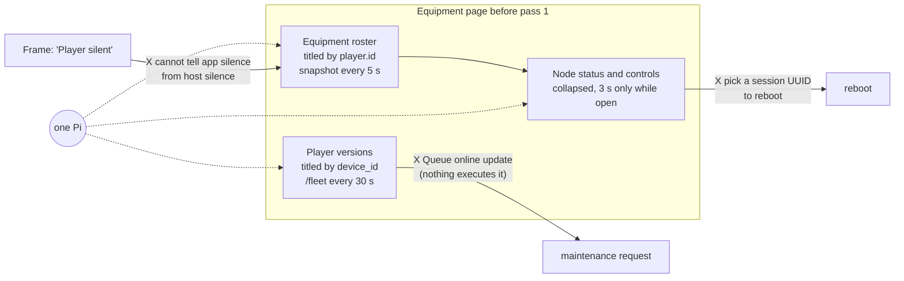
```mermaid
flowchart LR
  subgraph EQ["Equipment page before pass 1"]
    PV["Player versions<br/>titled by device_id<br/>/fleet every 30 s"]
    ER["Equipment roster<br/>titled by player.id<br/>snapshot every 5 s"]
    ND["Node status and controls<br/>collapsed, 3 s only while open"]
    ER --> ND
  end
  BOX(("one Pi")) -.-> PV
  BOX -.-> ER
  BOX -.-> ND
  PV -->|"X Queue online update<br/>(nothing executes it)"| DEAD["maintenance request"]
  ND -->|"X pick a session UUID<br/>to reboot"| RB["reboot"]
  WALL["Frame: 'Player silent'"] -->|"X cannot tell app silence<br/>from host silence"| ER
```

| Failure | Where it shows | Requirement it breaks |
|---|---|---|
| One box, three cards, no shared identity or read time | `wallRoutes.jsx` renders `PlayerVersions`, `EquipmentRoster` and `NodeDevicePanel` | One Player is one replaceable appliance ([installation model](requirements.md#installation-model)) |
| A silent Player app with a live host reads the same as a dead node | `health.js` classifier; host samples only inside the collapsed panel | U4, U6 ([failure visibility](requirements.md#failure-visibility-and-recovery)) |
| Two meanings of "desired app". The only update button creates a request nothing will ever execute | `PlayerVersions.jsx` "Queue online update"; `NodeDevicePanel.jsx` "latest stage is the desired app" | Declarative desired state; no command without an executor |
| Reboot asks for a session UUID and a typed audit token, three disclosures deep | `NodeDevicePanel.jsx` | Reboot targets the current HostCore session ([domain model](player-node-domain-model.md#host-report-and-reboot)) |
| The reboot audit links a later boot to a command by timestamp | `NodeDevicePanel.jsx` "Subsequent boot claims observed" | Never infer causation from proximity in time ([domain model](player-node-domain-model.md#commands-responses-events-and-current-state)) |
| Central intent is worded as device truth: "Shows frame X" for a Binding; "Edit N presented on the display" for a compositor receipt | `health.js` `outputStates`; `LiveCalibrationTrial.jsx` | AGENTS.md "distinguish … commitment and observed output"; U9 |

## 2. Requirements (binding; not design choices)

| # | Rule | Source |
|---|---|---|
| R1 | Frames are persistent locations. Players and Panels are replaceable equipment. | AGENTS.md; [installation model](requirements.md#installation-model) |
| R2 | Never present Central intent as device truth. Keep acquired files, readiness, capacity, commitment and observed output distinct. | AGENTS.md non-negotiables; programme brief |
| R3 | Player app liveness is `player_feedback.received_at` for the current `authority_epoch`. `players.last_seen` changes only at enrollment. | Owner; `central/coordination.py` |
| R4 | Central distinguishes a silent Player app from an unobserved Host Management agent, bound or not. It shows a named cause with its source and last evidence time, and never infers a cause. When Central cannot say when it last heard from a layer, it says so. | U4, U6 |
| R5 | A command, its response and its events are distinct facts. Receipt is not effect. Causation is never inferred from timing. A lost response stays unknown, with no blind new command. | [Domain model](player-node-domain-model.md#commands-responses-events-and-current-state) |
| R6 | An operator reboot is dispatched immediately, even during a Run. Only that Player's Outputs are interrupted. The Run continues, and no other Frame or Actuator gets a new or implied command. | [Domain model](player-node-domain-model.md#promise-failure-envelope-and-selected-choices); [operations](requirements.md#operations-and-scope) |
| R7 | Calibration Save needs Display Host's `presented_to_compositor` acknowledgment. The console never calls that visible pixels. | U9 |
| R8 | Declarative desired and observed state, not commands with deadlines. | Owner |
| R9 | Align the UI only. A backend change is allowed only when a domain concept cannot otherwise be shown honestly, and then only as an owner gate. | Programme brief |
| R10 | Never compare clocks across systems. Ages are Central's read time minus Central's receipt time. | Owner |
| R11 | Qualification scenarios are CI tests. The fleet/node UI needs a CI-gated browser suite. | Owner |
| R12 | Serial and boot are LAN claims (`lan_serial`), never verified physical identity. | [Domain model](player-node-domain-model.md#host-report-and-reboot) |

## 3. Glossary (the console's words)

| Console word | Domain meaning | Not to be confused with |
|---|---|---|
| **Player** | One replaceable box. The console keys it by its fleet **device** identity (`device-` + sha256 of `pi:<normalized serial>`, `contracts/equipment.py`) because a box exists from its first netboot. Its Registry enrollment (`player_id`, `authority_epoch`) is a fact on the Player, not its name. | The Player app process (one enrollment epoch) |
| **Player app** | Player Runtime (L2): enrolls per process start; reports readiness. | The box |
| **Host Management** | HostCore (L0): host samples and the reboot path. | Player app liveness |
| **App Manager / App Effect Broker** | App Lifecycle (L1): prepares and switches app environments. | Maintenance requests (a V1-lane record nothing executes; not shown, §31) |
| **Display Host** | L1.5: owns final scanout. Reports `presented_to_compositor`, `withdrawn` or `invalidated` per Output. | Panel pixels, which no layer observes |
| **Output** | A connector on a Player (HDMI). | Panel |
| **Panel** | The display hardware at a Frame. Requirements say Panel; the console stops saying "Display" for it. | Display Host |
| **Binding** | The Output-to-Frame assignment Central has set. The Frame is its root: every bind carries the Frame's generation. Worded "Bound to Frame X", never "shows". | Presentation |
| **Standing** | Not enrolled, Unbound, Bound or Retired (replaces "Pending", "New" and "In service"). | Liveness |
| **Boot path** | One supported path: the **node offer** (`/v2/node/boot-offers`), taken when the Pi's kernel command line carries `photowall.node=v2`. Each Pi's command line decides at every boot; it is not stored per Player. A box whose newest boot record on Central is a deprecated boot offer or a base image served without an offer is **misconfigured**, shown as one line on its Player page (§25, G5), never as a mode. | A Player attribute: there is none |
| **Boot selection** | The fleet-wide boot policy: the one deployment Central offers every node-path boot from now on, with its revision (§25). | A per-Player choice: there is none (R17) |
| **Update the wall** | The guided journey (§25a): Publish, optionally try on one Frame, then Keep (Select and reboot Players one at a time) or Back out. It adds no Central state or verb. | A stored rollout or canary: Central records neither |
| **Source** | The requirements' **AssetSource** (`requirements.md:131`): a saved query against the operator's photo library that selects media, never a copy of it. The requirements keep their name; the console says Source. | A Scene (which uses Sources); a library connection (where a Source's query runs) |
| **Boot preparation** | The base's own start-up on each boot, in order: handoff, storage, prepare (`contracts/node_host_facts.py` `BOOT_STAGES`). Host Management reports where it stopped and why, with the needed and room numbers for a refusal (§62). | App Manager's preparation of a release (the Storage item's "refused a preparation"); Stage app |
| **Last reported** | The latest receipt time of a layer that reports periodically (heartbeat). | **First received**: when Central first received one particular fact, which says nothing about the layer since |

## 4. The proposed shape

Each navigation group is one bounded context. Each aggregate gets one home page. Every other mention of it is a link to that home.


```mermaid
flowchart TB
  subgraph SHOW["Show (Showrunner + Media)"]
    NOW["Now: Runs, Activations"]
    SC["Scenes"]
    PR["Schedule: Programs"]
    SRC["Photo sources"]
  end
  subgraph INST["Wall (Registry)"]
    WALL["Wall: Surfaces, Frames<br/>facets: Calibration, Binding, Now-showing"]
  end
  subgraph FLEET["Fleet (Node lifecycle)  [pass 1]"]
    PL["Players: one row per box"]
    PP["Player page: identity, standing, Outputs,<br/>layers L0-L2, boot, reboot, app operations"]
  end
  ATT["Attention (cross-cutting)"]
  PL --> PP
  WALL -->|"link: bound Player"| PP
  PP -->|"link: bound Frame"| WALL
  NOW -->|"link: Frame"| WALL
  ATT --> WALL
  ATT --> PP
```

**Design-it-twice.**

| | **A. One home per box (recommended)** | **B. One section per bounded context** |
|---|---|---|
| How | Fleet › Players is keyed by device. The Player page combines the Registry Player and the fleet Device, grouped by node layer, and shows each section's own read time. Writes stay with their aggregate: Retire goes to Registry, Reboot goes to Fleet, Bind goes to the Frame. | Wall › Equipment keeps the Registry view (Players, Outputs, Bindings). A new Fleet › Nodes page holds the Devices (boots, layers, reboot, app operations). The two pages cross-link by device id. |
| Gives | One place answers "what is this box doing, layer by layer". A box that netboots but never enrolls is visible (U4). | Each page has one read source and one cadence. It mirrors the code's contexts exactly. About 40 % less change. |
| Costs | The Player page carries up to four reads with four labelled read times. Node reads happen only on an open Player page, so the list cannot show node state. | Today's split becomes official: the same box appears in two lists. "Why is Frame X dark?" takes two pages. A never-enrolled box appears only under Nodes. |
| Both | Two of five layers (App Effect Broker, Display Host) show "last reported: unknown" in pass 1. Display Host gets a read in pass 2 (Q3, §16); the App Effect Broker has no heartbeat, so no read can give it one. Neither shape can fix that from the UI. | |

> **Q1 (shape).** Recommended: **A**. Alternative: **B**, at the costs above.

## 5. Design rules (design choices, not requirements)

| Rule | What it makes impossible | Guarantee |
|---|---|---|
| **1. One home per aggregate.** The home is the only page that shows an aggregate's full state. Elsewhere it appears as a link (chip), never as a summary card. A **relationship** between two aggregates may be started from either side, but both sides call the one write its root owns. Binding is the one such relationship in pass 1: the Frame home and the Player page's Outputs both call `bind` (`equipmentApi.js:93`, Frame generation as the fence), as `BindingFacet.jsx` and `PlayerPage.jsx` do (the retired `EquipmentRoster.jsx` did the same). | Two cards for one box with disagreeing read times; two bind writes with different fences | One write function per relationship (construction); route review; the R4 import-graph test covers fleet routes |
| **2. Every fact carries its truth kind.** Fleet views render facts only through one `fact()` value. A fact that lacks its label (source and receipt for `reported`, a source for `claimed`, a basis for `derived`) **becomes** `unknown`, naming what is missing. A `claimed` fact carries its receipt only when Central serves one, and then says which receipt it is, as `reported` does. It never renders unlabelled and never throws. | Unlabelled device truth; ages taken from node clocks; a payload change blanking the console | Construction-time (the value cannot be built unlabelled), in pure model functions under Node tests; each Player page section sits behind its own error boundary |
| **3. Commands are domain verbs on the aggregate's home.** The console binds Central's fences (session, generation, gate generation, command id) from the read it shows, freezes the whole request when the dialog opens, and asks only when a choice really exists. Outcomes use the existing equipment vocabulary: done, already, changed, refused, unknown. | Operators choosing transport plumbing; a retry that changes the request; a new outcome dialect per module | Construction (one request builder per verb, body frozen at open); browser tests |

**Truth kinds** (rule 2), each with its one wording pattern:

| Kind | Meaning | Wording pattern | Example |
|---|---|---|---|
| `set` | Central record written by an operator or policy | "Set …" or a plain noun | "Bound to Frame lobby-left" |
| `reported`, latest | A node layer reports periodically; this is its latest receipt | "<Layer> last reported <age> ago" | "Host Management last reported 4 s ago" |
| `reported`, first | One fact a layer sent once, on change | "<Layer> reported <fact> · first received <age> ago" | "App Effect Broker reported the app running · first received 3 d ago" |
| `claimed` | A LAN claim Central accepted but cannot verify | "… (claimed at boot by <source>, unverified)", then, when Central serves a receipt, " · first received <age> ago" (a claim sent once) or " · last claimed <age> ago" (a claim repeated on every check-in) | "Serial 10000000a1b2c3 (claimed at boot by the box, unverified)" |
| `derived` | Central's own conclusion from named records | "<Conclusion> (Central's inference: <basis>)" | "Interrupted (Central's inference: a later boot was admitted)" |
| `unknown` | Not observable, not served, or not read | "Unknown: <why>" | "Panel pixels: Unknown: no layer observes them" |

A `reported` fact must say which receipt it carries; without that, it becomes `unknown`. A `set` fact may carry the time Central recorded it (" · recorded <age> ago"). A sixth kind, `planned` (Central's Runtime projection of which Run is on top on a Frame, made before media is checked), is designed in §35 with pass 4, its first user.

## 6. Domain-to-console map (every aggregate, one home)

| Aggregate (context) | Console home | Noun on screen | Truth kind and label | Pass |
|---|---|---|---|---|
| Device + Registry Player (Fleet + Registry) | `#/players/<device>` | Player | identity `claimed`; standing `set`; Player app `reported`, latest | 1 |
| BootOffer (Fleet, node) | Player › Boot | Node boot offer; and, when Central's newest boot record for the box is not a node boot, the deprecated-path line (G5) | `set` ("not proof the Player booted") | 1; deprecated-path line E (§25) |
| BootAdmission / current session (Fleet) | Player › Boot | Current node session's boot | `claimed`; "No current node session" when none is current | 1 |
| NodeSession / Producer (Fleet) | Player › Layers (session detail under "Identifiers") | Host Management, App Manager, App Effect Broker, Display Host | session state is a detail | 1 |
| HostObservation (Fleet) | Player › Layers › Host Management | Host samples | `reported`, latest | 1 |
| ManagerPreparation (Fleet) | Player › Layers › App Manager | Preparation | `reported`, latest; "preparation is not activation" | 1 |
| NodeEvidence: AppProcessFact (Fleet) | Player › Layers › App Effect Broker | App process | `reported`, first; layer's last report `unknown` (not served) | 1 |
| NodeEvidence: SurfaceFact (Fleet) | Player › Layers › Display Host | Output presentation | pass 1 `unknown` (the evidence projection holds the first reported state, §13). Pass 2 reads Display Host's newest **display exchange** per Output for the current boot instead, which that defect does not touch: `reported`, latest (§15, display read) | 1 unknown; 2 (Q3) |
| RebootCommand (Fleet) | Player › Reboot | Reboot request + history | request `set`; responses and initiation `reported`; outcome `unknown` until reported; completion `unknown` | 1 |
| AppOperation (Fleet) | Player › App | App operation | request `set`; response and effects `reported`; interrupted `derived` | 1 read; Stage app E (§25) |
| NodeRelease / Deployment / BootPolicy (Fleet) | Fleet › Releases (`#/releases`); the Update the wall journey (`#/releases/update/…`) is a client of it | Release; Deployment; Boot selection | release `reported` (GitHub releases, via the media worker); deployment `set`; selection `set` with its revision | E (§25, §25a) |
| Qualification / EnvironmentAcceptance (Fleet) | Player › App › Qualified fallback | Qualification; Qualified fallback | Central's sample answers `derived`; stored acceptances `set`; linked app `reported`, first | E (§25, §27) |
| EffectGate (Fleet) | Fleet › Releases › Effect gate (state and reason); cited beside a disabled Reboot or Stage, with a link | Effect gate: open / closed, Central's reason | `set` | 1; home E (§25) |
| AppLink (Fleet) | Player › Identifiers | Linked app process | `reported`, first | 1 |
| OutputLoss (Runtime) | Frame health (so plan tile, Run card chips, Attention) and Player › Outputs | Output interrupted | `derived` (Central's record from a linked Output-loss fact); only losses fencing the current Binding are served (§16) | 2 (§15, Q3) |
| Output (Registry) | Player › Outputs | Output | Panel facts at last app start `reported`, first (labelled stale) | 1 |
| Frame + Binding + Calibration (Registry) | `#/wall/frames/<id>/<facet>`: Calibration (with the Frame profile), Binding, Now-showing | Frame; Binding; Calibration; Frame profile | `set` | 3 (§19) |
| CalibrationTrial and legacy preview (Registry + Display Host) | Frame › Calibration | Live calibration (one noun for both paths) | candidate `set`; Display Host acknowledgment `reported`; the legacy path has no acknowledgment, says so, and its commit is "Save without acknowledgment" | 1 wording; 3 (§20) |
| Scene, Program, Activation, Run (Runtime) | `#/scenes`, `#/schedule`, `#/now` (nav "Now"); the top Run on the Wall tile and the Frame's **Status** facet (Part G; Part F first called it Planned) | Scene, Program, Show now, Run | Run and Program records `set`; which Run is on top on a Frame `planned` (§35) | 4 (§34–§36) |
| Coordination: readiness, secured assignment (Runtime) | Frame health on the tile and the Inspector header; Attention | Readiness report | `reported` (unchanged by pass 4) | 4 |
| Source (Media; the requirements' AssetSource) | `#/sources` (nav "Sources"); the Scene's "Which Source?" step links to it | Source | spec `set`; what it selects, tag list and refresh `reported` (your photo library, via the media worker) | 5 (§37–§40) |
| Surface, Installation, Actuator, Sensor, Target group, Panel entity | none: no stored entity exists | — | — | not planned (§13) |

## 7. Gaps, ranked

| # | Gap | Severity | Pass |
|---|---|---|---|
| 1 | One box drawn three times with three identities and cadences | high | 1 |
| 2 | Host Management silence and Player app silence not told apart (U4/U6) | high | 1 for Host Management, App Manager and Player app (labelled last-reported ages); Display Host last-heard comes from its display exchanges in pass 2 (Q3); the App Effect Broker sends only on change and has no heartbeat, so it stays Unknown with that reason (§16); a host-silence alarm needs a served threshold (feature proposal) |
| 3 | Dead "Queue online update"; two meanings of "desired app" | high | 1 |
| 4 | Output interruption inside a continuing Run cannot be shown (no read route) | high, owner gate | 2 |
| 5 | Reboot presented as session plumbing | medium | 1 |
| 6 | Reboot audit correlates a boot to a command by timestamp | medium | 1 |
| 7 | Reboot and app-operation lifecycles flattened to raw strings; the app operation's broker response not shown | medium | 1 |
| 8 | Display Host per-Output presentation: the served `projection` keeps the **first** reported state, not the current one (§13) | medium | 1 shows Unknown; 2 reads Display Host's display exchanges instead (Q3); the evidence defect stays with its owner |
| 9 | "Edit N presented on the display" for a compositor receipt | medium-high | 1 |
| 10 | "Shows frame X" for a Binding | medium | 1 |
| 11 | V1 loader-session rows (T1/T2) unlabelled next to V2 `lan_serial` sessions | medium | 1 (labelled); E removes every V1 record from the console (§24) |
| 12 | Standing words "Pending", "New", "In service" are not domain terms | low-medium | 1 |
| 13 | V2 releases, deployments, boot policy and qualification have no UI | medium | E (§24–§32), built in batch 3 |
| 14 | "Commissioning" mixes Calibration and Binding state; legacy preview and live Trial use different nouns, and the legacy commit is not worded as unacknowledged | medium | 3 |
| 15 | Display, Panel and Output drift (remaining strings) | medium | 1 (fleet strings), 3 (rest) |
| 16 | Startup display observation raises an alarm worded as if current | medium | 3 (wording; it stays an alarm) |
| 17 | "Unbind all" is a non-atomic sequence | low-medium | 3 (wording only) |
| 18 | Identify only on unbound Players; T1/T2 capability tiers in copy | low | 3 (any unbound Output of any active Player; bound Outputs are a feature proposal) |
| 19 | "Recovered" banner inferred in the browser from epoch diffs | low | 3 (the enrolled fact on the Player page) |
| 20 | "Unplaced" is a UI state encoded as position (0,0) | low-medium | feature proposal (Registry nullable placement) |
| 21 | Plan chip says "Scheduled:" for any Run intent; "Now showing" names a plan | medium | 4 |
| 22 | Program times in the browser's zone with no stated zone | medium | 4 (label the zone); an Installation timezone is a feature proposal |
| 23 | Source named four ways | low | 5 |
| 24 | "All N frames heard from" reads as whole-node health | low | 1; R0 (the all-clear still counts Frames with no report yet) |
| 25 | An open reboot dialog can send a new command id while a different request is Requested; two pages whose reads predate each other's send can each send one | high | R0 (the console's own class: one send rule evaluated inside the send); Q4 (the cross-page race needs a backend fence) |

## 8. Roadmap of passes

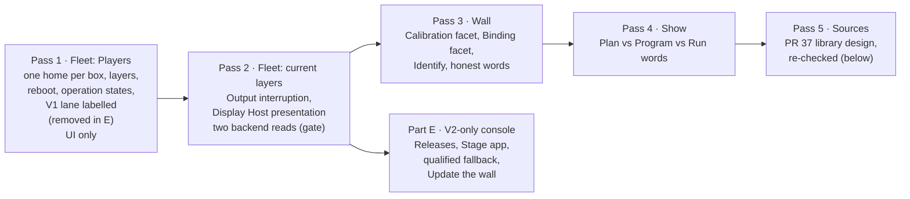
```mermaid
flowchart LR
  P1["Pass 1 · Fleet: Players<br/>one home per box, layers,<br/>reboot, operation states,<br/>V1 lane labelled<br/>(removed in E)<br/>UI only"] --> P2["Pass 2 · Fleet: current layers<br/>Output interruption,<br/>Display Host presentation<br/>two backend reads (gate)"]
  P2 --> P3["Pass 3 · Wall<br/>Calibration facet, Binding facet,<br/>Identify, honest words"]
  P2 --> NR["Part E · V2-only console<br/>Releases, Stage app,<br/>qualified fallback,<br/>Update the wall"]
  P3 --> P4["Pass 4 · Show<br/>Plan vs Program vs Run words"]
  P4 --> P5["Pass 5 · Sources<br/>PR 37 library design,<br/>re-checked (below)"]
```

| Pass | Scope | Backend | Size | Status |
|---|---|---|---|---|
| 1 | §9–§12 | none | 4 beads, about +2,200 / −1,250 lines | Built and reviewed 2026-10-02; residual findings are bead R0 |
| 2 | Part C (§14–§18): Output interruption on Frame health and Player › Outputs; Display Host's current presentation and last report; the broker's true reason; `ManagementFacts` through `fact()` (deleted by E's NV1) | Two read-only additions to existing admin reads (Q3), and optionally one reboot fence (Q4, in R0). Built to the answers | Batch 2 (§23) | Designed (feature layer), revised after review; awaiting the pass-2/3 gate |
| 3 | Part D (§19–§22): Commissioning renamed Calibration, its equipment block moved to Binding; one live-calibration noun with two honest verbs; Identify on any unbound Output; no tier language; the enrolled fact on the Player page; the startup Panel alarm worded as possibly stale | none | Batch 2 (§23) | Designed (feature layer), revised after review; awaiting the pass-2/3 gate |
| E | Part E (§24–§32): V2-only console (one banner when node control is off, the deprecated-path line, no V1 surface); Fleet › Releases with Publish, boot selection and the effect gate; Stage app (bound or unbound, D16 = yes); qualification sampled by the page; the Update the wall journey | G1, G2, G4, G5 read additions and G6 (one refusal removed); G7 open | Batch 3 (§32), about +6,650 added at pass 1's overrun | Built 2026-10-02; awaiting its verify and review |
| 4 | Part F §34–§36: `planned` truth kind for which Run is on top on a Frame (media not checked); the chip names its Run's origin; every clock time states its zone; the Repeat helper worded as N separate Programs (recurrence stays an open gap, Q8) | none | Batch 5 bead S1 (§45) | Built 2026-10-02 (batch 5, with C5: the Intended? step speaks through the `planned` fact); awaiting the batch's verify and review |
| 5 | Part F §37–§40: PR 37's library design re-based on current code (§38, Q9 = A): one Source noun, a progressive Source flow, a tag picker, previews as `reported` facts, no Library section | G9, G10 (PR 37's backend, re-based) and G11 (media times on the database's clock, Q10 = yes) | Batch 5 beads L1, M1, L2, L3 (§45) | Built 2026-10-02 (batch 5, with C5: one home for a Source's selection words, tag lookup by id, the pre-report sentence); awaiting the batch's verify and review |
| R1 | Batch 3's residuals (§45) | none (G8 withdrawn in review, §42) | Batch 4 bead R1 (§68) | Built in batch 4 |
| G | Part G (§46–§59): information architecture by domain and lifecycle: each home's unfinished items, read-only daily faces, host health (batch A) on Fleet, node metrics (batch B), the debug overlay's reserved home | G12 (fleet host summary) and G13 (host facts record) | Batch 4 (Part H) | Approved 2026-10-02 (Q12, Q13) |
| H | Part H (§60–§69): batch 4 at the feature layer: R1, the host-health tracer, node numbers, host facts, the Wall's daily face, the Fleet host UI, host incidents, docs | G12, G13, Central-side coalescing of host observations, and App Manager's storage-room sample | Batch 4, eight beads (§68), about +7,790 added at the overrun rate | Designed (feature layer), revised after review; awaiting the batch-4 gate |

**The pass-2 backend reads** are designed in §16 and asked as Q3: what each adds, its smallest read-only shape on an existing admin read, and what the console shows without it.

**Feature proposals, outside this programme** (they add workflows or records, not alignment): Replace equipment as one Frame-side flow; an Installation timezone record; a Central health page; Identify on bound Outputs (it overlays a showing Frame); a Registry nullable placement (gap 20); Display Host's current connector state in Frame health; a broker heartbeat.

**PR 37 folded in** (pass 5). Part F §38 re-checks PR 37 against the domain model and against current code, which gained a count-only Source preview, a shared `SourceQuery` base and a worker-reported connection list after PR 37 was written, and states every change made when folding it in.

# Part B: pass 1 (feature layer, for delivery)

## 9. Screens and read models

**Before → after (navigation).** Navigation groups are unlabelled lists in `Shell.jsx`; pass 1 adds no group headings and renames nothing outside the fleet.

| Before | After pass 1 |
|---|---|
| Now, Scenes, Schedule, Photo sources | unchanged |
| Wall, **Equipment** | Wall |
| — | **Players** (new fleet route table, mounted only while current, like Wall) |
| Attention | Attention |

**Routes.** The new routes are `#/players` and `#/players/<device-id>`. `#/equipment` parses to `#/players`, so old bookmarks keep working; `formatRoute` never emits it. `routeSamples.json` gains these routes, and the R4 import-graph test covers the fleet table. The Wall links to the Player page through `players.js` `playerPageHref`, so `players.js` is declared a module shared with Show in that test; it builds addresses and holds no controls.

**Players list.** Built from the snapshot and the shell's existing `/netboot` read only (`playersByDevice`, keyed by `device_id`). It shows name, standing and bound Frames, including a "Not enrolled" box seen only at boot. It does **no** node reads. Pass 1 put the V1 fleet policy block (V1 app target, V1 boot baseline) at the top; Part E deletes it (§25), so the list has no fleet policy block. The boot selection's home is Fleet › Releases.

**Player page composition (where each section's data comes from).**

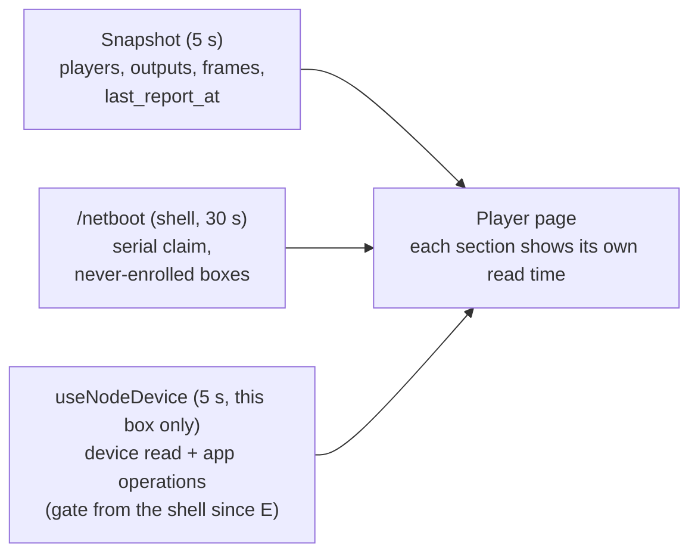
```mermaid
flowchart LR
  SNAP["Snapshot (5 s)<br/>players, outputs, frames,<br/>last_report_at"] --> PAGE
  BOOT["/netboot (shell, 30 s)<br/>serial claim,<br/>never-enrolled boxes"] --> PAGE
  NODE["useNodeDevice (5 s, this box only)<br/>device read + app operations<br/>(gate from the shell since E)"] --> PAGE
  PAGE["Player page<br/>each section shows its own read time"]
```

| Section | Shows | Truth kind |
|---|---|---|
| Header | Name "Player …a1b2c3" (serial handle; device id when there is no serial), standing, the Frames its Outputs are bound to (links) | standing `set`; serial `claimed` |
| Layers | Host Management (L0): last reported, from `host_observation.received_at`. App Manager (L1): last reported, from `manager_preparation.received_at`. App Effect Broker (L1): the app-process fact, first received; last reported "Unknown: Central does not serve when this layer last reported". Display Host (L1.5): "Unknown: Central does not hold Display Host's current presentation". Player app (L2): last reported readiness on the current epoch. "Panel pixels: unknown" closes the list. Each row names its source and has an expandable detail. | `reported` latest / first; `unknown` |
| Outputs | Each Output: Binding (link to the Frame), "Bind to a frame…" when unbound (the shared `bind` write, rule 1), Identify, Panel facts at the last app start (labelled stale) | `set`, `reported` |
| Boot | Current node session's boot (claimed), or "No current node session". Then the latest node boot offer (issued or refused, with reason). Since Part E there is no V1 or netboot-base record; a deprecated-path boot is one warning line (§25). | `claimed`, `set` |
| Reboot | "Reboot Player", with its reason when disabled; reboot history with one named state per request (§10) | §10 |
| App | Node app operations with named states (read-only until pass 2) | §10 |
| Danger zone | Retire (Unbound only), Unbind all (Bound only); existing dialogs | `set` |

**Failure modes (pass 1).**

| What breaks | What the operator sees | Guarantee |
|---|---|---|
| A served field is null or missing (e.g. `host_observation` absent) | That fact reads "Unknown: <field> not served" | Construction-time in `fact()`; Node tests |
| A section's render throws (payload drift) | "This section could not be shown" in that section; the rest of the page and the console stay up | Per-section error boundary; browser test with a malformed read |
| Central runs without node control | Since Part E: one shell banner, and in place of the node sections one line, "Node records are not shown: node management is off (see the banner)." The Registry header, Outputs, Bind, Identify, Retire and Unbind still work (§25). Pass 1's per-row Unknowns are deleted | Browser test (zero node reads) |
| A device read fails | Its rows keep their last values, marked "as of <read time>, refresh failed" | Browser test |
| Player Retired | Node rows are not read. A plain statement, "Not read: Player retired", stands in their place; it is not a `fact()` (the `unknown` pattern would read "Unknown: …"). Checked from snapshot standing first, because a retired box and a box with no node record both return 403 `node_device_unavailable`. | Model test |
| No node record (403 on a non-retired box) | "Unknown: no current node record for this box" | Model test |
| A layer has no current session (a dead host: its session lapsed and was not renewed) | The layer's newest earlier session that holds its evidence still speaks ("Host Management last reported 2 h ago"), with "Session: No current Host Management session; the evidence above is from its last session". Unknown only when no session of that layer has a sample. | Model test |
| Player app row of a retired Player | "Unknown: Central does not read reports from a retired Player" (Central's read excludes retired Players, so a missing report time says nothing about the box) | Model test |

## 10. Lifecycles shown

**Reboot request.** Each state is computed only from Central's records and Central's read time. No state is terminal while a later response or initiation event can still arrive (responses are stored without an expiry check, `node_ingest.py:106-135`).

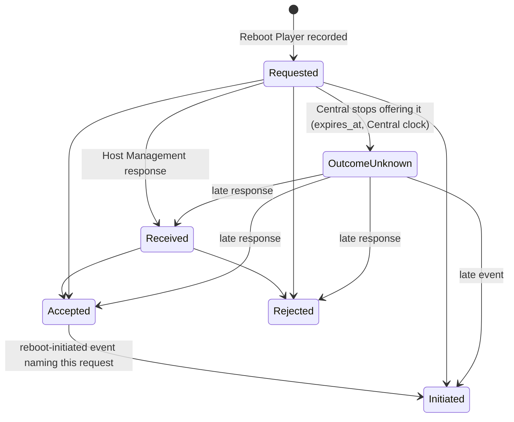
```mermaid
stateDiagram-v2
  [*] --> Requested: Reboot Player recorded
  Requested --> OutcomeUnknown: Central stops offering it (expires_at, Central clock)
  Requested --> Received: Host Management response
  OutcomeUnknown --> Received: late response
  Received --> Accepted
  Received --> Rejected
  Requested --> Accepted
  Requested --> Rejected
  OutcomeUnknown --> Accepted: late response
  OutcomeUnknown --> Rejected: late response
  Accepted --> Initiated: reboot-initiated event naming this request
  Requested --> Initiated
  OutcomeUnknown --> Initiated: late event
```

Each §10 wording below is the request's or operation's **state label**, shown verbatim. Beside it, an "Evidence:" line is a rule-2 `fact()` carrying the receipt, for example 'Host Management reported a "rejected" response · first received 2 s ago'. The labels do not themselves follow rule 2's `reported` pattern.

| State | Wording |
|---|---|
| Requested | "Requested · delivery unknown · Central offers it to Host Management until <time>"; while the read shows the effect gate closed or the targeted session no longer current, "Requested · Central is not offering it now (effect gate closed \| session no longer current)", still not terminal. The request's own gate generation is not served, so a gate that closed and reopened is not detected. |
| Outcome unknown | "Outcome unknown: no response from Host Management; Central stopped offering it at <time>" |
| Received / Accepted / Rejected | "Received by Host Management" / "Accepted by Host Management, not yet started" / "Rejected by Host Management". A reboot response carries a served `reason` token (`contracts/node_protocol.py:218,226`; HostCore fills `command_identity_conflict` or `reboot_scope_or_expiry`), so the Evidence fact names it: 'Host Management reported a "rejected" response (reboot scope or expiry) · first received 2 s ago' (R0). |
| Initiated | "Host Management reported the reboot started · completion unknown" |
| (separately) Current boot | Shown in Boot. It is never linked to a request: "A later boot does not show what caused it." |

**Retry and new requests.** The dialog freezes the whole request body when it opens: session, device and rollout generations, audit reference, reason, window and command id. So a 409 `node_reboot_identity_conflict` cannot arise from the console. Inside the window, a retry of the same body lands "Already recorded". After the window, the same retry gets 410 `node_reboot_expired`, which the console shows as **Outcome unknown**, never as "refused". A retry is offered only on the page that sent the request: the device read does not serve the request's device and rollout generations or its window, all of which are in Central's request hash (`node_commands.py:59-64`), so the retry re-sends the frozen body that page holds. Any other page (another tab, a reload) disables Reboot with the outstanding reason (below) until the window ends. After its window, a **new** request is allowed, and its dialog states the previous request's outcome is unknown and whether Host Management's current session is the **same boot** that request targeted or a later one (an identity comparison of kernel boot ids, not a clock comparison). That makes the second request a deliberate operator decision, not a blind resend.

**One send rule, evaluated inside the send (R0).** A reboot command is **outstanding** while it is unexpired on Central's clock and has no `rejected` response, on the session it targets. §16 defines this once, and Central serves it per command (Q4 = yes); the console never re-derives it. Outstanding is the send predicate, not a state label. Requested, Accepted and Initiated requests are all outstanding until they expire.

A new command id may be sent only when no command on the target Host Management session is outstanding. A request this page holds counts as outstanding until a read lists it (then Central's served `outstanding` decides), or until Central's read time passes its frozen `retryUntil`. A command to an earlier session never blocks.

One function, `sendReboot(deviceId, request, node)`, evaluates `rebootOffer` on `node.latest()`, the hook's newest read **at the moment of sending**. If the rule refuses, it returns that reason without a POST. The caller does not choose which read counts as newest. That choice is where the pass-1 defect lived: the dialog judged its frozen request with the read it was handed (`PlayerCommands.jsx:248`). The Send button's disabled state uses the same rule, through one exported `rebootRefusal(request, nodeDevice)` (`rebootOffer` with the request as `held`), on the read on screen.

| Dialog (derived, not passed in) | `sendReboot` posts when the newest read shows | Otherwise the dialog says |
|---|---|---|
| **New request**: this page does not hold its command id | no command on the target session outstanding (counting the held one), and Central's read time before this request's frozen `retryUntil` | "Another reboot request for this Player is outstanding; close this dialog and review it" (§16's one wording, `REBOOT_OUTSTANDING`) or "This request is out of date; close and reopen" |
| **Retry**: this page holds its command id (`heldReboot`) | no **other** command on the session outstanding, and this request still counts as outstanding: once a read lists it, by Central's served `outstanding`; unlisted, while Central's read time is before its `retryUntil` | the same two reasons |

A first send that ends unknown turns the same dialog into a retry, because "retry" is derived from the held request; there is no second code path. Consequence of judging a listed request by Central: a retry after the window is refused in the console once a read past the window has arrived, so the 410 "Outcome unknown" answer is reached only when the retry is sent before that read.

**Guarantee strength: test-level, not construction.** `sendReboot` is the only console function that POSTs to `/reboots`, and a source-scan test enforces that. A browser test counts zero POSTs when a later read lists another outstanding request, and a mutation probe that removes the call-time check fails it. Because a click on a disabled button runs nothing, that test calls the dialog's React `onClick` through the button's `__reactProps$` key (React 18 internals). A future module could still POST directly; the scan is what catches it.

**What the console could not close, now closed at Central (Q4 = yes).** Without a fence, two cases stayed open:

- Two pages whose newest reads both predate the other's POST commit can each send a new command id, within one read interval (5 s) plus request time.
- A POST whose commit lands after a read, and whose answer is lost, is invisible to that read. Its held block ends at the frozen `retryUntil`, while Central's `expires_at` counts from the later commit (`node_commands.py:105`).

Before R0, Central recorded any new command id without checking for an outstanding one. R0's fence (§16) refuses a new command id with 409 `node_reboot_outstanding` while another command on the same session is outstanding, under the locks `request_reboot` already holds, so both cases are refused at the authority. The console reads that 409 as **changed**.

**App operation** (node projection; read-only in pass 1). `appOperationState` reads both `state` and `command_response`, because the backend keeps `state` at `staged` whatever the broker answered (`node_lifecycle.py:307-318`).

| Served state + response | Wording | Truth kind |
|---|---|---|
| staged, no response | "Staged; no response from App Effect Broker" | `set` |
| staged, received | "Received by App Effect Broker" | `reported` (response receipt) |
| staged, accepted | "Accepted by App Effect Broker; preparing" | `reported` (response receipt) |
| staged, rejected | "Rejected by App Effect Broker" (the reason is not served) | `reported` (response receipt) |
| switching | "App Effect Broker reported switching (<latest phase>)" | `reported` (`latest_effect.received_at`) |
| target_running | "App Effect Broker reported the staged app running" | `reported` |
| fallback_running | "App Effect Broker reported the fallback app running" | `reported` |
| effect_unknown | "App Effect Broker reported the outcome as unknown" | `reported` |
| superseded | "Replaced by a later stage" | `set`; plus a second Evidence fact for what the broker had reported before (served `command_response` or `latest_effect`), so a rejection is not hidden (R0) |
| interrupted_by_reboot | "Interrupted (Central's inference: a later boot of this Player was admitted)" | `derived`; plus the same second Evidence fact (R0) |

## 11. Interface sketch (new modules; signatures only)

```text
facts.js                                                               (B1)
  fact({kind, value, source?, receipt?: "latest"|"first", receivedAt?, readAt?, basis?, why?, field?}) -> Fact
                                       // field names the served field a missing receipt comes from
                                       // frozen; never throws: a missing label yields kind "unknown" naming it
  factText(fact) -> string             // the one wording per kind (§5)
FactLine.jsx       <FactLine label fact />          // the only renderer of facts in fleet views
SectionBoundary.jsx <SectionBoundary title> … </>   // per-section error boundary

players.js                                                             (B1)
  playersByDevice(snapshot, bootFacts) -> PlayerRow[]                  // union keyed by device_id
  PlayerRow = {deviceId, player|null, standing: "not-enrolled"|"unbound"|"bound"|"retired", name, frames}

nodeRead.js                                                            (B1; R0 adds latest)
  useNodeDevice(deviceId, {cadenceMs, skip}) -> {enabled: true|false|null, gate, read, operations, readAt, error, refresh, latest}
                                       // Part E (NV1): `enabled` and `gate` are removed; the shell's useNodeControl is the gate source
                                       // one box; Player page only; pauses in a hidden tab; skipped when retired
                                       // R0: latest() returns the newest read from a ref, at call time
  processFacts(session) -> AppProcessFact[]                            // decodes session.projection
  layerEvidence({nodeDevice, snapshot, playerId}) -> LayerRow[]        // five rows, each a Fact
  currentSessionBoot(nodeDevice) -> {kernelBootId, fact} | {none: fact}

fleetCommands.js                                                       (B2; R0 changes marked)
  rebootTarget(nodeDevice, gate) -> {available: true, sessionId, deviceGeneration, rolloutGeneration, kernelBootId}
                                  | {available: false, reason}         // binds the one current host_core session
  heldReboot(request, result) -> FrozenRebootRequest | null          // kept after done, already or a retryable unknown
  rebootOffer(target, commands, readAt, held) -> {offer: "new"} | {offer: "retry", reason} | {offer: "blocked", reason}
                                       // R0: every command on the target session, judged by outstanding (§10, §16);
                                       // served by Central (Q4 = yes); the held request counts until a read lists it
  rebootRequest(target, commands, snapshot, readAt, {playerId, commandId, reason, held}) -> FrozenRebootRequest | {refused}
                                       // whole body frozen at open; refuses when rebootOffer is not "new"
  sendReboot(deviceId, request, node) -> Promise<RebootResult>                                     (R0)
                                       // the ONE send path: evaluates rebootOffer on node.latest() inside the call,
                                       // refuses without a POST otherwise; only POSTer of /reboots (source-scan test)
                                       // R0 deletes rebootStale and rebootBlocked; a 409 node_reboot_outstanding reads changed
  rebootRefusal(request, nodeDevice) -> reason | null                                               (R0)
                                       // rebootOffer with the request as held; the dialog's disabled state and sendReboot
  rebootCommandState(command, readAt, {nodeDevice}) -> {state, fact}  // §10; Central clock only; R0: the fact names a served reason
  appOperationState(operation, readAt) -> {state, fact, prior: Fact|null}  // §10; R0: superseded/interrupted keep the broker's answer in prior
  rebootResult(result) -> outcome      // done | already | changed | refused | unknown (retry the same body);
                                       // R0: 409 node_reboot_outstanding -> changed
```

**Current choices** (revisable; this section is recommended as shown):

| Choice | Current | Alternative and its cost |
|---|---|---|
| Reboot fences | The console binds the one current `host_core` session. A unique index allows at most one unrevoked session per device, generation and owner (`053_node_control.sql:46`), so the console never asks the operator to choose. | Keep the picker: plumbing the operator cannot judge |
| Audit reference | Filled automatically as `console/<date>`, plus an optional "Reason" token, both frozen at open | Required typed field: friction with no extra trust, since the console has one shared operator account |
| Dispatch window | 30 s, shown in the dialog | Expose 1–60 s: one more number the operator cannot judge |
| Reboot dialog home | The fleet module owns the reboot dialog and re-submits the frozen body; the shared `ConfirmAction` module (used by Show) is not extended | Add `retry` to `ConfirmAction`: widens a module shared with Show for one user |
| Node reads | Only on an open Player page, every 5 s for that box, paused in a hidden tab. Each read cycle takes the global fleet advisory lock twice (§13). | List fan-out: node state on the list at a lock cost per box; no requirement asks for it |
| Host silence | Last-reported ages only. No "host silent" alarm, because no threshold is served. | Invent a client threshold: an unowned number (R9) |
| Player name | Serial handle; full device and Player ids under "Identifiers" | Device id as the heading: unreadable, and it is today's problem |
| Projection decoding | Only App Effect Broker process facts are decoded from `session.projection`, pinned by a checked-in fixture that one Python test asserts the contracts still encode identically. Surface facts are not shown as current (§13). | No decoding: the broker's process state stays hidden |

> **Q2 (V1 boot-offer controls).** The V1 controls (fleet V1 app target, per-Player V1 app target, V1 boot baseline) still change what future V1 boot offers carry. Recommended: **keep them, labelled "V1 boot offers"**. Alternative **(b): hide them now.** A Pi still booting through V1 offers loses its console controls. Either way, "Queue online update" is removed, because nothing executes maintenance requests (`MaintenanceRequestStore.dispatch_in` has no callers); existing queued requests stay visible with Cancel.
>
> **Answered 2026-10-01: keep, labelled. Superseded 2026-10-02** by the owner's V2-only steer: the console shows no V1 surface, and a Pi still booting by the deprecated path is shown as a misconfiguration (§24, R20). The V1 backend is inventoried for a follow-up (§31).

## 12. Beads (each lands green alone; built back to back, one verify and review per pass)

Delivery follows the owner's standing preference: the four beads are built back to back, each green on its own package tests so the batch can stop at any bead, then one full verify and one review pass over the whole of pass 1. **Status:** all four built and reviewed 2026-10-02. The review's residual findings (one major: an open reboot dialog could send a new command id while a different request was Requested) are fixed by bead R0, the first bead of batch 2 (§23). B3's V1 section and fleet policy block were later deleted by Part E's NV1 (§32).

| Bead | Contents | Acceptance (observable) | Lines |
|---|---|---|---|
| **B1 · Tracer, Players list and Player page** | Tracer first (below). `facts.js`, `FactLine.jsx`, `SectionBoundary.jsx`, `players.js`, `nodeRead.js`; standing words in `health.js`; fleet route table, `PlayersPage.jsx`, `PlayerPage.jsx` (header, layers, Outputs with Bind and Identify, boot, danger zone); delete `EquipmentRoster.jsx`; mount the existing `NodeDevicePanel` unchanged on the Player page and `PlayerVersions` unchanged on the list (it lists every device and carries the fleet V1 policy) until B2 and B3 replace them; Node-run model tests; CI-gated browser suite on `operator_harness` with node routes mounted; rewrite of the roster-based browser tests (`test_operator_binding_browser.py` about 21 `connect(…, "equipment")` sites and the "Equipment" region, `test_console_shell_review_browser.py` `#/equipment` hash, `test_console_routes_r4.py` section list) | `#/players` shows one row per box, including a "Not enrolled" box seen only at boot, with no node read. The Player page shows five layer rows: Host Management, App Manager and Player app with last-reported ages; App Effect Broker with its process fact first-received and last-reported Unknown; Display Host Unknown. A silent app with a reporting host shows both ages. A missing field renders Unknown naming it; a malformed read blanks one section only. Node management off: L0–L1.5 read Unknown and the page works. `#/equipment` lands on `#/players`. Bind (from the Output), Identify, Retire and Unbind all pass from the page. No console string says "Refresh Equipment" or names the Equipment page. | +1,450 / −700 |
| **B2 · Reboot and operation states** | `fleetCommands.js`; Reboot section and history; app-operation list; delete `NodeDevicePanel.jsx` and `nodeDevice.css` | The dialog names the Player's bound Frames and their live Runs and says: "The Run stays active. Central sends no command to other Frames or Actuators." A recorded reboot shows "Requested · delivery unknown". A retry inside the window sends the identical body and lands "Already recorded". A retry after the window (410) shows Outcome unknown. A late response after the window moves the state on. While a request is Requested, no new command id can be sent. A closed gate disables Reboot with its reason. Rejected shows its named state. A rejected app operation reads "Rejected by App Effect Broker", not "Staged". No "subsequent boot" line exists. | +400 / −170 |
| **B3 · V1 lane and honest Wall wording** | V1 fleet policy block on the Players list; per-Player V1 section reusing `ManagementFacts`; "Queue online update" removed; delete `PlayerVersions.jsx`. Wall: `outputStates` "Bound to Frame X"; the Binding facet's Player-silent line links to the Player page (no node read on the Wall); the Commissioning equipment block links to the Player and uses Output/Panel words; the Trial says "presented to the compositor by Display Host"; the attention all-clear reads "All N Frames' Player apps reporting" | No control creates a maintenance request. A queued request is shown and can be cancelled. V1 loader rows read "V1 record". Setting the V1 fleet target from the Players list works in a browser test. No console string says "Shows frame", "presented on the display" or "Display equipment". Existing Wall browser tests are updated to the new strings. | +250 / −380 |
| **B4 · Docs** | [Console UX design](operator-console-ux-design.md) glossary and §3 (Panel, standing, Players); this document's status; AGENTS.md code-map row for fleet routes | `check_docs.py` passes. No doc still names `#/equipment` as a page. | +100 |

**Tracer bullet** (the first commit of B1). `#/players/<device-id>` shows the Registry standing and Host Management's last-reported age for one box, reached from the `#/players` list. It proves the device-keyed join, `useNodeDevice`, the `fact()` labelling (including the missing-field path) and the new route table. **Non-goals:** reboot, app operations, V1 controls, Wall links.

## 13. Costs, deferrals and findings for other owners

**Costs.**
- About +2,200 / −1,250 lines, about 800 of them tests, including a rewrite of the roster-based browser tests. The new CI browser suite adds roughly a minute to the browser job.
- Every open Player page takes the global fleet advisory lock (`pg_advisory_xact_lock`, `locks.py:11-13`) plus device and lifecycle row locks twice per 5 s cycle (the device read and the app-operation read both call `lock_device_generation_in`, `node_sessions.py:92-97`). These serialize against netboot offers, enrollment and retire. Today's open node panel already does this every 3 s, so pass 1 lowers the rate, but two operators watching ten Player pages is twenty lock acquisitions per 5 s. A non-locking device read stays deferred; pass 2's display read adds one indexed query to this lock hold (§16).
- The list shows no node state. "Which Players have an unanswered reboot?" needs a page per Player until a summary read exists.
- App Effect Broker and Display Host show "last reported: unknown" in pass 1. That is honest, but it leaves U6 incomplete for two of five layers: pass 2 closes it for Display Host (Q3); the broker has no heartbeat (§16).
- The console decodes a node message encoding nested inside `projection` (broker facts only). A fixture pins it, but a wire change now also breaks the console.
- The Player page shows up to four read times. That is honest but denser than one.
- Rule 1 now has two entry points for Binding. One shared write keeps the fence identical, but the two bind UIs must keep the same "an attempt spends the choice" policy by review.
- Outcome dialects in other modules (fleet `writeMessage`, node "recorded/refused/unknown") converge only where pass 1 touches them.

**Deferred:** Output interruption and Display Host's current presentation (pass 2, Part C); the Calibration facet and Identify on any unbound Output (pass 3, Part D); the node release workflows: Releases home, V2 stage, boot selection and qualification (designed and built as Part E, §24–§32); `planned` and plan wording (pass 4); library (pass 5). The errata item that superseded and interrupted operations hide the broker's earlier answer is applied by R0 (§10).

**Not planned:** Surface, Installation, Actuator, Sensor, Target group and Panel as console entities. None is stored, and inventing them would be backend design.

**Findings for other owners** (not this programme's to fix):

| Finding | Owner document |
|---|---|
| Display Host posts every snapshot with `covered_through_sequence=0` (`appliance/display_host/service.py:264-270`). Central skips a fact whose sequence is not newer (`central/fleet/node_evidence.py:114`), and a surface's fact key excludes its state, so a later `withdrawn` or `invalidated` is dropped as historical. A probe showed `presented_to_compositor` surviving a withdrawal. The served projection therefore holds the first reported presentation, and Runtime reconciliation is blind to withdrawals. Display Host's per-Output **display exchanges** (`node_display_exchanges`, one per Output per sample) are a separate channel the defect does not touch; pass 2 reads presentation from them (§16), so the console no longer waits on this fix. | [Display host](display-host-backend.md); [implementation map](player-fleet-implementation-map.md) |
| The app operation's `state` stays `staged` after the broker rejects (`node_lifecycle.py:307-318`), and the online broker raises locally on a changed old process without responding (`appliance/node/online_broker.py:66-79`), so a refused stage can look like "no response". | [Implementation map](player-fleet-implementation-map.md) |
| Migrations 050–052 were deleted (commit 02ec7e5), against the forward-only rule. Docs still cite their behaviour. | AGENTS.md; [implementation map](player-fleet-implementation-map.md) |
| `node_lifecycle` still refuses on `active_equipment_drains`, which nothing writes (dead fence) | [Implementation map](player-fleet-implementation-map.md) |
| The implementation map still calls maintenance requests "an honest operator workflow", but `dispatched` is never written | [Implementation map](player-fleet-implementation-map.md) |
| The domain model calls itself a proposal and says the `lan_serial` sessions and the reboot route are not staged. Both exist. | [Domain model](player-node-domain-model.md) |
| Requirements give Program a recurrence; the code has one window per Program | [Requirements](requirements.md#experience-model) (pass 4 flags it) |
| `legacy_preview` calibration commits with no presentation acknowledgment, but U9 says "Save requires the latest candidate's matching presentation acknowledgment" (`requirements.md:41`). The legacy path serves every Frame whose Player has no `node_v2` offer and no `display_host` producer (`registry.py:711-727`). Pass 3 words the commit "Save without acknowledgment" (§20) and leaves behaviour unchanged. The requirements owner either scopes U9 to `native_trial` or retires the legacy commit. | [Requirements](requirements.md) |
| The implementation map says "No production verifier or command route is installed" (D16/D17 seams). `central/node_app.py:25-30` composes `kubernetes_verifier.configured_verifier` when `PHOTO_WALL_NODE_VERIFIER_CONFIG` is set, so the line is stale for that composition. | [Implementation map](player-fleet-implementation-map.md) |
| Audit claims checked while designing: the reboot response's `message.message.decision` is **correct** (the payload is a `{schema, message}` envelope), so it is not a defect. | — |

# Part C: pass 2, Fleet: the Player's current layers (feature layer)

## 14. What pass 2 shows, and what it reads

Pass 2 is alignment only. It shows two things Central already records but does not serve, and it ends rule 2's one exception:

1. **Output interruption** inside a continuing Run (R6, gap 4).
2. **Display Host's current per-Output presentation**, and when Display Host last reported (U6, gaps 2 and 8).
3. **`ManagementFacts`** rendered through `fact()` (later deleted with every V1 surface by Part E's NV1).

Items 1 and 2 each need one read-only backend addition (Q3, §16). The batch is built **to the Q3 answer**: a declined read keeps its pass-1 Unknown and leaves no dormant code (§23).

The first draft of this part also designed the **node release workflows**: a Releases home, Publish, boot selection, Stage app and qualified fallback. Review found three problems. They add operator workflows on a lane the default image does not run. Four of them repeat failure classes this programme removes elsewhere. And they needed three of the five reads. They were deferred (Q5, §17), together with the constraints any later design of them must meet; Part E (§24–§32) is that design.

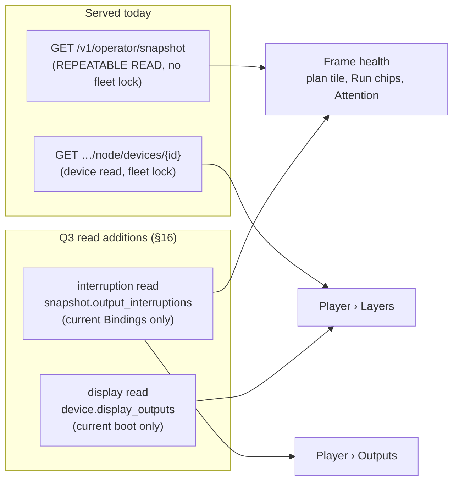
```mermaid
flowchart LR
  subgraph SERVED["Served today"]
    SNAP["GET /v1/operator/snapshot<br/>(REPEATABLE READ, no fleet lock)"]
    DEV["GET …/node/devices/{id}<br/>(device read, fleet lock)"]
  end
  subgraph Q3["Q3 read additions (§16)"]
    OI["interruption read<br/>snapshot.output_interruptions<br/>(current Bindings only)"]
    DX["display read<br/>device.display_outputs<br/>(current boot only)"]
  end
  SNAP --> FH["Frame health<br/>plan tile, Run chips, Attention"]
  OI --> FH
  OI --> PO["Player › Outputs"]
  DEV --> PL["Player › Layers"]
  DX --> PL
```

## 15. Screens

**Frame health: Output interrupted** (interruption read). `frameHealth` gains one state, **Output interrupted**. It is an alarm, placed after "Player app silent" and before the Panel alarm. It shows wherever Frame health already shows: plan tile, Run card Frame chips and Attention. There is one classifier and no second card.

Its wording is "Output interrupted (Central's inference: <report> · recorded <age> ago) · the Run continues". The truth kind is `derived`, with Central's linked Output-loss record as the basis. `<report>` is what the cause layer actually reported, because a fact kind's owner is fixed (`contracts/node_protocol.py` `owners`) and Central records a loss from only two (`node_runtime_reconciliation.py`): `app_effect_broker` reads "App Effect Broker reported the app process exited" (Central applies one exit to every Output linked to that process), `display_host` reads "Display Host reported the app surface invalidated or withdrawn", and any other served layer reads "<Layer> sent the evidence Central linked to this Output", never a report it did not make (`LOSS_REPORTS` in `health.js`, layer names from the one `LAYER_NAMES` table in `facts.js`, `player_runtime` reading Player app). The `derived` pattern ends at its closing parenthesis, so " · the Run continues" is a suffix (`RUN_CONTINUES`) outside it, added only when a live Run targets the Frame (`liveRunsFor`); a loss is recorded for any bound Frame linked to the app process, Run or not, and with no live Run the fact stands alone. The state's cause is `output` and its facet is Binding. Its short form, on the plan tile and the Run chip, is "Output interrupted · the Run continues" (or "Output interrupted" with no live Run); the full wording with the age is the tile's accessible name, Attention's row and the Inspector header.

The read serves only losses that fence the Frame's **current** Binding (§16). The console therefore keys rows by Frame id and never works out which Binding a row belongs to: a loss from an earlier Binding cannot be painted on the Frame now bound there. With no row, nothing is shown. The console never claims "not interrupted", because Central records only the losses it could link, and Display Host withdrawals are dropped by the defect in §13.

**Player › Outputs.** A bound Output's row shows the same fact, from the same read, through the same function (`interruptionFor`), as "Interruption: <fact>", with " · the Run continues" under the same live-Run rule. (Q3 = A, so the declined-read branch, a constant Unknown line, is not built.)

**Player › Layers: Display Host** (display read). "Display Host last reported <age> ago" uses the newest exchange receipt across this boot's newest Display Host producers (at most 4; `reported`, latest). Each Output then gets three facts, each `reported`, latest, from that Output's newest exchange. They render through the one `reported` wording ("Display Host last reported <age> ago · <phrase>"), so the null-surface line names its source twice and each Output's receipt age repeats on its three lines:

| Fact | Wording | Why worded so |
|---|---|---|
| Connector | "Panel connector: connected" / "Panel connector: not connected" | The exchange carries `connected` (`contracts/node_display.py:93-104`) |
| Admitted surface | "Admitted surface: the app's surface for Frame <id> (binding generation g)" / "Display Host reported no app surface admitted" | The exchange has `admitted: Surface \| None` and no diagnostic field. Display Host only *requests* its diagnostic page, and that acknowledgment arrives separately (`appliance/display_host/domain.py:34-35`). So the console never names the diagnostic page. |
| Compositor receipt | "Compositor receipt for that surface, sampled <n> s before this report" / "No compositor receipt for that surface in this report" | The age compares one producer's own boot clock with itself (R10). The console shows the age and judges nothing. Central serves no staleness threshold for presentation: its 5 s rule (`node_acceptance.py:179`) belongs to qualification. This follows the host-silence stance in §11. |

"Panel pixels: Unknown: no layer observes them" still closes the list. The row reads Unknown, naming why, when node management is off, the read is missing, `display_outputs` is not served ("Unknown: display_outputs not served", an older Central) or it is empty ("Display Host has reported no Output on this boot"). Its details list each admitted surface's configuration revision. "No display string says visible" binds this row; the pass-1 Host Management and broker details keep two negations ("Host samples do not show visible pixels", "A running process is not visible output").

**Player › Layers: App Effect Broker.** The last-reported line changes to the true reason, served or not: "Unknown: App Effect Broker sends evidence only on change, and Central stores no receipt of its polls". This is a UI-only change.

**`ManagementFacts`** (V1 section) renders through `fact()`. The authenticated OS attempt claim is `claimed` (source "its serial check-in", latest receipt: fleet `read_at` minus the report's `received_at`) only in its `reported` state; its other states (`none`, `invalid_stored_report`, `context_mismatch`) are Central's own record and are `set`. The V1 loader session and V1 app attempt are `set`. Labels: "V1 loader OS session", "V1 app attempt", "V1 authenticated OS attempt claim"; a Central that serves no management block reads Unknown. The loader session's `expires_at` stays a local clock time, for display only. Rule 2's pass-1 exception ends. *Deleted by Part E (NV1): the V1 section and `ManagementFacts` are gone, so no V1 record remains in the console.*

**Failure modes (pass 2).**

| What breaks | What the operator sees | Guarantee |
|---|---|---|
| An unresolved loss belongs to an earlier Binding or authority epoch | Nothing. The read does not serve it (§16), so the current Frame can never carry another Binding's interruption | Construction at the read (SQL join to current Bindings); DB test |
| Display Host restarted within one kernel boot (new producer) | The new producer's newest exchange wins. Exchanges from an earlier boot are never shown as current | Read scoped to the current boot admission; DB test |
| Central runs without node control | The interruption read is served by the snapshot (rows exist only where the node lane ran). The display read rides the device read, which is not sent: the Player page shows Part E's one "not shown" line under the shell banner (§25) | Browser test (Part E) |
| A stored exchange no longer decodes on this Central (the display contract changed across an upgrade while the node kept its boot) | That Output alone reads "Unknown: Central could not decode Display Host's last exchange for this Output". The device read, the other layers and Reboot are unaffected | Per-Output containment in Central's display read (served `undecodable: true`); DB test |
| A served display field has the wrong shape | "This section could not be shown" in Layers only | Per-section boundary (pass 1) |
| A loss Central could not link (including Display Host withdrawals, §13) | Nothing. Absence is never worded as health | Wording rule; model test |

## 16. Backend reads: the pass-2 gate (Q3 and Q4)

Each read is read-only. It is an additive field on an existing admin read, behind the existing `admin` dependency and `invoke` error mapping (`central/fleet/node_routes.py`), and lands as the first commit of the bead that shows it (§23).

| Read | Concept the console cannot show today | Evidence it is missing | Smallest addition | Console without it | Lines (code / tests) |
|---|---|---|---|---|---|
| **Interruption** | Output interruption inside a continuing Run | `node_output_losses` is read only by Runtime reconciliation (`coordination.py:885-899`, `924-926`) | Additive `output_interruptions[]` on `GET /v1/operator/snapshot`, inside its existing REPEATABLE READ snapshot (`operator_snapshot.py:65`), so it agrees with the Bindings beside it. Serves only unresolved rows that match the Player's current `authority_epoch` and a current Binding: the same Frame, Output and binding generation that Runtime reconciles against (`coordination.py:879-882`). The cause layer comes from a join of `cause_producer_id` to `node_producers.owner`; the table has no layer column (`053_node_control.sql:140-155`). Shape: `{frame_id, player_id, output_id, binding_generation, cause_layer, interrupted_at}`. | Player › Outputs Unknown; no Frame-health state | +35 / +60 |
| **Display** | Display Host's current per-Output presentation and its last report | The evidence projection keeps the first state (§13). The exchanges (`055_node_display.sql:2-14`) are not served | Additive `display_outputs[]` on `GET …/node/devices/{id}`. For the device's current boot admission, it takes the newest `node_display_exchanges` row per Output across that admission's `display_host` producers, ordered by `sampled_boottime_ms`: one kernel boot's clock, compared only within that boot. Shape: `{output_id, received_at, connected, surface: {frame_id, binding_generation, config_revision} \| null, receipt: {matches_surface, age_ms} \| null}`, where `age_ms` is the exchange's sample minus the receipt's sample (one producer), and `matches_surface` is true when the exchange has an admitted surface and the receipt's whole Surface (Output key, process, app epoch, binding generation, configuration revision, Frame) equals it, the comparison qualification uses (`node_acceptance.py`). Capped at 64 rows like the device read's other lists. | Display Host row Unknown (pass 1) | +35 / +50 |

**Why the interruption read filters.** Losses are keyed by `(player_id, authority_epoch, output_id, frame_id, binding_generation)` (`060_node_output_frame_identity.sql:34-35`). "A historical unresolved loss is still a fence" (060:1-2), but only on its own exact key: Runtime matches the full tuple (`coordination.py:924-926`). An unresolved row from an earlier epoch or binding generation therefore fences no current Frame. Serving it would invite the console to attach it to whatever Frame is bound there now. Central filters it, so the console holds no second copy of the "which Binding" predicate.

**Lock cost.** The interruption read takes no fleet lock. The display read rides the device read, which holds the global fleet advisory lock (`node_observations.py:52-54`). Its query (`DISPLAY_OUTPUTS_SQL`) walks the existing index `node_display_output_latest` (055:14): a recursive skip-scan finds the distinct Outputs of the current admission's newest Display Host producers (at most 4, newest by admission), then one newest-first probe per producer and Output; the per-Output winners are cut to 64 in SQL and only their stored requests are fetched. The node picks its incarnation ids, so it picks how many producers a boot has (up to the daily session cap); the producer bound is Central's, so the cost is at most 4 × 64 index probes plus 64 request rows, independent of that count and of how many exchanges the boot has accumulated, which matters because exchanges are immutable, never pruned, and arrive about every 3 s per Output. That adds one index-bounded query to the lock hold per open Player page per 5 s. The DB tests seed 20,000 exchanges and assert the plan reads fewer than 50 exchange rows, and seed 12 producers each flooding past 64 Outputs and assert the plan stays within the 4-producer bound; they bound rows, not time.

**Not proposed.** A last-reported time for the App Effect Broker: it sends evidence only on change (`appliance/node/broker_runner.py` `emit_process_evidence`), and Central stores no poll receipt. That needs a heartbeat write (feature proposal). A non-locking device read also stays deferred.

> **Q3 (backend reads).** Recommended: **A, both reads** (about +70 code and +110 test lines). **B: the interruption read only.** Display Host stays Unknown, so U6 stays incomplete for that layer. **C: none.** Interruption and Display Host stay Unknown, R6's "only this Player's Outputs interrupted" stays invisible, and batch 2 has no backend change.
>
> **Answered 2026-10-02: A, both reads.** Built in C1 (`Coordinator.output_interruptions_in`, served as `output_interruptions[]` on the snapshot; model `OutputInterruption`, `cause_layer` a literal of the producer owners) and C2 (`display_outputs_in` in `central/fleet/node_display.py`, served as `display_outputs[]` on the device read, inside its existing transaction and lock). No migration, no new route, no new lock.

**The reboot fence (Q4).** "Outstanding" is defined once, in Central. A reboot command is **outstanding** while it is unexpired on Central's clock and has no `rejected` response, scoped to the session it targets.

- **Received, accepted and initiated commands stay outstanding until they expire.** A second command id to the same session would mean two reboot requests for one box, because Host Management dedupes by command id (`appliance/node/host.py:108-116`).
- **A command to an earlier session never blocks a new one.** Host Management accepts commands only for its current session (`host.py:100-104`).

The fence goes in `NodeCommands.request_reboot`: it refuses a **new** command id with 409 `node_reboot_outstanding` while another command on the same session is outstanding. It runs under the locks `request_reboot` already holds (gate, global fleet lock and session row, `node_commands.py:66-72`), so the check cannot race. A retry of the same command id is unaffected.

The device read serves `outstanding: bool` per command, from the same predicate evaluated at read time, so the console never re-derives it. `outstanding` and each command's responses come from one statement, so one snapshot: response ingest takes no fleet lock, and a rejection committed mid-read cannot be served beside an `outstanding` that predates it. `outstanding` is the **send** predicate. It is not one of §10's state labels, which stay as they are: a Requested label is outstanding, but so are Accepted and Initiated. The console reads a 409 `node_reboot_outstanding` as **changed**: "Another reboot request for this Player is outstanding; close this dialog and review it".

> **Q4 (reboot fence).** Recommended: **yes**, as the first commit of R0 (+25 code, +60 test lines). R0's console then reads the served `outstanding`, and the cross-page race becomes impossible at the authority. Alternative: **no**. R0 derives the same predicate in the console from its newest read, two pages whose reads predate each other's send can each send a new command id within one read interval, and a commit whose answer is lost after a read stays invisible to that read (§10).
>
> **Answered 2026-10-02: yes.** Built as R0's first commit: one `OUTSTANDING_REBOOT_SQL` in `central/fleet/node_commands.py`, used by the fence in `request_reboot` (after the same-id check, so a retry of the same id is unaffected) and by the device read's per-command `outstanding`, evaluated at the read's own `now`.

## 17. Node release workflows: replaced by Part E

The first draft of pass 2 designed a Releases home, Stage app and qualified fallback; review deferred them, because node control was then treated as opt-in, they add operator workflows, they needed three reads of their own, and four of them repeated failure classes this programme removes elsewhere. Its constraints survive as Part E's R13–R18 (two amended there).

> **Q5 (node release workflows).** Recommended then: defer. Alternative: design them next, as their own feature-layer pass and gate.
>
> **Answered 2026-10-02: design them next.** The design is **Part E** (§24–§32), which also takes the owner's V2-only steer: node control is the one configuration posture (the owner's iac runs `central.node_app`), so the console shows no V1 surface and the V1 fleet policy no longer sits on the Players list.

## 18. Interface sketch (pass 2; signatures only)

```text
health.js (extended)                                                     (C1)
  interruptionFor(snapshot, frameId) -> {fact: Fact, suffix: string|null, label: string} | null  // snapshot.outputInterruptions (the camelCased
                                                              // output_interruptions) keyed by frame_id; label adds RUN_CONTINUES;
                                                              // rows are current-Binding only (§16), never re-matched
  frameHealth(...)                                            // gains "output-interrupted" (alarm)
PlayerPage.jsx (Outputs)   bound Output row renders interruptionFor(snapshot, output.frameId) via FactLine's suffix

nodeRead.js (extended)                                                   (C2)
  displayOutputs(nodeDevice, readAt) -> Array<{outputId, facts: Fact[]}>   // display read; three facts per Output
  layerEvidence(...)                                          // Display Host row from display_outputs; broker reason
V1Offers.jsx               ManagementFacts renders through fact()                (C2; file deleted by NV1)
```

Q3 = A, so both functions are built and no declined-read branch exists.

**Current choices** (revisable; recommended as shown):

| Choice | Current | Alternative and its cost |
|---|---|---|
| Who decides which Binding a loss belongs to | Central, in the read: only current-Binding rows are served | Serve every unresolved row and match in the console: a second copy of Runtime's predicate, and the wrong-Frame alarm the review found |
| Where the display read lives | On the device read (Player page only) | On the snapshot, so Frame health could use Display Host's current connector state: it widens every 5 s snapshot for every operator. It is a feature proposal (Display Host connector state in Frame health) |
| Compositor receipt age | Shown as an age, not judged | A client staleness threshold: an unowned number (R9) |

# Part D: pass 3, Wall: the Frame's facets (feature layer)

## 19. Screens

Pass 3 needs no backend. It renames the Frame's "Commissioning" facet to **Calibration** and moves the equipment block that mixed in another aggregate's state to **Binding**. It also fixes the Wall words that still blur Output, Panel and Display Host.

**The Frame's facets.** The route is `#/wall/frames/<id>/<facet>`. `routes.js` `FACETS` becomes `calibration | binding | nowshowing`. The old `commissioning` parses to `calibration`, so old bookmarks keep working, and `formatRoute` never emits it (as with `#/equipment` in pass 1). The default facet stays where it is today (the first entry).

| Facet | Contents (from where today) | Writes |
|---|---|---|
| **Calibration** (was Commissioning) | Committed calibration; the draft editor ("Adjust calibration"); **Live calibration** (§20); the Frame profile section (operator-declared; persists across a Panel swap) and its profile/report mismatch note | Show on the Panel, Save (per path, §20), Stop; Edit Frame profile (unbound only, existing) |
| **Binding** | Bound Player (link to its page) and Output; Player app liveness (pass 1); Output interrupted (from Frame health, when served, §15); "Panel at the Player app's last enrollment (may be stale)", moved here from Commissioning with the "Bound Output" block (`Commissioning.jsx:622-662`); for an unbound Frame, the Output picker, each candidate with **Identify Panel** | Bind, Unbind (existing); Identify |
| Now-showing | unchanged until pass 4 | — |

**Removed:** the two capability-gated placeholders ("Panel color correction", "Display power and parameters"), together with `capability.js` and `GatedArea.jsx`. No served capability exists for either; a control arrives with its served read, as a feature proposal. This also removes every T1/T2 tier word from console source and from the [console UX design](operator-console-ux-design.md).

**The Panel at enrollment, one wording.** `connected=false` is Central's own record: enrollment first marks every Output `connected=false`, then writes the Outputs the Player app listed (`registry.py:185-190`). Everywhere, fleet and Wall, it reads **"No Panel listed as connected at the Player app's last enrollment (may be stale)"** (`set`). `connected=true` reads "Panel connected at the Player app's last enrollment (may be stale)" (`reported`, first). One function, `panelAtEnrollment`, which R0 introduces, renders both. The `connected=false` wording lives once, as `NO_PANEL_AT_ENROLLMENT` in `health.js` (which `players.js` imports, so no second module cycle forms); its short form, on a plan tile and an Output's state, is "No Panel listed at the last enrollment". A connected record keeps its resolution line under the Binding facet: "Output resolution at that enrollment: W × H".

**Frame health words.** "needs-commissioning" becomes **needs-calibration**, with cause `calibration` and facet `calibration`. The startup Panel alarm **stays an alarm** with the wording above, as state `no-panel-at-enrollment`, cause `panel`, facet `binding` (where the Panel record now lives); its label is the bare wording, without "· recorded <age> ago". Gap 16 was a wording fault, not a severity fault. Demoting the alarm would leave a bound Frame whose Panel is unplugged with no alarm anywhere, because Display Host's current connector state is only on the Player page (§18). The CTA after a bind, "Commission the display", becomes "Calibrate this Frame".

**Identify on any unbound Output.** Central identifies any connected, unbound Output of an active Player whose Player app offered the capability (`registry.py:441-452`). Today the console offers Identify only on a Player whose standing is Unbound, so a Bound Player's free second Output cannot be identified. Pass 3 uses one function, `identifyOffer`, on both homes: Player page › Outputs and the Binding facet's picker.

| Output | Control | Reason shown |
|---|---|---|
| connected at last enrollment, unbound, Player active | **Identify Panel** | — |
| not listed as connected at the last enrollment | disabled | "Connect a Panel and restart the Player app" |
| bound to a Frame | disabled | "Central identifies only unbound Outputs" |
| Player retired | absent | — |
| Central answers `identify_unsupported` | outcome | "Central has not negotiated Identify with this Player app's current enrollment" (a 409, mapped by error code; Central raises it when no current-epoch control session is negotiated at schema 2 with `identify_output`, which also covers an open or legacy session, so the wording names Central's record, not the app's offer; the capability is not served, so `identifyOffer` cannot disable on it) |

Identifying a bound Output would overlay a showing Frame's content for 15 s. It is on the feature-proposal list, not a question here.

**Enrollment on the Player page.** "Player app enrolled <age> ago (authority epoch N)" is `set`: `last_seen` is Central's enrollment record (R3). It is §19's wording verbatim rather than the `set` pattern's "<value> · recorded <age> ago": the value carries Central's age (`read_at - last_seen`) and reads Unknown when either time is missing. It goes in the Player page header, labelled "Enrollment",, its home (rule 1). The Wall's "Recovered" banner, a browser diff of epochs (`recovery.js`), is deleted. The Binding facet already links to the Player page.

**Unplaced: unchanged.** `isUnplaced` is called only inside `projection.js`, so there is no caller to migrate, and a console-side value would only relabel the Registry's (0, 0) sentinel. The honest fix is a nullable placement in the Registry (a migration). Gap 20 moves to the feature-proposal list.

## 20. One live-calibration noun, two honest verbs

Central offers two paths, chosen per Frame by its served `calibration-capability` `mode`. `native_trial` is a Display Host CalibrationTrial, with a compositor acknowledgment. `legacy_preview` is a 30 s Registry preview lease, with no acknowledgment; it is the mode for any Frame whose Player has no `node_v2` offer and no `display_host` producer (`registry.py:711-727`). Today the two read as two features ("Live calibration trial"; "Preview and commit").

Pass 3 names both **Live calibration**. The verb differs where the domain differs. U9 says "Save requires the latest candidate's matching presentation acknowledgment" (`requirements.md:41`). The native path's **Save calibration** is enabled only from Acknowledged (R7). The legacy path can never have an acknowledgment, so its commit is worded **Save without acknowledgment** and is never called Save calibration. That legacy commit already contradicts U9 today. Pass 3 changes its wording, not its behaviour, and records the gap for the requirements owner (§13).

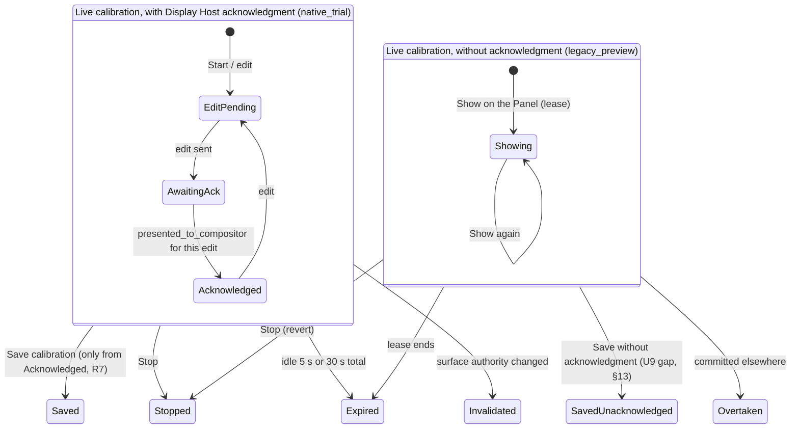
```mermaid
stateDiagram-v2
  state "Live calibration, with Display Host acknowledgment (native_trial)" as N {
    [*] --> EditPending: Start / edit
    EditPending --> AwaitingAck: edit sent
    AwaitingAck --> Acknowledged: presented_to_compositor for this edit
    Acknowledged --> EditPending: edit
  }
  state "Live calibration, without acknowledgment (legacy_preview)" as L {
    [*] --> Showing: Show on the Panel (lease)
    Showing --> Showing: Show again
  }
  N --> Saved: Save calibration (only from Acknowledged, R7)
  N --> Stopped: Stop
  N --> Expired: idle 5 s or 30 s total
  N --> Invalidated: surface authority changed
  L --> SavedUnacknowledged: Save without acknowledgment (U9 gap, §13)
  L --> Stopped: Stop (revert)
  L --> Expired: lease ends
  L --> Overtaken: committed elsewhere
```

The strings change in place in `LiveCalibrationTrial.jsx` and the renamed Calibration facet. No new module joins the two paths' state machines.

| Today | Pass 3 |
|---|---|
| "Live calibration trial" · "Begin Trial" · "Start another Trial" · "End Trial" | "Live calibration" · "Start live calibration" · "Start again" · "Stop live calibration" |
| "Preview and commit" · "Preview" · "Re-preview" · "Commit" · "Revert" | "Live calibration" · "Show on the Panel" · "Show again" · "Save without acknowledgment" · "Stop live calibration" |
| "Edit N presented to the compositor by Display Host." | "Edit N presented to the compositor by Display Host · not proof of what the Panel shows" (`reported`) |
| "Previewing on the panel — lease expires in Ns." | "Central sent the draft to the Player app; live calibration ends in N s. No layer acknowledges what is presented on this path." (`set`; N is the served `lease_seconds` counted on the browser's monotonic clock from the answer's arrival, never Central's `expires_at` minus the browser's clock, R10; final fix round) |
| "Trial expired. Your draft is retained." | "Live calibration expired; your draft is kept" |
| "Committed elsewhere / your preview was superseded — re-review." | "Someone saved a calibration for this Frame meanwhile; review it, then start again" |

**Other pass-3 wordings.**

| Today | Pass 3 |
|---|---|
| Inspector tab "Commissioning" | tab "Calibration" |
| "Display at last Player start" · "Display: Detected / Not detected" | "Panel at the Player app's last enrollment (may be stale)" · the two `panelAtEnrollment` wordings (§19) |
| "No Display bound — bind a Player output first." | "No Output bound. Bind one on the Binding facet." |
| "Edit display profile" · "persistent display profile" | "Edit Frame profile" · "Frame profile" |
| "Identify display" (Wall and fleet strings) | "Identify Panel" |
| "Unbind all outputs of player X?" | "Unbind each Output of Player X?" with "Central unbinds them one at a time. One that changed since you opened this is skipped; if an outcome is unknown, the rest are not attempted." (gap 17; worded to `unbindSequence`'s behaviour). The Player page's danger button keeps "Unbind all outputs". |
| "Recovered" banner (browser diff of epochs) | Player page header: "Player app enrolled <age> ago (authority epoch N)" (gap 19) |
| "Requires the display-control capability — not yet available." | removed |

## 21. Interface sketch (pass 3; signatures only)

```text
routes.js            FACETS = ["calibration", "binding", "nowshowing"]; alias commissioning -> calibration
CalibrationFacet.jsx (renamed from Commissioning.jsx) committed, draft editor, live calibration, Frame profile;
                     equipment block removed
BindingFacet.jsx     (extended) bound Output and Panel at enrollment (moved); Identify on picker candidates
LiveCalibrationTrial.jsx  strings only (§20)
players.js (shared with the Wall in the R4 test)
  panelAtEnrollment(observation, readAt, enrolledAt) -> Fact  // R0; one wording for connected true/false; enrolledAt
                                                              // (the Player's last_seen) is the reported fact's receipt
  identifyOffer(snapshot, playerId, outputId) -> {offer: true} | {offer: false, reason} | {absent: true}
  enrolledFact(player, readAt) -> Fact                        // set: last_seen is Central's enrollment record
health.js            frameHealth(...): needs-calibration; Panel alarm uses panelAtEnrollment wording
Deleted              capability.js, GatedArea.jsx, recovery.js and the Wall banner
```

**Current choices** (revisable; recommended as shown):

| Choice | Current | Alternative and its cost |
|---|---|---|
| Facet split | Rename to Calibration and move the equipment block to Binding; the profile stays a section of Calibration | Separate Calibration and Profile facets: a new facet and more retargeting across the 12 browser-test files that name Commissioning (117 mentions), for a split no requirement asks for |
| Default facet | Unchanged | Binding first: matches setup order, but churns every Wall test's landing tab |
| Legacy commit verb | "Save without acknowledgment" (behaviour unchanged; U9 gap recorded) | Disable it on `legacy_preview` (U9 as written): legacy Players lose calibration. Or give it "Save calibration": hides the U9 gap |
| Startup Panel report | Alarm, worded as an enrollment record (may be stale) | A to-do: the only Wall signal for an unplugged Panel is lost |
| "Recovered" banner | Replaced by the durable enrolled fact on the Player page | Keep a banner worded from Registry facts: a transient notice that a reload loses |
| Gated placeholders | Deleted with `capability.js` | Keep the seam, renamed without tiers: two permanently disabled areas |

## 22. Costs and deferrals (passes 2 and 3)

**Costs.**
- **Size.** Estimated at about +1,500 / −850 lines across batch 2 (§23): about +650 code, +700 tests, +150 docs. Pass 1 overran its estimate: +4,622 / −1,266 actual against +2,200 / −1,250 (`git diff --shortstat origin/main..HEAD`), about 1.8× for code and 2× for tests. At that rate, plan on **about +2,700 / −850**. The browser suite gains well under a minute.
- **Wire coupling.** Central decodes Display Host's stored exchanges for the display read, and the console reads the decoded fields. An exchange Central can no longer decode is served per Output as `undecodable` and shown as Unknown; a served field of the wrong shape is contained by the Layers section's boundary.
- **Lock cost.** The display read adds one indexed query to every device read's fleet-lock hold (§16).
- **Interruption absence.** Losses Central could not link stay invisible. Absence of an interruption is never shown as health.
- **Display Host on the Wall.** Display Host's current connector state appears only on the Player page. Frame health still uses the enrollment-time Panel record, worded as possibly stale.
- **Legacy calibration.** The legacy commit still saves without acknowledgment, against U9. It is now worded so, and owned in §13.
- **Node release workflows.** These, and gap 13, stayed without UI in batch 2; Part E designs and builds them (§24–§32).

**Deferred:** `planned` and Plan wording (pass 4); library (pass 5); a non-locking device read.

**Feature proposals added by this part:** Identify on bound Outputs; a Registry nullable placement (gap 20); Display Host connector state in Frame health; a broker heartbeat (a write).

# Batch 2: R0 plus passes 2 and 3

## 23. Beads (built back to back; one full verify and one review for the batch)

There are five beads, built back to back, each green on its own package tests so the batch can stop after any bead. One full verify and one review then cover the whole batch (owner preference). **Status:** all five built 2026-10-02 to Q3 = A and Q4 = yes, awaiting that verify and review. C2's `ManagementFacts` work was later deleted by Part E's NV1 (§32).

- **R0 comes first** because it fixes a shipped defect.
- **Build to the answers.** Each backend read is the first commit of the bead that shows it, and the batch is built to the Q3 and Q4 answers. A declined read or fence is simply not built, and nothing dormant ships.
- **Docs come last.**

| Bead | Contents | Acceptance (observable) | Lines (code / tests) |
|---|---|---|---|
| **R0 · Reboot send rule and pass-1 residuals** | If Q4 = yes, first commit: the `node_reboot_outstanding` fence and the served per-command `outstanding`, one predicate in `node_commands` used by both (§16). Then, in `fleetCommands.js`: `rebootOffer` judges every command on the target session by `outstanding` (served if Q4 = yes, else derived from the read), and `sendReboot(deviceId, request, node)` evaluates `rebootOffer` on `node.latest()` inside the send. `rebootStale` and `rebootBlocked` are deleted. `useNodeDevice` exposes `latest()`. A 409 `node_reboot_outstanding` reads changed. A source-scan test checks that only `fleetCommands.js` POSTs to `/reboots`. `PlayerCommands.jsx` derives retry from the held request and enables Send from the same `rebootOffer`. Minors: the reboot Evidence fact names the served `reason`; superseded and interrupted operations keep the broker's earlier answer as a second Evidence fact; the attention all-clear reads "No Frame needs attention", plus "· K awaiting a first report" when K > 0; `panelAtEnrollment` gives one wording for the Panel at enrollment (§19). | **Stale dialog.** The dialog is frozen at read 1000, and the next read, at 1005, lists a different outstanding request until 1034. Send is disabled, and a direct `sendReboot` call refuses: the browser test counts **zero** reboot POSTs. Mutation probe: removing the call-time check from `sendReboot` makes that test fail. **Other blockers.** An older outstanding entry that is not the newest blocks Reboot. An Accepted, not-initiated request still blocks. A command to an earlier session does not block. **Retry.** A held retry re-sends identical bytes and lands "Already recorded". **Wording.** A rejected reboot reads 'a "rejected" response (reboot scope or expiry)'. A superseded operation that was rejected still shows the rejection. **Fence (Q4 = yes).** DB tests: a second new id while the first is outstanding gets 409; the same id gets already; after a rejection or expiry, a new id is accepted; the served `outstanding` agrees with the fence on each case. | +115 / −80 · +180 / −30 (fence included) |
| **C1 · Output interruption** (tracer first) | First commit: the interruption read (§16). Then `health.js` `interruptionFor` and the Output-interrupted state; the Player › Outputs line. If Q3 = C: only the constant Unknown line on bound Outputs | **DB.** Only unresolved rows matching the current epoch and a current Binding are served. A row for an earlier binding generation of the same Output, and one from an earlier epoch, are not. `cause_layer` comes from the producer's owner. **Browser and model.** A served row gives its Frame "Output interrupted … · the Run continues" on the plan tile, Run chip, Attention and the Player's Output row. A Frame newly bound to that Output shows nothing. No row shows nothing | +100 · +150 |
| **C2 · Display Host and V1 facts** | First commit: the display read (§16). Then `nodeRead.js` `displayOutputs` and the Display Host row. The broker's true reason. `ManagementFacts` through `fact()`. If Q3 = B or C: the broker reason and `ManagementFacts` only | **DB.** The newest exchange per Output is taken across the current admission's Display Host producers, so after a Display Host restart within one boot the new producer wins. An earlier boot's exchanges are not served. The receipt age uses one producer's clock. **Model.** A null surface reads "Display Host reported no app surface admitted". No display string says "diagnostic page", "visible" or "showing". No plain "V1 record" line remains | +165 / −30 · +170 / −20 |
| **D1 · Wall facets and words** | `routes.js` facets and alias; `Commissioning.jsx` → `CalibrationFacet.jsx` with the equipment block moved to `BindingFacet.jsx`; §20 strings in place; `identifyOffer` on both homes; `enrolledFact` on the Player page header; Frame-health words; delete `capability.js`, `GatedArea.jsx`, `recovery.js` and the banner; Wall browser tests retargeted | **Facets and alias.** Tabs read Calibration, Binding, Now-showing, and `#/wall/frames/x/commissioning` opens Calibration. The Binding facet shows the bound Output and the Panel at enrollment. **Calibration.** On the native path, Save calibration stays disabled until Display Host acknowledges the latest edit. The legacy path offers only "Save without acknowledgment". **Identify.** A Bound Player's free second Output can be identified from its Player page and from an unbound Frame's picker, and a bound Output shows "Central identifies only unbound Outputs". **Banner and alarm.** The Player page header shows the enrolled fact, and no Wall banner remains. An unplugged-at-enrollment Panel on a bound Frame is still an alarm, worded "may be stale". **Words.** No console string says Commissioning, Commission, Trial, Preview (as a noun), T1, T2 or "display" for the Panel | +250 / −420 · +200 / −200 |
| **E1 · Docs** | [Console UX design](operator-console-ux-design.md) (facets, Panel words, no tiers); this document's status and history; [fleet implementation map](player-fleet-implementation-map.md) links to the new reads and corrects its verifier line (§13); the AGENTS.md code-map row if anything moved | `check_docs.py` passes. No doc names the Commissioning facet or the T1/T2 tiers as current | +150 / −60 (docs) |

**Tracer bullet** (the first commit of C1). The interruption read is served on the snapshot, and the plan tile of the Frame whose **current** Binding has an unresolved loss shows "Output interrupted". An unresolved loss for an earlier binding generation of the same Output shows nothing. The tracer proves the backend read on the snapshot, current-Binding filtering at the authority, the classifier and every Frame-health surface. **Non-goals:** the Player page line, Display Host, the Wall facets. If Q3 = C, the batch has no backend change, and the tracer becomes D1's first commit: `#/wall/frames/x/commissioning` opens the renamed Calibration facet, and the Binding facet shows the moved equipment block.

# Part E: V2-only console and node release workflows (feature layer)

**Status:** designed 2026-10-02 after the owner's Q5 answer, revised after two adversarial review rounds (domain-fidelity/security and simplicity/scope lenses each time) and for the owner's steer of 2026-10-02: *"if node-path is the new/correct way to run the system, then lets stop acting like there is any other option. The v1 code can be fully deprecated and the designs and implementations should all assume a v2 configuration posture."* Built as batch 3 (NR1, NV1, NR2, NS1, NS2, NU1, ND1, §32); its implementation errata are folded in below, and it awaits its one full verify and review. This Part replaces §17, supersedes Q2's answer, and is the home of the §6 rows for BootOffer, NodeRelease/Deployment/BootPolicy, Qualification/EnvironmentAcceptance and the effect gate; the V1-lane row is deleted.
**Layer:** feature. Screens, wordings, lifecycles, send rules, signatures, backend reads, failures and beads. The domain-to-console map, design rules 1–3 (§5) and the `fact()` vocabulary are inherited.
**Owner decisions (2026-10-02, binding):** V2 node control is the only configuration posture: the console has no V1 surface (R20). D16/Q1 = **yes**: a Stage on a Frame-bound Player follows the operator-reboot rule (bound Outputs interrupted from the observed app exit when Central reconciles that exit before the new app enrolls, see §29 G6; rejoining the Run at its current point, calibration and bindings kept); G6 is built. The guided journey (the Stage UX briefing's Shape B) is built as **Update the wall** (NU1, §25a). Q7: the page drives qualification samples. **One choice stays open** (§31): G7, a read-only field that would let the journey tell which Players booted on the selection. The owner asked for no new Central feature, so NU1 was built without it (§31's "No" column).
**Builds on:** §10's one-send-rule primitive (R0, batch 2), `fact()` (§5, §11), the former §17 constraints (restated as R13–R18, two amended), `useNodeDevice` (pass 1, moved onto the shared polled-read hook) and batch 2 (NV1 deletes batch 2's C2 `ManagementFacts` work).

## 24. What Part E covers, and why

**The console assumes one configuration: node control.** The owner's iac runs Central as `central.node_app` (`node_app.py:1-6`; mcurcio/iac `workloads/photo_wall/__init__.py:28-37`). The console stops presenting any other lane. Whether a given Pi boots by node path is **not** a Central setting: each Pi's kernel command line decides at every boot (`appliance/netboot_init.py:668-688`), the release default command line does not carry `photowall.node=v2` (`scripts/build_netboot_bundle.sh:297`), and the iac change that adds it per Pi is unverified as merged (§31 Assumptions). So the V2 posture has two misconfigurations to show, not one. Four consequences:

1. **No V1 surface.** The console shows no V1 boot offers section, no V1 app target, fleet V1 policy or V1 boot baseline, no V1 boot-path record ("V1 boot offer", "Netboot base without an offer"), no maintenance request, no `ManagementFacts` (V1 loader session, V1 app attempt, authenticated OS attempt claim), and no "release frontier" wording. This reverses Q2.
2. **Central without node control is a misconfiguration, shown once.** Central serves `transport_enabled` on `GET /v1/operator/node/status`, which answers with node control off (it calls no `require_enabled`, `node_routes.py:119-125`; mounted in both compositions, `app.py:883`). The shell reads it and, when `false`, shows one banner. Per-section "Unknown: node management is off" lines, the `NODE_OFF` constant and `NodeDevice.enabled` are deleted.
3. **A Pi that booted by the deprecated path is a misconfiguration, shown once per Player.** Central serves one lane-neutral fact on the node device read (G5): whether this box's newest boot record on Central is a deprecated-path one. The Player page shows one line, never the V1 records themselves (§25). Without it, such a Pi would look like a normal Player with "No node boot offer recorded", running content under a policy the console can neither show nor change, and unreachable by Select.
4. **The effect gate is a fleet aggregate with a state and a reason**, not a property of anyone's deployment. Central seeds it closed with reason `never_certified` (`047_fleet_effect_gate.sql:21-22`), closes it with `deployment_changed`, and opens it only through a deployment certification (`rollout_gate.py:309-346`), never from the console. Fleet › Releases is its home (§25); Reboot and Stage cite it by state and reason and link there. Qualification needs no gate (`node_acceptance.py:71-118`).

**"V1" means the lane, not the URL prefix.** Every operator route, node ones included, is under `/v1/operator/…`. The lane is: V1 boot offers (`/v1/netboot/offers`), the netboot base without an offer (`/v1/netboot/base`), the fleet V1 policy, overrides and baseline (`/v1/operator/fleet…`), T0 serial check-ins, maintenance requests and the content-catalog netboot frontier. Two `/v1/operator` reads stay in the console because they are lane-neutral:
- `GET /v1/operator/netboot` lists the shared `devices` table, which node boot writes too (`node_boot.py:197` → `FleetService._claim_new_device`, `service.py:162-177`). The console keeps its `device_id` and `serial` (Player names, "Not enrolled · seen at boot") and stops reading its V1 fields (`known_good_tag`, `failed_tag`, `last_served_tag`, `boot_outcome`, `frontier`). The deprecated-path fact comes from G5, not from these fields, so the console names no V1 field.
- `POST /v1/operator/app/releases/refresh` queues `SyncReleases` (`app.py:662-667`), the job whose release claim also records node publications into `node_release_catalog` (`infra/catalog_records.py:282-299`). It moves from the deleted V1 section to the Release catalog on Releases.

**A selection needs a deployment, and only Publish creates one.** `node_deployments` is inserted only by `NodeBootService.publish` (`node_boot.py:139`), and Select refuses an unknown deployment (`node_boot.py:176-177`). So the tracer is **catalog → Publish → Select** (§32). Whether a Central already holds a hand-published deployment is unverified; the design does not depend on it.

**The catalog is filled by the media worker** from GitHub Releases for `mcurcio/photo-wall` (iac `__init__.py:244-251`, `release_prereleases = False`). **Assumption:** at least one non-prerelease release carries a node publication; otherwise the catalog reads "GitHub releases has reported no node release yet", which is true and a release-pipeline matter.

**Requirements** (binding, alongside R1–R12):

| # | Rule | Source |
|---|---|---|
| R13 | Every fleet write has one send rule per verb, evaluated inside the send on the newest read. Any refusal code the console does not list is refused (fail closed: no automatic re-send). | §17; §10 |
| R14 | **Amended.** Stage is sent only with Central's served fences (the current app-effect session, the device generation, the gate generation) and is disabled only on served facts (gate effectively closed, no current app-effect session, retired, latest operation switching); every refusal is shown in Central's words. Amended from §17's "offered only where Central would admit it": every refusal in `stage()` raises inside the transaction before or at the insert and rolls back (`node_lifecycle.py:115-158`), so learning a refusal at send time costs one request and writes nothing, while a served admission verdict would be a second copy of Central's rules. | §17 as amended; §28 choices |
| R15 | Every served Stage state renders, including a state that a later boot ended. Superseded can follow any state. | §17; `node_lifecycle.py:311-315` |
| R16 | **Amended.** Qualification states its lock cost; terminal refusals and a stated no-progress limit stop sampling and show their reason; it qualifies the linked app process's environment. The page holds its qualification id in memory only; §17's "a reopened page finds its qualification through a served read" is withdrawn, because Central accepts any new qualification id (`node_acceptance.py:79-91`) and restarts the 30 s window on any gap over 5 s (`node_acceptance.py:212-217`), so resuming after a close is identical to beginning again. | §17 as amended |
| R17 | Boot selection is fleet-wide. Its dialog states the scope (every boot from now on, including Players Central has not seen) and Central's offer when the deployment has no app. **Amended** from §17's named list of affected Players and Frames: each Pi's kernel command line, not a stored Player attribute, decides at every boot whether it asks Central for a node offer (`NodeBootRequestV2` carries only serial, kernel boot id and nonce, `node_boot.py:47-53`), so any list is an inference that omits the boxes an operator cannot see. | §17 as amended; `node_boot.py:212-219` |
| R18 | The boot-policy read is REPEATABLE READ READ ONLY, ordered by `published_at`, always includes the selected deployment, and calls `require_enabled`. | §17 |
| R19 | *Withdrawn* (it kept the V1 fleet policy on the Players list). Replaced by R20. | owner steer 2026-10-02 |
| R20 | **V2 configuration posture.** The console assumes node control and shows no V1-lane surface. A misconfiguration is shown, never hidden and never presented as a mode: Central without node control as one banner; a Pi whose newest boot was by the deprecated path as one line on its Player page. | owner steer 2026-10-02 |

**Design-it-twice.**

| | **A. Aggregate homes (recommended)** | **B. One rollout page** |
|---|---|---|
| How | **Fleet › Releases** is the home of the fleet-wide aggregates: release catalog → deployment → boot selection (Publish, Select, Check GitHub releases now), plus the effect gate. Player state stays on the Player page; Player › App gains Stage app and Qualified fallback. Each side links to the other. | One **Fleet › Rollout** page walks release → publish → qualify on a canary → stage the canary → select for the fleet, with a canary picker. |
| Gives | Each verb on its aggregate's home (rules 1 and 3). Fleet-wide selection and per-box Stage cannot be confused. The tracer ships alone. | A guided order on one page; fewer clicks for a first rollout. |
| Costs | Two pages for a full rollout unless a journey composes them (now §25a). | It implies an order Central does not have: selection never requires qualification, and an acceptance "never advances a fleet frontier" (`node_acceptance.py:3-4`): intent worded as truth (R2). It needs a "canary" Central does not store, and it shows Player state and verbs off the Player's home (rule 1). |

Chosen: **A, plus the guided journey on top** (the owner chose the Stage UX briefing's Shape B, 2026-10-02; §25a, NU1). The homes stay the authority for each verb; the journey is a client that calls the same send functions. B's objections are met, not waived: Try is labelled optional and Keep never requires it (no implied order); the tried Player lives only in the page's URL, never in Central (no stored canary); Player facts on the journey are read-only rows linking to the Player page, and every write is the verb's one send function (rule 1 and R13 hold).

## 25. Screens

**Shell.** One read of `GET /v1/operator/node/status` (`useNodeControl`, §28) every 30 s while visible, on focus, once at sign-in, and on demand when a Reboot or Stage dialog opens. It is the **only** console source of the effect gate: `useNodeDevice` stops fetching node status (`nodeRead.js:69-71` today) and every gate consumer takes the shell's value. Three states: `on` (`transport_enabled: true`), `off` (`false`), `unread` (no answer yet, or the read failed: no banner, no claim). When `off`, one banner sits above every page:

> **Node management is off on this Central.** It was started without node control: Players that boot by node path are refused, and node records, Reboot, App operations and Releases have nothing to read. Start Central with `central.node_app` and set `PHOTO_WALL_NODE_AUDIENCE` (runbook › Node control).

(`central.app` mounts the V1 boot routes unconditionally, `app.py:882`, so Pis without the node flag still boot there; the banner claims only what is true. `node_app` refuses to start without the audience, `node_app.py:21-24`.)

With the banner up, node-dependent hooks are mounted with `skip` (no reads). Node reads are also skipped before the first status answer, so a Central without node control receives none; after a **failed** status read they are sent, so each page shows its own read failure (`useNodeControl` serves `failed` beside `state`; one rule, `nodeReadsAllowed`). The Player page shows its Registry header, Outputs, Bind, Identify, Retire and Unbind (snapshot data), and in place of its node sections exactly one line: "Node records are not shown: node management is off (see the banner)." Releases shows that one line and nothing else.

**Navigation.** The fleet group becomes **Players, Releases**; the routes `#/releases` and `#/releases/update/…` (§25a) are in the route table, `routeSamples.json` and the R4 import-graph test.

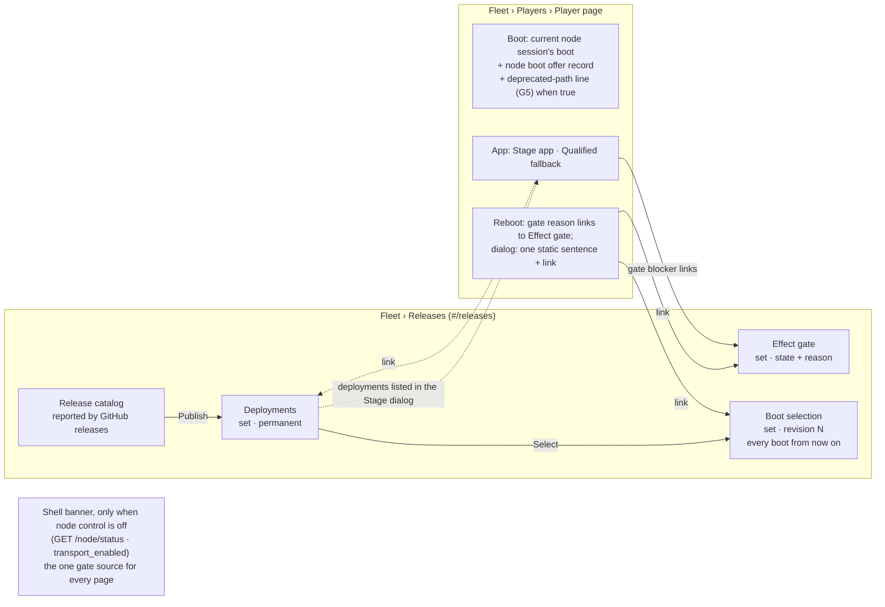
```mermaid
flowchart LR
  BAN["Shell banner, only when node control is off<br/>(GET /node/status · transport_enabled)<br/>the one gate source for every page"]
  subgraph REL["Fleet › Releases  (#/releases)"]
    GATE["Effect gate<br/>set · state + reason"]
    CAT["Release catalog<br/>reported by GitHub releases"] -->|Publish| DEP["Deployments<br/>set · permanent"]
    DEP -->|Select| SEL["Boot selection<br/>set · revision N<br/>every boot from now on"]
  end
  subgraph PP["Fleet › Players › Player page"]
    PB["Boot: current node session's boot<br/>+ node boot offer record<br/>+ deprecated-path line (G5) when true"]
    PR["Reboot: gate reason links to Effect gate;<br/>dialog: one static sentence + link"]
    PA["App: Stage app · Qualified fallback"]
  end
  PR -->|link| SEL
  PR -->|link| GATE
  PA -->|"gate blocker links"| GATE
  DEP -.->|"deployments listed in the Stage dialog"| PA
  PA -.->|link| DEP
```

**Fleet › Releases, top to bottom.** One read feeds the release sections (G1, §29): the extended `GET /v1/operator/node/releases` through the shared polled-read hook every 30 s while visible, on focus, and after every write this page sends. The Effect gate section reads the shell's `useNodeControl` value (no second fetch).

| Section | Shows | Verb |
|---|---|---|
| **Boot selection** | The selected deployment, its contents (base tag; app or "no app"), revision and when it was recorded. Or "No boot selection · Central refuses every boot". | none here (Select is on each deployment row) |
| **Deployments** | Newest first by `published_at` (50), the selected one always included (R18). Each row: id handle, contents, published age, and "Published from release v0.15.0" when the id is the one the console derives from a listed release **and** the row's base and app equal that release's. Empty: "No deployments. Publish a release below." | **Select for every boot…** (absent on the selected row, which reads "Selected") |
| **Release catalog** | Newest discovered first (100). Each row: tag, revision, base tag, app or "no app", discovered age, "Bytes verified by Central" when verified, and its download size (G1's `download_bytes`). A release has one derived deployment per publish choice (with its app, without it), so each choice shows its own "Published as deployment X" line when that id is listed with matching contents. Empty: "GitHub releases has reported no node release yet." | **Publish…** (with its app, or without; absent for a choice whose deployment is listed: "Published"). **Update the wall with this…** (§25a). Section-level **Check GitHub releases now**; page-level **Update the wall…** (newest catalog release preselected) |
| **Effect gate** | Central's gate state and reason (§26), and what it governs: "Reboot and Stage app are refused while it is closed. Central opens it only from a deployment certification; this console cannot open it. An open gate is necessary, not sufficient: Central re-checks its serving evidence on every Reboot and Stage." | none |

**Player page after NV1.**

| Section | Shows | Change |
|---|---|---|
| Boot | "Current node session's boot" (`claimed`), then the latest **Node boot offer** record (`set`, "not proof the Player booted"), or "No node boot offer recorded for this box." When G5 serves `deprecated_boot`, one warning line above them, §26's deprecated-path fact with the suffix "its kernel command line lacks `photowall.node=v2`; Select and Stage do not reach it" (one wording). Otherwise one static line: "A Pi boots by node path when its kernel command line carries `photowall.node=v2`." | "V1 boot offer" and "Netboot base without an offer" records deleted, with the per-boot-path note; the deprecated-path line added |
| Layers, Reboot, App operations | As batch 2 | Every `node.enabled === false` branch deleted; a mid-session `node_control_disabled` is an ordinary failed read naming its code until the shell read raises the banner. A gate refusal on Reboot reads `effectGateFact`'s whole wording ("Reboot unavailable: Effect gate closed · Central's reason: no deployment certification has opened it · recorded <Central's time>") and links to Releases; the link keys on a structural `gate: true` flag that `rebootTarget` and `stageBlocker` set, never on a string match. Routes have no in-page anchors, so "Releases › Effect gate" links to `#/releases`, whose last section is the gate |
| V1 boot offers | — | Section deleted |
| Danger zone › Retire | As batch 2 | "Its netboot record still counts toward the release frontier" deleted (`ConfirmAction.jsx:521`) |

The Players list loses its V1 fleet policy block (`PlayersPage.jsx:28`). "Not enrolled · seen at boot, never enrolled" stays: its source is the shared `devices` table. The Players list does not flag deprecated-path Pis (stated cost, §31).

**Player page change (NR2).** The reboot dialog gains one static sentence and a link: "On its next boot, Central offers this Player the boot selection current at that moment (see Releases)." No fetch. The link is built by `formatRoute`, so `PlayerCommands.jsx` imports `routes.js`, a pure module `PlayerPage.jsx` already imports; the R4 graph's reach is unchanged.

**Player page additions (NS1, NS2).**

| Section | Adds | Read |
|---|---|---|
| App › **Stage app** | A button, disabled with its reason on served facts only: retired; the shell's gate effectively closed (a blocker naming its reason, linking to Releases › Effect gate); no single current app-effect session on the device read ("App Effect Broker has no current session on this boot"); the latest operation `switching` ("A switch is in progress; wait for it to finish"); and, because `stageRequest` cannot bind a fence or judge "switching" without them, an unserved device generation, gate generation or app-attempts read. The dialog lists the deployments that carry an app (from the release read) with each one's base and app; the operator picks one; Central judges it at send and the dialog renders Central's answer in its words (§26). It always states: "Applies to this boot only. Any later boot, including an unplanned one, is offered the boot selection (deployment X)", or, with no selection, "(none: Central refuses every boot)". When the latest operation is Staged, it states what sending replaces (§27). When the Player drives Frames, it states the bound rule (below). | the device read, app-attempts, the shell's gate, and the release read (G1, mounted only while the dialog is open) |
| App › **Qualified fallback** | The linked app's environment; Begin; this page's sampling progress while it runs; stored acceptances (environment, base, recorded). An acceptance stores only its base's content key, so the base is named by tag only when that key is the base this boot runs; otherwise it reads "on a base other than the one this boot runs". Whether an acceptance fits the current Outputs and base is Central's judgement at Stage time, not a console label. | app-attempts read `qualification` block (G4); sample answers |

**One domain rule said out loud.** Qualification needs the Player **bound** and showing one photo or video on every bound Output (`node_acceptance.py:149-152`); with G6, Stage admits a bound Player and the switch follows the operator-reboot rule (`docs/player-node-domain-model.md:117`, D16). So the order is: qualify and stage while bound; bindings and calibration are untouched. The Stage dialog says, when the Player drives Frames: "Each Frame this Player drives shows the base page while the app switches, then rejoins its Run at the current point (missed content is not replayed), as on Reboot." Beside it, until a bound PID1 switch leg is green, every Stage surface (the Player page and Update the wall) says: "A switch on a Frame-bound Player is proven on Central only; the Player's side of it is not yet qualified."

## 25a. Update the wall (guided journey, NU1)

**What it is.** One page that walks the operator's goal, "put this release on the wall, safely, and be able to back out": **Get it** (Publish) → optional **Try it on one Frame** (qualify the current app if needed, then Stage) → **Look** → **Keep** (Select, then reboot Players one at a time) or **Back out** (reboot the tried Player). It adds **no Central state and no Central verb**. Each step calls its verb's one send function (`sendPublish`, `sendBegin` with `useQualificationSampler`, `sendStage`, `sendSelection`, `sendReboot`). Each function still judges its own rule on its hook's newest read and stays the only console caller of its route, so the R13 source-scan tests are unchanged. The journey module itself holds no route string. The homes (Releases, Player page) stay the authority; the journey is their client.

**Placement.** Route `#/releases/update/<release tag>[/try/<player id>][/skip/<player id>[/<player id>…]]`, added to the route table, `routeSamples.json` and the R4 import-graph test. It is entered from the **Update the wall…** primary action at the top of Fleet › Releases (newest catalog release preselected) and from **Update the wall with this…** on each Release catalog row. Nav stays Players, Releases. The hash holds only the operator's **choices** (target release, tried Player, skipped Players in the order skipped, none repeated), never progress, so a skip survives a reload. Progress is re-derived from Central's reads on every render, so a reload or a second tab shows the same step.

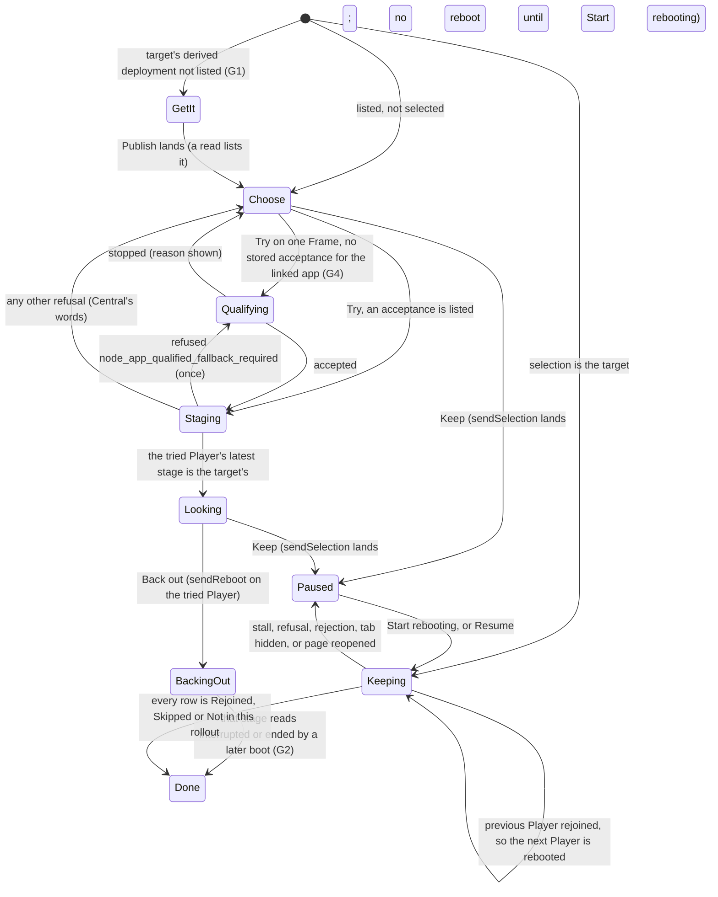
```mermaid
stateDiagram-v2
  [*] --> GetIt: target's derived deployment not listed (G1)
  [*] --> Choose: listed, not selected
  [*] --> Keeping: selection is the target
  GetIt --> Choose: Publish lands (a read lists it)
  Choose --> Qualifying: Try on one Frame, no stored acceptance for the linked app (G4)
  Choose --> Staging: Try, an acceptance is listed
  Qualifying --> Staging: accepted
  Qualifying --> Choose: stopped (reason shown)
  Staging --> Qualifying: refused node_app_qualified_fallback_required (once)
  Staging --> Choose: any other refusal (Central's words)
  Staging --> Looking: the tried Player's latest stage is the target's
  Looking --> BackingOut: Back out (sendReboot on the tried Player)
  BackingOut --> Done: that stage reads interrupted or ended by a later boot (G2)
  Choose --> Paused: Keep (sendSelection lands; no reboot until Start rebooting)
  Looking --> Paused: Keep (sendSelection lands; no reboot until Start rebooting)
  Keeping --> Keeping: previous Player rejoined, so the next Player is rebooted
  Keeping --> Paused: stall, refusal, rejection, tab hidden, or page reopened
  Paused --> Keeping: Start rebooting, or Resume
  Keeping --> Done: every row is Rejoined, Skipped or Not in this rollout
```

**Step derivation** (pure `journeyStep(reads, choices, held)`; only Qualifying, the held stage, the Back out press, whether rolling runs, and the frozen rollout (below) live in page memory):

| Step | Derived when (newest reads) | Page shows | Truth kinds |
|---|---|---|---|
| Get it | the derived deployment id is not listed (G1) | the release (tag, base, app), Publish with its dialog words (§26) | `reported` (catalog), `set` |
| Choose | listed and not selected | "Try it on one Frame (optional)" with a picker of bound Players and their Frames, and "Keep: put it on every Player". Try is withdrawn, with the reason, when the target's base differs from the release the selection carries ("This release changes the base, so it cannot be tried live; Keep reboots each Player onto it"). That pre-check is a hint only; Central judges at send | `set` |
| Qualifying | tried Player chosen and this page is sampling | the requirement ("one steady photo or looping video on every Output of this Player for 30 s"), a link to Show now for its Frames, and the sampler's progress and stop words (§27) | `derived` (Central's sample answers) |
| Staging | the tried Player's latest operation is not a stage of the target, or it is Staged or Switching | Stage inline with the target fixed (the Player page's dialog lists deployments for choice), with the dialog words including the bound rule (§25); then the operation state | `set`, `reported` (App Effect Broker) |
| Looking | the tried Player's latest stage is the target's and is `target_running`, `fallback_running` or `effect_unknown`. The app-attempts read serves no deployment per operation, so a stage is "the target's" when this page holds it (operation id), or when it reads `target_running` while the linked app (G4) is the target's. After a reload, a target stage that is staged, switching, `fallback_running` or `effect_unknown` therefore shows as Staging, offering a newer stage with its "replaces" words (stated cost, §31) | per bound Frame: its Runs and Output state from the snapshot; the operation state. On `fallback_running`: "The new app did not start; the Player fell back on its own. Back out is recommended." Keep stays offered | `reported` (readiness, broker) |
| Keeping | the selection is the target (G1) | the selection fact, the fleet-wide sentence (below), and one row per planned Player (next table) | `set` + per row |
| Backing out | the tried Player is chosen, the selection is not the target, and Back out was pressed | the reboot's command state (§10), then the Player's new boot | `set`, `claimed` |
| Done | Keeping with nothing pending (never before the snapshot the plan comes from is read: until then the step is reading), or Backing out completed | a summary of the rows; "Undo" starts a new journey for the previous deployment, with no Try | `derived` |

**Keep, per Player.** The plan is the Players this console knows: not retired and enrolled with a device. The tried Player goes first: it runs the target only as a Stage on its current boot, which is never the selection, so it reads Waiting and its reboot proves the target's boot path on this hardware before any other Player. The others follow by name. The operator may skip any Player before its reboot is sent: Choose lists the named plan (name and Frames) with Skip or Include, and the Keep confirmation names the Players it will reboot, in order, and the skipped ones. Select lands in Paused showing the plan; no reboot is sent until the operator presses **Start rebooting**. The Keep confirmation leads with Select's own confirmation words (`selectionConfirmation`, the one home of R17's contents, scope and no-app lines, shared with Releases' Select dialog), then the page's lines. The page says: "These are the Players this console knows. Select is fleet-wide: any other Pi that boots by node path is offered deployment X at its next boot." (R17.)

**The frozen rollout.** The Players a confirmation names are frozen in page memory, in order (`freezeRollout`), and rolling reboots only those. A Player that appears in the live plan afterwards (enrolled after the confirmation) reads **Not in this rollout** and is never rebooted; a Player skipped after the freeze reads Skipped. A reload forgets the frozen list, so Resume without one (a reload, or a target selected elsewhere) first opens a confirmation naming the Players it will reboot, in order. No reboot is ever sent to a Player no confirmation named.

| Row state | Derived from | Kind |
|---|---|---|
| On the selection | Built without G7 (§31): a Player **this page rebooted** after Select is on the selection once its Host Management session is on a later kernel boot id than the frozen reboot request's (two identities, no clocks). A Player this page did not reboot is on it when no Stage ran on its current boot (its latest app operation is absent or ended by a later boot) and its linked app (G4) is the target's app **and that app identifies the target**: no other listed deployment and no other catalog release pairs the same app environment with a different base (`appIdentifiesTarget(read, target)`, pure, on the release read; reload-safe). With G7, the row would compare each boot claim's offered `policy_revision` with the selection's revision instead | `claimed` boot (+ `reported` linked app; `derived`) |
| Waiting | not on the selection, and no reboot sent by this rollout. When the linked app cannot identify the target (a target with no app, or one whose app another listed deployment or release carries on a different base, as in a base-only release), its rows read "Waiting · unknown whether it booted the selection (<a release with no app \| another release carries the same app> cannot be recognised by its app); this page reboots it to make sure" | `set` |
| Rebooting | a reboot this page holds, or one Central lists as outstanding; labels per `rebootCommandState` | `set`, `reported` |
| Rejoining | on the selection, but not yet Rejoined: the linked app (G4) is not the target's app (when the target has one); or, for a Player this page rebooted, the snapshot does not yet list the Player app's enrollment on the new boot (its `authority_epoch` is not greater than the epoch in the snapshot the reboot was sent on, `playerEpoch`: Central's counter, never a clock); or a bound Output's Frame is not live (`frameHealth`) | `derived` (Evidence fact) |
| Rejoined | on the selection, the linked app equals the target's app (or the target has no app), the snapshot is fresh as above, every bound Output's Frame is live, and Central serves no current readiness failure (`readinessDiagnostics`) for any bound Frame. `outputStates` is binding standing, not readiness, and is used only to list the bound Frames | `derived` over the `claimed` boot and `reported` liveness: each on-the-selection and Not rejoined row shows an Evidence fact naming its basis (a later kernel boot than this page's reboot, or a linked app that identifies the target) and saying it is not proof the Output shows its assignment (Central serves no per-Output playback commitment) |
| Not rejoined | On the selection with a fresh snapshot and a current readiness failure on a bound Frame (rolling pauses with that failure's recovery words); or Rebooting or Rejoining for 10 min of the page's **own** monotonic time (never compared with Central's or the Player's clock), counted from this page's reboot, or, for a row it did not reboot that runs the target's app but never reports ready, from when rolling began (else that row would hold the rollout silently) | `derived` |
| Not in this rollout | a rollout is frozen and no confirmation named this Player | none |
| Cannot reboot | `rebootTarget` unavailable (no current Host Management session, gate closed, …): its reason | `set` |
| Skipped | the operator chose it | none |

**Rolling rule.** This page sends at most one reboot at a time (per page, not per fleet: Central does not enforce it, see §31). The next Player's `sendReboot` is called only when every earlier row is Rejoined, Skipped or Not in this rollout. A Rejected reboot, an Outcome unknown, a Not rejoined row or any refusal pauses the rollout on that row, offering **Retry**, **Skip** or **Stop**. Retry forgets this page's sent record for the row and resumes, so the row re-derives (a Not-rejoined retry needs a new command id; Central's served `outstanding` still blocks a duplicate); Skip on the paused row resumes. Rolling advances only while the tab is visible: a hidden tab pauses it, and Resume is needed. Reads while Keeping: the device read and the app-attempts read of each planned Player every 15 s (5 s for the active row; `useNodeDevice` always reads both, kept as one node-read hook), the snapshot, the release read and the shell's gate. Each poll is two holds of the global fleet lock (the device read and the app-attempts read, §29; the latter also takes `players` and `player_control_sessions` FOR SHARE inside that hold), so twelve Players cost about 1.6 holds a second, only while the page is visible.

**Closed mid-rollout.** Nothing in Central records the rollout. Closing the page stops new reboots. A reboot already sent still runs: Central offers it for its 30 s window. On reopen, the page re-derives every row from the reads. A held request is forgotten; Central's served `outstanding` still blocks a duplicate. The page **never** resumes on its own; it shows "Paused · n of m Players on the selection" with **Resume**. Paused is worded honestly: "Paused means this page sends no more reboots. Select is fleet-wide: any Player that restarts for any reason, a power cut included, is offered deployment X at that boot."

**Failures and refusals** (each in its verb's own words, §26; unlisted codes fail closed):
- **Effect gate closed:** Try and Keep's reboots are unavailable, with the gate's words and a link. Keep then offers Select alone: "Each Player is offered it at its next boot; this page cannot reboot them while the gate is closed."
- **Stage refused:** only a Central refusal leaves Staging. Each branch keys on Central's served **code**, which every outcome carries (`releaseResult` returns `{outcome, message, code}`), never on the rendered words. A base mismatch (`node_app_target_base_mismatch`) withdraws Try for this target. A missing qualified fallback (`node_app_qualified_fallback_required`) goes to Qualifying once. Anything else returns to Choose with Central's words. A send-rule refusal before any request (stale fences, a held stage) stays on Staging with its words.
- **Confirmation:** Keep and Publish confirm; Back out sends at once ("Back out: reboot <name>").
- **Qualification stopped:** back to Choose, with the stop reason.
- **Select 409:** the step is re-derived from the next read, which can land on Choose (another selection won) or Keeping.
- **Publish:** unknown or held, exactly as on Releases (§27).

**Interface sketch** (`updateWall.js`, NU1; pure): `journeyTarget(read, tag)` and `tryWithdrawn(read, target)`; `journeyStep(reads, choices, held) -> Step`, also returning `paused` and `done: kept | backed_out`; `keepPlan(snapshot, bootFacts, triedPlayerId) -> PlanEntry[]` (names need boot facts); `freezeRollout(plan, skipped) -> PlanEntry[]` (frozen) and `rolloutMembers(plan, frozen, skipped) -> {entry, member: planned | skipped | outside}[]`; `playerEpoch(snapshot, playerId) -> number | null`; `keepRow({node, snapshot, playerId, target, gate, sent, waitedMs, skipped, outside}) -> RowState` (the gate decides Cannot reboot; `sent` carries the frozen reboot, the page's monotonic send time and the Player's epoch in the snapshot it was sent on); `appIdentifiesTarget(read, target) -> boolean` (carried on the target as `appIdentifies`); `stageFollowUp(outcome, refusals) -> stay | held | qualify | withdraw | choose` (keyed on the outcome's `code`); `nextReboot(rows) -> PlayerId | null` (null unless every earlier row is Rejoined, Skipped or Not in this rollout); `keepPause(rows)` and `keepCount(rows)` ("n of m Players on the selection"). `UpdateWallPage.jsx` mounts the hooks and calls the existing send functions; for qualification it reuses the Player page's `QualifiedFallback` component, for the bound rule `StageApp.jsx` `BoundRule`, and for Keep's confirmation `releases.js` `selectionConfirmation`. Back out holds itself in flight from the first click (a ref set before the await) like every other send on the page.

## 26. Wording and truth kinds

Every line below is a `fact()` (rule 2) rendered through `FactLine`, except plain statements and the banner.

| Fact | Kind | Wording |
|---|---|---|
| Release in the catalog | `reported`, first (source: GitHub releases, via the media worker) | "GitHub releases reported release v0.15.0 (rev 1a2b3c4) · first received 3 d ago" |
| Release bytes verified | `set` | "Bytes verified by Central at publish · recorded 2 d ago · not proof a Player holds them" |
| Release contents | `set` (manifest) | "Base v0.15.0 · app 9f8e7d…" / "Base v0.15.0 · no app" |
| Deployment | `set` | "Deployment 7c41… published · recorded 2 d ago · base v0.15.0 · app 9f8e7d… \| no app" |
| Deployment's release | `derived` | "Published from release v0.15.0 (console's inference: the deployment id is the one this console derives from that release, and its contents match)". Absent for any other id, or when the derived id is listed with other contents (hand-published under that id: Publish then shows Central's `node_deployment_identity_conflict` words). |
| Boot selection | `set` | "Selected for every boot from now on: deployment 7c41… (revision 5) · recorded 1 h ago" |
| No selection | `set` | "No boot selection · Central refuses every boot" |
| Select scope (dialog) | plain statement | "Every Player that boots by node path from now on is offered this deployment, including Players Central has not seen. Central cannot list which Players will boot. A Pi whose kernel command line lacks `photowall.node=v2` is misconfigured and is not offered it." |
| No-app consequence (dialog) | plain statement | "This deployment has no app: every boot from now on is offered no app." (Central's offer, not a prediction of what the Frames show.) |
| Publish permanence (dialog) | plain statement | "Permanent: Central cannot remove a deployment. If no deployment on base v0.15.0 exists yet, this also fixes that base's App Manager pins, and a later release with different App Manager pins on the same base can never be published." |
| Publish in flight (dialog) | plain statement | "Central is downloading and verifying 1.2 GB from GitHub releases. Keep this page open." |
| Check GitHub releases now (result) | plain statement | "Central queued a check of GitHub releases; new releases appear here when the media worker records them." (202 `polling` is a queued job, never "found".) |
| Effect gate, closed | `set` | "Effect gate closed · Central's reason: <reason words> · recorded <Central's timestamp>". Reason words: `never_certified` "no deployment certification has opened it"; `deployment_changed` "the deployment changed"; an expired certification (state `open`, effective `closed`) "its certification expired"; any other code shown as its words. No age: node status serves no `read_at`, so the timestamp is displayed, never subtracted from a browser clock (R10). |
| Effect gate, open | `set` | "Effect gate open · certified by the deployment · generation N · Central re-checks its serving evidence on every Reboot and Stage" |
| Node control off | banner | §25 banner text |
| Deprecated boot path | `set` (Central's boot record) | Label "Booted by the deprecated path"; fact "Central's newest boot record for this box is a deprecated boot offer \| a base image served without an offer · recorded <age>" (Central's read time minus its record time); suffix "its kernel command line lacks `photowall.node=v2`; Select and Stage do not reach it". This is the one wording, used on the Player page (§25). Worded so that no scanned string is needed; no exemption |
| Linked app environment | `reported`, first (source: Player app, via its app link) | "Player app linked environment 9f8e7d… · first received 2 h ago" |
| Stored acceptance | `set` | "Qualified on this Player: app 9f8e7d… on base v0.15.0 (or "on a base other than the one this boot runs") · recorded 2 d ago · physical pixels unknown · Stage checks it against the current Outputs and base when you send" |
| Stage refusal | `set` (Central's answer) | Central's code in the words below, as the send's result; nothing is recorded on a refusal |
| Stage ended by a later boot | `derived` | "Ended by a later boot (Central's inference: a later boot was admitted; Central offers each boot the boot selection)" |
| Qualification progress | `derived` | "Observing representative media: 12 s of 30 sustained (Central's inference: 6 samples, each from new reports)" |

**Refusal words.** The console keys on the error **code**, never the HTTP status: `publish_release` re-maps every `ValueError`, including `NodeControlError`, to 422 (`node_routes.py:187-190`), and `invoke` maps every gate and principal error to 503 (`node_routes.py:96-104`). **Default: any code not listed reads "Central refused: <code>" and is `refused`** (no automatic re-send, no further sample). `node_control_disabled` is deliberately unlisted: it takes the default, and the shell's banner explains it. **Each verb has its own table** (`SELECT_CODES`, `PUBLISH_CODES`, `CHECK_CODES`, the last empty, and the Stage table in `stage.js`): one table across verbs would word a Publish code served to Select (an origin reason would read "unknown"). `releaseResult(result, done, codes)` takes the verb's table and returns `{outcome, message, code}`: `code` is Central's served code (null on success or a lost answer), so a caller that branches on a refusal keys on the code, never on its words.

| Code | Verb | Wording | Outcome |
|---|---|---|---|
| `node_boot_policy_conflict` | Select | "The boot selection changed meanwhile; review it" | changed |
| `node_deployment_unknown` | Select | "Central has no such deployment" | refused |
| `invalid_node_boot_selection` | Select | "Central could not read this request" | refused |
| `node_release_unknown` | Publish | "Central no longer lists this release" | refused |
| `node_release_app_unconfigured` | Publish | "This release has no app" (never offered) | refused |
| `node_release_app_selection_invalid`, `node_release_publication_invalid` | Publish | "Central could not read this request" | refused |
| `node_release_locator_mismatch` | Publish | "This release's asset locations disagree with its manifest" | refused |
| `node_release_verification_storage_unavailable` | Publish | "Central lacks scratch space to verify this release (another publish may be running)" | refused |
| `node_base_release_provenance_unavailable`, `node_environment_release_provenance_unavailable` | Publish | "Central cannot match this release's bytes to its catalog" | refused |
| `node_base_manager_pins_immutable` | Publish | "This base already has different App Manager pins; this release can never be published" | refused |
| `node_deployment_identity_conflict` | Publish | "A different deployment already uses this release's id (published by hand)" | refused |
| `node_environment_identity_conflict` | Publish | "Central already describes this app environment differently" | refused |
| origin unavailable: `origin_unreachable`, `origin_error`, `rate_limited`, `manifest_unavailable`, `download_truncated`, `download_corrupt` | Publish | "GitHub releases did not answer; send again" | unknown |
| origin rejected: `download_not_found`, `download_encoding`, `download_too_large`, `download_rejected`, `list_invalid`, `node_release_invalid` | Publish | "GitHub releases refused the download: <reason>" | refused |

Central serves the origin's reason string as the code (`publish_release`), so the console lists the reasons of `central/origins/github.py` by name rather than by exception class. A new origin reason takes the default (refused) until this list follows `github.py`.

Stage codes (`bound_switch_policy_unselected` is deleted by G6 and so is not listed; if it is ever served it takes the default): `node_app_current_process_unlinked` "The Player app has not linked its current process on this boot"; `node_app_target_base_mismatch` "This deployment's base differs from the base this Player booted, or it has no app"; `node_app_qualified_fallback_required` "No qualified fallback for this Player's current Outputs and base: qualify the running app first"; `node_app_existing_drain` "An equipment drain is active on this Player"; `node_app_operator_target_changed`, `node_session_unavailable`, `node_session_superseded` "App Effect Broker's session changed; close and reopen" (changed); `node_deployment_unknown` "Central has no such deployment"; `node_environment_unknown` "Central does not know this app environment"; `node_app_operation_identity_conflict` "This request id was already used for another stage" (refused); `rollout_gate_closed` "Effect gate closed: <reason words> (see Releases › Effect gate)" (refused; Central's answer carries no reason, so the words come from the shell's gate through `effectGateReason`, and while the shell still reads the gate open it reads "Effect gate closed: its reason is not readable here (see Releases › Effect gate)"); **every other `rollout_*` code** (for example `rollout_serving_verifier_unavailable`, `rollout_measured_evidence_expired`, `rollout_serving_scope_mismatch`, `rollout_gate.py:215-251`, which can fire while the gate row reads open) "Central refused the effect: <code>" (refused), so Releases and the Stage result never state opposite gate facts. Each is refused unless marked. Unworded and so on the default: `node_app_stage_invalid` (the route's 422 for a body it cannot parse), `node_control_disabled` and the deleted `bound_switch_policy_unselected`.

## 27. Lifecycles

**Node control** (shell) is a read, not a mode. `unread → on | off`, re-judged on every read; `off → on` removes the banner and the next page render mounts the node hooks. `transport_enabled` is fixed when Central starts (`node_routes.py:121`), so a change means Central restarted into another composition. The console never infers `off` from a page-level refusal.

**Boot selection** is one compare-and-set Central already enforces (`node_boot.py:166-182`). The console's part is the R13 send rule.

```mermaid
sequenceDiagram
  participant D as Select dialog (frozen at open)
  participant S as sendSelection
  participant H as releases.latest()
  participant C as Central PUT /boot-policy
  D->>S: request {deployment_id, expected_revision = read.selection.revision}
  S->>H: newest read at call time
  alt newest read: revision ≠ expected, deployment unlisted, or already selected
    S-->>D: "The boot selection changed meanwhile; review it" (no PUT)
  else
    S->>C: PUT (CAS on expected_revision; 0 when nothing is selected)
    C-->>S: {revision: N+1} | 409 node_boot_policy_conflict | lost
    S-->>D: done | changed | unknown → the next read decides: selected at N+1 = done
  end
```

"The next read decides" means a read **started** after the answer: `usePolledRead.refresh()` returns at once while a read is in flight (it queues), so `useReleaseRead` numbers reads by start (`startedReads()`) and the first read numbered past the count taken at the answer settles it. The page's read line is a status region named "Release read" carrying `aria-busy` while a read is in flight; busy clears only once that read is committed, so a send after it clears judges that read. A send made while a read is unsettled judges the previous read, and Central's `expected_revision` 409 is its fence (it reads "changed") (errata FX4-1). A read that shows the revision unchanged reads "changed", per the diagram, although nothing changed in that case (distinct words, "Central did not record it; review it", are a possible refinement).

**Publish** converges only at Central's final insert (`node_boot.py:101-106`), after the full download-and-hash of every asset (`node_release_catalog.py:57-66`). The console holds its own request and never starts a second download from the same page.

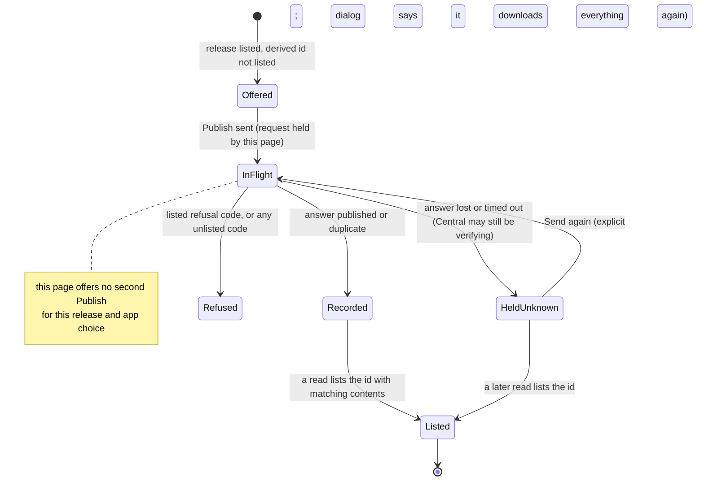
```mermaid
stateDiagram-v2
  [*] --> Offered: release listed, derived id not listed
  Offered --> InFlight: Publish sent (request held by this page)
  InFlight --> Recorded: answer published or duplicate
  Recorded --> Listed: a read lists the id with matching contents
  InFlight --> HeldUnknown: answer lost or timed out (Central may still be verifying)
  HeldUnknown --> Listed: a later read lists the id
  HeldUnknown --> InFlight: Send again (explicit; dialog says it downloads everything again)
  InFlight --> Refused: listed refusal code, or any unlisted code
  Listed --> [*]
  note right of InFlight
    this page offers no second Publish
    for this release and app choice
  end note
```

Recorded is its own held state ("Published; the next read lists its deployment"): calling it in flight would be untrue, and offering Publish again would break the one-POST hold. Send again re-sends only the frozen body this page holds (`HeldPublishes.frozen(id)`, matched by identity, because the body's `operator_audit_ref` is dated from the read the dialog opened on), only while it is held unknown and the newest read still lists the release. A release whose derived id is already listed with another document (hand-published under that id) is `blocked` before any POST, with Central's identity-conflict words, and shows no "Published from".

The hold is per page. A second page or tab can start a second full download; Central still converges on one deployment at the insert, and the two downloads race on unreserved scratch space (`node_release_catalog.py:62`), so the second may be refused with `node_release_verification_storage_unavailable`. A stated cost (§31).

**Stage.** States are computed by Central (`node_lifecycle.py:291-322`) and render through §10's `appOperationState`. Central's model is **latest wins**: "A stage row is desired state and the latest stage for a device wins" (`node_lifecycle.py:3-4`). This design keeps it and adds one console send rule: no send while the latest operation is `switching` (below).

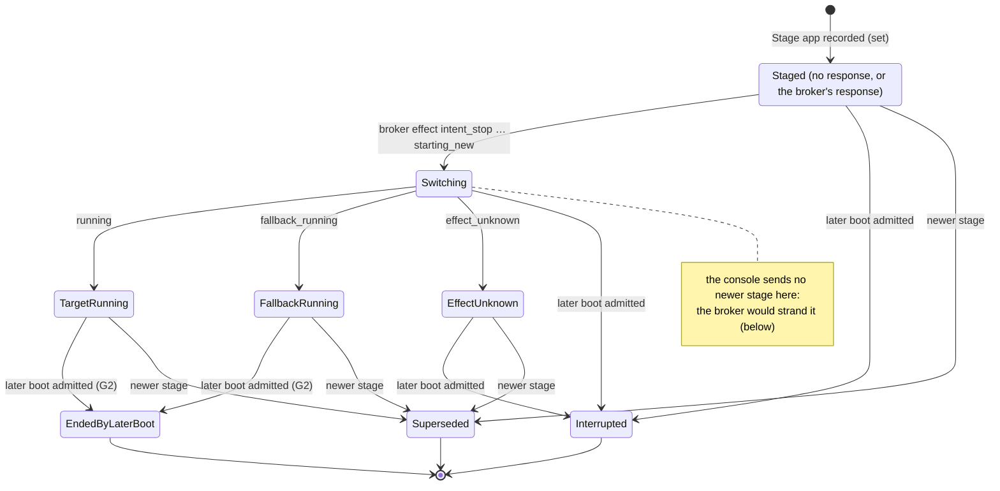
```mermaid
stateDiagram-v2
  [*] --> Staged: Stage app recorded (set)
  state "Staged (no response, or the broker's response)" as Staged
  Staged --> Switching: broker effect intent_stop … starting_new
  Switching --> TargetRunning: running
  Switching --> FallbackRunning: fallback_running
  Switching --> EffectUnknown: effect_unknown
  Staged --> Interrupted: later boot admitted
  Switching --> Interrupted: later boot admitted
  EffectUnknown --> Interrupted: later boot admitted
  TargetRunning --> EndedByLaterBoot: later boot admitted (G2)
  FallbackRunning --> EndedByLaterBoot: later boot admitted (G2)
  Staged --> Superseded: newer stage
  EffectUnknown --> Superseded: newer stage
  TargetRunning --> Superseded: newer stage
  FallbackRunning --> Superseded: newer stage
  Interrupted --> [*]
  EndedByLaterBoot --> [*]
  Superseded --> [*]
  note right of Switching
    the console sends no newer stage here:
    the broker would strand it (below)
  end note
```

(`Switching → Superseded` is still rendered if Central serves it, for example from a second console or a hand POST; R15. The console does not cause it.)

There is no Rejected state. Central's response route accepts `rejected` (`node_lifecycle.py:285`), but the App Effect Broker never sends one for a stage: its local refusals raise `ValueError` with no response (`online_broker.py:56`, `63`, `75`, `90`, `93`, called from `online_runner.py:47` and `:64`). A response the broker does send renders as R0's second Evidence fact.

**Why a stage sent mid-switch is refused by the console.** `stage()` freezes the old process and app epoch from the link at send time (`node_lifecycle.py:153-155`). The broker accepts a newer stage only in `preparing`, `running` or `fallback_running` (`online_broker.py:37`, `:74-76`) and only while the frozen old process is the one running (`online_broker.py:58-63`). A switch replaces the running process by definition, so a stage sent during it is refused on every later poll and strands, while the switch actually running reads Superseded. The send rule refuses it before a request: "A switch is in progress; wait for it to finish." Once the switch reaches `running`, `fallback_running` or `effect_unknown`, a newer stage freezes the new process and is fetchable (`effect_unknown` still strands it until a reboot, below).

**Other stranded cases, shown truthfully rather than fenced.** The latest stage is what the broker fetches; a newer stage is how these recover.

| Stranded case | Cause in code | What the console shows | Recovery |
|---|---|---|---|
| Staged, no response, ever | The gate closed and reopened since staging: the reopen bumps the generation (`rollout_gate.py:344`), and `desired(effects=True)` requires the operation's own generation (`node_lifecycle.py:188-192`, `rollout_gate.py:236-238`). The verifier closes the gate before every serving-set change (`rollout_gate.py:7`), so every certified redeploy does this. | "Staged · App Effect Broker has not responded" (state label + Evidence) | A newer stage, at the current generation |
| Staged, no response | The broker refused locally: old process changed since the send, prior unresolved, root unverified, low memory (`online_broker.py:56-93`) | same | A newer stage, which freezes the process running now |
| Staged with accepted, stuck in `preparing` | A root fails verification (`online_broker.py:85-90`) | "Staged · App Effect Broker accepted it" with no effect | A newer stage: the broker replaces `preparing` on purpose (`online_broker.py:34-37`) |
| Effect unknown | The broker accepts no new stage this boot (`online_broker.py:37`) | "Effect unknown · App Effect Broker accepts no new stage on this boot; reboot the Player to resolve it" | Reboot (a later boot marks it Interrupted) |

When the latest operation is Staged, the Stage dialog says what sending does: "Sends a newer stage. It replaces stage <handle>, which App Effect Broker <has not responded to | accepted>." The console never calls a replacement a retry.

**A lost Stage answer.** `HeldStages` holds `in_flight | recorded | unknown`, like Publish's hold, until a read lists the operation. A byte-identical resend is offered only while the held request is **not** listed by the app-attempts read; once a read lists it, the console refuses any resend ("Central already recorded this stage"), because the read is the authority and a resend would only return `duplicate`.

**Qualification** is driven by this page's samples (current choice below). Central judges every sample (`node_acceptance.py:94-227`): 30 s sustained, no gap over 5 s on Central's clock, the same media assignments, process and bindings throughout, and witnesses that advance. It needs no effect gate.

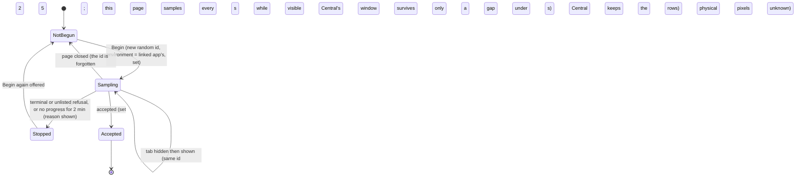
```mermaid
stateDiagram-v2
  [*] --> NotBegun
  NotBegun --> Sampling: Begin (new random id, environment = linked app's, set); this page samples every 2 s while visible
  Sampling --> Sampling: observing n s / awaiting new witnesses / waiting: <transient reason>
  Sampling --> Sampling: tab hidden then shown (same id; Central's window survives only a gap under 5 s)
  Sampling --> Stopped: terminal or unlisted refusal, or no progress for 2 min (reason shown)
  Sampling --> NotBegun: page closed (the id is forgotten; Central keeps the rows)
  Stopped --> NotBegun: Begin again offered
  Sampling --> Accepted: accepted (set; physical pixels unknown)
  Accepted --> [*]
```

| Sample answer | Class | Wording |
|---|---|---|
| `observing` with `sustained_seconds` | progress | "Observing representative media: n s of 30 sustained" |
| `awaiting_new_witnesses` | waiting | "Waiting for new reports from the Player app and Display Host" |
| `accepted` | done | "Qualified · physical pixels unknown" |
| `node_qualification_control_stale`, `_control_unlinked`, `_readiness_stale`, `_readiness_unavailable`, `_plan_changed`, `_handoff_unavailable`, `_preview_active`, `_base_unavailable`, `node_output_cohort_unavailable`, `node_representative_media_evidence_required`, `node_representative_single_media_required`, `node_representative_frame_witness_mismatch` | waiting (keep sampling) | One named sentence each, for example "Waiting: every bound Output must keep showing the same photo or video at full opacity for 30 s" |
| transport failure (no answer) | waiting | "Waiting: Central did not answer this sample" |
| `node_qualification_unknown`, `_generation_changed`, `_base_abi_mismatch`, `node_qualification_process_changed`, `node_player_unavailable`, `node_device_unavailable`, `node_control_disabled`, and **any unlisted code** | terminal (stop) | "Stopped: <reason>. Begin again when the Player app and its Outputs are steady." (`process_changed`: "the Player app's linked process changed or unlinked", `node_acceptance.py:115-117`.) |
| **No progress for 2 min** (no `observing` answer whose `sustained_seconds` grew) | terminal (stop) | "Stopped: no progress for 2 minutes. Last answer: <its words>." A slideshow that changes media within 30 s, or an uncalibrated bound Frame, never progresses (`node_acceptance.py:212-217`), and this is how the operator learns it. The page's monotonic clock starts at the first sample, sent at once, so 60 waiting answers 2 s apart cover 118 s and the 61st (at 120 s) stops it. A hidden tab samples nothing, and its pause counts at most 5 s towards the limit (Central's own window restarts after a 5 s gap anyway), so time spent away never stops sampling. |

**Who drives samples** (current choice; Q7's recommendation, taken under the steer). **This page samples** through the existing `POST …/app-qualifications/{id}/sample`, every 2 s while visible, until accepted, terminal or 2 min without progress. No backend write. Costs: the operator keeps the page open and visible for at least 30 s; two pages sample twice (safe: samples must advance); each sample takes the Runtime locks and the global fleet lock (`node_acceptance.py:98-103`, `node_sessions.py:92-93`) for about 15 queries, so it briefly serialises with every boot offer, Publish and Select; abandoned qualification rows accumulate and nothing samples them. Alternative: **Central samples** from a declarative "qualification open" record in a worker job; sampling survives page close, at the cost of a new job kind, a lease and a stop rule, roughly +300 backend lines.

## 28. Send rules and interface sketch

**One send rule per verb (R13).** Each send function judges its rule on the hook's newest read **at the moment of sending**, refuses without a request when the rule fails, is the only console caller of its route (source-scan test, as R0's `sendReboot`), and maps any unlisted code to refused. Central is the authority for every verb.

| Verb | Identity (frozen at open) | Sends when the newest reads show | Central's own fence |
|---|---|---|---|
| Select | `{deployment_id, expected_revision}` (revision always served; 0 with no selection) | revision equals `expected_revision`; deployment listed; not already selected | revision CAS (`node_boot.py:172-175`) |
| Publish | `deployment_id` **derived from content**: the release's `manifest_sha256` laid out as a UUIDv8, with one bit for "with app". No hashing in the browser, so it works on plain-http LAN consoles. Stable because catalog rows are insert-only (`infra/catalog_records.py:293-295`). | the derived id is not listed, and this page holds no in-flight or unknown request for it (except an explicit Send again) | same id + same document → `duplicate` (`node_boot.py:101-106`) |
| Check GitHub releases now | none (idempotent: merged with a pending tick, `app.py:664-666`) | this page holds no unanswered check | Central merges duplicate jobs |
| Stage | `{operation_id, command_id}` minted and `operator_audit_ref` (`console/<date>`) fixed at dialog open, so a resend is byte-identical (the request hash covers all of them, `node_lifecycle.py:111-113`); `{session_id, device_generation}` from the device read (the one current session with scope `app_effect`, `node_observations.py:73-78`, `:123`); `rollout_generation` from the shell's gate; `deployment_id` chosen | gate effectively open at the same generation; the same session still current; same device generation; not retired; latest operation not `switching`; this page holds no unanswered stage request | Central's stage rules under its gate-first locks; request hash; latest wins (`node_lifecycle.py:111-160`) |
| Begin qualification | `{qualification_id (random), environment_sha256 = linked app's, audit}` | Player bound (a snapshot fact, so `sendBegin` takes `{node, snapshot, playerId}`); linked environment served and unchanged since the request was built; this page is not already sampling for it | identity check (`node_acceptance.py:81-84`) |
| Sample | qualification id held in memory | this page began it; tab visible; last answer not terminal; progress within 2 min | Central judges each sample |

The journey (§25a) adds **no verb**: it calls the send functions above and batch 2's `sendReboot`, each judging its own rule. Its own rule is `nextReboot` (one reboot in flight; the previous row Rejoined or Skipped), judged on the newest reads before each `sendReboot` call. A source-scan test asserts that `updateWall.js` and `UpdateWallPage.jsx` contain no route string.

**Long-running Publish.** Publish downloads and hash-checks every release asset inside the request (up to 8 GiB per asset), far past `apiWrite`'s shared 15 s budget (`apiWrite.js:5`). Publish passes its own timeout (30 min) and holds its request (§27); `ConfirmAction` shows its in-flight sentence through an optional `progress`. A lost or timed-out answer is **unknown**; the next read decides. A client disconnect does **not** cancel the server-side download: NR2's probe ran the node middleware stack (`BaseHTTPMiddleware` plus the no-store middleware) on uvicorn 0.34.2 and Starlette 0.46.2 and the handler ran to completion ([implementation map](player-fleet-implementation-map.md)); it is a scratch probe, not a CI test, so an upgrade can change it. A proxy request timeout on a Gateway API route (iac `__init__.py:83`, `:318`) is not probed. Either cut turns Publish into unknown-then-retry with a full re-download; the asynchronous-publish finding (§31) is raised unconditionally for that reason.

```text
polledRead.js                                                          (NV1; NR1 reuses it)
  usePolledRead(load, {cadenceMs, skip, initial}) -> {value, busy, refresh, latest}
                                       // single flight with queued refresh, hidden-tab pause,
                                       // visibilitychange read, latest() = newest settled value;
                                       // busy: a flight is running; cleared in the same step that
                                       // commits its last value, so busy false => latest() is that
                                       // read (errata FX4-1); a skipped read is never busy;
                                       // `load` folds failures into its value, so there is no `error`;
                                       // useNodeDevice moved onto it (its merge stays its own `load`)

nodeControl.js                                                         (NV1)
  useNodeControl() -> {state: "on" | "off" | "unread", failed, gate: EffectGate | null, refresh, latest}
                                       // usePolledRead over GET /node/status, 30 s; mounted once in Shell,
                                       // provided by context; the only module that reads transport_enabled
                                       // and the only console source of the effect gate; no readAt (not served)
  nodeReadsAllowed(control) -> boolean // skip before the first answer; send after a failed status read
  effectGateReason(gate) / effectGateFact(gate) -> words / Fact   // §26 gate words, one wording
  NodeControlBanner                    // renders only for state "off"
  NodeRecords({children, quiet})       // state "off": the one "not shown" line; else children

nodeRead.js                                                            (NV1)
  NodeDevice loses `enabled`; the /node/status fetch, NODE_OFF and the
  node_control_disabled → off inference are deleted; G5's `deprecated_boot` is read from the served read
bootFacts.js                                                           (NV1)
  DeviceRow narrows to {device_id, serial}; health.js bootOutcomeLabel is deleted;
  deprecatedBootFact(deprecatedBoot, readAt) -> Fact | null   // §26 words; needs no scan exemption

releases.js                                                            (NR1, NR2)
  useReleaseRead({skip}) -> {read, readAt, busy, refresh, latest, startedReads}   // usePolledRead, 30 s;
                                       // the page's read line is role=status "Release read" with aria-busy
  releaseHome(read) -> {selection: Fact, deployments: DeploymentRow[], releases: ReleaseRow[]}
                                       // every line a Fact; "Published from" needs derived id AND equal contents
  deploymentIdFor(manifestSha256, withApp) -> string     // UUIDv8 laid out from the digest; pure
  selectionOffer(read, deploymentId) -> {offer: "select"} | {offer: "selected"} | {offer: "blocked", reason}
  selectionRequest(read, deploymentId) -> FrozenSelection | {refused}   // body, contents, noApp
  selectionConfirmation(request) -> string[]   // R17's one home: contents, SELECT_SCOPE, SELECT_NO_APP when
                                       // no app; Releases' Select and the journey's Keep both render it
  sendSelection(request, releases) -> Promise<Outcome>   // judges selectionOffer on releases.latest();
                                       // only PUT of /boot-policy (source-scan)
  useHeldPublishes() -> HeldPublishes  // in_flight | recorded | unknown, plus frozen(id) for Send again
  publishOffer(read, release, withApp, held) -> {offer: "publish"} | {offer: "published", deploymentId}
                                       | {offer: "in_flight" | "recorded" | "unknown"} | {offer: "blocked", reason}
  publishRequest(read, release, withApp, held) -> FrozenPublish | {refused}   // body, size, permanence words
  sendPublish(request, releases, held, {again}) -> Promise<Outcome>   // judges publishOffer on releases.latest();
                                       // only POST of /releases/{sha}/deployments; 30 min timeout
  sendCatalogCheck(held) -> Promise<Outcome>   // only POST of /app/releases/refresh (source-scan)  (NR2)
  releaseResult(result, done, codes) -> {outcome, message, code}   // the verb's own table; unlisted code = refused;
                                       // `code` served so callers branch on it, never on `message`
  publishConfirmation(request, again, {releases, held}) -> {title, lines, confirmLabel, progress, run}
                                       // the Publish dialog's one home; Releases and Update the wall render it
frozenRequest.js         frozen (deep freeze) and auditRef(readAt, note): shared by every frozen request

PlayerCommands.jsx       reboot gate reason via effectGateFact + link; dialog sentence + link (NV1, NR2)
apiWrite.js              optional per-call timeout (default unchanged); only sendPublish passes one (NR1)
useSendDialog.js         the guarded-modal lifecycle shared by the Reboot and Stage dialogs (NS1)

stage.js                                                               (NS1)
  stageBlocker(device, operations, gate, player) -> null | {reason, gate?: true}
                                       // served facts only (§25); the rebootTarget shape
  stageTargets(releaseRead) -> DeploymentRow[]   // deployments carrying an app; no verdicts
  stageRequest(device, gate, deploymentId, frozenIds) -> FrozenStage   // fences, ids and audit fixed at open
  useHeldStage() -> HeldStages         // in_flight | recorded | unknown until a read lists the operation
  sendStage(deviceId, request, {node, control}, held) -> Promise<StageResult>
                                       // re-judges stageBlocker and the frozen fences on node.latest()
                                       // and control.latest(); only POST of /app-stages (source-scan)
  stageResult(result, gate) -> outcome // §26 Stage codes; unlisted = refused
  STAGE_REFUSAL                        // the codes `stageFollowUp` branches on
  BOUND_RULE, BOUND_PROVEN             // §25's bound rule and its node-half caveat (remove the caveat
                                       // when a bound PID1 switch leg is green)
StageApp.jsx             BoundRule: the one rendering of BOUND_RULE with BOUND_PROVEN; the Player page's
                         Stage dialog and the journey's Try both use it, so neither shows one without the other
fleetCommands.js
  appOperationState                    // stays in its §10 home; gains ended_by_later_boot, with the
                                       // broker's earlier report kept as `prior`, as Interrupted does

qualification.js                                                       (NS2)
  qualificationView(operations) -> {linkedApp: Fact, acceptances: Fact[]}
  beginOffer(operations, snapshot, playerId, sampling) -> {offer: "begin", environmentSha256}
                                                    | {offer: "sampling"} | {offer: "blocked", reason}
  sendBegin(deviceId, request, {node, snapshot, playerId}, sampling) -> Promise<Outcome>
                                       // judges beginOffer on node.latest() and the snapshot at call time
  sampleAnswer(result) -> {kind: "progress" | "waiting" | "done" | "terminal", fact}  // §27; unlisted = terminal
  useQualificationSampler(qualificationId, {active}) -> {phase, answer, stopped}
                                       // usePolledRead's single flight; 2 s; visible only; stops on terminal,
                                       // done, or 2 min without progress; Stop = the caller passing active: false;
                                       // once accepted or stopped the load returns its state unchanged, so a
                                       // tick before React re-renders cannot POST; only POSTer of /sample
QualifiedFallback.jsx    the Player page's Qualified fallback subsection; the journey reuses it (NU1)

updateWall.js, UpdateWallPage.jsx                                      (NU1, §25a)

Deleted (NV1): V1Offers.jsx, ManagementFacts.jsx, fleetApi.js (useFleetFacts and every V1 writer)
```

**The V2 posture is held by a test, not a convention** (NV1). One source-scan test fails the build when any console module (a) names a V1-lane route: `/v1/operator/fleet`, `maintenance-requests`, `app-override`, `app-policy`, `base-baseline`, `/v1/netboot/`; (b) carries, in a string literal or JSX text (comments are not scanned), any of: "V1", "netboot base", "release frontier", "maintenance request", "node management is off" — with exactly one named exemption: `nodeControl.js` for "node management is off"; or (c) reads `transport_enabled` outside `nodeControl.js`. The `/v1/operator/` prefix itself is allowed. NV1's acceptance list is this list, verbatim (one constant both the test and the acceptance cite).

**Current choices** (revisable; recommended as shown):

| Choice | Current | Alternative and its cost |
|---|---|---|
| Who decides Stage admission | **Central, at send.** The dialog sends with Central's served fences and renders Central's code; the button is disabled only on served facts (R14). Gives: no second copy of `stage()`'s rules, no new admission logic on the effect-authority path (G6 only deletes a refusal). Costs: a base mismatch or a missing qualified fallback is learnt at send, not before (one request; a refusal writes nothing, `node_lifecycle.py:115-158`). | **A served admission read (the withdrawn G3)**: per-deployment verdicts before sending. Costs: a lock-free twin of `stage()`'s session loaders, which cannot reuse them because they take `FOR UPDATE` (refused in a read-only transaction) and raise inside the loader (`node_sessions.py:92-100`, `:259-280`); a pure verdict function shared with `stage()`; about +110/+170 raw and the high-risk tier; and on every real Central it would only ever answer "Effect gate closed" until a gate certifier exists (§31 finding). Raise it again once the gate opens in production. |
| Deprecated-path evidence | **Served by Central on the node device read (G5)**: one nullable fact, compared on Central's own clock inside Central; the console names no V1 route or field | The console reads the V1 records itself (`/v1/operator/netboot` V1 fields plus the fleet offer list): a V1 route and its fields back in the console under a scan exemption, and a cross-record time comparison in the browser |
| Deployment identity | Derived from the release digest and app choice: a retry or a second page cannot make twin deployments from the console | Random per dialog: every retry after a lost answer makes another identical deployment, and Select must choose between twins. Cost of the current choice: a deployment hand-published under another id is not recognised as "published from" its release, and publishing that release from the console creates a second deployment with an identical document (allowed: `node_boot.py:99-139` dedupes by id only); one hand-published under the derived id with another document blocks console Publish of that release (Central's identity conflict, shown in its words) |
| Release read cadence | 30 s while visible, plus on focus and after each write; no lock | 10 s: three times the queries for records that change only on operator writes or worker discovery; races are caught by Select's CAS anyway |
| Node control off | One shell banner; node hooks skipped; one "not shown" line per node page | Per-section Unknowns (batch 2): the misconfiguration reads as a normal mode in a dozen places (R20) |
| Home and source of the effect gate | Fleet › Releases; one source, the shell's node-status read (30 s, refreshed when a Reboot or Stage dialog opens) | Each page fetches status itself (today's `useNodeDevice`, 5 s): two readings of one fact on one page that can disagree. Cost of the current choice: the gate shown on a Player page can be up to 30 s old outside dialogs; Central re-checks on every send |
| `bootFacts` module name | Kept; its type narrows to identity, plus the deprecated-boot fact | Rename to a domain name: about 30 call sites of churn, no behaviour change |
| Qualification identity | Random per Begin, held in memory; a closed page begins again | Resume through a served list of open qualifications: Central restarts the window after any 5 s gap (`node_acceptance.py:212-217`), so it saves one row and costs a served list and two extra states |
| How Keep knows a Player booted on the selection | **Without G7 (as built; owner's open choice, §31)**: a Player this page rebooted after Select is on the selection when its Host Management session is on a later kernel boot id than the frozen request's (two identities, no clocks); one this page did not reboot, when its linked app (G4) is the target's and no other listed deployment or release carries that app on a different base. Cost: when the app cannot identify the target (no app, or a base-only release), rows this page did not reboot read "unknown whether it booted the selection" and are rebooted to make sure, so a reload mid-rollout reboots again the Players this page already rebooted; a twin older than the read's windows (50 deployments, 100 releases) is missed; a Player running a Stage on its current boot reads Waiting and is rebooted (no Stage is the selection) | **With G7**: each boot claim on the device read serves the `policy_revision` its stored offer carried; the row compares it to the selection's revision (two Central sequence numbers). Read-only, no state, no verb. Cost: a backend change the owner did not ask for ("no new Central feature"), +10 / +30 |
| Raw `POST /node/deployments` | Not in the console | A JSON editor: an unreviewable form for references the release already carries |
| Legacy calibration preview ("Save without acknowledgment", Frames whose Player was never admitted by node path, `registry.py:712-727`) | Kept until the V1 follow-up makes every Player node-admitted; the Compose demo and software e2e calibrate through it today | Delete now: calibration stops working on every Compose Player (the default `compose.yaml` runs `central.app`) |
| V1 backend routes | Not removed in this PR; inventoried for the follow-up (§31) | Remove the four console-only writers (`app-policy`, `app-override` ×2, `base-baseline`, `fleet/routes.py:105-124`) now: about −25 lines, but the V1 offer path still reads that policy and its service methods have 38 test call sites (`tests/test_fleet_database.py`), a half-removed lane the follow-up must reason about |

## 29. Backend gates

Each addition sits behind the existing `admin` dependency and `require_enabled`, and lands as the first commit of the bead that shows it. Read additions are additive fields. No V1 backend code changes in this PR (G5 reads two V1 tables; it writes nothing and is removed with them).

| Gate | Bead | Concept the console cannot show honestly today | Evidence | Smallest addition | Lines (code / tests) |
|---|---|---|---|---|---|
| **G1 · Release read** | NR1 | Which deployment is selected and at which revision; which deployments exist; each release's base and app | No GET serves the policy, its revision or any deployment (`node_routes.py:150-190`); Select's `expected_revision` is learnable only by a 409 probe. The releases list serves no base or app (`node_release_catalog.py:26-32`). | Extend `GET /v1/operator/node/releases` into one REPEATABLE READ READ ONLY snapshot (R18; the `SET TRANSACTION` pattern of `operator_snapshot.py:65`), no lock: `read_at`; `selection {revision, deployment_id \| null, changed_at \| null}`, always present, revision 0 when no row exists (Central's own CAS compares against 0 then, `node_boot.py:172-173`); `deployments[] {deployment_id, published_at, base_tag, app_environment_sha256 \| null}` (50 newest plus the selected one); releases gain `base_tag`, `app_environment_sha256` and `download_bytes` (the sum of every artifact's `size_bytes`, read from the stored manifest through its parser; a publish downloads all of them with or without the app, and the Publish dialog states the size). | +45 / +70 |
| **G2 · Stage state: ended by a later boot** | NS1 | That a stage which reached the target or fallback app no longer describes the box once a later boot was admitted | `status()` turns an operation into `interrupted_by_reboot` only from staged, switching or effect_unknown (`node_lifecycle.py:313-315`); a stage is desired state for its own boot only (`node_lifecycle.py:203-204`) and every new boot is offered the boot selection's app (`node_boot.py:212-219`) | In `status()`, apply the existing kernel-boot comparison to `target_running` and `fallback_running` too, giving `ended_by_later_boot`. Read-only; no new query. First step: list every test asserting `target_running`/`fallback_running` (`tests/node_pid1_central_fixture.py:541`, `tests/test_node_switch_convergence.py:103`) and confirm none reads status after a later boot; the PID1 CI legs are the authority. | +6 / +30 |
| ~~G3 · Stage admission read~~ | — | **Withdrawn** (§28 choices). Stage is judged by Central at send. | — | — | 0 |
| **G4 · Qualification read** | NS2 | The linked app's environment (what to qualify) and the stored acceptances | `node_app_links` and `node_environment_acceptances` are written but never served | The app-attempts read (`node_lifecycle.py:291-322`) gains `qualification {linked_app {environment_sha256, admitted_at} \| null, acceptances[] {environment_sha256, base_content_key, base_tag \| null, accepted_at}}` for the current device generation, newest 5. An acceptance row stores only `base_content_key` (migration 056), so `base_tag` is named only when the key equals the base of the boot this generation runs (one offer parse per read), else null; resolving older bases would parse every offer of the generation on every read. No usability verdict: Stage's `_qualified_fallback_in` (`node_lifecycle.py:170-182`) stays its one home. | +30 / +45 |
| **G5 · Deprecated boot evidence** | NV1 | That this box's newest boot on Central was by the deprecated path | The node device read serves node boot claims only (`node_observations.py:118-123`); V1 offers live in `fleet_boot_offers` (`036_fleet_foundation.sql:48`) and netboot-base serves in `devices.last_served_at` (`infra/catalog_records.py:519-521`, written by `content_routes.py:135`) | The node device read gains `deprecated_boot {path: "offer" \| "base_without_offer", recorded_at} \| null` (lane-neutral values, so the console needs no scanned string): the newer of the device's latest V1 offer and its `last_served_at`, served only when newer than the device's latest node boot offer `created_at` (or no node offer exists). "Latest node boot offer" is taken over every device generation (`node_boot_offers` by `device_id`); ties go to the node offer (strictly newer only), and between the two deprecated records to `offer`. All three are Central's own clock readings, compared inside Central (R10). | +25 / +40 |
| **G6 · Bound switches follow the reboot rule** | NS1 (owner: yes, 2026-10-02) | — (a policy change, not a read) | `node_lifecycle.py:132-137` refuses bound Players "pending Q1"; the domain model says a Frame bound after staging already follows the reboot rule (`docs/player-node-domain-model.md:117`, `:203`) | **Built, in this order.** **First, before any deletion:** a DB test that a bound Player's switch marks each bound Output interrupted from the reported app exit, leaves `calibration_valid` true and the bindings untouched, and rejoins the Run at its current point. **Only after it passes:** delete the refusal and its comment, and update `tests/test_node_lifecycle.py:101` to assert admission. If the test cannot pass, the refusal stays, an errata entry records why, and NS1 and NU1's Try ship refusing bound Players in Central's words (default wording). Risk tier high (effect-authority admission). **How the rule holds in code:** the old app's observed exit interrupts each bound Output (`node_output_losses` keyed on the old authority epoch); the new app process re-enrolls in the Registry, which bumps the authority epoch, so the old-epoch losses no longer fence and the planner commits the Run's current layers for the new epoch, the same path as a reboot. `test_a_bound_players_switch_follows_the_operator_reboot_rule` drives it: Stage while bound, exit, both Outputs interrupted, bindings and frame rows (calibration, `calibration_valid`, generation) byte-equal, re-enroll, commits on both Outputs at the new epoch, Runtime `export_state()` equal except `now`. It ran green with the refusal in place; then the refusal was deleted and the test extended through `stage()`. **Stated cost (ordering):** the interruption is recorded only when Central reconciles the old app's exit before the new app enrolls. If the new app enrolls first (the broker reports `exited` only once its session is up, so a session blip can delay it), no interruption fact is recorded, so the Frames show no interruption while they show the base page. The exit's reconciliation work item stays `awaiting_output_link` only until the new app links; it then finishes as `before_process_link` (`node_runtime_reconciliation.py:99-100`: the exit's sample precedes the new link's), so the interruption is **never** recorded, not merely late. It stays queued for the rest of the boot only if no app links again. Epoch 1 is still refused (`stale_authority`) and epoch 2 rejoins at the Run's current point. `test_a_bound_switch_whose_new_app_enrolls_before_the_exit_is_reconciled_rejoins_with_nothing_stale` pins the window before the link; bead R1 (§45) extends it through the new link to pin the final state. *Corrected 2026-10-02 from "re-queued every 5 s for the rest of the boot", which a probe and the reconciler's code refute.* **Node half unqualified:** no PID1 leg drives a bound switch yet (`fixture_requires_unbound_player`), so every Stage surface shows "A switch on a Frame-bound Player is proven on Central only; the Player's side of it is not yet qualified." beside the bound rule (`StageApp.jsx` `BoundRule`). | −4 / +40 |
| **G7 · Boot claim's selection revision** | NU1 | Which Players' current boot was offered the current selection | `boot_claims` serve no deployment or revision (`node_observations.py:166-171`); the stored offer carries `policy_revision` (`contracts/node_boot.py:59`) | Each `boot_claims` entry gains `policy_revision \| null`, parsed from the stored `offer_payload` (null on a refused offer). No new query. **Not built** (owner's open choice, §31; NU1 built the "without" column of §28's choices) | +10 / +30 |

The node-control banner and the effect gate section need no gate: `GET /v1/operator/node/status` already serves `transport_enabled` and the gate row with its generation (`node_routes.py:119-125`, `rollout_gate.py:291-306`).

**Dropped gates.** The earlier "Stage fence" (refuse a new operation while the latest is unsettled) stays withdrawn: it refused on states that can never settle, blocked replacing a `preparing` stage that the broker replaces on purpose, and contradicted latest-wins (`node_lifecycle.py:3-4`). The narrow console rule "no send while `switching`" is not that fence: `switching` always settles (to running, fallback or unknown) and a send during it always strands. G3 is withdrawn (above).

**Lock cost.** G1 takes no lock; G2 adds none; G5 adds two indexed reads to the device read, which already takes the global fleet lock through `lock_device_generation_in` (`node_sessions.py:92-93`). The shell's node-status read takes none (one singleton row, every 30 s per signed-in console). G4 adds two queries to the app-attempts read (`node_environment_acceptances` has no `(device_id, device_generation)` index, so the G4 query and Stage's `_qualified_fallback_in` both scan; rows are few, one per accepted qualification, and no migration is added; raise it if acceptances grow), which also takes the **global fleet lock** (`FLEET_ASSET_LOCK`, shared with every boot offer, Publish and Select, `node_boot.py:194`) every 5 s per open Player page; inside that hold it takes `players` and `player_control_sessions` FOR SHARE (`acceptance_query.py:19`, `:29`, a shared query left unchanged). Sampling is the heavy one: Runtime locks plus the global fleet lock, about 15 queries, every 2 s per qualifying page, for 30 s to 2 min.

## 30. Failure modes

| What breaks | What the operator sees | Guarantee |
|---|---|---|
| Central runs without node control | One banner on every page, claiming only that node-path Players are refused and node records are unreadable; Player page node sections and Releases each show one "not shown" line; no node reads are sent | `useNodeControl` is the only reader of `transport_enabled` (source-scan); browser test counts zero node reads under the banner |
| Central restarted into another composition while a page is open | That page's next node read fails with Central's code (the default wording); within 30 s the shell read raises or clears the banner | Shell read cadence; model test of the state transition |
| The node-status read fails (including a missing gate row, 503) | No banner and no claim; Reboot and Stage are disabled with "Central's effect gate is not readable"; pages show their own read failures | `unread` state; model test |
| A Pi boots by the deprecated path (its command line lacks the node flag) | One warning line on its Player page naming the cause; the console shows none of the V1 records | G5 (Central compares its own clock readings); DB test with a V1 offer newer than the node offer, and the reverse |
| A V1 string or route returns to the console | Build fails | NV1 source-scan test (mutation probe: re-add a `/v1/operator/fleet` call; re-add a "maintenance request" string) |
| Two pages Select different deployments from the same read | One lands; the other gets 409 and reads "The boot selection changed meanwhile; review it" | Central CAS; browser test |
| A Select answer is lost | Unknown; the next read decides: "selected at revision N+1" = done, otherwise changed | Model test |
| A selected deployment has no app | The dialog states "every boot from now on is offered no app" before sending | Construction (`selectionRequest` freezes `noApp`); browser test |
| Select's reach is wider than any list | The dialog states the scope sentence; no list is offered as complete | Wording; browser test |
| No selection yet | "No boot selection · Central refuses every boot"; Select sends `expected_revision` 0 | G1 always serves the revision; model test |
| No deployments, or an empty catalog | "No deployments. Publish a release below." / "GitHub releases has reported no node release yet." | Model test |
| Publish exceeds 15 s | Its own 30 min budget; the dialog says Central is downloading and verifying | Browser test with a slow stub |
| Publish answer lost, or timed out, while Central is still verifying | Held as unknown; no second Publish from this page; Send again is explicit and says it downloads everything again; a read that lists the id settles it | `publishOffer` with the held request; browser test counts one POST |
| Two pages or tabs publish one release | Both downloads run in full; Central converges on one deployment (`duplicate`); the second may be refused for scratch space | Central id dedupe (DB test); cross-page duplication is **not** prevented (stated cost) |
| A deployment hand-published under the derived id with another document | No "Published from"; console Publish of that release reads Central's identity-conflict words | `releaseHome` requires equal contents; model test |
| Publish cut short by a client disconnect or proxy timeout | Unknown; Send again re-downloads everything | Probe in NR2 (disconnect only); asynchronous-publish finding |
| Publish on a base with different App Manager pins | Refused, "can never be published"; the dialog had stated permanence | Central (`node_boot.py:112-115`); wording |
| An unlisted refusal code (including `node_control_disabled`) | "Central refused: <code>"; refused; nothing re-sent | `releaseResult`/`stageResult` default; model test with an unknown code |
| Effect gate closed | Releases › Effect gate shows the state and reason; Reboot and Stage are disabled with the same words and a link | `effectGateFact` is the one wording and the shell the one source (model test); Central re-judges under `require_open_in` |
| Gate row open but Central's serving evidence fails | Stage result "Central refused the effect: <code>", never "gate closed" | `stageResult` mapping; model test per `rollout_*` code |
| A payload drifts | "This section could not be shown" in that section only | Per-section boundary (pass 1) |
| Stage refused at send (base mismatch, no qualified fallback, stale cohort, session changed) | Central's words in the dialog; nothing recorded; the next reads refresh | Every refusal rolls back (`node_lifecycle.py:115-158`); browser test per code class |
| Stage attempted while the latest operation is switching | Button disabled: "A switch is in progress; wait for it to finish"; no request | `stageBlocker` re-judged in `sendStage`; model test; browser test counts zero POSTs; mutation probe (drop the rule, the test fails) |
| Stage on a bound Player | Admitted; the dialog states that each Frame shows the base page during the switch and rejoins its Run at the current point, calibration kept, and that only Central's half is proven | G6 DB test (interrupted from the exit, `calibration_valid` kept, rejoin at the current point) before the refusal is removed; `BoundRule` renders rule and caveat together (browser test on both surfaces). The node half has no CI leg (residual, §31) |
| A bound switch whose new app enrolls before Central reconciles the old app's exit | No interruption is shown while the Frames show the base page, and none is ever recorded: the exit's work item finishes as `before_process_link` once the new app links; they rejoin at the current point | Stated cost (G6 row); DB ordering test, extended by R1 through the new link (§45) |
| A Player enrolls after the Keep confirmation | Its row reads "Not in this rollout"; it is never rebooted | `rolloutMembers` over the frozen rollout; browser test |
| Back out double-clicked | One reboot | Synchronous in-flight hold; browser test double-clicks and counts one POST (mutation-probed) |
| The journey's page is closed or hidden mid-rollout | No more reboots are sent; on reopen every row is re-derived and the page waits for Resume; the fleet-wide sentence says a paused rollout is not fully paused | No Central state to diverge; browser test counts **zero** reboot POSTs after reload until Resume |
| A rebooted Player does not rejoin (app fails, Output not ready) | Row reads Rejoining, then Not rejoined after 10 min of the page's own time; the rollout pauses with Retry, Skip and Stop | `nextReboot` (model test); browser test with a fake monotonic clock counts zero further POSTs |
| Two reboots in flight from the journey | Impossible from one page: `nextReboot` returns null until the previous row is Rejoined or Skipped, and `sendReboot`'s outstanding rule still applies per Player | Model test; mutation probe (drop the Rejoined wait: the browser test's POST count fails) |
| A second tab runs the same journey | Both re-derive the same rows; each judges `nextReboot` on its own reads, so both may reboot different Players at once | **Not prevented** (stated cost, §31); each Player's outstanding fence still holds |
| Gate reopened after a stage (every certified redeploy) | "Staged · App Effect Broker has not responded"; the dialog offers a newer stage and says what it replaces | Truthful projection; latest wins (`node_lifecycle.py:3-4`); DB test that a newer stage at the current generation is fetchable |
| Broker refuses locally, or stays in `preparing` | Staged with no response, or accepted with no effect; a newer stage replaces it | Same; model test |
| Broker reports `effect_unknown` | "Accepts no new stage on this boot; reboot the Player to resolve it" | Broker rule; model test |
| The Player reboots after a stage ran | "Ended by a later boot"; the dialog had said "this boot only" | G2 (served state); DB and model tests |
| Two pages stage one Player | Both are recorded; the later wins and the earlier reads Superseded | Latest wins (Central); the page's held request blocks a second send from that page (browser test) |
| A terminal or unlisted sample answer | Sampling stops with its reason; no further POST | `useQualificationSampler`; browser test counts zero POSTs after terminal and after an unknown code; mutation probe |
| Sampling never progresses (slideshow, uncalibrated Frame, still photo without new buffers) | After 2 min: "Stopped: no progress for 2 minutes. Last answer: <words>" | Sampler stop rule; model test with a fake clock on the browser's own monotonic time |

## 31. Costs, deferrals, findings and the V1 follow-up

**Costs.**
- **Size.** Raw about **+3,650 / −1,069** lines (net **+2,580**): code +1,685 / −689 (backend +116 / −4, G7 included in the estimate though not built), tests +1,645 / −260 (backend +255), docs +320 / −120. NU1 adds about +430 code, +390 tests and +40 docs; G6 adds −4 / +40. At pass 1's overrun (1.8× code, 2× tests), plan on about **+6,650** added (net about **+5,580**), up from +4,970. **This moves the estimate materially (about +35%)** and the scope gate may be reopened on it. Escalation triggers: >4 beads (7); security/effect-authority touching (G6, and NU1 automates reboots in sequence), so NS1 and NU1 review at the high tier.
- **Stage on a mounted wall interrupts its Frames briefly** (G6): each Frame the Player drives shows the base page during the switch and rejoins its Run at the current point. Missed content is not replayed. Calibration and bindings are kept.
- **The journey is page-driven.** Rolling reboots advance only while the page is open and visible. Closing it pauses sending, never the selection: any Pi that restarts is offered the selected deployment. A second tab can run a parallel rollout (not prevented). Keep's per-Player reads cost one global fleet lock per Player every 15 s while visible. The plan lists only Players this console knows. With the effect gate closed (every real Central today, below), Keep is Select alone and Try is unavailable, so on a real Central the journey reduces to Publish and Select until a certifier exists. Without G7 (§28 choices), a Player this page did not reboot is judged by its linked app only when that app identifies the target; otherwise (no app, or a base-only release) it is rebooted to make sure, so a reload mid-rollout re-reboots Players already done, one at a time. A Player running a Stage on its current boot (the tried Player) reads Waiting and is rebooted, first. Because the app-attempts read serves no deployment per operation, after a reload a target stage that has not reached `target_running` shows as Staging, not Looking (serving `deployment_id` per operation, one field, would close it).
- **One reboot at a time is per page, not per fleet.** Two pages rolling at once, or one page plus a Player-page Reboot, can have two Players rebooting, and more Frames dark at once; Central enforces one outstanding reboot per session, not per fleet.
- **Stage is admitted only while the effect gate is open.** Nothing in this repository opens the gate outside tests (finding below). Until a deployment certifier exists, Stage, like Reboot today, is proven in CI (the browser harness injects a serving verifier and opens the gate) and every real Central disables Stage with "Effect gate closed: no deployment certification has opened it". Qualification needs no gate and works wherever node control runs.
- **Refusals are learnt at send.** A base mismatch or a missing qualified fallback is shown after one request, not before (R14 amended). A refusal writes nothing.
- **The default Compose stack is the misconfiguration.** `compose.yaml` runs `central.app:create_app`, so the local demo, `demo_wall.py` and software e2e show the banner until the follow-up switches them to `central.node_app`. The banner is true there. NV1 switches the browser harness default to node control on, so browser tests run the V2 posture; one test keeps node control off to prove the banner.
- **The default release command line is the per-Pi misconfiguration.** Every Pi not opted in through iac boots by the deprecated path and shows G5's line. True, and the follow-up's item 1b fixes it.
- **Publish duplication and permanence.** Every retry after a lost answer, and every second page, repeats the full download; the console bounds it to one in-flight request per page per release. Deployments, base pins and asset references are permanent; the dialog says so first.
- **Select's reach is unlistable**; the dialog states scope (R17). **One principal:** Publish, Select and Stage are as available as Reboot; no per-verb authorization (unchanged, stated so it is not mistaken for a decision). **Stage lasts one boot**, and a gate reopen strands a stage until a newer one is sent; both are worded, neither is fenced. **Page-driven sampling** keeps the operator on the page for 30 s to 2 min, serialises briefly with boots on the global fleet lock, and leaves abandoned qualification rows; its lock cost is not measured. **The gate on a Player page** can be up to 30 s old outside dialogs. **The Players list** does not flag deprecated-path Pis.

**Open owner choice (one).** NU1 was built to the "No" column below, tightened as §25a's Keep table describes, because the owner asked for no new Central feature.

| Choice | Recommendation | Cost of the recommendation | Alternative and its cost |
|---|---|---|---|
| G7: may the device read serve each boot claim's offered `policy_revision`, so that Keep can tell which Players booted on the selection? | **Yes.** It is a read-only field parsed from a column Central already stores: no state, no verb, no lock. | A backend change, where the owner asked for no new Central feature; +10 / +30 raw. | **No (built):** Keep judges a Player it rebooted by its new kernel boot id, and any other Player by its linked app only when that app identifies the target (no other listed deployment or release carries it on a different base). Otherwise (a no-app or base-only release) the row reads "unknown whether it booted the selection" and is rebooted to make sure, so a reload mid-rollout re-reboots Players already done; a Player running a Stage on its current boot reads Waiting and is rebooted, the tried Player first. |

**Assumptions** (unverified; each is checked first in the bead named).
- The owner's Pis boot by node path. Each Pi opts in through iac `players.yaml` `cmdline_extra`; only `test-pi` has it, on iac branch `claude/photo-wall-v0-14-0-node` commit 82c07fc, which the local fetch does not show on iac `origin/main`. The release default lacks the flag (`build_netboot_bundle.sh:297`). The design does not depend on it: G5 shows the opposite truthfully (NV1).
- At least one non-prerelease GitHub release carries a node publication (NR1's empty state covers the opposite).
- *Checked (NR2):* a client disconnect does not cancel the server-side download, on uvicorn 0.34.2 and Starlette 0.46.2 (scratch probe; result in the implementation map). A proxy timeout is not probed.
- *Not checked:* NS2's first step (the still-photo and witness-cadence probe) needs Display Host buffers from a real Player, which nothing in this repository produces. Hypothesis: a still photo may never qualify. `sample()` stores nothing unless every Output's `buffer_id` changes and `buffer_samples` advance (`node_acceptance.py:203-207`); if Display Host produces no new buffers for a static image, only a single looping video qualifies and §25's "one photo or video" narrows. The 2 min stop rule makes the failure visible either way.
- NS2: acceptances may not survive a reboot. Re-enrollment marks Outputs disconnected (`central/registry.py:185`) and the cohort includes observation and connection generation; if these differ after every boot, qualification must be redone on the boot that stages. Stage's refusal (`node_app_qualified_fallback_required`) shows it either way.
- `control.applied_sequence` and readiness sequence advance at least every 2–5 s; otherwise most samples return `awaiting_new_witnesses` and the window keeps resetting (NS2 first step records the observed cadence).

**Deferred:** a Central-run rollout (the briefing's Shape C: a rollout record, waves, a server-side sampler and halt rules; overlaps D17), wanted only if walls grow or the operator must walk away mid-rollout; acceptance counts per deployment ("qualified on N Players"); a Central-driven sampler; a selection history (the policy is a singleton); a "cannot be fetched: gate generation changed" diagnostic on stranded stages (needs the operation's generation served); a served Stage admission read (G3) once the gate opens in production; a deprecated-path flag on the Players list.

**Residuals owed by batch 3** (each its own bead; none blocks the batch): one bound PID1 switch leg (broker emits `exited`, each bound Output gets a loss row, Display Host diagnoses then admits the new process, epoch-2 commits), after which `BOUND_PROVEN` is removed; the unrecorded bound interruption (finding below; re-scoped by Part F to a stated cost, §44); `_admit_boot_in` reviving a superseded admission (findings below); G4's `linked_app` still naming an app after Central accepted its observed exit (serve null from the accepted exit, or reword as "last linked app"; today a dead app leaves a bound Frame not live, so its row pauses at Rejoining, never Rejoined); a served per-Output playback commitment, so a readiness failure after the first good report on the new epoch is seen before the next reboot (a read gate, not raised); a per-operation `deployment_id` on the app-attempts read (one field; with G7, one gate decision).

**Not planned:** raw deployment documents in the console; a stored "canary" (the journey's tried Player lives in its URL only); a list of Players a selection will reach; any V1 surface.

**V1 backend follow-up programme** (separate; inventoried here, nothing removed in this PR). Order matters: items 1 and 1b first; item 9 is a constraint on every other.

| # | What | Where | Consumers after NV1 |
|---|---|---|---|
| 1 | Make node control the default composition (needs an installation audience in config) | `compose.yaml`, Dockerfile default command, `scripts/demo_wall.py`, software e2e | the local stack, CI e2e |
| 1b | Make node path the default boot: the release command line carries `photowall.node=v2`, and iac stops needing per-Pi `cmdline_extra` | `scripts/build_netboot_bundle.sh:297`; iac `players.yaml` | every Pi not opted in today |
| 2 | V1 fleet operator routes: `GET /v1/operator/fleet`, `PUT …/app-policy`, `PUT`/`DELETE …/devices/{id}/app-override`, `PUT …/base-baseline`, `POST`/`DELETE …/maintenance-requests` | `central/fleet/routes.py:101-136` | `scripts/test_netboot_e2e.py` (GET), `tests/test_fleet_database.py` (38 service call sites), `tests/test_fleet_maintenance_requests.py`, `tests/test_operator_scope.py` |
| 3 | V1 device boot paths: `POST /v1/netboot/offers` and its artifact routes; `/v1/netboot/base`, `/v1/netboot/manifest`; the initramfs V1 branch; then G5 and the console's deprecated-path line | `fleet/routes.py:58-89`; `content_routes.py:118`, `:157`; `appliance/netboot_init.py:124-125`, `:672-688`; G5 in `node_observations.py`; `bootFacts.js` | Pis without `photowall.node=v2`; netboot e2e tests |
| 4 | T0 serial check-ins | `fleet/routes.py` check-in routes (`/v2/appliance/check-ins` and its V1 twin) | appliance check-in clients |
| 5 | Content-catalog netboot frontier: `/v1/operator/app/releases` and `…/{tag}/promote`, `/v1/operator/devices/{id}/pin`, the frontier fields of `/v1/operator/netboot`. **Constraint:** the node catalog fill must move out of the `app_releases` claim before `app_releases` goes (item 9) | `app.py:648-690` | release scripts and docs (`scripts/release_seal.py`) |
| 6 | Maintenance request store (no dispatcher: `MaintenanceRequestStore.dispatch_in` has no caller) | fleet service and its migration-owned tables | tests only |
| 7 | Legacy calibration preview for Players never admitted by node path; then delete the console's "Save without acknowledgment" branch | `registry.py:712-727`, `Registry.calibrate`; `CalibrationFacet.jsx:476-505` | Compose Players until item 1 |
| 8 | Replace `GET /v1/operator/netboot` with an identity-only device read, or narrow it | `app.py:685-690` | console `bootFacts.js` (identity only after NV1) |
| 9 | **Keep or rehome** what node boot depends on when the V1 code goes: (a) the shared `devices` insert and new-device quota (`node_boot.py:197` → `FleetService._claim_new_device`, `service.py:162-177`); (b) the per-device offer quota `FleetService._claim_quota` on `fleet_t0_daily_quotas` (`node_boot.py:196`); (c) the node release catalog writer, which lives inside the V1 `app_releases` claim driven by `SyncReleases` (`infra/catalog_records.py:282-299`); (d) `sanitize_serial` and `device_id_for_serial` (`content_catalog/catalog.py`; `node_boot.py:15`, `node_sessions.py:16`); (e) `/v1/locate`, which every node boot calls through uplink (`uplink/locate.py:76-84`, `appliance/netboot_init.py:646`) | `central/fleet/service.py`, `central/infra/catalog_records.py`, `central/content_catalog/catalog.py`, the locate route | node boot, Publish |

Forward-only migrations: V1 tables are dropped by new numbered migrations, never by editing applied ones.

**Findings for other owners:**

| Finding | Owner document |
|---|---|
| No production code opens the effect gate: `RolloutEffectGate.open` has callers only in tests (`tests/test_fleet_rollout_gate.py`, `tests/test_node_lifecycle.py`, the browser and PID1 fixtures). The runbook names the deployment controller as an external dependency (`runbook.md` "External implementation dependency"). Reboot and Stage are therefore never admitted on a real Central today | [Implementation map](player-fleet-implementation-map.md) |
| The release default command line lacks `photowall.node=v2` (`build_netboot_bundle.sh:297`), so node path is opt-in per Pi through iac, contrary to the V2 posture | [Implementation map](player-fleet-implementation-map.md) |
| Publish verification downloads every asset inside one HTTP request, repeats it on every retry, and races concurrent publishes on unreserved scratch space; a disconnect or proxy timeout may abort it. An asynchronous publish (record intent, verify in the worker, serve progress) would remove the class | [Implementation map](player-fleet-implementation-map.md) |
| `publish_release` re-maps every `ValueError`, including `NodeControlError` with its own 409/503, to 422 (`node_routes.py:189-190`): only the code is meaningful | [Implementation map](player-fleet-implementation-map.md) |
| The App Effect Broker reports none of its local stage refusals (`online_broker.py:56-93`): Central cannot tell "not fetched" from "refused" from "slow". A `rejected` response with a reason would make a Central fence on unsettled stages possible | [Implementation map](player-fleet-implementation-map.md) |
| Central admits a stage while the latest is mid-switch, though the broker always strands it (`node_lifecycle.py:153-155`, `online_broker.py:37`, `:58-63`); the console refuses it, a hand POST does not | [Implementation map](player-fleet-implementation-map.md) |
| Every gate reopen bumps the generation (`rollout_gate.py:344`) and strands the latest stage of every device, because `desired(effects=True)` requires the stage's own generation (`node_lifecycle.py:188-192`) | [Implementation map](player-fleet-implementation-map.md) |
| `status()` leaves a completed stage as `target_running` after a later boot (`node_lifecycle.py:313-315`); fixed by G2 (`ended_by_later_boot`) | [Implementation map](player-fleet-implementation-map.md) |
| `node_qualification_process_changed` is raised both for a different environment and for no current link (`node_acceptance.py:115-117`), so a restart of the same app looks like a change | [Implementation map](player-fleet-implementation-map.md) |
| A Stage on a bound Player follows the operator-reboot rule (D16 answered yes, G6); the domain model and D16 record it (done in ND1) | [Domain model](player-node-domain-model.md), [design decisions](design-decisions.md) |
| Fleet-wide Select runs no per-device hardware or ABI check (`node_boot.py:47-53`); in a mixed Pi-model fleet one selection could stop some models booting | [Domain model](player-node-domain-model.md) |
| An observed app exit with no current bound surface to interrupt is re-queued as `awaiting_output_link` every 5 s (`node_runtime_reconciliation.py:160-161`) until an app links again, then finishes as `before_process_link` (`:99-100`); only an exit after which no app ever links stays queued for the boot, taking the Coordination, Runtime and fleet locks on each retry. A bound switch whose new app enrolled first leaves its interruption unrecorded for good. *Corrected 2026-10-02*: an earlier line said every switch leaves one queued for the boot. Part F re-scopes the residual: no reconciler change in batch 4 (recording an old-epoch loss after epoch 2 already rejoined would show a stale interruption); the cost is stated (§44) | [Implementation map](player-fleet-implementation-map.md) |
| `_admit_boot_in` (`node_sessions.py:152-157`) revives a superseded admission when a late claim for its kernel boot arrives, so `ended_by_later_boot` can flip back to `target_running` and the live later boot's sessions are revoked. Owed: refuse a claim for a superseded admission and a DB test that the projection never moves backwards | [Implementation map](player-fleet-implementation-map.md) |

## 32. Beads

**Batch 3, built back to back, one full verify and one review.** **Status:** all seven built 2026-10-02; the NU1 correction bead (fix cycle 1) and review fix cycles 2 and 3 landed (History); awaiting the final verify. The residuals in §31 are owed as their own beads; NV1 was built before NR1 (below), NS2's first-step probe was not run, and NU1 was built without G7 (risk-tiered: NS1 high for G6, NU1 high because it sends reboots in sequence; the rest standard). Each bead lands green on its own package tests. Depends on batch 2 (R0's `latest()` and send-rule source-scan; NV1 deletes C2's `ManagementFacts` work) having landed.

| Bead | Contents | Acceptance (observable) | Lines raw (code / tests) |
|---|---|---|---|
| **NR1 · Publish and select a boot deployment** (tracer) | First commit: G1. Then `polledRead.js` (with `useNodeDevice` moved onto it), `apiWrite` per-call timeout, `releases.js` (read model, `deploymentIdFor`, "Published from" only on equal contents, Select and Publish send rules, `releaseResult` with fail-closed default), `ReleasesPage.jsx` with Boot selection, Deployments and Release catalog, the Select dialog (scope sentence) and the Publish dialog (with app; size; permanence; in-flight hold), the fleet nav entry and route. No node-off branch | **DB:** one RR RO snapshot; the selected deployment is listed even when older than the newest 50; `selection.revision` is 0 with no policy row; releases serve base tag and app. **Browser:** publish a stub release with its app → the deployment row appears with "Published from"; Select sends `expected_revision` from the newest read (0 on a fresh Central); a dialog frozen before another page's selection sends **zero** PUTs (mutation probe); a 409 reads changed; a lost Select answer resolves from the next read; a slow Publish keeps its dialog waiting past 15 s and the page sends **one** POST until a read lists the id; an unknown code reads refused with zero re-sends. **Existing:** Player page tests stay green on `usePolledRead`. | +395 −35 / +330 |
| **NV1 · V2-only console** | First commit: G5. `nodeControl.js` (`useNodeControl` in the Shell as the one gate source, `NodeControlBanner`, `NodeRecords`, `effectGateFact`); `rebootTarget` takes its gate words from `effectGateFact`; `useNodeDevice` stops fetching node status; the deprecated-path line (`deprecatedBootFact`); delete `V1Offers.jsx`, `ManagementFacts.jsx`, `fleetApi.js`, the V1 and netboot-base Boot records, `bootOutcomeLabel`, `NODE_OFF`, `NodeDevice.enabled` and every `enabled === false` branch, the V1 fleet block on Players, the frontier sentence in Retire; narrow `bootFacts` to identity; browser harness default node control on; delete C2's `ManagementFacts` tests and the V1/maintenance browser tests; the V2-posture source-scan test with its one shared word list | **DB:** G5 serves `deprecated_boot` when a V1 offer or netboot-base serve is newer than the latest node offer, and null in the reverse case and with no V1 record. **Browser:** node control off → one banner with the §25 text, one "not shown" line on the Player page and on Releases, **zero** node reads (request count); Bind, Identify, Retire and Unbind still pass. Node control on → no banner; Boot shows the current session's boot and the node boot offer record only; a stubbed `deprecated_boot` shows the one warning line; the Player page sends **zero** `/node/status` requests of its own. A closed gate reads "Effect gate closed · Central's reason: no deployment certification has opened it" on Reboot. **Static:** the source-scan test passes and fails when a `/v1/operator/fleet` call or a "maintenance request" string is re-added (mutation probes). | +170 −650 / +195 −260 |
| **NR2 · Releases complete** | Publish without its app; no-app consequence in Select; empty states (no selection, no deployments, empty catalog); every §26 release code; **Check GitHub releases now** (`sendCatalogCheck`); the **Effect gate** section; the reboot dialog's static sentence and link; the disconnect probe | A release with no app offers only "Publish without its app". Every listed code maps to its words; an unlisted one (including `node_control_disabled`) reads "Central refused: <code>". Explicit Send again after unknown sends the identical body and states the re-download. Check now sends one POST while unanswered and never claims a release arrived. The gate section shows each served reason's words and an open gate's generation. The disconnect probe's result is recorded in the implementation map. | +170 / +140 |
| **NS1 · Stage app** | First commit: G2 (with its test sweep). Then `stage.js` (`stageBlocker`, `stageTargets`, `stageRequest`, `sendStage`, `stageResult`), the Stage button and dialog (served-fact blocker, deployment list, "this boot only", what a newer stage replaces, the bound rule sentence). **Second commit: G6**: the DB proof first, then the refusal removed only once the proof passes | **DB:** `ended_by_later_boot` after a later admission; `target_running` unchanged without one. **Browser** (harness verifier opens the gate): an admitted deployment stages and renders through every served state; a closed gate disables Stage with its reason and link; the latest operation `switching` disables Stage and a stale-dialog send makes **zero** POSTs (mutation probe); **DB (G6):** a bound Player's stage is admitted only after the proof test passes; the switch marks each bound Output interrupted from the reported exit, `calibration_valid` stays true, bindings are unchanged, and the Run is rejoined at its current point; `tests/test_node_lifecycle.py:101` asserts admission. **Browser:** a bound Player stages and its dialog shows the bound rule sentence; a non-gate `rollout_*` code reads "Central refused the effect"; a resend of the same dialog sends a byte-identical body; a stranded stage offers a newer stage stating what it replaces; a second send from the same page is blocked while one is held; an unlisted code is refused. | +236 / +290 |
| **NS2 · Qualification loop** | First step: the still-photo and witness-cadence probe (results recorded; *not run*: it needs a real Player). G4. `qualification.js`, `useQualificationSampler` (page samples; stop on terminal, done, or 2 min without progress), the Qualified fallback subsection | **DB:** the qualification block lists the linked environment and acceptances. **Browser:** Begin names the linked environment; sampling runs at 2 s while visible and pauses when hidden; **zero** POSTs after a terminal answer, after an unknown code, after `node_control_disabled` and after 2 min of waiting answers (mutation probe); an accepted qualification appears in the acceptance list and a following Stage is admitted against it. | +280 / +300 |
| **NU1 · Update the wall** | *G7 not built* (open owner choice). Then `updateWall.js` (`journeyStep`, `keepPlan`, `keepRow`, `nextReboot`: pure) and `UpdateWallPage.jsx` at `#/releases/update/…`; the **Update the wall…** action on Releases and on each catalog row; composes `sendPublish`, `sendBegin` + `useQualificationSampler`, `sendStage`, `sendSelection`, `sendReboot` with no route string of its own | **Model:** every row of §25a's step and Keep tables from stubbed reads (positive count per row). **Browser** (harness gate open, 3 bound Players): Publish → Choose; Try on a Player without an acceptance samples, then stages, then Looking shows `target_running`. Keep sends **one** PUT, then exactly **one** reboot POST until the first Player's reads show Rejoined, then a second (mutation probe: drop the Rejoined wait, the count fails). Reload mid-rollout sends **zero** POSTs until Resume, and rows re-derive (1 Rejoined, 2 Waiting). Back out sends **one** reboot of the tried Player and **zero** PUTs, and reaches Done when G2 serves the stage as ended. Gate closed: **zero** stage and reboot POSTs; Keep offers Select with the next-boot words. 10 min fake monotonic stall: Paused and **zero** further POSTs. A base-changing target withdraws Try with its words. **Static:** the journey modules contain no route string (source-scan) | +430 / +390 |
| **ND1 · Docs** (last) | Fold this Part into the DDD document: §17 replaced; §6 rows for BootOffer (node only, plus the deprecated-path fact), NodeRelease/Deployment/BootPolicy, Qualification/EnvironmentAcceptance point here and the V1-lane row is deleted; §3 glossary "Boot path" becomes one path (node offer) with the misconfiguration note; §5 rule 2's V1 exception text deleted; R14, R16, R17 amended, R19 withdrawn, R20 added; **Q2** recorded as answered 2026-10-01 and superseded 2026-10-02 by the owner's V2-only steer; **Q5 and every "deferred (Q5, §17)" line** in Parts A–C (§7 gap 13, §8 roadmap, §9 Players list and V1 section rows, §12 B3, §13 deferrals, §14's deferral paragraph and item 3, §15 `ManagementFacts` paragraph and node-off row, §18 `V1Offers.jsx` line, §22) replaced with the V2-only posture and links here; §8 roadmap; the owner's Q1 answer; history line. Also: [console UX design](operator-console-ux-design.md) (Releases page, banner, deprecated-path line, no V1 section); [runbook](runbook.md) node-control section points to the console for publish, boot selection, Stage and qualification, and states that `central.app` and a command line without `photowall.node=v2` are misconfigurations; [fleet implementation map](player-fleet-implementation-map.md) records §31's findings and the V1 follow-up inventory; [domain model](player-node-domain-model.md) and [design decisions](design-decisions.md) record D16 answered yes (a bound Stage follows the reboot rule; calibration kept); the console UX design gains the Update the wall journey | `check_docs.py` passes; no doc says boot selection needs curl; no doc presents the V1 lane or node control off as a supported mode; the V1 follow-up table exists in the implementation map | +280 −120 (docs) |

**Tracer bullet** (NR1). From `#/releases`, an operator publishes a catalog release with its app and selects the resulting deployment for every boot; the next node-path boot is then offered it, which the Player page already shows as a node boot offer record (`set`, "not proof the Player booted it"). It proves the RR RO release read on the authority, the shared polled-read hook, `fact()` for release records, the long-running write with a held request, and the R13 send rule on a fleet-wide verb. It is usable on any Central running node control, gate open or closed. **Non-goals:** publish without app, the full refusal tables, empty states, Check now, the Effect gate section, the reboot-dialog sentence (NR2); the banner, the deprecated-path line and V1 removal (NV1); Stage and qualification (NS1, NS2); the Update the wall journey (NU1).

**Order.** Planned NR1 first (tracer), then NV1. **As built:** NV1 first, because it needed a second polled read (`useNodeControl`) and DRY forbade a copy, so NV1 created `polledRead.js` and moved `useNodeDevice` onto it, and NR1 reused it. NV1's Releases "not shown" line and the Reboot gate link landed with NR1 and NR2 once `#/releases` existed. Then NR2, NS1 (G6 its second commit), NS2, NU1 (it composes every verb, so it comes last before docs), ND1. Browser evidence for NU1 (`tests/browser/test_update_wall_browser.py`) runs Central for real for catalog, Publish, Select, Registry, bindings and readiness, and stands in for the node layer (device reads, app-attempts, reboot, stage and qualification writes, samples, node status) so a box can "reboot onto the selection" between reads; the send rules against Central's real owners stay in `test_player_page_browser.py`.

# Part F: pass 4 Show and pass 5 Sources (feature layer)

**Status:** designed 2026-10-02 and revised once after adversarial review (domain-fidelity and simplicity lenses). Bead R1 was built in batch 4 (§68). The rest is batch 5, **reconciled on 2026-10-02 with Parts G and H as built**: where Part F and Parts G or H conflict, G and H win, and the sections below are written against the shipped console (the Frame's default facet is **Status**, which carries the `planned` fact Part F first put on a "Planned" facet; the Plan is read-only; the Show sidebar labels "Now showing" and "Photo sources" are still shipped and are renamed here). The owner answered Q8 (keep both requirements; record the gaps), Q9 (A) and Q10 (yes) on 2026-10-02; Q11 is moot. S1, L1, M1, L2 and L3 were built on 2026-10-02 and checked by the architect's after-5 course-correction, which folded their errata (B5-S1-1 to B5-L3-4) into the sections below and added the correction bead **C5** (§45), built before the batch's verify. **D1 (docs) is built:** the library design is marked folded in, and the console UX design, media module, media worker, central cache, ADR 0013, execution contract, runbook, README and architecture page describe batch 5 as built; `requirements.md` is unchanged (Q8). D1 ran before C5 (C5 was cut after D1's scope); **C5 and D2 are built** (fix cycle 1), and D2 brought the docs' C5 mentions to built. Batch 5 awaits its full verify and review.
**Layer:** feature. Screens, wordings with truth kinds, lifecycles, signatures, backend gates, failures and beads. The domain-to-console map (§6), design rules 1–3 (§5), `fact()` (§11) and the V2-only posture (R20) are inherited.
**Builds on:** [requirements](requirements.md) (Program, Scene, AssetSource, the [central media boundary](requirements.md#central-media-boundary)), [execution contract](execution-contract.md), the [library design](operator-console-ux-pass2-library.md) (PR 37, revision 6 on `origin/claude/pass-b-library-design`), the Source flow of [pass C+D](operator-console-ux-pass2-flow.md) (J5, merged), the [central cache](module-central-cache.md) asset layer, and §31's batch-3 residuals.

## 33. What Part F covers, and why

| Pass | Gap (§7) | What the console says today | What it breaks |
|---|---|---|---|
| 4 | 21 | The read-only Wall tile reads "Scheduled: xmas · Phase: body" for any winning Intent, Show now included (`Plan.jsx:434-442`); the Frame's Status facet reads "Intended scene: xmas (phase body)" under the host chip (`NowShowingFacet.jsx:33-38`); the sidebar and the Show now flow say "Now showing" (`showRoutes.jsx:30`, `ShowNowFlow.jsx:233`) | R2: Central's Runs worded as if scheduled, or as if shown; a Program and a Show now look the same |
| 4 | 22 | Program cards, Run cards and media lines print clock times with no zone (`showState.js:34-53`, `mediaHealth.js:411-424`); only the Schedule flow's steps name the zone (`ScheduleSteps.jsx:73`) | Two operators in different zones read different times as if they were one |
| 4 | — | Requirements give a Program "recurrence" (`requirements.md:134`); Central stores one window per Program (`central/runtime.py:118-133`) and the console's separate-windows helper writes N separate Programs (`ProgramsRegion.jsx:46-53`) | Spec and code disagree (Q8: requirement kept, gap recorded) |
| 5 | 23 | One concept, four names: "Photo sources" (nav, `showRoutes.jsx:82`), "photo source" (`SourceFlow.jsx:36-37`, `:409-416`, `sourceFlowModel.js:44`, `SceneSteps.jsx:35-41`, "Manage in Photo sources" `:364`), "Source", "Photo match preview" (`SourceSteps.jsx:147`) | Glossary drift |
| 5 | — | A Source filters by favourites, dates and media type only; the preview is a count with no media and no time (`SourceSteps.jsx:150-161`) | Owner request: a tag picker with autocomplete and a preview of the media a tag selects |
| 5 | — | Requirements give an AssetSource no membership ceiling and a paged view of its matches (`requirements.md:177`); the worker refuses more than 1,000 matches as `source_limit` (`media/immich.py:342-353`, `media/models.py:124`) because the library's search pages unstably (`media/immich.py:355-357`), and no paged view exists | Spec and code disagree (Q8: requirement kept, both gaps recorded) |
| 5 | — | Media ages subtract the media worker's clock from Central's: `workerState` (`mediaHealth.js:88`, `worker_seen`), `sourceState` (`:185`, `:192`, `:207`, `last_success` and `next_refresh`), and the worker compares Central's `source_previews.expires_at` with its own clock (`media_repository.py:300-308`) | R10: two clocks compared; a skew raises false "quiet" or "overdue" alarms (G11, Q10) |

**Requirements added by this Part** (binding, alongside R1–R20):

| # | Rule | Source |
|---|---|---|
| R21 | Neutral library vocabulary, no vendor words. Say plainly that media lives in the operator's photo library and Photo Wall only selects it. | Owner (earlier console passes); PR 37 R2 |
| R22 | Players stay unaware of the library. Previews and thumbnails proxy through Central and never become Player media; Players have no route or job kind for them. The browser never sees the library's URL, hostname, key, owner id or any photo's library id or checksum (tag ids allowed: PR 37 Q4). | [Requirements](requirements.md#central-media-boundary); AGENTS.md; PR 37 R3, R4 |
| R23 | Tags are picked with type-ahead from the library's own list, and the picker shows a preview of the media the chosen tags select. | Owner; PR 37 R1 |
| R24 | Configuration is progressive: one question per step, defaults filled, never a wall of fields. | Owner |
| R25 | PR 37's R5–R8 hold: the cache is only a cache; a failure is never shown as "nothing matches"; no credentials or private media in source, fixtures or evidence; idempotency belongs to each data type. | PR 37 §2 |

> **Q8 (requirements the code does not meet: Program recurrence, Source size), answered 2026-10-02: keep both requirements; record the gaps.** `requirements.md` is not amended.
> **(a) Recurrence: kept.** `requirements.md:134` defines a Program "including recurrence"; Central stores one window per Program. The gap is recorded as an open, unbuilt requirement (§44). Until a recurrence record is designed (a backend feature, R9), the console's helper keeps saying what it does, as it already does as shipped: "Create separate windows … Creates N separate windows — N individual Programs, each stored on its own and removed one by one" (`ScheduleSteps.jsx:169-176`). Batch 5 changes no Schedule wording for Q8. Not chosen: amending the requirement to one window per Program.
> **(b) Source size and the paged view: kept.** `requirements.md:177` says an AssetSource has no fixed membership ceiling and its matches can be inspected through a paged view before and after saving. Both are recorded as open gaps (§44). The console words the 1,000 ceiling as **the worker's current behaviour**, never as a product rule: "Photo Wall currently refuses a Source with more than 1,000 matches; saved like this it selects nothing. Narrow it with tags or dates." (fix-c1: the first wording, "stops at 1,000 matches", read as a cut, but a refresh over the ceiling refuses the whole Source, §39) The operator sees the newest 24 of what a draft selects. Not chosen: amending the requirement to a 1,000-item Source with no paged view.

## 34. Pass 4 Show: screens

Pass 4 needs no backend change, because its one fact is worded as what Central serves, not as more. The snapshot serves the Runtime projection only (`central/operator_snapshot.py:38-46`): the visible Intents per Frame (`visible[]`), each with its `run_id` and `root_id`, and the root `RunView` with its `program_id` (`central/runtime.py:146-191`; a child Run's `program_id` is null, `:754-772`, so origin is read from the root). It does **not** serve what the Planner made of those Intents: an unbound Frame gets no layers (`central/planner.py:283-286`), and an Intent with no eligible, prepared or compatible media is skipped so the next layer down is planned (`:322-342`). So the fact names the top Run, says media was not checked, and says when the Frame is unbound. A read of the Planner's per-Frame layers and diagnostics is a feature proposal (§44).

| Screen | Before | After |
|---|---|---|
| Navigation (Show group, Part G's sidebar as built) | "Now showing", in the Show group's accessible list; the Show now flow's section label "Now showing" | **"Now"** in both (the Runs page). It names Central's live Runs, never what Panels show. The route (`#/now`), the group order and the group's accessible name are batch 4's, unchanged |
| Wall › Plan tile (read-only since batch 4; the same tile renders in Edit layout) | "Scheduled: xmas" + "Phase: body"; "Not scheduled" | One `planned` fact, clipped to the tile, full text as its accessible name: "On top: xmas · Program dec-evenings …"; a second line "Ending (outro)" only in the outro phase |
| Frame › **Status** (the default facet, built by batch 4's W1, §61) | Host chip (A1), then "Intended scene: xmas (phase body)"; "Nothing scheduled." | Label, route segment `status`, the `nowshowing` alias, facet order and the host chip are batch 4's, unchanged. Under the host chip, the first line becomes the `planned` fact; the Frame's health line and readiness notice stay in the Inspector header (`Inspector.jsx`, unchanged); then the precedence "Why", whose heading becomes "Central's Runs on <frame>: <scene> (<tag>) on top" (`join.js:138`, today "Central's plan for …"), and whose limit sentence (`join.js:143-147`, the next layer down and the unbound Frame) is kept. `NowShowingFacet.jsx` becomes `StatusFacet.jsx`, and its shared `PrecedenceExplanation` (imported by the Show side's `RunsRegion.jsx`) moves to its own module, so the Show side imports nothing named for a Wall facet and the R4 closure is unchanged |
| Now › Run cards | origin "activated directly" / "Program p" / "part of x" (`showState.js:205-211`) | Same three origins from one `runOrigin` (§41), worded "started directly (Show now or the API)", "Program p" ("Program p, since removed" when the Program is no longer listed: `remove_program` drops it after reconciling, `central/runtime.py:537-555`), "part of x's Run". Clock times carry their zone |
| Schedule › Program cards | "Tue 2 Mar 18:00–20:00"; "Running since 18:00" | "Tue 2 Mar 18:00–20:00 BST"; "Running since 18:00 BST"; one region line "Times in Europe/London (this browser's time zone)" |
| Show now confirmation | unchanged (already states what Central will do) | — |

**Design-it-twice for the plan's truth kind.**

| | **A. A sixth kind, `planned` (recommended)** | **B. Reuse `derived`** |
|---|---|---|
| How | `fact({kind: "planned", value, origin, basis})`: which Run is on top on a Frame in Central's Runtime now, with who started it and what was not checked | "xmas (Central's inference: highest-precedence Intent)" |
| Gives | Intent, record, inference and observation stay four distinct words; origin and basis are required labels, so "who started this" and "media not checked" can never be dropped | No new kind |
| Costs | One more kind in `facts.js` and its tests; the tile text is longer | `derived` means "concluded from named records"; a Runtime projection is not a conclusion about the world, so R2's line between intent and truth blurs, and the origin and caveat become optional prose |

## 35. The `planned` truth kind and Show wording

**Rule (extends design rule 2).** Which Run is on top on a Frame is rendered only through a `planned` fact. The kind's name is the owner's; it means **Central's Runtime projection**, made before any media is chosen, and its words say exactly that. Its required labels are the value (the Scene, or "nothing"), the **origin** (the Run's starter) and the **basis**: "media not checked" when the Frame is bound, or "this Frame is unbound, so Central sends it no layers" when it is not. A `planned` fact missing its origin becomes `unknown`, naming what is missing. It never carries an age: it is Central's projection at the read's `runtime.current.now`, and the snapshot is already labelled by its read time. Its wording always ends "(Central's Runs; …; the Panel is not observed)". It never says "plan" alone, because the Planner may plan a lower layer (§34).

| Fact | Kind | Wording |
|---|---|---|
| A Program's Run is on top on a bound Frame | `planned` | "On top: xmas · Program dec-evenings (Central's Runs; media not checked; the Panel is not observed)" |
| A Show now Run is on top | `planned` | "On top: xmas · started directly, by Show now or the API (Central's Runs; media not checked; …)" |
| A child Run is on top | `planned` | "On top: intro · part of xmas's Run, Program dec-evenings (Central's Runs; media not checked; …)" |
| A Run is on top on an **unbound** Frame | `planned` | "On top: xmas · Program dec-evenings (Central's Runs; this Frame is unbound, so Central sends it no layers; the Panel is not observed)" (the rule's ending wins, errata B5-S1-2) |
| The origin's Program is no longer listed | `planned` | "… · Program dec-evenings, since removed (…)"; no link |
| No visible Intent on the Frame (no Run, a gap between cycles, or a child Scene before its delay: a Run can target a Frame with nothing visible on it, `central/runtime.py:100-104`, `:914-921`) | `planned` | "On top: nothing · no Run puts a layer on this Frame now (Central's Runs; the Panel is not observed)" |
| The top Intent's root Run is not in the read (payload drift) | `unknown` | "Unknown: who started xmas is not served" |
| The outro phase | plain line | "Ending (outro)" |
| A Run | `set` | "Running since 18:00 BST · started 3 min ago" (Central's record; the age is Central's `now` minus Central's `started_at`) |
| A Program's window | `set` | "Tue 2 Mar 18:00–20:00 BST" |
| A Program's display state | `set` | as `programState` today (`showState.js:80-143`), with zoned times; its "Ran" hint already says "Central's plan" and becomes "Central's Runs" |
| A Frame's readiness | `reported` | unchanged (`health.js` `frameHealth`) |
| Zone line | plain statement | "Times in Europe/London (this browser's time zone)" on Schedule and Now |

**Every site that names the top Run uses the `planned` wording** (errata B5-S1-3, after-5). The origin has one home, `showState.js` `runOrigin`; `join.js` `originPhrase` turns only its `direct` kind into the comma form ("started directly, by Show now or the API") because the fact's own parenthesis follows it, and the Run card keeps "started directly (Show now or the API)". The Plan tile, Frame › Status, the Why heading and the "Why nothing new" chain's **Intended?** step (`mediaHealth.js` `whyNothingNew`, which still read "Central's plan puts xmas (priority 10) here." when S1 landed) all state the top Run through `plannedFor` or its words; as built (C5), `join.js` `plannedFact` and `intentOrigin` are the one home of the fact and its origin, so the Intended? step reads "On top: xmas · Program dec-evenings (Central's Runs; media not checked; the Panel is not observed); priority 10." and a child on top reads "part of xmas's Run, Program dec-evenings" in the Why heading and its rows too. The retired-words scan bans the class "Central's plan", not only "Central's plan for", and the Now page's heading "Why each frame shows what it does" (now "Central's Runs per frame, and why nothing new").

**Clock times have one home.** `timeWords.js` (§41) is the only module that turns an instant into display words, and every clock time it returns carries the browser's zone abbreviation. A source-scan test fails when any other console module calls a **display formatter**: `toLocaleTimeString`, `toLocaleString`, `toLocaleDateString` or `Intl.DateTimeFormat`. Field arithmetic (`getHours` and friends) is not scanned: it builds `datetime-local` input values (`scheduleFlowModel.js:108`, `authoring.js:478`) and the capture-date heuristic (`mediaHealth.js:117`), none of which is display. S1 moves every current display call into `timeWords.js`, so the scan is green by construction: `facts.js:51` (`clock`), `showState.js:36` and `:43`, `ScheduleSteps.jsx:58` and `:332-333` (the zone fallback), `mediaHealth.js:107`, `SourceFlow.jsx:458`, and `authoring.js:404` (`timeZoneName`). That moves "a clock time without its zone" from review to a test.

## 36. Pass 4 lifecycles shown

A Frame's `planned` fact is a projection, re-read every snapshot; it has no stored state. It moves only as Runtime moves. Natural completion and cancellation differ (AGENTS.md): cancellation is downward-only (a Run's children end with it, never its parent), and either way a covered Run underneath is **revealed** at its current logical state, never restarted.

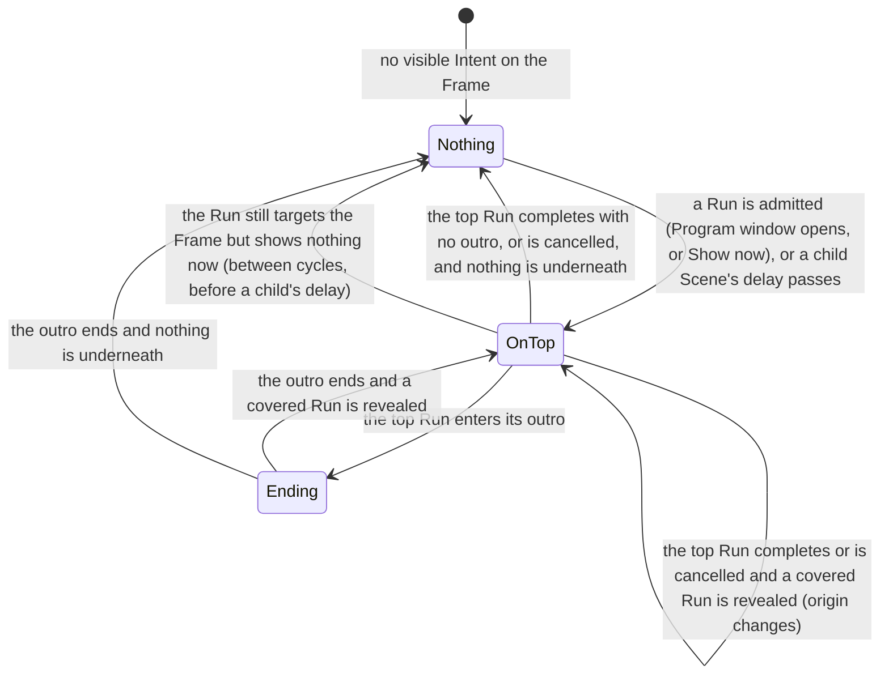
```mermaid
stateDiagram-v2
  [*] --> Nothing: no visible Intent on the Frame
  Nothing --> OnTop: a Run is admitted (Program window opens, or Show now), or a child Scene's delay passes
  OnTop --> OnTop: a higher-precedence Run is admitted (origin changes)
  OnTop --> OnTop: the top Run completes or is cancelled and a covered Run is revealed (origin changes)
  OnTop --> Ending: the top Run enters its outro
  Ending --> OnTop: the outro ends and a covered Run is revealed
  Ending --> Nothing: the outro ends and nothing is underneath
  OnTop --> Nothing: the top Run completes with no outro, or is cancelled, and nothing is underneath
  OnTop --> Nothing: the Run still targets the Frame but shows nothing now (between cycles, before a child's delay)
```

The Program display state (upcoming, due, running, ran, cancelled, refused, missed, old: `showState.js:80-143`) is unchanged; pass 4 only zones its times.

## 37. Pass 5 Sources: screens and the progressive Source flow

**One noun.** "Source" is the console's word everywhere (capitalised like Scene and Program): nav **Sources** (in Part G's Show group, where batch 4 left the shipped label "Photo sources"), "New Source", "Name this Source", "Check your Source", the Scene step "Which Source?", "Live from a Source" and "Manage in Sources". It is the requirements' **AssetSource** (`requirements.md:131`), which keeps its name there (§3). "Your photo library" names only the origin, which is not an aggregate and has no section. A source-scan test (extending `test_sources_have_no_immich_or_album_language`) fails on "photo source", "Photo sources", "match preview", "album" and vendor words in console strings.

**The Source home** is `#/sources` (cards) with its flow at `#/sources/new/<step>` and edit at the card. A card shows the selection summary, the last refresh as a `reported` fact, and Edit, Refresh, Delete. It shows **no thumbnails** in this batch (deferred, §44): the owner asked for a preview of what the chosen tags select, which lives in the flow.

**The flow, one question per step (R24).** The flow kit's steps (`sourceFlowModel.js`) become:

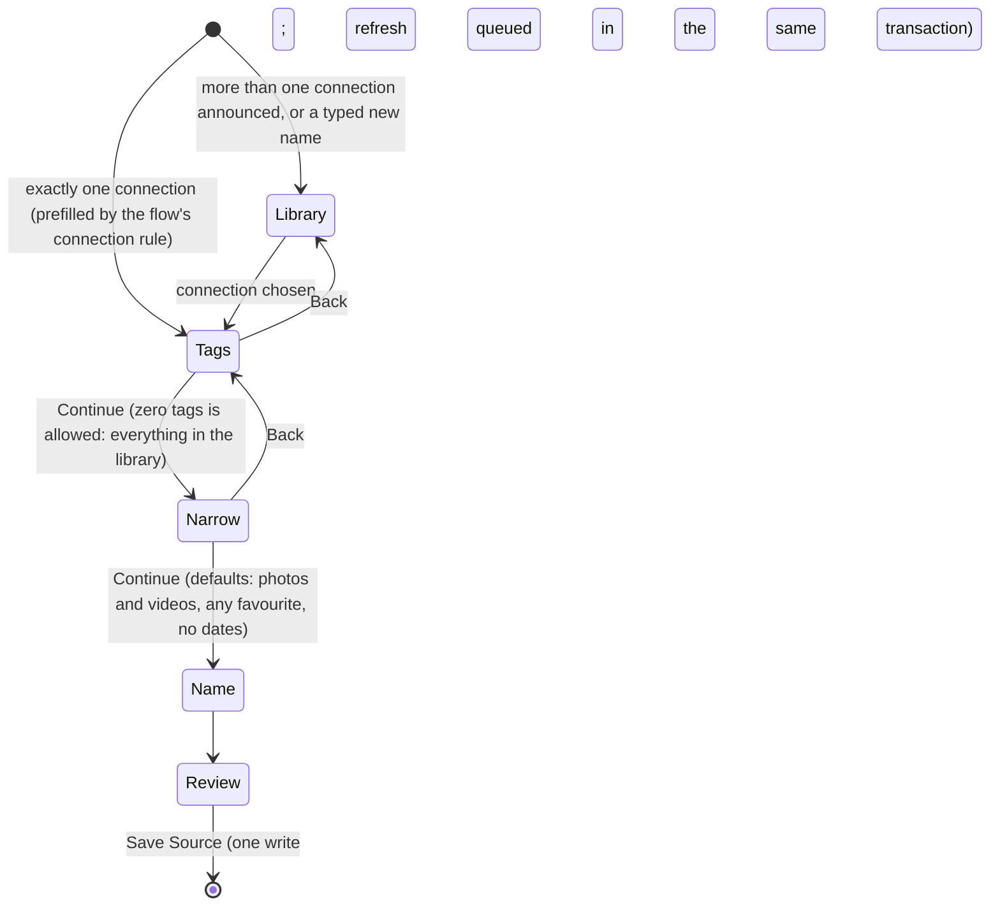
```mermaid
stateDiagram-v2
  [*] --> Library: more than one connection announced, or a typed new name
  [*] --> Tags: exactly one connection (prefilled by the flow's connection rule)
  Library --> Tags: connection chosen
  Tags --> Narrow: Continue (zero tags is allowed: everything in the library)
  Narrow --> Name: Continue (defaults: photos and videos, any favourite, no dates)
  Name --> Review
  Review --> [*]: Save Source (one write; refresh queued in the same transaction)
  Tags --> Library: Back
  Narrow --> Tags: Back
```

| Step | Asks | Beside it |
|---|---|---|
| **Which library connection?** | the connection, under PR 34's `connectionRule` (`sourceFlowModel.js:59-130`), unchanged. Skipped when the rule finds exactly one connection; an edit whose saved connection is no longer reported keeps the step (errata B5-L3-3) | A name the worker's **reported** list excludes disables tags and preview with "This connection isn't set up yet, so tags and previews aren't available. You can still save; the Source starts selecting once the connection is set up." While the worker has **never reported** its list (`media_settings.connection_ids` is null: the server already tells the two apart, `media_repository.py:296-298`, `:471-475`), the step says instead "The media worker hasn't reported its library connections yet, so tags and previews aren't available yet. You can still save." (after-5; C5 item 4) |
| **Choose tags** | `TagCombobox` (PR 37 §8: ARIA combobox, ≤ 4 chips, all-of, a nested tag replaces its ancestor, an ancestor of a chosen tag is refused with its reason) | The **preview panel**: what the chosen tags select, re-queried on each change (R23) |
| **Narrow it down (optional)** | media type, favourites, dated from and until, each prefilled with its default | The same preview panel, following the criteria |
| **Name this Source** | the name (rename words unchanged, `SourceSteps.jsx:293`) | — |
| **Check your Source** | the summary, with "Change" per step | The selection summary and the preview panel |

**The preview panel** (one component, mounted on Tags, Narrow and Review): a `reported` count fact, the newest 24 tiles with alt text ("Photo dated 12 Dec 2024"), and the PR 37 states (Looking, Updating, nothing matches, over the limit, unreachable, key not allowed), plus two failures with their own sentence (a tag deleted in the library, a key that is another user's), worded in §39. Dates are the library's own dates (`fileCreatedAt`, `media/immich.py:287`), so the words say "dated", not "taken"; they are labelled "Dates in this browser's time zone" (PR 37 Q5 stays deferred).

**The Scene's authored-media chooser** is unchanged in this batch ("Photo 108×192"). Its tiles are deferred with the card's (§44), because an authored item is **not** a current Source member: authored references are kept from membership independently (`media_repository.py:529`), the Planner plays them without consulting membership (`central/planner.py:233-234`), and the chooser already handles an authored asset no longer among the Source's candidates (`SceneSteps.jsx:376-379`).

## 38. PR 37 folded in: what changes

PR 37 (revision 6, 2026-09-28) was written before three things landed on `main`: a count-only unsaved-Source preview (2026-09-29, `POST /v1/operator/source-previews` and `GET …/{request_id}`, `central/app.py:808-815`, table `source_previews` in migration 033, worker `preview()` at `media/immich.py:478-499`), a shared `SourceQuery` base for `SourceSpec` and `SourcePreviewQuery` (`media/models.py:32-70`), and the worker's reported connection list (`media_settings.connection_ids`, `media_repository.py:621-638`, read by the flow's `connectionRule`). The repo also already has one cache-then-fallback **asset layer** for files (`central/assets/reader.py:114-168` `AssetReader`, kernel job types in `central/kernel/job_types.py`, a directory per `AssetKind` in `central/assets/layout.py`), run by every media worker process (`media/worker.py:452-455`). PR 37 would add a second preview mechanism and a second file-fetch lane. Folding it in keeps one of each: **data answers** (a preview, a tag list) stay on the media worker's existing paths; **files** (thumbnails) go through the asset layer.

**Design-it-twice (Q9, answered 2026-10-02: A).** The owner chose A: PR 37 lands re-based on what exists. B is kept below as the record of what was not chosen.

| | **A. PR 37 re-based on what exists (recommended)** | **B. PR 37 as written** |
|---|---|---|
| Preview | The existing request resource grows: the query gains `tags`; the answer gains the newest 24 members, a limit flag and its observation time. One row per POST, as today; the pending cap (`media_repository.py:251-260`, 429) bounds it | A new `GET …/library/preview` keyed by `query_key`, an observation store (`library_queries`, members), a waiter that awaits ≤ 8 s, a new `Publisher.follow` (PB10), a global cap under an advisory lock; the existing count preview deleted or left beside it |
| Search | The per-kind walks stay (`media/immich.py:340-349`) and each gains `tagIds`; a both-kinds draft merges each kind's newest 24 and sums the counts. **PR 37's tag existence check is kept** (fix cycle 1; L1 had dropped it): before any search, refresh and preview confirm each tag with `GET tags/{id}` (at most four small reads), and a missing tag fails as `incompatible/tag_missing`, so a tag deleted in the library never reads as an `ok`, empty Source (R6) | One search for both media types, rewriting the live refresh path, with a parity test |
| Request gate | Preview stays a POST, so pass A's write checks already apply; only the thumbnail route (an `` GET that publishes on a miss) needs PR 37's gate (servability, `Sec-Fetch-Site` when sent, CORP) | GETs that publish need the marker: pass A's GET rule is amended for preview and tags |
| Tag list | The worker re-lists each connection's tags on its existing tick when the stored list is older than 5 min (database clock, G11), and replaces it at boot; `GET …/library/tags` reads stored data only | The GET publishes a refresh itself (stale-while-revalidate), with 2 waiter slots per pod |
| Thumbnails | `AssetKind.LIBRARY_THUMBNAIL` plus one `FetchLibraryThumbnail` job on the kernel's FETCH queue, read through `AssetReader`; the worker prefetches a completed preview's 24 | Two new kernel queues (`LIBRARY`, `THUMBNAIL`), a periodic sweep job, a route that never awaits, and a console retry ladder |
| Connections | Unchanged: the worker's reported list; no fingerprints (the worker holds one configuration per connection and must restart to change it, `media/immich.py:415`) | A new `library_connections` table, boot announcement and fingerprints |
| Refresh lease | Unchanged (per Source). Kept from PR 37: canonical compare, `spec_unsupported`, the empty-`tags` omission | One lease per `query_key` (PR 37 L2), with a boot backfill |
| Size (raw) | about +395 backend / +670 tests (G9, G10, G11) | PR 37's 34.5 h over 8 beads; about +1,100 backend / +1,300 tests |
| Costs | A both-kinds Source is two library searches; two Sources with one query search twice per tick; preview-then-save searches again; a repeated draft is searched again; a failed preview cannot show "the last members" across requests, so the panel keeps the previous answer in page memory; thumbnail fetches share the FETCH queue with OS-image and package fetches: a queued boot or package fetch is picked before any queued tile (priority −50, fix cycle 1), but one that arrives while tiles run in both of a worker's FETCH slots waits for one tile's attempt (at most the 15 s metadata budget) | Two preview mechanisms until one is removed; a kernel Publisher addition; a pass A amendment; the one-search and per-key lease changes touch the live refresh path (high risk) |

**PR 37 element by element.**

| PR 37 element | Fits the domain and current code? | Change when folded in |
|---|---|---|
| A Source is one library query; `LibraryQuery` with canonical form (§4–§5) | Yes | `SourceQuery` *is* that base: it gains `tags` and `canonical()`; no new class. Empty `tags` omitted from stored Sources (PR 37's rollback rule, kept verbatim; `contracts/models.py:25` `extra='forbid'` makes it real) |
| `query_key` and reuse by key (§5, §7) | An optimisation for an already bounded resource; a criteria change makes a new key anyway | Dropped |
| One search for both media types (§5) | Changes nothing an operator sees and rewrites the live refresh path (`media/immich.py:417-424`) | Dropped: the per-kind walks gain `tagIds` |
| Canonical compare in `configure_source`; `spec_unsupported` tolerance (§5, §6) | Yes; `configure_source` still compares raw JSON (`media_repository.py:97-99`) | Kept |
| "Saving a Source queues nothing" (§1) | Stale: `configure_named_in` already queues the refresh in its transaction (`media_repository.py:163-165`) | Dropped |
| Lookup jobs answered as data; the worker alone holds the key (§3) | Yes (R22) | Kept: preview and tag list on the media worker's paths |
| Preview route, PB10, waiter slots, global cap (§7) | Duplicates the count preview | Replaced by shape A |
| Per-key refresh lease and boot backfill (§6, L2) | Optimisation only ("correctness never depends on it", PR 37 §14) | Deferred (§44) |
| Thumbnails: servability = current data, worker re-check, re-encode without metadata, a cache subdirectory, never awaited (§6, §7, §9) | Servability, re-check and re-encode: yes (R22, R25). A separate lane: no, the asset layer exists | Kept on the asset layer. **Servable = a member of a live preview row**, with the row's stored metadata. The kind's directory is `previews/` in the one layout (ADR 0013's fourth subdirectory, Dockerfile and entrypoint lines). "Never awaited" becomes a **short bounded wait in its own slots** (§40), which keeps PR 37's reason (24 tiles must not starve the console's own reads) |
| Tag list with filtering, caps, bidi stripping (§7, §9) | Yes | Kept; refreshed by the worker's tick; read-only GET |
| Preview "as of 12:03", Updating, failure never empty (§8) | Yes (R2 here) | Rendered through `fact()` as `reported` (§39); its time follows G11 |
| "Tags" and preview slots in the J5 step (§8) | The step exists (`LibrarySlot`, `SourceSteps.jsx:96-171`) | The step splits into Tags and Narrow (§37); the slots are removed |
| Fingerprints on connections (§6, §11) | Guards a repointed connection; the worker must restart to repoint, and a repointed library yields different asset ids (`media/models.py:141-143`) | Dropped; the worker replaces its connections' tag lists at boot |
| No "Library" section | Yes | Kept: the library is an origin |
| Migrations 030–032 | Stale (061 is the last on this branch) | Next free numbers at build time; `source_previews` is extended by a new migration, never edited |
| Line citations to PR #34's branch | Stale: PR #34 merged | Re-cited above to this branch |
| Q3 (key permissions `tag.read`, `asset.view`) | Answered by the owner; an action, not a design question | Assumption (§44): until the key has them, tags and thumbnails degrade as PR 37 §8 says and tagged Sources report `permission` |

**The boundary (R22), frozen.** What the browser may receive is a closed shape, not a convention:

| Shape | Fields | Where |
|---|---|---|
| **Served** `PreviewMember` | `asset_id` (Central's one-way hash of connection, library id and checksum, `media/models.py:141-143`), `kind`, `captured_at`, `width`, `height`, `duration_seconds`; the three sizes are null when the library's metadata is unusable (the preview walk asks for metadata, errata B5-L1-2) | `GET …/source-previews/{request_id}` → `shown[]` |
| **Stored** member metadata | the served fields plus `upstream_id` and `checksum` | the `members` column on the preview row, which no route serializes (`_PREVIEW_SERVED`, `media_repository.py:319`); the thumbnail origin reads it by `asset_id` |
| **Served** tag | `tag_ref`, `path`, `name`, `parent_ref` (PR 37 §7's shape; the parent drives the nested-tag replacement), names and paths stripped of control and bidi characters at construction (errata B5-L2-3) | `GET …/library/tags` |

Route and DB tests assert that the preview GET, the tag GET and the media read contain no library photo id, checksum, owner id, URL or key.

**Thumbnails as asset records (after-5: L2's correction confirmed).** Built, L2 found that the asset layer assumes a key fixes its bytes, and a thumbnail breaks that twice (errata B5-L2-1): 028's CHECK requires every reference's locator to name the key, and Central holds no library address (R22); and produced facts are write-once, while a thumbnail is keyed by its **original** and its bytes change when the library regenerates it. The architect confirms L2's closure, which keeps shape A (Q9) and makes both breaks unrepresentable rather than conventional: (1) migration 064 narrows the CHECK so a `library-thumbnail` reference is exactly one reserved shape (owner `library-preview`, locator `http://library.invalid/`, no digest or size; `central/assets/library.py` `THUMBNAIL_REFERENCE`, read by no handler), and every other kind still names its key; (2) a thumbnail's record lives only while a live preview selects it: the worker's preview maintenance deletes the others and sweeps their files, so the next preview records fresh facts. The handler is Central's (`central/assets/handlers.py`, reusing the asset layer's production), and only its library half, the `ThumbnailOrigin` port (`central/kernel/ports.py`), lives in `media/library_thumbnails.py`, injected through `build_job_runtime(…, thumbnails=)`, the same split as `ReleaseOrigin` and the package fetch; an import-linter contract, "Central imports no library client", forbids the reverse edge (errata B5-L2-2). **What it gives up:** a reference row whose locator means "no address", which a reader must know is reserved; a thumbnail's produced facts are not write-once (`AssetKind.keyed_by_content` is False for it alone), so after a purge the library's regenerated bytes replace them, and between a re-fetch's install and its recorded facts the reader checks the file only against the recorded size, so a same-size regenerated tile is served at once and a different-size one is a miss that waits for the fetch's outcome (the thumbnail route sends no `Digest`, so no header names the previous bytes) (fix cycle 3, B5-FC3; cost restated in the final fix round); a file re-written between a maintenance pass's delete and its sweep can be swept and is refetched on the next request. **Not chosen:** PR 37's separate thumbnail lane (Q9 = A), and making thumbnails content-addressed (Central cannot know the bytes before fetching them).

## 39. Pass 5 wording and truth kinds

Every line is a `fact()` rendered through `FactLine`, except plain statements. "Your photo library" is the reporting origin; the media worker is the channel ("via the media worker"). When more than one connection is announced, the origin names the connection: "Your photo library (connection home) …". Ages follow G11 (Q10 = yes): each age is the database's read time minus the database's write time, one clock.

| Fact | Kind | Wording |
|---|---|---|
| Intro | plain statement | "Photo Wall selects media that lives in your photo library. It never uploads, edits or deletes anything there." |
| Tag field | plain statement | Label "Tags in your library"; hint "Each tag includes everything nested under it. For media with *any* of several tags, give those photos one shared tag in your library." |
| Tag list age | `reported`, latest | "Your photo library last reported its tags 7 min ago" (shown only when older than 5 min) |
| What a draft selects | `reported`, first | "Your photo library reported 128 photos and 4 videos · first received 12 s ago" |
| Updating | `reported`, first + plain | the same fact, then "Updating…" |
| Nothing matches (ok, 0) | `reported`, first | "Your photo library reported nothing matching yet · first received 4 s ago" + "New matches appear automatically once saved." |
| Over the limit | `reported`, first | "Your photo library reported more than 1,000 matches · first received …" + "Photo Wall currently refuses a Source with more than 1,000 matches; saved like this it selects nothing. Narrow it with tags or dates." (the worker's current behaviour, not a product rule: Q8(b) kept the requirement; a refresh over the ceiling refuses the whole Source as `source_limit`, only the preview cuts the list short). A saved Source refused with `source_limit` reads "Over Photo Wall's current size limits for one Source (at most 1,000 matches) · narrow it with tags or dates", because the worker raises that code for its byte and request bounds too, never "Your photo library is unsupported" (fix cycles 1 and 3); the 1,000-count sentence above is said only where a preview counted more (`limited`). Then "Showing the newest 24." |
| More matches than tiles (any count above the tiles shown, not only over the limit) | plain statement | "Showing the newest N." (the paged-view gap's wording, §44; errata B5-L3-2) |
| Retrying, the library's transient answer, no earlier answer | `unknown` | "Unknown: Photo Wall can't reach your photo library right now; retrying" (never "nothing matches") |
| Retrying, the library's, earlier answer on screen | the earlier fact + plain | the earlier fact, then "Photo Wall can't reach your photo library right now." |
| Retrying, Photo Wall's own transient code (`preview_expired`, `worker_timeout`, `worker_cancelled`) | `unknown`, or the earlier fact + plain | the code's row, then "· retrying": "Unknown: The media worker hasn't answered this preview · check that it is running · retrying" (`preview_expired` is written by Central when no worker answered, so it never says the library is unreachable; final fix round) |
| Key not allowed | plain statement | "Your library connection's key isn't allowed to list tags or show previews. Add the permissions in the setup guide's library key step." |
| Any other failure with a row (`owner_mismatch`, `tag_missing`, `time_budget`, …) | `unknown` + plain | "Unknown: the preview failed" (or, with an earlier answer on screen, that answer and "The preview failed."), then the row's card sentence (`refusalIssue`): "The library key belongs to a different user." for `owner_mismatch` (more permissions cannot fix another user's key, so it is never "key not allowed"), "A tag this Source uses no longer exists in your library." for `tag_missing`. A code with no row reads "Unknown: the preview failed (<code in words>)". The preview's phase is read from the same row (`previewHandling`: `retry`, `key`, or failed), so the preview and the card never give one code two owners (final fix round) |
| Tile | plain alt text | "Photo dated 12 Dec 2024" / "Video, 0:32, dated 12 Dec 2024"; not served yet: "Preview not ready yet" |
| Selection summary | `set` (the Source's spec) | "Selects media tagged Family/Christmas (and nested tags) · favourites only · photos and videos · dated 3 Mar 2025 to 5 Mar 2025"; a tag the library's answer names absent: "a tag that no longer exists in your library"; a tag not yet looked up: "a tag Photo Wall has not looked up yet" (never "gone" without an answer that names it absent, errata B5-L3-1); a listed tag with nothing visible in its path: "a tag with no visible name in your library" (fix cycle 2); no tags: "Selects everything"; every selection, tagged or not, ends "· on your library's timeline only (not archived, hidden or other users' media)" (`TIMELINE_ONLY`, because the worker's search takes only the timeline for every Source, fix cycle 3, said for tagged Sources too in the final fix round), and Review's "No tags: everything on your library's timeline only (…)". **One home** for these words (`sourceWords.js`, as built: a pure module importing only `timeWords.js` and `facts.js`): `selectionWords` and the Source status label (`mediaHealth.js` `sourceState`, shown on Now's pipeline, the Scene flow and cards) take their phrases from it, so both say "dated", not "taken", and the label names the tags ("2 tags" where paths are not loaded); the media chooser says "dated" too (C5 item 2) |
| Source refresh | `reported`, latest | "Your photo library last reported 2 min ago · the media worker accepted 132 in that refresh" (the count is the worker's own acceptance, so it names the worker, fix cycle 2). One home, `sourceWords.js` `refreshFact`: an ok Source's status label is this fact (plus "· N items pending or rejected" and its filters), so its card states the refresh once, as Status, with no separate Refreshed line (final fix round) |
| Refresh failing | `reported`, latest; the origin is the refusal's **owner** | "Your photo library refused access · last good refresh 3 h ago" for the library's answers; Photo Wall's own refusals name Photo Wall or the media worker ("This media worker can't read this Source's settings · update the media worker", "Over Photo Wall's current size limits …"). **One closed table** (`sourceWords.js` `SOURCE_REFUSALS`, fix cycle 3) maps each served code to its owner (library or Photo Wall), its state words and, where it differs, the card's sentence; `sourceState` reads the Source-level code (the diagnostic with no `asset_id`) and never the `status` alone, because `incompatible` covers `spec_unsupported`, `connection_mismatch` and `source_limit` as well as the library's version. Codes are single-owner where they are raised (final fix round): a well-formed item over Photo Wall's dimension, pixel or video-length limits is `item_over_limits`, never `metadata_invalid`; the whole refresh's, preview's or tag listing's own deadline is `time_budget`, never `upstream_timeout` (which stays one request's timeout); `unsupported_version` is Photo Wall's ("This Photo Wall release doesn't support your photo library's version", its supported list); and the Source-level `metadata_pending_or_invalid` reads "No item this Source found could be used · see each item's reason", never "still settling". The card's Issue line is the row's own sentence where it differs, else its state words (B5-FC3-A1). A second test checks the reverse direction: no library-owned code is raised under one of Photo Wall's limits in the adapter. A code the table does not hold, or a failing Source with no code, reads "Refresh failed (…)", blaming no one. A test harvests every code raised in the worker, the library adapter and the media repository and fails on one with no row |
| Media worker | `reported`, latest | "Media worker last reported 20 s ago · preparing 0 · waiting 0 · failed 0 · cache 0 of 4.3 GB" (as built in the final fix round: `workerState`'s ok line is this fact) |
| Tag deleted after save | `reported`, latest (the library's stored tag list; receipt time: that list's `observed_at`) | "A tag this Source uses no longer exists in your library." (as built the card still shows it as a plain line without the list's age: residual, errata B5-FX1) Shown when the tag GET's lookup by id (C5 item 3) answers it absent from a list whose status is `ok`, or when the worker's refresh or preview fails as `tag_missing`; a refused Source's status reads "Your photo library no longer has a tag this Source uses · edit its tags" |

**Labels as built** (errata B5-L3-4, B5-L1-5): the Narrow step's fields read "Media type" (Photos and videos, Photos only, Videos only), "Favourites" and "Dated from"/"Dated until", whose window problem reads "'Dated until' must be after 'Dated from'."; the flow's buttons read New Source and Save Source and its Scene hand-off reads "This Source is for your Scene." (the flow kit's noun); a failing Source's status reads its refusal's words from `SOURCE_REFUSALS` (for the library: "Your photo library is unreachable / refused access / is unsupported"; for Photo Wall: the media worker's or Photo Wall's own sentence), then "· last good refresh <age> ago", everywhere it shows. The card's refresh line is the `reported` fact only for an ok Source; a failing one points to its status, so no line says "last reported" for a library that last refused. "Showing the newest 24." first rendered with L3's tiles, not with L1's count.

**One clock, so no clock-labelled form.** Q10 = yes, so no media fact carries "by the media worker's clock", and the worker-quiet and refresh-overdue alarms stay.

## 40. Pass 5 lifecycles

**A preview request** (one row per POST, as today):

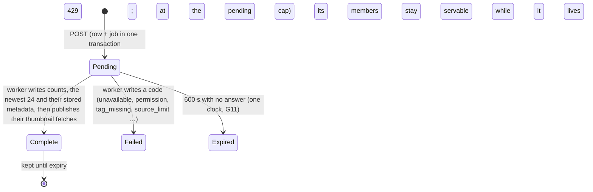
```mermaid
stateDiagram-v2
  [*] --> Pending: POST (row + job in one transaction; 429 at the pending cap)
  Pending --> Complete: worker writes counts, the newest 24 and their stored metadata, then publishes their thumbnail fetches
  Pending --> Failed: worker writes a code (unavailable, permission, tag_missing, source_limit …)
  Pending --> Expired: 600 s with no answer (one clock, G11)
  Complete --> [*]: kept until expiry; its members stay servable while it lives
```

As built (after-5): Expired is stored as `failed` with error `preview_expired` (the status column's CHECK is unchanged; migration 063 replaces the table-level state CHECK `source_previews_check1`), a completed row written before 063 has no sample and is retired the same way, never back-filled, and rows are deleted an hour after expiry (errata B5-L1-4). The served answer stays **flat**: `status`, `count`, `image_count`, `video_count`, `error`, plus `shown`, `limited`, `observed_at` (complete only) and `read_at` (every status), all on the database clock (errata B5-L1-1, B5-L1-3).

The panel polls the request's GET at 2 s, backing off to 30 s, and after 2 min reads "Still looking. Photo Wall will keep trying." A criteria change supersedes the request on screen (the old answer is dropped by sequence).

**A thumbnail tile** reads through the asset layer. The route checks servability (a member of a live preview row), `Sec-Fetch-Site` when sent, and sets CORP; then it calls a dedicated `AssetReader` built with a short wait (2 s) and its own `WaiterSlots` (4), so cold tiles can hold at most four HTTP waiters for two seconds and the console's polled reads are never starved. Those slots bound HTTP waiters, not queue occupancy: on the shared FETCH queue (two slots per worker) `FetchLibraryThumbnail` carries priority −50, below every boot, package and payload fetch, so a queued Player fetch is always picked first, and a tile's attempt runs under the client's metadata budget (15 s; four library requests: version, owner, asset, thumbnail), not a refresh's (fix cycle 1). Because a completed preview prefetches its 24, most tiles are hits.

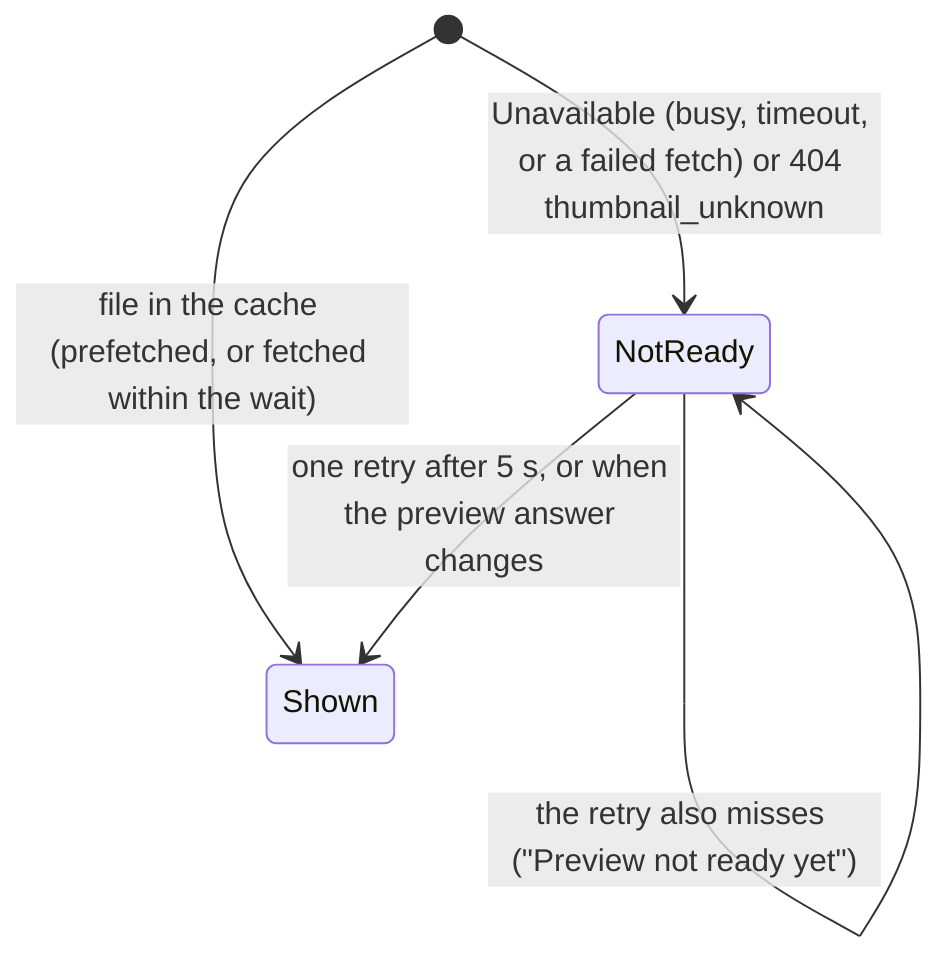
```mermaid
stateDiagram-v2
  [*] --> Shown: file in the cache (prefetched, or fetched within the wait)
  [*] --> NotReady: Unavailable (busy, timeout, or a failed fetch) or 404 thumbnail_unknown
  NotReady --> Shown: one retry after 5 s, or when the preview answer changes
  NotReady --> NotReady: the retry also misses ("Preview not ready yet")
```

A 404 queues nothing. The console cannot tell a 404 from a 503 on an ``, so it has one state, "Preview not ready yet", never "no longer selected". As built (errata B5-L2-4): the admin check comes first (signed out, every id gets the same 401), then a sent `Sec-Fetch-Site` other than `same-origin` gets 403 `origin_mismatch`, then a non-servable or malformed id gets 404 `thumbnail_unknown`; a miss past the wait is 503 `thumbnail_<reason>` with `Retry-After`; CORP is on every answer and a served tile adds `nosniff` and `default-src 'none'; sandbox`. Each fetch re-checks the library's version and owner (four library requests per tile: version, owner, asset, thumbnail; PR 37's once-a-minute check is not built, §44).

**The tag list** per connection: none → listed (with its age) → stale (older than 5 min: the worker's next tick re-lists it; the console keeps showing the list) → listed; a failed re-list keeps the last list with its own age. The re-list gate is the last **attempt** (`library_tags.checked_at`) older than 5 min by the database clock, so a failing library is asked every 5 min, not every tick; boot lists every held connection regardless of age and drops the rows of connections the worker no longer holds (errata B5-L2-3).

## 41. Interface sketch (passes 4 and 5; signatures only)

```text
facts.js                                                              (S1)
  fact({kind: "planned", value, origin, basis}) -> Fact   // origin and basis required; missing origin -> unknown "who started <value> is not served"
  factText(planned) -> "On top: <value> · <origin> (Central's Runs; <basis>; the Panel is not observed)"

timeWords.js  (new, shared with Show, Sources and fleet, pure)        (S1)
  zoneName() -> "Europe/London"            // moved from authoring.js timeZoneName
  zoneNote() -> "Times in Europe/London (this browser's time zone)"
  clockTime(epochSeconds) -> "18:00 BST"   // the one clock-time formatter; facts.js clock() and showState delegate
  dateTime(epochSeconds) -> "Tue 2 Mar 18:00 BST"   // ScheduleSteps.jsx:58, SourceFlow.jsx:458
  dayLabel(epochSeconds) -> "Tue 2 Mar";  captureDay(epochSeconds) -> "12 Dec 2024"   // mediaHealth.js:107
  windowLabel({starts_at, ends_at}) -> "Tue 2 Mar 18:00–20:00 BST"
  zoneLabel(date) -> "BST" | "UTC+01:00"   // ScheduleSteps.jsx:332-333 fallback

showState.js                                                          (S1)
  runOrigin(runtime, run) -> {kind: "program" | "direct" | "child", words, programListed: bool}   // the one home; runRows uses it

join.js                                                               (S1)
  plannedIntent(runtime, frameId) -> Intent | null   // renamed from nowShowing
  plannedFor(runtime, frameId, bound: bool) -> {fact: Fact, sceneId | null, phase | null}
  plannedFact(runtime, intent, bound) -> Fact;  intentOrigin(runtime, intent) -> string | null   // C5: the one home of the fact and its origin

StatusFacet.jsx  (renamed from NowShowingFacet.jsx; Wall-only)       (S1)
  <StatusFacet snapshot frameId hostChip />           // hostChip still handed in by Inspector.jsx (§61)
PrecedenceExplanation.jsx  (moved out; shared by StatusFacet and RunsRegion)   (S1)

media/models.py                                                       (L1)
  SourceQuery.tags: tuple[TagRef, ...]               // 0–4 canonical UUIDs, unique, sorted; SourceSpec omits it when empty
  SourceQuery.canonical() -> dict
  PreviewMember {asset_id, kind, captured_at, width?, height?, duration_seconds?}   // served; sizes null when unusable (B5-L1-2)
  LibraryTag {tag_ref, path, name, parent_ref?}       // controls and bidi stripped at construction (B5-L2-3)
  SourcePreviewResult {count, image_count, video_count, shown: ≤24 PreviewMember, limited: bool}
media/immich.py                                                       (L1; L2)
  _walk(query, kind, …)                              // gains tagIds when tags is non-empty
  preview(query) -> SourcePreviewResult + stored member metadata;  list_tags() -> LibraryTag[]
  thumbnail(upstream_id) -> bytes                    // re-check, then fetch and re-encode without metadata; metadata budget (15 s)
  _confirm_tags(query, budget)                       // fix cycle 1: GET tags/{id} per tag before any refresh or preview search; 400/404 -> incompatible/tag_missing
central/kernel                                                        (L2)
  AssetKind.LIBRARY_THUMBNAIL;  FetchLibraryThumbnail(asset_id) on QueueName.FETCH, priority −50 (below every other FETCH job; fix cycle 1)   // CATALOG and Candidates gain it
  ThumbnailOrigin (port, kernel/ports.py)            // the library half; media/library_thumbnails.py implements it
central/assets                                                        (L2)
  FetchLibraryThumbnailHandler (handlers.py)         // Central's; reuses AssetProduction; build_job_runtime(…, thumbnails: ThumbnailOrigin) required
  library.py  THUMBNAIL_REFERENCE; LibraryThumbnails.resolve(asset_id) -> Candidates | None; prefetch(members)
central/media_repository.py                                           (L1; L2)
  request_source_preview(query) -> {request_id}
  source_preview(request_id) -> {status, count, image_count, video_count, error?, shown?, limited?, observed_at?, read_at}   // flat (B5-L1-1)
  library_tags(connection_ref, q, limit) -> {connection_ref, status, error?, observed_at, read_at, total_matches, tags[]}
  library_tags_by_id(connection_ref, ids) -> {…, tags[], absent[]}   // C5: absent named only when the stored list's status is ok
  servable_thumbnail(asset_id) -> ServableThumbnail | None
  maintain_source_previews() -> frozenset[thumbnail ids still recorded]   // expires, deletes, retires unselected thumbnail records
central/coordination port CoordinationMedia                           (M1)
  catalog_in(conn, source_refs)                      // loses `now`: the retry cooldown reads now_in(conn) (B5-M1-2)
central/db.py                                                         (M1, G11)
  TransactionClock (port): now_in(conn) -> float      // the time of a media fact, read on the transaction's OWN connection
  DatabaseTransactionClock: now_in(conn) = EXTRACT(EPOCH FROM clock_timestamp())   // production: Central and every worker process
  ProcessTransactionClock(clock: Clock): now_in(conn) = clock.utc()                // tests keep ManualClock; never composed in production
  MediaRepository(db, clock, *, times: TransactionClock, …)   // times required; clock stays for monotonic budgets and process-local decisions
  create_app(…, media_times=None)   // None -> DatabaseTransactionClock, unless a clock is injected (tests) -> ProcessTransactionClock(clock) (B5-M1-3)
operator snapshot, GET /v1/operator/media                             (M1)
  media.read_at = times.now_in(conn), inside the read's own transaction
routes                                                                (L1; L2)
  POST /v1/operator/source-previews                   // body gains tags
  GET  /v1/operator/source-previews/{request_id}      // gains shown, limited, observed_at, read_at
  GET  /v1/operator/library/tags?connection=&q=&limit=   // reads stored data only; 404 connection_unknown, 422 q > 128 or limit outside 1–20
  GET  /v1/operator/library/tags?connection=&ids=        // C5: 1–4 canonical UUIDs, exclusive with q; answers those tags and `absent`
  GET  /v1/operator/library/thumbnails/{asset_id}     // img; servability, Sec-Fetch-Site when sent, CORP; AssetReader(wait 2 s, slots 4)

fleetCommands.js                                                      (R1)
  sendReboot(deviceId, request, node, control)        // a per-device in-flight guard inside: a second call while one is in flight -> {outcome: "changed"}, no POST

console                                                               (L3)
  sourceFlowModel.js  SOURCE_STEPS = library | tags | narrow | name | review   // library skipped by connectionRule
  TagCombobox.jsx     <TagCombobox connection value onChange />
  usePreview.js       usePreview(query) -> {phase, answer, previous, stillLooking, code, connection}   // React; sequence-superseded; 400 ms debounce (B5-L3-2)
  sourcePreview.js    previewFacts(preview, connections) -> {facts, notes, answer}; failurePhase(code) -> retrying | key | failed, read from SOURCE_REFUSALS (no second code table, final fix round)   // pure, Node-tested; read_at travels in the answer
  libraryTags.js      learnPaths(known, list)         // a tag is "gone" only from a lookup by id's `absent` (C5); no search proves it (fix cycle 2)
  libraryTags.js      pickerAnnouncement(list, failed) -> string   // fix cycle 2: the on-screen sentence when pending, unread or failed; a count only for an `ok` list
  PreviewPanel.jsx    <PreviewPanel query />          // Tags, Narrow, Review
  sourceWords.js      tagWords, tagCountWords, favouritesWords, kindsWords, datedWords; OVER_LIMIT, OWNER_MISMATCH, TAG_GONE, UNTAGGED_SELECTION, TIMELINE_ONLY; SOURCE_REFUSALS (code -> owner LIBRARY | PHOTO_WALL, state, issue?, preview? retry | key), refusalState(code, status), refusalIssue(code) (issue ?? state; the code in words only off-table), previewHandling(code) -> retry | key | failed; libraryName(connection, connections), refreshFact(source, now, connections) (a Source's refresh, one home)   // C5: pure, imports only timeWords.js and facts.js (final fix round)
  sourceFlowModel.js  selectionWords(query, tagPaths) -> string;  unannouncedWords(rule) -> string   // both from sourceWords.js pieces; unannounced vs never reported (C5)
  libraryTags.js      readTagsById(connection, ids) -> TagList[]   // C5: ≤ 4 ids per read; a refused read leaves its ids unknown
  mediaHealth.js      sourceFilters(spec, tagPaths = null) -> string[]   // C5: selectionWords' order and pieces (tags · favourites · single kind · dated)
  mediaHealth.js      sourceState(source, readAt, includeFilters, connections), workerState(health, readAt)   // an ok label is refreshFact; worker ok is a `reported` fact; readAt = snapshot.media.read_at, the database's time (G11), not inventory.read_at
```

## 42. Backend gates

Each lands as the first commit of the bead that shows it, behind the existing `admin` dependency. What the console shows without each is stated, so the owner can decline any one.

| Gate | Bead | What the console cannot show honestly without it | Smallest addition | Without it the console shows | Lines raw (code / tests) |
|---|---|---|---|---|---|
| **G9 · A tagged Source query and a preview sample** | L1 | Tags (R23) and what a draft selects (R23) | §38 shape A: `tags` and canonical form; `tagIds` in each per-kind walk; newest-24 served members with stored metadata in a non-served column; `limited`; empty `tags` omitted from stored Sources; canonical compare; `spec_unsupported` | Count-only preview, no tags | +165 / +270 |
| **G10 · Tag list and thumbnails** | L2 | Autocomplete from the library's tags (R23); any media in the preview | Tag-list table, the worker's tick re-list and boot replace, one read route; `LIBRARY_THUMBNAIL` on the asset layer with its job, handler, `previews/` directory and route (PR 37 §6–§9 security kept whole) | Tags typed as ids (unusable), tiles as text | +170 / +320 (built about 4× code, 2× tests: the record lifecycle, the full client and re-encoder, the security tests) |
| **G11 · Media times on one clock** (Q10 = yes) | M1 | Any media age or alarm: today the console subtracts the worker's clock from Central's, and the worker compares Central's preview expiry with its own (§33) | A connection-bound `TransactionClock` (§41). **Rule:** every media time that another process compares (another worker process included) is stamped by `now_in(conn)` on the transaction that writes it, and every comparison with one takes its "now" from `now_in(conn)` on its own transaction; a process clock reading is never carried into such a column. The snapshot's and the media read's `media.read_at` come from the same port. The process `Clock` stays for monotonic budgets and process-local decisions. Tests compose `ProcessTransactionClock(ManualClock)` | Worker-clock times labelled "by the media worker's clock", no ages, and no "quiet" or "overdue" alarms (not built: Q10 = yes) | +90 / +120 (built about +127 / −51 code, +238 / −55 tests) |

**G8 withdrawn in review.** The first draft refused a claim for a superseded admission. That reverses designed behaviour: the owning document says "a claim for its matching offer always admits its boot … duplicate-serial Pis therefore flap visibly … rather than being fenced" (`player-node-domain-model.md:107`; `central/fleet/node_sessions.py:123-127`), the revival was recorded as accepted on 2026-10-01 (`.claude/errata.md:1993-1996`), and the owner's trust-identity decision says a new enrollment as X supersedes earlier boots. A superseded kernel boot can claim again only while it is still running (`appliance/node/session.py:63-69` re-enrolls with a new session and the same kernel boot id), so when "Ended by a later boot" returns to the earlier state, Central's record is right: that boot is current again and its operation is its own. The console is honest as built. A refusal would also have been an unhandled status on the node (`REFUSED = (401, 403)`, `session.py:27`; any other code is retried with the same claim forever). The reviewer's alternative, a monotonic admission epoch that keeps "ended" after re-admission, would state that a still-running boot's operation ended, which is false. R1 records the behaviour where it is owned and pins it with a test (§45).

**G11's mechanism, revised at the batch-5 reconcile.** The first draft composed a `DatabaseClock(db) -> Clock` into `MediaRepository`. Checked against the code, that is wrong twice: (1) `repository.clock` flows into `MediaStore`, `MediaWorker`, the `Preparer`, `ImmichClient` and the installation repository (`media/worker.py:156-170`, `central/media_store.py:141-142`), so swapping it silently re-means about thirty call sites, most of them monotonic budgets; (2) many clock reads happen inside an open transaction (`central/media_repository.py:307`, `:316`), and a clock that takes its own pooled connection there can exhaust the pool (ten connections, `central/db.py:15-27`) under load and stall until the five-second pool timeout. The connection-bound port cannot do either: it can only be called with a connection already held, and only where a media time is written or compared. It is also the port Part H's deferred **R-clock** (§69) names for fleet receipts; M1 builds it for media only, and R-clock stays a separate residual for the owner to schedule.

**G11 as built (after-5).** M1's inventory was wider than §45 listed: the media store's job and blob writes, the `claim_job`/`checked_job` leases, the catalog's retry cooldown (`catalog_in` loses its `now`, so the `CoordinationMedia` port changed, errata B5-M1-2), the preview's `observed_at`/`read_at` and expiry (B5-L1-3), and the tag list's `checked_at`/`observed_at` all go through `now_in(conn)`; the library client's own `refreshed_at` is never stored (publish stamps the database's time). **No cross-process media time is left on process clocks (fix cycle 2, errata B5-M1-1).** `media_references.expires_at` is written by Central from Runtime plan validity (`coordination.py` `pin_variants_in`) and transfer grants (`MediaStore.open_read`). The worker's `MediaStore.collect` no longer compares it with anything: any pin row protects its blob, and only the process whose clock wrote a pin deletes it (Central's coordinator, `expire_pins_in`, every pass; a read lease's close). Cost: a Central that stops running coordination passes leaves pins in place, so their blobs are never evicted (fails safe for playback, costs disk). Central's own comparisons of `expires_at` (`open_read`) are Central-replica times and stay with R-clock (§69). Production composition rests on a convention (errata B5-M1-3): `create_app` composes `DatabaseTransactionClock` unless a clock is injected, which means a test, the convention `run_scheduler` already uses; the worker and the coordination fallback compose it unconditionally.

> **Q10 (G11, media times on one clock), answered 2026-10-02: yes.** As asked: recommended **yes**. It is the only way to keep the worker-silent and refresh-overdue alarms honest (R10). Cost: every media time written or compared costs one extra statement on the transaction's own connection (milliseconds), so a write's time is the database's wall time at that statement (`clock_timestamp()`), not its transaction's start; the refresh lease's and the preview expiry's schedules move to the database's clock. Alternative: **no**: the console words worker times with their clock and drops the two alarms, so a stopped worker is seen only by its last time.

## 43. Failure modes

| What breaks | What the operator sees | Guarantee |
|---|---|---|
| The top Intent has no usable media for its Frame (none eligible, preparing, no compatible variant) | The `planned` fact still names the top Run and says "media not checked"; the facet's limit sentence says Central plans the next layer down | Required `basis` label (`fact()` construction); model test |
| The Frame is unbound | "… this Frame is unbound, so Central sends it no layers" | `plannedFor(…, bound)`; model test |
| A Run targets the Frame but shows nothing now | "On top: nothing · no Run puts a layer on this Frame now" | Model test (participant with no visible Intent) |
| The top Intent's root Run is missing from the read | "Unknown: who started xmas is not served" on the tile and facet | `fact()` construction; model test |
| The origin's Program was removed | "Program p, since removed", no link | `runOrigin`; model test |
| A console module formats a clock time itself | Build fails | `timeWords.js` source-scan test (mutation probe: add a `toLocaleTimeString` call) |
| A "photo source" or vendor string returns | Build fails | Source-noun scan (mutation probe) |
| Library down or slow | The previous answer with its age, then "can't reach"; never "nothing matches" | `previewFacts`; browser test |
| The media worker is stopped, or a preview expires unanswered (`preview_expired`, `worker_timeout`, `worker_cancelled`) | The preview retries in that row's words ("The media worker hasn't answered this preview · check that it is running · retrying"); never "can't reach your photo library", which only a library-owned code says | Construction: the preview's phase and words are read from the one owner table (`previewHandling`, `SOURCE_REFUSALS`); browser test with a stopped worker (final fix round) |
| A thumbnail fetch finds its record retired (the preview that selected it ended) | Terminal `thumbnail_unknown`, so the next preview's fetch of the same original is queued fresh, never blocked behind a transient outcome | `AssetProduction.produce` for a kind not `keyed_by_content`, one constant `kernel.ports.THUMBNAIL_UNKNOWN` for route, origin and production; DB test `test_a_fetch_for_a_retired_record_never_blocks_the_next_preview`. Cost: "retired with its selector" is inferred from `keyed_by_content`, which coincides with it today only (errata PR41-FR-3) |
| A refresh or preview runs past Photo Wall's own time limit, or an item is over its size or length limits | `time_budget` / `item_over_limits`, Photo Wall rows, never the library's; one request's own deadline stays `upstream_timeout` and a malformed value `metadata_invalid` | `media/immich.py` raise sites; AST test `test_a_code_raised_for_photo_walls_own_limits_is_never_the_librarys` (a lower bound: it harvests comparisons against `limits`, `_Budget.remaining` and the `refresh_seconds` timeout) |
| Worker not running | "Looking…", then "Still looking"; the media worker fact ages (G11) and its alarm fires | Browser test; G11 DB test |
| 24 cold thumbnails | Most are prefetched; the rest show "Preview not ready yet" and retry once; the console's own reads are never starved | Dedicated reader (2 s wait, 4 slots); browser test with a slow fake |
| A thumbnail requested for an id that is not servable | 404, nothing queued | Servability check; DB test |
| A library photo id or checksum reaching the browser | — | Served shapes frozen (§38); route and DB tests |
| Cache purged, or `previews/` missing on an existing volume | Tiles retry, then show; if the library regenerated a tile's bytes (same checksum) while a live preview selects it, the re-fetch's facts replace the record's (`AssetKind.keyed_by_content`), so the tile serves again and later requests are hits | Worker boot creates it; asset layer refetches; records live only while a live preview selects them (§38); DB test `test_a_purged_then_regenerated_thumbnail_serves_again_and_is_not_refetched` (B5-FC2-4 fixed in B5-FC3) |
| A thumbnail reference naming a real address, or any other kind's reference not naming its key | — | Migration 064's CHECK (construction); DB test |
| A tag deleted after save | The worker's refresh and preview fail as `incompatible/tag_missing` (the existence check, §38), never `ok` with no members; the card says "A tag this Source uses no longer exists in your library." and its status "Your photo library no longer has a tag this Source uses · edit its tags"; the planner gives that Source no new selections | Adapter test (a deleted tag yields `tag_missing`, mutation-probed); the console also names it from an `ok` list's `absent` (C5 lookup by id) |
| A saved Source's tag in a library with more than 20 tags | Its path on the card, in Review and on the edit chips, or "no longer exists" from an `ok` list's `absent` (C5 lookup by id, built; closes B5-L3-1). A pending or failed list names nothing absent | Lookup by id; route and browser test |
| An older worker meets a tagged Source | That Source reads "This media worker can't read this Source's settings · update the media worker" (`spec_unsupported`, Photo Wall's refusal, never the library's); the others refresh | Lease tolerance; rollback rule (PR 37 §5); `SOURCE_REFUSALS` owner test |
| A refusal code the console does not know (a new worker code, or one built at run time) | "Refresh failed (<code in words>)", blaming no one | `refusalState` neutral fallback; the harvest test is a lower bound (a code built at run time is not harvested) |
| Preview tiles are fetching when a Player's boot or package fetch is queued | The Player's fetch is picked before every queued tile; if both of a worker's FETCH slots are running tiles, it waits for one tile's attempt (at most 15 s) | Job priority below every other FETCH job (`FetchLibraryThumbnail`'s delivery), pinned by a unit test over the catalog (`tests/test_library_thumbnails.py:57-64`; mutation probe: the default priority fails it). The wait behind a running tile is bounded by the metadata budget, not prevented |
| A library tag whose name is only control, bidi or zero-width characters | The stored list keeps it with an empty path and name (`media/models.py` `TagText`); the search never offers it (`matching_tags`), a lookup by id finds it, and the console names it "a tag with no visible name in your library", never "no longer exists" | Construction-time: `list_tags` keeps every listed id, and only a lookup by id's `absent` makes the console say "gone" (`libraryTags.js` `learnPaths`; no search, even an unfiltered one, proves a tag gone). Test: `test_an_unnamed_tag_is_hidden_from_search_yet_never_called_gone` (fix cycle 2) |
| Clock skew between Central and the worker, or between two worker processes | Nothing for every media age, alarm, lease, cooldown and preview expiry (G11: one clock) | DB test with each process's clock skewed by an hour and `DatabaseTransactionClock` composed (mutation probe: stamp `worker_seen` from the process clock and it fails) |
| The worker's clock runs ahead of Central's | Nothing: the worker never reads a pin's `expires_at`. Any `media_references` row protects its blob in `collect`; only Central expires pins, on its own clock (the coordinator's `expire_pins_in`, a read lease's close). Cost: if Central stops running coordination passes, pins never expire and their blobs are never evicted (fails safe for playback, costs disk) | Construction-time (the worker has no time to compare). Test: `test_worker_clock_ahead_never_evicts_a_pinned_blob_only_central_expires_pins` (fix cycle 2, errata B5-M1-1) |
| A production entry point injects a clock into `create_app` | Media times silently fall back to that process clock | Convention only (B5-M1-3); residual: tests pass `media_times` explicitly and the inference goes |
| A media clock read takes its own connection inside a held transaction | — | Construction: `now_in` takes the held connection; there is no connection-free database clock |
| A superseded boot that is still running re-enrolls (or two Pis claim one serial) | The Player page follows Central's current admission and flaps visibly, as designed (`player-node-domain-model.md:107`) | DB test pins the re-admission (R1) |

## 44. Costs, deferrals and findings

**Costs.**
- **Size.** Raw about **+1,230 / −380 code** (backend +395, console +835), **+1,505 / −230 tests**, **+340 / −130 docs**: about +3,075 added (R1, now built, included). Batch 5 without R1, with G11's connection-bound clock (+30 / +40 over the first draft) and S1's file split: about **+2,980 raw**, so about **+5,350 added** at pass 1's overrun (1.8× code, 2× tests). Escalation triggers: >4 beads (six: S1, L1, M1, L2, L3, D1; G11 is cut out of L2 as M1, same scope, so each high-tier review attacks one property); cross-package (`media`, Central, console); security-touching (G10's thumbnail route). L2 and M1 review at the high tier.
- **Pass 5 backend.** A both-kinds Source is two library searches; two Sources with one query search twice per tick; preview-then-save searches again; a repeated draft searches again (no reuse) until a per-key lease exists.
- **Thumbnails** share the kernel FETCH queue with OS-image and package fetches. Since fix cycle 1 a queued Player fetch is always picked before a queued tile (priority −50), but it can wait behind a running tile's attempt (at most 15 s) when both of a worker's FETCH slots hold tiles; a separate queue is one `QueueName` if the delay proves real. On plain http they are bounded by servability, not prevented (PR 37 §9, unchanged).
- **The `planned` fact does not say what the Player was sent.** It names the top Run; whether that Run's media exists for the Frame stays the facet's limit sentence until a Planner read exists.
- **The plan tile is denser**: origin and basis are part of the fact, so a narrow tile clips them; the full text is the accessible name.
- **Zones are the browser's**: two operators in two zones still see two clocks, now labelled. An Installation timezone stays a feature proposal.
- **G11 covers media only.** Fleet receipts (node observations, host facts, sessions, G12's `read_at`) stay on each Central replica's process clock until R-clock (§69) reuses M1's port. So do the asset layer's outcome times (`job_outcomes.retry_not_before` and `updated_at`): the worker stamps them (`central/infra/execution.py`) and Central's publisher compares them (`central/infra/publisher.py`), so under skew a thumbnail request in a retry window answers 503 early or re-publishes early. Thumbnails inherit this from the OS-image path (errata B5-FC2-3). The snapshot's `read_at` for Frames, Runs and Players is Central's process clock; only `media.read_at` is the database's, so the console never ages a media time against a non-media read time.
- **After-5 findings (built, stated).** `media_references.expires_at` is no longer read by the worker (§42, fix cycle 2). Each thumbnail fetch makes four library requests (version, owner, asset, thumbnail; PR 37's once-a-minute check not built). A thumbnail record is a reserved reference with no address (§38). The real sizes ran over the estimates: M1 about +127 / −51 code and +238 / −55 tests; L2 about 4× code and 2× tests.
- **The unrecorded bound interruption** (G6, corrected): when the new app enrolls before Central reconciles the old app's exit, no interruption is ever recorded; the Frames show the base page for the switch with no interruption shown. Not fixed: recording an old-epoch loss after epoch 2 rejoined would show a stale interruption. An exit after which no app links again stays queued for the boot, taking three locks every 5 s.

**Deferred (feature proposals):** a read of the Planner's per-Frame layers and diagnostics (it would let the `planned` fact say what Central sends, not only which Run is on top); thumbnails on the Source card and in the Scene's authored-media chooser (when built, servability must include `authored_candidates` rows, and a missing tile reads "Preview not available", never "no longer selected"); PR 37's per-key refresh lease and projection from a preview; the Scene "any of" over several Sources; PR 37 Q5 (capture days in an Installation timezone); a CI job for a real-library run (its own bead and gate, outside batch 5).

**Open gaps: requirements kept and not built** (Q8, owner 2026-10-02; `requirements.md` is not amended):

| Requirement | What is built | Console wording until it is built |
|---|---|---|
| A Program carries recurrence (`requirements.md:134`) | One window per Program; the separate-windows helper writes N independent Programs | The helper's shipped words ("N individual Programs, each stored on its own and removed one by one") |
| An AssetSource has no fixed membership ceiling; large matches are discovered incrementally and a large result is not an incompatible Source (`requirements.md:177`) | The worker refuses more than 1,000 matches as `source_limit` because the library's search pages unstably (`media/immich.py:340-377`) | "Photo Wall currently refuses a Source with more than 1,000 matches; saved like this it selects nothing. Narrow it with tags or dates." A saved Source refused with `source_limit` reads "Over Photo Wall's current size limits for one Source (at most 1,000 matches)", because the code also covers the worker's byte and request bounds; never a library fault (`sourceWords.js` `SOURCE_REFUSALS`, B5-FC3). The worker's current behaviour, never a product rule |
| The operator inspects actual matches through a paged view before and after saving (`requirements.md:177`) | The newest 24 of what a draft selects, in the flow; no paged view, none after saving | "Showing the newest 24." |

**Still open from batch 3** (not re-asked here): G7; G4's `linked_app` after an accepted exit (A or B); a per-operation `deployment_id`; NS2's real-Player still-photo probe; the bound PID1 switch leg, after which `BOUND_PROVEN` goes (an arm64 privileged CI scenario, its own bead outside batch 4).

**Findings for other owners:**

| Finding | Owner document |
|---|---|
| The worker compares Central-written `source_previews.expires_at` with its own clock (`media_repository.py:300-308`); `workerState` and `sourceState` subtract worker-written times from Central's read time (`mediaHealth.js:32-34`, `:88`, `:185`, `:192`, `:207`) | [Media module](module-media.md) and [media worker](module-media-worker.md#one-media-clock) (closed by G11, bead M1; since fix cycle 2 the worker no longer reads a pin's `media_references.expires_at` at all, §42) |
| `requirements.md:134` gives Program a recurrence the code does not store; `requirements.md:177` gives an AssetSource no ceiling and a paged view the code does not have | Kept as requirements (Q8); recorded as open gaps above and, by D1, in the [execution contract](execution-contract.md#open-gap-program-recurrence) and the [media module](module-media.md#open-gaps) |
| Suspected, confirmed or dropped by R1: the rollout gate compares a certificate's `verified_at`, stamped by the verifier's clock, with PostgreSQL's `clock_timestamp()` (`central/fleet/rollout_gate.py:131-134`, `:190-191`), two clocks (R10); the tests stamp it with the host's `time.time()` (`tests/test_fleet_rollout_gate.py:27-37`) | [Fleet implementation map](player-fleet-implementation-map.md) |

**Assumptions.** The owner has added `tag.read` and `asset.view` to the library key (PR 37 Q3); until then tags and thumbnails degrade and tagged Sources report `permission`. The browser's `Intl` short zone names exist for the operator's zone (otherwise `timeWords` falls back to the UTC offset, as `ScheduleSteps.jsx:332-334` does). The browser supports `Intl.DateTimeFormat`'s `timeZoneName: "longOffset"` (current Chromium, Firefox and Safari 15.4 or later): as built, `timeWords.js` `zonePart` does not catch the `RangeError` an older engine throws, so its "local time" fallback is unreachable there and `offsetLabel` and `occurrenceTime` throw (reproduced under Node 16; the console's unit tests need Node 20). Residual, fix-c2 course-correction. Central runs one console operator at a time per pod for the thumbnail slots' sizing (4 slots are per pod, not per browser).

## 45. Part F beads (R1 built in batch 4; batch 5)

**R1 was built in batch 4** (§68) as specified in its row below, which stays as the record §68 cites. **Batch 5** is S1, L1, M1, L2, L3 and D1, reconciled with Parts G and H as built: S1 adds the `planned` fact to the Status facet that batch 4's W1 built, and G11 is cut out of L2 as its own bead M1 (same scope). **Built back to back, one full verify and one review for the batch** (owner preference), each bead green on its own package tests so the batch can stop after any bead. S1 first (independent of pass 5, so it ships if the batch stops), then L1 (pass 5's tracer), docs last. Risk tiers: M1 high (one clock across Central and every worker process; the refresh lease's schedule), L2 high (the thumbnail route, a new asset kind on the shared FETCH queue), the rest standard.

| Bead | Contents | Acceptance (observable) | Lines raw (code / tests) |
|---|---|---|---|
| **R1 · Batch-3 residuals** | The eight items of `batch3-final-residuals.json`: (1) `updateWall.js:404-405` reads "this page reboots it; its next boot is offered the selection", and the `fleetCommands.js:396` comment follows; (2) the two D16 summaries carry the ordering condition (`player-node-domain-model.md:203`; this document's Part E header, done in Part F); (3) `stage.js` exports one `boundRuleLines()` (rule plus caveat) and stops exporting `BOUND_RULE` and `BOUND_PROVEN`, mirroring `selectionConfirmation`; (4) a per-device in-flight guard **inside `sendReboot`** (`fleetCommands.js:422-433`, the single send path): a second call while one is in flight answers `changed` ("A reboot for this Player is already being sent.") with no POST; the callers' own holds are left as they are; (5) the Keep dialog shows only "These are the Players this console knows." beside `selectionConfirmation`; (6) the enroll-before-exit cost: `player-node-domain-model.md:117` corrected and errata item 5 superseded by a new appended entry (the errata log is append-only; G6, §30, §31 already corrected here), and the ordering test extended through the new link; (7) `ended_by_later_boot` added to `player-node-domain-model.md:149`; (8) test helpers `_accept(…)` and `_first_base_key(conn)` replace the five copied inserts and derivations. Then errata item 9 (`_admit_boot_in` revives a superseded admission): disposition **by design** (§42, G8 withdrawn): an errata entry superseding item 9's "owed a fix", one sentence in the [fleet implementation map](player-fleet-implementation-map.md) and beside `ended_by_later_boot` in the domain model, and a DB test that pins it. Then the flaky DB test (below) | **Re-admission DB:** a superseded boot that claims again is admitted, the later boot's sessions are revoked, and the earlier boot's operation reads its own state (the visible flap, `player-node-domain-model.md:107`). **Ordering DB:** after the epoch-2 link and a reconciler advance, the exit item reads `completed_at` set, `result = before_process_link`, and `node_output_losses` stays empty; the docstring says so. **Reboot guard:** a double-click on each of the three reboot callers sends one POST (browser; each caller's own synchronous hold already stops the second click, so this pins the caller, not the guard); a concurrent second `sendReboot` for one device answers `changed` with no POST, another device is not held, and the hold is released after an answer and after a rejected request (Node, `tests/test_console_fleet_commands.py`; mutation probe: drop the guard, or its release, and the test fails). The browser cannot probe the inner guard while the callers' holds stay (errata batch 4 R1 item 3). **Static:** a scan fails when any module but `stage.js` names the bound rule's text. **Wording:** no console string says "reboots it onto the selection". **Flaky test** (`test_the_qualified_fallback_is_this_boots_base_and_this_device_generations_only[generation]`, 1 failure in 3 full db-tier runs and none in 46 isolated reruns, so load or interleaving, not its logic; no traceback kept): R1 claims it only with **(a)** a named root cause, **(b)** a deterministic reproduction (force the hypothesised condition and watch this test fail the same way) and **(c)** a fix to the class, mutation-probed. Candidates to rule out first: the Rig opens its rollout gate with a certificate stamped by the host's `time.time()` but checked against PostgreSQL's `clock_timestamp()` (5 s future tolerance, 60 s expiry, re-checked at stage time: `tests/test_fleet_rollout_gate.py:27-37`, `central/fleet/rollout_gate.py:127`, `:131-134`, `:190-191`), so host-VM clock drift or a slow worker under `-n 4` fails any Rig test; and the 10 s cohort freshness (`central/fleet/node_acceptance.py:51`) if any clock on that path is not the test's manual clock. The cheap search is a targeted repeat of `tests/test_node_lifecycle.py` under `-n 4`. If no cause is reproduced, R1 does **not** claim the item: it lands a named residual bead with instrumentation that keeps the exception and both clocks' readings on the next failure. **As built:** not claimed (60 stressed runs, no failure; host-to-database clock offset under 5 ms; the cohort freshness and session expiry run on the test's manual clock, so the rollout gate's certificate is the only real-time path). `tests/conftest.py` now keeps the host, database and manual clocks beside any failed `registry` test's traceback, appended as JSON to `PHOTO_WALL_TEST_FAILURE_LOG` when set; residual bead **R1-flaky** closes the item from the first kept failure | +45 / −30 · +125 / −60 |
| **S1 · Show: planned, origins, zones** (pass 4) | `facts.js` `planned` with origin and basis; `timeWords.js` with every display call moved into it (§35) and the source-scan test; `runOrigin`, `plannedIntent` (renamed from `nowShowing`), `plannedFor`; the read-only Plan tile; the planned fact on the **Status** facet under the host chip (`NowShowingFacet.jsx` renamed `StatusFacet.jsx`, `PrecedenceExplanation` moved to its own module; Status's label, route, alias, order and chip are batch 4's and unchanged); the Why heading "Central's Runs on …"; "Now" for the sidebar label and the Show now flow's section label; Run and Program cards zoned; fleet tests that pin clock strings follow `facts.js` `clock()` | **Model:** each §35 row from stubbed runtimes (Program, direct, child, unbound, removed Program, nothing, participant with no visible Intent, missing root → Unknown). **Browser:** a Program's Run reads "On top: <scene> · Program <id> (Central's Runs; media not checked; the Panel is not observed)" on the tile and on Frame › Status, a Show now reads "started directly", an unbound Frame's fact says Central sends it no layers; the host chip still renders on Status; Program cards end in a zone abbreviation and Schedule shows the zone line. **Static:** the clock scan fails on an added `toLocaleTimeString` (mutation probe); the R4 test passes with `RunsRegion.jsx` importing the moved `PrecedenceExplanation`, and importing `HostChip.jsx` into the shared `PrecedenceExplanation.jsx` fails it (mutation probe; `StatusFacet.jsx` is Wall-only after the split, so the same import there is not an R4 violation, errata B5-S1-1); no console string says "Scheduled:", "Intended scene", "Now showing" or "Central's plan for" | +230 / −75 · +250 / −50 |
| **L1 · Tagged Source query and preview sample** (G9; tracer first) | Tracer (below), then the rest of G9: canonical compare, `spec_unsupported`, `tagIds` in the refresh's per-kind walks, empty `tags` omitted (frozen pre-L1 model test), `limited` with the sample, the served `PreviewMember` and the non-served stored metadata. Also touched, as built (errata B5-L1-4): `central/source_names.py` `NamedSourceWrite` gains `tags` and compares through `MediaRepository.same_spec` (one canonical compare for both write paths); the console draft carries a saved Source's `tags` through `seedSource` and `buildSourceSpec`; migration 063 replaces `source_previews_check1` | **DB:** a tagged preview's job carries only the request id and each per-kind walk sends `tagIds`; a both-kinds draft's `shown` is the newest 24 across kinds and its counts are the sums; a stored untagged Source is byte-identical to the pre-L1 dump; one unreadable spec does not block the tick. **Route:** the preview GET contains no library photo id, checksum, owner id, URL or key | +165 / −40 · +270 |
| **M1 · One media clock** (G11) | `TransactionClock`, `DatabaseTransactionClock` and `ProcessTransactionClock` beside `Database`; composed into `MediaRepository` (and the store that writes media times) in Central (`central/app.py`, the `coordination.py` fallback) and the worker (`media/worker.py`); every media time another process compares is stamped and compared through `now_in(conn)` (§42 G11 rule), including those `ImmichClient` stamps today (`media/immich.py:406`, `:451`), which become the write's database time; the snapshot's and `/v1/operator/media`'s `media.read_at`; `mediaHealth.js` ages against `media.read_at` | **DB:** with Central's and the worker's process clocks skewed by an hour and the database clock composed, worker and refresh ages stay correct, a preview neither expires early nor outlives 600 s, and the refresh lease fires on schedule (mutation probe: stamp `worker_seen` from the process clock and the test fails); `ProcessTransactionClock(ManualClock)` keeps every existing media test deterministic. **Static:** no media module builds a database clock without a held connection; `lint-imports` passes. **Browser:** a stubbed snapshot whose `media.read_at` differs from `inventory.read_at` ages the worker fact against `media.read_at` | +90 / −20 · +120 |
| **L2 · Tag list and thumbnails** (G10) | The tag-list table (next free migration), the worker tick's re-list (database clock, M1) and boot replace, and the read route; `LIBRARY_THUMBNAIL`, `FetchLibraryThumbnail`, its handler in Central with only its library half (`ThumbnailOrigin`) injected from the media worker (`build_job_runtime` gains the injection; Central imports no library client; §38), the record lifecycle and migration 064's narrowed CHECK (§38), the `previews/` directory (layout, Dockerfile, entrypoint), the worker's prefetch of a completed preview's 24, and the route on a dedicated `AssetReader`, with PR 37's security tests landing with each route | **DB:** a tag list older than 5 min by the database clock is re-listed on the next tick and a failed re-list keeps the last list; a completed preview queues its 24 thumbnail fetches once. **Route:** a cold thumbnail answers within about 2 s (file or 503 with `Retry-After`); a fifth concurrent cold request answers busy at once; an id that is not servable gets 404 and queues nothing; with no `Sec-Fetch-Site`, an unknown id queues nothing; CORP present; signed out and Player credentials get 401; no query string logged; the tag GET contains no URL or key; an existing volume without `previews/` serves a thumbnail after worker boot. **Static:** `lint-imports` passes (central imports no media package) | +170 / −10 · +320 |
| **L3 · Sources console** (pass 5) | One Source noun and its scan (the sidebar label "Photo sources" becomes "Sources" in Part G's Show group); the progressive flow (§37); `TagCombobox`; `PreviewPanel` and `previewFacts` (naming the connection when more than one is announced); selection summary; the Source card's refresh fact; `mediaHealth` on the media read's `read_at`; remove the `LibrarySlot` placeholders | **Browser:** with one connection the flow opens on Tags; picking a tag shows its count fact and tiles; a nested tag replaces its ancestor's chip and an ancestor is refused with its reason; a failure after a good answer keeps that answer with "can't reach"; a failure with none reads Unknown, never "nothing matches"; a tile that fails twice reads "Preview not ready yet"; Save sends one write. **Static:** the noun scan fails on an added "photo source" (mutation probe). No console string names the library's vendor | +570 / −220 · +460 / −120 |
| **C5 · After-5 corrections** (standard tier; before the batch's verify) | (1) The "Why nothing new" chain's **Intended?** step (`mediaHealth.js:339-343`, "Central's plan puts …") states the top Run through the `planned` wording (§35), and `tests/test_console_planned.py` `RETIRED_WORDS` bans "Central's plan" (the class), not only "Central's plan for". (2) One home for a Source's selection words: `sourceState`'s label (`mediaHealth.js:131-157` `sourceFilters`: "taken", "only favourites", no tags) takes its phrases from `selectionWords`' pieces (in a pure module both may import without widening the Show side's R4 closure), so it says "dated", "favourites only" and names the tags ("2 tags" where paths are not loaded); the chooser's "taken" (the string at `mediaHealth.js:235`; `:223` is its comment) becomes "dated". (3) Lookup by id: `GET /v1/operator/library/tags?connection=&ids=` (1–4 canonical UUIDs, exclusive with `q`; 422 otherwise) answers those tags from the stored list and `absent[]`, named only when the list's status is `ok`; the console's `learnPaths` uses it for the card, Review and edit chips (closes B5-L3-1). (4) The pre-report connection sentence (§37): the tag and preview steps' unavailability sentence (`SourceFlow.jsx:141`, today always `UNANNOUNCED_CONNECTION`) branches on `rule.reported`, and the new sentence lives beside `UNANNOUNCED_CONNECTION` (`sourceFlowModel.js:259`), one home for both; the Name step's field hints (`SourceSteps.jsx:233`, `:292`, PR 34) already tell the pre-report case apart and are unchanged. **As built** (fix cycle 1): (1) `join.js` `plannedFact` and `intentOrigin` (one origin home, which also fixed a child's origin in the Why heading); (2) `sourceWords.js` holds the pieces, `sourceFilters(spec, tagPaths)` orders them as `selectionWords` does, and a whole local year reads "dated 2024" in both; (3) `ids` is a repeated query parameter, 422 on a malformed id, more than four or with `q`; `libraryTags.js` `readTagsById` feeds `learnPaths`, which treats `absent` as gone; (4) `sourceFlowModel.js` `unannouncedWords(rule)` beside `UNANNOUNCED_CONNECTION` and the new `UNREPORTED_CONNECTIONS`. The before-verify review's findings landed with it: the over-limit and `tag_missing` wording (§39, §43), the worker's tag existence check (§38), the thumbnail job's priority and budget (§40), CORP on every library answer, `owner_mismatch` given its own preview sentence, and the Now page's heading | **Static:** an added "Central's plan" string fails the scan (mutation probe); no console string says "taken" for a Source or library date. **Model:** `sourceState` and `selectionWords` agree on the same spec (one test over both). **Route/DB:** `ids=` with a present, an absent and a malformed id; a `pending` or failed list names nothing absent; no URL or key in the answer. **Browser:** a Source saved with a tag outside the first 20 shows its path on the card and in edit; with the connection list never reported, the step shows the pre-report sentence | ≈ +90 / −40 · +120 |
| **D1 · Docs** (last) | This document's status, §8 and history; the [library design](operator-console-ux-pass2-library.md) marked folded in, pointing to §38; [console UX design](operator-console-ux-design.md) (Now, the planned fact on Frame › Status, Sources, the flow); [media module](module-media.md) and [media worker](module-media-worker.md) (tags, previews, thumbnails on the asset layer, one clock); ADR 0013 and [central cache](module-central-cache.md) (the fourth subdirectory, the new asset kind, its record lifecycle and migration 064's reserved reference, §38); the media worker's tag tick and boot and its thumbnail prefetch (errata B5-L2-5); the runbook's library-key step; the Q8 open gaps (§44) in the [execution contract](execution-contract.md) (recurrence) and the [media module](module-media.md) (membership ceiling, paged view), with `requirements.md` unchanged | `check_docs.py` passes; `requirements.md` has no diff; no doc calls the Source "photo source", describes two preview mechanisms or a second asset lane; evidence holds synthetic media only. **As built:** also the runbook's Show sections (Now, the `planned` fact, the Source flow, the media pipeline's one clock) and the stale Show labels in the README and the architecture page, which the acceptance's "no doc" reached; the library key step is a runbook subsection (`#the-library-key`), the console's "setup guide's library key step" | +340 / −130 (docs) |
| **D2 · C5 docs follow-up** (after C5; docs) | The C5 mentions D1 wrote as owed become built: this document's header, §8 rows 4 and 5, Part F's status and the history line; the [runbook](runbook.md)'s Source-flow connection step gains the pre-report sentence beside "isn't set up yet"; the [console UX design](operator-console-ux-design.md)'s Sources wording says "dated" and names the tag lookup by id if it describes tag naming | `check_docs.py` passes; no doc says C5 is owed; no doc describes a Source's dates as "taken"; `requirements.md` has no diff | ≈ +20 / −15 (docs) |

**Tracer bullet** (L1's first commit). From the Source flow's existing preview slot, a photos-only draft with one tag (chosen from a fake library's one tag by id in the test) is posted to `POST /v1/operator/source-previews`; the worker's photo walk sends `tagIds`; `GET …/{request_id}` answers `image_count = 1` (the flat fields, errata B5-L1-1), one served member (`asset_id`, `kind`, `captured_at`, sizes; no library id) and `observed_at`/`read_at`; the slot renders "Your photo library reported 1 photo · first received …" as a `reported` fact. It proves the canonical query with tags, the preview resource's growth instead of a second mechanism, criteria as data behind a key-only job, the served-member boundary and the `reported` wording. **Non-goals:** the tag picker and tag list, thumbnails, G11, the noun, the progressive flow.

**Order.** S1, L1, M1, L2, L3, C5, D1 (C5 added at the after-5 course-correction, from L3's errata and the architect's drift check). **As built:** D1 ran before C5, so D2 (added at the before-verify course-correction) follows C5; the batch's verify runs after D2. C5 and D2 were built together in fix cycle 1. M1 precedes L2 so the tag list's age is born on the database clock, and precedes L3 so the console's media ages read `media.read_at`. The fix-c1 course-correction found no blocker before the verify. Fix cycle 2 closed its two findings (the unnamed-tag false "gone", §43; the "never delays a Player" overclaim, now "pick order only") and B5-M1-1 (§42), and the fix-c2 course-correction found no blocker. **Residuals carried out of batch 5** (each its own bead, owner to schedule): B5-FX1's three remaining minors (`TAG_GONE` rendered as a `reported` fact with the list's `observed_at`, `SourceFlow.jsx:427`; `DATES_NOTE` beside the dated window on the card and in Review, today only in `PreviewPanel.jsx:45`; `LibraryThumbnails._reference_if_servable`'s check and write in one transaction, `central/assets/library.py:55`; the boot tag listing moved off the path before `run_queue()`, `media/worker.py:465-467`) (the Narrow step's zone hint was done in fix cycle 2); the asset layer's outcome times (R-clock, B5-FC2-3); `create_app`'s injected-clock inference (B5-M1-3); and `zonePart`'s uncaught `RangeError` (§44 assumptions). (B5-FC2-4, the regenerated-thumbnail terminal record, closed in fix cycle 3.) **Residuals carried out of the PR's final fix round:** Reboot's held request onto `sendOutcome.js` `useHeldRequests` (today component state in `PlayerCommands.jsx` and `UpdateWallPage.jsx` plus the module-level `rebootsInFlight` set, so the held-request store has two homes; PR41-FR-7); the Player page's two "enrolled" lines (`playerStanding` from `registered_at` beside the enrollment line from `last_seen`; PR41-FR-10); a named "retires with its selector" property on `AssetKind` instead of reusing `keyed_by_content` (PR41-FR-3); "Refresh failed (unavailable)" for Central's own reset (B5-FC3-A3); and `time_budget`'s words, which say "one refresh" also for a preview or tag listing.

> **Q11 (scope): moot.** R1 moved into batch 4 and the rest of Part F is batch 5, so the one-batch-or-two question no longer exists.

# Part G: information architecture by domain and lifecycle (module layer)

**Status:** designed 2026-10-02 from three drafted shapes and two adversarial reviews; **approved by the owner 2026-10-02** with these answers. **Q12 = no Set up section:** each home shows its own unfinished items (structural gaps) on its own face, each linking to that home's own mode or facet. Structural gaps stay apart from the evidence and incidents in Needs attention (G2). Daily faces carry no one-time write, and nothing reorders (G3). A Wall with no Frames still guides the first step. **Q13 = numbers stay in `HostMetricV2`; text goes in a new host facts record reported on change** (G13). G12, the read-only fleet host summary with Central-served thresholds, is approved with batch A. The sections below follow those answers. **Amended after approval** (Part H, revised after its adversarial reviews and approved at the owner's batch-4 gate; the edits below were first made in place in §48 and §52 and are recorded here so the approved record stays visible): the boot's base left the host facts record and was served as a `claimed` tag from Central's own boot offer (§52, §62), a change the owner then answered by keeping both (below); the Players list drops its counts line; Frame rows on Needs attention carry no host items; storage narrows to /run free plus App Manager's last storage refusal; the sticky throttling bits read "occurred recently", not "since boot" (§63). The owner's Q13 answer named "base version" among the host facts, so the first change was put to the owner, who answered on 2026-10-02: the node also reports its base in the host facts record (`base_tag`, `reported`), shown beside Central's offered tag (`claimed`), with a `derived` fact when the two differ (§52, §62; errata FX2-4, FX3-5). Part H (§60–§69) is Part G's feature layer for batch 4, built 2026-10-02; Part F, except its bead R1, moves to batch 5. The Diagnostics home (§53) stays reserved and unbuilt.
**Layer:** module. It covers navigation, homes, what lives where, lifecycle modes and cross-links. Screen layout, wording tables, signatures and beads belong to the feature layer that follows approval.
**Responds to:** the owner's steer of 2026-10-02: rethink the console from a hardware bring-up perspective, because it "conflates the one-time hardware operations with the steady-state show widgets", and "the various aspects of the total domain design deserve their own consideration and UI home". It also places the next batch's chosen scope: (A) a real host-health UI and (B) new node metrics. A Central-driven debug overlay is not in the batch, but Part G reserves its home.

## 46. What is conflated today

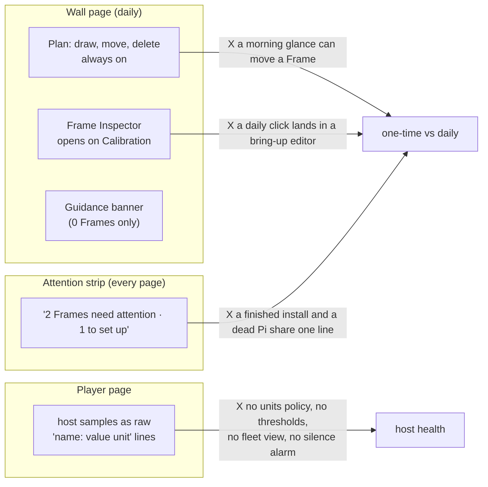
```mermaid
flowchart LR
  subgraph WALLP["Wall page (daily)"]
    PLAN["Plan: draw, move, delete<br/>always on"]
    INSP["Frame Inspector<br/>opens on Calibration"]
    GUID["Guidance banner<br/>(0 Frames only)"]
  end
  subgraph STRIP["Attention strip (every page)"]
    MIX["'2 Frames need attention · 1 to set up'"]
  end
  subgraph PLAYER["Player page"]
    RAW["host samples as raw<br/>'name: value unit' lines"]
  end
  PLAN -->|"X a morning glance can move a Frame"| R26["one-time vs daily"]
  INSP -->|"X a daily click lands in a bring-up editor"| R26
  MIX -->|"X a finished install and a dead Pi share one line"| R26
  RAW -->|"X no units policy, no thresholds,<br/>no fleet view, no silence alarm"| HH["host health"]
```

| Conflation | Where | What breaks |
|---|---|---|
| One-time writes on the daily face | The Plan draws, moves and deletes Frames on every visit (`Plan.jsx` imports `createFrame`, `moveFrame` and `deleteFrameRequest`) | A glance can change the layout (R26) |
| The Frame opens on its bring-up editor | The Inspector's default facet is Calibration (`Inspector.jsx:59`) | Every daily click on a tile lands in a one-time editor |
| Set-up gaps and incidents share one line | "Frames need attention · N to set up" (`AttentionStrip.jsx:48-55`) | Structural work and lost evidence compete for one sentence |
| No home for bring-up | What is left on an install is split across Guidance (0 Frames only), the strip's count and each Frame's facets | No place answers "what is not finished?" |
| Host health is unreadable | Samples render as raw lines on an open Player page only (`nodeRead.js:183-194`); no fleet view; no host-silence alarm (§7 gap 2) | Batch A cannot be shown |
| A contract gap for batch B | Kernel, base version, link and IP are text; `HostMetricV2.value` must be a finite number (`contracts/node_observation.py:16-27`) | Batch B cannot ship as "a generic metric list" alone |

**Requirements added by this Part** (binding, alongside R1–R25):

| # | Rule | Source |
|---|---|---|
| R26 | One-time hardware operations (drawing Frames, binding, calibrating, enrolling equipment) and steady-state views have separate homes. Each part of the domain gets its own home. | Owner steer, 2026-10-02 |
| R27 | A Central-driven debug overlay has a reserved home in the information architecture. It is not built in this batch. | Owner, 2026-10-02 |

Batches A and B are scope choices, not requirements. Inherited unchanged: design rules 1–3 and the truth kinds (§5), R20 (V2-only), R24 (progressive configuration), the Immich look and feel, and staying signed in.

## 47. Three shapes, one chosen

Three shapes were drafted in parallel and walked through five operator journeys by two adversarial reviewers. Both ranked the domain-homes shape first, both failed every shape as drafted, and both listed what the winner must absorb. The recommended shape below is the domain-homes shape with those changes applied.

| | **Domain homes (chosen; Q12 then removed its Set up worklist)** | Lifecycle modes (Run / Show / Set up) | Task workspaces (Overview + Commissioning) |
|---|---|---|---|
| How | Keeps today's sections and route tables. Each hardware home opens on its daily face; its one-time writes sit behind a named mode or facet in the same home. One new worklist section, Set up, lists what is structurally unfinished and links into the homes | The sidebar groups by activity; every route moves under `/run`, `/show` or `/setup`; Calibration and Binding become Set up journeys | An Overview landing of summary cards; a Commissioning workspace hosts every one-time editor and shows in the sidebar while items are open |
| Gives | Replacing a Pi and handling a 9 pm failure stay inside one home. Calibration and Binding stay behind the existing wall-only closure (R4). Show routes are unchanged. Least churn | The purest separation; a one-page morning check | The best morning check; the sharpest bring-up model |
| Costs | No dashboard: live Runs are one click away on Now. A second worklist beside Needs attention. One-time writes are still reached through daily homes | Every route moves (the Show hashes alone appear about 146 times in tests); R4 re-rooted; about 940 lines of facets rewritten as journeys; experts pay clicks for a corner nudge | Overview breaks rule 1; the `wall` and `attention` sections go; R4 re-rooted |
| Fatal as drafted | (fixed below) an unbind step before replacing; console-held thresholds; "reached then lost" not derivable | "Keep calibration" after a replacement leaves the Frame dark: every bind invalidates calibration (`registry.py:525`); the sidebar reorders on a reported fact mid-incident | "Qualified" as a bring-up step can never complete on day one and blocks during a live slideshow (qualification is a Stage fallback prerequisite, not a showing one); a Review step claims unqualified Frames "will not present", against the planner |

**Grafted into the recommended shape:**

| Idea | From | Lands in |
|---|---|---|
| Structural facts make unfinished items; liveness makes only alarms | Workspaces | Rule G2 |
| One pure model of unfinished items, shown by each home | Workspaces | §54 |
| A pipeline position is a "step", never a "stage" (Stage app is a verb) | Workspaces | Glossary, §48 |
| [Frame] and [Player] links on every attention row | Workspaces | §52 |
| Host facts as a separate text record | Workspaces | §52, G13 |
| The Player-side bind lists Frames whose Player is silent first | Workspaces | §50 |
| Spares are listed, never counted | Lifecycle | Rule G2 |
| Install prerequisites from existing `set` records | Lifecycle | §54 |
| A newly powered box fills in as its layers report | Lifecycle | §52, Players › Not driving a Frame |
| Thresholds served by Central | Lifecycle, Workspaces | G12 |
| "Unknown: not read" for a box the fleet read did not cover | Lifecycle | §52 |
| Guide the first step when there are no Frames (on the Wall's own face, after Q12) | Lifecycle | §48 |

**Cut from the domain-homes draft:** a System › Health page (a feature proposal outside the programme, §8); a bell replacing the strip (a working, tested strip; a count hides the cause); a Library group (Part F keeps no Library section); renaming `players` to `fleet`; five Player tabs (sections behind their own error boundaries stay); Setup tabs on Show, Sources and Releases (the steer is about hardware); thresholds held in the console (a console band is not Central's inference); kernel, base, link and IP in the metric list (the contract); an unbind step before a replacement (`bind` already replaces atomically under the Frame-generation fence, `registry.py:518-525`); "reached then lost is an incident" (an unbound Frame record cannot tell never-bound from was-bound); and a guided Replace-a-Player journey (bind-by-replace covers it; a wrapper stays a feature proposal). **After Q12** the chosen shape also drops its Set up worklist: each home lists its own unfinished items (§54).

## 48. The proposed shape

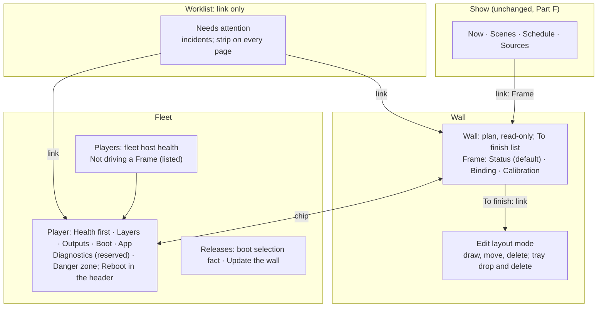
```mermaid
flowchart TB
  subgraph WORK["Worklist: link only"]
    ATT["Needs attention<br/>incidents; strip on every page"]
  end
  subgraph WALLG["Wall"]
    WALL["Wall: plan, read-only; To finish list<br/>Frame: Status (default) · Binding · Calibration"]
    LAY["Edit layout mode<br/>draw, move, delete; tray drop and delete"]
  end
  subgraph SHOWG["Show (unchanged, Part F)"]
    SHOW["Now · Scenes · Schedule · Sources"]
  end
  subgraph FLEETG["Fleet"]
    PL["Players: fleet host health<br/>Not driving a Frame (listed)"]
    PP["Player: Health first · Layers · Outputs · Boot · App<br/>Diagnostics (reserved) · Danger zone; Reboot in the header"]
    REL["Releases: boot selection fact · Update the wall"]
  end
  ATT -->|"link"| WALL
  ATT -->|"link"| PP
  WALL -->|"To finish: link"| LAY
  WALL <-->|"chip"| PP
  PL --> PP
  SHOW -->|"link: Frame"| WALL
```

**Navigation tree.**

```
Header   Photo Wall · Central pill · updated <age> · account (stays signed in)
Strip    Needs attention: incidents only, on every page               (changed: no "to set up")

WALL
  Wall              #/wall                          plan read-only; To finish list; tiles        (changed)
    Frame           #/wall/frames/<id>/status       default facet; carries Part F's planned fact (new default)
                    #/wall/frames/<id>/binding      bind; bind a different Output; Identify; unbind
                    #/wall/frames/<id>/calibration  Frame profile, live calibration, Save
    Edit layout     #/wall/layout                   draw, move, delete Frames; tray drop, delete (new mode)
SHOW
  Now               #/now                           Runs, Show now, Why, media pipeline          (unchanged)
  Scenes            #/scenes…                                                                    (unchanged)
  Schedule          #/schedule…                                                                  (unchanged)
  Sources           #/sources…                      Part F §37                                    (unchanged)
FLEET
  Players           #/players                       host health, worst first; Not driving a Frame (changed)
    Player          #/players/<device>              Health first; Diagnostics reserved; Reboot in header
  Releases          #/releases                      unchanged; Update the wall #/releases/update/…
WORKLIST
  Needs attention   #/attention                     every incident, Frame- or Player-keyed      (changed)
```

- **Aliases:** the shipped facet segment `nowshowing` (`routes.js:89`) parses to `status`, as `commissioning` parses to `calibration`. No other segment ever shipped, so there is no other alias. No section is renamed.
- **Landing:** always `#/wall`. With no Frames the Wall's own face is the first step: today's Guidance banner, without its Dismiss, with **Add first frame** opening Edit layout. So first run needs no separate section. Today the landing is Wall with the Guidance banner, otherwise Now.
- **Sidebar order is fixed:** Wall, Show, Fleet, Needs attention. Nothing reorders or counts on state.
- **The Immich parallel:** Immich keeps the daily library apart from Administration and its first-run onboarding. Here the daily faces play the library, each home's To finish list plays onboarding (it empties itself), and the Players list's host columns play Server stats. Grouped icon-and-label sidebar, cards in Show, status tables in Fleet.

**Words added** (glossary, §3):

| Word | Meaning | Not to be confused with |
|---|---|---|
| **To finish** | A home's own unfinished items: missing `set` records shown on that home's face, each linking to the mode or facet that fixes it | Needs attention (evidence of a problem) |
| **Step** | One position in a target's bring-up (placed, bound, calibrated) | **Stage app**, the fleet verb (§25) |
| **Spare** | An Unbound Player, or a box seen at boot and not enrolled: listed on Players under Not driving a Frame, never counted, never alarmed | A Player in trouble |
| **Edit layout** | The Wall's mode for drawing, moving and deleting Frames | Calibration (per-Frame geometry on a Panel) |
| **Status** (facet) | The Frame's default facet: its `planned` fact, health, readiness report, precedence Why and the bound Player's chip | The Player's Health section |
| **Host facts** | Text Host Management reports once per producer (one producer is one boot) and again on change: kernel release, interface, link state, address (G13) | Host samples (numbers, sampled); the boot's base, which is Central's own offer (`claimed`) |

> **Q12 (the bring-up home), answered 2026-10-02: no Set up section.** Each home shows its own unfinished items on its daily face and links to its own modes. Cost accepted: no one place answers "what is left on this install". Not chosen: the Set up worklist (one more section and a second list beside Needs attention) and the Set up workspace (every Wall route and the R4 closure re-rooted).

## 49. Design rules G1–G3 (design choices, not requirements)

| Rule | What it makes impossible | Guarantee |
|---|---|---|
| **G1. Homes own state and writes; lists only link.** Needs attention and each home's To finish list show a target, one fact (the cause or the missing step) and a link to the mode or facet that fixes it. They host no editor, no write and no second copy of an aggregate. This extends rule 1. | A second place to calibrate or bind; two summaries of one Frame drifting apart | Import-graph test: the attention and To finish modules import models, never page or write modules (extends the R4 test) |
| **G2. To finish is structural; Attention is evidence.** An unfinished item is a missing `set` record: a Frame not placed, not bound, or with calibration not valid (the Wall); node management off (the shell's banner); no boot selection (Releases). `reported` and `derived` facts appear beside an item as hints and never add or remove one. Liveness, thresholds and interruptions are Attention incidents, never unfinished items. Spares are listed on Players, never counted and never alarmed. | Bring-up reopening on a flaky night; an unfinished list that flips on a reported fact; a spare on the shelf counted forever | Construction: one pure model whose inputs are `set` records; model tests in which a silent Player must not add an item and an unbound Frame must not add an incident |
| **G3. Daily faces carry no one-time write, and nothing reorders on state.** Every home opens on its steady state: the Wall read-only with the Status facet; the Player page with Health first. One-time and destructive writes sit in the same home behind a named mode or facet (Edit layout, Binding, Calibration, Danger zone). The sidebar order and the landing route are constant. | A glance that drags a Frame; a Frame opening on its calibration editor; navigation moving under the operator mid-incident | Route tests for the default facet and the read-only Plan; a source-scan test that the Plan's write imports are reached only behind Edit layout |

## 50. Homes and the attention list: contracts

| Home | Owns | Daily face | One-time or rare (same home) | Reads | Never |
|---|---|---|---|---|---|
| **Wall** | Frame, Binding, Calibration (Registry) | Read-only plan; its To finish list (or, with no Frames, the first step); tiles; Frame › Status | Edit layout; Binding (bind, bind a different Output, Identify, unbind); Calibration | Snapshot | Host detail beyond one chip; Show authoring |
| **Now, Scenes, Schedule, Sources** | Run, Scene, Program, Source | Part F, unchanged | The Source flow's connection step (Part F) | Snapshot, media read | Any hardware write (R4 closure unchanged) |
| **Players** | The fleet of boxes | Host-health table, worst first; Not driving a Frame (spares listed, never counted) | — | Fleet host summary (G12) | A spare counted as a problem |
| **Player page** | One box (Device + Registry Player) | Health, then Layers, Outputs, Boot, App | Reboot (header); Outputs bind, listing unbound Frames and Frames whose Player is silent first; Stage app; Qualified fallback; Danger zone; Diagnostics (reserved) | Per-device node read (existing) + G12 thresholds | — |
| **Releases** | Release, Deployment, Boot selection, Effect gate | Part E, unchanged; its boot selection fact is its unfinished item | Publish, Select, Update the wall | Releases read | — |
| **Needs attention** (worklist) | Nothing | Incidents keyed by Frame or Player, each with [Frame] and [Player] links | — | Snapshot + G12 | An unfinished item; an editor |

Binding stays the one two-sided relationship (rule 1): the Frame's Binding facet and the Player page's Outputs both call the one `bind` write with the Frame generation. On a bound Frame that write is the replacement, so a Frame is never left unbound while a new box is chosen.

## 51. Lifecycle modes

| Mode | The operator's question | Where it lives |
|---|---|---|
| **Bring-up** | What is not finished? | The Wall's To finish list → Edit layout, Binding, Calibration; Players › Not driving a Frame → the Player page |
| **Steady state** | Is it healthy, and is the plan right? | Wall (landing), Players, Now |
| **Change** | Tonight's show; a new release | Scenes, Schedule, Now › Show now; Releases › Update the wall |
| **Incident** | What lost something it had? | Strip and Needs attention → Frame › Status or Player › Health; Reboot in the Player header |
| **Maintenance** | Recalibrate, replace a Pi, retire a box | The owning home's facet or section; an unfinished item appears only when a `set` record goes missing |
| **Diagnose** (future) | What exactly is the box doing? | Player › Diagnostics (reserved, §53) |

## 52. Host health (batch A) and node metrics (batch B)

**Home: Fleet.** The host is part of the box, and Fleet owns the box. Everything else links to it.

| Where | What | Truth kind |
|---|---|---|
| **Players list** | One row per box: standing, bound Frames (chips), Host Management last reported, temperature °C, throttling (now / occurred recently), CPU %, storage (/run free; App Manager's storage refusal), link and IP, kernel and base. Bound Players worst first; spares (Unbound, Not enrolled) below them, read with Central's thresholds withheld: plain values with their receipt age, no band, no tier and no threshold words (G2); retired boxes last, reading "Not read: Player retired"; no counts line (the strip counts incidents). A box the read did not cover reads "Unknown: not read". Values come only from the box's current boot | Values `reported`, latest, with Host Management's receipt age (R10); bands `derived`: "(Central's inference: at or above 80 °C, Central's threshold)"; the base twice: Host Management's `reported` tag and Central's offer, `claimed` |
| **Player › Health** (first section) | The same values with units and bands, grouped Thermal, Compute, Storage, Network, Software; "Host samples do not show visible pixels"; every metric, known or not, in a raw disclosure (moved from Layers) | As above; host facts `reported`, first |
| **Needs attention** | **Host silence** on a Bound Player: Host Management's last report is older than Central's served limit; named cause, distinct from Player-app silence (R4). Threshold incidents, raised only while the current boot reports: throttled now, temperature alarm, App Manager's storage refusal. Frame rows carry no host items. Every row has [Frame] and [Player] links | `derived`, basis named |
| **Wall › Frame › Status** | One chip: the bound Player's worst host fact, linking to Player › Health | Link chip (rule 1) |
| **Players › Not driving a Frame** | A hint per box, filling in as layers report: "seen at boot" → "Host Management last reported 2 s ago" → "Player app enrolled · 2 Outputs" | Hints; never gate (G2) |

An Unbound Player's host silence shows on its row (R4: named cause, bound or not) but raises no incident: an Unbound box is a spare or awaiting retirement (G2).

**What the console holds and what Central serves.** The console holds one metric catalog: known names map to a label, a group and display units. Unknown names render generically in the raw disclosure, so a new node metric is visible without a console release and labelled with one. Central serves the thresholds (bands per metric and the host-silence limit) beside the read, as `silent_after_seconds` already is (`health.js:100`). One classifier (`hostHealth.js` `classifyHost`, §65) judges with them, so the list, Attention and the Player page agree. With no threshold served, a value shows without a band and raises nothing: no console default.

**Gate G12 · fleet host summary** (backend, read-only; implied by the batch-A choice, R9). One admin read: each device's current-boot host observation with its receipt time (or the previous boot's receipt), App Manager's latest preparation sample, the current boot's host facts and base tag, and the threshold numbers. Without it the Players list keeps today's columns, the Player page shows only its own box, and host silence and threshold incidents cannot exist. Incidents appear only while a console tab is open: there is no push.

**Batch B split** (contract). `HostMetricV2.value` is a finite number, so:

| Value | Carried as |
|---|---|
| Temperature °C, throttling (now and occurred recently, as bits), CPU %, memory available, link speed | Rows of the generic metric list (`HostMetricV2`), sampled |
| Kernel release, interface name, link state, address | A new **host facts** record of short text, reported on change (`reported`, first) and served in G12: gate **G13** (contracts, node and Central) |
| The boot's base | Both, side by side (the owner's answer to the Q13 amendment, 2026-10-02; see the Q13 note below): the node reports the base it runs in the host facts record (`base_tag`, `reported`), and Central serves the tag in the boot offer the current admission claimed (`claimed`, labelled Central's offer). Differing tags show a `derived` mismatch fact naming both |

An IP address is reported by the host and is never identity, as a serial is never identity (R12).

**G13 · host facts record** (approved with Q13; shapes in §63 and §64).

| Aspect | Choice |
|---|---|
| Fields | Kernel release; interface carrying the default route; its link state; its address; the base tag this boot runs, as the node records it (the owner's answer to the amendment below). Each may be absent, read as "Unknown: Host Management could not read it" |
| Reporting | One producer is one boot. Host Management sends the record on each process start and again whenever a value changes, at most once per host interval, resending the same document until Central stores it. Never on a timer |
| Ingest | Its own node route under the host session, the producer checked against the session, its own daily intake kind |
| Storage | One row per producer, replaced only by a higher sequence; the row keeps the first receipt of its current values, worded once per record |
| Served | In G12, the facts of the current boot's Host Management producer only (never an older boot's), as `reported` with the first receipt |

> **Q13 (batch B text values), answered 2026-10-02:** "numbers stay in `HostMetricV2`; text values (kernel, base version, interface, link state, IP) go in a new host-facts record reported on change" (G13). Not chosen: widening `HostMetricV2.value` to text (a V2 wire change, no thresholds on text, versions re-sent every sample) and numbers only (no view could name a box's base or address).
>
> **Amendment (Part H, approved at the batch-4 gate, 2026-10-02; its base clause superseded by the owner's answer below):** the base version is not carried in the host facts record. The initramfs boots only the base that matches the offer Central sent it (§62, Base), so a node-reported base would repeat Central's offer back to it and be worded as a host reading (`reported`). Central serves the current admission's offer tag as a `claimed` fact instead (§62, §63 `boot`). The rest of the answer stands: kernel release, interface, link state and address are the record.
>
> **Owner's answer to the amendment (2026-10-02, after the batch-4 fix cycle 2; this is the record of Q13's base clause):** the node ALSO reports its own base version in the host facts record. `HostFactsV2.base_tag` is the tag of the base the boot runs as the node records it (bootstrap copies it into Host Management's configuration from the boot handoff its initramfs wrote after verifying the mounted base). Player › Health and the Players table show it as Host Management's report beside Central's offered tag (the current admission's boot offer, labelled Central's offer, `claimed`); when both are present and differ, a `derived` fact names both. No alarm is defined for it. This closes errata FX2-4. Cost: the base image carries no build-time version of its own (it is content-addressed and tagged at release), so the node's tag originates in the offer it verified at boot. Both tags are therefore read from ONE offer: Host Management claims its session with the handoff's `offer_id`, every claim of a boot must present the admission's `offer_id` (`node_boot_adoption_mismatch` otherwise), and G12 serves the facts of the current admission's Host Management producer beside that same offer's stored payload. The node's tag is the handoff's copy of the offer; Central's is the stored copy. A mismatch cannot mean a boot from a different offer, nor different bytes; it means the two copies of one offer disagree, which only a defect produces (the node reporting a tag its handoff does not hold, or Central storing a payload other than the one it served). It is a consistency check between the two records, not an operational signal.

## 53. The debug overlay's reserved home

- **Home:** the Player page's **Diagnostics** section, per Output. The overlay is an effect on a box's Outputs, so the box owns it. The section stays hidden until the overlay is built.
- **Truth kinds** follow live calibration: the desired state is `set`; Display Host's acknowledgment is `reported`, worded "presented to the compositor", never "visible" (R7).
- **Entry links, never copies:** Frame › Status ("Show diagnostics on this Frame's Panel"), the Binding facet's Identify (the overlay is the richer Identify), and an attention row for a Player.
- **An overlay left on is surfaced:** a chip on the Wall tile and an attention row, so no Panel stays labelled by accident.
- **Never on Show pages:** it changes what a Panel shows, so it is a hardware write under the R4 closure.

## 54. Bring-up tracking: one model, shown by each home

One pure model computes every unfinished item from records Central already serves, and each home renders its own part of it, so no two surfaces can disagree. Nothing counts it and no route depends on it. It is tested like `health.js`. It reads `set` records directly, not Frame health, because health ranks liveness above calibration (`health.js:150-210`).

| Item | Done when (`set`) | Shown on, linking to |
|---|---|---|
| Node management on | Central's node status is on | The shell's node-control banner (every page), linking to the runbook |
| A boot selection exists | The Releases read has a selection | Releases' boot selection fact |
| At least one Frame | The inventory has a Frame | The Wall's first step → Edit layout |
| Frame placed | The Frame is not in the Unplaced tray | The Wall's To finish → Edit layout |
| Frame bound | A Binding exists | The Wall's To finish → Frame › Binding |
| Frame calibration valid | `calibration_valid` | The Wall's To finish → Frame › Calibration |

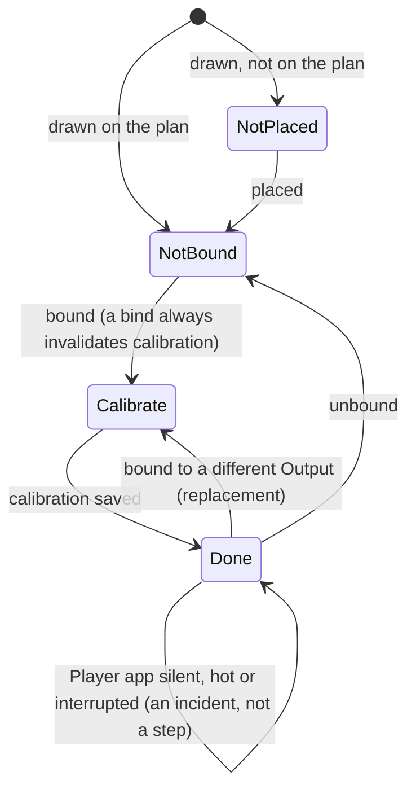
```mermaid
stateDiagram-v2
  [*] --> NotPlaced: drawn, not on the plan
  [*] --> NotBound: drawn on the plan
  NotPlaced --> NotBound: placed
  NotBound --> Calibrate: bound (a bind always invalidates calibration)
  Calibrate --> Done: calibration saved
  Done --> Calibrate: bound to a different Output (replacement)
  Done --> NotBound: unbound
  Done --> Done: Player app silent, hot or interrupted (an incident, not a step)
```

**Players not yet driving a Frame** (on the Players page; listed, never counted): boxes seen at boot and not enrolled (claimed serial, first boot received) and Unbound Players ("spare or awaiting retirement"), newest first, each linking to its Player page with its hint (§52).

**Leaving the view.** When nothing is unfinished, the Wall's To finish list is absent and the plan is the whole face. There is no flag, no dismissal and no timer. A new Frame or a rebind brings an item back by itself.

## 55. Journeys

**J1. A Pi died behind Frame lobby-left; install a new one** (about 7 clicks, one home).

| # | Where | What happens |
|---|---|---|
| 1 | Strip | "Frame lobby-left: Player app silent · last reported 2 h ago · Host Management silent 2 h" [Frame] [Player] (the liveness label is `health.js` `livenessFact`'s one `reported` wording, final fix round) |
| 2 | At the wall | Cable and power the new Pi. It netboots and enrolls. Players › Not driving a Frame lists "pi-12 · Unbound · Host Management last reported 3 s ago · Player app enrolled · 2 Outputs" (not counted) |
| 3 | Frame › Binding | "Bound to pi-07 HDMI-1 · Player app silent · last reported 2 h ago". **Bind a different Output** lists the Outputs of Unbound Players, newest enrolled first, each with its host chip; Identify Panel on any of them |
| 4 | Confirm | "Bind pi-12 HDMI-1 to lobby-left? It replaces pi-07 HDMI-1; calibration will need review." One `bind` write with the Frame generation. The Frame is never left unbound |
| 5 | Wall, To finish | "lobby-left · needs calibration" links to Frame › Calibration; the Binding facet also offers "Calibrate this Frame" (today's review notice) |
| 6 | Frame › Calibration | Live calibration on the committed values; Save on Display Host's acknowledgment (R7) |
| 7 | Done | The Wall's To finish list is empty. The strip clears when pi-12's readiness report arrives. pi-07 is now Unbound and silent: listed, never alarmed; Retire it from its Danger zone when convenient |

**J2. Morning check** (0 clicks on a healthy morning).

| # | Where | What happens |
|---|---|---|
| 1 | Open | Still signed in; lands on Wall |
| 2 | Strip and Wall | "No Frame needs attention"; the Wall shows nothing to finish |
| 3 | Tiles | A health dot and "On top: autumn · Program weekday-mornings" per Frame. Healthy and planned right: done |
| 4 | Optional | Players, worst first; Now for live Runs and the media pipeline (one click each) |

**J3. Change tonight's show** (unchanged by Part G; Part F's flows). Scenes → New Scene → Frames → Which Source? → presentation → Review → Save → Schedule it → When (tonight 18:00–23:00 BST) → Review → Schedule Program. No hardware surface is on the path (R4).

Also walked: a Pi failing at 9 pm is strip [Player] → Reboot (header) → confirm, 3 clicks; a rollout is Releases → Update the wall, 2 clicks.

## 56. Migration of existing surfaces

| Surface today (file) | Today | After Part G | Lifecycle |
|---|---|---|---|
| Sidebar (`Shell.jsx` `SectionNav`) | 8 links; groups Show, Wall, fleet, neutral | Groups Wall, Show, Fleet, Needs attention; no new section | — |
| Landing (`routes.js` `landingRoute`) | Wall with 0 Frames, else Now | Always Wall; with 0 Frames its face is the first step | — |
| Guidance banner (`Guidance.jsx`) | Wall, 0 Frames; dismissible | Kept as the Wall's first step; Dismiss removed; Add first frame opens Edit layout | Bring-up |
| Attention strip (`AttentionStrip.jsx`) | Alarms + "N to set up" | Incidents only; host causes; [Frame] [Player] links | Incident |
| Needs attention page (`AttentionPage.jsx`, mounted by `neutralRoutes.jsx`) | Frame rows + readiness reports | Adds Player-keyed rows (host silence, thresholds) | Incident |
| Plan, read (`Plan.jsx`) | Wall, always editable | Wall, read-only | Steady state |
| Plan draw, move, delete; tray drop and delete (`Plan.jsx`, `UnplacedTray.jsx`) | Wall, always on | Wall › Edit layout (`#/wall/layout`); the tray stays on the Wall as a select-only list | Bring-up, rare |
| Inspector default facet (`Inspector.jsx`, `wallState.js`) | The remembered facet, else Calibration; a cause visit opens `facetFor`'s facet | Status as `facetFor`'s fallback; the remembered facet goes; a cause visit still opens the cause facet | Steady state |
| Now-showing facet (`NowShowingFacet.jsx`; Part F's Planned) | A facet, segment `nowshowing` | **Status** facet (segment `status`, alias `nowshowing`; the file keeps its name until batch 5): the same content plus the Player's host chip (§57) | Steady state |
| Readiness notice (`ReadinessNotice.jsx`) | Inspector header for every facet (`Inspector.jsx:98`), Attention, Player Outputs | Unchanged | Incident |
| Binding facet (`BindingFacet.jsx`) | Bind when unbound; Unbind | Adds bind a different Output when bound (one write); host chips on choices | Bring-up, maintenance |
| Calibration facet, live calibration | Default facet | Same home; not the default | Bring-up |
| Now: Runs, Show now, Why, media pipeline, frame-health badges | Now | Unchanged | Steady state, change |
| Scenes, Schedule, Sources | — | Unchanged (Part F) | Change |
| Players list (`PlayersPage.jsx`) | No node read | Host-health table (G12) | Steady state |
| Player page (`PlayerPage.jsx`) | Layers first; raw host lines; Reboot section | Health first; raw lines in Health's disclosure; Reboot in the header; Diagnostics reserved | Steady state, incident |
| Releases, Update the wall | — | Unchanged | Change |
| Node-control and effect-gate banners | Shell | Unchanged; node management off is also the prerequisite item (G2) | — |
| Sign-in (`SignInScreen.jsx`) | — | Unchanged | — |
| **New** To finish list (Wall) and Not driving a Frame (Players) | — | On each home's face | Bring-up |
| **New** host silence and threshold incidents | — | Needs attention (G12) | Incident |
| **Reserved** debug overlay | — | Player › Diagnostics | Diagnose |

## 57. How Part G re-homes Part F

| Part F item | Under Part G |
|---|---|
| The Show group (Now, Scenes, Schedule, Sources), its routes and route tables | Unchanged. Show stays free of hardware writes (R4 closure) |
| §34: the Frame facet labelled **Planned** (label only; Part F wrote the segment as `now-showing`, but the shipped segment is `nowshowing`, `routes.js:89`) | Becomes the **Status** facet (`status`; `nowshowing` parses to it) and the Frame's default: the same content plus the bound Player's chip; the readiness notice stays in the Inspector header. Part G was approved before S1 was built, so batch 4's W1 builds Status from today's Now-showing content, and batch 5's S1 adds the `planned` fact to it |
| §34: the Plan tile's planned line | Unchanged, on the read-only Plan |
| §37: the Source home, flow and preview; no Library section | Unchanged. Library connections stay inside the Source flow; they are not an unfinished item (bring-up is hardware, R26) |
| The media pipeline on Now; the media-worker alarm after G11 | Stays on Now. A media-worker attention row is deferred (§58) |
| Nav "Now" | Unchanged; second in the sidebar, after Wall |

## 58. Costs, deferrals and what is not planned

**Costs.**
- **No dashboard.** Live Runs and the media worker are one click away on Now; the Wall answers health and plan per Frame. A summary card would break rule 1.
- **No one place answers "what is left on this install"** (Q12's cost). The Wall and Players each list their own unfinished items; an installer visits both.
- **One-time writes stay inside daily homes**, behind a mode or facet. An operator who wants nothing editable on the Wall gets a read-only default, not absence.
- **Scope moves.** Batches A and B alone were about five slices. Part G adds the Wall slice and makes G13 explicit; Part H cuts batch 4 into eight beads with R1 and docs (§68), across contracts, node, Central and console, with two backend gates (R9). That fires the >4-beads, cross-package and security triggers.
- **Host incidents need an open tab** (no push), and each open console adds one admin poll (G12).

**Deferred:** a newer-release prompt outside Releases; a media-worker attention row (after G11); a guided Replace-a-Player wrapper (a feature proposal, §8); push or notifications; search.

**Not planned:** a Set up section (Q12); a Central health page (§8); a Library section; renaming sections; a stored bring-up flag or "confirmed working" record.

**Failure modes at this layer.**

| What breaks | What the operator sees | Guarantee |
|---|---|---|
| G12 not served or failing | Players list without host columns ("Unknown: not read"); no host incidents; the Player page's Health from its own node read | `fact()` degrades; per-section error boundaries |
| No threshold served for a metric | The value without a band; no incident | Model test (no console default) |
| A rebind invalidates calibration | One unfinished item on the Wall, no alarm | G2 model test |
| A Player goes silent during bring-up | An incident; the unfinished list unchanged | G2 model test |
| An unknown metric name | A raw line, unbanded | Catalog test |

## 59. What happens next

Part H (§60–§69) designs batch 4 at the feature layer. The Set up tracer drafted here is withdrawn with Q12, and the rough slices became Part H's beads:

| Part G slice | Part H bead (§68) |
|---|---|
| G-T, the Set up tracer | Withdrawn (Q12). Its one model becomes W1's To finish list; the host-health tracer T1 replaces it |
| G-W, the Wall daily face | W1 |
| G-N, node metrics and host facts | N1 (numbers) and F1 (host facts, G13) |
| G-R, G12 | T1 (G12 with one metric and host silence), grown by N1 and F1 |
| G-H, the host-health UI | H1 |
| G-A, host incidents | A1 |
| G-D, docs | D1 |

# Part H: batch 4, host health, node metrics and the Wall's daily face (feature layer)

**Status:** designed 2026-10-02 from Part G as approved (Q12, Q13), then revised the same day after two adversarial reviews (domain-fidelity, security and node-contract lenses; simplicity and scope lens). Approved at the owner's batch-4 gate and **built** the same day (beads R1, T1, N1, F1, W1, H1, A1; D1 docs). The sections below describe the batch as built: each implementation finding is folded into the section it changes, citing its errata entry (`.claude/errata.md`, "console DDD batch 4"). The [console UX design](operator-console-ux-design.md), [fleet implementation map](player-fleet-implementation-map.md#fleet-host-health-batch-4-2026-10-02), [Player node domain model](player-node-domain-model.md#host-report-and-reboot) and [runbook](runbook.md#host-health-on-the-players-pages) describe it for their readers.
**Layer:** feature. It covers screens, wordings with truth kinds, contract and model shapes, signatures, the one migration, failures, the tracer and the beads. Inherited unchanged: Part G's homes, rules G1–G3 and G12; G13 with its base clause as the owner answered it after this batch's gate (the node's `reported` base tag beside Central's `claimed` offer, a `derived` mismatch; §52); `fact()` and its truth kinds (§5, §11); one send function per verb, judged on the newest read (§10, §28); the V2-only posture (R20); forward-only numbered migrations; the import layering (`contracts` imports no domain package, `uplink` stays stdlib-only, `player` never imports `central`).
**Scope (chosen at the sizing gate):**
- Bead R1 (§45).
- Host health tier A, the UI.
- Host health tier B, node metrics. This includes App Manager's storage room, because the tier-A ask "App Manager bytes" has no node producer today (§60, finding 2).
- The IA changes: a read-only Wall with an Edit layout mode, Status as the default facet, each home's unfinished items, the constant landing route and the regrouped sidebar (Part G §48), and Reboot in the Player header.

The Diagnostics section stays a reserved home only (§53): nothing is built for it and no hidden or dormant section ships. Part F's S1, L1–L3 and D1 move to batch 5.

## 60. What batch 4 covers, and two findings that shape it

```mermaid
flowchart LR
  subgraph NODE["Pi"]
    SMP["Host Management sampler<br/>samples every 2 s"]
    FCT["Host Management facts<br/>text, on change"]
    APM["App Manager<br/>storage room on refusal"]
  end
  subgraph CENTRAL["Central"]
    ING["observation intake<br/>one stored sample per producer per interval"]
    OBS[("node_host_observations<br/>(immutable)")]
    HF[("node_host_facts<br/>one row per producer = per boot")]
    PREP[("node_manager_observations")]
    ADM[("current boot admission<br/>→ its boot offer's base tag")]
    THR["host thresholds<br/>(numbers only)"]
    G12["G12 · GET /v1/operator/node/hosts"]
  end
  subgraph CONSOLE["Console"]
    HOOK["useFleetHosts<br/>one poll, in the shell"]
    CLS["hostHealth.js<br/>classifyHost, the one classifier"]
    UI["Players table · Player › Health<br/>Needs attention · Status chip"]
  end
  SMP -->|"POST /v2/node/observations<br/>once per interval"| ING --> OBS
  FCT -->|"POST /v2/node/host-facts"| HF
  APM -->|"POST /v2/node/app-preparation"| PREP
  OBS --> G12
  HF --> G12
  PREP --> G12
  ADM --> G12
  THR --> G12
  G12 --> HOOK --> CLS --> UI
```

| Slice | What it adds | Packages |
|---|---|---|
| **T1** (tracer) | One node number (temperature) through G12 to a banded fact, Central-side coalescing, the current-boot selection and a host-silence incident | node, contracts, Central, console |
| **N1** | Firmware throttling flags, CPU %, link speed, App Manager's storage room, their thresholds and catalog entries | node, Central, console |
| **F1** | The host facts record (G13) and the current boot's base tag | contracts, node, Central, console |
| **W1** | A read-only Wall, Edit layout, Status as the default facet, the Wall's To finish list, a strip without "to set up", the constant landing route and the sidebar groups | console |
| **H1** | The Players table, worst first; Player › Health first; Reboot in the header | console |
| **A1** | Threshold, refusal and storage incidents; the Status host chip; the strip's host suffix | console |

**Finding 1: Host Management posts faster than Central admits.** Host Management ticks every 2 s (`appliance/node/host_runner.py:123`) and posts one host observation on every tick (`:74-79`), about 43,200 a day. Central admits 20,000 observations per device per UTC day and answers 429 after that (`central/fleet/node_sessions.py:63-70`). So for roughly the last 13 hours of each UTC day Central stores no host sample, and a host-silence incident built on G12 would fire every day. The rows are also immutable, with no retention (`central/migrations/053_node_control.sql:105-113`).

**The class fix lives on Central's side.** Nodes on an older base keep their 2 s cadence until they reboot, and the fleet runs mixed bases by design (Releases, Stage). So a fix that relies on the node's cadence fixes nothing. Instead:
- **Central stores at most one host observation per producer per interval.** It judges this on the producer's own boot clock: the post's `sampled_boottime_ms` against that of the producer's newest stored sample (`node_observations.py` `_coalesced_in`). A producer is one boot, so both readings come from one kernel's boot clock: a clock compared only with itself, as §15's display read does. No Central receipt clock, of this replica or another, enters the judgement (errata FX3-2, superseding FX2-3 for coalescing).
- **A faster post stores nothing.** Central answers 200 with disposition `coalesced` and claims no intake.
- **Each producer stores at most ⌈86,400 / interval⌉ + 1 samples a day.** The cap is twice that, which leaves room for two boxes claiming one serial (they flap visibly, by design).
- **One contract constant, the interval, sets the coalescing window, the cap and the host-silence limit.** The node uses the same constant for its posting cadence. That saves Central work, but the guarantee does not rest on it.

Guarantee: construction, on any number of Central replicas. Central holds one number, and no node cadence can push intake past the cap. A node that misreports its own boot clock can defeat coalescing for its own producer only, and the derived cap and `intake_full` still bound it (consistent with trusting Player identity).

Two details keep the fix safe:
- **Deployed nodes ignore the answer.** Today's node never reads the observation answer (`host_runner.py:76-79`), so `coalesced` breaks no deployed base.
- **A Central clock step changes nothing.** Coalescing reads no Central clock. A post whose boot-clock reading is older than the stored sample's (a negative difference) stores.
- **Node-side jitter costs one post, never the limit.** Network and receipt jitter no longer matter: coalescing compares sample times. The node stamps a sample at the start of its 2 s tick (`host_runner.py` `tick`) but judges the post due on its monotonic clock after polling commands, so stored samples are normally about 16 s apart and a post is coalesced only when one tick's poll is slow by more than about 1 s relative to the previous posted tick's. The next post then stores, so the stored gap is at most about two intervals (30 s), still inside the 60 s limit (errata T1-4, FX3-2). The first post after a new session goes at once and is coalesced when it falls within one interval of the last stored sample; the next one stores. A window narrower than the interval would need the cap re-derived from the window, so it is not taken.

What it does not cover:
- **Three or more boxes claiming one serial** can still fill the cap. G12 then serves `intake_full`, and the console words that row as Central's refusal, never as silence (§62).
- **A short-lived `fault_code`.** A host observation is a latest-value sample, not an event record. A recovery fault (`recovery.py` `telemetry`, active while its obligation is not `controlled`) that lasts less than about one interval can go unstored: a batch-4 base posts only once per interval (`host_runner.py` `_observation_due`), and an older base's 2 s posts inside the interval are coalesced whatever their `fault_code` (errata FX2-5). Keying host coalescing on `fault_code`, as App Manager's is keyed on its state, is not taken: it recovers nothing on a batch-4 base, which never sends the intermediate sample, and it would need the host cap re-derived.
- **Central replicas' clocks** (errata FX2-3). Receipts (`received_at`, `first_received_at`) are stamped by the ingesting replica's process clock and G12's `read_at` is the serving replica's clock; coalescing no longer reads either (above). With more than one replica (a rolling deploy at least), these are different clocks. The error is bounded by their skew: a G12 served by a leading replica calls host silence early and ages receipts high, a lagging one late and low (clamped at 0). At NTP skew (milliseconds) against a 15 s window and a 60 s limit this is invisible; it becomes visible only if replica clocks disagree by a sizeable fraction of the interval. The class fix is one time authority for every Central receipt and every "now" compared with one: PostgreSQL's `clock_timestamp()` read in the same transaction, as the rollout gate already does (`rollout_gate.py:133`). It touches every node ingest path, G12, the node status read and their fake-clock tests, and the same class predates batch 4 (session expiry, the status read's receipt ages), so it is a residual bead of its own (R-clock, §69), not part of batch 4.

**The interval is 15 s** (a design choice; the owner can change the one constant).

| Choice | Cost |
|---|---|
| **15 s** (chosen) | Host values reach Central up to 15 s late. Host silence is called after 60 s. About 5,760 immutable rows a day per box, with no retention |
| 2 s | About 43,200 rows a day per box. Silence is called after 8 s, so one slow poll on the Pi raises an incident |
| Raise the cap only | Rejected: the class stays, and the next cadence change breaks it again |

**Finding 2: App Manager's byte fields have no producer.** `ManagerPreparationV2` carries `available_bytes` and `required_bytes` (`contracts/node_preparation.py:23-24`). But its only constructor never passes them (`appliance/node/manager_observation.py:33-37`). A storage refusal also surfaces only as the generic `fault` state: the admission raises `node_storage_capacity` (`appliance/node/capacity.py:44-51`), and the runner reports it as `manager_preparation_fault`. So the tier-A ask "App Manager bytes" needs a node change. In N1, App Manager reports the two numbers of the admission decision itself, on a `refused` sample (§63).

## 61. Screens

**Wall, the daily face (`#/wall`).**

| Region | Content |
|---|---|
| Header | Surface filter; **Edit layout** button |
| To finish (only when not empty) | One row per unfinished item, in Frame order, each with one link: "lobby-left · not on the plan" [Edit layout]; "lobby-left · needs a Player" [Binding]; "lobby-right · needs calibration" [Calibration]. Calibration is asked only of a bound Frame (an unbound Frame has none to save), and `place` is independent, so a Frame carries at most `place` plus one of `bind` or `calibrate`, in that order |
| First step (no Frames) | The Guidance banner (`Guidance.jsx`), kept. It has no Dismiss button and `wallState.js` holds no dismissal state; **Add first frame** opens `#/wall/layout`. It renders only when there are no Frames, as today |
| Plan | Read-only tiles: a health dot and today's now-showing line (batch 5's S1 adds the planned line). Selecting a tile opens Frame › Status. No draw, drag or delete. A Surface with no placed Frame reads "No Frames placed on this Surface"; the drawing hint shows only in Edit layout |
| Unplaced tray | Stays on the daily face as a select-only list. Selecting an entry opens its Inspector, as today (`UnplacedTray.jsx:39`, `:70`), so a bound Frame that is not placed is still one click away. Its drag-out and Delete move to Edit layout |
| Inspector | Facets **Status · Binding · Calibration**. The health line and the readiness notice stay in its header, for every facet (`Inspector.jsx:95-98`) |

**Edit layout (`#/wall/layout`).** Today's Plan writes, moved here:
- Draw, with the Frame profile form.
- Drag to move.
- Delete on the selected Frame.
- The tray's drag-out drop and Delete.

`LayoutEditor.jsx` owns every one of these writes. It passes them as `edit` handlers to `Plan.jsx` and `UnplacedTray.jsx`, and neither of those imports a write module. The header reads "Editing layout" with **Done**, which returns to `#/wall` (to the selected Frame's Status when one is selected). The Inspector is not shown here. The selection belongs to the mode, because the route names no Frame: it starts at the Frame the daily face last showed. The Wall's remembered route never records `#/wall/layout`, so the sidebar's Wall link always opens the daily face.

**Frame › Status (`#/wall/frames/<id>/status`, the default).**
- **Content.** Today's Now-showing content, relabelled Status and placed first in the facet list. The file `NowShowingFacet.jsx` keeps its name until batch 5's S1 reworks it. The Frame's Player gets a host chip (A1) under the facet title. `Inspector.jsx`, which is Wall-only, renders `HostChip.jsx` and hands it to the facet as its `hostChip` prop. The facet does not import it, because `NowShowingFacet.jsx` is shared with the Show side (`RunsRegion` imports its `PrecedenceExplanation`), and the chip's fleet reads must stay out of the Show side's import closure (the R4 test, unchanged; errata A1-1).
- **Route.** The segment is `status`. The shipped segment `nowshowing` (`routes.js:89`) parses to it, as `commissioning` parses to `calibration`. There is no other alias, because no other segment ever shipped. A Frame route with no facet segment (`#/wall/frames/<id>`) parses to Status and is never formatted.
- **Which facet opens.** `facetFor` stays (`health.js:288-290`), with Status replacing the remembered facet as its fallback. A visit from Needs attention or from a Player page still opens the facet that shows the cause, so J1's click count holds. An ok Frame, and a plain tile click, open Status. The last-open-facet memory that `wallState.js` held is gone.

**Players list (`#/players`).** One table, the console's first. At phone width it scrolls sideways; there is no second card rendering. Rows are ordered by one model (`hostHealth.js` `playersTable`): Bound Players first, worst first by tier (alarm, notice, unknown, ok), then by name; then spares (Unbound, Not enrolled) by name, read with Central's thresholds withheld (`describeSpare`): plain `reported` values with their receipt age and no band, no tier and no threshold words (no "· hot", no "silent", no "at last report"), so a silent spare reads its silence as a plain receipt age and never sorts among alarms (G2). Because Central's refusal of a box's host reports is judged only past the silence limit, a spare's row also never reads "Central refused Host Management reports today"; its Player › Health page still does; then retired boxes by name, whose host columns read only "Not read: Player retired" (G12 omits them, as Health is hidden for them). There is no counts line: the strip counts incidents, and the sort answers "which first". The host columns are hidden while the fleet host read is skipped (node control not `on`). Each cell keeps its fact's label ("Temperature: 81 °C · hot …"), because `FactLine` is the only fact renderer (rule 2) and always prints it; the examples below show the bare value. Standing is a `FactLine`; only the Frames are chips, each linking to its Frame. The row's tier and each item's band are carried by classes (`players__row--<severity>`, `players__item--<band>`) and drawn as a leading rule (errata H1-2, H1-3).

| Column | Example |
|---|---|
| Player | pi-07 (link) |
| Standing, Frames | Bound · [lobby-left] |
| Host Management | last reported 4 s ago |
| Temperature | 81 °C · hot |
| Throttling | Throttled now |
| CPU | 23 % busy |
| Storage | 1.2 GB free in /run; "App Manager refused a preparation: needs 1.4 GB, room 0.9 GB" when its latest sample is that refusal |
| Network | eth0 up · 1000 Mb/s · 192.168.1.40, with "host facts first received 3 d ago" beneath. The link speed is the `link_speed` metric (cataloged in N1, first rendered here); interface, state and address are the facts record |
| Software | kernel 6.6.51+rpt-rpi-v8 · Host Management reported base 2026.10.01 · Central's offer: base 2026.10.01; when the two tags differ, a third line "Base differs: …" (§62) |

**Not driving a Frame** sits below the table. `PlayersPage.jsx` filters the rows `playersByDevice` already produces (`players.js`) by standing: Unbound Players, and boxes seen at boot but not enrolled. They are listed newest first as far as served times allow, each with its hint taken from `hostRow(read, deviceId)`, and never counted. The boot facts read keeps no first-boot time for a box seen at boot, so those boxes come first (in `playersByDevice`'s order), then Unbound Players, newest registration first. Exact newest-first order would need a first-boot receipt on the netboot read (errata H1-1).

**Player page (`#/players/<device>`).**

| Part | Content |
|---|---|
| Header | Name, standing, enrollment, serial, bound Frames, and **Reboot**. Reboot is today's `RebootSection`, moved unchanged together with its own `SectionBoundary` (`PlayerPage.jsx:383-386`), so a Reboot render error cannot take down the header. It still sends only through `sendReboot`, and is hidden when the box is retired or node control is off |
| **Health** (first) | Groups Thermal, Power and throttling, Compute, Storage, Network and Software. The host facts' one receipt line. An "Every reported metric" disclosure holds the raw lines moved out of Layers, the fault code, and "Host samples do not show visible pixels." The raw lines are G12's `host` (this boot's newest sample), so Health and its disclosure always show one sample. Health is hidden, not Unknown, while the fleet host read is skipped, and for a retired box, which G12 omits (errata H1-4, H1-5). On a spare's own page (Unbound, Not enrolled) Health keeps its bands: only the Players table unbands spares (`playersTable`), and no spare raises an incident or a count, so G2 holds on the worklists; whether the spare's own page should unband too is open (§69, errata FX3-3) |
| Then | Layers (Host Management keeps its "Last reported" fact and session line) · Outputs · Boot · App · Danger zone |

**Strip and Needs attention.**
- **The strip counts incidents only:** "2 Frames · 1 Player need attention", or "No Frame or Player needs attention · 1 awaiting a first report". A Player incident alone makes the strip an alarm. `awaiting` counts every Frame whose Player has not yet sent a first report and is still within the silence limit, settling or not (errata W1-2).
- **Structural to-dos move to the Wall.** "N to set up" is gone, and unbound and needs-calibration Frames leave the strip and the page for the Wall's To finish list.
- **A host read that has not loaded is named.** While the fleet host read is mounted but has failed or not yet loaded, the summary ends " · host health not read", so missing host rows never read as health. With node control not `on` the shell mounts no read, so the strip adds no suffix and the node-control banner names the cause (errata A1-2).
- **Labels name both kinds of row.** The strip's toggle reads "Show list" / "Hide list", and the list is named "Frames and Players needing attention" (errata A1-5).
- **The page lists Frame rows, then Player rows.** Player rows carry host incidents, for Bound Players only. No host item is added to a Frame row: the Player row carries the [Frame] link, and the Frame's Status carries the chip.
- **Links follow R4.** Every row carries [Frame] and [Player] links on Wall-side and Fleet pages, and is plain text on Show pages.

**Sidebar.** Wall, Show (Now showing, Scenes, Schedule, Photo sources), Fleet (Players, Releases), Needs attention, in a fixed order. The Show labels stay as shipped until batch 5 renames them (Now, Sources). Each group carries an accessible name (`<ul aria-label="Wall">` and so on) and no visible heading (errata W1-6). The landing route is always `#/wall`.

## 62. Wording and truth kinds

**Which sample a row shows.** One classifier (`classifyHost`) puts each Player in exactly one state. Values come only from the current boot. Bands and threshold incidents are raised only while that boot's Host Management is reporting.

| State | When (checked in this order) | Values shown | Bands and incidents |
|---|---|---|---|
| Not read | The device is absent from G12 | "Unknown: not read" | None |
| Never reported | No Host Management receipt served: none from this boot and none from the most recently superseded admission (G12 sees no older boot; errata T1-3) | "Unknown: no Host Management report from this boot or the one before" | Bound: one Unknown row on Needs attention, unknown tier. Unbound: none |
| Refused | The newest receipt is older than the limit, and Central's observation intake for this box is full today | As Silent | Bound: the refusal row, in place of silence |
| Silent | The newest receipt (this boot's, else the previous boot's) is older than the limit | This boot's values through `fact()`'s one `reported` wording, "Host Management last reported 2 min ago · 95 °C at last report", with no band; the previous boot's values are never shown ("Unknown: no Host Management sample from this boot") | Bound: host silence only |
| Not yet on this boot | No sample from this boot, and the previous boot's newest receipt is within the limit | "Unknown: on this boot · the previous boot's Host Management last reported 40 s ago" (the `unknown` kind's one wording) | None |
| Reporting | This boot's newest sample was received within the limit | As reported, with the receipt | Banded; threshold and storage incidents |

**Tier.** A row's tier is alarm for Silent and Refused, unknown for Not read, Never reported and Not yet on this boot, and for Reporting its worst band. On a Reporting row, a cataloged metric that was not sent reads "Unknown: not reported" on its own item but does not raise the row's tier, so a box on a base before batch 4 sorts by what it does report (errata T1-6).

**Fleet host values** (Players list and Player › Health; one wording each).

| Item | Wording | Kind | Served from |
|---|---|---|---|
| Host Management receipt | "Host Management last reported 4 s ago" | `reported`, latest | `host.received_at`, `read_at` |
| A metric value | "62 °C", "23 % busy", "1.2 GB free in /run", "1000 Mb/s", each through `fact()`'s one `reported` wording, receipt first: "Host Management last reported 4 s ago · 23 % busy" (errata T1-2, N1-3) | `reported` (latest) | `host.metrics` |
| Temperature band | "81 °C · hot (Central's inference: at or above 80 °C, Central's threshold)"; notice: "76 °C · warm (Central's inference: at or above 75 °C, Central's threshold)". The console composes the basis from the served number and unit | `derived` | `thresholds.metrics[].notice_at`, `alarm_at` |
| Throttling now | "Throttled now", "Under-voltage now", "Frequency capped now", "Soft temperature limit now", in that order, joined with " · "; when any now flag is set, only the now words show. Alarm basis "(Central's inference: the firmware flag is set, Central's threshold)" | `reported`; its alarm `derived` | `*_now` flags |
| Throttling occurred | "None now · under-voltage occurred recently (the firmware's sticky flag)"; several join with ", " and say "flags" ("under-voltage, throttling occurred recently (the firmware's sticky flags)"); the words are under-voltage, frequency capping, throttling, soft temperature limit. Nothing set reads "None now". The item is all or nothing: any of the eight missing reads "Unknown: not reported", any duplicated "Unknown: two values reported" | `reported`; notice `derived` | `*_occurred` flags |
| CPU | "23 % busy", never banded | `reported` | `cpu_busy` |
| Metric not sent | "Unknown: not reported" | `unknown` | absence |
| A cataloged metric twice in one sample | "Unknown: two values reported" | `unknown` | duplicate name |
| No threshold served, or a unit mismatch | The value alone, no band | — | — |
| Host storage | "1.2 GB free in /run" | `reported` | `runtime_available` |
| App Manager storage refusal | "App Manager last reported 6 s ago · App Manager refused a preparation: needs 1.4 GB, room 0.9 GB" (receipt first, `fact()`'s one wording; errata N1-3). Band alarm, shown only in the Reporting state | `reported`, latest | `preparation` (`refused`, fault `node_storage_capacity`) |
| Boot preparation (Software) | From the host facts record's `boot.stages` and `boot.failed_units`: the first of handoff, storage, prepare (in that order) that stopped, because the cause precedes its effects. A stage stopped when its record is `refused` or `failed`, or when PID1 lists its own unit (`photo-wall-node-<stage>.service`) failed while its record is `running` or absent: the step was killed before its exit write (an out-of-memory victim, or `TimeoutStartSec`'s SIGTERM) or the record write failed (4 GB node design §6); that reads "boot preparation failed at prepare (unit failed, no exit record)"; else the first `running`; else done once prepare is done; else not started. Worded as a host fact with the record's receipt: "Host Management reported boot preparation refused at storage: needs 3.8 GB of memory, the box has 1.9 GB · first received 1 min ago" (fault `node_memory_class`); another refusal "… refused at prepare: needs 2.1 GB, room 1.8 GB"; a failure "… boot preparation failed at prepare (os:ENOSPC)", or "… failed at storage (memory_controller_absent)", without the parenthesis when no fault is reported; otherwise "boot preparation running: prepare", "boot preparation done", "boot preparation not started". Numbers are decimal GB through the console's one `gigabytes()` formatter, so the 4 GB class's 3584 MiB minimum reads "3.8 GB" (errata E-T4-1, E-T4-2, E-T4-3). Refused or failed: band alarm, no Central threshold | `reported`, first | `facts.boot.stages`, `facts.first_received_at` |
| Base units (Software) | `boot.failed_units` minus the unit of each boot preparation stage the Boot preparation item reads as stopped (`photo-wall-node-<stage>.service`), whose failure that item already reports, so one cause raises one incident; a stage unit whose stage did not stop (its record `done`) stays listed: "Host Management reported base unit failed on this boot: photo-wall-app-broker.service · first received 1 min ago"; several "base units failed on this boot: a · b and 3 more" (at most four names, then the count); a count with no name "base units failed on this boot: 2 not named"; none "no base unit failed on this boot" (no band). Any failed unit: band alarm | `reported`, first | `facts.boot.failed_units`, `failed_units_more` |
| Out of memory (Storage) | The `oom_kill:` rows (slices base, preparation, app), only non-zero slices, most kills first: "Host Management last reported 4 s ago · Out-of-memory kills on this boot: app 2 · base 1"; every row 0: "No out-of-memory kills on this boot" (no band). Any kill: band notice, a fixed band (not a Central threshold), so no incident | `reported`, latest | `host.metrics` `oom_kill:*` |
| Boot items on an older node | A node whose facts carry no `boot` field, or no facts at all, reads "Unknown: not reported" on Boot preparation and Base units; a sample with no `oom_kill:` row reads the same on Out of memory. As every unsent item, it does not raise the row's tier | `unknown` | absence |
| App Manager intake full | "Unknown: Central refused App Manager reports today: its daily intake cap for this box is full", on the Storage item in place of any refusal judgement, because the newest stored sample may be frozen (errata FX1-1) | `unknown` | `preparation_intake_full` |
| A fact value on a Silent or Refused row | Every reported value, host facts included (the reported base too), carries " at last report"; the record's receipt line, Central's `claimed` offer and the mismatch line are unchanged (errata FX2-1) | `reported` | `host`, `facts` |
| Host facts receipt | "Host facts first received 3 d ago": one line per record, and any changed value renews it | `reported`, first | `facts.first_received_at` |
| Interface and link | "Host Management reported eth0 up", rendered with `factText(fact, {receipt: false})` under the record's one receipt line (`receiptText`; errata F1-3). A null link state with a known interface: "Host Management reported eth0" and "Unknown: Host Management could not read the link state of eth0"; a null interface: "Unknown: Host Management could not read the default-route interface" | `reported` (the record's receipt) | `facts` |
| Address | "Host Management reported address 192.168.1.40". Never identity (R12) | `reported` (the record's receipt) | `facts` |
| Kernel | "Host Management reported kernel 6.6.51+rpt-rpi-v8" | `reported` (the record's receipt) | `facts` |
| Base, Host Management's report | "Host Management reported base 2026.10.01" under the record's receipt line; "Unknown: Host Management could not read the base tag" when null | `reported` (the record's receipt) | `facts.base_tag` |
| Base, Central's offer | "Central's offer: base 2026.10.01 (claimed at boot by this boot's node session, unverified)". It is the tag of the boot offer the current admission claimed; the initramfs refuses a base that does not match that offer. Releases names bases the same way | `claimed` | `boot.base_tag` |
| Base mismatch | Only when both tags are present and differ: "Base differs: Host Management reported 2026.09.30, Central's offer 2026.10.01 (Central's inference: the reported tag and the offered tag differ)". No band, no incident | `derived` | `facts.base_tag`, `boot.base_tag` |
| No current boot, or an offer with no tag | "Unknown: no current node boot admission" / "Unknown: this boot's offer names no base tag" | `unknown` | `boot` |
| A fact field absent | "Unknown: Host Management could not read the kernel release" | `unknown` | null field |
| No facts on this boot | "Unknown: no host facts received on this boot" (Host Management on bases before batch 4 sends none), on the record line only, with no Unknown line per field; Central's offer line still shows, with no reported base line and no mismatch | `unknown` | `facts: null` |
| Host silence | "Host Management silent · last reported 3 min ago (Central's inference: no report for over 60 s, Central's limit)"; on the previous boot's receipt, "… · the previous boot's Host Management last reported 2 h ago (…)". The console composes "60 s" from `host_silent_after_seconds` | `derived`, with its `reported` receipt | `host.received_at` or `previous_boot_received_at` |
| Refused | "Central refused Host Management reports today (Central's inference: its daily intake cap for this box is full) · last stored 3 min ago" | `derived` | `intake_full` |
| Read failed | The last good values stay, under "Last read failed: <served error>" (as `useNodeDevice` does); with none, "Unknown: the fleet host read failed" | `unknown` | — |

Central's boot offer is never worded as a host report, and the node's report never stands in for Central's offer: the two base lines are separate facts with separate sources.

**Wall.**

| Item | Wording | Kind |
|---|---|---|
| Not placed | "lobby-left · not on the plan" [Edit layout] | `set` (the placement record, through the tray's rule `isUnplaced`) |
| Not bound | "lobby-right · needs a Player" [Binding] | `set` |
| Calibration | "lobby-right · needs calibration" [Calibration] | `set` (`calibration_valid`) |
| First step | Today's Guidance text, unchanged; [Add first frame] opens Edit layout | `set` (empty inventory) |
| Edit layout header | "Editing layout" · Done | — |
| Host chip | The bound Player's worst item ("pi-07 · throttled now", "pi-07 · Host Management silent 3 min"), else "pi-07 · Host Management last reported 3 s ago"; while the fleet host read has failed, "pi-07 · host health not read", never a judgement of the last good values (errata A1-3). No chip renders for an unbound Frame, while the fleet host read is skipped (node control not `on`), or before its first answer. It links to the Player page | the chosen item's kind |

**Needs attention** (Bound Players only).

| Row | Wording | Kind |
|---|---|---|
| Host silence | "pi-07 (Frame lobby-left) — Host Management silent · last reported 2 h ago" [Frame lobby-left] [Player pi-07] | `derived` |
| Refused | "pi-07 (Frame lobby-left) — Central refused Host Management reports today" | `derived` |
| Never reported | "pi-07 (Frame lobby-left) — Unknown: no Host Management report from this boot or the one before" | `unknown` |
| Threshold (Reporting only) | "pi-07 (Frame lobby-left) — throttled now · under-voltage now" (one Throttling item is one incident, its now words lower-cased and joined) · "— 82 °C · hot" · "— App Manager refused a preparation: needs 1.4 GB, room 0.9 GB" | `derived` |
| Boot (Reporting only) | "pi-07 (Frame lobby-left) — boot preparation refused at storage: needs 3.8 GB of memory, the box has 1.9 GB" · "— boot preparation failed at prepare (os:ENOSPC)" · "— base unit failed on this boot: photo-wall-app-broker.service" | `derived` |
| Summary | "2 Frames · 1 Player need attention" | — |

**Incidents are exactly the classifier's alarm items**, plus Never reported's one Unknown row. The classifier's own gate (Silent and Refused band nothing but the receipt) is the one reporting gate, and `hostIncidents` holds no second one. A notice (warm, a sticky occurred flag, an out-of-memory kill) raises no incident. Keys are `player:<device>:<item>` (errata A1-4), so a stopped boot preparation is `player:<device>:boot_preparation` and a failed base unit `player:<device>:base_units`. A failed preparation unit is left out of Base units, so one cause raises one incident; with five or more failed units a preparation unit sorted past the fourth name is still counted in "and N more" (errata E-T4-4). On a Silent or Refused row the boot items carry " at last report" and no band, like every value. A spare (Unbound, Not enrolled) shows them unbanded in the Players table and raises no incident (rule G2); its own Health page keeps the band (§69, errata FX3-3).

**Words not used:** "to set up", "Set up", "online", "healthy" for a host, "since boot" for a firmware flag, and any band the console invents.

## 63. Contract and model shapes

**The interval.** `HOST_OBSERVATION_INTERVAL_SECONDS` is 15 and lives in `contracts/node_observation.py`. The node still samples every 2 s. It posts one observation per interval, measured on its own monotonic clock, and posts the first at once after each new session. Central derives four things from the constant:

| Derived | Value at 15 s |
|---|---|
| The coalescing window | 15 s |
| The `observation` intake cap: 2 × ⌈86,400 / interval⌉ | 11,520 |
| The `host_facts` intake cap: the same formula | 11,520 |
| The host-silence limit: 4 × interval | 60 s |

**`HostMetricV2` additions.** There is no wire change: `value` stays a finite number, and names and units are tokens.

| name | unit | source | Meaning | Omitted when |
|---|---|---|---|---|
| `soc_temperature` | `celsius` | `host_sampler` | Thermal zone 0, millidegrees ÷ 1000, one decimal | No readable thermal zone |
| `under_voltage_now` | `boolean` | `firmware` | Throttle flag bit 0 | Flags not readable |
| `frequency_capped_now` | `boolean` | `firmware` | Bit 1 | Flags not readable |
| `throttled_now` | `boolean` | `firmware` | Bit 2 | Flags not readable |
| `soft_temperature_limit_now` | `boolean` | `firmware` | Bit 3 | Flags not readable |
| `under_voltage_occurred` | `boolean` | `firmware` | Bit 16, sticky: set since boot or since another firmware reader last cleared it | Flags not readable |
| `frequency_capped_occurred` | `boolean` | `firmware` | Bit 17, sticky | Flags not readable |
| `throttled_occurred` | `boolean` | `firmware` | Bit 18, sticky | Flags not readable |
| `soft_temperature_limit_occurred` | `boolean` | `firmware` | Bit 19, sticky | Flags not readable |
| `cpu_busy` | `percent` | `host_sampler` | 100 × (1 − Δidle ÷ Δtotal) of `/proc/stat`'s aggregate line since the previous sample (idle includes iowait) | The process's first sample |
| `link_speed` | `megabits_per_second` | `host_sampler` | `speed` of the default-route interface | Not readable or negative |

The sticky bits are named `occurred`, not `since boot`. The mainline `raspberrypi-hwmon` driver polls the firmware with a request that clears them, so "since boot" may be false on a base that loads it. "Occurred recently" is true either way.

**Where the new values come from:**
- `/sys/class/thermal/thermal_zone0/temp`.
- The Raspberry Pi firmware driver's `get_throttled` sysfs attribute (hex), found by the glob `/sys/devices/platform/*/*:firmware/get_throttled` (the Pi 4 and Pi 5 platform nodes are named differently); the first sorted match is read, and none means no rows.
- `/proc/sys/kernel/osrelease`, for the kernel release.
- `/proc/stat`.
- `/proc/net/route` and `/sys/class/net/<if>/`.
- `/proc/net/fib_trie`, for the address (below).

All stay readable inside the unit's sandbox. `ProtectKernelTunables` makes `/sys` read-only, not unreadable, and `PrivateDevices` hides only `/dev`. None of the new reads needs a subprocess or netlink. The unit's `RestrictAddressFamilies=AF_UNIX AF_INET AF_INET6` would refuse netlink (`appliance/systemd/photo-wall-host-core.service:37`). The existing unit-state rows already run `systemctl`; that is unchanged.

**Row rules:**
- **Unreadable means omitted.** A metric that cannot be read is omitted, never sent as zero.
- **Each cataloged name appears at most once.** The sampler emits each name once (a node test). The contract keys uniqueness on (name, source) (`contracts/node_observation.py:41`), so it does not refuse a duplicate; the classifier shows that item as Unknown.
- **The sample stays well inside the limits.** It grows from at most 28 rows to at most 39 of the 64 allowed, about 3 KB of the 16 KB limit.

**App Manager's storage room** (N1). There is no contract change: `ManagerPreparationV2`'s fields already exist.

| Piece | Rule |
|---|---|
| `preparation_room(total, available, free, used)`, in `capacity.py` | The smaller of: the memory class's store − used (the store was a fixed budget until the [memory classes](player-node-domain-model.md#memory-classes-and-the-node-store-2026-10-03) of 2026-10-03), free, and MemAvailable − emergency headroom, clamped at 0 (`available_bytes` is a counter, so a negative room could not be encoded; the decision is unchanged because the requirement is always positive; errata N1-1). `admit_preparation` refuses exactly when 2 × size + overhead exceeds it, the same decision as today (`capacity.py:44-51`), now with its two numbers named |
| The refusal | The preparer raises `StorageShort(required, room)`. It subclasses the existing `ValueError("node_storage_capacity")`, so every current catcher is unchanged |
| The sample | `DesiredPreparation` turns the refusal into `sample("refused", command, fault="node_storage_capacity", available_bytes=room, required_bytes=required)` and returns, so `manager_runner`'s catch-all failure sample does not overwrite it; nothing is recorded as prepared, so the next poll retries as today. No other state carries bytes |
| Storage short | The classifier raises it, band alarm and only in the Reporting state, when the current boot's newest App Manager sample is `refused` with fault `node_storage_capacity` and carries both numbers. A newer sample clears it |

**`HostFactsV2`** (G13). It lives in a new `contracts/node_host_facts.py` and imports only stdlib and `contracts.*`.

| Field | Type | Rule |
|---|---|---|
| `producer` | `NodeProducerV2` | owner `host_core` |
| `sequence` | int ≥ 1 | Host Management's one journal counter, shared with observations and evidence, so it only rises |
| `sampled_boottime_ms` | int ≥ 0 | The node's own boot clock; never compared with Central's |
| `kernel_release` | text or null | Printable ASCII without spaces, ≤ 64. `+` is allowed, so it is not a `token` |
| `interface` | text or null | `token(value, 15)` (`[A-Za-z0-9][A-Za-z0-9_.:/-]*`, `contracts/node_protocol.py:17-19`). The interface carrying the default route in `/proc/net/route` |
| `link_state` | enum or null | The kernel's operstate: `up`, `down`, `dormant`, `lowerlayerdown`, `notpresent`, `testing`, `unknown` |
| `base_tag` | text or null | `token(value, 128)`, as the boot offer's base tag. The base this boot runs as the node records it: bootstrap copies the verified handoff offer's base tag into Host Management's `host.json`, and Host Management reports it (owner decision 2026-10-02) |
| `address` | text or null | The interface's IPv4 address in canonical form: the one `/32 host LOCAL` entry in `/proc/net/fib_trie` that falls inside one of that interface's own routes in `/proc/net/route`. Null when there is none, or more than one |

On the wire: `{"schema": 2, "kind": "host_facts", …}` with sorted keys, the exact key set, and at most 2,048 bytes. The node passes every field through the contract's own field rule (`valid_fact`) before building the record, so an odd value becomes null instead of an unencodable record. The base appears twice in G12 and never merged: the node's `facts.base_tag` (`reported`) and Central's `boot.base_tag` (`claimed`, below).

**Thresholds** (new `central/fleet/host_thresholds.py`). Numbers only, served by G12 and judged only by the console's one classifier. A band a metric does not have ("—" below) is served as `null`; every row carries at least one number. The values are current choices, edited in code. There is no operator edit, no console default, and no served prose.

| Metric | Unit | Notice at or above | Alarm at or above |
|---|---|---|---|
| `soc_temperature` | celsius | 75 | 80 (placeholders, to confirm against the bench Pi's firmware limit) |
| each `*_now` flag | boolean | — | 1 |
| each `*_occurred` flag | boolean | 1 | — |
| host silence | seconds | — | 4 × interval, served as `host_silent_after_seconds` |

The console composes every basis from these numbers:
- Numeric metrics: "at or above {n} {unit}, Central's threshold".
- Flags: "the firmware flag is set, Central's threshold".
- Silence: "no report for over {host_silent_after_seconds} s, Central's limit".

So no number is written in two places.

**G12 · `GET /v1/operator/node/hosts`.**
- **Access:** an admin session only. It answers 401 when signed out or with Player credentials, and 503 `node_control_disabled` when node control is off.
- **Snapshot:** one transaction at `REPEATABLE READ READ ONLY`, as `central/operator_snapshot.py:68` does, taking no fleet or device lock.
- **Coverage:** retired and revoked devices are omitted.
- **Times:** Central's clock, in epoch seconds: receipts from the ingesting replica's process clock, `read_at` from the serving replica's (one clock with one replica; the cross-replica cost is in §60, errata FX2-3). The console ages every receipt against `read_at` (`facts.js:82`) and never against the browser's clock.

```
{ "read_at": 1759400000.0,
  "thresholds": { "host_silent_after_seconds": 60,
                  "metrics": [ { "name": "soc_temperature", "unit": "celsius",
                                 "notice_at": 75, "alarm_at": 80 }, … ] },
  "devices": [ { "device_id": "…",
      "host":        null | { "received_at", "metrics": [HostMetricV2 as sent], "fault_code": str | null },
      "previous_boot_received_at": null | number,
      "intake_full": bool,
      "preparation_intake_full": bool,
      "boot":        null | { "base_tag": str | null },
      "facts":       null | { "first_received_at", "kernel_release", "interface", "link_state", "address", "base_tag" },
      "preparation": null | { "received_at", "state", "fault", "available_bytes", "required_bytes" } } ] }
```

| Field | Rule |
|---|---|
| The current boot | The device's admission in its current generation with no `superseded_at`; there is at most one (`node_sessions.py:129-131`) |
| `host` | The newest observation, by sequence through the primary key, of the current boot's `host_core` producer: the newest admitted, normally the only one, because a producer is one boot (§64). Null when that producer has stored none, or when there is no current boot. A superseded or duplicate-serial boot's sample is never served here |
| `previous_boot_received_at` | Served only when `host` is null: the receipt of the newest observation of the most recently superseded admission's `host_core` producer |
| `intake_full` | Today's observation quota row (Central's UTC day) has reached the cap |
| `preparation_intake_full` | Today's preparation quota row has reached its derived cap. While true the console does not judge `preparation` (it may be frozen): Storage reads "Unknown: Central refused App Manager reports today: its daily intake cap for this box is full" (errata FX1-1) |
| `boot` | The base tag in the current admission's boot offer, read from `node_boot_offers.offer_payload` as `node_lifecycle.py:342-348` does. Null with no current boot |
| `facts` | The facts row of the current boot's `host_core` producer only. Null otherwise; never an older boot's |
| `preparation` | The newest sample of the current boot's `app_manager` producer |
| `thresholds` | From `host_thresholds.py`, the same on every read |

**Query shape.** Per device, G12 takes these steps, never `ORDER BY received_at` over a table:
1. Select the current admission and the most recently superseded one.
2. Select their producers by (admission, owner).
3. Take each producer's newest row with `ORDER BY sequence DESC LIMIT 1` on the primary key.

**Wire compatibility.**

| | Central before batch 4 | Central with batch 4 |
|---|---|---|
| A node on a base before batch 4 (2 s posts, no facts, no new metrics) | Today | Observations coalesced to one per interval. New metrics read "Unknown: not reported" and facts read "Unknown: no host facts received on this boot". The base is still named, from Central's own record (Central's offer line only) |
| A node on a batch-4 base | 15 s posts fit today's 20,000 cap. `POST /v2/node/host-facts` answers 404, so the node stops sending facts for an hour at a time. New metric rows are accepted (tokens, at most 64 rows) | Full |

## 64. Storage, ingest and lifecycle

**Migration `062_node_host_facts.sql`**, the batch's only migration, forward-only:

| Change | Shape |
|---|---|
| New table `node_host_facts` | `producer_id` (primary key, references `node_producers`), `sequence` (> 0), `payload` (≤ 2,048 bytes), `first_received_at`, `received_at` (Central's clock). Not immutable: one row per producer, replaced by a higher sequence |
| `node_intake_quotas.kind` | gains `host_facts`, as 059 added `preparation` |

No index is added: G12 reads `node_host_observations` through its primary key only.

**Observation ingest** (T1; a change to `NodeObservations.record`). Preparation ingest coalesces the same way, keyed per (state, operation, fault): a post is stored only when the producer stored no sample with that key in the last interval, so App Manager's `preparing`/`refused` alternation on every 2 s poll stores each state at most once an interval. Its cap is derived too, `PREPARATION_DAILY_CAP` = 4 × ⌈86,400 / interval⌉ (two states, two boxes per serial). Cost: a state that returns within one interval of its last stored sample is stored again only after that interval (errata FX1-1).

| Case | Central does | Answer |
|---|---|---|
| The same sequence is already stored | As today | `duplicate`, or 409 `node_observation_identity_conflict` |
| The producer's newest stored sample is less than one interval older on the producer's boot clock (0 ≤ incoming `sampled_boottime_ms` − stored `sampled_boottime_ms` < interval) | Stores nothing; claims no intake | 200 `{"stored": false, "disposition": "coalesced", …}` |
| Otherwise | Claims intake and inserts, as today | `recorded` or `historical`; 429 at the cap |

**Facts ingest, `POST /v2/node/host-facts`.** It takes the host session credential and a body of at most 2,048 bytes. Historical sessions are accepted, as for observations.

| Case | Central does | Answer |
|---|---|---|
| No row for the producer | Insert; both receipts = now | `recorded`, or `historical` from a superseded boot's session (errata FX2-2) |
| Higher sequence, same values (the five facts compared, not the sequence) | Update `sequence`, `payload` and `received_at`; keep `first_received_at`; claim no intake, so a Host Management restart loop cannot spend the quota (errata FX3-4). The payload carries the sequence, so it must move too, or the node's resend of the new document would read as a conflict (errata F1-1) | `recorded`, or `historical` from a superseded boot's session (errata FX2-2) |
| Higher sequence, new values | Replace the payload; both receipts = now | `recorded`, or `historical` from a superseded boot's session (errata FX2-2) |
| Same sequence, same payload | Nothing | `duplicate` |
| Same sequence, different payload | Refuse | 409 `node_observation_identity_conflict` |
| Lower sequence | Nothing | `stale` |
| Producer is not the session's | Refuse | 403 `node_producer_mismatch` |
| Malformed, including a non-token interface | Refuse | 422 |
| Over the derived daily cap | Refuse | 429 `node_intake_capacity` |

**A producer is one boot.** A producer is (admission, owner, incarnation) (`node_sessions.py:214-222`). The incarnation lives in the BootStore session row (`appliance/node/session.py:35-38`), which survives hourly session renewal and Host Management restarts (`RuntimeDirectoryPreserve=yes`). So one facts row per producer means one per boot.

**On the node.** Host Management keeps its send state in memory:
- **It resends on every process start.** Central answers `duplicate`, or stores the same values under a higher sequence and keeps `first_received_at`.
- **It sends again on every value change, and on every producer change.** A producer changes only with a new boot or device generation, never on re-enrollment (the wire producer has no session in it), so the comparison of (producer, values) is a guard, not the way out of a refusal (errata F1-2, corrected by FX1-2).
- **A refused session (401, 403) keeps the document pending.** Central answers 401 for an expired session; the next `ensure()` enrolls a new one and that tick's post resends the same document.
- **A 404 turns facts off for an hour** (`FACTS_ROUTE_RETRY_SECONDS`, this process's monotonic clock), then the document is pending again, so a replica without the route during a rolling deploy or a rollback does not silence facts for the boot.
- **A session renewal changes nothing.**
- **At most one document per interval per process.** Facts are read once per observation post, so a flapping link sends at most one document per interval. A process restart sends its unchanged document again under a new sequence, but Central claims intake only for changed values, so a crash loop (`Restart=always`, 2 s) cannot outrun the derived cap either (errata FX3-4).

```mermaid
stateDiagram-v2
  [*] --> Pending: process start (current values, next sequence)
  Pending --> Stored: recorded, duplicate or stale
  Pending --> Pending: no answer, 5xx, 429, 401 or 403 (same document, next post)
  Pending --> Dropped: another 4xx (409, 422, ...)
  Pending --> Off: 404 (a Central without the route)
  Off --> Pending: an hour on the node's monotonic clock
  Dropped --> Pending: a value or the producer changed (new document, next sequence)
  Stored --> Pending: a value or the producer changed (new document, next sequence)
  Stored --> Stored: values unchanged (nothing sent)
  Off --> [*]: process exit
```

**Concurrent first inserts.** One session's posts are serialized by the session row lock that `authenticate_in` takes. Two sessions of one producer posting a first document at once would hit the primary key and answer 500; the node resends at its next post and reads `duplicate` or `recorded`. A single-threaded Host Management never does this, so no upsert is added (errata F1-6).

## 65. Interface sketch (signatures only)

**Node** (`appliance/node/`):

```
class LinuxHostSampler:                                    # host_linux.py
    def __init__(self, proc=Path("/proc"), filesystem=Path("/run"), sys=Path("/sys")) -> None
    def sample(self) -> tuple          # existing rows + soc_temperature, cpu_busy, link_speed
    def throttling(self) -> tuple      # the eight firmware flags, or () when not readable
    def facts(self) -> dict            # HostFactsV2 field values, None per unreadable field
class HostRunner:                                          # host_runner.py
    def tick(self) -> None             # samples every tick; per interval posts an observation, then pending facts
    def _send_facts(self, now_ms: int) -> None      # the §64 state machine
def preparation_room(*, total: int, available: int, free: int, used: int) -> int     # capacity.py
class StorageShort(ValueError): required: int; room: int; fault: str              # capacity.py; fault "node_storage_capacity" by default
PreparationObservation.sample(state, *, command=None, fault=None,
                              available_bytes=None, required_bytes=None) -> None   # manager_observation.py
```

**Contracts:**

```
HOST_OBSERVATION_INTERVAL_SECONDS: Final[int]              # node_observation.py
MAX_HOST_FACTS_BYTES: Final[int] = 2048                    # node_host_facts.py
LINK_STATES: Final[frozenset[str]]
@dataclass(frozen=True, slots=True)
class HostFactsV2:
    producer: NodeProducerV2; sequence: int; sampled_boottime_ms: int
    kernel_release: str | None; interface: str | None; link_state: str | None; address: str | None
    base_tag: str | None                                       # the node's own record of its base (owner decision)
def encode_host_facts(value: HostFactsV2) -> bytes
def parse_host_facts(raw: bytes) -> HostFactsV2
def valid_fact(name: str, value: object) -> bool          # the per-field rule; the node nulls a value it refuses (F1-7)
def stored_fact_values(raw: bytes) -> dict[str, str | None]   # Central's read side only (G12 and the same-values
                                                           # check): a missing or now-refused stored fact reads None;
                                                           # ingest stays strict through parse_host_facts (FX4-5)
HostFactsV2.values() -> tuple                              # the five facts, as ingest's "same values" compares them (F1-1)
```

**Central** (`central/fleet/`):

```
HOST_SILENT_AFTER_SECONDS: Final[int]    # host_thresholds.py; 4 × the interval
def thresholds_document() -> dict        # host_thresholds.py; numbers only
OBSERVATION_DAILY_CAP: Final[int]        # node_sessions.py; 2 × ceil(86400 / the interval)
HOST_FACTS_DAILY_CAP: Final[int]         # node_sessions.py; the same formula
class NodeObservations:                  # node_observations.py
    def record(self, session_id: UUID, credential: str, raw: bytes) -> dict        # + coalescing
    def record_facts(self, session_id: UUID, credential: str, raw: bytes) -> dict
    def fleet_hosts(self) -> dict        # G12
POST /v2/node/host-facts                 # node_routes.py -> record_facts
GET  /v1/operator/node/hosts  (admin)    # node_routes.py -> fleet_hosts
```

**Console** (`central/console/src/`):

```
// fleetHosts.js
useFleetHosts({ skip }) -> { read, failed, error, refresh }   // usePolledRead, 15 s; mounted once in the shell,
                                                               // skip unless nodeControl.state === "on" (errata T1-1)
// hostHealth.js: the one classifier (imports models only: G1, errata FX3-1)
hostRow(read, deviceId) -> HostRow | null                     // pure lookup, kept out of the polling hook
HOST_CATALOG                                                   // name -> { label, group, format(value) }
classifyHost(row, read) -> { state, items: Array<{ group, label, fact, band }>,
                             worst: { fact, severity, item } | null, severity: "alarm" | "notice" | "unknown" | "ok" }
    // state: "not_read" | "never" | "refused" | "silent" | "not_yet_this_boot" | "reporting"; bands only when "reporting"
hostIncidents(snapshot, read, bootFacts) -> HostIncident[]    // Bound Players only; read null when failed or skipped
hostFactItems(row, read) -> { receipt: Fact, items }          // the facts record (reported base included), Central's
                                                               // offered base and any mismatch, worded once per record
playersTable(rows, hosts) -> Array<{ row, group: "bound" | "spare" | "retired", tier, health, facts }>
                                                               // G2: only Bound rows tiered; spares unbanded; retired last
judgeHost(hosts, deviceId) -> { row, health, facts }          // the one page entry from FleetHosts; a failed read with no
                                                               // earlier result words "Unknown: the fleet host read failed"
incidentSeverity(incidents) -> "alarm" | "unknown" | "ok"      // the strip's tier for its Player incidents
hostChip(name, health) -> string; hostWords(item, { brief })  // the chip's words (A1-6)
// facts.js
factText(fact, { receipt = true }) -> string                  // receipt: false omits a reported fact's receipt (errata F1-3)
receiptText(fact) -> string | null                            // "first received 3 d ago", for the record's one line
// unfinished.js: G2's one model
wallUnfinished(snapshot) -> Array<{ frameId, step: "place" | "bind" | "calibrate", route }>
// health.js
wallAttention(snapshot) -> { frameCount, awaiting, alarms }   // `todos` removed: structural items are wallUnfinished's;
                                                               // awaiting = every awaiting-report Frame within the limit (W1-2)
facetFor(health, fallback)                                     // unchanged; Wall callers pass "status"
// routes.js
FACETS = ["status", "binding", "calibration"]; DEFAULT_FACET = "status"
FACET_ALIASES = { nowshowing: "status", commissioning: "calibration" }
parseRoute("#/wall/layout") -> { section: "wall", mode: "layout" }; landingRoute() -> { section: "wall" }
parseRoute("#/wall/frames/<id>") -> { section: "wall", id, facet: "status" }   // never formatted
// components
LayoutEditor.jsx         owns every Plan and tray write (framesApi writes, ConfirmAction delete, useMutate);
                         renders Plan and UnplacedTray with `edit` handlers
Plan.jsx, UnplacedTray.jsx   select-only unless given `edit`; import no write module
Guidance.jsx             no Dismiss; Add first frame opens #/wall/layout
WallUnfinished.jsx · HostHealthSection.jsx
HostChip.jsx             rendered by Inspector.jsx and handed to NowShowingFacet.jsx as `hostChip` (A1-1)
```

## 66. Failure modes

| What breaks | What the operator sees | Guarantee |
|---|---|---|
| G12 fails or is slow | The last good values under "Last read failed"; the strip ends " · host health not read" and the chip reads "<Player> · host health not read"; host incidents are withheld while the read is failing (`hostIncidents` gets `read` null), never judged from the last good values, and the suffix says why the list may be short | `usePolledRead` folds failures into the value; browser test |
| A box is not in G12 | "Unknown: not read" on its row; no incident | Model test |
| A node on an old base posts every 2 s | One stored sample per interval; the cap is never reached; no false silence | Coalescing (construction on any number of replicas, on the producer's boot clock; §60); DB test: a fake producer posting every 2 s for 24 simulated hours stores ≤ ⌈86,400/15⌉ + 1 and never gets 429 |
| Central replicas' clocks disagree (more than one replica, e.g. a rolling deploy) | At NTP skew, nothing visible. At large skew: host silence called early by a leading G12 replica, late by a lagging one; ages clamp at 0 | None beyond NTP: stated cost (errata FX2-3); the class fix is residual bead R-clock (§69) |
| A recovery fault lasts less than about one interval | It may never appear in a stored sample, so Health's "Reported fault" line never shows it | None: stated cost; the host observation is a latest-value sample (§60, errata FX2-5) |
| Central's clock steps, or replicas disagree | Coalescing is unaffected: it reads only the producer's boot clock. Ages clamp at 0 (`max(0, …)` in `fact()`) | DB tests: a stepped clock and two replicas skewed ±40 s, mutation-probed against a receipt-clock judgement; existing `fact()` rule (R10) |
| Host Management restarts in a loop | Each start resends its unchanged facts; Central stores them without claiming intake | DB test: a same-values resend at the cap records |
| Three boxes claim one serial and fill the cap | "Central refused Host Management reports today", never silence | `intake_full`; DB and model tests |
| A host dies hot or throttled | Host silence only; its last values read "Host Management last reported <age> ago · <value> at last report", unbanded; no "now" incident | Classifier gate; model test with mutation probe |
| A Player reboots | Until the new boot reports: "Unknown: on this boot · the previous boot's …", then silence after the limit; never the old boot's values or facts | Current-boot selection; DB test with mutation probe |
| Thermal zone or firmware flags not readable (another board, older firmware) | "Unknown: not reported" for those items; no band, no incident | Omit-never-zero node test |
| A cataloged metric arrives twice | That item reads "Unknown: two values reported" | Model test |
| First sample after a Host Management start | CPU "Unknown: not reported" until the next sample | Node test |
| Facts send fails | The same document is resent at the next post; meanwhile "Unknown: no host facts received on this boot" | Node test; DB duplicate case |
| Central without the facts route (404) | The node stops sending facts for an hour, then resends the current document | Node test |
| The facts POST meets a refused session (401, 403) | The document stays pending; the re-enrolled session's post resends it | Node test |
| Facts change while a send is in flight | A new document with a higher sequence; Central keeps the highest | DB stale and replace cases |
| A link flaps | At most one facts document per interval; the derived cap holds | Node test |
| App Manager refuses for storage | One storage incident from that sample, cleared by the next sample | Node test (a real sample carries both numbers); DB test feeding a parsed node sample through G12 |
| App Manager alternates `preparing`/`refused` all day | Coalesced per (state, operation, fault) per interval: the cap is not reached and G12's newest sample stays `refused`; `verified` is stored at once | DB test: a simulated 24-hour loop, mutation-probed |
| App Manager's intake is full anyway | Storage reads Central's refusal, Unknown; the frozen sample is never judged | `preparation_intake_full`; model and DB tests |
| No threshold for a metric, or a unit mismatch | The value without a band; no incident | Model test; no console default |
| Node control off | No G12 poll; the one existing banner; host columns hidden | The shell polls only when the node status read says `on`. `nodeReadsAllowed` is not enough here: it admits a failed status read, and the read sent before sign-in completes fails 401 (errata T1-1). While the status read is failing, host lines are hidden, not Unknown. Browser test |
| Retired or revoked box | Absent from G12 | DB test |
| Host silent on a Bound Player while its app still reports | A host-silence incident; the Frame's health still follows the Player app (R4: two named causes) | Model test |
| Host silent on an Unbound Player | Shown on its row, unbanded and below every Bound row, and under Not driving a Frame; no incident (G2) | Model and browser tests (`playersTable`), mutation-probed |
| A retired box | Its row comes last and reads "Not read: Player retired" | Model and browser tests |
| An old bookmark (`…/nowshowing`, `…/commissioning`) | Opens Status or Calibration | Route test |
| A glance drags a tile or a tray entry | Nothing moves; the daily face holds no write | Import-graph test (Plan.jsx and UnplacedTray.jsx import no write module) |
| The R4 closure | Calibration and Display controls stay reachable only through Wall routes | Existing R4 test, kept green |

**Assumptions to confirm on the bench** (each degrades to Unknown or stays true if wrong):
- The firmware's `get_throttled` attribute exists on the bench Pi model and its kernel, under `/sys/devices/platform/*/*:firmware/`.
- Thermal zone 0 is the SoC.
- Whether `raspberrypi-hwmon` clears the sticky bits. The wording "occurred recently" holds either way.
- The unit shares the host's network namespace, so `/proc/net/route` and `/proc/net/fib_trie` are the host's.

## 67. Tracer bullet (T1)

**Path.**
1. The sampler adds `soc_temperature`, and the runner posts once per contract interval.
2. Central coalesces to one stored sample per producer per interval, and derives its cap and silence limit from the same constant.
3. G12 serves the current boot's newest observation, the previous boot's receipt, `intake_full`, and a numbers-only thresholds table holding `soc_temperature` and the silence limit.
4. In the console, `useFleetHosts` feeds one temperature FactLine in the existing Players card: "81 °C · hot (Central's inference: at or above 80 °C, Central's threshold)".
5. It also feeds a Player row on Needs attention: "pi-07 (Frame lobby-left) — Host Management silent · last reported 2 min ago" [Frame] [Player].

**It proves:**
- A numeric node metric travels end to end with no wire change.
- No node cadence can fill Central's cap.
- Values come only from the current boot.
- Thresholds are Central-served numbers, judged and worded by one classifier.
- Every age comes from Central's own receipts.
- Host incidents work without push.

**Non-goals:** host facts and the base tag; throttling, CPU, link speed and App Manager's room; the Players table; Player › Health; the Status chip; the Wall changes; the strip's summary wording.

## 68. Batch 4 beads

**Built back to back, then one full verify and one review for the batch** (owner preference). Each bead is green on its own package tests, so the batch can stop after any bead. Order: R1 first, the tracer next, backend before console, docs last. Risk tiers follow implementation-workflow §4.

| # | Bead | Contents | Acceptance (observable) | Raw lines (code / tests) | At overrun | Risk |
|---|---|---|---|---|---|---|
| 1 | **R1 · Batch-3 residuals** | As §45, unchanged: the eight residuals; errata item 9 recorded as by design, with its DB test; the flaky DB test under the (a)–(c) bar, or a named residual bead | §45's R1 acceptance, unchanged | +45 / −30 · +125 / −60 | ≈ +330 | standard |
| 2 | **T1 · Host-health tracer** | The interval constant; `soc_temperature`; the runner posts per interval (first at once); Central coalescing; the derived cap and silence limit; `host_thresholds.py` (temperature and silence, numbers only); G12 with `host`, `previous_boot_received_at`, `intake_full` and `thresholds`; `fleetHosts.js`; a first `hostHealth.js` (`classifyHost`, every state of §62); one temperature FactLine in the existing Players card; the host-silence Player row | **Node:** a fake thermal zone reading 81234 yields `soc_temperature 81.2 celsius`, and with none there is no row; over a fake clock the runner posts at session start and then once per 15 s while sampling every 2 s. **Unit:** the cap and the limit derive from the constant (mutation probe: change it and both move; hard-coding either fails). **DB:** a producer posting every 2 s over 24 simulated hours stores at most ⌈86,400/15⌉ + 1 rows, gets `coalesced` without intake, and never gets 429 (mutation probe: remove coalescing and it fails); a backward clock step stores; G12 serves the current admission's producer only, so a new admission with a session but no observation serves `host: null` and the previous boot's receipt (mutation probe: select the newest received across producers and it fails); `intake_full` is true at the cap; a retired box is absent; 503 with node control off, 401 signed out or with Player credentials; a held fleet lock does not block it; the plan on 50,000 seeded rows for one producer uses the primary key. **Browser:** a stubbed G12 renders the banded temperature fact; receipt age 120 s against limit 60 on a Bound Player renders the attention row with both links, and the value reads "at last report", unbanded; an Unbound Player renders none; an empty thresholds table shows the value unbanded and raises nothing (mutation probe: a console default fails it); changing the served limit changes the silence wording | +410 / −15 · +440 | ≈ +1,620 | **high** (new admin read; ingest change; node cadence) |
| 3 | **N1 · Node numbers and App Manager room** | The eight firmware flags (`*_now`, `*_occurred`), `cpu_busy`, `link_speed`; `preparation_room`, `StorageShort` and the `refused` sample with bytes; G12's `preparation`; flag thresholds; catalog entries; Throttling, CPU and Storage lines | **Node:** `get_throttled` `0x50005` yields under-voltage now and throttled now set, the same two occurred, and the other four 0; unreadable flags send none of the eight; `cpu_busy` is absent on the first sample and correct from two fake `/proc/stat` readings; speed −1 sends no `link_speed`; `admit_preparation` refuses exactly when `preparation_room` is short (table test over the old and new forms); a storage refusal produces a parsed `refused` sample carrying both byte fields (mutation probe: drop them and it fails). **Contract:** the largest sample encodes within 16 KB and 64 rows. **DB:** a parsed node `refused` sample, not a stub, reaches G12's `preparation` with both numbers; a later `idle` sample replaces it. **Browser:** "Throttled now" renders as an alarm, occurred-only as a notice, a missing flag as "Unknown: not reported"; CPU is never banded; a duplicate cataloged name reads Unknown | +190 / −10 · +260 | ≈ +860 | standard |
| 4 | **F1 · Host facts (G13) and the boot's base** | `node_host_facts.py`; the sampler's `facts()` (fib_trie address) and the runner's sender (§64 state machine); migration 062; `record_facts`, the route and the intake kind with the derived cap; G12's `facts` and `boot`; the Network and Software lines | **Contract:** round trip; a `+` in a kernel release is accepted; a space, 65 characters, an unknown link state, a non-canonical address, an interface with a control or bidi character, or an extra key is refused (422 on the route). **Node:** facts are sent once per process start and on change, at most once per interval; unchanged facts send nothing; a failed send or a refused session (401, 403) repeats the same document; 404 stops sending for an hour (FX1-2); a fake fib_trie and route table yield the interface's address, and two candidates yield null. **DB:** every ingest row in §64, `first_received_at` kept on same values and renewed on change; G12 serves only the current boot's producer's facts, so a new admission with none serves null (mutation probe: select the newest facts across producers and it fails); `boot.base_tag` is the current admission's offer tag; 062 applies forward on a database at 061. **Browser:** "Host Management reported eth0 up" with one "Host facts first received …" line; "Base 2026.10.01 (claimed at boot by this boot's node session, unverified)"; null facts read "Unknown: no host facts received on this boot". **Static:** `lint-imports` passes | +340 / −5 · +360 | ≈ +1,330 | **high** (new node-to-Central ingest) |
| 5 | **W1 · Wall daily face** | Routes (the `status` segment with the one `nowshowing` alias, `#/wall/layout`, a constant landing); `LayoutEditor.jsx` split from read-only `Plan.jsx` and a select-only `UnplacedTray.jsx`; the Edit layout button and Done; Status label and facet order; `facetFor` with the Status fallback and the last-facet memory removed; `unfinished.js` and `WallUnfinished.jsx`; `wallAttention` without `todos`; the strip and the attention page without "to set up"; Guidance without Dismiss, opening Edit layout; the sidebar groups | **Route:** a Frame route with no facet opens Status; `nowshowing` opens Status and `commissioning` Calibration; `#/wall/layout` round-trips; landing is `#/wall` with 0 and with 5 Frames. **Static:** `Plan.jsx` and `UnplacedTray.jsx` import no write module (mutation probe: add the import and the test fails); the R4 test passes. **Model:** an unbound Frame is a To finish item and not an attention row; a silent bound Player's Frame is an attention row and not a To finish item; `facetFor` on an unbound Frame returns `binding` and on an ok Frame returns `status`. **Browser:** a drag on `#/wall` sends no write and a drag in Edit layout sends one PATCH; a tray entry on `#/wall` opens its Inspector; a tile click opens Status; a Needs-attention visit to a Frame whose Player is silent opens Binding, and an unbound Frame reaches Binding through its To finish link (an unbound Frame is no attention row under G2; errata W1-1); no page says "to set up"; with no Frames the Guidance banner shows with no Dismiss and its button opens Edit layout | +365 / −260 · +300 / −130 | ≈ +1,260 | **high** (regression: every Wall path and the R4 closure) |
| 6 | **H1 · Fleet host UI** | The Players table (one rendering), worst first; Not driving a Frame filtered from `playersByDevice` in `PlayersPage.jsx`, hints from `hostRow`; the Player header with Reboot (`RebootSection` and its `SectionBoundary` moved); Health first (`HostHealthSection.jsx`, groups, the raw disclosure moved from Layers) | **Browser:** a stubbed G12 with an alarm, a notice, an unknown and an ok row renders them in that order; a spare appears under Not driving a Frame with its hint; the page's first section is Health; a double-click on the header's Reboot sends one POST (the caller's own hold; R1's guard inside `sendReboot` is pinned under Node); a Reboot render error leaves the header standing; the Network column renders `link_speed` ("1000 Mb/s") beside the facts record, and the row's tier is carried by the table itself (N1's `.roster__host[data-band]` wrapper may go); raw lines appear only in Health's disclosure; at phone width the table scrolls sideways. **Static:** `sendReboot` stays the only reboot send path | +330 / −70 · +260 / −40 | ≈ +1,115 | standard |
| 7 | **A1 · Host incidents** | `hostIncidents` (silence, refused, never reported, now flags, hot, storage refusal), gated on the Reporting state; the strip summary and its " · host health not read" suffix; the Status host chip | **Model:** each incident comes from its own stubbed row; Unbound Players raise none; Never reported reads "no Host Management report from this boot or the one before" (§62); a Silent row whose last sample has `throttled_now` = 1 yields exactly one incident, host silence (mutation probe: remove the gate and it fails); a previous-boot-only row raises no threshold incident; `intake_full` replaces silence with the refusal. **Browser:** the strip reads "2 Frames · 1 Player need attention", and a host incident with every Frame ok makes it "1 Player needs attention" as an alarm (as T1 left it, the summary counts Frames only while the list shows the Player row); Player rows are plain text on Show pages (R4); no host item appears on a Frame row; with G12 failing the suffix shows and no host row claims health; the chip names the worst item and links to the Player page | +240 / −30 · +270 / −30 | ≈ +970 | standard |
| 8 | **D1 · Docs** (last) | This document's status and history; the [console UX design](operator-console-ux-design.md) (Wall daily face, Edit layout, Status, To finish, the Players table, Health, Reboot in the header); the [fleet implementation map](player-fleet-implementation-map.md) (G12, coalescing, the host facts route, the interval); the [Player node domain model](player-node-domain-model.md) (host facts, the interval, App Manager's refusal sample); the [runbook](runbook.md) (the host-health read) | `check_docs.py` passes; no doc presents a Set up section, a dismissible Guidance banner, a 2 s host observation post, a base digest host fact or a Now-showing facet as current | +300 / −110 (docs) | ≈ +300 | low |

**Size.** Raw: about +1,920 / −420 code, +2,015 / −260 tests, and +300 / −110 docs, so about +4,235 added. At pass 1's overrun (1.8× code, 2× tests), plan on about **+7,790 added**, more than batch 3's +6,650. Escalation triggers fired:
- More than 4 beads (8).
- Cross-package: contracts, node, Central and console.
- Security-touching: a new node ingest route, an ingest change and a new admin read, so T1 and F1 are reviewed at the high tier.

W1 is also high-tier, for regression.

## 69. Costs, deferrals and what is not planned

**Costs.**
- **Polling.** Each open console adds one admin poll every 15 s. `useFleetHosts` is mounted in the shell because the strip is on every page. G12 takes no lock, so a box retired mid-read can show for one more poll.
- **Lag.** Host values reach Central up to one interval late. Host-silence incidents need an open tab, because there is no push.
- **Planned reboots read as silence.** An intentional reboot (header Reboot, Update the wall) raises host silence for each Bound Player once 60 s pass without a report from its new boot. The incident is not correlated with the reboot command, so a rolling update is noisy for about a minute per Player.
- **Link state is weak evidence.** It describes the link the report travels over, so it almost always reads `up`. A down link usually cannot report.
- **Storage is narrow.** It is shown only as /run free plus App Manager's last storage refusal. There is no standing "room vs needed" figure while idle.
- **CPU is never banded,** so a sustained 100 % raises nothing. A one-sample band would reorder the Players table on every poll.
- **The Players table** scrolls sideways at phone width and has no counts line.
- **A To finish link does not select its Frame in Edit layout.** "lobby-left · not on the plan" [Edit layout] opens the mode with the Frame the daily face last showed selected, not the unplaced Frame, because the route names no Frame (§61). The operator then picks it from the tray.
- **The origin rule.** "Not on the plan" uses the tray's own rule (`isUnplaced`, `projection.js:27-29`), so a Frame drawn exactly at the origin reads unplaced.
- **One file name lags.** `NowShowingFacet.jsx` keeps its file name under the Status label until batch 5.
- **No retention.** Host observations stay immutable, about 5,760 rows a day per box at 15 s.
- **CPU is a 2 s window.** `cpu_busy` covers the 2 s since the previous sample, and one sample in about eight is posted, so it is a spot reading, not an interval average.
- **The Players table moves rows when a tier changes.** G3's "nothing reorders on state" binds the sidebar, the landing route and each home's sections; the Players table's worst-first sort (approved in §48 and §50) reorders its rows when a box's tier changes between polls. CPU stays unbanded so a one-sample reading cannot do this on every poll.
- **The 24-hour coalescing DB test costs about 100 s** of the DB tier (43,199 real ingest transactions; errata T1-7).
- **Central's receipts are per-replica clock readings.** Host silence and every receipt age (not coalescing, which reads the producer's boot clock) compare one replica's stamp with another replica's now when more than one replica serves, so their accuracy rests on NTP across replicas, not on construction (§60, errata FX2-3).
- **A base mismatch is weak evidence.** The node's base tag comes from the offer its initramfs verified, not from the image, and Central's tag comes from the stored payload of that same offer (the admission's `offer_id` is the one Host Management claims with). So a mismatch never names a different offer or different bytes: it says the node's copy and Central's copy of one offer disagree, which only a defect on one side produces (§52, errata FX3-5, FX4-2).
- **A spare's row carries no judgement at all, refusals included** (errata FX4-3). With Central's thresholds withheld, a long-silent spare reads its values in the present tense with their receipt age, not "at last report", and a spare whose host intake is full (for example, three unenrolled boxes claiming one serial, §60) reads its last stored values with their age instead of Central's refusal. The refusal and the at-last-report words remain on the spare's own Player › Health page. The alternative, keeping the refusal on spare rows, means judging the silence limit for spares, which G2 withholds.
- **Open for the owner: bands on a spare's own page** (errata FX3-3). The Players table unbands spares (G2), but Player › Health on a spare's page keeps them (§61). Recommendation: keep them, because a band there is an inference about that box's own value and raises no incident or count; the alternative is passing the standing into the page's judgement so a spare reads unbanded everywhere, at the cost of the page judging by standing as the table does.
- **A short-lived recovery fault can go unstored.** A `fault_code` that lasts less than about one interval may never reach a stored sample (§60, errata FX2-5).
- **Findings for other owners.** `nodeReadsAllowed` (`nodeControl.js`) counts the pre-sign-in 401 status read as `failed`, so a page node read mounted right after sign-in can still go to a Central without node control (it answers 503); the shell's G12 poll is gated on `on` instead (errata T1-1). The flaky DB test stays open as residual bead R1-flaky (§45).

**Deferred:**
- Observation retention (it needs the immutability rule revisited; a feature proposal).
- **R-clock (residual bead):** stamp every Central receipt, and every "now" compared with one, from PostgreSQL's `clock_timestamp()` in the same transaction (the rollout gate's precedent, `rollout_gate.py:133`), behind a connection-bound clock port so the fake-clock tests keep a fake. Scope: node observation, preparation and facts receipts, G12's `read_at`, the node status read's receipt ages, node session issue and expiry, which share the class and predate batch 4, and the asset layer's `job_outcomes.retry_not_before`/`updated_at` (stamped and compared with `TransactionClock.now_in(conn)`, M1's port; thumbnails use them, errata B5-FC2-3), and `media_references.expires_at` across Central replicas (written by `pin_variants_in` from Runtime layer ends and by `MediaStore.open_read`'s transfer grants, compared by `open_read` and `expire_pins_in`, all on a Central replica's process clock; the worker no longer reads it, §42). Owner to schedule (errata FX2-3).
- Correlating host silence with an outstanding reboot.
- Network throughput counters.
- Operator-edited thresholds.
- The debug overlay (R27, a reserved home only).
- Part F (batch 5), where S1 adds the `planned` fact to Status.

**Not planned:** a Set up section (Q12); thresholds or basis prose held in the console or served as text; an address used as identity; a node-reported base digest.

# History

2026-10-01: first draft from the domain analysis and console audit, with the load-bearing audit claims re-checked against code. 2026-10-01: revised after adversarial review (domain-fidelity and simplicity lenses): Display Host presentation and broker/Display Host last-heard became Unknown after a probe showed the projection keeps the first reported state; `reported` split into latest and first receipt; `planned` deferred to pass 4 and `derived` added; Rule 1 names Binding as a two-sided relationship with one write; reboot gained Outcome unknown, the 410 path, late responses and a frozen request body; app operations read the broker response; "boot lane" replaced by three per-boot paths; `fact()` degrades instead of throwing, with per-section error boundaries; the Players list does no node reads and the lock cost is stated; beads re-cut to four with the tracer first and `ManagementFacts` kept; the Releases page, nav relabels and the backend-read question moved to pass 2; Replace equipment, the timezone record and the Central health page moved out as feature proposals; owner questions cut to two. 2026-10-02: pass 1 built (B1–B4). Implementation findings folded in: a `claimed` fact needs its source, and its receipt only when served; "Not read: Player retired" is a plain statement, not a fact; §10 wordings are state labels with an evidence fact beside them, and a staged operation with a received response has its own row; a Requested reboot is retried only from the page that holds its frozen body; §11 signatures match the code; `players.js` is shared with the Wall in the R4 test; a `claimed` receipt says whether it is the first or the latest; the sending page's own reboot request blocks a new command id until a read settles it; the runbook, README and the pass-2 documents now describe the Players pages in place of the Equipment roster. 2026-10-02 (fix cycle 2): a layer with no current session shows its last session's receipt instead of Unknown; a retired Player's app row no longer claims it has no report; a frozen reboot request is refused once a read reaches its window unlisted; a Requested label says when Central is not offering it now; `ManagementFacts` is recorded as rule 2's one pass-1 exception. 2026-10-02 (passes 2 and 3): Parts C and D designed at the feature layer and cut with R0 into batch 2. Pass-1 errata folded in: §10 states one send rule judged on the newest read and the cross-page race the console cannot close; superseded and interrupted operations keep the broker's earlier answer; a reboot rejection names its served reason. Grounding against the backend found that Display Host's display exchanges carry current per-Output presentation untouched by the evidence defect, and that the App Effect Broker has no heartbeat, so its last report stays Unknown for a stated reason. 2026-10-02 (passes 2 and 3, revised after adversarial review, domain-fidelity/security and simplicity lenses): the node release workflows (Releases home, Publish, boot selection, Stage, qualification) and their three reads are deferred as Q5, because node control is opt-in on the default image and they add workflows, and the review's constraints on them are kept in §17; the interruption read serves only losses that fence the current Binding, so a rebound Frame cannot inherit another Binding's alarm; the display read words a null surface as no admitted surface and serves the receipt's age on one producer clock; the legacy commit reads "Save without acknowledgment", and its U9 gap goes to the requirements owner; R0 drops the branded permit for one `sendReboot` that judges the newest read at call time, its guarantee restated as test-level; "outstanding" is defined once in Central and served per command, and the Q4 fence moves into R0. The review asked that accepted and initiated commands stop counting; they still count, because Host Management dedupes only by command id (`host.py:108-116`); batch 2 is built to the gate answers, with no `useAdminRead`, `servedField` or dormant branches; the V1 fleet policy stays on the Players list; pass 3 becomes one facet rename plus the equipment block moved to Binding, and drops `placement()`, `liveCalibration.js` and the Profile facet; `panelAtEnrollment` gives the Panel record one wording in R0 and D1; the enrolled fact moves to the Player page header; the startup Panel alarm stays an alarm, because it is the only Wall signal for an unplugged Panel; Identify on bound Outputs becomes a feature proposal, not a question; estimates are restated at pass 1's overrun rate. 2026-10-02 (owner gate): Q3 = A (both reads), Q4 = yes (the fence, as R0's first commit), Q5 = design the node release workflows next, in their own design run that replaces §17. 2026-10-02 (batch 2 built: R0, C1, C2, D1, E1): implementation findings folded in. §10 states that a listed held request is judged by Central's served `outstanding` (its retry row had contradicted its paragraph), names `rebootRefusal`, and records that the cross-page race is now refused by Central; `panelAtEnrollment` takes the enrollment time as its receipt; the interruption fact ends at its basis and "· the Run continues" is a suffix, `interruptionFor` returns its label too, and the Run chip carries the suffix; a `player_runtime` cause reads "Player app"; `matches_surface` is defined as whole-Surface equality; the V1 attempt claim is `claimed` only when reported; the Panel alarm's state, cause and facet are named; the Unbind each Output wording follows `unbindSequence`; `identify_unsupported` is an outcome only, because the capability is not served. The console UX design, runbook, README, architecture page, pass-2 documents and fleet implementation map now name the Calibration facet and the new reads, and no longer present the Commissioning facet or the T0/T1/T2 tiers as current. 2026-10-02 (batch 2, review fix cycle 2): an exchange Central can no longer decode fails only its own Output (served `undecodable`, shown Unknown), not the device read and Reboot, so §15 and §22 state Central's per-Output containment; §18 `interruptionFor` returns its conditional `suffix` too; `cause_layer` is typed by the node contract's `Owner`, and the console names every layer from `LAYER_NAMES`. 2026-10-02 (Part E: V2-only console and node release workflows): designed after the owner's Q5 answer and revised after two adversarial rounds (domain-fidelity/security and simplicity/scope lenses each time): the Stage fence withdrawn and a console rule against stranding a stage mid-switch kept; Rejected removed and "Ended by a later boot" added by a read-only `status()` change (G2); Publish joined the tracer, holds its request and states its re-download cost and permanence; refusal tables completed with a fail-closed default; per-Player boot lists dropped (R17 amended); one shared `usePolledRead`. On the owner's V2 posture steer: no V1 surface and node control off as one banner (R20; R19 withdrawn; Q2 superseded); a deprecated-path boot shown as one served Player line (G5); Stage judged by Central at send (G3 withdrawn, R14 amended); qualification sampled by the page, with Resume and a usability verdict withdrawn (R16 amended); the effect gate a fleet aggregate on Releases with one source; the V1 backend inventoried for a follow-up. On the owner's decisions: D16/Q1 = yes, so G6 removed the bound-Player refusal after its DB proof passed; the guided journey added as Update the wall (§25a), reversing "Not planned: rollout wizard"; G7 raised as the one open choice. 2026-10-02 (batch 3 built: NV1, NR1, NR2, NS1, NS2, NU1, ND1): implementation findings folded in. NV1 created `polledRead.js` and was built before NR1; `useNodeControl` serves `failed` instead of a read time; the deprecated-path line has one wording; Release rows serve `download_bytes`; Publish holds a `recorded` state and Send again re-sends only its frozen body; refusal tables are per verb and the GitHub origin reasons are listed by name; a client disconnect was probed not to cancel Publish; G6's proof shows the rejoin path is the Registry re-enrollment's new epoch; `stageBlocker` returns the `rebootTarget` shape with a structural gate flag; a lost Stage answer is resent only while unlisted; acceptances serve their base content key and name a tag only for the current boot's base; NU1 was built without G7 and judges Keep by kernel boot id after its own reboot, or by the linked app; NS2's real-Player probe was not run. The console UX design, runbook, design decisions (D16), domain model and fleet implementation map now describe the V2-only console, the Releases page, Stage on bound Players and the V1 follow-up. 2026-10-02 (architect course-correction after batch 3): a Player the journey did not reboot counts as on the selection by its linked app only when that app identifies the target (no other listed deployment or release carries it on a different base), because as built a base-only release read every Player Rejoined and finished with no reboot; `releaseResult` returns the served code and the journey's Stage refusal branches key on it, not on words. Both await an NU1 correction bead. 2026-10-02: NU1 correction bead after the course-correction pass: `appIdentifiesTarget` and `releaseResult`'s `code` built; a Player running a Stage on its current boot is never on the selection (the tried Player is rebooted first); Select lands in Paused with the named plan and Start rebooting; on-the-selection rows carry a derived Evidence fact; Done needs a read snapshot. 2026-10-02 (batch 3, review fix cycles 2 and 3, and the architect's second course-correction): skips live in the URL and the rollout a confirmation names is frozen, so a later Player reads Not in this rollout and Resume after a reload confirms again; Rejoined needs the snapshot to list the new boot's enrollment (a later authority epoch), every bound Frame live and no current readiness failure (`outputStates` is binding standing, not readiness), and a readiness failure is Not rejoined; Select's R17 words have one home (`selectionConfirmation`) rendered by Keep too; the bound rule always carries its node-half caveat (`BoundRule`); G6 states that an exit reconciled after the new app enrolls records no interruption; the boot selection is worded as Central's offer; one reboot at a time is per page; Back out holds itself in flight; the journey's lock cost is two fleet-lock holds per poll; the reconciler's unfinished exit work item and `_admit_boot_in`'s revived admission are findings, and the batch's residuals are listed in §31. 2026-10-02 (Part F: passes 4 and 5, batch 4): designed at the feature layer. Pass 4 adds the `planned` truth kind for what a Frame should show now, with its Run's origin as a required label, renames the nav to Now and the Frame facet to Planned, and gives clock times one zoned home (`timeWords.js`); Program recurrence goes to the owner as a requirement question (Q8). Pass 5 folds PR 37 in, re-based on current code: the count-only preview, the `SourceQuery` base and the reported connection list already exist, so the preview resource grows instead of a second mechanism, PB10 and the GET-gate amendment for previews drop, jobs stay on the media queue, and the per-key refresh lease is deferred (Q9); one Source noun, a progressive flow and previews as `reported` facts. Grounding found the media console subtracting the worker's clock from Central's, raised as G11 (Q10). Batch 3's residuals became bead R1 with G8 (a superseded boot stays superseded); the enroll-before-exit stated cost was corrected in G6, §30 and §31 (the exit's work item finishes as `before_process_link` once the new app links, so the interruption is never recorded), and the D16 summary in Part E's header now carries its ordering condition. Batch 4 is six beads (Q11). 2026-10-02 (Part G: information architecture, module layer): on the owner's steer that the console conflates one-time hardware work with the steady-state show, three shapes (lifecycle modes, domain homes, task workspaces) were drafted in parallel and walked through five operator journeys by two adversarial reviewers, who ranked domain homes first and failed all three as drafted. The domain-homes shape was trimmed (no System › Health, bell, Library group, section rename or Player tabs) and given the losers' best ideas (structural facts make set-up items and liveness only alarms; one set-up model; spares never counted; Central-served thresholds; host facts as a text record). Review corrections folded in: a replacement is one atomic `bind`, never unbind then bind; every bind invalidates calibration, so replacement always ends in calibration; qualification is not a bring-up step; `HostMetricV2` cannot carry text. Two questions (Q12, Q13). 2026-10-02 (Part F, revised after adversarial review, domain-fidelity and simplicity lenses): G8 withdrawn, because refusing a superseded boot's claim reverses the owning rule that duplicate serials flap visibly (`player-node-domain-model.md:107`) and the re-admitted boot is genuinely current, so R1 records errata item 9 as by design and pins it with a test; the `planned` fact now names the top Run in Central's Runs with a required basis ("media not checked", or the unbound Frame), because the Planner skips an Intent with no usable media and that is not served, and its empty case, reveal, completion without outro and removed-Program origin are worded; thumbnails move onto the existing asset layer (`AssetReader`, a new `AssetKind`, the FETCH queue, a short bounded wait in its own slots, prefetched by the completed preview) instead of a second lane and retry ladder; `query_key`, preview reuse, the one-search rewrite, fingerprints and the tag-list POST drop; card and authored-chooser tiles are deferred, with the authored servability rule recorded for when they are built; the served `PreviewMember` and its non-served stored metadata are frozen; Q8 gains the Source ceiling and paged view the code does not meet; Source maps to the requirements' AssetSource in §3; the reboot hold becomes a guard inside `sendReboot`; the facet keeps its `now-showing` segment; the clock scan covers display formatters only, with every current call listed to move; the flaky-test acceptance needs a root cause, a deterministic reproduction and a class fix, or it stays a residual; the manual real-library run leaves D1; estimates restated (about +5,560 at the overrun rate). 2026-10-02 (Part G approved; Part H designed): the owner approved Part G with Q12 = no Set up section (each home shows its own unfinished items, structural gaps stay apart from Needs attention, daily faces carry no one-time write, nothing reorders, and a Wall with no Frames guides the first step) and Q13 = a host facts record, with G12 implied; Part G was revised to those answers, after an integrity check found it intact against its saved copy apart from the two later Part F wording cells, and its Set up tracer was withdrawn. Part F moved to batch 5 except R1. Part H designs batch 4 at the feature layer in eight beads (R1, T1, N1, F1, W1, H1, A1, D1; about +7,380 at the overrun rate). Grounding found Host Management posting every 2 s against Central's 20,000-a-day intake cap, which would make host silence fire for about 13 hours a day; one contract interval now drives the cadence, the cap and the silence limit (Q14). 2026-10-02 (Part H, revised after adversarial review, domain-fidelity/security/node-contract and simplicity/scope lenses): Central now coalesces host observations to one per producer per interval on its own receipt clock, so a node still on an older base cannot fill the derived cap and refused intake is worded as Central's refusal, never as silence (Q14 becomes a design choice); App Manager's byte fields had no producer, so N1 makes App Manager report the room and requirement of its own storage admission on a `refused` sample; the node-echoed base digest is dropped from host facts and the base is served as a `claimed` tag from the current admission's offer; G12 serves values, facts and preparation only from the current boot's producers (a producer is one boot), with the previous boot's receipt for silence, at REPEATABLE READ through primary keys; threshold incidents are raised only while the current boot reports; thresholds are served as numbers and the console composes every basis; the facts receipt is worded once per record, the address comes from `/proc/net/fib_trie`, the interface is a token, the sticky firmware bits are named `occurred`, CPU is unbanded, a duplicate cataloged metric reads Unknown, and a wire-compatibility table is added; on the simplicity review, Status keeps `facetFor` with Status as its fallback and takes only the shipped `nowshowing` alias with no file rename or cause links, the Unplaced tray stays on the daily Wall as a select-only list, Guidance is kept without Dismiss, Frame rows carry no host items, and the Players page is one table with no counts line and no `playersNotDriving`; estimates restated (about +7,790 at the overrun rate). 2026-10-02 (architect course-correction after R1, T1, N1, F1 and W1): implementation findings folded in. R1's reboot-guard probe moved to the Node test, because each caller's own hold stops a browser double-click first; the flaky DB test was not reproduced and stays residual R1-flaky with clock instrumentation. The G12 poll waits for node control to read `on`, because `nodeReadsAllowed` admits the pre-sign-in 401. Host wordings follow `fact()`'s one wording per kind (receipt first; "Unknown: on this boot …"; "at last report" as a value suffix), and the facts record renders its fields without their receipt under one receipt line. Never reported is judged only on this boot and the one before, and says so. A missing cataloged metric does not raise a Reporting row's tier. `preparation_room` is clamped at 0, thresholds serve `null` for a missing band, the storage refusal is an alarm in the Reporting state only, and `get_throttled` is found by glob. A facts update at a higher sequence rewrites the payload, and the node rebuilds its document when the producer changes. To finish asks for calibration only of a bound Frame, `awaiting` counts every awaiting-report Frame within the limit, a Frame route with no facet opens Status, and W1's unbound-Frame attention case became a silent-Player case. Jitter between receipts can coalesce a post, but the 2 s tick puts posts about 16 s apart, so it costs one post and never the limit. 2026-10-02 (batch 4 built: R1, T1, N1, F1, W1, H1, A1; D1 docs): Part H set to built and the H1 and A1 findings folded in. The Players table cells keep each fact's label (one fact renderer), tiers and bands are classes, and Not driving a Frame lists boxes seen at boot first because no first-boot time is served; Health is hidden while the host read is skipped and its raw lines are G12's sample. The Status host chip is rendered by the Wall-only Inspector and handed to the shared facet, so the R4 closure is unchanged, and it reads "host health not read" on a failed read. Host incidents are exactly the classifier's alarm items, one Throttling item is one incident, the strip's suffix shows only while the host read is mounted, and its labels name Frames and Players. The Show sidebar labels stay as shipped until batch 5. The console UX design, fleet implementation map, Player node domain model and runbook now describe the Wall's daily face, Status, To finish, the host-health read and host facts. 2026-10-02 (architect course-correction before the batch-4 verify): code checked against Part H; the Status chip renders nothing while the host read is skipped or has not answered, a failing host read withholds host incidents rather than judging the last good values (§66 no longer says they are kept), §65 names `valid_fact`, `HostFactsV2.values()` and the classifier's `worst.item`, and §69 states that the Players table's worst-first sort moves rows within G3. Three code drifts go to the fix cycle: the Status facet's heading, the strip's alarm on an Unknown-only incident and the failed-read wording. 2026-10-02 (batch-4 fix cycle 1): the Status facet's heading reads Status; the strip takes its worst incident's tier, so an Unknown-only Player is not an alarm; pages read a box through `judgeHost`, which words a failed read with no earlier result "Unknown: the fleet host read failed"; App Manager samples are coalesced per (state, operation, fault) per interval under a derived cap, and G12 serves `preparation_intake_full` so a frozen sample is never judged (FX1-1); the facts sender keeps its document pending on a refused session and retries an hour after a 404 (FX1-2); §65 shows `_send_facts(now_ms)`. 2026-10-02 (batch-4 fix cycle 2 and the architect's course-correction after ten implementers): host facts take the classifier's state, so a silent or refused row words every value "at last report" (FX2-1, §62); facts ingest answers `historical` to a superseded boot's session (FX2-2, §64); §62 gains the App Manager intake-full wording; coalescing and host silence are no longer called a self-comparison across replicas: receipts and `read_at` are per-replica process clocks, the guarantee is construction on one replica and NTP across several, and the database-clock fix is residual bead R-clock (FX2-3, §60, §63, §66, §69); a recovery `fault_code` shorter than about one interval can go unstored, stated as a cost rather than keyed into host coalescing (FX2-5); the Q13 answer is restored verbatim in §52 with an amendment moving the base to a `claimed` tag, Part G's status lists every post-approval amendment, and the owner is asked to confirm the base change (FX2-4); the document's status no longer says Part H awaits its gate. 2026-10-02 (batch-4 fix cycle 3 and the owner's base decision): the worklists, the host classifier and the Status chip reach no page or write module, enforced by a G1 test in the R4 import-graph suite (the classifier's `hostRow` lookup moved out of the polling hook); host and App Manager coalescing judge the producer's own boot clock (`sampled_boottime_ms`) instead of Central receipts, so it no longer depends on replica clocks (FX3-2; FX2-3 now covers receipts and silence only); the Players table tiers only Bound Players, lists spares unbanded below them and retired boxes last as "Not read: Player retired" (`playersTable`, G2); a same-values facts resend claims no intake; on the owner's decision the node reports its own base tag in the host facts record, shown beside Central's offer with a derived mismatch fact (FX2-4 closed). 2026-10-02 (architect course-correction after fix cycle 3): code checked against Parts G and H; the owner's base decision is recorded as the answer to the Q13 amendment in §52, Part G's status and Part H's inherited list, and G13's fields name the base tag; §52 names `hostHealth.js` as the one classifier; §60's jitter bullet is restated for boot-clock coalescing (node-side poll latency, and the first post after a new session); §61's Software example shows both bases, and a spare's own Health page keeping its bands is recorded and put to the owner (§69); §62's at-last-report and no-facts rows name which base lines change; §66 no longer limits coalescing's guarantee to one replica. 2026-10-02 (batch-4 CI fix and the architect's course-correction): `usePolledRead` and `useReleaseRead` gain `busy` and the Releases read line becomes the "Release read" status region with `aria-busy`, the settled signal the browser suite waits on (FX4-1, §27, NR1 sketch); "Base differs" is restated as two copies of one offer disagreeing, a defect, never a different offer (FX4-2, §52, §69); spares are read with Central's thresholds withheld (`describeSpare`), so their rows carry no band, threshold, silence, at-last-report or refusal words, a cost stated in §69 (FX4-3, §61); the Needs attention page moved to `AttentionPage.jsx` under the G1 guard, and G12 reads stored facts through `stored_fact_values` (FX4-5, §56, §65). 2026-10-02 (batch 5 reconcile): Part F re-written against Parts G and H as built (the `planned` fact goes on the Status facet, `NowShowingFacet.jsx` becomes `StatusFacet.jsx` with `PrecedenceExplanation` split out, the Plan is read-only, the Show labels "Now showing" and "Photo sources" are renamed by S1 and L3); the owner's answers recorded: Q8 keeps both requirements and §44 lists recurrence, the Source membership ceiling and the paged view as open gaps (the 1,000 cap worded as the worker's current behaviour), Q9 = A, Q10 = yes, Q11 moot; G11's mechanism revised from a process-wide `DatabaseClock` to a connection-bound `TransactionClock` (§42), the port R-clock will reuse, and cut out of L2 as bead M1. 2026-10-02 (batch 5 after-5 course-correction): S1, L1, M1, L2 and L3 checked against Part F; their errata folded in: the unbound `planned` row ends with "the Panel is not observed" and every top-Run site uses the `planned` wording (§35); the preview answer stays flat and its sizes are nullable (§38, §40, §41); thumbnails stay asset records under migration 064's reserved reference and a per-live-preview record lifecycle, with Central's handler and an injected `ThumbnailOrigin` (§38, confirmed with its costs); the tag list gates on the last attempt and serves `parent_ref` (§38, §40); G11's wider inventory, the `catalog_in` port change, the composition convention and the one deferred column, `media_references.expires_at`, which moves with R-clock (§42, §43); §37 tells a never-reported connection list from an excluding one; correction bead C5 added (the remaining "Central's plan" string, one home for a Source's selection words, tag lookup by id, the pre-report sentence; §45). 2026-10-02 (batch 5 docs, D1): the header, §8 rows 4 and 5 and Part F's status record batch 5 as built with C5 owed before its verify; the remaining implementation errata are cited where they apply (B5-S1-2 in §35, B5-L3-4 and B5-L1-5 in §39); the library design is marked folded in (shape A); the console UX design, runbook, README and architecture page say Now and Sources and describe the `planned` fact on Frame › Status, the progressive Source flow, the tag picker and the preview panel; the media module and media worker describe tags, previews with the served/stored split, thumbnails on the asset layer, the tag-list tick and one media clock, and the media module records the Q8 ceiling and paged-view gaps; the execution contract records Program recurrence as an open gap; ADR 0013 and the central cache gain `previews/` and `library-thumbnail` with its reserved reference and record lifecycle; the runbook gains the library key step (`tag.read`, `asset.view`) and how tags and thumbnails degrade without them; `requirements.md` is unchanged. 2026-10-02 (batch 5 before-verify course-correction): built work checked against Part F and the owner's answers; no new spec error beyond the after-5 fold; C5 confirmed unbuilt at `07965d6` (`mediaHealth.js:342`, `sourceFilters` "taken", no `ids=` on the tag route, `SourceFlow.jsx:141` without the pre-report branch), its item 2 line reference corrected to `:235` and item 4 pinned to one home beside `UNANNOUNCED_CONNECTION`; D1 ran before C5, so docs bead D2 is added after C5 and the verify waits for both. 2026-10-02 (batch 5 fix cycle 1): C5 and D2 built; the before-verify review's findings folded in (§38 keeps PR 37's tag existence check; §39 and §44 word the 1,000 ceiling as a refusal; §40 states the thumbnail job's priority and what its slots bound; §35's child origin in the Why heading). 2026-10-02 (fix-c1 course-correction): the fix cycle checked against Part F; §33's Q8(b) wording, §40's and §44's per-tile request count (four) and §38's and §44's FETCH-queue cost brought to what was built; §39 gains the `owner_mismatch` and `tag_missing` preview rows; §41 names `_confirm_tags`, `plannedFact`, `sourceWords.js`, `readTagsById` and `unannouncedWords`; §43 gains the thumbnail-priority row and the unnamed-tag gap (none yet). 2026-10-02 (batch 5 fix cycle 2): the worker no longer compares a pin's `expires_at` with its own clock, so G11 has no cross-process media-time exception (§42, §43); unnamed library tags are kept in the stored list and only hidden from search (§43); §39's tag-gone row is `reported` and the refresh fact names the media worker; the asset layer's outcome times are named in G11's limits and R-clock. 2026-10-02 (fix-c2 course-correction): fix cycle 2 checked against Part F and the owner's answers, no blocker; §43's purged-cache row states the regenerated-thumbnail terminal record (residual B5-FC2-4); §44's findings row drops the `media_references.expires_at` exception; §44's assumptions name `longOffset` and `zonePart`'s uncaught `RangeError`; §41 gains `learnPaths(known, list)` and `pickerAnnouncement`; §45's order lists the residuals carried out of batch 5; R-clock (§69) gains `media_references.expires_at` across Central replicas; the media worker, media module and media store pages drop the pin-expiry exception and describe unnamed tags. 2026-10-03: batch 5 fix cycle 3 (B5-FC3): one closed table from refusal code to owner (library or Photo Wall) and words (`sourceWords.js` `SOURCE_REFUSALS`), so `spec_unsupported`, `connection_mismatch` and every worker code never read as the library's fault and an unknown code reads neutrally; `source_limit` worded as Photo Wall's size limits, not the count alone; an untagged Source selects "everything on your library's timeline"; Why's empty Intended? step uses the planned wording; a library thumbnail's produced facts are replaced on re-production (`AssetKind.keyed_by_content`), closing B5-FC2-4 in §38 and §43. 2026-10-03 (fix-c3 course-correction): fix cycle 3 checked against Part F and the owner's rules, no blocker; §39's failing, over-the-limit, selection-summary and labels-as-built rows, §41's `sourceWords.js` exports and §43's older-worker and unknown-code rows now state the owner table, and two drifts went to the verifier (the card's Issue line falls back to the raw code, not the state words; central-system-architecture.md still calls every produced fact write-once). 2026-10-03 (PR 41 final fix round, checked by the architect): codes are single-owner where raised (`time_budget`, `item_over_limits` are Photo Wall's; `unsupported_version` and the aggregate `metadata_pending_or_invalid` moved to Photo Wall rows); the preview reads its phase from the one owner table, so a stopped worker never says the library is unreachable (§39, §41, §43); a retired thumbnail record is terminal `thumbnail_unknown` (§43); the calibration countdown counts the served `lease_seconds` on the browser's monotonic clock (§20, R10); one home each for a Source's refresh (`refreshFact`), the Player app's liveness (`livenessFact`) and a write's unknown/changed/resend words (`sendOutcome.js`); the display read is bounded to the newest 4 Display Host producers (§16); the carried-out residuals are listed in §45. 2026-10-03 (healthcheck course-correction): G11's required `times=` broke the worker's Compose healthcheck, an inline `python -c` snippet that built `MediaRepository` in YAML (no lint, type check or test reached it) and also compared the probe's `time.time()` with a database time; it is now `python -m media.healthcheck`, composed by the worker's `build_repository` and aged through `worker_age()` on the database clock, and a test refuses first-party imports in Compose healthcheck snippets (errata HC-1). The architect's check found its 35 s freshness window contradicts the worker's guaranteed 5-minute check-in cadence that `mediaHealth.js` `WORKER_CHECK_IN_SECONDS` already pins (an idle worker goes unhealthy about a minute after boot); the runbook states the window as the console's worker-quiet window, and the code fix is open (HC-2). 2026-10-03 (4 GB Pi 5 tracer): §62 gains the Boot preparation and Base units items (Software, from the host facts record's new `boot` field) and the Out of memory item (Storage, from the `oom_kill:` metrics), with their incident keys, the spare and older-node rules, and the glossary's Boot preparation; §63's room reads the board's memory class (errata E-T4-1 to E-T4-4).
