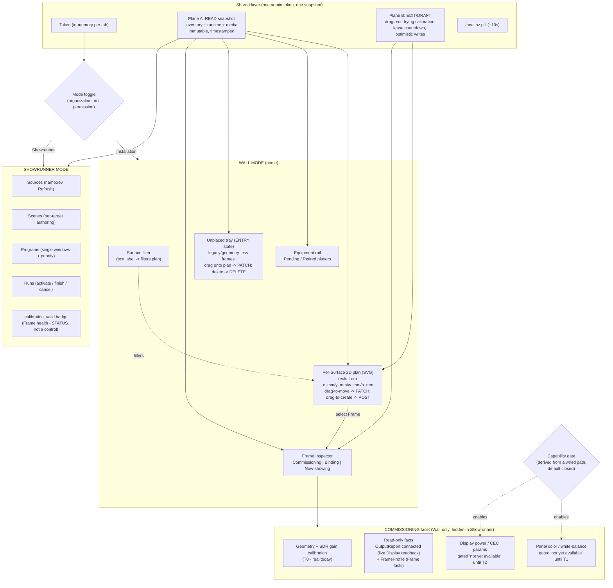
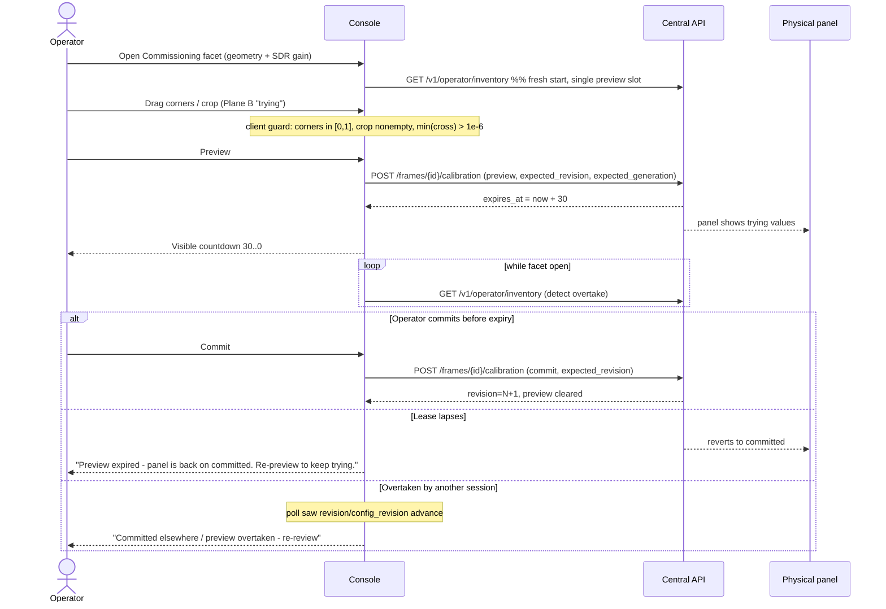
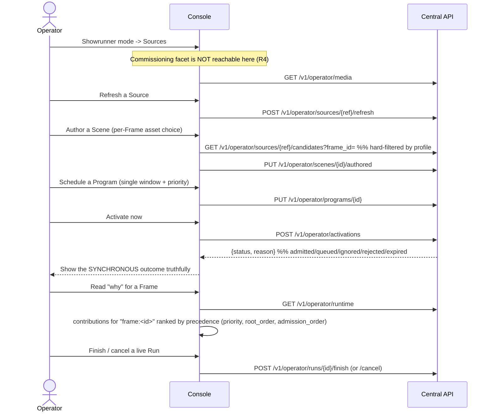
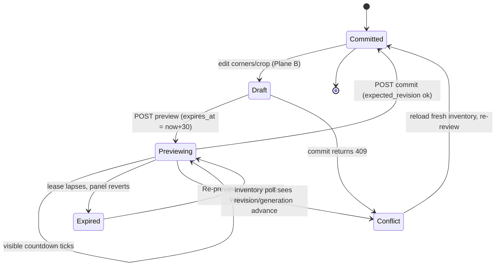
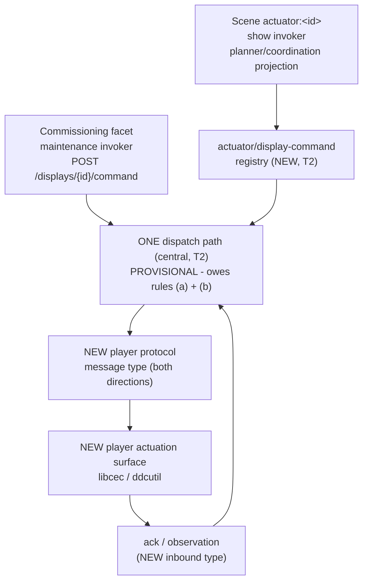
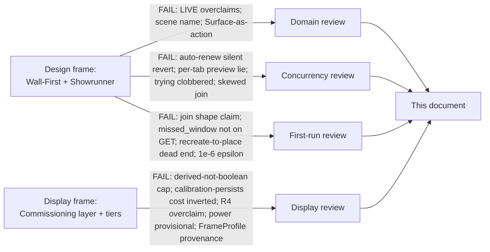

# Operator Console UX Redesign — Wall-First Canvas + Showrunner Mode

**Date:** 2026-09-13
**Status:** Design-gate artifact. This is the single self-contained design
document for the Photo Wall operator-console UX redesign. It is the artifact the
USER GATE is presented as, and it replaces every predecessor working file
(grounding briefs, interrogation, design frames, and the adversarial reviews).
Those scratch files are pipeline working state and do **not** ship; their
content is folded in here. If this document and any predecessor disagree, this
document wins.

**What the reader is being asked:** approve the shape and the costed decisions
in [§10 Decisions that are yours](#10-decisions-that-are-yours) so the delivery
phase can begin with the tracer slice in
[§14](#14-what-happens-after-the-gate). This is an **operator-UI-first**
redesign delivered as a **new React app with a small self-hosted build** (Vite or
esbuild → one bundled JS/CSS served same-origin at a new route `/console`;
`central/operator.html`/`operator.js` stay in place until a parallel-route
cutover — see [§14](#14-what-happens-after-the-gate)), plus
**one sanctioned, minimal backend addition** the owner accepted at
[§10 Q4](#10-decisions-that-are-yours): two new operator routes —
`PATCH /v1/operator/frames/{id}` (reposition) and
`DELETE /v1/operator/frames/{id}` (remove, guarded). That addition is
**routes-only: no schema change and no migration**, because the placement
columns already exist (001_registry.sql:22-35). No other backend, API, schema,
or hardware change is in scope for this pass.

**Second dimension folded into this revision — the Display / Commissioning
layer.** The owner added a hardware-commissioning dimension: a **Display** (the
swappable panel behind a Frame) is distinct from the **Frame** (the durable
matte/aperture and location), and the Display↔Frame hardware relationship is a
**Commissioning** concern that is hidden once you program a show. This is
delivered as three costed **scope tiers**, and the owner's call on how far to go
is a new gate decision in [§10](#10-decisions-that-are-yours):
- **T0** — UX-only layering (a Commissioning facet, Display as an entity,
  read-only hardware facts, hardware controls gated off). Buildable now, within
  the existing API plus Q4. **Recommended in this pass.**
- **T1** — panel color/white-balance correction (a photometric field extending
  Calibration + a renderer stage + a capability signal). A **medium backend
  program**, recommended as a separately-greenlit effort.
- **T2** — CEC/DDC display power and panel params + real actuator dispatch. A
  **large cross-layer epic** (appliance + player protocol + central + console),
  recommended as a separately-scoped program. **Not deferred polish.**

T0 changes **no shape**: it adds a layer to the existing Wall-First + Showrunner
design. T1/T2 are real multi-layer engineering programs, stated as costs, not
sold.

---

## 1. The problem in plain words

The console is the single source of truth for a Photo Wall installation, but its
UI throws away most of what the backend already gives it:

- The Frames table shows an id and a generation number but **discards the
  millimetre geometry** (`x_mm/y_mm/width_mm/height_mm/surface_id`) that is
  already in the inventory payload — so there is no picture of the wall, only a
  list (installation_models.py:35-39; operator.js discards it).
- Calibration is edited as **raw JSON typed into a textarea** for a projective
  homography and a crop rectangle — an operator hand-types corner coordinates the
  server will silently 400 if they are non-convex.
- The console **never joins** "which Frame" to "what is scheduled on it now and
  why," even though the runtime payload already carries the answer per Frame.
- Existing Frames cannot be **repositioned or removed** at all; legacy frames
  created by the old UI pile at the origin as permanent clutter. This pass adds
  two minimal, guarded routes (Q4) so the plan can drag-to-move and delete.
- There is **no home for hardware commissioning**: the console conflates the
  durable Frame with the swappable panel behind it, and it has nowhere to put
  the geometry/photometric setup that belongs to *this panel behind this matte*
  — nor a place that stays honestly empty for the hardware controls that do not
  exist yet (color, display power). This revision adds a Commissioning layer for
  exactly that (see [§7](#7-the-commissioning-layer)).
- Onboarding order is implicit; there is no guidance; every read is stale by
  default with no visible age; and useful endpoints that already exist (refresh a
  Source, unbind an Output) are not wired to any button.
- The 30-second calibration preview reverts the physical panel silently after the
  lease lapses, with no on-screen countdown.

The redesign makes the **per-Surface 2D plan the home**, the **Frame the unit of
selection**, everything the console claims **provably true against the existing
API**, and hardware setup a **Commissioning facet** of the selected Frame that is
hidden at show time.

### 1a. Prior decisions this builds on

| # | Decision | What it fixes for us |
|---|---|---|
| D-a | **Decision 0006 — central authority, disposable players.** The console is the source of truth; a player is a swappable box behind a Frame; every boot is a fresh `authority_epoch`; a returning known Pi self-heals to its old bindings; a new/replacement Pi lands unbound. | Frame persistence and the pending/auto-recovery UX are grounded here. The **Display-vs-Frame** split (§7) is the same durable-location-vs-replaceable-hardware pattern applied one layer down (panel, not Pi). |
| D-b | **Per-Surface 2D only.** Each Surface is its own flat mm coordinate space; there is no room-wide frame and no relative pose between Surfaces. | We render one plan per Surface, never a cross-Surface or 3D view. |
| D-c | **Single admin token.** One shared operator token, no roles; every operator route is `Depends(admin)`. | Console "modes" are organization, never permission. |
| D-d | **CSP `script-src 'self'`.** No inline scripts, no CDN, no external origin; all assets self-hosted (app.py:348-350). | Binds the stack to a **self-hosted, same-origin bundle**: `script-src 'self'` admits a same-origin `<script>`, so a small self-hosted React build (one bundled JS/CSS served from the same origin) is CSP-clean **with no header change**. No CDN. |
| D-e | **Immich boundary.** Photo Wall owns config/scheduling/calibration/execution; Immich owns media bytes+metadata; players are Immich-unaware and fetch bytes only by content hash. A Source is a saved live query, not a downloaded album. | No UI element may imply a Player browses or links to Immich. |

### 1b. Verified facts about today's code

Every row below was re-checked against source while writing this document.

| Fact | Where (file:line) | Consequence for the UX |
|---|---|---|
| **Now-showing is pure authored *intent*, not device readback.** `runtime.project(now)` is computed "without I/O"; `visible` is just the precedence winners of projected intents; an execution *failure* does **not** finish or cancel a Run. | runtime.py:1, 25-34, 706-719; app.py:622 | Never label a tile "LIVE." Label it **Scheduled / Intended.** State the readback gap as a cost. |
| **`visible[].target` is a STRING `"frame:<id>"`, not an object.** `Target` in the operator view is `Annotated[str, …]`; serialized JSON is `"target":"frame:abc"` (verified by serializing a `RuntimeView`). The object `Target {kind,id}` at contracts/models.py:19 is a *different* type used only in the player protocol. | runtime.py:18, 140, 191; contracts/models.py:19 | The browser joins by **string equality** `entry.target === "frame:" + frameId`. The server `for_target` helper cannot be called from the browser. See the correction note below. |
| **Reposition and delete routes are added this pass (Q4); minimal.** Before this redesign the operator frame routes were create / bind / unbind / calibrate / retire only, with no move and no delete; `POST /frames` still collides on an existing id (`frame_exists`). Q4 adds `PATCH /v1/operator/frames/{id}` (geometry) and `DELETE /v1/operator/frames/{id}` (guarded) — **routes only, no migration** (placement columns already exist). | app.py:584-614; registry.py:149-160; 001_registry.sql:22-35 | Existing frames become **draggable** on the plan (PATCH) and **removable** (DELETE, refused while bound or while a live Run targets them). Legacy origin-stacked frames enter via the **Unplaced tray** and can now be dragged onto the plan or deleted. |
| **`POST /frames` already accepts placement.** `FrameCreate` takes `surface_id`, `x_mm`, `y_mm`, `width_mm`, `height_mm`, `profile`, with an orientation-coherence guard. | registry.py:35-48 | Placing a **new** Frame at a chosen position is fully in scope — just fields the old UI never sent. |
| **mm geometry is already in `/inventory`.** `FrameInventory` carries `surface_id/x_mm/y_mm/width_mm/height_mm`, plus `calibration_valid`, nullable `player_id/output_id`. `PlayerInventory` carries `is_bound`, `retired_at`, `last_seen`. `OutputInventory.observation` carries `connected`. | installation_models.py:24, 33-48 | The 2D plan and per-Frame state need **no** backend change. |
| **30-second preview lease, single slot, last-writer-wins.** Calibrate `preview` writes `preview`/`preview_expires = now + 30` on the one Frame row; a second tab overwrites it; `effective_calibration` returns the preview until it expires, then committed. `commit` writes the request body and clears preview. | registry.py:247-277; contracts/models.py:74-88 | Show a visible countdown; no silent auto-renew. Two sessions share one slot; commit conflicts must be surfaced explicitly. |
| **A binding change never destroys committed calibration; it only invalidates it.** `bind`/`unbind`/`retire` each set `calibration_valid=false`, bump `generation`/`configuration_revision`, and clear `preview`/`preview_expires` — but **none of them writes the `calibration` column.** Only a `commit` overwrites the committed blob. | registry.py:200-203, 223-226, 240-243, 274-276 | The committed calibration (and any future color field riding it) **persists** across a bind/unbind/player-swap; the cost of a swap is a **forced re-validation**, not data loss. See [§7.3](#73-panel-color--white-balance-t1). |
| **`FrameProfile` is a set of *Frame* facts, not live Display readback.** `FrameProfile {width_px, height_px, diagonal_inches, video}` is operator-declared at `create_frame` and persists across a panel swap. The **only** live Display readback is `OutputReport {output_id, width_px, height_px, connected}` from enrollment — no EDID, model, refresh, HDR, active-area rectangle, bezel, or overscan exists anywhere. | contracts/models.py:28-32; contracts/enrollment.py:13-17 | The Commissioning facet labels the profile fields **Frame facts** and shows `OutputReport` as the one live panel readback; it invents nothing richer. |
| **The player session channel is closed to two message types and cannot carry a device command.** Server→player is only `state` (configuration/plan/commits/revocations); player→server is only `readiness` or `observation`; any other inbound type raises `ValueError` and the socket closes with code 1008. | central/app.py:496-509, 512-513 | A CEC/display-power command **cannot** ride the existing channel — it needs a new protocol message type both directions (T2, [§7.4](#74-cec--display-power--params-t2)). |
| **Actuator intents are dropped, not dispatched.** The type system allows `Target.kind ∈ {frame, actuator}` and actuator contributions, but the planner returns early on an actuator kind and coordination skips it; the only actuator adapter (`RecordingActuator`) is wired in tests, never in `create_app`. No actuator registry table, no register/list/command endpoint. | central/planner.py:252; central/coordination.py:272 | `actuator:<id>` Scene targets are **inert prose** today; real dispatch is T2. |
| **Convex guard threshold is `1e-6`, not `0`.** Server rejects `min(cross) <= 1e-6`. Calibration payload is exact: corners 4×(x,y) TL,TR,BR,BL in [0,1]; crop (l,t,r,b) with `0≤l<r≤1, 0≤t<b≤1`; rotation ∈{0,90,180,270}; gain ∈[0,2]. | contracts/models.py:50-64, 35-48 | Client guard must use the same `1e-6` epsilon or a thin quad the client accepts still 400s. |
| **Admission outcomes are not on any operator GET.** `Admission {status, reason}` (admitted/queued/ignored/rejected/expired) exists server-side, but `/runtime` returns only `definitions`, `programs`, `current` (= `now/runs/contributions/visible`). No `admissions` field. | runtime.py:132-136, 185-192; app.py:619-623 | The **synchronous** `POST /activations` result is truthful; the calendar cannot show why a past program didn't fire. |
| **A Scene has `scene_id`, no display name.** `Intent` carries `scene_id`; no `name` field exists on any Scene type. | runtime.py:144 | Tiles show `scene_id`, not an invented "scene name." |
| **Surface is a bare TEXT label.** No `surfaces` table, no Surface entity, no Surface endpoint — `surface_id` is a column on frames. | installation_models.py:35 | You do not "act on" a Surface; selecting one **filters** the plan. |

> **Correction note (load-bearing).** A predecessor review asserted the
> now-showing join key was an object `{kind, id}` and that the client must match
> `target.kind`/`target.id`. That premise was **checked and refuted** against the
> real operator payload (serialized `RuntimeView` → `"target":"frame:abc"`).
> Building the object-join would return empty on **every** tile — the exact
> failure that review meant to prevent, inverted. The correct, verified join is
> the string compare `entry.target === "frame:" + frameId`. The tracer mutation
> probe in [§14](#14-what-happens-after-the-gate) is written against the verified
> shape.

---

## 2. The answer in one picture



**The four rules the whole console obeys:**

> **R1 — The Frame is the unit of selection; every action targets a Frame (or
> filters the plan by Surface).** Players and Outputs are never acted on
> directly — they act *through a Binding to a Frame*. This keeps Surface, Frame,
> Player, Output, Binding, Panel, and **Display** distinct and stops the
> wall-first shape from collapsing the domain into "the box."

> **R2 — The console shows central *intent* plus real connectivity, and never
> claims confirmed playback.** No control or label implies a field the API does
> not store: no "LIVE" playback, no ambient correction, no recurrence rule, no
> sensor/actuator registry, no cross-Surface/3D view, no panel color/power
> control that the backend has not announced. Where prose promises more than the
> model holds, the UI states the honest limit.

> **R3 — The read snapshot and the edit draft are two separate planes; a refresh
> replaces the read plane only and never destroys unsaved work.** Every read is a
> timestamped snapshot (Plane A); every in-progress edit, countdown, and
> optimistic write lives in Plane B; every write carries its concurrency token and
> degrades cleanly to "the world moved." **With the React build (Q9) this rule is
> realized STRUCTURALLY, not by convention:** Plane A is React state fetched from
> the API and Plane B is component-local draft state (a hook), so a refresh
> re-fetches and replaces the snapshot state alone and *cannot* reach into the
> draft — the two planes are separate state cells the framework keeps apart.

> **R4 — Commissioning holds the hardware truth; show-programming sees Frame
> facts and commissioning STATUS (calibration validity / presentable-or-not),
> never Display CONTROLS, hardware identity, or panel parameters.** The
> legitimate seam is narrow and deliberate: an invalid Frame cannot present, so
> the showrunner MUST see `calibration_valid` as a Frame-health badge — that is
> *status*, not *control*. Every Display control (geometry/gain, and the gated
> color/power areas) lives only inside the Commissioning facet, a Wall-mode
> surface unreachable from Showrunner.

R4 **extends R1's distinct-domain list** (it adds Display) and is **R2 applied
spatially** (unbuilt hardware controls are quarantined to one capability-gated
layer, so honesty is enforced by *where a control may render*, not only by
wording). It is orthogonal to R3: Commissioning writes (calibration) already use
Plane B and the preview lease unchanged.

---

## 3. Glossary

- **Surface** — a single flat 2D millimetre coordinate space (origin upper-left,
  +x right, +y down) that Frames sit within. It is a bare TEXT label on frames
  (`surface_id`), not a stored entity and not addressable; there is no room-wide
  frame and no pose between Surfaces. In the UI, selecting a Surface *filters* the
  plan.
- **Frame** — a persistent physical aperture (matte) with mm geometry, a display
  profile, a `generation` counter, and committed calibration. It survives
  equipment swaps — both the Player behind it and the **Display** behind it. It
  is the unit of selection. It can be repositioned (`PATCH`, last-write-wins) and
  deleted (`DELETE`, refused while bound or while a live Run targets it) — the two
  sanctioned Q4 routes ([§9a](#9a-the-two-sanctioned-backend-routes-q4)).
- **Display** — the physical **panel currently bound behind a Frame's Output**.
  It is swappable while the Frame (the matte/aperture + persistent location)
  endures — the same durable-location-vs-replaceable-hardware split as
  Frame-vs-Player (decision 0006). *Counter-example:* swapping the panel does not
  change the Frame; the Frame's mm aperture, location, identity, normalized
  calibration corners, and schedule all persist. The Display is reached only
  through the selected Frame's Commissioning facet — never a competing unit of
  selection. Distinct from Surface / Frame / Player / Output / Binding / Panel.
- **Player** — a replaceable Raspberry Pi; `player_id` is a deterministic hash of
  its hardware serial; it re-enrolls fresh every boot with a new `authority_epoch`
  and holds no authoritative state. A disposable box behind a Frame.
- **Output** — one HDMI port on a Player (≤2). The thing a Binding attaches to a
  Frame. An unbound Output shows nothing.
- **Binding** — the one current Output→Frame association. Changing it bumps the
  Frame's `generation`, clears any preview, and marks calibration invalid (but
  does **not** erase the committed calibration blob — see [§1b](#1b-verified-facts-about-todays-code)).
- **Panel / FrameProfile** — `FrameProfile {width_px, height_px, diagonal_inches,
  video}` are **Frame facts**: operator-declared at `create_frame`, read-only,
  persisting across a panel swap. The only **live Display readback** is
  `OutputReport {width_px, height_px, connected}` from enrollment. Distinct from
  the Frame's mm aperture; a 1080×1920 panel behind a 300×500 mm aperture is
  normal.
- **Calibration** — output-pixel correction bound to the Frame: `revision` (bumps
  on commit), `rotation`, four projective `corners`, a `crop` rectangle, and SDR
  `gain`. **Preview** pushes proposed values to the panel under a 30-second lease;
  **commit** saves a new revision against an `expected_revision`; **generation** is
  a separate optimistic token bumped by binding changes. A future **photometric**
  (color/white-balance) field would ride this same model (T1, [§7.3](#73-panel-color--white-balance-t1)).
- **Commissioning** — the layer (and the Frame-Inspector facet) where the
  Display↔Frame hardware relationship is set up: geometry + SDR gain today; panel
  color (T1) and display power/params (T2) as capability-gated areas. Hidden in
  Showrunner (R4).
- **Capability gate** — a rendered branch that shows a hardware control **only
  when the capability is derived from a real wired path** (a player session that
  negotiated the command protocol; a build whose model carries the field),
  defaulting closed to an explicit "not yet available." A stored boolean that
  merely *claims* the capability is a bug caught by a mutation probe
  ([§7.6](#76-capability-gating--derived-not-declared)).
- **Scope tier (T0 / T1 / T2)** — the staged scope of the Display dimension: T0
  UX-only (this pass), T1 a photometric backend program, T2 a CEC/actuator
  cross-layer epic. The owner picks how far to go ([§10](#10-decisions-that-are-yours)).
- **Source** — a saved, immutably-versioned Immich *query* named `name:rev` (e.g.
  `holiday:1`): live eligibility, not a downloaded album. Players never see it.
- **Scene / Program / Run** — a **Scene** is a per-target composition of
  contributions (media/black/actuator); a **Program** binds a Scene to a *single*
  time window with a priority; a **Run** is a live execution instance with phases
  body/outro/completed/cancelled.
- **Intended now-showing** — for a Frame, the winning `Intent` from
  `current.visible` (central's authored projection), joined in the browser by the
  string `"frame:<id>"`. It is what central *intends*, not proof the pixels are
  lit.
- **Snapshot vs Draft** — Plane A (Snapshot): one immutable timestamped read of
  inventory+runtime+media. Plane B (Draft): the operator's uncommitted edits, drag
  state, lease countdown, and in-flight optimistic mutations. A refresh replaces
  Plane A only.

---

## 4. How it holds together (invariants)

### 4a. The two-plane state model

With the React build (Q9) the two planes are **two separate pieces of React
state**, so state discipline is carried by the framework rather than hand-rolled
render discipline. It is made explicit as **two planes**:

- **Plane A — READ snapshot.** One immutable object holding the last successful
  `inventory` + `runtime` + `media` reads, with a single timestamp, held as React
  state near the top of the tree (a `useSnapshot()` hook). Every region is a React
  component that renders from it as a pure function of `(snapshot, selection)`. A
  refresh re-fetches a new snapshot and replaces the Plane A state wholesale;
  nothing patches it in place.
- **Plane B — EDIT/DRAFT.** Separate **component-local** state (a `useDraft()`
  hook) for everything the operator is *doing*: the in-progress drag rectangle when
  placing a new Frame; the "trying" calibration values before commit; the lease
  countdown clock; the current mode; guidance-dismissed flags; and in-flight
  optimistic mutations. Because it is a distinct state cell from Plane A, it is
  **never overwritten by a snapshot refresh** — the framework keeps them apart.

The structural rule (framework-enforced by the separate hooks, not a hand-kept
convention): **a refresh replaces Plane A and merges nothing into
Plane B.** When a refresh reveals that committed state moved underneath an open
draft (e.g. `revision` or `generation` advanced on the Frame being calibrated),
the console does **not** discard the draft; it raises a "committed changed
underneath you" banner and lets the operator decide. This is the documented
exception to "pure render from snapshot": the Commissioning facet reads Plane B for
its calibration handles and Plane A only for the committed baseline and conflict
detection.

To keep the headline now-showing join honest, **inventory and runtime are fetched
and swapped together as one atomic snapshot** — never independently — so a
Frame's binding row and its now-showing chip always share one age and the
snapshot clock is truthful.

### 4b. Calibration commit / conflict decision table

Every calibration write sends `expected_revision` and `expected_generation`. On
entering the Commissioning facet the console fetches a **fresh inventory** so it
starts from truth (the single preview slot is not otherwise polled elsewhere).

| Who is asking | Result | Why |
|---|---|---|
| Fresh commit — `expected_revision`/`expected_generation` match | **Committed (rev N+1)**; preview cleared | No one else changed the Frame; transactional commit succeeds. |
| Commit with stale `expected_revision` | **409 conflict** → "Another session changed this frame's calibration — reload and re-review" | Another commit advanced `revision`; server returns `calibration_revision_conflict`. |
| Commit with stale `expected_generation` | **409 conflict** → "This Frame's binding changed — its display is no longer under your control; reload" | A bind/unbind/retire bumped `generation`, cleared preview, invalidated calibration. |
| Preview lease expired (no interaction) | **Preview expired** → "Panel is back on committed. Re-preview to keep trying." | `effective_calibration` returned committed after `preview_expires`; the wall reverted. |
| Two tabs preview the same Frame | **Last-writer-wins on the panel**; both may commit-conflict | Single preview slot; whichever wrote last owns the wall until its lease or a commit. |
| Inventory poll during calibration shows `revision`/`configuration_revision` advanced | **Preview overtaken** → "Committed elsewhere / your preview was superseded — re-review" | Another operator committed or re-previewed; detected by polling `/inventory` while the Commissioning facet is open. |

### 4c. What a second concurrent operator gets

Two tabs share one admin token and one preview slot. Neither has exclusive
control, and the console never implies it does. The second operator's writes
either succeed (their generation/revision matched) or return an explicit 409 that
resolves to "the world moved — here is the fresh state." A running Frame whose
binding is changed mid-session loses authority server-side and may hold its last
authorized picture until lease expiry, then go dark — the console warns before
such changes rather than after.

**Invariant, in one sentence:** *the console renders only what the API stores,
joined honestly across one atomic snapshot, and every mutation carries its
concurrency token so no write silently succeeds against stale state and no read
claims a freshness or a playback it cannot prove.*

---

## 5. Walkthroughs

Each step names the exact endpoint it calls. The Frame Inspector's facets are
**Commissioning | Binding | Now-showing**; calibration (geometry + gain) lives
under **Commissioning** (R4), and is reached only in Wall mode.

### J1 — Onboarding: pending → bind → commission → showing (with auto-recovery)

```mermaid
sequenceDiagram
  actor Op as Operator
  participant UI as Console
  participant API as Central API
  Note over UI: Plane A snapshot on load
  UI->>API: GET /v1/operator/inventory
  API-->>UI: players[], outputs[], frames[]
  alt Known Pi returned (auto-recovery)
    Note over UI: is_bound=true, new authority_epoch
    UI-->>Op: Banner "Recovered - pi-3f2a already bound (serial match, not identity)"
    Note over UI: stays on canvas, no action needed
  else New / replacement Pi
    Note over UI: is_bound=false, retired_at=null
    UI-->>Op: Appears in PENDING rail
    Op->>UI: Select Frame -> Inspector Binding -> pick pending Output
    UI->>API: PUT /v1/operator/frames/{id}/binding (expected_generation)
    alt generation matches
      API-->>UI: generation bumped, preview cleared, calibration invalid
      UI-->>Op: Tile shows amber "Review required"; CTA "Commission the display"
    else stale generation
      API-->>UI: 409 binding_generation_conflict
      UI-->>Op: "This Frame changed - reload and review its binding"
    end
  end
  Op->>UI: Open Commissioning facet
  UI->>API: POST /v1/operator/frames/{id}/calibration (commit)
  API-->>UI: calibration_valid=true, revision=N
  Note over UI: Once a Scene makes it visible, tile shows Scheduled chip
```

Auto-recovery is made **visible** via a "recovered, already bound" banner and
**trustworthy** by stating plainly in that banner that it is *serial-match
convenience, not cryptographic identity*. The per-boot `authority_epoch` bump is
never surfaced as an alert (it fires every boot). Because there is no discrete
recovery flag in the payload, "recovered" is inferred by retaining the prior
snapshot's epoch client-side and diffing; if no prior snapshot exists (true first
run) the banner is suppressed rather than guessed. After a bind, the natural next
stop is **"Commission the display"** — a post-bind CTA that carries first-run
discoverability toward the Commissioning facet (mitigating the facet shape's one
weakness, [§8](#8-design-it-twice)).

### J2 — Commissioning / calibration: direct manipulation + honest lease countdown



No silent auto-renew. The countdown is shown; on expiry the panel reverts and the
UI says so explicitly; the trying values remain in Plane B so "Re-preview"
re-issues the same `preview` op without re-entering anything. The color and
power/params areas of the Commissioning facet render **gated off** ("not yet
available") until T1/T2 announce them ([§7.6](#76-capability-gating--derived-not-declared)).

#### J2 situation → what-the-user-sees (failure-facing)

| Situation | What the user sees |
|---|---|
| Preview lease reaches 0 with no interaction | "Preview expired — panel is back on committed. Re-preview to keep trying." Trying values retained. |
| Another tab previews the same Frame | The wall may show the other tab's values; on next inventory poll: "Committed elsewhere / preview overtaken — re-review." |
| Commit with stale revision | "Another session changed this frame's calibration — reload and re-review." |
| Binding changed mid-calibration | "This Frame's binding changed — its display is no longer under your control; reload." |
| Client-invalid drag (folded/thin quad, `min(cross) ≤ 1e-6`, or empty crop) | Handle snaps back; no request sent; inline "corners must form a convex aperture." |
| Panel color / display power controls | Rendered as an explicit "requires the display-control capability — not yet available" area; never a dead control implying a stored field. |

### J3 — Reading & building the wall

```mermaid
sequenceDiagram
  actor Op as Operator
  participant UI as Console
  participant API as Central API
  UI->>API: GET /v1/operator/inventory
  UI->>API: GET /v1/operator/runtime
  Note over UI: one atomic Plane A snapshot
  UI->>UI: group frames by surface_id; render selected Surface
  UI->>UI: place frames with meaningful geometry as rects
  UI->>UI: frames with no distinct geometry -> Unplaced tray (list)
  loop each frame tile
    UI->>UI: join runtime - visible.filter(e => e.target === "frame:"+id)
    UI->>UI: chip = "Scheduled: <scene_id>" + phase; NOT "LIVE"
    UI->>UI: connectivity dot from observation.connected (real)
    UI->>UI: calibration_valid badge (Frame health - status, not a control)
  end
  Op->>UI: Drag rectangle on empty canvas (place NEW frame)
  UI->>API: POST /v1/operator/frames (surface_id, x_mm, y_mm, width_mm, height_mm, profile)
  API-->>UI: created; appears on plan
  Op->>UI: Drag an existing frame (reposition) or drop one from the Unplaced tray
  UI->>API: PATCH /v1/operator/frames/{id} (surface_id, x_mm, y_mm[, width_mm, height_mm])
  API-->>UI: placement echoed; rect moves (last-write-wins, no token)
  Op->>UI: Delete an existing frame
  UI->>API: DELETE /v1/operator/frames/{id}
  alt frame is bound or a live Run targets it
    API-->>UI: 409 frame_bound / frame_in_use
    UI-->>Op: "Unbind / finish the Run before deleting this Frame"
  else clear
    API-->>UI: deleted; rect removed from plan
  end
  Op->>UI: Select frame -> Commissioning facet (Display facts) or Binding facet (Player/Output)
```

The plan reads which Player/Output serves each Frame (Binding facet, from
`player_id/output_id`), whether that Output is connected (observation dot, a real
fact), whether calibration is valid (badge), and what is **scheduled** on it
(chip). The **Commissioning** facet reads the Display behind the Frame (read-only
`OutputReport` connected + FrameProfile Frame facts) and hosts the geometry/gain
controls plus the gated color/power areas. Existing frames are now **draggable**
(PATCH, last-write-wins — see [§9](#9-storage-lifecycle--refresh)) and
**deletable** (DELETE, refused while bound or while a live Run targets the Frame).
Frames created by the old UI (all at `wall`/(0,0)) have no distinct position and
enter through the **Unplaced tray** as a list, from which the operator drags them
onto the plan (PATCH) or removes them (DELETE) — they are no longer permanent
clutter.

### J4 — Content & schedule: "what's on which Frame, when, why"



"When" = the scheduled Program windows and current Runs (from `runtime.programs`
and `current.runs`). "Why" = the `contributions` for a Frame ranked by the total
precedence order — deterministic, no ties. The **synchronous** activation result
is shown at the moment of activation; the calendar does **not** render
"expired: missed_window" history, because that reason is not on any operator GET
(see the cost in [§6](#6-the-hard-part)). A Source is labelled a saved query
(`name:rev`); no "open in Immich," no album language. Showrunner **never** exposes
the Commissioning facet; the only hardware fact it sees is the
`calibration_valid` badge (R4).

---

## 6. The hard part

Two problems each deserve treatment. (A third — capability-gated hardware honesty
for the Display layer — is treated in [§7.6](#76-capability-gating--derived-not-declared).)

### 6a. Now-showing: intent vs actuality

- **The attack (review, P1 domain):** the frame tile was labelled "LIVE" and
  sourced from `visible`, but `visible` is a pure authored-intent projection with
  no device readback; an execution failure does not finish or cancel a Run, so
  `visible` keeps naming the intended Scene after a panel has failed. Labelling it
  "LIVE" sells confirmed playback the operator surface cannot deliver.
- **The fix:** the chip reads **"Scheduled: `<scene_id>`"** with phase
  (body/outro), never "LIVE." Connectivity (`observation.connected`) is shown as a
  *separate, real* fact ("player connected / disconnected"). The "why" from
  precedence is real and rendered.
- **Stated plainly:** the console shows what central *intends* per Frame, joined
  with connectivity. It cannot confirm the pixels are lit — there is no
  execution/render readback in `/inventory`+`/runtime`.
- **The cost:** an operator cannot use this console to confirm a specific panel is
  actually displaying a specific image. Confirmed playback would require a backend
  change (surface the execution-outcome/observation channel to the operator) — out
  of scope here and left **deferred** in [§11](#11-deliberately-out-of-scope). It is
  a distinct, larger ask than the minimal Q4 routes and is **not** bundled with
  them.

### 6b. The two-plane / lease lifecycle

- **The attack (review, concurrency P0):** the "trying is never lost" guarantee
  contradicted a pure-render-from-snapshot convention (a refresh would clobber the
  edit); the auto-renew rule was self-contradictory and silently reverted the wall
  while the operator studied it; "Previewing on wall" was an unverifiable per-tab
  claim the refresh model never reconciled.
- **The fix:** two explicit planes ([§4a](#4a-the-two-plane-state-model)); a
  refresh replaces Plane A only; no auto-renew (visible countdown + explicit
  expiry + Re-preview); poll `/inventory` while the Commissioning facet is open so
  overtaken previews and committed-elsewhere changes surface as their own states.
- **Stated plainly:** preview is a shared single slot with no lock; the console
  shows the *server's* `expires_at`, and a second operator can overtake the wall.
- **The cost:** a brief window (between another tab's commit and this tab's next
  poll) where the countdown is stale until the poll corrects it. (The two-plane
  state discipline that would otherwise be the hand-rolled cost here is now carried
  by React state per Q9/[§4a](#4a-the-two-plane-state-model) — the draft is a hook
  a snapshot refresh cannot clobber.)



---

## 7. The commissioning layer

This layer folds the owner's Display/hardware dimension into the existing shape.
It adds R4, a Commissioning facet, and the Display as a first-class console
entity — **no shape changes.** Everything hardware-specific beyond today's
geometry+gain calibration is **capability-gated** and staged into scope tiers
(T0 now; T1/T2 as separately-greenlit programs, [§10](#10-decisions-that-are-yours)).

### 7.1 Two layers, one hiding rule

- **Commissioning layer** — the Display↔Frame hardware relationship, set up once
  per equipment install/swap: active-area/matte geometry (*today: exactly the
  existing `corners`/`crop`/`rotation` homography*), panel photometric corrections
  (*today: only SDR `gain`*; color is T1), and panel power/params over CEC/DDC
  (*absent entirely*; T2).
- **Show-programming layer** — Surface, Frame, Scene, Program, Run. A Scene
  addresses a Frame (or an `actuator:<id>`), never a panel, never pixel geometry,
  never a CEC command.

R4 (in [§2](#2-the-answer-in-one-picture)) is the hiding rule. The one legitimate
seam is `calibration_valid`: an invalid Frame cannot present, so the showrunner
sees it as a **Frame-health badge** — status, not control. Where the existing
geometry+gain calibration lives: **under Commissioning.** The `corners/crop/
rotation` homography *is* the active-area→matte mapping and `gain` *is* a panel
photometric correction; both are display-specific. The **controls** move to the
Commissioning facet; only the **validity** stays show-visible.

### 7.2 Display as a console concept

**Display** = the physical panel currently bound behind a Frame's Output, reached
only through the selected Frame's Commissioning facet. It mirrors Frame-vs-Player
(0006): the Frame persists; the Display is swappable behind it.

*The counter-example that breaks a naive Frame≡Display merge:* swap a dead
1080×1920 panel for a 2160×3840 panel behind the *same* matte at the same
location. If Frame≡Display, the swap destroys the Frame's identity, placement, and
schedule. In reality the Frame (mm aperture, location, normalized calibration
corners, schedule) MUST persist; only the Display's active-area px and panel
corrections change. Two panels behind one matte need *different panel corrections*
but the *same show programming* — a merge cannot represent that.

**What is honestly shown today (read-only, T0):**

| Fact | Source | Provenance |
|---|---|---|
| Pixel dimensions, diagonal, video capability | `FrameProfile {width_px, height_px, diagonal_inches, video}` (models.py:28-32) | **Frame facts** — operator-declared at `create_frame`, persist across a panel swap. Labelled as Frame facts, not Display facts. |
| Output resolution + connectivity | `OutputReport {width_px, height_px, connected}` (enrollment.py:13-17) | The **only live Display readback**. |
| Which Player/Output serves it | Binding (`player_id`/`output_id`) | The equipment path. |
| The Display is swappable while the Frame persists | decision-0006 mirror, in copy | The Frame-vs-Display invariant. |

Nothing richer exists: **no EDID, model, refresh rate, HDR, active-area rectangle,
bezel, or overscan.** A stored Display/Panel record (EDID/capabilities) is **not
needed for T0** and is a T2+ concern; the minimal precursor T1/T2 need is a
capability signal ([§7.6](#76-capability-gating--derived-not-declared)), not a
full record. A durable **panel identity** (EDID capture or a manual panel tag)
does not exist at all — which is why the "color survives a player swap"
alternative is T2-gated, not a T1 fork ([§7.3](#73-panel-color--white-balance-t1)).

### 7.3 Panel color / white-balance (T1)

**Verdict: EXTEND Calibration** with a photometric field and a render stage
(exactly like `gain`) — do **not** introduce a separate DisplayProfile.

**Why extend:** color correction is a property of the **whole signal chain**
(player GPU encode → cable → panel), not the panel alone, so re-validating color
after a binding change is **defensible, not a defect.** requirements.md:69 already
defines Calibration to include photometric correction; `gain` already proves the
shape (a post-composition scalar in one shader stage, native.py:202,784-785;
geometry.py:130) carried in `OutputBinding.calibration` and delivered on the
existing plan. A per-channel/white-balance correction is the *same stage*
generalized from a scalar to a small vector. It rides the **existing**
`POST /frames/{id}/calibration` endpoint and the existing preview/commit/revert
lease — no new write endpoint, no player-protocol change, no delivery path.

**The corrected cost (state it precisely).** A binding change does **not** discard
calibration. `bind`/`unbind`/`retire` set `calibration_valid=false` and clear the
preview but **never touch the `calibration` column** (registry.py:200-203,
223-226, 240-243); the committed blob — including a future color field —
**persists**, and only the next `commit` overwrites it (registry.py:274-276). So
the real cost is a **forced re-validation after a player swap** — a panel property
re-checked even though the panel itself did not move — **not data loss.** Stated
plainly: extending Calibration couples color re-validation to the player
lifecycle; the color values survive the swap, but the operator is asked to
re-confirm them.

**The demoted alternative.** A Display-scoped color record that survives a player
swap *without* re-validation would need a **durable panel identity** (EDID capture
or a manual panel tag) to key it on — which does not exist. So it is **not a T1
fork**; it is **T2-gated** (it presupposes the T2 Display record). This design
takes extend-Calibration for T1 and names that as the cost.

**Minimal T1 backend shape:** a photometric field on `Calibration` (identity
default so existing payloads stay valid) + a generalized shader stage (the `gain`
uniform widened from scalar to the photometric multiply) + a
`photometric_calibration` capability signal. **No new endpoint, no player-protocol
change, no migration** (the committed calibration is a JSON blob; the new field
defaults on read — verify at delivery).

**Until T1 ships,** the Commissioning facet shows **only** the geometry + `gain`
controls (`gain` labelled **"SDR gain"**, not "brightness/color") plus a gated
**"panel color correction — not yet available"** area. No control implies a stored
color field.

### 7.4 CEC / display power + params (T2)

This is a **cross-layer epic**, enumerated honestly — it is **not a UX pass** and
**cannot ride the existing player channel.** What must exist for *any* of it:

1. **Appliance:** CEC/DDC tooling on the Pi (libcec/cec-client for HDMI-CEC power;
   ddcutil for panel brightness/input over DDC/CI) **plus a weston blank/power
   path** — the compositor is pinned always-on today (idle-time=0), there is no
   blank route.
2. **Player protocol:** a **NEW bidirectional session message type** — a
   server→player `command` and a player→server ack/observation. The current
   channel accepts only `state`→player and `readiness|observation`→server and
   **closes 1008 on anything else** (central/app.py:496-509). A display command
   cannot ride it.
3. **Player actuation surface:** a **new** player-side module mapping a command to
   a cec-client/ddcutil invocation and reporting the result; the player is
   **render-only** today (geometry+gain+opacity/fades + media).
4. **Central:** an **actuator/display-command registry** table + register/list
   endpoints; a **dispatch path** (the HA/MQTT boundary named in prose); a **real
   dispatcher wired in `create_app`** — today actuator intents are **dropped**
   (central/planner.py:252; central/coordination.py:272) and the only adapter is a
   test `RecordingActuator`.
5. **Operator endpoints:** a maintenance `POST /displays/{id}/command` and the
   registry CRUD; the show path reuses Scene authoring but now actually
   dispatches. Plus a `display_command` capability signal.

### 7.5 Display-power modeling — PROVISIONAL, not settled

Display power is **both** a maintenance control (an operator toggle in
Commissioning) **and** a Scene Actuator (requirements.md:65 names display power an
Actuator; requirements.md:202 wants maintenance state distinct from authored
content). The **goal** is **one dispatch capability with two invokers** —
Commissioning invokes it directly; the show layer targets `actuator:<id>` — but
this is presented as **PROVISIONAL and contingent on T2 design**, not a settled
"one capability." Two things must be resolved first, and until they are, the
unification is unproven:

- **(a) A precedence/authority rule for the maintenance-hold-vs-Scene conflict.**
  A Scene turning ON a panel an operator held OFF for maintenance (or vice versa)
  must have a defined winner, and **the console must make the conflict visible** —
  requirements.md:202 keeps maintenance "distinct from authored content state," so
  a Scene must not silently override a maintenance hold.
- **(b) An actuator REGISTRY** that binds `actuator:<id>` → a concrete
  Output/Display **before any dispatch.** Today `actuator:<id>` is free-typed and
  unvalidated (Q3); dispatching a free-typed id to real hardware is a new
  authorization surface.

Do not read this section as "display power is one capability" — it is a **goal**
whose feasibility is unresolved until T2 designs (a) and (b).



### 7.6 Capability gating — derived, not declared

Hardware controls appear **only when the capability is DERIVED FROM A REAL WIRED
PATH**, so the false-enabled state is unrepresentable (construction/boot strength,
not convention). A stored boolean that merely *claims* the capability is exactly
the bug this mechanism forbids.

- **`display_command`** = derived from a **live player session that has negotiated
  the command protocol version** (the player advertises support in its
  handshake/readiness). It **cannot be true** unless a real player on the wire can
  actually receive the command.
- **`photometric_calibration`** = derived from the **build whose `Calibration`
  model carries the photometric field** (model introspection / a version
  constant) — never an operator toggle.
- **Default (capability absent)** = hardware areas render **"not yet available."**
  This makes T0 buildable with **zero backend**: no signal is derivable, so every
  hardware area is correctly closed.

Because discovering a capability needs a backend signal, **the capability
mechanism itself is part of T1/T2**, not free at T0 (T0 only needs the
default-closed branch).

| Capability state | How it is reached | What renders | Guarantee strength |
|---|---|---|---|
| **absent** (default, all of T0) | no wired path derivable; no live command-capable session; no photometric field in the build | explicit "not yet available"; **no control** | **construction/boot** — closed by default |
| **derived-true** | a real wired path exists: a session negotiated the command protocol (T2) / the build's model carries the field (T1) | the live hardware control | **construction/boot** — cannot be true without the wire |
| **lying-flag** (excluded by construction) | a flag *claims* true with **no** wired dispatch behind it | an **honesty mutation probe goes red** (a hardware area must NOT render an enabled control from a bare flag) | the probe is the enforcement; the state must not ship |

Stated plainly: the honesty is **construction/boot strength**, not a wording
convention — a control cannot render without a signal derived from a real wire,
and a "lying flag" is caught red by the mutation probe in
[§14](#14-what-happens-after-the-gate), not merely discouraged.

---

## 8. Design-it-twice

Two independent shape choices were each drafted twice: the console's overall shape
(A vs B) and where Commissioning lives (Shape 1 vs Shape 2).

### 8a. Overall shape — Workspaces vs Wall-First (chosen: B)

**Shape A — Domain-Workspaces:** four peer workspaces (Equipment, Wall, Content,
Schedule) behind a left rail. **Shape B — Wall-First Canvas** (chosen): the
per-Surface plan is home, the Frame is the unit of selection, non-spatial content
lives in a Showrunner mode.

| Criterion | A Workspaces | B Wall-First |
|---|---|---|
| First-run legibility | stronger (Overview handles empty state) | weaker (empty canvas; guidance banner carries it) |
| Expert speed on spatial journeys | slower (rail switch per journey) | faster (select Frame → act) |
| **"What's on which Frame, when, why"** | fragmented across Wall + Schedule | **the canvas is the answer surface** |
| Buildability (small React build) | mostly forms/tables | more stateful (canvas + drag) — React state carries it |

**Why B won:** the two axes this redesign exists to move — answering "what's on
which Frame, when, why" and expert speed on the spatial journeys — are exactly
where B dominates, and its weaknesses (first-run, domain flattening) are fixed by
explicit structure (the guidance banner; rule R1). A's weakness (spatial
fragmentation) is *structural to the shape* and cannot be patched without becoming
B. **What B gives up:** higher client-state complexity and a Showrunner-mode seam
for inherently non-spatial content.

### 8b. Where Commissioning lives — Facet vs third Mode (chosen: Shape 1)

**Shape 1 — Commissioning FACET in the Frame Inspector (chosen):** the facets
become `Commissioning | Binding | Now-showing`; you commission the Display where
it physically sits on the Wall plan (select the Frame → Commissioning), and it is
naturally absent from Showrunner. The existing geometry + SDR-gain calibration
**moves under Commissioning**.

**Shape 2 — a distinct third MODE (Wall / Commissioning / Showrunner):** a
separate "Displays" surface, peer to Wall and Showrunner, listing/gridding
displays for hardware setup, divorced from the per-Surface plan.

| Criterion | Shape 1 (facet) | Shape 2 (third mode) |
|---|---|---|
| **Spatial anchoring** | **Strong** — commission where the panel sits; select-Frame→act, the whole thesis | Weak — a list/grid divorced from the plan; loses "commission where it sits" (or duplicates the plan) |
| **Hides at show time** | Natural — Frame Inspector is Wall-only | Natural — mode toggle excludes it |
| **Keeps Frame vs Display distinct** | Good — Commissioning is a *sub-object* of the selected Frame; Frame stays the unit of selection (R1) | **Risk** — a Displays surface invites a *second* unit of selection competing with the Frame |
| **Buildability (React/CSP)** | **Cheapest** — the Commissioning facet is one more React facet component (relabel + read-only facts + gated area), same bundle, same `script-src 'self'` | Costly — a whole new mode, surface, rendering, and navigation as extra components |
| **First-run** | Weaker — installer must select a Frame first; mitigated by the guidance banner + post-bind CTA | Stronger — a dedicated hardware "home" is more discoverable |

**Verdict: Shape 1.** It maximizes spatial anchoring, is cheapest under
React/CSP, keeps Display a distinct sub-object without a competing selection
surface (protects R1), and hides at show time for free. **What Shape 1 gives up:**
weaker first-run discoverability for a pure installer (mitigated by the guidance
banner + post-bind CTA) and a Frame Inspector that grows cramped once T2 controls
populate. **What the rejected Shape 2 gives up:** spatial anchoring and cheap
buildability, and it risks a second selection surface competing with the Frame —
a *structural* cost; its only real win (installer-first discoverability) is a
first-run nicety the guidance banner already carries, not worth the structural
cost.

### 8c. Forward-compatibility

The plan renders each Frame as an independent region keyed by `frame:<id>`, so a
future forward-timeline or a sensor-driven trigger surface can attach per Frame
without changing the spatial model. The Commissioning facet is likewise keyed to
the selected Frame, so T1/T2 hardware controls populate it in place without
reshaping the console.

---

## 9. Storage, lifecycle & refresh

**No new storage, no migration, no schema change** in this pass — even with Q4.
The two Q4 routes write only columns that already exist (`surface_id/x_mm/y_mm/
width_mm/height_mm` in 001_registry.sql:22-35), so there is **no migration**.
(T1's photometric field and T2's registry/protocol are *not* part of this pass;
their backend shapes are enumerated as costs in [§7.3](#73-panel-color--white-balance-t1)/[§7.4](#74-cec--display-power--params-t2)
and gated in [§10](#10-decisions-that-are-yours)/[§11](#11-deliberately-out-of-scope).)
What this section documents is the **client refresh model** plus the **two
sanctioned backend routes** — the only "storage" this pass introduces on the
client is Plane A (the in-memory snapshot) and Plane B (the draft).

### 9a. The two sanctioned backend routes (Q4)

Both are `Depends(admin)`-gated like every operator route, live in
`central/app.py` (route) + `central/registry.py` (store method), and change **no
schema**.

**`PATCH /v1/operator/frames/{frame_id}` — reposition.** Body is a partial
placement: `surface_id?`, `x_mm?`, `y_mm?`, `width_mm?` (>0), `height_mm?` (>0);
omitted fields keep their stored value. The store re-runs the same
orientation-coherence guard as `FrameCreate` against the merged
dimensions + stored profile (422 on violation), then `UPDATE frames SET`
geometry `WHERE id`. It **bumps no `generation`, no `configuration_revision`,
and never invalidates calibration** — geometry is operator-only metadata that
never reaches a player (`OutputBinding` carries no mm fields; registry.py:303-309)
and calibration corners/crop are normalized [0,1], independent of mm. Response
echoes the merged placement; 404 `unknown_frame` if the id is gone.
**Concurrency: last-write-wins, no token.** This is the **one deliberate
exception to R3's "every write carries its concurrency token"** — justified
because placement is cosmetic, invisible to players and to calibration, and a
move is trivially re-dragged. Reusing `generation` was rejected: its bump
carries destructive calibration side effects everywhere else in the store;
guarding on `configuration_revision` was rejected: it advances on unrelated
events (preview expiry, calibration) and would spuriously 409 an honest move.
**Cost:** two operators dragging the same frame silently LWW; the plan corrects
on the next snapshot.

**`DELETE /v1/operator/frames/{frame_id}` — remove, guarded.** Two guards, both
refuse with 409 and a plain-language message; only a clear Frame is deleted:

| Guard | Check (where) | Refusal (409) | Operator sees |
|---|---|---|---|
| Live Run targets the Frame | `coordinator.runtime.read().project(now)`; any non-ended run whose `participants` contains `"frame:<id>"` (runtime.py:179, 191) | `frame_in_use` | "A live Run is scheduled on this Frame — finish or cancel it before deleting." |
| Frame is bound | `SELECT 1 FROM bindings WHERE frame_id=%s` under `FOR UPDATE` on the frame row (registry.py:193, 266) | `frame_bound` | "This Frame still has a bound Output — unbind it before deleting." |

The runtime guard is checked in the route (in-memory, cheap) before the store
call; the binding guard is enforced **atomically inside the store transaction**
(the `bindings` FK on `frame_id`, 001_registry.sql:37, would otherwise surface a
raw 500 — the explicit check returns a clean 409 instead). On success:
`DELETE FROM frames WHERE id`, audit `frame_deleted`, `200 {"status":"deleted"}`.
**Cost / stated limit:** a TOCTOU window exists between the route's runtime check
and the DB delete (a Program could admit a run onto the frame in between); it is
**benign** because a deleted frame has no binding, so any run projecting onto
`"frame:<id>"` reaches no player and runs reference frames by string, not FK — a
dangling reference is harmless intent, not a crash. The load-bearing invariant
the guards protect: *you cannot delete a Frame that a Player is currently bound
to serve.*

**Refresh cadence (numbers are PLACEHOLDERS pending tuning):**

| Surface | Trigger | Staleness cost if not refreshed |
|---|---|---|
| `/healthz` pill | poll ~10s (matches existing health pill) | pill lags reachability by up to one interval |
| `/inventory` + `/runtime` (atomic Plane A) | on focus/visibility-change; after every mutation; on explicit Refresh | now-showing chip and binding row drift; snapshot clock shows the age honestly |
| `/inventory` (Commissioning facet open) | poll ~5s while facet is open | a preview overtake or committed-elsewhere change is detected late |
| Now-showing chips (Wall mode, focused) | optional gentle `/runtime`-only refresh ~15–30s | chips lag scheduled intent |

There is **no operator push channel** (WS is player-only). Every region reads from
one timestamped snapshot; the global bar always shows "updated N s ago · Refresh."
Between refreshes the console can be wrong; the concurrency tokens
(`expected_generation`, `expected_revision`, idempotent `activation_id`) absorb it
so a stale action resolves to "the world moved," never a silent wrong success.

The calibration lifecycle state machine is in
[§6b](#6b-the-two-plane--lease-lifecycle).

---

## 10. Decisions that are yours

| # | Question | Recommendation | Cost of the recommendation | Alternative |
|---|---|---|---|---|
| Q1 | Ambient / photometric correction | **RESOLVED — DEFERRED (recommendation taken).** Expose only `gain` (SDR), labelled as such; no controls imply a stored ambient field. Panel *color/white-balance* is now scoped as **T1** below (extend Calibration), also gated off until funded. | No auto-brightness/color control; prose promise unmet in UI | Fund T1 (a photometric field + render stage + capability signal) |
| Q2 | Program recurrence | **RESOLVED — DEFERRED (recommendation taken).** Single windows + optional client helper that POSTs N discrete windows, each a real stored Program; no control implies a stored recurrence rule | No living recurring rule; N windows to manage/remove individually | Backend recurrence model (later, same design) |
| Q3 | Sensors / triggers / actuator registry | **RESOLVED — DEFERRED (recommendation taken).** Actuators only as free-typed `actuator:<id>` Scene targets, with a "no registry validates this id" note; no sensor/trigger controls anywhere. The actuator **registry** is a prerequisite of **T2** (real dispatch). | No sensor/trigger configuration; actuator ids unvalidated and inert (dropped: planner.py:252, coordination.py:272) | Fund T2 (registry + trigger models + dispatch + endpoints) |
| Q4 | Reposition / delete existing frames | **RESOLVED — SANCTIONED (alternative taken).** Add minimal `PATCH /v1/operator/frames/{id}` (reposition, LWW) and `DELETE /v1/operator/frames/{id}` (guarded: refuse while bound or while a live Run targets it). **Routes only, no schema change, no migration** — placement columns already exist. Full spec in [§9a](#9a-the-two-sanctioned-backend-routes-q4). | One contained backend addition (two routes + guards); the single deliberate bump to the no-backend non-goal; placement PATCH is the one token-free write | (superseded — the recommendation to accept permanent frames was declined) |
| Q5 | Are console modes organization or permission? | **Organization** — one console, one admin token, a top-level toggle | A future content-only login for a non-technical curator needs a real backend role system | Split into two apps / two logins (buys nothing under a single token) |
| Q6 | Per-Surface 2D only, or invent 3D room pose? | **Per-Surface 2D only** | No whole-room picture; operator switches plans between Surfaces (there is no pose to show) | Invent per-Surface pose = new schema (out of scope) |
| Q7 | One console with two modes, or two surfaces? | **One console, two modes** (Wall / Showrunner); Commissioning is a **facet**, not a third mode ([§8b](#8b-where-commissioning-lives--facet-vs-third-mode-chosen-shape-1)) | A novice sees both modes exist; mitigated by defaulting to the mode the state implies | Two peer apps; or a third Commissioning mode (rejected, §8b) |
| Q8 | Guided wizard, or always-visible inventory? | **Always-visible inventory + non-blocking guidance banner** (+ a post-bind "Commission the display" CTA) | Guidance is only as fresh as the last refresh (no push); no strict linear onboarding | Modal wizard that gates the console |
| Q9 | Vanilla zero-build, or a framework with a build? | **RESOLVED — React with a SMALL self-hosted build (owner decision; reverses the prior vanilla recommendation).** A bundler (Vite recommended, esbuild acceptable) compiles real JSX + hooks into **one bundled JS/CSS served same-origin** under `script-src 'self'` — no CDN. The two hard surfaces (per-Surface SVG plan; 4-corner + crop pointer-drag calibration on a live preview) are React components with hand-coded SVG + Pointer Events *inside* React; the two-plane model (R3/§4a) becomes framework-enforced state instead of hand-rolled render discipline. | Adds a **Node build toolchain + a CI build step** to a Python repo that has neither today, and a built `dist` artifact to serve same-origin. | **Rejected:** (1) **vanilla zero-build** — keeps a zero-build stack but loses reactive ergonomics for a 9-domain console (the two-plane tax stays hand-rolled); (2) **React-no-build via `htm`** — keeps zero-build and same-origin but loses real JSX. Both declined in favour of JSX + hooks; the "vendor one same-origin ES module" escape valve is now moot. |

### The scope-tier gate — how far into the Display dimension to go now

This is the new owner decision. The tiers are cumulative; T0 is recommended in
this pass, T1 and T2 as separately-greenlit programs.

| Tier | Delivers | Backend / appliance work | Effort | Recommendation |
|---|---|---|---|---|
| **T0** — layering (R4 + Commissioning facet + Display-as-entity + read-only facts + gated-off hardware) | R4; Commissioning facet in the Frame Inspector; geometry+gain calibration moved under it; read-only Display facts (OutputReport connected + FrameProfile as Frame facts); hardware-control areas rendered "not yet available"; default-closed capability gate | **None beyond Q4.** UX-only, within the existing API. | **Small** — buildable now | **IN NOW.** |
| **T1** — panel color/white-balance | A photometric field extending `Calibration` + a generalized render stage + a `photometric_calibration` capability signal; the facet's color area goes live | Extend `Calibration` (identity default); generalize the `gain` shader stage (native.py + geometry.py); add the capability signal. **No new write endpoint, no player-protocol change, no migration** (rides the existing calibration POST + delivery). | **Medium backend program** (central + renderer + contract) | **Separately greenlit.** Not deferred polish. |
| **T2** — CEC/DDC power + params + real actuator dispatch | Display power on/off + panel params; Scenes' `actuator:<id>` actually fire; Commissioning power controls live; the provisional one-dispatch/two-invoker path *if* rules 7.5(a)+(b) resolve | Appliance CEC/DDC + weston blank path; a NEW bidirectional player-protocol message; a new player actuation surface; a central actuator/display-command registry + dispatch + a real dispatcher in `create_app`; replace the two actuator-drops; a `display_command` capability signal; operator endpoints | **Large cross-layer epic** (appliance + player protocol + central + console) | **Separately scoped program.** Explicitly **not** deferred polish. |

### Assumptions made on your behalf — say so if any is wrong

1. A single operator (or a few trusted operators sharing one token) uses this
   console; there is no need to separate installer from curator by permission.
2. Real installations either start empty (new frames placed via this console) or
   carry legacy origin-stacked frames that enter through the Unplaced tray and
   are now placeable (PATCH) and removable (DELETE) — Q4 is funded, so these are
   no longer permanent.
3. "Confirmed playback" is **not** a hard requirement for this pass; intent +
   connectivity is sufficient ([§6a](#6a-now-showing-intent-vs-actuality)).
4. Placeholder refresh cadences ([§9](#9-storage-lifecycle--refresh)) are
   acceptable to tune during implementation, not decisions the gate must settle now.
5. The optional N-window recurrence helper (Q2) is worth building; if not, plain
   single-window authoring stands alone.
6. **T0 of the Display dimension ships in this pass**; T1 and T2 are real
   engineering programs the owner greenlights separately — not silently bundled
   here and not treated as UX polish.

---

## 11. Deliberately out of scope

**Deferred (later, same design — but T1/T2 are real engineering programs, not
polish):**
- Forward timeline view (needs a `timeline()` endpoint).
- Confirmed-playback readback (needs execution-outcome on an operator GET).
- Ambient / photometric correction of *color/white-balance* — **T1**: a
  photometric field extending Calibration + a render stage + a capability signal
  (medium backend program).
- Display power / CEC-DDC params + real actuator dispatch — **T2**: appliance
  tooling + a new bidirectional player-protocol message + an actuator registry +
  a real dispatcher + endpoints (large cross-layer epic). The provisional
  one-dispatch/two-invoker model owes rules
  [7.5(a) precedence + 7.5(b) registry](#75-display-power-modeling--provisional-not-settled)
  before it is real.
- Stored recurrence rules (Q2 — needs a recurrence model).
- Sensor / trigger / actuator registry (Q3 — subsumed by T2).
- A stored Display/Panel record (EDID/model/capabilities) and any durable panel
  identity — a T2+ concern; absent today.

*(Move/delete of existing frames is no longer deferred — Q4 sanctioned it; see
[§9a](#9a-the-two-sanctioned-backend-routes-q4).)*

**Non-goals (not this pass):**
- Backend / API / schema redesign — **except** the single sanctioned Q4
  addition (two routes, no schema change, no migration).
- Any schema change or migration whatsoever in this pass (Q4 is routes-only;
  T1/T2 backend work is separately greenlit, not part of this pass).
- New hardware or player-side changes **in this pass** (T2 is exactly such work,
  separately scoped).
- Any change to the Immich boundary (no browse/link/credentials; bytes by hash).
- Any change to the auth provider or token model.
- 3D or multi-Surface room view.

---

## 12. What can go wrong

**Guarantee-strength ladder (strongest first):** *construction* (the state is
unrepresentable) > *transaction* (server rejects atomically) > *decision* (a
rendered branch handles it) > *test* (a test asserts it) > *convention* (a rule
implementers follow) > *documented* (stated in copy only).

| Failure | Behaviour | Guarantee strength |
|---|---|---|
| Stale now-showing acted on | Chip reads intent, not confirmed playback; connectivity dot is the real signal; writes carry tokens so a stale action 409s | **decision** (chip wording + token guard); actuality gap is **documented** |
| Two-tab calibration clobber | Single slot LWW; commit conflicts on `expected_revision`; inventory poll surfaces "preview overtaken" | **transaction** (server 409) + **decision** (overtaken state) |
| Lease expiry mid-session | Visible countdown; on expiry explicit "panel reverted — Re-preview"; trying values retained in Plane B | **decision** (explicit expiry state); no silent revert by **convention** (no auto-renew) |
| Activation ignored/queued but looks done | Synchronous `{status, reason}` shown truthfully at activation; queued outcomes are fire-and-forget | **decision** (render the sync result); post-hoc queued→expired is **documented** as unconfirmed |
| Unplaced legacy frames | Frames with no distinct geometry enter the Unplaced tray as a list; the operator drags them onto the plan (PATCH) or removes them (DELETE) | **decision** (tray routing + PATCH/DELETE) |
| Delete a Frame that is bound or scheduled | DELETE refused 409 (`frame_bound` / `frame_in_use`); operator told to unbind / finish the Run first; only a clear Frame is removed | **transaction** (binding guard in the store txn) + **decision** (runtime guard in the route) |
| Concurrent reposition of the same Frame | Placement PATCH is last-write-wins with no token; the losing drag is overwritten and the plan corrects on next snapshot | **documented** (the one deliberate token-free write; see [§9a](#9a-the-two-sanctioned-backend-routes-q4)) |
| Non-convex / thin calibration quad | Client guard blocks at `min(cross) ≤ 1e-6` matching the server; server rejects anything that slips | **construction** (client) + **transaction** (server) |
| Refresh clobbers unsaved edit | Plane B is a separate React state cell (a draft hook); a snapshot refresh replaces Plane A state only and cannot reach it | **construction** (separate state cells in React), enforced by **test** |
| **Capability "lying flag" — a bare boolean claims a hardware control is available with no wired dispatch** | The hardware area renders only from a capability **derived from a real wired path** (negotiated player protocol / model field); a bare/mis-set flag surfaces **no** enabled control; a mutation probe forcing the flag true with no wire goes **red**. Default is closed. | **construction/boot** (derivation from the wire) + **test** (honesty probe) |
| **Maintenance-hold vs Scene-actuator conflict — a Scene turns a panel ON that an operator held OFF for maintenance** | **PROVISIONAL / unresolved until T2.** The one-dispatch/two-invoker model owes a precedence/authority rule and a console-visible conflict surface ([§7.5](#75-display-power-modeling--provisional-not-settled)); nothing dispatches to hardware today, so the conflict is not yet reachable | **documented** (named open risk, gated behind T2; not claimed resolved) |

---

## 13. How the design got here



- **Frame:** proposed Wall-First Canvas + Showrunner, Frame as unit of selection,
  three rules, tracer = "read the wall."
- **Domain review (FAIL):** "LIVE" sold confirmed playback; "scene name" and "act
  on a Surface" implied unstored things.
- **Concurrency review (FAIL):** auto-renew reverted the wall silently; preview
  status was an unverifiable per-tab claim; "trying never lost" contradicted the
  render convention; the now-showing join skewed two independently-aged sources.
- **First-run review (FAIL):** flagged the join-shape claim; `missed_window` is on
  no operator GET; "recreate to place" is a dead end (id collision, no delete); the
  convex epsilon must be `1e-6`.
- **Display dimension (this revision):** the owner's Q4 decision (sanctioned
  reposition/delete routes) is applied throughout; the Display/Commissioning layer
  (R4, the Commissioning facet, Display-as-entity, scope tiers T0/T1/T2) is folded
  in. The Display design frame was adversarially reviewed, **returned FAIL, and was
  corrected on the F1–F5 findings** before folding: **(F1)** the capability gate is
  **derived from a real wired path, not a stored boolean**, with a lying-flag
  mutation probe; **(F2)** the extend-Calibration cost was **inverted in the frame**
  — a binding change does **not** discard calibration (registry never touches the
  `calibration` column on bind/unbind/retire), so the real cost is a **forced
  re-validation after a player swap**, and the "survives a swap" alternative is
  T2-gated (needs a durable panel identity that does not exist); **(F3)** R4 must
  not claim "show-programming never sees the Display" — it sees `calibration_valid`
  status; wording corrected; **(F4)** display-power is **PROVISIONAL** (both a
  maintenance control and a Scene Actuator), not a settled one capability; **(F5)**
  `FrameProfile` fields are **Frame facts**, not live Display readback — the only
  live Display readback is `OutputReport {width_px, height_px, connected}`.
- **Stack + test-strategy reversal (owner decision, this revision):** the stack was
  **reversed from vanilla zero-build to React with a small self-hosted build**
  (Vite/esbuild → one bundled JS/CSS served same-origin under `script-src 'self'`;
  real JSX + hooks — Q9/[§4a](#4a-the-two-plane-state-model)), and the **test
  strategy set to behavioral** (assert role/text/visible outcome, never exact DOM
  or pixel/SVG geometry — the tracer probes in
  [§14](#14-what-happens-after-the-gate)). This realizes R3's two planes
  **structurally** in React state instead of by hand-rolled render discipline.
  Provenance: **owner decision**, overriding the prior adversarial-review
  recommendation for vanilla. **All prior adversarial fixes survive unchanged** —
  the now-showing honesty (no "LIVE"), the two-plane / lease concurrency model, the
  derived-not-declared capability gate, the FrameProfile provenance, and the
  parallel-route cutover are carried forward intact; only the stack and the test
  assertions changed.

**What survived every attack:** the domain is not flattened (R1 keeps
Surface/Frame/Player/Output/Binding/Panel/**Display** distinct); the Immich
boundary holds (Sources are live queries, bytes only by hash); the now-showing
join is real against existing payloads (a **string** `"frame:<id>"` compare,
verified); the self-hosted React bundle is CSP-legal (a same-origin bundle is
`script-src 'self'`-clean, no header change); and the hardware honesty
is now **construction/boot strength** (a control cannot render without a
capability derived from a real wire).

**Where the reviews found the frames wrong:** the first frame overclaimed
actuality ("LIVE"), under-specified the mutable state plane, mis-stated the lease
renewal, and offered "recreate to place" for legacy frames; the Display frame
inverted the calibration-persists cost, overclaimed R4, treated the capability as
a stored boolean, and mislabelled FrameProfile provenance. One first-frame review
premise (join = object) was itself wrong and is corrected in
[§1b](#1b-verified-facts-about-todays-code). All corrected above.

---

## 14. What happens after the gate

**Next phases (delivery is cut into vertically-green slices, tracer first). The
full, ordered slice/bead plan is a separate delivery artifact,
`docs/operator-console-delivery-plan.md`; this is the summary of the T0 pass:**
1. **Tracer — "Read the wall"** (below): read-only plan + now-showing join +
   Inspector. Introduces Plane A (the read snapshot).
2. **Companion tracer — "Commission-read"** (below): the read-only Commissioning
   facet with hardware controls correctly gated off. Proves R4's structure and the
   default-closed capability gate with **zero backend**.
3. **Minimal Q4 backend** (`PATCH` + `DELETE /frames/{id}`) — sequenced early
   because drag-to-move/delete depend on it; backend-only, green via API tests.
   `DELETE` is high-risk (deletion + guards) and gets an adversarial review lens.
4. Commissioning facet — calibration direct-manipulation (corners/crop + honest
   lease countdown). **Introduces Plane B** (the edit draft — the "trying" values).
5. Onboarding / Binding (bind/unbind) Inspector facets + the post-bind
   "Commission the display" CTA.
6. Spatial editing UI: new-frame placement (`POST`), drag-to-move (`PATCH`),
   delete (`DELETE`), and the Unplaced tray — consumes Plane B and the Q4 routes.
7. Showrunner mode: Sources (+ Refresh), Scenes (authored + dynamic), Programs,
   Run control, "why" panel — with the `calibration_valid` Frame-health badge and
   **no** Commissioning surface (R4).
8. Guidance banner + snapshot clock + refresh model.

**T1 and T2 are separate programs, not slices of this pass.** T1 (photometric
field + render stage + capability signal) is a medium central/renderer/contract
program; T2 (CEC/DDC + actuator dispatch) is a large cross-layer epic. Each is
greenlit on its own and lights up its area of the Commissioning facet as its
capability becomes derivable.

**Files touched (T0 pass):** the redesign is a **React app with a small
self-hosted build** (Q9), **not** edits to `operator.js`. It lives in a new source
directory (e.g. `central/console/` — React source + a build config, Vite
recommended) whose build produces **one bundled JS/CSS artifact served
same-origin** at a new route `/console`. Also touched: `central/app.py` (a new
`@app.get("/console")` shell route + a route or mounted static dir for the bundle
assets, mirroring `operator_script()` at app.py:354-360 — `script-src 'self'`
already admits the same-origin bundle, so the CSP header at app.py:348-350 needs
**no change**) and `.github/workflows/checks.yml` (a Node build stage that runs
before the browser tests). The two sanctioned Q4 routes touch `central/app.py` +
`central/registry.py` (the `PATCH`/`DELETE` handlers + a `FramePlacement` request
model and store methods). `central/operator.html` and `central/operator.js` stay
**in place and untouched** until the parallel-route cutover retires them (delivery
plan Bead 17). **No migration file** — the placement columns already exist.
**Files a future T1 would touch** (not this pass): `contracts/models.py`
(Calibration field), `player/native.py` + `player/geometry.py` (render stage), and
an operator read for the `photometric_calibration` signal. **Files a future T2
would touch** (not this pass): appliance CEC/DDC tooling + weston config,
`central/app.py` (new player-protocol message type), a new player actuation
module, `central/planner.py` + `central/coordination.py` (replace the actuator
drops), and a new actuator/display-command registry + endpoints + dispatcher.

### The tracer bullet — "Read the wall"

Render one Surface plan from `GET /inventory` geometry, overlay
**Intended-now-showing** from `GET /runtime` `current.visible` joined by the
**string** `"frame:<id>"`, and open a **read-only** Inspector on Frame select.
Touches `GET /inventory`, `GET /runtime`, and the existing `/healthz` only. No
writes. It proves the hardest, most novel claims at once: the mm→px SVG
projection and Surface filtering; the Frame↔runtime join that produces "what's on
which Frame, and why" from existing payloads; the two-plane snapshot/refresh
honesty; and the React selection→Inspector component pattern.

**Testing philosophy:** every assertion is **behavioral** — role, text, and
visible outcome (Playwright `get_by_role`/`get_by_text`/visible state) — **never**
exact DOM structure or pixel/SVG geometry.

**Mutation probes (each must turn a behavioral test red):**
- **(a)** Revert the join from the string compare to an object-field access
  (`entry.target.kind === "frame" && entry.target.id === frameId`) → a test
  asserting a known run **no longer appears as now-showing on its Frame** goes
  **red**. Assert by **frame identity + the `scene_id` text** the tile shows, not
  by any element position. *This probe encodes the verified string shape; the
  correct join is `entry.target === "frame:" + frameId`.*
- **(b)** Feed a Frame with zero / no-distinct geometry → a test asserting it is
  **present in the Unplaced tray** goes **red** if the tray routing is removed.
  Assert by the tray's role/label containing that frame (by identity), not by
  coordinates.
- **(c)** Relabel the chip from "Scheduled / Intended" to "LIVE" → an honesty test
  asserting the **label text** makes no confirmed-playback claim goes **red**.

### The companion tracer — "Commission-read"

A thin companion slice that proves R4's structure and the capability gate without
any backend beyond what exists. The Commissioning facet, **read-only**, shows:
the committed geometry + `gain` calibration values (read, not the editable draft —
that is slice 4); read-only Display facts (OutputReport `connected` as the live
readback + FrameProfile labelled as **Frame facts**); the bound Player/Output; and
the hardware-control area (color, power/params) **gated off** as "requires the
display-control capability — not yet available," driven by the default-closed gate
with no backend present.

**Mutation probes (each must turn a test red):**
- **(a) The lying-flag honesty probe.** Force the capability flag true with **no
  wired path** → the gated area must **NOT** render an enabled control; an honesty
  test asserting no dead/ungrounded hardware control appears goes **red**.
- **(b)** Reach the Commissioning facet from Showrunner mode → a rule-R4 test
  asserting Commissioning is unreachable in the show layer goes **red**.
- **(c)** Mislabel a FrameProfile field as a live Display readback → a provenance
  test asserting FrameProfile is shown as a **Frame fact** (and only OutputReport
  as live Display readback) goes **red**.
