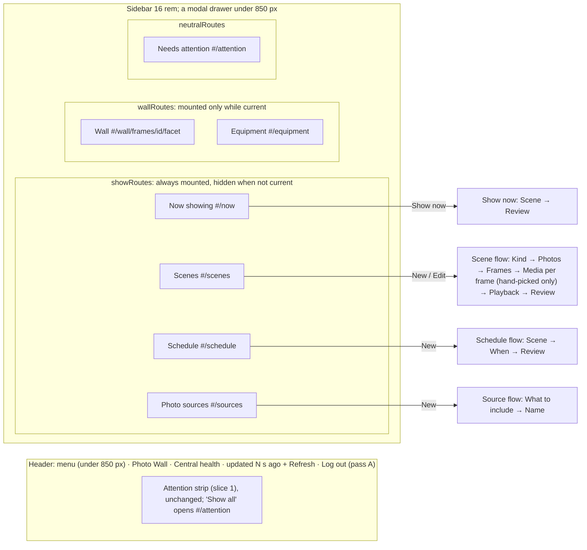
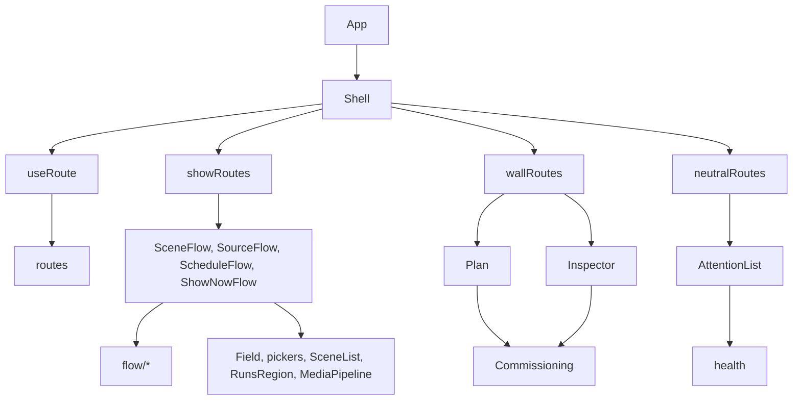

# Operator Console Pass 2, Passes C and D: Familiar Look, Progressive Flows

**Date:** 2026-09-28 · **Status:** design-gate artifact, awaiting owner approval.
**Builds on:** [the approved console design](operator-console-ux-design.md) (R1–R4; Q8: non-blocking guidance, never a gating wizard), [slice 1](operator-console-ux-pass2.md) (`health.js`, the attention strip in the header, 5 s poll, write fence), [slice 2](operator-console-ux-pass2-onboarding.md) (`ConfirmAction`, roster), [slice 3](operator-console-ux-pass2-showrunner.md) (`Field.jsx`, pickers, activation key, revision guard, why chain) and [pass A](operator-console-ux-pass2-session.md) (cookie sign-in, Log out; being implemented now).
**Layer:** console modules: visual tokens, navigation shell, flow mechanics, and which existing component lives in which step. One backend line (the font MIME type, §5). No route, no migration.
**Size:** 8 beads (6 console, 1 test harness, 1 docs), about 1,700 net production lines and 1,000 test lines. The Player flow, the Display page, the setup checklist and an icon set are deferred (§14).

## 1. The problem in plain words

| What the operator meets | Where | Why it overwhelms |
|---|---|---|
| Every Showrunner form is open at once: Scene, Program, Source, activation | `Showrunner.jsx:55-67` | Before choosing anything, the operator sees about 25 fields and 6 checkbox groups. |
| One form asks many questions together, the rare ones included | `SceneAuthoring.jsx:57-64` (mode, name, id, source, targets, cycle, loop); `ProgramsRegion.jsx:295-400` | Defaults exist, but they read as required decisions. |
| Two modes, "Wall" and "Showrunner" | `App.jsx:156-187` | They name the tool, not the job. |
| Its own blue-grey palette and system font | `index.css:4-45` | It looks unrelated to the photo library the operator already uses. |

## 2. Requirements (binding; answers are steers, not rules)

1. **Match the photo library's look and feel** (owner, pass C).
2. **Progressive configuration** instead of pages of fields and checkboxes (owner, pass D).
3. **A slot in the Source step** for a tag picker with autocomplete and media previews. Its backend is not designed here (owner, pass B).
4. **Neutral library language.** No vendor vocabulary. The UI says that Photo Wall *selects media that lives in your photo library*: it never uploads, edits or owns photos (owner). `test_sources_have_no_immich_or_album_language` stays.
5. **R1–R4 hold.** R4: Display controls are reachable only from the Wall side, and Show pages see frame health as status only.
6. **Onboarding never gates the console** (Q8).
7. **The attention strip stays in the header** (slice 1 §5 contract).
8. **CSP** is `default-src 'self'; script-src 'self'; style-src 'self' 'unsafe-inline'; frame-ancestors 'none'` (`central/app.py:379`). Everything is bundled, and `data:` URLs are refused.
9. **Pass A:** a sign-in screen and **Log out**.
10. **Immich web is AGPL-3.0** ([LICENSE](https://github.com/immich-app/immich/blob/main/LICENSE)). Reuse values, never code, markup, logos or assets.

## 3. One picture, three rules

**Design rules.**
1. **One decision per step.** Everything else has a stated default (§7) and sits behind **Advanced**. Review lists every value, the advanced ones included.
2. **A draft belongs to its flow, and a flow never unmounts.** Show sections stay mounted and hidden. A step change, a section change, a poll or an expired session therefore cannot lose a draft. Only Save, Discard, Log out or a reload end it.
3. **Moving a control never renames it.** Labels and accessible names carry over ("Scene name", "Save Scene", region "Runs"), so tests and muscle memory move with the change.

## 4. Glossary

| Term | Means | Is not |
|---|---|---|
| **Section** | A sidebar destination with its own URL | A mode or a permission |
| **Flow** | Ordered steps that end in one write (Save, Show now) | A modal wizard: the sidebar stays usable |
| **Step** | One screen asking one question, with its own URL | A tab; the order matters |
| **Draft** | Plane B values of one flow instance, keyed `new`, or the stored id for an edit | Anything sent before Save |
| **Advanced** | A collapsed [disclosure](https://www.w3.org/WAI/ARIA/apg/patterns/disclosure/) holding values that have a stated default | Hidden state: Review shows them |
| **Summary card** | A read-only card for one saved thing, with actions | A form |

## 5. Look and feel (pass C)

**Sources checked (2026-09-28):** Immich `main`: [web/src/app.css](https://github.com/immich-app/immich/blob/main/web/src/app.css), [Sidebar.svelte](https://github.com/immich-app/immich/blob/main/web/src/lib/components/sidebar/Sidebar.svelte), [UserSidebar.svelte](https://github.com/immich-app/immich/blob/main/web/src/lib/components/shared-components/side-bar/UserSidebar.svelte), [NavigationBar.svelte](https://github.com/immich-app/immich/blob/main/web/src/lib/components/shared-components/navigation-bar/NavigationBar.svelte). `@immich/ui` 0.90.0 (MIT, [repo](https://github.com/immich-app/static-pages/tree/main/packages/ui)): [theme/default.css](https://cdn.jsdelivr.net/npm/@immich/ui@0.90.0/dist/theme/default.css), [styles.js](https://cdn.jsdelivr.net/npm/@immich/ui@0.90.0/dist/styles.js), [internal/Button.svelte](https://cdn.jsdelivr.net/npm/@immich/ui@0.90.0/dist/internal/Button.svelte), [Card.svelte](https://cdn.jsdelivr.net/npm/@immich/ui@0.90.0/dist/components/Card/Card.svelte), [NavbarItem.svelte](https://cdn.jsdelivr.net/npm/@immich/ui@0.90.0/dist/components/Navbar/NavbarItem.svelte). Tailwind [colors](https://tailwindcss.com/docs/colors). Hex values are converted from oklch (≈). All ratios below were computed with the WCAG formula.

**Tokens (light / dark).** The existing token names keep their meaning.

| Our token | Value | Immich source | Contrast |
|---|---|---|---|
| `--accent`, `--focus` | `#4250af` / `#accbfa` | `--immich-ui-primary-500`; `--immich-primary: 66 80 175` | 7.0 / 12.0 on `--bg`; 6.7 / 10.8 on `--bg-raised` |
| `--on-accent` | `#ffffff` / `#000000` | `filledColor.primary: bg-primary text-light` | 7.0 / 12.7 |
| `--accent-tint` | accent at 10 % | active nav item `bg-primary/10 text-primary` | fill only |
| `--bg` | `#ffffff` / `#0a0a0a` | `--immich-bg`, `--immich-dark-bg: 10 10 10` | |
| `--bg-raised` | `#fafafa` / `#171717` | Card `bg-light-50 dark:bg-light-100` | |
| `--bg-sunken` | `#f5f5f5` / `#101116` | `--immich-ui-gray` (`subtle`) | |
| `--fg` | `#3d3d3d` / `#dbdbdb` | `--immich-ui-dark` `oklch(36% 0 17)` / `oklch(89% 0 271)` | 10.9 / 14.3 |
| `--fg-muted` | `#4b5563` / `#9ca3af` | `textColor.muted: text-gray-600 dark:text-gray-400` | 7.2 / 7.1 on raised |
| `--fg-label` (new) | `#5f6672` / `#d1d5db` | `immich-form-label: font-medium text-gray-500 dark:text-gray-300` (app.css:46-48); light **darkened** from gray-500 (`#6b7280`, 4.39 on `--input-bg`) | light 5.3 / 5.5 / 5.8, dark 10.0 / 12.2 / 13.4 (input / raised / bg) |
| `--border` | `#d4d4d4` / `#262626` | `--immich-ui-default-border` | decorative only |
| `--input-bg` | `#f3f4f6` / `#1f2937` | `inputContainerCommon: bg-gray-100 … dark:bg-gray-800` | `--fg` 9.9 / 10.6 |
| `--input-ring` | `#737373` both | Immich uses `ring-gray-200` / `ring-neutral-700`, which is under 3:1; **darkened for WCAG 1.4.11** | light 4.7 / 4.5 / 4.3, dark 4.2 / 3.8 / 3.1 (bg / raised / input) |
| `--alarm` + `--on-alarm` | `#c81c15` + `#fff` / `#f67d7d` + `#000` | danger-600 light (500 is 3.9:1) / danger-500 dark | 5.8 / 8.2 |
| `--ok` | `#07702a` / `#48ed98` | success-700 / success-500 | |
| `--warn` | `#936400` / `#ffd198` | warning-700 / warning-500 | |
| `--todo` | `#0a4e8e` / `#7ab7ff` | info-700 / info-500 | |
| Radii | button 12 px, input 8 px, card 16 px, nav pill on the trailing edge | Button medium `rounded-xl`; `inputRoundedSize rounded-lg`; Card `rounded-2xl shadow-sm border`; NavbarItem `rounded-e-full` | |
| Layout | sidebar 16 rem; header 4.5 rem + 4 px; drawer under 850 px | `sidebar:w-64`; `--navbar-height`; `--breakpoint-sidebar: 850px` | |

**Status chips never rely on colour alone.** **Colours:** the chip background is its status colour at 12 % over `--bg-raised`, with the text in `--fg` (8.5–10.8:1) and a 1 px border in the status colour (4.9–12.7:1 against raised). **Text and shape:** every chip starts with its state word ("Alarm", "To do", "OK") and a shape (▲, ■ or ●). **Same rule for markers:** the sidebar's draft marker is the word "Draft" and never a dot alone.

**Contrast pytest.** It parses the token block in both schemes. Text pairs must be at least 4.5:1: fg, muted and label on bg, raised **and `--input-bg`**; on-accent and on-alarm; the chip text. Non-text pairs must be at least 3:1: the ring against bg, raised and input; focus against bg and raised; each status border against raised.

**Components, in our own CSS.** **Buttons:** 14 px medium, padding 8 × 20 px. Filled primary for the one forward action per step. Outline (border plus tint) for secondary actions. Ghost for card actions. Danger only inside `ConfirmAction`. **Inputs:** filled `--input-bg` with a 1 px `--input-ring`, turning `--accent` on focus. Labels in `--fg-label`. **Nav items:** 14 px medium, padding 12 px vertical and 20 px leading, trailing pill. The active item is tinted, **semibold, with a 3 px `--accent` bar on its leading edge** (so it is never marked by tint alone), and carries `aria-current="page"`. **Cards:** 16 px radius and padding, header (title and chip), footer (actions).

**Typography.** Immich self-hosts a Google Sans variable font (`--font-sans: 'GoogleSans'`, `letter-spacing: 0.1px`, [PR #25174](https://github.com/immich-app/immich/pull/25174)). Its `@font-face` sets `size-adjust: 106.25%; ascent-override: 106.25%` (app.css:94-101), and we copy those two values. We take the font from [google/fonts `ofl/googlesans`](https://github.com/google/fonts/tree/main/ofl/googlesans) (SIL OFL 1.1), not from Immich.
- **Subset recipe (recorded beside the file):**
  1. Pin the GRAD and opsz axes (0 and 18) and keep wght 400–700 (`fonttools varLib.instancer`).
  2. Subset with `pyftsubset` to Latin-1 and common punctuation, keeping `--name-IDs=0,1,2,3,4,5,6,13,14` so the licence description and URL stay in the file.
  3. **Rename the family to "Console Sans"** in the subset's name table and in its `fvar` and `STAT` instance names. [TRADEMARKS.md](https://github.com/google/fonts/blob/main/ofl/googlesans/TRADEMARKS.md) limits use of the "Google Sans" mark on modified versions, and a subset is one. After step 2, the name table still reads "Google Sans".
- **Measured result (this revision):** WOFF2 of **44.8 KB**, or 54.1 KB with Latin Extended-A and B (Question 3).
- **Shipping:** `OFL.txt` is emitted into `dist/assets/` as a referenced asset beside the font. Fallback is `system-ui, sans-serif` with `font-display: swap`.
- **Vite:** `build.assetsInlineLimit: 0`, because Vite otherwise inlines small assets (the inline SVGs) as `data:` URLs, which the CSP blocks.
- **MIME type:** the image is `python:3.12.11-slim-trixie` (`Dockerfile:4`). Python 3.12's built-in table has no `.woff2` entry (`MimeTypes(filenames=())` returns `None`, checked), and `/etc/mime.types` in the image is unverified. So the composition root registers `font/woff2` explicitly, and a test pins the served `Content-Type`. That is a one-line change to `central/app.py`, made after pass A lands.

**Colour scheme and licensing.** The console follows `prefers-color-scheme`. We copy values only; values are facts, re-expressed as our own custom properties. No Svelte, utility strings or markup is copied, and `@immich/ui` is not a dependency. No logo, logo colour or `dist/assets` file is used. The wordmark is plain text. Five inline SVGs (menu, close, chevron, check, alert) are our own simple paths.

## 6. Navigation, routes and modules

| Section | Route | Contents (existing components) | Table |
|---|---|---|---|
| Now showing | `#/now`, `#/now/show/<step>` | Frame-health badges; `RunsRegion` as Run cards; "Show now" flow; Why and `WhyNothingNew` behind disclosures; `MediaPipeline` | show |
| Scenes | `#/scenes`, `#/scenes/new/<step>`, `#/scenes/<id>/edit/<step>` | `SceneList` as cards; the Scene flow | show |
| Schedule | `#/schedule`, `#/schedule/new/<step>` | Program cards ("Past" collapsed); the Schedule flow | show |
| Photo sources | `#/sources`, `#/sources/new/<step>` | Source cards with Refresh; the Source flow | show |
| Wall | `#/wall`, `#/wall/frames/<id>/<facet>` (facet: `binding`, `commissioning` or `nowshowing`, the `Inspector.jsx:43-45` keys) | Surface filter, `Plan`, `UnplacedTray`, `Inspector`, `Guidance` (unchanged) | wall |
| Equipment | `#/equipment` | `EquipmentRoster`, unchanged | wall |
| Needs attention | `#/attention` | The attention strip's expanded list, full width. Each item links to `#/wall/frames/<id>/<facetFor(...)>` | neutral |

**Frozen surfaces (one page per slice later; bodies are not designed here).**

| Surface | Signature | Owner |
|---|---|---|
| `parseRoute(hash) → Route \| null`, `formatRoute(route) → string` | `Route = {section, id?, flow?: "new"\|"edit"\|"show", step?, facet?}`; pure, with no React | `routes.js` |
| `useRoute() → {route, navigate(route, {replace?, ifUnknown?})}` | The only writer of `location.hash`; listens to `hashchange`. `ifUnknown` (the landing route) navigates only if the hash names no route when it runs, so a section chosen before the rendered route caught up is never overwritten | `useRoute.js` |
| `showRoutes`, `wallRoutes`, `neutralRoutes` | `ReadonlyArray<{section, label, render(ctx), samplePaths: string[]}>` | `showRoutes.jsx`, `wallRoutes.jsx`, `neutralRoutes.jsx` |
| `useFlowDraft(seed) → {key, value, open(key), patch(partial), reseed(), discard(), dirty, baseRevision, seeded}` | `seed(key)` returns the initial value: defaults for `new`, the stored record for an edit. `reseed()` re-runs `seed(key)` from the current snapshot and resets `baseRevision` (Reload). **Invariant: one draft per flow.** `open(otherKey)` while `dirty` is refused and returns the open key, so the caller asks first. | `flow/useFlowDraft.js` |
| `Stepper({steps, current, onStep, answered?})`, `Advanced({summary, open, lockedOpen?, onToggle})`, `SummaryCard({title, chip, lines, actions})` | Presentational | `flow/*` |
| `FIELD_STEP: Record<fieldKey, stepId>` per flow; `ProblemSummary` gains `onOpen(fieldKey)` | Routes a problem to its step | each flow; `Field.jsx` |
| `coveringPriority(snapshot, frameIds) → number` | The highest priority among live root Runs covering any of the frames; **0 when none does** | `showState.js` |

**R4, with its guarantee stated honestly.**
- Commissioning is reachable only through `wallRoutes`.
- **What enforces it (a CI test, not a boot check):** a pytest walks the imports reachable from `showRoutes.jsx` and `neutralRoutes.jsx` and fails if `Commissioning.jsx` or `Inspector.jsx` is among them. It also walks the shell's own graph from `main.jsx`, stopping at `wallRoutes.jsx`, so the shell reaches them only through the Wall table (the Wall state the shell holds lives in `wallState.js`, which imports no component). The scan fails closed: an `import`, `export … from`, `import(…)` or `import.meta` it cannot read or resolve is an error. A browser test visits every `samplePaths` entry of `showRoutes` and `neutralRoutes` and finds no Commissioning landmark.
- **Hiding uses the HTML `hidden` attribute, not CSS classes,** so hidden sections leave the accessibility tree and their `role="status"` and `alert` regions are not announced.
- **Why hidden Show pages do not weaken it:** Wall sections unmount when they are not current. The always-mounted Show sections, hidden when not current, therefore contain no Commissioning DOM.
- `useMode` and the mode toggle are deleted.

**Hash routing details.**
- **Skip link:** "Skip to content" is a button that focuses `<main>`. An `href="#main"` link would change the route.
- **Leaving a draft:** `hashchange` cannot be cancelled, so there is no leave prompt. The draft persists instead, and the section shows "Resume draft (Draft)".
- **Leaving a confirmation:** `hidden` does not remove a modal `<dialog>` from the top layer, so a Show page left with a confirmation open would leave the next page inert. Each page tells its subtree whether it is hidden (`pageVisibility.js`), and `ConfirmAction`, the one owner of every `useConfirm` dialog, puts its dialog away: an idle one is cancelled, as Esc would; one in flight or showing its outcome comes back, focused, with its page, and a write that finishes "done" meanwhile ends it as usual.
- **The Wall's Surface follows the route:** a frame route reached by anything but plain selection (a typed URL, Back, a link) shows that frame's Surface; plain selection keeps the Surface in view.
- **Opening another instance:** an in-app action that opens a different instance (Edit on another card) asks through `useConfirm`. A typed or Back-button URL naming another instance shows "Unsaved draft for X: Resume or Discard" and never replaces the draft silently.
- **Deep links before the first snapshot:** the route parses at once. Sections show "Loading…", and id routes resolve only after the first snapshot, so there is no premature "no longer exists". Before sign-in, the hash is preserved under pass A's screen.
- **History:** steps move with `replace`, so each flow is one history entry. The in-flow Back button changes step, and browser Back leaves the flow with the draft kept. Save `replace`s the flow entry with its section, so Back after Save never re-enters a finished flow. It does so only if the location still names the flow when the write lands; an operator who left meanwhile stays where they went, and the finished flow's entry, if Back reaches it, shows the section instead of a fresh draft. The step is read-only while the write is in flight. *Cost:* browser Back does not step backwards inside a flow.
- **Landing:** unknown routes `replace` to the landing route: `#/wall` while no frame exists (the Guidance banner is there), otherwise `#/now` (Question 4).

**Drawer (under 850 px).**
- **Element:** a native `<dialog>` opened with `showModal()`, like `ConfirmAction.jsx:85`, so the background is inert and focus stays trapped.
- **Closing:** Esc closes it and returns focus to the menu button. Choosing a link closes it and focuses the new page's `<h1>` (`tabIndex=-1`).
- **Other keys:** Enter submits a step's Continue. `prefers-reduced-motion` removes transitions.
- **Narrow screens (390 px):** the stepper collapses to "Step 2 of 5 · Frames". Back and Continue sit in a sticky footer. Cards are one column. The attention strip keeps its slice 1 layout under the header.

**Cross-pass: session expiry and Log out (changes pass A's code and its Question 4 default; owner Question 6).**
- **(a) A 401 while signed in keeps the last snapshot.** Pass A's code clears it today (`useSnapshot.js:135-139`). Only Log out clears the snapshot.
- **The overlay:** pass A's sign-in screen appears as an **overlay**. The shell gets `hidden` and `inert` but stays mounted, and the poll pauses until sign-in. A first load with no session shows the full screen. Both are one modal `<dialog>` in the top layer, so a confirmation the shell still holds open cannot make the sign-in form inert; it focuses "Operator token", and signing in returns focus to where it was.
- **(b) Log out:** the snapshot provider exposes `sessionEpoch`, bumped in `signOut()`. The shell is keyed on it, so Log out remounts the shell and discards every draft.
- **(c) Prune effects:** flow prune effects are no-ops while the snapshot is `null`, so a missing snapshot never reads as "every frame was deleted".
- **(d) Ownership:** bead 1b owns the `useSnapshot.js` and `App.jsx` edits, and a browser test forces a 401 mid-flow, signs in again and asserts the Scene draft's targets and per-frame selections survive.
- **(e) Cost:** after a token rotation, the previous snapshot stays in a hidden DOM until someone signs in. It is not visible, but it is readable through dev tools.
- **Docs follow-up:** bead D updates `operator-console-ux-pass2-session.md` §7 and Question 4.

## 7. The flows (defaults have a source)

**Mechanics shared by every flow.**
- **Container:** a flow container per section owns `useFlowDraft` and every draft **effect**, and it never unmounts (rule 2). Steps are views over the draft.
- **Continue:** validates the current step and shows only its reasons; a later step shows none until its own Continue or Review's Save.
- **Review:** validates everything. `ProblemSummary` entries route through `FIELD_STEP` to the owning step, and focus reaches the field once that step mounts, through a one-shot focus request like `App.jsx`'s `focusRequest`. A problem inside Advanced opens it first.
- **Check answers:** Review is a [check-answers page](https://design-system.service.gov.uk/patterns/check-answers/) with "Change" links.

**J4 Make a Scene** (`#/scenes/new/...`). The pilot, and the risky flow.

| Step | Asks | Default, and its source | Advanced |
|---|---|---|---|
| 1 Kind | **"Live from a photo source" or "Hand-picked per frame"**: the first question, because it changes the later steps | Live (`SceneAuthoring.jsx:57`) | — |
| 2 Photos | Source (`SourcePicker`), or "New selection from your photo library", which runs J5 inline and returns | None: a required choice | — |
| 3 Frames | `TargetPicker` and `FrameChips` | None: required | — |
| 3b Media per frame | Hand-picked only: per-frame choosers with the planner's `standing` | None: required per frame | — |
| 4 Playback | "Seconds per cycle" (`CycleInput`) | 30 s (`SceneAuthoring.jsx:62`) | Loop, on (`:64`) |
| 5 Review | "Scene name", then **Save Scene** | — | "Id", derived from the name (slice 3 §5) |

**Draft effects move to the flow container:**
- the vanished-frame prune (`SceneAuthoring.jsx:79-92`);
- the candidate prune and its `useCandidates` read (`:94-111`).

They run whichever step is showing, and the "was deleted and removed from this Scene" notice appears on the current step and on Review.

**Edit** opens the flow at Review, seeded from the stored Scene. The draft records `baseRevision`. When a poll shows a newer stored revision, Review says "This Scene was changed (revision N) since you opened it", disables Save, and offers **Reload**, which reseeds the draft and names the changed fields. So there is no 409 loop. Central's guard (409 `scene_revision_conflict`) remains the backstop for a change between polls. After Save, the next actions are "Show now" and "Schedule it".

**As built (bead 2).** Step ids are `kind`, `photos`, `frames`, `media`, `playback` and `review`. The kit lives in `central/console/src/flow/`: besides the frozen surfaces, `StepForm` (the Back and Continue footer), `useFlowFocus` (FIELD_STEP routing and the one-shot focus request), `useFlowInstance` (an instance on its section: route and key, opening, the last step shown, Continue, Back, discarding and finishing), `InstanceNotice` and `DraftBar` (the "Resume or Discard", "no longer exists" and "Resume draft (Draft)" surfaces) and the pure `draftState.js`, `steps.js` and `instance.js`. Beads 3 to 5 reuse them; a flow container keeps its seed, effects, write and step views. A draft is keyed `new` or `edit/<id>`, so a Scene whose id is "new" stays apart from a new Scene. A seeded value's `revision` is its `baseRevision`. After a Change link or a routed problem, Continue goes to the next step that still has a problem, else Review. An edit opens at Review, so Back there goes to Playback, not to the cards. The stepper ticks a step only once the draft has shown it (an edit's stored values answer them all). A focus request lives only while the view it was made for is on its way, and a missing or unauthorable instance asks for none. A stale edit is one whose stored revision differs from `baseRevision` either way (a Scene restored or made again can go down); Reload names the values storage changed and says when it replaced unsaved changes. Edit keeps slice 3's Replace confirmation; a 409 there says Review now offers Reload and moves focus to it. The shell's context carries `recentSceneId` (set by the Scene flow on Save and by a card's Show now or Schedule it) for beads 4 and 5 to prefill their Scene step, and `markDraft(section, dirty)` for the sidebar's "Draft".

**J5 Add a photo source** (`#/sources/new/...`). The intro reads: "Photo Wall selects media that lives in your photo library. It never uploads, edits or deletes anything there."

| Step | Asks | Default, and its source | Advanced |
|---|---|---|---|
| 1 What to include | Media type; Favourites; Taken from and Taken until. **Pass B slot:** a criteria list plus a reserved preview area; pass B adds "Tags" (autocomplete) and fills the previews. Nothing renders in this pass. | Images and video; Any (`SourcesRegion.jsx:157-158`); dates empty | — |
| 2 Name | "Source name"; **"Connection name"** | Name: none, required. Connection: **visible and required while no Source exists**. When every existing Source's served `spec` has one `connection_ref`, that value is prefilled and the field moves to Advanced. Several values give a visible chooser. | Connection (in the one-value case) |

**As built (bead 3).** Step ids are `include`, `name` and `review` (`sourceFlowModel.js`, pure, with the connection rule, the seed and the `SourceSpec` body); `SourceFlow.jsx` is the container, `SourceSteps.jsx` the views, and `SourcesRegion.jsx` the region with the intro. Rule 3 keeps the single form's names: the name field is still "Source name and revision" (the ref is `name:rev`), the form "Configure a Source", the write "Save source", and the region "Sources". The chooser (several values) offers only the served values; a new connection name is typed while no Source exists or, in the one-value case, under Advanced. The pass B slot is `LibrarySlot` (`data-slot="criteria"` inside the criteria list, `data-slot="preview"` after it): empty, roleless and out of the layout until pass B fills it. Review is the kit's `CheckAnswers` (shared with the Scene flow). Cards are `SummaryCard`s with Refresh, what the Source includes (`mediaHealth.js` `sourceFilters`) and its connection. **Inline J5** is a kit hand-off (`flow/handOff.js`, `flow/useHandOff.js`): the shell holds one pending hand-off in its context (`handOffs`); the Scene flow begins one to `sources` for its draft; the Source flow, through `useFlowInstance`'s `handOff` option, opens its new instance, says whom it is for, and settles it once: after Save with `{sourceRef}`, on Back from its first step or "Discard and return to your Scene" with nothing. The Scene flow then shows Photos with focus on "Source" (and the new Source chosen); a Save that lands after the operator left only fills in the Source. A hand-off belongs to the Scene draft it was begun for, not to its key: every opened draft has its own `id` (`useFlowDraft`), so a new Scene begun after another was discarded is another draft. When that draft closes or is replaced (discarded, saved, another Scene opened) the Scene flow settles the hand-off with nothing (`useHandOffFrom`), so the Source flow runs on its own from then on: it no longer says whom it is for, and its Save stays on Photo sources. Log out drops the hand-off with the shell.

**J6 Schedule it** (`#/schedule/new/...`):

| Step | Asks | Default, and its source | Advanced |
|---|---|---|---|
| 1 Scene | `ScenePicker` | Prefilled from J4 | — |
| 2 When | Window start and Window end | None: required | "Repeat on" and "Number of windows" ("Add separate windows") |
| 3 Review | Summary and save | Priority 0 (`ProgramsRegion.jsx:117`), shown on Review | Priority |

**As built (bead 4).** Step ids are `scene`, `when` and `review` (`scheduleFlowModel.js`); `ProgramsRegion.jsx` is the flow container and the Program cards, and `ScheduleSteps.jsx` the step views. The Schedule page offers "Schedule a Program", a line saying where separate windows are added, the "Times in <zone>" label (also on When and Review), the cards (`SummaryCard`, named "Program X", with Remove; a chip only for Running, Refused and Missed) and "Past (N)" collapsed. "Schedule it" (after a Scene's Save and on a Scene card) opens `#/schedule/new/scene` with the Scene prefilled from `recentSceneId`; a later hand-over refills an untouched draft, and a changed draft is kept while its Scene step offers the handed-over Scene. "Number of windows" defaults to 1, which schedules one Program under its id ("Schedule Program"); any other value is the separate-windows helper, whose Review action is "Add separate windows" (its old visible count moved to Review, which lists every planned window), with today's per-window outcome and retry: a partial failure keeps the flow on Review. **"Program name" and its Id are on Review**, as the Scene flow's are: the id derives from the name, and whether it (or each `<id>-<n>`) is free and short enough depends on the number of windows chosen on When. Priority and Id sit under Review's Advanced; Repeat on and Number of windows under When's. `windowProblems` now reports an overlap once the windows can be planned, without waiting for the name, so When's Continue refuses it. The kit gained `CheckAnswers` (Review's list) and `useFlowInstance().checkAll` (the final write's check and focus routing); the Scene flow can adopt both once bead 3 lands.

**J7 Show now** (`#/now/show/...`): Scene, then Review.

- **Priority default: `coveringPriority`**, the highest priority among live root Runs covering the Scene's target frames, or 0 when none does.
  - *Why max, not max + 1:* precedence is `(priority, root_order, admission_order)` (`runtime.py:174`), the visible winner needs a strictly greater tuple (`:794`), and `root_order` is the admission sequence, which rises on every admission (`:576,587`). At equal priority the later admission wins, so max already shows the new Run on top.
  - Review always shows the priority. If the operator lowers it below `coveringPriority`, Advanced opens itself with "At priority P this stays underneath Run R (priority Q) on frames …".
  - Protection refusals keep slice 3's wording (`RunsRegion.jsx:427-428`).
- **Activation key:** it lives in the Show-now draft, not in step state. Today it is component state (`RunsRegion.jsx:268-272`). It therefore survives step and section changes and session expiry, and the slice 3B rule holds: an unknown outcome keeps the key, and changing the form makes a new activation.
- **"If it is already running"**: its current default, shown on Review and changeable under Advanced.

**See what is showing and why** (`#/now`, not a flow): Run cards (running, recently ended). "Why?" on a frame opens the precedence list, and "Why nothing new?" opens the media chain. Now-showing stays intent, never "live" (R2).

**As built (bead 5).** Step ids are `scene` and `review`; the pure shape (steps, `SHOW_KEYS` with `newFlow: "show"` and no edit, the seed and the key rule `editActivation`) is `showNowModel.js`, and the container is `ShowNowFlow.jsx`, mounted inside the Runs region so it never unmounts; while the route shows a step, the Run cards, the Why rows and the media pipeline are hidden. `coveringPriority` counts live root Runs only (a child carries its root's priority and root order, and a root's `participants` include its children's targets); its helpers `coveringRuns` and `underneathSentence` name each covering Run above the chosen priority as "the Run of X (priority Q) on a, b", since Run ids are hashes. The draft holds `priority: null` while it follows that default, read from the current snapshot, so Review's default moves with the Runs, and it says "no Run covers its frames" only when none does (a covering Run may have priority 0); an explicit priority below it holds Advanced open (`lockedOpen`) with the explanation, including when a higher Run starts while Review shows. The key is minted with the draft and again by every operator change that alters a value (choosing the value already there keeps it; a new Scene also puts the priority back on its default). Any 5xx, timeout or thrown request keeps the draft and its key; a 401 says nothing started and keeps the draft for after sign-in; any other answer is a known outcome and finishes the flow. The Show-now draft follows `recentSceneId` only while it is clean and has no unknown outcome; a dirty one resumes as it was. "Show now" on the page enters the flow in place of `#/now`'s history entry (the kit's `start` takes `{replace}`), so finishing leaves one `#/now` entry and Back leaves the page. "If it is already running" is also a Review answer whose Change opens Advanced. Review's check-answers list is `flow/CheckAnswers.jsx`; the Scene flow's inline copy can adopt it. The frame chooser "Frame for why" became one row per frame with the two disclosures; "No live Runs." became "No Run is running.".

**Fix a problem:** the header strip is unchanged. "Show all" opens `#/attention`, and its links carry the facet in the route.

## 8. Designed twice

| | **A (chosen): sections + cards + step flows, Show sections kept mounted** | **B: sections, each page keeps its whole form, rare fields collapsed** |
|---|---|---|
| Answers "overwhelming" | Yes: one question per screen, and Review shows the defaults | Partly: fewer visible fields, but the form is still the page |
| Draft safety | Structural (rule 2) | Structural too, if also kept mounted |
| New mechanisms | `useRoute`, route tables, `useFlowDraft`, `Stepper`, `Advanced`, `SummaryCard` | `useRoute`, route tables, `Advanced` |
| Gives up | More clicks for an expert (Review's Change links help); browser Back leaves a flow; hidden Show pages re-render on every poll, as today's Showrunner does | The progressive flow the owner asked for |

**Rejected: a global draft store above the router with sections unmounted.** It adds a second Plane B owner, and the prune effects would need a home outside any mounted component. **Rejected: keeping Wall sections mounted too.** That would put Commissioning DOM under Show routes and break R4.

## 9. Tests: what breaks and how it moves

There are 149 browser test functions (about 155 cases). 116 call sites use a per-file `_connect` or `_to_showrunner`. Region names ("Scenes", "Programs", "Runs", "Sources") and labels are pinned by rule 3.

**Bead 0 (harness) adds task-level helpers** in `tests/browser/console_tasks.py`:
- **Section and task helpers:** `go(page, section)`, `author_scene(page, …)`, `add_source(page, …)`, `schedule_program(page, …)`, `show_now(page, …)` and `open_frame(page, frame_id, facet)`.
- **Sign-in:** built on pass A-2's sign-in helper, which pass A-2 owns.
- **What they absorb:** the coupling to forms and region names. Tests that are *about* a form keep their direct locators.
- **Scoping to the visible page:** `visible_page(page)` returns `page.locator("main section:not([hidden])")`. Negative assertions (`to_have_count(0)`) are scoped through it, because Playwright's `get_by_text` counts hidden nodes while `get_by_role` excludes them.
- **Existing helpers:** `_author_live_scene` and `_schedule_program` already exist (`test_operator_showrunner_browser.py:550,571`) and are promoted.

| Bead | Assertions edited (estimate) | Why |
|---|---|---|
| 0 | 0 (about 120 call sites move to helpers) | Mechanical |
| 1a | 0 | Pure CSS |
| 1b | about 16 | Mode toggle removed (4 direct "Showrunner" clicks); R4 test generated from `samplePaths`; shell tests. **Negative text checks now also match hidden pages' DOM:** `get_by_text(…).to_have_count(0)` at `test_operator_wall_browser.py:150` and `test_operator_health_browser.py:87,260` (plus a sweep for the same idiom) move to `visible_page(page)` |
| 2 Scene | about 10 | Form-specific tests: Kind first, Review, Advanced id, Edit at Review |
| 3 Source | about 4 | Steps; connection rule |
| 4 Schedule | about 5 | Windows helper under Advanced |
| 5 Show now | about 7 | Activation as a flow; priority default; Why disclosures |

**New tests:** a draft surviving a step change, a section change, a Wall visit, a poll and a 401 overlay; Log out discarding drafts; a Review problem focusing its field on its own step; a stale Edit offering Reload (no 409); `coveringPriority` against a live higher Run; the activation key kept across sections; the landing and unknown-route `replace`; the drawer's focus trap, Esc and link-then-heading focus at 390 px; hidden Show sections announcing no status; the font's `Content-Type` and family name, with no cross-origin or `data:` request; the contrast pytest; the R4 import scan.

**Mutation probes (each must turn a named test red):** unmount the hidden Show sections (draft test); import `Commissioning` in `showRoutes` (scan); use `max + 1` or `0` for the priority (priority test); regenerate the activation key on a section change (key test); drop the name-table rename (font test).

## 10. What can go wrong

| Failure | What the operator sees | Guarantee |
|---|---|---|
| Reload mid-flow | The draft is lost | None (memory only; Question 5) |
| A stored Scene changed under an Edit | "Changed since you opened it", then Reload | Poll comparison, plus Central's 409 guard (server) |
| A poll, a section change or a session expiry mid-flow | Nothing is lost | Structural: the flow container never unmounts; the overlay hides without unmounting |
| A frame or candidate vanishes mid-flow | A notice; the value is pruned on every step | Flow-level effect, plus a test |
| An Advanced value is invalid | Review opens it on its step and focuses the field | Test |
| Show now at a priority below a covering Run | Advanced opens with the explanation | Test |
| Commissioning reachable from a Show route | CI fails | Test (import scan plus browser), not boot |
| The font is refused (MIME type, CSP) | System font | CSS fallback; `Content-Type` test |
| An unknown or stale route | The landing page, or "This no longer exists" once the snapshot is loaded | Test |

## 11. Tracer bullet

**Bead 1a (pure CSS):** tokens, font and component restyle, on today's layout. It proves the font loads under the CSP with the right MIME type, both schemes pass the contrast pytest, and nothing behavioural changes. The browser suite is untouched.

**Bead 1b:** the sidebar, the three route tables, the drawer and `#/attention`. The regions are mounted unchanged, with Show sections kept mounted. It proves Back and forward between sections, the poll across navigation, R4 by routes, and that a draft in today's Scene form survives a Wall visit.

**Not in the tracer:** flows and cards.

## 12. Beads

Every bead lands green, with one full verify each (pytest, ruff, `check_docs.py`, browser suite).

| # | Bead | Main files | Prod / test lines |
|---|---|---|---|
| 0 | Task-level test harness (after pass A-2's sign-in helper) | tests/browser/* | 0 / 300 |
| 1a | Tokens, font subset and licence, component restyle, `assetsInlineLimit: 0`, `font/woff2` registration | `index.css`, font asset, `vite.config.js`, `app.py` (one line) | 250 / 80 |
| 1b | Header, sidebar, drawer, `routes.js`, `useRoute`, three route tables, `#/attention`, facet in URL, R4 scan; `useMode` deleted | new `Shell.jsx` and route modules; `App.jsx`, `Inspector.jsx` | 450 / 150 |
| 2 | **Scene flow (pilot)** with the flow kit (`useFlowDraft`, `Stepper`, `Advanced`, `SummaryCard`, problem routing), Scene cards, Edit at Review with `baseRevision` | new `flow/*`, `SceneFlow.jsx`; `SceneAuthoring.jsx` split into steps; `SceneList.jsx`; `Field.jsx` | 500 / 200 |
| 3 | Source flow, pass B slot, neutral wording, connection rule | `SourcesRegion.jsx` | 150 / 80 |
| 4 | Schedule flow, Program cards | `ProgramsRegion.jsx` | 150 / 90 |
| 5 | Show now: `coveringPriority`, key in the draft, Run cards, Why disclosures | `RunsRegion.jsx`, `showState.js`, `MediaPipeline.jsx` | 180 / 100 |
| D | Docs: runbook by job, README, `architecture.md` console section, pass A doc follow-up (§6), ledger | docs/* | — |

## 13. Costs

More clicks for an expert; browser Back leaves a flow; hidden Show pages render on every poll (as today); about 42 assertion edits; a 45 KB font; a one-line backend change. Our light-mode status colours and our input ring are darker than Immich's, for AA. The domain nouns (Scene, Program, Run, Frame) stay; the mode names go.

## 14. Deferrals and questions

**Deferred to a later pass, with constraints recorded now:**
- **Player setup flow.** A frame-create-then-bind partial failure must be designed: the frame is created and the bind fails, and the operator is left with an unbound frame plus a retry of the bind only.
- **Frame profile.** No default can come from the Output: production Players enroll every connector at `width_px=0, height_px=0` (`player/output_discovery.py:59-60`). The profile must stay a visible, required choice with common presets. The `Plan.jsx:80` 1920×1080 default is unchanged in this pass.
- **Display page** (a stepped Commissioning page with a leave guard).
- **Setup checklist.**
- **Icon set:** only five inline SVGs this pass, and no `@mdi/js`.
- **Pass B:** the tag picker, previews and their backend.
- **Theme toggle.**

**Questions (the default is used if there is no answer):**
1. **Nav label: "Scenes" or "Slideshows"?** Build proceeds on the default: **Scenes** (domain, runbook, tests). "Slideshow" appears only in hints.
2. **Browser Back inside a flow:** leave the flow (steps use `replace`), or step back (push)? Build proceeds on the default: **leave the flow, keeping the draft.**
3. **Font subset: Latin-1 (44.8 KB) or Latin Extended (54.1 KB)?** Build proceeds on the default: **Latin-1**. Other characters fall back to the system font.
4. **Landing:** `#/wall` until a frame exists, then `#/now`? Build proceeds on the default: **yes**.
5. **Keep drafts across a reload** in `sessionStorage` (per tab, cleared on Log out)? Build proceeds on the default: **no** (memory only).
6. **Session expiry: the sign-in overlay keeps drafts** (overturns pass A's Question 4 default, "drafts are lost"; costs §6 (e)). Build proceeds on the default: **overlay keeps drafts.**

## History

- 2026-09-28: first draft (passes C and D).
- 2026-09-28, revision 1: two adversarial reviews (UX; licence and accessibility) failed the draft, and the design was changed. Scope cut to beads 0, 1a, 1b, 2–5 and D (Player flow, Display page, setup checklist and `@mdi/js` deferred). Show sections stay mounted, drafts and prune effects sit at flow level, Review problems route to their step, and Edits keep `baseRevision` with Reload. Show now defaults to `coveringPriority` (tie rule checked in `runtime.py`) and holds its activation key in the draft. Kind is the Scene flow's first question. The attention strip stays in the header. R4 rests on three route tables, a scan and generated visits, stated as a test. Hash-routing edge cases, a modal `<dialog>` drawer, frozen signatures and a module DAG were added. A sign-in overlay keeps drafts and Log out discards them (pass A follow-up). The look gained a `#737373` input ring, `--on-alarm`, chips with text and shape, `--fg-label` (citation corrected) and non-text contrast checks. The font subset keeps name IDs 13 and 14, is renamed, copies Immich's metric overrides and measures 44.8 KB. The build sets `assetsInlineLimit: 0` and registers `font/woff2` explicitly.
- 2026-09-28, revision 2 (final): the design now matches pass A's code for session expiry: a 401 keeps the snapshot, `sessionEpoch` is bumped on Log out, prune effects are no-ops without a snapshot, bead 1b owns the change and its overlay test, and the rotation cost is stated. Question 6 added for the overlay. `--fg-label` darkened to `#5f6672`. The `hidden` attribute specified. The 1b test estimate revised for hidden-page text matches, with `visible_page`. `useFlowDraft.reseed` and the one-draft invariant added. `coveringPriority` returns 0. The active nav item gains weight and a bar. The CSP quote corrected.
