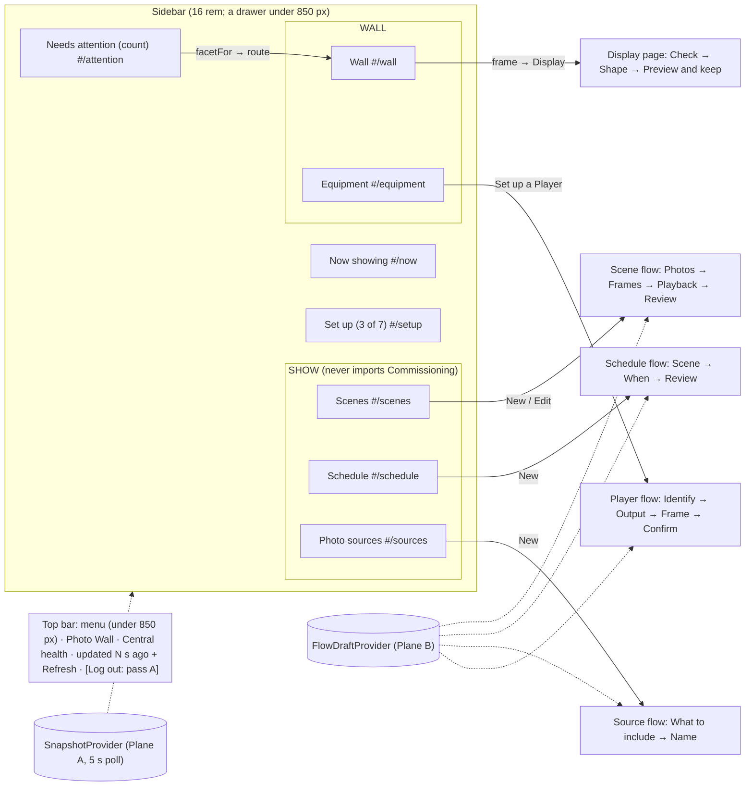

# Operator Console Pass 2, Passes C and D: Familiar Look, Progressive Flows

**Date:** 2026-09-28 · **Status:** design-gate artifact, awaiting owner approval.
**Builds on:** [the approved console design](operator-console-ux-design.md) (R1–R4; Q8: non-blocking guidance, never a gating wizard), [slice 1](operator-console-ux-pass2.md) (`health.js`, attention strip, 5 s poll, write fence), [slice 2](operator-console-ux-pass2-onboarding.md) (roster, `ConfirmAction`, output chooser), [slice 3](operator-console-ux-pass2-showrunner.md) (`Field.jsx`, pickers, media pipeline, why chain) and, concurrently, [pass A](operator-console-ux-pass2-session.md) (cookie sign-in, Log out).
**Layer:** console module layer: navigation shell, visual tokens, flow mechanics, and which existing component lives in which step. No backend change, no new route, no migration.
**Size:** 11 beads (9 console, 1 test harness, 1 docs), about 2,100 net production lines (roughly 700 of them CSS) and 1,100 test lines. **This is larger than any earlier pass-2 slice.** §13 offers a smaller first scope.

## 1. The problem in plain words

| What the operator meets | Where | Why it overwhelms |
|---|---|---|
| Every Showrunner form is open at once: Scene authoring, Program scheduling, Source configuration, activation | `Showrunner.jsx:55-67` mounts all regions together | Before choosing anything, the operator sees about 25 fields and 6 checkbox groups. |
| One form asks many questions together, the rare ones included | `SceneAuthoring.jsx` (id, name, mode, source, targets, cycle, per-frame media); `ProgramsRegion.jsx:295-400` (id, Scene, window, priority, repeat helper) | Defaults exist, but they read as required decisions. |
| Two modes, "Wall" and "Showrunner" | `App.jsx:156-187` | They describe the tool, not the job ("add a Player", "make a slideshow"). |
| First-run help is one sentence in a banner | `Guidance.jsx:39-42` | Nothing tracks which step is done. |
| Its own blue-grey palette and system font | `index.css:4-45` | It looks unrelated to the photo library the operator already uses. |

## 2. Requirements (binding; answers are steers, not rules)

1. **Match the photo library's look and feel** so the two feel cohesive (owner, pass C).
2. **Progressive configuration** instead of pages of fields and checkboxes (owner, pass D).
3. **Leave a slot for a tag picker with autocomplete and media previews** in the Source step. Its backend is not designed here (owner, pass B).
4. **Neutral library language, no vendor vocabulary.** The UI must say that media lives in the operator's photo library and that this tool only *selects* existing media. It never uploads, edits or owns photos (owner). The existing test `test_sources_have_no_immich_or_album_language` stays.
5. R1–R4 hold. R4: Display controls are reachable only from the Wall side. Show pages see frame health as status only ([design](operator-console-ux-design.md#2-the-answer-in-one-picture)).
6. Onboarding never gates the console (Q8, [design §10](operator-console-ux-design.md#10-decisions-that-are-yours)).
7. CSP is `default-src 'self'; style-src 'self' 'unsafe-inline'` (`central/app.py:375`). Every font and icon is bundled; nothing is fetched from another origin.
8. Leave room for pass A's sign-in screen and a **Log out** control.
9. Immich web is AGPL-3.0 ([LICENSE](https://github.com/immich-app/immich/blob/main/LICENSE)). **Reuse design values, never code, markup, logos or assets.**

## 3. One picture, three rules

**Design rules.**
1. **One decision per step.** Everything else is prefilled and sits behind **Advanced**. The Review step lists every value, advanced ones included, so nothing hidden goes unseen.
2. **A draft belongs to its flow, not to the screen.** Changing step, changing section, a poll, or a sign-in prompt never loses it. Only Save or Discard ends it.
3. **Moving a control never renames it.** Accessible names and labels carry over unchanged ("Scene name", "Save Scene", region "Runs"), so tests and muscle memory move with the change.

## 4. Glossary

| Term | Means | Is not |
|---|---|---|
| **Section** | One sidebar destination with its own URL (`#/scenes`) | A mode or a permission |
| **Flow** | An ordered set of steps that ends in one write (Save, Bind, Keep) | A modal wizard: the sidebar stays usable throughout |
| **Step** | One screen in a flow asking one question, with its own URL (`#/scenes/new/frames`) | A tab; the order matters |
| **Summary card** | A read-only card for one saved thing with a one-line summary and actions (Edit, Show now, Schedule, Remove) | A form |
| **Draft** | Plane B values of one flow instance, keyed `new-scene`, `scene:<id>`, `new-program`, `new-source` or `player:<id>` | Anything sent to Central before Save |
| **Advanced** | A collapsed disclosure ([APG pattern](https://www.w3.org/WAI/ARIA/apg/patterns/disclosure/)) inside a step, holding values that have safe defaults | Hidden state: its values appear on Review |

## 5. Look and feel (pass C)

**Sources checked (2026-09-28):** Immich `main` [web/src/app.css](https://github.com/immich-app/immich/blob/main/web/src/app.css); `@immich/ui` 0.90.0 (MIT, [repo](https://github.com/immich-app/static-pages/tree/main/packages/ui)): [theme/default.css](https://cdn.jsdelivr.net/npm/@immich/ui@0.90.0/dist/theme/default.css), [styles.js](https://cdn.jsdelivr.net/npm/@immich/ui@0.90.0/dist/styles.js), [internal/Button.svelte](https://cdn.jsdelivr.net/npm/@immich/ui@0.90.0/dist/internal/Button.svelte), [Card.svelte](https://cdn.jsdelivr.net/npm/@immich/ui@0.90.0/dist/components/Card/Card.svelte), [NavbarItem.svelte](https://cdn.jsdelivr.net/npm/@immich/ui@0.90.0/dist/components/Navbar/NavbarItem.svelte); Immich [Sidebar.svelte](https://github.com/immich-app/immich/blob/main/web/src/lib/components/sidebar/Sidebar.svelte), [UserSidebar.svelte](https://github.com/immich-app/immich/blob/main/web/src/lib/components/shared-components/side-bar/UserSidebar.svelte) and [NavigationBar.svelte](https://github.com/immich-app/immich/blob/main/web/src/lib/components/shared-components/navigation-bar/NavigationBar.svelte). Neutral and gray steps are Tailwind's ([colors](https://tailwindcss.com/docs/colors)). Hex values are converted from oklch (≈).

**Tokens.** The existing token names stay, so no rule outside the token block changes meaning. Values are light / dark.

| Our token | New value (light / dark) | Immich source value | Note |
|---|---|---|---|
| `--accent` | `#4250af` / `#accbfa` | `--immich-ui-primary-500` (dark: `oklch(0.836 0.074 258.58)`); `--immich-primary: 66 80 175` | Contrast 7.0:1 on white, 12:1 on `#0a0a0a` |
| `--on-accent` | `#ffffff` / `#000000` | `filledColor.primary: bg-primary text-light`; `--immich-ui-light` is white / black | |
| `--accent-tint` (new) | accent at 10 % | active nav item `bg-primary/10 text-primary` | Also the outline-button fill |
| `--bg` | `#ffffff` / `#0a0a0a` | `--immich-bg: 255 255 255`; `--immich-dark-bg: 10 10 10` | |
| `--bg-raised` (cards) | `#fafafa` / `#171717` | Card secondary `bg-light-50 dark:bg-light-100` (neutral-50 / neutral-900) | |
| `--bg-sunken` (hover, search) | `#f5f5f5` / `#101116` | `--immich-ui-gray` `oklch(97% 0 271)` / `oklch(17.89% 0.0104 276.38)` | Immich calls this `subtle` |
| `--fg` | `#3d3d3d` / `#dbdbdb` | `--immich-ui-dark` `oklch(36% 0 17)` / `oklch(89% 0 271)` | 10.9:1 and 14.3:1 |
| `--fg-muted` | `#4b5563` / `#9ca3af` | `textColor.muted: text-gray-600 dark:text-gray-400` | Immich's `--immich-ui-muted` (`#a1a1a1`, 2.6:1) fails AA as text, so it is not used for text |
| `--border` | `#d4d4d4` / `#262626` | `--immich-ui-default-border` (light-300 / light-200) | |
| `--input-bg`, `--input-ring` (new) | `#f3f4f6`, `#e5e7eb` / `#1f2937`, `#404040` | `inputContainerCommon: bg-gray-100 ring-1 ring-gray-200 … dark:bg-gray-800 dark:ring-neutral-700` | Focused inputs use `--accent` for the ring |
| `--alarm` | `#c81c15` / `#f67d7d` | danger-600 (light) / danger-500 (dark) | Light uses 600 because danger-500 is 3.9:1 |
| `--ok` | `#07702a` / `#48ed98` | success-700 / success-500 | success-500 light is 2.4:1 |
| `--warn` | `#936400` / `#ffd198` | warning-700 / warning-500 | |
| `--todo` | `#0a4e8e` / `#7ab7ff` | info-700 / info-500 | A to-do stays blue, never alarm |
| `--focus` | same as `--accent` | Button `focus-visible:outline-2`, `outline-offset-2` | |
| `--radius-button` | 12 px | Button medium `rounded-xl` | |
| `--radius-input` | 8 px | `inputRoundedSize … rounded-lg` | |
| `--radius-card` | 16 px, plus `shadow-sm` and a 1 px border | Card `round: rounded-2xl`, `shadow-sm`, `border` | |
| `--radius-pill` | 9999 px, trailing edge only on nav items | NavbarItem `rounded-e-full` | |
| `--sidebar-w`, `--topbar-h` | 16 rem, 4.5 rem + 4 px | Sidebar `sidebar:w-64`; `--navbar-height: calc(4.5rem + 4px)` | Drawer below `--breakpoint-sidebar: 850px` |

**Components, restyled in our own CSS.**
- **Buttons:** 14 px medium, padding 8 × 20 px. Filled primary for the one forward action per step. Outline (border plus tint) for secondary actions. Ghost (text, tinted on hover) for card actions. Danger is filled `--alarm`, only inside `ConfirmAction`.
- **Inputs:** filled `--input-bg`, 1 px ring, 10 × 16 px padding. Labels are medium weight in `--fg-muted` (Immich `immich-form-label`).
- **Nav item:** 14 px medium, padding 12 px vertical and 20 px leading, 16 px gap, pill on the trailing edge. Active items are tinted and carry `aria-current="page"`. Group labels are small uppercase (Immich `NavbarGroup size="tiny"`).
- **Cards:** 16 px radius, 16 px padding, a header row with the title and a status chip, a footer row with the actions.

**Typography.** Immich renders a self-hosted Google Sans variable font (`--font-sans: 'GoogleSans'`, `letter-spacing: 0.1px`; added in [PR #25174](https://github.com/immich-app/immich/pull/25174)). Google Sans is published in [google/fonts `ofl/googlesans`](https://github.com/google/fonts/tree/main/ofl/googlesans) under **SIL OFL 1.1** with no Reserved Font Name. Its [TRADEMARKS.md](https://github.com/google/fonts/blob/main/ofl/googlesans/TRADEMARKS.md) says the name may not imply affiliation. We take the font from google/fonts, not from Immich's repository.
- **Subsetting:** a Latin and Latin-Extended subset, weights 400–700, one WOFF2 file of about 100 KB instead of the 5 MB source. The subset command is recorded beside the file, and `OFL.txt` is committed with it.
- **Name:** the family is declared as `"Console Sans"`, because a subset is a Modified Version.
- **Fallback:** `system-ui, sans-serif` with `font-display: swap`.
- **CSP:** Vite emits the file under `/console/assets/`, which `default-src 'self'` allows. Starlette serves it as `font/woff2` (checked on Python 3.12).

**Colour scheme.** Follow `prefers-color-scheme`, as today. Immich defaults to the system scheme but also offers a toggle (Question 3).

**Licensing stance.** We copy **values** (colours, sizes, radii, breakpoints). Values are facts, and we express them in our own CSS custom properties. No Svelte, Tailwind utility strings or markup is copied. `@immich/ui` is **not** a dependency (it is Svelte). **No Immich logo, logo colours (`--color-logo-*`) or `dist/assets/*` SVG is used.** The wordmark is plain text, "Photo Wall". Icons are Question 4.

## 6. Navigation model (pass D)

| Section | Route | Contents (existing components, reused) | Side |
|---|---|---|---|
| Now showing | `#/now` | Frame-health badges; `RunsRegion` (Runs, "Show now" flow, Why); `MediaPipeline` and `WhyNothingNew` behind "Why nothing new?" | Show |
| Needs attention | `#/attention` | `AttentionStrip` as a list. Each item links to the route that `facetFor` names (Binding: `#/wall/frames/<id>`; Display: `#/wall/frames/<id>/display`) | Neutral: links only |
| Scenes | `#/scenes`, `#/scenes/new/<step>`, `#/scenes/<id>/edit/<step>` | `SceneList` as summary cards; the Scene flow | Show |
| Schedule | `#/schedule`, `#/schedule/new/<step>` | Program cards (upcoming; "Past" collapsed); the Schedule flow | Show |
| Photo sources | `#/sources`, `#/sources/new/<step>` | Source cards with Refresh; the Source flow | Show |
| Wall | `#/wall`, `#/wall/frames/<id>`, `#/wall/frames/<id>/display/<step>` | Surface filter, `Plan`, `UnplacedTray`, `Inspector` (Binding and Now showing facets); the Display page | Wall |
| Equipment | `#/equipment`, `#/equipment/players/<id>/setup/<step>` | `EquipmentRoster` (pending players as "Set up" cards); the Player flow | Wall |
| Set up | `#/setup` | A checklist derived from the snapshot (replaces `Guidance.jsx`) | Neutral: links only |

- **R4 moves from mode to route.** The route table is split into `showRoutes` and `wallRoutes`. Only `wallRoutes` imports `Commissioning`, so R4 is still enforced by composition. `useMode` and the Wall/Showrunner toggle are deleted. The existing R4 browser test navigates to every Show route, and a new pytest scans the import graph of Show modules for `Commissioning` (§10).
- **Routing:** hash routes through a small `useRoute()` hook (about 60 lines, no dependency). Hash routes work at both `/` and `/console` with no Central fallback route. Unknown routes `replace` to the landing route. The landing route is `#/setup` while no frame exists, otherwise `#/now` (Question 5).
- **Top bar:** the menu button (under 850 px); the text wordmark; the Central health pill; "updated N s ago" and Refresh (unchanged); then a **right-aligned account slot** that pass A fills with **Log out**. Pass A's sign-in screen replaces the shell below `FlowDraftProvider`, so a 401 mid-flow keeps the draft (§8).

## 7. The flows, one per job

Each flow is a step list. Defaults are in brackets. Items marked "Advanced" are collapsed.

**J1 First-run setup** (`#/setup`, non-blocking). A checklist computed from Plane A by a new pure `setupProgress(snapshot)`:
1. Draw a frame.
2. Power on a Player.
3. Assign an output.
4. Commission the display.
5. Add a photo source.
6. Make a Scene.
7. Show it now or schedule it.

Each row shows done or to-do and links into the owning flow. The sidebar shows "Set up (n of 7)" until the list is complete, then moves the item to the sidebar footer. There is no modal and nothing is blocked (Q8).

**J2 Add a Player** (`#/equipment`, a pending card, then "Set up"):
1. **Identify:** boot facts and serial from `bootFacts`, and "Is this the box you powered on?" The claims-not-proof note stays.
2. **Output:** slice 2's explicit output chooser, with connected outputs first.
3. **Frame:** choose an unbound frame, or "New frame" (name, then an id derived from it; size [defaults] in Advanced).
4. **Confirm:** a summary, then Bind through `ConfirmAction`. After it succeeds, the flow offers "Commission the display now".

**J3 Commission a display** (`#/wall/frames/<id>/display`, a focused page opened from the Inspector or from J2). This is a page with three steps. It has no flow draft, because a preview lease is live hardware state and cannot be resumed.
1. **Check:** "Display at last Player start" and frame facts, read-only.
2. **Shape:** direct handles on the aperture (`useCalibration`). Advanced holds the corner coordinates, crop rectangle, rotation, SDR gain and panel colour correction.
3. **Preview and keep:** Preview, the lease countdown, then Commit or Revert, all unchanged.

Leaving the page with a live preview or an unsaved calibration draft asks through `useConfirm` ("The preview reverts on its own in N s").

**J4 Make a slideshow (a Scene)** (`#/scenes/new/...`):
1. **Photos:** pick an existing Source (`SourcePicker`) or "New selection from your photo library", which runs the J5 steps inline and returns here. The copy reads: "Photos stay in your photo library. Photo Wall only chooses which existing photos and videos to show. It never uploads, edits or deletes them."
2. **Frames:** `TargetPicker` and `FrameChips`, grouped by Surface.
3. **Playback:** "Seconds per cycle" (`CycleInput`) [default]. Advanced holds the authoring mode (Live source is the default; "Authored per-frame" with the per-frame candidate choosers and planner standing).
4. **Review:** a check-answers page ([GOV.UK pattern](https://design-system.service.gov.uk/patterns/check-answers/)) with "Scene name", with "Id" derived from it and editable under Advanced, then **Save Scene**. The next actions are "Show now" and "Schedule it".

**Edit** on a card opens the same flow at Review, seeded from the stored Scene (the `scene:<id>` draft). Each row has a "Change" link to its step. Save keeps slice 3B's revision guard (409 `scene_revision_conflict`, in words).

**J5 Add a photo source** (`#/sources/new/...`):
1. **What to include:** Media type [Images and video], Favourites [Any], Taken from and Taken until [empty]. **The pass B slot:** this step is composed from a criteria list plus a reserved preview area. Pass B adds a "Tags" field (autocomplete) to the list and fills the preview area. Neither renders anything in this pass.
2. **Name:** "Source name" [derived from the criteria]. "Connection name" goes under Advanced [the only configured connection].

**J6 Schedule it** (`#/schedule/new/...`):
1. **Scene:** `ScenePicker` [prefilled when arriving from J4].
2. **When:** Window start and Window end. Advanced holds the "Repeat on" and "Number of windows" helper ("Add separate windows").
3. **Review:** Priority is shown and changed under Advanced [default]. Then save.

**J7 See what is showing, and why** (`#/now`): Run summary cards (running, recently ended). "Show now" opens a two-step flow: Scene, then Review (Activation priority and "If it is already running" under Advanced). "Why?" on a frame opens the precedence list, and "Why nothing new?" opens the media chain. Now-showing stays **intent**, never "live" (R2).

**J8 Fix a problem** (`#/attention`, count in the sidebar): one row per attention item from `wallAttention`. Each row links to its route: Binding to `#/wall/frames/<id>`, Display to J3, silent Player to the Equipment card, media to "Why nothing new?".

## 8. Flow mechanics

| Concern | Choice | Cost |
|---|---|---|
| Drafts | A new `FlowDraftProvider` sits between `SnapshotProvider` and the sign-in gate. `useFlowDraft(key, seed)` returns the draft, a patch function and discard. The flow forms keep `useProblems` and `Field`, and only their `useState` cells move into the draft. A section with an open draft shows a "Draft" dot in the sidebar and a "Resume draft" card. | Drafts are kept in memory only, so a reload loses them (Question 6: sessionStorage). |
| Polling | Unchanged. `SnapshotProvider` sits above the router, and a route change neither mounts nor unmounts the poller. The write fence is unchanged. | None |
| Step validation | "Continue" validates the current step. Review validates the whole draft. A problem inside Advanced opens it and focuses the field. `ProblemSummary` is unchanged. | A value can be invalid only on Review, never earlier |
| URL and Back | Every step pushes a history entry, so browser Back returns to the previous step. Going back past the first step returns to the section and keeps the draft. A deep link to a later step with no draft `replace`s to step 1. | History grows by one entry per step |
| Stale targets | A route to a frame, Scene or Player that is no longer in the snapshot shows "This no longer exists" and a link back. The draft is kept until Discard. | |
| Keyboard | "Skip to content" link. The sidebar is `<nav aria-label="Console">` with links. The drawer is a button with `aria-expanded`; Esc closes it and returns focus. The stepper is `<ol aria-label="Steps">` with `aria-current="step"`. On step change, focus moves to the step heading (`tabIndex=-1`). Enter submits Continue. `prefers-reduced-motion` removes transitions. | |
| 390 px | The sidebar becomes a drawer. The stepper collapses to "Step 2 of 4 · Frames". Back and Continue sit in a sticky footer. Cards are one column. The health pill becomes a dot that keeps its accessible name. | |

## 9. Designed twice

| | **A (chosen): sidebar sections + summary cards + step flows for create and edit** | **B: sidebar sections, each page keeps its full form, rare fields collapsed** |
|---|---|---|
| Answers "overwhelming" | Yes. One question per screen, with defaults visible on Review | Partly. Fewer visible fields, but the form is still the page |
| New mechanism | `FlowDraftProvider`, `useRoute`, `Stepper`, `SummaryCard`, `Advanced` | `useRoute`, `Advanced` |
| Tests rewritten | About 60 assertion edits (§10) | About 25 |
| Gives up | More clicks for an expert, which Review's "Change" links partly offset. Extra URL states to test. | The progressive flow the owner asked for |

**Rejected: keep every section mounted and hidden** (to keep drafts for free). It renders every region on every 5 s poll. It would also leave Commissioning DOM under Show routes, which breaks R4's "no DOM" guarantee. **Rejected: a modal first-run wizard.** It contradicts Q8.

## 10. Tests: what breaks and how it moves

There are 149 browser test functions (about 155 cases). Five files each define their own `_connect` (`test_operator_{wall,health,binding,commissioning,showrunner}_browser.py`). 116 call sites use `_connect` or `_to_showrunner`, and four tests click "Showrunner" directly.

**Harness strategy.** Bead 0 adds `tests/browser/console_nav.py` and changes no behaviour:
- **Helpers:** `connect(page, origin)`, `go(page, section)`, `open_flow(page, flow, *, edit=None)`, `to_step(page, name)`, `open_frame(page, frame_id, facet=None)` and `open_display(page, frame_id)`.
- **Bead 0 wiring:** every test file switches to the helpers while they still drive today's UI, and the suite stays green.
- **Later beads:** each bead changes only the helper bodies it affects, plus the assertions that are really about the change.
- **Shared seam with pass A:** `connect` is the one place pass A changes to "sign in", so the two passes do not collide.

| Bead | Tests touched (estimate) | Why |
|---|---|---|
| 0 harness | about 149 call sites, 0 assertions | Mechanical switch to the helpers |
| 1 shell | about 10 assertions (shell 2, mode or R4 4, badges 1, age and Refresh 3) | Mode toggle removed; routes |
| 2 Source flow | about 6 | The Source form becomes steps |
| 3 Scene flow | about 20 | "Save Scene" is now on Review; authored choosers moved under Advanced |
| 4 Schedule flow | about 12 | Windows helper under Advanced |
| 5 Now showing | about 10 | Activation is a flow; Why is behind a disclosure |
| 6 Player flow | about 8 | Pending players open a flow; the Binding facet is unchanged |
| 7 Display page | about 6 (15 go through `open_display`) | The facet becomes a page; labels are kept |
| 8 Setup and attention | about 8 | `Guidance` is replaced; attention links are routes |

**New tests:** Back and forward across steps; a draft surviving a section change, a poll and a forced 401; Review lists the Advanced values; the landing redirect; the drawer at 390 px (focus and Esc); the font file served as `font/woff2` and no request to another origin; a token contrast check (pytest over `index.css`); the R4 import scan. **Mutation probes:** drop the provider's key from the draft (the draft-survives test goes red); import `Commissioning` in a Show route (the scan goes red); make `useRoute` use `replace` for steps (the Back test goes red).

## 11. What can go wrong

| Failure | What the operator sees | Guarantee |
|---|---|---|
| Reload mid-flow | The draft is lost | None (in memory only; Question 6) |
| Saving an edit someone else changed | "Changed since you opened this" | Central 409 revision guard (construction-time, server) |
| Poll lands mid-step | Nothing is lost | Structural: Plane A and Plane B are separate providers |
| Session expires mid-flow (pass A) | Sign-in screen, then back to the step with the draft | Structural: the provider is above the gate |
| An Advanced value is invalid | Review opens Advanced and focuses the field | Test |
| Leaving the Display page during a preview | A confirm; if the operator leaves anyway, the lease reverts on Central | Central lease expiry (existing) |
| The font fails to load | System font | CSS fallback |
| Commissioning leaks into a Show route | Nothing: the scan fails CI | Boot and CI: import scan plus browser test |
| Unknown or stale route | The landing page, or "This no longer exists" | Test |

## 12. Tracer bullet (bead 1)

Tokens, the self-hosted font and the sidebar shell. Hash routes mount the **existing** regions, unchanged, one per section. The Show pages temporarily keep today's forms. Because forms no longer share one page, an in-progress Scene form is lost when the operator switches to Schedule. That was also true of today's mode toggle; beads 2–5 remove it.

**It proves:**
- The font loads under the CSP.
- Both schemes pass AA.
- Back and forward work between sections.
- The drawer works at 390 px.
- The poll survives navigation.
- R4 holds by routes.
- The pass A account slot exists.

**Not in it:** flows, cards, drafts or icons.

## 13. Beads

Every bead lands green. Each ends with one full verify (pytest, ruff, `check_docs.py`, browser suite).

| # | Bead | Main files | Prod / test lines (approx.) |
|---|---|---|---|
| 0 | Test harness: `console_nav.py`, tests switched over, no UI change | tests/browser/* | 0 / 250 |
| 1 | **Tracer:** tokens, font, top bar, sidebar, `useRoute`, sections mounting existing regions, R4 by route, account slot | `index.css`, `App.jsx`, new `Shell.jsx`, `routes.js`, font asset | 650 / 120 |
| 2 | Flow kit (`FlowDraftProvider`, `Stepper`, `Advanced`, `SummaryCard`, leave guard) + J5 Source flow, pass B slot | new `flow/*`, `SourcesRegion.jsx` | 380 / 130 |
| 3 | J4 Scene flow: create and Edit at Review, Scene cards | `SceneAuthoring.jsx` split into steps, `SceneList.jsx` | 300 / 160 |
| 4 | J6 Schedule flow, Program cards | `ProgramsRegion.jsx` | 180 / 100 |
| 5 | J7 Now showing: Run cards, "Show now" flow, Why and "Why nothing new?" disclosures | `RunsRegion.jsx`, `MediaPipeline.jsx` | 160 / 90 |
| 6 | J2 Player flow from Equipment | `EquipmentRoster.jsx`, `BindingFacet.jsx` (chooser reused) | 150 / 90 |
| 7 | J3 Display page with steps and leave guard | `Commissioning.jsx` (split into steps), `Inspector.jsx` | 120 / 70 |
| 8 | J1 Set up checklist (`setupProgress`), J8 attention routes, `Guidance.jsx` deleted | new `setup.js`, `AttentionStrip.jsx` | 140 / 90 |
| 9 | Icons (only if Question 4 is yes) | nav, cards | 60 / 10 |
| D | Docs: runbook sections by job, README, `architecture.md` console section, ledger | docs/* | — |

**Smaller first scope, if preferred:** beads 0–2 are pass C plus one proven flow, about 1,030 production lines. Stop there, look at it, then approve beads 3–8.

## 14. Costs, deferrals and questions

**Costs:**
- More clicks for an expert who wants one dense page.
- Two new Plane B mechanisms: routes and flow drafts.
- About 60 test assertions rewritten.
- A 100 KB font.
- The copy renames the modes and sections ("Wall", "Showrunner"). The domain nouns (Scene, Program, Run, Frame) stay.
- Immich's light-mode status 500 steps are replaced by darker steps for AA, so our light mode is slightly deeper than Immich's.

**Deferred:**
- Tag picker, previews and their backend (pass B).
- A theme toggle (Question 3).
- Persisted drafts (Question 6).
- A Central fallback route for path-style URLs.

**Questions (the default is used if there is no answer):**
1. **Nav labels:** "Scenes" or "Slideshows"? *Default: Scenes.* It matches the domain, the runbook and the tests. "Slideshow" appears only in hints.
2. **Scope:** all beads, or beads 0–2 first? *Default: 0–2 first* (§13).
3. **Theme toggle** like Immich's? *Default: no.* Follow the system scheme.
4. **Icons:** bundle `@mdi/js` (Apache-2.0, the set Immich's sidebar uses; paths tree-shaken) for nav and card icons? *Default: yes, as bead 9.* With no icons the shell is text-only and still complete.
5. **Landing:** `#/setup` until the first frame exists, then `#/now`? *Default: yes.*
6. **Keep drafts across reload** in `sessionStorage` (per tab, never secrets, cleared on Log out)? *Default: no* (in memory only).
7. **Font:** Google Sans subset (closest to Immich), or the system font only? *Default: Google Sans subset.*

## History

- 2026-09-28: first draft (passes C and D). Immich tokens were read from `main` `web/src/app.css` and `@immich/ui` 0.90.0. The font license was checked in google/fonts. The component inventory and test counts were read from the branch `claude/console-ux-pass2` at `8b93ecc`.
