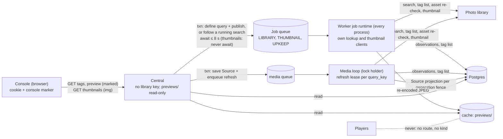
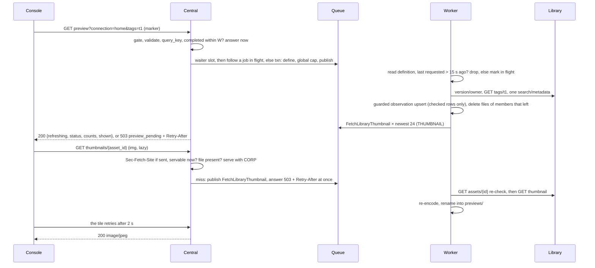

# Operator console pass B: a Source is one library query; choose it by tag and see what it selects

**Status:** revision 6 after an independent review; awaiting owner approval; build on hold. **Layer:** module (contracts, data flow, ownership, invariants, failure behaviour), not functions.
**Builds on:** [pass C+D](operator-console-ux-pass2-flow.md) §7 J5 (the Source step's reserved "Tags" and preview slot in step 1, and the Name step's connection rule), [slice 3](operator-console-ux-pass2-showrunner.md) (candidates, served `standing`), [pass A](operator-console-ux-pass2-session.md) (cookie sign-in and its cross-site checks), [central system architecture](central-system-architecture.md) (read-through, typed jobs, one worker kind), [media worker](module-media-worker.md) (refresh leases and request revisions), [ADR 0013](decisions/0013-unified-cache-root.md) (the one cache root).
**Owner is asked:** approve this revision. Q1 (tags are all-of), Q2 (shape A) and Q3 (widen the key) are answered. Q4 (tag ids in the browser) is settled on its default, with the cost of a later "No" stated. Q5 (capture-day timezone) is deferred to a tracked issue (§14).
**Line citations** are to `main` unless marked "PR #34": the J5 Source step exists only on PR #34's branch (`claude/upbeat-volta-7avvli`).

## 1. Today

| Gap | Evidence |
| --- | --- |
| A Source can filter only by favourites, capture window and media type. There is no tag. | `media/models.py:32-40` `SourceSpec` |
| The operator cannot see what a Source selects, before or after saving. Choosers say "Photo 108×192". | `SceneAuthoring.jsx`; showrunner doc §16 "Deferred: thumbnails" |
| Re-sending an unchanged stored Source would break if a field were simply added: the stored JSON is compared byte-for-byte, and it is the full dump. | `central/media_repository.py:77,81,86` |
| A worker model forbids unknown fields, and the lease validates after locking, so one unreadable row is re-picked every tick and blocks every later row. | `contracts/models.py:25` (`extra="forbid"`); `media_repository.py:139-161` (`LIMIT 1`, validate at `:161`) |
| Refresh is leased per Source, one Source per 30 s tick, and saving a Source queues nothing. | `media_repository.py:139-162`; `media/task_queue.py:16,64-69` |
| The cache has three frozen domain subdirectories. Nothing creates a new one on an existing volume: `cache_layout` only derives paths, Compose runs non-root so the entrypoint's root branch is skipped, and the image's baked directories seed only a fresh volume. | `central/cache_layout.py`; `docker-entrypoint.sh:28,55-57`; `Dockerfile:116-120,147-151`; [ADR 0013](decisions/0013-unified-cache-root.md) (glossary, "Domain subdirectory") |
| Cookie GETs skip the marker, `Origin` and `Sec-Fetch-Site` checks; only writes get them. | `central/operator_auth.py:170` |

## 2. Requirements (binding)

| # | Rule | Source |
| --- | --- | --- |
| R1 | Pick a tag with type-ahead from the library's own tag list; once picked, show the media that tag selects. | Owner request |
| R2 | Neutral library language, no vendor words; say plainly that media lives in the library and Photo Wall only selects it. | Owner; flow doc §2 rule 4; `test_sources_have_no_immich_or_album_language` |
| R3 | Players stay unaware of the library. Previews never become Player media, and Players never reach the library. | [requirements](requirements.md#central-media-boundary); AGENTS.md |
| R4 | The browser never sees the library URL, hostname, key, owner id or any photo's library id. **Amended (Q4):** tag ids are allowed. They are opaque without the key, shown only to a signed-in operator, and never sent to Players. | Owner ("proxied by Central"); [module-media](module-media.md) connection rules; security review #5 |
| R5 | The cache is only a cache. A purge at any moment, including of a whole subdirectory, must not change correctness. | Owner: the cache is ephemeral |
| R6 | A failure is never shown as "nothing matches". | [module-media](module-media.md) "Never interpret them as empty" |
| R7 | No credentials or private media in source, fixtures or evidence. Tests use synthetic images. | AGENTS.md; CONTRIBUTING.md |
| R8 | Idempotency belongs to each data type, never to job order. | Owner: idempotency is per data type |

## 3. The shape: library lookups are jobs, answered as data

Central writes what it wants (a query definition) and publishes a typed lookup job in the same transaction, then awaits the handle. The worker is the only holder of library credentials. It answers by writing data: a tag list, a query observation or a thumbnail file. Central then reads that data. Source refreshes use the same observation data through a lease per query key (§6).

**Design-it-twice.**

| | **A. Lookup jobs, answered as data (chosen)** | **B. Central holds a read-only library client** |
| --- | --- | --- |
| How | New job types on two new queues; results in tables and one cache subdirectory; Central awaits the `JobHandle` (`central/kernel/publishing.py` PB1–PB9, plus PB10 `follow`, §7). | Central also mounts the connection file and calls the library directly, with an in-process TTL cache and streamed thumbnails. |
| Keeps | Architecture §2 (Central never calls an origin); key custody in the worker only; single-flight across pods via `queueing_lock`. | Lower latency (one hop), no tables, no new job types. |
| Costs | One queue round trip per cache miss. Three migrations. A slow first preview when the worker is down: an honest 503, not a result. | Amends architecture §2 and the compose secret boundary; the LAN-facing process holds the key; N pods make N× the library calls. |
| Rejected C | Thumbnails from Central's prepared variants: none exist before saving; they exist only for planner-requested items; they are wall-size files served only to Players. | |

> **Q2 (shape). Answered: A.** The worker fetches; Central serves from tables and `previews/`; Central never calls the library.

## 4. Design rules (design choices, not requirements)

1. **A Source is one library query (owner's principle).** A Source is a name plus one canonical `LibraryQuery`. The library does the selecting: each query maps to exactly one search. The worker may send that *same* search more than once (a small probe then the full first page; a pass without then with EXIF, `media/immich.py:328-388`), but never merges *different* searches. Local checks only narrow that search's rows. A draft preview and a saved Source with the same query share one key and one observation (§6).
2. **The browser names only opaque ids.** Tags travel as `tag_ref` (the library's tag UUID, R4 as amended) and media as `asset_id` (Photo Wall's hash, `^asset-[a-f0-9]{64}$`, `media/models.py:120-122`). A thumbnail is served or fetched only for an `asset_id` in **current** data (§6). Nothing else is ever looked up, which rules out confused-deputy fetches by construction.
3. **Jobs carry keys; criteria live in data.** A job's fields are only `query_key`, `connection_ref` or `asset_id` (`central/kernel/jobs.py:161-171` allows only str/int/bool/enum). The worker reads the criteria from the definition row. No job carries a URL, owner id or library photo id.
4. **Every lookup result is data with its own write rule** (§6). Readers decide from the data; a job outcome only explains an absence.

## 5. The query: tags and the other criteria

**What one library request can express (Immich 2.5.6).** Every search route builds its WHERE clause with the one `searchAssetBuilder` ([database.ts:372-471](https://github.com/immich-app/immich/blob/3be8e265cd5bd6ca921ff9e665e274c5de45caa0/server/src/utils/database.ts); [search.repository.ts:200,222,240,269,293](https://github.com/immich-app/immich/blob/3be8e265cd5bd6ca921ff9e665e274c5de45caa0/server/src/repositories/search.repository.ts)). Every field is ANDed with every other, and no field takes an any-of list. So "all of" is native, and "any of" exists only inside the tag hierarchy.

| Criterion | One request? | Semantics and evidence | In pass B |
| --- | --- | --- | --- |
| Several tags, **all of** | yes | `tagIds[]` → `hasTags`: `count(distinct ancestor) >= n` (database.ts:265-278) | **yes** |
| One tag and **everything nested under it** | yes | the join goes through `tag_closure` (database.ts:271-272); always on | **yes** (stated in the UI) |
| Several unrelated tags, **any of** | **no** | no any-of field; `null` means "untagged only" (database.ts:382-384) | unsupported |
| Tags **combined with** favourites, dates, media type | yes | separate ANDed clauses | **yes** |
| Favourites **or** a tag | **no** | only AND between fields | unsupported |
| Photos **and** videos | yes | omit `type` | **yes** (fixes today's refresh) |
| One capture window | yes | `takenAfter` / `takenBefore` on `fileCreatedAt` | existing |
| Several windows; rating at least N; several cities | **no** | one pair per request; no range or list operators | unsupported |
| People, albums, rating = N, place or camera = one value | yes | `personIds[]`, `albumIds[]` (all of), equality fields | later (new permissions; album wording is an owner call) |
| Semantic "smart" query | not a selection | orders every filtered row by distance, no threshold (search.repository.ts:293-308) | unsupported |

**The tag rule, exactly.** A query takes 0–4 tags. An item matches if, **for every chosen tag T, it carries T or a tag nested under T**, evaluated by the library at each search. The console never offers "any of"; it says: "To combine tags, give those photos one shared tag in your library."

> **Q1. Answered:** all-of, library-native, nested tags included. **Deferred follow-up (not a bead):** a Scene combines several Sources for "any of". The model and planner already allow it (`Contribution.source_refs`, `central/runtime.py:50`; `_pool`, `central/planner.py:237-250`); only the console authors one Source per Scene (`authoring.js:176,257` on `main`; `:200,281` on PR #34).

**Tag identity.** A tag is its UUID. At 2.5.6 a tag cannot be renamed or moved (`TagUpdateDto` has `color` only), so the path shown is stable while the tag lives. Deleting and re-creating a tag gives a new UUID. The Source then stays `incompatible/tag_missing`, and the fix is a new Source revision (Edit). A tag deleted between the existence check and the search yields one empty `ok` result; this is accepted and stated, and the next refresh's check reports `tag_missing`. The check makes `tag.read` necessary for the live refresh of **tagged** Sources (Q3's "nothing else breaks" holds for untagged Sources only).

**Model.** A new `LibraryQuery` holds the criteria and validators; `SourceSpec` becomes `source_ref` plus the same criteria through one shared base (DRY). The wire shape stays flat and `schema` stays 1. Old rows validate with `tags=()`. Validation **normalises and never rejects** a legal old value (for example stored `["video","image"]`), so equal meaning gives equal bytes:

| Field (canonical order) | Normal form |
| --- | --- |
| `shape` | `1`, the version of this canonical form (in the key only, never stored in a Source) |
| `connection_ref` | as given: the same filters on another library are a different query |
| `tags` | canonical lowercase UUIDs, unique, sorted, at most 4 (checked before hashing); `[]` means no tag filter |
| `favorites` | `true`, `false` or `null` |
| `captured_from`, `captured_until` | the validated UTC instants (floats), or `null` |
| `media_types` | unique, sorted subset of `image`, `video` |

`query_key = "q-" + sha256(canonical JSON: sorted keys, no whitespace, explicit nulls)`. It is computed only in Python from the validated value, never in the browser. It hashes the *meaning*, not the search body, so an adapter fix does not orphan cached results. `search_body(query)` is a pure function. A parent and its own child tag chosen together select exactly what the child alone selects (every item under the child is also under the parent). The console never sends that pair (§8); the server accepts it without canonicalising, because only the library knows the hierarchy.

**Verified against the pinned version** (`media/immich.py:1,259`; the [tagged OpenAPI](https://github.com/immich-app/immich/blob/3be8e265cd5bd6ca921ff9e665e274c5de45caa0/open-api/immich-openapi-specs.json), `info.version` = `2.5.6`).

| Need | Endpoint (permission) | Behaviour we rely on | Primary source |
| --- | --- | --- | --- |
| List tags | `GET /api/tags` (`tag.read`) | Every tag of the key's user: `id`, `name`, `value` (path), `parentId`. No paging. | [tag.controller.ts:42](https://github.com/immich-app/immich/blob/3be8e265cd5bd6ca921ff9e665e274c5de45caa0/server/src/controllers/tag.controller.ts), [tag.service.ts:24-27](https://github.com/immich-app/immich/blob/3be8e265cd5bd6ca921ff9e665e274c5de45caa0/server/src/services/tag.service.ts) |
| Tag still exists | `GET /api/tags/{id}` (`tag.read`) | missing or inaccessible → 400 | tag.service.ts:29-31 |
| Search by tag | `POST /api/search/metadata` (`asset.read`) | `tagIds` → all of, nested included; `tagIds: null` = untagged only, so the key is **omitted** when empty | [database.ts:265-278, 381-384](https://github.com/immich-app/immich/blob/3be8e265cd5bd6ca921ff9e665e274c5de45caa0/server/src/utils/database.ts) |
| Asset re-check | `GET /api/assets/{id}` (`asset.read`) | owner, visibility, trash, offline, checksum; 400 for missing or inaccessible | `media/immich.py:480-483` (the download path's existing check) |
| Thumbnail | `GET /api/assets/{id}/thumbnail?size=thumbnail&edited=false` (`asset.view`) | content type from the extension; **404 = not generated yet** (regenerated by the library's nightly job) | [asset-media.service.ts:218-263](https://github.com/immich-app/immich/blob/3be8e265cd5bd6ca921ff9e665e274c5de45caa0/server/src/services/asset-media.service.ts) |

**One query, one search:**

| `LibraryQuery` field | In the one search | Local check (narrows that search's rows only) | Today's refresh |
| --- | --- | --- | --- |
| `tags` (new) | `tagIds`, omitted when empty | none: rows carry no tags (trusted to the library, a stated cost) | new |
| `favorites` | `isFavorite` when set | re-checked (`media/immich.py:288`) | obeys |
| `captured_from/until` | `takenAfter` / `takenBefore` | half-open trim (`:289-290`) | obeys |
| `media_types` | `type` only when one is chosen | kind check; audio and "other" dropped (`:282-287`) | **violates:** one search per type, merged (`:331`, `:409`) |
| fixed scope | `visibility=timeline`, `isOffline=false`, `withDeleted=false`, `order=desc` | owner, visibility, trash and offline guards (`:282-284`) | obeys |

**Adapter change** (`media/immich.py`): one search for both types, with the local kind check; `tagIds` only when non-empty; before searching, `GET tags/{id}` for each tag (400 → `incompatible/tag_missing`, 403 → `permission`). Three new bounded operations under the existing budget, redirect and status rules: `list_tags()` (≤ 5,000 tags, ≤ 2 MiB, paths ≤ 1,024 chars, else `tag_limit`), `recheck(upstream_id)` (reuses the refresh row check, DRY), and `thumbnail(upstream_id)` (≤ 1 MiB). Lookup clients check version and owner at most once a minute; `refresh` keeps its per-call check. The 1,000-row window now covers both types together and counts rare audio or "other" rows, so `source_limit` can come slightly earlier (a stated cost).

**Compatibility (all in L1a, before any tag can be stored).**

| Rule | Why |
| --- | --- |
| ✱ **A stored Source omits `tags` when it is empty** (the `SourceSpec` serialiser drops an empty `tags`; the key's canonical JSON keeps `tags: []`). An untagged Source saved after L1a has exactly the pre-L1a keys. | A pre-L1a worker validates with `extra="forbid"` (`contracts/models.py:25`) at `media_repository.py:161`. Had every new row stored `"tags": []` (`:77,86` store the full dump), one such row, once due, would fail inside the lease transaction, roll back, and be re-picked every tick, stopping every Source's refresh on an older worker (independent review, major 1). A test pins it: every untagged dump validates under a frozen copy of the pre-L1a model, and a golden untagged row is byte-identical. |
| `configure_source` compares canonical `LibraryQuery` values, not raw JSON (`media_repository.py:81`). | Re-sending a stored Source never gets 409 `source_revision_immutable`, whatever its stored order. |
| The refresh lease marks an unreadable spec `spec_unsupported` and moves on (§6). | One unreadable row never blocks the others, on L1a or later. |
| A parity test pins that one search per query selects what the per-type searches did. | Deployed Sources keep their membership. |

**Rollback.** Rolling a worker back past L1a is safe while no tagged Source exists. A tagged Source is unreadable to an older worker, which has no `spec_unsupported` tolerance, so its lease stalls on that row; rolling back therefore needs tagged Sources removed first. Tagged Sources become authorable in the console only at L5, and through the API from L1a.

A local, unpushed L1a experiment exists (reported by the session that built it as passing the local gate; it is not evidence for this design). It stores `"tags": []`, so it predates the omission rule above and would need it before landing.

## 6. Caching and refresh by query shape

**Data types and their write rules.** Each table has one owning store in `central.infra.library_store` behind a `central.library` port (§7 module placement): `LibraryQueryRepository` owns the query tables and `LibraryTagRepository` owns tags and connections; `MediaRepository` keeps the Source tables.

| Data type | Key | Written by | Write rule | If lost or purged |
| --- | --- | --- | --- | --- |
| Query definition (`library_queries`: `canonical_query`, `connection_ref`, `first_requested_at`, `last_requested_at`) | `query_key` | `define()`: in the preview route (publish transaction, or before a follow), and in the Source refresh lease transaction | upsert; `last_requested_at` only rises | the preview job fails transient `query_undefined` (retry at once), never ok or empty; the console's next poll re-defines |
| Search in flight (`searching_since`, `searching_via` = `job` or `refresh`, on the same row) | `query_key` | the worker, in its own short transaction as a search begins | only rises. It means "in flight" while it is newer than the newest observation and less than 65 s old: the worker's hard refresh timeout (`WorkerLimits.refresh_seconds`, `media/worker.py:109`) ends every search by then, including a killed one's lease. | the route publishes instead of following (one possible duplicate search) |
| Query observation (`status`, `code`, `observed_at` = when its search began, `completed_at` = when written, `members_observed_at`, `counts`, `limits`, per-asset `diagnostics` bounded by `max_diagnostics` (128, `media/immich.py:428-431`) so a reused projection equals a fresh one) | `query_key` | `observe()` in the worker (preview job or Source refresh), in its own transaction | applied only if the new `observed_at` is later; equal is a no-op. `ok` and `source_limit` replace the members. **A newer failure updates status, code, `observed_at` and `completed_at` and keeps the last members with their own `members_observed_at`.** A write whose row was purged is dropped. | one search |
| Observation counts (`ObservationCounts`, new in `central.library`: `images`, `videos`, `examined`, `search_requests`) | with the observation | `observe()` | `images` and `videos` count the **checked** members by kind; for `source_limit` they count the checked sample, and the response says "more than 1,000". `examined` and `search_requests` come from the adapter budget. `RefreshCounts` (`media/models.py:171-179`) has no per-kind counts and stays the projection's type, unchanged. | as above |
| Observation members (`library_query_members`: `query_key`, `asset_id` indexed, `metadata`) | `(query_key, asset_id)` | with its observation, atomically | only rows that passed the owner, visibility, trash and offline checks; `OriginalAsset` fields only (the `source_limit` sample holds the checked subset: connection, library id, checksum, kind, `captured_at`) | as above |
| Source projection (`source_members`, `catalog_snapshots`, status, revisions) | `source_ref` | the per-key refresh (below) | unchanged `generation` fence; its input is an observation; `refreshed_at` and `last_success` are the observation's `observed_at` | existing |
| `asset_revisions` | `asset_id` | Source projection only, **never a preview** | unchanged | existing |
| Tag list (`library_tags`: one row, `tags` JSONB, status, code) | `connection_ref` | `ListLibraryTags` | newer `observed_at` wins; a newer failure updates status and code and keeps the last tags with their own `tags_observed_at`; names stripped of control and bidi-override characters (U+202A–202E, U+2066–2069) at write | refetch |
| Connection (`library_connections`: `connection_ref`, `fingerprint`, `announced_at`) | `connection_ref` | worker boot | `fingerprint` = sha256 of base URL and owner id (the owner UUID makes it unguessable). A changed fingerprint purges that connection's queries (L1b) and tags (L3 extends the purge when `library_tags` lands). A connection absent from a booting process's set is removed with its rows. | re-announced at the next boot; routes answer `connection_unknown` until then (migration 030, L1b) |
| Thumbnail file (`previews/<asset_id>.jpg`) | `asset_id` | `FetchLibraryThumbnail` | **Servability first:** an `asset_id` is servable only while it is a member of a retained observation (including the sample) or a current `source_members` row. **Then metadata:** `upstream_id` and checksum come from that observation member's `metadata`, or, for an id only in `source_members` (which holds no metadata, `central/migrations/005_media_jobs.sql:25-29`), from its `asset_revisions` row. `asset_revisions` supplies metadata only and never makes an id servable. The worker re-checks the asset before fetching. Temp file plus rename. | read-through refetch; a missing `previews/` directory is a miss (below) |

**Refresh per query key.** ✱ The Source refresh lease moves from one Source to one `query_key` (data review #2, #3 and #5, preferred fix). Migration 031 adds `media_sources.query_key`, which `configure_source` fills. ✱ **Worker boot backfills `query_key` for every row where it is null**, after migrating and before the media loop starts, using the one `LibraryQuery.key()`, so the first per-key pick sees every Source of a key. A row whose spec is unreadable gets no key and is handled alone by the `spec_unsupported` rule. The lease still fills any null it meets (a Source saved by an older Central during a worker-first rollout).

| Step | Rule |
| --- | --- |
| Pick | The earliest due row (`next_refresh ≤ now` or a pending request revision), then **every** Source with that key whose lease is free (`FOR UPDATE SKIP LOCKED`). Each gets its own `generation + 1`, start time and captured request revision. The lease also calls `define()`. |
| Unreadable spec | That row alone becomes `incompatible/spec_unsupported`: `next_refresh` moves on, and pending revisions complete with that outcome. The lease continues to the next due row, so one bad row never blocks the others (data review #9). This lands in L1a on today's per-Source lease, and L2 keeps it. |
| Search or reuse | **Search** if any member has a pending operator request. Otherwise **reuse** the key's observation only if it is `ok`, its `limits` equal the worker's current `MediaLimits`, and `observed_at > now − W` (the search *began* within W). Anything else searches. A refresh never follows a running preview search: it is a scheduled task, not a waiter. |
| W | `StoreLimits.refresh_seconds` (`central/media_repository.py:37`, default 30 s), the Source refresh cadence. It is not `MediaLimits.refresh_seconds` (60 s adapter budget, `media/models.py:108`) or `WorkerLimits.refresh_seconds` (65 s timeout, `media/worker.py:109`). |
| Project | Each member is projected under its own fence in its own transaction. One member's failure (such as `metadata_capacity`) leaves the others untouched. A refresh projects **the result of the search it sent**, even when a concurrent preview's newer observation won the upsert. ✱ **A failed `observe()` write never aborts a projection:** it is its own transaction, its error is logged, and the refresh still projects its own result. `completed_revision` rises only through the revision each member captured. |
| Cadence | Unchanged: one key per 30 s tick (`media/task_queue.py:16`). Two Sources with one query now cost one search per tick. |
| Creation | `configure_source` enqueues the existing exact-Source task in its transaction. The task now leases a key that is **due or** has a pending request, so a new Source (`next_refresh = 0`) refreshes at once, and preview-then-save within W projects the cached observation with no second search. A search slower than W is not reused here, so saving after a slow preview searches once more (a stated cost). |

**Preview freshness** (✱, independent review major 3). The preview route uses a different, request-relative rule, because a preview is advisory and its console polls: an observation of any status is **fresh for a request when `completed_at ≥ now − W`**. This covers "completed during this request's await" (the await is ≤ 8 s < W) and a poll that lands in the gap just after a slow search finished; the reviewer's "completed at or after this request's `define`" alone would republish on that gap poll. A fresh answer's search began at most W + 65 s ago, and the console shows its `observed_at`. §7 gives the flow; the preview's `refreshing` flag says when the answer is older than this rule.

**Retention** (✱, independent review minor 6). Pruning runs **only in the periodic `SweepLibraryCache` job** (§7), never inside an `observe()` transaction, so two concurrent observes never lock each other's rows. The sweep deletes observation rows whose newest of `completed_at` and `last_requested_at` is older than 1 h, and keeps at most 64, oldest first (members cascade), selecting with `FOR UPDATE SKIP LOCKED` so a row being observed is skipped until the next sweep. It also deletes unreferenced preview files and files older than 7 days, and evicts the oldest while `previews/` is over 256 MiB. After each observation or projection commits, the worker deletes the files of members that left and are referenced nowhere else (re-checked after commit). Deleting any row or file, or all of them, only causes a search or a refetch (R5).

**The `previews/` directory** (✱, independent review major 2). [ADR 0013](decisions/0013-unified-cache-root.md) freezes three domain subdirectories; pass B adds a fourth, owned by the worker, the single writer.

| Where | Change |
| --- | --- |
| Worker boot (`media/worker.py:420-428`) | Creates `previews/` under the cache root, mode 0700, if absent. This is what makes existing Compose volumes work: the worker runs as the volume's owner (uid 10001), and neither the entrypoint's root branch nor the image's baked directories reach an existing volume. If the create fails, the worker logs `previews_io`, thumbnail jobs end transient `previews_io`, and everything else runs. |
| `central/cache_layout.py` | A `PREVIEWS_SUBDIR` constant and `previews_root()`, beside the three existing ones. It derives the path; it still creates nothing. |
| `Dockerfile:116-120,147-151` | `previews` added to both `install -d` lists, so a fresh volume is seeded like the others. |
| `docker-entrypoint.sh:55-57` | `previews` added to the root branch's `install -d` loop (a Kubernetes volume started as root). |
| Central | Reads `previews/` through its read-only mount. A missing directory or file is a miss: the route publishes a fetch and answers 503 (§7), never 500. |
| Docs (L6) | ADR 0013 amended for the fourth subdirectory, and [module-central-cache](module-central-cache.md)'s layout table and Kubernetes `subPath` guidance. |

## 7. Contracts

**Module placement** (independent review minor 9).

| Module | Owns | May import |
| --- | --- | --- |
| `media.models` (existing) | `LibraryQuery` (canonical form, key) and `SourceSpec` over one shared criteria base; `OriginalAsset` | `contracts` |
| `media.immich` (existing) | `search_body`, the one search, `list_tags`, `recheck`, `thumbnail` | `media.models` |
| `central.library` (new, domain layer beside `central.assets`) | the ports `LibraryLookups` (implemented in `media`) and `LibraryStore` / `PreviewFiles` (implemented in `central.infra`); the handlers of the four job types; the freshness, reuse and servability rules; `ObservationCounts` | `central.kernel`, `media.models` only |
| `central.infra.library_store` (new) | the Postgres stores of §6; the preview file store, reusing the `media_store._open` walk (`O_NOFOLLOW`) | `central.library`, psycopg |
| `media.library_lookups` (new) | the `LibraryLookups` adapter over each connection's lookup and thumbnail `ImmichClient` | `central.library`, `media.immich` |
| `central.library_routes` (new, top layer beside `central.content_routes`) | the four routes of the table below | `central.library`, `central.infra`, `central.operator_auth` |
| `central.kernel` (existing) | `QueueName.LIBRARY` and `THUMBNAIL`; the four job types in `CATALOG` (`central/kernel/job_types.py:50`); ✱ `Publisher.follow` (PB10, below) | unchanged |

Worker boot builds the lookups and passes them into `build_job_runtime` (today it takes no connections, `central/content_wiring.py:92-118`). Central's app never builds one. **Import-linter** (`pyproject.toml:93-111`): `central.library` joins the domain layer of "Central content-serving layers" and the sources of the no-persistence contract; `central.library_routes` joins the top layer; a new forbidden contract keeps `central.library` off `media.immich`, `media.worker`, `media.library_lookups` and `httpx`.

✱ **PB10 `follow(job)`** (a Publisher addition, in the shared conformance suite): read `since` for the job's lock key and return a handle that resolves as PB7, inserting nothing. It exists because PB4 merges a publish only into a **pending** copy (`central/kernel/jobs.py:199-200`): once a copy is running, a publish of a non-asset job inserts a second copy that may run alongside it. The adapter reuses the outcome feed's `wait_for` (`central/infra/outcome_feed.py:70`).

**Request gate** (owned by `operator_auth`, reusing `_marked` and `_same_origin_fetch`; security review #1). ✱ Cookie-authorised GETs that can publish work need the console marker, and `Sec-Fetch-Site: same-origin` when that header is sent. This narrows pass A's "GETs need no marker" for these routes; bead L6 records it in pass A's document. A bearer request (scripts) needs neither, as in pass A. The thumbnails route is loaded by `` and cannot send the marker. It stays exempt, rejects a `Sec-Fetch-Site` other than `same-origin` **when one is sent**, publishes only for servable ids, and answers with `Cross-Origin-Resource-Policy: same-origin` (§9 states how much that holds on plain http). The auth check runs before anything else. Signed out, a known or unknown `asset_id` gets the same 401 body and nothing is queued. A Player credential gets 401. Each route lands with its own 401 tests and under the access-log filter (below) in the same bead.

| Route (all `admin`) | Gate | Returns | Errors |
| --- | --- | --- | --- |
| `GET /v1/operator/library/connections` | cookie or bearer | `[{connection_ref, announced_at}]` | none |
| `GET …/library/tags?connection=&q=&limit=` | marker | `{refreshed_at, refreshing, status, total_matches, tags:[{tag_ref, path, name, parent_ref}]}`, filtered in Python from a per-pod parsed cache keyed by the row's `observed_at` (casefold plus NFKC; prefix matches first). Older than 5 min: publishes `ListLibraryTags` and answers from the stored list. With no list yet it awaits ≤ 5 s (2 waiter slots per pod). | 422 (`q` > 128 chars, `limit` > 20); 404 `connection_unknown`; 503 `library_unavailable` / `busy` + `Retry-After`; 409 `library_permission` / `library_incompatible` / `tag_limit` |
| `GET …/library/preview?connection=&tags=&favorites=&captured_from=&captured_until=&media_types=` | marker | `{query_key, observed_at, members_observed_at, refreshing, status, code?, counts?: {images, videos}, limit?, shown:[≤ 24 newest {asset_id, kind, captured_at, width?, height?, duration?}]}`. A non-ok status is a truthful 200. `refreshing: true` means a newer search is published or running and this answer is older than the freshness rule (§6). `source_limit` carries `limit: 1000` and the sample; a failure carries the last members. | 422 (the same validators as `SourceSpec`, ≤ 4 tags); 404 `connection_unknown`; 503 `preview_pending` / `busy` + `Retry-After` |
| `GET …/library/thumbnails/{asset_id}` | `Sec-Fetch-Site` when sent + CORP | `image/jpeg`, only Photo Wall's own encoding; `nosniff`; `Content-Security-Policy: default-src 'none'; sandbox`; `no-store` | 422 (id pattern); 404 `thumbnail_unknown` (not servable, **nothing published**); 404 `thumbnail_unavailable` (terminal for that attempt); ✱ 503 `thumbnail_pending` + `Retry-After`, **answered at once, never awaited**: 2 s after a publish, or, while a retry window is open (PB2), the time left in it, up to 1 h |
| `GET /v1/operator/sources/{ref}/candidates` (existing) | unchanged | unchanged; the saved Source card shows the newest 24 through the thumbnails route | unchanged |

**Preview route flow.**

| Step | Rule |
| --- | --- |
| 1. Validate | Gate, validators, `query_key`. Read the row. |
| 2. Fresh | An observation fresh for this request (§6: `completed_at ≥ now − W`) → 200, `refreshing: false`. Nothing is written. |
| 3. Slot | Take a waiter slot (4 per pod; none free gives 503 `busy` with nothing published). |
| 4. Follow | A search in flight (§6) started by a **job**: `define()`, then `follow()` the key's `ObserveLibraryQuery`, publishing nothing. Started by a **Source refresh** (not a job, so no outcome will arrive): skip the await and go to step 6. |
| 5. Publish | Otherwise, one transaction: `define()`, check the **global cap** of 4 pending or running `ObserveLibraryQuery` jobs, and publish. ✱ The count is serialised by a transaction-scoped advisory lock, so the cap holds across pods. It is skipped when a pending copy with the same `queueing_lock` exists, because the publish then merges and adds no work. Over the cap gives 503 `busy`, rolled back. |
| 6. Answer | After an await of ≤ 8 s, read the row. A fresh observation → 200, `refreshing: false`. Otherwise the newest observation, if any → 200, `refreshing: true`. Otherwise 503 `preview_pending` + `Retry-After: 2`. |

✱ **Access-log filter.** The uvicorn access log drops query strings under `/v1/operator/library/` (a log filter; the Central image runs uvicorn with its default access log, `Dockerfile:155`). It lands with the first library route (L1b) and each later route's bead adds its own assertion.

✱ **Why thumbnails never await** (independent review major 5). An `` request holds its connection for the whole await. uvicorn serves HTTP/1.1 only ([uvicorn](https://www.uvicorn.org/): "currently supports HTTP/1.1 and WebSockets"), and browsers allow 6 connections per host for HTTP/1.1 (Chromium's `max_sockets_per_group`, [client_socket_pool_manager.cc](https://source.chromium.org/chromium/chromium/src/+/main:net/socket/client_socket_pool_manager.cc)). Twenty-four cold tiles each awaiting up to 5 s would hold every connection for up to 20 s and starve the console's own reads. A miss therefore publishes and answers 503 at once. `ObserveLibraryQuery` has already prefetched the newest 24, so a tile's first retry at 2 s usually hits. A 1 s cap was rejected: it still holds all 6 connections for each second of cold tiles and saves at most one retry. With no await, the route holds no waiter slot.

| Job type | Queue, priority | Retry (`Delivery.retry`) | Dedupe | Reads → writes | Drops |
| --- | --- | --- | --- | --- | --- |
| `ObserveLibraryQuery(query_key)` | `LIBRARY`, 10 | `()`: the next request republishes or follows | `query_key` | definition → in-flight marker → `observe()` → observation, counts, members and diagnostics; then publishes `FetchLibraryThumbnail` (with `retry_terminal`) for the newest 24 **only** when the key was requested within 15 s | Not started within 15 s of `last_requested_at` → transient `preview_expired` (retry at once, no search). No definition row → transient `query_undefined`. An observation of any status written → `ok`. |
| `ListLibraryTags(connection_ref)` | `LIBRARY`, 0 | `()` | `connection_ref` | → `library_tags` (guarded) | none |
| `FetchLibraryThumbnail(asset_id)` | ✱ `THUMBNAIL`, 0 | `(10 min, 10 min, 1 h)` (`central/infra/execution.py:140-152`) | `asset_id` | servable? (§6) → metadata (§6) → `recheck` (owner, timeline, not trashed, not offline, same checksum) → `thumbnail` → Pillow decode (JPEG, PNG and WebP only; size read from the header and checked before decode; `MAX_IMAGE_PIXELS` 4 MP) → fit 320 px → JPEG q80 **without EXIF, XMP or ICC** → temp file plus rename, directory handle opened `O_NOFOLLOW` | **Not servable → the file is deleted and the job ends `ok`, with no terminal outcome**; the route's servability check answers 404 `thumbnail_unknown`. Re-check fails or library 400 → terminal `thumbnail_unavailable`, file deleted. Library 404 → transient `thumbnail_not_ready`, redelivered by the retry tuple. `previews/` not writable → transient `previews_io`. |
| ✱ `SweepLibraryCache` | `UPKEEP`, periodic every 5 min (PB9) | `()` | periodic (one pending tick) | observation pruning with `SKIP LOCKED`, file sweep and eviction (§6 Retention) | none |

**Terminal outcomes never stick.** Outcomes are kept 30 days (`central/infra/queue_ops.py:139`), and PB3 refuses to republish over a terminal one (`publishing.py:9-10`). So every thumbnail publish, from the route and from `ObserveLibraryQuery`, sets `retry_terminal=True`, as the asset reader does (`central/assets/reader.py:9,150,197`). An asset that is archived and then unarchived is served again once it is back in current data.

✱ **Why two queues.** Priority alone orders only queued jobs. A burst of 24 thumbnails could still occupy every running `LIBRARY` slot while a new preview waits. `THUMBNAIL` gets its own per-process concurrency (the runtime takes a per-queue map, `central/content_wiring.py:43-44`), so thumbnails can never take preview slots. Inside `LIBRARY`, observe (10) outranks tags (0). Concurrency is 2 per queue **per worker process**; every worker process runs the job runtime (`media/worker.py:356-363`).

**Clients** (data review #4). The worker boot (`media/worker.py:420-428`) already loads the connection file. It now builds, per connection, a **lookup client** for `LIBRARY` and a **thumbnail client** for `THUMBNAIL`, each its own `ImmichClient` with its own 2-connection pool and budget (`media/immich.py:146-160`). ✱ Both are built with **the same `MediaLimits` as the refresh client**, so an observation written by a preview carries the limits a refresh compares for reuse (§6) and budgets match. The Source refresh keeps the media loop's client. Library load per worker process: at most 2 + 2 lookups, plus the refresh.

**Why thumbnails are not Asset records.** The architecture's Asset record holds write-once produced facts. The library may regenerate a thumbnail under the same key, and write-once facts would turn a later refetch into a permanent miss. Previews reuse the publisher, `JobHandle`, outcome feed and waiter slots, but not `AssetReader` or `AssetRecords`. They are never in the desired set.

**Migrations** (next free numbers at build time; 029 is the last on `main`): 030 `library_queries` (definition, in-flight marker and observation columns), `library_query_members` and `library_connections` (L1b); 031 `media_sources.query_key` + index, and an `asset_id` index on `source_members` (L2); 032 `library_tags` (L3).

## 8. Console (the J5 Source step, "What to include")

| Element | Behaviour |
| --- | --- |
| Connection | ✱ **The flow's rule wins** (PR #34's `connectionRule` and its "Another connection…" chooser with a typed "New connection name", `sourceFlowModel.js:59-66,108-130` on PR #34). It keeps deciding visibility, prefill and options, and a typed new name stays allowed, so a Source can be saved before its connection is deployed. When the rule makes the field visible, it moves to the top of step 1, because tags and previews need it; in the one-value case step 1 uses the prefilled value and the field stays in step 2's Advanced. `library/connections` only tells the step whether the chosen name is announced. For an unannounced name the tag field is disabled and the preview slot shows "This connection isn't set up yet, so tags and previews aren't available. You can still save; the source starts selecting once the connection is set up." No library request is sent, and there is no error wall. |
| `TagCombobox` | WAI-ARIA combobox: `role=combobox`, `aria-autocomplete=list`, `aria-expanded`, `aria-controls`, `aria-activedescendant`; a `listbox` of ≤ 20 options; Up/Down, Enter, Escape, Home/End. Debounced 150 ms; stale responses dropped by sequence. A chip per tag (≤ 4) with "Remove tag *path*". Paths are rendered in `<bdi>`. With two or more tags: "Media with **all** of these tags". ✱ **Nested tags** (independent review minor 11), using `parent_ref`: under all-of, adding a tag nested under a chosen one **narrows** the selection, so picking it **replaces** the ancestor's chip, announced politely: "Replaced *Family* with *Family/Christmas*, which is inside it." Picking an ancestor of a chosen tag would change nothing, so only that is refused: "*Family/Christmas* is already chosen and is inside *Family*. To include all of *Family*, remove *Family/Christmas* first." Polite live region: "20 of 143 tags; keep typing". |
| `libraryFetch` (new helper) | `fetchJson` is private and throws (`useSnapshot.js:18-33`), so L5 adds one marked fetch helper for the library routes. It reuses the exported `CONSOLE_HEADER`, takes an abort signal, and parses `Retry-After`. A 503 returns `{pending, retryAfter}` instead of throwing, and a 401 goes to the existing signed-out path. |
| `PreviewGrid` | Re-queried on each criteria change (debounced 400 ms; the superseded fetch is aborted). On 503 it polls, honouring `Retry-After` (capped at 30 s), with "Looking in your library…". ✱ On a 200 with `refreshing: true` it shows that result with "Updating…" and keeps polling every 2 s (backing off to 30 s) until `refreshing` is false. After 2 min of either it shows "Still looking. Photo Wall will keep trying." A `role=list` of 24 fixed tiles, `loading=lazy`, alt text "Photo taken 12 Dec 2024" or "Video, 0:32, taken …". An `` cannot read a status or `Retry-After`, so a tile retries on a fixed 2, 8 and 30 s schedule, then shows "Preview not ready yet", and tries once more when `observed_at` changes. The grid unmounts on Log out. |
| Dates | Tile dates and the summary's dates are shown in the browser's zone, the same zone the "Taken from/until" inputs use (`localDayStart`, `authoring.js:486-492` on `main`; `:565-571`, used at `sourceFlowModel.js:217-218`, on PR #34), and the preview heading names it: "Dates in this browser's time zone." This keeps the two consistent until Q5 is decided. |
| `SelectionSummary` | Step 1, Review and the saved Source card: "Selects media tagged **Family/Christmas** (and nested tags) · favourites only · photos and videos: **128 photos and 4 videos** in your library now; showing the newest 24." The numbers are `counts.images` and `counts.videos`. Tag paths come from the tag list by `tag_ref`. A missing path reads "a tag that no longer exists in your library". A list not loaded yet reads "1 tag". |

| Situation | Wording (neutral) |
| --- | --- |
| Intro (kept) | "Photo Wall selects media that lives in your photo library. It never uploads, edits or deletes anything there." |
| Tag field | Label "Tags in your library"; hint "Each tag includes everything nested under it. For media with *any* of several tags, give those photos one shared tag in your library." |
| Preview heading | "What this selects from your library" · "Previews come from your photo library, as of 12:03." |
| Updating | "Updating… showing what your library had at 12:03." |
| Nothing matches (ok, 0) | "Nothing in your library matches yet. New matches appear automatically once saved." |
| Over the limit | "More than 1,000 items in your library match. A source can use at most 1,000; narrow it with tags or dates. Showing the newest 24." |
| Library unreachable | "Photo Wall can't reach your photo library right now. Showing what it selected at 12:03." With no earlier members: "… right now. Retrying…" (never "no media") |
| Key not allowed | "Your library connection's key isn't allowed to list tags or show previews. Add the permissions in the setup guide's library key step." The step is the runbook's key-permission step, which L6 adds under [local launch](runbook.md#local-launch). The rest of the step still works. |
| Connection not set up | as in the Connection row above |

## 9. Security and privacy

| Threat | Control | Strength |
| --- | --- | --- |
| Key, URL, hostname, owner id or library photo id reaching the browser | Central never holds them (§3 A); responses carry only `tag_ref`, `asset_id` and `connection_ref`; the fingerprint never leaves the database | construction |
| Cross-site GET queueing a search or tag list (another port on the same host shares the cookie) | The console marker is a custom header, which a cross-origin page cannot send without a CORS preflight the server never grants; `Sec-Fetch-Site` when sent | construction + test, on http and https |
| Cross-site GET queueing a thumbnail fetch, or reading one | ✱ Corrected (independent review minor 8). **On plain http the only bound is servability:** `Sec-Fetch-*` headers are sent only to potentially trustworthy URLs ([Fetch Metadata §5.1](https://w3c.github.io/webappsec-fetch-metadata/#fetch-integration)), `SameSite=Strict` does not separate ports on one host (same-site ignores the port, [RFC 6265bis §5.2](https://datatracker.ietf.org/doc/html/draft-ietf-httpbis-rfc6265bis#section-5.2)), and the console's CSP (`default-src 'self'`, `central/app.py:379`) limits only the console page's own loads. So a page on another port can make the operator's browser publish fetches, but only for ids already in current data, which it cannot learn (they are sha256 hashes) and whose bytes it cannot read (`Cross-Origin-Resource-Policy: same-origin`, [Fetch §CORP](https://fetch.spec.whatwg.org/#cross-origin-resource-policy-header)). On https or localhost, `Sec-Fetch-Site` also refuses it. | bounded, not prevented, on http (test: with no `Sec-Fetch-Site`, an unknown id queues nothing); construction + test on https |
| Confused deputy; serving what the library no longer shows | Servable = current members only; worker re-check before each fetch; files deleted when members leave; 7-day maximum age | construction + test |
| SSRF or injection through inputs | `tag_ref` is a canonical UUID sent in a JSON body; `upstream_id` from Central's records; fixed base URL; redirects refused (`media/immich.py:156`); `asset_id` pattern; `O_NOFOLLOW` | validation |
| Hostile bytes or names from the library | Only our re-encoded JPEG is served; formats listed; pixel check before decode; no metadata out; nosniff plus sandbox CSP on the image; tag names stripped of control and bidi characters and rendered in `<bdi>`; `q` filtered in Python | construction |
| Load from a stolen cookie or a runaway UI | Slot taken before publishing (4 preview, 2 tags per pod); global cap of 4 observes; follow instead of republish; 15 s expiry; `queueing_lock`; freshness within W; thumbnails hold no slot and merge per `asset_id`, bounded by the servable set and 2 fetches per worker process; separate clients and queues | bulkhead |
| Private data at rest | `library_queries` and members hold checked `OriginalAsset` fields only (no GPS, place, description, filename or path); `library_tags` holds tag paths; `library_connections` holds only ref, fingerprint and time; `previews/` holds 320 px copies without metadata, 0700; `no-store` to the browser | stated cost |
| Private data in logs and evidence | Query strings dropped from library access logs from the first library route; job fields are keys only; evidence never contains a real library's tag names, ids, previews or screenshots (the [runbook](runbook.md) evidence rule, extended by L6) | construction + review |
| Players | Players have no route or job kind for previews, and Player config, state and plans carry no tag id (test) | construction + test |

> **Q3 (key permissions). Answered: add `tag.read` and `asset.view` to the existing library key** (runbook step, bead L6). Until then tags and previews degrade as §8 says, untagged Sources are unaffected, and **tagged Sources' refresh reports `permission`**.

## 10. Failure table

| Failure | What the operator sees | Recovery | Guarantee |
| --- | --- | --- | --- |
| Library down or slow | Stale tags ("as of …"); the preview's last members with "can't reach" | Next request after W or `retry_not_before` | test |
| Search slower than W (such as 35 s) | The last result with "Updating…", or "Looking…" when there is none; then the new result | The console's polls follow the one running search | test (clock) |
| Worker not running | Preview 503 → "Looking…", then "Still looking"; the media health strip says the worker is down | Worker restart | test |
| Many distinct previews (such as date sweeps) | 503 `busy`; the console polls | Cap frees | probe |
| Definition purged mid-request | One 503 `preview_pending`; the next poll re-defines | Automatic | test |
| Cache purged, or `previews/` missing on an existing volume | Tiles retry, then show | Worker boot creates `previews/`; read-through refetch with re-check | test (purge and existing-volume probes) |
| `previews/` cannot be created | Tiles show "Preview not ready yet"; everything else works | Fix the volume's ownership; restart the worker | test |
| Library has no thumbnail yet (404) | "Preview not ready yet" | Transient; retried after 10 min with no operator action | test |
| Asset archived, trashed, untagged or moved to a partner | Tile 404 once the next observation lands; file deleted | Automatic; unarchived → served again (no sticky terminal outcome) | test |
| Tag deleted after save | `incompatible/tag_missing`; the card says "A tag this source uses no longer exists in your library." The planner gives a non-ok Source no new selections (`planner.py:241`); the wall follows the existing unavailable-Source behaviour. | Edit the Source (new revision) | test |
| Tag deleted between check and search | One empty `ok` result | Next refresh reports `tag_missing` | stated |
| More than 1,000 match | `source_limit` with the newest-24 sample, before saving | Narrow the criteria | test |
| Unreadable stored spec (a field newer than the worker) | For a worker at L1a or later: that Source becomes `incompatible/spec_unsupported` and the others refresh. | Roll the worker forward. Rollout order: **worker first**, then Central. **Rolling back past L1a** is safe while no tagged Source exists (untagged rows keep the pre-L1a keys); otherwise remove tagged Sources first. | test |
| An `observe()` write fails during a refresh | Nothing: the Source is projected from its own search | The next search writes the observation | test |
| Connection removed or its URL/owner changed | `connection_unknown`, or cached queries (and, from L3, tags) purged | Deploy the config; next boot announces | test |
| Connection typed in the flow but not deployed | "This connection isn't set up yet…"; saving works | Deploy the config | test |
| Pending operator request within W | A fresh search; never an older answer | n/a | test (clock) |
| Two Sources with one query | One search per tick | n/a | test |
| Two pods preview one query | While the job is pending, the second publish merges into it (PB4). Once it is running, the second pod follows it (PB10) instead of publishing. Only a search started by a Source refresh cannot be followed; the preview then answers at once and polls. | n/a | test / construction |
| Thumbnail regenerated upstream | New bytes on the next refetch | none needed | by design |

## 11. Tests and mutation probes

Fakes: extend `Upstream` (`tests/test_immich.py:87`, `httpx.MockTransport`) with `/api/tags`, `/api/tags/{id}`, `/api/assets/{id}` and `/assets/{id}/thumbnail`, with images generated in-test with Pillow as `tests/public_media.py` does, and a controllable search delay. `FakeSource` (`tests/test_media_worker.py:102`) gains `list_tags`, `recheck` and `thumbnail`. Central semantics run on the controllable clock. Every run asserts a positive test count (a skip is a failure). Real-library behaviour is checked in L6 (below), not by fakes alone. The **Bead** column is where each probe lands: a control and its probe land together.

| Bead | Probe: break this… | …and this test must fail |
| --- | --- | --- |
| L1a | Store `"tags": []` for an untagged Source | every untagged dump validates under a frozen pre-L1a `SourceSpec`; a golden untagged row is byte-identical |
| L1a | Send `tagIds: null` for an empty filter; drop the tag check | the body has no `tagIds` key; a deleted tag gives `tag_missing`, not ok/empty |
| L1a | Restore one search per media type | a both-types Source sends one body per pass with no `type`; membership parity with the old fixture |
| L1a | Restore the raw-JSON compare; reject unsorted `media_types` | re-PUT of every pre-L1a stored Source gives `created: false`; stored `["video","image"]` still refreshes |
| L1a | Hash a non-canonical form, or in JS | reordered tags or media types give one key; the console never sends a key |
| L1a | Let one unreadable spec block the tick | one bad row → `spec_unsupported` and `next_refresh` advanced; other Sources refresh |
| L1b | Treat a missing definition as empty | purge before the job starts: transient `query_undefined`, the preview is 503, never ok/empty |
| L1b | Reuse by `observed_at` in the preview; republish while a job's search runs; drop `refreshing` | clock, W = 30 s, a 35 s search, polls every 2 s with 8 s awaits: exactly one search; before it lands, 503 `preview_pending` (no earlier result) or 200 `refreshing: true` (an earlier one); the first answer after it lands is 200 `refreshing: false`; a poll in the 2 s gap after it lands reuses it |
| L1b | Drop `follow` or make it insert | PB10 conformance: `follow` inserts no row and resolves on the running copy's outcome; a follow with nothing running times out as `Pending` |
| L1b | Drop the cap lock or the merge exemption | two pods publishing at once never exceed 4; a preview whose key is already pending is never `busy` |
| L1b | Publish before the slot; drop the cap | slots exhausted → 503 `busy`, zero jobs; 50 distinct-date previews queue ≤ 4 |
| L1b | Break the guarded upsert | concurrent preview and refresh with interleaved finishes: stored `observed_at` never decreases; a newer failure keeps the last members |
| L1b | Take per-kind counts from `RefreshCounts`, or before the checks | partner, audio and trashed rows are absent from `counts.images` and `counts.videos` |
| L1b | Build lookup clients with default limits | a worker configured with non-default `MediaLimits` writes preview observations whose `limits` equal the refresh's |
| L1b | Drop the request gate | an unmarked cookie GET on preview → 403 and zero jobs; bearer GET works |
| L1b | Signed-out or Player access to preview | signed out → 401, nothing queued; a Player credential → 401 |
| L1b | Log query strings | the access log for a preview request has no query string |
| L1b | Ignore a fingerprint change | changed fingerprint → that connection's queries purged |
| L1b | Let `create_app` open the connection file; widen `central.library`'s imports | the Central test transport raises on any library call; `lint-imports` fails on `central.library` importing `media.immich` or `httpx` |
| L1c | Await a thumbnail miss | a cold thumbnail answers 503 + `Retry-After` within the request, holding no slot; 24 cold tiles never delay a concurrent marked read |
| L1c | Rely on `Sec-Fetch-Site` alone | with no `Sec-Fetch-Site` header, an unknown id → 404 `thumbnail_unknown` and zero jobs; with `same-site` → 403; CORP present |
| L1c | Serve from `asset_revisions`; read metadata before servability; skip the re-check | an id only in `asset_revisions`, or only in a pruned observation, → 404, no publish; a `source_members`-only id is fetched with its `asset_revisions` metadata; archive, trash or untag after preview → 404, file removed after the next observation |
| L1c | Rely on the image to create `previews/` | an existing volume with only `media/`, `apps/` and `os-images/`: worker boot creates `previews/` 0700 and a thumbnail is served; Central before the worker ran answers 503, not 500 |
| L1c | Terminal 404 thumbnail; sticky terminal outcome | 404, then generated: served after the retry with no operator action; library 400: `thumbnail_unavailable`; archive → 404 → unarchive → the tile is served again |
| L1c | Loosen file handling | a traversal `asset_id` → 422; a symlinked preview is not served; an SVG/HTML "thumbnail" never reaches the response; an oversized header is rejected before decode; the output has no EXIF, XMP or ICC |
| L1c | Signed-out thumbnail leaks | known and unknown ids get the same 401 body, nothing queued; a Player credential → 401; no query string logged |
| L2 | Reuse with a pending request | clock: a request, then a scheduled tick within W, sends exactly one search, and the completed revision rises only after it |
| L2 | Reuse a non-ok, other-limits or boundary observation | `observed_at = now − W` searches; `now − W + ε` reuses; a non-ok or other-limits observation searches |
| L2 | Lease per Source again; no creation enqueue; backfill lazily | two Sources with one key, one saved before 031: one search from the first tick, both projected under their own generations; preview then save within W: `ok` with no second search |
| L2 | Let a failed `observe()` abort the refresh | an injected observation-write error: the Source still projects its own result |
| L2 | Give preview its own filter code; drop stored diagnostics | parity: preview counts equal refresh membership for 4 specs through the separate lookup client; a projection from a reused observation equals a fresh one |
| L3 | Overwrite tags on failure | a tag-list failure keeps the last tags, with their own time |
| L3 | Leave tags out of the fingerprint purge | changed fingerprint → that connection's `library_tags` row purged |
| L3 | Drop input caps or the tags gate | 129-char `q` or `limit` 21 → 422, nothing published; an unmarked cookie GET → 403; signed out → 401; no query string logged; bidi and control characters stripped from stored names |
| L4 | Empty `source_limit` | > 1,000 matches: `source_limit`, a 24-item sample, `limit: 1000` |
| L4 | Share the refresh client or one queue | saturated lookups (4 slow previews, 24 thumbnails): the scheduled refresh stays `ok` in budget; 5 criteria changes 400 ms apart (searches 1 s): the last preview answers within 8 s |
| L4 | Prune inside `observe()` | two concurrent observes and a sweep, each under `lock_timeout`: no deadlock or timeout; the sweep skips a row being observed |
| L4 | Store raw rows | no stored JSON contains `latitude`, `originalFileName` or `originalPath` |
| L4 | Write preview members to `asset_revisions` | a 1,000-item preview leaves the `asset_revisions` count unchanged |
| L4 | Leak ids | Player config, state and plans contain no tag UUID; responses contain no hostname, owner id or library photo id |
| L5 | Vendor words; combobox keys | the no-vendor-language test, extended; ArrowDown/Enter selects and `aria-activedescendant` follows |
| L5 | Keep the parent chip; refuse the child | picking *Family/Christmas* with *Family* chosen replaces the chip; picking *Family* with *Family/Christmas* chosen is refused |
| L5 | Error wall for a typed connection; stop polling on `refreshing` | an unannounced typed name shows the not-set-up note and sends no library request; a `refreshing: true` answer keeps polling until false |

## 12. Tracer bullet

A fake library with one tag and one synthetic image. **L1b:** a marked `GET …/library/preview?connection=fixture&tags=<t>` returns `counts.images = 1` with one `asset_id` and `refreshing: false`. The same request unmarked with the cookie gets 403 and queues nothing. The job carried only the key, and the definition row was written in the publish transaction. **L1c:** starting from a cache volume without `previews/`, `GET …/thumbnails/{asset_id}` answers 503 or a JPEG; a retry returns the JPEG after the worker's re-check. After deleting `previews/`, it still does. The Central app's test proves it made no library call. **Proves:** the canonical query and key, the tag filter, request/reply over the queue with criteria as data, the guarded observation, the request gate, read-through thumbnails with re-check, purge survival, the fourth cache subdirectory and key custody. **Non-goals:** autocomplete, saving a Source, per-key refresh, eviction, UI.

## 13. Beads (each lands green)

✱ marks a consequential design choice. L6 records these in [design decisions](design-decisions.md).

| Bead | Scope (explicit) | Lands green because | Est. | Risk |
| --- | --- | --- | --- | --- |
| L1a | `LibraryQuery` (canonical form, key, normalise) and `SourceSpec` over one base; ✱ empty `tags` omitted from stored Sources; canonical `configure_source`; the `spec_unsupported` tolerance on today's lease; adapter: `search_body`, one search for both types plus parity, `tagIds`, tag check | deployed Sources re-send and refresh unchanged; untagged rows stay readable by an older worker | 4 h | high: live refresh path |
| L1b | `central.library` package, ports and import-linter contracts; migration 030; `LibraryQueryRepository` (`define`, in-flight marker, guarded observation with counts and diagnostics); connection announcement with fingerprint and query purge; lookup clients at worker boot with the refresh's `MediaLimits`; `LIBRARY` queue; `ObserveLibraryQuery` (expiry, `query_undefined`); ✱ `Publisher.follow` (PB10); preview route with ✱ the request gate, slot before publish, locked global cap, ✱ request-relative freshness and `refreshing`; access-log filter; the route's 401 tests | new tables, jobs and one new route; the refresh path is untouched | 6 h | high: both adversarial lenses |
| L1c | `recheck`, `thumbnail`; ✱ `THUMBNAIL` queue and thumbnail clients; `FetchLibraryThumbnail` (servability then metadata, re-check, re-encode caps, `O_NOFOLLOW`, `retry_terminal`); prefetch of the newest 24; ✱ `previews/` at worker boot, in `cache_layout`, both `Dockerfile` stages and the entrypoint; thumbnails route (✱ no await, `Sec-Fetch-Site` when sent, CORP, 401 and log tests); the existing-volume probe | one new route and directory; a missing directory is a miss | 4 h | high: security lens |
| L2 | ✱ Per-key refresh lease (§6 table), ✱ `query_key` backfill at worker boot, reuse rule with W, projection from observations with `refreshed_at = observed_at`, ✱ a refresh projects its own search and survives a failed `observe()`, creation enqueue, reused-versus-fresh projection parity; migration 031 | the existing refresh-revision tests pass unchanged, plus the clock and boundary tests | 5 h | high: live refresh path |
| L3 | `list_tags`; `ListLibraryTags`; ✱ tag list as one JSONB row plus a per-pod parsed cache, keeping the last tags on failure; the fingerprint purge extended to `library_tags`; connections and tags routes (gate, caps, filtering, stale-while-revalidate, `tag_limit`, `parent_ref`, 401 and log tests); migration 032 | new routes and tables only | 4 h | medium |
| L4 | Hardening: `source_limit` sample (✱ no statistics call), last members kept on failure, 404 transient retry, file deletion when members leave, ✱ `SweepLibraryCache` in `CATALOG` (pruning with `SKIP LOCKED`, 7 days, 256 MiB), 1-minute version memo | adds rules to L1's paths, each behind its own test | 3.5 h | medium |
| L5 | Console: `libraryFetch` helper, ✱ connection field placement under the flow's rule with the not-set-up note, `TagCombobox` (✱ child replaces ancestor, ancestor refused, `<bdi>`), `PreviewGrid` (polling on 503 and `refreshing`, fixed tile backoff, unmount on Log out), dates in the inputs' zone, `SelectionSummary` (per-kind counts, tag path, gone, not loaded), Source card, wording; browser tests | UI only, behind the routes of L1b, L1c and L3 | 5 h | medium |
| L6 (docs and evidence) | module-media (query, tags, permissions, previews versus derivatives), module-media-worker (per-key lease, boot backfill, `previews/`), central-system-architecture (jobs, queues, data model), central-idempotent-jobs (the observation, PB10), ✱ ADR 0013 and module-central-cache (the fourth subdirectory, Kubernetes layout), pass A (the GET marker rule), runbook (the library key permission step; evidence excludes real tag names, ids, previews and screenshots), flow doc slot, design decisions. **Real-library fixture run** on the disposable harness ([module-immich-fixture](module-immich-fixture.md)): parent, child and sibling tags; all-of; nested included; a parent-child pair; a deleted tag gives `tag_missing`; thumbnail 404 then served. It records dated, synthetic-only evidence. **It does not block merging when no Docker host with the fixture is available; the gap is then reported as not run.** | docs; the evidence is additive | 3 h + 1 h run | low; evidence |

**Estimate:** 8 beads, 4 + 6 + 4 + 5 + 4 + 3.5 + 5 + 3 = **34.5 h** plus a 1 h fixture run (revision 5: 26 h; the draft: 17 h). L1 is now 14 h across three beads (revision 5 put about 20 components in one 7.5 h bead, which the independent review judged unrealistic). Revision 6 added: the three-way split and its integration seams (+2 h), the empty-tags rule and its compatibility test (+0.5 h), `follow`, request-relative freshness and `refreshing` in route and console (+2 h), the `previews/` creation and its probe (+1 h), module placement and import-linter contracts (+0.5 h), the boot backfill (+0.5 h), the sweep job, per-kind counts and servability order (+0.5 h), the nested-tag and connection rules (+0.5 h), and the ADR 0013 amendment (+0.5 h); moving the 401 tests and log filter into the route beads removed 0.5 h from L4. The Scene "any of" follow-up is deferred and not counted. **Scope flag:** three migrations, two new queues and a periodic job, a new `central.library` package with import-linter changes, a kernel Publisher addition (PB10), key custody, a change to the live refresh lease, a fourth cache subdirectory amending ADR 0013, an amendment to pass A's GET rule, and more than 4 beads.

## 14. Assumptions and owner questions

- Q3 is done by the owner (key permissions). Until then, tags and previews degrade, and tagged Sources report `permission`.
- Reuse only saves library load; correctness never depends on it. The idle-queue round trip (Procrastinate `LISTEN/NOTIFY`) is expected to be sub-second. It is not measured yet; L1b records it.
- Tag lists stay under 5,000 per user; above that, `tag_limit` is reported and the rest works.
- The `source_limit` threshold counts the library's rows before Photo Wall's own checks, so partner or audio rows can trigger it slightly early. A statistics call would share that bias and cost a second search, so it is not made.
- Connection announcements assume every worker process reads the same deployment file. During a rolling change, the last booted process wins, and a mismatch only purges cache.
- Thumbnails of the library's unedited original are close enough for selection. The wall's crop and fit are not previewed.
- The console is often served over plain http on a LAN, so the thumbnail route's cross-site bound there is servability, not `Sec-Fetch-Site` (§9).

| # | Question | Status and default |
| --- | --- | --- |
| Q4 | May tag ids (the library's tag UUIDs) reach the signed-in operator's browser? | **Settled on the default: yes** (R4 as amended). Tag ids are opaque without the key, never sent to Players (tested), and URL, hostname, key, owner id and photo library ids stay hidden. **Cost of a later "No", after L1a:** tag UUIDs are then stored in Source specs, which the Sources API serves to the console, so a "No" needs opaque per-installation tag handles (a mapping table the worker owns), specs redacted in every served response and translated back on write, and the tag and preview routes switched to handles: about 3 h, touching the Sources API and L5. Stored data needs no migration. |
| Q5 | "Taken from/until" days are browser-local midnight today (`authoring.js:486-492` on `main`, `:565-571` on PR #34; used at `SourcesRegion.jsx:125-126` on `main` and `sourceFlowModel.js:217-218` on PR #34). Should they be the installation's timezone instead? | **Deferred, not answered.** Recommended: a tracked issue. Pass B labels preview dates in the same zone as the date inputs (§8), and the key hashes the validated instant, so either later choice keeps keys correct. |

## 15. History

- 2026-09-28: draft, then 3 revisions. The draft verified the Immich 2.5.6 endpoints, chose shape A and kept thumbnails out of Asset records. Revision 1: Q2 and Q3 answered; the one-query rule set, and the per-media-type refresh found to break it. Revision 2: the search surface enumerated: all-of only, any-of only through nested tags. Revision 3: Q1 answered (all-of; the Scene "any of" deferred). A Source is a name plus one canonical `LibraryQuery` keyed by `query_key`, and the worker searches and caches per key; L2 added.
- 2026-09-28, revision 4: after two adversarial reviews (data/caching; security/privacy), both FAIL, whose citations were re-checked against the code.
  - **Data.** Criteria moved into a definition row written in the publish transaction, because job fields cannot carry them. Refresh is now leased and scheduled per `query_key`: a pending request always searches, reuse needs an `ok` observation with the same limits, W is named as `StoreLimits.refresh_seconds`, and saving enqueues a refresh. Lookups got separate clients and a separate `THUMBNAIL` queue. A library 404 thumbnail is now transient. `source_limit` keeps a sample. An unreadable spec no longer stalls refresh. Storage, retention and connection identity are specified. A real-library fixture step was added to L6.
  - **Security.** GETs that queue work now pass the pass A cross-site checks. Servable thumbnails follow current data, with a worker re-check and file deletion. Stored members are checked `OriginalAsset` fields only. R4 is amended for tag ids (Q4). Logs, input caps, bidi, file handling, re-encoding, signed-out behaviour and at-rest listing are specified.
  - The draft's "the planner keeps the last still" was corrected (a non-ok Source gives no new selections), and so was Q3's "nothing else breaks" (tagged refresh needs `tag.read`). Q5 was recorded. The estimate rose from 17 h to 24.5 h.
- 2026-09-28, revision 5 (confirmation review, 8 items, citations re-checked):
  - Thumbnail publishes set `retry_terminal`, and a non-servable id ends `ok` with its file deleted, so no terminal outcome sticks for 30 days.
  - The canonical compare and the `spec_unsupported` tolerance moved into L1, so L1 lands green on deployed data; rolling back past L1 needs tagged Sources removed first.
  - The job table gained a retry column. The global cap is serialised by an advisory lock and skipped when a publish merges.
  - `library_connections` moved into L1.
  - Observations store bounded diagnostics. A tag-list failure keeps the last tags.
  - L5 gained a `libraryFetch` helper, and the thumbnail route's 5 s await and `Retry-After` are stated.
  - The estimate rose to 26 h.
- 2026-09-28, revision 6, after an independent review (PASS with conditions; 5 major, 9 minor). Each citation was re-checked against `main` and PR #34's branch.
  - **Rollback (major 1).** Revision 5's rollback claim was false: every new Source would have stored `"tags": []`, which an older worker rejects, stalling all refreshes. Stored Sources now omit an empty `tags`, pinned by a test against a frozen pre-L1a model.
  - **`previews/` (major 2).** The worker creates it at boot; the `Dockerfile` (both stages) and entrypoint list it; Central treats a missing directory as a miss; L6 amends ADR 0013. The review cited `Dockerfile:121-125`; the `install -d` lists are at `:116-120` and `:147-151`.
  - **Freshness (major 3).** The preview route uses request-relative freshness (`completed_at` within W, adapted from the review's "completed after this request's define", which would republish on a poll landing just after a slow search). It follows a running search through a new `Publisher.follow` (PB10) instead of publishing, and the response gained `refreshing`, which keeps the console polling. A Source refresh's in-flight search cannot be followed; the route then answers at once.
  - **Beads (major 4).** L1 is split into L1a, L1b and L1c (14 h); the pass is re-estimated at 34.5 h. A local, unpushed L1a experiment is noted and predates the empty-tags rule.
  - **Thumbnails (major 5).** A miss answers 503 at once, never awaiting, because of HTTP/1.1 connection limits; the prefetch covers the newest 24.
  - **Minor.** Pruning runs only in a periodic sweep with `SKIP LOCKED`, and a failed observe never aborts a projection (6). Controls and their 401 and log tests land with each route, and §11 gained a bead column (7). §9's thumbnail gate strength is corrected for plain http, and the CSP citation is `default-src`, not `img-src` (8). Module placement, import-linter contracts and the sweep job are named (9). Per-kind counts are defined; servability precedes metadata; lookups share the refresh's `MediaLimits`; `query_key` is backfilled at boot; L3 extends the purge to tags (10). The nested-tag rule is reversed: a child replaces its ancestor (11). The flow's connection rule wins, with a not-set-up note (12). Q4 is settled with the cost of a later "No"; Q5 is deferred to a tracked issue; stale citations are fixed, with PR #34 lines marked (13). The key-permission wording points to the runbook step, the failure-table merge row is corrected, and the access-log citation is `Dockerfile:155`, not `:129` (14).
