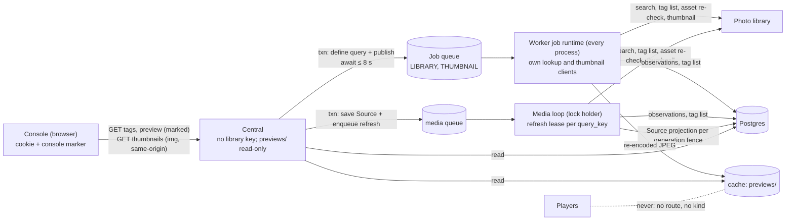
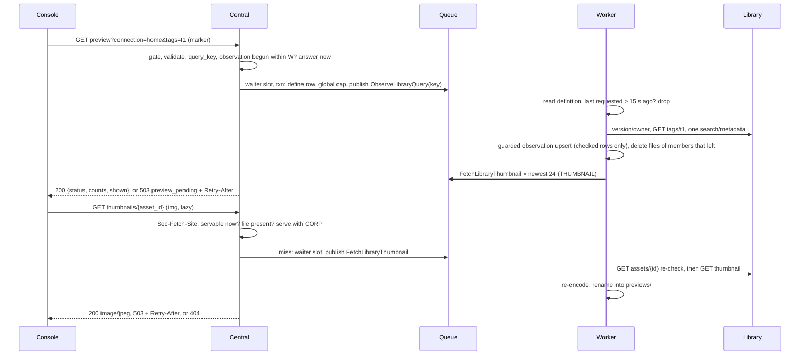

# Operator console pass B: a Source is one library query; choose it by tag and see what it selects

**Status:** revised after two adversarial reviews (data/caching; security/privacy); awaiting owner approval; build proceeds on stated defaults. **Layer:** module (contracts, data flow, ownership, invariants, failure behaviour), not functions.
**Builds on:** [pass C+D](operator-console-ux-pass2-flow.md) §7 J5 (the Source step's reserved "Tags" and preview slot in step 1, and the Name step's connection rule), [slice 3](operator-console-ux-pass2-showrunner.md) (candidates, served `standing`), [pass A](operator-console-ux-pass2-session.md) (cookie sign-in and its cross-site checks), [central system architecture](central-system-architecture.md) (read-through, typed jobs, one worker kind), [media worker](module-media-worker.md) (refresh leases and request revisions).
**Owner is asked:** approve this revision. Q1 (tags are all-of), Q2 (shape A) and Q3 (widen the key) are answered. Q4 (tag ids in the browser) and Q5 (capture-day timezone) are open with defaults the build uses (§14).

## 1. Today

| Gap | Evidence |
| --- | --- |
| A Source can filter only by favourites, capture window and media type. There is no tag. | `media/models.py:31-38` `SourceSpec` |
| The operator cannot see what a Source selects, before or after saving. Choosers say "Photo 108×192". | `SceneAuthoring.jsx`; showrunner doc §16 "Deferred: thumbnails" |
| Re-sending an unchanged stored Source would break if a field were simply added: the stored JSON is compared byte-for-byte. | `central/media_repository.py:81` |
| Refresh is leased per Source, one Source per 30 s tick, and saving a Source queues nothing. | `media_repository.py:136-162` (`LIMIT 1`); `media/task_queue.py:16,64-69` |
| A spec the worker cannot read fails validation after the row is locked, so the same row is picked again every tick. | `media_repository.py:161`; `contracts/models.py:25` (`extra="forbid"`) |
| Cookie GETs skip the marker, `Origin` and `Sec-Fetch-Site` checks; only writes get them. | `central/operator_auth.py:170` |

## 2. Requirements (binding)

| # | Rule | Source |
| --- | --- | --- |
| R1 | Pick a tag with type-ahead from the library's own tag list; once picked, show the media that tag selects. | Owner request |
| R2 | Neutral library language, no vendor words; say plainly that media lives in the library and Photo Wall only selects it. | Owner; flow doc §2 rule 4; `test_sources_have_no_immich_or_album_language` |
| R3 | Players stay unaware of the library. Previews never become Player media, and Players never reach the library. | [requirements](requirements.md#central-media-boundary); AGENTS.md |
| R4 | The browser never sees the library URL, hostname, key, owner id or any photo's library id. **Amended (Q4 default):** tag ids are allowed. They are opaque without the key, shown only to a signed-in operator, and never sent to Players. | Owner ("proxied by Central"); [module-media](module-media.md) connection rules; security review #5 |
| R5 | The cache is only a cache. A purge at any moment must not change correctness. | Owner: the cache is ephemeral |
| R6 | A failure is never shown as "nothing matches". | [module-media](module-media.md) "Never interpret them as empty" |
| R7 | No credentials or private media in source, fixtures or evidence. Tests use synthetic images. | AGENTS.md; CONTRIBUTING.md |
| R8 | Idempotency belongs to each data type, never to job order. | Owner: idempotency is per data type |

## 3. The shape: library lookups are jobs, answered as data

Central writes what it wants (a query definition) and publishes a typed lookup job in the same transaction, then awaits the handle. The worker is the only holder of library credentials. It answers by writing data: a tag list, a query observation or a thumbnail file. Central then reads that data. Source refreshes use the same observation data through a lease per query key (§6).

**Design-it-twice.**

| | **A. Lookup jobs, answered as data (chosen)** | **B. Central holds a read-only library client** |
| --- | --- | --- |
| How | New job types on two new queues; results in tables and one cache subdirectory; Central awaits the `JobHandle` (`central/kernel/publishing.py` PB1–PB9). | Central also mounts the connection file and calls the library directly, with an in-process TTL cache and streamed thumbnails. |
| Keeps | Architecture §2 (Central never calls an origin); key custody in the worker only; single-flight across pods via `queueing_lock`. | Lower latency (one hop), no tables, no new job types. |
| Costs | One queue round trip per cache miss. Three migrations. A slow first preview when the worker is down: an honest 503, not a result. | Amends architecture §2 and the compose secret boundary; the LAN-facing process holds the key; N pods make N× the library calls. |
| Rejected C | Thumbnails from Central's prepared variants: none exist before saving; they exist only for planner-requested items; they are wall-size files served only to Players. | |

> **Q2 (shape). Answered: A.** The worker fetches; Central serves from tables and `previews/`; Central never calls the library.

## 4. Design rules (design choices, not requirements)

1. **A Source is one library query (owner's principle).** A Source is a name plus one canonical `LibraryQuery`. The library does the selecting: each query maps to exactly one search. The worker may send that *same* search more than once (a small probe then the full first page; a pass without then with EXIF, `media/immich.py:328-388`), but never merges *different* searches. Local checks only narrow that search's rows. A draft preview and a saved Source with the same query share one key and one observation (§6).
2. **The browser names only opaque ids.** Tags travel as `tag_ref` (the library's tag UUID, R4 as amended) and media as `asset_id` (Photo Wall's hash, `^asset-[a-f0-9]{64}$`, `media/models.py:120-122`). A thumbnail is served or fetched only for an `asset_id` in **current** data (§6). Nothing else is ever looked up, which rules out confused-deputy fetches by construction.
3. **Jobs carry keys; criteria live in data.** A job's fields are only `query_key`, `connection_ref` or `asset_id` (`central/kernel/jobs.py:161-171` allows only str/int/bool/enum). The worker reads the criteria from the definition row. No job carries a URL, owner id or library photo id.
4. **Every lookup result is data with its own write rule** (§6). Readers decide from the data; a job outcome only explains an absence.

## 5. The query: tags and the other criteria

**What one library request can express (Immich 2.5.6).** Every search route builds its WHERE clause with the one `searchAssetBuilder` ([database.ts:372-471](https://github.com/immich-app/immich/blob/3be8e265cd5bd6ca921ff9e665e274c5de45caa0/server/src/utils/database.ts); [search.repository.ts:200,222,240,269,293](https://github.com/immich-app/immich/blob/3be8e265cd5bd6ca921ff9e665e274c5de45caa0/server/src/repositories/search.repository.ts)). Every field is ANDed with every other, and no field takes an any-of list. So "all of" is native, and "any of" exists only inside the tag hierarchy.

| Criterion | One request? | Semantics and evidence | In pass B |
| --- | --- | --- | --- |
| Several tags, **all of** | yes | `tagIds[]` → `hasTags`: `count(distinct ancestor) >= n` (database.ts:265-278) | **yes** |
| One tag and **everything nested under it** | yes | the join goes through `tag_closure` (database.ts:271-272); always on | **yes** (stated in the UI) |
| Several unrelated tags, **any of** | **no** | no any-of field; `null` means "untagged only" (database.ts:382-384) | unsupported |
| Tags **combined with** favourites, dates, media type | yes | separate ANDed clauses | **yes** |
| Favourites **or** a tag | **no** | only AND between fields | unsupported |
| Photos **and** videos | yes | omit `type` | **yes** (fixes today's refresh) |
| One capture window | yes | `takenAfter` / `takenBefore` on `fileCreatedAt` | existing |
| Several windows; rating at least N; several cities | **no** | one pair per request; no range or list operators | unsupported |
| People, albums, rating = N, place or camera = one value | yes | `personIds[]`, `albumIds[]` (all of), equality fields | later (new permissions; album wording is an owner call) |
| Semantic "smart" query | not a selection | orders every filtered row by distance, no threshold (search.repository.ts:293-308) | unsupported |

**The tag rule, exactly.** A query takes 0–4 tags. An item matches if, **for every chosen tag T, it carries T or a tag nested under T**, evaluated by the library at each search. The console never offers "any of"; it says: "To combine tags, give those photos one shared tag in your library."

> **Q1. Answered:** all-of, library-native, nested tags included. **Deferred follow-up (not a bead):** a Scene combines several Sources for "any of". The model and planner already allow it (`Contribution.source_refs`, `central/runtime.py:50`; `_pool`, `central/planner.py:237-250`); only the console authors one Source per Scene (`authoring.js:176,257`).

**Tag identity.** A tag is its UUID. At 2.5.6 a tag cannot be renamed or moved (`TagUpdateDto` has `color` only), so the path shown is stable while the tag lives. Deleting and re-creating a tag gives a new UUID. The Source then stays `incompatible/tag_missing`, and the fix is a new Source revision (Edit). A tag deleted between the existence check and the search yields one empty `ok` result; this is accepted and stated, and the next refresh's check reports `tag_missing`. The check makes `tag.read` necessary for the live refresh of **tagged** Sources (Q3's "nothing else breaks" holds for untagged Sources only).

**Model.** A new `LibraryQuery` holds the criteria and validators; `SourceSpec` becomes `source_ref` plus `LibraryQuery`. The wire shape stays flat and `schema` stays 1. Old rows validate with `tags=()`. Validation **normalises and never rejects** a legal old value (for example stored `["video","image"]`), so equal meaning gives equal bytes:

| Field (canonical order) | Normal form |
| --- | --- |
| `shape` | `1`, the version of this canonical form |
| `connection_ref` | as given: the same filters on another library are a different query |
| `tags` | canonical lowercase UUIDs, unique, sorted, at most 4 (checked before hashing); `[]` means no tag filter |
| `favorites` | `true`, `false` or `null` |
| `captured_from`, `captured_until` | the validated UTC instants (floats), or `null` |
| `media_types` | unique, sorted subset of `image`, `video` |

`query_key = "q-" + sha256(canonical JSON: sorted keys, no whitespace, explicit nulls)`. It is computed only in Python from the validated value, never in the browser. It hashes the *meaning*, not the search body, so an adapter fix does not orphan cached results. `search_body(query)` is a pure function. A parent and its own child tag chosen together are redundant (the result is the child's). The console blocks that pair (§8), and the server accepts it without canonicalising, because only the library knows the hierarchy.

**Verified against the pinned version** (`media/immich.py:1,259`; the [tagged OpenAPI](https://github.com/immich-app/immich/blob/3be8e265cd5bd6ca921ff9e665e274c5de45caa0/open-api/immich-openapi-specs.json), `info.version` = `2.5.6`).

| Need | Endpoint (permission) | Behaviour we rely on | Primary source |
| --- | --- | --- | --- |
| List tags | `GET /api/tags` (`tag.read`) | Every tag of the key's user: `id`, `name`, `value` (path), `parentId`. No paging. | [tag.controller.ts:42](https://github.com/immich-app/immich/blob/3be8e265cd5bd6ca921ff9e665e274c5de45caa0/server/src/controllers/tag.controller.ts), [tag.service.ts:24-27](https://github.com/immich-app/immich/blob/3be8e265cd5bd6ca921ff9e665e274c5de45caa0/server/src/services/tag.service.ts) |
| Tag still exists | `GET /api/tags/{id}` (`tag.read`) | missing or inaccessible → 400 | tag.service.ts:29-31 |
| Search by tag | `POST /api/search/metadata` (`asset.read`) | `tagIds` → all of, nested included; `tagIds: null` = untagged only, so the key is **omitted** when empty | [database.ts:265-278, 381-384](https://github.com/immich-app/immich/blob/3be8e265cd5bd6ca921ff9e665e274c5de45caa0/server/src/utils/database.ts) |
| Asset re-check | `GET /api/assets/{id}` (`asset.read`) | owner, visibility, trash, offline, checksum; 400 for missing or inaccessible | `media/immich.py:480-483` (the download path's existing check) |
| Thumbnail | `GET /api/assets/{id}/thumbnail?size=thumbnail&edited=false` (`asset.view`) | content type from the extension; **404 = not generated yet** (regenerated by the library's nightly job) | [asset-media.service.ts:218-263](https://github.com/immich-app/immich/blob/3be8e265cd5bd6ca921ff9e665e274c5de45caa0/server/src/services/asset-media.service.ts) |

**One query, one search:**

| `LibraryQuery` field | In the one search | Local check (narrows that search's rows only) | Today's refresh |
| --- | --- | --- | --- |
| `tags` (new) | `tagIds`, omitted when empty | none: rows carry no tags (trusted to the library, a stated cost) | new |
| `favorites` | `isFavorite` when set | re-checked (`media/immich.py:288`) | obeys |
| `captured_from/until` | `takenAfter` / `takenBefore` | half-open trim (`:289-290`) | obeys |
| `media_types` | `type` only when one is chosen | kind check; audio and "other" dropped (`:282-287`) | **violates:** one search per type, merged (`:331`, `:409`) |
| fixed scope | `visibility=timeline`, `isOffline=false`, `withDeleted=false`, `order=desc` | owner, visibility, trash and offline guards (`:282-284`) | obeys |

**Adapter change** (`media/immich.py`): one search for both types, with the local kind check; `tagIds` only when non-empty; before searching, `GET tags/{id}` for each tag (400 → `incompatible/tag_missing`, 403 → `permission`). Three new bounded operations under the existing budget, redirect and status rules: `list_tags()` (≤ 5,000 tags, ≤ 2 MiB, paths ≤ 1,024 chars, else `tag_limit`), `recheck(upstream_id)` (reuses the refresh row check, DRY), and `thumbnail(upstream_id)` (≤ 1 MiB). Lookup clients check version and owner at most once a minute; `refresh` keeps its per-call check. The 1,000-row window now covers both types together and counts rare audio or "other" rows, so `source_limit` can come slightly earlier (a stated cost).

**Compatibility.** Sources need no data migration: `spec` is JSONB. `configure_source` compares canonical `LibraryQuery` values, not raw JSON (`media_repository.py:81`). Sources stay immutable. A parity test pins that one search per query selects what the per-type searches did.

## 6. Caching and refresh by query shape

**Data types and their write rules.** Each table has one owning module: `LibraryQueryRepository` (new, `central/`) owns the query tables, `MediaRepository` keeps the Source tables, and `LibraryTagRepository` owns tags and connections.

| Data type | Key | Written by | Write rule | If lost or purged |
| --- | --- | --- | --- | --- |
| Query definition (`library_queries`: `canonical_query`, `connection_ref`, `first_requested_at`, `last_requested_at`) | `query_key` | `define()`: in the preview route's publish transaction, and in the Source refresh lease transaction | upsert; `last_requested_at` only rises | the preview job fails transient `query_undefined` (retry at once), never ok or empty; the console's next poll re-defines |
| Query observation (observation columns on the same row: `status`, `code`, `observed_at`, `members_observed_at`, `counts`, `limits`) | `query_key` | `observe()` in the worker (preview job or Source refresh) | applied only if the new `observed_at` (when its search began) is later; equal is a no-op. `ok` and `source_limit` replace the members. **A newer failure updates status, code and `observed_at` and keeps the last members with their own `members_observed_at`.** A write whose row was purged is dropped. | one search |
| Observation members (`library_query_members`: `query_key`, `asset_id` indexed, `metadata`) | `(query_key, asset_id)` | with its observation, atomically | only rows that passed the owner, visibility, trash and offline checks; `OriginalAsset` fields only (the `source_limit` sample holds the checked subset: connection, library id, checksum, kind, `captured_at`). Counts are taken after the checks. | as above |
| Source projection (`source_members`, `catalog_snapshots`, status, revisions) | `source_ref` | the per-key refresh (below) | unchanged `generation` fence; its input is an observation; `refreshed_at` and `last_success` are the observation's `observed_at` | existing |
| `asset_revisions` | `asset_id` | Source projection only, **never a preview** | unchanged | existing |
| Tag list (`library_tags`: one row, `tags` JSONB, status, code) | `connection_ref` | `ListLibraryTags` | newer `observed_at` wins; names stripped of control and bidi-override characters (U+202A–202E, U+2066–2069) at write | refetch |
| Connection (`library_connections`: `connection_ref`, `fingerprint`, `announced_at`) | `connection_ref` | worker boot | `fingerprint` = sha256 of base URL and owner id (the owner UUID makes it unguessable). A changed fingerprint purges that connection's tags and queries. A connection absent from a booting process's set is removed with its rows. | re-announced at the next boot; routes answer `connection_unknown` until then |
| Thumbnail file (`previews/<asset_id>.jpg`) | `asset_id` | `FetchLibraryThumbnail` | servable only while `asset_id` is in **current** data: a retained observation member (including the sample) or a current `source_members` row, **never** `asset_revisions`. The worker re-checks the asset before fetching. Temp file plus rename. | read-through refetch |

**Refresh per query key.** ✱ The Source refresh lease moves from one Source to one `query_key` (data review #2, #3 and #5, preferred fix). Migration 031 adds `media_sources.query_key`, which `configure_source` fills. The lease fills it for pre-031 rows, using the one `LibraryQuery.key()`.

| Step | Rule |
| --- | --- |
| Pick | The earliest due row (`next_refresh ≤ now` or a pending request revision), then **every** Source with that key whose lease is free (`FOR UPDATE SKIP LOCKED`). Each gets its own `generation + 1`, start time and captured request revision. The lease also calls `define()`. |
| Unreadable spec | That row alone becomes `incompatible/spec_unsupported`: `next_refresh` moves on, and pending revisions complete with that outcome. The lease continues to the next due row, so one bad row never blocks the others (data review #9). |
| Search or reuse | **Search** if any member has a pending operator request. Otherwise **reuse** the key's observation only if it is `ok`, its `limits` equal the worker's current `MediaLimits`, and `observed_at > now − W`. Anything else searches. |
| W | `StoreLimits.refresh_seconds` (`central/media_repository.py:37`, default 30 s), the Source refresh cadence. It is not `MediaLimits.refresh_seconds` (60 s adapter budget, `media/models.py:108`) or `WorkerLimits.refresh_seconds` (65 s timeout, `media/worker.py:109`). |
| Project | Each member is projected under its own fence in its own transaction. One member's failure (such as `metadata_capacity`) leaves the others untouched. A refresh projects **the result of the search it sent**, even when a concurrent preview's newer observation won the upsert. `completed_revision` rises only through the revision each member captured. |
| Cadence | Unchanged: one key per 30 s tick (`media/task_queue.py:16`). Two Sources with one query now cost one search per tick. |
| Creation | `configure_source` enqueues the existing exact-Source task in its transaction. The task now leases a key that is **due or** has a pending request, so a new Source (`next_refresh = 0`) refreshes at once, and preview-then-save within W projects the cached observation with no second search. |

The preview route reuses an observation of **any** status begun within W (it cannot see the worker's limits; a preview is advisory). A preview job and a refresh of one key running at the same moment can send one duplicate search. The guarded upsert keeps the stored observation monotonic (a stated cost).

**Retention.** On each observation write, the owner prunes rows whose newest of `observed_at` and `last_requested_at` is older than 1 h, and keeps at most 64 rows, oldest first (members cascade). No Source reads this table after projection, so "kept for a Source" was dropped. **Preview files:** each observation or projection write deletes the files of members that left and are referenced nowhere else. A periodic sweep (UPKEEP, every 5 min) deletes unreferenced files and files older than 7 days, and evicts the oldest while `previews/` is over 256 MiB. Deleting any row or file, or all of them, only causes a search or a refetch (R5).

## 7. Contracts

**Request gate** (owned by `operator_auth`, reusing `_marked` and `_same_origin_fetch`; security review #1). ✱ Cookie-authorised GETs that can publish work need the console marker, and `Sec-Fetch-Site: same-origin` when that header is sent. This narrows pass A's "GETs need no marker" for these routes; bead L6 records it in pass A's document. A bearer request (scripts) needs neither, as in pass A. The thumbnails route is loaded by `` and cannot send the marker. It stays exempt, but it rejects any `Sec-Fetch-Site` other than `same-origin`, publishes only for servable ids, and answers with `Cross-Origin-Resource-Policy: same-origin`. The auth check runs before anything else. Signed out, a known or unknown `asset_id` gets the same 401 body and nothing is queued. A Player credential gets 401.

| Route (all `admin`) | Gate | Returns | Errors |
| --- | --- | --- | --- |
| `GET /v1/operator/library/connections` | cookie or bearer | `[{connection_ref, announced_at}]` | none |
| `GET …/library/tags?connection=&q=&limit=` | marker | `{refreshed_at, refreshing, status, total_matches, tags:[{tag_ref, path, name}]}`, filtered in Python from a per-pod parsed cache keyed by the row's `observed_at` (casefold plus NFKC; prefix matches first). Older than 5 min: publishes `ListLibraryTags` and answers from the stored list. With no list yet it awaits ≤ 5 s (2 waiter slots per pod). | 422 (`q` > 128 chars, `limit` > 20); 404 `connection_unknown`; 503 `library_unavailable` / `busy` + `Retry-After`; 409 `library_permission` / `library_incompatible` / `tag_limit` |
| `GET …/library/preview?connection=&tags=&favorites=&captured_from=&captured_until=&media_types=` | marker | `{query_key, observed_at, members_observed_at, status, code?, counts?, limit?, shown:[≤ 24 newest {asset_id, kind, captured_at, width?, height?, duration?}]}`. A non-ok status is a truthful 200. `source_limit` carries `limit: 1000` and the sample; a failure carries the last members. | 422 (the same validators as `SourceSpec`, ≤ 4 tags); 404 `connection_unknown`; 503 `preview_pending` / `busy` + `Retry-After` |
| `GET …/library/thumbnails/{asset_id}` | `Sec-Fetch-Site` + CORP | `image/jpeg`, only Photo Wall's own encoding; `nosniff`; `Content-Security-Policy: default-src 'none'; sandbox`; `no-store` | 422 (id pattern); 404 `thumbnail_unknown` (not servable, **nothing published**); 404 `thumbnail_unavailable` (terminal); 503 `thumbnail_pending` / `busy` + `Retry-After` (16 slots per pod) |
| `GET /v1/operator/sources/{ref}/candidates` (existing) | unchanged | unchanged; the saved Source card shows the newest 24 through the thumbnails route | unchanged |

**Preview route flow.** Validate. Then return an observation begun within W if there is one. Otherwise take a waiter slot (4 per pod; none free gives 503 `busy` with nothing published). In one transaction: `define()`, check the **global cap** of 4 pending or running `ObserveLibraryQuery` jobs (counted from the queue; over the cap gives 503 `busy`, rolled back), and publish. Then await ≤ 8 s and read the data. With no data, answer 503 `preview_pending` + `Retry-After: 2`. The uvicorn access log drops query strings under `/v1/operator/library/` (a log filter, because `Dockerfile:129` logs full paths).

| Job type | Queue, priority | Dedupe | Reads → writes | Drops |
| --- | --- | --- | --- | --- |
| `ObserveLibraryQuery(query_key)` | `LIBRARY`, 10 | `query_key` | definition → `observe()` → observation and members; then publishes `FetchLibraryThumbnail` for the newest 24 **only** when the key was requested within 15 s | Not started within 15 s of `last_requested_at` → transient `preview_expired` (retry at once, no search). No definition row → transient `query_undefined`. An observation of any status written → `ok`. |
| `ListLibraryTags(connection_ref)` | `LIBRARY`, 0 | `connection_ref` | → `library_tags` (guarded) | none |
| `FetchLibraryThumbnail(asset_id)` | ✱ `THUMBNAIL`, 0 | `asset_id` | servable member → `recheck` (owner, timeline, not trashed, not offline, same checksum) → `thumbnail` → Pillow decode (JPEG, PNG and WebP only; size read from the header and checked before decode; `MAX_IMAGE_PIXELS` 4 MP) → fit 320 px → JPEG q80 **without EXIF, XMP or ICC** → temp file plus rename, directory handle opened `O_NOFOLLOW` (the `media_store._open` walk, reused) | Not servable, or the re-check fails, or library 400 → terminal `thumbnail_unavailable` and the file is deleted. Library 404 → transient `thumbnail_not_ready`, retry after 10 min. |

✱ **Why two queues.** Priority alone orders only queued jobs. A burst of 24 thumbnails could still occupy every running `LIBRARY` slot while a new preview waits. `THUMBNAIL` gets its own per-process concurrency (the runtime takes a per-queue map, `central/content_wiring.py:43`), so thumbnails can never take preview slots. Inside `LIBRARY`, observe (10) outranks tags (0). Concurrency is 2 per queue **per worker process**; every worker process runs the job runtime (`media/worker.py:356-363`).

**Clients** (data review #4). The worker boot (`media/worker.py:420-428`) already loads the connection file. It now builds, per connection, a **lookup client** for `LIBRARY` and a **thumbnail client** for `THUMBNAIL`, each its own `ImmichClient` with its own 2-connection pool and budget (`media/immich.py:159`). They are passed into `build_job_runtime`, which today is built without connections (`central/content_wiring.py:93-118`). The Source refresh keeps the media loop's client. Library load per worker process: at most 2 + 2 lookups, plus the refresh.

**Why thumbnails are not Asset records.** The architecture's Asset record holds write-once produced facts. The library may regenerate a thumbnail under the same key, and write-once facts would turn a later refetch into a permanent miss. Previews reuse the publisher, `JobHandle`, outcome feed and waiter slots, but not `AssetReader` or `AssetRecords`. They are never in the desired set. `previews/` is created beside `media/`, mode 0700, in the entrypoint's `install -d` loop (`docker-entrypoint.sh:55-57`) and in `cache_layout`.

**Migrations** (next free numbers at build time): 030 `library_queries` + `library_query_members` (L1); 031 `media_sources.query_key` + index, and an `asset_id` index on `source_members` (L2); 032 `library_tags` + `library_connections` (L3).

## 8. Console (the J5 Source step, "What to include")

| Element | Behaviour |
| --- | --- |
| Connection | ✱ The flow doc's connection rule decides visibility and prefill. When that rule makes the field visible (no Source yet, or several values), the field moves to the top of step 1, because tags and previews need it. In the one-value case, step 1 uses the prefilled value and the field stays in step 2's Advanced. Options come from `library/connections`. |
| `TagCombobox` | WAI-ARIA combobox: `role=combobox`, `aria-autocomplete=list`, `aria-expanded`, `aria-controls`, `aria-activedescendant`; a `listbox` of ≤ 20 options; Up/Down, Enter, Escape, Home/End. Debounced 150 ms; stale responses dropped by sequence. A chip per tag (≤ 4) with "Remove tag *path*". Paths are rendered in `<bdi>`. With two or more tags: "Media with **all** of these tags". A tag nested under a chosen tag (or its parent) is refused: "Already included: *Family/Christmas* is inside *Family*." Polite live region: "20 of 143 tags; keep typing". |
| `PreviewGrid` | Re-queried on each criteria change (debounced 400 ms; the superseded fetch is aborted). On 503 it polls, honouring `Retry-After` (capped at 30 s), with "Looking in your library…". After 2 min it shows "Still looking. Photo Wall will keep trying." A `role=list` of 24 fixed tiles, `loading=lazy`, alt text "Photo taken 12 Dec 2024" or "Video, 0:32, taken …". A tile retries after 2, 8 and 30 s, then shows "Preview not ready yet", and tries once more when `observed_at` changes. The grid unmounts on Log out. |
| `SelectionSummary` | Step 1, Review and the saved Source card: "Selects media tagged **Family/Christmas** (and nested tags) · favourites only · photos and videos: **128 photos and 4 videos** in your library now; showing the newest 24." Tag paths come from the tag list by `tag_ref`. A missing path reads "a tag that no longer exists in your library". A list not loaded yet reads "1 tag". |

| Situation | Wording (neutral) |
| --- | --- |
| Intro (kept) | "Photo Wall selects media that lives in your photo library. It never uploads, edits or deletes anything there." |
| Tag field | Label "Tags in your library"; hint "Each tag includes everything nested under it. For media with *any* of several tags, give those photos one shared tag in your library." |
| Preview heading | "What this selects from your library" · "Previews come from your photo library, as of 12:03." |
| Nothing matches (ok, 0) | "Nothing in your library matches yet. New matches appear automatically once saved." |
| Over the limit | "More than 1,000 items in your library match. A source can use at most 1,000; narrow it with tags or dates. Showing the newest 24." |
| Library unreachable | "Photo Wall can't reach your photo library right now. Showing what it selected at 12:03." With no earlier members: "… right now. Retrying…" (never "no media") |
| Key not allowed | "Your library connection isn't allowed to list tags / show previews. Give its key the tag-read / view permission." The rest of the step still works. |

## 9. Security and privacy

| Threat | Control | Strength |
| --- | --- | --- |
| Key, URL, hostname, owner id or library photo id reaching the browser | Central never holds them (§3 A); responses carry only `tag_ref`, `asset_id` and `connection_ref`; the fingerprint never leaves the database | construction |
| Cross-site GET queueing library work (another port on the same host shares the cookie) | Request gate (§7): marker on tags and preview; `Sec-Fetch-Site` and CORP on thumbnails; `SameSite=Strict`; CSP `img-src 'self'` (`app.py:379`) | construction + test |
| Confused deputy; serving what the library no longer shows | Servable = current members only; worker re-check before each fetch; files deleted when members leave; 7-day maximum age | construction + test |
| SSRF or injection through inputs | `tag_ref` is a canonical UUID sent in a JSON body; `upstream_id` from Central's records; fixed base URL; redirects refused (`media/immich.py:156`); `asset_id` pattern; `O_NOFOLLOW` | validation |
| Hostile bytes or names from the library | Only our re-encoded JPEG is served; formats listed; pixel check before decode; no metadata out; nosniff plus sandbox CSP; tag names stripped of control and bidi characters and rendered in `<bdi>`; `q` filtered in Python | construction |
| Load from a stolen cookie or a runaway UI | Slot taken before publishing (4 preview, 2 tags, 16 thumbnail per pod); global cap of 4 observes; 15 s expiry; `queueing_lock`; reuse within W; separate clients and queues | bulkhead |
| Private data at rest | `library_queries` and members hold checked `OriginalAsset` fields only (no GPS, place, description, filename or path); `library_tags` holds tag paths; `library_connections` holds only ref, fingerprint and time; `previews/` holds 320 px copies without metadata, 0700; `no-store` to the browser | stated cost |
| Private data in logs and evidence | Query strings dropped from library access logs; job fields are keys only; evidence never contains a real library's tag names, ids, previews or screenshots (the [runbook](runbook.md) evidence rule, extended by L6) | construction + review |
| Players | Players have no route or job kind for previews, and Player config, state and plans carry no tag id (test) | construction + test |

> **Q3 (key permissions). Answered: add `tag.read` and `asset.view` to the existing library key** (runbook step, bead L6). Until then tags and previews degrade as §8 says, untagged Sources are unaffected, and **tagged Sources' refresh reports `permission`** (corrected from "nothing else breaks").

## 10. Failure table

| Failure | What the operator sees | Recovery | Guarantee |
| --- | --- | --- | --- |
| Library down or slow | Stale tags ("as of …"); the preview's last members with "can't reach" | Next request after W or `retry_not_before` | test |
| Worker not running | Preview 503 → "Looking…", then "Still looking"; the media health strip says the worker is down | Worker restart | test |
| Many distinct previews (such as date sweeps) | 503 `busy`; the console polls | Cap frees | probe |
| Definition purged mid-request | One 503 `preview_pending`; the next poll re-defines | Automatic | test |
| Cache purged or `previews/` missing | Tiles retry, then show | Read-through refetch with re-check | test (purge probe) |
| Library has no thumbnail yet (404) | "Preview not ready yet" | Transient; retried after 10 min with no operator action | test |
| Asset archived, trashed, untagged or moved to a partner | Tile 404 once the next observation lands; file deleted | Automatic | test |
| Tag deleted after save | `incompatible/tag_missing`; the card says "A tag this source uses no longer exists in your library." The planner gives a non-ok Source no new selections (`planner.py:241`); the wall follows the existing unavailable-Source behaviour. | Edit the Source (new revision) | test |
| Tag deleted between check and search | One empty `ok` result | Next refresh reports `tag_missing` | stated |
| More than 1,000 match | `source_limit` with the newest-24 sample, before saving | Narrow the criteria | test |
| Unreadable stored spec (rollback, or a newer field) | That Source: `incompatible/spec_unsupported`; others refresh | Roll the worker forward. Rollout order: **worker first**, then Central. | test |
| Connection removed or its URL/owner changed | `connection_unknown`, or cached tags and queries purged | Deploy the config; next boot announces | test |
| Pending operator request within W | A fresh search; never an older answer | n/a | test (clock) |
| Two Sources with one query; two pods with one lookup | One search per tick; one pending job both await | n/a | test / construction |
| Thumbnail regenerated upstream | New bytes on the next refetch | none needed | by design |

## 11. Tests and mutation probes

Fakes: extend `Upstream` (`tests/test_immich.py:87`, `httpx.MockTransport`) with `/api/tags`, `/api/tags/{id}`, `/api/assets/{id}` and `/assets/{id}/thumbnail`, with images generated in-test with Pillow as `tests/public_media.py` does. `FakeSource` (`tests/test_media_worker.py:102`) gains `list_tags`, `recheck` and `thumbnail`. Central semantics run on the controllable clock. Every run asserts a positive test count (a skip is a failure). Real-library behaviour is checked in L6 (below), not by fakes alone.

| Probe: break this… | …and this test must fail |
| --- | --- |
| Send `tagIds: null` for an empty filter; drop the tag check | the body has no `tagIds` key; a deleted tag gives `tag_missing`, not ok/empty |
| Restore one search per media type | a both-types Source sends one body per pass with no `type`; membership parity with the old fixture |
| Restore the raw-JSON compare; reject unsorted `media_types` | re-PUT of a pre-tag Source gives `created: false`; stored `["video","image"]` still refreshes |
| Hash a non-canonical form, or in JS | reordered tags or media types give one key; the console never sends a key |
| Treat a missing definition as empty | purge before the job starts: transient `query_undefined`, the preview is 503, never ok/empty |
| Reuse with a pending request | clock: a request, then a scheduled tick within W, sends exactly one search, and the completed revision rises only after it |
| Reuse a non-ok, other-limits or boundary observation | `observed_at = now − W` searches; `now − W + ε` reuses; a non-ok or other-limits observation searches |
| Lease per Source again; no creation enqueue | two Sources with one key: one search, both projected under their own generations; preview then save within W: the Source is `ok` with no second search before the next tick |
| Let one unreadable spec block the tick | one bad row → `spec_unsupported` and `next_refresh` advanced; other Sources refresh |
| Break the guarded upsert | concurrent preview and refresh with interleaved finishes: stored `observed_at` never decreases; a newer failure keeps the last members |
| Share the refresh client or one queue | saturated lookups (4 slow previews, 24 thumbnails): the scheduled refresh stays `ok` in budget; 5 criteria changes 400 ms apart (searches 1 s): the last preview answers within 8 s |
| Give preview its own filter code | parity: preview counts equal refresh membership for 4 specs through the separate lookup client |
| Empty `source_limit` | > 1,000 matches: `source_limit`, a 24-item sample, `limit: 1000` |
| Terminal 404 thumbnail | 404, then generated: served after the retry with no operator action; library 400: `thumbnail_unavailable` |
| Drop the request gate | an unmarked cookie GET on preview or tags → 403 and zero jobs; thumbnails with `Sec-Fetch-Site: same-site` → 403; CORP present; bearer GET works |
| Publish before the slot; drop the cap | slots exhausted → 503 `busy`, zero jobs; 50 distinct-date previews queue ≤ 4 |
| Serve from `asset_revisions`; skip the re-check | an id only in `asset_revisions`, or only in a pruned observation, → 404 `thumbnail_unknown`, no publish; archive, trash or untag after preview → 404, file removed after the next observation |
| Store raw rows | partner, archived and trashed rows absent from counts, members and thumbnails; no stored JSON contains `latitude`, `originalFileName` or `originalPath` |
| Leak ids | Player config, state and plans contain no tag UUID; responses contain no hostname, owner id or library photo id; the access log has no query string |
| Drop input caps | 129-char `q`, `limit` 21 or 5 tags → 422, nothing published; bidi and control characters stripped from stored names |
| Loosen file handling | a traversal `asset_id` → 422; a symlinked preview is not served; an SVG/HTML "thumbnail" never reaches the response; an oversized header is rejected before decode; the output has no EXIF, XMP or ICC |
| Signed-out leaks | known and unknown ids get the same 401 body, nothing queued; a Player credential → 401 |
| Write preview members to `asset_revisions` | a 1,000-item preview leaves the `asset_revisions` count unchanged |
| Let `create_app` open the connection file | the Central test transport raises on any library call |
| Vendor words; combobox keys; parent-child pair | the no-vendor-language test, extended; ArrowDown/Enter selects and `aria-activedescendant` follows; a nested pair is refused |
| Ignore a fingerprint change | changed fingerprint → that connection's tags and queries purged |

## 12. Tracer bullet

A fake library with one tag and one synthetic image. A marked `GET …/library/preview?connection=fixture&tags=<t>` returns `counts.images = 1` with one `asset_id`. The same request unmarked with the cookie gets 403 and queues nothing. The job carried only the key, and the definition row was written in the publish transaction. After deleting `previews/`, `GET …/thumbnails/{asset_id}` still returns a JPEG, after the worker's re-check. The Central app's test proves it made no library call. **Proves:** the canonical query and key, the tag filter, request/reply over the queue with criteria as data, the guarded observation, the request gate, read-through thumbnails with re-check, purge survival and key custody. **Non-goals:** autocomplete, saving a Source, per-key refresh, eviction, UI.

## 13. Beads (each lands green)

✱ marks a consequential design choice. L6 records these in [design decisions](design-decisions.md).

| Bead | Scope (explicit) | Lands green because | Est. | Risk |
| --- | --- | --- | --- | --- |
| L1 (tracer) | `LibraryQuery` (canonical form, key, `search_body`, normalise); adapter: one search for both types plus parity, `tagIds`, tag check, `recheck`, `thumbnail`; migration 030; `LibraryQueryRepository` (`define`, guarded observation, servable lookup); lookup and thumbnail clients at worker boot; `LIBRARY` and ✱ `THUMBNAIL` queues; `ObserveLibraryQuery` (expiry, `query_undefined`); `FetchLibraryThumbnail` (re-check, re-encode caps, `O_NOFOLLOW`); `previews/` plus entrypoint; preview and thumbnails routes with ✱ the request gate, slot before publish and global cap | no caller of the Source refresh changes except the parity-pinned search | 6 h | high: both adversarial lenses |
| L2 | ✱ Per-key refresh lease (§6 table), reuse rule with W, projection from observations with `refreshed_at = observed_at`, ✱ a refresh projects its own search, creation enqueue, `spec_unsupported`, canonical `configure_source`; migration 031 | the existing refresh-revision tests pass unchanged, plus the clock and boundary tests | 5 h | high: live refresh path |
| L3 | `list_tags`; `ListLibraryTags`; ✱ tag list as one JSONB row plus a per-pod parsed cache; connection announcement with fingerprint and purge; connections and tags routes (gate, caps, filtering, stale-while-revalidate, `tag_limit`); migration 032 | new routes and tables only | 3.5 h | medium |
| L4 | Hardening: `source_limit` sample (✱ no statistics call), last members kept on failure, 404 transient retry, file deletion when members leave, periodic sweep (7 days, 256 MiB), observation pruning, access-log filter, 1-minute version memo, signed-out and Player 401 tests | adds rules to L1's paths, each behind its own test | 3.5 h | high: security lens |
| L5 | Console: ✱ connection field placement, `TagCombobox` (nested-pair block, `<bdi>`), `PreviewGrid` (polling, tile backoff, unmount on Log out), `SelectionSummary` (tag path, gone, not loaded), Source card, wording; browser tests | UI only, behind the routes of L1 and L3 | 4 h | medium |
| L6 (docs and evidence) | module-media (query, tags, permissions, previews versus derivatives), module-media-worker (per-key lease), central-system-architecture (jobs, queues, data model), central-idempotent-jobs (the observation), pass A (the GET marker rule), runbook (key permissions; evidence excludes real tag names, ids, previews and screenshots), flow doc slot, design decisions. **Real-library fixture run** on the disposable harness ([module-immich-fixture](module-immich-fixture.md)): parent, child and sibling tags; all-of; nested included; a parent-child pair; a deleted tag gives `tag_missing`; thumbnail 404 then served. It records dated, synthetic-only evidence. **It does not block merging when no Docker host with the fixture is available; the gap is then reported as not run.** | docs; the evidence is additive | 2.5 h + 1 h run | low; evidence |

**Estimate:** 6 beads, about 24.5 h plus a 1 h fixture run (was 17 h). The growth is the per-key lease (+3 h), the request gate and servability rules (+2 h), separate clients and queues (+1 h), and hardening and evidence (+1.5 h). The Scene "any of" follow-up is deferred and not counted. **Scope flag:** three migrations, two new queues, key custody, a cross-package edge (media ↔ `central.kernel`), a change to the live refresh lease, an amendment to pass A's GET rule, and more than 4 beads.

## 14. Assumptions and owner questions

- Q3 is done by the owner (key permissions). Until then, tags and previews degrade, and tagged Sources report `permission`.
- Reuse only saves library load; correctness never depends on it. The idle-queue round trip (Procrastinate `LISTEN/NOTIFY`) is expected to be sub-second. It is not measured yet; L1 records it.
- Tag lists stay under 5,000 per user; above that, `tag_limit` is reported and the rest works.
- The `source_limit` threshold counts the library's rows before Photo Wall's own checks, so partner or audio rows can trigger it slightly early. A statistics call would share that bias and cost a second search, so it is not made.
- Connection announcements assume every worker process reads the same deployment file. During a rolling change, the last booted process wins, and a mismatch only purges cache.
- Thumbnails of the library's unedited original are close enough for selection. The wall's crop and fit are not previewed.

| # | Question | Default the build uses |
| --- | --- | --- |
| Q4 | May tag ids (the library's tag UUIDs) reach the signed-in operator's browser? | **Yes.** R4 is amended as in §2. Tag ids are opaque without the key, never sent to Players (tested), and URL, hostname, key, owner id and photo library ids stay hidden. |
| Q5 | "Taken from/until" days are browser-local midnight today (`authoring.js:486-492`, `SourcesRegion.jsx:125-131`). Should they be the installation's timezone instead? | **Unchanged by pass B; a separate issue.** The key hashes the validated instant, so either choice keeps keys correct. |

## 15. History

- 2026-09-28: draft, then 3 revisions. The draft verified the Immich 2.5.6 endpoints, chose shape A and kept thumbnails out of Asset records. Revision 1: Q2 and Q3 answered; the one-query rule set, and the per-media-type refresh found to break it. Revision 2: the search surface enumerated: all-of only, any-of only through nested tags. Revision 3: Q1 answered (all-of; the Scene "any of" deferred). A Source is a name plus one canonical `LibraryQuery` keyed by `query_key`, and the worker searches and caches per key; L2 added.
- 2026-09-28, revision 4: after two adversarial reviews (data/caching; security/privacy), both FAIL, whose citations were re-checked against the code.
  - **Data.** Criteria moved into a definition row written in the publish transaction, because job fields cannot carry them. Refresh is now leased and scheduled per `query_key`: a pending request always searches, reuse needs an `ok` observation with the same limits, W is named as `StoreLimits.refresh_seconds`, and saving enqueues a refresh. Lookups got separate clients and a separate `THUMBNAIL` queue. A library 404 thumbnail is now transient. `source_limit` keeps a sample. An unreadable spec no longer stalls refresh. Storage, retention and connection identity are specified. A real-library fixture step was added to L6.
  - **Security.** GETs that queue work now pass the pass A cross-site checks. Servable thumbnails follow current data, with a worker re-check and file deletion. Stored members are checked `OriginalAsset` fields only. R4 is amended for tag ids (Q4). Logs, input caps, bidi, file handling, re-encoding, signed-out behaviour and at-rest listing are specified.
  - The draft's "the planner keeps the last still" was corrected (a non-ok Source gives no new selections), and so was Q3's "nothing else breaks" (tagged refresh needs `tag.read`). Q5 was recorded. The estimate rose from 17 h to 24.5 h.
