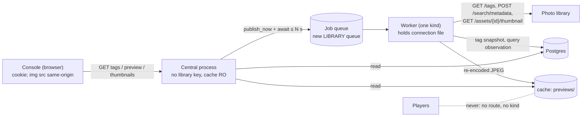

# Operator console pass B: a Source is one library query; choose it by tag and see what it selects

**Status:** design-gate artifact, awaiting owner approval. **Layer:** module (contracts, data flow, ownership), not functions.
**Builds on:** [pass C+D](operator-console-ux-pass2-flow.md) §7 J5 (the Source step's reserved "Tags" and preview slot), [slice 3](operator-console-ux-pass2-showrunner.md) (candidates, served `standing`), [pass A](operator-console-ux-pass2-session.md) (cookie sign-in: GETs need no marker), [central system architecture](central-system-architecture.md) (read-through, typed jobs, one worker kind).
**Owner is asked:** approve this revision. Q1 (tags are all-of), Q2 (shape A) and Q3 (widen the key) are answered.

## 1. Today

| Gap | Evidence |
| --- | --- |
| A Source can filter only by favourites, capture window and media type. There is no tag. | `media/models.py:31-38` `SourceSpec` |
| The operator cannot see what a Source selects, before or after saving. Choosers say "Photo 108×192". | `SceneAuthoring.jsx`; showrunner doc §16 "Deferred: thumbnails" |
| Re-sending an unchanged stored Source would break if a field were simply added: the stored JSON is compared byte-for-byte with the new dump. | `central/media_repository.py:81` |

## 2. Requirements (binding)

| # | Rule | Source |
| --- | --- | --- |
| R1 | Pick a tag with type-ahead from the library's own tag list; once picked, show the media that tag selects. | Owner request |
| R2 | Neutral library language, no vendor words; say plainly that media lives in the library and Photo Wall only selects it. | Owner; flow doc §2 rule 4; `test_sources_have_no_immich_or_album_language` |
| R3 | Players stay unaware of the library. Previews never become Player media, and Players never reach the library. | requirements.md §Central media boundary; AGENTS.md |
| R4 | The browser never sees the library URL, key or upstream ids. | Owner ("proxied by Central"); module-media.md:65 |
| R5 | The cache is only a cache. A purge at any moment must not change correctness. | Owner memory: cache is ephemeral |
| R6 | A failure is never shown as "nothing matches". | module-media.md:108 "Never interpret them as empty" |
| R7 | No credentials or private media in source or fixtures. Tests use synthetic images. | AGENTS.md |
| R8 | Idempotency belongs to each data type, never to job order. | Owner memory: idempotency is per data type |

## 3. The shape: library lookups are jobs, answered as data

Central publishes a typed lookup job and awaits its handle. The worker, the only holder of library credentials, answers by writing DATA: a tag snapshot, a query observation, or a thumbnail file. Central then reads that data. This is the request/reply form of the read-through path Central already uses for OS images and packages.



**Design-it-twice.**

| | **A. Lookup jobs, answered as data (recommended)** | **B. Central holds a read-only library client** |
| --- | --- | --- |
| How | New job types on a new `LIBRARY` queue; results in three tables and one cache subdirectory; Central awaits the `JobHandle` (`central/kernel/publishing.py` PB1–PB9). | Central also mounts the connection file and calls the library directly, with an in-process TTL cache and streamed thumbnails. |
| Keeps | Architecture §2 (Central never calls an origin); key custody in the worker only; single-flight across pods via `queueing_lock`. | Lower latency (one hop), no tables, no new job types. |
| Costs | One queue round trip per cache miss (sub-second when the queue is idle). One migration (3 tables). A slow first preview when the worker is down: an honest 503, not a result. | Amends architecture §2 and the compose secret boundary. The LAN-facing HTTP process then holds the library key. Caches are per pod, so N pods make N× the library calls. Each thumbnail stream occupies a Central waiter slot. |
| Rejected C | Thumbnails from Central's prepared variants: none exist before saving; they exist only for planner-requested items (a few of up to 1,000); they are wall-size files served only to Players. | |

> **Q2 (shape). Answered: A.** The worker fetches; Central serves from tables and the `previews/` cache; Central never calls the library.

## 4. Design rules (design choices, not requirements)

1. **A Source is one library query (owner's principle).** A Source is a name plus one canonical `LibraryQuery`, a logical unit that a Scene applies. The library does the selecting: each query maps to exactly one search the worker sends. The worker may send that *same* search more than once: a small probe then the full first page, and a pass without then with EXIF (`media/immich.py:328-388`, module-media.md:80-84). It never merges the results of *different* searches. Local checks only narrow the rows of that one search. A draft preview and a saved Source with the same query share one key, one search and one cached observation (§6). The field mapping is in §5.
2. **The browser names only Central's ids.** Tags are sent as `tag_ref` (the library's tag UUID, validated) and media as `asset_id` (Photo Wall's hash). A thumbnail is fetched only for an `asset_id` that Central already references. Without a reference there is no lookup, which rules out confused-deputy fetches by construction.
3. **Every lookup result is data with its own write rule.** Tag snapshots and query observations are upserts guarded by `observed_at`. Thumbnail files are named by key and renamed into place. Readers decide from the data, never from job outcomes.

## 5. The query: tags and the other criteria

**What one library request can express (Immich 2.5.6).** Every search route (`metadata`, `random`, `smart`, `statistics`, `large-assets`) builds its WHERE clause with the one `searchAssetBuilder` ([database.ts:372-471](https://github.com/immich-app/immich/blob/3be8e265cd5bd6ca921ff9e665e274c5de45caa0/server/src/utils/database.ts); [search.repository.ts:200,222,240,269,293](https://github.com/immich-app/immich/blob/3be8e265cd5bd6ca921ff9e665e274c5de45caa0/server/src/repositories/search.repository.ts)). **Every field is ANDed with every other, and no field takes an any-of list.** So "all of" is native; "any of" exists only inside the tag hierarchy.

| Criterion | One request? | Semantics and evidence | In pass B |
| --- | --- | --- | --- |
| Several tags, **all of** | yes | `tagIds[]` → `hasTags`: `count(distinct ancestor) >= n` (database.ts:265-278) | **yes** |
| One tag and **everything nested under it** (any-of over a subtree) | yes | the join goes through `tag_closure` (database.ts:271-272). This is always on: "only this tag, not its nested tags" cannot be expressed. | **yes** (implicit, stated in the UI) |
| Several unrelated tags, **any of** | **no** | no any-of list field. `null` means "untagged only" (database.ts:382-384). A tag's parent is fixed at creation (`TagUpdateDto`: `color` only), so grouping existing tags means tagging those photos with one shared tag in the library. | unsupported |
| Tag criteria **combined with** favourites, date window, media type | yes | separate ANDed clauses | **yes** |
| Favourites **or** a tag (any-of across fields) | **no** | only AND between fields | unsupported |
| Photos **and** videos | yes | omit `type`; one type → `type =` | **yes** (fixes today's refresh) |
| One capture window | yes | `takenAfter` / `takenBefore` on `fileCreatedAt` | existing |
| Several windows (every December) | **no** | one pair per request | unsupported |
| People, **all of** | yes | `personIds[]` → `hasPeople`, `count = n` (database.ts:235-249); listing people needs `person.read` | later (new key permission and face data) |
| Albums, **all of**; "in no album" | yes | `albumIds[]` → `inAlbums`, `count = n` (:251-263); `isNotInAlbum`; listing needs `album.read` | later (conflicts with the no-album-language test; owner call) |
| Rating **exactly** N; city / state / country / camera / lens **equal to one value** | yes | equality only (`asset_exif.* =`); rating −1..5 | later |
| Rating **at least** N; several cities | **no** | no range or list operators | unsupported |
| Semantic "smart" query | yes, but not a selection | `searchSmart` **orders** every filtered row by embedding distance with no threshold (search.repository.ts:293-308), and needs ML (`search.service.ts:110-112`) | unsupported as a criterion |
| Untagged only; filename, description or OCR text contains; motion photos; transcoded videos | yes | `tagIds: null`; `ilike` / trigram; `isMotion`, `isEncoded` | not offered |

**Pass B's tag criterion.** A query takes 0–4 tags. With two or more, the media must carry **all** of them. Each tag always includes its nested tags. The console never offers an "any of" switch. Where a result would need any-of across unrelated tags, the step says how to get it in the library: "To combine tags, give those photos one shared tag in your library."

> **Q1. Answered:** tags are all-of, library-native, with nested tags included. Any-of is not built now. **Deferred follow-up (not a bead): a Scene combines several Sources for "any of".** The model and planner already allow it: `Contribution.source_refs` is a tuple (`central/runtime.py:50`), and `_pool` merges the snapshots of several Sources (`central/planner.py:237-250`). Only the console is missing it: it authors one Source per Scene (`authoring.js:176,257`). Each query stays one search; the Scene composes them.

**Model.** A new `LibraryQuery` holds the criteria and their validators. `SourceSpec` becomes `source_ref` plus `LibraryQuery`; the wire shape stays flat and `schema` stays 1. Old rows validate with `tags=()`. **Canonical form and key:** validation normalises a query so that equal meaning gives equal bytes:

| Field (canonical order) | Normal form |
| --- | --- |
| `shape` | `1`: the version of this canonical form, bumped only if the meaning of a field changes |
| `connection_ref` | as given: the same filters on another library are a different query |
| `tags` | canonical lowercase UUIDs, unique, sorted; `[]` means no tag filter |
| `favorites` | `true`, `false` or `null` |
| `captured_from`, `captured_until` | UTC instants, or `null` |
| `media_types` | unique, sorted subset of `image`, `video` (today a tuple whose order counts) |

`query_key = "q-" + sha256(canonical JSON: sorted keys, no whitespace, explicit nulls)`, which fits `Identifier`. The key hashes the *meaning*, not the search body, so an adapter fix to the body (such as L1's) does not orphan cached results. The one search body is a pure function `search_body(query)`.

**Verified against the pinned version.** The client pins Immich **2.5.6**, commit `3be8e265` (`media/immich.py:1,259`; module-media.md:47). Each row was checked in the [tagged OpenAPI](https://github.com/immich-app/immich/blob/3be8e265cd5bd6ca921ff9e665e274c5de45caa0/open-api/immich-openapi-specs.json) (`info.version` = `2.5.6`) and the tagged server source.

| Need | Endpoint (permission) | Behaviour we rely on | Primary source |
| --- | --- | --- | --- |
| List tags | `GET /api/tags` `getAllTags` (`tag.read`) | Returns every tag of the key's user: `id`, `name`, `value` (full path), `parentId`. No paging, no search. | [tag.controller.ts:42](https://github.com/immich-app/immich/blob/3be8e265cd5bd6ca921ff9e665e274c5de45caa0/server/src/controllers/tag.controller.ts), [tag.service.ts:24-27](https://github.com/immich-app/immich/blob/3be8e265cd5bd6ca921ff9e665e274c5de45caa0/server/src/services/tag.service.ts) |
| Tag still exists | `GET /api/tags/{id}` (`tag.read`) | A missing or inaccessible tag gets 400 through `requireAccess`. | tag.service.ts:29-31 |
| Search by tag | `POST /api/search/metadata` (`asset.read`), `tagIds: uuid[]` | Uses `hasTags`: a join through `tag_closure` with `count(distinct ancestor) >= n`, which gives **all of** and includes nested tags. **`tagIds: null` means "untagged only"**, so the field must be omitted, never sent as null. | [database.ts:265-278, 381-384](https://github.com/immich-app/immich/blob/3be8e265cd5bd6ca921ff9e665e274c5de45caa0/server/src/utils/database.ts) |
| Thumbnail | `GET /api/assets/{id}/thumbnail?size=thumbnail&edited=false` `viewAsset` (`asset.view`) | Returns a file whose content type comes from its extension; 404 when not generated yet. Only `fullsize` redirects. | [asset-media.service.ts:218-263](https://github.com/immich-app/immich/blob/3be8e265cd5bd6ca921ff9e665e274c5de45caa0/server/src/services/asset-media.service.ts) |

**One query, one search. The mapping for every field, and what today's refresh does:**

| `LibraryQuery` field | In the one search (`search/metadata`) | Local check (narrows that query's rows only) | Today's refresh |
| --- | --- | --- | --- |
| `tags` (new) | `tagIds: [...]` (all of them, each including nested tags); omitted when empty | none: search rows carry no tags, so this is trusted to the library (a stated cost) | new |
| `favorites` | `isFavorite` when set | the same, re-checked (`media/immich.py:288`) | obeys |
| `captured_from/until` | `takenAfter` / `takenBefore` (inclusive in the library) | half-open trim on `fileCreatedAt` (`:289-290`) | obeys |
| `media_types` | `type` only when **one** type is chosen; omitted for both | kind check `:287`; `AUDIO` and `OTHER` dropped (`:282-284`) | **violates:** one search per type, merged in Photo Wall (`:331`, `:409`) |
| fixed scope | `visibility=timeline`, `isOffline=false`, `withDeleted=false`, `order=desc` | owner, visibility, trash and offline guards (`:282-284`) | obeys |

**Adapter change** (`media/immich.py`):
- **Media types.** Search both types in ONE query (no `type`) and apply the local kind check (the per-kind skip in `_walk` goes too). The 1,000-row first-page window then covers the whole Source instead of 1,000 per type. That window also counts the rare audio and "other" rows, so the `source_limit` failure can come slightly earlier (a stated cost).
- **The tags.** `tagIds` is sent only when `tags` is non-empty. Before searching, `refresh` confirms each tag with `GET tags/{id}` (at most 4 small reads); a 400 fails the refresh as `incompatible/tag_missing`. Without that check, a tag deleted in the library would leave an "ok" Source with no members, a silent empty (R6).
- **Two new bounded operations**, under the existing budget, redirect and status rules: `list_tags()` (at most 5,000 tags, 2 MiB, paths up to 1,024 chars) and `thumbnail(upstream_id)` (at most 1 MiB). They check version and owner at most once a minute per client. `refresh` keeps its per-call check.

**Compatibility.** Sources need no migration: `spec` is JSONB. `configure_source` compares canonical `LibraryQuery` values, not raw JSON, so re-sending an unchanged old Source is still a no-op (the change is at `media_repository.py:81`). Sources stay immutable. The single search per query changes *how* existing Sources are fetched, not *what* they select; a parity test pins that.

## 6. Caching by query shape

The worker searches, and caches the result, per `query_key`. Today every refresh key is the Source: its lease and `generation` fence, `next_refresh`, `source_members`, `catalog_snapshots` (`media_repository.py:136-224`; migrations 005 and 013). Only `asset_revisions`, keyed by `asset_id` (a content identity: connection, library id and original SHA-1), is shared. The minimal change adds one data type, the **query observation**, and routes both previews and Source refreshes through it. Every Source-owned table keeps its key and fence.

| Data type | Key | Written by | Write rule (per data type) | If lost or purged |
| --- | --- | --- | --- | --- |
| Query observation (`library_queries`): status, counts, members with their library metadata (≤ 1,000) | `query_key` | `observe(query)`, called by the preview job and by the Source refresh | Upsert only if the new `observed_at` (when its search began) is later; equal is a no-op | One search; nothing else changes |
| Source projection (`source_members`, `catalog_snapshots`, status) | `source_ref` | Source refresh publish | Unchanged (`generation` fence). Only its input is now the observation. | existing |
| `asset_revisions` | `asset_id` | Source projection only, **never a preview** (a broad preview must not use up `max_assets`) | unchanged | existing |
| Tag list (`library_tags`) | `connection_ref` | `ListLibraryTags` | newer `observed_at` wins. Keyed by connection, not query: every query on a library shares one tag list | refetch |
| Thumbnail file (`previews/<asset_id>.jpg`) | `asset_id` | `FetchLibraryThumbnail` | named by key, temp file plus rename. The query's observation decides *which* thumbnails are wanted and allowed; the asset id names the file, so queries that share media share the files. | read-through refetch |

**Reuse window W = `refresh_seconds`** (30 s by default). A preview, or a *scheduled* Source refresh, reuses an observation of the same key begun within W and sends no search. An *operator* refresh always searches. So previewing, then saving within W, projects the cached result at once (saving later costs one search), and two Sources with one query trigger one search per window. **Retention:** Rows used by a Source are kept. At most 64 others are kept, the oldest pruned on write. The table is a cache: deleting any row, or all of them, only causes a search. `library_previews` from the first draft is gone, because the observation *is* the preview.

## 7. Contracts

| Route (all `admin`: cookie or bearer; GETs need no marker) | Returns | Errors |
| --- | --- | --- |
| `GET /v1/operator/library/connections` | `[{connection_ref, announced_at}]`, the ids the worker announced at boot (never URLs) | none |
| `GET …/library/tags?connection=&q=&limit≤20` | `{refreshed_at, refreshing, status, total_matches, tags:[{tag_ref, path, name}]}`. Filtered in Central from the stored snapshot, prefix matches first. Stale-while-revalidate: older than 5 min publishes `ListLibraryTags`; with no snapshot it awaits ≤ 5 s. | 404 `connection_unknown`; with no snapshot yet: 503 `library_unavailable` + `Retry-After`, 409 `library_permission` / `library_incompatible` |
| `GET …/library/preview?connection=&tags=&favorites=&captured_from=&captured_until=&media_types=` | `{query_key, observed_at, status, code?, counts:{images, videos, pending, rejected}, shown:[≤24 newest {asset_id, kind, captured_at, width, height, duration?}]}`. A non-ok `status` (such as `source_limit`) is a truthful 200. Reuses an observation begun within W (§6). | 422 invalid criteria (the same validators as `SourceSpec`); 404 `connection_unknown`; 503 `preview_pending` / `busy` + `Retry-After` (waits ≤ 8 s; 4 waiter slots per pod) |
| `GET …/library/thumbnails/{asset_id}` | `image/jpeg`, always Photo Wall's own encoding; `X-Content-Type-Options: nosniff`, `Content-Security-Policy: default-src 'none'; sandbox`; `no-store` (pass A rule kept) | 404 `thumbnail_unknown` (not referenced; **nothing is published**); 404 `thumbnail_missing` (terminal: the library has none); 503 + `Retry-After` (16 waiter slots per pod) |
| `GET /v1/operator/sources/{ref}/candidates` (existing) | Unchanged. The saved Source card shows the newest 24 by `captured_at` through the thumbnails route. | unchanged |

| Job type (queue `LIBRARY`, concurrency 2) | Subject / dedupe | Writes |
| --- | --- | --- |
| `ListLibraryTags(connection_ref)` | `connection_ref` | `library_tags` row: guarded upsert, newer `observed_at` wins |
| `ObserveLibraryQuery(query_key)` | `query_key` | `observe(query)`: one search, then the guarded `library_queries` upsert (library ids stay on the Central side). Then publishes `FetchLibraryThumbnail` for the 24 newest (Prefetch pattern). |
| `FetchLibraryThumbnail(asset_id)` | `asset_id` | Resolves `(connection, upstream_id)` from `asset_revisions` or any `library_queries` member. Decodes with Pillow (JPEG/WebP/PNG only, ≤ 4 MP), fits it within 320 px, encodes JPEG q80 without metadata, then temp file plus rename to `previews/<asset_id>.jpg`. Evicts the oldest files while `previews/` is over 256 MiB. |

**Why thumbnails are not Asset records.** The architecture's Asset record holds write-once produced facts behind a URL locator. The library may regenerate a thumbnail under the same key, and write-once facts would then make a later refetch a permanent miss. Previews therefore reuse the publisher, `JobHandle`, outcome feed and waiter slots, but not `AssetReader` or `AssetRecords`. They are never in the desired set, so `MaintainCache` evicts them first when it lands. Tables (migration 030): `library_connections`, `library_tags`, `library_queries`. Sources need no schema change: `query_key` is computed from `spec`. New cache subdirectory `previews/`: `cache_layout`, plus the entrypoint `install -d` loop (`docker-entrypoint.sh:55`).

```mermaid
sequenceDiagram
  participant B as Console
  participant C as Central
  participant Q as Queue
  participant W as Worker
  participant L as Library
  B->>C: GET preview?connection=home&tags=t1
  C->>C: query_key; observation begun within W? answer now
  C->>Q: publish_now ObserveLibraryQuery(key)
  W->>L: version/owner, GET tags/t1, one search/metadata (discovery, then EXIF pass)
  W->>C: (DB) upsert library_queries if newer; publish 24 FetchLibraryThumbnail
  C-->>B: 200 {counts, shown[24]}
  B->>C: GET thumbnails/{asset_id} (×24, lazy)
  C->>C: referenced? file on disk? serve
  C->>Q: miss: publish FetchLibraryThumbnail (merges into pending)
  W->>L: GET assets/{uuid}/thumbnail, then re-encode and rename into previews/
  C-->>B: 200 image/jpeg, or 503 Retry-After
```

## 8. Console (the J5 Source step, "What to include")

| Element | Behaviour |
| --- | --- |
| Connection | Moves to the top of step 1 when a choice is needed: a chooser fed by `library/connections` (flow doc's one-value rule kept). |
| `TagCombobox` | WAI-ARIA combobox: `input role=combobox`, `aria-autocomplete=list`, `aria-expanded`, `aria-controls`, `aria-activedescendant`; a `listbox` of ≤ 20 `option`s. Up/Down, Enter, Escape, Home/End. Debounced 150 ms, stale responses dropped by sequence. Each chosen tag becomes a chip with a "Remove tag *path*" button (at most 4). With two or more, the group is labelled "Media with **all** of these tags". There is no any-of switch. A polite live region: "20 of 143 tags; keep typing". |
| `PreviewGrid` | Re-queried on each criteria change (debounced 400 ms). A `role=list` of 24 fixed-size tiles, `loading=lazy`, alt text "Photo taken 12 Dec 2024" or "Video, 0:32, taken …". On error a tile retries after 2 s, up to 3 times, then shows "Preview not available". |
| `SelectionSummary` | Shown in step 1, on Review and on the saved Source card: "Selects media tagged **Family/Christmas** (and nested tags) · favourites only · photos and videos: **128 photos and 4 videos** in your library now; showing the newest 24." |

| Situation | Wording (neutral) |
| --- | --- |
| Intro (kept) | "Photo Wall selects media that lives in your photo library. It never uploads, edits or deletes anything there." |
| Tag field | Label "Tags in your library"; hint "Each tag includes everything nested under it. For media with *any* of several tags, give those photos one shared tag in your library." |
| Preview heading | "What this selects from your library" · "Previews come from your photo library, as of 12:03." |
| Nothing matches (ok, 0) | "Nothing in your library matches yet. New matches appear automatically once saved." |
| Over 1,000 | "More than 1,000 items match. A source can use at most 1,000; narrow it with tags or dates." |
| Library unreachable | "Photo Wall can't reach your photo library right now. Retrying…" (never "no media") |
| Key not allowed | "Your library connection isn't allowed to list tags / show previews. Give its key the tag-read / view permission." The rest of the step still works. |

## 9. Security and privacy

| Threat | Control | Strength |
| --- | --- | --- |
| Key or URL reaching the browser; cross-site reads | Central never has them (§3 A); responses carry only `tag_ref` / `asset_id`; `SameSite=Strict` cookie; CSP `img-src` falls back to `'self'` (`app.py:379`), no CSP change | construction |
| SSRF or injection through tag values | `tag_ref` is a canonical UUID, sent only in a JSON body; `upstream_id` comes from Central's records (a validated UUID); fixed base URL; redirects refused (`media/immich.py:156`) | construction / validation |
| Confused deputy (fetching any library item) | The thumbnail route requires an existing reference, otherwise 404 with no publish | construction + test |
| Hostile bytes from the library | Only our re-encoded JPEG is served; limited decoders; pixel and byte caps; nosniff; sandbox CSP | construction |
| Load from a stolen cookie or a runaway UI | Per-pod waiter slots (4 preview, 16 thumbnail); `queueing_lock` dedupe; reuse window W; stale-while-revalidate tags; `LIBRARY` concurrency 2 | bulkhead |
| Privacy on disk | Previews are cached 320 px copies without metadata, under the worker-owned cache, `no-store` to the browser | stated cost |

> **Q3 (key permissions). Answered: add `tag.read` and `asset.view` to the existing library key.** This is a runbook step (bead L6). Until the key has them, tags and previews degrade as described in §8, and nothing else breaks.

## 10. Failure table

| Failure | What the operator sees | Recovery | Guarantee |
| --- | --- | --- | --- |
| Library down or slow | Stale tags ("as of …") or "can't reach"; tiles retry | Next request republishes after `retry_not_before` | test |
| Worker not running | Preview 503 → "can't reach"; the media health strip already says the worker is down | Worker restart | test |
| Cache purged or `previews/` missing | Tiles briefly retry, then show | Read-through refetch | test (purge probe) |
| Library has no thumbnail yet | "Preview not available" tile | Terminal outcome; a later "Check again" retries | test |
| Tag deleted after save | The Source goes `incompatible/tag_missing`; its card says "A tag this source uses no longer exists in your library."; the planner keeps the last still | Operator edits the Source | test |
| More than 1,000 match | Truthful `source_limit` in the preview, before saving | Narrow the criteria | test (parity) |
| Connection removed from the file | `connection_unknown` from the handler | Deploy the config | test |
| `library_queries` rows deleted | Next preview or refresh searches again | Reuse window starts over | test |
| Two Sources with one query; two pods with one lookup | One search per window; one pending job (`queueing_lock`) that both await | n/a | test / construction |
| Thumbnail regenerated upstream | New bytes under the same key on the next refetch; no stored facts to contradict them | none needed | by design |

## 11. Tests and mutation probes

Fakes: extend `Upstream` (`tests/test_immich.py:87`, `httpx.MockTransport`) with `/api/tags`, `/api/tags/{id}` and `/assets/{id}/thumbnail`, whose images are generated in-test with Pillow as `tests/public_media.py` does. `FakeSource` (`tests/test_media_worker.py:102`) gains `list_tags`/`thumbnail`. Browser tests use the same synthetic images. Every run asserts a positive test count (skip = fail).

| Probe: break this… | …and this test must fail |
| --- | --- |
| Send `tagIds: null` for an empty filter | request body has no `tagIds` key |
| Restore one search per media type | a both-types Source sends exactly one `search/metadata` body per pass, with no `type` key; membership is unchanged (parity with the old fixture) |
| Drop the tag existence check | deleted tag → `incompatible/tag_missing`, not ok/empty |
| Restore the raw-JSON compare in `configure_source` | re-PUT of a pre-tag stored Source returns `created: false` |
| Give preview its own filter code | parity: preview counts equal `refresh` membership for 4 specs |
| Hash a non-canonical form | reordered tags or media types give the same `query_key` |
| Skip the reuse window | preview then save within W, and two Sources with one query: one search each |
| Write preview members to `asset_revisions` | a 1,000-item preview leaves the `asset_revisions` count unchanged |
| Publish for an unreferenced `asset_id` | 404 `thumbnail_unknown` and zero jobs queued |
| Serve upstream bytes as-is | an SVG/HTML "thumbnail" never reaches the response; the output decodes as JPEG |
| Let `create_app` open the connection file or call the library | the Central test transport raises on any library call |
| Put vendor words in new strings | the existing no-vendor-language browser test, extended to the new components |
| Break combobox keyboard handling | ArrowDown/Enter selects the option and `aria-activedescendant` follows it |

## 12. Tracer bullet

Fake library with one tag and one synthetic image. `GET …/library/preview?connection=fixture&tags=<t>` returns `counts.images = 1` with one `asset_id`. After deleting `previews/`, `GET …/thumbnails/{asset_id}` still returns a JPEG. The Central app's test proves it made no library call. **Proves:** the canonical query and its key, the tag filter in the adapter, request/reply over the queue, the guarded observation, read-through thumbnails, purge survival, key custody. **Non-goals:** autocomplete, saving a Source, eviction, UI.

## 13. Beads (each lands green)

| Bead | Scope | Risk |
| --- | --- | --- |
| L1 (tracer) | `LibraryQuery` (canonical form, `query_key`, `search_body`), `tags` (all of); adapter: one search per query (both media types together) with a parity test, `tagIds`, tag check, `thumbnail`; `LIBRARY` queue; `ObserveLibraryQuery`, `FetchLibraryThumbnail`; migration 030; `previews/` directory plus entrypoint; preview and thumbnails routes | high: adversarial review |
| L2 | Source refresh through the observation: `observe` or reuse within W, operator refresh always searches, projection unchanged; `configure_source` compares canonical values; tests for preview-then-save and same-query Sources | high: touches live refresh |
| L3 | `list_tags`; `ListLibraryTags`; worker announces connections; connections and tags routes (filtering, stale-while-revalidate, degradation codes) | medium |
| L4 | Hardening: re-encode caps, sandbox headers, waiter slots, observation pruning, `previews/` byte-cap eviction, 1-minute version memo | high: security lens |
| L5 | Console: connection chooser in step 1, `TagCombobox`, `PreviewGrid`, `SelectionSummary`, Source card previews, wording; browser tests | medium |
| L6 (docs) | module-media.md (query shape, tags, permissions, previews versus derivatives at :114), central-system-architecture job catalog and data model rows, central-idempotent-jobs (the query observation), runbook (key permissions), flow doc slot filled | low |

**Estimate:** 6 beads (5 implementation + 1 docs), about 17 h. The earlier 15 h grows by about 2 h for moving the refresh onto the query observation (L2). The Scene "any of" follow-up is deferred, not counted. **Scope flag:** a migration, a new queue, security-relevant key custody, a cross-package edge (media ↔ `central.kernel` publishing), a change to the live refresh path and more than 4 beads.

## 14. Assumptions

- The owner will add `tag.read` and `asset.view` to the key (Q3). Until then, the features degrade and nothing breaks.
- Reuse (§6) only saves library load; correctness never depends on it. Audio and "other" rows are rare, so searching both media types in one query rarely hits the 1,000-row window sooner than one query per type did.
- Tag lists are under 5,000 per user. Above that, tags fail explicitly with `source_limit` and the rest works. Procrastinate `LISTEN/NOTIFY` makes an idle-queue round trip sub-second; this is not measured yet, and L1 records it.
- Thumbnails of the library's *unedited* original match what the wall shows closely enough for selection. The wall's crop and fit are not previewed.

## 15. History

- 2026-09-28: draft, then 3 revisions. The draft verified the Immich 2.5.6 endpoints, chose shape A and kept thumbnails out of Asset records. Revision 1: Q2 and Q3 answered; the one-query rule set, and the per-media-type refresh found to break it. Revision 2: the search surface enumerated: all-of only, any-of only through nested tags. Revision 3: Q1 answered (all-of; the Scene "any of" deferred). A Source is a name plus one canonical `LibraryQuery` keyed by `query_key`, and the worker searches and caches per key (`library_queries` replaces `library_previews`); L2 added.
