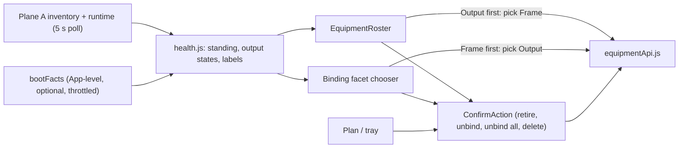
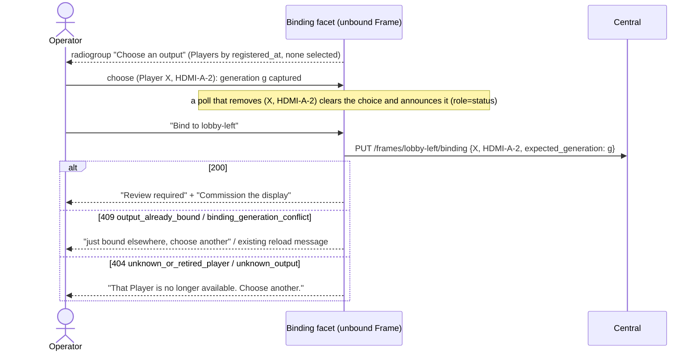
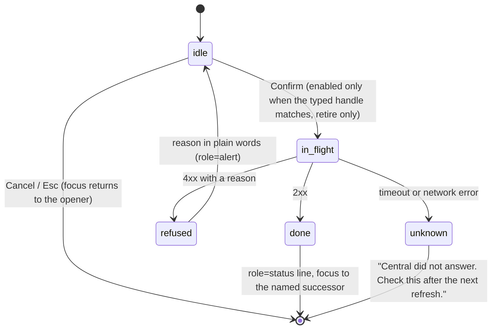

# Operator Console Pass 2, Slice 2: Safe Onboarding

**Date:** 2026-09-28 · **Status:** design-gate artifact, awaiting owner approval.
**Builds on:** [the approved console design](operator-console-ux-design.md) (R1–R4, journey J1) and [slice 1](operator-console-ux-pass2.md) (`health.js` is the one classifier; the write fence; the 5 s poll).
**Layer:** a console increment plus two small backend changes that only refuse more (Questions 2 and 5): one shared frame-id rule, and a retire precondition. No migration. One new console read of an existing admin route (`GET /v1/operator/netboot`).
**Size:** 7 beads (5 console, 1 backend, 1 docs), about 750 net production lines and 600 test lines.

## 1. The problem in plain words

| What the operator meets | Evidence | Why it is unsafe |
|---|---|---|
| "Bind pending display" binds the **first** Output of any pending Player | `BindingFacet.jsx:91-100,108` | The console picks the device, not the operator. |
| A Player counts as pending only while **no** Output is bound | `registry.py:388-389`; `BindingFacet.jsx:93-97` | The second Output of a two-output Player ([requirements](requirements.md#installation-model), `contracts/enrollment.py:24`) can never be bound from the console. |
| Pending Players show an opaque `p-<32 hex>`, and bound Players are listed nowhere | `EquipmentRail.jsx:79` | Nothing ties an entry to a physical box. |
| Selecting a Player prints "Pending player selected" | `App.jsx` (the `selectedPlayer` line) | The selection drives nothing. |
| Retire, Delete frame and Unbind are one click | `EquipmentRail.jsx:84-90`, `Plan.jsx` (the delete button), `UnplacedTray.jsx:83-89`, `BindingFacet.jsx:168-170` | Retire is permanent: a retired serial is refused at enrollment (`registry.py:124-125`). |
| The Retire label carries the 34-character id | `EquipmentRail.jsx:89` | It overflows the rail at 390–525 px. |
| New frames are named `frame-<time>-<random>` | `framesApi.js:41` | Every later screen shows that machine id. |

## 2. Verified facts this design rests on

1. **`players.device_id` joins `devices.device_id`: confirmed.**
   - Both sides compute `equipment_device_id("pi", serial)`: at the netboot seam through `catalog.py:46,134-137`, and on the Player at both boot tiers (`appliance/bootstrap.py:273-287`, `player/service.py:237-244`).
   - Central already makes this join for base health (`app.py:442-454`).
   - A Pi that never netbooted has no `devices` row.
2. **The bind route takes an explicit Output: confirmed.**
   - The request carries `player_id`, `output_id` and `expected_generation` (`app.py:63-66`).
   - An Output can be bound once; a Player can have several bound Outputs (`001_registry.sql:40`).
   - Binding a bound Frame silently replaces its binding (`registry.py:209-215`). This slice never offers that.
3. **The usable frame-id rule is narrower than the create rule.**
   - `FrameCreate.id` accepts `:` and up to 128 characters (`contracts/models.py:9`, `registry.py:44`).
   - A Scene reaches a frame only through `Target`, which allows no `:` and at most 96 characters (`runtime.py:18,44`).
4. **Production Players report no resolution.**
   - Discovery reports every HDMI connector with `width_px=0, height_px=0` and a `connected` flag (`player/output_discovery.py:59-60`), and those reports are what enrollment carries (`player/service.py:1062,1082`).
   - The Player renders only connected outputs (`service.py:1071`).
   - *Refutes the requested resolution-mismatch cue:* it would compare 0×0 with every frame. Only the fixtures carry 1920×1080 (`tests/test_registry.py:39`).
5. **Stale Output rows survive re-enrollment: confirmed.**
   - Enrollment marks every Output of the Player `connected=false`, then upserts only the reported ones (`registry.py:135-140`).
   - An Output that is no longer reported (for example after a discovery fault reports none, `output_discovery.py:63-64`) stays as a row with `connected=false`. It is indistinguishable from a connector with no display attached.
6. **Retire leaves the netboot device row active.**
   - Nothing in Central writes `devices.retired_at`.
   - The frontier is the newest `known_good_tag` of any device whose `retired_at` is null (`catalog.py:268,418`; `infra/catalog_records.py:283-287`).
   - A retired Pi's last healthy tag therefore keeps steering every unpinned Pi. That includes a Pi retired because it was compromised.
   - `runbook.md:240,261` implies otherwise.
7. **Unbinding one Output re-plans the whole Player.**
   - A plan whose bindings differ from the configuration is dropped (`coordination.py:535,764`).
   - So the Frame on the sibling Output is re-planned too.
8. **The identity cues are claims, not proof.**
   - The Player asserts its `device_id` at enrollment. The signature proves the key, not the serial (`registry.py:103-129`).
   - `devices.serial` is whatever the unauthenticated netboot request sent (`catalog_records.py:262-270`).

## 3. One picture, three rules

1. **The operator chooses; the console never picks.** Nothing is pre-selected, even when there is only one option.
2. **Every binding write targets a Frame.** The Output-first path pre-fills the Frame's binding `PUT` (Question 6). Retire is the one Player verb.
3. **The captured target is the target.** A write carries what the operator saw when they chose. The live snapshot is never read at click time.

## 4. Equipment standing (`health.js` stays the only classifier)

`health.js` gains:
- `playerStanding`, `outputStates` and `bindableOutputs`.
- `outputLabel(snapshot, bootFacts, playerId, outputId)`: the one Output wording, used by the chooser, the roster and the dialogs.
- `playerHandle`.
- `bootOutcomeLabel`.
- `displayDetected(output)`: the connected check now inline at `health.js:167`, shared by frame health and the chooser.

The pending predicate duplicated in `BindingFacet.jsx:93-97` and `EquipmentRail.jsx:55-57` moves there. `join.js` gains `frameForOutput`, the reverse of `boundOutput`, and `liveRunsFor(runtime, frameId)`, which uses the delete guard's predicate (phase `body`/`outro`, `app.py:600-602`).

| Domain | State | Condition (first match) | Label |
|---|---|---|---|
| Player | `retired` | `retired_at` set | "Retired N ago" |
| Player | `pending` | no Output bound (the store's queue) | "New · enrolled N ago" + slice 1 liveness |
| Player | `in-service` | at least one Output bound | "In service · K of M outputs free" + liveness |
| Output | `retired` | its Player is retired | "Retired with its Player" (no actions) |
| Output | `bound` | `frameForOutput` finds a Frame | "Shows frame lobby-left" |
| Output | `no-display` | not bound, and `displayDetected` is false | "No display detected at last Player start" |
| Output | `free` | otherwise | "Free" |

**`bindableOutputs` = `free` only.** `no-display` Outputs are excluded (fact 5), because a stale row cannot be told apart from an empty connector, and the Player would not render to it anyway. Cost: a panel that was off when the Player started cannot be bound until the Player restarts with it on (the runbook says to power the panel first). A Player with no Outputs reads "No outputs reported".

**Handle.** It is the last 6 characters of the last known serial for this `device_id`, or else of the Player id. It is captured when a dialog opens and never changes while the dialog is open. Without boot facts the handle is a hash suffix and proves nothing physical. Even with them, the serial is a claim (fact 8).

```mermaid
stateDiagram-v2
  [*] --> pending: enrolls
  pending --> in_service: an Output is bound
  in_service --> pending: last Output unbound
  pending --> retired: Retire (typed handle; refused 409 if any Output is bound)
  retired --> [*]: re-enrollment refused (403)
```

## 5. Boot facts and the Equipment roster

**Boot facts: one App-level read (`bootFacts.js`).** App reads it once and passes it to both the roster and the chooser.
- It reads `/v1/operator/netboot` through `apiWrite(path, {method: "GET"})` (the GET precedent at `SceneAuthoring.jsx:404`; the fence does not move).
- It re-reads on a new snapshot when 30 s have passed or the set of `device_id`s changed. It adds no timer, so it inherits the poller's hidden-tab pause. Reads are single-flight and the newest wins.
- Any non-2xx, including 503 and 401, sets "Boot records unavailable" and keeps the last known serials. It never touches the session.
- **Designed twice:** (A, chosen) an optional side read. (B, rejected) a fourth GET in the atomic snapshot, where a 503 would fail everything. (C, rejected) a server join, which would make the registry read the content catalog's table.

**Roster (`EquipmentRoster.jsx` replaces `EquipmentRail.jsx`).**
- **Groups:**
  - "Pending players" and "Bound players" are open by default; "Retired players" is collapsed.
  - The open/closed state lives in Plane B and survives polls.
  - Players are ordered by `registered_at`, then id. Outputs are ordered by `output_id`.
- **Card:** a disclosure button whose accessible name is **exactly the Player id** (frozen, so the existing tests hold).
  - The serial, the boot outcome ("last netboot healthy on v1.4.2"; "rolled back from v1.5.0" when `failed_tag` is set; "No netboot record" when there is no device row) and each Output's label are listed below it.
  - "Last heard" is tied to the card with `aria-describedby`, not put in the name.
- **Actions:**
  - A pending Player offers **Retire…**.
  - An in-service Player offers **Unbind all outputs…**; to replace a Pi, you unbind it and bind the new one.
  - A `free` Output offers "Bind to a frame…": a labelled `<select>` of unbound Frames and a Bind button. The chosen Frame's generation is captured on selection. On success, `navigateToFrame` (`App.jsx:112-119`) runs once the refresh has landed, so it opens the facet for that Frame's fresh health.
- **Empty states:**
  - No Players: "No Players yet. Power on one Pi on this network; it appears under Pending."
  - No unbound Frames: "No unbound frames. Draw one on the plan first."
- **390 px:** the roster sits below the plan and tray. Ids wrap, and actions wrap under the facts.
- **Elsewhere in App and Guidance:** "Pending player selected" is deleted. `Guidance.jsx:39-43` now reads "Draw a frame, power on one Pi, bind the frame to one of its outputs, then commission the display."

## 6. Explicit binding (Frame first)

- **Selection:** it is keyed on `(player_id, output_id)`.
- **Option text:** `outputLabel` (handle · output id · "Free"). "Last heard" is attached with `aria-describedby`.
- **Empty chooser:** "No free outputs with a detected display. Power on a Pi with its panel attached; it appears under Pending."
- **One write module:** `bind`, `unbind` and `retirePlayer`, together with their message tables, move to a new `equipmentApi.js`. A thrown request (a timeout) maps to `{outcome: "unknown"}`.
- **Identify this screen** (flash) needs a Central→Player message. **Deferred.** Until then, the runbook says to **power on and bind one Pi at a time**.

## 7. One confirmation pattern (`ConfirmAction.jsx`)

It is a native `<dialog>` opened with `showModal()`. **It captures everything when it opens:**
- the target;
- the generation;
- the bound Outputs and Frames;
- the live Runs (`liveRunsFor`);
- the sibling Output's Frame;
- the handle.

Each surface owns one dialog at its top level, keyed by target and never inside a list row, so a poll that regroups a Player cannot unmount it.

- **In flight:** Esc and Cancel are blocked; the dialog's `cancel` event is prevented.
- **Already done:** 404 `not_bound` or `unknown_frame` reads "Already done."
- **Write and refresh are separate:** `useMutate` (`useMutate.js:24-25`) returns the write result even when the post-write refresh fails. That failure shows only as slice 1's "last refresh failed", never as a refusal.
- **Where focus goes after "done":** retire → the "Retired players" heading; delete → the plan region; unbind → the Frame's output chooser.

| Verb | Offered on | Says will happen | Says cannot be undone | Deliberate act |
|---|---|---|---|---|
| Retire player | Pending Players only | Its Outputs leave the bindable set | "No undo, even after re-imaging: the id comes from the serial (`registry.py:114,124`). To replace a Pi, unbind it instead. Its netboot record still counts toward the release frontier." | Type the handle (case-insensitive; `autocapitalize`, `autocorrect` and `spellcheck` off) |
| Unbind / Unbind all | Bound Frame; in-service card | Each listed Frame stops being served. Its calibration is kept but marked invalid, so it must be re-commissioned (`registry.py:239`). Its live Runs are listed. The sibling Output's Frame is re-planned (fact 7) | Nothing; you can bind it again | Plain Confirm naming each Frame |
| Delete frame | Plan and tray | Its placement, profile and calibration are removed. Live Runs are listed: the delete will be refused until they finish | Recreating the id starts uncommissioned | Plain Confirm naming the Frame |

**Retire race, closed structurally.** The route refuses with 409 `player_bound` when the Player has any bound Output (Question 5). It checks inside retire's transaction, under the Player row lock that bind also takes first (`registry.py:197-199`). A bind and a retire therefore serialize, and the dialog's "no bound outputs" can no longer be stale.
- **What changes:** `registry.retire(player_id, *, refuse_if_bound=False)`; `app.py` passes `True`.
- **What does not:** store callers keep retire-drops-bindings, which the replacement test exercises (`tests/test_registry.py:216-230`) and which decision 0006 calls a disposable box.

## 8. Readable frame ids (one rule, in `contracts`)

- **`contracts/models.py`** gains `TARGET_ID_PATTERN = r"[A-Za-z0-9][A-Za-z0-9_.-]{0,95}"` and `TargetIdentifier`.
  - `runtime.Target` is composed from it.
  - `FrameCreate.id` becomes a `TargetIdentifier` (Question 2: it only refuses more).
  - Frames already stored, and the path parameters, stay `Identifier`, so any existing odd id is still readable and deletable.
- **Console:** `framesApi.js` exports `FRAME_ID_PATTERN`, and a pytest pins it equal to `^` + `TARGET_ID_PATTERN` + `$`.
- **The form:** it gains a required "Frame id" field, checked as you type: "letters, digits, `-`, `_` or `.`; up to 96; cannot be changed later". `createFrame(id, placement, profile)` stops generating ids.
  - A 409 `frame_exists` reads "A frame named lobby-left already exists."
- **Display names** (spaces, renames) need a new field. **Deferred** (Question 1).

## 9. What can go wrong

| Failure | What the operator sees | Guarantee |
|---|---|---|
| `/netboot` 503, 5xx, 401 or timeout | "Boot records unavailable"; cached serials kept; no logout | Test |
| Pi never netbooted | "No netboot record"; the handle is a hash suffix | Test |
| Two Pis are indistinguishable, or a serial is spoofed | Enrolment order and the handle only; the runbook says one Pi at a time | **None** (deferred flash; the serial is a claim, fact 8) |
| Two operators bind the same Output | "Just bound elsewhere" (`registry.py:224`) | Structural (unique key) + test |
| The chosen option disappears on a poll | The choice is cleared and announced | Test |
| The Frame changes after the choice or after the dialog opens | Generation conflict (the captured `g`) | Structural (fence) + test |
| Retire races a bind | 409 `player_bound`, shown as refused | Structural (Player row lock) + pytest |
| Retire is confirmed twice | The second is a no-op 200 (`registry.py:295-296`) | Structural |
| The write succeeds but the refresh fails | "Done" + "last refresh failed" | Test |
| The write times out | "Outcome unknown; check after refresh" | Test |
| Stale or empty-connector Output | Shown as `no-display`; never offered | Test |
| An Output of a retired Player | Never offered | Test |
| A frame id with `:`, or longer than 96 | Refused in the form and by `FrameCreate` | Construction-time (shared type) + test |
| Retired Pi's device row | Still counts toward the frontier, and still netboots | **None** (Question 4) |
| A panel is replaced with a different size or resolution | The profile cannot be edited; delete and recreate with the same id | None (Question 7) |

## 10. Tracer bullet

Bead 1. A two-output Player has HDMI-A-1 bound. The operator opens an unbound Frame's Binding facet and chooses **HDMI-A-2** (nothing is pre-selected), which captures the generation. They then bind. The stored binding is exactly that pair. This proves per-output standing in `health.js`, the explicit Output on the wire, captured generation, and one write module. **Not covered:** the roster, boot facts, the dialogs, frame ids, and the backend changes.

## 11. Beads, files and tests (each bead lands green; tests whose text breaks move with the change)

| Bead | Files | Tests in the bead |
|---|---|---|
| **1 Standing + chooser** (tracer) | `health.js`, `join.js`, **new** `equipmentApi.js`, `BindingFacet.jsx`, `EquipmentRail.jsx` (imports only) | Replace "Bind pending display" at `test_operator_binding_browser.py:78,120,186,199` and `test_operator_health_browser.py:288`. **Replace the vacuous `:137`** (disabled button) with "the retired Player's Output is not an option". Stabilize `:175-203` with `page.clock` paused: choose, change the server state, click. **New:** the second Output is bindable; the chosen Output is stored; Bind is disabled until a choice is made; a vanished choice is announced; `no-display` and retired Outputs are excluded. |
| **2 Backend rules** (Python) | `contracts/models.py` (`TARGET_ID_PATTERN`, `TargetIdentifier`); `runtime.py:18` composes it; `registry.py` (`FrameCreate.id`, `retire(…, refuse_if_bound)`); `app.py` retire route | **pytest:** `FrameCreate` refuses `a:b` and 97 characters; `runtime.Target` accepts exactly `frame:` + the same ids; the route returns 409 `player_bound` for a bound Player and leaves it unretired; a pending Player still retires; `registry.retire` still drops bindings by default. |
| **3 ConfirmAction** | **new** `ConfirmAction.jsx`; `useMutate.js` (the write result is independent of the refresh); `BindingFacet.jsx` (Unbind); `Plan.jsx`, `UnplacedTray.jsx` (Delete); `EquipmentRail.jsx` (Retire, pending only); `index.css` | Add the confirm step at `test_operator_wall_browser.py:428,440,456` (refusals now show inside the dialog, which sits in the plan region) and the typed step at `test_operator_binding_browser.py:125`. **New:** typed gate; Esc blocked in flight; focus successor; "Already done"; outcome unknown (`page.route` abort); refresh failure is not a refusal; unbind stale generation. |
| **4 Boot facts** | **new** `bootFacts.js`; `App.jsx` (one read, passed down); `health.js` (`bootOutcomeLabel`, handle) | Seed a `devices` row by SQL (as `test_netboot_e2e_wire.py:206-208`): the serial shows in the chooser. A `page.route` 503 → unavailable with serials kept; 401 → no logout; no row → "No netboot record". |
| **5 Roster** | **new** `EquipmentRoster.jsx` (replaces `EquipmentRail.jsx`); `App.jsx`; `Guidance.jsx:39-43`; `index.css` | `test_operator_binding_browser.py:57,69,82,129,131` hold unchanged (frozen name). **New:** two Outputs with states; Output-first bind opens the Frame via `navigateToFrame`; roster bind stale generation; "Unbind all" lists Frames and Runs; in-service offers no Retire; a dialog survives a regrouping poll; empty states; no sideways scroll at 390 px. |
| **6 Frame ids** | `framesApi.js`, `Plan.jsx` | `test_operator_wall_browser.py:285` and `:319` fill the id and assert it. **New:** `lobby:left` is refused with no request; a duplicate shows a message. **pytest:** `FRAME_ID_PATTERN` equals the contracts pattern. |
| **7 Docs** | `docs/runbook.md`: onboarding (one Pi at a time; power the panel first; replace = unbind + bind; delete and recreate for a new panel). Correct `:240,261` on retired devices. J1 note per Question 6; history line here | `check_docs.py` |

The `conftest.py` CHECKS keys are unchanged, because no test is renamed.

**Mutation probes (each must turn the named test red).**

| Break this | Test that fails |
|---|---|
| `bindableOutputs` filters on the Player's `is_bound` again | Second Output bindable |
| Pre-select the first option | Bind disabled until a choice |
| Read the generation from the live snapshot at click time (facet, roster, unbind dialog) | The three stale-generation tests |
| Keep a vanished choice | Vanished-choice test |
| Include `no-display` or retired Outputs | Exclusion tests |
| Drop the `refuse_if_bound` check, or default it `True` | Route 409 pytest; store replacement pytest |
| Enable Confirm without the typed match | Typed-gate test |
| Let `useMutate` throw on a refresh failure | Refresh-failure test |
| Move the dialog into the list row | Regrouping-poll test |
| A `/netboot` failure clears the token or the serial cache | 401 test; 503 test |
| Join boot facts on `player.id` | Serial-shown test |
| Allow `:` in either pattern | Colon tests and the pytest |

## 12. Costs, deferrals and questions

- **Costs:**
  - **Clicks and typing.** Binding takes one more click, and retiring requires typing.
  - **Panel before Pi.** An undetected panel needs a Player restart before its Output can be bound.
  - **Stale boot facts.** They can lag by up to 30 s.
  - **Two backend refusals.** Both changes only refuse more.
  - **Unbinding every Output is the Pi-replacement path.** A bound Pi can no longer be retired in one step.
- **Deferred:**
  - Identify-this-screen.
  - Rebinding a bound Frame.
  - Bulk onboarding.
  - Display names.
  - An editable profile.
  - Retiring the netboot device row.
- **Question 1:** should Frames get a display name separate from the id? That needs a new field and a migration. Build proceeds on the default: no; readable ids only.
- **Question 2:** should `FrameCreate.id` share the Scene-target rule, defined once in `contracts`? Build proceeds on the default: yes (Bead 2).
- **Question 3:** should retire require typing the handle, rather than the word "retire"? Build proceeds on the default: the handle.
- **Question 4 (prominent):** should retiring a Player also retire its netboot device row? Today a retired, possibly compromised, Pi's last healthy tag keeps setting the release frontier for every unpinned Pi, and its serial still netboots. That would be a backend write. Build proceeds on the default: not in this slice. The runbook will state it truthfully.
- **Question 5:** should the retire route add a backward-compatible precondition that refuses (409) when the Player has any bound Output? Build proceeds on the default: yes (Bead 2; pytest plus mutation probe).
- **Question 6:** R1 says Players and Outputs are never acted on directly. Should the Output-first bind entry be accepted as an R1-conformant pre-fill (the write still targets the Frame), recorded as a J1 note? Build proceeds on the default: yes.
- **Question 7:** a replaced panel with a new size or resolution needs an editable Frame profile, and `FramePlacement` has none (`registry.py:60-65`). Should that become a new write? Build proceeds on the default: deferred; the runbook documents deleting the Frame and recreating it with the same id.

## History

- 2026-09-28: first draft, written after two console audits. The `device_id` join and the explicit-Output bind were confirmed.
- 2026-09-28, review round 1: two adversarial reviews failed the draft, and the design was changed in response.
  - **Retire:** only unbound Players can be retired, a route precondition closes the race, and the copy is truthful. In-service Players get "Unbind all" instead.
  - **Frame ids:** one rule, defined in `contracts`.
  - **Dialogs:** each captures its target and generation, has explicit states (including outcome unknown), and keeps the write result separate from the refresh. Only retire requires typing.
  - **Roster and chooser:** stable ordering, shared boot facts and labels, `no-display` and retired Outputs excluded, empty states added.
  - **Refuted, with evidence:** the resolution-mismatch cue, because Players report 0×0 (§2.4).
  - **Confirmed:** stale Output rows survive re-enrollment (§2.5).
