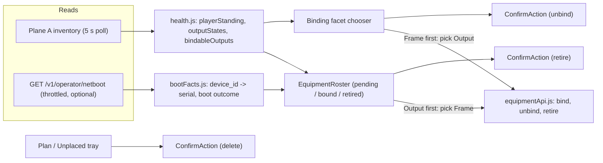
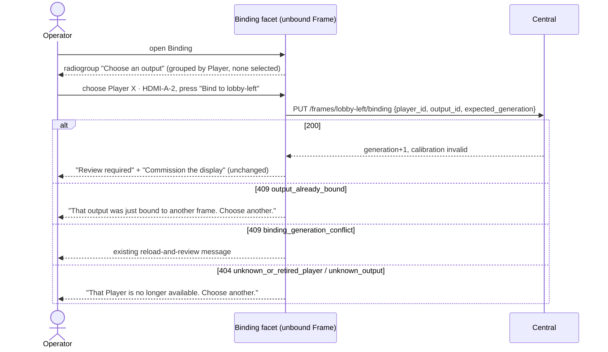

# Operator Console Pass 2, Slice 2: Safe Onboarding

**Date:** 2026-09-28 · **Status:** design-gate artifact, awaiting owner approval.
**Builds on:** [the approved console design](operator-console-ux-design.md) (R1–R4, journey J1) and [slice 1](operator-console-ux-pass2.md) (`health.js` is the one classifier; the write fence; the 5 s poll).
**Layer:** console only. **No backend change, no migration.** One new read of an existing admin route (`GET /v1/operator/netboot`).
**Size:** 6 beads (5 code, 1 docs), about 650 net production lines and 480 test lines.

## 1. The problem in plain words

| What the operator meets | Evidence | Why it is unsafe |
|---|---|---|
| "Bind pending display" binds the **first** Output of any pending Player | `BindingFacet.jsx:91-100,108` | The console picks the device. With two new Pis, the operator cannot choose which one. |
| A Player is "pending" only while **no** Output is bound | `registry.py:388-389` (`is_bound` per Player); `BindingFacet.jsx:93-97` | A Player's second Output can never be bound from the console, although a Player has one or two Outputs ([requirements](requirements.md#installation-model), `contracts/enrollment.py:24`). |
| Pending Players show an opaque `p-<32 hex>` | `EquipmentRail.jsx:79` | Nothing ties the entry to a physical box. Bound Players are listed nowhere. |
| Selecting a Player prints "Pending player selected" | `App.jsx:261-266` | It drives nothing. |
| Retire, Delete frame and Unbind are one click | `EquipmentRail.jsx:84-90`, `Plan.jsx:449-451`, `UnplacedTray.jsx:83-89`, `BindingFacet.jsx:168-170` | Retire is permanent: a retired serial is refused at enrollment (`registry.py:124-125`, 403 `retired_player`). Delete drops commissioning. |
| The Retire button overflows the rail at 390–525 px | its label carries the 34-character id (`EquipmentRail.jsx:89`) | The action is clipped on a phone. |
| New frames are named `frame-<time>-<random>` | `framesApi.js:41` | Every later screen names the frame by that id. |

## 2. Verified facts this design rests on

1. **`players.device_id` joins `devices.device_id`: CONFIRMED.** Both are `equipment_device_id("pi", serial)`: the netboot seam derives it with `device_id_for_serial` (`content_catalog/catalog.py:46,134-137`); the Player derives it the same way at both boot tiers (`appliance/bootstrap.py:273-287`, `player/service.py:237-244`, via `contracts/equipment.py:21-32`). Central already performs this exact join for base health (`app.py:442-454`), and `tests/test_netboot_e2e_wire.py:341-343` builds players from `device_id_for_serial`. **Limits:** a Pi that never netbooted (flashed/D0) has no `devices` row; `devices.serial` is the raw serial, `players.device_id` is its hash, so the serial is only reachable through the join.
2. **The bind route takes an explicit Output: CONFIRMED.** `PUT /v1/operator/frames/{id}/binding` carries `player_id`, `output_id`, `expected_generation` (`app.py:63-66,606-613`). The store checks the pair exists (`registry.py:206-208`) and the schema makes each Output bindable once, not each Player (`001_registry.sql:40` `UNIQUE(player_id, output_id)`). **A bound Player's second Output is bindable today; only the console forbids it.**
3. **Bind on a bound Frame silently replaces its binding** (`registry.py:209-215`). This slice never offers that: both entry points list only unbound Frames, and the generation fence (`registry.py:212-213`) refuses a Frame that became bound meanwhile.
4. **The usable frame id rule is narrower than the create rule.** `FrameCreate.id` is an `Identifier` (`^[A-Za-z0-9][A-Za-z0-9_.:-]{0,127}$`, `contracts/models.py:9`), but a Scene reaches a frame through `Target` (`^(frame|actuator):[A-Za-z0-9][A-Za-z0-9_.-]{0,95}$`, `runtime.py:18,44`). An id with `:` or longer than 96 characters can be created but **can never be a Scene participant**. The console uses the intersection: `^[A-Za-z0-9][A-Za-z0-9_.-]{0,95}$`. Duplicates are refused with 409 `frame_exists` (`registry.py:174-175`).
5. **`/v1/operator/netboot` is admin-only and answers 503 `content_unavailable`** when content services are absent (`app.py:533-536,575-580`). It lists devices with `retired_at IS NULL` (`infra/catalog_records.py:277`), and **nothing in Central writes `devices.retired_at`**: retiring a Player leaves its device row active (Question 4).

## 3. One picture, three rules

1. **The operator chooses; the console never picks.** No Output is pre-selected, even when only one is free.
2. **Every write still targets a Frame (R1).** The Output-first path only pre-fills the chooser; the write is the Frame's binding `PUT`. Retire remains the one Player verb (R1 note).
3. **Irreversible means one dialog, named, and deliberate.** One `ConfirmAction` component serves all three verbs.

## 4. Equipment standing (extends `health.js`; no second classifier)

`health.js` gains `playerStanding(snapshot, playerId)`, `outputStates(snapshot, playerId)` and `bindableOutputs(snapshot)`. The per-Player "pending" predicate now duplicated in `BindingFacet.jsx:93-97` and `EquipmentRail.jsx:55-57` moves there. `join.js` gains `frameForOutput(snapshot, playerId, outputId)`, the reverse of `boundOutput`, so the compound-key rule keeps one home.

| Domain | State | Condition (first match) | Label |
|---|---|---|---|
| Player | `retired` | `retired_at` set | "Retired N ago" |
| Player | `pending` | no Output bound (the store's pending queue) | "New · Enrolled N ago" + slice 1 liveness |
| Player | `in-service` | at least one Output bound | "In service · K of M outputs free" + liveness |
| Output | `bound` | `frameForOutput` finds a Frame | "Shows frame lobby-left" |
| Output | `free` | not bound, Player not retired | "Free" |
| Output (flag) | `display-not-detected` | `observation.connected` is not true | "No display detected at Player start" |

`bindableOutputs` = every `free` Output. A `display-not-detected` Output stays bindable with its warning (detection is refreshed only at Player start, slice 1 §8), and after binding its frame reads slice 1's `display-not-detected` alarm. A Player with no Outputs reads "No outputs reported" and offers no bind.

```mermaid
stateDiagram-v2
  [*] --> pending: enrolls
  pending --> in_service: an Output is bound
  in_service --> pending: last Output unbound
  pending --> retired: Retire (typed)
  in_service --> retired: Retire (typed; its Frames become unbound)
  retired --> [*]: re-enrollment refused (403)
  state Output {
    [*] --> free
    free --> bound: bind (Frame chosen)
    bound --> free: unbind (confirmed) or Player retired
  }
```

## 5. The Equipment roster (replaces `EquipmentRail.jsx`)

- **Groups:** Pending (open by default), Bound, Retired (collapsed). Group names stay "Pending players" and "Retired players"; "Bound players" is new. Pending is newest-enrolled first, so the Pi just powered on is on top.
- **Player card:** a disclosure button (`aria-expanded`) whose accessible name includes the Player id. Heading = serial when boot facts know it, else the id. Body: each Output with its state row, the boot facts line, and actions. Ids wrap (`overflow-wrap: anywhere`); actions wrap under the facts, so nothing overflows at 390 px.
- **Boot facts line:** "Serial 10000000a1b2c3d4 · last netboot healthy on v1.4.2" (plus "rolled back from v1.5.0" when `failed_tag` is set). A Player with no device row reads "No netboot record (flashed, or not netbooted yet)". If the read failed: "Boot records unavailable", and the roster is otherwise unchanged.
- **Output-first bind:** a free Output offers "Bind to a frame…": a labelled `<select>` of unbound Frames and a "Bind" button. With no unbound Frames: "No unbound frames — draw one on the plan first." On success, App navigates to that Frame's Commissioning facet (J1's next step) through the same `selectFrame(id, facet)` path the strip uses.
- **Retire** is offered on pending **and in-service** Players (the replacement journey needs it for a dead, bound Pi). Its dialog lists the Frames that lose their Player.
- **"Pending player selected"** (`App.jsx:262-266`) is deleted; selection now expands the card.

**Boot facts read: `bootFacts.js` (hook `useBootFacts`).** It reads `/v1/operator/netboot` through `apiWrite(path, {method: "GET"})`, the existing GET precedent (`SceneAuthoring.jsx:404`), which does not move the write fence. It re-reads when a new snapshot arrives **and** either 30 s have passed or the set of non-retired `device_id`s changed. It adds no timer, so it inherits the poller's hidden-tab pause. Reads are single-flight and newest-wins. No console write changes netboot state, so no fence is needed. Any non-2xx, including 401, marks it unavailable and **never touches the session** (`useSnapshot` alone owns auth). The browser clock is used only for the 30 s throttle, never for a displayed age.

**Designed twice.**
- **A (chosen): an optional side read joined in the console.** The atomic snapshot keeps its three GETs, and a 503 degrades one line. *Gives up:* boot facts can be up to 30 s staler than the inventory, and the join (`device_id`) lives in JavaScript.
- **B: a fourth GET inside the atomic snapshot.** *Rejected:* every 5 s per tab, and a 503 would fail the whole snapshot unless snapshots became partial, which slice 1's atomicity rules out.
- **C: serial and boot outcome on `PlayerInventory` (server join).** *Rejected:* the Installation registry would read the content catalog's `devices` table, crossing a boundary, and it is a backend change.

## 6. Explicit binding

- **Option text:** "Serial … · HDMI-A-2 · 1920×1080 at start · Last heard 3 s ago", plus the not-detected warning when it applies. `expected_generation` is the value the operator saw when the facet rendered.
- **One write module.** `bind`, `unbind`, `retirePlayer` and their message tables move from `BindingFacet.jsx:21-57` and `EquipmentRail.jsx:21-23` into a new `equipmentApi.js` (the sibling of `framesApi.js`). Both entry points share `bindMessage(result)`.
- **Identify this screen** (flash an Output) needs a new Central→Player message; no such message exists. **Deferred.** Until then the cues are the serial, newest-enrolled ordering, and the resolution at start.

## 7. One confirmation pattern (`ConfirmAction.jsx`)

It is a native `<dialog>` opened with `showModal()`, which gives modality and Esc-to-cancel. Focus goes to the typing field, or to Cancel when there is nothing to type, and **returns to the opener** explicitly on close. Its props are: verb, the thing's name, *what will happen*, *what cannot be undone*, an optional `typeToConfirm` string, and an `action` that returns the verb's `{ok, message}`.
- **While in flight:** the buttons are disabled ("Retiring…"). A refusal (for example 409 `frame_bound`, 409 `frame_in_use`, or a generation conflict) shows inside the dialog as `role="alert"`, and the dialog stays open.
- **Ownership:** each surface owns **one** dialog at its top level, keyed by target id and never inside a list row. A poll that moves a Player from Pending to Bound therefore cannot unmount an open dialog.
- **Frozen at open:** the dialog shows what the operator saw when it opened. The server's fences (generation, the frame guards, idempotent retire at `registry.py:295-296`) decide the outcome.

| Verb | Names | What happens | Cannot be undone | Deliberate act |
|---|---|---|---|---|
| Retire player | serial or id | Its Outputs leave service; the listed Frames become unbound and need commissioning | This Pi can never enroll again (`registry.py:124-125`) | Type the Player's short handle (last 6 characters of serial or id) |
| Delete frame | frame id | Its placement and commissioning are removed | Recreating the id starts uncommissioned | Type the frame id |
| Unbind | frame, Player and Output | The Output stops serving the frame | Commissioning must be redone (`registry.py:239`) | Press "Unbind lobby-left" (the binding can be re-made, so there is no typing) |

## 8. Readable frame ids

- **The form:** the create form (`Plan.jsx:391-440`) gains a required "Frame id" field, validated as you type against §2.4. "Use letters, digits, `-`, `_` or `.`; up to 96; it cannot be changed later." `createFrame(id, placement, profile)` stops generating ids (`framesApi.js:41`).
- **Errors:** 409 `frame_exists` reads "A frame named lobby-left already exists."
- **The rule's home:** `FRAME_ID_PATTERN` lives in `framesApi.js`, and a pytest keeps it equal to the backend's effective rule (§11).
- **Display names** (spaces, renames) need a backend field. **Deferred** (Question 1).

## 9. What can go wrong

| Failure | What the operator sees | Guarantee |
|---|---|---|
| `/netboot` 503 (no content services), 5xx or timeout | "Boot records unavailable"; the roster and binding still work | Test |
| `/netboot` 401 | Same line; no logout (only the snapshot owns auth) | Test |
| Pi never netbooted (flashed/D0) | "No netboot record"; the id is the heading | Test |
| Two operators bind the same Output | The second gets "just bound to another frame" (`registry.py:224`) | Structural (unique key) + test |
| The Frame is bound by someone else while the chooser is open | Generation conflict message | Structural (fence) + existing test |
| A Player is retired while it is offered | "No longer available" (404) | Test |
| A poll moves the Player to another group with a dialog open | The dialog survives (owned by the surface) | Test |
| Delete is confirmed but the Frame became bound | 409 `frame_bound` wording inside the dialog | Existing test, re-pointed |
| Retire is confirmed twice (two tabs) | The second is a no-op 200 (`registry.py:295-296`) | Structural |
| Output bound with no display detected | Allowed, with a warning; the frame then reads "No display detected" | Test |
| A frame id with `:` or longer than 96 characters | Refused in the form, before any request | Test + drift pytest |
| The console id rule drifts from `runtime.Target` | The drift pytest fails | Test |
| Two new Pis look identical | Serial and enrolment order only; no flash | None (deferred) |
| A retired Pi's device row stays active | It still feeds the release frontier and GC keep-set | None (Question 4) |

## 10. Tracer bullet

Bead 1: a two-output Player with HDMI-A-1 already bound. The operator opens an unbound Frame's Binding facet, chooses **HDMI-A-2** (nothing pre-selected), and binds. The stored binding is exactly that pair. This proves per-output standing in `health.js`, the explicit Output on the wire, and the one write module. **Not covered:** the roster, boot facts, the dialogs, frame ids.

## 11. Beads, files and tests (each bead lands green; a test whose text breaks moves with the change)

| Bead | Files | Tests in the bead |
|---|---|---|
| **1 Standing + Frame-first chooser** (tracer) | `health.js` (+ `playerStanding`, `outputStates`, `bindableOutputs`); `join.js` (+ `frameForOutput`); **new** `equipmentApi.js` (bind/unbind/retire + messages moved); `BindingFacet.jsx` (radiogroup, no preselect); `EquipmentRail.jsx` (imports `retirePlayer`, pending predicate from `health.js`) | Re-point "Bind pending display" at `test_operator_binding_browser.py:78,120,186,199` and `test_operator_health_browser.py:253`. New: second Output bindable; the chosen Output is stored; Bind is disabled until a choice is made; `output_already_bound` message. |
| **2 ConfirmAction** | **new** `ConfirmAction.jsx`; `BindingFacet.jsx` (Unbind); `Plan.jsx` and `UnplacedTray.jsx` (Delete); `EquipmentRail.jsx` (Retire, pending only); `index.css` | Add the typed step at `test_operator_wall_browser.py:426,438,456` and `test_operator_binding_browser.py:125`. New: Confirm stays disabled until the text matches; Esc cancels with no request and focus returns; refusal shows inside the dialog; tray delete confirms. |
| **3 Roster** | `EquipmentRail.jsx` → **new** `EquipmentRoster.jsx` (groups, cards, Output-first bind, retire in-service); `App.jsx` (delete the selected-player line; roster bind → `selectFrame(id, "commissioning")`); `index.css` (card, 390 px) | `test_pending_player_appears_in_the_pending_rail` is kept (id in accessible name). New: a two-output Player shows both Outputs with their states; Output-first bind opens Commissioning; the retire dialog lists the Frames; the dialog survives a poll that regroups; 390 px has no sideways scroll with a card open. |
| **4 Boot facts** | **new** `bootFacts.js`; `EquipmentRoster.jsx` (facts line) | Seed a `devices` row via SQL (as `test_netboot_e2e_wire.py:206-208`): serial and outcome shown. `page.route` 503 → "unavailable" with the roster intact; 401 → no logout; no device row → "No netboot record". |
| **5 Frame ids** | `framesApi.js` (`FRAME_ID_PATTERN`, `createFrame(id, …)`); `Plan.jsx` (field, inline rule, `frame_exists` copy) | `test_drag_create_posts_frame_with_scaled_placement` fills the id and asserts it. New: `lobby:left` refused with no request; duplicate → message. **pytest** `tests/test_console_frame_id_rule.py`: the literal in `framesApi.js` accepts exactly the probe ids that both `FrameCreate` and a `frame:` `Contribution` accept. |
| **6 Docs** | `docs/runbook.md` console onboarding section; J1 note in the design doc (the Output-first entry is an R1-conformant pre-fill); history line here | `check_docs.py` |

The `conftest.py` CHECKS keys are unchanged, because no test is renamed.

**Mutation probes (each must turn the named test red).**

| Break this | Test that fails |
|---|---|
| `bindableOutputs` filters on the Player's `is_bound` again | Second Output bindable |
| Pre-select the first option | Bind disabled until a choice |
| Send the first free Output instead of the chosen one | Chosen Output is stored |
| Enable Confirm without the typed match | Typed-gate test |
| Move the dialog into the list row | Dialog survives a regrouping poll |
| Drop the explicit focus return | Esc/focus test |
| Let a `/netboot` failure throw, or clear the token | 503 test; 401 test |
| Join boot facts on `player.id` instead of `device_id` | Serial shown |
| Allow `:` in `FRAME_ID_PATTERN` | Colon test and drift pytest |
| Keep the generated id in `createFrame` | Create test (typed id asserted) |
| Omit the Frame list from the retire dialog | Retire-in-service test |

## 12. Costs, deferrals and questions

- **Costs:**
  - **One more click per bind, because nothing is pre-selected.**
  - **Typing to retire or delete.** It slows a deliberate operator, and that is the intent.
  - **Stale boot facts.** They can lag the inventory by 30 s, and there is one extra GET per 30 s per tab.
  - **A second copy of the id rule.** `FRAME_ID_PATTERN` duplicates a backend rule in JavaScript. It is pinned by a test, not generated.
  - **Retire on in-service Players.** Offering it (about +20 lines) widens the blast radius of one verb. The typed confirmation and the listed Frames are the mitigation.
- **Deferred:**
  - Identify-this-screen, which needs a Player protocol message.
  - Rebinding a bound Frame to another Output (unbind, then bind).
  - Bulk onboarding.
  - Frame display names and renames.
  - A pending-Player count in the attention strip.
- **Question 1:** should Frames get a display name separate from the id? That needs a backend field and a migration. *Default: no. Readable ids only, in this slice.*
- **Question 2:** should the backend narrow `FrameCreate.id` to the Target rule, so the API also refuses ids that can never be Scene targets? That is a write-path validation change. *Default: no backend change; the console enforces the rule.*
- **Question 3:** for retire, should the operator type the Player's short handle, or the word "retire"? *Default: the short handle, because it makes the operator read which Pi.*
- **Question 4:** should retiring a Player also retire its netboot `devices` row, which today stays active and keeps feeding the release frontier? That is a backend write. *Default: not in this slice; it is recorded here as a finding.*

## History

- 2026-09-28: first draft, written after two console audits. Every claim in §1–§2 was checked against the cited lines. The join and the explicit-Output bind were confirmed. The narrower Target id rule and the unretired device row are new findings.
