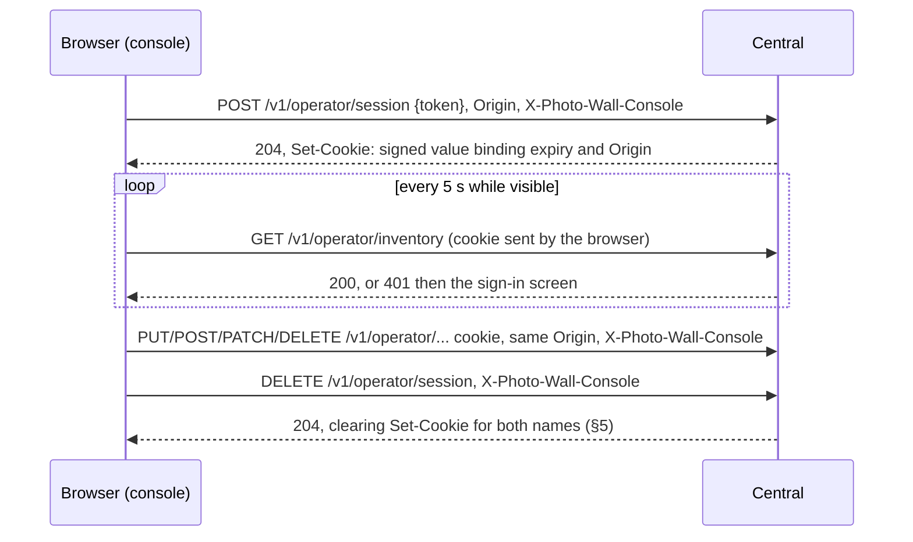
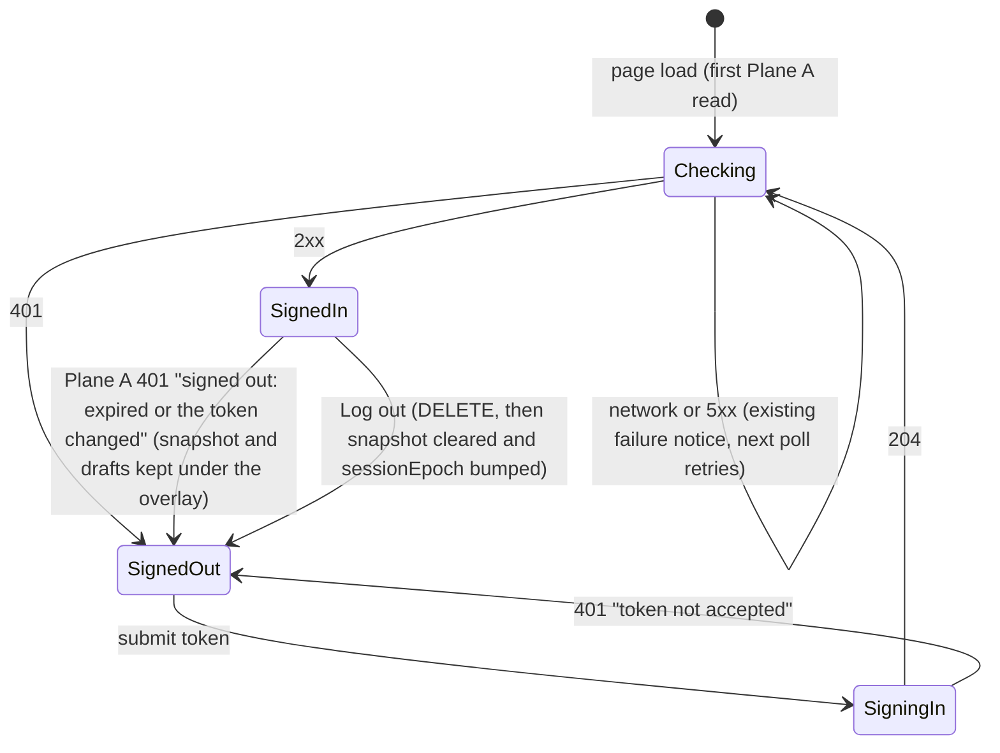

# Operator Console Pass 2, Pass A: Stay Signed In

**Date:** 2026-09-28 · **Status:** design-gate artifact, awaiting owner approval.
**Builds on:** [the approved console design](operator-console-ux-design.md) (D-c: one admin token, no roles; modes are organization, not permission) and [slice 1](operator-console-ux-pass2.md) (`session.js`, the write fence, the 5 s poll).
**Layer:** two operator routes, a wider admin check and a no-store rule on Central; the console's token form becomes a sign-in screen. No migration. Player, enrollment, media and netboot authentication do not change.
**Size:** 3 beads (1 backend, 1 console, 1 docs), about 330 net production lines and 520 test lines.

## 1. The problem in plain words

| Today | Evidence | Cost |
|---|---|---|
| The admin token lives in one JavaScript variable, never persisted | `session.js:16-24`; `App.jsx:141-150` | Every reload or new tab asks for the token again. |
| Every read and write sends the token as a bearer header | `useSnapshot.js:18-21`, `apiWrite.js:28` | The long-lived secret crosses the LAN every 5 s, in clear text over http, and any script in the page can read it. |
| Central accepts only the bearer header | `app.py:279-283` | A browser cannot keep a sign-in. |
| The bearer check compares `str` values | `app.py:282` | `Authorization: Bearer éé` raises `TypeError` in `secrets.compare_digest` (probe: "comparing strings with non-ASCII characters is not supported"), so Central answers **500** instead of 401. |

**Owner decisions (binding):** sign in once per browser with a cookie; the sign-in lasts 30 days; a **Log out** button; the cookie is `HttpOnly`, `SameSite=Strict`, and `Secure` when the console is served over https.

## 2. One picture, three rules

1. **The cookie never holds the token.** It holds an expiry, the sign-in Origin and a MAC. The key comes from the admin token through a slow KDF, so changing the token signs everyone out and a captured cookie cannot be used to guess the token offline.
2. **A Bearer credential decides alone.** A non-empty `Bearer` credential that matches is allowed; one that does not match gets 401 even with a valid cookie. Other schemes and an empty `Bearer` are ignored, and the cookie is checked.
3. **A write authorized by the cookie must come from the page that signed in.** It needs the same `Origin` stored in the cookie, `Sec-Fetch-Site: same-origin` when that header is sent, and `X-Photo-Wall-Console`.

## 3. Glossary

| Term | Means | Is not |
|---|---|---|
| **Admin token** | `PHOTO_WALL_ADMIN_TOKEN` (at least 32 characters, `app.py:127-129`; `scripts/configure.py:17` generates 64 hex characters) | Stored in any browser |
| **Session key** | 32 bytes derived **once, at app construction** with `hashlib.scrypt(token UTF-8, salt=b"photo-wall/operator-session/v1", n=2**15, r=8, p=1, maxmem=64 MiB, dklen=32)`: 32 MiB of memory and about 60 ms, measured on the development Mac. The parameters are module constants in `central/operator_session.py`; tests never lower them, and a pytest pins the key equal to `hashlib.scrypt` with exactly these parameters | Stored anywhere; per request |
| **Session value** | The cookie's content (§4) | A token, or a database row |
| **Bound Origin** | The sign-in request's `Origin`, carried inside the MAC. It must be `http://` or `https://` followed by an ASCII authority with no path, at most 258 characters (its base64url fits the 344-character `origin` part) | Compared with `Host`; proxies rewrite `Host`, not `Origin`. `null`, `file://`, a path or a longer value is not bindable: sign-in answers 403 `origin_mismatch` |
| **Marked request** | A request carrying `X-Photo-Wall-Console`, with any value | Proof of identity |

## 4. Decision table: what the cookie holds

| Option | Rotation signs everyone out? | Migration | Logout ends the session on the server? | Captured cookie reveals |
|---|---|---|---|---|
| The raw admin token | yes | none | no | **the token**: every route, forever, including scripts |
| **MAC session value, scrypt key (chosen)** | **yes: the key derives from the token** | **none** | **no: it clears this browser only** | until expiry, reads from anywhere and writes only from the bound Origin; not the token, because each offline guess costs a full scrypt |
| Server-side session row | yes, if rows are tied to the token's hash | one table | yes | the same, revocable per session |

**Format:** `v1.<expires_at>.<nonce>.<origin>.<mac>`, total at most 512 bytes. The parts are:
- `expires_at`: 10 ASCII digits of unix seconds, zero-padded (`%010d`). The test clocks run near unix 1000, where an unpadded value would be shorter.
- `nonce`: 16 random bytes, base64url (22 characters).
- `origin`: the bound Origin as base64url, 1 to 344 characters.
- `mac`: HMAC-SHA256 under the session key over every byte before the last `.`, base64url (43 characters).

**The codec is total: verification returns the session or nothing, and never raises.** The steps, in order:
1. Match the whole value against one ASCII-only regex (`re.ASCII`, explicit `[0-9]` and `[A-Za-z0-9_-]` classes; no `\d`, so Unicode digits fail). A `\d` without `re.ASCII` would admit Unicode digits and then raise on `.encode("ascii")`; a codec unit test pins this.
2. Recompute the MAC over the raw prefix bytes and compare it in constant time **before parsing anything**.
3. Parse `expires_at` and decode `origin`.
4. Accept only if `now < expires_at ≤ now + 30 days`, using the injected `Clock` (`contracts/time.py:9-11`).

A value that is malformed, oversized, wrongly signed, expired or too far in the future gets **401 `unauthorized`, never 422 or 500**.

**The key:** it is memoized per process (an `lru_cache` keyed by the token's bytes), so the test suite's many apps (37 `create_app(` sites) pay for it once per distinct token. Every Central process derives the same key, so any process accepts a value minted by another, with no shared state.

**What this gives up:** Log out cannot end a copied cookie before it expires. The only way to end every session is to rotate the token (§9).

## 5. Protocol contracts

| Route | Auth | Request | Responses (all `Cache-Control: no-store`) |
|---|---|---|---|
| `POST /v1/operator/session` | none; must be marked; a bindable `Origin` (§3) required; `Sec-Fetch-Site`, when sent, must be `same-origin` | JSON `{"token": str}` | **204** plus `Set-Cookie`; **401 `unauthorized`** for a wrong token; **403 `request_unmarked`** or **`origin_mismatch`** (also sent when `Origin` is missing or not bindable); **422 `invalid_request`**, which never echoes the body (`app.py:302-305`) |
| `DELETE /v1/operator/session` | none; must be marked | none | **204** plus the clearing `Set-Cookie` headers (below), idempotent; **403 `request_unmarked`** |
| every other `/v1/operator/*` | `admin` (below) | unchanged | unchanged, plus **403 `request_unmarked` / `origin_mismatch`**; all now `no-store` |

- **The sign-in gate runs first.** The marker, `Origin` and `Sec-Fetch-Site` checks are a dependency, so they run before body validation. The one exception is a body that is not JSON at all, which FastAPI rejects (422 `invalid_request`) before any dependency. Either way no state changes and no cookie is issued.
- **Log out needs only the marker.** Its `Origin` is read only to decide whether the plain clearing header carries `Secure`.

**The `admin` dependency, in order:**
1. **Bearer.** If `Authorization` uses the `Bearer` scheme with a non-empty credential, compare the bytes the client **sent** with the token's UTF-8 bytes using `secrets.compare_digest`. The result is final. Starlette decodes headers as latin-1, so `.encode("latin-1")` recovers the sent bytes. The sign-in JSON token is UTF-8 encoded, and a lone surrogate gets 401, never 500. One `SessionCodec.token_matches(bytes)` serves both.
2. **Cookie.** Otherwise the first name present decides: `__Secure-`, then a legacy `__Host-` cookie from the first build, then the plain one. Only that cookie is verified: an invalid `__Secure-` cookie gets 401 even beside a valid plain one. No usable cookie gets 401.
3. **Writes.** For any method other than GET, HEAD or OPTIONS:
   - no marker gets 403 `request_unmarked`;
   - an `Origin` that is missing or differs from the bound Origin gets 403 `origin_mismatch` (pytest pins the missing case);
   - a `Sec-Fetch-Site` that is sent and is not `same-origin` gets 403 `origin_mismatch`.

`fastapi.security.HTTPBearer(auto_error=False)` already returns nothing for other schemes and for an empty `Bearer` (probe: `get_authorization_scheme_param("Bearer ")` gives `("Bearer", "")`). A-1 pins both cases with tests.

**One compare for everything.** A-1 fixes the non-ASCII 500: the bearer path and sign-in share one byte compare.

**Players never see cookies.** The `player` dependency and the WebSocket and media bearer checks (`app.py:285-288,425-428,471-479`) never read a cookie. A test sends a valid operator cookie to `/v1/player/config` and asserts 401.

**No-store.** `Cache-Control: no-store` is on every `/v1/operator/*` response, delivered in two parts:
- A pure-ASGI path-prefix middleware covers the routes and every `app.exception_handler` response (`app.py:290-309`), including 404 and 405.
- An `Exception` handler covers unhandled errors. Starlette answers those from its outermost `ServerErrorMiddleware`, outside all user middleware. The handler keeps the old body ("Internal Server Error", 500) and adds `no-store` only under `/v1/operator/`. A pytest forces a 500 on inventory.

**Cookie attributes (no `Domain` on either name).** The name and `Secure` follow the scheme of the sign-in `Origin`.

| Scheme | Issued `Set-Cookie` | Clearing `Set-Cookie` (Log out sends both) |
|---|---|---|
| https | `__Secure-photo_wall_session=<value>; Path=/v1/operator/; Max-Age=2592000; Secure; HttpOnly; SameSite=Strict` | `__Secure-photo_wall_session=; Path=/v1/operator/; Max-Age=0; Secure; HttpOnly; SameSite=Strict` |
| http | `photo_wall_session=<value>; Path=/v1/operator/; Max-Age=2592000; HttpOnly; SameSite=Strict` | `photo_wall_session=; Path=/v1/operator/; Max-Age=0; HttpOnly; SameSite=Strict`, plus `Secure` when the logout request's `Origin` is https |

Legacy cookies from the first build are cleared on sign-in and on sign-out; until then they are accepted until they expire.

- **Why `Path=/v1/operator/`.** Cookies are scoped by host, not by port ([RFC 6265 §8.5](https://www.rfc-editor.org/rfc/rfc6265#section-8.5)). A `Path=/` cookie would be sent to every service on the same host, such as a photo library on another port of the same NAS, and that service would receive the session value on every request. With `Path=/v1/operator/` the browser sends it only with operator API requests. The console page itself does not need it. The path limits needless exposure; it is not an isolation boundary, because a service on that host that serves `/v1/operator/` would still receive the cookie.
- **Why `__Secure-`, not `__Host-`.** `__Host-` requires `Path=/`, so it cannot carry the narrower path. `__Secure-` makes the browser accept the cookie only with `Secure` from an https page, so no http page and no on-path http attacker can plant or overwrite it. It does not stop a same-site https host, or another https port on the same host, from planting one (the cookie-tossing row in §8).
- **Distinct names** mean an http sign-in never collides with an https one; browsers refuse to let an http page overwrite a `Secure` cookie of the same name.
- **`Max-Age`** is relative, so the browser's clock does not matter; the server's `expires_at` is the authority.
- **The page load and `SameSite=Strict`:** the console page does not depend on the cookie; the page's own fetches send it.
- **Where the scheme comes from:** from the browser's `Origin`, not `request.url.scheme`. Uvicorn trusts `X-Forwarded-Proto` only from `127.0.0.1` by default and `Dockerfile:129` sets no `--forwarded-allow-ips`, so behind a TLS-terminating proxy Central sees `http`.

## 6. CSRF: what each layer stops

Five operator POSTs take no body (`app.py:548,556,633,668,725`; retire and run operations among them). A plain form POST could reach them, so `SameSite` alone is not enough.

| Layer | Stops | Does not stop |
|---|---|---|
| `SameSite=Strict` | cross-**site** requests | same-site hosts: another host under the same registrable domain, or another port where same-site checks ignore the scheme |
| `X-Photo-Wall-Console` | any form, and any cross-origin fetch, while Central answers no CORS preflight | a cross-origin page if a proxy **reflects CORS**, allowing the origin, credentials and headers |
| **Bound Origin plus `Sec-Fetch-Site`** | writes from any other origin, **including through a CORS-reflecting proxy**, because that page's `Origin` is not the bound one | a script already running on the bound origin (see the failure table) |

- **Rejected: an Origin/Host comparison.** Proxies rewrite `Host` (nginx sends the upstream name by default), and trusting `X-Forwarded-Host` needs per-deployment proxy trust. The bound Origin needs neither: it compares the browser's view with the browser's view.
- **`Sec-Fetch-Site` is a bonus layer.** Browsers send it only to secure origins, so over http it is absent.
- **Scripts are unaffected.** A request with a Bearer credential needs no marker and no Origin, so `curl` (runbook release and pin examples), `scripts/demo_wall.py:785` and `scripts/test_netboot_e2e.py:341` keep working.

## 7. Console changes

- **`session.js`** stops holding the token: `setToken` and `getToken` are removed, and the write fence (`noteWrite`, `writeCount`) is unchanged. It exports the marker header, which `useSnapshot.fetchJson` and `apiWrite` send in place of `Authorization`. These are the only two operator fetch sites (`useSnapshot.js:18`, `apiWrite.js:43`). The browser adds `Origin` to same-origin writes by itself.
- **Sign in and Log out go through `apiWrite`** (`POST`/`DELETE /v1/operator/session`). The marker header is therefore added in exactly two places (`apiWrite`, `useSnapshot.fetchJson`), and both calls move the write fence like any write.
- **Sign-in screen:** the "Operator token" field and a **Sign in** button replace the header form. The field is cleared on submit. A 204 moves the console to Checking; only a successful first refresh reaches Signed in. The notices are:
  - wrong token: "Operator token was not accepted. Re-enter the token to sign in.";
  - a 204 followed by a 401: "Your browser did not keep the sign-in; allow cookies for this site.";
  - no answer: "Sign-in failed: Central did not answer. Try again.";
  - a Plane A 401 while signed in: "Signed out: the session expired or the token changed. Sign in again."
- **Signed-in state** comes from Plane A: `authRejected` becomes `signedIn`/`signedOut`, and the mount effect and poll gate become "not signed out". `bootFacts.js` never signs anyone out (`bootFacts.js:13`). A write that gets 401 shows its own error, and the next poll (within 5 s) shows the sign-in screen. *As built after passes C and D:* while checking, the shell's pages read "Loading…"; signed out, the sign-in dialog covers the page.
- **Log out:** a header button sends `DELETE /v1/operator/session`, clears Plane A and shows the sign-in screen. *Passes C and D:* it also bumps the provider's `sessionEpoch`, on which the navigation shell is keyed, so Log out remounts the shell and discards every unsaved draft, without asking ([flow design §6](operator-console-ux-pass2-flow.md#6-navigation-routes-and-modules) (b)). If the DELETE fails (network or 5xx), the tab stays signed in and says "Log out failed: Central did not answer. Try again.", because the cookie may still be set.
- **403 `request_unmarked` / `origin_mismatch`:** one dismissible alert in the shell, raised by `apiWrite` through a `session.js` listener (`onOriginRefused`) rather than added to each caller's message table: "Central refused this write because it did not come from the page you signed in on. Reload the console from the address you signed in at, or sign in again." The caller still shows its own generic failure, and a sign-in refused with 403 shows the same alert. A proxy that strips headers produces the same message.
- **Browser harness:** `operator_harness.sign_in(page, origin, token=ADMIN)` is the suite's one sign-in step. It clears the browser context's cookies first, because cookies ignore the port and a cookie from an earlier loopback server would otherwise be sent (reads succeed, writes get 403). `operator_server` takes `admin_token=` for the rotation test.
- **Session expiry keeps the work (changed by passes C and D; replaces this design's Question 4 default).** The design above cleared the snapshot on any 401; the build no longer does. A Plane A 401 while signed in signs the tab out but **keeps the last snapshot**; only Log out clears it. The sign-in screen is then an **overlay**: the shell stays mounted, `hidden` and `inert`, the poll pauses, and every draft survives signing in again. The screen is one modal `<dialog>` in the top layer, so a confirmation the shell still holds open cannot make the token field inert; it focuses "Operator token", cannot be dismissed, adds "Your unsaved work is kept until you sign in again." when a snapshot is kept, and returns focus to where it was on sign-in. A first load with no session shows the same dialog as the whole page. Flow prune effects are no-ops while the snapshot is `null`, so a missing snapshot never reads as deleted frames. **Cost:** after a token rotation, the previous snapshot stays in the hidden DOM until someone signs in; it is not visible, but it is readable through the browser's developer tools. The design, its (a)–(e) and owner Question 6 are in [flow design §6](operator-console-ux-pass2-flow.md#6-navigation-routes-and-modules); the browser tests `test_a_session_ending_mid_draft_overlays_sign_in_and_keeps_the_draft` and `test_log_out_discards_the_draft` (`tests/browser/test_console_shell_browser.py`) verify it.
- **Unchanged:** the write fence, the 5 s cadence, the pause while the tab is hidden, and the dropping of superseded reads.

## 8. Failure table

| Failure | What happens | Recovery | Guarantee |
|---|---|---|---|
| Session reaches 30 days | 401 on the next poll, then the sign-in screen | Sign in | server-side expiry check (test) |
| Admin token rotated | Every value fails its MAC; every tab shows the sign-in screen within 5 s | Sign in with the new token | the key is derived from the token at construction |
| Cookie forged, malformed, oversized, has Unicode digits, or has its expiry pushed out | 401, never 422 or 500 | none | total codec; MAC checked before parsing (tests) |
| Cookie captured on the wire (http) or copied from disk | Reads from anywhere and writes from the bound Origin until it expires; the token stays out of reach | Rotate the token | **stated cost**; scrypt makes guessing the token from the cookie cost a full scrypt per guess |
| Non-ASCII bearer | 401 (today 500) | none | byte compare (test) |
| Script injected into the console | Can act as the operator, cannot read the cookie or the token | Fix the injection; CSP `script-src 'self'` stays (`app.py:375`) | `HttpOnly` (browser) |
| Invalid Bearer sent with a valid cookie | 401 | Fix the script | dependency order (test) |
| Cross-origin page, including through a CORS-reflecting proxy | 403 `origin_mismatch` or `request_unmarked` | none | bound Origin and marker (tests) |
| **Cookie tossing:** over http, a same-site host, another port on the same host or an on-path attacker plants `photo_wall_session`; over https, a same-site https host or another https port on the same host plants `__Secure-photo_wall_session` | Without the token it can plant only an invalid value, which gets 401: **a forced sign-out, not a break-in** | Sign in again; prefer https | **stated cost**; `__Secure-` stops http pages and on-path attackers over https, not same-site https hosts |
| Another service on the same host (a photo library on another port of the NAS) | Receives no session cookie on its own paths | none | `Path=/v1/operator/` (browser); not an isolation boundary (§5) |
| Operator opens the console at another address (IP instead of name) | Reads work; writes get 403 `origin_mismatch` | Sign in at that address | stated cost of the Origin binding |
| Operator signed in over http, then opens the same host over https | The plain cookie is still sent over https, so reads work; every write gets 403 `origin_mismatch`, because the bound Origin is `http://…` | Sign in again at the https address | Origin binding (pytest) |
| Browser blocks cookies | The sign-in 204 is followed by 401; the screen says so | Allow cookies | console copy (browser test) |
| Central's wall clock jumps | Sessions end early (forward jump), or a backward jump can push `expires_at` beyond `now + 30 days`, which then gets 401 | Sign in again | stated cost |
| Rolling restart while the token changes | Brief 401s until every process runs the new token | Sign in again | stated cost |
| Session expires while a draft is open | The sign-in overlay covers the still-mounted console; the last snapshot and every draft are kept (passes C and D) | Sign in | browser test; **stated cost:** the previous snapshot stays readable in the hidden DOM until sign-in (§7) |

**Also not covered:**
- **Sign-in has no rate limit.** This is the same as the bearer path today; a generated token is 256 bits.
- **No HSTS.** A first visit over http can be downgraded. Deferred (Question 3).

## 9. Rotation and "log out everywhere"

To rotate, change `PHOTO_WALL_ADMIN_TOKEN` in `.env` (or the deployment secret) and restart every Central process. Every session ends. **Scripts break until they get the new token:** the runbook's `curl` examples, `scripts/demo_wall.py` (`DEMO_ADMIN_TOKEN`) and the netboot end-to-end harness. **Players do not break:** they authenticate with their own enrollment credentials (`app.py:285-288`). This is the only "log out everywhere"; the runbook will say so (bead A-3).

## 10. Tracer bullet, beads and tests

**Tracer bullet (bead A-1's first test):** sign in with `Origin: http://testserver`; `GET /v1/operator/inventory` with only the cookie returns 200; a marked `POST` with the same Origin succeeds and with another Origin gets 403; a second app on the same database with a different token returns 401 for the same cookie. It proves the codec, the key, the dependency order, the Origin binding and rotation. **Non-goals:** the console UI, sliding renewal, per-session revocation, roles, rate limiting and HSTS.

| Bead | Scope | Estimate |
|---|---|---|
| **A-1 backend** | total codec with the scrypt key; the `admin` dependency (§5) with the byte compare, which fixes the non-ASCII 500; the two session routes; the no-store hook; a route-table test that every `/v1/operator/*` route except the two session routes depends on `admin`. As built: `central/operator_session.py` holds the stdlib codec, the key and the token compare; `central/operator_auth.py` holds `OperatorAuth.admin`, the session routes, the no-store middleware and the 500 handler, mounted from `create_app` (`app.state.operator_auth` is how the route-table test identifies the dependency) | ≈180 production, ≈370 test |
| **A-2 console** | `session.js`, `useSnapshot`, `apiWrite`, sign-in screen, Log out, 403 copy; the five browser files' repeated sign-in steps (`test_operator_binding_browser.py:51-52` and 4 others) collapse into one harness helper | ≈150 production, ≈150 test |
| **A-3 docs** | runbook sign-in, rotation and its script breakage, CSRF layers and the `origin_mismatch` remedy; README line 57; errata; ledger rows | ≈60 doc |

**pytest (A-1):**
- **Issued headers:** the exact attributes for https (`__Secure-`, `Secure`, `Path=/v1/operator/`, no `Domain`) and for http.
- **Clearing headers:** the exact attributes of both clearing headers, including `Max-Age=0`.
- **Sign-in refusals:** a wrong token gets 401 with no cookie; a missing or unbindable Origin or a cross-site `Sec-Fetch-Site` gets 403.
- **Cookie writes:** a cookie read works; a write gets 403 without the marker, 403 with a missing or different Origin, 403 with `Sec-Fetch-Site: same-site`, and 2xx when all checks pass; a plain cookie bound to `http://…` sent over https reads but cannot write.
- **Bearer:** reads and writes work with no marker; an invalid Bearer with a valid cookie gets 401; a `Basic` header or an empty `Bearer` falls through to the cookie; a non-ASCII Bearer gets 401.
- **Codec:** it rejects values that are malformed, oversized (over 512 bytes), non-ASCII, have Unicode-digit expiries, are tampered, are expired, or have `expires_at > now + 30 days`. Each gets 401.
- **Rotation:** a cookie from before the rotation gets 401.
- **Caching:** `no-store` is on 200, 401, 403, 422 and forced 500 responses and on sign-in and sign-out.
- **Key:** `session_key` equals `hashlib.scrypt` with §3's exact parameters.
- **CORS:** a preflight `OPTIONS` returns no `Access-Control-Allow-*` headers.
- **Players:** a cookie on `/v1/player/config` gets 401.

**Browser (A-2):** sign in once, reload and stay signed in; a second tab is signed in too; Log out, reload and stay signed out; advance the harness clock 30 days, or restart with a new token, and see the sign-in screen.

**Mutation probes (verifier; each must turn a test red):** skip the MAC compare; parse before the MAC; derive the key from a constant; drop the expiry check or the future cap; let an invalid Bearer fall through; drop the marker, Origin or `Sec-Fetch-Site` check; compare `str` values again; drop `Secure` or `HttpOnly` from a clearing header; drop the no-store hook; read the cookie in `player`.

## 11. Design it twice

| | **A. Signed stateless cookie (chosen)** | **B. Server-side session table** |
|---|---|---|
| Shape | The cookie value is verified by recomputing a MAC | The cookie holds a random id; the operator dependency looks up a row |
| Gains | No migration; no read per request; works across processes with no shared state; rotation is automatic | Log out ends the session on the server; sessions can be listed and revoked one at a time |
| Costs | A copied cookie lives until it expires; "log out everywhere" means rotating the token; about 60 ms of scrypt at startup | A migration; one database read per operator request (12 a minute per tab); expired rows to clean up; rotation must also delete rows |

A is chosen because the owner prefers no migration and there is one principal, so per-session revocation buys little. B is the upgrade path if roles ever arrive (design Q5).

## 12. Owner questions (each lists its default)

1. **Fixed or sliding 30 days?** Default: **fixed from sign-in**. Sliding means re-issuing the cookie on reads, so every 5 s poll would carry a `Set-Cookie`. Build proceeds on the default.
2. **What does Log out cover?** Default: **this browser only**; "everywhere" means rotating the token (§9). The alternative is option B. Build proceeds on the default.
3. **Should Central send HSTS when served over https?** Default: **no, deferred**. HSTS would pin the whole host to https, including anything served on it over http. Build proceeds on the default.
4. **What happens to open drafts when the session expires?** Default: **they are lost** (as today). The alternative is a sign-in overlay that keeps the console mounted. **Superseded:** passes C and D built the overlay, which keeps drafts (§7); owner approval is pending as [flow design Question 6](operator-console-ux-pass2-flow.md#14-deferrals-and-questions), and the build uses its default.

## History

- 2026-09-28, revision 1 (the security review failed revision 0): tokens compared as bytes, fixing the non-ASCII 500; scrypt key derived once per process; total codec with the MAC checked before parsing and a future-expiry cap; writes bound to the sign-in Origin and to `Sec-Fetch-Site` when sent; `__Host-` name over https with `Path=/` and exact clearing headers; the Authorization rule stated precisely; every operator response no-store; costs stated (no rate limit, scripts break on rotation, no HSTS).
- 2026-09-28, revision 2 (as built, beads A-1 and A-2 and a review fix cycle): the security review's amendments folded in (a missing `Origin` is 403, no-store covers the 500 handler, the scrypt constants are pinned, the http-to-https same-host case is a failure row) with the implementers' choices (zero-padded `expires_at`, the Bearer compared as the bytes sent, the bindable Origin shape, Log out needing only the marker, the shell's 403 alert, a failed Log out keeping the tab signed in, the harness clearing cookies); the cookie moved from `__Host-…; Path=/` to `Path=/v1/operator/` with `__Secure-` over https, because browsers send a host's cookies to every port on it, and legacy cookies are cleared; a sign-in 204 now leads to Checking before the first refresh; cookie tossing stated as a forced sign-out, not a break-in.
- 2026-09-28, passes C and D follow-up (bead D): §7, the failure table and Question 4 record the build's change to session expiry: a 401 keeps the snapshot and drafts under a sign-in overlay, Log out bumps `sessionEpoch` and discards drafts, and the hidden previous snapshot after a rotation is a stated cost.
