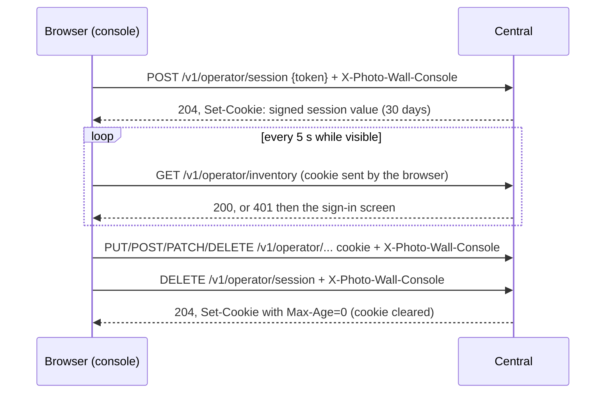
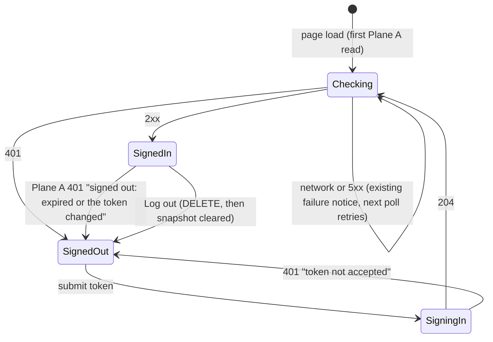

# Operator Console Pass 2, Pass A: Stay Signed In

**Date:** 2026-09-28 · **Status:** design-gate artifact, awaiting owner approval.
**Builds on:** [the approved console design](operator-console-ux-design.md) (D-c: one admin token, no roles; modes are organization, not permission) and [slice 1](operator-console-ux-pass2.md) (`session.js`, the write fence, the 5 s poll).
**Layer:** two operator routes and a wider admin check on Central; the console's token form becomes a sign-in screen. No migration. Player, enrollment, media and netboot authentication do not change.
**Size:** 3 beads (1 backend, 1 console, 1 docs), about 250 net production lines and 400 test lines.

## 1. The problem in plain words

| Today | Evidence | Cost |
|---|---|---|
| The admin token lives in one JavaScript variable, never persisted | `session.js:16-24`; `App.jsx:141-150` | Every reload or new tab asks for the token again. |
| Every read and write sends the token as a bearer header | `useSnapshot.js:18-21`, `apiWrite.js:28` | The long-lived secret crosses the LAN every 5 s, in clear text over http. Any script running in the page can read it. |
| Central accepts only the bearer header | `app.py:279-283` | A browser cannot keep a sign-in. |

**Owner decisions (binding):** sign in once per browser with a cookie; the sign-in lasts 30 days; a **Log out** button; the cookie is `HttpOnly`, `SameSite=Strict`, and `Secure` when the console is served over https.

## 2. One picture, three rules

1. **The cookie never holds the token.** It holds an expiry and a signature. The signing key is derived from the admin token, so changing the token signs everyone out.
2. **A bearer header, if present, decides alone.** A valid bearer is accepted exactly as today. An invalid bearer is refused and the cookie is not consulted. Only requests with no `Authorization` header are checked against the cookie.
3. **A write that relies on the cookie must carry `X-Photo-Wall-Console`.** A page on another origin cannot add a custom header without a CORS preflight, and Central answers no preflight.

## 3. Glossary

| Term | Means | Is not |
|---|---|---|
| **Admin token** | `PHOTO_WALL_ADMIN_TOKEN` (at least 32 characters, `app.py:127-129`; generated by `scripts/configure.py:17`) | Stored in any browser |
| **Session value** | The cookie's content (§4): a version, an expiry, a nonce and an HMAC | A token, or a database row |
| **Session key** | HMAC-SHA256 keyed by the admin token over the fixed label `photo-wall operator session v1` | Stored anywhere; recomputed at startup |
| **Signed in** | The browser holds a session value Central accepts now | A role. There is still one principal (D-c) |
| **Marked request** | A request carrying the `X-Photo-Wall-Console` header, any value | Proof of identity. It only proves the request came from a same-origin script |

## 4. Decision table: what the cookie holds

| Option | Rotation signs everyone out? | Migration | Logout ends the session on the server? | Leaked cookie reveals |
|---|---|---|---|---|
| The raw admin token | yes | none | no | **the token itself**: every route, forever, including scripts |
| **HMAC session value (chosen)** | **yes: the key derives from the token** | **none** | **no: it clears this browser only** | 30 days of operator access, not the token |
| Server-side session row | yes, if rows are tied to the token's hash | one table | yes | 30 days of access, revocable per session |

**Format:** `v1.<expires_at unix seconds>.<nonce: 16 random bytes, base64url>.<mac: base64url>`, where the mac is HMAC-SHA256 with the session key over `v1.<expires_at>.<nonce>`. Central accepts a value only if the version is `v1`, the mac matches under a constant-time compare, and `clock.utc() < expires_at` using the injected `Clock` (`contracts/time.py:9-11`). All Central processes share the token, so a value minted by one is accepted by the others without shared state. **What this gives up:** Log out cannot end a copied cookie before it expires. The only way to end every session is to rotate the token (§9).

## 5. Protocol contracts

| Route | Auth | Request | Responses |
|---|---|---|---|
| `POST /v1/operator/session` | none; must be marked | JSON `{"token": str}` | **204** plus `Set-Cookie`; **401 `unauthorized`** for a wrong token (the same compare as the bearer path, `secrets.compare_digest`); **403 `request_unmarked`**; **422 `invalid_request`**, which never echoes the body (`app.py:302-305`) |
| `DELETE /v1/operator/session` | none; must be marked | none | **204** plus a clearing `Set-Cookie` for both cookie names (idempotent, including when not signed in); **403 `request_unmarked`** |
| every other `/v1/operator/*` | `admin` (below) | unchanged | unchanged, plus **403 `request_unmarked`** |

**The `admin` dependency, in order:** (1) If an `Authorization` header is present, the bearer path runs exactly as today and its result is final. (2) Otherwise the method is checked: a method other than GET, HEAD or OPTIONS without the marker gets 403. (3) Otherwise the cookie is checked: missing, malformed, expired or wrongly signed gets 401 `unauthorized`. The `player` dependency and the WebSocket and media bearer checks (`app.py:285-288,425-428,471-479`) never read a cookie.

**Cookie attributes**

| Attribute | Value | Why |
|---|---|---|
| Name | `__Secure-photo_wall_session` over https; `photo_wall_session` over http | Browsers refuse to let an http page overwrite a `Secure` cookie of the same name. One shared name would lock out an operator who signed in over https and later signs in over http. Central reads the `__Secure-` name first. |
| `Path` | `/v1/operator` | Least privilege. Player, media and netboot requests never carry it. The console page at `/` never needs it, so `SameSite=Strict` costs nothing when the operator arrives by a link. |
| `Max-Age` | 2 592 000 (30 days) | A relative lifetime, unaffected by the browser's clock. The server's `expires_at` is the authority. |
| `HttpOnly`, `SameSite=Strict` | always | Page scripts cannot read it; other sites never send it. |
| `Secure` | when the login request's `Origin` is `https:`; if no `Origin` is sent (a script), when `request.url.scheme` is https | Uvicorn trusts `X-Forwarded-Proto` only from `127.0.0.1` by default, and the Dockerfile CMD (`Dockerfile:129`) sets no `--forwarded-allow-ips`. Behind a TLS-terminating proxy, Central therefore sees `http`. The browser's `Origin` is its own view of the scheme. |
| `Domain` | none (host-only) | A sibling host cannot receive it. |

## 6. CSRF: why a custom header, not an Origin/Host check

`SameSite=Strict` stops cross-site requests. It does not stop **same-site** ones: another host under the same registrable domain on the LAN (a router UI, another appliance), or an http page on the same host with a different port in browsers without schemeful same-site. Five operator POSTs take no body (`app.py:548,556,633,668,725`; retire and run operations among them), so a plain form POST could reach them. A second layer is required.

| Option | Behind a reverse proxy | Over http on the LAN | Chosen |
|---|---|---|---|
| Compare `Origin` with `Host` | Proxies often rewrite `Host` (nginx sends the upstream name by default), and trusting `X-Forwarded-Host` needs per-deployment proxy trust. The check would either refuse real writes or trust spoofable headers. | works | no |
| `Sec-Fetch-Site` | works | **not sent**: browsers send it only to secure origins | no |
| **Required custom header** | proxies forward custom headers unchanged | works | **yes** |

**Cost:** the defense depends on Central sending **no CORS response headers**. Central has no CORS middleware today. A later CORS setup that allows this header would silently remove the protection, so a test pins the absence (§10). A proxy that strips unknown headers would refuse every console write with 403 `request_unmarked`; the console says so in words (§7). A bearer-authenticated request needs no marker: browsers never attach `Authorization` on their own, so scripts and `curl` (`docs/runbook.md` release and pin examples) keep working unchanged.

## 7. Console changes

- **`session.js`** stops holding the token: `setToken`/`getToken` are removed, and the write fence (`noteWrite`, `writeCount`) is unchanged. It exports the marker header, which `useSnapshot.fetchJson` and `apiWrite` send on every request in place of `Authorization`. These are the only two operator fetch sites (`useSnapshot.js:18`, `apiWrite.js:43`); `/healthz` stays unauthenticated.
- **Sign-in screen:** the "Operator token" field and a **Sign in** button replace the header form. The field is cleared on submit; the token exists in page memory only while it is typed. If a 204 is followed by a 401, the screen says "Your browser did not keep the sign-in; allow cookies for this site."
- **Signed-in state** comes from Plane A: `useSnapshot`'s `authRejected` becomes `signedIn`/`signedOut`. The mount effect and the poll gate change from "a token is held" to "not signed out". `bootFacts.js` stays a side read that never signs anyone out (`bootFacts.js:13`). A write that gets 401 shows its own error, and the next poll (within 5 s) shows the sign-in screen.
- **Log out** is a header button that sends `DELETE /v1/operator/session`, clears Plane A and shows the sign-in screen.
- **403 `request_unmarked`** reads: "Central refused a write that was not marked as from this console. A proxy may be stripping the `X-Photo-Wall-Console` header."
- **Unchanged:** the write fence, the 5 s cadence, the pause while the tab is hidden, and the dropping of superseded reads.

## 8. Failure table

| Failure | What happens | Recovery | Guarantee |
|---|---|---|---|
| Session reaches 30 days | 401 on the next poll, then the sign-in screen | Sign in | server-side expiry check (test) |
| Admin token rotated | Every session value fails its mac, and every tab shows the sign-in screen within 5 s | Sign in with the new token | the key is derived from the token at construction; no stale-key path exists |
| Cookie forged, or edited to extend its expiry | 401 | none needed | HMAC with a constant-time compare (test) |
| Cookie copied from the browser | Valid until it expires; Log out does not end it | Rotate the token | **stated cost** (§4) |
| Script injected into the console | Can act as the operator, cannot read the cookie or the token | Fix the script injection; CSP `script-src 'self'` stays (`app.py:375`) | `HttpOnly` (browser) |
| Invalid bearer sent with a valid cookie | 401; the cookie is not consulted | Fix the script | dependency order (test) |
| Operator cookie sent to a Player route | 401; `player` never reads cookies | none needed | `Path` plus dependency (test) |
| Cross-origin form or fetch aims at a write | 403 before the cookie is read (form), or blocked by the missing preflight (fetch) | none needed | marker check (test); no CORS (test) |
| Browser blocks cookies | The sign-in 204 is followed by 401; the screen says so | Allow cookies | console copy (browser test) |
| Operator signs in over https, then visits over http | The http origin cannot see the `__Secure-` cookie; the operator signs in once more under the other name | none needed | distinct names (test) |
| Central's wall clock jumps | Sessions end early (clock forward) or late (clock back) by the jump | none | stated cost; `Max-Age` bounds the browser's side |
| Rolling restart while the token changes | Brief 401s, then the sign-in screen, until every process runs the new token | Sign in again | stated cost |
| Session expires while a draft is open | The sign-in screen replaces the console, and unsaved drafts are lost (as today) | Re-enter the draft | stated cost (Question 4) |

## 9. Rotation and "log out everywhere"

To rotate, change `PHOTO_WALL_ADMIN_TOKEN` in `.env` (or the deployment secret) and restart every Central process. Every existing session ends, and scripts need the new token. This is the only way to log out everywhere, and the runbook will say so (bead 3).

## 10. Tracer bullet, beads and tests

**Tracer bullet (bead 1's first test):** sign in with the token, read `GET /v1/operator/inventory` with only the cookie and get 200; build a second app on the same database with a different token and get 401 for the same cookie. It proves the codec, the dependency order and rotation from end to end. **Non-goals:** the console UI, sliding renewal, per-session revocation, and roles.

| Bead | Scope | Estimate |
|---|---|---|
| **A-1 backend** | Session codec module (pure: issue and verify, clock-injected); the `admin` dependency (§5); the two session routes; one shared token compare for bearer and sign-in; a route-table test that every `/v1/operator/*` route except the two session routes depends on `admin` | ≈110 production, ≈250 test |
| **A-2 console** | `session.js`, `useSnapshot`, `apiWrite`, sign-in screen, Log out, 403 copy; the five browser files' repeated sign-in steps (`test_operator_binding_browser.py:51-52` and 4 others) collapse into one harness helper | ≈140 production, ≈150 test |
| **A-3 docs** | Runbook sign-in, rotation and CSRF; README line 57; errata applied here; ledger rows | ≈50 doc |

**pytest (A-1):**
- Sign-in sets a cookie with the right name, `Path`, `Max-Age`, `HttpOnly` and `SameSite=Strict`: `Secure` with the `__Secure-` name for `Origin: https://…`, and neither for `http://…`.
- A wrong token gets 401 with no `Set-Cookie`.
- A cookie read works; a cookie write without the marker gets 403; a cookie write with the marker gets 2xx.
- Bearer-only reads and writes work with no marker.
- An invalid bearer with a valid cookie gets 401.
- `ManualClock` advanced past 30 days gets 401.
- A tampered expiry or mac gets 401.
- Token rotation gets 401.
- Log out clears both names and is idempotent.
- A preflight `OPTIONS` returns no `Access-Control-Allow-*` headers.
- A cookie on `/v1/player/config` gets 401.

**Browser (A-2):** sign in once, reload and stay signed in; open a second tab and be signed in; Log out, reload and stay signed out; advance the harness clock 30 days and see the sign-in screen; restart with a new token and see the sign-in screen.

**Mutation probes (verifier, each must turn a test red):**
- Skip the mac compare.
- Derive the key from a constant instead of the token.
- Drop the expiry check.
- Let an invalid bearer fall through to the cookie.
- Drop the marker check.
- Set `Secure` unconditionally.
- Read the cookie in `player`.

## 11. Design it twice

| | **A. Signed stateless cookie (chosen)** | **B. Server-side session table** |
|---|---|---|
| Shape | The cookie value is verified by recomputing an HMAC | The cookie holds a random id; the operator dependency looks up a row |
| Gains | No migration; no read per request; works across processes with no shared state; rotation is automatic | Log out ends the session on the server; sessions can be listed and revoked one at a time |
| Costs | A copied cookie lives until it expires; "log out everywhere" means rotating the token | A migration; one database read per operator request (12 a minute per tab); expired rows to clean up; rotation must also delete rows |

A is chosen because the owner prefers no migration and there is one principal, so per-session revocation buys little. B is the upgrade path if roles ever arrive (design Q5).

## 12. Owner questions (defaults are built unless the owner answers otherwise)

1. **Fixed or sliding 30 days?** Default: **fixed from sign-in**. A sliding lifetime means re-issuing the cookie on reads, which puts a `Set-Cookie` on every 5 s poll.
2. **What does Log out cover?** Default: **this browser only**; "everywhere" means rotating the token (§9). The alternative is option B.
3. **Where does `Secure` come from?** Default: **the login request's `Origin`**. The alternative is an explicit setting, or trusting the proxy with `--forwarded-allow-ips`.
4. **What happens to open drafts when the session expires?** Default: **they are lost** (as today). The alternative is a sign-in overlay that keeps the console mounted.
