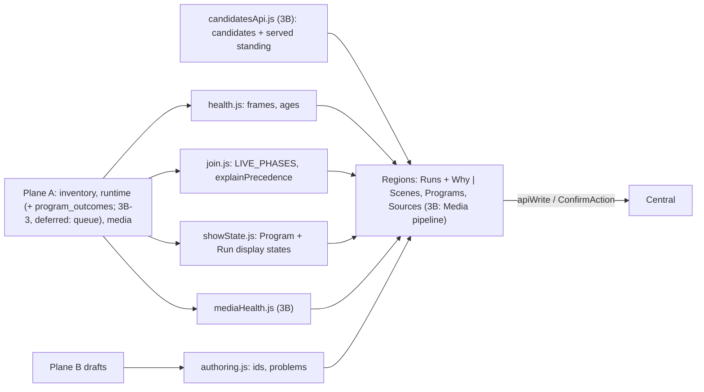
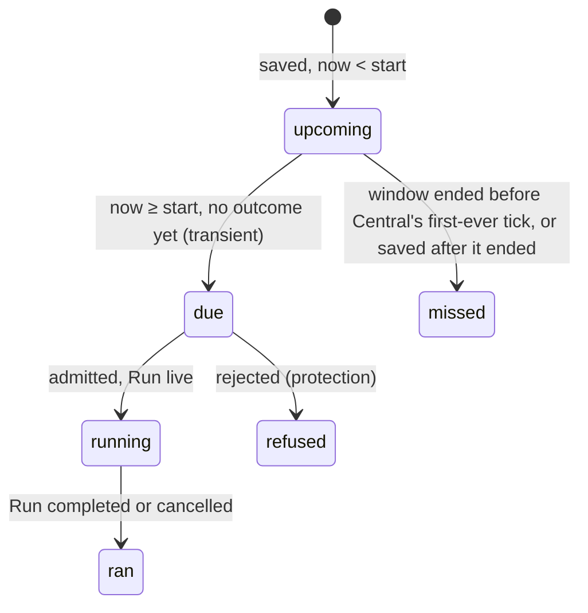

# Operator Console Pass 2, Slice 3: Showrunner Readability

**Date:** 2026-09-28 · **Status:** design-gate artifact, awaiting owner approval.

**Builds on:**
- [The approved console design](operator-console-ux-design.md): rules R1–R4 and journey J4.
- [Slice 1](operator-console-ux-pass2.md): `health.js`, the tokens, `read_at` and the write fence.
- [Slice 2](operator-console-ux-pass2-onboarding.md): `ConfirmAction` and `FRAME_ID_PATTERN`. Slice 3 lands after slice 2 beads 2, 3 and 6.

| Part | Ships | Backend | Size |
|---|---|---|---|
| **3A** (first) | loop, ids, reasons, layout, rows, precedence, leave/restart activation, windows, Source filters | one read-only addition (§8) | 7 beads; ≈900 net production lines (≈300 CSS and moves), ≈650 test |
| **3B** | Scene view and edit, media pipeline and "why nothing new?"; queue and force (3B-3) **deferred** until the owner answers Question 6 | a Scene revision guard (409, Question 4 flipped, §13); a served per-candidate `standing` and recipe-scoped job counts (§14); 3B-3 would add a withdraw write (Question 6) | 4 beads (3B-3 deferred); ≈600 production, ≈450 test |

Neither part needs a migration.

**Line numbers:** `runtime.py` citations are at `e136824`. Slice 2's staged edit shifts them by 2.

## 1. The problem in plain words (audit claims, checked)

| Claim | Verdict and evidence |
|---|---|
| The four regions have no CSS | **Confirmed.** `index.css:785-814` styles only the shell. A Source row is four bare spans (`Showrunner.jsx:91-114`). |
| The operator invents ids; a space gives "invalid_request" | **Confirmed. The cause is the path.** Path parameters are `contracts.models.Identifier` (`contracts/models.py:9`; `app.py:679,687,694`). Every 422 reads `invalid_request` (`app.py:298-301`). |
| **Programs play one cycle and stop** *(new, P1)* | `buildSave` hard-codes `loop: false` (`SceneAuthoring.jsx:554,579`). A non-looping Run is asked to finish at the end of its first cycle (`runtime.py:594`). A 30 s Scene in an 18:00–20:00 Program ends at 18:00:30. |
| `force` and `repeat` are never sent | **Confirmed.** The route accepts them (`app.py:80-86`); the form sends three fields (`Showrunner.jsx:364-370`). |
| Buttons disable silently | **Confirmed.** `Showrunner.jsx:647-650,816,850`; `SceneAuthoring.jsx:101-108,211`. An invalid window count silently becomes 1 (`Showrunner.jsx:652`). |
| Precedence reads "root order 2, admission 0" | **Confirmed** (`Showrunner.jsx:552-553`; `NowShowingFacet.jsx:52-53`). |
| Targets are a flat id list with no state | **Confirmed, and copied in both modes** (`SceneAuthoring.jsx:306-323,446-463`). A legacy `:` frame id is listed but can never be targeted (`runtime.py:18`); `TargetPicker` (3A-4) lists it with that reason and it cannot be ticked. |
| Scenes are write-only | **Confirmed.** `definitions` carries each whole Scene (`app.py:638`), but only ids are listed. There is no delete route or Runtime command (`runtime_store.py:42`). Program start indexes `scenes[program.scene_id]` (`runtime.py:630`). |
| Runs omit fields; a missed window is not on `/runtime` | **Confirmed.** `RunView` has participants, `started_at` and `finish_requested_at` (`runtime.py:171-182`), and none are rendered. It lacks `program_id`, `priority` and protection. Outcomes stay server-side (`app.py:634-641`). |
| Media health is fetched but not rendered | **Confirmed.** It is fetched at `useSnapshot.js:91-95` and nothing reads it. Worker, jobs and cache: `media_repository.py:503-507`. Per-Source fields: `:91-95`. |
| The chooser lists "Photo 108×192" three times | **Mechanism confirmed; not reproduced.** The fixture's photos differ in size. The label is kind plus size (`SceneAuthoring.jsx:344-347`). While candidates load, it reads "No compatible media" (`:486-489`). |
| *(new)* New saves silently replace | Every save sends `revision: 1`, and `set_scene` and `set_program` overwrite (`runtime.py:295,300`). **3B:** `set_scene` now refuses a conflicting Scene save (§13); Program saves still overwrite. |

## 2. One picture, three rules

1. **The operator names; the console derives the id.** There is one rule, pinned to the backend's.
2. **A control is never disabled without a reason on screen.** Only an in-flight write disables a button.
3. **Every sentence restates a served fact, aged on Central's clock, and states its limit.** "Ran" and "wins" describe Central's plan, never what the panel shows (R2).

## 3. Module map (one home per concern)

| File | Owns | Part |
|---|---|---|
| `authoring.js` (pure) | `IDENTIFIER_PATTERN`, `idFromName`, `sceneProblems` / `programProblems` / `activationProblems` / `windowProblems` / `sourceProblems` → `[{field, message}]`, `newActivationKey()` | 3A |
| `showState.js` (pure) | `programState(snapshot, id)`, `runRows(snapshot)` | 3A |
| `Field.jsx` | `useProblems` (touched and submitted reasons; the summary frozen at submit, first-field focus; `check(list)` takes the problems of the action submitted, since the Programs form has two), `Field`, `IdentityFields`, `ProblemSummary`. Used by the Scene, Program, activation and Source forms | 3A |
| `join.js` | `explainPrecedence(runtime, frameId)` on `rankedContributions`; **exports** `LIVE_PHASES` (it replaces `Showrunner.jsx:332-335`). Its rendering, `PrecedenceExplanation`, is exported from `NowShowingFacet.jsx` and shared by the Runs Why panel (no new module) | 3A |
| `health.js` | **exports** `formatAge` and `ageAt` (currently private), the one age formatting | 3A |
| `ScenePicker.jsx`, `SourcePicker.jsx`, `CycleInput.jsx` | One Scene picker (Programs and activation), one Source picker (both modes, and 3B's Why), one cycle-and-loop input (both modes) | 3A |
| `TargetPicker.jsx` | Frames grouped by Surface, with health (both modes). Groups are named "Frames on <surface>" and "Frames not on any wall", never "Surface <id>" (R4: no `Surface` label in Showrunner mode). A frame id outside the target rule (§1's legacy `:` id) is listed with that reason and cannot be ticked | 3A |
| `SourcesRegion.jsx`, `ProgramsRegion.jsx`, `RunsRegion.jsx` | Moved out of `Showrunner.jsx` (902 lines), which becomes the layout shell | 3A |
| `SceneList.jsx` | The stored Scenes, each a disclosure `Scene X` (§13); Edit, or the reason it is withheld | 3B |
| `authoring.js` (3B additions) | `buildSave` (moved here from `SceneAuthoring.jsx`, because the pure lossless check needs it); the default tables `SCENE_DEFAULTS` / `CONTRIBUTION_DEFAULTS` (pinned to the models by pytest); `normalizeScene`, `decodeScene`, `editableDraft`, `UNAUTHORABLE_REASON` | 3B |
| `TargetPicker.jsx` (3B addition) | **exports** `FrameChips` (frames with their tile health), shared by Run and Scene rows | 3B |
| `candidatesApi.js` | `readCandidates(sourceRef, frameId) → {status, candidates}`: the one candidates read, shared by the authoring choosers and "Check this frame", so neither region imports the other | 3B |
| `mediaHealth.js` (pure) | Worker and Source classifiers (`workerState`, `workerLoad`, `sourceState`, `sourceFilters`), the pinned thresholds, `candidateLabels`, `checkCounts`, `whyNothingNew`. It reads Central's served `standing`; it never restates the planner's variant rule | 3B |
| `MediaPipeline.jsx` | The Media pipeline panel and the `WhyNothingNew` group | 3B |

## 4. Scene loop (3A)

- **The control.** `CycleInput` carries "Seconds per cycle" and a **"Keep playing until the Program ends"** checkbox, which writes `loop`. Its hint: "Without a Program, it plays until you Finish or Cancel it. It stops at the end of the cycle running when the Program ends, so it can overrun by up to one cycle" (`runtime.py:594-603`).
  - Default for new Scenes: **on** (Question 1).
  - The same control serves both modes, and `buildSave` stops hard-coding `false`.
- **Rows say what `loop: false` means.** Scene and Run rows read "plays one 30 s cycle, then ends".
- **"Ran" times come from the Run.** They are read from `started_at` and `ended_at`, never from the Program's window.

## 5. Ids from names (3A)

| Aspect | Rule |
|---|---|
| `idFromName` | NFKD, drop marks, lowercase, runs outside `a-z0-9` → `-`, trim `-`, cut at 96 (room for the window suffix `-NN`). "Family Evening" → `family-evening`. |
| One rule | `contracts/models.py` holds an `IDENTIFIER_PATTERN` constant and builds `Identifier` from it (as `TargetIdentifier` is built from `TARGET_ID_PATTERN`); the console's `IDENTIFIER_PATTERN` equals it, and a pytest in `tests/test_registry.py` compares the two literals beside slice 2's `FRAME_ID_PATTERN` pin. |
| Shown, editable | "Saved as `family-evening` · Change"; Change reveals an **Id** field (same pattern). A name with no Latin letter or digit (「夕方」) shows it at once: "This name needs a Latin letter or digit for its id; type an id." |
| Collision | "A Scene called `family-evening` already exists; choose another name." No request. A successful save **clears the form**, so the saved Scene never reads as a collision; Programs likewise. |
| Edit (3B) | Shows the stored id read-only; never re-derived. The name itself is not stored (slice 2 Question 1). |
| Activation id | Never shown. `newActivationKey()` = `console-<base36 ms>-<8 hex>`, minted when the draft changes or after a definite outcome, **reused** on retry after "outcome unknown"; Central returns the stored Admission for a known id (`runtime.py:381-382`), so a retry cannot activate twice. After an unknown outcome the form says "Changing the form makes this a new activation", because an edit mints a new key. |

## 6. Reasons, never silent disables (3A)

*Prior art:* the GOV.UK error-summary pattern.
- A field shows its reason after its first edit (`aria-invalid` + `aria-describedby`).
- Submitting with problems sends nothing, shows a `role="alert"` summary **frozen at submit** (a poll does not rewrite it under the reader) and focuses the first field.
- Only an in-flight write disables a button.
- **A targeted frame that vanishes on a poll** is dropped from the draft and announced (`role="status"`): "lobby-left was deleted and removed from this Scene."

| Form | Reasons |
|---|---|
| All | "Enter a name." · the non-Latin reason (§5) · the collision line |
| Scene | "Choose a Source." · "Choose at least one frame." · "Seconds per cycle must be more than 0." · "Choose media for lobby-left." · "Loading compatible media…" (a state, not "No compatible media"; **deferred to 3B-2**, whose file list owns the chooser labels and loading) |
| Program | The Programs form and the windows helper are one form; the reasons beside its fields follow the action last tried. "Choose a Scene." · "…ends 1 h before it starts." · "That window has already ended; Central would record it as missed." (end ≤ `current.now`) · "Priority must be a whole number." |
| Windows | "Tick at least one weekday." · "Between 1 and 60 windows." (never silently reset) · "Each window must end before the next starts." (keeps today's no-overlap guarantee under day spacing) · "`morning-show-3` already exists." · "Name too long: `<id>-<n>` must be at most 128 characters." (`contracts/models.py:9`) |
| Source | Ref pattern · "Connection name is required." · "'Taken until' must be after 'Taken from'." |

Times are entered and shown in the browser's time zone, which is named: "Times in Europe/London".

## 7. Windows helper and Source form (3A)

| Form | Change |
|---|---|
| Windows helper | Adds a **Repeat on** weekday mask (every day ticked by default). Window 1 is the entered window; each later one falls on the next ticked day at the same *local* clock times (calendar-day arithmetic, so DST keeps 18:00). Each is a separate Program `<id>-<n>`, never a recurrence rule (R2). A partial failure names the windows as **not confirmed** (a request that failed or did not complete may still have been stored), and trying again sends only the ids the served Programs do not yet list. |
| Source form | Exposes `SourceSpec` fields the API already accepts (`media/models.py:32-40`): **Favourites** (Any / Only / Not → `favorites` null / true / false) and **Taken from / until** (local dates → `captured_from` / `captured_until`). "Taken until" is **exclusive**: the start of that local day, matching "'Taken until' must be after 'Taken from'" and `SourceSpec`'s strict interval; both fields are hinted. The form clears after a successful save, like Scenes and Programs. **Albums are not covered**: `SourceSpec` has no album field. |

## 8. What Central adds (read-only; frozen for bead 3A-3)

| Surface | Frozen shape |
|---|---|
| `RunView` | Gains **required** `program_id: str \| None` and `priority: int` (from `_Run`; both are constructed only in `_view`). |
| `Runtime.operator_projection(now, *, max_events=10000) -> OperatorProjection` | One restore and advance (as `project`, with the same `max_events` transition budget). Frozen fields: `current: RuntimeView`; `protected_frames: Mapping[run_id, frozenset[str]]` (from `_Run.scene.protected_frames`, `runtime.py:105`; computed **only here**, never in `_view` on the scheduler's hot path; a served Run that protects no frame is omitted); and `program_outcomes: Mapping[program_id, Admission \| None]`, read from `admissions[activation_id]`. The same 24 h read filter applies to Runs and to outcomes (Question 2). **3B-3 (deferred, Question 6) would add** `queue: tuple[QueuedView, ...]` (`activation_id`, `scene_id`, `priority`, `force`, `expires_at`). |
| `GET /v1/operator/runtime` | Adds `protected_frames` and `program_outcomes` (and, with 3B-3, `queue`). Existing keys are unchanged. |
| Rejected `Admission` (review fix cycle 1) | A `protected_frames` or `protection_not_visible` rejection carries `blocking_run_id: str | None` (optional, so stored admissions without it still restore): the root Run whose protection refused it, as Central decided it. The console names that Run from the Admission and no longer re-derives protection from `protected_frames` and participants. |

| Also decided | |
|---|---|
| Designed twice | **A (chosen)** outcomes per stored Program; **B** all admissions (unbounded); **C** a console guess (R2 invention). *Cost:* reverses J4's "no missed_window row" ([design J4](operator-console-ux-design.md#j4--content--schedule-whats-on-which-frame-when-why)); docs bead 3A-7 updates it. |
| Payload growth | Root Runs are never deleted (`_end` deletes only children, `runtime.py:523`), nor are admissions, so `current.runs` grows forever and is re-sent every 5 s per tab. Question 2: the operator projection serves live Runs plus Runs ended in the last 24 h, and `program_outcomes` only for Programs ending within the last 24 h or later (a read filter only). Older rows read "details older than a day". **Cost:** `programs` itself stays unbounded in the payload and in stored state. |

## 9. Program and Run display states (`showState.js`, 3A)

| State | Label (Run times, never window times) | Severity |
|---|---|---|
| upcoming | "Starts in 2 h · Tue 18:00–20:00" | ok |
| running | "Running since 18:00" | ok |
| ran | "Ran 18:00–18:00:30 (one cycle, then ended)", or "Cancelled at 19:10" | ok |
| refused | `protected_frames`: "Did not start: lobby-left was protected by the Run of evening." `protection_not_visible`: "Did not start: it protects lobby-left, but a higher-priority Run of evening covered it." **Protector:** the blocking Run id carried by the rejected Admission (§8), named only when that Run is served. If it is not (outside the 24 h bound): "…was protected by another Run, no longer listed." | alarm |
| missed | "Missed: its window had ended before Central first scheduled it." | to-do |

**Outages are warm restarts, not misses.** `missed_window` is written only by `set_program` for a window already over (`runtime.py:302`), or before the Runtime's first-ever tick (`runtime.py:447-451`). After an outage, catch-up admits and ends the Run logically, so the row reads "Ran" even though the wall showed nothing. That limit is stated in the row's hint and in §16.

- **Past rows:** past Programs sit under a closed "Past (N)" disclosure.
- **Removing a running Program** goes through `ConfirmAction`.
- **Run rows.** Roots are listed with their children nested beneath. Each row shows:
  - `Scene X` (the exact text is kept) and its revision;
  - its origin ("Program Y", "activated directly" or "part of Z");
  - "Started 4 min ago" (`formatAge` from `current.now`);
  - "Running" / "Ending (outro)" / "Finishing: requested 20 s ago", with Finish disabled and that reason given;
  - "plays one 30 s cycle, then ends" when `loop` is false;
  - its priority, a "protects lobby-left" note, and its participants as frame chips carrying the `tileLabel`.
- **Cancel** goes through `ConfirmAction`: "Stops now on …, skipping its outro; its child Scenes stop too." With 3B-3 (deferred, Question 6), when a queued activation of the same Scene exists, it adds "A queued activation of X starts as soon as this ends."
- **Empty and ended runs:** "No live Runs." is kept. A closed "Recently ended" list separates completed from cancelled.

## 10. Who wins, in Central's plan (3A)

The Runtime keeps the highest `(priority, root_order, admission_order)` (`runtime.py:167,709`). `explainPrecedence` compares each hidden entry with the winner on the first element that differs. **Every line includes "priority N".**

| First difference | Sentence |
|---|---|
| priority | "morning (priority 1) is underneath: evening has priority 5." |
| root order | "morning (priority 0) is underneath: same priority, and Central admitted evening's Run later. Admission order, not the Program's start time; Programs starting at the same instant are admitted in Program-id order (`runtime.py:626`)." |
| admission order | "intro (priority 0) is underneath: same Run of evening; the later child Scene is on top." |

- **Heading:** "Central's plan for lobby-left: evening (priority 5, Program weekday-evenings) on top."
- **Limit line, always shown:** "If evening has no usable media for this frame (none eligible, still preparing, or no compatible variant), Central plans the next layer down instead (`planner.py:297-316`). An unbound frame gets no layers at all (`planner.py:266-268`). A partly transparent or fading layer shows what is underneath."
- **Where it appears:** the Now-showing facet (it keeps "Intended scene: X") and the Runs Why panel.

## 11. Activation (3A: leave running or restart; 3B-3, deferred: queue and force)

| Choice | Wire | Stated consequence |
|---|---|---|
| Leave it running (default) | `repeat: ignore` | "Not started: evening is already running, left as is." |
| Restart it | `repeat: restart` | Hint: "Ends the current Run and starts a new one now. A restarted Run has no Program end" (`runtime.py:417-419`), then, for a looping Scene, that it plays until you Finish or Cancel it, and for a one-cycle (`loop: false`) Scene, that it plays one cycle, then ends. (The first draft's unconditional "it plays until finished" was false for one-cycle Scenes.) |
| Queue after it (3B-3, deferred) | `repeat: queue`, `expires_at = current.now + 60·N` | "Queued: starts when evening's Run ends **and** no protection blocks it (`runtime.py:658`); gives up at 18:05." The queue is listed under "Waiting to start", with **Withdraw** (Question 6). Queueing is refused with a reason while the last refresh failed, because `current.now` would be stale. |
| Activate anyway (3B-3, deferred) | new key, `force: true` | Offered only after a `protected_frames` refusal, in `ConfirmAction`: "Overrides protection on lobby-left. At priority 0, below the protecting Run's 5, it is admitted but stays underneath." ([requirements](requirements.md#activation-and-visibility-protection): manual activation does not mean force.) |

| Outcome (only served facts; bead 3A-5 follows the read in 3A-3) | Text |
|---|---|
| admitted | "Started: Central admitted a Run of evening." |
| `protected_frames` | "Not started: lobby-left is protected by the Run of evening." The Run is the one the rejected Admission names (§8). |
| `protection_not_visible` | "…this Scene protects lobby-left, but evening's Run (priority 5) covers it; use priority at least 5." |
| `queue_full` / no refreshed snapshot / 5xx or thrown | "…16 activations are already waiting." / the plain reason / "Outcome unknown. Try again; it will not start twice." A 5xx is treated as outcome unknown and **keeps the key** (the write may have committed). A 4xx is a definite refusal: "Not started: <error>." |

## 12. Layout (3A, slice 1 tokens only)

- **≥ 1024 px:** two columns. **Now** holds Runs with Why (and, in 3B, the Media pipeline); **Library** holds Scenes, Programs and Sources. Below 1024 px: one column, Runs first.
- **`.record`:** a `<dl>` grid, `max-content minmax(0,1fr)`, with `overflow-wrap: anywhere` on values. Actions wrap at 390 px.
- **`.field`:** the label above the control, then the hint, then the reason. Reasons use `--warn`; only alarms use `--alarm`.
- **Unchanged:** region names and the "Frame health" badge group.

## 13. Scene view and lossless edit (3B)

The current [runbook](runbook.md#viewing-and-editing-a-scene) supersedes this
section's numeric revision wording. The console still sends and checks revisions,
but its cards and edit messages describe saved changes and Reload actions without
showing revision numbers.

- **`SceneList`:** each row is a disclosure named `Scene X`, showing kind ("live from <Sources>", or "authored: N chosen items"), targets as `FrameChips` with health, cycle, loop wording (a looping Scene "keeps playing until its Program ends or, when started by hand, until you Finish or Cancel it"), revision, "Used by Programs …" and "Running now".
- **Lossless check.** Both sides are normalized by filling the model defaults (`SCENE_DEFAULTS` / `CONTRIBUTION_DEFAULTS` in `authoring.js`, from `runtime.py:43-55` Contribution and `:76-86` Scene; a pytest in `tests/test_operator_runtime.py` pins the tables to the models). The Scene must equal `buildSave(decodeScene(Scene))`, apart from `revision` (`editableDraft`). Otherwise Edit is withheld with the reason: "Uses features the console can't author (child Scenes, outro, fades…)."
- **Edit** loads the Scene into the same form under its **stored id** (never re-derived): "Editing `evening` · revision 4. Its id stays; Replace saves revision 5."
- **Replace.** It goes through `ConfirmAction` and sends `revision + 1`. The dialog says "Runs already going keep the version they started with; Programs that start later use the new one" (Runs hold a copy, `runtime.py:205`).
- **Revision guard (review fix cycle 1; flips Question 4's default).** `Runtime.set_scene` (`runtime.py:339`), the one Scene write path behind both Scene `PUT`s, refuses with 409 `scene_revision_conflict` a save whose revision is at or below the stored one **unless it equals the stored Scene exactly**, so an identical retry stays 200. It refuses only conflicting writes; no expected-revision field is added (`RuntimeConflict`, mapped to 409 in `app.py`). The console reads the outcome from the answer, not from a pre-read:
  - A Replace whose Scene moved on since Edit ends in the terminal "Changed since you opened this. Reopen to review." Nothing was replaced.
  - A **new** Scene whose id another operator saved meanwhile is refused: "A Scene with this id was saved meanwhile; nothing was replaced."
  - Program `PUT`s are unchanged: a racing Program id still replaces silently (§16).
- **Authored Scenes.** The operator picks the Source; each frame's stored `asset_refs` are pre-selected while they are still candidates. The authored `PUT` can answer 409:
  - `source_not_fresh`: "The Source's last refresh failed; authored choices can be saved once it succeeds" (`media_repository.py:320`).
  - `authored_asset_not_member`: "That item is no longer in the Source; choose again" (`:331`); the choosers read their candidates again.
  - `scene_revision_conflict`, as above.
- **Delete:** not offered (Question 3).

## 14. Media pipeline and "why nothing new?" (3B)

| Domain | State (first match) | Label | Severity |
|---|---|---|---|
| Worker | `never` / `error` / `quiet` / `ok` | "never checked in" / "reported: storage is full" / "quiet for 14 min" (older than `2 × 300 s + 60 s`; maintenance runs every 5 min, `media/task_queue.py:17`) / "checked in 40 s ago · preparing 3 · waiting 12 · failed 2 · failed, retry pending 1 · cache 4.1 of 8 GB" | alarm ×3 / ok |
| Source | `never-refreshed` / `failing` / `overdue` / `empty` / `ok` | "Awaiting refresh" (`next_refresh = 0`, `005_media_jobs.sql:12`) / per served status, "Library unreachable", "Library refused access" or "Library unsupported", then "· last good 2 h ago" / "Refresh overdue by 6 min" (`2 × 30 s + 65 s`; `task_queue.py:16`, `worker.py:109`) / "nothing valid in the last refresh" / "refreshed 1 min ago · 790 valid in the last refresh · favourites only · dated 2024" (batch 5 wording) | to-do / alarm / alarm / to-do / ok |

- **Jobs are the current recipe's.** `MediaRepository.health()` counts jobs by state only for the current `recipe_id`; a recipe change fails the old recipe's queued jobs as `recipe_changed`, and planning requests the asset again. Preparing is running or publishing; waiting is queued. A `retry` job reads "failed, retry pending N", shown only when N > 0, because the catalog hydrates a not-yet-due retry as a preparation failure (`media_repository.py:252`). When the worker is not ok, a separate "Jobs and cache" line carries the same counts.
- **"Valid" is the refresh's own count** (`counts.valid`: items it found and accepted), not items ready for any frame. Each Source row also shows "Last refresh: found N · valid N · pending N · rejected N", its reported diagnostic codes in words, and its next refresh.
- **Capture window wording.** "Taken until" is exclusive, so the last day named is `day(until − 1)`, the day holding the last included second; a DST day of 23 or 25 h stays whole.

**Standing is served, not restated.** `planner.candidate_standing(candidate, profile)` (`planner.py:141`) is the planner's one per-candidate verdict: `usable`, `preparing` (no variant yet), `failed_to_prepare` (a failed preparation, **including a retry not yet due**) or `no_compatible_variant`. `_pool` and `add` decide through it (`planner.py:252,324`). The candidates route serves it as `standing` on each candidate when `frame_id` is given (`MediaRepository.source_candidates`). The console no longer restates the variant rule; chooser labels and "Check this frame" read the served standing.

**`whyNothingNew`** is its own group, "Why nothing new on lobby-left?", a sibling of the ranked Why list. Its steps, with the first one that is not ok marked "Stops here":
1. **Intended?** Is any Scene intended here? When nothing is, but a served Run on the frame ended, this step is informational and the chain stops at step 2; otherwise it stops here.
2. **Run ended?** For example, "evening's Run ended at 18:00:30 after one cycle", or "…was cancelled at 19:10". When the Frame's contribution keeps its photo (`after_end`, [what a Frame keeps](execution-contract.md#what-a-frame-keeps)), it adds "if its last item was a photo, the frame keeps that still (a video is not kept)": the served facts do not say which item was last (`planner.py` `_after_end`); when the Scene's ending on that Frame keeps nothing, it adds "its ending left the frame black".
3. **Authored?** "Fixed, hand-picked media; new photos never appear by design." A black contribution: "It shows black here by design."
4. **The Source.** Each Source's state and filters, as in the panel, for example "family:1: refreshed 1 min ago · 790 valid in the last refresh · photos only · dated 2024" (worded "taken" when this slice shipped; console batch 5 made the library's dates read "dated", [console design §39](operator-console-ddd.md#39-pass-5-wording-and-truth-kinds)).
5. **On demand: "Check this frame".** It reads `GET …/candidates?frame_id=` (profile-filtered) for each of the winner's Sources and tallies the served `standing`: "12 usable · 3 still preparing · 1 failed to prepare · 2 with no compatible version." A Source whose served status is not ok is left out, as planning leaves it out, and an item several Sources share counts once (its standing is per item). With nothing usable it stops: "Nothing usable yet: …" or "No item in the Source fits lobby-left's shape." The tally is of per-candidate standings, not of what planning concluded for the frame (residual in §18).
6. **The worker.**
7. **Frame health** (status only, R4).

Chooser labels read "Photo 108×192 · dated 3 Mar 2025 14:02 · ready" (first "taken"; batch 5 made it "dated") (or "preparing", "failed to prepare", "no compatible version", from the served standing), with "(2)" added only for a remaining duplicate. While the lists load, the chooser reads "Loading compatible media…", never "No compatible media".

## 15. Tracer bullet (3A-1)

The operator types "Family Evening" and sees "Saved as `family-evening`". "Keep playing" is on. They save, the form clears, and the list shows `Scene family-evening`. A Program for it, 18:00–20:00, with a `ManualClock` advanced 5 min past 18:00, shows its Run still live.
- **It proves** the pinned id rule, reasons instead of silent disables, and a Program Scene that keeps playing (the P1).
- **Not covered:** layout, the backend read, precedence and forms beyond the Scene.

## 16. What can go wrong

| Failure | What the operator sees | Guarantee |
|---|---|---|
| `loop` off in a Program | "plays one 30 s cycle, then ends" on the Scene and the Run | Test |
| A new Scene's id collides with another operator's save in the last 5 s | "A Scene with this id was saved meanwhile; nothing was replaced." | Structural (`Runtime.set_scene`, the one Scene write path) + pytest (`tests/test_runtime.py`, `tests/test_operator_runtime.py`) |
| Lost update: two editors open the same Scene revision and both Replace | The second dialog ends "Changed since you opened this. Reopen to review."; the first editor's Scene is kept | Structural (`set_scene` refuses a revision at or below the stored one unless identical) + pytest + browser (two-editors test) |
| A new Program's id collides with another operator's save in the last 5 s | Silent replace | **None** (Program `PUT`s have no guard) |
| Central is down across a window | "Ran 18:00–20:00" (logical catch-up); the wall showed nothing | **None**; stated in the row hint |
| Activation retried after a timeout | Same key, same Admission, one Run | Structural (`runtime.py:381`) + test |
| Winner has no usable media for a frame | Precedence limit line; "Check this frame" tallies the served standings | pytest on the served `standing` (`tests/test_authored_compatibility.py`; the planner decides through the same `candidate_standing`) + browser |
| A restarted Run outlives its Program window | Stated in the Restart hint | Test |
| Queue while refreshes fail (3B-3, deferred) | Queueing refused, with the reason | Test |
| Force below the protecting priority (3B-3, deferred) | Confirm says it stays underneath | Test |
| A target frame deleted mid-draft | Dropped and announced | Test |
| A Scene the console cannot author (3B) | Edit withheld, with the reason | Construction-time (normalized round trip) + test |
| `/runtime` payload growth | Bounded to 24 h of ended Runs (Question 2 default) | pytest |
| Browser and wall in different time zones | The zone is named | **None** |
| Central rolled back to a build before `blocking_run_id` after a protection refusal was stored | Scheduler `coordination_unavailable`; operator runtime calls 422 | Structural for states with no refusal (`export_state`, the one persisted path, omits the unset key) + pytest; otherwise **None**: roll forward, or run the [runbook](runbook.md#upgrading-to-content-keyed-os-images-migration-028) SQL first |

## 17. Beads

Tests are in `tests/browser/test_operator_showrunner_browser.py` unless named. No test is renamed, so the `conftest.py:59` CHECKS keys hold.

**Slice 3A**

| Bead | Files | Tests (co-changed / new) |
|---|---|---|
| **3A-1 Scene loop + ids + reasons** (tracer) | new `authoring.js`, `Field.jsx`, `CycleInput.jsx`, `SourcePicker.jsx`; `SceneAuthoring.jsx`; `contracts/models.py` (`IDENTIFIER_PATTERN`) | "Scene ID" → "Scene name" at `:360,:415,:540`. **Harness:** a new `_schedule_program` helper takes over the Program-form fills at `:571,:614,:654`, so 3A-6's rename touches one place. **Pin:** the shared `SourcePicker` keeps the accessible name `Source` (`:361,:417,:481,:504,:541`). **New:** spaces → derived id; a non-Latin name gets the id field; collision; the frozen summary; the form clears; `loop: true` is sent; the tracer Program. **pytest:** the pattern pin (`tests/test_registry.py`, comparing literals). |
| **3A-2 Layout** | `index.css`; move out `SourcesRegion`, `ProgramsRegion`, `RunsRegion` | `:164`, `:335` hold. **New:** two columns at 1440; no sideways scroll at 390 (long ids). |
| **3A-3 Central read** | `runtime.py` (`RunView` fields, `operator_projection`, 24 h bound), `app.py` (`/runtime`) | **pytest** (the /runtime check is a new `tests/test_operator_runtime.py`): `program_id` and `priority` are required on `RunView`; `protected_frames` is served only by `operator_projection`; outcomes (set after window, first-tick missed, a warm restart reads admitted, protected refusal); the 24 h filter keeps live and recent Runs and outcomes and drops older ones. |
| **3A-4 Rows + precedence** | new `showState.js`, `TargetPicker.jsx`; `join.js`, `health.js` (exports), `NowShowingFacet.jsx`, both regions | `:760` rewritten: a missed row appears only for a served `missed_window`, and a warm restart shows "Ran"; its missed and warm-restart Programs are set up through the Runtime directly (as served facts), since the form now refuses an ended window. `:825` adds the confirm; `:829` keeps "No live Runs."; `:887-889` and wall `:185` hold ("priority N"). **Pin:** `TargetPicker` keeps the accessible name `Target frame <id>` (`:363,:364,:418,:419,:482,:514,:542`), and a test asserts health reaches it only through `aria-describedby`, never the name. **New:** refused-Program protector naming and its no-name fallback; one-cycle wording; admission-order sentence; limit line; picker health and "Frames on <surface>" grouping; an untickable legacy `:` frame; vanished-target announcement. |
| **3A-5 Activation** | new `ScenePicker.jsx`; `RunsRegion.jsx` | `_activate` (`:720`) no longer fills an id; outcome text at `:752,:757,:790`. **New:** an aborted retry and a 500 retry each reuse the key; restart hint; a protected refusal names the Run. |
| **3A-6 Windows + Source form** | `ProgramsRegion.jsx`, `SourcesRegion.jsx`, `authoring.js` | "Program ID" → "Program name" changes **only** `_schedule_program`; `:640-676` holds (ids `-1..-3`, daily default). **New:** weekday mask; DST keeps local time; overlap and id-length reasons; a count reason with no reset; favourites and capture window in the body. |
| **3A-7 Docs** | `runbook.md`; `operator-console-ux-design.md` (J4, §1b "not on any GET"); `module-runtime.md`; ledger; history here | `check_docs.py` |

**Slice 3B**

| Bead | Files | Tests |
|---|---|---|
| **3B-1 Scene view + edit** (`27e1cce`) | new `SceneList.jsx`; `SceneAuthoring.jsx`; `authoring.js` (`buildSave` moved in, default tables); `TargetPicker.jsx` (`FrameChips`); `RunsRegion.jsx`. Review fix cycle 1: `runtime.py` (`set_scene` guard, `RuntimeConflict`), `app.py` (409) | `:387,:458,:550` hold. **New:** edit bumps the revision; the children Scene is withheld; authored pre-select; both 409s; two editors, the second ends "changed". **pytest:** default-table pin; stale Scene save refused, identical retry accepted (`tests/test_runtime.py`, `tests/test_operator_runtime.py`). |
| **3B-2 Media pipeline + why** (`55824af`) | new `mediaHealth.js`, `MediaPipeline.jsx`; `RunsRegion.jsx`, `SceneAuthoring.jsx` (labels, loading). Review fix cycle 1: new `candidatesApi.js`; `planner.py` (`candidate_standing`), `media_repository.py` (served `standing`, recipe-scoped `health`) | The three Why count assertions are scoped to the "Contribution precedence" list; the chooser names at `:499,:500,:502,:529` become a `^Photo 108×192` regex. **New:** each worker and Source state; the chain stops at "Run ended", "authored" and "still preparing"; the check skips a failing Source and counts a shared item once; a DST capture window. **pytest:** thresholds (`tests/test_media_queue.py`); served standing (`tests/test_authored_compatibility.py`); recipe-scoped jobs (`tests/test_media_repository.py`). |
| **3B-3 Queue + force** (**deferred** until the owner answers Question 6) | `runtime.py` (`queue` view; `withdraw` command), `app.py` (withdraw route), `RunsRegion.jsx` | **pytest:** the queue is served; withdraw records an expiry and is idempotent. **Browser:** queue listed and withdrawn; Cancel warns; force below priority is admitted and hidden. |
| **3B-4 Docs** | runbook (Scene view and edit, pipeline, why; queue and force with 3B-3), `module-runtime.md`, `module-authored-media.md`, README, ledger, history here | `check_docs.py` |

**Mutation probes (each must turn the named test red).**

| Break this | Test that fails |
|---|---|
| `buildSave` sends `loop: false` again | Tracer (the Run ends at 18:00:30) |
| The JS pattern drifts, or spaces are kept | Pattern pytest; spaces test |
| Don't clear on success | Form-clears test (a false collision) |
| Recompute the summary on each poll | Frozen-summary test |
| Mint a new key on retry | Aborted-retry test (two Runs) |
| Drop "priority N" or the limit line | `:887` / wall `:185`; limit-line test |
| Treat any past window with no Run as missed | Warm-restart pytest and `:760` |
| Read `program_id` from the Intent instead of the root Run | Program-named winner test |
| Serve all ended Runs or all outcomes | 24 h filter pytest |
| Treat a 5xx as a definite refusal (mint a new key) | 500-retry test (two Runs) |
| Put the protector name in without a served Run | No-name fallback test |
| Compare edit without filling defaults (3B) | A Scene saved through the API with default fields must stay editable |
| Drop the guard in `Runtime.set_scene` (3B) | Two-editors browser test; stale-save pytests |
| Serve `standing: usable` for every candidate (3B) | Served-standing pytest |
| Queue with a stale `now` (3B-3, deferred) | Queue-refused test |

## 18. Costs, deferrals and questions

- **Costs:** names are not kept; confirm clicks for Cancel, Replace and removing a running Program; forms always visible; media alarms stay out of the strip; thresholds are console constants pinned by pytest; **albums are not supported** (`SourceSpec` has no album field); Programs and admissions are never pruned in stored state; the planner's per-candidate standing is served, but what planning concluded for a frame is not ("Check this frame" is a tally of standings, not the pool order or cycle pick). A stored protection refusal pins the rollback floor at this build unless its `blocking_run_id` is stripped first (runbook SQL).
- **Deferred at the time of this design:** thumbnails, Scene delete, display names, media alarms in the strip; queue and force (3B-3, pending Question 6). Scene delete was subsequently implemented in the [operator UX loop](evidence/2026-09-28-operator-ux-loop.md); the original Question 3 below records the earlier decision.
- **Residual (not built):** serve the planner's own per-frame `projection.diagnostics` (`coordination.py:403`), so "Check this frame" reports what planning actually concluded (pool order, cycle pick, `no_eligible_candidates`) instead of a tally of per-candidate standings.
- **Question 1:** new Scenes default "Keep playing until the Program ends" to on? Build proceeds on the default: on.
- **Question 2:** should `operator_projection` serve only live Runs plus Runs ended in the last 24 h (read-only), bounding the 5 s payload? Build proceeds on the default: yes (3A-3).
- **Question 3:** should Scenes get a delete route (it must refuse while a Program or a live Run names the Scene, `runtime.py:630`)? Build proceeds on the default: deferred.
- **Question 4:** should the Scene `PUT`s refuse a save that would silently replace a newer Scene? Build proceeds on the default: **guard** (refuses only conflicting writes). `Runtime.set_scene` refuses a revision at or below the stored one unless the body is identical (§13); no expected-revision field is added, and Program `PUT`s are unchanged. *Evidence:* review fix cycle 1 found two editors of one Scene both stored revision 4, the second silently replacing the first; the console's pre-read of the stored revision could not close that race. *Cost:* a state holding a Scene can no longer be re-sent with a lower revision, and the owner may still prefer the earlier default (no precondition).
- **Question 5:** should `/runtime` serve `program_outcomes` and `protected_frames`, and `RunView` carry `program_id` and `priority`, reversing J4's no-missed-row stance? Build proceeds on the default: yes (3A-3).
- **Question 6:** should queued activations be withdrawable through a new write (`POST /v1/operator/activations/{id}/withdraw`, recorded as `expired`, reason `withdrawn`)? **3B-3 (queue, force and withdraw) is deferred until the owner answers**; 3B ships without queue and force.

## History

- 2026-09-28: first draft, written after two console audits. Every claim was checked against the cited lines. It found that the id failure is the path rule, and that new saves silently replace.
- 2026-09-28, review round 1: two adversarial reviews failed the draft; the design was changed: split into 3A/3B; loop control fixes Programs ending after one cycle; precedence worded as Central's plan with "priority N" and its limits; missed-window copy corrected (outages are warm restarts); `protected_frames` served and refusals use served facts; activation copy fixed (restart outlives window, queue waits for protection, force below priority stays hidden, "at least 5"); non-Latin and stored ids; edit compares after defaults and handles authored 409s; why chain uses the planner's exclusions; shared pickers and exported helpers; frozen problem summary and announced vanished targets; silent states removed; payload bound stated.
- 2026-09-28, review round 2 (final): `program_outcomes` shares the 24 h read filter (`programs` stays unbounded, as a cost); window-overlap and id-length reasons; refused-Program protector lookup with a fallback and a `protection_not_visible` label; loop overrun by up to one cycle and unbound frames getting no layers stated; a `_schedule_program` test helper and pinned picker names; `protected_frames` computed only in `operator_projection`, with `program_id`/`priority` required; an activation 5xx is outcome unknown and keeps the key.
- 2026-09-28, slice 3A build (docs bead 3A-7): implementer errata (a)–(i) applied in place (`Field.jsx` and `PrecedenceExplanation` homes; `IDENTIFIER_PATTERN` in contracts and the new `tests/test_operator_runtime.py`; "Frames on <surface>" groups and the untickable legacy frame; `protected_frames` omits Runs protecting nothing; `:760` set up through the Runtime; exclusive "Taken until"; the admitted and 4xx texts; "Loading compatible media…" moved to 3B-2). Review fix cycle 1 decisions recorded: a rejected Admission carries the blocking Run id, so the console no longer re-derives protection; a windows-helper partial failure reads "not confirmed" and retries only missing ids; the "Changing the form makes this a new activation" line; `operator_projection` takes `max_events`. Defect corrected: the Restart hint's "plays until finished" was false for one-cycle Scenes.
- 2026-09-28, slice 3B build (docs bead 3B-4): implementer errata (a)–(f) and review fix cycle 1 applied in place. Question 4's default flipped to a revision guard in `Runtime.set_scene` (409 `scene_revision_conflict`; an identical retry is accepted), replacing the console's pre-read; the planner's `candidate_standing` is served as `standing`, so the console no longer restates the variant rule; `readCandidates` moved to `candidatesApi.js`; `buildSave` moved to `authoring.js` and `FrameChips` exported from `TargetPicker.jsx`; health counts only the current recipe's jobs and shows "failed, retry pending"; "valid in the last refresh" wording; the check skips failing Sources and counts shared items once; per-status Source failure labels; step 1 informational when a Run ended; the retained-still line made conditional (§14 step 2 corrected); the DST last day. 3B-3 deferred pending Question 6; the per-frame diagnostics residual recorded.
