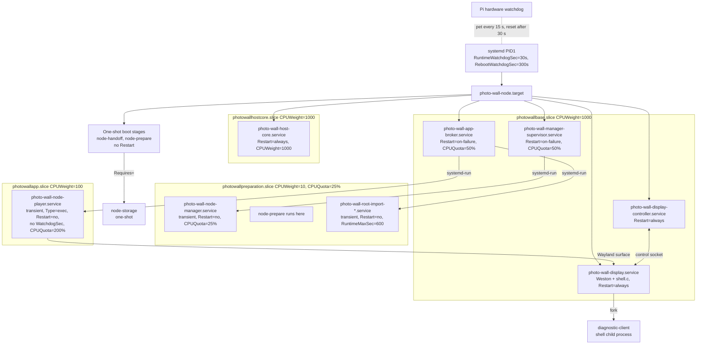
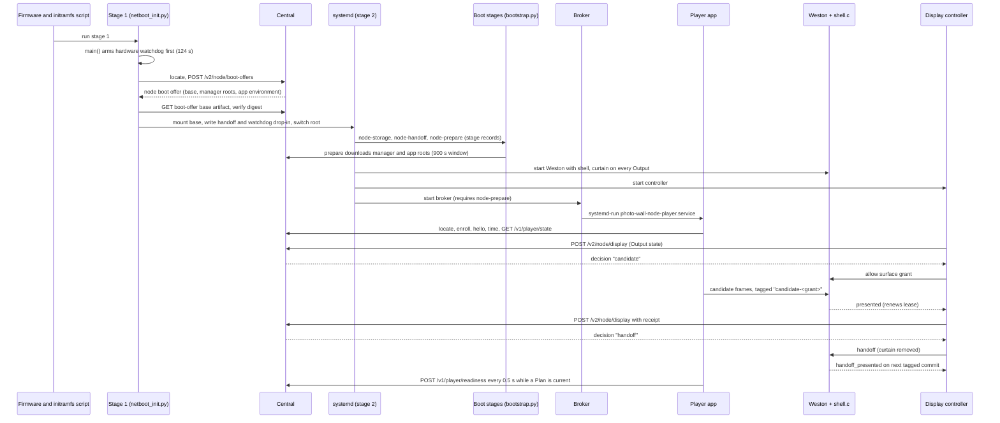
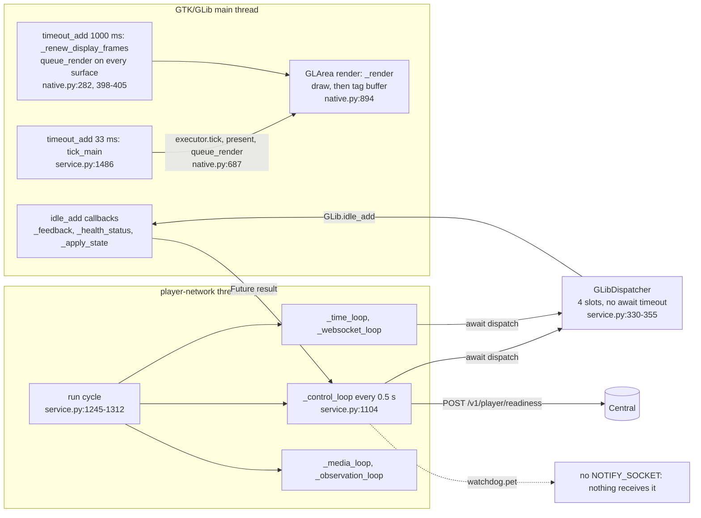

# Player node architecture (as built)

This page describes the V2 Player node as it exists at v0.17.0 (`origin/main` 860465cd). It owns the cross-layer view: which processes run on the Pi, who supervises each, what each layer guarantees, how strongly that guarantee is enforced, and what each liveness signal actually measures. It describes; it does not propose. Each policy stays in its owning document, linked from [Where to read more](#where-to-read-more). Where an owning document and the code disagree, the code is described here and the disagreement is listed under [Observed gaps](#observed-gaps).

## Overview

A Pi netboots a small initramfs (stage 1), which locates Central, takes a boot offer, mounts the offered base read-only in RAM and hands the hardware watchdog to systemd. On the base (stage 2), systemd starts the `photo-wall-node.target` cohort: three one-shot boot stages, then independent base services for host observation (HostCore), app effects (broker), manager recovery, and display policy (Weston with the Photo Wall shell plus a display controller). The broker launches the Player app from an exact, sealed app root as a transient systemd unit. The Player draws through GTK into Weston; the shell admits its surface and keeps it on screen only while tagged buffers keep being presented. Every base service and the Player report to Central separately, over separate sessions.

### Glossary

| Term | Meaning on this page |
|---|---|
| **Node** | One Pi booted on the V2 path (`photowall.node=v2` on the kernel command line). Every node unit is gated by `ConditionKernelCommandLine=photowall.node=v2`. |
| **HostCore** | `photo-wall-host-core.service` ([`host_runner.py`](../appliance/host/host_runner.py)): samples host metrics, posts host observations and facts, polls and executes operator reboot commands, and owns local recovery deadlines. Never imports the Player. |
| **AppManager** | The versioned manager executable ([`manager_runner.py`](../appliance/node/manager_runner.py)) that prepares app environments in the background, run as transient `photo-wall-node-manager.service` by the base manager supervisor ([`manager_launcher.py`](../appliance/node/manager_launcher.py)). |
| **Broker** | `photo-wall-app-broker.service` ([`broker_runner.py`](../appliance/apps/broker_runner.py)), the AppEffectBroker: the only writer of the app effect journal and the only launcher and stopper of the Player process. |
| **DisplayHost** | The base display stack: Weston with the Photo Wall shell plugin ([`shell.c`](../appliance/display_host/native/shell.c), `photo-wall-display.service`) and the Python display controller ([`runner.py`](../appliance/display_host/runner.py), [`service.py`](../appliance/display_host/service.py), `photo-wall-display-controller.service`). |
| **Output** | One connected display connector, keyed by an OutputKey with connection and mode generations; each Output has its own curtain, diagnostic page and surface lease. |
| **Lease** | The shell's per-Output app-surface lease: `LEASE_MS` (5000 ms) from the last presented tagged commit ([`shell.c:32`](../appliance/display_host/native/shell.c), `:511`). Expiry or process loss invalidates the surface and restores the curtain. |
| **Player app** | The Player process ([`player/service.py`](../player/service.py)) from the sealed app root, run as transient `photo-wall-node-player.service`. Immich-unaware; talks to Central over `/v1/player/*`. |
| **Readiness** | The Player's `POST /v1/player/readiness` report, sent from its control loop at most every `REPORT_INTERVAL` (0.5 s, [`contracts/liveness.py:19`](../contracts/liveness.py)) and only while the Player has an executor and a current Plan ([`service.py:890-892`](../player/service.py), `:1114`). Central's last accepted readiness report is the Player's only liveness record. |

## Processes and supervision

Facts behind the diagram:

- **Hardware watchdog.** Stage 1 arms `/dev/watchdog0` first, at `STAGE1_WATCHDOG_TIMEOUT` = 124 s ([`appliance/bootstrap.py:356`](../appliance/bootstrap.py), armed at [`netboot_init.py:760`](../appliance/netboot_init.py)), pets it on every phase line and base block, and finally writes `/run/systemd/system.conf.d/90-photo-wall-watchdog.conf` with `RuntimeWatchdogSec=30s` and `RebootWatchdogSec=300s` ([`bootstrap.py:358-360`](../appliance/bootstrap.py), `:472-475`). From then on PID1 pets the hardware. The full boot-segment table (EEPROM, kernel, initramfs, stage 1, stage 2) is in the [execution contract](execution-contract.md#netboot-stage-1-boot-data-the-clock-record-and-liveness).
- **Units.** All unit files are in [`appliance/systemd/`](../appliance/systemd/); [`scripts/build_node_base_deb.py:36-38`](../scripts/build_node_base_deb.py) lists those the node base ships, enables `photo-wall-node.target`, and adds `ConditionKernelCommandLine=!photowall.node=v2` to the V1 units (`photo-wall-provision`, `photo-wall-player`, `photo-wall-os-agent`, `photo-wall-weston`) so they do not run on a node (`:68-70`).
- **Restart policies.** HostCore `Restart=always`, `RestartSec=2`, no start limit set. Broker and manager supervisor `Restart=on-failure`, `RestartSec=2`, `StartLimitBurst=10` per 10 min. Weston and the display controller `Restart=always`, `RestartSec=2`, `StartLimitBurst=10` per 10 min. No node unit sets `WatchdogSec=` or `Type=notify`; the only `WatchdogSec` (300) is the V1 [`player.service:18`](../appliance/systemd/player.service), which a node does not run.
- **The Player unit** is started by the broker with `systemd-run --quiet --collect --unit=photo-wall-node-player.service --service-type=exec` ([`process_linux.py:264`](../appliance/apps/process_linux.py)) and the properties of `app_unit_properties` ([`process_linux.py:62-77`](../appliance/apps/process_linux.py)): `Slice=photowallapp.slice`, `MemoryMax=2G`, `TasksMax=128`, `CPUQuota=200%`, `RuntimeMaxSec=infinity`, `Restart=no`, `KillMode=control-group`, `TimeoutStopSec=30`, a sealed `RootDirectory`, and no `WatchdogSec`. The broker's `reconcile` records an exited Player as `phase="exited"` and reports it; it does not start it again ([`broker.py:127-144`](../appliance/apps/broker.py)). A Player is started only by a cold start from the boot offer (`broker.py:116`) or a Central-authorized online switch (`online_broker.py:191`).
- **The root-import worker** is a transient `photo-wall-root-import-<operation>.service` the broker starts during an online switch, in `photowallpreparation.slice` with `CPUQuota=25%`, `Restart=no`, `RuntimeMaxSec=600` ([`import_worker.py:46`](../appliance/apps/import_worker.py), `:62-67`).
- **The diagnostic client** is forked by the shell inside Weston's service (`/usr/lib/photo-wall-display/diagnostic-client`, [`shell.c:839-850`](../appliance/display_host/native/shell.c)); the shell reaps it on its 200 ms timer (`:858-859`).
- **The node-storage stage** is not in the target's `Wants=`; `photo-wall-node-prepare.service` pulls it in with `Requires=`.
- **The manager unit** is started the same way with `CPUQuota=25%`, `Restart=no` ([`manager_launcher.py:58-75`](../appliance/node/manager_launcher.py)). Its supervisor polls every 2 s and spends a boot-scoped attempt budget across the pinned primary and fallback roots ([player node domain model](player-node-domain-model.md#recovery-of-appmanager-itself)).
- **Memory limits** depend on the cgroup memory controller, whose absence is reported, not refused ([player node domain model](player-node-domain-model.md#memory-classes-and-the-node-store-2026-10-03)).

## Boot to pixels

- **Stage 1.** [`appliance/netboot_init.py`](../appliance/netboot_init.py) (module docstring, phases 0–7) with the trust and locate client in [`uplink/`](../uplink/). The boot offer is `POST /v2/node/boot-offers` (`netboot_init.py:667`), the base is `/v2/node/boot-offers/{id}/artifacts/base` (`:690`), and the handoff is written at `:724`. Every failure prints one `FAILED phase=<n>` console line and exits into `photowall_restart` ([`photowall-netboot:41`](../appliance/netboot_initramfs/scripts/photowall-netboot)).
- **Boot stages.** [`appliance/boot/node_bootstrap.py`](../appliance/boot/node_bootstrap.py) runs `storage`, `handoff` (`materialize_handoff`, which writes the per-owner configurations into `/run/photo-wall-node/`) and `prepare` (`prepare_roots`, inside `DOWNLOAD_WINDOW_SECONDS` = 900 of the unit's `TimeoutStartSec=1200`). Each stage records `running`, `done`, `refused` or `failed` in `/run/photo-wall-boot-stage/` ([`boot_stage.py`](../appliance/kernel/boot_stage.py)); HostCore is the only reader. The download and retry rules are in [`preparer.py`](../appliance/node/preparer.py) and the [4 GB node memory design](node-4gb-memory-design.md).
- **Display handoff.** Central issues `candidate`, `handoff`, `withdraw` and `revision` decisions as responses to the controller's `POST /v2/node/display` ([`service.py:138-196`](../appliance/display_host/service.py)). The shell accepts a handoff only with a buffer presented within the last `LEASE_MS` and an unexpired lease ([`shell.c:715-731`](../appliance/display_host/native/shell.c)), and reports `handoff_presented` only on a later presented commit (`:529-533`). Policy: [display host backend](display-host-backend.md#authority-and-presentation-evidence).

## Inside the Player app

- **Main thread.** `main()` builds the `GLib.MainLoop`, registers `GLib.timeout_add(33, tick)` ([`service.py:1486`](../player/service.py)), starts the network thread and calls `watchdog.ready()` (`:1488`). `tick` runs `tick_main` (`:872-885`): `executor.prepare_imminent()` and `executor.tick()`, which present compositions; `present` ends with `queue_render()` ([`native.py:687`](../player/native.py)). On a node (`PHOTO_WALL_DISPLAY_HOST=1`) the renderer also adds a 1 s `timeout_add` (`native.py:282`) whose `_renew_display_frames` calls `queue_render()` on every surface so static photos keep producing tagged commits (`:398-405`). `_render` (`:894-1009`) draws and then tags the buffer with the composition tag of the last acknowledged draw (`:996-1004`), or `candidate-<grant>` before admission (`:907-917`). A render that draws nothing new still re-tags the acknowledged composition.
- **Network thread.** `start()` runs `asyncio.run(self.run())` on the non-daemon `player-network` thread (`service.py:1342-1344`). Each run cycle locates, enrolls, says hello, probes time, polls state, then runs the control, time, media, observation and WebSocket loops until one ends (`:1255-1281`). The control, time (`probe_time` applies through a dispatch, `:1087`) and WebSocket (`:1150`) loops await main-thread dispatches; the media and observation loops do not.
- **Hand-off.** Everything that touches renderer or control state crosses to the main thread through `GLibDispatcher` (`service.py:330-355`): a `BoundedSemaphore(4)`; a fifth concurrent call fails at once with `dispatch_capacity`; each accepted call is one `GLib.idle_add(run)` at GLib's default idle priority. The caller awaits the `Future` with `asyncio.wrap_future` and no timeout (`:506-507`). Callers: `_control_loop` (`:1108-1109`), `poll_state` (`:1057`), the WebSocket state path (`:1150`), the time probe apply (`:1087`), cache creation (`:642`) and the retrying marker (`:512`).
- **Control loop.** `_control_loop` (`service.py:1104-1126`) awaits `poll_state`, then `dispatch(self._feedback)` and `dispatch(self._health_status)`, posts readiness when the executor and a current Plan produced one (`:890-892`, `:1114-1116`), queues observations, calls `watchdog.pet()` (`:1125`) and sleeps out the 0.5 s interval. The run cycle also pets once per completed cycle (`:1310`).
- **Watchdog pets.** [`uplink/watchdog.py`](../uplink/watchdog.py) sends `sd_notify` datagrams to `$NOTIFY_SOCKET` and returns `False` without it. The node's Player unit is `Type=exec` with no `NotifyAccess` or `WatchdogSec`, so on a node `ready()` and `pet()` reach no supervisor.

Threading and execution policy is owned by the [Player service module](module-player-service.md#control-media-and-authority) and the [native renderer](module-native-renderer.md).

## Layers and guarantees

Read bottom to top. "Enforcement" names the strongest mechanism that actually holds the guarantee on the node today: **hardware** (the SoC watchdog resets the Pi), **supervisor** (systemd restarts or a supervisor process acts), **construction** (the code path cannot do otherwise), **test** (an automated test asserts it), **documented-only** (stated in a design document, nothing on the node enforces it).

| Layer | Process / unit | Supervisor | Guarantee (owning doc) | Enforcement | What its liveness signal measures | Reports to Central |
|---|---|---|---|---|---|---|
| Boot stage 1 | initramfs `netboot_init.py` | Hardware watchdog, 124 s, pets refused after `STAGE1_BUDGET` 600 s | "A failed or hung boot must always come back" ([execution contract](execution-contract.md#netboot-stage-1-boot-data-the-clock-record-and-liveness)) | Hardware; tests [`test_netboot_liveness.py`](../tests/test_netboot_liveness.py), [`test_boot_script.py`](../tests/test_boot_script.py) | Phase progress: each console line, base block and network call pets | Boot offer request only; failures are console lines |
| systemd PID1 | PID1 | Hardware watchdog via `RuntimeWatchdogSec=30s` | Stage 2 reboots if PID1 stops petting ([execution contract](execution-contract.md#netboot-stage-1-boot-data-the-clock-record-and-liveness)) | Hardware | PID1's own event loop only; says nothing about any service | Nothing directly |
| Boot stages | `photo-wall-node-storage`, `-handoff`, `-prepare` (one-shot) | PID1, no restart; `TimeoutStartSec` 15 s (storage), 1200 s (prepare) | Stage outcome is recorded and never altered by a failed record write ([`boot_stage.py`](../appliance/kernel/boot_stage.py) docstring; [4 GB design](node-4gb-memory-design.md)) | Construction + test | Stage file state (`running`/`done`/`refused`/`failed`) | Via HostCore facts (`boot`) and PID1's failed-unit list |
| HostCore | `photo-wall-host-core.service`, `photowallhostcore.slice` | PID1 `Restart=always` | Breaking the app "cannot prevent its independently supervised host report or authenticated reboot path" ([domain model](player-node-domain-model.md#promise-failure-envelope-and-selected-choices)) | Supervisor + construction (separate slice, `CPUWeight=1000`, `MemoryMin`, `OOMScoreAdjust=-900`); no Player, broker or manager import, refused at base build by the `host-core` closure policy and `host_import_boundary` ([`build_node_base_deb.py:29-30`](../scripts/build_node_base_deb.py), `:58-59`) | Its own loop reached `tick` and Central stored a sample; a host heartbeat "is never proof of output pixels" (same section) | Host observation every 15 s, host facts on change, reboot evidence |
| AppManager + broker | `photo-wall-manager-supervisor`, transient `photo-wall-node-manager`; `photo-wall-app-broker` | PID1 `Restart=on-failure` (supervisor, broker); supervisor's attempt budget (manager) | "Prepare cannot stop, hide, or invalidate the healthy app" ([implementation map](player-fleet-implementation-map.md#bounded-contexts-and-transaction-ownership)); broker is sole app launcher ([domain model](player-node-domain-model.md#layer-goals-and-fact-ownership)) | Construction (separate units, slices, credentials) + test (`node_pid1` scenarios) | Manager: supervisor summary (`manager_running`, `manager_attempts`, age) sampled by HostCore. Broker: none of its own | Broker: app process evidence (`running`/`exited`), effect events. Manager: its own `app_manager` session polls `GET /v2/node/app-desired` and posts preparation observations |
| Weston + shell.c | `photo-wall-display.service` | PID1 `Restart=always`, 10 starts per 10 min | Process exit, lease expiry, host restart or Output change "restores the base diagnostic" ([domain model](player-node-domain-model.md#display-and-calibration), [display host backend](display-host-backend.md#authority-and-presentation-evidence)) | Construction (in-compositor 200 ms timer, [`shell.c:856-872`](../appliance/display_host/native/shell.c); `abort()` on curtain failure, `:199`) | Lease: a tagged commit from the admitted process was presented in the last 5 s, and the process start time still matches | Through the controller |
| DisplayHost controller | `photo-wall-display-controller.service` | PID1 `Restart=always`, 10 starts per 10 min | Presentation evidence comes only from compositor `presented` feedback ([display host backend](display-host-backend.md#authority-and-presentation-evidence)) | Construction | None of its own; its network worker failure raises in `tick` and the unit restarts ([`service.py:107-109`](../appliance/display_host/service.py)) | `POST /v2/node/display` every 3 s stable, 1 s transitional, 250 ms during trials; surface facts as evidence snapshots |
| Player app | transient `photo-wall-node-player.service`, `photowallapp.slice` | Broker launches; PID1 `Restart=no`; no watchdog | "No host identity/health, package or reboot authority" ([domain model](player-node-domain-model.md#layer-goals-and-fact-ownership)); readiness at least twice per second while a Plan is active ([Player service](module-player-service.md#control-media-and-authority)) | Construction (sandbox properties, slice limits). Liveness: documented-only on a node | Readiness: the asyncio thread completed `poll_state` plus two main-thread dispatches and Central accepted the POST | Readiness, observations, control acks, base health |
| Central | readiness and silence classification | n/a | A Player reads silent `SILENT_AFTER_SECONDS` (31.5 s) after its last accepted report ([`contracts/liveness.py:28`](../contracts/liveness.py)); a host after `HOST_SILENT_AFTER_SECONDS` = 4 × 15 s ([`host_thresholds.py:15`](../central/fleet/host_thresholds.py)) | Construction (one constant served to the console) | Age of the last accepted report on Central's clock; [`readiness_diagnostics.py:100`](../central/readiness_diagnostics.py) drops silent Players from diagnostics | Console states `player-silent` (alarm, [`health.js`](../central/console/src/health.js)) and host silence ([`hostHealth.js`](../central/console/src/hostHealth.js)); host temperature bands notice 75 °C, alarm 80 °C, CPU unbanded ([`host_thresholds.py:19-26`](../central/fleet/host_thresholds.py)) |

## Telemetry and fault channels

Each node owner holds its own boot-scoped session (`NodeSession`, owners `host_core`, `app_effect_broker`, `app_manager`, `display_host`); the Player has its own enrollment on `/v1/player/*`.

| Channel | Sender | Route | Cadence | Content |
|---|---|---|---|---|
| Host observation | HostCore | `POST /v2/node/observations` | Samples every 2 s; posts every 15 s and at once on a new session ([`host_runner.py:104-130`](../appliance/host/host_runner.py)) | Whole-host `cpu_busy` from `/proc/stat`, `load_1m`, memory, `soc_temperature` from `thermal_zone0`, link speed, eight firmware throttle flags, manager supervisor summary, local recovery state, `memcg_present`, CMA, per-slice `memory_peak:*` (five) and `oom_kill:*` (three) ([`host_linux.py:186-273`](../appliance/host/host_linux.py), [`node_observation.py:68-80`](../contracts/node_observation.py)) |
| Host facts | HostCore | `POST /v2/node/host-facts` | On process start and on change, checked at each observation post | Kernel, interface, link, IPv4, `base_tag`, boot stage records, PID1's failed `photo-wall-*` units |
| Reboot evidence | HostCore | `POST /v2/node/evidence` | Journal flush each tick, budget 2 | Reboot receipts and initiation events |
| App process evidence | Broker | `POST /v2/node/evidence` | On change, flushed up to 4 per loop | `AppProcessFact` `running` / `exited` with pid, start ticks, invocation, epoch ([`broker_runner.py:30-49`](../appliance/apps/broker_runner.py)) |
| Desired preparation | AppManager | `GET /v2/node/app-desired`; preparation observations | Every 2 s manager loop ([`manager_runner.py`](../appliance/node/manager_runner.py)), session in [`manager_desired.py:33-44`](../appliance/node/manager_desired.py) | Desired app environment in; preparation progress and failures out |
| Display exchange | Display controller | `POST /v2/node/display` | 3 s / 1 s / 250 ms (see table above) | Output state, admitted and candidate surfaces, last presented receipt, completed handoff/withdrawal |
| Display surface facts | Display controller | `POST /v2/node/evidence` | With each display sample that has facts | `SurfaceFact` snapshots (`stream_gap=True`): presented, invalidated with reason |
| Readiness | Player | `POST /v1/player/readiness` | Every 0.5 s in a live session, only while the executor and a current Plan exist | Executor readiness for the current Plan |
| Observations | Player | `POST /v1/player/observations` | As produced | Execution observations |

**Not shipped.** No journal or log lines leave the node: no node runner has a log-shipping path, and HostCore and the display controller swallow transport errors without logging ([`host_runner.py:228-231`](../appliance/host/host_runner.py), [`service.py:278-281`](../appliance/display_host/service.py)). Stage 1's only failure detail is the console `FAILED` line, carrying at most the last `STDERR_TAIL` = 200 bytes of a helper's stderr ([`appliance/bootstrap.py:88`](../appliance/bootstrap.py)). Per-slice or per-process CPU is not sampled: `cpu_busy` is the whole host. The shell's `invalidated` reason reaches Central only as a surface fact. The Player's internal fault codes reach Central only inside readiness and observations, which stop when the control loop stops.

## Observed gaps

Facts only; no remedy is implied. "Code" means read from the source at 860465cd. "Production data" means rows in the production Central's `node_host_observations`; no record of them exists under [evidence](evidence/README.md). "Suspected" means inferred and not yet confirmed on the Pi.

| # | Gap | Evidence | Status |
|---|---|---|---|
| G1 | The node Player has no restart and no liveness deadline: `Restart=no`, `RuntimeMaxSec=infinity`, `Type=exec`, no `WatchdogSec`. A hung Player stays hung; an exited Player stays exited until a new Central-authorized operation or a reboot. | [`process_linux.py:62-77`](../appliance/apps/process_linux.py), `:264`; [`broker.py:138-139`](../appliance/apps/broker.py) | Code |
| G2 | The Player's `watchdog.ready()` and `watchdog.pet()` are no-ops on a node, because nothing sets `NOTIFY_SOCKET` for a `Type=exec` unit. | [`uplink/watchdog.py:16-18`](../uplink/watchdog.py); [`service.py:1125`](../player/service.py), `:1310`, `:1488` | Code |
| G3 | Every dispatch to the main thread is awaited without a timeout. If idle callbacks stop running, the control loop blocks before its readiness POST, and the time and WebSocket loops block at their next dispatch, while the process, the asyncio thread and the media and observation loops stay alive. | [`service.py:506-507`](../player/service.py), `:1087`, `:1108-1109`, `:1150`; `GLibDispatcher` `:330-355` | Code |
| G4 | The shell's lease is renewed by any presented tagged commit from the admitted process. The 1 s `_renew_display_frames` timer re-tags the last acknowledged composition, so a main loop that keeps painting keeps the lease and the handoff alive regardless of whether control work runs. | [`shell.c:492-512`](../appliance/display_host/native/shell.c), `:869`; [`native.py:398-405`](../player/native.py), `:996-1004` | Code |
| G5 | HostCore samples whole-host CPU and SoC temperature but no Photo Wall component acts on any metric (only the firmware throttles). Its only actions are an operator reboot command and local recovery deadlines armed by an app switch. Central bands temperature for the console only and leaves CPU unbanded. | [`host_runner.py:104-130`](../appliance/host/host_runner.py); [`recovery.py:137-161`](../appliance/node/recovery.py); [`host_thresholds.py:19-26`](../central/fleet/host_thresholds.py) | Code |
| G6 | Central's `player-silent` (31.5 s without an accepted readiness report) is the only outcome-based Player liveness signal. Nothing on the node consumes it, and Central issues no command from it; reboots are operator-initiated only ([`node_commands.py:64`](../central/fleet/node_commands.py)). | [`contracts/liveness.py:28`](../contracts/liveness.py); [`health.js`](../central/console/src/health.js) `player-silent` | Code |
| G7 | 2026-10-04 incident, after display handoff: readiness stopped and the console showed `player-silent`; the Player process stayed alive; HostCore's whole-host `cpu_busy` rose from about 10 % to 67 % and `soc_temperature` from 64 to 86 °C, and nothing acted. | Production Central `node_host_observations`, 2026-10-04 about 19:44–19:50 UTC; consistent with G1–G6 | Production data |
| G8 | Why readiness stopped is inferred, not confirmed: that the Player's GTK thread redrew continuously, that idle hand-offs therefore did not run (G3), and that continued tagged commits kept the lease and the Output's content (G4). The redraw mechanism is also unestablished. One candidate: GDK paint (`GDK_PRIORITY_REDRAW`) and the 33 ms and 1 s timeouts outrank the default-idle priority of `GLib.idle_add`, so a main loop that is always ready to paint never reaches idle sources. No Pi-side profile or stack sample confirms this or any other cause. | No profile exists | Suspected |
| G10 | [Player service module](module-player-service.md) line 13 says the Player's liveness deadline is `player.service` with `WatchdogSec=300`. That is the V1 unit; the node base disables it with `ConditionKernelCommandLine=!photowall.node=v2`, and the node Player has no watchdog (G1, G2). | [`build_node_base_deb.py:68-71`](../scripts/build_node_base_deb.py) | Code vs doc |
| G11 | The [execution contract](execution-contract.md#netboot-stage-1-boot-data-the-clock-record-and-liveness) line 134 names "the provisioning unit reboots after 10 exits in 10 minutes" as a stage-2 failure exit. `photo-wall-provision.service` is V1-only and disabled on a node the same way; no node unit sets a `StartLimitAction`. | [`build_node_base_deb.py:68-71`](../scripts/build_node_base_deb.py); [`appliance/systemd/`](../appliance/systemd/) | Code vs doc |
| G9 | Nothing on the node measures the Player main loop's progress. The broker sees only the process (pid, start ticks, cgroup); the shell sees only presented commits; the Player's own self-check runs on the thread that would be stuck. | [`process_linux.py:98-126`](../appliance/apps/process_linux.py); [`shell.c:856-872`](../appliance/display_host/native/shell.c) | Code |

## Where to read more

- [Decision 0015 — Player base layer and health overlay](decisions/0015-player-base-layer-and-health-overlay.md): the target design for the gaps above (system layer, owner-reviewed 2026-10-04, not yet built).
- [Decision 0016 — Central and the Node](decisions/0016-central-and-node-relationship.md): the owner's declaration of who helps and who decides; every Node and Central design is checked against it (2026-10-05).
- [Player node domain model](player-node-domain-model.md): layer goals, fact ownership, failure matrix, memory classes, stop and recovery.
- [Display host backend](display-host-backend.md): shell, lease, presentation evidence, controller ingress.
- [Execution contract](execution-contract.md#netboot-stage-1-boot-data-the-clock-record-and-liveness): boot segments and their reset owners.
- [Player fleet implementation map](player-fleet-implementation-map.md): module seams, fleet host health, status of node work.
- [Player service module](module-player-service.md): Player threads, control and authority.
- [Native renderer](module-native-renderer.md): GTK/GL rendering and frame tags.
- [Requirements](requirements.md#failure-visibility-and-recovery): failure visibility and recovery behaviour the node must preserve.
- [Node lifecycle qualification](evidence/player-node-handoff-support/node-lifecycle-qualification.md): the `node_pid1` CI scenarios.
