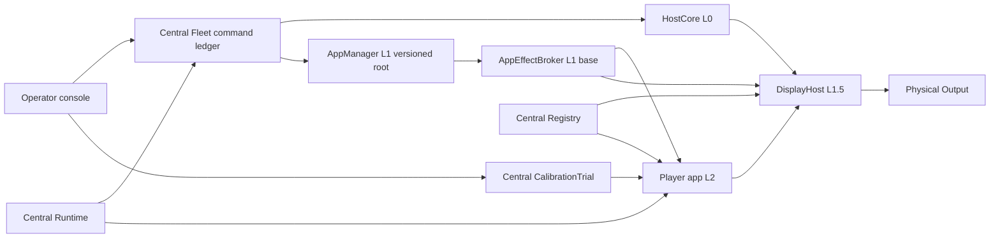

# Player node domain model

**Status: proposal for owner review, 2026-09-30.** This is a design contract for a future PR update, not a deployment report. It refines the [fleet design](player-fleet-control-design.md) and [red/blue contracts](player-fleet-red-blue-refinement.md) against [U1, U4, U6 and U9](requirements.md#failure-visibility-and-recovery). “Selected” below means the owner has chosen a direction; “staged” means code exists in PR #39; “qualified” requires the stated physical and rollout evidence. None of the new host/display behavior described here is qualified.

## Promise, failure envelope and selected choices

**Selected product direction.** The Player remains a real Debian `.deb` with declared dependencies. CI resolves and configures its recursive dependency closure against a pinned, authenticated Debian repository snapshot **before release**, then seals an app-private read-only environment. A Pi stages and activates those exact bytes; it does not run the package's scripts against the host root. The owner accepts a trusted LAN plus serial claim as sufficient command assurance, named `lan_serial` / **T0-LAN-command**. It permits remote reboot and app effects through separate boot-scoped sessions, with replay fences and independent credentials; it does not authenticate a physical device or make a serial unspoofable. T1 managed attachment and T2 hardware identity are optional hardening paths. An operator-requested reboot is dispatched immediately even during an active Run. Central durably records the request before dispatch; Runtime records an interruption only from subsequent host/app evidence and reconciles it asynchronously. The Run itself remains active: only Output(s) on the rebooted Player are interrupted, while other Frames and Actuators continue under that Run with no implied command. No drain or Actuator safe-state acknowledgment delays the command.

**Proposed supported-base guarantee.** Under a qualified base image and resource envelope, changing or breaking the app release cannot modify Host Management code, units, credentials or protocol, and cannot prevent its independently supervised host report or authenticated reboot path. CPU, memory, process, IO, tmpfs and network isolation support this claim; a shared GPU/kernel still needs stress qualification. Power loss, firmware/kernel failure, network or Central loss, PXE failure, graphics/compositor failure and an unstarted or broken base are outside the visibility guarantee. A host heartbeat is never proof of output pixels. U1's base page is available after the base display stack starts on a connected working Output; a failed compositor or physical panel must be reported as `output_unknown`, not silently counted as a visible page. The pre-OS stage-one text path is a separate assumption in [requirements](requirements.md#failure-visibility-and-recovery).

**Staged limits.** PR #39 stages T0 base observation, exact offers, data-only `pw-player-data-v1` artifacts/executor work, app desired policy, internal command ledger, recovery lease and read-only status. It does **not** stage this Debian closure format, independently isolated HostCore, host telemetry/reboot route, AppEffectBroker split, base DisplayHost, live calibration transport, `lan_serial` command sessions or physical continuity. Its current internal command/recovery principal contracts use T1/T2; they cannot be relabeled as `lan_serial` without a versioned schema and protocol change. The selected Debian-closure target supersedes the D15 *target direction*; existing data-only rows, contracts and tests remain an accurately labeled historical stage until a versioned migration. The legacy root-running `.deb` path cannot claim host continuity.

## Layer goals and fact ownership

The node has four functional layers; L1 has two separate processes because coordination and privileged effects need different authority. These are ownership boundaries, not a startup dependency chain: HostCore and DisplayHost must work without AppManager or Player Runtime.

| Layer | Goal | Success means |
|---|---|---|
| L0 — HostCore | Keep the node observable and independently rebootable. | Host evidence and the scoped reboot path remain available within the supported base envelope, even when app management or rendering fails. |
| L1 — App Lifecycle: AppManager + AppEffectBroker | Prepare a replacement in the background, then perform only an authorized switch and recover it. | Preparation preserves healthy playback; one exact update owns mutation; the old or new accepted app reaches a reconciled state. |
| L1.5 — DisplayHost | Preserve a trustworthy operational display boundary. | Each Output has independently admitted app content or a base diagnostic while the display backend works; no heartbeat is mistaken for pixels. |
| L2 — Player Runtime | Execute the current authorized show. | Media, logical time and the canonical calibration transform converge on Central's current assignments without acquiring host authority. |
| Central owners | Keep durable intent, authorization and reported outcomes distinct. | Fleet owns release/reboot operations, Runtime owns Run consequences, Registry owns equipment/configuration, and CalibrationTrial owns pending edits. |

An **application update attempt** (`AppAttempt`) is one operation to stage and activate an exact application release. It is not a Player connection or session. A connection can be replaced during the same attempt; an app process restart creates a new app epoch; a node reboot creates a new boot. None of these identities substitutes for another.

### Context

| Owner | Exclusive authority and evidence | Explicitly outside its authority |
|---|---|---|
| **HostCore (L0 base)** | Small, independently built executable/import closure, unit, command-free T0 observation sequence, separate boot-scoped `lan_serial` reboot session, command receipt/event journal and resource reserve. Samples kernel/CPU/memory/uptime/filesystem and supervises L1/DisplayHost unit state. Executes only a matching scoped operator reboot. | No package resolution, app-root mutation, Player imports, Runtime drain decision or pixels. L1 cannot request its reboot or borrow its credential. |
| **AppManager (L1 versioned root, base supervised)** | Desired exact-artifact workflow, verified staging, capacity, attempt phase and recovery requests. Its executable/import closure is an exact manager root with its own versioned fallback; a small base-owned launcher owns manager-root verification, bounded startup supervision and exact fallback selection, independently of the manager. | Cannot select desired policy, write HostCore files, install against host root, send an L0 reboot or assert app playback. Central Fleet owns desired policy. |
| **AppEffectBroker (L1 base)** | Sole local writer of active app pointer, exact `intent_stop`/mutation journal and lock, app service invocation and package child/cgroup. Executes narrow typed root operations only for the latest desired stage fetched through its own `app_effect` session, after verifying the exact prepared roots and the exact old process locally. | Does not import Player or package dependency logic, resolve tags, decide policy or hold HostCore reboot credentials. An L1 socket call is not authority by itself. |
| **DisplayHost (L1.5 base)** | Exclusive final scanout/compositor policy, per-Output mode/connection generations, base error page, overlay lease, bounded local diagnostic IPC and app-surface admission. Observes compositor buffer presentation and renews a local app-surface lease. | Does not calculate calibration homography, infer physical pixels, release Runtime commitments or hold L0 reboot credentials. |
| **Player Runtime (L2 app root)** | App enrollment/control epoch, media/cache, Scene execution, one canonical calibration transform, bounded media fault codes and output-pixel diagnostic primitives generated from the same rendered frame. | No host identity/health, package or reboot authority, privileged display layer, direct DRM/KMS ownership or host credentials. |
| **Central Fleet / Runtime / Registry / CalibrationTrial / PXE** | Fleet desired artifact and immutable commands / Run admission, Output-specific interruption and reconciliation within a continuing Run / Frame identity, placement, binding and committed calibration / leased pending candidate / exact boot offer. Each emits provenance, assurance tier and read time. | No cross-owner fact may be inferred from timestamp proximity or a fresh heartbeat alone; one Output's interruption does not imply commands to another Frame or Actuator. |

These boundaries need separate UIDs, file ownership, sockets, cgroups and release/import graphs. Base units start without an app root; the app root is mounted read-only with only declared writable cache and communication paths. Player cannot open raw DRM/KMS devices or privileged Wayland protocols. HostCore, broker and DisplayHost must not load libraries, Python modules or GStreamer plugins from the dynamic app root. The current provisioner's `StartLimitAction=reboot-force` is incompatible with the L1 failure boundary and must leave the app crash path before claiming HostCore independence. [systemd resource controls](https://github.com/systemd/systemd/blob/main/man/systemd.resource-control.xml) specify CPU, memory, IO and task controls; [systemd execution settings](https://github.com/systemd/systemd/blob/main/man/systemd.exec.xml) cover filesystem/device and credential isolation. Those mechanisms require verification on the pinned Pi build and do not isolate a shared GPU completely.

## Typed seams and temporal authority

These are conceptual records, not claims that current wire schemas implement them. IDs, sizes, strings, payloads and retries are bounded. An issuer freezes each immutable command before any replica exposes it. Local state reports name their observation source. The observational T0 report remains command-free; a **separate** `lan_serial` boot-scoped management session supplies only the selected trusted-LAN command assurance. Neither that session nor an app bearer proves physical device identity.

| Seam | Required fields and acceptance rule | Owner of the resulting fact |
|---|---|---|
| `HostObservationVn` | Claimed device/boot and agent incarnation, per-boot sequence, measured metric `{name, value, unit, sampled_boottime_ms, source}`, bounded fault and receipt time. T0 may report a claim but cannot authenticate physical identity. Sequence orders only one boot/incarnation. | HostCore samples; Central stores claim and receipt age. |
| `RebootIntentVn` | Immutable command ID, operator/audit reference, claimed device generation, exact offer/audience, target kernel boot and current `lan_serial` HostCore session, Central-clock dispatch expiry and scope `operator_reboot`. The command carries no node-clock deadline: Central dispatches it only while unexpired by its own clock and HostCore deduplicates by command ID. Session and receipt are separate from observation and app-effect credentials. Exact retry returns the same command/receipt. | Central Fleet issues under the selected trusted-LAN assurance; HostCore accepts only once in that boot. |
| `CommandResponseVn` / `RebootReceiptVn` | Exact command ID and payload identity, responder, boot/session scope and `received`, `accepted` or `rejected` with a bounded reason. Receipt is not effect evidence; acceptance is not completion. Reboot dedupe lives in HostCore's `/run` journal within the boot. | The receiving owner reports its admission decision; Central stores it separately from outcomes. |
| `NodeEventVn` / `RebootInitiatedVn` | Event identity, producing owner/incarnation, boot, sequence and local occurrence time; relevant attempt/epoch/Output/revision; bounded cause and optional causative command ID. Reboot initiation names its trigger and observation source, not a completed reboot. | The owner that performed or observed the transition emits evidence under its existing assurance; Central reconciles it. Events confer no authority. |
| `AppEnvironmentRefV2` | Immutable environment digest/size, `.deb` digest/name/version/architecture, exact dependency lock and source snapshot/provenance, allowed entry point, required base ABI and graphics/plugin ABI. | Release pipeline publishes; Central freezes in offer/attempt. |
| `ColdInstallAuthorizationV2` | Exact BootOffer and app environment reference for that boot. No healthy app stop authority. | PXE/Central freezes; broker verifies. |
| `AppStageV2` | Exact operation, command, target and qualified fallback environment refs, claimed device generation, boot and the AppEffectBroker producer, plus the exact old process/app epoch/environment. It is desired state, not a bounded grant: the latest stage for a device wins, it carries no expiry, and Central refuses it at stage time without a qualified fallback. A Frame-bound Player is admitted; its switch follows the operator-reboot rule (D16, answered 2026-10-02). Its `app_effect` scope is distinct from HostCore's `operator_reboot`; no tag resolution or caller-selected path. | Central Fleet records the stage; the broker binds it to its own producer (not one session), verifies exact bytes and the old process locally, then performs the switch. A session renewal does not invalidate the stage. No physical-device authentication is claimed. |
| `EffectJournalVn` | One writer/lock; exact intent, stage, active/fallback root digests, process/cgroup identity and whether `intent_stop` was durably written before stopping. Root-owned and restart-safe only within a boot. | AppEffectBroker writes; AppManager observes. |
| `AppEffectEventV2` | Same boot/operation/command; per-operation sequence; phase `intent_stop`, `stopped`, `starting_new`, `running`, `target_failed`, `fallback_starting`, `fallback_running` or `effect_unknown`; exact new process/app epoch/environment for start phases. | Broker journals each local transition before reporting it and reports in order whenever Central is reachable; reporting never gates local progress. Central projects operation state from the latest event and never treats an event as authority. An operation of a superseded boot projects as `interrupted_by_reboot`. |
| `OutputKey` | Boot, DisplayHost incarnation, physical connector/Output ID, connection generation and mode generation. Both generations change on every disconnect/mode change; new host incarnation defeats a reset/ABA. | DisplayHost owns. |
| `AppPresentationVn` | OutputKey, current app process/service incarnation and epoch, binding generation, committed config/calibration revision, compositor-created buffer/presentation fence and renewable liveness lease. | DisplayHost can assert `presented_to_compositor` only for this tuple; Runtime separately authorizes public commitment. |
| `CalibrationTrialVn` | Trial ID/generation, operator, Frame/Output/OutputKey, boot/app epoch, binding generation, baseline committed revision, latest candidate sequence/hash, short inactivity and hard expiry, state. | Central Trial owner; Player applies candidate; DisplayHost acknowledges one matching presentation. |

### Commands, responses, events and current state

A **command** requests an authorized effect. A **response** reports what the receiving owner did with that request. An **event** reports a transition that owner performed or observed, whether caused by a command, local failure, lease expiry or another permitted mechanism. A **snapshot** reports current observed state at a named cut. These are semantic roles, not mandatory separate transports: an event may accompany a response, but retains its own identity, source and evidence meaning. Event ingestion acknowledges storage only; it never grants permission to act.

A transport success or `received` response establishes delivery, `accepted` establishes admission, and an effect event establishes only the reported transition. Commands and events may arrive in either order. A command can have zero, one or several events; an event may have no command. Correlate causation only when the producer knows the exact initiating command; never infer it from proximity in time. An independently triggered reboot does not fabricate a Central command or implicitly authorize a new automatic reboot policy.

The following inventory covers the proposed node protocol families in both directions. Event names are conceptual; existing wire formats remain unchanged until versioned migration. The [execution contract](execution-contract.md#control-channel-semantics) owns the general rule; this table assigns node-specific producers and limits.

| Request or command family | Response establishes | Independently reported facts and owner |
|---|---|---|
| Reboot: Central → HostCore | Exact reboot request received/accepted/rejected. | HostCore: `RebootInitiated` with trigger and optional command; base: later-boot observation. Initiation is not completion or output cessation. |
| Desired release, cold install, online activation, repair/fallback: Central → App Lifecycle | Policy recorded or exact operation admitted/rejected; stop permission remains separate. | AppManager: staging verified/refused and attempt progress; broker: stop intent recorded, process stopped, root activated, process started, fallback activated. Control/readiness acceptance comes from the app and its qualified local process linkage, not the installer. |
| App switch and handoff: Central Fleet ↔ broker/DisplayHost | Stage response `accepted` (preparation begins) or refused with exact identity. | Broker: `intent_stop`, stop, start, fallback and unknown-outcome events; DisplayHost: surface admitted/withdrawn; Central Runtime: Output participation reconciled from observed process exit and later surfaces. A response is not an effect. |
| Configuration/binding/committed calibration: Central Registry → app/DisplayHost | Identified revision received or rejected. | Each applying owner: configuration adopted or rejected; DisplayHost: matching presentation or surface invalidation. Central committing configuration does not prove adoption. |
| Calibration candidate, commit/revert/end: Central Trial/Registry ↔ app/DisplayHost | Candidate accepted into the trial CAS row, or Save committed/refused centrally. | Player: candidate applied/reverted; DisplayHost: exact buffer presented or diagnostic removed; Trial owner: committed/expired/terminated. Commit, adoption and presentation remain separate. |
| Identify/diagnostic enable, disable or lease renewal: Central → DisplayHost (legacy app relay where supported) | Scoped request accepted/rejected. | DisplayHost: overlay presented, disabled, expired or invalidated for the exact Output/trial. Lease expiry can occur without a command. |
| Plan/preparation/media acquisition: Central → Player Runtime | Identified plan parsed/admitted/rejected. | Player: exact file secured/lost, playback prepared/invalidated, capacity or clock readiness changed, bounded media fault. Acquisition and readiness do not confer execution authority. |
| Commit, supersede, cancel/finish, lease/revocation delivery: Central Runtime → Player Runtime | Exact execution authority received/accepted/rejected. | Player: execution started/stopped/completed/failed or authority expired with plan/Run/epoch context; DisplayHost: separate presentation facts. Central Runtime alone decides Run lifecycle; report an Output contribution, not an inferred whole-Run completion. |
| Enrollment/reconnect/hello, scoped management-session acquisition and boot offers: node → Central | Session/capabilities accepted or refused with exact boot/audience/scope; immutable offer issued. | Central records issuance; local boot/app owners report observed boot, process and adoption facts separately. Neither enrollment nor an offer proves bytes received or output working. Reconnect returns current state and authority, not a replay of old effects. |
| Telemetry/event upload, health/status reads, time probes and artifact/media GETs: either direction as scoped | Receipt/storage, sampled state/time, or requested bytes. | No synthetic effect event is required for a pure read or upload acknowledgment. The consumer separately reports verification, clock-quality changes or readiness where relevant; HTTP success alone is not those outcomes. |

**Ordering and reconciliation.** Event keys include installation/device generation, kernel boot, producer and producer incarnation plus sequence; references include applicable app epoch, attempt, OutputKey and configuration revision. Occurrence time uses that boot's monotonic clock; Central adds receipt time and assurance/source. Sequences order only one producer incarnation, never different layers or boots. Exact command retries reuse the command identity and recorded admission result; reusing an ID with different payload is refused. Later outcomes are fetched as state/events, not returned as a newly executed command.

Producers retry events without repeating their effects. Central deduplicates event IDs without refreshing their original evidence age, rejects conflicting reuse, and persists accepted event evidence and its reconciliation work atomically (or durably queues it in the same transaction). Reports from old epochs remain historical and cannot revoke or refresh current authority. Reconciliation is idempotent and uses the same generation/Runtime locks as other authority changes. Events are evidence, not the sole state store: reconnect also supplies a versioned current snapshot and fresh authority exchange. Each snapshot is a coherent cut of its producer's owned facts and names its incarnation and covered-through event sequence. Within the accepted incarnation, Central stores a per-fact sequence/revision watermark with the projection in the reconciliation transaction. A snapshot advances the covered facts through its cut; a delayed event at or below their watermark is historical even if its event ID has never been seen. A partial event advances only the facts it reports, so reordering independent facts does not discard their evidence. A snapshot older than a fact's watermark cannot overwrite it. Across producer restarts, use the accepted incarnation/context transition, not numeric sequence comparison or receipt time. Multi-owner views expose separate cuts instead of inventing one global order. Gaps, queue overflow and uncertain intervals are explicit; a snapshot can establish current state but cannot invent missed transitions or their causes.

Retention stays bounded. HostCore/broker retain their existing boot-scoped journals and a bounded `/run` event outbox; DisplayHost uses bounded boot-local state, and Player Runtime uses process-local memory only. Central retains durable accepted evidence; no durable app journal or guaranteed cross-reboot event delivery is introduced. Overflow cannot erase dedupe or active mutation fences; reserve journal capacity before admitting an effect that requires it, and report event-stream gaps independently. No Central event-upload acknowledgment is required before immediate reboot, lease expiry or local failure handling. A crash or power loss may erase an unreported event; silence stays unknown and cold recovery uses Central's exact records.

### Host report and reboot

Host observation remains separate from command routes and app bearer; its response is a receipt only and never carries a reboot or app-effect command. Under the owner's selected `lan_serial` assurance, a trusted-LAN serial claim may establish a **separate boot-scoped HostCore reboot session**. New command-capable offer/audience/session schema is required: existing T0 audiences cannot be silently promoted, and staged migration-042 sessions accept only T1/T2. HostCore and AppEffectBroker keep distinct root-only session secrets and non-overlapping `operator_reboot`/`app_effect` scopes. Central audience binding, exact offer, per-session secret, command ID, generation, target boot, Central-clock expiry and local journal fence reduce cross-channel and replay errors; they do not authenticate the physical Pi against a LAN adversary. Exact retries return frozen bytes. Admission takes current boot/session/generation locks and rechecks deadline and revocation **after** those waits and immediately before returning command bytes. A claim for its matching offer always admits its boot: a new boot supersedes the prior admission and revokes that boot's sessions, so a rebooted Player re-enrolls without naming its predecessor. Duplicate-serial Pis therefore flap visibly (each enrollment revokes the other) rather than being fenced. A grant states a duration; each node owner samples its own boot clock just before its enrollment POST, expires the grant at that sample plus the duration, and re-enrolls after any 401/403. Central never maps or compares node clock time. T1/T2 can later strengthen issuance without changing the meanings of existing observations or command receipts.

Central first commits the immutable operator intent and audit in the Host/Fleet ledger, then dispatches the boot-scoped command without a Runtime drain, Runtime lock, participant enumeration or Actuator safe-state wait. A ledger failure prevents authorization. A failed send leaves `requested, delivery unknown` and does **not** revoke a still-running app epoch or mark any Output interrupted. A `RebootReceiptVn` establishes command admission only. HostCore separately emits `RebootInitiatedVn` when it requests reboot, or when a base-owned observer sees another permitted reboot mechanism initiate; it names the trigger (`operator_command`, a separately authorized local mechanism, or `unknown`) and exact command only when known. Best-effort reporting must not delay dispatch. An unobservable abrupt reset may produce no initiation event. Initiation marks disruption at risk, not completion: shutdown can hang while playback continues. Loss of the app control connection, heartbeat timeout or event silence leaves presentation unknown; already authorized output may continue within its lease. Affirmative current-process exit, matching surface withdrawal/invalidation or accepted later-boot evidence establishes interruption of the corresponding app contribution, with provenance rather than a claim about physical pixels. Authority expiry is recorded separately from observed presentation loss. A later boot does not establish the cause of reboot. Runtime uses the event's boot/epoch and historical binding generations at its observation cut to mark only the matching Output contributions interrupted. A delayed old-boot event cannot interrupt a replacement process or newer binding. The same Run remains active; other Frames and Actuators retain their existing commitments and continue, with no new or implied command. The interrupted Output's logical Run time advances while its physical presentation is absent, and after a fresh app epoch and handoff it may rejoin at the Run's **current** state if that Run is still active; missed content is not replayed. A two-Output Player reboot physically interrupts both of its Outputs, never an unrelated Player's Output. New-boot enrollment uses a new app epoch, so old grants cannot replay. Any Central path that revokes an old epoch and issues a new grant must serialize on the same Registry generation at effect commitment; this asynchronous reconciliation does not delay reboot dispatch. A second HTTP request for the same command may return the same receipt but must not trigger a second reboot. A lost response remains `unknown` with no blind new command. The target-boot fence rejects an old intent on a new boot. HostCore's automatic watchdog policy remains separate and unopened.

The host may show a base `restarting` page while its display service runs, but shutdown and firmware reboot can go dark. After a new base starts, DisplayHost shows the base page before admitting an app surface. A reboot can interrupt an app attempt; the next boot must not promote its candidate from silence. Its old `/run` journal and staged RAM roots are gone. Central retains the exact target/fallback references and the operation, which projects as `interrupted_by_reboot`; the new boot takes the existing cold path from its frozen offer and is not handed the old boot's stage. It never re-resolves a mutable tag. Under the selected immediate-reboot rule, Actuators and other Frames already participating in the active Run continue; reboot sends them no safe-state, cancel or restart command.

### Background preparation and authorized application replacement

AppManager prepares an application update attempt in the background: fetch, verify, expand immutable target/fallback roots and check ABI/capacity under resource limits that preserve the active renderer and L0 reserve. Do this substantial preparation before any disruption. Once staging is ready, the broker rechecks exact bytes, compatibility, capacity and the exact old process immediately before withdrawal; a failed check leaves the old process running and the stage `preparing`, with nothing held at Central. Throttle or defer preparation if that headroom is unavailable; preparation success is not activation permission. Do not switch the active pointer, stop the old app, revoke its valid surface lease, seize final scanout for candidate testing or cover it with a full-screen diagnostic merely because an attempt exists. Candidate GPU/decoder tests that cannot coexist within the qualified envelope wait for authorized withdrawal. Preparation failure, cancellation, supersession or manager failure leaves healthy old playback intact within its existing authority; management status is reported separately.

Only after preparation, with its exact roots verified, does the broker check the exact old process, record `intent_stop` and enter the disruptive switch; Central issues no stop permit and holds no drain. DisplayHost admits the recovery diagnostic on this transition or an independently observed output/app failure. A switch of a Frame-bound Player follows the operator-reboot rule (D16, answered yes 2026-10-02), whether the Frame was bound before or after staging: Runtime marks each bound Output interrupted from the observed process exit; the new app process re-enrolls with a new authority epoch, so those losses no longer fence and the Outputs rejoin at the Run's current state (missed content is not replayed). Bindings and calibration are untouched. The [console DDD §29 G6](operator-console-ddd.md#29-backend-gates) DB test proves Central's half (each bound Output interrupted from a synthesized observed exit, the epoch-bump rejoin, calibration kept); the node half (the broker emitting exit evidence, DisplayHost releasing the old app's bound surfaces and admitting the new process on a bound Output) is not yet qualified: the PID1 switch scenario refuses bound Players. To undo a switch, the operator stages the current environment. This rule does not postpone the separately selected immediate operator reboot.

### Owned stop and bounded local recovery

The base process adapter owns the durable stop operation. Its successful completion
proves old-process/subtree quiescence; transient observation errors remain pending,
and restarting the broker reattaches without another dispatch. Stop request,
recovery obligation and lifecycle intent are persisted atomically. HostCore must
acknowledge the immutable local obligation before dispatch and independently service
its deadlines without Central session success. Exact replacement-process local
control proof disarms recovery before Central publication; a general network outage
never arms it. HostCore records one reboot intent before invoking its existing
driver, and same-boot restarts cannot repeat that request. A failed driver remains
explicitly unknown; physical watchdog recovery is a separate qualification.

The [stop/recovery contract](evidence/2026-09-30-node-stop-observation-proposal.md)
owns crash and authorization rules.

### Recovery of AppManager itself

The base-owned **manager launcher** owns recovery of the L1 manager executable; it is not another app-policy planner. For this proposal, a base release pins the exact manager root and any accepted compatible fallback root, including digest, size, entry point and launcher/broker ABI, and carries those immutable bytes. Independent online manager self-update is outside this contract; changing that selection requires an explicit compatible base rollout. The launcher verifies the selected root, observes startup/process health under a bounded deadline/retry budget, and on verification or startup failure tries the exact accepted fallback without importing the failed manager. Within the boot it retains the failed-root fence and selection in its own bounded record. With no usable root it stops cycling and reports `manager_recovery_required` through HostCore; a new boot uses the frozen base selection, so changing a persistently broken selection requires base recovery rather than an assumed app update.

The launcher may change only the manager service/root selection. It cannot stop Player Runtime, switch an application root, release a Runtime drain or invoke reboot. Healthy app output therefore continues within its authority while manager recovery runs. A recovered manager must first reconcile the broker's surviving child, journal and exact immutable application attempt; recovery never authorizes a second mutating attempt. HostCore and DisplayHost remain independent of both manager roots. This deliberately assigns one small recovery owner without teaching HostCore Debian dependency or app policy logic.

### Debian closure and app effects

The release pipeline validates the real Player `.deb` control metadata and resolves its **entire required** dependency closure, including alternatives and architecture choices, from a pinned authenticated snapshot. It configures the closure in an isolated build root, runs any package maintainer scripts only there, captures exact package names/versions/digests and build provenance, and seals a read-only app environment with entry point and ABI manifest. Debian's [relationship rules](https://www.debian.org/doc/debian-policy/ch-relationships.html) distinguish required `Depends`/`Pre-Depends` from `Recommends`; the latter is not silently promised as part of the required closure. [Maintainer scripts](https://www.debian.org/doc/debian-policy/ch-maintainerscripts.html) are genuine installation effects, so executing an app `.deb` on the host root cannot meet this boundary. CI rejects unresolved/unsigned inputs, host-root service or kernel/udev mutations, setuid/capability/device files, unsafe links/binds and runtime loading outside the sealed paths. Dynamic loaders, GI typelibs, fonts and GStreamer plugin discovery require explicit tests, because Debian relationship closure alone does not prove runtime closure.

The base ABI owns kernel/DRM drivers, compositor, DisplayHost, HostCore and broker. The app environment may carry user-space rendering dependencies only behind an explicit client/driver/protocol ABI; base graphics libraries and privileged sockets remain outside its writable closure. A base ABI mismatch refuses selection before stop. Capacity covers target and fallback compressed bytes, expanded roots, compositor, diagnostic page, app renderer and reserved L0 headroom. CI and Pi tests launch the app in an empty clean base with no accidental host package fallback, then start L0/DisplayHost with the app root missing or corrupt. A pinned package snapshot and one exact digest protect reproducibility; a package version string alone does not.

For a cold first install, the broker accepts the frozen BootOffer's exact app ref without pretending a prior healthy app was stopped. For an online switch, it fetches the latest desired stage through **its own boot-scoped `lan_serial` `app_effect` session** and binds it to its own producer, offer and boot. It never treats HostCore's `operator_reboot` session as an effect credential. AppManager holds neither a broad broker socket authority nor HostCore's reboot credential; broker IPC accepts only typed operations on exact digest-named roots under an allowlisted directory. Once both roots are verified, the broker checks the exact old process, records `intent_stop` together with the immutable recovery obligation, arms HostCore recovery, performs the owned stop, starts the target and falls back to the accepted fallback if the target fails, reporting each transition as an effect event. Central reachability never gates these steps; queued events are reported in order on reconnect, and an event Central permanently refuses (a 4xx other than session refusal or backpressure) is dropped and counted rather than blocking the ones behind it. A newer stage replaces an accepted one only before its `intent_stop` or after the switch reached `running`/`fallback_running`; a stop or start in flight always finishes, and an ambiguous outcome (`effect_unknown`) belongs to the HostCore recovery obligation. It keeps one cgroup/child owner across broker restart and never blindly repeats an ambiguous stop or spawn. A manager or broker crash cannot authorize a second mutating attempt. The broker's generic typed root operations do not parse Debian policy or import Player code.

**Operational completion is projected, not discharged.** Central projects each operation from its latest reported effect (`staged`, `superseded`, `switching`, `target_running`, `fallback_running`, `effect_unknown`, `interrupted_by_reboot`). An operation replaced by a later stage projects as `superseded` whatever it reported; its latest effect stays visible as detail. No drain, permit, revalidation or discharge record exists, so a lost or late event can delay the projection but cannot strand the device. Run continuity and Frame participation follow the existing Output-scoped reconciliation from `AppProcessFact` exit/running evidence.

**Versioned migration:** introduce `AppEnvironmentRefV2`, new offer/attempt/command schema versions and capability negotiation. Add explicit `lan_serial` HostCore and broker session/trust-mode rows, scoped command and recovery contracts; do not relabel existing T1/T2 principals or migration-050 recovery leases as physically verified `lan_serial` sessions. Keep `pw-player-data-v1` rows and schema-1 boot trees immutable and served by their existing routes until retired deliberately. An old Central route must not reinterpret a V2 digest as a V1 payload; an old base must receive a named incompatible/unavailable result, not a mutable manifest fallback. Catalog/GC roots and per-pod byte availability cover each version's exact reference. Expand storage and mixed-version readers before enabling writes; old Central rollback binaries must understand active fences and all still-bootable base protocols or the rollout gate remains closed. [D17](player-fleet-red-blue-refinement.md#rollout-and-decision-gates) owns the rollback gate.

### Display and calibration

DisplayHost includes the base-owned compositor policy and privileged diagnostic surface, and is the only process allowed final scanout. The app receives constrained per-Output surface capability, no DRM/KMS or privileged overlay access. Host page and overlays use raw physical Output coordinates, after the app's crop, warp and gain. Priority is: base fatal/recovery or reboot page; bounded calibration/media status in reserved regions; Identify; app surface; authored Scene layers within that surface. A black Scene, zero gain or malformed app quad cannot hide a base status. An app may submit only bounded code/primitives through local IPC tied to its current process/epoch/Output; it cannot submit arbitrary logs/URLs/credentials, seize top priority or dismiss a base fatal page. A legacy observational T0 app can carry a calibration diagnostic through app control and restricted IPC while alive, with no OS command authority. On a new command-capable base, independent remote DisplayHost control through app failure uses its own bounded `lan_serial` diagnostic grant, separate from HostCore reboot and broker effect sessions; the console shows the capability actually available. If an app dies, the autonomous base error/identity page remains regardless of remote OSD capability.

DisplayHost starts with an Output identity/error page even when there is no app root. L0 supervision supplies a generic manager/process fault if L1 fails before it can report; the host page never relies on L1 reporting its own crash. A Frame ID/name, x/y position and binding are versioned Registry facts under a short binding/freshness lease; expiry or mismatch becomes `binding unconfirmed` while Output ID and actual mode remain visible. A display name needs an authored field; current Frame ID is the reliable fallback. Actual mode and connection generation come from the base display backend, not startup enrollment. The app owns applied corner coordinates, crop, rotation and SDR gain. The host never implements a second homography. Panel brightness is `unavailable` until measured through a separately qualified readback; SDR gain must not be labeled hardware brightness.

An Output's app surface enters a behind-diagnostic test state. The host observes a compositor-created buffer/presentation fence with exact `AppPresentationVn` identity; it keeps a **renewable** liveness lease after the first frame, including for static photos. Process exit, surface lease expiry, invalid active epoch/revision, host restart, Output connection/mode change or authorized withdrawal restores the base diagnostic and invalidates the affected surface authority. Beginning or staging an application update attempt does not invalidate the operational old surface; only that attempt's candidate test surfaces may be reset. A pending configuration revision is not an active-revision mismatch until its authorized adoption boundary. A self-reported frame token can correlate geometry, but cannot alone prove which pixels were scanned out. The host tracks three separate facts: `(1)` app buffer presented on Output A, `(2)` A's diagnostic released, and `(3)` Runtime commitment released for A. A first frame can establish only the first; the lifecycle/Runtime owner authorizes the latter transitions. Output B's failure cannot be hidden by A's success; cross-Output or secured Run release is one Runtime participant decision. The host cannot settle a Run. Physical pixels remain a separate qualification tier.

The proposed CalibrationTrial is independent of Scene/plan identity and the existing 30-second Registry preview field. One active trial per Frame/Output uses a Central CAS row `(trial_id,generation,latest_seq,hash,state)` bound to the current OutputKey, Player epoch, binding generation and committed calibration revision. Validated pointer edits coalesce to the latest sequence; Central persists the latest state before any push, and reconnect reads the versioned latest state because an ephemeral notification is not a replay log. Player applies a candidate and its geometry in one render-thread update, emits output-pixel primitives and the applied hash with the *actual transformed buffer*, and DisplayHost draws them only against that compositor buffer/fence. Host acknowledges `presented_to_compositor(trial,seq,hash,OutputKey,process,epoch,buffer)`; the UI first says `pending requested`, then `pending presented to compositor`. Neither software state claims visible physical pixels.

Central commit first freezes the trial against further updates, then checks baseline revision/binding/OutputKey and the **exact latest accepted sequence/hash** and requires its matching DisplayHost `presented_to_compositor` acknowledgment. A missing, stale, differently hashed or older-sequence acknowledgment refuses Save; there is no unverified-save shortcut in this calibration workflow. Registry atomically writes one committed revision and terminates the trial. Player rejects late packets for a terminal trial or older committed revision; host invalidates their overlay. A committed Registry write and a Player adoption/presentation acknowledgment are distinct statuses. This selected Save gate is operational evidence, not physical pixel proof; the operator still reviews the real panel. The short inactivity lease and hard cap expire using Central time, while app and host also enforce bounded local monotonic deadlines. Browser disconnect, Central partition, app crash, host restart, rebind, mode/connector change, authority loss and reboot all remove the pending candidate locally and restore committed geometry when an app remains; a base error page covers app loss. The diagnostic enable lease is separate from authored playback and expires independently. A media fault code can coexist in a reserved OSD region without replacing the calibration state.

## Failure matrix

| Trace | Host/Output behavior | Central conclusion and retained authority |
|---|---|---|
| L1 import fails or broker child survives manager restart | L0 reports the manager fault; the base launcher tries its exact accepted manager fallback within its bounded budget; healthy old presentation remains admitted. If the app is absent, DisplayHost shows the base page. Broker inspects a surviving child before retry. | Management recovering or `manager_recovery_required`, with attempt `unknown` until reconciled; infer neither app failure nor a second effect from manager failure alone. |
| App `.deb` includes root script, setuid member or host bind | CI rejects closure; Pi refuses incompatible artifact before stop. | Exact target remains ineligible; old app/accepted fallback continues if safe. |
| App saturates memory/CPU/tmpfs or GPU | Resource quotas protect L0 and host within measured envelope; shared GPU reset may make Output unknown. | Host receipt stays distinct from presentation; physical continuity unqualified until stress pass. |
| Central unreachable after the stage was accepted | Broker completes the switch locally once roots are verified; events queue in the boot-scoped journal. | Events are reported in order on reconnect and the projection catches up; nothing is held at Central and no refusal follows from elapsed time. |
| Broker wrote `intent_stop`, then crashes or reboots | Base page covers missing app while display works; new boot discards old volatile journal. | Attempt remains `unknown/recovering`; rehydrate frozen target/fallback or require explicit recovery; never call timeout `failed`. |
| Operator reboots mid-Run or mid-trial | Base `restarting` while service lives; reboot firmware may go dark; next base starts on base page, no old trial/surface. | Immutable request/audit precedes immediate dispatch. Receipt marks admission; initiation event marks risk; affirmative process/surface loss or accepted later-boot evidence marks only the matching Output contribution interrupted. Transport loss alone leaves presentation unknown. The Run stays active; other Frames and Actuators continue their existing commitments with no implied commands. A failed send alone marks no interruption. |
| HTTP reboot response/event lost or shutdown hangs | Host may have accepted or initiated reboot; app may still render; no verified new boot yet. | `effect unknown`; same command may be queried/replayed without a second effect; no blind new reboot. |
| App reports preview seq 8 but presents seq 7 buffer; seq 9 arrives after commit | Host does not acknowledge seq 8 without matching actual buffer/fence; terminal revision rejects seq 9. | Console never calls seq 8 physically visible; committed and adopted states remain separate. |
| HDMI-A-1 disconnects/reconnects with identical mode, or host restarts | New connection generation or host incarnation invalidates prior surface and trial; base page returns. | Frame label becomes unconfirmed until current binding lease; qualification must be renewed. |
| Output A presents; B stalls in a shared Run | A can show a qualified app test buffer; B keeps base page. | Per-Output presentation and handoff facts remain distinct; A's first frame cannot release B's commitment. A reboot affecting B leaves the Run active and A and its other participants continuing. |
| App dies after first valid buffer or DisplayHost crashes | App exit/lease loss restores base page if host lives; host/compositor crash means Output unknown until supervised recovery. | Fresh L0 heartbeat cannot be projected as display health. |
| Central rolls back with new base still bootable | Old binary serves the bounded host protocol and recognizes active fences, or command gate remains closed. | No schema-only rollback claim; old boot tree retains its explicit legacy route. |
| Update target rejected or superseded during staging | Old operational surface/lease remains valid; preparation stops without pointer mutation or full-screen diagnostic takeover. | Attempt outcome is separate from current playback; the superseded stage projects as `superseded` and holds nothing. |
| Reboot delivery fails and control transport drops | Existing authorized playback may continue; no process-exit or surface-loss evidence. | Delivery/presentation unknown, not an observed interruption. |
| Initiation event precedes command response, or an old event arrives after rebind | Store distinct facts with original boot/epoch and causation, if known. | No duplicate reboot, manufactured command, or interruption of the new binding. |

## Acceptance and rollout gates

**Software evidence before activation:** test recursive Debian closure against the pinned snapshot and clean app-private root, malicious member rejection, no host-root scripts at Pi install, dynamic loader/GI/GStreamer lookup isolation and base startup with the app root missing. Import-graph and unit tests fail if L0 imports L1/L2 or if L1 calls L0 reboot; broker tests reject an unscoped manager socket request. Controlled-clock and real PostgreSQL tests cover immutable offer/attempt/command versions; new `lan_serial` offer/audience/session rows; separate root-only, boot-scoped HostCore and AppEffectBroker credentials and scopes; command-free observation responses; exact retries and lost HTTP replies; post-lock expiry/revocation checks; and a new boot's enrollment superseding the prior boot. They also cover the exact effect journal/child restart, local convergence when Central is unreachable after accept, durable reboot intent before dispatch, delivery failure without false interruption, asynchronous epoch/Run reconciliation with shared-generation serialization, reboot dedupe within a boot, and old-boot refusal after a new boot. A multi-participant Run test keeps the Run active and unrelated Frames and Actuators on their existing commitments while marking only the rebooted Player's Output(s) interrupted. Mixed Central/Service/Gateway and base-version tests must run with rollback binaries before opening production commands.

**Protocol and preparation evidence:** exercise every family in the command/event inventory with response-before-event, event-before-response, duplicates, rejection, expiry and reconnect snapshots. Test delayed same-epoch events after a newer snapshot, an older snapshot after a newer event, independently reordered partial facts, producer-incarnation reset, stale boot/epoch/binding, conflicting IDs, event gaps/overflow and a crash between evidence persistence and reconciliation. A lost response must not repeat an effect; an uploaded event must not grant authority. Test reboot initiation without a Central command, abrupt reset without an event, shutdown hang, and lost reboot delivery plus app control disconnect while valid playback continues. Break the manager import closure both during healthy playback and after `intent_stop`; verify bounded exact manager fallback or `manager_recovery_required`, and reconciliation of the existing broker attempt without a second mutation. Background preparation must preserve the old surface through target rejection, supersession, network loss, capacity refusal and manager restart; candidate resource pressure defers work rather than taking over output. These are required future tests, not executed evidence.

**Display software evidence:** fake compositor tests for app surface epoch/binding/revision fences, OutputKey ABA, renewable liveness after first buffer, A-versus-B handoff, base page on app loss, stale Frame lease, bounded OSD and independent enable TTL. Trial tests cover concurrent tabs, CAS conflicts, seq 8/9 reorder, Save refusal without the exact latest matching DisplayHost compositor-presentation acknowledgment, late packet after commit, Central/app/host restart, disconnect, expiry and mode change. Unit tests only establish ordering and claims, not physical pixels.

**Physical qualification:** on the pinned Pi/base image and real one- and two-Output panels, induce missing/corrupt app root, manager/broker/Player crash, compositor/host restart, CPU/RAM/GPU pressure, media fetch failure, black Scene/gain zero/extreme warp, hotplug and resolution switch, app fallback, immediate reboot during a Run and calibration drag. Observe whether the base page actually appears, diagnostic stacking and first-buffer handoff, and measure drag-to-photon latency and headroom. Record Output/mode cohort and unsupported cases; a green Central endpoint or software buffer acknowledgment cannot substitute for this evidence.

**Rollout order:** implement the selected `lan_serial` command assurance as new, versioned offer/audience/session and scoped command schemas while keeping observation receipt-only; build and validate the V2 Debian closure and base ABI; introduce HostCore/broker/DisplayHost isolation with host-only observation; expand Central readers and direct routes; qualify cold first install; exercise online switch, fallback, outage-after-accept and recovery; then open `lan_serial` reboot/update gates by qualified cohort. A new boot's enrollment supersedes the prior boot. T1/T2 may be added later as hardening. Legacy `.deb`/V1 paths stay explicitly weaker until retired. No automatic fleet frontier follows merely from a fresh host report.

## Remaining scope and qualification choices

The owner has selected `lan_serial` / T0-LAN-command assurance for remote reboot and app upgrades, exact latest matching DisplayHost compositor-presentation acknowledgment for Calibration Save, and immediate reboot with Output-specific interruption inside an otherwise active multi-participant Run. These are design inputs, not implemented or physically qualified behavior.

1. **Calibration timing:** measure and accept drag-to-photon latency, inactivity timeout and hard trial cap on representative hardware.
2. **Display hardware scope:** choose whether physical panel brightness readback is funded. Until then show only SDR gain and `panel brightness unavailable`; select and qualify a DisplayHost backend on the pinned graphics stack.
3. **D16 app-upgrade scope (answered 2026-10-02):** a switch of a Frame-bound Player follows the operator-reboot rule (Outputs interrupted from the observed exit, rejoining at the current state, calibration kept), and Central admits the stage. This does not delay or expand the reboot command.
4. **Boot selection across Pi models:** fleet-wide Select runs no per-device hardware or ABI check (`NodeBootRequestV2` carries only serial, kernel boot id and nonce), so in a mixed Pi-model fleet one selection could stop some models booting. Not yet a decision; raised by the [console DDD §31](operator-console-ddd.md#31-costs-deferrals-findings-and-the-v1-follow-up).

Package closure build format, exact systemd limits, internal IPC and compositor backend mechanics are engineering design/qualification choices. D17 mixed-version rollback remains a required rollout gate, not evidence already achieved.

## Refinement record

Three bounded design reviews examined Host Management, app/package lifecycle and Display Host/calibration independently. An adversarial pass then tested the composed model against process imports, root privilege, Debian dependency closure, PXE reboot loss, drain/permit uncertainty, Output identity reuse, preview reordering and physical-pixel claims. The blue revision split the minimal HostCore from a generic AppEffectBroker, assigned each journal and desired fact one owner, introduced a new artifact/session schema, and made compositor presentation and Run interruption evidence explicit. A final red check found that pre-dispatch Run revocation could create a false interruption or race Runtime commits, and that a no-stop proof needed a fresh old-app revalidation scope behind a committed drain; both corrections are reflected above. The owner then selected LAN-serial command trust, acknowledgment-gated calibration Save, and Output-only interruption during immediate reboot. These reviews establish a more precise proposal, not implementation or physical qualification.

The subsequent owner review selected separate command responses and independently originated effect events across the node protocol, and background application preparation that preserves healthy output until authorized withdrawal. The revised proposal defines those message roles, evidence limits and layer goals; implementation and qualification remain pending.

A fresh protocol/layer adversarial round then found two further gaps: snapshots needed per-fact sequence coverage to fence delayed same-epoch events, and the versioned AppManager fallback needed a recovery owner outside AppManager. Both contracts are now explicit above. This review tightens the proposal only; the acceptance traces remain future software and hardware work.

The 2026-09-30 PID1 qualification exposed two strands: a one-shot no-effect seal behind a permanent drain (bug 1) and a rebooted Player refused for not naming its predecessor (bug 2). Both came from Central holding authority it could not release: stop permits, Runtime drains, no-effect revalidation, boot-claim CAS and Central-mapped node-clock deadlines. On 2026-10-01 they were removed. Central now declares the latest stage, the broker converges locally and reports, a new boot supersedes the prior one, and each node owner keeps grant expiry on its own clock. The superseded design remains in Git history.
