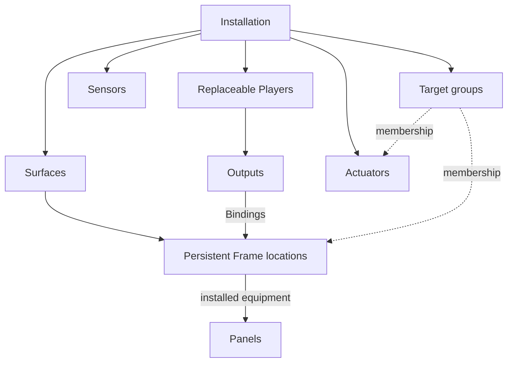
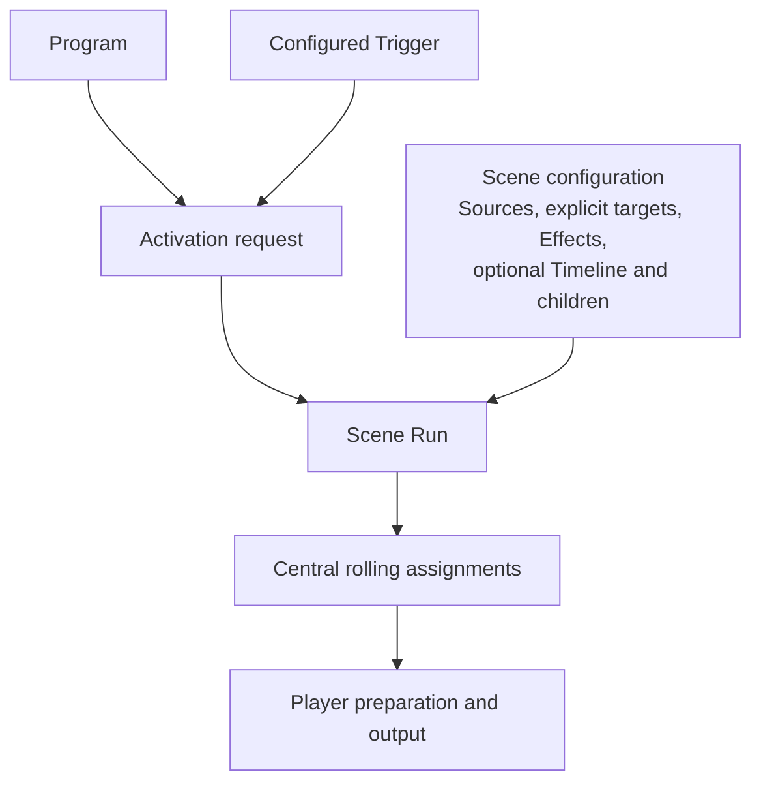

# Photo Wall requirements

**Status: Requirements.** This document defines the product model, terminology, and behavioral constraints. The [architecture](architecture.md) and [execution contract](execution-contract.md) describe the proposed implementation. Open policy choices are tracked in [design decisions](design-decisions.md); delivery scope and acceptance evidence belong in the [implementation plan](implementation-plan.md) and [validation guide](validation.md).

Mandatory development requirements are defined in [CONTRIBUTING](../CONTRIBUTING.md), including [recursive development and agent orchestration](../CONTRIBUTING.md#recursive-development-and-agent-orchestration).

## Purpose and experience

Present physically framed displays as a coherent, centrally managed media environment. Ordinary operation should feel like a collection of photographs, with restrained video and occasional coordinated effects. Stillness, appropriate content, and continuity are part of the experience.

Immich remains the system of record for media and library metadata. Photo Wall owns installation configuration, presentation policy, scheduling, spatial assignment, calibration, and execution. It may retain wall-specific configuration and display history without becoming a second general-purpose photo library.

## Central media boundary

Players must be completely Immich-unaware. The central show system supplies all Player media and playback instructions, owns every Immich interaction, and translates upstream assets into upstream-neutral Player asset identities. Players must have no Immich-specific SDK, integration logic, queries, credentials, or upstream configuration, and must never contact Immich directly, including through a media redirect.

This boundary applies to Player software, configuration, protocols, and network access. It does not require stripping embedded metadata from the supplied media bytes.

## Views and responsibilities

Three complementary views describe the system:

| View | Describes |
|---|---|
| **Physical installation** | Presentation locations, their geometry, and the equipment assigned to serve them. |
| **Experience** | Scene configurations, media sources, composition, and activation policy. |
| **Execution and deployment** | Running instances, central planning, and local preparation and output. |

Equipment management and presentation are distinct responsibilities. Server/client describes where those responsibilities execute.

| Responsibility | Central server | Local Player |
|---|---|---|
| **Equipment management** | Inventory, topology, durable configuration, calibration management, enrollment, and health monitoring. | Observe connected equipment, apply configuration, and report condition. |
| **Presentation** | Evaluate sources, enforce compatibility, plan asset-to-Frame assignments, and coordinate execution. | Fetch and prepare assigned content, render it, execute timing, and report readiness and output state. |

**Control Plane** names central equipment management. **Showrunner / Scheduler** names central presentation management and planning. **Player Agent** names software on a Player, serving both responsibilities locally. These names identify responsibilities and software, not three peer conceptual layers. Control Plane and Showrunner can be domains of one central application.

Time synchronization, asset delivery, security, observability, and external integrations support both responsibilities. The central system determines intended configuration and experience; Players reconcile and execute locally. Normal rendering distributes media and Scene instructions to Players, which produce their own output pixels.

## Installation model

| Term | Meaning and boundary |
|---|---|
| **Installation** | Managed physical environment. It can span several walls in a room and include lights and other equipment. It owns installation policy and timezone. |
| **Wall / Surface** | Physical surface within an Installation, with its own coordinate system for locating Frames. One flat coordinate system is not assumed for the whole room. |
| **Frame** | Named, persistent presentation location on a Surface, describing its intended aperture and orientation. Its identity belongs to the location. |
| **Player** | Replaceable embedded computing appliance serving one or more Frames. Raspberry Pi is the initial implementation target. Its operational identity supports enrollment and diagnostics; it does not define a Frame. |
| **Panel** | Actual display hardware at a Frame location, including physical dimensions, resolution, and capabilities. |
| **Output** | Individual rendering/display connection exposed by a Player, initially HDMI. |
| **Binding** | Current assignment of a Player's Output to a Frame. Moving equipment to another location makes it serve that destination Frame. |
| **Target group** | Explicit or rule-defined set of Frames and/or Actuators. Groups may overlap and span Surfaces. **FrameGroup** denotes a group containing only Frames. Execution resolves concrete participants. |
| **Sensor** | Normalized environmental observation or discrete event source, such as illuminance, occupancy, or motion. |
| **Actuator** | Logical controllable capability, such as a light, relay, or display power control. Scenes address the capability rather than vendor commands. |

Supporting vocabulary:

- **Calibration** maps intended content into physical apertures and output pixels, including geometric and photometric correction. Placement and aperture geometry persist independently of equipment. Equipment-dependent calibration may need revalidation after replacement. Ambient correction is separate from baseline calibration.
- **Frame display profile** combines aperture geometry, physical size, resolution, and capabilities of assigned equipment.
- **Compatibility policy** defines hard media-suitability rules for a Frame. It need not become a separate user-facing object.
- **Peripheral** is the supporting-equipment abstraction beneath Sensors and Actuators. **Power Domain** describes shared power dependencies and controls.

Replacing or reimaging a Player must not require reconstructing its Frames. The initial system should support one or two independent Outputs per Player.

Scene target groups contain the outputs they affect: Frames and Actuators. Sensors provide input; they are not presentation outputs.

### Player provisioning

Players must be plug-and-play. In a centrally prepared deployment providing PXE, service discovery, and enrollment trust, a suitable network-boot-capable device receives the common appliance image over PXE, boots, connects automatically, registers, and becomes visible in the central Control Plane. No manual per-device step may be required before that initial appearance. After imaging, the Player needs no local endpoint or credential entry, SSH session, configuration-file edit, or other device-local setup.

Automatic registration and visibility precede Frame binding. They do not require automatic Frame assignment or playback on an unknown device; authorization to serve Frames remains separate. Discovery and trust mechanisms, image construction, and local-versus-network runtime storage remain implementation choices within this automatic provisioning path.

## Experience model

| Term | Meaning and boundary |
|---|---|
| **AssetSource** | Saved upstream Immich query defining a live candidate media pool. It describes media eligibility, not a fixed collection to download. |
| **Scene** | Reusable presentation configuration: sources or authored assignments, selection and playback preferences, explicit participants, Effects/transitions, an optional Timeline, and optional child Scenes. |
| **Scene Run** | Particular execution of a Scene configuration. A Run can last seconds or all of December, receiving evolving assignments while retaining its authored configuration. |
| **Program** | Scheduling policy determining when selected Scenes should be active, including recurrence, defaults, and activation settings. Sources and playback preferences belong to Scenes. |
| **Trigger** | Event or condition whose configured handling requests activation, such as a button press or motion event. Programs can also produce requests from schedules. |
| **Activation request** | Particular launch circumstances: requested Scene, timing, priority, activation/stacking intent, and explicit force intent. This need not be a prominent user-facing resource. |
| **Effect / Transition** | Primitive operation, such as an entrance, exit, fade, compositing adjustment, or lighting effect. A visual primitive does not require a separate Scene. |
| **Timeline** | Optional relative timing of media, Effects, and cues within a Scene. A parent can coordinate children; ordinary playback need not be fully scripted. |

**Presentation** describes output rather than a separate domain entity. Nested Scenes provide authored composition. A **presentation variant** is a playback-compatible version of a media asset.

## Composition and spatial authoring

A Scene may contain its own behavior, child Scenes, or both. Reusing a configuration does not imply sharing an active execution. Nesting supports meaningful reusable behavior; fades and other primitives normally remain Effects in the containing Scene.

Every target intentionally affected by a Scene or its children must participate explicitly. A parent's effective target set includes its own and its children's targets. If two portraits animate while six surrounding Frames go dark, all eight participate, with appropriate behavior assigned to each. Unrelated targets continue their own output.

A Scene must include a light in its target group to control it. Otherwise it expresses no preference for the light's state: there is no implicit off or reset command.

Two media-assignment cases are supported:

| Case | Assignment |
|---|---|
| **Dynamic slideshow** | The scheduler chooses media from live Scene sources using compatibility constraints and selection preferences. |
| **Spatially authored behavior** | The author binds roles and media, or tightly constrained sources, to specific Frame locations based on physical relationships. |

For talking portraits, Frame locations and corresponding videos are explicitly chosen so eyelines, facing directions, and relative positions work together. Nesting preserves these bindings. Automatic relocation is not assumed. Replacing a Pi preserves authored locations; changing physical geometry may invalidate the choreography.

Calibration determines how content appears correctly within an aperture. Spatial authoring determines which content belongs at which location so the experience works as a whole.

## Live media, compatibility, and preparation

Scene configuration owns its AssetSource references, selection preferences, durations, and transitions. A Christmas Scene therefore uses its holiday source even when manually activated in July. A December Program schedules that Scene.

Immich query results can change asynchronously during a Run. New holiday photos should enter upcoming December playback without restarting the Scene. Authored configuration edits default to the next Run. Editing a saved query is a configuration change; new results matching that query are live data.

**Enforce compatibility before preference-based selection.** Frames may differ in aspect ratio, physical size, resolution, and playback capability.

- Landscape photos must never be assigned to portrait Frames. Cropping does not create an implicit exception.
- A 720p video must never be assigned to a 40-inch Frame. Upscaling does not make an insufficient source qualify.
- Authored assignments must also satisfy compatibility. Artistic relationships add constraints beyond technical suitability.
- Only eligible candidates are ranked by recency, weighting, variety, and other Scene preferences.
- An empty eligible pool retains the last valid still image by default. A Frame with no previous valid still uses a configured fallback. Eligibility rules are not silently relaxed.

The central scheduler continually projects upcoming media, Frame assignments, and intended playback times. Players prepare a configurable rolling lookahead. They do not need to download the whole AssetSource or all of December. The [validation guide](validation.md#proposed-engineering-budgets) records a candidate preparation horizon.

`live candidates → compatibility → central assignments → Player preparation → committed playback`

Future plans remain revisable. Once an assignment is scheduled and secured by its responsible Players, its content is locked for that execution. If upstream media disappears before acquisition, the scheduler attempts a suitable replacement. A dynamic slideshow can choose another eligible asset; spatially authored behavior needs an appropriate authored alternative or its configured fallback.

Players may retain previously used content for reuse and outage fallback. Cache retention is separate from the preparation horizon, and a long-lived Run does not pin every asset it has used. During central or media-source outages, the system should continue according to explicit local fallback policy. Outage duration and recovery behavior remain open design decisions.

## Run behavior

### Progression, visibility, and target control

An overlay can cover output while the underlying Run continues advancing virtually. On release, each target uses the underlying Run's current intended state, including its current video position or lighting transition value. Hidden changes are not replayed. Players can optimize invisible rendering while preserving logical progression and readiness for reveal.

Control is evaluated per target. If an overlay covers a Scene's portraits but omits its lamp, the underlying Scene continues controlling that lamp. If the overlay also takes the lamp, the underlying lighting state advances virtually and regains effect at its current value when control returns. A Scene's cues do not affect targets on which its output is superseded.

### Completion and cancellation

Natural completion waits for the Scene's own work and for children to finish or be cancelled. Cancellation propagates through the selected Run's descendants and does not bubble up to its parent.

A Program's scheduled end requests natural completion: stop starting new playback cycles or child sequences, finish current activity, use the configured outro, then release targets. Preloaded future content does not require additional playback before completion.

### Activation and visibility protection

A Scene can request that participating Frames remain visible together. Visibility protection, priority, and stacking are distinct. Activation requests carry priority and explicit force intent; manual activation does not automatically mean force. Precedence, ties, and protection involving mixed target types require explicit policy.

Repeated activation is configurable. The default is to ignore additional requests while the relevant Scene is active; restart and queue are alternatives. Matching scope, queue limits, and expiry remain open policy choices.

### Black and transparency

Fading to black differs from fading out an overlay. Opaque black continues covering lower output. Reducing overlay opacity reveals what is underneath. Scene Effects/compositing configuration chooses the behavior.

## Reference experiences

| Experience | Required behavior |
|---|---|
| **December slideshow** | One ongoing Run uses a live holiday source, dynamically assigns compatible media, and receives rolling preparation. |
| **Talking portraits** | A Scene binds specific videos to geometrically appropriate Frame locations and coordinates playback. Reuse inside larger Scenes preserves those roles. |
| **Haunted portraits overlay** | Surrounding Frames darken while portraits animate. All affected targets participate explicitly. Underlying playback advances virtually and is revealed at its current state afterward. |
| **Calendar change beneath an overlay** | The overlay runs independently to its natural conclusion. Background scheduling progresses from December to January, and its dissolve reveals the current scheduled background. Transition policy when the outgoing background is still finishing remains open. |
| **Coordinated readiness** | A theatrical effect can wait or be skipped if required participants are unavailable, even after advance caching. Required-versus-optional participation and failure policy determine the outcome. |
| **Good night** | Frames go dark even if an optional goodbye animation cannot play. Optional decoration cannot block the bedtime outcome. Persistent dark-state and wake-up policy remain open. |

## Operations and scope

Operational state—including maintenance, blanking, display power, rebooting, and updates—remains distinct from authored content state. Equipment configuration is centrally managed. Players should boot and recover unattended, avoid exposing operating-system UI on Frames, report health, and follow explicit fallback behavior.

Home Assistant/MQTT provides an integration boundary for requests and state. The central wall system remains authoritative for its installation configuration and experience.

Current Sensor scope covers environmental equipment adaptation and discrete Scene activation. Continuous viewer tracking that modifies an active Scene is outside scope. Several Surfaces and surrounding equipment can belong to one Installation; broader multi-Installation coordination is an open scope decision.

The [design decisions](design-decisions.md) track unresolved arbitration, nested Effects/timing, referenced configuration revisions, calibration adoption, media history accounting, outage recovery, technical interfaces, numerical acceptance targets, and feature scope. These policies must preserve the requirements above. The [validation guide](validation.md) defines candidate budgets and how implementation evidence is collected.
