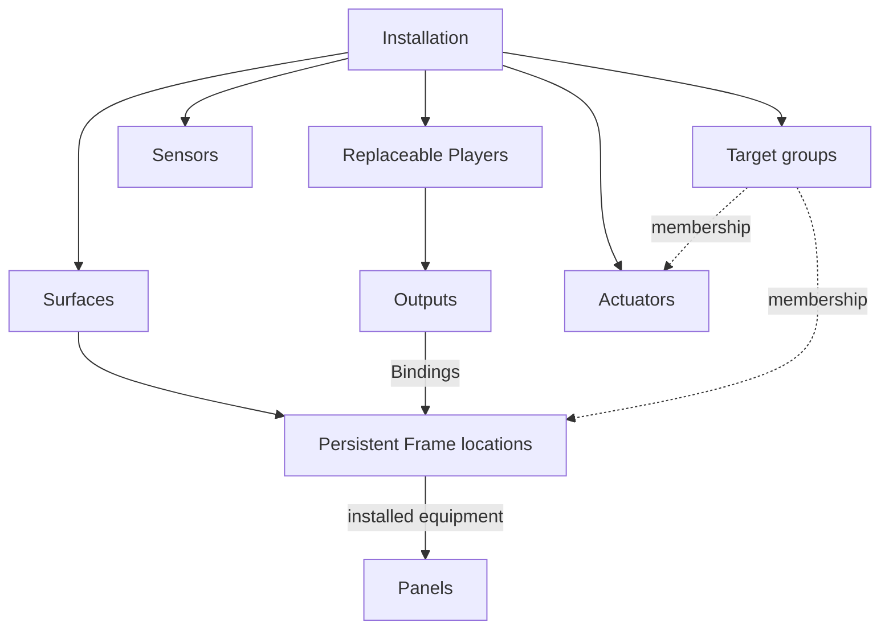
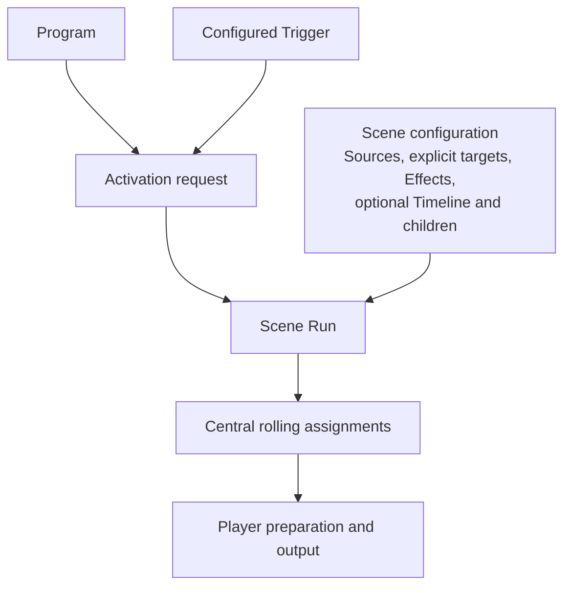

# Photo Wall requirements

**Status: Requirements.** This document defines the product model, terminology, and behavioral constraints. The [architecture](architecture.md) and [execution contract](execution-contract.md) describe the proposed implementation. Open policy choices are tracked in [design decisions](design-decisions.md); delivery scope and acceptance evidence belong in the [implementation plan](implementation-plan.md) and [validation guide](validation.md).

Mandatory development requirements are defined in [CONTRIBUTING](../CONTRIBUTING.md), including [recursive development and agent orchestration](../CONTRIBUTING.md#recursive-development-and-agent-orchestration).

## Purpose and experience

Present physically framed displays as a coherent, centrally managed media environment. Ordinary operation should feel like a collection of photographs, with restrained video and occasional coordinated effects. Stillness, appropriate content, and continuity are part of the experience.

Immich remains the system of record for media and library metadata. Photo Wall owns installation configuration, presentation policy, scheduling, spatial assignment, calibration, and execution. It may retain wall-specific configuration and display history without becoming a second general-purpose photo library.

## Central media boundary

Players must be completely Immich-unaware. The central show system supplies all Player media and playback instructions, owns every Immich interaction, and translates upstream assets into upstream-neutral Player asset identities. Players must have no Immich-specific SDK, integration logic, queries, credentials, or upstream configuration, and must never contact Immich directly, including through a media redirect.

This boundary applies to Player software, configuration, protocols, and network access. It does not require stripping embedded metadata from the supplied media bytes.

## Central authority and stateless Players

[Decision 0006](decisions/0006-central-authority-and-stateless-players.md) records the accepted implementation consequences of this boundary.

All durable Photo Wall state belongs to central components. PostgreSQL owns Installation intent, equipment records and bindings, authored/runtime/planning state, secured assignments, execution coordination, media lifecycle and references, and provisioning/release trials. The central task queue is also a PostgreSQL dependency. Player packages must exclude central persistence and queue dependencies.

The replaceable Player application retains no durable identity, database, execution journal, authoritative cache metadata or independently managed update slot. Each application startup creates fresh session credentials; central issues a new authority epoch and sends current configuration and assignments. Old-session grants must be rejected. A cache is optional, bounded, disposable, and untrusted until exact bytes are validated. Base-owned App Lifecycle may keep boot-scoped, disposable mutation journals and verified app-private roots; Central owns durable desired policy and recovery records across PXE reboots. Loss of local files may delay readiness but must not change centrally secured content or Frame binding.

On the trusted provisioning LAN, central may use serial/MAC and similar observations to recognize returning equipment. These observations are operational matching data, not cryptographic identity and not permission to overwrite operator intent. Recognized equipment automatically recovers its centrally assigned Frames through fresh enrollment. Unknown equipment remains unbound. Replacement requires an explicit central binding change.

Cold boot requires reachable trusted time, provisioning/release, enrollment, control, and media services. A running Player should preserve already authorized output through a temporary outage within its current authority lease. No playback guarantee applies after a cold reboot without central connectivity.

## Failure visibility and recovery

The owner stated U1–U8 on 2026-09-27, added U9 on 2026-09-29, and clarified the layered Player-node and packaging behavior on 2026-09-30. [Decision 0014](decisions/0014-reaching-central-from-every-boot-stage.md#requirements-hard-rules) records the related rules for reaching Central (U3, U7, U8), the deferred U5, and which change delivers the earlier expectations. The [v0.13.0 intake](production-readiness-v0.13.md) tracks implementation of the newer calibration and fleet requirements.

| ID | Requirement |
|---|---|
| U1 | **Never dark by failure.** A failure never leaves a Frame's display dark. At minimum it shows an error page, which is Photo Wall's own rendered page, not operating-system UI. That page lets the owner see that the operating system loaded even though the application layer could not run. Authored darkness stays allowed, such as the [Good night](#reference-experiences) experience, [fading to black](#black-and-transparency), or a dark Scene. U1 applies from the moment the operating system is up. The error page must not depend on the Player package, because provisioning can fail before that package is installed. |
| U2 | **Recovery time.** After a whole-house power restore, every Frame shows photos within a couple of hours. The slowest link is gigabit. |
| U4 | **Media that cannot be fetched.** The base-owned Display Host can keep an operational diagnostic above Player content and show a bounded media fault supplied by the Player; the Player may continue showing its last valid image. Central distinguishes a silent Player application from an unobserved Host Management agent, whether or not the Player is bound to a Frame. |
| U6 | **Error detail.** A Frame shows a short base error page or operational overlay while its display backend works. The Central console shows a detailed, named cause with source and last evidence time. When Central cannot reach a layer, it says when it last heard from that layer; it does not infer a cause or claim visible pixels. |
| U9 | **Live calibration diagnostics.** During an operator-enabled calibration session, Display Host shows raw Output and virtual Frame edges, readable Frame name/ID and position, applied corner coordinates, actual Output mode/resolution, brightness with its source identified, and pending-versus-committed state. Moving a corner updates pending geometry on the physical Player before commit; the console distinguishes a requested preview from one acknowledged as presented by Display Host. Save requires the latest candidate's matching presentation acknowledgment, while actual panel pixels remain a separate physical observation. The diagnostic expires or is disabled independently of authored Scene output. |

U1 remains the absolute product requirement, and the current node proposal does **not yet meet it** for compositor, graphics, kernel, panel, power or pre-display failures. The proposed base DisplayHost covers app and manager failures only after its display stack starts on a connected, working Output. Those other fault classes require a separately designed fallback and physical qualification; they are unresolved requirement gaps, not exceptions or evidence of success.

Assumption, not an owner statement: before the operating system is up, the text stage 1 prints on the screen is enough for U1.

The diagnostic overlay is base-owned operational display state, not authored Scene content in the sense of [progression and visibility](#progression-visibility-and-target-control). Player-supplied measurements retain their provenance and age; software gain is not presented as measured panel brightness.

A connected Output with no Frame binding shows a Photo Wall diagnostic on that
display. It identifies the Output and, after Central has accepted enrollment and
configuration, the Player, so an operator can distinguish a booted, connected
Player from a dark display. It must not claim that content is playing. Binding
the Output removes this diagnostic; authored darkness on a bound Frame remains
valid content.

## Views and responsibilities

Three complementary views describe the system:

| View | Describes |
|---|---|
| **Physical installation** | Presentation locations, their geometry, and the equipment assigned to serve them. |
| **Experience** | Scene configurations, media sources, composition, and activation policy. |
| **Execution and deployment** | Running instances, central planning, and local preparation and output. |

Equipment management and presentation are distinct responsibilities. Server/client describes where those responsibilities execute.

| Responsibility | Central server | Local Player |
|---|---|---|
| **Equipment management** | Inventory, topology, durable configuration, calibration management, enrollment, and health monitoring. | Observe connected equipment, apply configuration, and report condition. |
| **Presentation** | Evaluate sources, enforce compatibility, plan asset-to-Frame assignments, and coordinate execution. | Fetch and prepare assigned content, render it, execute timing, and report readiness and output state. |

**Control Plane** names central equipment management. **Showrunner / Scheduler** names central presentation management and planning. **Player-node software** comprises Host Management, App Lifecycle, Display Host and the replaceable Player Runtime. These names identify responsibilities and software, not three peer conceptual layers. Control Plane and Showrunner can be domains of one central application.

Time synchronization, asset delivery, security, observability, and external integrations support both responsibilities. The central system determines intended configuration and experience; Players reconcile and execute locally. Normal rendering distributes media and Scene instructions to Players, which produce their own output pixels.

## Installation model

| Term | Meaning and boundary |
|---|---|
| **Installation** | Managed physical environment. It can span several walls in a room and include lights and other equipment. It owns installation policy and timezone. |
| **Wall / Surface** | Physical surface within an Installation, with its own coordinate system for locating Frames. One flat coordinate system is not assumed for the whole room. |
| **Frame** | Named, persistent presentation location on a Surface, describing its intended aperture and orientation. Its identity belongs to the location. |
| **Player** | Replaceable embedded computing appliance serving one or more Frames. Raspberry Pi is the initial implementation target. Its operational identity supports enrollment and diagnostics; it does not define a Frame. |
| **Panel** | Actual display hardware at a Frame location, including physical dimensions, resolution, and capabilities. |
| **Output** | Individual rendering/display connection exposed by a Player, initially HDMI. |
| **Binding** | Current assignment of a Player's Output to a Frame. Moving equipment to another location makes it serve that destination Frame. |
| **Target group** | Explicit or rule-defined set of Frames and/or Actuators. Groups may overlap and span Surfaces. **FrameGroup** denotes a group containing only Frames. Execution resolves concrete participants. |
| **Sensor** | Normalized environmental observation or discrete event source, such as illuminance, occupancy, or motion. |
| **Actuator** | Logical controllable capability, such as a light, relay, or display power control. Scenes address the capability rather than vendor commands. |

Supporting vocabulary:

- **Calibration** maps intended content into physical apertures and output pixels, including geometric and photometric correction. Placement and aperture geometry persist independently of equipment. Equipment-dependent calibration may need revalidation after replacement. Ambient correction is separate from baseline calibration.
- **Frame display profile** combines aperture geometry, physical size, resolution, and capabilities of assigned equipment.
- An operator can correct a Frame's declared display profile when equipment changes without deleting the persistent Frame or losing its authored Scene targets. A changed profile requires calibration revalidation before the new equipment is considered ready.
- **Compatibility policy** defines hard media-suitability rules for a Frame. It need not become a separate user-facing object.
- **Peripheral** is the supporting-equipment abstraction beneath Sensors and Actuators. **Power Domain** describes shared power dependencies and controls.

Replacing or reimaging a Player must not require reconstructing its Frames. The initial system should support one or two independent Outputs per Player.

```mermaid
flowchart TD
    I[Installation] --> S[Surfaces]
    S --> F[Persistent Frame locations]
    I --> P[Replaceable Players]
    P --> O[Outputs]
    O -->|Bindings| F
    F -->|installed equipment| D[Panels]
    I --> SE[Sensors]
    I --> A[Actuators]
    I --> G[Target groups]
    G -. membership .-> F
    G -. membership .-> A
```

Scene target groups contain the outputs they affect: Frames and Actuators. Sensors provide input; they are not presentation outputs.

### Player provisioning

Players must be plug-and-play. In a centrally prepared deployment providing PXE, service discovery, and enrollment trust, a suitable network-boot-capable device receives the common bootstrap over PXE, obtains its centrally selected signed root image, boots it in RAM, creates fresh session credentials, registers, and becomes visible in the central Control Plane. No writable persistent Player volume or manual per-device step may be required before that appearance. The Player needs no local endpoint or credential entry, SSH session, configuration-file edit, or other device-local setup.

Automatic registration and visibility precede Frame binding for unknown equipment. Recognized returning equipment receives its existing centrally assigned Frames; an unknown or replacement device receives no automatic Frame authority. Release selection, trial consumption, promotion, and rollback records remain central.

The common base image provides independent Host Management, App Lifecycle and Display Host capabilities beneath the replaceable Player application. Host Management reports its own boot, reachability, bounded OS/hardware statistics and faults while App Lifecycle or Player Runtime is absent, upgrading, restarting or incompatible; it also receives authorized reboot commands independently of those processes. App Lifecycle reconciles a centrally selected exact Player release and reports installation and process facts. Display Host owns the base diagnostic and operational overlay above app content. Central shows these observations separately with provenance and age; a host report grants no app, Frame, Run or Output authority. On the owner-approved trusted provisioning LAN, a fresh serial-correlated boot claim may receive separately scoped reboot and app-effect sessions. That is operational command trust, not proof of physical Pi identity; observation remains command-free. An operator can select the desired Player release centrally and see desired, installed, running and outcome states without local setup. A Player release remains a Debian package that declares recursive dependencies; its complete dependency closure is resolved and sealed before release as an app-private environment. Node-time installation cannot run package scripts against or mutate Host Management. A new host ABI requirement needs an explicitly compatible base image. The [node domain model](player-node-domain-model.md) owns the proposed technical contract and its qualification limits.

### Supported Player hardware

The supported minimum is a **Raspberry Pi 5 with 4 GB of memory or more** (owner-confirmed 2026-10-03). A smaller board is refused at boot, before any Player release is prepared on it, and the refusal is reported to Central with the memory the smallest supported class needs and the memory the box has. A refused box never plays content, and its refusal is visible centrally without local access. The memory classes and their limits are owned by the [node domain model](player-node-domain-model.md#memory-classes-and-the-node-store-2026-10-03).

## Experience model

| Term | Meaning and boundary |
|---|---|
| **AssetSource** | Saved upstream Immich query defining a live candidate media pool. It describes media eligibility, not a fixed collection to download. |
| **Scene** | Reusable presentation configuration: sources or authored assignments, selection and playback preferences, explicit participants, Effects/transitions, an optional Timeline, and optional child Scenes. |
| **Scene Run** | Particular execution of a Scene configuration. A Run can last seconds or all of December, receiving evolving assignments while retaining its authored configuration. |
| **Program** | Scheduling policy determining when selected Scenes should be active, including recurrence, defaults, and activation settings. Sources and playback preferences belong to Scenes. |
| **Trigger** | Event or condition whose configured handling requests activation, such as a button press or motion event. Programs can also produce requests from schedules. |
| **Activation request** | Particular launch circumstances: requested Scene, timing, priority, activation/stacking intent, and explicit force intent. This need not be a prominent user-facing resource. |
| **Effect / Transition** | Primitive operation, such as an entrance, exit, fade, compositing adjustment, or lighting effect. A visual primitive does not require a separate Scene. |
| **Timeline** | Optional relative timing of media, Effects, and cues within a Scene. A parent can coordinate children; ordinary playback need not be fully scripted. |

**Presentation** describes output rather than a separate domain entity. Nested Scenes provide authored composition. A **presentation variant** is a playback-compatible version of a media asset.

```mermaid
flowchart TD
    P[Program] --> R[Activation request]
    T[Configured Trigger] --> R
    R --> X[Scene Run]
    C["Scene configuration<br/>Sources, explicit targets, Effects,<br/>optional Timeline and children"] --> X
    X --> PL[Central rolling assignments]
    PL --> PA[Player preparation and output]
```

## Composition and spatial authoring

A Scene may contain its own behavior, child Scenes, or both. Reusing a configuration does not imply sharing an active execution. Nesting supports meaningful reusable behavior; fades and other primitives normally remain Effects in the containing Scene.

Every target intentionally affected by a Scene or its children must participate explicitly. A parent's effective target set includes its own and its children's targets. If two portraits animate while six surrounding Frames go dark, all eight participate, with appropriate behavior assigned to each. Unrelated targets continue their own output.

A Scene must include a light in its target group to control it. Otherwise it expresses no preference for the light's state: there is no implicit off or reset command.

Two media-assignment cases are supported:

| Case | Assignment |
|---|---|
| **Dynamic slideshow** | The scheduler chooses media from live Scene sources using compatibility constraints and selection preferences. |
| **Spatially authored behavior** | The author binds roles and media, or tightly constrained sources, to specific Frame locations based on physical relationships. |

For talking portraits, Frame locations and corresponding videos are explicitly chosen so eyelines, facing directions, and relative positions work together. Nesting preserves these bindings. Automatic relocation is not assumed. Replacing a Pi preserves authored locations; changing physical geometry may invalidate the choreography.

Calibration determines how content appears correctly within an aperture. Spatial authoring determines which content belongs at which location so the experience works as a whole.

## Live media, compatibility, and preparation

Scene configuration owns its AssetSource references, selection preferences, durations, and transitions. A Christmas Scene therefore uses its holiday source even when manually activated in July. A December Program schedules that Scene.

Immich query results can change asynchronously during a Run. New holiday photos should enter upcoming December playback without restarting the Scene. Authored configuration edits default to the next Run. Editing a saved query is a configuration change; new results matching that query are live data.

An AssetSource has no fixed upstream membership ceiling. Central discovers and revisits large or changing matches incrementally, with bounded requests, work, preparation, and storage. A large result is not itself an incompatible Source; incomplete discovery, upstream failure, and a truly empty result remain distinct. Before entering filters, the operator chooses the upstream connection and can inspect actual matching photos/videos through a paged operator view before and after saving. These views do not put upstream credentials or direct upstream access in Players.

**Enforce compatibility before preference-based selection.** Frames may differ in aspect ratio, physical size, resolution, and playback capability.

- Landscape photos must never be assigned to portrait Frames. Cropping does not create an implicit exception.
- A 720p video must never be assigned to a 40-inch Frame. Upscaling does not make an insufficient source qualify.
- Authored assignments must also satisfy compatibility. Artistic relationships add constraints beyond technical suitability.
- Only eligible candidates are ranked by recency, weighting, variety, and other Scene preferences.
- An empty eligible pool retains the last valid still image by default. A Frame with no previous valid still uses a configured fallback. Eligibility rules are not silently relaxed.

The central scheduler continually projects upcoming media, Frame assignments, and intended playback times. Players prepare a configurable rolling lookahead. They do not need to download the whole AssetSource or all of December. The [validation guide](validation.md#proposed-engineering-budgets) records a candidate preparation horizon.

`live candidates → compatibility → central assignments → Player preparation → committed playback`

Future plans remain revisable. Once an assignment is scheduled and secured by its responsible Players, its content is locked for that execution. If upstream media disappears before acquisition, the scheduler attempts a suitable replacement. A dynamic slideshow can choose another eligible asset; spatially authored behavior needs an appropriate authored alternative or its configured fallback.

Players may reuse surviving content-addressed files only after validating them against a current central assignment. Cache retention is separate from the preparation horizon, and a long-lived Run does not pin every asset it has used. Cache loss invalidates readiness and triggers reacquisition without rerolling secured content. During a running-process outage, already authorized output may continue within its lease; cold-boot recovery depends on central services.

## Run behavior

### Progression, visibility, and target control

An overlay can cover output while the underlying Run continues advancing virtually. On release, each target uses the underlying Run's current intended state, including its current video position or lighting transition value. Hidden changes are not replayed. Players can optimize invisible rendering while preserving logical progression and readiness for reveal.

Control is evaluated per target. If an overlay covers a Scene's portraits but omits its lamp, the underlying Scene continues controlling that lamp. If the overlay also takes the lamp, the underlying lighting state advances virtually and regains effect at its current value when control returns. A Scene's cues do not affect targets on which its output is superseded.

### Completion and cancellation

Natural completion waits for the Scene's own work and for children to finish or be cancelled. Cancellation propagates through the selected Run's descendants and does not bubble up to its parent.

A Program's scheduled end requests natural completion: stop starting new playback cycles or child sequences, finish current activity, use the configured outro, then release targets. Preloaded future content does not require additional playback before completion.

### Activation and visibility protection

A Scene can request that participating Frames remain visible together. Visibility protection, priority, and stacking are distinct. Activation requests carry priority and explicit force intent; manual activation does not automatically mean force. Precedence, ties, and protection involving mixed target types require explicit policy.

Repeated activation is configurable. The default is to ignore additional requests while the relevant Scene is active; restart and queue are alternatives. Matching scope, queue limits, and expiry remain open policy choices.

### Black and transparency

Fading to black differs from fading out an overlay. Opaque black continues covering lower output. Reducing overlay opacity reveals what is underneath. Scene Effects/compositing configuration chooses the behavior.

## Reference experiences

| Experience | Required behavior |
|---|---|
| **December slideshow** | One ongoing Run uses a live holiday source, dynamically assigns compatible media, and receives rolling preparation. |
| **Talking portraits** | A Scene binds specific videos to geometrically appropriate Frame locations and coordinates playback. Reuse inside larger Scenes preserves those roles. |
| **Haunted portraits overlay** | Surrounding Frames darken while portraits animate. All affected targets participate explicitly. Underlying playback advances virtually and is revealed at its current state afterward. |
| **Calendar change beneath an overlay** | The overlay runs independently to its natural conclusion. Background scheduling progresses from December to January, and its dissolve reveals the current scheduled background. Transition policy when the outgoing background is still finishing remains open. |
| **Coordinated readiness** | A theatrical effect can wait or be skipped if required participants are unavailable, even after advance caching. Required-versus-optional participation and failure policy determine the outcome. |
| **Good night** | Frames go dark even if an optional goodbye animation cannot play. Optional decoration cannot block the bedtime outcome. Persistent dark-state and wake-up policy: asked on 2026-10-09, the owner liked a native power schedule ([operator experience](#operator-experience)); the proposed design is the [Power lane](operator-console-design.md#7-power). |

## Operations and scope

Operational state—including maintenance, blanking, display power, rebooting, and releases—remains distinct from authored content state. Equipment configuration and accepted/candidate release policy are centrally managed. An authorized operator-requested reboot is dispatched immediately, including during an active Run; it does not wait for Runtime withdrawal or Actuator safe-state acknowledgment. Central records the request; an observed interruption marks this Player's Output interrupted while the broader Run and its other Frames/Actuators continue under their existing authority. Runtime reconciles afterward without an implied command to those other participants. Command receipt, independently reported reboot initiation, and a later observed boot are distinct facts. Initiation may have a non-command trigger; reporting it does not select an automatic reboot policy. Lost communication alone does not prove output interruption. Application replacements prepare in the background within available headroom and preserve healthy playback until authorized withdrawal; staging an update alone must not cover the current presentation. Command receipt is not proof of a completed reboot. Candidate release trials require matching-boot/session evidence before promotion; automatic recovery reboot triggers remain a separate decision. Players should recover unattended within the selected recovery policy, avoid exposing operating-system UI on Frames, and report health including clock-probe diagnostics.

Home Assistant/MQTT provides an integration boundary for requests and state. The central wall system remains authoritative for its installation configuration and experience.

Current Sensor scope covers environmental equipment adaptation and discrete Scene activation. Continuous viewer tracking that modifies an active Scene is outside scope. Several Surfaces and surrounding equipment can belong to one Installation; broader multi-Installation coordination is an open scope decision.

The [design decisions](design-decisions.md) track unresolved arbitration, nested Effects/timing, referenced configuration revisions, calibration adoption, media history accounting, outage recovery, technical interfaces, numerical acceptance targets, and feature scope. These policies must preserve the requirements above. The [validation guide](validation.md) defines candidate budgets and how implementation evidence is collected.

## Operator experience

The owner said these on 2026-10-09 (chat) while reviewing the operator console. They are kept in his words, with the question each answered; where he wrote "could", "hoping" or "consider", that is how strongly they bind. The proposed design is the [operator console design](operator-console-design.md), its decisions are [0019](decisions/0019-first-principles-console.md), and the [roadmap](roadmap.md) orders the work.

| Context | The owner's words | What it asks of Photo Wall |
|---|---|---|
| His broadest ask, unprompted | "Central needs another UI pass to make sure that all of the features are being exposed on the UI." | The console exposes every feature Photo Wall has. |
| Unprompted, in the same message | "I cant find some of the simple config knobs, like how do i set the visible frame position on a display? how do i control the CEC power? how do i change the brightness and contrast?" | A Frame's visible position on its display, display power and brightness and contrast can be found and set in the console. |
| Asked how Night off should work (a power window, or a dark Scene that turns displays off) | "I like the idea of a native power schedule, yeah. But I also want home automation inputs, so also consider how this system might be exposed to home assistant." | He likes a native power schedule. He wants home-automation inputs, and asks that exposing the system (not only display power) to Home Assistant be considered. |
| Asked whether power is its own concept or part of Scenes | "I meant power as a unique concept, but it could go either way. Or both." | He meant power as its own concept; either way, or both, could work. |
| Asked whether a display's hardware settings should follow it when it moves to another Frame | "Not all displays are TVs; some are just LCD or OLED panels. But to your question: yes, the display hardware settings could remain consistent to where the panel moves." | Not every display is a TV. Display hardware settings could follow the panel. |
| Asked whether brightness should drive the display hardware or only adjust the picture | "As much as possible. The test pi is not connected to a TV — it's a portable monitor" | Control the display hardware as much as possible; the test display is a portable monitor. |
| Asked who wins between the power schedule, Home Assistant and a person | "I don't know. I'm hoping for configuration options built in sensible defaults" | He does not know; he hopes for configuration options with sensible defaults. |

Display power stays operational state under [operations and scope](#operations-and-scope). The Power lane, the hold rule, the guard defaults and Home Assistant through MQTT discovery are design choices, not owner statements.
